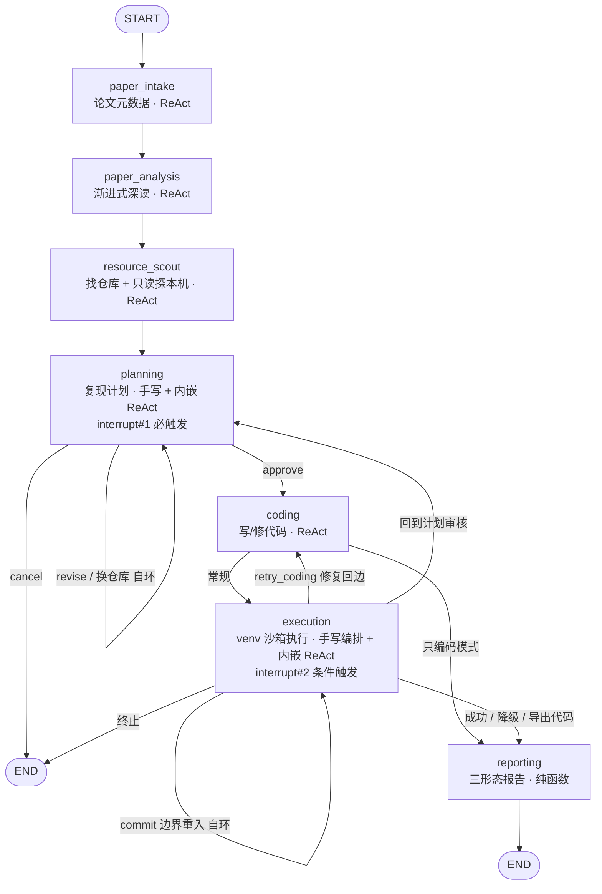

# Auto-Reproduction · 论文自动复现系统

> 给定一个 arXiv ID，系统自动完成：读论文 → 找官方仓库 → 探测本机环境 → 生成复现计划（**人工审核**）→ 写代码 → 沙箱执行 → 失败自动修复 → 出复现报告。

技术形态是 **静态流水线骨架 + 节点内 ReAct agent**：主图用 LangGraph 编排 7 个节点与条件边，保证流程可控、可断点续跑；每个节点内部是一个独立的 ReAct 循环，让 LLM 自主决定调哪个工具、何时收敛。**确定性的部分交给图，不确定性的部分交给 agent。**

| | |
|---|---|
| 主图节点 | 7 个（含 2 条修复回边 + 3 处人在回路中断） |
| 工具层 | 6 个工具模块（论文读取 / git / 代码读写 / 命令自验 / 只读环境探测 / 用户交互） |
| 生产代码 | `core/` + `sandbox/` + `ui/` 约 1.8 万行 |
| 测试代码 | `tests/` 约 5.9 万行，**2200+ 条非 e2e 用例** |
| 过程文档 | 7 个 Sprint × (PRD + 架构 + 开发计划) + 75 份测试执行报告 |

---

## 流水线



- **interrupt#1**（`planning`）：必定触发。用户审核 / 修改计划、更换候选仓库、切「只编码不执行」、取消。
- **interrupt#2**（`execution`）：仅在修复循环触顶 / 错误不可自动修复 / 预算耗尽时触发，用户三选一——导出代码包 + 诊断报告 / 回到计划审核重订 / 终止。
- **interrupt#3**（`request_user_input` 工具）：coding、execution 两个 agent 缺凭证或缺参数时**就地问用户**，UI 收集后 `Command(resume=...)` 继续。

---

## 架构亮点

**1 · 人在回路不是弹窗，是图的一等公民**
三处中断全部走 LangGraph `interrupt()`，中断点天然是 checkpoint 边界——关掉浏览器、进程重启都能从原地续跑。`planning` 的 revise / switch_repo 走**自环边**而非计数器硬上限，用「interrupt 暂停 + 全局预算 + 用户主动取消」三重自然兜底。

**2 · coding ↔ execution 修复循环：松耦合双 agent，通信走结构化 state 而非共享上下文**
两者是主图上两个独立节点，靠条件边构成循环，**不共享子图对话历史、无 scratchpad**。execution 把错误分类（syntax / import / dependency / path / runtime / no_metrics）、指标解析结果、每轮完整日志的**文件路径**单点写回 `GlobalState`；coder 下一回合用 `read_code_file` 自读真实报错，并拿到一份 `fix_history_digest`（历轮「我以为错在哪 / 真错日志说什么 / 改了哪些文件」的五元组摘要）——解决 agent 每轮从失忆起步、反复套同一无效改法的问题。

**3 · 重跑幂等：commit 边界 + self-loop 重入**
中断点在节点函数体**内部**（而非 LangGraph 的 `interrupt_before/after` 节点边界），意味着 resume 会重跑整个节点函数——沙箱副作用会执行两次。解法是两段式：首次失败先落盘结果并置 `_dev_loop_route="await_dev_loop_interrupt"` 就 return（跨过 checkpoint 边界），主图 self-loop 重入后由 guard 跳过沙箱、才真正 `interrupt()`。**这条 self-loop 是 interrupt#2 的命门，漏接则第二个中断永不触发**，已在 `core/graph.py::_route_after_execution` 的 docstring 中写死为强交接契约。

**4 · Prompt Cache 前缀稳定治理（省钱且可验证）**
ReAct 多轮交互中输入 token 占成本主导。工程约束：system prompt 主体导出为常量、**不许拼进任何论文级动态变量**，动态上下文放到尾部独立段落并以 `json.dumps(..., sort_keys=True, ensure_ascii=False)` 渲染；工具返回文本禁止携带时间戳 / 随机 id / 临时绝对路径，截断标记用固定字符串——保证同一论文每轮请求前缀**字节级幂等**。配套有「两篇不同论文的 system prompt 主体字节一致」的断言用例和命中率基线守门脚本。

**5 · 预算是硬上限，耗尽要升级给人，而不是静默降级**
三层预算：单节点 ReAct 轮次 / 修复循环子预算 `MAX_DEV_LOOP_LLM_CALLS=120` / 单任务总预算 `MAX_TOTAL_LLM_CALLS=240`（强约束 120 < 240）。曾经有个 PRD 级的设计写反——预算耗尽时代码在进入任何中断判定**之前**就 return 走静默降级，即「反复失败到山穷水尽」这个最该问人的场景反而从不问人。Sprint 7 把它并入 interrupt#2 三态，并**明确拒绝**新增「追加预算」第四态（那会把硬上限变成可协商的）。同期还补了单轮刹车：子图入口把「本轮可烧轮次」先扣掉跨回合已累计的子预算，防止单轮一口气烧穿子上限。

**6 · 只读环境探测：让规划基于实测事实，而不是模型的想象**
`resource_scout` 在给出仓库结论前**必做**一步本机探测（`probe_environment`，整条命令允许清单 15 条 + 超时 + 返回字节上限，机制性拒绝一切写操作 / 联网下载 / 通用解释器执行）。探到的事实经 `GlobalState.local_env_facts` 单键直达 planning 上下文。真跑实证：改造前计划里凭空写「建议 32GB 内存」，改造后变成「本机实测总内存 22Gi，可用约 10Gi」——与 `free -h` 逐字对得上；探不到的维度必须写「未探测 / 未知」，禁止编造。

**7 · 诚实性防线：防的是「假成功」，不是「失败」**
系统最危险的失败形态不是跑不通，而是**跑通了但结果是假的**。为此有三道纯规则（零 LLM、零 state 依赖）的确定性检查：`core/honesty_audit.py` 扫生成代码的答案泄漏 / 硬编码分数 / 常量结局；`core/plan_checks.py` 做计划自洽交叉检查（声称要处理数据但执行步骤里一步数据操作都没有 → 警示）；报告侧对「缩小实验规模」等标注强制降档，**不得评为科学复现**。所有检查只降档 + 标注，绝不阻断流程。

---

## 工程方法论

这部分比功能本身更能说明项目状态。每一个需求都走完整链路，四个角色分工且边界强制：

```
产品经理 → PRD (docs/sprint{N}/prd.md)          需求 + 验收标准 AC + 假设 + 开放问题
   ↓
架构师   → 架构 (docs/sprint{N}/architecture.md)  裁决开放问题 + 接口 + 改动点清单
   ↓
开发     → 开发计划 (docs/sprint{N}/dev-plan.md)  分批次任务 + 自测检查点 CP
   ↓
测试     → 测试报告 (docs/sprint{N}/test-reports/) AC 逐条闭合 + 全量回归账目对平
```

落地纪律（都是踩过坑之后加的）：

- **验收标准必须「验红」。** 写完断言不算完——必须把被测的那处改动故意注掉一次，确认断言**真的会变红**，再改回来。防的是「守门写了但根本守不住」的假绿。项目里被标为「命门」的断言要求逐环验红（每断开一环各验一次）。
- **回归账目必须精确对平。** 每批交付都以上一批的绿灯数为基线，新增用例数与增量精确闭合、零退化（如最近一批：基线 2103 → 交付 2218，+115 对平）。
- **LLM 服从度类的 bug，单次跑绿不算修好。** 复现率 ≥50% 要连跑 3 次全绿，10%~50% 要连跑 5 次全绿且含全量回归。
- **关键字段不能只信 LLM 的结构化输出。** 核心字段一律从 ReAct 的工具调用历史（ToolMessage）确定性回填兜底，回填失败要打 WARNING——曾有一个 bug 因为工具结果用了 `str(dict)`（Python repr，单引号）而非 `json.dumps`，导致下游 `json.loads` 永远失败、回填静默失效，但 LLM 又「看得懂」内容，查了两轮才定位。
- **默认禁跑真实 e2e。** `pytest.ini` 的 `addopts` 写死 `-m "not e2e"`，跑真链路要显式 `-m e2e` 且需人工授权（真跑会消耗论文 API 日配额）。
- **进度、决策、踩坑全部落 `docs/TODO.md`。** 包括「文档写了但代码其实没有」这类自查结论，逐条注明核实方式（文件行号或 commit hash）。

---

## 快速开始

需要 Python >= 3.10（开发环境为 3.11）。

```bash
# 1. 建虚拟环境并装依赖
python -m venv .venv
.venv/bin/pip install -r requirements.txt

# 2. 论文读取 SDK：pip 包，或用仓库内的本地副本 editable 安装
.venv/bin/pip install "deepxiv-sdk>=0.2.5"
# 或：.venv/bin/pip install -e ./deepxiv_sdk_repo

# 3. 在项目根目录建 .env，按下表填入变量（.env 已 gitignore）

# 4. 启动 Web 界面
.venv/bin/streamlit run app.py
```

### 环境变量

在项目根目录建 `.env`（已在 `.gitignore` 中，不会进版本控制）。**下面只列变量名，值请自行填写。**

| 变量名 | 必需 | 说明 |
|---|---|---|
| `LLM_API_KEY` | 是 | OpenAI 兼容接口的 API Key |
| `DEEPXIV_TOKEN` | 是 | 论文读取 SDK 的 token |
| `LLM_BASE_URL` | 否 | 不填用 `config.py::DEFAULT_LLM_BASE_URL` |
| `LLM_MODEL` | 否 | 不填用 `config.py::DEFAULT_LLM_MODEL` |
| `LLM_ENABLE_PROMPT_CACHE` | 否 | 默认 `true` |
| `LANGSMITH_TRACING` / `LANGSMITH_API_KEY` / `LANGSMITH_PROJECT` | 否 | 接 LangSmith 看调用链。**三项要齐**——只配 key 而漏了 `LANGSMITH_TRACING=true` 总开关的话，一个字节都不会上报 |

其余可调项（预算上限、各节点 ReAct 轮次、沙箱超时、UI 路由常量）集中在 `config.py`，均为字面量常量，无隐式 env 覆盖。

---

## 项目结构

```
config.py                     全局配置：路径 / 预算常量 / 各节点轮次 / 环境变量读取
app.py                        Streamlit 入口 + GraphController（worker 线程 invoke/resume，主线程只读轮询）
core/
  state.py                    GlobalState 及全部 TypedDict —— 状态定义的唯一权威源
  errors.py                   统一异常层次（Transient / Permanent 二分驱动重试策略）
  graph.py                    主图构建 + 3 组条件路由（planning / coding / execution 出边）
  checkpointer.py             SqliteSaver（WAL 模式，支持主线程读 + worker 线程写并发）
  llm_client.py               OpenAI 兼容客户端：重试 / 结构化输出 / 节点级模型路由
  react_base.py               通用 ReAct 子图（reasoning → tool_executor → budget_check，超预算走 force_finish）
  secrets_store.py            凭证存取（.secrets 0600）+ 全链路脱敏
  activity_stream.py          agent 活动流（callbacks 采集，喂执行监控页）
  honesty_audit.py            诚实性审计：答案泄漏 / 硬编码分数 / 常量结局（纯 AST 规则）
  plan_checks.py              计划自洽交叉检查（纯函数，只警示不阻断）
  nodes/                      7 个节点
  tools/                      deepxiv / git / code_fs / run_command / env_probe / interaction
sandbox/local_venv.py         本地 venv 沙箱：禁 shell=True、进程组隔离、超时杀子树、输出截断、cwd 限定
ui/
  pages/                      6 个页面：论文输入 / 分析进度 / 计划审核 / 执行监控 / 结果报告 / 任务列表
  term_map.py                 术语中文化守门（内部枚举一律不许泄漏到用户可见文案）
tests/                        139 个测试文件
docs/
  technical-architecture.md   全局技术架构（活文档，随代码演进更新）
  product-design-specification.md
  sprint1..7/                 每个 Sprint 的 prd / architecture / dev-plan / test-reports
  TODO.md                     全角色共同维护的进度与决策账本
```

---

## 测试

```bash
# 默认口径（pytest.ini 已写死排除 e2e）
.venv/bin/pytest -q -m "not e2e"

# 排除 Playwright 浏览器用例，跑得更快
.venv/bin/pytest -q -m "not e2e and not browser"

# 只看收集数量
.venv/bin/pytest --collect-only -q -m "not e2e" | tail -3
```

> 注意用 `.venv/bin/pytest`——裸 `pytest` 不在 PATH，裸 `python` 是 Python 2。

三个 marker：`e2e`（真实 LLM + 论文 API，耗配额，默认排除）、`browser`（Playwright 起 Streamlit 子进程）、`sandbox_real`（真建 venv、真 pip install，不耗配额但慢）。

---

## 已知限制

诚实清单，都是磁盘核实过的：

- **沙箱只有本地 venv，Docker 隔离尚未实现。** 架构文档里的远程 Docker 沙箱是 v2 规划，`sandbox/` 下无对应实现。
- **预算按 LLM「调用次数」计，不是 token 数也不是金额。** `estimate_tokens` 已实现但在生产链路上零消费点。token/成本追踪 + observability 是下一个 Sprint 的立项内容。
- **没有复现成功率的跑批数据。** 评测体系（benchmark 论文集 + 分级成功指标 + 逐篇失败归因）三度顺延，尚未立项落地。现有实证是单篇真跑记录，不足以回答「复现成功率多少」。
- **没有 CLI 入口。** 产品设计里的 `auto-repro run/plan/status` 一条都不存在；`scripts/run_paper.py` 会驱动完整主图，但不处理 interrupt，跑到计划审核就停。已决定暂缓（Web 已有完整交互，CLI 属重复建设）。
- **`requirements.txt` 有缺项。** `python-dotenv`（`app.py` 加载 `.env`）和 `streamlit-shadcn-ui`（4 个 UI 页面在用）实际被 import 但未声明。
- **没接静态类型检查。** 类型标注本身到位（全量 TypedDict + 函数签名），但仓库无 `mypy.ini` / `pyproject.toml`，没有检查器把关。
- **一个 Playwright 用例间歇性失败**（`test_plan_review_e2e.py::test_e2e_code_only`）。根因已定位到 Chromium 懒加载的 iframe 未 attach 而点击逻辑不滚动，修法已验证（3/3 稳定），排期未做——非功能缺陷。
- **混沌测试（随机注入异常验证系统不卡死）未做。**

---

## 文档索引

| 想了解 | 看这里 |
|---|---|
| 全局技术架构（节点 / 状态 / 错误处理三层防御 / 预算总控） | `docs/technical-architecture.md` |
| 产品设计（七步流程 / 用户场景 / 交互设计 / MVP 边界） | `docs/product-design-specification.md` |
| 单个 Sprint 的完整链路样本 | `docs/sprint7/`（PRD 的开放问题裁决 + 架构的验红要求写得最全） |
| 当前进度、历史决策、踩过的坑 | `docs/TODO.md` |
| 团队角色分工与边界 | `.claude/agents/`、`AGENTS.md` |
