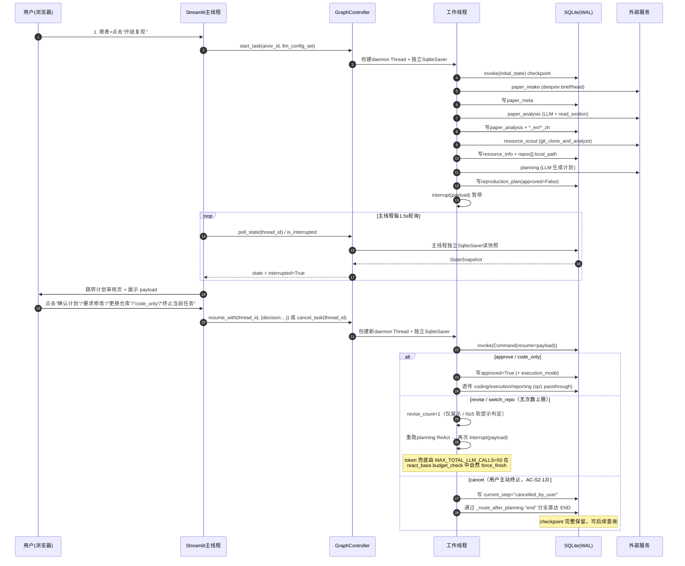
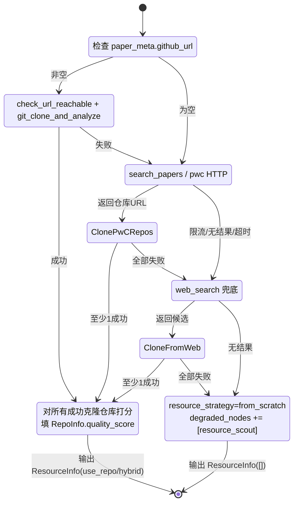

# Sprint 2 核心架构设计文档

**产品名称**：Auto-Reproduction -- 论文自动复现系统
**Sprint**：Sprint 2 -- 核心链路
**版本**：v1.0
**日期**：2026-05-18
**作者**：架构师代理
**状态**：正式版

---

## 目录

1. [Sprint 2 架构总览](#1-sprint-2-架构总览)
2. [模块详细设计](#2-模块详细设计)
3. [数据流图](#3-数据流图)
4. [关键设计决策](#4-关键设计决策)
5. [测试策略](#5-测试策略)
6. [风险与缓解](#6-风险与缓解)

---

## 1. Sprint 2 架构总览

### 1.1 Sprint 2 涉及的新模块与扩展模块

Sprint 2 在 Sprint 1 五层架构（编排层 / 节点层 / ReAct 基础设施层 / 工具层 / 横切关注点）之上新增 UI 层与异步通信层，并扩展节点层和状态定义。新增内容与 Sprint 1 已稳定模块之间保持**单向依赖**：sp2 模块依赖 sp1 模块，sp1 模块不被反向修改（仅 `core/state.py` / `core/nodes/paper_intake.py` / `core/nodes/paper_analysis.py` / `core/graph.py` 四个文件被**追加式扩展**，不破坏既有 168/168 测试基线）。

```
Sprint 2 模块层次图（在 Sprint 1 基础上）

+-------------------------------------------------------------------+
|                 UI 层（Sprint 2 新增）                              |
|   app.py ........................ Streamlit 入口 + GraphController |
|   ui/pages/paper_input.py ....... 页面1：论文输入                   |
|   ui/pages/analysis_progress.py . 页面2：分析进度                   |
|   ui/pages/plan_review.py ....... 页面3：计划审核（核心交互页）       |
|   ui/components/llm_config_form.py  LLM 配置表单                   |
+-------------------------------------------------------------------+
                          |
                          v  GraphController（线程模型 + 轮询接口）
                          |
+-------------------------------------------------------------------+
|                 LangGraph 编排层（扩展）                             |
|   core/graph.py ............... 7 节点（resource_scout / planning |
|                                  接真节点；planning 内置 interrupt） |
|   core/checkpointer.py ........ 沿用 sp1（每线程独立实例 + WAL）     |
+-------------------------------------------------------------------+
                          |
                          v
+-------------------------------------------------------------------+
|                 Agent 节点层（新增 + 扩展）                          |
|   core/nodes/resource_scout.py .. ReAct，max_rounds=10（新增）       |
|   core/nodes/planning.py ........ ReAct + interrupt（新增）          |
|   core/nodes/paper_intake.py .... HumanMessage 通道扩展（追加）       |
|   core/nodes/paper_analysis.py .. HumanMessage 通道扩展（追加）       |
|   core/nodes/{coding,execution,reporting}.py  保留 pass-through      |
+-------------------------------------------------------------------+
                          |
                          v
+-------------------------------------------------------------------+
|                 工具层（新增）                                       |
|   core/tools/git_tools.py ...... git_clone / analyze_local_repo /  |
|                                  check_url_reachable + 3 个工具工厂  |
|   core/tools/deepxiv_tools.py .. 沿用 sp1，新增使用方                 |
+-------------------------------------------------------------------+

横切关注点扩展：
  core/state.py .................. PaperMeta +3 (*_zh) / PaperAnalysis +2 (*_en) /
                                  RepoInfo +1 (local_path)
  config.py ...................... 新增 GIT_CLONE_TIMEOUT / WORKSPACE_REPOS_DIR /
                                  STREAMLIT_POLL_INTERVAL 等常量
```

### 1.2 模块初始化顺序

Sprint 2 在 Sprint 1 7 步初始化基础上追加 UI 与工作线程初始化：

```
（已稳定，sp1 部分）
1. config.py
2. core/state.py + core/errors.py
3. core/checkpointer.py
4. core/llm_client.py + core/tools/deepxiv_tools.py
5. core/react_base.py
6. core/nodes/paper_intake.py + core/nodes/paper_analysis.py
7. core/graph.py

（Sprint 2 新增）
8. core/tools/git_tools.py        # 依赖 errors.py + config.WORKSPACE_DIR
9. core/nodes/resource_scout.py   # 依赖 react_base + deepxiv_tools + git_tools
10. core/nodes/planning.py        # 依赖 react_base + deepxiv_tools + langgraph.interrupt
11. core/graph.py 升级             # resource_scout / planning 接入真节点
12. ui/components/llm_config_form.py    # 依赖 state.LLMConfig + streamlit
13. ui/pages/paper_input.py / analysis_progress.py / plan_review.py
14. app.py                        # 依赖 graph + checkpointer + 全部 UI 页面 + threading
```

`app.py` 是唯一持有"GraphController + 工作线程 + 主线程 Streamlit"三者引用的模块。其他模块互不感知对方存在。

### 1.3 与全局架构的映射

| 全局架构文档章节 | Sprint 2 对应模块 | 落地深度 |
|---|---|---|
| §3.1 节点定义 -- resource_scout / planning | `core/nodes/resource_scout.py` / `core/nodes/planning.py` | 完整 ReAct 实现，planning 含 interrupt |
| §3.2 编排方式（含 interrupt） | `core/graph.py` 升级 | planning 节点内部触发 interrupt；coding/execution/reporting 保留占位 |
| §3.3 人在回路机制 -- planning interrupt | `core/nodes/planning.py` + `app.py` GraphController | 5 类 resume payload（approve / revise / switch_repo / code_only / cancel；revise/switch_repo 无次数上限，由 `MAX_TOTAL_LLM_CALLS=50` 总预算兜底；cancel 路由到 END） |
| §4 全局状态（含 *_zh / *_en） | `core/state.py` 扩展 | PaperMeta +3、PaperAnalysis +2、RepoInfo +1 字段 |
| §6 deepxiv-sdk -- web_search | `core/tools/deepxiv_tools.py` 既有 | resource_scout 调用 |
| §9 Streamlit 异步方案 | `app.py` GraphController + Streamlit 三页面 | 每线程独立 SqliteSaver + WAL + 主线程轮询 |
| §10 LLM 配置策略 | `ui/components/llm_config_form.py` | UI 注入 LLMConfig（不持久化 api_key） |
| §12.4 / §12.5 错误处理 | git_tools 重试 / resource_scout 降级链 / planning 降级 | 三层防御全部沿用 |
| §13 阶段 2 实施优先级 | 全部 11 个 S2-XX 模块 | 与 PRD §1.2 一致 |

---

## 2. 模块详细设计

### 2.1 `core/state.py` 扩展（S2-09 落地点）

**文件路径**：`core/state.py`
**变更类型**：追加字段，不破坏既有结构
**依赖**：仅 typing
**全局架构参考**：技术架构文档 §4（已含 5 个 *_zh / *_en 字段定义）+ PRD §4.1 +1（RepoInfo.local_path）

#### 2.1.1 字段扩展清单

```python
class PaperMeta(TypedDict):
    # ... 既有 11 个字段保持不变 ...
    # === Sprint 2 新增（5 个新字段均为 Optional） ===
    title_zh: Optional[str]      # C 双语 -- UI 卡片中文展示
    abstract_zh: Optional[str]   # C 双语 -- UI 详情页中文展示
    tldr_zh: Optional[str]       # C 双语 -- UI 卡片高频展示位中文


class PaperAnalysis(TypedDict):
    # ... 既有 10 个字段保持不变；注意 method_summary / hardware_requirements
    #     语义反转为中文主字段（依据 PRD §4.7.3）...
    # === Sprint 2 新增 ===
    method_summary_en: Optional[str]        # D 中优英备 -- coding 节点消费
    hardware_requirements_en: Optional[str] # D 中优英备 -- 跨语言检索备份


class RepoInfo(TypedDict):
    # ... 既有 11 个字段保持不变 ...
    # === Sprint 2 新增（PRD §4.1 提出 + technical-architecture §4 联动） ===
    local_path: Optional[str]    # git clone 后的本地绝对路径，sp3 coding 节点直接使用
```

#### 2.1.1.bis 多模型配置数据结构（Q-S2-01 RESOLVED 2026-05-18）

为支持 PRD §2.4 决策的"全局默认 LLM + 4 个节点独立覆写"模式，新增 `LLMConfigSet` TypedDict 并把 `GlobalState.llm_config` 字段升级为 `llm_config_set`。

```python
from typing import Literal, Dict, Optional, TypedDict

# 支持节点覆写的 4 个节点名（与 PRD §2.4 / AC-S2-11 强一致）
NodeName = Literal["paper_intake", "paper_analysis", "resource_scout", "planning"]


class LLMConfigSet(TypedDict):
    """多模型 LLM 配置集合。

    - default: 全局默认配置，**必填**；任何节点未在 overrides 中显式覆写时回退到此条。
    - overrides: 节点级覆写表，key 限定为 4 个支持覆写的节点名。**允许为空 dict**
                  （等同于"单一全局配置"模式，向后兼容 sp1 既有 UX）。
    """
    default: LLMConfig
    overrides: Dict[str, LLMConfig]   # 实际允许的 key 见 NodeName Literal


class GlobalState(TypedDict):
    # ... 既有字段保持不变，但下面这一字段替换 sp1 的 llm_config: LLMConfig ...
    llm_config_set: LLMConfigSet      # Sprint 2 升级（替换 sp1 的 llm_config）
    # ... 其它字段不变 ...
```

**字段迁移策略（breaking change，必须明确决定）**：

| 候选 | 描述 | 推荐 |
|---|---|---|
| A. **直接替换**：移除 `llm_config`，新增 `llm_config_set` | sp1 老 checkpoint 反序列化时 `llm_config_set` 缺失，由 `create_initial_state` 的兼容层从老 `llm_config` 字段合成 `{"default": old_llm_config, "overrides": {}}` 后再写入 | **推荐** |
| B. **新旧并存**：保留 `llm_config`（标记 deprecated）+ 新增 `llm_config_set` | 字段表膨胀且两条信息源易不一致；与 sp1 已接受的"checkpoint 不存 api_key"限制冲突 | × |

**选择 A 的理由**：

- sp2 PRD §2.8 已明确"不提供从已有 thread_id 恢复"入口（Q-S2-05 部分 RESOLVED），所以 sp1 checkpoint 在 sp2 上几乎不被回放，并存方案无实际收益；
- sp1 168/168 测试基线中所有引用 `state["llm_config"]` 的位点必须在 sp2 一次性扫一遍（详见 §4.9 节点级 LLM 路由决策），并存方案反而拖累全栈代理；
- 升级路径清晰：`create_initial_state(arxiv_id, llm_config_set: LLMConfigSet)` 直接接收新结构，UI 层通过 §2.8 表单天然产出 LLMConfigSet。

**兼容性兜底**：

- `create_initial_state` 在收到老形态参数（单 `LLMConfig`）时，应自动包装为 `{"default": cfg, "overrides": {}}`（仅 sp2 落地过渡期的少量单测可能用到，落盘后清理）；
- LangGraph TypedDict merge 语义不变。

#### 2.1.2 兼容性约束

- 所有新字段一律 `Optional[...]`，旧 checkpoint 数据反序列化时缺失字段视为 `None`（TypedDict 容忍语义）。
- `create_initial_state()` 在 sp2 调整为接收 `LLMConfigSet` 形参（含老形态兜底），其他字段不变（新字段不在初始化范围内，由对应节点首次填入）。
- LangGraph TypedDict merge 语义不变，节点写入新字段沿用既有"标量直接覆盖、List 先拷贝再追加"约定。

#### 2.1.3 字段语义反转（既已固化的破坏性变更）

`method_summary` / `hardware_requirements` 主字段语义自 Sprint 2 起由英文反转为中文（PRD §4.7.3，sp1 测试已通过的 fixtures 中这两个字段的英文取值在 sp2 落地时**应一并迁移到 `*_en` 字段**而非删除）。Sprint 2 落地阶段，全栈代理须在 `core/nodes/paper_analysis.py::_map_analysis_result` 与所有现有调用点（其他节点、tests）做一次全仓 grep 校验，确认无"假定主字段是英文"的隐式依赖（R-S2-05 风险）。

### 2.2 `core/tools/git_tools.py`（S2-01）

**文件路径**：`core/tools/git_tools.py`
**依赖**：`subprocess`（标准库）、`pathlib`、`config.WORKSPACE_DIR`、`core.errors.{TransientError, PermanentError}`、`langchain_core.tools.@tool`
**全局架构参考**：技术架构文档 §12.4（重试表）、§6 工具工厂模式（沿用 deepxiv_tools 风格）

#### 2.2.1 模块职责

- 通过子进程调用系统 `git` 二进制实现仓库浅克隆与本地分析；
- 完全规避 GitHub API 依赖（MVP 决策已固化）；
- 输出严格 JSON 序列化（吸取 BUG-S1-02 教训），供 ReAct agent 通过 ToolMessage 消费；
- 副作用边界严格限定在 `WORKSPACE_DIR/repos/{repo_slug}` 之下。

#### 2.2.2 关键函数签名

```python
"""git_tools.py -- 仓库克隆与本地仓库分析。

通过系统 git 命令实现浅克隆与基础指标分析，MVP 阶段不依赖 GitHub API。
所有工具工厂的 ToolMessage 输出严格使用 json.dumps(ensure_ascii=False,
sort_keys=True, default=str) 序列化，沿袭 BUG-S1-02 治理后的合规约束。
"""

from typing import TypedDict, Optional, List, Dict
from core.state import RepoInfo

# === 原子函数（业务层调用） ===

def git_clone(
    url: str,
    dest_dir: str,
    depth: int = 1,
    timeout: int = 60,
) -> Dict[str, object]:
    """通过 subprocess 调用 `git clone --depth N` 实现浅克隆。

    Returns:
        {"success": bool, "local_path": str, "duration_seconds": float,
         "error": Optional[str]}

    Raises:
        TransientError: 网络瞬态错误（按 stderr 关键字识别：connection / timeout /
                        could not resolve host / RPC failed）。工具层重试 3 次后抛出。
        PermanentError: 无效 URL、认证失败、磁盘空间不足、目标目录不可写等。

    安全约束：
        - dest_dir 必须位于 WORKSPACE_DIR 之下（用 resolve() + is_relative_to 校验，
          否则抛 PermanentError("dest_dir 越界")）。
        - 同 URL 重复克隆时识别已有 local_path，直接返回 {"success": True,
          "local_path": existing_path, "duration_seconds": 0.0}，避免浪费时间。
        - subprocess 不使用 shell=True；命令构造为 ["git", "clone", ...] 列表。
    """

def analyze_local_repo(local_path: str) -> RepoInfo:
    """对本地仓库做基础指标分析。

    步骤：
        1. git log --since="6 months ago" --pretty=format:%H -> commit_count_recent
        2. git log -1 --format=%cI -> last_commit_date（ISO 8601）
        3. os.listdir 顶层目录 -> dir_structure（仅一级，最多 30 项，字典序）
        4. 检查 README.md / README.rst / README 任一 -> has_readme
        5. 检查 requirements.txt / environment.yml / pyproject.toml / setup.py 任一
           -> has_requirements
        6. 输出 RepoInfo（不含 quality_score，由 resource_scout 综合填充；
           local_path 字段在此处填入 local_path 参数）。

    注意：is_official 字段由 resource_scout 节点根据 owner vs author 匹配填入，
    本函数返回时置为 False，避免本工具层做业务判断。

    降级语义：对非 git 目录 / 空仓库（无任何 commit），commit_count_recent 与
    last_commit_date 降级为 None（表示"读不到数据"），而非 0 / 空串；本函数不抛异常。
    下游 quality_score 评分须用 `is None` 判缺失，禁止用 `== 0`（避免把"无数据"
    误判为"近半年零提交"）。
    """

def check_url_reachable(url: str, timeout: int = 5) -> bool:
    """快速 HEAD 探测仓库 URL 可达性，用于在 git_clone 前过滤死链。

    仅做 HTTP 200/301/302 判定，不下载内容。超时 5s 视为不可达。
    """

# === ReAct 工具工厂（供 ReAct agent 调用） ===

def make_git_clone_and_analyze_tool() -> "BaseTool":
    """复合工具：git_clone + analyze_local_repo。

    单次工具调用完成"克隆 + 本地分析"两步，避免 agent 多轮拆分调用浪费 max_rounds。
    返回 JSON 序列化的 RepoInfo（含 local_path），失败时返回
    {"success": False, "error": "..."}。
    """

def make_check_url_reachable_tool() -> "BaseTool": ...
def make_git_clone_tool() -> "BaseTool":  # 单独的克隆工具，供高级 agent 路径使用
    ...
```

#### 2.2.3 重试与降级

| 失败场景 | 工具层处理 | 抛出异常 |
|---|---|---|
| 网络瞬态错误（connection refused / timeout） | 3 次指数退避（1s / 2s / 4s），技术架构 §12.4 | `TransientError`（最终失败） |
| 认证失败 / 仓库不存在（exit code 128 + "Repository not found"） | 不重试 | `PermanentError` |
| 磁盘空间不足（write error） | 不重试 | `PermanentError` |
| `git` 二进制缺失（FileNotFoundError） | 不重试，提示用户安装 git | `PermanentError`（启动时即报警） |

#### 2.2.4 JSON 序列化合规

所有工具工厂内部在写 ToolMessage 之前调用统一 helper：

```python
def _serialize_tool_result(result: object) -> str:
    """ReAct ToolMessage 序列化合规 helper（与 deepxiv_tools._serialize 同源）。

    沿袭 BUG-S1-02 治理：
    - ensure_ascii=False（中文不转义）
    - sort_keys=True（Prompt Cache 字节级幂等）
    - default=str（兜底未知类型）
    """
    return json.dumps(result, ensure_ascii=False, sort_keys=True, default=str)
```

### 2.3 `core/nodes/resource_scout.py`（S2-02）

**文件路径**：`core/nodes/resource_scout.py`
**依赖**：`core/state.py` / `core/react_base.py` / `core/llm_client.py` / `core/tools/deepxiv_tools.py` / `core/tools/git_tools.py` / `core/errors.py`
**全局架构参考**：技术架构文档 §3.1（节点 3）、§3.2.1（max_rounds=10）、§12.5（搜索优先级链）、§12.9（错误分类）

#### 2.3.1 节点形态

通过 `_make_react_wrapper()` 工厂函数生成 callable：

```python
RESOURCE_SCOUT_SCHEMA: Dict[str, Any] = {
    "type": "object",
    "properties": {
        "repos": {"type": "array", "items": {"type": "object"}},
        "selected_repo": {"type": ["object", "null"]},
        "external_resources": {"type": "array"},
        "resource_strategy": {
            "type": "string",
            "enum": ["use_repo", "hybrid", "from_scratch"],
        },
        # 可选：agent 自报告字段，用于 _map_*_result 写 analysis_notes
        "search_log": {"type": "array", "items": {"type": "string"}},
    },
    "required": ["repos", "selected_repo", "resource_strategy"],
}

_RESOURCE_SCOUT_SYSTEM_PROMPT_BODY = """你是资源搜集与评估专家。任务是根据论文元数据，
找到论文对应的开源代码仓库并评估质量。

【搜索优先级链】
1. deepxiv github_url -- 若 paper_meta.github_url 非空，先用 check_url_reachable 校验，
   再用 git_clone_and_analyze 克隆并取得 RepoInfo；
2. Papers With Code -- 用论文 title（英文主字段）或 arxiv_id 调用 search_pwc
   补充候选仓库；如返回 GitHub URL，按步骤 1 流程克隆；
3. Web Search -- 用 title + framework + "code" / "github" 等关键词调用 web_search 兜底；
4. 全部失败 -- 在 <result> 中输出 resource_strategy = "from_scratch"，repos = []，
   selected_repo = null。

【质量评分（你给每个克隆成功的仓库打 0.0~1.0 分）】
权重建议（最终自由判断）：
- is_official（owner 与 paper_meta.authors 重叠）-- 权重 0.35
- last_commit_date（近半年；为 None 表示读不到数据，按缺失处理不加分，勿当最旧）-- 权重 0.20
- commit_count_recent（>=10 加分；为 None 表示读不到数据，用 `is None` 判缺失，勿当 0 活跃）-- 权重 0.15
- has_readme + has_requirements -- 权重 0.15
- dir_structure 含 src/ models/ train.py 等 ML 标准目录 -- 权重 0.15

【输出格式】
在 <result>{...}</result> 中输出符合 ResourceInfo Schema 的 JSON。
"""

def _build_resource_scout_system_prompt(context: Dict[str, Any]) -> str:
    """Prompt Cache 前缀稳定化：主体冻结，不接动态变量。

    动态上下文（paper_meta、paper_analysis 关键字段）通过 HumanMessage 通道注入，
    详见 _format_resource_scout_context。
    """
    return _RESOURCE_SCOUT_SYSTEM_PROMPT_BODY


def _format_resource_scout_context(
    paper_meta: Dict[str, Any],
    paper_analysis: Dict[str, Any],
) -> str:
    """提取 ReAct agent 检索必需的字段（PRD §4.7.5 协作约束：一律英文事实层）。

    keep_keys = (
        "arxiv_id", "title", "authors", "github_url", "keywords",
        "framework", "datasets", "categories",
    )
    """
    # json.dumps(payload, sort_keys=True, ensure_ascii=False, default=str)
```

#### 2.3.2 节点函数注册

```python
resource_scout = _make_react_wrapper(
    node_name="resource_scout",
    build_context=lambda state: {
        "paper_meta": state.get("paper_meta") or {},
        "paper_analysis": state.get("paper_analysis") or {},
    },
    build_system_prompt=_build_resource_scout_system_prompt,
    get_tools=lambda state: [
        web_search_tool(),
        search_papers_tool(),
        get_paper_brief_tool(),
        make_search_pwc_tool(),
        make_git_clone_and_analyze_tool(),
        make_check_url_reachable_tool(),
    ],
    map_result=_map_resource_scout_result,   # 3 参签名（含 react_messages）
    max_rounds=10,
    result_schema=RESOURCE_SCOUT_SCHEMA,
)
```

#### 2.3.3 `_map_resource_scout_result` 核心算法

```python
def _map_resource_scout_result(
    result: Optional[Dict[str, Any]],
    state: GlobalState,
    react_messages: Optional[List[BaseMessage]] = None,  # 沿用 BUG-S1-03 3 参签名
) -> dict:
    """把 agent 输出映射为 ResourceInfo + 状态更新。

    职责：
    1. 校验 result 含必需字段；缺失时降级到 from_scratch + degraded_nodes 标记；
    2. quality_score 全部 <0.3 时，写 analysis_notes WARNING 但仍照常推荐 repos[0]；
    3. 工具历史回填（BUG-S1-03 模式）：当 result.repos 为空但 react_messages 中存在
       git_clone_and_analyze 成功记录时，按 ToolMessage 内容反推 RepoInfo 写入 repos；
    4. 写 NodeError(error_type="degraded") 与 degraded_nodes 时**不静默吞错**，
       打 WARNING 日志（沿用 sp1 BUG-S1-02 治理范式）。

    Returns:
        {
            "resource_info": ResourceInfo,
            "current_step": "resource_scout",
            "node_errors": [...],
            "degraded_nodes": [...],
        }
    """
```

#### 2.3.4 降级链（与 PRD §2.2 一致）

| 失败场景 | 节点行为 |
|---|---|
| `paper_meta.github_url` 为空 | 跳过步骤 1，继续 PwC / web search（agent 自主决策） |
| PwC API 限流 / 超时 | 工具层 3 次重试后抛 TransientError；agent 跳过继续 web search |
| 候选全部克隆失败 | `resource_strategy="from_scratch"`，加入 `degraded_nodes`，写 `NodeError(degraded)` |
| max_rounds 耗尽 | force_finish 路径输出当前最佳候选（即使为空） |

#### 2.3.5 与 PwC API 的接入边界

PwC 接入策略放在工具层。本节点对 PwC **不感知具体实现**，仅通过 `make_search_pwc_tool()` 间接消费。最终接入路径见 §4.6 关键设计决策（架构师推荐：直接 requests HTTP + 短 TTL 内存缓存 + 失败即降级 web_search，**作为 deepxiv_tools 的同层兄弟工具 `pwc_tools.py`**，避免反向耦合 deepxiv_tools 的稳定模块）。

### 2.4 `core/nodes/planning.py`（S2-03 + S2-11 一并落地）

**文件路径**：`core/nodes/planning.py`
**依赖**：`core/state.py` / `core/react_base.py` / `core/llm_client.py` / `core/tools/deepxiv_tools.py` / `langgraph.types.interrupt` / `core/errors.py`
**全局架构参考**：技术架构文档 §3.1（节点 4）、§3.2.1（max_rounds=8）、§3.3 人在回路、§3.4 条件路由、§12.9 上限策略

#### 2.4.1 节点形态：复合而非纯 ReAct wrapper

与 paper_intake / paper_analysis 不同，**planning 节点不是纯 ReAct wrapper**，它在 ReAct 子图完成之后追加 `interrupt()` 调用并处理 `Command(resume=...)` 路由。因此节点函数签名是**手写**而非 `_make_react_wrapper()` 直接生成：

```python
def planning(state: GlobalState) -> dict:
    """复现规划节点 + interrupt 人在回路。

    流程：
        1. 调用内部 _run_planning_react(state, user_feedback=None) 跑一次 ReAct 子图
           产出 reproduction_plan；
        2. 调用 langgraph.types.interrupt(payload) 暂停 graph 并把审核 payload
           暴露给 UI；
        3. resume 后从 interrupt 返回值（用户决策 payload）路由：
            - approve     -> 写 reproduction_plan.approved=True，返回更新；
            - revise      -> revise_count + 1（仅用于 UI 透明展示 / 软提示判定，
                              **不做硬上限拦截**），再跑一次
                              _run_planning_react(state, user_feedback)；
            - switch_repo -> 写 resource_info.selected_repo = 新仓库，
                              revise_count + 1 共享同一计数，再跑一次 ReAct；
            - code_only   -> 写 execution_mode = CODE_ONLY 并 approve；
            - cancel      -> 写 current_step = "cancelled_by_user"，返回更新；
                              graph 通过条件边路由到 END，checkpoint 保留。

    revise/switch_repo 无次数上限（PRD §2.3 / Q-S2-03 RESOLVED 2026-05-18）；
    任务级 token 兜底由 core/react_base.py 的 budget_check 路径根据
    config.MAX_TOTAL_LLM_CALLS = 50 自然 force_finish 当前 ReAct 子图，
    **仅终止本轮 ReAct，不强制 approve**。用户可随时通过 cancel 决策
    主动退出（AC-S2-13）。

    注意：步骤 1 与步骤 3-revise/switch_repo 内部都通过 _run_planning_react()
    共享同一个 ReAct 子图构建逻辑（沿用 _make_react_wrapper() 的工厂能力）。
    """
```

#### 2.4.2 内部 ReAct 子图

```python
_PLANNING_SYSTEM_PROMPT_BODY = """你是论文复现规划专家。任务是综合论文方法、资源信息
与用户反馈（可能为空），产出结构化的复现计划。

【计划必含 6 章节，对齐 product-design-spec §4.3.1】
1. plan_summary（中文叙述）
2. environment（硬件 / 软件 / 预估时间，引用 hardware_requirements 中文主字段）
3. data_preparation（步骤列表；数据集名保留英文，PRD §4.7.5）
4. code_strategy（基于 resource_info.selected_repo："use_repo + 适配" / "from_scratch"）
5. execution_steps（step_name / command / expected_output 三元组列表）
6. expected_results + estimated_time + deliverables（最低基准线必填，
   含 README.md / requirements.txt / 入口脚本 / 核心实现 / py_compile 通过）
"""

def _build_planning_system_prompt(context: Dict[str, Any]) -> str:
    """Prompt Cache 前缀稳定化：主体冻结。"""
    return _PLANNING_SYSTEM_PROMPT_BODY


def _format_planning_context(
    paper_meta, paper_analysis, resource_info, user_feedback,
) -> str:
    """HumanMessage 通道：所有动态信息在此组装，含 user_feedback（revise 路径）。"""

_planning_react = _make_react_wrapper(
    node_name="planning",
    build_context=lambda state: {
        "paper_meta": state.get("paper_meta") or {},
        "paper_analysis": state.get("paper_analysis") or {},
        "resource_info": state.get("resource_info") or {},
        "user_feedback": state.get("_planning_user_feedback"),
    },
    build_system_prompt=_build_planning_system_prompt,
    get_tools=lambda state: [
        read_section_tool(),
        get_paper_structure_tool(),
        web_search_tool(),
        make_check_url_reachable_tool(),
    ],
    map_result=_map_planning_result,
    max_rounds=8,
    result_schema=REPRODUCTION_PLAN_SCHEMA,
)
```

#### 2.4.3 interrupt payload 与 resume 路由

```python
from langgraph.types import interrupt
from config import PLANNING_SOFT_HINT_THRESHOLD  # 5；用于 UI 软提示判定，不做硬拦截

def planning(state: GlobalState) -> dict:
    revise_count = state.get("_planning_revise_count", 0)
    updates: dict = {}

    # 步骤 1：首次跑 ReAct（user_feedback=None）
    react_updates = _planning_react(state)
    updates.update(react_updates)
    # 此时 updates["reproduction_plan"] 已就绪

    # 步骤 2：构造审核 payload + interrupt
    payload = {
        "reproduction_plan": updates["reproduction_plan"],
        "resource_info": state.get("resource_info"),
        "paper_analysis_summary": _digest_paper_analysis(state.get("paper_analysis")),
        "degraded_nodes": state.get("degraded_nodes", []),
        "node_errors": (state.get("node_errors", []) or [])[-5:],
        "revise_count": revise_count,                          # UI 透明展示用
        "soft_hint_threshold": PLANNING_SOFT_HINT_THRESHOLD,   # =5；UI 据此判断是否展示软提示
        "max_total_llm_calls": MAX_TOTAL_LLM_CALLS,            # =50；任务级总预算，UI 展示参考
    }
    decision = interrupt(payload)  # 阻塞，等待 Command(resume=decision)

    # 步骤 3：路由（5 类决策，PRD §2.3）
    if not isinstance(decision, dict) or "decision" not in decision:
        # 容错：UI 注入了非法 payload，按 approve 兜底
        return _finalize_approve(updates, reason="invalid_resume_payload")

    kind = decision["decision"]
    if kind == "approve":
        return _finalize_approve(updates)
    if kind == "code_only":
        return _finalize_approve(updates, execution_mode=ExecutionMode.CODE_ONLY)
    if kind == "cancel":
        # 用户主动终止：写 current_step 后路由到 END，checkpoint 保留供后续查询
        # （详见 §2.5 _route_after_planning 的 cancel 分支）
        return {
            "current_step": "cancelled_by_user",
            "analysis_notes": (state.get("analysis_notes", "") or "")
                              + "\n[CANCELLED] user requested cancel at planning",
        }
    if kind in ("revise", "switch_repo"):
        # 无次数硬上限：revise / switch_repo 可被无限触发；任务级 token 兜底依赖
        # MAX_TOTAL_LLM_CALLS=50 在 react_base.budget_check 中自然 force_finish；
        # 用户主动出口走 cancel 决策。revise_count 仅用于 UI 透明展示与 N>=5 软提示
        # 判定（"是否切换 code_only 模式？"），节点层不据此做任何拦截。
        new_state_update = {
            "_planning_user_feedback": decision.get("user_feedback", ""),
            "_planning_revise_count": revise_count + 1,
        }
        if kind == "switch_repo":
            # 更新 resource_info.selected_repo 为用户指定的新仓库
            new_state_update["resource_info"] = _switch_selected_repo(
                state.get("resource_info"), decision.get("new_repo_url"),
            )
        return new_state_update  # graph 自动重入 planning 节点（依赖 self-loop 边）

    # 未知 decision 兜底（UI 不应发出此类 payload，仅防御性兜底）
    return _finalize_approve(updates, reason=f"unknown_decision:{kind}")
```

**关键设计说明**：

- `_planning_revise_count` 字段以下划线前缀**写入 GlobalState 但视为内部字段**，由 SqliteSaver 持久化（详见 §4.7 决策），保证 resume 跨重启后计数不丢；**语义仅为透明展示与软提示判定**，**不做硬上限拦截**（PRD §2.3 / Q-S2-03 RESOLVED）。
- planning 节点的出边有三种走向：进入下游 coding（approve / code_only）、自环回 planning（revise / switch_repo）、直接进入 END（cancel）；由 `core/graph.py::_route_after_planning` 的条件边实现（详见 §2.5）。
- 5 类 resume payload 的形态严格遵循 PRD §2.3，UI 层 `app.py::resume_with()` 注入时 `Command(resume=payload)`，LangGraph 把 payload 作为 `interrupt()` 的返回值返回。
- cancel 路径必须在 planning 节点内部正常返回（不抛异常），让 LangGraph 通过条件边自然推进到 END；这样 SqliteSaver 完整持久化最后一次 checkpoint，便于事后查询。

#### 2.4.4 错误处理与降级

| 失败场景 | 节点行为 |
|---|---|
| ReAct 子图本身失败（LLM 不可用） | 输出最简版 `reproduction_plan`（仅 plan_summary + code_strategy 两字段，code_strategy="from_scratch"），仍触发 interrupt（避免用户审核页空白） |
| `resource_info` 为空 | code_strategy 强制设为 "from_scratch"，照常输出 |
| `MAX_TOTAL_LLM_CALLS=50` 总预算耗尽（react_base.budget_check 触发） | 当前 ReAct 子图被 force_finish 并产出最佳已知 plan；planning 节点仍正常触发 interrupt 暴露给用户审核；**不强制 approve**，用户可继续 cancel / approve / code_only |
| 用户主动 cancel（PRD §2.3） | 节点写 `current_step="cancelled_by_user"` + `analysis_notes` 追加 `[CANCELLED]`；graph 通过条件边路由到 END；SqliteSaver checkpoint 完整保留供后续查询 |
| 用户长时不操作 | 不做超时（Sprint 2 决策，归 PRD Q-S2-05），SqliteSaver checkpoint 永久保留 |

### 2.5 `core/graph.py` 升级（S2-11 落地点）

**文件路径**：`core/graph.py`
**变更类型**：替换两个占位节点 + 增加一条 planning self-loop 条件边
**全局架构参考**：技术架构文档 §3.2 编排图、§3.4 条件路由

#### 2.5.1 节点注册升级

```python
from core.nodes.paper_intake import paper_intake
from core.nodes.paper_analysis import paper_analysis
from core.nodes.resource_scout import resource_scout    # Sprint 2 新接入
from core.nodes.planning import planning                 # Sprint 2 新接入

def build_graph(checkpointer=None) -> "CompiledGraph":
    if checkpointer is None:
        from core.checkpointer import get_checkpointer
        checkpointer = get_checkpointer()

    graph = StateGraph(GlobalState)
    graph.add_node("paper_intake", paper_intake)
    graph.add_node("paper_analysis", paper_analysis)
    graph.add_node("resource_scout", resource_scout)         # 替换占位
    graph.add_node("planning", planning)                     # 替换占位
    graph.add_node("coding", _passthrough)                   # 保留
    graph.add_node("execution", _passthrough)                # 保留
    graph.add_node("reporting", _passthrough)                # 保留

    graph.add_edge(START, "paper_intake")
    graph.add_edge("paper_intake", "paper_analysis")
    graph.add_edge("paper_analysis", "resource_scout")
    graph.add_edge("resource_scout", "planning")
    # planning 之后：3 路条件路由
    graph.add_conditional_edges("planning", _route_after_planning, {
        "self": "planning",       # revise / switch_repo 路径（无次数上限）
        "next": "coding",         # approve / code_only 路径
        "end":  END,              # cancel 路径（PRD §2.3 / AC-S2-13）
    })
    graph.add_edge("coding", "execution")
    graph.add_edge("execution", "reporting")
    graph.add_edge("reporting", END)
    return graph.compile(checkpointer=checkpointer)


def _route_after_planning(state: GlobalState) -> str:
    """planning 节点出边路由（3 路）。

    判定规则（优先级从上到下）：
    1. current_step == "cancelled_by_user"  -> "end"（用户主动 cancel → END）；
    2. reproduction_plan.approved == True   -> "next"（推进到 coding）；
    3. 其它情况（含 revise / switch_repo）   -> "self"（自环回 planning）。

    注意：approved 与 current_step 字段均由 planning 节点内部根据 interrupt
    路由结果写入，本路由函数只读 state 不做业务判断。
    """
    if state.get("current_step") == "cancelled_by_user":
        return "end"
    plan = state.get("reproduction_plan") or {}
    return "next" if plan.get("approved") else "self"
```

#### 2.5.2 与 Command(resume=...) 配合

`graph.compile(checkpointer=...)` 编译后的图：

- 首次 `graph.invoke(initial_state, {"configurable": {"thread_id": "...", "checkpoint_ns": ""}})` 跑到 planning interrupt 时自然暂停，state 持久化（`checkpoint_ns` 为 LangGraph 1.1.10 `SqliteSaver.put` 强制字段，根命名空间取空串，见 §2.7.1 `_make_config` / S-2 spike）；
- UI 端通过 `graph.invoke(Command(resume=user_decision), config)` 恢复执行；
- `interrupt()` 的返回值即 `resume` payload；
- planning 节点根据 payload 内部决定写 `approved=True`（走 `_route_after_planning` 的 `"next"`）、写 revise 字段（走 `"self"` 重新进入 planning，无次数上限）或写 `current_step="cancelled_by_user"`（走 `"end"` 直达 END）。

**编译选项**：Sprint 2 仍不使用 `interrupt_before` / `interrupt_after`，因为 `interrupt()` 在节点内部调用而非节点边界触发。

### 2.6 `core/nodes/paper_intake.py` / `paper_analysis.py` 扩展（S2-10）

**变更类型**：**仅修改 HumanMessage 通道 + Schema 扩展 + _map_*_result backfill 兜底**；
**强制约束**：禁止修改 `_INTAKE_SYSTEM_PROMPT` / `_ANALYSIS_SYSTEM_PROMPT_BODY` 主体（R-PC4 / PRD §4.7.4 / Sprint 1 dev-plan L885 三处协议联动）。

#### 2.6.1 Schema 扩展位置（4 处）

| 文件 | 常量 | 扩展字段 |
|---|---|---|
| `core/nodes/paper_intake.py` | `PAPER_META_SCHEMA` | properties 增加 `title_zh` / `abstract_zh` / `tldr_zh` 三个 `Optional[str]`；**不加入 required 数组** |
| `core/nodes/paper_analysis.py` | `PAPER_ANALYSIS_SCHEMA` | properties 增加 `method_summary_en` / `hardware_requirements_en` 两个 `Optional[str]`；**不加入 required 数组**；同时把 `method_summary` / `hardware_requirements` 字段描述更新为"中文主字段" |

#### 2.6.2 HumanMessage 通道扩展（输出语言策略段落）

**落地策略**：在 `_build_intake_system_prompt(context)` 与 `_build_analysis_system_prompt(context)` 当前已有的"动态尾部段落"位置之**前**，统一插入一段固定字节的"输出语言策略说明"。该段落本身字节级稳定，论文间共享，**视为系统级 system prompt 尾部扩展（PRD §2.10 的次选方案）**，对 Prompt Cache 命中率影响极小（前缀仍稳定到该段落之后，差异只出现在 `--- 当前论文上下文 ---` 段落）。

**最终落地路径选择**（详见 §4.5 决策）：

- **首选方案**：保留主体冻结，新增 `_LANGUAGE_POLICY_SECTION` 常量作为 system prompt 尾部独立段落（在 paper_analysis 的 `--- 当前论文上下文 ---` 之**前**插入），通过明确分隔符 `--- 输出语言策略 ---` 与主体隔离。
- **备选方案**：把语言策略段落改放在 HumanMessage 通道（与 `_format_paper_context` 的 JSON 串并列）。

两方案的字节稳定性均通过 §5.3 回归测试验证后由全栈代理最终选定。

```python
# core/nodes/paper_analysis.py 扩展示意（首选方案落点）

_LANGUAGE_POLICY_SECTION = """--- 输出语言策略 ---
请在 <result> JSON 中按以下规则填写字段语言：
- method_summary：中文叙述（主字段，给 planning/reporting 中文 prompt 消费）；
- method_summary_en：英文叙述（备份字段，给 coding 节点消费，避免中英混杂）；
- hardware_requirements / hardware_requirements_en：同上；
- datasets / metrics / framework / sections_read：英文事实层，禁止翻译；
- analysis_notes：中文自由文本 + 英文机器标签（如 [DEGRADED] missing=...）。
"""

def _build_analysis_system_prompt(context: Dict[str, Any]) -> str:
    arxiv_id = str(context.get("arxiv_id") or "")
    paper_meta = context.get("paper_meta") if isinstance(context, dict) else None
    tail = _format_paper_context(arxiv_id, paper_meta)
    return (
        _ANALYSIS_SYSTEM_PROMPT_BODY                       # ← 主体冻结
        + "\n" + _LANGUAGE_POLICY_SECTION                  # ← Sprint 2 追加（字节稳定）
        + "\n--- 当前论文上下文 ---\n"
        + tail                                              # ← 论文级动态
    )
```

#### 2.6.3 `_map_*_result` backfill 兜底

沿用 BUG-S1-02 / BUG-S1-03 治理范式：

```python
# core/nodes/paper_intake.py::_map_intake_result 扩展点
def _backfill_zh_fields(meta: PaperMeta, degraded_nodes: List[str],
                         node_errors: List[NodeError]) -> bool:
    """LLM 漏写 *_zh 字段时回退为英文主字段值并标记 degraded。

    Returns:
        True 表示触发了回退，调用方据此决定是否标记 degraded_nodes。
    """
    fell_back = False
    if not meta.get("title_zh") and meta.get("title"):
        meta["title_zh"] = meta["title"]
        fell_back = True
    if not meta.get("abstract_zh") and meta.get("abstract"):
        meta["abstract_zh"] = meta["abstract"]
        fell_back = True
    if not meta.get("tldr_zh") and meta.get("tldr"):
        meta["tldr_zh"] = meta["tldr"]
        fell_back = True
    if fell_back:
        if "paper_intake" not in degraded_nodes:
            degraded_nodes.append("paper_intake")
        node_errors.append(make_node_error(
            "paper_intake", "degraded",
            "LLM 漏写中文字段 *_zh，已回退英文主字段值",
        ))
        logger.warning("[paper_intake] *_zh 字段缺失回退（避免静默吞错）")
    return fell_back
```

`paper_analysis.py` 中对 `method_summary_en` / `hardware_requirements_en` 做相同处理（漏写时用对应中文主字段回退 + degraded 标记 + WARNING 日志）。**严禁引入二次 LLM 翻译调用**（PRD §4.7.4 / Sprint 2 §2.10 硬约束）。

### 2.7 `app.py` GraphController（S2-08）

**文件路径**：`app.py`（项目根）
**依赖**：`streamlit` / `threading` / `core/graph.py::build_graph` / `core/checkpointer.py::get_checkpointer` / `core/state.py::create_initial_state` / `langgraph.types.Command` / 三个 UI 页面
**全局架构参考**：技术架构文档 §9 Streamlit 异步方案、§10 LLM 配置策略

#### 2.7.1 线程模型与 SqliteSaver 跨线程方案（决策见 §4.3）

**最终方案：每线程独立 SqliteSaver 实例 + WAL 模式 + check_same_thread=False**

```python
class GraphController:
    """GraphController 持有所有跨线程协调逻辑。

    线程模型：
    - 主线程（Streamlit）：渲染 UI；通过 self._main_checkpointer 读 checkpoint。
    - 工作线程（每个 thread_id 一个）：跑 graph.invoke()；通过线程局部
      的 worker_checkpointer 写 checkpoint。
    - 主线程与工作线程**不共享 SqliteSaver 实例**，只共享 SQLite 文件本身
      （依赖 WAL 模式实现并发读写）。

    SqliteSaver 跨线程约束：
    - sqlite3.Connection 的 check_same_thread=False 允许跨线程访问，但
      并发写仍要靠 WAL；
    - 沿用 sp1 core/checkpointer.get_checkpointer() —— 每次调用新建连接，
      这正好契合"每线程一份"模式。
    """

    def __init__(self):
        self._lock = threading.Lock()
        self._workers: Dict[str, threading.Thread] = {}
        self._worker_errors: Dict[str, Exception] = {}
        # 主线程独占 checkpointer，仅用于 poll_state / is_interrupted 读路径
        self._main_checkpointer = get_checkpointer()
        self._main_graph = build_graph(checkpointer=self._main_checkpointer)

    @staticmethod
    def _make_config(thread_id: str) -> Dict:
        """构造 LangGraph 调用 config。

        LangGraph 1.1.10 的 SqliteSaver.put 强制要求 checkpoint_ns 字段（S-2
        spike 实证）。所有直接调 saver / graph.get_state / graph.invoke 的
        config 都必须经此 helper 注入 thread_id + checkpoint_ns=""（根命名
        空间），避免散落各处的字面量 dict 漏写 checkpoint_ns。
        """
        return {"configurable": {"thread_id": thread_id, "checkpoint_ns": ""}}

    def start_task(self, arxiv_id: str, llm_config_set: LLMConfigSet) -> str:
        thread_id = f"task-{uuid.uuid4().hex[:12]}"
        initial_state = create_initial_state(arxiv_id, llm_config_set)
        # 首次启动新 thread_id 时，default + 全部 overrides 的 api_key 都已在
        # initial_state.llm_config_set 内（不从旧 checkpoint 复用任何一条）——
        # 见 §2.7.2 api_key 注入策略 / §4.9 节点级 LLM 路由机制
        thread = threading.Thread(
            target=self._worker_run, args=(thread_id, initial_state),
            daemon=True, name=f"graph-worker-{thread_id}",
        )
        with self._lock:
            self._workers[thread_id] = thread
        thread.start()
        return thread_id

    def _worker_run(self, thread_id: str, initial_state: GlobalState) -> None:
        """工作线程入口。每线程独立创建 SqliteSaver + graph。"""
        try:
            worker_checkpointer = get_checkpointer()           # 独立实例
            worker_graph = build_graph(checkpointer=worker_checkpointer)
            config = self._make_config(thread_id)
            worker_graph.invoke(initial_state, config)         # 跑到 interrupt 自然暂停
        except Exception as e:
            logger.exception("[worker:%s] 异常", thread_id)
            with self._lock:
                self._worker_errors[thread_id] = e

    def poll_state(self, thread_id: str) -> Optional[GlobalState]:
        config = self._make_config(thread_id)
        snapshot = self._main_graph.get_state(config)
        return snapshot.values if snapshot else None

    def is_interrupted(self, thread_id: str) -> bool:
        config = self._make_config(thread_id)
        snapshot = self._main_graph.get_state(config)
        # LangGraph StateSnapshot.next 元组非空且包含的下一节点是 planning 节点
        # 加上 snapshot.tasks 中有 interrupt 元数据即视为暂停
        return bool(snapshot and snapshot.next and self._has_interrupt(snapshot))

    def resume_with(self, thread_id: str, resume_payload: Dict) -> None:
        """通过新工作线程调用 graph.invoke(Command(resume=...))。

        关键：不能在主线程同步调用 invoke()，否则 UI 阻塞；需要新起一个 worker。
        """
        thread = threading.Thread(
            target=self._resume_run, args=(thread_id, resume_payload),
            daemon=True, name=f"graph-resume-{thread_id}",
        )
        with self._lock:
            self._workers[thread_id] = thread
        thread.start()

    def _resume_run(self, thread_id: str, resume_payload: Dict) -> None:
        try:
            worker_checkpointer = get_checkpointer()           # 又一个独立实例
            worker_graph = build_graph(checkpointer=worker_checkpointer)
            config = self._make_config(thread_id)
            worker_graph.invoke(Command(resume=resume_payload), config)
        except Exception as e:
            logger.exception("[resume:%s] 异常", thread_id)
            with self._lock:
                self._worker_errors[thread_id] = e

    def get_worker_error(self, thread_id: str) -> Optional[Exception]:
        with self._lock:
            return self._worker_errors.get(thread_id)

    def cancel_task(self, thread_id: str) -> None:
        """用户主动终止当前任务（PRD §2.8 / AC-S2-13）。

        约束：
        - **仅在 graph 处于 planning interrupt 状态时可调用**（先校验
          `is_interrupted(thread_id) == True`）；不支持节点执行中途强制
          中断，避免线程不安全的 graph 状态破坏 checkpoint 一致性；
        - 实现方式：复用 resume_with 通道，注入 `{"decision": "cancel"}` payload；
          planning 节点收到 cancel 后正常返回 `current_step="cancelled_by_user"`，
          graph 通过 _route_after_planning 的 "end" 分支自然走到 END；
        - 工作线程退出后，主线程通过常规 poll_state 可观察到 `current_step`
          值用于 UI 展示终止状态卡片；SqliteSaver 完整保留 thread_id 的所有
          checkpoint，便于后续查询或归档。
        """
        if not self.is_interrupted(thread_id):
            # 非 interrupt 状态调 cancel 无意义：要么任务已结束，要么正在
            # 节点执行中（不可强制打断）。仅记日志，不抛异常（UI 侧由按钮
            # 可见性约束保证不被点到）。
            logger.warning("[cancel:%s] 非 interrupt 状态，忽略", thread_id)
            return
        self.resume_with(thread_id, {"decision": "cancel"})
```

#### 2.7.2 api_key 注入策略（多模型配置升级，Q-S2-01 RESOLVED）

沿用 Sprint 1 L-01 已接受的"明文持久化"限制，但 sp2 UI 暴露后增大泄露面（R-S2-07）；**多模型配置进一步放大该面**——`LLMConfigSet` 中可同时持有 1 条 default + 最多 4 条 override，共最多 5 条 api_key 明文，缓解措施：

- **首次启动新 `thread_id` 时**，`start_task(arxiv_id, llm_config_set)` 必须把表单提交的 `LLMConfigSet.default.api_key` 与每条 `LLMConfigSet.overrides[node].api_key` **逐条强制刷新**到 `initial_state.llm_config_set` 对应位置（不复用任何 SqliteSaver 中旧值）；
- `LLMConfigSet.overrides` 字典中只保留用户显式填写的节点 key——若用户未在 UI 上勾选某节点的"覆写"开关，该节点不进 overrides 字典（防止"空 LLMConfig 但保留 api_key 字段"的悬挂数据）；
- 当 sp2 不引入"从已有 thread_id 恢复"入口（PRD Q-S2-05），所以无需考虑"恢复时刷新 5 条 api_key"的复杂路径；后续 v2 持久化方案需统筹 default + overrides 两路 api_key。

#### 2.7.3 轮询机制

采用 `streamlit_autorefresh` 包（轻量、API 稳定），默认间隔 1.5 秒。当 `is_interrupted == True` 时 `analysis_progress` 页面停止自身的 autorefresh 并跳转到 `plan_review`。`plan_review` 页面在 `resume_with()` 提交后切回轮询模式直到 `current_step` 推进或新一次 interrupt 触发。

### 2.8 `ui/components/llm_config_form.py`（S2-04，多模型表单升级）

**文件路径**：`ui/components/llm_config_form.py`
**依赖**：`streamlit` / `core/state.LLMConfig` / `core/state.LLMConfigSet`
**对齐 PRD**：§2.4 / §5.4 / AC-S2-11（Q-S2-01 RESOLVED 2026-05-18）

#### 2.8.1 UI 布局形态

**最终选择：全局默认必填面板 + 4 个可折叠 "为此节点覆写" 卡片（推荐）**。

| 候选 | 描述 | 推荐 |
|---|---|---|
| **A. 默认面板 + 4 个 expander（默认折叠）** | 顶部一个完整 LLMConfig 表单 = "全局默认"（5 字段）；下方 4 个 `st.expander("为 paper_intake 节点单独配置")` ... 默认折叠，展开后渲染同样 5 字段，**所有字段留空 = 不覆写**（回退到全局默认） | **推荐** |
| B. Tabs 切换 5 个 LLMConfig | `st.tabs(["全局默认", "paper_intake", "paper_analysis", "resource_scout", "planning"])` | × Tab 间字段是否覆写不直观，用户容易误填 |
| C. 单表格 5 行 | `st.data_editor` 5 行 LLMConfig | × api_key 在表格中无法 mask，且校验提示位置混乱 |

**选择 A 的 UX 理由**：

- 折叠默认隐藏 4 个 override 区，**绝大多数用户的"单一配置"路径零认知负担**（与 sp1 体验一致）；
- 高级用户在折叠卡片中明确"展开 = 要覆写"，没有 Tab 切换的语义模糊；
- 同一表单组件可在三个页面侧边栏复用（与 §2.9 / §2.10 / §2.11 描述一致）。

#### 2.8.2 函数签名与校验

```python
def render_llm_config_form(
    default: Optional[LLMConfigSet] = None,
) -> Optional[LLMConfigSet]:
    """渲染 LLM 配置侧栏表单（多模型版本，Q-S2-01 RESOLVED 2026-05-18）。

    UI 形态：
      ┌─ 全局默认 LLM 配置（必填）─────────────────────────┐
      │ base_url / model / api_key (password) /          │
      │ temperature (slider 0~1) / max_tokens            │
      └──────────────────────────────────────────────────┘
      ▼ 为 paper_intake 节点单独配置（默认折叠，展开 = 覆写）
      ▼ 为 paper_analysis 节点单独配置
      ▼ 为 resource_scout 节点单独配置
      ▼ 为 planning 节点单独配置

    字段（每条 LLMConfig 内字段不变，沿用 sp1 LLMConfig 5 字段）：
    - base_url（text_input，placeholder 给主流 URL 示例）
    - model（text_input）
    - api_key（text_input，type="password"，**每条独立 mask**，4+1 条互不影响）
    - temperature（slider 0.0~1.0，默认 0.3）
    - max_tokens（number_input，默认 4096，范围 256~16384）

    校验规则（每条 LLMConfig 独立校验）：
    - 全局默认 panel：5 字段全部非空、范围合法（必填）；
    - override 卡片：若用户**任意字段填了内容**则视为"开启覆写"，必须 5 字段
                     全部合法填齐；若**所有字段全空**则视为"不覆写"，该节点不
                     写入 overrides 字典；
    - 任一条校验失败：行内 st.error() 提示，不阻塞主页面渲染，返回 None；
    - 全部校验通过：组装 LLMConfigSet 写入 st.session_state["llm_config_set"]
                     并返回该对象。

    **不实现"测试连接"按钮**（Q-S2-01 RESOLVED 2026-05-18，归 Sprint 3）。
    Sprint 2 用户提交配置后直接进入论文输入流程，配置错误由节点首次调用时的
    LLMError 路径暴露（沿用 sp1 错误处理机制）。

    持久化：4+1 条 LLMConfig 的 api_key 均**仅写入 st.session_state**，
    **不持久化到磁盘**；浏览器刷新（F5）后需重新输入。
    """
```

#### 2.8.3 校验逻辑伪代码

```python
def render_llm_config_form(default=None):
    cfg_default = _render_panel("全局默认 LLM 配置（必填）",
                                 prefix="default", required=True,
                                 prefill=default.get("default") if default else None)
    if cfg_default is None:
        return None   # 全局默认必填，未通过即不返回

    overrides: Dict[str, LLMConfig] = {}
    for node_name in ("paper_intake", "paper_analysis",
                       "resource_scout", "planning"):
        with st.expander(f"为 {node_name} 节点单独配置（可选）"):
            prefill = (default.get("overrides", {}).get(node_name)
                       if default else None)
            cfg, opened = _render_panel_optional(
                node_name, prefix=f"override_{node_name}", prefill=prefill,
            )
            if opened and cfg is None:
                return None   # 用户开启了覆写但校验失败
            if cfg is not None:
                overrides[node_name] = cfg

    config_set: LLMConfigSet = {"default": cfg_default, "overrides": overrides}
    st.session_state["llm_config_set"] = config_set
    return config_set
```

#### 2.8.4 PRD §5.4 接入

PRD §5.4 / AC-S2-11 强制约束：

- 表单组件签名必须严格匹配 `render_llm_config_form(default: Optional[LLMConfigSet] = None) -> Optional[LLMConfigSet]`；
- `app.py::GraphController.start_task(arxiv_id, llm_config_set)` 必须接收返回值后逐条把 5 个 api_key 强制刷新到 `initial_state`（详见 §2.7.2）；
- 单测覆盖详见 §5.1 / §5.2（新增 4 个节点全 override 与单节点 override 路径）。

### 2.9 `ui/pages/paper_input.py`（S2-05）

**session_state 字段**：

| 字段 | 类型 | 用途 |
|---|---|---|
| `llm_config` | `LLMConfig` | 由 `render_llm_config_form` 写入 |
| `selected_arxiv_id` | `str` | 用户确认的 arXiv ID |
| `current_page` | `str` | 路由控制：`"input" \| "progress" \| "review"` |
| `thread_id` | `Optional[str]` | 由 `start_task` 返回 |

**关键交互流程**：

1. 侧栏渲染 LLM 配置表单；
2. 主区 `arXiv ID 输入框` + "获取论文信息"按钮：用户点击后调用 `deepxiv_sdk.Reader().brief(arxiv_id)` 即时展示卡片；
3. （可选）关键词搜索框：调用 `reader.search(query, size=10)`；
4. "开始复现"按钮：
   - 前置校验（llm_config 非空 + arxiv_id 非空 + 非 CS 论文 WARNING 不阻塞）；
   - 调用 `GraphController.start_task(arxiv_id, llm_config_set)` 拿 `thread_id`；
   - 写 `st.session_state["thread_id"] = thread_id`、`st.session_state["current_page"] = "progress"`；
   - `st.rerun()`。

### 2.10 `ui/pages/analysis_progress.py`（S2-06）

**轮询触发点**：`streamlit_autorefresh(interval=1500, key="progress_poll")`，每次 rerun 调用 `controller.poll_state(thread_id)` 拿最新 state。

**渲染区块**：

- 顶部论文信息卡片（**优先 `*_zh` 字段**，缺失时回退到英文主字段）；
- 4 段进度条：paper_intake / paper_analysis / resource_scout / planning，状态根据 `state["current_step"]` 与 `state.get("degraded_nodes")` 判定；
- 实时日志滚动区：渲染 `state["node_errors"][-10:]`；
- 跳转条件：`controller.is_interrupted(thread_id) == True` → `current_page = "review"`，`st.rerun()`；
- 致命错误：`state.get("error")` 非空时停止轮询，展示 FATAL 卡片 + "重试 / 返回输入页"按钮。

### 2.11 `ui/pages/plan_review.py`（S2-07）

**session_state 字段**：

| 字段 | 用途 |
|---|---|
| `_review_locked` | `bool`：提交决策后禁用按钮，避免重复提交 |
| `_review_selected_repo_url` | "更换仓库"按钮提交前暂存的候选 URL |
| `_review_revise_feedback` | "要求修改计划"文本框内容 |
| `_review_cancel_confirm` | `bool`：cancel 二次确认对话框开关 |

**渲染区块**：

- 顶部"信息完整度评估卡片"（`degraded_nodes` 非空时醒目展示）；
- **修改进度透明化卡片**（常驻）：展示 `已修改 N 次 / 累计 token 消耗 X / 总预算 max_total_llm_calls=50`，N、X 从 interrupt payload 与 SqliteSaver state 读出；
- 计划全文（6 章节可折叠）；
- 候选仓库卡片列表（`resource_info.repos` 全量，按 `quality_score` 降序，含 `is_official` / `last_commit_date` / `has_readme/requirements`）；
- 环境对比卡片（`hardware_requirements` 中文 + 用户自填硬件）；
- 5 个操作按钮：approve / revise / switch_repo / code_only / **cancel（终止当前任务）**，按 PRD §2.3 表格映射到 resume payload；其中 cancel 按钮**强制走二次确认对话框**（文案："终止后将丢弃本次任务规划阶段的产出，是否继续？checkpoint 仍会保留供后续查询"），避免误触；
- **N≥5 软提示**：当 `payload.revise_count >= payload.soft_hint_threshold`（=5）时，在按钮上方展示温和提示卡片"已修改 N 次，是否需要切换 code_only 模式（仅出代码不复现）以更快推进？"——**仅提示不锁按钮**，用户仍可继续 revise / switch_repo / approve / code_only / cancel（PRD §2.3 / AC-S2-06）。

**提交决策**：

```python
if st.button("确认计划并开始编码"):
    st.session_state["_review_locked"] = True
    controller.resume_with(thread_id, {"decision": "approve"})
    st.session_state["current_page"] = "progress"  # 回到进度页
    st.rerun()

# cancel 走二次确认 → controller.cancel_task(thread_id)
if st.button("终止当前任务"):
    st.session_state["_review_cancel_confirm"] = True
if st.session_state.get("_review_cancel_confirm"):
    st.warning("终止后将丢弃本次任务规划阶段的产出，是否继续？checkpoint 仍会保留供后续查询")
    if st.button("确认终止"):
        st.session_state["_review_locked"] = True
        controller.cancel_task(thread_id)             # 内部走 resume_with({"decision":"cancel"})
        st.session_state["current_page"] = "progress" # 回到进度页展示终止状态卡片
        st.rerun()
```

---

## 3. 数据流图

### 3.1 Sprint 2 完整数据流（含 interrupt 状态机）



### 3.2 Streamlit 主线程 ↔ 工作线程数据流

```mermaid
flowchart LR
    subgraph 主线程 Main
        UI[Streamlit UI 渲染]
        Poll[GraphController.poll_state]
        MainSaver[(主线程<br/>SqliteSaver 实例)]
    end
    subgraph 工作线程池
        W1[start_task worker]
        W2[resume_with worker]
        WSaver1[(工作线程<br/>SqliteSaver 实例)]
        WSaver2[(resume<br/>SqliteSaver 实例)]
    end
    subgraph 持久层
        DB[(SQLite 文件<br/>WAL 模式)]
    end

    UI -.每1.5s.-> Poll
    Poll -- get_state --> MainSaver
    MainSaver -- 读 --> DB
    W1 -- 写 checkpoint --> WSaver1
    WSaver1 -- 写 --> DB
    W2 -- 写 checkpoint --> WSaver2
    WSaver2 -- 写 --> DB

    classDef shared fill:#fffae6,stroke:#aa9b00
    class DB shared
```

**关键边界**：

- 主线程 SqliteSaver 与工作线程 SqliteSaver **不共享 Python 对象**（连接对象、SqliteSaver 实例都独立），仅共享 SQLite 文件；
- 由 SQLite WAL 模式提供并发读写正确性（sp1 已启用，sp2 不需新增配置）；
- 三个 SqliteSaver 实例的并发写入由 SQLite 自身的写锁保证有序（同一时刻只有一个 worker 在写，不存在主线程写）。

### 3.3 resource_scout 搜索优先级链状态机



---

## 4. 关键设计决策

### 4.1 resource_scout 不设独立 interrupt 的工程落地

**问题**：resource_scout 输出候选仓库后是否需要单独一次 interrupt 让用户先确认仓库？

**方案**：

- A. 独立 interrupt：每完成一次仓库搜索就暂停（×）；
- B. 合并到 planning 审核（√）：候选仓库列表通过 `interrupt(payload)` 一并展示给用户。

**取舍**：B 方案减少一次 UI 跳转，符合 product-design-spec §3.2 步骤 3 / §4.2.2 / technical-architecture §3.2 / §3.3 已固化决策。**最终选择 B**。工程落地：`core/graph.py` 中 `resource_scout → planning` 是普通顺序边，无条件路由；候选仓库列表通过 `state["resource_info"]` 在 planning interrupt payload 中携带。

### 4.2 planning interrupt payload 设计：结构化字典 vs 字符串

**问题**：`interrupt()` 的 payload 用结构化字典还是单一字符串？

**方案**：

- A. 字符串（简单，但 UI 端需要重新查询 state 拿计划全文）；
- B. 结构化字典（一次性把 UI 渲染所需字段全部带出）。

**取舍**：B 方案 UI 端能在一次 `get_state()` 调用后直接渲染审核页，减少 SqliteSaver 读次数。**最终选择 B**，payload 形态见 §2.4.3。

### 4.3 SqliteSaver 跨线程方案（R-S2-01 关键决策）

**问题**：LangGraph SqliteSaver 内部的 `sqlite3.Connection` 默认 `check_same_thread=True`，跨线程访问会抛 `ProgrammingError`。Streamlit 主线程读 + 工作线程写如何隔离？

**方案**：

| 方案 | 描述 | 优点 | 缺点 |
|---|---|---|---|
| **A. 每线程独立 SqliteSaver 实例 + WAL（推荐）** | 主线程一份、每个 worker 一份；共享 SQLite 文件 | 实现简单、零锁竞争 SDK 层；WAL 保证并发正确性；sp1 已使用 `check_same_thread=False` | 内存里 N 份 SqliteSaver；连接数随并发 thread_id 增长（Sprint 2 单 thread_id，可接受） |
| B. 单实例 + 全局锁 | 主线程独占 SqliteSaver，工作线程通过队列代理写 | 内存最低 | 需要在 app.py 实现代理层；可能产生 UI 阻塞；调试困难 |
| C. 单实例 + check_same_thread=False + threading.RLock | 一个 SqliteSaver 加锁共享 | 内存低 | LangGraph 内部多处隐式使用连接（cursor、commit），锁粒度难控；R-S2-01 风险点 |

**最终选择**：**A 方案**。

**落地约束**：

- `core/checkpointer.py::get_checkpointer()` 已支持 `check_same_thread=False`（sp1 现状），sp2 无需修改；
- `app.py::GraphController` 在主线程构造一份 `self._main_checkpointer` 供 `poll_state` / `is_interrupted` 使用；
- 每个工作线程入口（`_worker_run` / `_resume_run`）内部独立调用 `get_checkpointer()` 创建本线程实例；
- WAL 模式由 `get_checkpointer()` 在初始化时设置（sp1 已落地），sp2 不需改动。

**对工作线程生命周期的影响**：

- 工作线程跑完一次 `graph.invoke()` 后自然退出（包括 interrupt 暂停 = 线程已退出，state 持久化），GraphController 持有的 `Thread` 对象成为僵死引用，**无需主动 join**；
- `resume_with` 启动新线程而非复用旧线程（旧线程已退出），简化生命周期；
- 内存压力：每个 SqliteSaver 仅持有一个 sqlite3 连接（数十 KB），单任务峰值最多 3-4 个实例（主线程 + 一个 worker + 一个 resume worker），可接受。

### 4.4 Streamlit 轮询机制选型

**问题**：UI 如何每 1-2 秒拉取一次 state？

**方案**：

| 方案 | 描述 | 优点 | 缺点 |
|---|---|---|---|
| **A. streamlit_autorefresh（推荐）** | 第三方包，组件化的自动刷新 | API 简洁、单组件即生效、可指定间隔 | 引入额外依赖（小） |
| B. time.sleep + st.rerun | 在 page 函数末尾 sleep 1.5s 然后 rerun | 零依赖 | UI 阻塞、控件不响应、不可中断 |
| C. WebSocket 推送 | LangGraph 完成节点时主动推消息 | 实时性最好 | LangGraph 无原生支持，需自建消息队列；与 sp2 MVP 不匹配 |

**最终选择**：**A 方案**。在 `requirements.txt` 中新增 `streamlit-autorefresh>=1.0.0`，单组件代码：

```python
from streamlit_autorefresh import st_autorefresh
st_autorefresh(interval=1500, key="progress_poll")
```

### 4.5 Prompt Cache 字节级幂等实现路径（R-S2-04）

**问题**：输出语言策略段落如何嵌入而不破坏 sp1 已建立的 Prompt Cache 命中率？

**方案**：

| 方案 | 描述 | 字节稳定性 | 风险 |
|---|---|---|---|
| **A. system prompt 尾部独立段落（首选）** | 在 `_ANALYSIS_SYSTEM_PROMPT_BODY` 之后、`--- 当前论文上下文 ---` 之前插入 `_LANGUAGE_POLICY_SECTION`（字节稳定常量） | 前缀字节级一致到该段落之后，差异仍只在论文上下文段落 | 段落本身需绝对稳定，不含任何动态变量 |
| B. HumanMessage 通道 | 与 `_format_paper_context` 同通道注入 | 完全不动 system prompt | HumanMessage 也参与 prefix cache 命中匹配，论文间差异会扩大，**实际命中率可能更低** |

**最终选择**：**A 方案（system prompt 尾部独立段落，字节稳定）**。

**理由**：

- 自动型 prompt cache（OpenAI / DeepSeek 等）以 message 序列前缀字节为匹配单位。把语言策略段落放在 system prompt 中只增加一段稳定字节，前缀长度变长但稳定字节占比保持不变，缓存命中率与 sp1 基线对比期望持平甚至略升（因为前缀更长，cache 折扣绝对值增大）；
- HumanMessage 通道（B 方案）反而会让"系统级"指令与"论文级"上下文混在同一通道，cache 边界提前回退到 system prompt 末尾，命中率会跌；
- 落地强制约束：`_LANGUAGE_POLICY_SECTION` 必须是 **module-level 常量**，不允许 f-string 拼接或动态生成。

**回归方案**：见 §5.3。

### 4.6 PwC API 接入策略（Q-S2-02 RESOLVED 2026-05-18）

**问题**：Papers With Code API 接入策略：是否依赖第三方 SDK（`paperswithcode-client`）？是否需要 API key？限速兜底策略？失败时如何避免阻塞 happy path？

**方案对比**：

| 方案 | 描述 | 优点 | 缺点 |
|---|---|---|---|
| A. 第三方 SDK（`paperswithcode-client`） | 依赖外部包，封装 API 调用 | 接口干净 | 引入额外依赖、版本兼容风险、维护活跃度不高（GitHub 上 issues 长期未修，最近一次发版距今 1+ 年）、与既有 `deepxiv_tools` 风格不一致 |
| **B. 直接 requests HTTP + LRU 内存缓存 + 失败即降级 web_search（最终选择）** | 在 `core/tools/pwc_tools.py` 直接 GET `https://paperswithcode.com/api/v1/papers/?q=...` | 零额外依赖；可控；模式与 `deepxiv_tools` 同构（同 sp1 工具工厂规范）；缓存命中率高（同一 arxiv_id 在 ReAct 一次任务内可能多次查询） | 需自己处理 rate limit |
| C. 本地持久化缓存 SQLite | 跨任务复用 | 高效 | sp2 MVP 单任务范围内不需要；跨任务缓存归 v2 |
| D. 失败立即降级 web_search 不引入 PwC | 实现量最小 | 信息源单一，丢失 PwC 的论文-仓库映射元数据；happy path 命中率显著下降 | × |

**最终决定 RESOLVED 2026-05-18（六要素全部明确）**：

1. **SDK vs HTTP → 选 HTTP（B 方案）**。`paperswithcode-client` SDK 维护活跃度低、引入额外依赖、且与 sp1 已经稳定的 `deepxiv_tools.py` 工具工厂模式不一致；直接 `requests.get` 调用 PwC v1 公开 endpoint（`https://paperswithcode.com/api/v1/papers/?q=...` 与 `/api/v1/papers/{paper_id}/repositories/`）即可满足 resource_scout 的元数据需求，实现成本与 deepxiv tools 工厂同量级。
2. **API key？→ MVP 不需要，但预留注入接口**。PwC 公开 API 当前免费匿名可用（无强制 token）。`pwc_tools.py` 在初始化时通过 `os.getenv("PWC_API_TOKEN")` 读取，**缺失时不报错，匿名访问**；存在时自动加 `Authorization: Token <token>` header。该路径在未来 PwC 收紧策略（如改为需注册）时仅需用户配置环境变量即可启用，不动其他模块代码。
3. **限速兜底策略**：
   - **本地节流**：相邻请求之间 `time.sleep(0.2)`（保守 5 req/s，PwC 无显式限速文档但 GitHub issues 提示历史上偶发 429）；
   - **HTTP 429**：读 `Retry-After` 响应头（若存在）作为退避时长，否则按指数退避 1s → 2s → 4s；最多重试 3 次；
   - **HTTP 5xx**：指数退避 1s → 2s → 4s，最多重试 3 次；
   - **HTTP timeout**（默认 connect=5s / read=10s）：同 5xx 退避策略；
   - **超过 3 次重试**：抛 `TransientError`；ReAct agent 在 system prompt 中已知"PwC 失败 → 跳到 web_search 兜底"。
4. **失败如何不阻塞 happy path**：
   - PwC 单点失败：`pwc_tools` 抛 `TransientError` → ReAct agent 按 system prompt 优先级链跳到 `web_search` 兜底；
   - PwC 完全不可用（DNS / 网络隔离）：与单点失败同路径；resource_scout 节点最终降级为 `from_scratch` 时仍可输出非空候选列表（依赖 deepxiv `github_url` + `web_search` 两条独立路径），**PwC 不在 happy path 关键路径上**；
   - 节点级降级标记由 §2.3.4 既有的 `degraded_nodes += [resource_scout]` 机制承载，PwC 工具层失败本身**不**直接进 `degraded_nodes`（避免 PwC 暂不可用就让整个 resource_scout 被判降级）。
5. **缓存层**：
   - 实现：`functools.lru_cache(maxsize=128)` 装饰 `_search_pwc_by_arxiv_cached(arxiv_id: str)` / `_search_pwc_by_title_cached(title: str)` 私有函数；
   - 缓存键：`arxiv_id` 或 `title` 字符串（同一任务内同一 arxiv_id 重复查询会命中）；
   - TTL：单进程内永久（任务结束进程退出即释放；sp2 MVP 单任务范围内不需要 TTL 复杂度）；
   - **同一任务内重复查同一 arxiv_id 自动复用结果**，避免 ReAct agent 多轮探索时反复打 PwC。
6. **可观测性**：
   - PwC 工具层 `requests.get` 失败 / 重试 / 限速时打 WARNING 日志（沿用 sp1 BUG-S1-02 治理范式，非静默吞错）；
   - **不**在 `state["node_errors"]` 中留痕（工具层瞬态错误不进 NodeError；NodeError 仅用于节点级降级标记，与 §2.3.4 既有 `degraded` 语义一致）；
   - 缓存命中 / miss 仅打 DEBUG 日志，不写状态字段。

**落地形态（接 §5.4 Mock 策略 / §5.1 单测重点）**：

- 新建 `core/tools/pwc_tools.py`（不要塞进 deepxiv_tools.py，保持模块边界清晰）；
- 公开函数：

  ```python
  def search_pwc_by_arxiv(arxiv_id: str) -> List[Dict]:
      """通过 arxiv_id 查询 PwC，返回 [{paper_id, title, repos: [...]}]。
      失败重试 3 次，仍失败抛 TransientError。LRU 缓存命中时直接返回。
      """

  def search_pwc_by_title(title: str) -> List[Dict]:
      """通过 title 模糊查询 PwC，返回前 10 条候选。"""

  # ReAct 工具工厂（沿用 deepxiv_tools 风格）
  def make_search_pwc_tool() -> "BaseTool":
      """@tool 装饰的 search_pwc 工具，ToolMessage 输出统一用
      json.dumps(ensure_ascii=False, sort_keys=True, default=str) 序列化
      （吸取 BUG-S1-02 教训）。
      """
  ```

- 缓存：`functools.lru_cache(maxsize=128)` 在内部私有 cached 函数上；
- 限速：模块级 `_LAST_REQUEST_AT` 时间戳 + `time.sleep` 实现 5 req/s 节流；
- 失败处理：详见上述（HTTP 429 / 5xx / timeout → 指数退避 3 次 → 抛 `TransientError`）；
- API key 注入点：模块加载时读 `os.getenv("PWC_API_TOKEN")`，存在则 header 注入，**缺失不报错**（向后兼容 PwC 未来策略变化）。

**与 resource_scout 的接入**：在 §2.3.2 `get_tools` 列表里增加 `make_search_pwc_tool()`，ReAct agent 在 system prompt（§2.3.1 已定）中按优先级链消费。

**与 sp1 工具工厂模式的一致性**：

- 同样的 `@tool` 装饰器 + 工具工厂（`make_search_pwc_tool()`）；
- 同样的 `_serialize_tool_result(...)` JSON 序列化合规约束（与 `deepxiv_tools._serialize` / `git_tools._serialize_tool_result` 同源，详见 §2.2.4）；
- 同样的 WARNING 日志非静默吞错策略；
- 单测 Mock 策略详见 §5.4（`requests_mock` 模拟 200 / 429 / 5xx / timeout 四路径）。

### 4.7 planning revise 计数字段位置与语义

**问题**：`_planning_revise_count` 放在 GlobalState（持久化到 SqliteSaver）还是 ReAct 子图局部 state？字段语义是"硬上限触发"还是"透明展示 + 软提示判定"？

**方案（字段位置）**：

| 方案 | 描述 | 优点 | 缺点 |
|---|---|---|---|
| **A. GlobalState 持久化（推荐）** | 在 `core/state.py::GlobalState` 中新增字段 `_planning_revise_count: int`（带下划线表示内部字段） | resume 后计数不丢；checkpoint 回放可见；UI 可直接读用于"已修改 N 次"展示 | 与 GlobalState 字段表轻微膨胀 |
| B. ReAct 子图 local state | 在 ReActState 中保存 | GlobalState 不污染 | 每次 resume 后 planning 节点重新进入，ReActState 是新实例，计数会重置（错误） |
| C. 节点函数闭包 | 通过 Python 闭包持有计数 | 最简洁 | 同样无法持久化跨 resume；不可接受 |

**最终选择**：**A 方案**。

**字段语义（2026-05-18 PRD Q-S2-03 RESOLVED 后更新）**：

- ~~硬上限触发：`revise_count + 1 >= MAX_PLANNING_REVISE` 时强制 force_finish~~（已废弃）；
- **现行语义：仅用于 UI 透明展示与 N≥5 软提示判定，节点层不做任何拦截**。Maria 决策：尊重用户产品掌控权，理论上用户不满意就应继续修改；任务级 token 兜底依赖 `config.MAX_TOTAL_LLM_CALLS=50`（已存在常量，sp1 已在 `core/react_base.budget_check` 中落地）在当前 ReAct 子图自然 force_finish；用户主动出口走 cancel 决策（AC-S2-13）。

**落地约束**：

- `core/state.py::GlobalState` 增加 `_planning_revise_count: int`（默认 0）和 `_planning_user_feedback: Optional[str]`（默认 None）；
- `create_initial_state()` 中显式赋默认值 0 / None；
- 字段下划线前缀作为"内部使用，UI 不直接展示原始字段名"的约定（UI 端通过 interrupt payload 中的 `revise_count` / `soft_hint_threshold` / `max_total_llm_calls` 三个字段消费）；
- `config.py` 中**用 `PLANNING_SOFT_HINT_THRESHOLD = 5` 替代原 `MAX_PLANNING_REVISE`**——前者仅用于 UI 是否展示软提示卡片"是否切换 code_only 模式？"，无任何硬拦截语义；
- ~~`MAX_PLANNING_REVISE = 3`~~ 字段废弃（PRD Q-S2-03 RESOLVED）。

**与 cancel 决策的关系**：cancel 是 revise 无上限带来的"主动出口"——用户若反复修改仍不满意，应通过 cancel 终止任务（写 `current_step="cancelled_by_user"` 后由 `_route_after_planning` 直达 END），而非依靠硬上限强制 approve（强制 approve 会让用户拿到不期望的 reproduction_plan，UX 比无上限差）。

### 4.8 输出语言策略 prompt 段落是否纳入主体冻结

**问题**：`_LANGUAGE_POLICY_SECTION` 一旦上线，是否进入"冻结期"？

**方案**：是。该常量一旦定稿，**在 Sprint 2 内不允许微调**（任何字节修改 = Prompt Cache 全 miss = 违反 R-PC4）。如确需调整，全栈代理需先在 `docs/sprint2/test-reports/` 跑一次基线 + 调整后对照实验，提交对比报告。

### 4.9 节点级 LLM 路由机制（Q-S2-01 RESOLVED 多模型落地）

**问题**：4 个支持覆写的节点（`paper_intake` / `paper_analysis` / `resource_scout` / `planning`）在执行时如何选用对应的 LLMConfig？落地必须**尽量不破坏 sp1 已稳定的 `core/llm_client.create_llm` / `core/react_base._make_react_wrapper` 接口**。

**方案对比**：

| 方案 | 描述 | 对 sp1 接口冲击 | 推荐 |
|---|---|---|---|
| A. 节点函数读 `state["llm_config_set"]` 自行查 override | 在每个节点 `_map_*_result` 或节点入口手写查表 | 零冲击 `llm_client` / `react_base` | × 节点层重复实现路由逻辑，4 处重复，未来 sp3+ 节点继续膨胀 |
| **B. 在 `_make_react_wrapper` 工厂层注入 `node_name`，wrapper 内部完成路由（最终选择）** | `_make_react_wrapper(node_name=...)` 已有 `node_name` 形参（sp1 现状）；wrapper 内把 `create_llm(state["llm_config"])` 替换为 `create_llm(_resolve_llm_config(state, node_name))` | **最小冲击**：仅改 1 处 wrapper 内 `create_llm` 调用 + 新增 1 个 helper；签名不变；sp1 现有节点零改动即获得能力 | **推荐** |
| C. `create_llm()` 增加 `node_name` 参数 + state 查表 | 改 `core/llm_client.py::create_llm` 签名为 `create_llm(config_or_state, node_name=None)` | 大冲击：sp1 已稳定的 `create_llm(LLMConfig)` 签名被破坏；4 处调用点全部需要 grep 改 | × |

**最终选择**：**B 方案**。

**落地约束（最小 diff）**：

1. **`core/state.py`**：升级 `GlobalState.llm_config` → `llm_config_set: LLMConfigSet`（详见 §2.1.1.bis）；
2. **`core/llm_client.py`**：`create_llm(config: LLMConfig)` **签名保持不变**（不改），仍接收单条 LLMConfig；新增模块函数：

   ```python
   def resolve_llm_config(
       llm_config_set: LLMConfigSet,
       node_name: Optional[str],
   ) -> LLMConfig:
       """节点级 LLM 路由：优先返回 overrides[node_name]，缺失回退到 default。

       Args:
           llm_config_set: 全局 LLMConfigSet（含 default + overrides）。
           node_name: 当前节点名（可能为 None，表示非节点级调用，如 force_finish 共用）。

       Returns:
           最终生效的 LLMConfig（保证非 None）。

       兜底：
           - llm_config_set 形态错误（缺 default）：抛 PermanentError；
           - node_name 不在 overrides 中：返回 default；
           - node_name 为 None：返回 default。
       """
       if not llm_config_set or not isinstance(llm_config_set.get("default"), dict):
           raise PermanentError("llm_config_set.default 缺失或形态错误")
       overrides = llm_config_set.get("overrides") or {}
       if node_name and node_name in overrides:
           return overrides[node_name]
       return llm_config_set["default"]
   ```

3. **`core/react_base.py::_make_react_wrapper`**（修改 1 处，约 1 行）：

   ```python
   # sp1 现状（react_base.py:825）：
   llm = create_llm(state["llm_config"])

   # sp2 升级为：
   from core.llm_client import resolve_llm_config
   llm = create_llm(resolve_llm_config(state["llm_config_set"], node_name))
   ```

   `_make_react_wrapper` 的 `node_name` 形参 sp1 已存在，**签名零变化**；wrapper 内部把 `state["llm_config"]` 替换为 `resolve_llm_config(state["llm_config_set"], node_name)`。

4. **`core/nodes/planning.py`**（手写而非纯 wrapper，详见 §2.4）：在节点内部如有直接调用 `create_llm` 的路径（如自定义 force_finish），同样使用 `resolve_llm_config(state["llm_config_set"], "planning")`；当前 §2.4 设计中 planning 节点的 ReAct 子图由 `_planning_react = _make_react_wrapper(node_name="planning", ...)` 生成，自动获得路由能力，**额外改动量为零**。

5. **sp1 168/168 测试基线兼容性**：所有 sp1 单测调用 `create_initial_state(arxiv_id, llm_config: LLMConfig)`；sp2 升级后形参换为 `LLMConfigSet`。**兼容路径**：`create_initial_state` 在 sp2 增加形参类型兜底——若收到 `LLMConfig`（dict 中有 `base_url` 但无 `default` 键），自动包装为 `{"default": <input>, "overrides": {}}`；这样 sp1 单测无需改动也能跑（详见 §2.1.1.bis 兜底策略）。

**关键设计说明**：

- **路由发生在 wrapper 工厂层而非节点函数体内**：4 个节点的 `_map_*_result` 函数无需感知 `llm_config_set` 存在，未来 sp3 新增节点只要走 `_make_react_wrapper(node_name=...)` 即天然获得路由能力；
- **planning self-loop revise 路径下 LLM 不切换**：用户在审核页 revise 多次时，每次重入 planning 节点都按 `overrides.get("planning") or default` 解析，保证整个 revise 循环使用同一条 LLMConfig（避免 Prompt Cache 跨配置失效）；
- **Prompt Cache 命中率影响评估**：开启 4 节点 override 配置时，4 个节点各自前缀独立，Prompt Cache 命中率仍按节点维度统计；同一节点的多次调用前缀稳定不变（base_url / model / api_key 在 LLMConfig 内但**不影响 prefix bytes**——prefix 是 message 序列字节，model 走在 OpenAI 请求 body 的独立字段）。**结论**：节点级覆写不破坏 sp1 已建立的 Prompt Cache 字节级幂等约束（R-PC4），但跨节点的 cache 命中天然不存在（sp1 本就如此，sp2 与 sp1 同等）。详见 §6 R-S2-12 风险条目。

---

## 5. 测试策略

### 5.1 单元测试覆盖重点

| 模块 | 测试重点 | Mock 对象 |
|---|---|---|
| `core/state.py` 扩展 | 5 个新字段可写入读出；TypedDict 容忍字段缺失；旧 checkpoint 反序列化兼容性 | 无需 mock |
| `core/tools/git_tools.py` | `git_clone` 成功 / 死链 / 超时 / 重复 URL 跳过；`analyze_local_repo` 各指标提取正确；`check_url_reachable` 死链返回 False；JSON 序列化合规；dest_dir 越界拒绝 | Mock `subprocess.run` 返回 + tempdir |
| `core/tools/pwc_tools.py` | HTTP 200 / 429 / 超时；LRU 缓存命中；失败抛 TransientError | Mock `requests.get` |
| `core/nodes/resource_scout.py` | ReAct 端到端：有 github_url 路径 / 无 github_url 路径 / 全部失败降级 from_scratch；quality_score 全 <0.3 时仍推荐 repos[0]；工具历史 backfill | Mock LLM + Mock git_tools + Mock pwc_tools |
| `core/nodes/planning.py` | ReAct 子图正常 / `interrupt()` 暂停 / **5 类** resume payload 路由（approve / revise / switch_repo / code_only / cancel）/ revise_count 透明递增（**无硬上限**，连续 6 次 revise 后仍正常 interrupt，节点不抛错也不强制 approve）/ switch_repo 更新 selected_repo + revise_count 共享递增 / cancel 写 `current_step="cancelled_by_user"` 后正常返回 | Mock LLM + Mock interrupt 返回值 |
| `core/graph.py` 升级 | 图编译成功；planning 3 路条件边路由（cancelled_by_user → END，approved=True → coding，否则 → planning self-loop） | Mock checkpointer + Mock node |
| `app.py::GraphController` | `start_task` 创建独立 worker；`poll_state` 主线程不阻塞；`is_interrupted` 正确判定；`resume_with` 起新 worker；`cancel_task` 在 interrupt 状态下走 resume_with({"decision":"cancel"}) 通道，非 interrupt 状态打 WARNING 日志不抛错；worker 异常被 `_worker_errors` 捕获 | 真实 SqliteSaver（tempfile） + Mock graph |
| `paper_intake._map_intake_result` 扩展 | LLM 漏写 `*_zh` 字段时回退到英文主字段 + degraded 标记 + WARNING 日志 | Mock LLM 返回缺字段的 JSON |
| `paper_analysis._map_analysis_result` 扩展 | LLM 漏写 `*_en` 字段时回退到中文主字段 + degraded 标记 + WARNING 日志 | Mock LLM 返回缺字段的 JSON |
| `core/llm_client.resolve_llm_config` | LLMConfigSet 路由：node_name 在 overrides 命中返回 override；缺失回退 default；llm_config_set.default 缺失抛 PermanentError；node_name=None 回退 default | 无需 mock |
| `ui/components/llm_config_form.py` | 全局默认 panel 校验非空 / 范围合法；4 个 expander override 校验"全空 = 不覆写"vs"任一字段填写 = 必须全部合法"；4+1 条 api_key 独立 mask；返回 LLMConfigSet（overrides 字典只含显式开启覆写的节点）；非法时返回 None；api_key 不写入 session 之外 | Streamlit AppTest |

### 5.2 端到端测试方案

**E2E-1（核心 happy path，对应 AC-S2-01 / AC-S2-03）**：

- 启动真实 graph（含真实 LLM + 真实 deepxiv），固定 arxiv_id = `2405.14831`（HippoRAG，与 sp1 基线一致）；
- 通过 `Command(resume={"decision": "approve"})` 模拟用户确认；
- 断言 `state.reproduction_plan.approved == True` + `state.current_step` 推进 + checkpoint 在 SQLite 中可读回。

**E2E-1-bis（多模型配置端到端，对应 AC-S2-11）**：

- 启动真实 graph，构造三种 `LLMConfigSet`：
  - **路径 P1（全局回退）**：`{"default": cfg_A, "overrides": {}}`，断言 4 个节点首次 LLM 调用均使用 `cfg_A.model`（通过 LangChain `_call_llm_with_retry` 入参或 LLM mock 的 model 字段断言）；
  - **路径 P2（单节点 override）**：`{"default": cfg_A, "overrides": {"paper_analysis": cfg_B}}`，断言 paper_intake / resource_scout / planning 走 cfg_A，**paper_analysis 走 cfg_B**；
  - **路径 P3（4 节点全 override）**：`{"default": cfg_A, "overrides": {"paper_intake": cfg_B, "paper_analysis": cfg_C, "resource_scout": cfg_D, "planning": cfg_E}}`，断言 4 个节点分别使用 cfg_B/C/D/E，default cfg_A 不被任何节点使用（可通过 LLM mock 记录每次调用的 model 字段验证）；
- 每条路径用最小 mock LLM（返回固定 `<result>{}</result>` 即可），关注路由正确性而非业务逻辑；
- 同时断言 `_make_react_wrapper` 内部仅修改 1 处 `create_llm` 调用，sp1 既有的 `react_base` 测试用例（B4 8 项自测）全部仍通过。

**E2E-2（resource_scout 全失败降级，对应 AC-S2-05）**：

- 用 fixture：mock `paper_meta.github_url = None`、Mock pwc_tools 返回空、Mock web_search 返回空；
- 断言 `state.resource_info.resource_strategy == "from_scratch"`、`"resource_scout" in state.degraded_nodes`、`node_errors` 中有 degraded 记录、**节点不抛致命异常**。

**E2E-3（planning revise 无上限 + N≥5 软提示，对应 AC-S2-06）**：

- 启动真实 graph 跑到 interrupt；
- 连续 ≥6 次 `Command(resume={"decision": "revise", "user_feedback": "缩减实验"})`，每次断言节点正常返回新 plan 并再次 interrupt、`_planning_revise_count` 单调递增、`reproduction_plan.approved` 始终为 False（**节点不强制 approve**）、`state.analysis_notes` 中**不出现** "revise_limit_reached" 字样；
- 单独断言：当 revise_count >= 5 时，interrupt payload 中的 `revise_count >= soft_hint_threshold`（=5）应为 True（UI 据此展示软提示卡片）；
- 最终通过 `Command(resume={"decision": "approve"})` 或 `cancel` 退出 revise 循环，避免测试中 ReAct 真实跑过 MAX_TOTAL_LLM_CALLS（如需验证 token 总预算触顶则单独写一条 mock budget 的子用例）。

**E2E-4（switch_repo 重路由，对应 AC-S2-07）**：

- 启动 graph，resource_scout 输出至少 2 个仓库；
- 在 interrupt 时 `Command(resume={"decision": "switch_repo", "new_repo_url": repos[1].url})`；
- 断言新计划 `code_strategy` 引用新仓库；`_planning_revise_count == 1`（与 revise 共享递增）。

**E2E-5（Streamlit UI happy path，对应 AC-S2-12，manual-only）**：

- 测试工程师手动 `streamlit run app.py`；
- 走 paper_input → analysis_progress → plan_review → 点击"确认计划" → 观察推进；
- 任一页面渲染失败、按钮不响应、卡死视为不通过。

**E2E-6（planning 终止当前任务，对应 AC-S2-13）**：

- 启动真实 graph 跑到 planning interrupt（也可用 mock interrupt + cancel resume 路径覆盖以避免依赖真实 LLM）；
- 提交 `Command(resume={"decision": "cancel"})`（或调用 `GraphController.cancel_task(thread_id)`）；
- 断言：① `state.current_step == "cancelled_by_user"`；② `state.reproduction_plan.approved` 仍为 False（cancel 不强制 approve）；③ `state.analysis_notes` 含 `[CANCELLED]` 机器可读标签；④ graph 已自然走到 END（snapshot.next 为空，不在任何节点 pending）；⑤ SQLite 中 thread_id 对应的 checkpoint 完整可读回；⑥ 工作线程已退出（threading.Thread.is_alive() == False），无残留消耗 CPU；⑦ 非 interrupt 状态下调 `cancel_task` 仅 WARNING 日志、不抛异常。

### 5.3 Prompt Cache 回归测试方案（对应 AC-S2-08，硬约束）

**目标**：sp2 落地 prompt 扩展后，`cached_tokens / prompt_tokens` 比值**不低于 Sprint 1 F 阶段基线**。

**步骤**：

1. **基线复采**（sp1 F 阶段已跑过，但 sp2 启动前应**重采一次**保留 fresh 基线）：在固定 arxiv_id（如 `2405.14831`）+ 固定 base_url + 固定 model 下，连跑 paper_analysis × 3 次，记录每次响应的 `cached_tokens` / `prompt_tokens`，取均值 `R_baseline`；
2. **sp2 改造后实测**：同一条件下连跑 paper_analysis × 3 次，得 `R_sp2`；
3. **判定**：若 `R_sp2 >= R_baseline * 0.95`（容忍 5% 抖动）则通过；否则视为违反 R-PC4，必须修正后再交付；
4. **对照实验（可选）**：在 sp2 改造的基础上，把 `_LANGUAGE_POLICY_SECTION` 中追加一个 8 字节随机后缀（破坏字节稳定性），跑 3 次，预期 `R_disturbed` 显著 < `R_sp2`，证明改造确实在生效；
5. 报告归档到 `docs/sprint2/test-reports/2026-MM-DD_prompt-cache-regression.md`。

### 5.4 Mock 策略

| 对象 | Mock 方式 |
|---|---|
| PwC API | `requests_mock` 模拟 200 / 429 / 5xx / timeout |
| `git_clone` | Mock `subprocess.run` 返回 fake stdout/stderr；tempdir 模拟成功路径 |
| `analyze_local_repo` | tempdir + 真实创建 README/requirements 文件、用 `git init` + `git commit` 制造 fake 提交历史 |
| `interrupt()` resume 模拟 | 在单测中直接调用 `planning(state_with_interrupt_payload)` 并 mock `langgraph.types.interrupt` 返回值 |
| Streamlit UI | `streamlit.testing.v1.AppTest` 做组件级测试（form 校验 / 跳转） |
| 工作线程异常 | 在 unit 测试中用真实 threading.Thread + 自定义抛异常的 Mock graph 验证 `_worker_errors` 捕获 |

### 5.5 必做的 spike 验证（Sprint 2 启动前）

| Spike | 目的 | 输出 |
|---|---|---|
| **S-1：interrupt + threading 最小可行 demo** | 验证 LangGraph `interrupt()` 在工作线程内调用、Command(resume) 在新工作线程内恢复、SqliteSaver 跨线程读写正确 | `scripts/spike_interrupt_threading.py`（独立脚本，不进 graph 主路径），运行 30 秒内输出"成功 resume + 状态推进"日志 |
| **S-2：SqliteSaver 跨线程并发压力** | 主线程 1 个 SqliteSaver 持续 poll + 工作线程 1 个 SqliteSaver 持续写，运行 60 秒，验证无 ProgrammingError / db is locked 异常 | spike 脚本（同上） |
| **S-3：Prompt Cache 基线复采** | 在 sp2 任何 prompt 修改前重采一次 sp1 现状的 cache 命中率基线（fresh） | 报告归档到 `docs/sprint2/test-reports/2026-MM-DD_prompt-cache-baseline.md` |

S-1 / S-2 是 R-S2-01 / R-S2-02 的早期验证，必须在阶段 2 实施开始前完成；S-3 是 R-S2-04 的对照基准，必须在 S2-10 prompt 改动落地前完成。

---

## 6. 风险与缓解

### 6.1 Sprint 2 特有技术风险

| 编号 | 风险 | 可能性 | 影响 | 架构师视角缓解方案 | 验证步骤 |
|---|---|---|---|---|---|
| R-S2-01 | SqliteSaver 跨线程：`sqlite3 objects created in a thread can only be used in that same thread` | 高 | 高 -- UI 链路瘫痪 | §4.3 方案 A：每线程独立 SqliteSaver；`check_same_thread=False` + WAL 已就绪 | Spike S-1 + S-2 在阶段 2 第一个 sprint day 完成 |
| R-S2-02 | interrupt 在 Streamlit 轮询架构下的恢复语义 | 中 | 高 -- 人在回路失效 | Spike S-1 提前验证 + E2E-1 端到端覆盖 + GraphController.resume_with **起新工作线程**（不在主线程调用 invoke） | E2E-1 / E2E-3 / E2E-4 |
| R-S2-03 | PwC API 限速 / 需 API key / 失败 | 中 | 中 -- 部分 arXiv 找不到候选 | §4.6 方案 B：3 次指数退避 + 失败立即降级 web_search；LRU 内存缓存；预留 token 接入点 | E2E-2 mock PwC 失败路径 |
| R-S2-04 | Prompt Cache 命中率因 prompt 扩展回退 | 中 | 中 -- token 成本 / 延迟上升 | §4.5 方案 A：尾部独立常量段落；常量字节冻结；Spike S-3 + AC-S2-08 强制回归 | §5.3 回归测试 |
| R-S2-05 | 字段语义反转破坏 sp1 隐式依赖 | 低 | 中 -- 节点输出错乱 | 全栈代理落地时全仓 grep `method_summary` / `hardware_requirements` 引用点；AC-S2-09 覆盖 backfill | grep + 单元测试 |
| R-S2-06 | revise 无次数上限可能导致 token 消耗较多 | 中 | 低 | UI 透明展示已修改次数 + 累计 token + 总预算（PRD §2.7 修改进度透明化卡片）；N≥5 时温和提示切 code_only（不锁按钮）；任务级 `config.MAX_TOTAL_LLM_CALLS=50` 在 `react_base.budget_check` 中自然 force_finish 当前 ReAct 子图（不强制 approve）；用户主动出口走 cancel 决策（AC-S2-13）。Q-S2-03 RESOLVED 2026-05-18 | E2E-3 连续 ≥6 次 revise 不强制 approve；E2E-6 cancel 出口可用 |
| R-S2-07 | api_key 序列化（沿用 L-01） | 中 | 中 | `start_task` 强制刷新 api_key 到 initial_state；不提供"从已有 thread_id 恢复"入口 | 文档告知用户 |
| R-S2-08（新增） | LangGraph `interrupt()` 在节点函数内部调用的语义边界 | 低 | 中 -- interrupt 不触发 | Spike S-1 验证 `interrupt()` 必须从节点函数直接调用（非工厂层），文档明确 planning 节点不能完全用 `_make_react_wrapper()` 包装 | Spike S-1 |
| R-S2-09（新增） | planning self-loop 条件边导致 revise 路径无限递归 | 低 | 高 -- worker 死循环 | revise 无次数硬上限但有**三重自然兜底**：① 每轮 revise 都触发 interrupt 暂停 worker（不真正递归而是等用户决策），无 CPU 死循环；② token 总预算 `MAX_TOTAL_LLM_CALLS=50` 在 `react_base.budget_check` 中 force_finish 当前 ReAct 子图；③ 用户主动 cancel 出口（AC-S2-13）让 worker 自然走到 END | E2E-3 连续 revise / E2E-6 cancel |
| R-S2-10（新增，Q-S2-01 落地风险） | **GlobalState / LLMConfigSet 字段表膨胀**：sp2 引入 `LLMConfigSet`（含 1 default + 最多 4 overrides）替换 sp1 单一 `llm_config`，字段数从 1 升到 5，breaking change | 低 | 低 -- 仅影响内部结构 | §2.1.1.bis 明确 breaking 替换策略 A（直接替换 + create_initial_state 老形态兜底）；overrides 字典只存用户显式开启覆写的节点（不为 4 个节点预占空 LLMConfig 槽位）；sp1 168 测试基线通过 `create_initial_state` 兜底层零改动 | §5.1 LLMConfigSet 路由单测 + E2E-1-bis 3 路径 |
| R-S2-11（新增，Q-S2-01 落地风险） | **多模型配置下 api_key 暴露面扩大**：sp2 同一 thread_id 最多持有 5 条 api_key 明文（1 default + 4 overrides），SqliteSaver 仍按 sp1 L-01 限制明文持久化 | 中 | 中 -- 5 倍泄露面 | §2.7.2 已明确 `start_task` 必须**逐条强制刷新** 5 条 api_key 到 initial_state（不复用 checkpoint 旧值）；UI 表单层 5 条 api_key 均独立 mask 不持久化；overrides 字典只存用户显式开启覆写的节点（最小化 api_key 数量）；v2 持久化方案需统筹 5 条 api_key | 文档告知 + UI 实现验证 |
| R-S2-12（新增，Q-S2-01 落地风险） | **节点级 LLM 路由下 Prompt Cache 跨节点共享失效**：sp1 已建立的 Prompt Cache 字节级幂等约束（R-PC4）按节点维度独立，节点级 override 可能让用户错误期待"跨节点共享"。**实际不存在 sp1→sp2 退化**：sp1 本就按节点维度独立（前缀含 system prompt 主体差异 + HumanMessage 上下文差异），跨节点本就不共享 cache | 低 | 低 -- 仅认知风险 | §4.9 在最终设计说明中明确"节点级覆写不破坏 R-PC4，但跨节点 cache 命中本就不存在，sp2 与 sp1 同等"；§5.3 Prompt Cache 回归测试覆盖固定 arxiv_id 的单节点连跑（paper_analysis ×3），既验证 sp2 新增 `_LANGUAGE_POLICY_SECTION` 不破坏命中率，也间接验证节点级 override 不影响单节点缓存 | §5.3 回归 + AC-S2-08 |

### 6.2 假设清单

| 假设 | 影响范围 | 验证方式 |
|---|---|---|
| LangGraph 0.2.x 的 `interrupt()` API 在节点函数内调用可被工作线程内的 `invoke()` 正确暂停 | planning + GraphController | Spike S-1 |
| SqliteSaver(conn) 中的 conn 在 `check_same_thread=False` 下可被多个线程独立创建实例并共享同一文件 | GraphController 全部 | Spike S-2 |
| Streamlit `st.session_state` 在 `st.rerun()` 之间保持持久（同一浏览器会话） | UI 三页面 | sp1 已验证 |
| PwC 公开 API（`https://paperswithcode.com/api/v1/`）无 token 可匿名访问 | pwc_tools | Spike S-3 之外加一次 curl 验证 |
| `git` 命令行二进制在目标用户机器预装 | git_tools | 文档要求 + 启动时检测，缺失时给清晰错误 |
| `_LANGUAGE_POLICY_SECTION` 不破坏自动型 prompt cache 命中率 | paper_intake / paper_analysis | §5.3 回归 |
| LangGraph `Command(resume=...)` 在工作线程中调用可正确把 payload 传到 `interrupt()` 返回值 | GraphController.resume_with | Spike S-1 |

---

**文档结束**

*本文档为 Sprint 2 核心架构设计文档正式版。数据结构以 `docs/technical-architecture.md` §4 为权威来源（含 `RepoInfo.local_path` 联动更新）；异常体系沿用 §12.2；Prompt Cache 字节级幂等约束沿用 §10.5 / Sprint 1 §2.6.6。开发者读完本文档后可直接进入 Sprint 2 dev-plan 编写阶段，无需回查全局架构。*

*2026-05-18 联动：本架构文档落盘的同时，已在 `docs/technical-architecture.md` §4 `RepoInfo` TypedDict 中追加 `local_path: Optional[str]` 字段，确保跨文档一致。*

*2026-05-18 PRD 同步更新：根据 PRD v1.0 修订（Q-S2-03 RESOLVED：revise/switch_repo 取消硬上限；新增 cancel 决策；AC-S2-13 终止当前任务；S2-08 GraphController 新增 cancel_task；§2.7 计划审核页加修改进度透明化卡片 + N≥5 软提示），架构文档同步以下章节：§1.3（resume payload 4 类→5 类）、§2.4.1 docstring（补 cancel + 去硬上限语义）、§2.4.3 路由代码（去 force_finish 上限分支 + 加 cancel 分支 + revise_limit→soft_hint_threshold）、§2.4.4 错误处理表（去硬上限行 + 加 cancel/总预算耗尽行）、§2.5 graph 3 路条件边（self / next / end）、§2.7 GraphController（新增 cancel_task 方法）、§2.11 plan_review（4 按钮→5 按钮 + 修改进度透明化卡片 + N≥5 软提示 + cancel 二次确认）、§3.1 Mermaid 状态机（加 cancel 分支）、§4.7 重写（字段语义变更 + MAX_PLANNING_REVISE 废弃 → PLANNING_SOFT_HINT_THRESHOLD=5）、§5.1 / §5.2（E2E-3 重写 + 新增 E2E-6 cancel）、§6.1（R-S2-06 / R-S2-09 表述更新）。所有改动保持向后兼容 sp1 168/168 测试基线。*

*2026-05-18 Q-S2-01 / Q-S2-02 RESOLVED 架构同步：根据 PRD §8 Q-S2-01（多模型配置）/ Q-S2-02（PwC API 接入策略）两项 RESOLVED 决策，架构文档同步以下章节：§2.1.1.bis 新增 `LLMConfigSet` TypedDict + GlobalState 字段升级（breaking change 替换策略 A）、§2.7 GraphController.start_task 签名升级（接收 `llm_config_set`）、§2.7.2 api_key 注入策略升级（5 条 api_key 逐条强制刷新）、§2.8 LLM 配置表单组件重写（全局默认 panel + 4 个 expander override 形态）、§4.6 PwC API 接入策略 RESOLVED 化（六要素：HTTP / MVP 无 key 但预留 / 限速兜底 / 失败降级 / LRU 缓存 / WARNING 日志）、新增 §4.9 节点级 LLM 路由机制（B 方案：在 `_make_react_wrapper` 工厂层注入 node_name 完成路由，最小 diff 不破坏 sp1 `create_llm` / `react_base` 接口）、§5.1 单测表新增 `resolve_llm_config` 路由 + 多模型表单覆盖、§5.2 新增 E2E-1-bis 多模型 3 路径端到端、§6.1 新增 R-S2-10 / R-S2-11 / R-S2-12（字段表膨胀 / api_key 暴露面 / Prompt Cache 跨节点共享认知风险）。所有改动保持向后兼容 sp1 168/168 测试基线（通过 `create_initial_state` 老形态兜底层 + `_make_react_wrapper` 单行 diff）。*