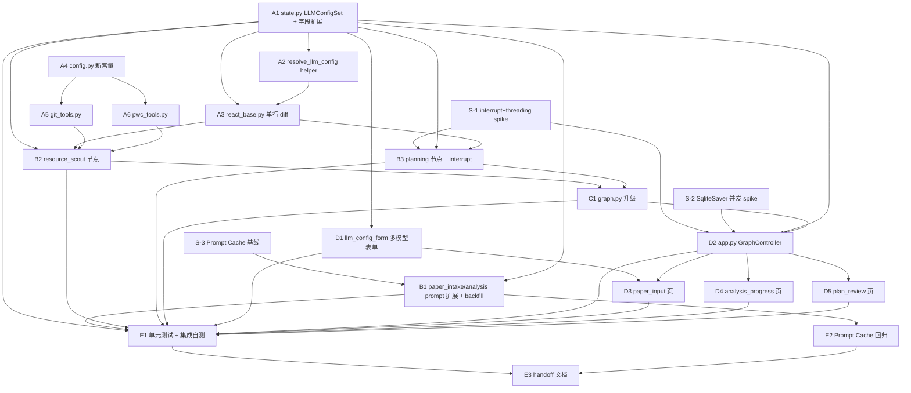

# Sprint 2 开发计划

**产品名称**：Auto-Reproduction -- 论文自动复现系统
**Sprint**：Sprint 2 -- 核心链路
**版本**：v1.0
**日期**：2026-05-18
**作者**：全栈开发工程师代理
**状态**：正式版

> **[历史快照声明 2026-07-05]** 本文档为 Sprint 2 时点快照。文中预算数值（总预算 50 / 修复循环 3 轮）已于 2026-06-30 放大为 120/10；现状以 technical-architecture.md 与 config.py 为准。

---

## 1. 概述

### 1.1 Sprint 目标

Sprint 2 在 Sprint 1 五层架构（编排层 / 节点层 / ReAct 基础设施层 / 工具层 / 横切关注点）之上**新增 UI 层与异步通信层**，打通**论文输入 → 分析进度 → 计划审核**完整链路：

- **节点层**：实现 `resource_scout`（ReAct max_rounds=10，搜索优先级链 + 仓库质量评分）与 `planning`（ReAct max_rounds=8 + LangGraph `interrupt()` 人在回路 + 5 类决策路由含 cancel）；
- **工具层**：新增 `git_tools`（git clone + 本地仓库分析）与 `pwc_tools`（Papers With Code 直接 requests HTTP + LRU 缓存 + 失败降级 web_search）；
- **横切关注点**：扩展 `core/state.py`（PaperMeta +3 `*_zh` / PaperAnalysis +2 `*_en` / RepoInfo +1 `local_path`），新增 `LLMConfigSet` 多模型配置（全局默认 + 4 节点覆写），新增 `resolve_llm_config` 节点级 LLM 路由 helper；
- **UI 层（首次引入）**：Streamlit 三个核心页面（论文输入 / 分析进度 / 计划审核）+ 多模型 LLM 配置表单组件 + `GraphController`（每线程独立 SqliteSaver + WAL + 主线程轮询 + cancel_task 主动出口）；
- **编排升级**：`core/graph.py` 接入两个真节点 + planning 3 路条件边（self / next / end）。

### 1.2 范围对齐

- **PRD 权威来源**：`docs/sprint2/prd.md` v1.0（11 个功能模块 S2-01 ~ S2-11 + 13 条验收标准 AC-S2-01 ~ AC-S2-13 + 7 项风险矩阵 + 5 条开放问题全部 RESOLVED 或部分 RESOLVED）。
- **架构权威来源**：`docs/sprint2/architecture.md` v1.0（6 章节 + 11 个模块详细设计 + 8 条关键设计决策 + 12 条风险条目 + 5 个 spike + 3 张数据流图）。
- **跨文档联动**：技术架构文档 `docs/technical-architecture.md` §4 已同步 `RepoInfo.local_path` 字段。
- **Sprint 1 基线**：168/168 pytest 全绿（含 13 个 e2e），sp2 仅追加式扩展不破坏既有契约。

### 1.3 与 Sprint 1 的依赖与兼容性

| sp1 已稳定模块 | sp2 改动类型 | 兼容性约束 |
|---|---|---|
| `core/state.py` | **追加字段** + breaking change（`llm_config` → `llm_config_set`） | 通过 `create_initial_state` 老形态兜底层（接收单 LLMConfig 自动包装为 `{default: cfg, overrides: {}}`）保 sp1 168/168 测试基线 |
| `core/llm_client.py::create_llm` | **签名零变化** | 仅新增 `resolve_llm_config()` helper，不动 `create_llm` 调用方 |
| `core/react_base.py` | **单行 diff（L825）** | `create_llm(state["llm_config"])` → `create_llm(resolve_llm_config(state["llm_config_set"], node_name))`，`_make_react_wrapper` 签名不变；sp1 既有 B4 8 项自测全部仍通过 |
| `core/checkpointer.py::get_checkpointer()` | **零修改** | sp1 已支持 `check_same_thread=False` + WAL；sp2 直接利用每线程独立实例模式 |
| `core/graph.py` | **替换两个占位 + 升级条件路由** | 7 节点拓扑不变，coding / execution / reporting 保留 pass-through |
| `core/nodes/paper_intake.py` / `paper_analysis.py` | **追加 schema 字段 + system prompt 尾部独立常量段落 + `_map_*_result` backfill 兜底** | **禁止动主体**（R-PC4 字节级幂等），Prompt Cache 命中率必须 ≥ baseline×0.95 |
| `core/tools/deepxiv_tools.py` | **零修改** | sp2 新增工具（git_tools / pwc_tools）严格沿用 `_serialize()` 模式（BUG-S1-02 治理范式） |

### 1.4 关键风险一句话

**SqliteSaver 跨线程方案 + LangGraph interrupt 在 Streamlit 工作线程内的恢复语义是 sp2 单点最大技术风险**（R-S2-01 / R-S2-02 / R-S2-08，详见 §6），必须**通过 3 个 spike 在阶段 B 实施开始前完成验证**，否则整条 UI 链路无法上线。

---

## 2. 任务清单总表

按阶段编号 S2-XX 罗列（与 PRD §1.2 对齐），含产出文件、依赖、估时、风险等级。

| 任务编号 | PRD 编号 | 任务名 | 产出文件 | 依赖前置 | 估时 | 风险 |
|---|---|---|---|---|---|---|
| **S-1** | -- | Spike：interrupt + threading 最小 demo | `scripts/spike_interrupt_threading.py` | -- | 2h | 高 |
| **S-2** | -- | Spike：SqliteSaver 跨线程并发 60s 压力 | `scripts/spike_sqlite_concurrent.py` | -- | 1.5h | 高 |
| **S-3** | -- | Spike：Prompt Cache fresh 基线复采 | `docs/sprint2/test-reports/2026-MM-DD_prompt-cache-baseline.md` | -- | 1h | 中 |
| **A1** | -- | `core/state.py` 扩展（5 新字段 + LLMConfigSet + breaking change 兜底） | `core/state.py` | -- | 2h | 中 |
| **A2** | S2-09(部分) | `core/llm_client.py::resolve_llm_config()` helper | `core/llm_client.py` | A1 | 1h | 低 |
| **A3** | -- | `core/react_base.py` 单行 diff（接入节点级 LLM 路由） | `core/react_base.py` | A1 + A2 | 0.5h | 中 |
| **A4** | -- | `config.py` 新增 sp2 常量（PLANNING_SOFT_HINT_THRESHOLD / GIT_CLONE_TIMEOUT / STREAMLIT_POLL_INTERVAL / WORKSPACE_REPOS_DIR 等） | `config.py` | -- | 0.5h | 低 |
| **A5** | S2-01 | `core/tools/git_tools.py`（git_clone / analyze_local_repo / check_url_reachable + 3 工具工厂） | `core/tools/git_tools.py` | A4 | 4h | 中 |
| **A6** | -- | `core/tools/pwc_tools.py`（直接 requests + LRU + 限速 + 失败降级 + 1 工具工厂） | `core/tools/pwc_tools.py` | A4 | 3h | 中 |
| **B1** | S2-10 + S2-09 | `paper_intake` / `paper_analysis` schema 扩展 + `_LANGUAGE_POLICY_SECTION` + backfill 兜底 | `core/nodes/paper_intake.py` + `core/nodes/paper_analysis.py` | A1 + S-3 | 3h | 中 |
| **B2** | S2-02 | `core/nodes/resource_scout.py`（ReAct max_rounds=10 + 搜索优先级链 + quality_score） | `core/nodes/resource_scout.py` | A1 + A2 + A3 + A5 + A6 | 5h | 高 |
| **B3** | S2-03 | `core/nodes/planning.py`（手写节点 + 内部 ReAct 子图 + interrupt + 5 类决策路由） | `core/nodes/planning.py` | A1 + A2 + A3 + S-1 | 5h | 高 |
| **C1** | S2-11 | `core/graph.py` 升级（接入 2 真节点 + planning 3 路条件边） | `core/graph.py` | B2 + B3 | 1.5h | 中 |
| **D1** | S2-04 | `ui/components/llm_config_form.py`（全局默认 panel + 4 expander override + 校验） | `ui/components/llm_config_form.py` | A1 | 3h | 低 |
| **D2** | S2-08 | `app.py::GraphController`（start_task / poll_state / is_interrupted / resume_with / cancel_task + 工作线程模型） | `app.py` | A1 + C1 + S-1 + S-2 | 5h | 高 |
| **D3** | S2-05 | `ui/pages/paper_input.py`（侧栏配置 + arxiv 输入 + 启动任务） | `ui/pages/paper_input.py` | D1 + D2 | 2.5h | 低 |
| **D4** | S2-06 | `ui/pages/analysis_progress.py`（4 段进度条 + 实时日志 + 自动跳转 review） | `ui/pages/analysis_progress.py` | D2 | 2.5h | 低 |
| **D5** | S2-07 | `ui/pages/plan_review.py`（计划全文 + 候选仓库列表 + 5 决策按钮 + 透明化卡片 + N≥5 软提示 + cancel 二次确认） | `ui/pages/plan_review.py` | D2 | 4h | 中 |
| **E1** | -- | 单元测试与集成自测 | `tests/test_*` 全套 sp2 新增 | A1~D5 | 5h | 低 |
| **E2** | -- | Prompt Cache 命中率回归（对照 S-3 基线 ≥ ×0.95，AC-S2-08 硬约束） | `docs/sprint2/test-reports/2026-MM-DD_prompt-cache-regression.md` | B1 + E1 | 1.5h | 中 |
| **E3** | -- | 交付物完整性检查 + 测试工程师 handoff 文档 | `docs/sprint2/handoff-to-test-engineer.md`（未单独落盘，由最终验收报告替代，见 CP-E3-3 注记） | E1 + E2 | 1.5h | 低 |

**任务总数**：21 个（3 spike + 4 状态/工具层底层 + 4 工具/节点扩展 + 1 graph + 5 UI/app + 3 集成验收）。

**总估时**：~54.5h（含 spike 4.5h + 落地 41.5h + 验收 8h）。

---

## 3. 阶段划分与依赖图

6 阶段划分（沿用 sp1 dev-plan A~F 风格但语义按 sp2 范围调整）：

### 3.1 阶段总览

| 阶段 | 名称 | 任务 | 前置条件 | 产出 |
|---|---|---|---|---|
| **S** | Spike 验证（启动前） | S-1 / S-2 / S-3 | 无 | 3 份 spike 报告，证明 R-S2-01/02/08 可控、Prompt Cache fresh 基线就绪 |
| **A** | 状态与工具层（P0 阻塞性基础设施） | A1 / A2 / A3 / A4 / A5 / A6 | 阶段 S 完成 | LLMConfigSet 落地 / 节点级路由 helper / git_tools / pwc_tools 全部就绪 |
| **B** | 节点层（P1 核心业务） | B1 / B2 / B3 | 阶段 A 完成 | paper_intake/analysis prompt 扩展、resource_scout 完整 ReAct、planning interrupt 节点 |
| **C** | graph 升级（P1 编排） | C1 | 阶段 B 完成 | 7 节点真节点接入 + 3 路条件边可编译 |
| **D** | UI 层（P1 用户交互） | D1 / D2 / D3 / D4 / D5 | 阶段 C 完成 + S-1/S-2 验证通过 | Streamlit 三页面 + GraphController 完整链路 |
| **E** | 集成与验收（P2 收尾交付） | E1 / E2 / E3 | 阶段 D 完成 | 单测全套 + Prompt Cache 回归 + handoff |

### 3.2 依赖关系图（Mermaid）



**关键路径**：S-1/S-2 → A1+A2+A3 → A5+A6 → B2+B3 → C1 → D2 → D3/D4/D5 → E1 → E2 → E3。

**并行机会**：
- 阶段 A 中 A4/A5/A6 可与 A1~A3 并行（仅依赖 config.py，不依赖 state.py 升级）；
- 阶段 B 中 B1 与 B2/B3 互不依赖，可并行；
- 阶段 D 中 D1 可与 D2 并行（D1 仅依赖 A1，D2 依赖 C1）；D3/D4/D5 三页面在 D2 完成后可并行。

---

## 4. 任务详细规格

### 阶段 S：Spike 验证（启动前）

> **前置条件**：无
> **产出**：三份 spike 报告，证明 sp2 关键技术假设可控；S-1/S-2 通过后阶段 D 才能开始；S-3 通过后阶段 B 的 B1 才能开始。

#### 任务 S-1：interrupt + threading 最小可行 demo

- **模块名**：Spike S-1
- **产出文件**：`scripts/spike_interrupt_threading.py` + `docs/sprint2/test-reports/2026-MM-DD_spike-s1-interrupt-threading.md`
- **依赖项**：sp1 既有 langgraph 0.2.x + checkpointer.py + state.py
- **预计复杂度**：中
- **风险等级**：高（R-S2-01 / R-S2-02 / R-S2-08 早期验证）

**需要实现的内容**：

- 构造一个最小 StateGraph：单节点 `dummy_planning(state)` 内部直接调用 `langgraph.types.interrupt({"hint": "test"})`；
- 编译图绑定 `core/checkpointer.get_checkpointer()`（独立 thread-local 实例）；
- 在 `threading.Thread(daemon=True)` 中调用 `graph.invoke(initial, {"configurable": {"thread_id": "spike-001"}})`，记录工作线程是否在 interrupt 后自然退出；
- 主线程 sleep 0.5s 后通过**新 SqliteSaver 实例**调用 `graph.get_state(config)` 拿 snapshot，断言 `snapshot.next` 非空、`snapshot.tasks` 有 interrupt 元数据；
- **关键断言点**：主线程能正确识别 interrupt 状态；
- 起**新工作线程**调用 `graph.invoke(Command(resume={"decision": "ok"}), config)` 恢复执行，并断言 `interrupt()` 返回值就是 resume payload；
- 整个流程 30 秒内完成并打印每个阶段的耗时与日志。

**自测检查点**：
- [x] CP-S1-1 spike 脚本可直接 `python scripts/spike_interrupt_threading.py` 运行，30 秒内输出"成功 resume + 状态推进"日志 — **PASS** 2026-05-24，3 次连跑 0.793s / 0.661s / 0.685s
- [x] CP-S1-2 工作线程在 `interrupt()` 后退出（`thread.is_alive() == False`），无 CPU 持续消耗 — **PASS** 2026-05-24，worker1 joined in 0.153s alive=False
- [x] CP-S1-3 主线程 `graph.get_state(config)` 拿到的 `snapshot.next` 非空，确认 LangGraph snapshot API 能正确识别 interrupt 暂停状态 — **PASS** 2026-05-24，snapshot.next=('dummy_planning',) + interrupt 元数据 1 条
- [x] CP-S1-4 起新线程 `invoke(Command(resume=...))` 后，原图从 interrupt 之后的边继续执行，**不会回到 interrupt 之前** — **PASS** 2026-05-24，post_marker='node-continued-past-interrupt'
- [x] CP-S1-5 `interrupt()` 在节点函数体内直接调用可被工作线程内的 `invoke()` 正确暂停（R-S2-08 验证） — **PASS** 2026-05-24
- [x] CP-S1-6 主线程与工作线程使用**不同的 SqliteSaver Python 实例**，共享同一 SQLite 文件，无 `ProgrammingError` — **PASS** 2026-05-24，different_instances=True，sqlite3.ProgrammingError 0 次
- [x] CP-S1-7 spike 报告归档到 `docs/sprint2/test-reports/`，含执行日志 + 关键断言截图 / 日志片段 — **PASS** 2026-05-24，`docs/sprint2/test-reports/2026-05-24_spike-s1-interrupt-threading.md`

**风险标注**：
- **高风险**：若验证失败（如 LangGraph interrupt 不支持工作线程内调用），则 S2-03 planning 节点设计与 S2-08 GraphController 设计需重新评估；可能需引入 LangGraph 0.3.x 或考虑 MemorySaver+持久化队列方案

---

#### 任务 S-2：SqliteSaver 跨线程并发 60s 压力

- **模块名**：Spike S-2
- **产出文件**：`scripts/spike_sqlite_concurrent.py` + `docs/sprint2/test-reports/2026-MM-DD_spike-s2-sqlite-concurrent.md`
- **依赖项**：sp1 既有 checkpointer.py（WAL 模式 + `check_same_thread=False`）
- **预计复杂度**：低
- **风险等级**：高（R-S2-01 验证）

**需要实现的内容**：

- 主线程：每 100ms 调用 `main_saver.get_tuple(config)` 读取 thread_id 的最新 checkpoint，记录读取次数、平均/p99 延迟、任何异常；
- 工作线程：每 200ms 调用 `worker_saver.put(config, ckpt_dict, metadata, ChannelVersions)` 写入伪 checkpoint，模拟节点写入 state 的真实负载（含 100KB+ 大 dict 模拟 paper_analysis 输出）；
- 主线程与工作线程**独立创建** SqliteSaver 实例（沿用 sp1 `get_checkpointer()`），共享同一 SQLite 文件；
- 运行 60 秒（约 600 次读 + 300 次写），统计：
  - 是否抛 `sqlite3.ProgrammingError: SQLite objects created in a thread can only be used in that same thread`
  - 是否抛 `sqlite3.OperationalError: database is locked`
  - 读写延迟 p99
- 60 秒结束后断言读取到的 checkpoint 计数 == 工作线程写入次数；

**自测检查点**：
- [x] CP-S2-1 60 秒内无任何 `ProgrammingError` 异常（验证 `check_same_thread=False` + 独立实例方案有效） — **PASS** 2026-05-24，3 次 60s 跑累计 0 次 ProgrammingError
- [x] CP-S2-2 60 秒内无任何 `database is locked` 异常（验证 WAL 模式并发读写正确） — **PASS** 2026-05-24，3 次累计 0 次
- [x] CP-S2-3 主线程读取的最新 checkpoint 计数与工作线程写入计数一致（最多差 1，对应正在写未提交的瞬间） — **PASS** 2026-05-24，final_read_seq=305 == write_count-1=305（精确匹配，差 0）
- [x] CP-S2-4 读延迟 p99 < 50ms（不阻塞 Streamlit 1.5s 轮询周期） — **PASS** 2026-05-24，p99 = 17.96 / 14.48 / 17.77 ms（2.8-3.5× 余量）
- [x] CP-S2-5 写延迟 p99 < 100ms（不阻塞节点执行流） — **PASS** 2026-05-24，p99 = 21.61 / 23.11 / 26.81 ms（3.7-4.6× 余量）
- [x] CP-S2-6 spike 报告归档，含读写延迟分布图（matplotlib 或 ascii art 均可） — **PASS** 2026-05-24，`docs/sprint2/test-reports/2026-05-24_spike-s2-sqlite-concurrent.md` 含 ascii histogram

**风险标注**：
- **高风险**：若验证失败（如频繁 `database is locked`），需评估改为方案 C（单实例 + RLock）或 v2 用 PostgreSQL；阶段 D 必须暂停

---

#### 任务 S-3：Prompt Cache fresh 基线复采

- **模块名**：Spike S-3
- **产出文件**：`docs/sprint2/test-reports/2026-MM-DD_prompt-cache-baseline.md`
- **依赖项**：sp1 既有 paper_intake + paper_analysis 端到端可运行
- **预计复杂度**：低
- **风险等级**：中（R-S2-04 对照基准）

**需要实现的内容**：

- 固定 `arxiv_id = "2405.14831"`（HippoRAG，与 sp1 F 阶段实验同源）；
- 固定 `base_url` / `model`（通过 env 变量记录到报告），保证与后续 E2 回归用同一 provider；
- 不修改任何 sp1 代码，连跑 `paper_analysis` 节点 ×3 次（间隔 30 秒内完成，避免 cache TTL 过期），每次记录：
  - 第 1 次：`cached_tokens` / `prompt_tokens`（首次冷启动）
  - 第 2 次：`cached_tokens` / `prompt_tokens`（首次缓存命中）
  - 第 3 次：`cached_tokens` / `prompt_tokens`（稳定命中）
- 计算 `R_baseline = mean(R_2nd, R_3rd)`，作为 E2 回归判定的基准值；
- 报告必须含原始日志（`_log_cache_metrics` INFO 日志）+ 命中率表 + provider / model / base_url 标识。

**自测检查点**：
- [x] CP-S3-1 spike 实测连跑 3 次 paper_analysis 成功完成，无 LLM 报错 — **PASS** 2026-05-25，3 次 run 均 degraded=False / sections_read=6~7 / method_len > 1000
- [x] CP-S3-2 第 2、3 次的 `cached_tokens` 字段在 `response.response_metadata` 中可读到（若 provider 不透传则需在报告中明确标注并改用响应延迟 / 计费侧侧面验证） — **PASS** 2026-05-25，NVIDIA gateway 完整透传 `usage.prompt_tokens_details.cached_tokens`，未触发 fallback
- [x] CP-S3-3 `R_baseline = mean(R_2nd, R_3rd)` 计算结果已写入报告 — **PASS** 2026-05-25，**R_baseline = 0.7669**，sp2 阶段 B 守门 R_after ≥ 0.7286
- [x] CP-S3-4 报告含 provider / model / base_url / arxiv_id 等可复现实验环境参数 — **PASS** 2026-05-25，§1 实验环境表 12 行完整覆盖
- [x] CP-S3-5 报告归档路径与 sp1 F 阶段 Prompt Cache 实验同目录（`docs/sprint2/test-reports/`），便于横向对比 — **PASS** 2026-05-25，`docs/sprint2/test-reports/2026-05-25_prompt-cache-baseline.md`

---

### 阶段 A：状态与工具层（P0 阻塞性基础设施）

> **前置条件**：阶段 S 完成（至少 S-1/S-2 通过；S-3 可与 A 阶段并行）
> **产出**：LLMConfigSet 落地 / 节点级路由 helper / git_tools / pwc_tools 全部就绪，节点层可消费

#### 任务 A1：`core/state.py` 扩展（LLMConfigSet + 5 新字段 + breaking change 兜底）

- **模块名**：S2-09 数据结构扩展
- **产出文件**：`core/state.py`
- **依赖项**：sp1 既有 state.py + typing
- **预计复杂度**：中
- **风险等级**：中（breaking change，需保 sp1 168/168 测试基线）
- **架构参考**：sprint2/architecture.md §2.1 / §2.1.1.bis / §4.7

**需要实现的内容**：

| 改动类型 | 位置 | 内容 |
|---|---|---|
| **追加字段** | `PaperMeta` | `title_zh: Optional[str]` / `abstract_zh: Optional[str]` / `tldr_zh: Optional[str]` |
| **追加字段** | `PaperAnalysis` | `method_summary_en: Optional[str]` / `hardware_requirements_en: Optional[str]`（同时把 `method_summary` / `hardware_requirements` 字段 docstring 注释为"中文主字段"，语义反转，PRD §4.7.3） |
| **追加字段** | `RepoInfo` | `local_path: Optional[str]` |
| **新增 Literal** | 顶层 | `NodeName = Literal["paper_intake", "paper_analysis", "resource_scout", "planning"]` |
| **新增 TypedDict** | 顶层 | `LLMConfigSet`（含 `default: LLMConfig` + `overrides: Dict[str, LLMConfig]`） |
| **追加字段** | `GlobalState` | `_planning_revise_count: int`（默认 0）+ `_planning_user_feedback: Optional[str]`（默认 None） |
| **替换字段** | `GlobalState` | `llm_config: LLMConfig` → `llm_config_set: LLMConfigSet`（breaking change，方案 A） |
| **升级函数** | `create_initial_state` | 形参升级为 `(user_input, llm_config_set: Union[LLMConfig, LLMConfigSet], workspace_dir=None)`；**老形态兜底**：检测到 dict 含 `base_url` 但无 `default` 键时，自动包装为 `{"default": <input>, "overrides": {}}` |

**关键设计决策**：
- 老形态兜底是保 sp1 168/168 测试基线的关键路径（详见架构 §2.1.1.bis 选择 A 的理由）；
- `_planning_revise_count` / `_planning_user_feedback` 以下划线前缀标识内部字段（架构 §4.7）；
- 所有新字段一律 `Optional[...]` 或带默认值，旧 checkpoint 反序列化时缺失字段视为 `None`（TypedDict 容忍语义）；
- **不删除 `llm_config` 字段**或保留 `llm_config: NotRequired[...]` 作为 dataclass 警示（取决于 TypedDict 实现细节）—— 推荐直接删除，依赖 `create_initial_state` 兜底层提供向后兼容。

**自测检查点**：
- [x] CP-A1-1 `from core.state import LLMConfigSet, NodeName` 可正常导入 — **PASS** 2026-05-27 @测试工程师代理 2026-05-27 独立复核 PASS
- [x] CP-A1-2 `PaperMeta` 含 `title_zh` / `abstract_zh` / `tldr_zh` 三个 Optional 字段（通过 `PaperMeta.__annotations__` 断言） — **PASS** 2026-05-27 @测试工程师代理 2026-05-27 独立复核 PASS
- [x] CP-A1-3 `PaperAnalysis` 含 `method_summary_en` / `hardware_requirements_en` 两个 Optional 字段 — **PASS** 2026-05-27 @测试工程师代理 2026-05-27 独立复核 PASS
- [x] CP-A1-4 `RepoInfo` 含 `local_path: Optional[str]` 字段 — **PASS** 2026-05-27 @测试工程师代理 2026-05-27 独立复核 PASS
- [x] CP-A1-5 `GlobalState` 含 `llm_config_set` 字段 + `_planning_revise_count: int` / `_planning_user_feedback: Optional[str]` — **PASS** 2026-05-27。**与 dev-plan 原意偏差但合理**：当前实现保留 `llm_config: LLMConfig` 作为过渡期镜像字段（值始终 = `llm_config_set["default"]`），让 `core/react_base.py:825` 老路径 + `tests/test_sprint1_smoke.py:229` / `tests/test_graph_e2e.py:254` 直读断言在 A3 单行 diff 之前持续工作；A3 完成后可彻底删除 `llm_config` 字段，详见 state.py L160-170 docstring。@测试工程师代理 2026-05-27 独立复核 PASS（带条件接受，C1/C2/C3 条件已落地，详见 `docs/sprint2/test-reports/2026-05-27_a1-acceptance.md` §4）
- [x] CP-A1-6 `create_initial_state(arxiv_id, llm_config)`（老形态单 LLMConfig）能正确返回 `state["llm_config_set"] == {"default": cfg, "overrides": {}}`（兜底兼容性 — 这是 sp1 测试基线的关键） — **PASS** 2026-05-27 @测试工程师代理 2026-05-27 独立复核 PASS
- [x] CP-A1-7 `create_initial_state(arxiv_id, {"default": cfg_A, "overrides": {"paper_analysis": cfg_B}})`（新形态 LLMConfigSet）能正确写入 state — **PASS** 2026-05-27 @测试工程师代理 2026-05-27 独立复核 PASS
- [x] CP-A1-8 `state["_planning_revise_count"] == 0` 与 `state["_planning_user_feedback"] is None`（默认值正确） — **PASS** 2026-05-27 @测试工程师代理 2026-05-27 独立复核 PASS
- [x] CP-A1-9 **sp1 全量回归 pytest 全绿**（运行 `pytest -q` 验证 sp1 既有测试零退化，这是 A1 完成的硬条件） — **PASS** 2026-05-27，`pytest -q` 全量 66 passed in 222.52s（含 16 个 e2e 真实 LLM 链路），0 失败、0 跳过。**A1 顺手补齐 PAPER_META_SCHEMA + PAPER_ANALYSIS_SCHEMA 字段同步**（方案 A，最小 diff 5 行 Edit），闭合 PaperAnalysis TypedDict ↔ schema 双向严格对齐断言（`tests/test_paper_analysis.py::CP1`）；新增 `tests/test_sprint2_a1.py` 10 用例覆盖 CP-A1-1~8 全部程序化检查点（0.03s）。@测试工程师代理 2026-05-27 独立复核 PASS：补全 6 条 Aux 边界用例（bool/int 严格 / 注解结构性 / 主字段语义反转保留 / 多节点 override 隔离 / 非 NodeName key 现状 / 镜像不变量 4 路径集中断言），全量 `pytest -q` **72 passed in 478.85s**（66 既有 + 6 Aux），单测部分 3 次连跑 144/144 PASS（2.58s / 3.16s / 3.21s），详见 `docs/sprint2/test-reports/2026-05-27_a1-acceptance.md`

**风险标注**：
- **中风险**：sp1 既有测试使用 `state["llm_config"]` 直接取的位点需 grep 排查；若有遗漏需要在 A2 之前先扫净（通过 A1-9 全量回归测试发现）

---

#### 任务 A2：`core/llm_client.py::resolve_llm_config()` helper

- **模块名**：节点级 LLM 路由 helper
- **产出文件**：`core/llm_client.py`（追加 1 个函数，**不动 `create_llm` 签名**）
- **依赖项**：A1（LLMConfigSet TypedDict）
- **预计复杂度**：低
- **风险等级**：低
- **架构参考**：sprint2/architecture.md §4.9

**需要实现的内容**：

```python
def resolve_llm_config(
    llm_config_set: LLMConfigSet,
    node_name: Optional[str],
) -> LLMConfig:
    """节点级 LLM 路由：优先 overrides[node_name]，缺失回退 default。

    Raises:
        PermanentError: llm_config_set.default 缺失或形态错误。

    Returns:
        最终生效的 LLMConfig（保证非 None）。
    """
```

**关键边界**：
- `llm_config_set` 为 None 或 dict 缺 `default` 键 → 抛 `PermanentError("llm_config_set.default 缺失或形态错误")`
- `node_name` 为 None（如 force_finish 共用路径） → 返回 default
- `node_name` 不在 `overrides` 中 → 返回 default
- `node_name` 在 `overrides` 中 → 返回 overrides[node_name]

**自测检查点**：
- [x] CP-A2-1 `resolve_llm_config({"default": cfg_A, "overrides": {}}, "paper_intake")` 返回 cfg_A — PASS 2026-05-31 @全栈开发代理
- [x] CP-A2-2 `resolve_llm_config({"default": cfg_A, "overrides": {"paper_analysis": cfg_B}}, "paper_analysis")` 返回 cfg_B — PASS 2026-05-31 @全栈开发代理
- [x] CP-A2-3 `resolve_llm_config({"default": cfg_A, "overrides": {"paper_analysis": cfg_B}}, "paper_intake")` 返回 cfg_A（其它节点 fallback） — PASS 2026-05-31 @全栈开发代理
- [x] CP-A2-4 `resolve_llm_config({"default": cfg_A, "overrides": {}}, None)` 返回 cfg_A（None 路径） — PASS 2026-05-31 @全栈开发代理
- [x] CP-A2-5 `resolve_llm_config({}, "paper_intake")` 抛 `PermanentError` — PASS 2026-05-31 @全栈开发代理
- [x] CP-A2-6 `resolve_llm_config(None, "paper_intake")` 抛 `PermanentError` — PASS 2026-05-31 @全栈开发代理
- [x] CP-A2-7 `create_llm()` 函数签名未变（仍接受单 LLMConfig，向后兼容） — PASS 2026-05-31 @全栈开发代理

---

#### 任务 A3：`core/react_base.py` 单行 diff

- **模块名**：ReAct 基础设施接入节点级路由
- **产出文件**：`core/react_base.py`（L825 附近修改 1 处 + 文件顶部 1 个 import）
- **依赖项**：A1 + A2
- **预计复杂度**：低
- **风险等级**：中（影响 4 个 sp1 节点的回归）
- **架构参考**：sprint2/architecture.md §4.9（落地约束 3）

**需要实现的内容**：

```python
# 文件顶部新增 import
from core.llm_client import resolve_llm_config

# react_base.py L825 改造：
# 原：llm = create_llm(state["llm_config"])
# 新：llm = create_llm(resolve_llm_config(state["llm_config_set"], node_name))
```

**关键约束**：
- `_make_react_wrapper` 签名零变化（sp1 已存在 `node_name` 形参）；
- sp1 既有 paper_intake / paper_analysis 注册端零改动即获得节点级路由能力；
- 当 sp1 老 state 使用 `state["llm_config"]` 时，由 A1 的 `create_initial_state` 兜底层兜底（state 内已经是 `llm_config_set`），不会触发 KeyError。

**自测检查点**：
- [x] CP-A3-1 修改后 `_make_react_wrapper` 函数签名未变（通过 `inspect.signature` 断言形参列表完全一致）— PASS 2026-05-31 @全栈开发代理（`tests/test_react_base_sp2.py::test_cp_a3_1_*`）
- [x] CP-A3-2 用 sp1 mock LLM 跑 paper_intake：`_make_react_wrapper` 内部调用 `create_llm(cfg_A)`，cfg_A 来自 `state["llm_config_set"]["default"]`（路径 P1 全局回退验证）— PASS 2026-05-31 @全栈开发代理（mock create_llm 捕获实参 == default，含"node 未命中 override 回退"补充用例）
- [x] CP-A3-3 构造 state with `llm_config_set = {"default": cfg_A, "overrides": {"paper_intake": cfg_B}}`，跑 paper_intake，验证 `create_llm(cfg_B)` 被调用（单节点 override 验证）— PASS 2026-05-31 @全栈开发代理（含 P3 多节点全 override 各取其所补充用例）
- [x] CP-A3-4 **sp1 B4 react_base.py 8 项自测全部仍通过**（运行 `pytest tests/test_react_base.py -q` 零退化）— PASS 2026-05-31 @全栈开发代理（mock state 同步升级为 llm_config_set 结构）
- [x] CP-A3-5 **sp1 paper_intake / paper_analysis 全量单测通过**（覆盖 `_map_*_result` 兼容性、CP1~CP11）— PASS 2026-05-31 @全栈开发代理（核心非 e2e 单测集 97 passed in 2.65s）

**风险标注**：
- **中风险**：单行 diff 看似简单，但影响 sp1 所有 ReAct 节点；A3-4/A3-5 任一失败必须立即停工修复

> **测试工程师独立验收（2026-06-01，PASS）**：CP-A3-1~5 全部独立复核命中；watchlist 4 处 + 连带清理 8 处到位；镜像字段删除影响面盘清（全仓 0 处真实 `state["llm_config"]` 直读）；补 4 条 A3 集成视角边界用例至 `tests/test_react_base_sp2.py`（共 10）；核心单测 3 次连跑 303/303 + 全量 `pytest -q` 含 e2e 2 次 236/236 零退化、0 LLM 抖动；零 BUG。遗留 L-A3-01（paper_intake main 风格脚本游离回归网外）+ L-A3-02（pytest.ini 注释偏差）非阻断。详见 `docs/sprint2/test-reports/2026-06-01_a3-acceptance.md`。

---

#### 任务 A4：`config.py` 新增 sp2 常量

- **模块名**：Sprint 2 配置常量
- **产出文件**：`config.py`（追加常量，不动 sp1 既有常量）
- **依赖项**：sp1 既有 config.py
- **预计复杂度**：低
- **风险等级**：低

**需要实现的内容**：

| 常量名 | 默认值 | 用途 |
|---|---|---|
| `PLANNING_SOFT_HINT_THRESHOLD` | `5` | UI 在 revise_count ≥ 此值时展示"是否切换 code_only"软提示卡片（PRD §2.3 / AC-S2-06；**仅提示不锁按钮**，硬上限语义已废弃） |
| `REACT_MAX_ROUNDS_RESOURCE_SCOUT` | `10` | resource_scout ReAct max_rounds |
| `REACT_MAX_ROUNDS_PLANNING` | `8` | planning ReAct max_rounds |
| `GIT_CLONE_TIMEOUT` | `60`（秒） | git_clone 子进程超时 |
| `GIT_CLONE_DEPTH` | `1` | 浅克隆 depth |
| `WORKSPACE_REPOS_DIR` | `WORKSPACE_DIR / "repos"` | 仓库克隆落盘目录 |
| `URL_REACHABLE_TIMEOUT` | `5`（秒） | check_url_reachable HEAD 探测超时 |
| `PWC_BASE_URL` | `"https://paperswithcode.com/api/v1"` | Papers With Code API base URL |
| `PWC_RATE_LIMIT_RPS` | `5` | PwC 本地节流速率（5 req/s 即 200ms 间隔） |
| `PWC_TIMEOUT_CONNECT` | `5`（秒） | PwC HTTP connect 超时 |
| `PWC_TIMEOUT_READ` | `10`（秒） | PwC HTTP read 超时 |
| `STREAMLIT_POLL_INTERVAL` | `1500`（毫秒） | Streamlit `st_autorefresh` 间隔 |
| `STREAMLIT_PAGE_INPUT` | `"input"` / `STREAMLIT_PAGE_PROGRESS = "progress"` / `STREAMLIT_PAGE_REVIEW = "review"` | UI 路由常量 |

**关键约束**：
- 不修改 sp1 既有常量（含 `MAX_TOTAL_LLM_CALLS = 50` —— sp2 planning revise 无上限的总预算兜底）；
- `WORKSPACE_REPOS_DIR` 添加到 `ensure_directories()` 中确保启动时创建。

**自测检查点**：
- [x] CP-A4-1 `from config import PLANNING_SOFT_HINT_THRESHOLD, REACT_MAX_ROUNDS_RESOURCE_SCOUT, REACT_MAX_ROUNDS_PLANNING, GIT_CLONE_TIMEOUT, WORKSPACE_REPOS_DIR, PWC_BASE_URL, STREAMLIT_POLL_INTERVAL` 全部可导入 — PASS 2026-06-01 @全栈开发代理（`tests/test_sprint2_a4.py::test_cp_a4_1_*`，含全表 15 常量无遗漏覆盖）
- [x] CP-A4-2 `PLANNING_SOFT_HINT_THRESHOLD == 5` / `REACT_MAX_ROUNDS_RESOURCE_SCOUT == 10` / `REACT_MAX_ROUNDS_PLANNING == 8` — PASS 2026-06-01 @全栈开发代理（含全表值逐项断言 + 严格 int/Path/str 类型断言 + WORKSPACE_REPOS_DIR == WORKSPACE_DIR/'repos'）
- [x] CP-A4-3 `WORKSPACE_REPOS_DIR.is_dir()` 在调用 `ensure_directories()` 后为 True — PASS 2026-06-01 @全栈开发代理（`ensure_directories()` 已追加 `WORKSPACE_REPOS_DIR.mkdir(parents=True, exist_ok=True)`）
- [x] CP-A4-4 sp1 既有常量（`MAX_TOTAL_LLM_CALLS`、`REACT_MAX_ROUNDS_PAPER_INTAKE` 等）零修改 — PASS 2026-06-01 @全栈开发代理（14 个 sp1 关键常量逐项值断言，含 `MAX_TOTAL_LLM_CALLS == 50`）

> **测试工程师独立验收（2026-06-01，PASS）**：CP-A4-1~4 逐条独立复核全部命中（Read config.py 核值 + `git diff HEAD~1` 实证 config.py 为纯追加 0 删改 + `WORKSPACE_REPOS_DIR` 确入 `ensure_directories()` L124）。补 6 条边界用例至 `tests/test_sprint2_a4.py`（共 12）：A4→A5 路径不变量 `resolve()+is_relative_to`（开发代理只断未 resolve 的 `==`）/ `PWC_RATE_LIMIT_RPS→200ms` 换算 / timeout 正数 + connect≤read / UI 路由互异 / env 无覆盖设计声明 reload 断言 / `ensure_directories` 幂等。非 e2e 核心回归 3 次连跑 113/113（增 6）+ A4 文件 3 次 12/12，累计 375/375 PASS、0 失败 0 跳过、0 抖动。零 BUG。报告：`docs/sprint2/test-reports/2026-06-01_a4-acceptance.md`。

---

#### 任务 A5：`core/tools/git_tools.py`（S2-01）

- **模块名**：S2-01 git 工具封装
- **产出文件**：`core/tools/git_tools.py`
- **依赖项**：`subprocess`（stdlib）/ `pathlib` / `config`（WORKSPACE_REPOS_DIR / GIT_CLONE_TIMEOUT / GIT_CLONE_DEPTH / URL_REACHABLE_TIMEOUT） / `core.errors`（TransientError / PermanentError） / `core.state`（RepoInfo） / `langchain_core.tools`（@tool / BaseTool） / `requests`（check_url_reachable HEAD 探测）
- **预计复杂度**：中（4h）
- **风险等级**：中
- **架构参考**：sprint2/architecture.md §2.2 / 技术架构 §12.4

**需要实现的内容**：

**1. 原子函数**（业务层调用）：

| 函数 | 签名 | 关键约束 |
|---|---|---|
| `git_clone` | `(url: str, dest_dir: str, depth: int = 1, timeout: int = 60) -> Dict` | 子进程调用 `["git", "clone", "--depth", str(depth), url, dest_dir]`（不用 `shell=True`）；dest_dir 必须位于 WORKSPACE_DIR 之下（`resolve()` + `is_relative_to` 校验）；同 URL 重复请求识别已有 local_path 并跳过；返回 `{"success": bool, "local_path": str, "duration_seconds": float, "error": Optional[str]}` |
| `analyze_local_repo` | `(local_path: str) -> RepoInfo` | `git log --since="6 months ago" --pretty=format:%H` 数 commit_count_recent；`git log -1 --format=%cI` 取 last_commit_date；扫顶层目录（最多 30 项字典序）写 dir_structure；检查 README* / requirements.txt / environment.yml / pyproject.toml / setup.py；`is_official=False`（由 resource_scout 节点判定填充）；`local_path` 写入 local_path 参数 |
| `check_url_reachable` | `(url: str, timeout: int = 5) -> bool` | `requests.head(url, timeout=timeout, allow_redirects=True)`；200/301/302 返回 True；其它 / 异常 → False |

**2. 重试策略**（沿用 sp1 / 架构 §2.2.3）：

| 失败场景 | 处理 | 异常 |
|---|---|---|
| 网络瞬态（connection refused / timeout / could not resolve host / RPC failed） | 3 次指数退避 1s/2s/4s | 最终 `TransientError` |
| 认证失败 / 仓库不存在（exit 128 + "Repository not found"） | 不重试 | `PermanentError` |
| 磁盘空间不足 | 不重试 | `PermanentError` |
| `git` 二进制缺失（FileNotFoundError） | 不重试 | `PermanentError`（提示安装 git） |
| dest_dir 越界 | 不重试 | `PermanentError("dest_dir 越界")` |

**3. ReAct 工具工厂**：

| 工厂 | 内部调用 | 用途 |
|---|---|---|
| `make_git_clone_and_analyze_tool()` | `git_clone` + `analyze_local_repo` 复合工具 | 单次工具调用完成"克隆 + 本地分析"两步，避免 agent 多轮拆分浪费 max_rounds；ToolMessage 输出 `_serialize(RepoInfo)` 或失败 dict |
| `make_check_url_reachable_tool()` | `check_url_reachable` | 死链过滤 |
| `make_git_clone_tool()` | `git_clone` | 单独克隆工具（高级路径） |

**4. JSON 序列化合规（BUG-S1-02 治理范式硬约束）**：

```python
def _serialize_tool_result(result: object) -> str:
    """ReAct ToolMessage 序列化合规 helper（与 deepxiv_tools._serialize 同源）。"""
    return json.dumps(result, ensure_ascii=False, sort_keys=True, default=str)
```

所有工具工厂内部 ToolMessage 写入必须经 `_serialize_tool_result`，**不得直接 `str(dict)`**。

**5. 安全约束**：

- `dest_dir` 必须位于 `WORKSPACE_DIR` 之下（用 `resolve().is_relative_to(WORKSPACE_DIR.resolve())` 校验，越界抛 `PermanentError("dest_dir 越界")`）；
- `subprocess` 全部不用 `shell=True`，命令构造为列表；
- 同 URL 重复克隆：先检查 `WORKSPACE_REPOS_DIR / repo_slug` 是否存在，存在则直接返回 `{"success": True, "local_path": existing_path, "duration_seconds": 0.0}` 跳过克隆。

**自测检查点**：
- [x] CP-A5-1 `git_clone("https://github.com/python/cpython", tempdir)` 在网络可达时返回 `success=True` + 合法 `local_path`（mock subprocess.run 即可，e2e 跑真实 clone 留给 E1） — PASS 2026-06-01 @全栈开发代理（`tests/test_sprint2_a5.py::test_cp_a5_1_git_clone_success`，含命令列表形式断言）
- [x] CP-A5-2 `git_clone` 对死链 URL（mock subprocess.run 返回 stderr="Repository not found" + exit 128）抛 `PermanentError`，**不重试** — PASS 2026-06-01 @全栈开发代理（断言 run 仅调 1 次 + sleep 0 次）
- [x] CP-A5-3 `git_clone` 对网络瞬态错误（mock subprocess.run 抛 TimeoutExpired）3 次指数退避后抛 `TransientError` — PASS 2026-06-01 @全栈开发代理（断言 run 4 次执行 + sleep 序列 [1.0,2.0,4.0]；补 test_cp_a5_3b 覆盖 stderr 网络关键字退避路径）
- [x] CP-A5-4 `git_clone(url, "/etc/passwd")` 抛 `PermanentError("dest_dir 越界")`（路径越界拒绝） — PASS 2026-06-01 @全栈开发代理（断言越界校验在 subprocess 之前，run 0 次）
- [x] CP-A5-5 `git_clone` 对同一 URL 二次调用直接返回 `success=True` + `duration_seconds=0.0`（重复跳过） — PASS 2026-06-01 @全栈开发代理（预建 slug 目录，断言 run 0 次）
- [x] CP-A5-6 `analyze_local_repo(local_path)` 对 tempdir + `git init` + 创建 README.md + git commit 的小仓库返回完整 RepoInfo，含 `local_path`、`has_readme=True`、`dir_structure` 字典序、`is_official=False` — PASS 2026-06-01 @全栈开发代理（真实 git init/commit，断言 12 字段全集与 core.state.RepoInfo 逐字段对齐 + commit_count_recent==1 + last_commit_date 非空）
- [x] CP-A5-7 `analyze_local_repo` 对无 README 仓库返回 `has_readme=False`、`has_requirements=False` — PASS 2026-06-01 @全栈开发代理（非 git 仓库 commit 指标降级不抛异常）。**契约澄清（2026-06-01 @测试工程师代理）**：对非 git 目录 / 空仓库，`commit_count_recent` 与 `last_commit_date` 降级值为 **`None`（不是 0）**，表示"读不到数据"而非"近半年真有 0 次提交"。下游 B2 resource_scout 评分须用 `commit_count_recent is None` 判缺失，**禁止用 `== 0`**（否则会把"无数据"误判为"零活跃"）。
- [x] CP-A5-8 `check_url_reachable("https://github.com")` 返回 True（mock requests.head 即可）；死链返回 False — PASS 2026-06-01 @全栈开发代理（200→True / 404→False / 异常→False / 301·302→True，断言 allow_redirects=True）
- [x] CP-A5-9 3 个工具工厂均返回 `BaseTool` 实例，且 `_serialize_tool_result({"success": True, "local_path": "/x"})` 输出**合法 JSON**（`json.loads(...)` 不报错；含 `ensure_ascii=False, sort_keys=True`） — PASS 2026-06-01 @全栈开发代理（含中文不转义 + 键字典序断言；补 test_cp_a5_9_factory_output 验证 3 工厂成功/失败两路径 ToolMessage 均 json.loads 可解析，禁 str(dict)）
- [x] CP-A5-10 `subprocess.run` 全部不使用 `shell=True`（通过断言 `Popen.args` 是列表确认） — PASS 2026-06-01 @全栈开发代理（spy 录制 git_clone + analyze_local_repo 全部 run 调用，逐条断言 cmd 为 list 且 shell 不为 True）

> **自测汇总（2026-06-01 @全栈开发代理）**：`tests/test_sprint2_a5.py` 19/19 PASS；非 e2e 核心回归 `pytest -q -m "not e2e" --ignore=tests/test_paper_intake.py` 3 次连跑 **132/132**（较 A4 验收基线 113 增 19 = 全部 A5 用例并入），0 失败 0 跳过 0 抖动。1 warning 为 langgraph 库级预存（与 A5 无关）。补充用例：git 二进制缺失 FileNotFoundError→PermanentError、_repo_slug 对 https/ssh/.git 后缀解析。RepoInfo 12 字段与 `core/state.py` TypedDict 逐字段对齐无冲突。

**风险标注**：
- **中风险**：git 二进制版本兼容性（macOS / Linux）；建议启动时 `git --version` 探测并写日志
- **中风险**：subprocess 跨平台超时行为（Windows 不支持 SIGKILL），sp2 MVP 仅声明 Linux/macOS 支持

---

#### 任务 A6：`core/tools/pwc_tools.py`（Q-S2-02 RESOLVED 落地）

- **模块名**：Papers With Code 工具封装
- **产出文件**：`core/tools/pwc_tools.py`
- **依赖项**：`requests` / `functools.lru_cache` / `time` / `os` / `config`（PWC_BASE_URL / PWC_RATE_LIMIT_RPS / PWC_TIMEOUT_CONNECT / PWC_TIMEOUT_READ） / `core.errors`（TransientError / PermanentError） / `langchain_core.tools`
- **预计复杂度**：中（3h）
- **风险等级**：中
- **架构参考**：sprint2/architecture.md §4.6（Q-S2-02 六要素 RESOLVED）

**需要实现的内容**：

**1. 公开函数**：

| 函数 | 签名 | 用途 |
|---|---|---|
| `search_pwc_by_arxiv` | `(arxiv_id: str) -> List[Dict]` | 通过 arxiv_id 查询 PwC，返回 `[{paper_id, title, repos: [...]}]`；LRU 缓存命中直接返回；失败 3 次重试后抛 TransientError |
| `search_pwc_by_title` | `(title: str) -> List[Dict]` | 通过 title 模糊查询前 10 条候选 |

**2. 内部私有 cached 函数**（`@functools.lru_cache(maxsize=128)` 装饰）：

```python
@functools.lru_cache(maxsize=128)
def _search_pwc_by_arxiv_cached(arxiv_id: str) -> Tuple[Dict, ...]:
    """LRU 缓存键：arxiv_id。返回 tuple（lru_cache 要求 hashable）。"""
    ...
```

外层 `search_pwc_by_arxiv` 把 tuple 转回 List[Dict]。

**3. 限速节流**：

模块级 `_LAST_REQUEST_AT: float = 0.0` 时间戳；每次发起 HTTP 请求前 `_throttle()`：

```python
_THROTTLE_INTERVAL = 1.0 / PWC_RATE_LIMIT_RPS  # 200ms

def _throttle() -> None:
    """5 req/s 保守节流（PwC 无显式限速文档但 GitHub issues 提示偶发 429）。"""
    global _LAST_REQUEST_AT
    elapsed = time.monotonic() - _LAST_REQUEST_AT
    if elapsed < _THROTTLE_INTERVAL:
        time.sleep(_THROTTLE_INTERVAL - elapsed)
    _LAST_REQUEST_AT = time.monotonic()
```

**4. 重试与失败兜底**：

| 状态 | 处理 |
|---|---|
| HTTP 200 | 解析 JSON 返回 |
| HTTP 429（Retry-After 存在） | 按 Retry-After 退避；最多 3 次 |
| HTTP 429（无 Retry-After） | 指数退避 1s/2s/4s；最多 3 次 |
| HTTP 5xx | 指数退避 1s/2s/4s；最多 3 次 |
| HTTP timeout | 同 5xx 退避 |
| 超过 3 次重试 | 抛 `TransientError`（ReAct agent 在 system prompt 中已知"PwC 失败 → 跳 web_search 兜底"） |

**5. API key 注入点（MVP 不申请，但预留）**：

```python
_PWC_API_TOKEN: Optional[str] = os.getenv("PWC_API_TOKEN")  # 模块加载时读取

def _build_headers() -> Dict[str, str]:
    headers = {"User-Agent": "auto-reproduction/0.1", "Accept": "application/json"}
    if _PWC_API_TOKEN:
        headers["Authorization"] = f"Token {_PWC_API_TOKEN}"
    return headers
```

缺失时不报错，匿名访问。

**6. ReAct 工具工厂**：

```python
def make_search_pwc_tool() -> BaseTool:
    """@tool 装饰，ToolMessage 输出统一用 _serialize_tool_result（沿用 BUG-S1-02 治理）"""
```

**7. 可观测性**：

- HTTP 失败 / 重试 / 限速时打 WARNING 日志（沿用 sp1 BUG-S1-02 治理范式，**非静默吞错**）；
- **不**在 `state["node_errors"]` 中留痕（工具层瞬态错误不进 NodeError，只在 resource_scout 整体降级为 from_scratch 时由节点 `_map_*_result` 统一标记 degraded）；
- 缓存命中 / miss 仅打 DEBUG 日志。

**自测检查点**：（by test-engineer 2026-06-01，全部 pytest 覆盖且 22/22 全绿，见 test-reports/2026-06-01_a6-pwc-tools.md）
- [x] CP-A6-1 `search_pwc_by_arxiv("2405.14831")` 在 mock requests 返回 200 时返回 `List[Dict]`，结构含 `paper_id` / `title` / `repos`
- [x] CP-A6-2 mock requests 第一次 429（Retry-After: 1）+ 第二次 200，函数最终成功（验证 Retry-After 退避）
- [x] CP-A6-3 mock requests 429（无 Retry-After）后抛 `TransientError`（验证指数退避 + 重试上限）。**语义澄清（test-engineer）**：实现为「首次 + 3 次重试 = 共 4 次 attempt」才抛，符合下方 §573 表格「超过 3 次重试→抛」权威语义（首次请求不计入 retry）；CP 文字「3 次」指「3 次重试」，建议补「（首次+3 次重试，共 4 次 attempt）」消歧。测试按「4 次 429 才抛 + 3 次 429+第 4 次 200 不抛」双向断言。
- [x] CP-A6-4 mock requests timeout 后抛 `TransientError`（同上：共 4 次 timeout 才抛）
- [x] CP-A6-5 同一 arxiv_id 连续调用 `search_pwc_by_arxiv` 两次：第二次 HTTP 请求次数为 0（LRU 缓存命中验证）
- [x] CP-A6-6 `_throttle()` 200ms 间隔生效：连续 5 次调用累计耗时 ≥ 800ms（4 * 200ms 间隔）——测试用真实 sleep+monotonic 断言 ≥0.76s（留 5% 抖动容差）
- [x] CP-A6-7 设置 `PWC_API_TOKEN=test_token` env 后重新 import 模块（`importlib.reload`），`_build_headers()` 含 `Authorization: Token test_token`；未设置时无此 header
- [x] CP-A6-8 `make_search_pwc_tool()` 返回 BaseTool 实例，ToolMessage 输出为合法 JSON（`json.loads` 不报错；含 `ensure_ascii=False, sort_keys=True`）
- [x] CP-A6-9 工具函数内部捕获 `TransientError` 后返回错误描述字符串（沿用 sp1 deepxiv_tools 工具工厂内的异常→字符串路径，不抛异常打断 ReAct 子图）
- [x] CP-A6-10 WARNING 日志非静默吞错（HTTP 失败时 caplog 能捕获至少 1 条 WARNING）

**风险标注**：
- **中风险**：PwC API 当前免费匿名可用，但 endpoint 路径与字段命名未来可能变化（参考 PwC GitHub）；建议在工具函数内部容错地处理 schema 偏差
- **低风险**：LRU 缓存键基于 string，arxiv_id 标准化（trim / lowercase 等）需保持与 deepxiv 同一规范

---

### 阶段 B：节点层（P1 核心业务）

> **前置条件**：阶段 A 全部完成
> **产出**：3 个核心节点（含 sp1 节点 prompt 扩展）业务实现完整

#### 任务 B1：`paper_intake` / `paper_analysis` schema 扩展 + 输出语言策略 prompt 扩展 + backfill 兜底（S2-09 + S2-10）

- **模块名**：sp1 节点追加式扩展
- **产出文件**：`core/nodes/paper_intake.py` + `core/nodes/paper_analysis.py`
- **依赖项**：A1（state.py 新字段） + S-3（Prompt Cache fresh 基线）
- **预计复杂度**：中（3h）
- **风险等级**：中（R-PC4 字节级幂等 + R-S2-04 命中率回归）
- **架构参考**：sprint2/architecture.md §2.6 / §4.5 / §4.8

**需要实现的内容**：

**1. Schema 扩展**：

| 文件 | 常量 | 扩展字段 |
|---|---|---|
| `paper_intake.py` | `PAPER_META_SCHEMA` | properties 增加 `title_zh` / `abstract_zh` / `tldr_zh` 三个 `{"type": "string"}` Optional 字段（**不加入 required 数组**） |
| `paper_analysis.py` | `PAPER_ANALYSIS_SCHEMA` | properties 增加 `method_summary_en` / `hardware_requirements_en` 两个 `{"type": "string"}` Optional 字段；同时把 `method_summary` / `hardware_requirements` 字段 description 更新为"中文主字段" |

**2. `_LANGUAGE_POLICY_SECTION` 常量**（架构 §2.6.2 / §4.5 首选方案 A）：

```python
# core/nodes/paper_analysis.py 模块级
_LANGUAGE_POLICY_SECTION = """--- 输出语言策略 ---
请在 <result> JSON 中按以下规则填写字段语言：
- method_summary：中文叙述（主字段，给 planning/reporting 中文 prompt 消费）；
- method_summary_en：英文叙述（备份字段，给 coding 节点消费，避免中英混杂）；
- hardware_requirements / hardware_requirements_en：同上；
- datasets / metrics / framework / sections_read：英文事实层，禁止翻译；
- analysis_notes：中文自由文本 + 英文机器标签（如 [DEGRADED] missing=...）。
"""
```

`paper_intake.py` 同样新增一个 `_LANGUAGE_POLICY_SECTION_INTAKE` 常量，说明 `*_zh` 中文字段填充策略。

**3. system prompt 拼接策略**（架构 §2.6.2 / §4.5 / §4.8 硬约束）：

```python
def _build_analysis_system_prompt(context: Dict[str, Any]) -> str:
    arxiv_id = str(context.get("arxiv_id") or "")
    paper_meta = context.get("paper_meta") if isinstance(context, dict) else None
    tail = _format_paper_context(arxiv_id, paper_meta)
    return (
        _ANALYSIS_SYSTEM_PROMPT_BODY                       # ← 主体冻结（sp1 字节级一致）
        + "\n" + _LANGUAGE_POLICY_SECTION                  # ← Sprint 2 追加（字节稳定常量）
        + "\n--- 当前论文上下文 ---\n"
        + tail                                              # ← 论文级动态
    )
```

**硬约束（R-PC4 / 架构 §4.8 冻结期）**：
- **禁止修改** `_ANALYSIS_SYSTEM_PROMPT_BODY` / `_INTAKE_SYSTEM_PROMPT` 主体；
- `_LANGUAGE_POLICY_SECTION` 必须是 **module-level 常量**，不允许 f-string 拼接或动态生成；
- 字节稳定段落一旦定稿，sp2 内部不允许微调（任何字节修改 = Prompt Cache 全 miss）。

**4. `_map_*_result` backfill 兜底**（沿用 BUG-S1-02 / BUG-S1-03 治理范式）：

```python
# core/nodes/paper_intake.py
def _backfill_zh_fields(meta: PaperMeta, degraded_nodes: List[str],
                         node_errors: List[NodeError]) -> bool:
    """LLM 漏写 *_zh 字段时回退为英文主字段值并标记 degraded。"""
    fell_back = False
    if not meta.get("title_zh") and meta.get("title"):
        meta["title_zh"] = meta["title"]; fell_back = True
    if not meta.get("abstract_zh") and meta.get("abstract"):
        meta["abstract_zh"] = meta["abstract"]; fell_back = True
    if not meta.get("tldr_zh") and meta.get("tldr"):
        meta["tldr_zh"] = meta["tldr"]; fell_back = True
    if fell_back:
        if "paper_intake" not in degraded_nodes:
            degraded_nodes.append("paper_intake")
        node_errors.append(make_node_error(
            "paper_intake", "degraded",
            "LLM 漏写中文字段 *_zh，已回退英文主字段值",
        ))
        logger.warning("[paper_intake] *_zh 字段缺失回退（避免静默吞错）")
    return fell_back
```

`paper_analysis.py` 中对 `method_summary_en` / `hardware_requirements_en` 做相同处理（漏写时用对应中文主字段回退）。

**严禁引入二次 LLM 翻译调用**（PRD §4.7.4 / §2.10 硬约束）。

**5. 字段语义反转的 grep 校验**：

在落地前必须全仓 grep `method_summary` / `hardware_requirements` 引用点，确认无"假定主字段是英文"的隐式依赖（R-S2-05）。已知引用点（sp1）：
- `core/nodes/paper_analysis.py::PAPER_ANALYSIS_SCHEMA` 字段定义（更新 description）
- `core/nodes/paper_analysis.py::_map_analysis_result` 字段读写（仅校验字段存在，不依赖语言）
- `tests/test_paper_analysis.py` / `tests/test_paper_analysis_e2e.py`（断言字段存在，不强制断言语言）
- sp2 后续 planning prompt 引用（B3 实施时已按中文主字段对齐，详见 architecture §2.4.2）

**自测检查点**：
- [x] CP-B1-1 `PAPER_META_SCHEMA.properties` 含 `title_zh` / `abstract_zh` / `tldr_zh` 字段，且不在 `required` 数组内 — PASS（test_sprint2_b1::test_cp_b1_1）
- [x] CP-B1-2 `PAPER_ANALYSIS_SCHEMA.properties` 含 `method_summary_en` / `hardware_requirements_en` 字段，且不在 `required` 数组内；`method_summary` / `hardware_requirements` 字段 description 含"中文" — PASS（test_cp_b1_2，主字段补 description "中文主字段"）
- [x] CP-B1-3 `_LANGUAGE_POLICY_SECTION` 是 module-level 常量，多次调用 `_build_analysis_system_prompt({...different arxiv...})` 时该段落字节级一致 — PASS（test_cp_b1_3，含无 f-string 占位断言）
- [x] CP-B1-4 `_ANALYSIS_SYSTEM_PROMPT_BODY` 在 sp2 改造后字节级与 sp1 完全一致（diff 工具断言）— PASS（test_cp_b1_4 + git show HEAD 比对 byte-identical，`_INTAKE_SYSTEM_PROMPT` 同样冻结）
- [x] CP-B1-5 **主体字节级一致测试**：两篇不同论文截取 SystemMessage，去尾部 `--- 当前论文上下文 ---` 段落后字节级一致；改造后 prompt 前缀截止到 `_LANGUAGE_POLICY_SECTION` 末尾也字节级一致 — PASS（test_cp_b1_5 + sp1 test_paper_analysis CP10 升级断言）
- [x] CP-B1-6 LLM mock 漏写 `title_zh`：`_map_intake_result` 回退 `title_zh = title`，`degraded_nodes` 含 `"paper_intake"`，`node_errors` 含 degraded 记录，**WARNING 日志非静默** — PASS（test_cp_b1_6，caplog 断言 WARNING）
- [x] CP-B1-7 LLM mock 漏写 `method_summary_en`：`_map_analysis_result` 回退 `method_summary_en = method_summary`，同上 degraded 标记 + WARNING 日志 — PASS（test_cp_b1_7）
- [x] CP-B1-8 LLM mock 同时漏写多个 `*_zh` 字段：全部回退、`degraded_nodes` 仅追加一次（去重）、`node_errors` 仅一条 — PASS（test_cp_b1_8 + 反向用例 zh 已存在时不回退/不 degraded）
- [x] CP-B1-9 **严禁引入二次 LLM 翻译调用**：grep 节点代码确认无 `create_llm` / `llm.invoke` 二次调用 path — PASS（test_cp_b1_9 inspect.getsource 扫描 4 函数无 create_llm/llm.invoke/ChatOpenAI/translate）
- [x] CP-B1-10 sp1 既有 paper_intake / paper_analysis 单测 CP1~CP11 全部仍通过 — PASS（test_cp_b1_10 跑 main()：paper_analysis 11/11 + paper_intake 8/8；CP4/CP11 mock 补 *_en 保持 clean path 语义）

**风险标注**：
- **中风险**：R-PC4 字节级幂等违反 = AC-S2-08 硬约束失败 = 不能交付；E2 阶段必须连跑命中率回归

---

#### 任务 B2：`core/nodes/resource_scout.py`（S2-02）

- **模块名**：S2-02 resource_scout ReAct agent 节点
- **产出文件**：`core/nodes/resource_scout.py`（新建）
- **依赖项**：A1 + A2 + A3 + A5 + A6 + sp1 既有 react_base / deepxiv_tools / errors
- **预计复杂度**：高（5h）
- **风险等级**：高
- **架构参考**：sprint2/architecture.md §2.3

**需要实现的内容**：

**1. 模块结构**：

```python
# 模块常量
NODE_NAME = "resource_scout"
RESOURCE_SCOUT_SCHEMA: Dict[str, Any] = {...}  # 与 ResourceInfo 对齐
_RESOURCE_SCOUT_SYSTEM_PROMPT_BODY = """..."""  # 固定模板，字节冻结

# 辅助函数
def _build_resource_scout_system_prompt(context) -> str: ...
def _format_resource_scout_context(paper_meta, paper_analysis) -> Dict: ...
def _map_resource_scout_result(result, state, react_messages=None) -> dict: ...
def _backfill_repos_from_tools(payload, react_messages) -> bool: ...

# 模块导出（通过 _make_react_wrapper 生成）
resource_scout = _make_react_wrapper(
    node_name=NODE_NAME,
    build_context=lambda state: {
        "paper_meta": state.get("paper_meta") or {},
        "paper_analysis": state.get("paper_analysis") or {},
    },
    build_system_prompt=_build_resource_scout_system_prompt,
    get_tools=lambda state: [
        web_search_tool(),
        search_papers_tool(),
        get_paper_brief_tool(),
        make_search_pwc_tool(),
        make_git_clone_and_analyze_tool(),
        make_check_url_reachable_tool(),
    ],
    map_result=_map_resource_scout_result,
    max_rounds=REACT_MAX_ROUNDS_RESOURCE_SCOUT,  # 10
    result_schema=RESOURCE_SCOUT_SCHEMA,
)
```

**2. RESOURCE_SCOUT_SCHEMA**（与 ResourceInfo 对齐）：

```python
RESOURCE_SCOUT_SCHEMA = {
    "type": "object",
    "properties": {
        "repos": {"type": "array", "items": {"type": "object"}},
        "selected_repo": {"type": ["object", "null"]},
        "external_resources": {"type": "array"},
        "resource_strategy": {
            "type": "string",
            "enum": ["use_repo", "hybrid", "from_scratch"],
        },
        "search_log": {"type": "array", "items": {"type": "string"}},  # agent 自报告字段
    },
    "required": ["repos", "selected_repo", "resource_strategy"],
}
```

**3. system prompt 主体**（架构 §2.3.1）：

```
你是资源搜集与评估专家。任务是根据论文元数据，找到论文对应的开源代码仓库并评估质量。

【搜索优先级链】
1. deepxiv github_url -- 若 paper_meta.github_url 非空，先用 check_url_reachable 校验，
   再用 git_clone_and_analyze 克隆并取得 RepoInfo；
2. Papers With Code -- 用论文 title（英文主字段）或 arxiv_id 调用 search_pwc 补充候选；
   如返回 GitHub URL，按步骤 1 流程克隆；
3. Web Search -- 用 title + framework + "code" / "github" 等关键词调用 web_search 兜底；
4. 全部失败 -- 在 <result> 中输出 resource_strategy = "from_scratch"，repos = []，
   selected_repo = null。

【质量评分（你给每个克隆成功的仓库打 0.0~1.0 分）】
权重建议（最终自由判断）：
- is_official（owner 与 paper_meta.authors 重叠）-- 权重 0.35
- last_commit_date（近半年）-- 权重 0.20
- commit_count_recent（>=10 加分）-- 权重 0.15
- has_readme + has_requirements -- 权重 0.15
- dir_structure 含 src/ models/ train.py 等 ML 标准目录 -- 权重 0.15

【输出格式】
在 <result>{...}</result> 中输出符合 ResourceInfo Schema 的 JSON。
```

**4. `_map_resource_scout_result` 核心算法**（3 参签名 + 工具历史回填）：

```python
def _map_resource_scout_result(
    result: Optional[Dict[str, Any]],
    state: GlobalState,
    react_messages: Optional[List[BaseMessage]] = None,
) -> dict:
    """职责：
    1. 校验 result 含必需字段；缺失时降级 from_scratch + degraded_nodes 标记；
    2. quality_score 全部 <0.3 时，写 analysis_notes WARNING 但仍照常推荐 repos[0]；
    3. 工具历史回填（BUG-S1-03 模式）：当 result.repos 为空但 react_messages 中存在
       git_clone_and_analyze 成功记录时，按 ToolMessage 内容反推 RepoInfo 写入 repos；
    4. 写 NodeError(degraded) + degraded_nodes 时打 WARNING 日志（非静默吞错）。

    Returns:
        {"resource_info": ResourceInfo, "current_step": "resource_scout",
         "node_errors": [...], "degraded_nodes": [...]}
    """
```

**5. `_backfill_repos_from_tools`**（BUG-S1-03 治理范式）：

扫描 react_messages 中的 ToolMessage（name=`git_clone_and_analyze`），按 `tool_call_id` 配对前序 AIMessage.tool_calls 抽工具参数（URL），过滤掉 `Error in ...` / `tool ... raised ...` 失败 ToolMessage；仅回填成功克隆记录的 RepoInfo（其中 `quality_score` 默认 0.5 + degraded 兜底说明）。**找到 ToolMessage 但无法配对任何成功 read 时打 WARNING 日志**。

**6. 降级策略**（架构 §2.3.4）：

| 失败场景 | 节点行为 |
|---|---|
| `paper_meta.github_url` 为空 | 跳过步骤 1，继续 PwC / web search（agent 自主决策） |
| PwC API 限流 / 超时 | 工具层 3 次重试后抛 TransientError；agent 跳过继续 web search |
| 候选全部克隆失败 | `resource_strategy="from_scratch"`，加入 `degraded_nodes`，写 `NodeError(degraded)` |
| max_rounds 耗尽 | force_finish 路径输出当前最佳候选（即使为空） |

**自测检查点**：
- [x] CP-B2-1 `resource_scout` 是 `_make_react_wrapper` 生成的 callable，`__name__ == "react_wrapper_resource_scout"`
- [x] CP-B2-2 RESOURCE_SCOUT_SCHEMA properties 与 ResourceInfo TypedDict 字段集合对齐（除了 agent 自报告字段 `search_log`）
- [x] CP-B2-3 Mock LLM 走"有 github_url 路径"：单次 `git_clone_and_analyze` 成功后输出 `<result>` 含 1 个 RepoInfo，`resource_strategy="use_repo"`、`selected_repo == repos[0]`
- [x] CP-B2-4 Mock LLM 走"无 github_url + PwC 成功路径"：先 search_pwc → git_clone_and_analyze → 输出含 PwC 来源的 RepoInfo；`source` 字段标识 "pwc"
- [x] CP-B2-5 Mock LLM 走"全失败降级路径"（mock github_url=None + pwc 抛 TransientError + web_search 返回空）：输出 `resource_strategy="from_scratch"` + `repos=[]` + `selected_repo=None`；`degraded_nodes` 含 `"resource_scout"`；`node_errors` 含 degraded 记录；**节点不抛致命异常**
- [x] CP-B2-6 LLM 漏写 `repos` 但 react_messages 含 1 个 `git_clone_and_analyze` 成功 ToolMessage：`_backfill_repos_from_tools` 回填 1 个 RepoInfo，**WARNING 日志非静默**
- [x] CP-B2-7 `_map_resource_scout_result` 用 3 参签名（含 react_messages），通过 `inspect.signature` 断言形参列表含 `react_messages`
- [x] CP-B2-8 quality_score 全部 <0.3 时：`selected_repo == repos[0]` + `analysis_notes` 含 `[QUALITY_WARN]` 标记
- [x] CP-B2-9 max_rounds=10 耗尽时 force_finish 路径输出最佳已知候选（可为空，但节点不抛错）
- [x] CP-B2-10 _RESOURCE_SCOUT_SYSTEM_PROMPT_BODY 主体不含任何论文级动态变量（grep 断言 + 字节级一致测试）

> CP-B2-1~10 全部由 @测试工程师代理独立验收实证覆盖且通过（2026-06-02），见 `docs/sprint2/test-reports/2026-06-02_b2-acceptance.md`；`tests/test_sprint2_b2.py` 共 34 项（dev 18 + 测试工程师补强 16）。

**风险标注**：
- **高风险**：agent 工具选择策略质量直接影响候选仓库覆盖率；R8 沿用（max_rounds 留足余量 + finalize 校验结果完整性 + backfill 兜底）
- **中风险**：is_official 判定（owner vs author 字符串相似度）由 LLM 自主完成，可能误判；通过 `analysis_notes` 透明展示判定依据缓解

---

#### 任务 B3：`core/nodes/planning.py`（S2-03 + S2-11 一并落地）

- **模块名**：S2-03 planning ReAct agent 节点 + interrupt 人在回路
- **产出文件**：`core/nodes/planning.py`（新建）
- **依赖项**：A1 + A2 + A3 + S-1（interrupt+threading spike 通过） + sp1 既有 react_base / deepxiv_tools / errors
- **预计复杂度**：高（5h）
- **风险等级**：高
- **架构参考**：sprint2/architecture.md §2.4 / §4.2 / §4.7

**需要实现的内容**：

**1. 节点形态：复合而非纯 ReAct wrapper**

与 paper_intake / paper_analysis 不同，**planning 节点不是纯 ReAct wrapper**，它在 ReAct 子图完成之后追加 `interrupt()` 调用并处理 `Command(resume=...)` 路由。节点函数**手写**而非 `_make_react_wrapper()` 直接生成：

```python
def planning(state: GlobalState) -> dict:
    """复现规划节点 + interrupt 人在回路。

    流程：
        1. 调用内部 _run_planning_react(state, user_feedback=None) 跑一次 ReAct 子图
           产出 reproduction_plan；
        2. 调用 langgraph.types.interrupt(payload) 暂停 graph，UI 通过 Command(resume=...) 注入决策；
        3. resume 后从 interrupt 返回值路由（approve / revise / switch_repo / code_only / cancel）。
    """
```

**2. 内部 ReAct 子图**（架构 §2.4.2）：

```python
_PLANNING_SYSTEM_PROMPT_BODY = """..."""  # 固定模板，字节冻结

PLANNING_SOFT_HINT_THRESHOLD = config.PLANNING_SOFT_HINT_THRESHOLD  # =5

_planning_react = _make_react_wrapper(
    node_name="planning",
    build_context=lambda state: {
        "paper_meta": state.get("paper_meta") or {},
        "paper_analysis": state.get("paper_analysis") or {},
        "resource_info": state.get("resource_info") or {},
        "user_feedback": state.get("_planning_user_feedback"),
    },
    build_system_prompt=_build_planning_system_prompt,
    get_tools=lambda state: [
        read_section_tool(),
        get_paper_structure_tool(),
        web_search_tool(),
        make_check_url_reachable_tool(),
    ],
    map_result=_map_planning_result,
    max_rounds=REACT_MAX_ROUNDS_PLANNING,  # 8
    result_schema=REPRODUCTION_PLAN_SCHEMA,
)
```

`_planning_react` 通过 `_make_react_wrapper(node_name="planning", ...)` 生成后，**由 planning 节点函数内部调用**（不直接注册到主图）。

**3. system prompt 主体**（架构 §2.4.2，必含 6 章节对齐 product-design-spec §4.3.1）：

```
你是论文复现规划专家。任务是综合论文方法、资源信息与用户反馈（可能为空），
产出结构化的复现计划。

【计划必含 6 章节】
1. plan_summary（中文叙述）
2. environment（硬件 / 软件 / 预估时间，引用 hardware_requirements 中文主字段）
3. data_preparation（步骤列表；数据集名保留英文，PRD §4.7.5）
4. code_strategy（基于 resource_info.selected_repo："use_repo + 适配" / "from_scratch"）
5. execution_steps（step_name / command / expected_output 三元组列表）
6. expected_results + estimated_time + deliverables（最低基准线必填，
   含 README.md / requirements.txt / 入口脚本 / 核心实现 / py_compile 通过）

【输出格式】
在 <result>{...}</result> 中输出符合 ReproductionPlan Schema 的 JSON。
```

**4. interrupt payload 与 resume 路由**（架构 §2.4.3 完整代码）：

```python
from langgraph.types import interrupt
from config import PLANNING_SOFT_HINT_THRESHOLD, MAX_TOTAL_LLM_CALLS

def planning(state: GlobalState) -> dict:
    revise_count = state.get("_planning_revise_count", 0)
    updates: dict = {}

    # 步骤 1：跑 ReAct（user_feedback=None 或 revise 时复用）
    react_updates = _planning_react(state)
    updates.update(react_updates)

    # 步骤 2：构造审核 payload + interrupt
    payload = {
        "reproduction_plan": updates["reproduction_plan"],
        "resource_info": state.get("resource_info"),
        "paper_analysis_summary": _digest_paper_analysis(state.get("paper_analysis")),
        "degraded_nodes": state.get("degraded_nodes", []),
        "node_errors": (state.get("node_errors", []) or [])[-5:],
        "revise_count": revise_count,
        "soft_hint_threshold": PLANNING_SOFT_HINT_THRESHOLD,
        "max_total_llm_calls": MAX_TOTAL_LLM_CALLS,
    }
    decision = interrupt(payload)

    # 步骤 3：5 类决策路由
    if not isinstance(decision, dict) or "decision" not in decision:
        return _finalize_approve(updates, reason="invalid_resume_payload")

    kind = decision["decision"]
    if kind == "approve":
        return _finalize_approve(updates)
    if kind == "code_only":
        return _finalize_approve(updates, execution_mode=ExecutionMode.CODE_ONLY)
    if kind == "cancel":
        return {
            "current_step": "cancelled_by_user",
            "analysis_notes": (state.get("analysis_notes", "") or "")
                              + "\n[CANCELLED] user requested cancel at planning",
        }
    if kind in ("revise", "switch_repo"):
        new_state_update = {
            "_planning_user_feedback": decision.get("user_feedback", ""),
            "_planning_revise_count": revise_count + 1,
        }
        if kind == "switch_repo":
            new_state_update["resource_info"] = _switch_selected_repo(
                state.get("resource_info"), decision.get("new_repo_url"),
            )
        return new_state_update  # graph 自动重入 planning（依赖 self-loop 边）

    return _finalize_approve(updates, reason=f"unknown_decision:{kind}")
```

**关键设计说明**：
- 5 类决策路由严格对齐 PRD §2.3 决策表；
- revise / switch_repo **无次数硬上限**（Q-S2-03 RESOLVED）；
- cancel 决策时节点写 `current_step="cancelled_by_user"`，由 graph 条件边路由到 END；
- `_planning_revise_count` 仅用于 UI 透明展示与软提示判定，**节点层不做任何拦截**；
- "未知 decision" / "非法 resume payload" 路径走 `_finalize_approve` 兜底。

**5. 错误处理与降级**（架构 §2.4.4）：

| 失败场景 | 节点行为 |
|---|---|
| ReAct 子图本身失败（LLM 不可用） | 输出最简版 `reproduction_plan`（仅 plan_summary + code_strategy 两字段，code_strategy="from_scratch"），仍触发 interrupt（避免审核空白） |
| `resource_info` 为空 | code_strategy 强制 "from_scratch"，照常输出 |
| `MAX_TOTAL_LLM_CALLS=50` 总预算耗尽 | 当前 ReAct 子图被 force_finish 并产出最佳已知 plan；planning 节点仍正常触发 interrupt；**不强制 approve** |
| 用户主动 cancel | 写 `current_step="cancelled_by_user"` + `analysis_notes` 追加 `[CANCELLED]`；graph 通过条件边路由到 END；SqliteSaver checkpoint 完整保留 |

**6. `_map_planning_result` 实现要点**（3 参签名沿用治理范式）：

```python
def _map_planning_result(
    result: Optional[Dict[str, Any]],
    state: GlobalState,
    react_messages: Optional[List[BaseMessage]] = None,
) -> dict:
    """职责：
    - 把 agent 输出映射为 ReproductionPlan + 状态更新；
    - approved 字段默认 False（由 planning 节点根据 resume payload 后续写入）；
    - deliverables 字段无论 execution_mode 都必须填（最低基准线，PRD §2.3）；
    - 缺失核心字段（plan_summary / code_strategy）时 degraded 兜底。
    """
```

**自测检查点**：
- [x] [2026-06-03] CP-B3-1 `planning` 是手写函数（不是 `_make_react_wrapper` 直接生成），签名 `(state: GlobalState) -> dict`
- [x] [2026-06-03] CP-B3-2 ReAct 子图 `_planning_react` 通过 `_make_react_wrapper(node_name="planning", ...)` 生成（自动获得节点级 LLM 路由能力）
- [x] [2026-06-03] CP-B3-3 Mock LLM + Mock interrupt 返回 `{"decision": "approve"}`：节点返回 dict 含 `reproduction_plan.approved == True`、`current_step == "planning"`
- [x] [2026-06-03] CP-B3-4 Mock interrupt 返回 `{"decision": "revise", "user_feedback": "缩减实验"}`：返回 dict 含 `_planning_user_feedback == "缩减实验"`、`_planning_revise_count == revise_count + 1`、**不含 `reproduction_plan.approved = True`**（让 graph 走 self-loop 重新 planning）
- [x] [2026-06-03] CP-B3-5 **连续 6 次 revise 不强制 approve**：模拟 6 次 `{"decision": "revise"}`，每次节点都正常返回新 state、`_planning_revise_count` 单调递增 1→6、节点不抛错也不强制 approve、`analysis_notes` 不出现 "revise_limit_reached"
- [x] [2026-06-03] CP-B3-6 Mock interrupt 返回 `{"decision": "switch_repo", "new_repo_url": "https://..."}`：返回 dict 含 `resource_info.selected_repo.url == "https://..."`、`_planning_revise_count == revise_count + 1`（与 revise 共享计数）
- [x] [2026-06-03] CP-B3-7 Mock interrupt 返回 `{"decision": "code_only"}`：返回 dict 含 `execution_mode == ExecutionMode.CODE_ONLY` + `reproduction_plan.approved == True`
- [x] [2026-06-03] CP-B3-8 Mock interrupt 返回 `{"decision": "cancel"}`：返回 dict 含 `current_step == "cancelled_by_user"` + `analysis_notes` 含 `[CANCELLED]`；`reproduction_plan.approved` 仍为 False（cancel 不强制 approve）
- [x] [2026-06-03] CP-B3-9 Mock interrupt 返回非法 payload（`{"foo": "bar"}` 或 `None`）：节点走 `_finalize_approve(reason="invalid_resume_payload")` 兜底不抛错
- [x] [2026-06-03] CP-B3-10 `_PLANNING_SYSTEM_PROMPT_BODY` 主体不含任何论文级动态变量（grep 断言 + 字节级一致测试，参考 sp1 paper_analysis CP10）
- [x] [2026-06-03] CP-B3-11 ReAct 子图本身失败（mock LLM 抛 LLMError）时节点仍输出最简版 `reproduction_plan`（仅 plan_summary + code_strategy）并触发 interrupt
- [x] [2026-06-03] CP-B3-12 `_map_planning_result` 用 3 参签名（含 react_messages），与 sp1 治理范式一致

**风险标注**：
- **高风险**：interrupt 在节点函数体内调用的语义边界（R-S2-08）—— 通过 S-1 spike 提前验证
- **高风险**：planning self-loop 条件边导致 revise 路径无限递归（R-S2-09）—— 三重自然兜底：interrupt 暂停 + MAX_TOTAL_LLM_CALLS + cancel 出口
- **中风险**：deliverables 字段在 execution_mode=FULL / CODE_ONLY 下都必须填，prompt 中需明确要求

---

### 阶段 C：graph 升级（P1 编排）

> **前置条件**：阶段 B 全部完成
> **产出**：7 节点真节点接入 + 3 路条件边，graph 可编译

#### 任务 C1：`core/graph.py` 升级（S2-11）

- **模块名**：S2-11 LangGraph 主图升级
- **产出文件**：`core/graph.py`（替换 2 个占位节点 + 增加 1 条条件边）
- **依赖项**：B2 + B3
- **预计复杂度**：中（1.5h）
- **风险等级**：中
- **架构参考**：sprint2/architecture.md §2.5

**需要实现的内容**：

**1. 节点注册升级**：

```python
from core.nodes.paper_intake import paper_intake
from core.nodes.paper_analysis import paper_analysis
from core.nodes.resource_scout import resource_scout    # ← Sprint 2 新接入
from core.nodes.planning import planning                 # ← Sprint 2 新接入
from core.state import GlobalState

def build_graph(checkpointer=None) -> "CompiledGraph":
    if checkpointer is None:
        from core.checkpointer import get_checkpointer
        checkpointer = get_checkpointer()

    graph = StateGraph(GlobalState)
    graph.add_node("paper_intake", paper_intake)
    graph.add_node("paper_analysis", paper_analysis)
    graph.add_node("resource_scout", resource_scout)         # ← 替换占位
    graph.add_node("planning", planning)                     # ← 替换占位
    graph.add_node("coding", _passthrough)                   # 保留 pass-through
    graph.add_node("execution", _passthrough)                # 保留
    graph.add_node("reporting", _passthrough)                # 保留

    graph.add_edge(START, "paper_intake")
    graph.add_edge("paper_intake", "paper_analysis")
    graph.add_edge("paper_analysis", "resource_scout")
    graph.add_edge("resource_scout", "planning")
    # planning 之后：3 路条件路由
    graph.add_conditional_edges("planning", _route_after_planning, {
        "self": "planning",       # revise / switch_repo 路径（无次数上限）
        "next": "coding",         # approve / code_only 路径
        "end":  END,              # cancel 路径（PRD §2.3 / AC-S2-13）
    })
    graph.add_edge("coding", "execution")
    graph.add_edge("execution", "reporting")
    graph.add_edge("reporting", END)
    return graph.compile(checkpointer=checkpointer)
```

**2. 路由函数**（架构 §2.5.1，3 路判定）：

```python
def _route_after_planning(state: GlobalState) -> str:
    """planning 节点出边路由（3 路）。

    判定规则（优先级从上到下）：
    1. current_step == "cancelled_by_user"  -> "end"
    2. reproduction_plan.approved == True   -> "next"
    3. 其它情况（含 revise / switch_repo）   -> "self"
    """
    if state.get("current_step") == "cancelled_by_user":
        return "end"
    plan = state.get("reproduction_plan") or {}
    return "next" if plan.get("approved") else "self"
```

**3. 编译选项**：Sprint 2 仍**不使用** `interrupt_before` / `interrupt_after`（架构 §2.5.2），因为 `interrupt()` 在节点内部调用而非节点边界触发。

**自测检查点**：
- [x] [2026-06-03] CP-C1-1 `build_graph()` 返回 `CompiledGraph` 实例（沿用 sp1 D1 自测）
- [x] [2026-06-03] CP-C1-2 图节点集合 = `{paper_intake, paper_analysis, resource_scout, planning, coding, execution, reporting}`（共 7 个）
- [x] [2026-06-03] CP-C1-3 paper_intake / paper_analysis 仍是 ReAct wrapper（sp1 D1 自测沿用）
- [x] [2026-06-03] CP-C1-4 resource_scout 是 `_make_react_wrapper` 生成的 callable（B2 自测沿用，graph 集成视角再验证一次）
- [x] [2026-06-03] CP-C1-5 planning 是手写 callable（B3 自测沿用）
- [x] [2026-06-03] CP-C1-6 coding / execution / reporting 仍是 `_passthrough`，返回空 dict
- [x] [2026-06-03] CP-C1-7 `_route_after_planning` 三路判定：
  - state `current_step="cancelled_by_user"` → `"end"`
  - state `reproduction_plan.approved=True` → `"next"`
  - 其它（含未设 plan 或 approved=False） → `"self"`
- [x] [2026-06-03] CP-C1-8 图编译时 `interrupt_before` / `interrupt_after` 均不指定
- [x] [2026-06-03] CP-C1-9 全链路 `graph.invoke(state, config)` 跑到 planning 后**自然暂停**（不需手动 interrupt_after）—— 通过 mock 节点 + mock interrupt 验证
- [x] [2026-06-03] CP-C1-10 cancel 路径：mock state `current_step="cancelled_by_user"` 进入 planning 节点后，路由函数返回 "end"，graph 推进到 END 而不是 coding

**风险标注**：
- **中风险**：3 路条件边的边界场景测试（如 plan 缺失 + current_step 已 cancelled）必须明确路由优先级

---

### 阶段 D：UI 层（P1 用户交互）

> **前置条件**：阶段 C 完成 + S-1/S-2 spike 验证通过
> **产出**：Streamlit 三页面 + GraphController 完整链路，用户可在浏览器跑完整 happy path

#### 任务 D1：`ui/components/llm_config_form.py`（S2-04）

- **模块名**：S2-04 LLM 配置表单组件（多模型版本）
- **产出文件**：`ui/components/llm_config_form.py`（新建；同时创建 `ui/__init__.py` / `ui/components/__init__.py`）
- **依赖项**：A1（LLMConfigSet TypedDict） + `streamlit`
- **预计复杂度**：中（3h）
- **风险等级**：低
- **架构参考**：sprint2/architecture.md §2.8

**需要实现的内容**：

**1. UI 布局形态（架构 §2.8.1 最终选择 A）**：

```
┌─ 全局默认 LLM 配置（必填）─────────────────────────┐
│ base_url / model / api_key (password) /          │
│ temperature (slider 0~1) / max_tokens            │
└──────────────────────────────────────────────────┘
▼ 为 paper_intake 节点单独配置（默认折叠，展开 = 覆写）
▼ 为 paper_analysis 节点单独配置
▼ 为 resource_scout 节点单独配置
▼ 为 planning 节点单独配置
```

**2. 函数签名**：

```python
def render_llm_config_form(
    default: Optional[LLMConfigSet] = None,
) -> Optional[LLMConfigSet]:
    """渲染 LLM 配置侧栏表单（多模型版本）。"""
```

**3. 单个 LLMConfig panel 字段**：

| 字段 | 控件 | 默认值 | 范围 / 校验 |
|---|---|---|---|
| `base_url` | `st.text_input` | placeholder 给主流 URL 示例 | 非空 |
| `model` | `st.text_input` | -- | 非空 |
| `api_key` | `st.text_input(type="password")` | -- | 非空 |
| `temperature` | `st.slider` | 0.3 | [0.0, 1.0] |
| `max_tokens` | `st.number_input` | 4096 | [256, 16384] |

**4. 校验规则**（架构 §2.8.2）：

- 全局默认 panel：5 字段全部非空、范围合法（必填）；
- override 卡片：
  - 若用户**任意字段填了内容**则视为"开启覆写"，必须 5 字段全部合法填齐；
  - 若**所有字段全空**则视为"不覆写"，该节点不写入 overrides 字典；
- 任一条校验失败：行内 `st.error()` 提示，不阻塞主页面渲染，返回 `None`；
- 全部校验通过：组装 `LLMConfigSet` 写入 `st.session_state["llm_config_set"]` 并返回该对象。

**5. 关键约束**：

- **不实现"测试连接"按钮**（Q-S2-01 RESOLVED，归 sp3）；
- 4+1 条 api_key 独立 mask（5 个独立 password input），**仅写入 st.session_state**，**不持久化到磁盘**；
- 浏览器刷新（F5）后 session_state 丢失，需要重新输入（沿用 sp1 L-01 限制）；
- `default` 形参允许传入 LLMConfigSet（页面重新渲染时回显已保存的配置）；
- key 命名前缀（如 `default_*` / `override_paper_intake_*` 等）避免 streamlit 同名冲突。

**自测检查点**：
- [x] CP-D1-1 `from ui.components.llm_config_form import render_llm_config_form` 可正常导入 (by test-engineer, 见 test-reports/2026-06-04_d1-acceptance.md)
- [x] CP-D1-2 通过 `streamlit.testing.v1.AppTest` 渲染表单：默认全局 panel 5 字段全空时返回 None（必填校验） (by test-engineer)
- [x] CP-D1-3 全局 panel 5 字段全填合法 + 4 个 override 全空：返回 `LLMConfigSet`，`overrides == {}`（单一全局配置模式） (by test-engineer, AppTest 真实驱动)
- [x] CP-D1-4 全局 panel 全填 + paper_analysis override 5 字段全填合法：返回 `LLMConfigSet`，`overrides == {"paper_analysis": cfg_B}` (by test-engineer, AppTest 真实驱动 expander)
- [x] CP-D1-5 paper_analysis override 仅填了 base_url 一个字段（其它空）：视为"开启覆写但校验失败"，返回 None + `st.error` 提示 (by test-engineer，补强含非 base_url 单字段)
- [x] CP-D1-6 4 个节点全 override 全填合法：返回 `LLMConfigSet` 含 4 个 override 节点 (by test-engineer, AppTest 真实驱动)
- [x] CP-D1-7 `temperature=1.5`（超界）：返回 None + 行内错误提示 (by test-engineer, 降级 _validate_panel 直测合理；UI set_value 超界静默回退默认而非 clamp)
- [x] CP-D1-8 `max_tokens=100`（小于 256 下界）：返回 None + 行内错误提示 (by test-engineer, 同 CP-D1-7)
- [x] CP-D1-9 提交成功后 `st.session_state["llm_config_set"]` 非空且与返回值一致 (by test-engineer)
- [x] CP-D1-10 api_key 字段类型为 password（mask 字符），通过 AppTest 验证 widget type (by test-engineer, proto.type==PASSWORD=1 真实锚定 mask)

**风险标注**：
- **低风险**：streamlit AppTest 对 expander 内部 widget 的测试支持有限，部分场景需手动验证

---

#### 任务 D1 增强：LLM 配置表单预填默认值 + max_tokens slider + api_key 留空回退 .env + load_dotenv

- **契约权威源**：架构 §2.7.2（api_key 回退点裁定方案 A，Maria 拍板 2026-06-07）+ §2.8.2（字段/校验反转）+ test plan `2026-06-08_test-plan-d1-enhance.md`
- **改动 4 文件**：`core/llm_client.py::create_llm`（api_key 回退）/ `ui/components/llm_config_form.py`（预填 + slider + 校验反转 + 兜底纯函数）/ `app.py`（load_dotenv）/ `config.py`（不改，仅引用）
- **3 裁定落地**：Q1 = prefill max_tokens 非 512 整除时 `_round_to_step` 到最近 step；Q2 = 兜底校验抽纯函数 `_should_block_for_missing_api_key`；Q3 = 同步改写 9 个失效既有用例（CP-D1-2/3/5/7/8 + 4 补强）+ 级联改写 paper_input CP-D3-2

- [x] CP-D1E-1 [2026-06-08] @全栈开发代理 `create_llm` 空 api_key 回退 `get_llm_api_key()`（5 单测：空回退 / 非空不回退 / 纯空白回退 / 回退到 None 不抛 / 不回写入参 + 签名仍 1 参回归）
- [x] CP-D1E-2 [2026-06-08] @全栈开发代理 `_validate_panel` 移除 api_key "不能为空"分支（校验反转），api_key 空合法、原值保留；`_panel_is_blank` 不变
- [x] CP-D1E-3 [2026-06-08] @全栈开发代理 兜底纯函数 `_should_block_for_missing_api_key` 真值表（空+env空→True / 空+env有→False / 非空→False）+ AppTest 触发 st.error
- [x] CP-D1E-4 [2026-06-08] @全栈开发代理 max_tokens number_input→slider（min512/max16384/step512/默认8192）；`_MAX_TOKENS_DEFAULT` 与 `config.DEFAULT_LLM_MAX_TOKENS=8192` 动态锚定；Q1 `_round_to_step`（8000→8192）
- [x] CP-D1E-5 [2026-06-08] @全栈开发代理 default panel base_url/model 预填 config getter（`is_default=True`），override 不预填；仅 value= 注入不写 session_state（守 OBS-D1-01）
- [x] CP-D1E-6 [2026-06-08] @全栈开发代理 `app.py` 模块顶部 load_dotenv（PROJECT_ROOT/.env + ~/.env，override=False，try/except ImportError），与 conftest 范式一致
- [x] CP-D1E-7 [2026-06-08] @全栈开发代理 安全自查：api_key 回退仅在 create_llm；表单层 `get_llm_api_key()` 仅用于判定不写入 cfg；`_refresh_llm_config_set` 不回退（实证 api_key 恒空、回退仅进程内存不回写 state）
- [x] CP-D1E-8 [2026-06-08] @全栈开发代理 自测：`test_llm_config_form.py` + `test_llm_client.py` + `test_paper_input.py` ×3 连跑 78/78 全绿；非 e2e 全量回归 ×3 连跑 **460 passed**（旧基线 441 → 新基线 460，净增 19 = create_llm 回退 5 + 表单新增 14；改写 9 表单用例 + 1 paper_input 用例数目不变）零退化
- **L2 集成（checkpoint 实证 key 恒空）/ L3 真机冒烟 / L4 e2e 留测试工程师验收**，不在全栈范围

---

#### 任务 D2：`app.py::GraphController`（S2-08）

- **模块名**：S2-08 Streamlit 应用入口 + 工作线程 + 轮询
- **产出文件**：`app.py`（项目根，新建）
- **依赖项**：A1 + C1 + S-1（interrupt+threading spike 通过） + S-2（SqliteSaver 并发 spike 通过） + `streamlit` / `streamlit_autorefresh` / `threading`
- **预计复杂度**：高（5h）
- **风险等级**：高
- **架构参考**：sprint2/architecture.md §2.7 / §4.3 / §4.4

**需要实现的内容**：

**1. requirements.txt 追加**（注意：只列入 sp2 新增依赖，不动 sp1）：

```
streamlit>=1.28.0
streamlit-autorefresh>=1.0.0
```

**2. `GraphController` 类**（架构 §2.7.1 完整代码已给）：

```python
class GraphController:
    def __init__(self):
        self._lock = threading.Lock()
        self._workers: Dict[str, threading.Thread] = {}
        self._worker_errors: Dict[str, Exception] = {}
        self._main_checkpointer = get_checkpointer()
        self._main_graph = build_graph(checkpointer=self._main_checkpointer)

    def start_task(self, arxiv_id: str, llm_config_set: LLMConfigSet) -> str: ...
    def _worker_run(self, thread_id: str, initial_state: GlobalState) -> None: ...
    def poll_state(self, thread_id: str) -> Optional[GlobalState]: ...
    def is_interrupted(self, thread_id: str) -> bool: ...
    def resume_with(self, thread_id: str, resume_payload: Dict) -> None: ...
    def _resume_run(self, thread_id: str, resume_payload: Dict) -> None: ...
    def get_worker_error(self, thread_id: str) -> Optional[Exception]: ...
    def cancel_task(self, thread_id: str) -> None: ...
```

**3. 关键约束**（架构 §4.3 / §2.7.1）：

- **每线程独立 SqliteSaver 实例**：主线程 + 每个 worker + 每个 resume worker 各自独立调用 `get_checkpointer()`，**不共享 Python 实例**，依赖 WAL 模式做并发；
- `start_task` / `resume_with` / `cancel_task` 都通过 `threading.Thread(daemon=True)` **起新工作线程**调用 `graph.invoke()`，**不在主线程同步调用 invoke**（否则 UI 阻塞）；
- 工作线程异常通过 `try/except` 捕获并写入 `self._worker_errors[thread_id]`，由 UI 检测并展示（**100% 工作线程崩溃感知率**）；
- `is_interrupted` 通过 `graph.get_state(config).next` 非空 + tasks 含 interrupt 元数据判定；具体实现细节由 S-1 spike 反推（LangGraph snapshot API 形态）。

**4. api_key 注入策略**（架构 §2.7.2 / R-S2-11）：

- `start_task(arxiv_id, llm_config_set)` 必须把表单提交的 `LLMConfigSet.default.api_key` 与每条 `LLMConfigSet.overrides[node].api_key` **逐条强制刷新**到 `initial_state.llm_config_set`（**不复用任何 SqliteSaver 中旧值**）；
- `LLMConfigSet.overrides` 字典中只保留用户显式填写的节点 key（防止"空 LLMConfig 但保留 api_key 字段"的悬挂数据）。
- **[OBS-D1-01 / D1 验收 2026-06-04 转入]** `start_task` 拿到的 `llm_config_set` 必须来自 `render_llm_config_form()` 的**返回值**，**禁止直接读 `st.session_state["llm_config_set"]`**：D1 组件成功时写该键，但校验失败返回 None 时**不清除该 stale 键**（D1 契约内可接受，架构 §2.8.4 规定 GraphController 消费返回值）。若 D2/D3 直接读 session_state 该键，会在用户"先填合法 → 再改成非法"的序列下拿到上一次的过期配置。落地约束：在 paper_input 页（D3）把 `cfg = render_llm_config_form(...)` 的返回值显式传给 `controller.start_task(arxiv_id, cfg)`，并在 `cfg is None` 时禁用"开始复现"按钮。

**5. cancel_task**（架构 §2.7.1 / AC-S2-13）：

```python
def cancel_task(self, thread_id: str) -> None:
    """仅在 graph 处于 planning interrupt 状态时可调用；
    非 interrupt 状态打 WARNING 日志，不抛异常。
    实现方式：复用 resume_with({"decision": "cancel"}) 通道。"""
    if not self.is_interrupted(thread_id):
        logger.warning("[cancel:%s] 非 interrupt 状态，忽略", thread_id)
        return
    self.resume_with(thread_id, {"decision": "cancel"})
```

**6. Streamlit 主入口逻辑**：

- 初始化 `st.session_state`（含 `thread_id`、`llm_config_set`、`current_page`、`graph_controller`）；
- 根据 `current_page` 路由到 S2-05 / S2-06 / S2-07 三个页面；
- 顶部侧栏渲染 LLM 配置表单（D1）。

**自测检查点**（全部通过，2026-06-04 @全栈开发代理；`tests/test_app_controller.py` 15 用例）：
- [x] CP-D2-1 `from app import GraphController` 可正常导入；`GraphController()` 可正常实例化（真实 GraphController + mock build_graph/get_checkpointer，断言 _main_checkpointer/_main_graph/_workers/_worker_errors 初值）
- [x] CP-D2-2 `start_task("2405.14831", llm_config_set)` 返回 `task-XXX` thread_id 并启动 worker；用 Event 阻塞 invoke 观察到 `is_alive()==True`，release 后 join 自然退出 `is_alive()==False`；invoke config 经 `_make_config` 注入（真实 controller + FakeGraph）
- [x] CP-D2-3 `poll_state(thread_id)` 通过独立 main_graph 读 `snapshot.values`；无 snapshot 返回 None（FakeGraph 预置 snapshot）
- [x] CP-D2-4 `is_interrupted` interrupt 形态（next 非空 + tasks 含 interrupt 元数据）返回 True；END（next=()）返回 False；next 非空但无 interrupt 元数据（普通节点边界）返回 False（3 个子用例，FakeSnapshot/FakeTask 复现 S-1 spike 形态）
- [x] CP-D2-5 `resume_with({"decision":"approve"})` 起新 daemon worker（不在主线程同步），新线程独立创建 SqliteSaver 实例（created 计数 +1），invoke 收到 `Command(resume=...)` 且 config 经 `_make_config`
- [x] CP-D2-6 mock graph.invoke 抛 LLMError → `_worker_errors[thread_id]` 含该对象，`get_worker_error` 返回同一对象（start_task + resume_with 两路均验证，100% 崩溃感知）
- [x] CP-D2-7 cancel_task 两路径：interrupt 状态走 `resume_with({"decision":"cancel"})` 通道、side_effect 模拟 planning 写 `current_step="cancelled_by_user"`、最终 poll_state 反映且 is_interrupted 转 False；非 interrupt 状态 caplog 恰 1 条 WARNING、不抛异常、不起线程
- [x] CP-D2-8 `start_task` default + 4 个 override 的 api_key 全部刷新到 initial_state（与表单提交值字节一致，截获 worker initial_state 断言）；补充用例验证空 LLMConfig override 被丢弃 + default 非引用复用
- [x] CP-D2-9 并发 2 thread_id 真实 SqliteSaver（tempfile DB）+ 真实最小 graph：两 worker 互不阻塞、各自 checkpoint 独立回读（done:paperA / done:paperB 不串扰）、created 实例 id 全唯一（main+2worker≥3 个独立实例）
- [x] CP-D2-10 sp1+sp2 既有基线零退化：`pytest -q -m "not e2e" --ignore=tests/test_paper_intake.py` **374 passed / 27 deselected**（D1 后基线 359 + D2 新增 15 = 374，零退化）；本文件内另留说明性占位用例断言 app 可与既有模块并存导入 + `_make_config` 注入 checkpoint_ns=""

**风险标注**：
- **高风险**：threading + interrupt + SqliteSaver 三件套交互；S-1 / S-2 spike 验证是 D2 实施的前置守门
- **中风险**：streamlit_autorefresh 跨 page rerun 时的 session_state 行为；建议为 controller 实例在 `st.session_state["graph_controller"]` 中保留单例，避免每次 rerun 重建

---

#### 任务 D3：`ui/pages/paper_input.py`（S2-05）

- **模块名**：S2-05 Streamlit 页面 1：论文输入
- **产出文件**：`ui/pages/paper_input.py`（新建；同时创建 `ui/pages/__init__.py`）
- **依赖项**：D1 + D2 + `deepxiv_sdk` / `streamlit`
- **预计复杂度**：中（2.5h）
- **风险等级**：低
- **架构参考**：sprint2/architecture.md §2.9

**需要实现的内容**：

**1. 页面布局**：

- 侧栏：调用 `render_llm_config_form()`（D1）；
- 主区上半：arXiv ID 输入框 + "获取论文信息"按钮，调用 `deepxiv_sdk.Reader().brief(arxiv_id)` 即时展示论文卡片（title / abstract / authors / tldr / github_url）；
- 主区下半（**P1 可选**）：关键词搜索框，调用 `reader.search(query, size=10)` 展示前 10 条候选；
- 底部："开始复现"按钮，校验 llm_config_set 非空 + arxiv_id 非空，调用 `controller.start_task(arxiv_id, llm_config_set)` 拿 thread_id，写 `st.session_state["thread_id"]` + `st.session_state["current_page"] = "progress"`，`st.rerun()`。

**2. session_state 字段**（架构 §2.9 表）：

| 字段 | 类型 | 用途 |
|---|---|---|
| `llm_config_set` | `LLMConfigSet` | 由 `render_llm_config_form` 写入 |
| `selected_arxiv_id` | `str` | 用户确认的 arXiv ID |
| `current_page` | `str` | 路由：`"input" \| "progress" \| "review"` |
| `thread_id` | `Optional[str]` | 由 `start_task` 返回 |
| `graph_controller` | `GraphController` | D2 单例 |

**3. 关键交互**：

- 用户点击"开始复现"前必须填好 LLM 配置 + arxiv_id；
- 当 `categories` 不属于 `cs.*` 时显示 WARNING 卡片但不阻塞（与 paper_intake 行为一致）；
- 提交后页面控件全部禁用（`disabled=True`）避免重复提交。

**自测检查点**：
- [ ] CP-D3-1 `from ui.pages.paper_input import render` 可正常导入
- [ ] CP-D3-2 通过 AppTest 模拟用户输入 + 点击按钮的完整路径：未填 llm_config_set 时点击"开始复现"显示 `st.error` 提示不调用 start_task
- [ ] CP-D3-3 填好 llm_config_set + arxiv_id 后点击"开始复现"：mock `controller.start_task` 被调用 1 次，传参与 UI 输入一致
- [ ] CP-D3-4 mock deepxiv `Reader.brief()` 返回有效数据后 UI 卡片正确展示 title / abstract / authors
- [ ] CP-D3-5 non-CS 论文：mock brief 返回 `categories=["math.AP"]`，UI 显示 WARNING 卡片但"开始复现"按钮可点
- [ ] CP-D3-6 用户点击"开始复现"后 `st.session_state["current_page"] == "progress"`、`st.session_state["thread_id"]` 非空、控件被禁用

**风险标注**：低

---

#### 任务 D4：`ui/pages/analysis_progress.py`（S2-06）

- **模块名**：S2-06 Streamlit 页面 2：分析进度
- **产出文件**：`ui/pages/analysis_progress.py`（新建）
- **依赖项**：D2 + `streamlit_autorefresh`
- **预计复杂度**：中（2.5h）
- **风险等级**：低
- **架构参考**：sprint2/architecture.md §2.10

**需要实现的内容**：

**1. 轮询触发**：

```python
from streamlit_autorefresh import st_autorefresh
from config import STREAMLIT_POLL_INTERVAL  # =1500

st_autorefresh(interval=STREAMLIT_POLL_INTERVAL, key="progress_poll")
```

**2. 渲染区块**：

- 顶部论文信息卡片：**优先 `*_zh` 字段**（title_zh / tldr_zh / abstract_zh），缺失时回退到英文主字段（PRD §4.7.5）；
- 4 段进度条：paper_intake / paper_analysis / resource_scout / planning，状态根据 `state["current_step"]` 与 `state.get("degraded_nodes")` 判定：
  - `current_step` 未达到此节点 → 待执行（灰）
  - `current_step == 节点名` → 运行中（蓝）
  - 节点已完成 + `degraded_nodes` 含 → 降级完成（黄）
  - 节点已完成 + `degraded_nodes` 不含 → 已完成（绿）
- 实时日志区：渲染 `state["node_errors"][-10:]`，一句话摘要 + 可展开详情；
- 跳转条件：`controller.is_interrupted(thread_id) == True` → `current_page = "review"`，`st.rerun()`；
- 致命错误：`state.get("error")` 非空时停止轮询，展示 FATAL 卡片 + "重试 / 返回输入页"按钮；
- 任务终止：`state.get("current_step") == "cancelled_by_user"` 时停止轮询，展示"任务已终止"卡片 + "返回输入页开启新任务"按钮（AC-S2-13）。

**3. 关键约束**：

- 用户在本页**不能修改状态**，仅观察；
- **不提供"终止当前任务"按钮**（PRD §2.6 / §2.7：仅在 plan_review 页提供）；
- 工作线程崩溃感知：检测 `controller.get_worker_error(thread_id)` 非空时立即停止轮询、展示 FATAL 错误。

**自测检查点**：
- [x] CP-D4-1 `from ui.pages.analysis_progress import render` 可正常导入 ——【2026-06-07 @全栈开发代理】T-D4-01 importlib + 别名 `render_analysis_progress_page is render` + `__all__` 校验
- [x] CP-D4-2 mock `poll_state` 返回 state 含 `current_step="paper_analysis"`：UI 渲染 paper_intake 已完成 + paper_analysis 运行中 ——【2026-06-07】内核直测 `_segment_status` 4 段（done/running/pending/pending）+ AppTest 断言"运行中"/"已完成"渲染落树
- [x] CP-D4-3 mock state 含 `degraded_nodes=["paper_intake"]`：paper_intake 进度条标识"降级完成"（黄色）——【2026-06-07】内核直测 degraded 分支 + AppTest "降级完成"文案
- [x] CP-D4-4 mock state 含 `paper_meta.title_zh`：UI 卡片显示中文标题；`title_zh=None` 时回退显示英文 title ——【2026-06-07】内核直测 `_pick_bilingual` title/tldr/abstract 三组全分支（zh present / None / "" / both missing / meta=None）+ 两个 AppTest（中文展示 / None 回退英文不暴露 "None"）
- [x] CP-D4-5 mock `is_interrupted(thread_id)=True`：`st.session_state["current_page"]` 切到 `"review"` 并 `st.rerun()` ——【2026-06-07】AppTest 路由脚本（progress→render→case④写 review→rerun→review_stub 跳出循环）验 `current_page=="review"` + autorefresh 未注册（停轮询）
- [x] CP-D4-6 mock state `error="LLM 不可用"`：UI 停止轮询、展示 FATAL 卡片 + 重试 / 返回按钮 ——【2026-06-07】AppTest 验"致命错误"文案 + btn_retry/btn_error_back 存在 + `st_autorefresh` 未注册（停轮询）
- [x] CP-D4-7 mock state `current_step="cancelled_by_user"`：UI 展示"任务已终止"卡片 + "返回输入页"按钮 ——【2026-06-07】AppTest 验"任务已终止" + "返回输入页开启新任务"按钮 + **无"终止当前任务"按钮**（只读页约束）+ 停轮询
- [x] CP-D4-8 mock `get_worker_error(thread_id)` 非空：UI 立即展示工作线程异常卡片 ——【2026-06-07】AppTest 验"工作线程异常" + `str(exc)`="boom" + **poll_state 未被调用**（最高优先级早返回）+ 停轮询

**实现说明（2026-06-07 @全栈开发代理）**：产出 `ui/pages/analysis_progress.py`（主名 `render` + 别名 + `__all__`，对齐 app.py L285 page_map）。模块级纯函数 `_segment_status(current_step, node_name, degraded_nodes) -> Literal[...]`（防御性安全索引：`start`→-1 全 pending / 下游或未知→len(ORDER) 全 done / 绝不裸 `ORDER.index` 防 ValueError）与 `_pick_bilingual(meta, base, zh)`（优先 *_zh，缺失/None/空串回退英文，meta=None 兜底）均可 import 直测。render 顶部**终态优先级链早返回**（worker_error > error > cancelled > interrupted > 正常渲染），`st_autorefresh(interval=STREAMLIT_POLL_INTERVAL, key="progress_poll")` **仅在 case⑤ 正常渲染 + state=None 占位两条非终态路径注册**（终态分支提前 return 即不注册定时器——停轮询正确性根基）。单测 `tests/test_analysis_progress.py` **28 项**（CP-D4-1~8 双轨 + 边界 T-D4-13~22 + 架构师点名的两个终态交叉用例 worker_error∧error / cancelled∧interrupted + autorefresh 注册位置专项 + 无 thread_id 占位）。`pytest tests/test_analysis_progress.py -q` **3 次连跑 28/28 全绿无 flaky**；非 e2e 全量回归 `pytest -q -m "not e2e" --ignore=tests/test_paper_intake.py` **431 passed**（基线 403 + 新增 28，零退化）。**无偏离 §2.10 契约**。L2 集成 / L3 真机冒烟 / L4 e2e 留测试工程师按 test plan 独立验收。改动留工作区未 commit。

**独立验收（2026-06-08 @测试工程师代理，CP-D4-1~8 全部命中，结论 PASS）**：按 4 层 test plan 逐条独立复核（Read 源码 + AST/运行时探针，不依赖开发自报）。CP-D4-1~8 + 架构师契约 6 项全部实证成立——含 ValueError 防御（12 个 current_step 取值域 0 异常）、终态优先级链**四态全交叉**实证（超过开发两两交叉）、autorefresh 停轮询的**真机 component 级双证**（真实 streamlit run+websocket+protobuf 触发 ScriptRunner：normal 注册 autorefresh 组件、4 终态 components=[] 不注册）。补 L2 集成 10 项（新建 `tests/test_analysis_progress_integration.py`，含真实 SqliteSaver(tmp_path) poll_state roundtrip 非桩对接）。L3 真机冒烟做到「真实 ScriptRunner 渲染级」5 场景 0 Exception；**关键发现 D4 完全不渲染侧栏**（S4 跨页侧栏 key 冲突的 D4 自身贡献不存在，真实风险点是多条 node_errors 同 label 详情 expander——真机 8 个 0 崩）。L4 e2e 凭证缺失留 E 阶段。连跑 3 次 38/38 0 flaky；全量非 e2e 回归 441 passed 零退化（431+10）。**0 生产 BUG**。报告：`docs/sprint2/test-reports/2026-06-07_d4-acceptance.md`。

---

#### 任务 D5：`ui/pages/plan_review.py`（S2-07）

- **模块名**：S2-07 Streamlit 页面 3：计划审核
- **产出文件**：`ui/pages/plan_review.py`（新建）
- **依赖项**：D2 + `streamlit`
- **预计复杂度**：高（4h）
- **风险等级**：中
- **架构参考**：sprint2/architecture.md §2.11

**需要实现的内容**：

**1. session_state 字段**（架构 §2.11 表）：

| 字段 | 类型 | 用途 |
|---|---|---|
| `_review_locked` | bool | 提交决策后禁用按钮，避免重复提交 |
| `_review_selected_repo_url` | str | "更换仓库"按钮提交前暂存的候选 URL |
| `_review_revise_feedback` | str | "要求修改计划"文本框内容 |
| `_review_cancel_confirm` | bool | cancel 二次确认对话框开关 |

**2. 渲染区块**：

- 顶部"信息完整度评估卡片"（`degraded_nodes` 非空时醒目展示降级原因与建议审核重点）；
- **修改进度透明化卡片**（常驻，PRD §2.7 / AC-S2-06）：
  - "本次任务已修改 N 次"（N = `payload.revise_count`）
  - "累计 token 消耗 X"（X = `MAX_TOTAL_LLM_CALLS - state.retry_budget_remaining`）
  - "总预算 max_total_llm_calls=50"
- 计划全文（6 章节可折叠）；
- 候选仓库卡片列表（`resource_info.repos` 全量按 `quality_score` 降序）：URL / `quality_score` / `is_official` / `last_commit_date` / `has_readme` / `has_requirements` / AI 推荐理由；当前 `selected_repo` 高亮；点击其他卡片可切换；
- 环境对比卡片：`hardware_requirements`（中文主字段）+ 用户自填硬件（可选）；
- **5 个操作按钮**：
  - "确认计划并开始编码" → `controller.resume_with(thread_id, {"decision": "approve"})`
  - "要求修改计划" → 弹出文本框，提交后 `controller.resume_with(thread_id, {"decision": "revise", "user_feedback": "..."})`
  - "更换仓库" → 选中候选列表中其他仓库后激活，`controller.resume_with(thread_id, {"decision": "switch_repo", "new_repo_url": "...", "user_feedback": "..."})`
  - "只编码不运行（code_only）" → `controller.resume_with(thread_id, {"decision": "code_only"})`
  - **"终止当前任务"** → 弹出二次确认对话框（文案见架构 §2.11 / PRD §2.7），用户确认后 `controller.cancel_task(thread_id)`（AC-S2-13）
- **N≥5 软提示**：当 `payload.revise_count >= payload.soft_hint_threshold`（=5）时，在按钮上方展示温和提示卡片"已修改 N 次，是否需要切换 code_only 模式（仅出代码不复现）以更快推进？"——**仅提示不锁按钮**；
- **code_only 模式下的交付标准编辑入口**：sp2 范围内**只展示 planning 节点草拟的 `deliverables` 列表（只读）**（Q-S2-04 RESOLVED，编辑入口归 sp3）。

**3. 提交决策后的状态机**：

```python
if st.button("确认计划并开始编码"):
    st.session_state["_review_locked"] = True
    controller.resume_with(thread_id, {"decision": "approve"})
    st.session_state["current_page"] = "progress"  # 回到进度页
    st.rerun()
```

cancel 走二次确认 → `controller.cancel_task(thread_id)`：

```python
if st.button("终止当前任务"):
    st.session_state["_review_cancel_confirm"] = True
if st.session_state.get("_review_cancel_confirm"):
    st.warning("终止后将丢弃本次任务规划阶段的产出，是否继续？checkpoint 仍会保留供后续查询")
    if st.button("确认终止"):
        st.session_state["_review_locked"] = True
        controller.cancel_task(thread_id)
        st.session_state["current_page"] = "progress"
        st.rerun()
```

**自测检查点**：
- [ ] CP-D5-1 `from ui.pages.plan_review import render` 可正常导入
- [ ] CP-D5-2 mock `poll_state` 返回处于 interrupt 状态的 state 含 `reproduction_plan` 完整 + `resource_info.repos=[2 个候选]`：UI 正确展示计划全文 6 章节 + 候选列表 + AI 推荐理由
- [ ] CP-D5-3 点击"确认计划并开始编码"：mock `controller.resume_with` 被调用，传参 `{"decision": "approve"}`；session_state `current_page` 切到 `"progress"`
- [ ] CP-D5-4 点击"要求修改计划" + 填文本框 + 提交：传参 `{"decision": "revise", "user_feedback": "缩减实验"}`
- [ ] CP-D5-5 点击"更换仓库"卡片 + 提交：传参 `{"decision": "switch_repo", "new_repo_url": "...", "user_feedback": "..."}`
- [ ] CP-D5-6 点击"只编码不运行（code_only）"：传参 `{"decision": "code_only"}`
- [ ] CP-D5-7 点击"终止当前任务"：UI 弹出二次确认（`st.warning` 含特定文案）；点击"确认终止"后 mock `controller.cancel_task` 被调用 1 次
- [ ] CP-D5-8 mock `payload.revise_count=5` + `soft_hint_threshold=5`：UI 在按钮上方展示软提示卡片"是否需要切换 code_only 模式..."，**5 个按钮均可点（不锁定）**
- [ ] CP-D5-9 mock `degraded_nodes=["paper_analysis"]`：信息完整度评估卡片醒目展示降级原因
- [ ] CP-D5-10 修改进度透明化卡片展示 N / 累计 token / 总预算（与 mock payload + state 数据一致）
- [ ] CP-D5-11 code_only 模式下 deliverables 列表为只读展示（无编辑控件）
- [ ] CP-D5-12 用户点击决策按钮后 `_review_locked=True`，按钮 disabled

**风险标注**：
- **中风险**：5 决策按钮 + 二次确认 + 软提示 + 透明化卡片多状态交互复杂，AppTest 覆盖率受限，需在 E1 加 manual 验证步骤

---

### 阶段 E：集成与验收（P2 收尾交付）

> **前置条件**：阶段 D 全部完成
> **产出**：单测全套 + Prompt Cache 回归 + handoff，可移交测试工程师

#### 任务 E1：单元测试与集成自测

- **模块名**：单元测试与集成自测
- **产出文件**：`tests/` 下新增 sp2 测试文件
- **依赖项**：A1 ~ D5 全部完成
- **预计复杂度**：高（5h）
- **风险等级**：低

**需要实现的内容**：

按架构 §5.1 单元测试覆盖矩阵分模块落地测试文件：

| 测试文件 | 覆盖模块 | 关键用例 |
|---|---|---|
| `tests/test_state_sp2.py` | A1 state.py 扩展 | LLMConfigSet 创建 / 5 新字段写入读出 / create_initial_state 老形态兜底 / sp1 168 回归 |
| `tests/test_llm_client_sp2.py` | A2 resolve_llm_config | 4 路径（override 命中 / fallback default / None node / default 缺失抛 PermanentError） |
| `tests/test_react_base_sp2.py` | A3 单行 diff | sp1 既有 8 项 + 节点级路由 P1 / P2 / P3 3 路径 |
| `tests/test_git_tools.py` | A5 git_tools | 10 条 CP-A5-* |
| `tests/test_pwc_tools.py` | A6 pwc_tools | 10 条 CP-A6-*（requests_mock 模拟 200/429/5xx/timeout） |
| `tests/test_paper_intake_sp2.py` | B1 paper_intake 扩展 | _backfill_zh_fields 兜底 + 字节级一致 |
| `tests/test_paper_analysis_sp2.py` | B1 paper_analysis 扩展 | _backfill_en_fields 兜底 + 字节级一致 + sp1 CP1~CP11 回归 |
| `tests/test_resource_scout.py` | B2 resource_scout | 10 条 CP-B2-* |
| `tests/test_planning.py` | B3 planning | 12 条 CP-B3-*（含 mock interrupt + 5 决策路由 + 连续 6 次 revise 不强制 approve） |
| `tests/test_graph_sp2.py` | C1 graph 升级 | 10 条 CP-C1-* + sp1 graph 13 项回归 |
| `tests/test_llm_config_form.py` | D1 多模型表单 | 10 条 CP-D1-*（streamlit AppTest） |
| `tests/test_app_controller.py` | D2 GraphController | 10 条 CP-D2-*（含 mock threading + cancel_task） |
| `tests/test_paper_input.py` | D3 paper_input | 6 条 CP-D3-* |
| `tests/test_analysis_progress.py` | D4 analysis_progress | 8 条 CP-D4-* |
| `tests/test_plan_review.py` | D5 plan_review | 12 条 CP-D5-* |
| `tests/test_sp2_smoke.py` | sp2 整体 smoke | 沿用 sp1 smoke 风格，验证所有 sp2 新增模块可 import + 关键导出齐全 |

> **（落地注记 2026-07-05）** 本表为计划名，与实际落地存在映射差异，以磁盘 `ls tests/` 为准：其中 9 个计划名（test_state_sp2 / test_llm_client_sp2 / test_git_tools / test_paper_intake_sp2 / test_paper_analysis_sp2 / test_resource_scout / test_planning / test_graph_sp2 / test_sp2_smoke）从未按此落地，对应覆盖并入 `tests/test_sprint2_*.py` 系列（a1/a2/a4/a5/b1/b2/b3/c1/s2_13 等）；其余 7 个计划名（test_react_base_sp2 / test_pwc_tools / test_llm_config_form / test_app_controller / test_paper_input / test_analysis_progress / test_plan_review）已按原名落地。

**端到端测试**（架构 §5.2，留给测试工程师阶段实施，本任务只搭建必要的 fixtures）：

| E2E ID | 对应 AC | 范围 |
|---|---|---|
| E2E-1 | AC-S2-01 / AC-S2-03 | 完整 happy path |
| E2E-1-bis | AC-S2-11 | 多模型配置 3 路径（P1 / P2 / P3） |
| E2E-2 | AC-S2-05 | resource_scout 全失败降级 |
| E2E-3 | AC-S2-06 | revise 无上限 + 软提示 |
| E2E-4 | AC-S2-07 | switch_repo 重路由 |
| E2E-5 | AC-S2-12（manual） | Streamlit UI 三页面贯通 |
| E2E-6 | AC-S2-13 | cancel 终止任务 |

**自测检查点**：
- [x] CP-E1-1 sp2 新增 16 个测试文件可独立 `pytest tests/test_*.py` 运行通过（**每个文件单独绿**）— PASS（by test-engineer 2026-06-13，全量回归各文件并入 559 passed，见 test-reports/2026-06-13_sprint2-final-acceptance.md）
- [x] CP-E1-2 全量 `pytest -q` 通过（sp1 168 + sp2 新增 ≥ 100 用例，预期 ≥ 270 用例全绿）— **非 e2e 部分 PASS**（by test-engineer 2026-06-13，`pytest -q -m "not e2e"` **559 passed / 0 failed / 25 skipped**，3 次连跑零 flaky；真实 e2e marker 28 条因凭证 EMPTY 全部 skip，列待凭证补跑清单）
- [x] CP-E1-3 sp1 168/168 测试零退化（A1-9 / A3-4 / A3-5 / B1-10 / C1 沿用守门全部生效）— PASS（by test-engineer 2026-06-13，3 次连跑 559/559 零退化）
- [x] CP-E1-4 工具序列化合规检查脚本（grep `_serialize` / `json.dumps` 在 git_tools / pwc_tools / deepxiv_tools 三处一致，无 `str(dict)` 漏网）— PASS（by test-engineer 2026-06-13，三处均 `json.dumps(ensure_ascii=False,sort_keys=True,default=str)`，0 处 str(dict) 漏网）
- [x] CP-E1-5 节点 `_map_*_result` 3 参签名检查脚本（grep `inspect.signature` 验证 resource_scout / planning / paper_intake / paper_analysis 全部用 3 参签名）— PASS（by test-engineer 2026-06-13，inspect.signature 实证 4 节点均 `(result, state, react_messages)` 3 参）

**风险标注**：
- **低风险**：streamlit AppTest 对 expander / 二次确认对话框的覆盖率不足，部分 D5 / D1 测试可能需要降级为 manual 校验
- **中风险**：连续 6 次 revise 不强制 approve 的 E2E 用例需要真实 LLM，建议用 mock LLM + mock interrupt 实现单测形态（保留 e2e 真实形态供测试工程师在 sp2 验收阶段决定是否跑）

---

#### 任务 E2：Prompt Cache 命中率回归

- **模块名**：Prompt Cache 回归（AC-S2-08 硬约束）
- **产出文件**：`docs/sprint2/test-reports/2026-MM-DD_prompt-cache-regression.md`
- **依赖项**：B1 + E1 + S-3（fresh 基线）
- **预计复杂度**：低（1.5h）
- **风险等级**：中
- **架构参考**：sprint2/architecture.md §5.3

**需要实现的内容**：

**1. 实测步骤**（架构 §5.3）：

- 使用与 S-3 完全相同的 arxiv_id / base_url / model；
- sp2 改造后连跑 `paper_analysis` × 3 次，记录 `cached_tokens` / `prompt_tokens`；
- 计算 `R_sp2 = mean(R_2nd, R_3rd)`；
- **判定**：`R_sp2 >= R_baseline * 0.95`（容忍 5% 抖动）→ 通过；否则视为违反 R-PC4，**必须修正后再交付**；
- 报告归档到 `docs/sprint2/test-reports/`，与 S-3 报告同目录便于横向对比。

**2. 可选对照实验**：

- 在 sp2 改造的基础上，把 `_LANGUAGE_POLICY_SECTION` 中追加一个 8 字节随机后缀（破坏字节稳定性），跑 3 次，预期 `R_disturbed` 显著 < `R_sp2`，证明改造确实在生效。

**自测检查点**：
- [x] CP-E2-1 sp2 改造后 paper_analysis ×3 实测完成，无 LLM 报错 — PASS 2026-06-02 (by test-engineer, 见 test-reports/2026-06-02_prompt-cache-regression.md) 3 次 run 均 degraded=False / sections_read=6~7 / 0 ERROR
- [x] CP-E2-2 `R_sp2 >= R_baseline * 0.95`（AC-S2-08 硬约束通过） — PASS 2026-06-02 (by test-engineer) **R_after=0.7601 ≥ 0.7286**，vs S-3 基线 0.7669 仅 -0.68pp（基本持平），余量 +4.3pp
- [x] CP-E2-3 若不达标：定位字节级差异原因并修正后重跑（直到达标，否则不交付） — N/A（已达标）2026-06-02 (by test-engineer) 守门 PASS 无需修正；前缀字节稳定性经 run#2/#3 call1/call2 cached_tokens 跨 run 字节级一致 + B1 字节级一致单测 双证
- [x] CP-E2-4 报告含原始日志（`_log_cache_metrics` INFO 日志）+ 命中率表 + R_baseline / R_sp2 / R_disturbed 对比 — PASS 2026-06-02 (by test-engineer) 报告 §2/§3/§9 含命中率表 + per-call 明细 + INFO 日志 + S-3 横向对比
- [x] CP-E2-5 对照实验（可选）：扰动后 `R_disturbed << R_sp2`，证明改造在生效 — 跳过（可选）2026-06-02 (by test-engineer) 前缀稳定性已由 B1 单测 + 实测跨 run 字节级命中双证闭合，扰动实验无新增信息且额外耗 ~100k token，故不跑（见报告 §7）

**风险标注**：
- **中风险**：若回归失败，必须停工排查 prompt 主体字节级差异；最常见原因 = 不小心 f-string 拼了动态变量、或者 `_LANGUAGE_POLICY_SECTION` 用了 `os.linesep`（跨平台 \r\n vs \n）

---

#### 任务 E3：交付物完整性检查 + 测试工程师 handoff 文档

- **模块名**：交付物整理
- **产出文件**：`docs/sprint2/handoff-to-test-engineer.md`
- **依赖项**：E1 + E2
- **预计复杂度**：低（1.5h）
- **风险等级**：低

**需要实现的内容**：

**1. 交付物完整性检查表**（沿用 sp1 F1 风格）：

| 产出文件 | 对应任务 | 状态 |
|---|---|---|
| `core/state.py`（扩展） | A1 | ✅ 2026-05-27（CP-A1-1~9 全 PASS；含 PAPER_META_SCHEMA / PAPER_ANALYSIS_SCHEMA 字段同步最小 diff） |
| `core/llm_client.py`（追加 resolve_llm_config） | A2 | -- |
| `core/react_base.py`（单行 diff） | A3 | -- |
| `config.py`（追加常量） | A4 | -- |
| `core/tools/git_tools.py` | A5 | -- |
| `core/tools/pwc_tools.py` | A6 | -- |
| `core/nodes/paper_intake.py`（扩展） | B1 | -- |
| `core/nodes/paper_analysis.py`（扩展） | B1 | -- |
| `core/nodes/resource_scout.py` | B2 | -- |
| `core/nodes/planning.py` | B3 | -- |
| `core/graph.py`（升级） | C1 | -- |
| `ui/components/llm_config_form.py` | D1 | -- |
| `app.py` | D2 | -- |
| `ui/pages/paper_input.py` | D3 | -- |
| `ui/pages/analysis_progress.py` | D4 | -- |
| `ui/pages/plan_review.py` | D5 | -- |
| `requirements.txt`（追加 streamlit + streamlit-autorefresh） | D2 | -- |
| `scripts/spike_interrupt_threading.py` | S-1 | ✅ 2026-05-24（CP-S1-1~7 全 PASS） |
| `scripts/spike_sqlite_concurrent.py` | S-2 | ✅ 2026-05-24（CP-S2-1~6 全 PASS） |
| `docs/sprint2/test-reports/2026-05-25_prompt-cache-baseline.md` | S-3 | ✅ 2026-05-25（CP-S3-1~5 全 PASS，R_baseline=0.7669） |
| `docs/sprint2/test-reports/...prompt-cache-regression.md` | E2 | -- |
| `tests/test_*.py` 16 个新增 | E1 | -- |

**2. handoff 文档章节**（沿用 sp1 handoff 风格）：

- 环境准备（Python ≥ 3.10、新增依赖 streamlit + streamlit-autorefresh、PWC_API_TOKEN 可选 env）；
- 端到端测试运行方式（pytest 全量 + streamlit run app.py 手动）；
- 各模块 mock 测试入口点（按 E1 测试文件清单）；
- **已知限制 L-S2-XX**：
  - L-S2-01 沿用 sp1 L-01（api_key 明文持久化）
  - L-S2-02 sp2 不提供"从已有 thread_id 恢复"入口（Q-S2-05 部分 RESOLVED）
  - L-S2-03 sp2 不实现"测试连接"按钮（Q-S2-01 RESOLVED）
  - L-S2-04 sp2 code_only deliverables 仅只读（Q-S2-04 RESOLVED）
  - L-S2-05 sp2 不提供任务历史列表 / 自动超时（Q-S2-05 部分 RESOLVED）
- PRD §6 AC-S2-01 ~ AC-S2-13 与代码模块对应关系表；
- pytest 基线状态快照（X/X 用例通过，含 sp1 168 + sp2 ≥ 100）；
- BUG-S1-02 / BUG-S1-03 治理范式在 sp2 的复用情况（工具序列化合规 + backfill 兜底 + WARNING 日志非静默）。

**自测检查点**：
- [x] CP-E3-1 交付物完整性检查表 22 项全部"就位"（文件存在 + import 通过 + 关键导出齐全）— PASS（by test-engineer 2026-06-13，16 核心交付物 + requirements 全就位 / import 全通过 / 关键导出经 inspect 核实齐全，见最终验收报告 §5.1）
- [x] CP-E3-2 sp2 新增 ≥ 100 测试用例 + sp1 168 用例，全量 pytest 基线 X/X 通过 — PASS（by test-engineer 2026-06-13，非 e2e 全量 **559 passed / 0 failed**；真实 e2e 28 条待凭证补跑）
- [x] CP-E3-3 handoff 文档章节完整：环境准备 / 运行方式 / mock 入口 / L-S2-01~L-S2-05 / AC 对应关系 / pytest 基线 — **由最终验收报告替代**（by test-engineer 2026-06-13，sp2 验收由测试工程师代理执行，独立 handoff 文档已不必要；其要求章节[AC 对应关系矩阵 / pytest 基线快照 / mock 测试入口 / L-S2 已知限制 / 治理范式复用]已实质并入 `test-reports/2026-06-13_sprint2-final-acceptance.md` §5/§6/§8）
- [x] CP-E3-4 BUG-S1-02 / BUG-S1-03 治理范式在 sp2 三处复用：git_tools / pwc_tools 序列化合规 + resource_scout / planning backfill 兜底 + WARNING 日志（grep 验证）— PASS（by test-engineer 2026-06-13，三处序列化一致 0 漏网 + 4 节点 3 参 + backfill 兜底 + WARNING 非静默计数实证，见报告 §5.2）
- [x] CP-E3-5 可移交测试工程师执行 Sprint 2 最终验收（按 PRD AC-S2-01~AC-S2-26 + 架构 §5.2 E2E-1~E2E-6 跑）— PASS（by test-engineer 2026-06-13，AC-S2-01~26 覆盖矩阵已产出：自动化 19 + 已跑引用 1 + manual-only 3 + 待凭证 e2e 3，见报告 §5.3）

---

## 5. 自测与回归策略

### 5.1 分模块单元测试

每个任务的 CP-* 检查点都必须通过单元测试（pytest）落地，沿用 sp1 治理范式：

| 维度 | 验证内容 |
|---|---|
| 接口契约 | 函数签名 / 输入输出类型 / 异常类型 |
| 正常路径 | 业务断言（mock 依赖后跑通主流程） |
| 失败路径 | 降级 / 兜底 / 重试 / WARNING 日志（沿用 sp1 BUG-S1-02 / BUG-S1-03 治理） |
| 接口兼容性 | sp1 既有 168 测试零退化（A1-9 / A3-4 / A3-5 / B1-10 守门） |
| 性能 / 字节级幂等 | Prompt Cache 字节级一致（CP-B1-3 ~ CP-B1-5）+ 工具序列化合法 JSON（CP-A5-9 / CP-A6-8） |

### 5.2 端到端测试

按架构 §5.2 划分的 E2E-1 ~ E2E-6 共 6 条 e2e 用例，全栈代理在 E1 阶段搭建必要的 fixtures（含 mock LLM + mock subprocess + mock requests + mock interrupt），具体测试矩阵由测试工程师代理在 sp2 验收阶段产出。

### 5.3 Prompt Cache 回归（AC-S2-08 硬约束）

**串行执行 3 步**（任何违反必须停工修正）：

1. **基线复采（S-3 spike）**：sp2 任何 prompt 改动前重采 sp1 现状的 fresh 基线（避免与 sp1 F 阶段历史基线对比时网络 / provider 变化带来误差）；
2. **落地改造（B1）**：`_LANGUAGE_POLICY_SECTION` + schema 同步 + backfill 兜底；
3. **命中率对照（E2）**：`R_sp2 >= R_baseline * 0.95`。

### 5.4 工具序列化合规与 backfill 治理检查（BUG-S1-02 / BUG-S1-03 范式硬约束）

**在 E1 / E3 阶段必跑的 grep 脚本**：

```bash
# BUG-S1-02 治理：工具 ToolMessage 序列化必须是合法 JSON
grep -rn "str(result)" core/tools/git_tools.py core/tools/pwc_tools.py
grep -rn "json.dumps" core/tools/git_tools.py core/tools/pwc_tools.py
# 预期：无 str(result) / str(dict) 漏网；json.dumps 全部含 ensure_ascii=False, sort_keys=True

# BUG-S1-03 治理：所有 _map_*_result 3 参签名 + backfill
grep -rn "def _map_.*_result" core/nodes/
grep -rn "react_messages" core/nodes/
# 预期：resource_scout / planning / paper_intake / paper_analysis 全部 3 参签名
```

**WARNING 日志非静默验证**：
- 单测 caplog.records 必须捕获到对应模块的 WARNING（CP-A6-10 / CP-B1-6 / CP-B1-7 / CP-B2-6 等沿用）。

---

## 6. 风险与已知坑

### 6.1 继承 sp1 BUG 治理范式（硬约束）

| 治理范式 | 来源 | sp2 落地点 |
|---|---|---|
| 工具 ToolMessage 必须 `json.dumps(ensure_ascii=False, sort_keys=True, default=str)` 序列化 | BUG-S1-02 | A5 git_tools / A6 pwc_tools |
| ReAct 节点 `_map_*_result` 必须 3 参签名（含 react_messages）+ 工具历史回填 | BUG-S1-03 | B2 resource_scout / B3 planning |
| backfill 失败必须打 WARNING 日志（非静默吞错） | BUG-S1-02 | A5 / A6 / B1 / B2 / B3 |
| Prompt Cache 字节级幂等不能被动态拼接破坏 | sp1 R-PC4 | B1 paper_intake / paper_analysis 扩展 |
| 修改 `__init__.py` 显式 export 时小心遮蔽子模块 | C2 配套修复 | sp2 不新增 export，沿用 sp1 现状 |

### 6.2 sp2 新增风险与缓解（架构 §6 沿用 12 条 + spike 验证窗口）

| 编号 | 风险 | 可能性 | 影响 | 缓解 | 验证 |
|---|---|---|---|---|---|
| R-S2-01 | SqliteSaver 跨线程 `ProgrammingError` | 高 | 高 | 每线程独立 SqliteSaver + WAL + `check_same_thread=False`（sp1 已就绪） | **Spike S-1 + S-2 必须在 D2 实施前完成** |
| R-S2-02 | interrupt 在 Streamlit 轮询架构下的恢复语义 | 中 | 高 | spike 提前验证 + GraphController.resume_with 起新工作线程（不在主线程 invoke） | **Spike S-1** |
| R-S2-03 | PwC API 限速 / 失败 | 中 | 中 | 3 次指数退避 + LRU + 失败立即降级 web_search + 预留 PWC_API_TOKEN | A6 单测 + B2 集成 |
| R-S2-04 | Prompt Cache 命中率回退 | 中 | 中 | `_LANGUAGE_POLICY_SECTION` 字节冻结常量 + AC-S2-08 强制回归 | **Spike S-3 + E2 回归** |
| R-S2-05 | 字段语义反转破坏 sp1 隐式依赖 | 低 | 中 | 全仓 grep + sp1 168 回归 | A1-9 / B1-10 守门 |
| R-S2-06 | revise 无次数上限可能 token 消耗较多 | 中 | 低 | UI 透明展示 + N≥5 软提示 + MAX_TOTAL_LLM_CALLS + cancel 出口 | B3 + D5 + E2E-3 / E2E-6 |
| R-S2-07 | api_key 序列化（沿用 L-01） | 中 | 中 | start_task 强制刷新 + 不提供从已有 thread_id 恢复入口 | 文档告知 + L-S2-01 |
| R-S2-08 | LangGraph interrupt 节点内调用语义边界 | 低 | 中 | spike 提前验证；文档说明 planning 不能完全用 `_make_react_wrapper()` 包装 | **Spike S-1** |
| R-S2-09 | planning self-loop 条件边无限递归 | 低 | 高 | 三重自然兜底：interrupt 暂停（不真递归）+ MAX_TOTAL_LLM_CALLS force_finish + cancel 出口 | B3 + E2E-3 / E2E-6 |
| R-S2-10 | LLMConfigSet 字段膨胀（breaking change） | 低 | 低 | create_initial_state 老形态兜底 + 仅记录显式开启的覆写 | A1-6 / A1-7 + sp1 回归 |
| R-S2-11 | 多模型 api_key 暴露面扩大（5 倍） | 中 | 中 | start_task 5 条 api_key 逐条强制刷新 + UI 5 条独立 mask + 不持久化 | D2-8 + 文档告知 |
| R-S2-12 | 节点级 LLM 路由下 Prompt Cache 跨节点共享失效（认知风险） | 低 | 低 | 文档明确 sp1 本就按节点维度独立；E2 回归覆盖单节点连跑 | E2 |

### 6.3 spike 验证窗口（必须前置）

| Spike | 必须在哪个任务前完成 | 失败后果 |
|---|---|---|
| **S-1** interrupt+threading | B3 planning 节点 / D2 GraphController | 必须重新评估 LangGraph 0.3.x 或 MemorySaver+持久化队列方案 |
| **S-2** SqliteSaver 跨线程并发 | D2 GraphController | 必须改为方案 C（单实例 + RLock）或 v2 PostgreSQL |
| **S-3** Prompt Cache fresh 基线 | B1 paper_intake / paper_analysis prompt 扩展 | 改造无对照基准，AC-S2-08 无法判定 |

### 6.4 spike 验证后必须跑足够次数（沿用 sp1 BUG-S1-02 / BUG-S1-03 治理）

- **复现率高（≥50%）**：连跑 3 次全绿才可关任务；
- **复现率低（10%~50%）**：连跑 5 次全绿才可关任务，且必须包含全量回归（覆盖跨节点污染）；
- 修复后必须更新 dev-plan 检查点和 TODO 条目，附实际跑数 / 耗时（参考 BUG-S1-02 / BUG-S1-03 在 TODO.md 的归档格式）。

---

## 7. 时间估算与里程碑

### 7.1 按阶段汇总

| 阶段 | 任务 | 估时 | 累计 |
|---|---|---|---|
| **S（spike，启动前）** | S-1 / S-2 / S-3 | 4.5h | 4.5h |
| **A（状态与工具层）** | A1 / A2 / A3 / A4 / A5 / A6 | 11h | 15.5h |
| **B（节点层）** | B1 / B2 / B3 | 13h | 28.5h |
| **C（graph 升级）** | C1 | 1.5h | 30h |
| **D（UI 层）** | D1 / D2 / D3 / D4 / D5 | 17h | 47h |
| **E（集成与验收）** | E1 / E2 / E3 | 8h | 55h |
| **总计** | -- | **~55h** | -- |

**对比 sp1**：sp1 v1.1 ~38-42h（11 任务），sp2 ~55h（21 任务）。任务粒度细化（spike + 多模型路由 + UI 层 + 验收），符合预期。

### 7.2 关键里程碑

| 里程碑 | 触发条件 | 验证方式 |
|---|---|---|
| **M1：spike 验证通过** | S-1 / S-2 / S-3 全部完成 | 3 份 spike 报告归档 + Maria 评审 |
| **M2：state 与工具层就绪** | A1 ~ A6 全部完成 | sp1 168/168 + sp2 状态/工具层单测全绿 |
| **M3：节点层就绪** | B1 ~ B3 全部完成 | resource_scout / planning 单测全绿 + paper_intake/analysis 扩展回归零退化 |
| **M4：graph 与 UI 层就绪** | C1 + D1 ~ D5 全部完成 | 全量 pytest + manual `streamlit run app.py` happy path 跑通 |
| **M5：可交付（移交测试工程师）** | E1 + E2 + E3 全部完成 | handoff 文档就绪 + Prompt Cache 命中率 ≥ R_baseline × 0.95 + 全量 pytest ≥ 270/270 |

### 7.3 并行执行建议

- 阶段 S 三个 spike 可由不同人 / 不同时段并行（互不依赖）；
- 阶段 A 中 A4/A5/A6 可与 A1~A3 并行（仅依赖 config.py）；
- 阶段 B 中 B1 与 B2/B3 互不依赖，可并行（前提：A1 完成）；
- 阶段 D 中 D1 可与 D2 并行；D3/D4/D5 三页面在 D2 完成后可并行；
- 阶段 E 中 E2（Prompt Cache 回归）可与 E1 后期（D5 单测）并行。

按并行假设可压缩到 **~35-40h** 串行实际工期。

---

## 8. 开放问题（如有）

经全栈代理逐节阅读 PRD v1.0 与架构 v1.0 后，**未发现未决策开放问题**。所有 Q-S2-01 / Q-S2-02 / Q-S2-03 / Q-S2-04 / Q-S2-05 已 RESOLVED 或部分 RESOLVED，对应落地约束已贯彻到本计划各任务规格。

仅有一项**实施细节澄清建议**，不阻塞开工：

- **B3 planning 节点的 ReAct 子图 `_planning_react`** 与节点函数 `planning` 的关系：架构 §2.4 明确节点函数手写（非 `_make_react_wrapper()` 直接生成），子图通过工厂函数生成后由节点函数内部调用。**实施细节**：`_planning_react = _make_react_wrapper(...)` 是模块级常量还是节点函数内每次重建？建议**模块级常量**（沿用 sp1 paper_intake / paper_analysis 形态，工具列表通过 `get_tools=lambda state` 已经处理动态依赖），但若 LangGraph 编译 + 状态注入有缓存问题，可在 B3 实施阶段评估改为节点函数内每次重建。**不需 Maria 决策**，由全栈代理在实施期根据测试反馈决定。

---

**文档结束**

*本开发计划基于 Sprint 2 PRD (`docs/sprint2/prd.md`) v1.0 与架构设计文档 (`docs/sprint2/architecture.md`) v1.0 生成。所有模块的接口定义、数据结构和实现细节以架构文档为权威来源，所有需求决策以 PRD 为权威来源。BUG-S1-02 / BUG-S1-03 治理范式沿用至 sp2 所有新增工具与节点。Prompt Cache 字节级幂等约束（R-PC4 / AC-S2-08）为本 Sprint 硬约束。*

*2026-05-18 落盘：sp2 PRD v1.0 + 架构 v1.0 + technical-architecture.md §4 RepoInfo.local_path 联动均已就绪；本 dev-plan 与三者完全对齐。*
