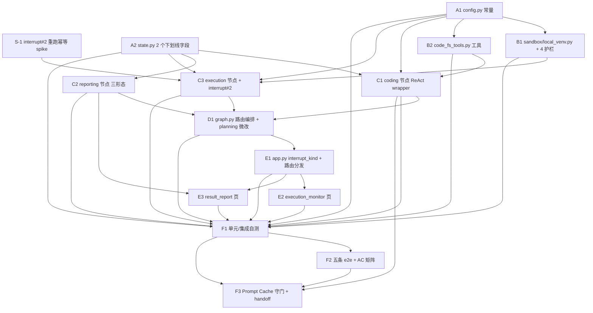

# Sprint 3 开发计划

**产品名称**：Auto-Reproduction —— 论文自动复现系统
**Sprint**：Sprint 3 —— 端到端复现打通（单 agent 修复循环）
**版本**：v1.0
**日期**：2026-06-16
**作者**：全栈开发工程师代理
**状态**：正式版
**对应 PRD**：`docs/sprint3/prd.md` v1.0（S3-01~S3-10 + AC-S3-01~10 + §5 预算 + §8 决策记录）
**对应架构**：`docs/sprint3/architecture.md` v1.0（§2 模块详细设计 + §7 四项已拍板决策 + §8 实现约束清单）

> **默认参数变更注记（2026-06-30，Maria 拍板）**：修复循环三常量默认值放大——`MAX_FIX_LOOP_COUNT` 3→**10**、`MAX_DEV_LOOP_LLM_CALLS` 20→**60**、`MAX_TOTAL_LLM_CALLS` 50→**120**（强约束 60 < 120 不变）。本计划正文涉及数值处已就地更新；已归档检查点（CP-A1-*）描述保留当时跑测时的数值快照，下方括注以新值为准。测试断言要求**引用 `config.MAX_FIX_LOOP_COUNT` 等常量**而非硬编码上限，便于后续再调默认值不破。
**兼容性依据**：`docs/sprint3/dev-loop-compatibility-matrix.md`（2 项 must-fix + 偏差消歧）
**体例参照**：`docs/sprint2/dev-plan.md`

---

## 1. 概述

### 1.1 Sprint 目标

Sprint 3 在 sp1/sp2 已打通的"论文输入 → 分析 → 资源评估 → 规划（interrupt#1 人在回路）"链路之上，**首次打通从论文到复现报告的完整端到端流程**：

- **基础设施层**：新增 `sandbox/local_venv.py`（本地 venv + 4 项硬护栏：超时/输出上限/工作目录限定/子进程隔离，**不上 Docker**）+ `core/tools/code_fs_tools.py`（写/读/列代码文件工具，复用 git_tools 安全范式）；
- **节点层**：把 `coding` / `execution` / `reporting` 三个 pass-through 占位（`core/graph.py` L57-72）替换为真实业务实现 —— coding 走 `_make_react_wrapper`（与 sp1/sp2 节点同构）、execution 手写复合节点（sandbox 执行 + 错误分类 + interrupt#2）、reporting 纯函数式（三形态 Markdown）；
- **编排层**：`core/graph.py` 新增 `coding↔execution` 单 agent 修复回边（上限 `MAX_FIX_LOOP_COUNT=10`）、code_only 路由、第二个 interrupt（dev_loop 失败三选一），**严格保持 7 节点 DAG，不新增任何节点**；
- **配置层**：新增 `MAX_DEV_LOOP_LLM_CALLS=60` 子预算 + `DEV_LOOP_MIN_CALLS_PER_ROUND=2` 入口预算门 + `SANDBOX_*` 护栏常量；`MAX_FIX_LOOP_COUNT=10` 首次接线；
- **状态层**：新增 2 个下划线内部字段 `_dev_loop_route` + `_dev_loop_llm_calls`（§7 已拍板，单值无 reducer 向后兼容）；**严禁给 List 字段加 reducer**（must-fix-1）；
- **UI 层**：Streamlit 后 2 个页面（执行监控页 + 结果报告页，**两页都完整实现，不简化**）。

### 1.2 范围对齐

- **PRD 权威**：`docs/sprint3/prd.md` v1.0（S3-01~S3-10 + AC-S3-01~10 + Q-S3-01~07 + UI 范围全部 RESOLVED）。
- **架构权威**：`docs/sprint3/architecture.md` v1.0（§2 模块详细设计含接口签名/伪代码、§4 关键设计决策、§5 state 字段处置表、§6 改动点清单、§7 四项已拍板决策、§8 实现约束清单）。
- **sp2 基线**：25/25 e2e 全绿（`docs/sprint2` 已转正 PASS）；sp3 仅"加边 / 改条件路由 / 节点位换真实现 + 微增 2 个下划线字段"，对 sp1/sp2 既有契约最小侵入。

### 1.3 §7 四项已拍板决策（dev-plan 全程落实，不可推翻）

> 引自架构 §7「决策记录 2026-06-16 Maria 拍板，全部采纳架构师推荐」+ 本轮任务交底。

1. **新增 2 个下划线内部 state 字段**（回问 1+4 合并）：`_dev_loop_route: Optional[str]`（路由意图：回 coding 修复 vs 到 reporting）+ `_dev_loop_llm_calls: int`（子预算累计）。均单值、无 reducer、向后兼容（PRD §2.9 零改动微破例已批准）。**绝不碰 List 字段、绝不加 reducer。**
2. **revise_plan 回 planning 时 `fix_loop_count` 清零、`fix_loop_history` 保留**（供报告审计），避免改完计划立刻因旧计数触顶。
3. **interrupt#2 重跑幂等 = 启动前置 spike**（类比 sp2 S-1）：验证 execution 函数体内 `interrupt()` 的 resume 重跑行为 + "复用本回合 `execution_result`、不重跑 sandbox"的幂等保护方案。**这是后续阶段的前置门**——spike 不 PASS 则 interrupt#2 实现方案需调整（详见阶段 S）。
4. （回问点 1+4 已合并入第 1 条。）

### 1.4 两项 must-fix（贯穿全程，列入验收）

- **must-fix-1（list 合并策略，对应 AC-S3-05）**：`node_errors` / `degraded_nodes` / `fix_loop_history` 在 `core/state.py` 是**无 `operator.add` reducer 的普通 `List`**（L189/L190/L193 实证）。所有写入走**单点 read-modify-write**（`list(state.get(field, []))` → append → return 整列表，复用 paper_analysis.py L436 范式）。**严禁加 `Annotated[List, operator.add]`** —— 会让 sp1/sp2 所有"return 整列表"节点重复累加（breaking change）。**工程化落点**：每个写这三个 list 的检查点（CP-C2-x / CP-C3-x）显式断言"读出整列表 → append → return"；state.py 改动检查点（CP-B1-x）必须有 grep 断言三字段无 `Annotated`/`operator.add`。
- **must-fix-2（预算扣减回写，对应 AC-S3-04）**：coding 走 `_make_react_wrapper` 自动扣减（react_base.py L889-894，无需手写）；execution **仅在 metrics LLM 抽取兜底触发时**按实际调用次数单点回写 `retry_budget_remaining`（不触发则零扣减，正确语义）；新增 `_dev_loop_llm_calls` 累计字段 + 入口预算门（`retry_budget_remaining < DEV_LOOP_MIN_CALLS_PER_ROUND=2` 直接降级）+ 子预算触顶（`_dev_loop_llm_calls >= MAX_DEV_LOOP_LLM_CALLS=60` 视同修复耗尽）。

### 1.5 关键风险一句话

**interrupt#2 在 execution 函数体内的 resume 重跑幂等是 sp3 单点最大技术风险**（架构 §4.3 / §7 回问 3 / R-S3-06）—— LangGraph `interrupt()` 在节点函数体内调用时 resume 后整节点从头重跑，execution 在 interrupt 前已跑 sandbox（重操作），重跑会重复执行子进程。**必须在阶段 S 通过 spike 验证幂等保护方案，否则 execution 节点（C3）与第二个 interrupt（D1）的实现方案需重评估。** 次要风险：sandbox 跨平台子进程树 kill（R-S3-01）、错误分类准确率（R-S3-04）、B 档 metrics 解析（R-S3-05）。

---

## 2. 任务清单总表

| 任务编号 | PRD 编号 | 任务名 | 产出文件 | 依赖前置 | 估时 | 风险 |
|---|---|---|---|---|---|---|
| **S-1** | -- | Spike：interrupt#2 execution 函数体内重跑幂等 | `scripts/spike_execution_interrupt_idempotency.py` + `docs/sprint3/test-reports/` | sp2 既有 langgraph + checkpointer | 3h | 高 |
| **A1** | S3-08 | `config.py` 新增 sandbox 护栏 + dev_loop 预算 + coding rounds + UI 路由常量 | `config.py` | -- | 1h | 低 |
| **A2** | S3-09 | `core/state.py` 微增 2 个下划线内部字段（`_dev_loop_route` / `_dev_loop_llm_calls`）+ `create_initial_state` 默认值 | `core/state.py` | -- | 1h | 低（向后兼容） |
| **B1** | S3-01 | `sandbox/__init__.py` + `sandbox/local_venv.py`（prepare_venv / run_in_venv / collect_artifacts + 4 护栏） | `sandbox/__init__.py` + `sandbox/local_venv.py` | A1 | 6h | 中 |
| **B2** | S3-02(部分) | `core/tools/code_fs_tools.py`（写/读/列代码文件工具，复用 git_tools 安全范式 + 序列化合规） | `core/tools/code_fs_tools.py` | A1 | 3h | 低 |
| **C1** | S3-02 | `core/nodes/coding.py`（`_make_react_wrapper` + 修复回合反馈注入 + `<METRICS>` 标签约定 + map_result 3 参） | `core/nodes/coding.py` | A1 + A2 + B2 | 5h | 中 |
| **C2** | S3-05 | `core/nodes/reporting.py`（纯函数式三形态 Markdown） | `core/nodes/reporting.py` | A2 | 3h | 低 |
| **C3** | S3-03 + S3-04 + S3-07 | `core/nodes/execution.py`（sandbox 执行 + 错误分类 + B 档判定 + 修复循环边界判定 + interrupt#2 + 三态 resume） | `core/nodes/execution.py` | A1 + A2 + B1 + S-1 | 7h | 高 |
| **D1** | S3-04 + S3-06 + S3-07 | `core/graph.py` 路由编排（三节点位换真实现 + `_route_after_coding` + `_route_after_execution` + 修复回边 + interrupt#2 衔接）+ `planning.py` interrupt_kind 微改 | `core/graph.py` + `core/nodes/planning.py` | C1 + C2 + C3 | 3h | 中 |
| **E1** | S3-10(部分) | `app.py` 新增 `interrupt_kind(thread_id)` helper + UI 路由分发两页 | `app.py` | D1 | 2h | 低 |
| **E2** | S3-10 | `ui/pages/execution_monitor.py`（进度 + 修复循环状态 + sandbox 日志 + dev_loop 失败三按钮决策面板） | `ui/pages/execution_monitor.py` | E1 | 4h | 中 |
| **E3** | S3-10 | `ui/pages/result_report.py`（三形态渲染 + 指标对比表 + artifact + 修复历程 + 返回出口） | `ui/pages/result_report.py` | E1 + C2 | 3h | 低 |
| **F1** | -- | 单元/集成自测全套（mock 单测：sandbox 4 护栏 / 节点 / 路由 / must-fix 断言） | `tests/test_sprint3_*` | A1~E3 | 6h | 中 |
| **F2** | -- | 五条核心 e2e（凭证就绪后补跑，沿用 sp2 范式）+ AC 覆盖矩阵 | `tests/test_sprint3_e2e.py` + 报告 | F1 | 4h | 中 |
| **F3** | -- | Prompt Cache 守门（coding 节点新 prompt 段回归命中率）+ 交付物整理 handoff | `docs/sprint3/test-reports/` + handoff | C1 + F1 | 2h | 中 |

**任务总数**：16 个（1 spike + 2 配置/状态底层 + 2 基础设施 + 3 节点 + 1 graph 编排 + 3 UI/app + 3 集成验收）。

**总估时**：~53h（spike 3h + 落地 38h + 验收 12h）。

---

## 3. 阶段划分与依赖图

6 阶段划分（沿用 sp2 S/A/B/C/D/E... 风格，按 sp3 范围调整命名）：

### 3.1 阶段总览

| 阶段 | 名称 | 任务 | 前置条件 | 产出 | AC 映射 |
|---|---|---|---|---|---|
| **S** | Spike 验证（启动前置门） | S-1 | sp2 既有 langgraph + checkpointer | interrupt#2 重跑幂等结论 + 幂等保护方案验证 | AC-S3-07（间接） |
| **A** | 配置与状态层（P0 阻塞性基础设施） | A1 / A2 | 无（A1/A2 互不依赖） | sandbox/dev_loop 常量就绪、2 个下划线字段就绪 | AC-S3-04 / AC-S3-05 |
| **B** | 基础设施层（P0 sandbox + 工具） | B1 / B2 | A1（A2 不阻塞 B） | 本地 venv 执行 + 4 护栏、代码文件工具 | AC-S3-02 |
| **C** | 节点真实现（P1 核心业务） | C1 / C2 / C3 | A1+A2+B1+B2+S-1 | coding/execution/reporting 三节点 | AC-S3-01/03/04/05/08/09 |
| **D** | graph 路由编排（P1 编排） | D1 | C1 + C2 + C3 | 修复回边 + code_only + interrupt#2 衔接，7 节点编译成功 | AC-S3-06/07/10 |
| **E** | UI 层（P1 用户交互） | E1 / E2 / E3 | D1 | 执行监控页 + 结果报告页两页完整 | AC-S3-01/07/09 |
| **F** | 集成与验收（P2 收尾交付） | F1 / F2 / F3 | A1~E3 | 单测全套 + 五条 e2e + Prompt Cache 守门 + handoff | AC-S3-01~10 全覆盖 |

### 3.2 依赖关系图（Mermaid）



**关键路径**：S-1 → A1+A2 → B1+B2 → C3（含 C1/C2）→ D1 → E1 → E2/E3 → F1 → F2 → F3。

**并行机会**：
- 阶段 A 中 A1 与 A2 互不依赖，可并行；
- 阶段 B 中 B1 与 B2 互不依赖，可并行（都仅依赖 A1）；
- 阶段 C 中 C2（reporting，仅依赖 A2）可与 C1/C3 并行；C1（依赖 A1/A2/B2）与 C3（依赖 A1/A2/B1/S-1）互不依赖可并行；
- 阶段 E 中 E2 与 E3 在 E1 完成后可并行。

**前置门约束**：S-1 是**硬前置门** —— S-1 未 PASS 不得进入 C3（execution interrupt#2 实现）与 D1（interrupt#2 衔接）。其余阶段按依赖链推进。

---

## 4. 任务详细规格

### 阶段 S：Spike 验证（启动前置门）

> **前置条件**：sp2 既有 langgraph + checkpointer.py + planning interrupt 范式（sp2 S-1 已验证 planning interrupt 工作线程内可恢复）。
> **产出**：interrupt#2 在 execution 函数体内的 resume 重跑幂等结论 + "复用本回合 execution_result、不重跑 sandbox"保护方案验证报告。
> **门禁语义**：S-1 PASS 后 C3/D1 才能按既定 interrupt#2 方案落地；S-1 不 PASS 则 interrupt#2 实现方案需与架构师重评估（架构 §4.3 / §7 回问 3）。

#### 任务 S-1：interrupt#2 execution 函数体内重跑幂等 spike

- **模块名**：Spike S-1
- **产出文件**：`scripts/spike_execution_interrupt_idempotency.py` + `docs/sprint3/test-reports/2026-MM-DD_spike-s1-execution-interrupt-idempotency.md`
- **依赖项**：sp2 既有 langgraph + checkpointer（每线程独立 SqliteSaver + WAL）+ `Command(resume=...)` 范式
- **预计复杂度**：中（3h）
- **风险等级**：高（架构 §4.3 / §7 回问 3 / R-S3-06）
- **架构参考**：architecture §2.5.1（interrupt#2 触发位置）/ §4.3（重跑幂等）/ §7 回问 3

**需要实现的内容**：

- 构造最小 StateGraph：单节点 `dummy_execution(state)`，节点函数体内**先做一个带计数副作用的"伪 sandbox 执行"**（如全局计数器 +1 模拟"跑了一次子进程"，并把结果写进 state 的 `execution_result`），**再在函数体内调用 `interrupt()`**（payload 含 `interrupt_kind="dev_loop_failure"` + 伪失败上下文）；
- 编译图绑定 `core/checkpointer.get_checkpointer()`；在工作线程内 `graph.invoke(initial, config)`，触发 interrupt 后暂停；
- **核心断言点 1（重跑行为）**：起新线程 `invoke(Command(resume={"decision": "terminate"}), config)` 恢复，**观测"伪 sandbox 执行"副作用计数器是否被重复触发**（验证 LangGraph 1.x 在节点函数体内 interrupt 的 resume 是否整节点从头重跑）；
- **核心断言点 2（幂等保护方案）**：实现架构 §4.3 缓解方案 —— 在"伪 sandbox 执行"前先检查 `state` 是否已有本回合 `execution_result`（用一个回合标记如 `fix_loop_count` + 已有结果判定），若 resume 重跑则**复用已有结果、跳过伪 sandbox 执行**；断言加保护后副作用计数器只 +1（不重复执行）；
- **核心断言点 3（resume 三态可路由）**：分别用 `{"decision": "terminate"}` / `{"decision": "revise_plan"}` / `{"decision": "export_code"}` 三种 resume，断言 `interrupt()` 返回值即 resume payload，节点能据此写不同的 `user_fix_decision`；
- 记录每个阶段耗时与日志，30 秒内完成。

**自测检查点**：
- [ ] CP-S-1 spike 脚本可直接 `python scripts/spike_execution_interrupt_idempotency.py` 运行，30 秒内输出"interrupt → resume → 状态推进"日志
- [ ] CP-S-2 **确认 LangGraph 在节点函数体内 interrupt 的 resume 重跑语义**：无保护时副作用计数器 > 1（整节点从头重跑实证），结论写入报告
- [ ] CP-S-3 **幂等保护方案有效**：加"复用本回合 execution_result、检测到已有结果则跳过伪 sandbox"保护后，副作用计数器恰为 1（resume 重跑不重复执行 sandbox）—— 这是 C3 execution 节点必须落地的保护契约
- [ ] CP-S-4 三态 resume（terminate / revise_plan / export_code）均能被 `interrupt()` 正确返回，节点据此写对应 `user_fix_decision`
- [ ] CP-S-5 主线程 `graph.get_state(config)` 能识别 interrupt 暂停（`snapshot.next` 非空 + interrupt 元数据），且 payload 含 `interrupt_kind="dev_loop_failure"`（验证 app.py `interrupt_kind` helper 可读到此键）
- [ ] CP-S-6 spike 报告归档到 `docs/sprint3/test-reports/`，含执行日志 + 三个断言点结论 + 给 C3 的幂等保护实现建议

**风险标注**：
- **高风险**：若 CP-S-2 证实重跑且 CP-S-3 保护方案无效（如 LangGraph 在 resume 时不保留 interrupt 前已写入的 state 字段），则 execution 无法在函数体内安全 interrupt —— 需与架构师确认备选方案（如把 interrupt 前的 sandbox 结果先持久化到 checkpoint 再在重跑时读回，或调整 interrupt 触发点）。此为后续阶段硬前置。

---

### 阶段 A：配置与状态层（P0 阻塞性基础设施）

> **前置条件**：无（A1/A2 可与 S-1 并行起步，但 C 阶段需 S-1 PASS）。
> **产出**：sandbox/dev_loop 常量就绪、2 个下划线内部字段就绪，节点/sandbox 可消费。

#### 任务 A1：`config.py` 新增 sp3 常量（S3-08）

- **模块名**：S3-08 预算/配置落地
- **产出文件**：`config.py`（纯追加，不动 sp1/sp2 既有常量）
- **依赖项**：sp2 既有 config.py
- **预计复杂度**：低（1h）
- **风险等级**：低
- **架构参考**：architecture §2.1.1（护栏常量取值依据）/ §8 P0 清单

**需要实现的内容**（值取架构 §2.1.1 给定默认值，不自创）：

| 常量名 | 默认值 | 用途 |
|---|---|---|
| `SANDBOX_EXEC_TIMEOUT` | `1800`（秒，30 分钟） | 单条执行步骤子进程超时（疑似死循环判据） |
| `SANDBOX_VENV_CREATE_TIMEOUT` | `300`（秒） | `python -m venv` 创建超时 |
| `SANDBOX_PIP_INSTALL_TIMEOUT` | `1200`（秒，20 分钟） | 单次 pip install 超时 |
| `SANDBOX_OUTPUT_MAX_BYTES` | `1_048_576`（1 MiB） | stdout/stderr 各自捕获字节上限，超限截断 |
| `SANDBOX_PIP_MAX_RETRIES` | `2` | pip install 网络瞬态失败重试次数 |
| `MAX_DEV_LOOP_LLM_CALLS` | `60` | 修复循环子预算天花板（**强约束 `< MAX_TOTAL_LLM_CALLS=120`**） |
| `DEV_LOOP_MIN_CALLS_PER_ROUND` | `2` | 入口预算门：单回合最小 LLM 调用数 |
| `REACT_MAX_ROUNDS_CODING` | `12` | coding 节点 ReAct max_rounds |
| `STREAMLIT_PAGE_EXECUTION` | `"execution"` | UI 执行监控页路由常量 |
| `STREAMLIT_PAGE_REPORT` | `"report"` | UI 结果报告页路由常量 |

**关键约束**：
- `MAX_TOTAL_LLM_CALLS` / `MAX_FIX_LOOP_COUNT` 默认值于 2026-06-30 经 Maria 拍板放大为 `120` / `10`（见顶部注记）；`MAX_FIX_LOOP_COUNT` 由 sp3 首次在修复循环路由接线引用；
- `SANDBOX_*` 工作目录若需独立子目录，在 `ensure_directories()` 视需要追加（sandbox venv/code/report 均落在 `WORKSPACE_DIR/<thread>/` 下，复用既有 WORKSPACE_DIR）。

**自测检查点**：
- [x] CP-A1-1 `from config import SANDBOX_EXEC_TIMEOUT, SANDBOX_VENV_CREATE_TIMEOUT, SANDBOX_PIP_INSTALL_TIMEOUT, SANDBOX_OUTPUT_MAX_BYTES, SANDBOX_PIP_MAX_RETRIES, MAX_DEV_LOOP_LLM_CALLS, DEV_LOOP_MIN_CALLS_PER_ROUND, REACT_MAX_ROUNDS_CODING, STREAMLIT_PAGE_EXECUTION, STREAMLIT_PAGE_REPORT` 全部可导入 — `tests/test_sprint3_a1.py::test_cp_a1_1_*` PASS（2026-06-23）
- [x] CP-A1-2 全表值逐项断言（`SANDBOX_EXEC_TIMEOUT==1800` / `SANDBOX_OUTPUT_MAX_BYTES==1048576` / `MAX_DEV_LOOP_LLM_CALLS==60`（2026-06-30 由 20 放大） / `DEV_LOOP_MIN_CALLS_PER_ROUND==2` / `REACT_MAX_ROUNDS_CODING==12` 等）+ 严格类型断言（int/str） — `test_cp_a1_2_*` PASS
- [x] CP-A1-3 **强约束断言 `MAX_DEV_LOOP_LLM_CALLS < MAX_TOTAL_LLM_CALLS`（60 < 120）**（AC-S3-04 ② 直接验收点） — `test_cp_a1_3_*` PASS
- [x] CP-A1-4 sp1/sp2 既有常量基线断言（`MAX_TOTAL_LLM_CALLS==120` / `MAX_FIX_LOOP_COUNT==10`，默认值 2026-06-30 经 Maria 拍板放大；`git diff` 实证 config.py sp3 部分纯追加）— `test_cp_a1_4_*` PASS

---

#### 任务 A2：`core/state.py` 微增 2 个下划线内部字段（S3-09）

- **模块名**：S3-09 state 字段微调
- **产出文件**：`core/state.py`（追加 2 个下划线字段 + `create_initial_state` 默认值，**不碰 List 字段、不加 reducer、不动 FixLoopRecord**）
- **依赖项**：sp2 既有 state.py
- **预计复杂度**：低（1h）
- **风险等级**：低（向后兼容，单值字段 last-write-wins）
- **架构参考**：architecture §5 state 字段处置表 / §7 回问 1+4（Maria 已拍板新增）

**需要实现的内容**：

| 改动类型 | 位置 | 内容 |
|---|---|---|
| **追加字段** | `GlobalState` | `_dev_loop_route: Optional[str]`（路由意图标记，execution 写，`_route_after_execution` 读；取值如 `"retry_coding"`） |
| **追加字段** | `GlobalState` | `_dev_loop_llm_calls: int`（子预算累计，coding/execution 在修复回合内 read-modify-write 累加；默认 0） |
| **默认值** | `create_initial_state` | `_dev_loop_route=None` / `_dev_loop_llm_calls=0` |
| **零改动（仅复用）** | `code_output_dir`/`execution_result`/`report_path`/`execution_mode`/`fix_loop_count`/`fix_loop_history`/`user_fix_decision`/`retry_budget_remaining`/`node_errors`/`degraded_nodes` | sp3 首次写入/激活，字段定义零改动 |
| **不追加** | `FixLoopRecord` | 单 agent 下 5 字段足够，**不加** `reviewer_verdict`/`coder_confidence`/`agent_trace`（multi-agent 专属，顺延 sp4+，PRD §4.2） |

**关键约束（must-fix-1 钉死）**：
- **绝不给 `node_errors`/`degraded_nodes`/`fix_loop_history` 加 `Annotated[List, operator.add]`**；
- 新增 2 字段均为单值（`Optional[str]` / `int`），last-write-wins 正确，**无 reducer**；
- 下划线前缀标识"内部字段，UI 不直接展示原始字段名"（沿用 sp2 `_planning_revise_count` 范式）。

**自测检查点**：
- [x] CP-A2-1 `GlobalState.__annotations__` 含 `_dev_loop_route` 与 `_dev_loop_llm_calls`，类型分别为 `Optional[str]` / `int` — `tests/test_sprint3_a2.py::test_cp_a2_1_*` PASS（2026-06-23）
- [x] CP-A2-2 `create_initial_state(...)` 返回 `state["_dev_loop_route"] is None` 且 `state["_dev_loop_llm_calls"] == 0`（默认值正确）— `test_cp_a2_2_*` PASS（老形态+新形态入参均覆盖）
- [x] CP-A2-3 **must-fix-1 grep 断言（AC-S3-05 ① 强制验收点）**：`grep -nE "Annotated|operator.add" core/state.py` 对 `node_errors`/`degraded_nodes`/`fix_loop_history` 三字段**零命中**，三字段仍为普通 `List` — `test_cp_a2_3_*` PASS（grep 全文件零命中 + `get_origin is list` 双重证）
- [x] CP-A2-4 `FixLoopRecord.__annotations__` 仍为 5 字段（`round_number`/`error_summary`/`error_category`/`fix_strategy`/`timestamp`），未追加 multi-agent 字段 — `test_cp_a2_4_*` PASS
- [x] CP-A2-5 **sp1/sp2 全量回归 pytest 不退化**（非 e2e 核心单测全绿，确认追加字段不破坏既有反序列化/初始化）— `pytest -q -m "not e2e" --ignore=tests/test_paper_intake.py` **575 passed / 25 skipped / 0 failed**（sp2 基线 559 + 本阶段 16 新用例，既有零退化）

---

### 阶段 B：基础设施层（P0 sandbox + 工具）

> **前置条件**：A1 完成（B 仅依赖 config 常量；A2 不阻塞 B）。
> **产出**：本地 venv 执行 + 4 护栏、代码文件工具，节点层可消费。

#### 任务 B1：`sandbox/local_venv.py` + 4 项护栏（S3-01）

- **模块名**：S3-01 sandbox 本地 venv 执行环境
- **产出文件**：`sandbox/__init__.py`（空包标识）+ `sandbox/local_venv.py`
- **依赖项**：A1（`SANDBOX_*` 常量）+ `config.WORKSPACE_DIR` + `core.errors`（`SandboxError` 家族，sp1 已定义于 errors.py，sp3 首次使用）+ `subprocess`/`os`/`signal`/`sys`/`pathlib`（stdlib）
- **预计复杂度**：中（6h）
- **风险等级**：中（跨平台子进程树 kill 是最关键落点，R-S3-01）
- **架构参考**：architecture §2.1.2（接口签名）/ §2.1.3（4 护栏跨平台实现）/ §2.1.4（venv 复用/pip 降级）

**需要实现的内容**（接口签名严格对齐架构 §2.1.2）：

| 接口 | 签名 | 关键约束 |
|---|---|---|
| `SandboxRunResult`（dataclass） | `exit_code/stdout/stderr/duration_seconds/timed_out/output_truncated/command` | 单次子进程执行结构化结果 |
| `SandboxPrepareResult`（dataclass） | `success/venv_dir/python_exe/pip_exe/env_info/install_log/install_failed_packages/error` | venv 创建+依赖安装结果 |
| `prepare_venv` | `(work_dir, requirements=None, requirements_files=None, reuse_existing=True, venv_timeout=..., pip_timeout=...) -> SandboxPrepareResult` | `work_dir` resolve+is_relative_to(WORKSPACE_DIR) 校验越界抛 `SandboxCreationError`；venv 落 `work_dir/.venv`；`reuse_existing` 且 `.venv/pyvenv.cfg` 存在则跳过创建；pip 网络瞬态按 `SANDBOX_PIP_MAX_RETRIES` 退避重试 |
| `run_in_venv` | `(python_exe, command, work_dir, timeout=..., output_max_bytes=..., extra_env=None) -> SandboxRunResult` | 4 护栏（见下）；`command` 列表形式；cwd 强制为校验后 work_dir |
| `collect_artifacts` | `(work_dir, patterns=None) -> List[str]` | 扫描产物路径（绝对路径，限定 workspace 下），默认 glob `*.pt/*.pth/*.ckpt/*.png/*.json/*.csv` 等 |

**4 项护栏实现（架构 §2.1.3 逐条落地，硬要求）**：
1. **执行超时 + 跨平台子进程树 kill**：用 `subprocess.Popen` + `communicate(timeout=)`（非 `subprocess.run`，因需访问 pid）；POSIX `start_new_session=True` + 超时 `os.killpg(os.getpgid(proc.pid), SIGKILL)`；Windows `creationflags=CREATE_NEW_PROCESS_GROUP` + `CTRL_BREAK_EVENT`/`proc.kill()`；超时后 `communicate()` 回收残余输出避免管道死锁，置 `timed_out=True`；
2. **输出字节截断**：`communicate` 返回 bytes 后对 stdout/stderr **各自**按 `output_max_bytes` 截断，**保留尾部**（错误栈在末尾），置 `output_truncated=True`；
3. **工作目录限定**：所有 `work_dir`/`venv_dir`/`python_exe` 入参执行前经 `resolve()+is_relative_to(WORKSPACE_DIR.resolve())` 校验（**复用 git_tools `_is_within_workspace` 范式**），越界抛 `SandboxCreationError`；子进程 cwd 强制设为校验后 work_dir；
4. **子进程隔离**：每条命令独立 Popen（新进程组/会话）；`_run_subprocess` 内 `try/except` 兜底任何 OSError 转 `SandboxRunResult(exit_code=-1, ...)` 返回，**绝不让异常逃逸**到 execution 节点之外（沿用 ReAct 子图"工具异常不杀子图"治理）。

**硬约束（BUG-S1-02 / sp2 安全范式）**：
- 子进程**禁 `shell=True`**，`command` 一律列表形式；
- 路径越界一律 `resolve()+is_relative_to`；
- 本模块为纯基础设施（无 LLM、无 GlobalState 依赖），只接收路径/命令/护栏参数返回 dataclass。

**自测检查点**（全部 mock 单测，不依赖真实长训练；AC-S3-02 四护栏映射）：
> **B1 完成验收（2026-06-23，@全栈开发代理）**：`tests/test_sprint3_b1.py` CP-B1-1~9 全绿（23 passed，含每 CP 主用例 + 补充用例），连跑 3 次零 flaky、`ps` 查无残留子进程；非 e2e 回归 608 passed（阶段 A 基线 585 + B1 新增 23 零退化，唯一 1 failed=`test_cp_a1_4` 时序假设失效非 B1 引入）。**关键实现偏差（已记 TODO）**：护栏 3 对 `python_exe` 改用 lexical 校验（不解符号链接），因 venv `bin/python` 本身是指向系统解释器的符号链接，`resolve()` 会误判越界——work_dir/venv_dir/requirements_files 仍用 `resolve()`（写入副作用路径防符号链接逃逸）。
- [x] CP-B1-1 `prepare_venv` 对合法 work_dir 创建 venv 返回 `success=True` + 合法 `python_exe`/`pip_exe`（在受控 tmp workspace 跑真实轻量 venv）
- [x] CP-B1-2 **护栏 1 超时（AC-S3-02 ①）**：真实 sleep 30 子进程 + timeout=2，`run_in_venv` 在上限内强制终止返回 `timed_out=True`，子进程树（含孙进程）被 killpg 杀（getpgid 探测 ProcessLookupError 证无残留进程）
- [x] CP-B1-3 **护栏 2 输出截断（AC-S3-02 ②）**：真实 5000B 输出 + output_max_bytes=1000，返回 `output_truncated=True`，保留尾部（TAIL_MARKER_END 在），截断后体积受控
- [x] CP-B1-4 **护栏 3 工作目录限定（AC-S3-02 ③）**：`prepare_venv`/`run_in_venv`/`collect_artifacts` 对 `work_dir`（及 `python_exe`）越界（如 `/etc`、`/usr/bin/python`）抛 `SandboxCreationError`，校验在 subprocess 之前（Popen 0 次调用，spy 断言）
- [x] CP-B1-5 **护栏 4 子进程隔离（AC-S3-02 ④）**：子进程非 0 exit（42）/ Popen OSError / 真实缺失二进制（FileNotFoundError），`run_in_venv` 不抛异常逃逸，返回 `SandboxRunResult(exit_code=-1 或非 0)`
- [x] CP-B1-6 `subprocess.Popen` 全部不使用 `shell=True`（spy 录制 run_in_venv + prepare_venv 全路径 Popen.args 是列表 + shell 不为 True）
- [x] CP-B1-7 `reuse_existing=True` 且 `.venv/pyvenv.cfg` 已存在时跳过创建（spy 断言无 `-m venv` 命令）；reuse_existing=False 反向证重建
- [x] CP-B1-8 pip 装不上的包（mock pip exit 非 0）记入 `install_failed_packages`，`success=False`，**不抛异常**（含瞬态退避重试 3 次 / 非瞬态不重试 / venv 创建失败降级三补充用例）
- [x] CP-B1-9 `collect_artifacts` 收集产物路径均为绝对路径且限定 WORKSPACE_DIR 下（跳过 .venv 干扰文件 / 自定义 patterns / 缺失目录返回空）

**风险标注**：
- **中风险**：跨平台子进程树 kill —— sp3 MVP 主测 Linux（与 sp2 git_tools 一致仅声明 Linux/macOS 支持，Windows 分支代码保留但不强测）。
- **中风险（归 v1.x，非阻塞）**：`communicate()` 先把全量输出读进内存再截断，疑似失控输出在截断前已占内存 —— MVP 靠超时护栏杀进程兜底（架构 R-A1）。

---

#### 任务 B2：`core/tools/code_fs_tools.py`（S3-02 工具部分）

- **模块名**：代码文件读写工具
- **产出文件**：`core/tools/code_fs_tools.py`
- **依赖项**：A1（WORKSPACE_DIR）+ `core.errors` + `langchain_core.tools`（@tool / BaseTool）+ `pathlib`/`json`
- **预计复杂度**：低（3h）
- **风险等级**：低（同构 git_tools）
- **架构参考**：architecture §2.2.3（coding 工具集）/ §8 P0 清单

**需要实现的内容**（**严格复用 git_tools 安全范式**）：

| 工具工厂 | 内部能力 | 关键约束 |
|---|---|---|
| `make_write_code_file_tool()` | 写文件到 `code_output_dir` | 目标路径 `resolve()+is_relative_to(WORKSPACE_DIR)` 校验越界拒绝 |
| `make_read_code_file_tool()` | 读 `code_output_dir` / `selected_repo.local_path` 下文件 | 同上路径校验 |
| `make_list_dir_tool()` | 列目录（限定 workspace） | 同上路径校验 |

**硬约束（BUG-S1-02 治理范式）**：
- ToolMessage 序列化用 `_serialize_tool_result(result)` = `json.dumps(result, ensure_ascii=False, sort_keys=True, default=str)`（**禁 `str(dict)`**，否则下游 `extract_last_tool_result` 的 `json.loads` 永久失败，BUG-S1-02 隐蔽坑）；返回 `str` 的工具保持原样；
- 路径越界一律 `resolve()+is_relative_to(WORKSPACE_DIR.resolve())`；
- `@tool` 工厂 + `try/except` 兜底，工具异常转错误描述字符串返回，**不抛异常打断 ReAct 子图**（沿用 sp1/sp2 工具工厂治理）。

**自测检查点**：
- [x] CP-B2-1 `make_write_code_file_tool()` 写文件到 code_output_dir 成功，返回合法 JSON（`json.loads` 不报错）；越界路径（如 `/tmp/x` 或 `../`）被拒绝
- [x] CP-B2-2 `make_read_code_file_tool()` 读已存在文件返回内容；越界路径拒绝；不存在文件返回错误描述字符串（不抛异常）
- [x] CP-B2-3 `make_list_dir_tool()` 列目录返回合法 JSON；越界拒绝
- [x] CP-B2-4 三工具工厂均返回 `BaseTool` 实例；ToolMessage 输出含中文不转义（`ensure_ascii=False`）+ 键字典序（`sort_keys=True`），`json.loads` 可解析（**断言禁 `str(dict)`**）
- [x] CP-B2-5 工具内部异常（如写权限错误）被 `try/except` 捕获转字符串返回，ReAct 子图不被打断

---

### 阶段 C：节点真实现（P1 核心业务）

> **前置条件**：A1 + A2 完成；C1/C3 依赖 B2/B1；**C3 硬依赖 S-1 PASS**（interrupt#2 幂等保护方案）。
> **产出**：coding/execution/reporting 三节点真实现，满足 `(GlobalState) -> dict` 签名。

#### 任务 C1：`core/nodes/coding.py`（S3-02）

- **模块名**：S3-02 coding 节点真实现
- **产出文件**：`core/nodes/coding.py`
- **依赖项**：A1（REACT_MAX_ROUNDS_CODING）+ A2 + B2（code_fs_tools）+ `core/react_base.py`（`_make_react_wrapper`）+ `core/llm_client.py` + `core/tools/deepxiv_tools`（read_section）/ web_search
- **预计复杂度**：中（5h）
- **风险等级**：中（修复回合反馈注入 + Prompt Cache 守门）
- **架构参考**：architecture §2.2（节点形态/build_context/工具集/map_result）

**需要实现的内容**（**复用 `_make_react_wrapper`**，与 paper_intake/analysis/resource_scout 同构）：

```
coding = _make_react_wrapper(
    node_name="coding",
    build_context=_build_coding_context,        # 修复回合反馈注入
    build_system_prompt=_build_coding_system_prompt,
    get_tools=_get_coding_tools,
    map_result=_map_coding_result,               # 3 参签名（含 react_messages）
    max_rounds=REACT_MAX_ROUNDS_CODING,
    result_schema=CODING_OUTPUT_SCHEMA,
)
```

- **`_build_coding_context`**（curated 上下文，HumanMessage 通道，`sort_keys` 字节幂等）：读 `reproduction_plan`（code_strategy/execution_steps/deliverables/environment）+ `resource_info.selected_repo.local_path`（sp2 落地，直接复用无需重 clone）+ `paper_analysis` **英文事实层字段**（`method_summary_en`/`datasets`/`framework`/`hardware_requirements_en`，避免中英混杂喂代码生成，sp2 §4.7.5）；
- **修复回合反馈注入**（架构 §2.2.2）：读 `state["execution_result"]` + `fix_loop_count > 0` 判定为修复回合 → 注入 `_digest_execution_feedback`（裁剪：errors 全部 + error_category + stderr 尾部 ~2000 字符，不注入完整 logs）→ prompt 切到"在 `code_output_dir` 现有代码上有针对性修改"模式（非从头重生成）；
- **`_get_coding_tools`**：`make_write_code_file_tool` / `make_read_code_file_tool` / `make_list_dir_tool`（B2）+ `read_section_tool`（回读论文核对实现）+ `web_search_tool`（查依赖/API）；
- **`<METRICS>` 标签约定（关键，缓解 R-S3-05）**：coding system prompt 明确要求复现入口脚本**末尾以 `<METRICS>{...}</METRICS>` 打印关键指标 JSON**（把异构输出解析难题前移到代码生成阶段，提升 B 档成功率）；
- **`_map_coding_result`（3 参签名，含 react_messages）**：写 `code_output_dir`（首轮新建 `workspace_dir/<thread>/code`，修复回合复用同目录，幂等）+ `current_step="coding"`；ReAct 失败（无文件产出）→ `degraded_nodes` append + `node_errors` append（走单点 read-modify-write，must-fix-1），打 WARNING；**不写 `fix_loop_count`**（自增点在 execution 出口，§2.5.2 避免双点写）；`retry_budget_remaining` 由 wrapper 自动 setdefault 回写（**不在此覆盖**，must-fix-2）。

**Prompt Cache 守门（方案 A 前缀治理，沿用 sp1/sp2）**：
- coding system prompt 主体导出为常量（如 `_CODING_SYSTEM_PROMPT_BODY`），**主体内不得出现任何论文级动态变量**；
- 论文级动态上下文（arxiv_id/paper_meta 等）放 system prompt 尾部独立段落，用 `json.dumps(..., sort_keys=True, ensure_ascii=False)` 渲染保字节幂等；
- 配套测试：F3 需有"主体字节级一致"断言（两篇不同论文截 SystemMessage 去尾部段落后比较，参 `test_paper_analysis_e2e.py::test_e2e_prompt_cache_system_prompt_byte_identical`）。

**自测检查点**：
- [x] CP-C1-1 `from core.nodes.coding import coding` 可导入；`coding` 为 callable，`inspect.signature` 形参为 `(state)`（wrapper 产物）
- [x] CP-C1-2（mock LLM）首轮 coding 正常产出代码文件到 `code_output_dir`，返回 dict 含 `code_output_dir`/`current_step="coding"`
- [x] CP-C1-3（mock）修复回合（`fix_loop_count>0` 且 `execution_result` 非空）：`_build_coding_context` 注入上轮 stderr 尾部 + error_category，prompt 切到"现有代码上修改"模式（断言 context payload 含 `last_error_summary`/`fix_round`）
- [x] CP-C1-4 `_map_coding_result` 是 3 参签名（`inspect` 断言含 `react_messages`）；coding ReAct 失败时走 read-modify-write 写 `node_errors`/`degraded_nodes`（**must-fix-1 断言：读出整列表 → append → return**），并打 WARNING
- [x] CP-C1-5 `_map_coding_result` **不写 `fix_loop_count`**（断言返回 dict 无该键）；`retry_budget_remaining` 不被 map_result 覆盖（must-fix-2）
- [x] CP-C1-6 coding system prompt 主体常量内**无 arxiv_id/paper_meta 等论文级动态变量**（字节级一致守门，归 F3 回归）
- [x] CP-C1-7 ToolMessage 序列化合规（间接经 B2 工具，断言不出现 `str(dict)` repr）

**风险标注**：
- **中风险**：修复回合反馈注入若裁剪不当（stderr 过长）会撑爆 context —— 按架构 §2.2.2 裁剪策略（尾部 ~2000 字符）控制。

---

#### 任务 C2：`core/nodes/reporting.py`（S3-05）

- **模块名**：S3-05 reporting 节点真实现
- **产出文件**：`core/nodes/reporting.py`
- **依赖项**：A2 + `core/state.py`（只读）+ `pathlib`
- **预计复杂度**：低（3h，纯函数式无 LLM 无 interrupt）
- **风险等级**：低
- **架构参考**：architecture §2.4（三形态映射表）

**需要实现的内容**（纯函数式 `reporting(state) -> dict`，无 LLM、无 interrupt）：

- **`_determine_report_form(state)` 三形态判定（优先级从上到下）**：
  1. `execution_mode == CODE_ONLY` → `"code_only"`；
  2. `execution_result.success == True` → `"full_success"`；
  3. 其余（含 `execution_result is None` 但非 code_only、success=False、export_code）→ `"degraded"`；
- **三形态内容映射（读字段，不写）**：
  - **full_success**：结论卡片(成功) + **指标对比表**（并列 `paper_analysis.baseline_results`/`reproduction_plan.expected_results` 与 `execution_result.metrics`，**仅展示对比不硬判定**，Q-S3-01 B 档）+ artifact 清单（`execution_result.artifacts`）+ 执行概况（runtime/env）；
  - **code_only**：结论卡片(仅生成代码) + 代码位置（`code_output_dir`）+ deliverables 清单（`reproduction_plan.deliverables`），**无指标章节**，标注"仅生成代码、未执行"；
  - **degraded**：结论卡片(未成功复现+降级原因) + 降级原因 + `node_errors` 摘要（解析 `[error_category=...]` 前缀）+ **`fix_loop_history` 修复历程**（修复几轮、每轮什么错、什么策略）+ 保留的代码与产物 + `user_fix_decision`；
- **产出**：写 Markdown 到 `report_path`（`workspace_dir/<thread>/report.md`，`resolve()+is_relative_to` 校验）+ `current_step="reporting"`；
- **语言策略（sp2）**：叙述中文，事实层（数据集名/指标名/仓库 URL）英文。

**自测检查点**：
- [x] CP-C2-1 `from core.nodes.reporting import reporting` 可导入；签名 `(state) -> dict`
- [x] CP-C2-2 **full_success 形态（AC-S3-09 ①）**：`execution_result.success=True` → 报告含指标对比表（baseline vs 复现值）+ artifact 清单 + 成功结论；`report_path` 非空
- [x] CP-C2-3 **code_only 形态（AC-S3-09 ②）**：`execution_mode==CODE_ONLY` → 含代码位置 + deliverables，标注"仅生成代码"，**无指标章节**；`execution_result is None` 时仍产有效报告
- [x] CP-C2-4 **degraded 形态（AC-S3-09 ③）**：success=False / export_code → 标 `degraded`，含降级原因 + node_errors 摘要 + **fix_loop_history 修复历程** + 保留代码
- [x] CP-C2-5 reporting **不写任何 list 字段**（纯读，断言返回 dict 仅含 `report_path`/`current_step`，无 node_errors/degraded_nodes 覆盖风险）
- [x] CP-C2-6 `report_path` resolve+is_relative_to(WORKSPACE_DIR) 校验，落在 workspace 下

---

#### 任务 C3：`core/nodes/execution.py`（S3-03 + S3-04 + S3-07）

- **模块名**：S3-03 execution 节点 + S3-04 修复循环边界 + S3-07 interrupt#2
- **产出文件**：`core/nodes/execution.py`
- **依赖项**：A1 + A2 + B1（sandbox）+ **S-1 PASS（interrupt#2 幂等保护方案）** + `core/state.py` + `core/errors.py` + `langgraph.types.interrupt` + `datetime`（FixLoopRecord.timestamp）
- **预计复杂度**：高（7h，手写复合节点 + 错误分类 + interrupt#2 重跑幂等）
- **风险等级**：高（sp3 单点最大风险，架构 §4.3 / §7 回问 3）
- **架构参考**：architecture §2.3（节点骨架/错误分类/metrics 解析/B 档判定）/ §2.5.1（interrupt#2 触发）/ §2.5.2（fix_loop_count 自增点）/ §2.5.4（resume 三态）/ §4.5（预算回写）

**需要实现的内容**（手写复合节点 `execution(state) -> dict`，与 planning 同构）：

- **节点骨架（架构 §2.3.1）**：① `prepare_venv`（sandbox）→ ② 逐条 `run_in_venv` 执行 `execution_steps` 聚合 → ③ `_classify_execution`（错误分类）→ ④ `_parse_metrics`（三档）→ ⑤ `_build_execution_result`（B 档 success）→ ⑥ `_map_execution_result`（单点 read-modify-write）→ ⑦ `_maybe_interrupt_or_return`（修复循环边界 + 可能 interrupt#2）；
- **interrupt#2 幂等保护（S-1 验证的契约，架构 §4.3）**：进入 sandbox 执行前**检查 `state` 是否已有本回合 `execution_result`**（resume 重跑时复用、不重跑 sandbox）—— 这是 C3 必须落地的保护，依据 S-1 spike 的 CP-S-3 结论实现；
- **错误分类载体（架构 §2.3.2，节点本地 dataclass，不进 state.py）**：
  - `ErrorCategory(str, Enum)`：可修复类 `{SYNTAX, IMPORT, DEPENDENCY, PATH, RUNTIME}` + 不可修复类 `{DATA_MISSING, HARDWARE, TIMEOUT, UNRESOLVED_RESOURCE}` + `NONE`；
  - `AUTO_FIXABLE` 集合驱动路由；
  - `ExecutionFeedback`（dataclass：`category/auto_fixable/summary/fix_hint/representative_stderr`）；
  - `_classify_execution`：超时优先（不可修复）→ 依赖装不上（可修复）→ stderr 关键字匹配（硬件/数据缺失先于通用 runtime）→ 兜底 RUNTIME（可修复，给一次机会，上限拦截，缓解 R-S3-04）；
- **metrics 三档解析（架构 §2.3.3，缓解 R-S3-05）**：档 1 结构化 `<METRICS>...</METRICS>` 标签（首选）→ 档 2 正则按指标名扫描（锚点 = `paper_analysis.metrics` 英文事实字段）→ 档 3 LLM 抽取兜底（仅 exit 0 且 stdout 非空时触发，**按实际 1 次调用回写预算**，must-fix-2）；
- **B 档 success 判定（架构 §2.3.5，Q-S3-01）**：`success = (prep.success and all(exit_code==0)) and len(metrics) >= 1`；
- **`_map_execution_result`（must-fix-1）**：写 `execution_result`/`current_step`；失败时细分类 → 三态映射写进 `NodeError.error_message` 的 `[error_category=...]` 前缀（**细分类不进 `error_type`，error_type 严格保持 transient/permanent/degraded** —— 可修复→transient，不可修复→permanent）；`node_errors`/`degraded_nodes` 走 read-modify-write；打 WARNING（非静默吞错，BUG-S1-02/03）；
- **`_maybe_interrupt_or_return`（修复循环边界，架构 §2.5.1）**：
  - 成功 → 返回（出边到 reporting）；
  - 可修复 + `fix_loop_count < MAX_FIX_LOOP_COUNT(10)` + `retry_budget_remaining >= DEV_LOOP_MIN_CALLS_PER_ROUND(2)` + `_dev_loop_llm_calls < MAX_DEV_LOOP_LLM_CALLS(60)` → **`fix_loop_count += 1`（单点，§2.5.2）** + `fix_loop_history` append 一条 `FixLoopRecord`（read-modify-write）+ `_dev_loop_route="retry_coding"` → 返回（出边回 coding）；
  - **入口预算门**：`retry_budget_remaining < 2` → 直接降级（标 degraded → reporting，不 interrupt，PRD §5）；
  - 修复耗尽 or 不可修复 or 子预算触顶 → **函数体内 `interrupt(_build_dev_loop_interrupt_payload(...))`**（payload 含 `interrupt_kind="dev_loop_failure"` + `fix_loop_history`/`execution_result` 失败上下文）；
- **`_route_user_fix_decision`（interrupt#2 resume 三态，架构 §2.5.4，dict + "decision" 键，与 sp2 planning 一致）**：
  - `terminate` → `current_step="cancelled_by_user"`（→ END，checkpoint 保留）；
  - `revise_plan` → 写 `_planning_user_feedback`(修复上下文) + `reproduction_plan.approved=False` + **`fix_loop_count` 清零、`fix_loop_history` 保留**（§7 决策 2）→ 回 planning；
  - `export_code` → 标 `degraded` + `user_fix_decision="export_code"` → reporting 降级形态；
  - 非法 payload 防御兜底视为 terminate（不空转）。

**关键约束**：
- **fix_loop_count 单点自增**：仅在"回 coding"分支自增，interrupt/降级分支不自增（AC-S3-08）；
- **预算 must-fix-2**：execution 主体不调 LLM（零扣减正确）；仅 metrics LLM 抽取兜底触发时按实际次数单点回写 `retry_budget_remaining` + 累加 `_dev_loop_llm_calls`；
- **must-fix-1**：`node_errors`/`degraded_nodes`/`fix_loop_history` 全部 read-modify-write 单点写回。

**自测检查点**：
> **C3 完成验收（2026-06-27，@全栈开发代理）**：`tests/test_sprint3_c3.py` CP-C3-1~14 全绿（25 passed，含每 CP 主用例 + metrics 三档/B 档/非法 resume 兜底补充用例），连跑 3 次零 flaky（0.68/0.67/0.69s，interrupt/checkpointer 用例用唯一 `uuid4` thread_id）；全量非 e2e 回归 **782 passed / 0 failed / 25 skipped / 1 warning**（基线 757 + C3 新增 25 零退化）。**interrupt#2 重跑幂等落地形态（S-1 CP-S-3 契约）**：execution 首次失败回合若判定需 interrupt 则先 return 落盘 `execution_result` + 置 `_dev_loop_route="await_dev_loop_interrupt"`（commit 边界），不 interrupt；由 D1 self-loop 路由（`await → execution`）重入后 guard 命中跳过 sandbox 再函数体内 `interrupt()`，resume 重跑只重跑 commit 后的这次进入 → sandbox 副作用恰为 1（CP-C3-13 断言 prepare 计数恒 1）。**对 D1 交接**：`_route_after_execution` 必须把 `_dev_loop_route=="await_dev_loop_interrupt"` 路由回 execution（self-loop），把 `=="retry_coding"` 路由回 coding，其余按 `user_fix_decision` 三态 / `execution_result.success` 兜底。
- [x] CP-C3-1 `from core.nodes.execution import execution` 可导入；签名 `(state) -> dict`；`ErrorCategory`/`ExecutionFeedback`/`AUTO_FIXABLE` 为节点本地对象（**断言不在 `core/state.py`**）— `test_cp_c3_1_*` PASS
- [x] CP-C3-2（mock sandbox 返回 exit 0 + 可解析 metrics）**B 档成功（AC-S3-01）**：`execution_result.success=True`，`metrics` 至少 1 个；出边到 reporting（不 interrupt、不回 coding）— `test_cp_c3_2_*` PASS（含 exit0 无指标→success=False 反证）
- [x] CP-C3-3 **错误分类分流（AC-S3-08）**：可修复类（syntax/import/dependency/path/runtime）→ `auto_fixable=True`；不可修复类（timeout/hardware/data_missing/unresolved_resource）→ `auto_fixable=False`；分类映射两类断言 — `test_cp_c3_3_*` PASS（含硬件先于 runtime 顺序敏感）
- [x] CP-C3-4 **修复回边计数（AC-S3-03 ①②）**：mock 可修复失败 + `fix_loop_count<3` + 预算够 → `fix_loop_count+1` + `fix_loop_history` append 一条 FixLoopRecord（5 字段）+ `_dev_loop_route="retry_coding"` — `test_cp_c3_4_*` PASS
- [x] CP-C3-5 **上限拦截（AC-S3-03 ③）**：`fix_loop_count==MAX_FIX_LOOP_COUNT`（默认 10）时不再回 coding、不自增，转 interrupt#2 — `test_cp_c3_5_*` PASS（首次进入置 await、不自增；断言引用常量）
- [x] CP-C3-6 **不可修复不重试（AC-S3-08 ②）**：不可修复类失败 → `fix_loop_count` 不自增、不回 coding，直接 interrupt#2（或降级）— `test_cp_c3_6_*` PASS（permanent 三态映射 + 前缀断言）
- [x] CP-C3-7 **interrupt#2 三态 resume（AC-S3-07）**：`Command(resume=...)` 注入三态：terminate→`current_step="cancelled_by_user"`；revise_plan→`_planning_user_feedback`+`approved=False`+**`fix_loop_count` 清零、`fix_loop_history` 保留**；export_code→`degraded`+`user_fix_decision="export_code"` — `test_cp_c3_7_*` PASS（最小 self-loop StateGraph + InMemorySaver 跑真实 interrupt + 非法 payload 兜底 terminate）
- [x] CP-C3-8 **预算回写（AC-S3-04 ①）**：metrics LLM 抽取兜底触发时 `retry_budget_remaining` 按实际次数单点回写、`_dev_loop_llm_calls` 累加；不触发时 execution 对预算零扣减 — `test_cp_c3_8_*` PASS（触发 30→29 / +1；档 1 命中不写预算键）
- [x] CP-C3-9 **入口预算门（AC-S3-04 ③）**：`retry_budget_remaining < 2` 时直接降级（标 degraded、不进修复循环、不 interrupt）— `test_cp_c3_9_*` PASS
- [x] CP-C3-10 **子预算触顶（AC-S3-04 ②）**：`_dev_loop_llm_calls >= 20` 时视同修复耗尽，转 interrupt#2 — `test_cp_c3_10_*` PASS
- [x] CP-C3-11 **must-fix-1**：`node_errors`/`degraded_nodes`/`fix_loop_history` 写入均 read-modify-write（断言读出整列表 → append → return，多回合无丢失无重复累加）— `test_cp_c3_11_*` PASS（原 state list 未被原地 mutate）
- [x] CP-C3-12 **细分类承载位置**：`ErrorCategory` 写进 `NodeError.error_message` 的 `[error_category=...]` 前缀，`NodeError.error_type` 严格三态（断言不出现 syntax/import 等细分类值）— `test_cp_c3_12_*` PASS
- [x] CP-C3-13 **interrupt#2 重跑幂等（S-1 契约落地）**：mock resume 重跑 execution，检测到本回合已有 `execution_result` 则复用、不重跑 sandbox（断言 sandbox 调用计数 == 1）— `test_cp_c3_13_*` PASS（暂停时 prepare=1，resume 后恒 1）
- [x] CP-C3-14 非静默吞错：失败分类/降级均打 WARNING 日志（caplog 捕获）— `test_cp_c3_14_*` PASS

**风险标注**：
- **高风险**：interrupt#2 重跑幂等（CP-C3-13）依赖 S-1 spike 结论；若 S-1 证实保护方案无效，C3 需调整 interrupt 触发方案后才能继续。
- **中风险**：错误分类关键字表准确率（R-S3-04）—— 兜底归 RUNTIME（可修复给一次机会），靠 `MAX_FIX_LOOP_COUNT=10` 上限拦截不会无限重试。

---

### 阶段 D：graph 路由编排（P1 编排）

> **前置条件**：C1 + C2 + C3 全部完成。
> **产出**：修复回边 + code_only + interrupt#2 衔接，7 节点编译成功。

#### 任务 D1：`core/graph.py` 路由编排（S3-04 + S3-06 + S3-07）+ `planning.py` 微改

- **模块名**：S3-04/06/07 主图编排
- **产出文件**：`core/graph.py` + `core/nodes/planning.py`（interrupt payload 加一行 `interrupt_kind`）
- **依赖项**：C1 + C2 + C3 + A1（常量）+ A2（`_dev_loop_route`）
- **预计复杂度**：中（3h）
- **风险等级**：中（路由正确性，AC-S3-10 断言节点数=7）
- **架构参考**：architecture §2.5.3（`_route_after_execution`）/ §2.5.5（`_route_after_coding`）/ §2.5.6（主图加边完整代码）/ §2.6.1（planning interrupt_kind）

**需要实现的内容**：

- **三节点位换真实现**：`import` C1/C2/C3 的 `coding`/`execution`/`reporting` 替换 graph.py L57-72 占位函数（**删占位**）；
- **`_route_after_coding`（coding 出边 2 路，架构 §2.5.5，替换原 `coding→execution` 顺序边）**：`execution_mode == CODE_ONLY` → `"skip_execution"`(→reporting，跳过 execution+修复循环)；否则 `"to_execution"`(→execution)；**planning 既有 3 路边零改动**（approve/code_only 都走 `next→coding`，区分点后移到 coding 出边）；
- **`_route_after_execution`（execution 出边 4 路，架构 §2.5.3，替换原 `execution→reporting` 顺序边）**：读 execution 写入 state 的字段映射目的地：`user_fix_decision=="revise_plan"`→planning；`=="terminate"`→end；`=="export_code"`→reporting；`_dev_loop_route=="retry_coding"`→coding（修复回边）；其余（含成功/降级）→reporting；
- **主图加边（架构 §2.5.6）**：planning 3 路条件边 + reporting→END 不动；coding/execution 换条件边；**节点数仍为 7**；
- **`planning.py` 微改**：interrupt payload 加一行 `"interrupt_kind": "planning"`（UI 区分两 interrupt，§2.6.1）；revise_plan 回流走既有 self-loop（execution 已清 `approved=False`，planning 重入正常重规划，逻辑无需改）。

**自测检查点**：
> **D1 完成验收（2026-06-28，@全栈开发代理）**：`tests/test_sprint3_d1.py` CP-D1-1~7 全绿（36 passed，连跑 3 次 0 flaky）；改动 `core/graph.py`（删占位 + import 三真实现 + `_route_after_coding` 2 路 + `_route_after_execution` 含 await self-loop + 换条件边）+ `core/nodes/planning.py`（interrupt payload 加 `interrupt_kind="planning"`）+ 同步 sp1/sp2 旧测试（`test_graph.py` / `test_sprint2_c1.py` 占位断言转真实现契约）。全量非 e2e 回归 **837 passed / 0 failed / 25 skipped / 1 warning**（基线 801 + D1 新增 36 零退化）。**关键决策**：`_route_after_execution` **以 C3 交接（TODO L214 / 本文件 L492）为权威，不取本任务正文 L532 / 架构 §2.5.3 字面**——后者遗漏 `await_dev_loop_interrupt → execution` self-loop（interrupt#2 commit 边界命门，漏接致第二个人在回路 interrupt 永不触发）；`_dev_loop_route` 两路优先于 `user_fix_decision` 三态判定（单次返回字段互斥，self-loop 命门最先命中，含防御断言）。state.py 零改动（零 reducer 红线守住），路由函数只读 state。
- [x] CP-D1-1 **7 节点骨架不变性（AC-S3-10 ①④）**：`build_graph()` 编译成功，节点集合精确 = `{paper_intake, paper_analysis, resource_scout, planning, coding, execution, reporting}` 7 个，**无 `coding_only`/`dev_loop`/`exit_dev_loop` 节点** — `test_cp_d1_1_*` PASS（编译 + 精确相等 + 禁止节点空集）
- [x] CP-D1-2 coding/execution/reporting 注册的是真实现（非 pass-through，占位 + `_passthrough` 已删）— `test_cp_d1_2_*` PASS（coding is `core.nodes.coding.coding` 且 `__name__==react_wrapper_coding` / execution/reporting `__module__` 指向真实现 / `_passthrough` 已删 / execution 对空 state 产非空降级更新反证非占位）
- [x] CP-D1-3 **`_route_after_coding`（AC-S3-06）**：`execution_mode==CODE_ONLY`（Enum/str/value）→ skip_execution(→reporting)；FULL/None/缺省 → to_execution(→execution) — `test_cp_d1_3_*` PASS
- [x] CP-D1-4 **`_route_after_execution` 全路（AC-S3-07 / AC-S3-10 ②③）**：⚠️`await_dev_loop_interrupt`→**execution self-loop**（L-C3-01 命门）；`retry_coding`→coding；`revise_plan`→planning；`terminate`/`cancelled_by_user`→end；`export_code`→reporting；成功/降级/空兜底→reporting；`_dev_loop_route` 优先级 + 路由只读 state — `test_cp_d1_4_*` PASS
- [x] CP-D1-5 修复回边为新增条件边，既有顺序边语义保留（planning 3 路 self/coding/END + reporting→END）；coding 后继 = {execution, reporting}、execution 后继含 self-loop + coding + planning + reporting + END — `test_cp_d1_5_*` PASS（含 edges 结构核对）
- [x] CP-D1-6 `planning.py` interrupt payload 含 `interrupt_kind=="planning"`（最小 StateGraph 跑真实 interrupt 捕获 payload）；revise_plan 回流 `approved=False` → `_route_after_planning` 走 self — `test_cp_d1_6_*` PASS
- [x] CP-D1-7 **mock 全链路 happy path**：FULL（planning→coding→execution→reporting→END）+ CODE_ONLY（coding→reporting 跳 execution，断言 execution 未触达）+ retry_coding 修复回边（coding/execution 各调 2 次）— `test_cp_d1_7_*` PASS

**风险标注**：
- **中风险**：`_route_after_execution` 与 sp2 `_route_after_planning` 衔接 —— code_only 区分点严格后移到 coding 出边，不动 planning 出边（AC-S3-10）。

---

### 阶段 E：UI 层（P1 用户交互）

> **前置条件**：D1 完成。
> **产出**：执行监控页 + 结果报告页两页完整实现（不简化），dev_loop 失败三选一可用。

#### 任务 E1：`app.py` 新增 `interrupt_kind` helper + UI 路由分发

- **模块名**：app.py 区分两个 interrupt + 路由
- **产出文件**：`app.py`（沿用 sp2 `GraphController` 全部接口，新增 1 个只读 helper + 路由分发两页）
- **依赖项**：D1 + sp2 既有 GraphController（`start_task`/`resume_with`/`poll_state`/`is_interrupted`/`get_interrupt_payload`/`cancel_task`）
- **预计复杂度**：低（2h）
- **风险等级**：低
- **架构参考**：architecture §2.6.1

**需要实现的内容**：
- **`interrupt_kind(self, thread_id) -> Optional[str]`**：读 `get_interrupt_payload(thread_id).get("interrupt_kind")` → `"planning"`（计划审核页 sp2）/ `"dev_loop_failure"`（执行监控页 sp3）；无 interrupt 返回 None；planning payload 无 `interrupt_kind` 键时默认 `"planning"` 兜底（向后兼容 sp2）；
- **UI 路由分发**：新增 `STREAMLIT_PAGE_EXECUTION` / `STREAMLIT_PAGE_REPORT` 两页路由（沿用 sp2 session_state 页面切换范式）。

**自测检查点**：
- [x] CP-E1-1 `GraphController` 既有接口签名零变化（sp2 5 个方法 + cancel_task）— `test_cp_e1_1_*`（inspect.signature 黄金签名固化 + 公开方法集合守门）PASS
- [x] CP-E1-2 `interrupt_kind` 对 planning interrupt 返回 `"planning"`（含 payload 无该键的兜底）、对 execution interrupt 返回 `"dev_loop_failure"`、无 interrupt 返回 None（mock get_interrupt_payload）— `test_cp_e1_2_*`（四态 + 只读性反证）PASS
- [x] CP-E1-3 UI 路由常量 `STREAMLIT_PAGE_EXECUTION`/`STREAMLIT_PAGE_REPORT` 接入页面分发 — `test_cp_e1_3_*`（_PAGE_MAP 接入 + main() dispatch 实证 + 未实现页优雅降级）PASS

---

#### 任务 E2：`ui/pages/execution_monitor.py`（S3-10 执行监控页）

- **模块名**：S3-10 执行监控页
- **产出文件**：`ui/pages/execution_monitor.py`
- **依赖项**：E1 + `streamlit` + sp2 `st_autorefresh` 轮询范式（`STREAMLIT_POLL_INTERVAL=1500ms`）
- **预计复杂度**：中（4h）
- **风险等级**：中（dev_loop 失败决策面板承载 interrupt#2）
- **架构参考**：architecture §2.6.2 / PRD §2.10 页面 4

**需要实现的内容**（沿用 sp2 轮询范式，主线程只读不阻塞工作线程）：
- **进度展示**：`poll_state` 读 `current_step`(coding/execution/reporting) + `fix_loop_count`/`MAX_FIX_LOOP_COUNT`（"修复第 N / 10 轮"）+ `fix_loop_history` 每轮摘要（错了什么 + 修复策略）；
- **sandbox 实时信息**：`execution_result.logs`（受 `output_truncated` 护栏约束，截断时标注）+ `runtime_seconds`；
- **错误/降级**：滚动展示 `node_errors`（解析 `[error_category=...]` 前缀）/ `degraded_nodes` 最近条目（sp2 一句话摘要 + 可展开详情）；
- **dev_loop 失败决策面板（承载 interrupt#2，UI 可简化）**：`is_interrupted(thread_id) and interrupt_kind(thread_id)=="dev_loop_failure"` 时，展示失败上下文摘要（`get_interrupt_payload` 取 `fix_loop_history`/`execution_result.errors`）+ **三个按钮**（终止任务/改计划/导出代码）→ 点击调 `resume_with(thread_id, {"decision": "terminate"|"revise_plan"|"export_code", ...})`（revise_plan 可附 `user_feedback` 文本框）；
- **流程结束跳转**：`current_step=="reporting"` 且 `report_path` 非空且非 interrupt → 自动跳 `STREAMLIT_PAGE_REPORT`。

**自测检查点**（UI 以可启动 + 手动 happy path 为主，逻辑部分 mock 单测）：

> **E2 完成（2026-06-28，@全栈开发代理）**：`tests/test_sprint3_e2.py` 26 passed，连跑 3 次 0 flaky。decision payload 经**契约守门测试**与 `core/nodes/execution.py::_route_user_fix_decision`+`_build_dev_loop_interrupt_payload` 对齐（dict 含 `"decision"`∈{terminate,revise_plan,export_code}，revise_plan 读 `user_feedback`；本页 `_INTERRUPT_KIND_DEV_LOOP==execution.INTERRUPT_KIND`，任一端改取值即红）。两处发现（非 BUG）：① 失败清单键名实为 `execution_errors`（execution.py L699），优先读 + 兜底兼容 `execution_result.errors`；② `ExecutionResult` TypedDict 无 `output_truncated`（是 SandboxRunResult 字段），双探测兜底。shadcn iframe AppTest 不可见→核心终态/降级/截断文案改原生 `st.error/warning/info`（沿用 sp2 范式）。
>
> **E2 独立验收 PASS（2026-06-28，@测试工程师代理）**：补强 44 条（`tests/test_sprint3_e2_reinforce.py`），E2 套件 70 条连跑 3 次 0 flaky；dev_loop 决策面板三 payload 端到端契约**真闭环**（真实 `execution` 节点 + `Command(resume)` 验三态路由 + 幂等 `prepare_venv`==1）；契约守门双向红线 + `execution_errors` 键名核实属实；零生产 BUG。报告 `test-reports/2026-06-28_e2-acceptance.md`。

- [x] CP-E2-1 页面模块可导入，`streamlit run app.py` 可启动进入执行监控页（手动）— import 冒烟 + dispatch wiring 实证 PASS（真实 streamlit run 留独立验收）
- [x] CP-E2-2 进度展示读 `fix_loop_count`/`MAX_FIX_LOOP_COUNT`/`fix_loop_history`（mock state 渲染断言关键文案"修复第 N / 10 轮"，文案上限引用常量）— PASS
- [x] CP-E2-3 dev_loop 失败决策面板：`interrupt_kind=="dev_loop_failure"` 时展示三按钮，点击注入对应 `{"decision": ...}` payload（mock resume_with 捕获实参）— PASS（AppTest 原生按钮 click + 契约守门）
- [x] CP-E2-4 `output_truncated=True` 时日志展示标注截断（mock execution_result）— PASS
- [x] CP-E2-5 reporting 完成自动跳转结果报告页（手动 + 状态判定单测）— PASS（`_should_jump_to_report` 真值表）

---

#### 任务 E3：`ui/pages/result_report.py`（S3-10 结果报告页）

- **模块名**：S3-10 结果报告页
- **产出文件**：`ui/pages/result_report.py`
- **依赖项**：E1 + C2（`report_path` 产出）+ `streamlit`
- **预计复杂度**：低（3h）
- **风险等级**：低
- **架构参考**：architecture §2.6.3 / PRD §2.10 页面 5

**需要实现的内容**：
- `poll_state` 读 `report_path` → 读文件 → `st.markdown` 完整渲染；
- **三形态结论卡片**（复现成功 / 仅生成代码 / 未成功复现 + 降级原因）；
- 指标对比表（论文 baseline vs 本次复现，B 档展示不硬判定）+ artifact 清单（`execution_result.artifacts`，可定位）+ 修复历程（`fix_loop_history`）+ 代码位置（`code_output_dir`）+ deliverables；
- "返回输入页开启新任务"出口（沿用 sp2 终止后出口范式）；
- F5 后 session_state 丢失但 SqliteSaver 保留（沿用 sp2 限制，不提供 thread_id 恢复入口）。

**自测检查点**：

> **E3 完成（2026-06-28，@全栈开发代理）**：`tests/test_sprint3_e3.py` 23 passed，连跑 3 次 0 flaky。**直接复用** `core.nodes.reporting._determine_report_form`（不臆造）+ 守门测试断言 import 同一函数对象，形态判定优先级与 `report_path` 正文严格一致（code_only→full_success→degraded），杜绝页面卡片与报告正文两份矛盾结论。指标对比严格按 B 档（Q-S3-01）只并列、缺值→「—」、绝无"达标/不达标"。命中坑6（`__init__.py` callable 遮蔽子模块）→ 测试改 `importlib.import_module`（生产 from-import 不受影响）。
>
> **E3 独立验收 PASS（2026-06-28，@测试工程师代理；有条件→已转正）**：补强 39 条（`tests/test_sprint3_e3_reinforce.py`）；`is` 实证复用 reporting 同一函数对象 + 页面卡片形态==报告正文形态（三形态一致）；B 档无硬判定红线守住。**发现非阻断 BUG-S3-E3-01**（`_load_report_markdown` 漏接 `UnicodeDecodeError`→非 UTF-8 报告崩页，违反「绝不崩页」契约，正常链路写 UTF-8 不触发）；Maria 拍板本 Sprint 修，主控收口 1 行修复（`except (OSError, UnicodeDecodeError)`）+ 2 个 `xfail` 转正，E3 套件 62 全 passed。报告 `test-reports/2026-06-28_e3-acceptance.md`。

- [x] CP-E3-1 页面模块可导入，`report_path` 非空时 `st.markdown` 渲染完整报告（手动）— PASS（`_load_report_markdown` 三态 + AppTest 渲染实证）
- [x] CP-E3-2 三形态结论卡片正确渲染（mock 三种 report_path/state 断言关键文案）— PASS
- [x] CP-E3-3 指标对比表 + artifact 清单 + 修复历程 + deliverables 区块渲染（full/degraded 形态）— PASS
- [x] CP-E3-4 "返回输入页开启新任务"出口可用 — PASS（`_reset_to_input_page` 切 input + 状态重置）

---

### 阶段 F：集成与验收（P2 收尾交付）

> **前置条件**：A1~E3 全部完成。
> **产出**：单测全套 + 五条核心 e2e + Prompt Cache 守门 + handoff 文档；AC-S3-01~10 全覆盖。

#### 任务 F1：单元/集成自测全套（mock 单测）

- **产出文件**：`tests/test_sprint3_*.py`（sandbox / code_fs_tools / coding / execution / reporting / graph 路由 / must-fix 断言）
- **依赖项**：A1~E3
- **预计复杂度**：中（6h）
- **风险等级**：中
- **测试策略**：**全部 mock 单测**（不依赖凭证 / 真实长训练），覆盖：
  - sandbox 4 护栏（CP-B1-2~5，AC-S3-02）；
  - code_fs_tools 序列化合规（CP-B2-4）；
  - 三节点函数 mock LLM / mock sandbox（CP-C1-x / CP-C2-x / CP-C3-x）；
  - graph 路由 mock 节点全链路（CP-D1-x）；
  - **must-fix-1 grep 断言**（state.py 三字段无 reducer，CP-A2-3）+ **多回合修复 list 无丢失无重复累加**（CP-C3-11）；
  - **must-fix-2 预算回写断言**（CP-C3-8/9/10，AC-S3-04）；
  - interrupt#2 三态 resume 用 `Command(resume=...)` mock（CP-C3-7，AC-S3-07，不依赖 UI 渲染）。

**自测检查点**：
- [x] CP-F1-1 `tests/test_sprint3_*` 全套 mock 单测通过，sp1/sp2/sp3 全量回归不退化（`pytest -q -m "not e2e" --ignore=tests/test_paper_intake.py` **1075 passed / 0 failed / 25 skipped / 119.05s**，= 基线 1056 + F1 新增 19，零退化）— PASS
- [x] CP-F1-2 **must-fix-1 验收（AC-S3-05）**：grep 断言三字段无 `Annotated`/`operator.add`（+ `__annotations__` origin==list）+ 多回合修复三字段 read-modify-write 记录完整无丢失无重复累加（`test_sprint3_f1.py::test_cp_f1_2_*` 3 条 Sprint 级聚合，底层 CP-A2-3 / CP-C3-11 仍在）— PASS
- [x] CP-F1-3 **must-fix-2 验收（AC-S3-04）**：预算回写（40-2=38）+ 子预算 20<50 + 入口预算门（budget<2 降级不回 coding）三项专项断言（`test_sprint3_f1.py::test_cp_f1_3_*` 4 条，对照 CP-A1-3 / CP-C3-8/9/10）— PASS
- [x] CP-F1-4 AC-S3-02/03/04/05/06/07(mock)/08/09/10 mock 单测全覆盖（`test_sprint3_f1.py::test_cp_f1_4_ac_has_mock_test_coverage` 参数化逐条审计 + 元断言矩阵恰覆盖 9 条 AC；AC-S3-01 真实 e2e happy path 与 AC-07 真实 e2e 留 F2）— PASS
- **CP-F1-1~4 测试工程师独立验收 PASS（2026-06-29）**：不轻信开发自测，独立探针行为级复核 must-fix-1/2（多回合三字段 read-modify-write 无丢失无重复、原 state 不 mutate；预算 40-2=38 + 入口预算门 + 子预算触顶）+ AC 映射 26 个 CP 函数逐条独立运行且抽查源码确认断言有效（防"名字对但断言空泛"，c3_7 三态/c3_5 上限3/c3_6 不可修复均强断言）。F1 补强数 0（无缺口）。见 `test-reports/2026-06-29_f1-acceptance.md`。

#### 任务 F2：五条核心 e2e（凭证就绪后补跑）

- **产出文件**：`tests/test_sprint3_e2e.py` + `docs/sprint3/test-reports/`
- **依赖项**：F1
- **预计复杂度**：中（4h）
- **风险等级**：中
- **测试策略（沿用 sp2「凭证就绪后补跑」范式）**：五条核心场景 e2e（部分可用 mock sandbox + 真实 LLM，部分需真实链路）：
  1. **happy path B 档成功**（AC-S3-01）：FULL 模式跑通，mock sandbox 返回 exit 0 + 可解析指标 → success=True + 报告渲染；
  2. **修复循环上限**（AC-S3-03，上限取 `MAX_FIX_LOOP_COUNT`，默认 10）：mock execution 连续可修复失败 → fix_loop_count 自增至上限拦截 → interrupt#2；
  3. **interrupt#2 三选一**（AC-S3-07）：`Command(resume=...)` 三态路由；
  4. **code_only**（AC-S3-06）：planning 选 code_only → 跳过 execution → reporting code_only 形态；
  5. **降级**（AC-S3-09 ③）：不可修复 / 预算耗尽 → degraded 报告。
- **凭证依赖标注**：真实 LLM 链路（coding ReAct / metrics LLM 抽取）依赖 LLM 凭证 + **注意 deepxiv 日配额**（read_section 工具）；凭证未就绪时先用 mock LLM 跑逻辑，凭证就绪后补跑转正（沿用 sp2 `c7a9c4b`/`3ed97d3` 补跑范式）。
- **复跑要求（已知 bug 模式 §5）**：interrupt#2 / 修复循环属 LLM 服从度 + 重跑幂等类风险，复现率视实测定 —— 复现率高（≥50%）连跑 3 次全绿，复现率低（10%~50%）连跑 5 次全绿且含全量回归。

**自测检查点**：
- [x] CP-F2-1 五条 e2e 逻辑用 mock LLM/sandbox 跑通（不依赖凭证）— PASS（by test-engineer 2026-06-29，见 `test-reports/2026-06-29_f1-acceptance.md`）：新建 `tests/test_sprint3_e2e.py` 真实 `build_graph()` 主图 + InMemorySaver + mock 上游/coding + 真实 execution(patch sandbox) + 真实 reporting，8 mock e2e 全绿覆盖 happy path B 档(AC-01)/修复上限3→interrupt#2(AC-03)/interrupt#2 三态 resume(AC-07)/code_only 跳过 execution(AC-06)/降级(预算耗尽+不可修复 export, AC-09③)。**不标 `@pytest.mark.e2e`** 进默认回归（`-m "not e2e"` 8 passed/1 deselected），连跑 3 次 0 flaky。全量回归 1083 passed（F1 基线 1075 + 8）零退化。CP-F2-2 真实链路骨架 `TestRealChainSkeleton`（`@pytest.mark.e2e` 凭证 skip）已预备，本次不跑真实 e2e。
- [x] CP-F2-2 凭证就绪后真实链路补跑转正（AC-S3-01 happy path 真实 LLM）+ 连跑达标 — **主控补跑转正 PASS（2026-06-29）：7/7 真实 e2e 全绿**（首轮全套 6/7：real-1 仅 `run==1` 断言过严已修[真实 LLM 规划 11 步 execution_steps]→重跑 PASSED 3m08s；real-2~5 首轮全套 PASSED；首轮 29m05s；凭证有效 + deepxiv 配额够 + HippoRAG 缓存命中无 DailyLimit）。§674 稳定性复跑(real-2/3)经 Maria 决策省配额记为可选待补（本次各 1 次通过）。详见 `test-reports/2026-06-29_f2-real-e2e-run.md`。【原代码落地注记 by test-engineer 2026-06-29】：`tests/test_sprint3_e2e.py::TestRealChainE2E` 5 条真实链路 e2e（real-1~5，参数化共 7 item）已落地，真实 LLM/deepxiv + mock sandbox（§667）+ 类级 `@pytest.mark.e2e`+凭证 skipif；**本次不跑真实 e2e 省 deepxiv 配额**，mock smoke 自验装配正确（8 mock e2e 仍 `-m "not e2e"` 8 passed + 真实 e2e `-m e2e --collect-only` 7 item 收集 + skip 装配/图骨架 mock smoke 全对）。smoke 首选 = `TestRealChainE2E::test_real_1_happy_path_b_grade_success`。**待主控真跑全绿 + 连跑达标后才勾选**。见 `test-reports/2026-06-29_f2-real-e2e-wiring.md`
- [x] CP-F2-3 e2e 报告归档 `docs/sprint3/test-reports/`（含跑数/耗时）— **PASS（2026-06-29，主控据实归档）**：真跑报告 `test-reports/2026-06-29_f2-real-e2e-run.md`（7/7 跑数 + 耗时 29m05s+3m08s + LLM 服从度观察 + §674 复跑待补说明）；代码落地报告 `test-reports/2026-06-29_f2-real-e2e-wiring.md`

#### 任务 F3：Prompt Cache 守门 + 交付物整理 handoff

- **产出文件**：`docs/sprint3/test-reports/` + `docs/sprint3/handoff-to-test-engineer.md`
- **依赖项**：C1 + F1 + F2
- **预计复杂度**：中（2h）
- **风险等级**：中
- **测试策略**：
  - **Prompt Cache 守门**：coding 节点走 ReAct wrapper 注入新 prompt 段 → 沿用 sp1/sp2 方案 A 前缀治理（静态主体在前、论文级动态上下文在尾）；新增"主体字节级一致"断言（两篇不同论文截 SystemMessage 去尾部段落后比较）；命中率回归对照 sp2 基线 ≥ ×0.95（凭证就绪后实测）；
  - **handoff**：整理五条 e2e 入口 + mock 用例运行方式 + AC 覆盖矩阵 + 已知限制（interrupt#2 重跑幂等依赖 S-1 结论、错误分类准确率边界、B 档解析依赖 `<METRICS>` 约定）。

**自测检查点**：
- [x] CP-F3-1 coding system prompt 主体字节级一致断言通过（两篇不同论文）— PASS（2026-06-29）：新建 `tests/test_sprint3_f3.py`（4 条 mock 断言，不依赖凭证）。构造两篇完全不同论文（HippoRAG 2405.14831 RAG / ResNet 1512.03385 图像分类，每个论文级动态字段都不同：arxiv_id/title/plan/resource/analysis，论文 B 还处于修复回合注入 execution_result）经完整 `_build_coding_context → _build_coding_system_prompt` 链路，去尾部 `--- 当前任务上下文 ---` 段后主体字节级 `==` 且 == `_CODING_SYSTEM_PROMPT_BODY` 常量；旁证：主体常量内无任一论文特征字面量 + 动态字段全进 HumanMessage context + coding 尾部段也是常量（整份 system prompt 两篇论文完全字节一致，强于 paper_analysis）。`pytest tests/test_sprint3_f3.py -v` 4 passed/0.64s。
- [x] CP-F3-2 Prompt Cache 命中率回归 ≥ sp2 基线 ×0.95（凭证就绪后实测，归档报告）— **主控授权补跑转正 PASS（2026-06-29）：R_after=mean(R_2,R_3)=0.9008 ≥ 守门 0.7286**（run#1 cold 77.7% / run#2 87.1% / run#3 93.1%，3 次 120.06s，无 degraded；远超 sp2 S-3 基线 0.7669）。详见 `test-reports/2026-06-29_f3-cache-gate.md`。【原准备注记】：验证脚本 `scripts/spike_coding_prompt_cache.py` 已就绪（沿用 sp2 S-3 `spike_prompt_cache_baseline.py` 范式，针对 coding 节点；固定 HippoRAG + 预置 mock 上游 state 不跑 intake/analysis/scout/planning 省配额 + 连跑 coding×3 + monkey-patch ChatOpenAI.invoke 采集 cached/prompt tokens；`R_after=mean(R_2,R_3)` 同口径）。守门 = `R_after ≥ sp2 S-3 基线 0.7669 × 0.95 = 0.7286`。**双保险硬闸门**：脚本 load_dotenv 会自动加载 .env 凭证，故额外要求显式 `SPIKE_F3_AUTHORIZED=1` 才真跑，否则立即 skip(exit 2) 不耗配额。授权补跑命令：`SPIKE_F3_AUTHORIZED=1 .venv/bin/python scripts/spike_coding_prompt_cache.py`。旁证：CP-F3-1 字节级一致（cache 命中前置必要条件）已 PASS。
- [x] CP-F3-3 handoff 文档完成（运行方式 + AC 矩阵 + 已知限制），交付物与本 dev-plan 产出文件一致 — PASS（2026-06-29）：新建 `docs/sprint3/handoff-to-test-engineer.md`（照搬 sp1 F2 体例）。含 ① 五条 real e2e 精确节点 id（real-1~5 参数化共 7 item，smoke 首选 real-1）；② mock 用例运行方式（`-m "not e2e"` 全量回归 + sp3 各文件入口）；③ AC-S3-01~10 覆盖矩阵（复用 F1/§5）；④ 已知限制 L-S3-01~07（interrupt#2 重跑幂等依赖 S-1、错误分类准确率边界、B 档 `<METRICS>` 约定、**LLM read_section 章节名命中率**[F2 真跑观察 LLM 猜错章节名触发 Section-not-found 降级，非 bug]、§674 稳定性复跑待补、真实 e2e 用 mock sandbox 不真跑训练、CP-F3-2 待授权补跑）；⑤ 交付物清单与 §8 逐条一致性核对（全就位）。
- **CP-F3-1/CP-F3-3 全量非 e2e 回归零退化**：`pytest -q -m "not e2e" --ignore=tests/test_paper_intake.py` **1087 passed / 25 skipped / 35 deselected / 120.23s**（= F3 前基线 1083 + f3 新增 4，零退化，零 flaky）。

---

## 5. AC 覆盖矩阵

| 验收标准 | 对应任务 | 关键检查点 | 测试类型 | F1 mock 覆盖状态（2026-06-29 审计） |
|---|---|---|---|---|
| **AC-S3-01** 端到端 happy path B 档成功 | C1+C2+C3+D1+E3 / F2 | CP-C3-2 / CP-C2-2 / CP-D1-7 / CP-F2-2 | mock 单测 + 真实链路 e2e（凭证依赖） | mock 旁证已覆盖（c3::test_cp_c3_2_b_grade_success / c2::test_cp_c2_2_full_success / d1::test_cp_d1_7_full_pipeline_happy_path_full_mode）；**B 档真实成功 e2e 转正 PASS（real-1 PASSED 2026-06-29，CP-F2-2，7/7 真实 e2e 全绿）** |
| **AC-S3-02** sandbox 4 护栏生效 | B1 / F1 | CP-B1-2~5 | mock 单测 | ✅ 全覆盖（b1::test_cp_b1_2/3/4/5_*；f1::test_cp_f1_4[AC-S3-02] 审计） |
| **AC-S3-03** 修复循环计数 + 上限拦截（上限取 MAX_FIX_LOOP_COUNT，默认 10） | C3+D1 / F2 | CP-C3-4/5 / CP-F2-1 | mock 单测 + e2e | ✅ mock 全覆盖（c3::test_cp_c3_4_retry_coding_increments / test_cp_c3_5_upper_limit_to_interrupt；d1_reinforce::test_h3 真实图回边）；e2e 连跑留 F2 |
| **AC-S3-04** 预算回写 + 子预算（MAX_DEV_LOOP_LLM_CALLS，默认 60）+ 入口预算门 | A1+C3 / F1 | CP-A1-3 / CP-C3-8/9/10 | mock 单测 | ✅ 全覆盖（a1::test_cp_a1_3 / c3::test_cp_c3_8/9/10；**f1::test_cp_f1_3_* 4 条 Sprint 级专项再断言**） |
| **AC-S3-05** list 无 reducer 单点合并无丢失（must-fix-1） | A2+C1+C3 / F1 | CP-A2-3 / CP-C1-4 / CP-C3-11 | grep 断言 + mock 单测 | ✅ 全覆盖（a2::test_cp_a2_3 grep / c1::test_cp_c1_4 / c3::test_cp_c3_11；**f1::test_cp_f1_2_* 3 条 Sprint 级聚合：grep+origin+多回合无丢失无翻倍**） |
| **AC-S3-06** code_only 跳过 execution + 修复循环 | D1+C1+C2 / F2 | CP-D1-3 / CP-C2-3 | mock 单测 + e2e | ✅ mock 全覆盖（d1::test_cp_d1_3_route_after_coding / c2::test_cp_c2_3_code_only / d1::test_cp_d1_7_..._code_only_mode）；e2e 留 F2 |
| **AC-S3-07** dev_loop 失败 interrupt 三选一 | C3+E2 / S-1 / F2 | CP-S-3/4 / CP-C3-7 / CP-E2-3 | spike + mock(Command resume) + e2e | ✅ **mock(Command resume) 部分全覆盖**（c3::test_cp_c3_7_interrupt_three_state_resume 参数化三态 / d1::test_cp_d1_4_terminate|revise_plan|export_code / d1_reinforce::test_h2_* 真实图 resume）；**真实 e2e 三态留 F2** |
| **AC-S3-08** 不可修复类不进重试 | C3 / F1 | CP-C3-3/6 | mock 单测 | ✅ 全覆盖（c3::test_cp_c3_3_classify_auto_fixable_split / test_cp_c3_6_unfixable_no_retry；**f1::test_f1_classify_two_class_split_direct 直接分流再断言**） |
| **AC-S3-09** reporting 三形态 | C2+E3 / F1 | CP-C2-2/3/4 / CP-E3-2 | mock 单测 + 手动 UI | ✅ mock 全覆盖（c2::test_cp_c2_2_full_success / test_cp_c2_3_code_only / test_cp_c2_4_degraded）；UI 手动走查留测试工程师 |
| **AC-S3-10** 主图 7 节点骨架不变性 | D1 / F1 | CP-D1-1/2/4 | mock 单测（节点集合+编译）+ manual 路由复核 | ✅ mock 全覆盖（d1::test_cp_d1_1_build_graph_compiles / _exactly_seven_nodes / _no_forbidden_subgraph_nodes）；manual 路由复核留测试工程师 |

---

## 6. 风险登记与缓解

| 编号 | 风险 | 可能性 | 影响 | 缓解（dev-plan 落点） |
|---|---|---|---|---|
| R-S3-01 | sandbox 护栏失效（超时未生效/输出撑爆/越界写） | 中 | 高 | B1 四护栏硬实现 + CP-B1-2~5 强制验收；跨平台子进程树 kill MVP 主测 Linux |
| R-S3-02 | 修复循环不收敛 / 预算失控 | 中 | 高 | `MAX_FIX_LOOP_COUNT=10` 上限（CP-C3-5）+ 子预算 60 + 入口预算门 + 实际调用回写（CP-C3-8/9/10）+ 错误分类分流（CP-C3-3） |
| R-S3-03 | 误给 list 字段加 reducer（违反 must-fix-1） | 中 | 高 | A2 钉死不加 reducer + CP-A2-3 grep 断言 + 所有写入 read-modify-write（CP-C1-4/CP-C3-11） |
| R-S3-04 | 错误分类准确率不足 | 中 | 中 | C3 分类原则明确化（兜底归 RUNTIME 给一次机会）+ 上限拦截 + CP-C3-3 两类分流验收 |
| R-S3-05 | B 档 metrics 解析失败 | 中 | 中 | C1 `<METRICS>` 标签约定前移 + C3 三档解析（正则 + LLM 抽取兜底）+ reporting 降级仍交付 |
| **R-S3-06**（最高） | **interrupt#2 execution 函数体内 resume 重跑非幂等** | 中 | 高 | **S-1 spike 前置验证幂等保护方案（CP-S-2/3）+ C3 落地复用本回合 execution_result（CP-C3-13）；S-1 不 PASS 阻断 C3/D1** |
| R-S3-07 | 依赖安装/环境搭建失败率高 | 中 | 中 | 缺依赖/import 错归可修复类送回 coding；硬约束走降级交付不崩流程 |
| R-PC（Prompt Cache） | coding 新 prompt 段破坏 cache 字节幂等 | 低 | 中 | C1 方案 A 前缀治理（主体常量 + 尾部动态段）+ F3 字节级一致断言 + 命中率回归 ≥ ×0.95 |

---

## 7. 已知 bug 模式规避自查（沿用 sp1 治理）

实现新节点 / 新工具 / 新 ReAct wrapper 时必须主动核对（参 `.claude/agents` 全栈代理已知 bug 模式）：

1. **ToolMessage 序列化合法 JSON（BUG-S1-02）**：B2 code_fs_tools 返回 dict/list 必须 `json.dumps(ensure_ascii=False, sort_keys=True, default=str)`，**禁 `str(dict)`**（CP-B2-4）。
2. **ReAct `_map_xxx_result` 3 参签名 + 工具历史回填（BUG-S1-02/03）**：C1 coding `_map_coding_result` 用 3 参签名（含 react_messages），核心字段（code_output_dir）走工具历史兜底（检测是否写过文件），不纯信 LLM `<result>`（CP-C1-4）。
3. **backfill 失败打 WARNING 禁静默吞错（BUG-S1-02）**：C1/C3 backfill / 分类失败均打 WARNING（CP-C1-4 / CP-C3-14）。
4. **Prompt Cache 字节级幂等（方案 A）**：C1 coding system prompt 主体常量内无论文级动态变量，动态段在尾部 `sort_keys` 渲染（CP-C1-6 / CP-F3-1）。
5. **回归连跑足够次数（BUG-S1-02/03）**：interrupt#2 / 修复循环属 LLM 服从度 + 重跑幂等类，按复现率连跑 3~5 次全绿才可关（F2）。
6. **`__init__.py` export 遮蔽子模块（C2 配套）**：若在 `core/nodes/__init__.py` 显式 export coding/execution/reporting callable，测试中访问模块属性用 `importlib.import_module`（F1 注意）。

---

## 8. 交付物清单

| 类型 | 文件 | 任务 |
|---|---|---|
| 新增 | `sandbox/__init__.py` + `sandbox/local_venv.py` | B1 |
| 新增 | `core/tools/code_fs_tools.py` | B2 |
| 新增 | `core/nodes/coding.py` | C1 |
| 新增 | `core/nodes/execution.py` | C3 |
| 新增 | `core/nodes/reporting.py` | C2 |
| 新增 | `ui/pages/execution_monitor.py` | E2 |
| 新增 | `ui/pages/result_report.py` | E3 |
| 改动 | `config.py`（纯追加常量） | A1 |
| 改动 | `core/state.py`（微增 2 个下划线字段，绝不碰 List/reducer） | A2 |
| 改动 | `core/graph.py`（三节点位换真实现 + 2 个条件路由函数） | D1 |
| 改动 | `core/nodes/planning.py`（interrupt payload 加 `interrupt_kind`） | D1 |
| 改动 | `app.py`（`interrupt_kind` helper + 路由分发两页） | E1 |
| 新增 | `scripts/spike_execution_interrupt_idempotency.py` | S-1 |
| 新增 | `scripts/spike_coding_prompt_cache.py`（CP-F3-2 cache 命中率验证脚本，待主控授权补跑） | F3 |
| 新增 | `tests/test_sprint3_*.py` + `tests/test_sprint3_e2e.py` + `tests/test_sprint3_f3.py`（CP-F3-1 字节级一致） | F1/F2/F3 |
| 新增 | `docs/sprint3/test-reports/*`（spike + e2e + Prompt Cache 报告） | S-1/F2/F3 |
| 新增 | `docs/sprint3/handoff-to-test-engineer.md` | F3 |
| **零改动** | `core/react_base.py`（预算扣减点）/ `core/checkpointer.py` / `core/errors.py` / `core/tools/git_tools.py` / sp1/sp2 既有节点 | — |

---

**文档结束**

*本开发计划严格对齐 `docs/sprint3/prd.md` v1.0 与 `docs/sprint3/architecture.md` v1.0（含 §7 四项已拍板决策 + §8 实现约束清单）。接口签名以架构 §2 为准，预算扣减唯一点以 `core/react_base.py` L889-894 为准，主图骨架基线以 `core/graph.py::build_graph` 为准，安全/序列化范式以 `core/tools/git_tools.py` 为准，interrupt/checkpointer 范式以 `core/nodes/planning.py` + `app.py` GraphController 为准。两项 must-fix（list 零 reducer 单点合并 / 预算回写）+ §7 决策 2（revise_plan 清零 fix_loop_count 保留 history）+ §7 决策 3（interrupt#2 重跑幂等 spike 前置门）贯穿全程并列入验收。*
