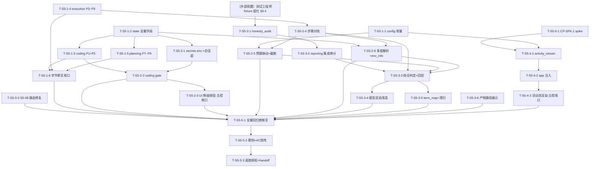

# Sprint 5 开发计划

**产品名称**：Auto-Reproduction —— 论文自动复现系统
**Sprint**：Sprint 5 —— 诚实性（Honesty）与可观测性（Observability）：斩断"假成功"因果链
**版本**：v1.0
**日期**：2026-07-08
**作者**：全栈开发工程师代理
**状态**：正式版
**对应 PRD**：`docs/sprint5/prd.md` v1.0（S5-01~11：6 P0 / 3 P1 / 2 P2；AC-S5-01~21；Q-S5-1~4 Maria 已确认）
**对应架构**：`docs/sprint5/architecture.md` v1.0（§1~§6 六项技术裁决 + §7~§8 文件级方案与 state/schema 变更总表 + §9 集成纪律 + §10 风险与受影响测试面 + **§11 六批次拆分——本计划权威骨架，照此展开**）
**体例参照**：`docs/sprint4/dev-plan.md`

> **全局纪律（贯穿所有任务，不再逐项复述）**：
> 1. **回归现场样本只读勿动**：`workspace/2604.01687/`（code + outputs 三组 summary.json + report.md）+ `checkpoints.db` thread `task-9208a1a4b4f5`——一切测试消费走 `tests/fixtures/` 固化副本（复制不移动，架构 §9.4），任何任务不得写入 / 清理 / 重命名原始样本。
> 2. **测试命令口径**：`.venv/bin/pytest`（裸 `pytest` 不在 PATH；全量非 e2e 回归 = `.venv/bin/pytest -q -m "not e2e"`）。零退化基线以**批次 0 开工前主控实测一次**的数字为准（开工首日落档，后续各批次收口对照）。
> 3. **真跑授权红线**：一切耗 deepxiv 配额 / 真实 LLM 的动作（Prompt Cache 在线维复采 + 真实 e2e 抽验）**须 Maria 明确授权具体动作**，本计划统一归集到批次 5 任务 T-S5-5-3，**合并为一次授权动作省配额**；mock 优先守门。
> 4. **架构六硬约束沿用**：主图 7 节点骨架不变；判定逻辑归确定性代码；降级必须用户显式动作；最小单一抽象；R-PC4 prompt 主体冻结（动态值走 HumanMessage / 尾部独立段落）；新 state 字段单值单点写、**绝不加 reducer**（must-fix-1）。
> 5. **批次 1 静态前缀冻结令**：批次 1 是 sp5 唯一一次 Prompt Cache 静态变更批次（P1~P9 一次合入、只重建一次基线）；**批次 1 收口后，sp5 内任何任务不得再触碰任何稳定前缀 / 工具 docstring**（含 `interaction_tools.request_user_input` docstring 零字节改动，CP-B1-5 守门沿用）。
> 6. **`ui/pages/execution_monitor.py` 主控收口令**：该文件被批次 0（T-S5-0-2 case⑥bis）/ 批次 2（T-S5-2-3 降级按钮）/ 批次 3（T-S5-3-5 术语清扫、T-S5-3-6 路径展示）/ 批次 4（T-S5-4-3 活动流渲染区）**四批五任务触碰**——沿用「主工作区文件边界隔离」范式：并行子代理不得直接改此文件，各任务产出改动说明（或独立函数/组件代码）交主控按批次顺序统一串行合入并跑该页回归。

---

## 1. 概述

### 1.1 Sprint 目标

Sprint 5 针对 Maria 2026-07-07 手动真跑 arXiv:2604.01687（EvoSkills）暴露的完整"假成功因果链"（#10 缺凭证不求助 → #9 编造模拟实验 → #11 轮数预算静默截断 → #7 报告夸大 full_success → #4 UI 断链看不到报告），按四道防线一次性斩断：

- **事前**（S5-01）：planning 声明 `required_credentials` + coding 入口确定性 gate 比对 `.secrets`，缺失强制 interrupt#3 索要，降级只能由用户显式按钮触发（架构 §5/§6）；
- **事中**（S5-02 / S5-06 / S5-07）：coding 三条诚实红线 + simulation 声明入 state；planned vs executed 步骤对账（编排层台账为事实源）+ 轮数预算联动 `clamp(steps+5, 10, 30)` + 截断显式化；coding/execution 节点内 ReAct 活动经 callbacks 通道外化为最小活动流（架构 §2/§3/§4）；
- **事后**（S5-03 / S5-04 / S5-05 / S5-10）：`core/honesty_audit.py` 规则型 smell 审计（R1 答案泄漏 / R2 硬编码分数 / R3 常量结局，误报防线同权重）；报告结论两级（工程复现/科学复现）+ 正交标注（simulation/credential_degraded/incomplete_execution）+ 定性目标三态回验；expected_results 定性化；多组指标解析（架构 §1/§7.3~7.5/§7.10）；
- **界面**（S5-08 / S5-09 / S5-11）：UI 主路由修复 + 完成判定兜底；术语映射表；产物路径只读明示（架构 §7.8/7.9/7.11）。

### 1.2 范围对齐

- **PRD 权威**：11 项需求 S5-01~11 + AC-S5-01~21 + 非目标 9 项（LLM-as-judge、tracing 平台、活动流持久化、评测 benchmark、API 代理层、i18n、全 prompt 重写、报告导出、凭证自动探测均不做）。
- **架构权威**：Q-S5-5~10 六项裁决全部落地为可执行设计（审计落 reporting 侧纯函数 / 对账以编排层台账为事实源 / 预算联动 K=5 clamp[10,30] / 活动流走 config callbacks + contextvar 传播 / 凭证两键 schema + coding 入口 gate / 降级复用 interrupt#3 增量键），**本计划不重新决策**；§11 六批次即本计划批次 0~5。
- **新模块恰 3 个**：`core/honesty_audit.py`、`core/activity_stream.py`、`ui/term_map.py`——无其他新目录/新抽象层。
- **唯一 breaking**：`ReproductionPlan.expected_results` dict → list（消费侧防御容忍旧形态，架构 R-5）。

### 1.3 容量裁剪线（Q-S5-4 已确认，超限时依序执行）

若进度吃紧，按以下顺序顺延（**P0 六项 S5-01/02/03/04/06/08 不可裁——缺一环假成功链仍可能闭合**）：

1. **先裁 T-S5-3-6（S5-11 产物路径展示）**——整任务顺延至 sp6；
2. **再裁 T-S5-3-5（S5-09 术语治理）**——整任务顺延（注意其 prompt 约束段 P8 已随批次 1 合入，顺延的只是 `ui/term_map.py` + 清扫）；
3. **最后降规模 S5-07（批次 4）**——不砍，降为"只渲染 execution 节点事件"（handler 按 node 过滤，coding 侧留 sp6）。

### 1.4 关键风险一句话

**批次 0 的 CP-SPK-1 spike 是 sp5 唯一的方案级不确定点**（架构 §10.1 R-1）：langchain-core `var_child_runnable_config` contextvar 能否把父图 config callbacks 穿透到节点内手动 `subgraph.invoke`（react_base.py:873 / execution.py:1272）——传播成立则 S5-07 走主路径（react_base 零字节改动）；不成立则走回退 R-B1（execution 编排层一行透传；coding 侧仍不达时对 react_base 做一行纯追加的**受控豁免**并记勘误注记）。**spike 结论只影响批次 4 实现路径，不阻塞批次 1~3**。其余风险（审计误报 R-3、对账误降档 R-2、prompt 基线 R-4、breaking R-5/R-6、契约断言 R-7/R-8）均已有确定性缓解，逐条落点见 §6。

---

## 2. 任务清单总表

| 任务编号 | 承载需求 | 任务名 | 产出文件 | 依赖前置 | 估时 | 风险 |
|---|---|---|---|---|---|---|
| **T-S5-0-1** | S5-07 前提 | CP-SPK-1 callbacks 传播 spike（mock，定批次 4 主/回退路径） | `tests/test_sprint5_spk1_callbacks_spike.py` + 结论报告 | 无 | 3h | 高（方案级） |
| **T-S5-0-2** | S5-08 | UI 主路由修复全套 + `is_finished` + #6 兜底 | `ui/pages/analysis_progress.py` + `ui/pages/execution_monitor.py` + `app.py` | 无 | 4h | 中 |
| **T-S5-1-1** | S5-06/07 | config 4 常量 + FLOOR 语义注释 | `config.py` | 无 | 0.5h | 低 |
| **T-S5-1-2** | 全部 | state.py 新字段全量声明（§8 总表 9 字段） | `core/state.py` | 无 | 2h | 低 |
| **T-S5-1-3** | S5-02 | coding prompt/schema 静态批次（P1+P2）+ simulation_notice 透传 | `core/nodes/coding.py` | T-S5-1-2 | 2.5h | 中 |
| **T-S5-1-4** | S5-06/10 | execution prompt/工具 schema 静态批次（P3~P6） | `core/nodes/execution.py` | 无 | 3h | 中 |
| **T-S5-1-5** | S5-01/05/09 | planning prompt/schema 静态批次（P7~P9）+ map 回填 | `core/nodes/planning.py` | T-S5-1-2 | 3h | 中 |
| **T-S5-1-6** | R-PC4 | 离线维字节断言收口 + 受影响 prompt 文面断言修复 | `tests/`（§10.2 prompt 类清单） | T-S5-1-3/4/5 | 2.5h | 中 |
| **T-S5-2-1** | S5-01 | secrets_store：`env:` 规则 + 第 7 接口会话覆盖层 | `core/secrets_store.py` | T-S5-1-2 | 2h | 中（安全关键） |
| **T-S5-2-2** | S5-01 | coding 前置 gate（复合节点 + interrupt#3 增量 + 降级标记） | `core/nodes/coding.py` | T-S5-1-3 + T-S5-2-1 | 5h | 高（幂等命门） |
| **T-S5-2-3** | S5-01 | UI 降级按钮（allow_degrade 面板增量） | `ui/pages/execution_monitor.py`（主控收口） | T-S5-2-2 | 2h | 低 |
| **T-S5-2-4** | S5-06 | 步骤对账：台账 step_index + `_reconcile_steps` + 写 execution_result | `core/nodes/execution.py` | T-S5-1-4 | 5h | 高（误报防线） |
| **T-S5-2-5** | S5-06 | 预算联动 `_effective_max_rounds` + budget_truncated 显式化 | `core/nodes/execution.py` | T-S5-1-1 + T-S5-2-4 | 3h | 中 |
| **T-S5-2-6** | S5-10 | 多组指标解析 + env_info 回读修复 + ExecutionResult 构造点补齐 | `core/nodes/execution.py` | T-S5-1-2 + T-S5-2-4 | 4h | 中 |
| **T-S5-3-1** | S5-03 | `core/honesty_audit.py`（R1/R2/R3 + 三重误报防线） | `core/honesty_audit.py` | fixture 固化（§3.4 前置门） | 6h | 高（误报红线） |
| **T-S5-3-2** | S5-03 | reporting 集成审计 + 返回契约扩展（CP-C2-5 更新） | `core/nodes/reporting.py` | T-S5-3-1 | 2h | 中 |
| **T-S5-3-3** | S5-04 | `_determine_conclusion` + `_verify_expected_results`（确定性判定） | `core/nodes/reporting.py` | T-S5-2-4/5/6 + T-S5-3-2 | 4h | 中 |
| **T-S5-3-4** | S5-04/05/06/10 | 报告渲染改造（措辞/回验节/对账节/声明块/删列/降维） | `core/nodes/reporting.py` | T-S5-3-3 | 5h | 中 |
| **T-S5-3-5** | S5-09 | `ui/term_map.py` + 全 UI 裸露点清扫 | `ui/term_map.py` + ui 各页（execution_monitor 主控收口） | T-S5-3-3（档位文案定稿） | 4h | 低 |
| **T-S5-3-6** | S5-11 | 产物路径只读展示（两页 st.code） | `ui/pages/result_report.py` + `ui/pages/execution_monitor.py`（主控收口） | 无 | 1h | 低 |
| **T-S5-4-1** | S5-07 | `core/activity_stream.py`（事件 + handler + per-thread deque） | `core/activity_stream.py` | T-S5-0-1 + T-S5-1-1 | 3h | 中 |
| **T-S5-4-2** | S5-07 | app.py callbacks 注入 + `get_activity_tail`（含回退路径承接） | `app.py` | T-S5-4-1 | 3h | 中 |
| **T-S5-4-3** | S5-07 | 执行监控页活动流尾部渲染区 | `ui/pages/execution_monitor.py`（主控收口） | T-S5-4-2 | 2h | 低 |
| **T-S5-5-1** | 回归 | 全量回归修断言（§10.2 清单逐条，只换不弱化） | `tests/` 既有用例 | 批次 1~4 | 5h | 中 |
| **T-S5-5-2** | 验收 | 回归样本靶测收口 + AC-S5-01~21 覆盖矩阵审计 | `tests/test_sprint5_*` | T-S5-5-1 | 4h | 中 |
| **T-S5-5-3** | 验收 | **真跑项（Maria 授权点）**：Prompt Cache 在线复采 + 真实 e2e 抽验 + handoff | `docs/sprint5/test-reports/` + handoff | T-S5-5-2 | 3h | 中 |

**任务总数**：26 个（批次 0×2 + 批次 1×6 + 批次 2×6 + 批次 3×6 + 批次 4×3 + 批次 5×3）。
**总估时**：**~83.5h**（批次 0：7h / 批次 1：13.5h / 批次 2：21h / 批次 3：22h / 批次 4：8h / 批次 5：12h）。若容量吃紧按 §1.3 裁剪线执行（最多可回收 ~5h + 批次 4 降规模 ~3h）。

---

## 3. 批次划分与依赖图

### 3.1 批次总览（= 架构 §11 权威骨架）

| 批次 | 名称 | 任务 | 前置条件 | AC 映射 | 特殊标注 |
|---|---|---|---|---|---|
| **0** | spike + 路由修复（无依赖先行） | T-S5-0-1 ∥ T-S5-0-2 | 无（两任务文件不重叠，可并行） | AC-S5-15/16/17 | **含 CP-SPK-1 spike 检查点**（定批次 4 主/回退） |
| **1** | Prompt Cache 一次性静态批次 + state 全量声明 | T-S5-1-1~6 | 无 | AC-S5-01/04/09/19 的 prompt/schema 断言部分 | **触发 Prompt Cache 基线重建**：离线字节断言随批落地（T-S5-1-6）；**在线维复采挂 Maria 授权点，延至批次 5 合并真跑** |
| **2** | 诚实链编排层 | T-S5-2-1~6 | 批次 1（字段/schema/prompt） | AC-S5-02/03/10/11/12/20 | gate 幂等纪律（§9.2）；`execution.py` 与 `coding.py` 为本批独占文件 |
| **3** | 收口判定与展示 | T-S5-3-1~6 | 批次 2（metrics_groups/对账/标记字段）+ **测试工程师 fixture 固化（§9.4，前置门）** | AC-S5-05/06/07/08/18/21 | fixture 固化须在 T-S5-3-1 验收前完成 |
| **4** | agent 活动流 | T-S5-4-1~3 | 批次 0 spike 结论 + T-S5-1-1 | AC-S5-13/14 | 可与批次 2/3 并行；T-S5-4-3 走主控收口令 |
| **5** | 全量回归 + 靶测 + 真跑收口 | T-S5-5-1~3 | 批次 1~4 全部 | AC-S5-01~21 全覆盖 + sp2/3/4 回归全绿 | **真跑项（基线复采 + 真实 e2e）须 Maria 明确授权，合并为一次授权动作省配额** |

### 3.2 依赖关系图（Mermaid）

**关键路径**：T-S5-1-2 → T-S5-1-3 → T-S5-2-1 → T-S5-2-2（gate，幂等命门）与 T-S5-1-4 → T-S5-2-4 → T-S5-2-5/6 → T-S5-3-3 → T-S5-3-4 → T-S5-5-1 → T-S5-5-2 → T-S5-5-3。批次 0 两任务与批次 1 完全并行；批次 4 在 spike 结论后可与批次 2/3 并行推进（T-S5-4-3 除外，等主控收口窗口）。

### 3.3 并行机会与文件边界（沿用主工作区文件边界隔离范式，主控收口）

| 并行组 | 任务 | 文件边界（互不重叠） | 说明 |
|---|---|---|---|
| P-0 | T-S5-0-1 ∥ T-S5-0-2 ∥ 批次 1 全部 | tests 新文件 ∥ ui 两页+app.py ∥ config/state/三节点文件 | spike 纯 tests；路由修复不碰节点层 |
| P-1（批次 1 内） | T-S5-1-1 ∥ T-S5-1-2 ∥ T-S5-1-3 ∥ T-S5-1-4 ∥ T-S5-1-5 | `config.py` ∥ `core/state.py` ∥ `coding.py` ∥ `execution.py` ∥ `planning.py` | 五文件独立；T-S5-1-6 收口串行 |
| P-2（批次 2 内） | T-S5-2-1 ∥ T-S5-2-2 ∥（T-S5-2-4→2-5→2-6 串行） | `secrets_store.py` ∥ `coding.py` ∥ `execution.py`（同文件三任务串行或同一执行者） | T-S5-2-2 依赖 2-1；T-S5-2-3 出改动说明交主控 |
| P-3（跨批次） | 批次 4（T-S5-4-1/4-2）∥ 批次 2/3 | `core/activity_stream.py` + `app.py` ∥ 节点层文件 | 零文件交集；T-S5-4-3 等收口窗口 |
| **收口串行点** | `ui/pages/execution_monitor.py` | T-S5-0-2 → T-S5-2-3 → T-S5-3-5/3-6 → T-S5-4-3 | **主控统一收口令**（全局纪律 6）：按批次顺序串行合入，每次合入跑该页回归 |
| 串行点 | T-S5-5-1 → T-S5-5-2 → T-S5-5-3 | — | 验收线性收口，主控执行；T-S5-5-3 待 Maria 授权 |

### 3.4 批次 3 前置门（外部依赖，显式声明）

**测试工程师须在 T-S5-3-1 验收前完成回归样本 fixture 固化**（架构 §9.4，复制不移动）：
- `tests/fixtures/regression_2604_01687/`：`code/skill_generator.py`、`code/task_executor.py`、`code/data/skillsbench_manifest.json`（AC-S5-05 审计命中靶）+ `outputs/` 三组 `summary.json`（AC-S5-20）+ `report.md`（措辞对照）；
- `tests/fixtures/clean_code_sample/`：新造 3~4 文件干净复现代码（真读输入、真算分），AC-S5-06 误报防线靶。

> **[2026-07-09 前置门已闭环]**：fixture 固化完成，7 个复制文件 md5 与源逐一 MATCH，原样本 47/47 未动、checkpoints.db 零字节零元数据变动。**路径勘误（消费方注意）**：workspace 实际结构与本节预期有两处出入——审计靶代码位于 `code/src/`（非 `code/` 平铺）、outputs 三组位于 `code/outputs/`（非顶层 `outputs/`），已按实际结构固化并写入 fixture README；T-S5-3-1 等消费方断言请用 `code/src/` 与 `code/outputs/` 路径。clean_code_sample 为 stdlib-only 情感分类 eval（4 文件、已真跑验证 accuracy 0.75、全文件无字面量分数赋值）。

fixture 未就绪时 T-S5-3-1 可先行开发（临时以只读原样本路径做本地冒烟），但 **CP-3.1-x 验收断言必须以固化 fixture 跑**——软前置门语义与 sp4 B2 同款。`checkpoints.db` thread `task-9208a1a4b4f5` 只读引用（AC-S5-15 手动验证 / AC-S5-07 报告重生成以 state 快照 mock 为主，真库只做手动验证）。

---

## 4. 任务详细规格

### 批次 0：spike + 路由修复（无依赖先行，两任务并行）

> **前置条件**：无。
> **产出**：CP-SPK-1 传播实证结论（批次 4 主/回退路径判定）+ S5-08 路由断链全套修复。

#### 任务 T-S5-0-1：CP-SPK-1 callbacks 传播 spike（S5-07 前提，架构 §10.1 R-1）

- **产出文件**：`tests/test_sprint5_spk1_callbacks_spike.py`（mock LLM + 真实 `build_graph`，**不标 e2e、零配额消耗**）+ 结论报告 `docs/sprint5/test-reports/2026-MM-DD_spk1-callbacks-propagation.md`
- **依赖项**：无
- **预计复杂度**：高（3h，方案级不确定点）
- **架构参考**：architecture §4（Q-S5-8 可行性论证）/ §10.1 R-1

**需要实现的内容**：

1. 最小计数型 `BaseCallbackHandler`（记录 `on_llm_end` / `on_tool_start` 事件及 `metadata`）；
2. mock LLM 剧本驱动 `build_graph().invoke(initial_state, {**config, "callbacks": [handler]})` 走到 coding 与 execution 节点（可复用 sp3/sp4 mock e2e 装置裁剪）；
3. **两条路径分别断言**：coding（经 `_make_react_wrapper` → `subgraph.invoke`，react_base.py:873）与 execution（裸 `subgraph.invoke`，execution.py:1272）内层的 LLM/工具事件是否到达 handler；
4. 事件元数据可用性实证：`metadata["langgraph_node"]` 能否取到节点名、`on_tool_start` 入参能否做 ≤120 字符摘要（喂 T-S5-4-1 的 schema 落地）；
5. 结论落档并**回写本计划勘误注记**（若走回退）。

**门禁语义（决定批次 4 主/回退路径，不阻塞批次 1~3）**：
- 两路径均传播 → 批次 4 走主路径（react_base **零字节改动**）；
- execution 侧不传播 → 回退 R-B1 第一档：编排层 `subgraph.invoke(initial, {"callbacks": ...})` 一行透传（落 `execution.py`，随批次 2 收口）；
- coding 侧仍不达 → 回退 R-B1 第二档：援引 BUG-S4-B1-01 勘误先例，对 react_base 做**一行纯追加** config 透传（"不改 react_base"约束的**受控豁免**，预算/循环逻辑零触碰），在本计划与 handoff 记勘误注记。

> **[2026-07-09 门禁结论]**：coding / execution 两路径 callbacks 均传播 → **批次 4 走主路径**（react_base 零字节改动、execution.py 无需透传，R-B1 两档均不触发，无勘误）。关键实证：`metadata["langgraph_node"]` 取到的是内层子图节点名（reasoning/tool_executor），外层节点名须从 `metadata["checkpoint_ns"]` 前缀恢复（`"coding:<uuid>"` → `split(":")[0]`）；`on_llm_end` 本身不带 metadata，node 归属须在 `on_chat_model_start` 缓存 `run_id → metadata` 回查——T-S5-4-1 的 `ActivityEvent.node` 设计输入。结论依赖 langchain-core 1.3.3 / langgraph 1.1.10 的 contextvar 传播实现，库升级时复跑 spike 套件（~1s）复验。报告：`test-reports/2026-07-09_spk1-callbacks-propagation.md`。

**自测检查点**：
- [x] CP-0.1-1 spike 用例跑通，coding / execution 两路径传播结论各自明确落档（是/否 + 证据）——两路径均"是"，4 用例 ×3 连跑全绿（2026-07-09）
- [x] CP-0.1-2 事件元数据实证：`langgraph_node` 可取、tool 入参可摘要、`on_llm_end` 文本可截断（T-S5-4-1 消费前提）——三项均可用，见上方门禁结论注记
- [x] CP-0.1-3 结论报告归档 `docs/sprint5/test-reports/`；若回退：R-B1 档位判定 + 勘误注记写入本计划 §7——走主路径，无需勘误

---

#### 任务 T-S5-0-2：S5-08 UI 主路由修复全套 + 完成判定兜底（P0）

- **产出文件**：`ui/pages/analysis_progress.py`（case④ 改造 + ④bis + ④ter）、`ui/pages/execution_monitor.py`（case⑥bis，**主控收口令首段**）、`app.py`（`GraphController.is_finished` 只读方法）
- **依赖项**：无（纯 bug 修复，PRD §7 建议第一批）
- **预计复杂度**：中（4h）
- **架构参考**：architecture §7.8

**需要实现的内容**：

1. `analysis_progress.py` case④（:540-542）：由"任何 interrupt → review"改为按 `controller.get_interrupt_payload(thread_id)` 的 kind 分发——planning 形态（payload 无 kind 键）→ review 页；`dev_loop_failure` / `user_input_request` → 执行监控页（AC-S5-16 修复点）；
2. 新增 case④bis：`current_step ∈ {coding, execution}` → 切执行监控页（#4 主修复）；
3. 新增 case④ter：`current_step == "reporting"` ∧ `report_path` 非空 → 直跳报告页（与监控页 case⑥ 双通道可达，AC-S5-15）；
4. `execution_monitor.py` 新增 case⑥bis（#6 兜底，AC-S5-17）：`current_step == "reporting"` ∧ `report_path` 为空 ∧ `controller.is_finished(thread_id)` → 渲染明确失败/降级提示卡片并**不注册 autorefresh**（停假轮询）；既有 case⑥（`_should_jump_to_report`，:671-675）保留；
5. `app.py`：`is_finished(thread_id)` = `snapshot.next` 为空元组 ∧ snapshot 存在（与 `is_interrupted`（:213）同一读路径范式）；
6. **不建统一路由层**（架构已裁决最小方案）；`app.py:393` 全局路由保持只管 `user_input_request`；零 state 变更。

**自测检查点**：
- [x] CP-0.2-1 case④ kind 分发三态断言：planning 形态 → review；dev_loop_failure / user_input_request → 执行监控页（AC-S5-16）——纯函数真值表 + AppTest 双层断言（2026-07-09）
- [x] CP-0.2-2 case④bis/④ter：controller state 序列驱动断言 coding/execution → 监控页、reporting∧report_path 非空 → 报告页（progress 与监控页双通道各证一次，AC-S5-15 mock 部分）——含全程流转序列与"progress 页不越权判僵死"反证
- [x] CP-0.2-3 case⑥bis：mock 空 report_path ∧ is_finished → 失败/降级卡片渲染 + autorefresh 未注册（AC-S5-17）——含 is_finished=False 不误杀 + case⑥ 优先级短路断言
- [x] CP-0.2-4 `is_finished` 单测（运行中/interrupted/完成三态）；受影响既有 UI 路由用例适配（R-8，只换断言目标不弱化语义，逐条记录）——三态 + 无 snapshot/空 values 快照两防御边界；适配 6 处（4 个 mock 建模 + 2 个公开方法集合守门），清单见 TODO 2026-07-09 条目
- [x] CP-0.2-5 回归样本 thread `task-9208a1a4b4f5` 手动验证路由可达报告页（只读，与测试工程师协作，AC-S5-15 手动部分）——以字节副本走真实 GraphController 读路径验证 case⑥/④ter 均判定可达报告页，原库 md5 前后一致无 -wal/-shm 残留，无需测试工程师补跑

---

### 批次 1：Prompt Cache 一次性静态批次（P1~P9）+ state 全量声明

> **前置条件**：无（与批次 0 并行）。
> **产出**：sp5 全部静态 prompt / 工具 schema 变更一次合入（此后前缀冻结，全局纪律 5）+ §8 总表全部新字段声明 + 离线维字节断言随批落地。
> **基线重建语义（架构 §9.1）**：本批是 sp5 唯一触发 Prompt Cache 基线重建的批次——**离线维（mock 字节断言）随 T-S5-1-6 落地；在线维（真跑复采命中率、建新 R_baseline）挂 Maria 授权点，延至批次 5 T-S5-5-3 与真实 e2e 合并为一次授权**。旧基线因前缀变更作废属预期。
> **[2026-07-09 批次收口]**：T-S5-1-1~6 全部完成，全量非 e2e 回归 **1467 passed / 0 failed / 37 skipped / 46 deselected**（基线 1412 + 新增 t11~t15 共 56 − 退役 1，账目精确闭合，主控独立复验一致）。**前缀冻结令自此生效**——sp5 内不再动任何稳定前缀（coding/execution/planning 三主体及工具 docstring）。既有断言适配 5 项（含 CP-A2-5 git-diff 纯追加守门退役裁决）记录于 TODO 2026-07-09 条目。

#### 任务 T-S5-1-1：config 4 常量 + FLOOR 语义注释

- **产出文件**：`config.py`（纯追加 Sprint 5 段落 + 一处语义注释）
- **依赖项**：无
- **预计复杂度**：低（0.5h）
- **架构参考**：architecture §3 / §4 / §8

**需要实现的内容**（值取架构给定，不自创）：

| 常量 | 值 | 用途 |
|---|---|---|
| `REACT_EXECUTION_ROUNDS_MARGIN` | `5` | 预算联动 K 裕量（prepare 1 + 收尾 1 + 兜底 3） |
| `REACT_MAX_ROUNDS_EXECUTION_CAP` | `30` | 联动硬上限（= MAX_DEV_LOOP_LLM_CALLS/2，保修复循环余量） |
| `ACTIVITY_STREAM_MAX_EVENTS` | `500` | per-thread deque maxlen（内存上界 ~150KB/任务） |
| `ACTIVITY_STREAM_RENDER_TAIL` | `30` | 执行监控页活动流尾部渲染行数 |

`REACT_MAX_ROUNDS_EXECUTION = 10` 值不动、注释语义收窄为 FLOOR（联动公式下限）。

**自测检查点**：
- [x] CP-1.1-1 四常量可导入、值/类型逐项断言；`REACT_MAX_ROUNDS_EXECUTION==10` 不动——t11 9 用例全绿（2026-07-09）
- [x] CP-1.1-2 账本边界断言：`REACT_MAX_ROUNDS_EXECUTION_CAP == MAX_DEV_LOOP_LLM_CALLS // 2`（30==60/2）∧ `CAP > FLOOR > 0`（AC-S5-12 常量面）
- [x] CP-1.1-3 既有常量基线零改动（`MAX_TOTAL_LLM_CALLS==120` / `MAX_DEV_LOOP_LLM_CALLS==60` / `REACT_MAX_ROUNDS_CODING==12` 等；git diff 实证纯追加，唯一例外为 FLOOR 注释行）

#### 任务 T-S5-1-2：`core/state.py` 新字段全量声明（§8 总表）

- **产出文件**：`core/state.py`
- **依赖项**：无
- **预计复杂度**：低（2h）
- **架构参考**：architecture §8 变更总表 + 通用纪律

**需要实现的内容**（一次声明齐，供批次 2/3 消费）：

| 字段 | 所在结构 | 类型 / 默认值 |
|---|---|---|
| `credential_degradations` | GlobalState | `Dict[str, str]` / `{}`（gate 单点整 dict 回写） |
| `simulation_notice` | GlobalState | `Optional[str]` / `None`（coding map 单点写） |
| `honesty_audit` | GlobalState | `Optional[Dict]` / `None`（reporting 单点写） |
| `required_credentials` | ReproductionPlan | `List[Dict[str, str]]`（purpose_key/purpose 两键）/ `[]` |
| `expected_results` | ReproductionPlan | **Dict → List[Dict]（唯一 breaking）**：`[{"description": str, "trend": {...}\|None}]` |
| `step_reconciliation` / `budget_truncated` / `metrics_groups` / `degraded_credentials` | ExecutionResult | `Dict`/`bool`/`Dict`/`List[str]`（TypedDict 键声明；**构造点补齐落 T-S5-2-6**，execution.py 属批次 2 独占文件） |

**关键约束**：新 GlobalState 字段均单值通道、显式声明 + `create_initial_state` 默认值（B2/B3 静默丢弃教训）、**绝不加 reducer**（must-fix-1）；下游消费一律 `.get()` 防御读（兼容旧 checkpoint 无新键，R-5/R-6）。

**自测检查点**：
- [x] CP-1.2-1 `GlobalState.__annotations__` / `ReproductionPlan` / `ExecutionResult` 含全部新字段且类型正确；`create_initial_state` 默认值正确——t12 8 用例全绿（2026-07-09）
- [x] CP-1.2-2 must-fix-1 grep 双证沿用：三 List 字段（node_errors/degraded_nodes/fix_loop_history）与全部新字段均无 `Annotated`/`operator.add`
- [x] CP-1.2-3 全量非 e2e 回归零退化（新字段不破坏既有初始化/反序列化；旧 checkpoint state 快照 `.get()` 读通）——随 T-S5-1-6 收口全量 1467/0 兑现

#### 任务 T-S5-1-3：coding prompt/schema 静态批次（P1+P2）+ simulation_notice 透传（S5-02）

- **产出文件**：`core/nodes/coding.py`
- **依赖项**：T-S5-1-2（simulation_notice 字段）
- **预计复杂度**：中（2.5h）
- **架构参考**：architecture §7.2 / §9.1（P1/P2）

**需要实现的内容**：

1. **P1**：`_CODING_HONESTY_SECTION` 独立静态段落常量，插入 `_CODING_SYSTEM_PROMPT_BODY`（:92）主体与尾部"--- 当前任务上下文 ---"之间——三条红线（①禁 verifier 答案泄漏给被评估对象；②禁硬编码分数/结果/常量结局；③不得以改变实验本质的方式规避资源缺失）+ "无法真实验时必须在 `<result>` 中给出 simulation_notice"义务；段落**跨任务字节级恒定、零动态变量**；
2. **P2**：`CODING_OUTPUT_SCHEMA`（:54）增可选属性 `simulation_notice: string|null`（result_schema，仅 finalize 消费不进前缀）；
3. `_map_coding_result` 透传 `simulation_notice` 至 GlobalState（单点写，缺失回填 `None`）——保持 3 参签名与既有工具历史回填路径零改动（BUG-S1-02/03 规避自查：simulation_notice 为 LLM 自述声明字段，无工具事实源，**不做工具历史回填**、缺失即 None 属诚实语义）。

**自测检查点**：
- [x] CP-1.3-1 prompt 断言：三红线关键语 + simulation_notice 义务语句存在（AC-S5-04 prompt 部分）——t13 12 用例全绿（2026-07-09）
- [x] CP-1.3-2 主体字节级一致守门更新：两篇不同论文去尾部动态段后 `==` 新常量（含 `_CODING_HONESTY_SECTION` 进稳定前缀）；段内禁动态变量审查断言
- [x] CP-1.3-3 mock map 断言：`<result>` 带/不带 simulation_notice → state 落值/回填 None（AC-S5-04 state 部分）；`_map_coding_result` 3 参签名与既有断言零回归

#### 任务 T-S5-1-4：execution prompt/工具 schema 静态批次（P3~P6）（S5-06/10 前置）

- **产出文件**：`core/nodes/execution.py`
- **依赖项**：无
- **预计复杂度**：中（3h）
- **架构参考**：architecture §2 / §3 / §7.10 / §9.1（P3~P6）

**需要实现的内容**：

1. **P3**：`_EXECUTION_SYSTEM_PROMPT_BODY` 内写死的 "max_rounds=10"（:973）改非数字表述；同步在 `_build_execution_agent_context` HumanMessage 动态上下文注入当前预算数字（本任务暂取 `REACT_MAX_ROUNDS_EXECUTION`，T-S5-2-5 切换为 `_effective_max_rounds(plan)` 产出——动态值走动态通道，R-PC4 合规）；
2. **P4**：主体（:961 段内）增 `step_index` 用法一行说明（"执行计划第 i 步时以 step_index=i 声明归属"）；
3. **P5**：`make_run_in_sandbox_tool`（:858）签名增 `step_index: int = -1`（docstring 即工具 schema 进前缀，零动态变量）；工具体接受该参数并随收集器条目记录（`(step_index, command, exit_code)` 台账雏形；归属/对账逻辑在 T-S5-2-4）；
4. **P6**：`prepare_environment` 工具（:805）返回 payload 增带 `env_info`（含 key_packages；仅 ToolMessage 内容不进前缀；`json.dumps(ensure_ascii=False, sort_keys=True, default=str)` 序列化纪律沿用）；回读解析在 T-S5-2-6。

**自测检查点**：
- [x] CP-1.4-1 主体字节级一致断言更新（CP-E2-1 同款）+ 主体无 "max_rounds=10" 数字残留断言 + step_index 说明存在——t14 12 用例 ×3 连跑全绿（2026-07-09）
- [x] CP-1.4-2 `run_in_sandbox` docstring 字节稳定 + `step_index` 缺省 -1 向后兼容（不带参调用不炸、台账记 -1）
- [x] CP-1.4-3 prepare payload 含 `env_info` 且 JSON 合法（sort_keys/ensure_ascii=False/禁 str(dict)，BUG-S1-02 自查）
- [x] CP-1.4-4 HumanMessage 动态上下文含预算数字键且 sort_keys 幂等；`interaction_tools.request_user_input` docstring 零字节改动断言（CP-B1-5 守门沿用）

#### 任务 T-S5-1-5：planning prompt/schema 静态批次（P7~P9）+ map 回填（S5-01/05/09）

- **产出文件**：`core/nodes/planning.py`
- **依赖项**：T-S5-1-2（ReproductionPlan 新形态）
- **预计复杂度**：中（3h）
- **架构参考**：architecture §5 / §7.1 / §7.5 / §7.9 / §9.1（P7~P9）

**需要实现的内容**：

1. **P7**：主体【6 章节】第 6 节改写——expected_results 只做定性描述与可选 trend 结构（`{"metric","greater","lesser"}`）、**明确禁止编造具体数值**、论文真实 baseline 数字不在计划复述；增 required_credentials 声明指令（purpose_key 约定：`git_credential:<host>` / `hf_token` / **`env:<ENV_VAR>`** 通用约定 + purpose 中文用途说明）；
2. **P8**：尾部独立静态段落——术语约束（机器可读字段保留枚举原值、用户可读文本用通俗中文、禁内部枚举/字段名/自创缩写）（AC-S5-19）；
3. **P9**：`REPRODUCTION_PLAN_SCHEMA`（:67）`expected_results` 改 array 形态（description 必填 + trend 可选）+ 增 `required_credentials` 可选属性；
4. `_map_planning_result`：两字段缺失回填 `[]`（required_credentials 可为空属合法——论文可能不依赖外部凭证；不列入 `_missing_core_fields`，不做工具历史回填）。

**自测检查点**：
- [x] CP-1.5-1 prompt 断言：禁编造数值文案 + required_credentials 声明指令 + 尾部术语约束段存在（AC-S5-01/09/19 prompt 部分）——t15 15 用例全绿（2026-07-09）
- [x] CP-1.5-2 schema 断言：expected_results 为 array 形态、**无 {metric: number} 数值映射**（AC-S5-09 schema 部分）；required_credentials 两键约束
- [x] CP-1.5-3 主体字节级一致断言更新（CP-B3-10 同款：两论文去尾部后 == 常量）+ 尾部段落常量断言 + 禁动态变量审查——CP-B3-10 与 shell_parse 字节守门因动态引用常量同步绿
- [x] CP-1.5-4 map 回填断言：`<result>` 缺两字段 → 回填 `[]` 不炸；带值 → 透传——含旧 dict 形态→[] 兼容与降级路径同步

#### 任务 T-S5-1-6：离线维字节断言收口 + 受影响 prompt 文面断言修复（R-PC4 收口）

- **产出文件**：`tests/`（§10.2 prompt 类清单逐条）+ 批次收口记录
- **依赖项**：T-S5-1-3 / 1-4 / 1-5
- **预计复杂度**：中（2.5h）
- **架构参考**：architecture §9.1 双维守门 / §10.2

**需要执行的内容**：

1. §10.2 prompt/schema 断言面逐条修复：`test_sprint2_b3.py`（planning 主体/CP-B3-10）、sprint3 coding prompt 断言（CP-C1-6 所在）、`test_sprint4_e2.py`（CP-E2-1 + "max_rounds=10" 文面断言）、`test_sprint4_e3.py`/`test_sprint4_d1.py`（run_in_sandbox / prepare 工具契约）——**只换断言目标不弱化语义，逐条记录**；
2. 三份新版主体（coding/execution/planning）"禁动态变量"审查断言一次落齐；
3. **批次收口声明**：此后 sp5 内不再动任何稳定前缀（前缀冻结令生效）；
4. **在线维复采挂账**：`scripts/spike_coding_prompt_cache.py` / `scripts/spike_execution_prompt_cache.py` / `scripts/spike_prompt_cache_baseline.py` 复采清单列入 T-S5-5-3 授权项（旧基线作废属预期，新 R_baseline × 0.95 守门）。

**自测检查点**：
- [x] CP-1.6-1 §10.2 prompt 类断言全绿；适配清单落档（改哪条/为何/语义不降）——5 项适配（coding 字节守门 3 个改指向"主体+红线段"、b3 脏类型断言改新形态精确值、CP-A2-5 按主控裁决退役），清单见 TODO 2026-07-09 条目（2026-07-09）
- [x] CP-1.6-2 三主体禁动态变量审查断言 PASS；`request_user_input` docstring 零字节改动复核——三主体审查已齐未补；docstring git diff 空 + 锚定断言 PASS
- [x] CP-1.6-3 全量非 e2e 回归零退化（对照开工基线）；在线维复采挂账记录进 T-S5-5-3 授权清单——1467 passed / 0 failed，账目闭合（1412+56−1）；挂账注记已写入 T-S5-5-3

---

### 批次 2：诚实链编排层（依赖批次 1）

> **前置条件**：批次 1 全部（字段/schema/prompt 已就位）。
> **产出**：S5-01 gate 全链（比对/索要/显式降级/标记传导）+ S5-06 对账/联动/截断 + S5-10 多组解析与 env_info 修复。
> **文件独占**：`core/nodes/execution.py` 与 `core/nodes/coding.py` 为本批独占文件（架构 §11）；`ui/pages/execution_monitor.py` 改动走主控收口令。
> **幂等纪律（架构 §9.2，本批命门）**：① gate 单项串行——每次节点执行只对 missing 列表**第一个**缺失项 `interrupt()`，resume 后节点重跑重算 missing（集合变化会使 LangGraph 按调用序重放的 resume 值串位，这是最大幂等陷阱）；② **GraphBubbleUp 红线延伸到 gate 层**——gate 的 `interrupt()` 周围严禁 try/except 兜底捕获（BUG-S4-B1-01 同款）；③ execution interrupt#2 guard 零扰动——对账/截断/多组指标全部在 `_build_execution_result` 之前完成、随 exec_result 一次 commit，guard 命中路径（execution.py:1702）复用已落盘结果即含新字段，不需要任何重算。

#### 任务 T-S5-2-1：secrets_store：`env:` 通用规则 + 第 7 接口会话覆盖层（S5-01 地基）

- **产出文件**：`core/secrets_store.py`（纯追加）
- **依赖项**：T-S5-1-2
- **预计复杂度**：中（2h，安全关键）
- **架构参考**：architecture §5（env: 约定）/ §9.2（会话覆盖层）

**需要实现的内容**：

1. `build_credential_env`（:297）增一条通用规则：purpose_key 形如 `env:X` → `env["X"] = value`——**不为任何 provider 做枚举映射**（PRD 非目标：不建 API 代理层）；其余未知 purpose_key 保持现状忽略语义；
2. **第 7 接口（对"极简六接口"的显式扩接，本条即架构 §9.2 要求的 dev-plan 记录）**：`stash_session_secret(purpose_key, value)`——进程内会话覆盖层（模块级 dict），**不落盘、进程重启即失**，值同步 `register_sensitive_value`；`load_all_secrets` 改为 `.secrets` 基础 + 会话层合并覆盖。**扩接理由**：`build_credential_env` 只读 `.secrets`，用户"不记住"的凭证将无法注入沙箱 env；替代方案是"强制记住"（损害用户选择权），两害相权取其轻——Maria 极简红线下这是被论证过的最小必要扩展，不加第 8 个。

**自测检查点**：
- [x] CP-2.1-1 `env:OPENAI_API_KEY` → env 注入断言；非 `env:` 未知 key 行为与 sp4 一致（零回归）；`GIT_TERMINAL_PROMPT=0` 无条件带不回归——t21 19 用例 + 相关既有 224 用例全绿（2026-07-09）
- [x] CP-2.1-2 stash → `load_all_secrets` 合并可见、`.secrets` 文件不含（不落盘断言）、`mask_value` 覆盖该值（脱敏地基）
- [x] CP-2.1-3 会话层与 `.secrets` 同 key 时覆盖语义确定（会话层优先，最后提交者胜）+ 模块重载模拟"进程重启即失"
- [x] CP-2.1-4 既有六接口测试全绿零退化；本模块日志只打 purpose_key 无 value 明文（caplog 审计沿用 CP-A3-5 范式）。**实现期架构师裁决补记**：`lookup_secret` 同步感知会话层（详见 architecture §9.2 2026-07-09 注记）

#### 任务 T-S5-2-2：coding 前置 gate——复合节点 + interrupt#3 增量 + 降级标记（S5-01 主体）

- **产出文件**：`core/nodes/coding.py`（节点从裸 wrapper（:467）改"手写前置门 + 既有 ReAct wrapper"复合函数；graph.py 节点名/节点数/边结构**零改动**）
- **依赖项**：T-S5-1-3 + T-S5-2-1
- **预计复杂度**：高（5h，interrupt 幂等命门）
- **架构参考**：architecture §5（Q-S5-9 gate 落点）/ §6（Q-S5-10 交互形态）/ §7.1

**需要实现的内容**：

1. **gate 流程（确定性代码，planning "手写复合"同范式）**：读 `plan.required_credentials` → 逐项 `lookup_secret(purpose_key)`（`.secrets` ∪ 会话覆盖层命中即静默通过，跨任务复用零打扰）→ 排除已在 `credential_degradations` 的项 → missing 非空 → 对**第一项** `interrupt()`；
2. **payload 契约（增量第 5 键）**：复用 interaction_tools.py:102 四键契约（`interrupt_kind="user_input_request"` / question / is_sensitive=True / purpose_key）+ **追加 `"allow_degrade": True`**——该键**只由 gate 设置**，agent 经工具产生的 payload 永远不含（红线：agent 无降级入口）；既有 app.py:393-398 全局路由与监控页 kind 分发零改动即可达；
3. **resume 契约（增量第 3 键）**：`{"value", "remember", "degrade"}`，degrade 缺省 False——普通提交语义与 sp4 完全一致；分支处理：提交且 remember → `remember_secret`；提交不 remember → `stash_session_secret`（第 7 接口）；`degrade=True` → `credential_degradations[purpose_key] = purpose` 整 dict 单点回写 state，放行继续；
4. **降级事实注入**：gate 放行后把 `credential_degradations` 摘要注入 `_build_coding_context` HumanMessage 动态上下文（触发 S5-02 simulation_notice 义务；动态通道，R-PC4 无扰）；
5. **幂等与红线**：单项串行 + 重跑再查（批次纪律①）；gate `interrupt()` 无 try/except 包裹（纪律②）；gate 日志只打 purpose_key（§9.3 脱敏出口④）；
6. coding `run_command` 的 extra_env 装配点确认每次节点执行重组 `build_credential_env(load_all_secrets())`——会话层与 `env:` 新规则自动生效，无需新代码。

**自测检查点**：
- [x] CP-2.2-1 缺凭证 → interrupt payload 五键契约断言（四键 + allow_degrade=True）；`.secrets`/会话层命中 → 零 interrupt 静默通过（AC-S5-02："interrupt 或降级标记二者必居其一、不存在静默绕过"）——t22 27 用例 + 零回归子集 176 + interrupt 契约回归 43 全绿（2026-07-09）
- [x] CP-2.2-2 resume 四分支：记住落盘 / 不记住进会话层（不落盘）/ degrade → `credential_degradations` 落 state 且该 key 不再拦 / 非法 resume（缺 value 非 degrade）→ WARNING 非静默
- [x] CP-2.2-3 **单项串行幂等**：构造两缺失项 → 两次串行 interrupt、resume 值不串位、第二次重跑 missing 重算正确——**连跑 3 次一致**。**实现要点注记**：经 langgraph 1.1.10 resume 重放机制源码核实，gate 采用"快照 missing + 副作用整体后置到收齐之后"防串位（真图测试钉死"暂停期间会话层为空"机制本身）
- [x] CP-2.2-4 GraphBubbleUp 直通：gate interrupt 冒泡不被捕获（AST 断言 gate 函数体零 Try + 真图暂停实证）
- [x] CP-2.2-5 wrapper 复合零回归：graph.py 零改动（git diff）、coding 既有用例（sp3 c1 系列 + sp4 c2 系列）全绿、`required_credentials==[]` 时 gate 零开销直通；复合函数显式继承 wrapper 元数据（`__name__`/`__qualname__`/`__module__`）保 CP-D1-2 契约
- [x] CP-2.2-6 gate 日志无 value 明文（caplog）；HumanMessage 含降级摘要且 sort_keys 幂等（零降级路径字节零扰动）

#### 任务 T-S5-2-3：UI 降级按钮（allow_degrade 面板增量）（S5-01）

- **产出文件**：`ui/pages/execution_monitor.py`（**主控收口令第二段**：本任务产出面板增量代码/说明交主控合入）
- **依赖项**：T-S5-2-2（payload/resume 契约）
- **预计复杂度**：低（2h）
- **架构参考**：architecture §6（Q-S5-10）

**需要实现的内容**：

1. 输入面板检测 payload `allow_degrade=True` → 在既有"提交 + 记住"之外渲染显式按钮**「无此凭证，降级为模拟实验」**，点击 → `resume_with(thread_id, {"value": "", "remember": False, "degrade": True})`；
2. 老 payload 无键 → 无按钮（向后兼容；agent 路径永不出现降级按钮——红线的 UI 面）；就一个输入框的 sp4 硬约束不变。

**自测检查点**：
- [x] CP-2.3-1 allow_degrade 有/无两态渲染分支断言（agent 路径 payload 无按钮）——t23 9 用例 + 该页回归 115/115 全绿；严格 `is True` 判定，非 True 变体 4 值参数化（2026-07-09）
- [x] CP-2.3-2 点击降级 → resume 三键契约断言（value=""/remember=False/degrade=True 经 `resume_with` 透传）——固定三键纯函数 `_build_degrade_resume` 可直测
- [x] CP-2.3-3 既有 user_input_request 面板（提交/记住/敏感 password）零回归（AC-S5-03 mock e2e 三落点断言在 T-S5-5-2 收口——该部分仍挂 T-S5-5-2，本项置勾为面板零回归部分）

#### 任务 T-S5-2-4：S5-06 步骤对账——台账 step_index 消费 + `_reconcile_steps`（P0）

- **产出文件**：`core/nodes/execution.py`
- **依赖项**：T-S5-1-4（P4/P5 已落）
- **预计复杂度**：高（5h，误报防线优先）
- **架构参考**：architecture §2（Q-S5-6 三级归属规则）/ §7.6 / §9.3 出口② / §10.1 R-2

**需要实现的内容**：

1. 台账消费：收集器条目 `(step_index, command, exit_code)`（T-S5-1-4 已记）——越界 step_index 丢弃 + WARNING；
2. `_reconcile_steps(plan.execution_steps, run_results)` 确定性纯函数，归属三级（优先级从上到下）：① 合法 step_index 声明归属；② 无标签条目与计划步骤 command 同套规范化（复用 `_split_top_level`/`_rewrite_interpreter` 归一）精确匹配；③ 仍不匹配 → `extra_commands` 计划外命令（不折算步骤）。"已完成" = 该步归属的 effective run（`_effective_runs` 既有口径，同命令最后一次）exit_code==0；
3. 产出 `{"planned", "executed", "completed", "unexecuted_steps": [{"index","step_name"}], "extra_commands"}` 写入 `ExecutionResult.step_reconciliation`（`_build_execution_result`（:1349）扩展）；同点快照 `degraded_credentials = sorted(credential_degradations.keys())`（AC-S5-03 第②落点）；
4. **R-2 保守语义（误报防线优先于命中）**：全零归属 ∧ run_results 非空 → `attribution_unavailable: true`，**不触发** `incomplete_execution` 标注，报告如实展示原始命令清单；
5. **脱敏出口②**：`extra_commands` 与 `unexecuted_steps` 内命令串过 `mask_value` 后落 state；
6. agent 自报 `steps_attempted`（:982）降级为仅供参考，**不参与任何判定**（产品红线：对账不得依赖 agent 单方声明）。

**自测检查点**：
- [x] CP-2.4-1 13 步计划 / 8 步执行 mock → planned=13/executed=8/completed 与 exit_code 一致/unexecuted_steps 5 条含 index+step_name（AC-S5-10 对账部分）——t24 13 用例全绿（2026-07-09）
- [x] CP-2.4-2 归属三级各证：step_index 优先 / 越界丢弃+WARNING / 无标签归一匹配兜底 / agent 改写命令（改路径补参）经归一仍归属 / 完全不匹配入 extra_commands
- [x] CP-2.4-3 attribution_unavailable 保守断言：全零归属非空台账 → 不触发 incomplete_execution、原始命令如实保留（R-2）
- [x] CP-2.4-4 steps_attempted 不参与判定（构造自报 13 台账 8 → 对账以台账为准）；注入哨兵 token → 对账字段无明文（脱敏出口②）；另有 `inspect.getsource` 结构守门（自报字段字面量全模块仅存 prompt 常量 1 处）
- [x] CP-2.4-5 guard 幂等零扰动：interrupt#2 重跑路径复用已落盘 exec_result 含 step_reconciliation，无重算（批次纪律③）

#### 任务 T-S5-2-5：S5-06 预算联动 `_effective_max_rounds` + budget_truncated 显式化（P0）

- **产出文件**：`core/nodes/execution.py`
- **依赖项**：T-S5-1-1 + T-S5-2-4
- **预计复杂度**：中（3h）
- **架构参考**：architecture §3（Q-S5-7 公式与截断判据）/ §7.6

**需要实现的内容**：

1. `_effective_max_rounds(plan) = clamp(len(execution_steps) + REACT_EXECUTION_ROUNDS_MARGIN, REACT_MAX_ROUNDS_EXECUTION, REACT_MAX_ROUNDS_EXECUTION_CAP)`（确定性 helper）；`_run_execution_agent`（:1214）两处常量消费点（:1261/:1267）改用；
2. **截断显式化（零 react_base 改动）**：确定性代理判据 `rounds_used >= effective_max_rounds` ⇔ force_finish 截断路径（正常收尾 round 恒 ≤ max_rounds-1）→ `budget_truncated: bool` 写入 execution_result + INFO 日志——**"任何 top-N/预算截断必须显式 log + state 记录"项目通则的 sp5 首个落点**（AC-S5-12）；
3. HumanMessage 动态上下文预算数字切换为 `_effective_max_rounds` 产出（接 T-S5-1-4 占位）；
4. 与全局账本对账断言留测试面：CAP=30 下修复循环子预算（60）仍容一个完整回合，入口门 `DEV_LOOP_MIN_CALLS_PER_ROUND=2` 不变。

**自测检查点**：
- [x] CP-2.5-1 联动参数化断言：13 步→18 / 1 步→10（FLOOR）/ 40 步→30（CAP）/ 空计划→10（AC-S5-12 联动部分）——t25 16 用例全绿（2026-07-09）
- [x] CP-2.5-2 截断场景 mock（剧本跑满轮次）→ budget_truncated=True + INFO 日志 caplog；正常收尾 → False（判据两侧各证，边界侧 round=max-1）
- [x] CP-2.5-3 预算扣减落点 B 零回归：rounds_used 扣减语义、guard 重入零扣减（sp4 CP-E3-1 断言面复跑）；HumanMessage 预算数字与 helper 产出一致（三点同源断言）
- [x] CP-2.5-4 exec_result 含 budget_truncated 随一次 commit 落盘（guard 复用含新字段、False 侧亦显式落键）

#### 任务 T-S5-2-6：S5-10 多组解析 + env_info 回读修复 + ExecutionResult 构造点补齐（P1）

- **产出文件**：`core/nodes/execution.py`（`sandbox/local_venv.py` **零改动**）
- **依赖项**：T-S5-1-2 + T-S5-1-4（P6）+ T-S5-2-4（同文件串行）
- **预计复杂度**：中（4h）
- **架构参考**：architecture §7.10

**需要实现的内容**：

1. execution 收尾新增确定性步骤 4.5 `_collect_grouped_metrics(work_dir)`：扫描 `<work_dir>/outputs/**/summary.json`，每文件收编顶层数值/布尔/短字符串字段，组名 = 相对 `outputs/` 的父目录路径 → 写 `ExecutionResult.metrics_groups`；既有 `<METRICS>` 三档主通道（:358/:382/:408）语义**零改动**（仍是主实验 metrics）；
2. **key_packages 修复**：`_rebuild_prep_results_from_messages`（:1148/:1165）解析 P6 新增的 `env_info` payload 重建（R-S4-10 "回读为权威"合并不再置空覆盖收集器真值）；
3. **ExecutionResult 两处构造点（:1386 与 :1750 降级路径）补齐全部 4 新键默认值**（step_reconciliation={} / budget_truncated=False / metrics_groups={} / degraded_credentials=[]，承接 T-S5-1-2 声明；R-6）。

**自测检查点**：
- [x] CP-2.6-1 回归样本 outputs fixture → 三组全对齐（`evoskills_smoke` / `baselines/no_skill` / `baselines/self_generated`），组内 pass_rate 等顶层字段收编正确（AC-S5-20 解析部分）——t26 11 用例全绿；**已直接用固化 fixture（`code/outputs/` 实际路径），批次 5 无需切换**（2026-07-09）
- [x] CP-2.6-2 容错：损坏 JSON / 非 dict 顶层 / 深层嵌套只收顶层——容忍 + WARNING 不炸；无 outputs 目录 → `{}`
- [x] CP-2.6-3 env_info 回读：mock prepare ToolMessage 带 env_info → 重建后 key_packages 非空（AC-S5-20 environment 部分）；失败 ToolMessage 过滤仍生效（BUG-S1-03 范式自查）
- [x] CP-2.6-4 两构造点（含降级路径）新键齐全断言；旧 checkpoint 快照无新键 `.get()` 防御读通（R-5/R-6）；**test_cp_e3_5 已适配为 11 键精确集合封口**（授权适配，"恰为"语义保持）

---

### 批次 3：收口判定与展示（依赖批次 2 + fixture 前置门 §3.4）

> **前置条件**：批次 2（metrics_groups / 对账 / 标记字段可消费）+ **测试工程师 fixture 固化完成（§3.4 软前置门）**。
> **产出**：审计模块 + 两级结论判定与回验 + 报告渲染改造 + 术语映射 + 产物路径展示。
> **裁剪线提示**：本批 T-S5-3-6（S5-11）与 T-S5-3-5（S5-09）是 Q-S5-4 裁剪线前两位；T-S5-3-1~3-4 为 P0 载体不可裁。

#### 任务 T-S5-3-1：`core/honesty_audit.py`——三规则 + 三重误报防线（S5-03，P0）

- **产出文件**：`core/honesty_audit.py`（新增，纯函数模块，**零 LLM 调用、零 state 依赖**）
- **依赖项**：fixture 固化（验收面）；代码上无前置
- **预计复杂度**：高（6h，AC-S5-06 误报红线与命中同权重）
- **架构参考**：architecture §1（Q-S5-5 全量裁决）/ §7.3 / §10.1 R-3

**需要实现的内容**：

1. `audit_code_dir(code_dir) -> {"clean": bool, "hits": [{"rule", "file", "line", "snippet"}]}`；`rule` 三值字符串字面量（`answer_leakage`/`hardcoded_score`/`constant_outcome`），不建 Enum；
2. **总纪律**：只认字面量证据（AST/文本），不做跨文件数据流推断；每条命中必附 `(file, line, snippet)` 证据，无证据不产 hit；命中只供降档 + 标注，**绝不阻断流程**；扫描范围 = `code_dir` 下 `*.py`（排除 venv / outputs / tests）+ 数据清单类 JSON；
3. **R1 答案泄漏**：答案字段名集合（`expected_*`/`answer*`/`ground_truth*`/`*_keywords`/`label*` 等字面量键名）被**非评估角色文件**（文件/函数名不含 verify/eval/score/judge 语义）以 subscript/`.get()` 字面量键读取。豁免：评估器角色读答案合法（干净 verifier 必然读答案——AC-S5-06 第一道防线）；
4. **R2 硬编码分数**：(a) 评分语义标识符（score/accuracy/pass_rate/f1/reward 等）在评分/执行函数中直接 return 数字字面量；(b) baseline/实验名 → 数字字面量 dict 映射。豁免：`score = 0.0` 初始化若同函数内有后续更新（增量赋值/重绑定）不命中；
5. **R3 常量结局**：评估角色函数所有 return 路径均为常量表达式 ∧ 入参未参与任何 return 值计算（单函数 AST 可判定）。豁免：任一 return 引用入参或非常量中间值即不命中；
6. **脱敏出口③**：`hits[].snippet` 过 `mask_value`（生成代码可能硬编码 key）；语法错误文件容忍跳过 + WARNING（失败非静默）。

**自测检查点**：
- [x] CP-3.1-1 回归样本 fixture 命中 ≥2 类：`skill_generator.py` 抄 verifier 关键词 → R1；`task_executor.py` baseline 0.0/0.3/0.1 写死 → R2/R3（AC-S5-05 审计部分）——实测 **7 hits / 2 类**（R1×5 + R2×2；R3 为 0 属规则如实：`execute` 非评估角色名且返回非常量）。**勘误注记**：靶代码作弊形态为 if/elif 分派对评分标识符字面量赋值（非 dict 映射），R2(b) 按同一"baseline 名→字面量"语义覆盖两种字面形态（2026-07-09）
- [x] CP-3.1-2 干净 fixture（`tests/fixtures/clean_code_sample/`）**零命中**（AC-S5-06 误报红线）——精确等于 `{"clean": True, "hits": []}`
- [x] CP-3.1-3 三重豁免各一断言：评估器读答案不命中 / score 初始化后更新不命中 / return 引用入参不命中——各配正控制证明豁免≠规则失效
- [x] CP-3.1-4 每条 hit 证据三元组齐全可人工复核；snippet 含哨兵 token 时已脱敏（先 mask 后截断 200 字符）；语法错误文件跳过 + caplog WARNING
- [x] CP-3.1-5 纯函数断言：模块无 LLM 客户端 import、无 state 读写（确定性红线）；两次审计逐字节一致 + 结果 JSON 可序列化。t31 12 用例 ×3 连跑全绿

#### 任务 T-S5-3-2：reporting 集成审计 + 返回契约扩展（S5-03）

- **产出文件**：`core/nodes/reporting.py`
- **依赖项**：T-S5-3-1
- **预计复杂度**：低（2h）
- **架构参考**：architecture §1（落点裁决）/ §10.1 R-7

**需要实现的内容**：

1. `reporting()` 入口、`_determine_report_form()`（:54）之前调用一次 `audit_code_dir(code_output_dir)`——修复循环收敛后对**最终代码**恰好审计一次；`code_output_dir` 缺失/不存在 → `honesty_audit=None` 容忍不炸；
2. 审计结果作为 `honesty_audit` 单值字段随 reporting 返回落 state（CP-C2-5 契约显式扩展：新增单值 last-write-wins，**不触碰任何 list 通道**——红线原意保留）；
3. 更新 CP-C2-5 断言（reporting.py:486 "仅两键"）为"两键 + honesty_audit 单值"，list 通道零触碰以显式断言保留（R-7）。

**自测检查点**：
- [x] CP-3.2-1 reporting 返回含 honesty_audit 且与 `audit_code_dir` 产出一致；调用恰一次（mock call count + order spy 证先于 `_determine_report_form`）——t32 9 用例 ×3 连跑 + 相关子集 120 + e2e 安全网 8 全绿（2026-07-09）
- [x] CP-3.2-2 code_output_dir 缺失/None/空串 → honesty_audit=None 且零调用；目录不存在/空目录 → 容忍产出；五路径报告均生成（降级容忍）。**None 语义 = 未审计**（区别于 `{"clean": True}`），判空契约在 reporting 侧
- [x] CP-3.2-3 CP-C2-5 断言更新落地：返回键集合 = {report_path, current_step, honesty_audit}，node_errors/degraded_nodes 等 list 字段零触碰（含"命中时也不碰 list 通道"正控制）；test_sprint3_c2 4 处最小适配附注记

#### 任务 T-S5-3-3：S5-04 结论判定 `_determine_conclusion` + 回验 `_verify_expected_results`（P0）

- **产出文件**：`core/nodes/reporting.py`（纯确定性函数，紧随审计调用之后、`_determine_report_form` 之前）
- **依赖项**：T-S5-2-4/2-5/2-6 + T-S5-3-2
- **预计复杂度**：中（4h）
- **架构参考**：architecture §7.4 / §7.5

**需要实现的内容**：

1. `_determine_conclusion(state, exec_result, audit)` 返回 `{"level": "science"|"engineering"|"none", "annotations": List[str], "goal_checks": [...]}`——判定规则确定性：`engineering` ⇔ `exec_result.success == True`（B 档语义原封不动，execution.py:1367 不改）；`science` ⇔ engineering ∧ goal_checks 全"符合"且非空 ∧ annotations 为空；其余 `none`；
2. **正交标注来源映射**：`simulation` ← simulation_notice 非空 ∨ audit hits 非空；`credential_degraded` ← credential_degradations（经 exec_result.degraded_credentials 快照）非空；`incomplete_execution` ← step_reconciliation 存在未执行步骤 ∨ budget_truncated（**attribution_unavailable 不触发**，R-2 保守语义）。任一标注 → 禁 science（AC-S5-11 强制降档通道）；
3. `_verify_expected_results(expected_results, exec_result)`：带 trend 结构条目用 metrics_groups 确定性比较（组名归一化子串匹配，失配保守判"未验证"）；纯文本条目一律"未验证"（诚实保守，**绝不让 LLM 或猜测参与判定**）；旧 dict 形态 → 全"未验证"不崩（R-5 防御容忍）。

**自测检查点**：
- [x] CP-3.3-1 level 三值参数化：success=False→none / success=True+标注→engineering 禁 science / 全符合无标注→science（AC-S5-07 判定部分）——t33 32 用例 + 相关子集 152 全绿（2026-07-09）
- [x] CP-3.3-2 正交标注三来源各一 mock（simulation_notice / audit hits / 降级快照 / 未执行步骤 / budget_truncated 五路径），attribution_unavailable 不触发断言（AC-S5-03 第③落点判定面 + AC-S5-11）；audit=None 未审计与 `{"clean":True}` 双正控制均不触发 simulation；旧 7 键快照不崩
- [x] CP-3.3-3 trend 回验三态：greater/lesser 与 metrics_groups 相符→"符合"、相反→"不符"、组名失配→"未验证"；纯文本→"未验证"；旧 dict 形态→全"未验证"不崩——歧义多命中保守判失配、相等值判"不符"；fixture 组名归一子串匹配实测命中
- [x] CP-3.3-4 判定纯函数无 LLM（确定性红线断言，与 CP-3.1-5 同范式）；同输入两次逐字节一致 + 入参零改动；返回契约三键第四处守门断言新增

#### 任务 T-S5-3-4：报告渲染改造——措辞 / 回验节 / 对账节 / 声明块 / 删列 / 降维（S5-04/05/06/10）

- **产出文件**：`core/nodes/reporting.py`
- **依赖项**：T-S5-3-3
- **预计复杂度**：中（5h）
- **架构参考**：architecture §7.4 / §7.5 / §7.6 / §7.10

**需要实现的内容**：

1. **两级措辞（AC-S5-07 红线）**：三形态报告骨架（full_success/code_only/degraded 内部值）保留不改（不动 sp3 测试面）；full_success 渲染器改按 conclusion 输出——science → "复现成功（科学复现）"；engineering → **"代码跑通（工程复现），论文实验结论未验证"**，全文禁"复现成功"字样；
2. **正交标注声明块**：任一标注 → 报告顶部显著声明（simulation → "模拟/未验证"显著标注 + simulation_notice 原文；credential_degraded → 降级凭证清单（purpose 中文说明）；incomplete_execution → 截断/缺步声明）；
3. **"计划目标回验"节**：goal_checks 三态表（符合/不符/未验证），存在"不符/未验证"→ 不宣告完全复现成功（AC-S5-08）；
4. **"步骤对账"节**："已完成 N/M 步" + 未执行步骤清单 + budget_truncated 截断声明 + attribution_unavailable 时如实展示原始命令清单（AC-S5-10 渲染部分）；
5. **对比表改造（reporting.py:270-313）**：删"计划 expected"列，只留论文 baseline vs 本次复现值，多组时按 metrics_groups 组展开（AC-S5-09/20）；旧 dict expected_results 防御容忍（不渲染 expected 列、不崩）；
6. **嵌套降维**：`_fmt_metric_value`（:169）对 dict/list 改子表/逐键行，禁 `str()` 整塞单元格；environment 节 key_packages 渲染（数据由 T-S5-2-6 修复）。

**自测检查点**：
- [x] CP-3.4-1 措辞断言：engineering 场景全文无"复现成功"、含目标措辞语义；science 场景正常宣告（AC-S5-07 mock 两级各一）——t34 18 用例 + 指定范围 178 ×3 连跑 + 周边安全网 38 全绿（2026-07-09）
- [x] CP-3.4-2 回验节三态渲染 + 存在不符/未验证 → 整体结论不宣告完全成功（AC-S5-08 mock 三态 + 全符合正控制）
- [x] CP-3.4-3 对账节渲染（N/M + 清单 + 截断声明）+ 声明块三来源渲染；attribution_unavailable 如实列原始命令且负断言钉死误导表述不出现
- [x] CP-3.4-4 对比表无 expected 列、多组按组填充"本次复现值"非空；嵌套指标无巨型 dict 字符串（`_flatten_entries` 降维，深度上限 4）
- [x] CP-3.4-5 旧形态兼容：旧 dict expected_results + 无新键 exec_result（旧 checkpoint 快照）→ 报告生成不崩、回验全"未验证"、对账节省略
- [x] CP-3.4-6 sp3/sp4 reporting 渲染断言适配清单落档——test_sprint3_c2 4 处（措辞替换+负断言加严+删列改负断言），无语义争议项；e3/e3_reinforce/e2e 零改动通过。**遗留移交 T-S5-3-5**：`ui/pages/result_report.py` 卡片"✅ 复现成功"与 expected 三列指标表与新报告措辞存在口径差

#### 任务 T-S5-3-5：S5-09 `ui/term_map.py` + 全 UI 裸露点清扫（P2，裁剪线第 2 位）

- **产出文件**：`ui/term_map.py`（新增）+ `ui/pages/plan_review.py` 等各页（`execution_monitor.py` 部分走主控收口令）
- **依赖项**：T-S5-3-3（新结论档位/标注文案定稿后再入表）
- **预计复杂度**：低（4h）
- **架构参考**：architecture §7.9

**需要实现的内容**：

1. 单一扁平表 `TERM_LABELS: Dict[str, str]`（key = `"{domain}:{value}"`）+ 单函数 `humanize(domain, value) -> str`，未知值兜底 `f"{value}（内部标识）"`（不崩不静默）；**不做 i18n 框架**；
2. 覆盖 domain：code_strategy / resource_strategy / error_category / fix_strategy / 节点名 / 报告三形态 / S5-04 新结论档位（science/engineering/none）与三标注；
3. 全 UI 扫描清扫：plan_review.py:279/:329 等裸渲染点改经 `humanize`——**执行时产出裸露点扫描清单**（页 × 字段 × 处置）落任务记录；state 内部字段零改动。

**自测检查点**：
- [x] CP-3.5-1 `humanize` 单测：全 domain 采样 + 未知 domain/value 兜底文案（AC-S5-18）——t35 27 用例全绿；41 条表 + T-S5-3-4 九条文案 byte-exact + 5 组枚举源防漂移对齐；fix_strategy 零条目 by design（源头为自由中文文本，不臆造）（2026-07-09）
- [x] CP-3.5-2 页面渲染扫描断言：AppTest/文本断言核心页面无裸内部枚举（覆盖 §7.9 列举 domain）——6 例渲染扫描；result_report 口径差同步（卡片拆 science/engineering 两级 + 删 expected 列，复用 reporting 同判定同措辞）
- [x] CP-3.5-3 裸露点扫描清单落档（任务报告内，页×字段×处置全表）；core/ 零新增改动（md5 前后一致）；既有 UI 用例零退化（指定套件 330 + 护栏 125 全绿，4 处断言适配含反向禁词加严）。**遗留**：`ui/components/llm_config_form.py` node_name expander 标签边界外未改（兼作 llm_config_set 覆写键，偏机器可读），后续批次斟酌

#### 任务 T-S5-3-6：S5-11 产物路径只读展示（P2，裁剪线第 1 位）

- **产出文件**：`ui/pages/result_report.py` + `ui/pages/execution_monitor.py`（主控收口令）
- **依赖项**：无（数据源均为既有 state 字段）
- **预计复杂度**：低（1h）
- **架构参考**：architecture §7.11（Q-S5-2 已确认最小方案）

**需要实现的内容**：两页各加一处只读展示区——`st.code(state["code_output_dir"])` + `st.code(state["report_path"])`（st.code 自带一键复制，零新组件零新依赖）；不做打开目录/导出打包/文件浏览器（PRD 非目标）；零 state 变更。

**自测检查点**：
- [x] CP-3.6-1 两页渲染断言：路径展示区存在、值来自 state 字段、字段缺失时不崩（`.get()` 防御）——t36 8 用例 + 两页回归 185/54 全绿；execution_monitor.py 收口第三段合入（全文件 diff 删除行=0，保护区零改动）（2026-07-09）
- [ ] CP-3.6-2 手动 happy path 走查记录（AC-S5-21，与测试工程师协作）——留待批次 5 真跑窗口协作完成

---

### 批次 4：agent 活动流（依赖批次 0 spike 结论，可与批次 2/3 并行）

> **前置条件**：T-S5-0-1 spike 结论（主/回退路径已定）+ T-S5-1-1（两常量）。
> **产出**：S5-07 全链——事件采集 → GraphController 内存 deque → 监控页尾部渲染。
> **三个"不"（AC-S5-14 验收面）**：不持久化、不进 checkpoint、不进 state；react_base 主路径零字节改动（回退档见 T-S5-0-1 门禁语义）。
> **裁剪线提示**：本批为 Q-S5-4 裁剪线第 3 位（降规模不砍：只渲染 execution 节点事件）。

#### 任务 T-S5-4-1：`core/activity_stream.py`——事件 schema + handler + per-thread deque（S5-07）

- **产出文件**：`core/activity_stream.py`（新增）
- **依赖项**：T-S5-0-1 + T-S5-1-1
- **预计复杂度**：中（3h）
- **架构参考**：architecture §4（Q-S5-8 全量裁决）/ §9.3 出口①

**需要实现的内容**：

1. `ActivityEvent` 单一 TypedDict 5 字段：`seq`（线程内单调递增）/ `ts` / `node`（`metadata["langgraph_node"]`，取不到 ""）/ `kind`（"tool"|"llm" 字符串字面量，不建 Enum）/ `text`（单行压缩摘要）；
2. `ActivityStreamHandler(BaseCallbackHandler)` 采集点恰两个：`on_tool_start`（"⏺ 工具名(参数摘要≤120 字符)"）+ `on_llm_end`（输出截断预览 ≤160 字符）；**`text` 生成即过 `mask_value`**（脱敏出口①：run_in_sandbox 命令行可能内嵌凭证）；
3. per-thread `deque(maxlen=ACTIVITY_STREAM_MAX_EVENTS)` 容器；线程安全靠 deque 原子 append + `tuple()` 快照读（R-9：极端竞态丢尾部若干行属尽力而为语义，可接受）；handler 回调内部异常吞掉 + WARNING，绝不打断主图执行；
4. 纯内存生命周期（进程重启即失）；**零 state/schema/checkpoint 变更**。

**自测检查点**：
- [x] CP-4.1-1 事件格式断言：两采集点各产出 5 字段合规事件、text 截断长度（≤120/≤160）、seq 单调、kind 两值——t41 18 用例全绿（2026-07-09）。**实现注记**：node 归属按 spike 结论走 checkpoint_ns 前缀→langgraph_node→"" 三级链；text 顺序契约"先 mask→再压缩→再截断"（防截断切半敏感值，专项测试钉死）
- [x] CP-4.1-2 封顶断言：写入 MAX+1 条 → 恰保留最新 MAX 条（AC-S5-14 封顶单测）
- [x] CP-4.1-3 脱敏：注入哨兵 token 的工具参数/LLM 输出 → text 无明文（脱敏出口①）
- [x] CP-4.1-4 handler 内部异常（如 metadata 缺失）→ 吞掉 + WARNING、主流程不炸；node 取不到回填 ""

#### 任务 T-S5-4-2：app.py callbacks 注入 + `get_activity_tail`（含 spike 回退承接）（S5-07）

- **产出文件**：`app.py`
- **依赖项**：T-S5-4-1
- **预计复杂度**：中（3h）
- **架构参考**：architecture §4 落点 / §10.1 R-1 回退表

**需要实现的内容**：

1. GraphController 持有 `{thread_id: handler}`（get-or-create）；`_worker_run`（graph.invoke，app.py:169）与 resume 线程（:197）注入 `{**config, "callbacks": [handler]}`；
2. 新增只读方法 `get_activity_tail(thread_id, n)`（tuple 快照，UI 消费）；
3. **spike 回退承接**：主路径 → 本任务即全部；回退 R-B1 第一档 → `execution.py` 编排层 `subgraph.invoke` 一行透传（作为回退最小 diff 单独记录，与批次 2 收口协调）；第二档 → react_base 一行纯追加受控豁免 + 勘误注记（见 T-S5-0-1 门禁语义，预算/循环逻辑零触碰）。

**自测检查点**：
- [x] CP-4.2-1 invoke / resume 两路径均带 callbacks（spy 断言）；per-thread 隔离（两 thread 事件不串）——t42 7 用例 + 指定范围 115 用例 ×3 连跑全绿（2026-07-09）；resume 复用同 handler 实例（seq 连续）
- [x] CP-4.2-2 端到端 mock：mock LLM 驱动主图 → coding/execution 子图内事件到达 handler（spike 结论在真实 GraphController 生产装配（真 SqliteSaver 临时库）下复证，AC-S5-13 事件生成部分）
- [x] CP-4.2-3 `get_activity_tail` 尾部 n 条快照语义（不可变、越界安全）；未知 thread 空 tuple 且不新建 handler（只读契约）
- [x] CP-4.2-4 事件不进 checkpoint/state：跑完 mock 流程后 checkpoint DB（含 -wal/-shm）与 state 快照 grep 无活动流事件痕迹（AC-S5-14）+ react_base git diff 实测 0 字节（主路径兑现，R-B1 两档未触发无勘误）。适配 3 处既有断言（两个公开方法集合守门并入 get_activity_tail + test_app_controller 两处 config 全等改"configurable 全等+键集合钉死+callbacks 类型钉死"）

#### 任务 T-S5-4-3：执行监控页活动流尾部渲染区（S5-07）

- **产出文件**：`ui/pages/execution_monitor.py`（**主控收口令末段**）
- **依赖项**：T-S5-4-2
- **预计复杂度**：低（2h）
- **架构参考**：architecture §4 渲染参数

**需要实现的内容**：复用既有 `st_autorefresh` 1500ms 轮询节奏，`st.code`/等宽块渲染 `get_activity_tail(thread_id, ACTIVITY_STREAM_RENDER_TAIL)` 最近 30 行；无事件时占位文案（"暂无活动"级别，不空白）；不新增轮询机制。若容量触发裁剪线第 3 位：handler 按 node 过滤只渲染 execution 事件（降规模落点）。

**自测检查点**：
- [x] CP-4.3-1 渲染断言：尾部 30 行、seq 递增顺序、等宽块形态；空流占位文案——t43 8 用例；行格式 `#{seq:>4} [{node}] {text}`，text 零再处理透传（2026-07-09）
- [x] CP-4.3-2 既有监控页功能（interrupt 面板/日志区/case⑥ 系列）零回归——该页全量 158 passed ×3 连跑 0 flaky；前四段保护区 diff 删除/修改行=0（仅 3 处纯插入）
- [ ] CP-4.3-3 手动 happy path 走查：真实任务运行中活动流滚动可感知（AC-S5-13 UI 部分，与测试工程师协作）——留待批次 5 真跑窗口

---

### 批次 5：全量回归 + 靶测 + 真跑收口（依赖批次 1~4）

> **前置条件**：批次 1~4 全部完成。
> **产出**：sp2/3/4 全量回归全绿 + AC-S5-01~21 全覆盖 + Prompt Cache 新基线 + handoff。
> **授权红线**：T-S5-5-3 全部真跑项（Prompt Cache 在线维复采 + 真实 e2e 抽验）**须 Maria 明确授权具体动作，合并为一次授权省 deepxiv 配额**；T-S5-5-1/5-2 纯 mock 零配额，不需授权。

#### 任务 T-S5-5-1：全量回归修断言（§10.2 清单逐条）

- **产出文件**：`tests/` 既有用例（适配）+ 适配清单记录
- **依赖项**：批次 1~4
- **预计复杂度**：中（5h）
- **架构参考**：architecture §10.2

**需要执行的内容**（**只换 mock 落点/断言目标、不弱化断言语义，逐条记录**——沿用 sp4 E4 纪律）：

1. prompt/schema 断言面（批次 1 T-S5-1-6 已修主体，此处收口核对）；
2. reporting 渲染断言：`test_sprint3_c3.py`（CP-C2-5 返回契约 + "✅ 复现成功"措辞类断言由 AC-S5-07 新措辞断言取代）、`test_sprint3_c3_reinforce.py`、`test_sprint4_e1.py`；
3. UI 路由断言：`test_plan_review_logic.py`、analysis_progress 相关（case④ 行为变更）、execution_monitor 完成判定（case⑥bis 新增）；
4. e2e mock 全套：`test_sprint3_e2e.py`、`test_sprint4_e2e.py`（新 state 字段默认值适配）；
5. 全量非 e2e 回归全绿；interrupt/幂等类用例**连跑 3 次 0 flaky**（复现率 10%~50% 类异常升 5 次且含全量回归，bug 修复判据沿用）。

**自测检查点**：
- [x] CP-5.1-1 §10.2 四类断言面逐条适配完成，适配清单落档——①prompt/schema：T-S5-1-6 5 项；②reporting 渲染：T-S5-2-6（e3_5 11 键封口）+T-S5-3-2（c2 契约 4 处）+T-S5-3-4（c2 措辞/删列 4 处），§10.2 预告的 c3/c3_reinforce/sprint4_e1 实际零击中（断言引用常量，全量绿佐证）；③UI 路由：T-S5-0-2 6 处+T-S5-4-2 3 处+T-S5-3-5 4 处；④e2e mock 全套零适配需要。均只换不弱化并随批留痕（主控执行，2026-07-09）
- [x] CP-5.1-2 全量非 e2e 回归全绿——**1702 passed / 0 failed / 37 skipped / 46 deselected（62.98s）**；sp5 净新增 291 用例（sp4 基线 1412 → 1702，含 CP-A2-5 退役 1），账目经批次门 1467→1588→1694→1702 逐级闭合
- [x] CP-5.1-3 interrupt/幂等类连跑 3 次 0 flaky——gate 串行（t22）/guard 复用（t24/t25）/路由类（s5_08/analysis_progress/t23）/callbacks 线程（t42）/interrupt 契约（sprint4_b1×2）共 9 套件 145 passed ×3

#### 任务 T-S5-5-2：回归样本靶测收口 + AC-S5-01~21 覆盖矩阵审计

- **产出文件**：`tests/test_sprint5_*`（聚合断言）+ 矩阵审计记录
- **依赖项**：T-S5-5-1
- **预计复杂度**：中（4h）

**需要执行的内容**：

1. 回归样本靶测收口（全部走 `tests/fixtures/` 固化副本，原样本只读）：AC-S5-01（2604.01687 计划 required_credentials 非空——mock planning 输出断言）/ AC-S5-05（fixture 审计命中 + 报告标注）/ AC-S5-07（state 快照 mock 重生成报告措辞）/ AC-S5-15（thread 路由 state 序列断言）/ AC-S5-20（三组解析 + 报告非空列）；
2. AC-S5-03 mock e2e 三落点串联（state → execution_result → 报告声明齐全）；
3. **AC-S5-01~21 覆盖矩阵参数化审计**（sp3 CP-F1-4 / sp4 G1 范式：每条 AC 至少映射一个实跑绿的 CP 用例，防"名字对但断言空泛"）；
4. 缺口清单（若有）显式列入 T-S5-5-3 授权/手动项（AC-S5-13/21 手动部分、AC-S5-15 真库手动验证）。

**自测检查点**：
- [x] CP-5.2-1 五条靶测 AC 全绿（fixture 副本驱动，原样本零写入实证）——t52_regression_targets 6 聚合用例；模块级 md5 完整性守门首跑即抓获"reporting 覆写固化 report.md"事故（已 git 恢复+改 tmp 副本驱动，陷阱留档报告）（2026-07-09）
- [x] CP-5.2-2 AC-S5-03 三落点 mock e2e 串联 PASS——gate degrade resume → state.credential_degradations → execution 快照 degraded_credentials → 报告声明块+强制降档，单测内同一份降级事实不断链
- [x] CP-5.2-3 覆盖矩阵审计 PASS：AC-S5-01~21 逐条映射 CP 用例并全绿（t52_ac_matrix 46 用例，G1 范式三重防假绿，映射 69 node id targeted 实跑 78 绿）；缺口 GAP_MANIFEST 断言封闭（AC-S5-13/21 手动、AC-S5-15 真库手动、AC-S5-19 在线复采授权项）。报告归档 `test-reports/2026-07-09_t52-ac-matrix-audit.md`。两文件 52 用例 ×3 连跑零 flaky；主控收口全量 **1754 passed / 0 failed**（1702+52 精确闭合）

#### 任务 T-S5-5-3：真跑项（**Maria 授权点，一次授权合并执行**）+ handoff

- **产出文件**：`docs/sprint5/test-reports/`（复采基线 + 真实链路报告）+ `docs/sprint5/handoff-to-test-engineer.md`
- **依赖项**：T-S5-5-2
- **预计复杂度**：中（3h，不含真跑等待）

**需要执行的内容**：

1. **授权动作清单先行提交 Maria（一次授权、一次动作窗口）**：
   - ① Prompt Cache 在线维复采：`scripts/spike_coding_prompt_cache.py` / `scripts/spike_execution_prompt_cache.py` / `scripts/spike_prompt_cache_baseline.py` 复采命中率，记录新 R_baseline（旧基线因批次 1 前缀变更作废属预期），此后以新基线 × 0.95 守门（[2026-07-09 T-S5-1-6 挂账确认] 批次 1 静态前缀变更——coding 诚实红线段 P1 / execution 主体 P3+P4 与 run_in_sandbox schema P5 / planning 主体第 6 节 P7 与尾部术语段 P8——已全部合入且离线维字节断言全绿；三脚本存在性已只读确认，待授权复采）；
   - ② 真实 e2e 抽验：真实链路 happy path 抽验（诚实链 + 路由 + 活动流可感知），省配额范式——先 smoke fail-fast、优先靶已缓存论文、mock sandbox 不真跑训练；
2. 授权到位前，两项以 `@pytest.mark.e2e` + skipif 骨架就绪、挂账待跑；授权后执行并归档跑数/耗时（TODO 归档格式沿用 BUG-S1-02/03 范式）；
3. **handoff 文档**：运行方式（mock 全量 / e2e 入口 / 授权补跑清单）+ AC-S5-01~21 覆盖矩阵 + 已知限制（spike 结论与回退档位、审计规则覆盖边界、对账归属保守语义、活动流尽力而为语义、expected_results breaking 兼容注记）+ 勘误注记汇总（若有）+ 交付物与本计划 §7 一致性核对。

**自测检查点**：
- [x] CP-5.3-1 授权动作清单提交 Maria 并获明确授权（2026-07-09 "都批准"，记录留档 t53 报告头部）；真跑合并一次窗口执行（主控省配额范式）
- [x] CP-5.3-2 Prompt Cache 新 R_baseline 落档 + ×0.95 守门断言更新——coding 0.9318（新线 0.8852，旧线 PASS）/ execution 0.8970（首建基线，新线 0.8521）/ analysis 0.8169（新线 0.7761）；脚本常量/注记已回写，JSON 落 workspace/runs/。批次 1 前缀变更后命中率不降反升
- [x] CP-5.3-3 真实链路抽验结论归档 `test-reports/2026-07-09_t53-real-run-window.md`——smoke 13.8s 过门；real_1 五跑历程（gate 真实点火/degrade 产码方差 4 现 2/修复循环 6 轮自愈/终跑 PASS 209.7s）；test_real_1 三处适配只换不弱化留痕；假凭证零落盘、测后全量 1754 零副作用；两条 Sprint 6 观察项留档
- [x] CP-5.3-4 handoff 完成（`handoff-to-test-engineer.md`：运行方式/矩阵指针/7 条已知限制/6 条勘误汇总/交付物 §7 逐条核对）；最终回归收口数字 **1754 passed / 0 failed / 37 skipped / 46 deselected**。遗留仅 AC-S5-13/21 浏览器走查两项挂 Maria（headless 证据已覆盖）

---

## 5. AC 覆盖矩阵（对齐架构 §10.3 组件映射）

| 验收标准 | 对应任务 | 关键检查点 | 测试类型 |
|---|---|---|---|
| AC-S5-01 计划含凭证声明（回归样本非空） | T-S5-1-5 + T-S5-5-2 | CP-1.5-1/2 / CP-5.2-1 | prompt/schema 断言 + 靶测 |
| AC-S5-02 缺凭证 interrupt 或降级标记，无静默绕过 | T-S5-2-2 | CP-2.2-1/2 | mock |
| AC-S5-03 降级标记三落点全链路 | T-S5-2-2 + T-S5-2-4 + T-S5-3-3/3-4 + T-S5-5-2 | CP-2.2-2 / CP-2.4-1 / CP-3.3-2 / CP-3.4-3 / CP-5.2-2 | mock e2e 串联 |
| AC-S5-04 三红线 + simulation_notice 入 state | T-S5-1-3 | CP-1.3-1/3 | prompt + mock |
| AC-S5-05 回归样本审计命中 ≥2 类 + 降档 + 显著标注 | T-S5-3-1 + T-S5-3-3/3-4 + T-S5-5-2 | CP-3.1-1 / CP-3.3-2 / CP-3.4-3 / CP-5.2-1 | fixture 单测 + 报告断言 |
| AC-S5-06 干净代码零误报不降档 | T-S5-3-1 | CP-3.1-2/3 | fixture 单测 |
| AC-S5-07 两级结论措辞红线 | T-S5-3-3 + T-S5-3-4 + T-S5-5-2 | CP-3.3-1 / CP-3.4-1 / CP-5.2-1 | mock 两级 + 靶测 |
| AC-S5-08 回验节三态 + 不宣告完全成功 | T-S5-3-3 + T-S5-3-4 | CP-3.3-3 / CP-3.4-2 | mock 三态 |
| AC-S5-09 expected_results 定性化 + 对比表删列 | T-S5-1-5 + T-S5-3-4 | CP-1.5-1/2 / CP-3.4-4 | schema + prompt + 模板断言 |
| AC-S5-10 对账入 execution_result + 报告 N/M 展示 | T-S5-2-4 + T-S5-3-4 | CP-2.4-1/2 / CP-3.4-3 | mock（13 步/8 步） |
| AC-S5-11 未全执行禁静默 success（强制降档有痕） | T-S5-2-4 + T-S5-3-3 | CP-2.4-1 / CP-3.3-2 | mock |
| AC-S5-12 预算联动 + 截断显式（log + state） | T-S5-1-1 + T-S5-2-5 | CP-1.1-2 / CP-2.5-1/2 | config/编排单测 |
| AC-S5-13 活动流事件生成 + 监控页尾部渲染 | T-S5-4-1/4-2/4-3 | CP-4.1-1 / CP-4.2-2 / CP-4.3-1/3 | mock callback + UI 手动 |
| AC-S5-14 三个"不"+ 封顶 + react_base 零改动 + 回归全绿 | T-S5-4-1/4-2 + T-S5-5-1 | CP-4.1-2 / CP-4.2-4 / CP-5.1-2 | 封顶单测 + 全量回归 |
| AC-S5-15 顺利执行全程路由可达（双通道） | T-S5-0-2 + T-S5-5-2 | CP-0.2-2/5 / CP-5.2-1 | 路由断言 + 真库手动 |
| AC-S5-16 dev_loop_failure 路由到失败决策面板 | T-S5-0-2 | CP-0.2-1 | mock kind 路由 |
| AC-S5-17 空 report_path 失败卡片 + 停假轮询 | T-S5-0-2 | CP-0.2-3 | mock |
| AC-S5-18 UI 无裸枚举 + 未知值兜底 | T-S5-3-5 | CP-3.5-1/2 | 映射单测 + 渲染扫描 |
| AC-S5-19 prompt 术语约束 + 不破坏主体冻结 + 基线对照 | T-S5-1-5 + T-S5-1-6 + T-S5-5-3 | CP-1.5-1/3 / CP-5.3-2 | prompt 断言 + 基线回归（授权） |
| AC-S5-20 多组解析对齐 + 降维渲染 + key_packages 非空 | T-S5-2-6 + T-S5-3-4 + T-S5-5-2 | CP-2.6-1/3 / CP-3.4-4 / CP-5.2-1 | fixture 解析单测 + 报告断言 |
| AC-S5-21 两页产物路径展示可复制 | T-S5-3-6 | CP-3.6-1/2 | mock + UI 手动 |

---

## 6. 风险登记与缓解（沿用架构 §10.1，标注 dev-plan 落点）

| 编号 | 风险 | 缓解落点 | 回退落点 |
|---|---|---|---|
| R-1 | callbacks contextvar 不传播到节点内手动 subgraph.invoke | **T-S5-0-1 CP-SPK-1 先证**（批次 0，不阻塞 1~3） | T-S5-4-2 承接 R-B1 两档回退（execution 一行透传 → react_base 一行受控豁免 + 勘误注记） |
| R-2 | 对账归属失效 → 假"未执行"误降档 | T-S5-2-4 归一化匹配兜底 + attribution_unavailable 保守语义（CP-2.4-3）；T-S5-3-3 该标志不触发 incomplete_execution | 保守语义本身即回退态 |
| R-3 | 审计误报降档干净代码 | T-S5-3-1 三重豁免 + 干净 fixture（CP-3.1-2/3）+ hits 必附证据 + 只降档不阻断 | 单规则最小 diff 收紧触发条件（规则独立、无运行时开关） |
| R-4 | 批次 1 后 Prompt Cache 命中率跌破预期 | 批次集中一次 + T-S5-1-6 离线字节断言先行 + T-S5-5-3 复采对照 | 逐段 bisect 新增段落找动态片段 |
| R-5 | expected_results dict→list breaking | T-S5-3-3/3-4 旧形态防御容忍（CP-3.3-3 / CP-3.4-5）+ 兼容单测 | 无需回退（消费侧 `.get()`+isinstance） |
| R-6 | ExecutionResult 新键触碰构造点 | T-S5-2-6 两构造点补齐（CP-2.6-4）+ 下游 `.get()` | — |
| R-7 | reporting 返回契约与 CP-C2-5 冲突 | T-S5-3-2 显式更新断言（CP-3.2-3），list 通道红线保留 | — |
| R-8 | UI 路由变更破坏 sp2/sp3 AppTest | T-S5-0-2 CP-0.2-4 + T-S5-5-1 逐条适配（只换不弱化） | — |
| R-9 | 活动流跨线程竞态 | T-S5-4-1 deque 原子 append + tuple 快照（CP-4.1 系列） | 丢尾部若干行（尽力而为，可接受） |
| R-D1（本计划新增） | 批次 3 fixture 前置门外部依赖延迟 | §3.4 软前置门：开发可先行、验收必须固化 fixture；主控提前协调测试工程师 | T-S5-3-1 临时以只读原样本冒烟，验收断言延后补跑 |
| R-D2（本计划新增） | execution_monitor.py 四批五任务串行收口拉长尾部 | 全局纪律 6：各任务出增量说明、主控按批次序合入并跑该页回归；T-S5-4-3 排最末 | 极端时 T-S5-3-5/3-6 对该页的改动并入 T-S5-4-3 收口窗口一次合入 |

---

## 7. 交付物清单

| 类型 | 文件 | 任务 |
|---|---|---|
| 新增 | `core/honesty_audit.py` | T-S5-3-1 |
| 新增 | `core/activity_stream.py` | T-S5-4-1 |
| 新增 | `ui/term_map.py` | T-S5-3-5 |
| 改动 | `config.py`（纯追加 4 常量 + FLOOR 注释） | T-S5-1-1 |
| 改动 | `core/state.py`（§8 总表 9 字段，无 reducer） | T-S5-1-2 |
| 改动 | `core/nodes/coding.py`（P1/P2 + simulation_notice 透传 + 前置 gate 复合） | T-S5-1-3 / T-S5-2-2 |
| 改动 | `core/nodes/execution.py`（P3~P6 + 对账 + 联动截断 + 多组解析 + env_info 回读 + 构造点补齐） | T-S5-1-4 / T-S5-2-4/5/6 |
| 改动 | `core/nodes/planning.py`（P7~P9 + map 回填） | T-S5-1-5 |
| 改动 | `core/nodes/reporting.py`（审计集成 + 结论判定/回验 + 渲染改造 + 契约扩展） | T-S5-3-2/3-3/3-4 |
| 改动 | `core/secrets_store.py`（`env:` 规则 + 第 7 接口会话覆盖层） | T-S5-2-1 |
| 改动 | `app.py`（is_finished + callbacks 注入 + get_activity_tail） | T-S5-0-2 / T-S5-4-2 |
| 改动 | `ui/pages/analysis_progress.py`（case④/④bis/④ter） | T-S5-0-2 |
| 改动 | `ui/pages/execution_monitor.py`（case⑥bis + 降级按钮 + 术语 + 路径 + 活动流——**主控收口**） | T-S5-0-2 / T-S5-2-3 / T-S5-3-5/3-6 / T-S5-4-3 |
| 改动 | `ui/pages/result_report.py` + `ui/pages/plan_review.py` 等（路径展示 / humanize 清扫） | T-S5-3-5/3-6 |
| 新增 | `tests/test_sprint5_*`（spike + 各任务 CP + 聚合靶测） | 各任务 / T-S5-5-2 |
| 新增 | `docs/sprint5/test-reports/*`（spike 结论 / 复采基线 / 真实链路） | T-S5-0-1 / T-S5-5-3 |
| 新增 | `docs/sprint5/handoff-to-test-engineer.md` | T-S5-5-3 |
| **零改动** | `core/graph.py`（7 节点骨架）/ `core/react_base.py`（主路径承诺；回退第二档为一行纯追加受控豁免须记勘误）/ `core/tools/interaction_tools.py`（docstring 零字节）/ `sandbox/local_venv.py` / `core/errors.py` / `core/checkpointer.py` / `core/llm_client.py` | — |
| **外部前置** | `tests/fixtures/regression_2604_01687/` + `tests/fixtures/clean_code_sample/`（测试工程师固化，§3.4） | 批次 3 前置门 |

---

## 8. 已知 bug 模式规避自查（沿用 sp1~sp4 治理，逐条映射）

1. **ToolMessage JSON 序列化（BUG-S1-02）**：P6 env_info payload 与全部工具返回沿用 `json.dumps(ensure_ascii=False, sort_keys=True, default=str)`（CP-1.4-3）。
2. **工具历史回填 + 失败 ToolMessage 过滤（BUG-S1-03）**：`_rebuild_prep_results_from_messages` 扩展 env_info 解析仍走既有过滤路径（CP-2.6-3）；simulation_notice / required_credentials 为声明性字段无工具事实源，显式不回填（T-S5-1-3/1-5 注记）。
3. **失败非静默 WARNING**：step_index 越界（CP-2.4-2）/ summary.json 损坏（CP-2.6-2）/ 审计语法错误文件（CP-3.1-4）/ handler 内部异常（CP-4.1-4）/ 非法 resume（CP-2.2-2）全部有 caplog 断言。
4. **新增 state 通道显式声明 + 默认值 + 无 reducer**：T-S5-1-2 一次性声明齐（CP-1.2-1/2，must-fix-1 grep 双证）。
5. **Prompt Cache 字节级幂等**：批次 1 一次性合入 + 前缀冻结令（全局纪律 5）+ 三主体字节断言（CP-1.3-2 / CP-1.4-1 / CP-1.5-3）+ T-S5-5-3 新基线 ×0.95 守门。
6. **回归连跑足够次数**：gate 串行幂等连跑 3 次（CP-2.2-3）；interrupt/幂等类收口连跑 3 次 0 flaky（CP-5.1-3），异常升 5 次含全量回归。
7. **`__init__.py` export 遮蔽子模块**：新增 `core/honesty_audit.py` / `core/activity_stream.py` 若被显式 export，测试访问模块属性用 `importlib.import_module`（T-S5-5-2 注意）。
8. **GraphBubbleUp 禁捕获红线（BUG-S4-B1-01 延伸）**：gate 层 interrupt 周围禁 try/except（CP-2.2-4）。
9. **脱敏四出口全覆盖（架构 §9.3）**：①活动流 text（CP-4.1-3）②对账命令串（CP-2.4-4）③审计 snippet（CP-3.1-4）④gate 日志只打 purpose_key（CP-2.2-6）。

---

**文档结束**

*本开发计划严格对齐 `docs/sprint5/prd.md` v1.0 与 `docs/sprint5/architecture.md` v1.0——批次 0~5 照架构 §11 权威骨架展开；Q-S5-5~10 六项裁决直接落任务规格不重新决策；批次 1 为 sp5 唯一 Prompt Cache 静态批次（离线断言随批、在线复采并入批次 5 一次授权）；批次 3 以测试工程师 fixture 固化为软前置门；`ui/pages/execution_monitor.py` 四批五任务改动由主控统一收口；批次 5 真跑项（基线复采 + 真实 e2e）须 Maria 明确授权并合并为一次授权动作。回归现场样本 `workspace/2604.01687/` + `checkpoints.db` thread `task-9208a1a4b4f5` 全程只读。测试命令口径 `.venv/bin/pytest`。*
