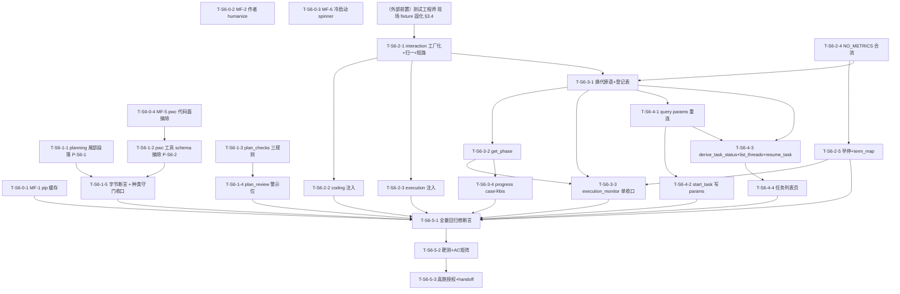

# Sprint 6 开发计划

**产品名称**：Auto-Reproduction —— 论文自动复现系统
**Sprint**：Sprint 6 —— 交互贯通与任务可恢复：让"正常流程"走得通（不死锁、不失忆、不失联）
**版本**：v1.0
**日期**：2026-07-13
**作者**：全栈开发工程师代理
**状态**：正式版
**对应 PRD**：`docs/sprint6/prd.md` v1.0（S6-01~08：4 P0 / 4 P1（含 MF-3/7）/ 4 P2 机械项；AC-S6-01~23；Q-S6-1~6 已在架构裁决）
**对应架构**：`docs/sprint6/architecture.md` v1.0（§1~§6 六项技术裁决 + §7~§8 逐项方案与变更总表 + §9 集成纪律 + §10 风险登记 + §11 测试策略 + **§12 六批次开发骨架——本计划权威骨架，照此展开** + §13 勘误留档 E-1~E-5 + §14 AC 映射）
**体例参照**：`docs/sprint5/dev-plan.md`

> **全局纪律（贯穿所有任务，不再逐项复述）**：
> 1. **回归现场样本只读勿动**：`checkpoints.db` thread `task-cdcd432cda49`（走查卡点现场，execution 挂起 user_input interrupt、fix_loop_count=2、credential_degradations 非空）与 `task-19e21e015017`（no_metrics /"两面计划"现场）+ `workspace/2405.14831/`——一切测试消费走 `tests/fixtures/` 固化副本（**复制不移动**，架构 §11 / sp5 §9.4 范式），任何任务不得写入 / 清理 / 重命名原始样本或原库。
> 2. **测试命令口径**：`.venv/bin/pytest`（裸 `pytest` 不在 PATH；全量非 e2e 回归 = `.venv/bin/pytest -q -m "not e2e"`）。零退化基线以 **sp5 收官 1754 绿** 为准，批次 0 开工前主控实测一次落档，后续各批次收口对照。
> 3. **真跑授权红线**：一切耗 deepxiv 配额 / 真实 LLM 的动作（Prompt Cache 在线维复采 + 真实 e2e 抽验 + 浏览器复走）**须 Maria 明确授权具体动作**，本计划统一归集到批次 5 任务 T-S6-5-3，**合并为一次授权动作省配额**；mock 优先守门、smoke fail-fast。
> 4. **架构贯穿硬约束沿用（架构 §头）**：主图 7 节点骨架不变；**不新增 interrupt 种类**（三类封口）；判定逻辑归确定性代码（换代判定、降级短路、no_metrics、计划交叉检查、任务状态推导，全部不交 agent）；最小单一抽象（不引入页面状态机框架 / 事件总线 / 决策审计子系统）；沿用轮询（不上 WebSocket/SSE）；prompt 改动全部遵守 R-PC4 前缀冻结。
> 5. **本 Sprint 架构级红利：GlobalState / ReproductionPlan / ExecutionResult 零新增、零变更字段**（架构 §8 头）。所有变更落 UI 层 / GraphController / 工具回调层 / execution 收尾判定层 / prompt 尾部段落 / config 常量。两现场旧 checkpoint 与全部新代码天然相容——列表页/重连/换代判定全部可用真库副本驱动验收。
> 6. **批次 1 静态前缀冻结令**：批次 1 是 sp6 唯一一次 Prompt Cache 静态变更批次（P-S6-1 planning 尾部段 + P-S6-2 pwc 工具 schema 摘除一次合入、只重建一次基线，架构 §9.1）；**批次 1 收口后，sp6 内任何任务不得再触碰任何稳定前缀 / 工具 docstring**（含 `interaction_tools.request_user_input` docstring 零字节改动——工厂化后对工厂产物做字节等值断言锁定）。
> 7. **`ui/pages/execution_monitor.py` 单收口窗口令（架构 §12 批次 3）**：该文件被 S6-01 / S6-02 / MF-4 / MF-7 / §4.2 R7 孤儿卡片**共同触碰**——**全部收敛批次 3 一次改写**。沿用「主工作区文件边界隔离」范式：并行子代理不得直接改此文件，各任务产出改动说明（或独立函数/组件代码）交主控按序统一串行合入，页面级 case①~⑦ 全矩阵 ×3 连跑防 flaky（沿 t43 / R-S6-1）。
> 8. **批次边界逐批确认制**：每批完成后停手，等 Maria 确认再开下一批；对某批的授权 ≠ 对后续批次的授权；耗配额 / 不可逆动作仍需单独授权。

---

## 1. 概述

### 1.1 Sprint 目标

Sprint 6 针对 2026-07-12 真实浏览器走查（HippoRAG 靶）暴露的"approve 之后最后一公里整体失守"，按三个范式级空档 + 一批机械修复一次性修通"正常流程走得通"：

- **不死锁**（S6-01/S6-02）：HITL 面板提交后过渡态统一契约（awaiting 单键 + 复合 interrupt_token 换代判定 + 三道防重复提交防线 + 停轮询通则落档）；在途阶段标签即时化 + 在途自动切页（GraphController `get_phase` 只读 snapshot.next 推断）。
- **不失忆**（S6-03/S6-04/S6-05）：降级决策全链路贯穿（记账已由 sp5 完成——E-1 勘误；补 execution 上下文注入 + interaction 工具层工厂短路 + `_normalize_purpose_key` 键归一）；no_metrics 专属处置（`ErrorCategory.NO_METRICS` + 步骤 4.75 合流 + errors[0] 通道定向 hint + N=2 早停）；计划自洽确定性交叉检查（`core/plan_checks.py` 三规则 W1/W2/W3 + 审核页警示位 + planning 尾部约束段）。
- **不失联**（S6-06/S6-07）：任务重连（`st.query_params` URL 持久化 + `_restore_from_query_params`）；任务列表页（`ui/pages/task_list.py` 枚举 + `derive_task_status` 确定性推导 + 一键挂回 + R7 孤儿显式续跑）。
- **机械修复包**（MF-1~7）：pip 缓存改 `SANDBOX_PIP_CACHE_DIR`（不打爆 home）、作者字段 humanize、logs 三方一致守门、error_category 裸标签渲染点清扫、pwc 摘除、冷启动 spinner、dev_loop 面板贴运行 stdout 尾部。

### 1.2 范围对齐

- **PRD 权威**：8 项需求 S6-01~08 + AC-S6-01~23 + 非目标 11 项（评测体系、token/成本追踪、LLM-as-judge、降级撤销通道、任务管理功能、多用户鉴权、GitHub API 指标、finalize 重试调优、启动提速、活动流持久化、多 tab 实时同步均不做——评测 + 成本追踪顺延 Sprint 7 合成立项）。
- **架构权威**：Q-S6-1~6 六项裁决全部落地为可执行设计（复合 interrupt_token 换代判定 / 工具层工厂闭包短路 + 键归一 / no_metrics 步骤 4.75 合流 + N=2 早停 / snapshot 推导任务状态 + 进程级 worker 登记表 / logs 维持 str 守门 + logs 尾部区 / UI snapshot.next 只读推断阶段标签），**本计划不重新决策**；§12 六批次即本计划批次 0~5。
- **新模块恰 2 个**：`core/plan_checks.py`（§7.5）、`ui/pages/task_list.py`（§4）——无其他新目录 / 新抽象层。
- **零 breaking**：无 state 契约变更；旧 checkpoint 直接可被新代码消费。

### 1.3 容量裁剪线（PRD §1 / 架构 §12 已确认，超限时依序执行）

若进度吃紧，按以下顺序顺延（**P0 载体不可裁**：批次 0 的 MF-1、批次 2 的 S6-03、批次 3 的 S6-01、批次 4 的 S6-06——缺一环走查复走仍会死在原地）：

1. **先裁 P2 四项**：批次 0 的 MF-2/MF-6、批次 3 的 MF-4 → 整任务顺延；
2. **再降 S6-02 规模**：保 case④bis 切页（AC-S6-05），标签即时化（AC-S6-04）顺延；
3. **再降 S6-05 规模**：保 W1/W2 自洽检查（AC-S6-11），W3 数据可得性警示（AC-S6-12）顺延；
4. **再降 S6-04 规模**：保 NO_METRICS 类别 + 专属文案（AC-S6-09），N=2 早停（AC-S6-10 早停部分）顺延；
5. **最后动 S6-07**（任务列表页，面试价值最高的 P1）。

### 1.4 关键风险一句话

**批次 3 `execution_monitor.py` 单收口窗口是 sp6 回归风险全 Sprint 最高点**（架构 R-S6-1）：该文件 case①~⑦ 停轮询正确性根基被 S6-01 过渡态契约直接触碰，且 S6-01/02/MF-4/MF-7/R7 卡片五处共触碰。缓解=收敛一批一次改写 + 主控单收口令 + 页面级全矩阵 ×3 连跑。其次是换代判定的**复合 interrupt_token 三元判定**（架构 §1）——单锚 id 已证不足（E-4），验收必须含"同任务串行 gate 第二问不被误判同代"与"换代反例"两个防死锁 / 防误提交用例（AC-S6-02）。其余风险（query params 无参数路径字节等价 R-S6-4、pwc 摘除测试文档同步 R-S6-5、plan_checks 误报 R-S6-A5、no_metrics 入 AUTO_FIXABLE 路由变化 R-S6-A6、`_THREAD_WORKERS` 测试间泄漏 R-S6-A4）均有确定性缓解，逐条落点见 §6。

---

## 2. 任务清单总表

| 任务编号 | 承载需求 | 任务名 | 产出文件 | 依赖前置 | 估时 | 风险 |
|---|---|---|---|---|---|---|
| **T-S6-0-1** | MF-1 | pip 缓存改 `SANDBOX_PIP_CACHE_DIR`（`_build_sandbox_env` 无条件覆盖 + run_command_tool + config 常量 + ensure_directories + .gitignore） | `config.py` + `sandbox/local_venv.py` + `core/tools/run_command_tool.py` + `.gitignore` | 无 | 3h | 中（P0，卡点 B） |
| **T-S6-0-2** | MF-2 | 作者字段 `_humanize_authors`（str/dict/list/异形兜底截断） | `ui/pages/paper_input.py` | 无 | 1.5h | 低 |
| **T-S6-0-3** | MF-6 | 冷启动 spinner（`st.set_page_config` 后、controller 创建前） | `app.py` | 无 | 1h | 低 |
| **T-S6-0-4** | MF-5 | pwc 摘除代码/测试面预研（除 prompt schema 前缀外）——`pwc_tools.py` 删除 + resource_scout 引用/装配清理 + config `PWC_*` 四常量删 + 降级链改 web search | `core/tools/pwc_tools.py`(删) + `core/nodes/resource_scout.py` + `config.py` + 相关 tests/文档 | 无 | 4h | 中（回归面广，R-S6-5） |
| ~~**T-S6-1-1**~~ | ~~S6-05~~ | ~~planning 尾部独立静态段落（P-S6-1，唯一稳定前缀变更之一）~~ | ~~`core/nodes/planning.py`~~ | — | — | **删除**（2026-07-14 Maria 决策：code_only 模式无跑实验步骤，硬约束与模式冲突；由 plan_checks W2 软检测替代） |
| **T-S6-1-2** | MF-5 | pwc 工具 schema 摘除收口（P-S6-2，resource_scout 工具装配前缀变更） | `core/nodes/resource_scout.py` | T-S6-0-4 | 1h | 中（Prompt Cache） |
| **T-S6-1-3** | S6-05 | `core/plan_checks.py` 三规则（W1/W2/W3 + 关键词静态小表） | `core/plan_checks.py` | 无 | 4h | 高（误报红线 R-S6-A5） |
| **T-S6-1-4** | S6-05 | plan_review 警示位（对 interrupt payload 内 plan 调纯函数渲染） | `ui/pages/plan_review.py` | T-S6-1-3 | 2h | 低 |
| **T-S6-1-5** | R-PC4 | 离线维字节稳定断言收口 + pwc/planning 受影响 prompt 文面断言修复 + interrupt 种类集合守门 | `tests/`（§9.4 prompt 类清单） | T-S6-1-1/2 | 2.5h | 中 |
| **T-S6-2-1** | S6-03 | interaction_tools 工厂化 + `_normalize_purpose_key` + 短路步（docstring 字节零改动） | `core/tools/interaction_tools.py` | 现场 fixture 固化（§3.4 前置门） | 4h | 高（安全 + docstring 字节纪律） |
| **T-S6-2-2** | S6-03 | coding 工具装配改工厂 + directive 常量注入 | `core/nodes/coding.py` | T-S6-2-1 | 2h | 中 |
| **T-S6-2-3** | S6-03 | execution 工具装配改工厂 + `_build_execution_context` 降级注入 + directive 常量 | `core/nodes/execution.py` | T-S6-2-1 | 2.5h | 中 |
| **T-S6-2-4** | S6-04 | `ErrorCategory.NO_METRICS`（入 AUTO_FIXABLE）+ `_apply_no_metrics` + 步骤 4.75 接线 | `core/nodes/execution.py` | 无（与 2-3 同文件串行） | 4h | 高（判定翻转 R-S6-A6） |
| **T-S6-2-5** | S6-04 | `_no_metrics_stalled` 早停 N=2 + `_maybe_interrupt_or_return` 准入接线 + config 常量 + term_map 条目 | `core/nodes/execution.py` + `config.py` + `ui/term_map.py` | T-S6-2-4 | 3h | 中 |
| **T-S6-3-1** | S6-01 | GraphController 换代原语：`get_interrupt_token` + 模块级 `_THREAD_WORKERS` 登记表 + `has_active_worker` + `resume_with` 校验参 + `_reset_for_tests` | `app.py` | T-S6-2-x（NO_METRICS 文案入面板） | 5h | 高（幂等 + 死锁命门） |
| **T-S6-3-2** | S6-02 | GraphController `get_phase` 只读推断 | `app.py` | T-S6-3-1（同文件串行） | 1.5h | 低 |
| **T-S6-3-3** | S6-01/02/MF-4/MF-7/R7 | **execution_monitor 单收口窗口**：case⑤ awaiting 契约 + 两面板改造 + 阶段指示 get_phase + 日志尾部区 + MF-4 渲染点清扫 + R7 孤儿卡片 + 通则注释修订 | `ui/pages/execution_monitor.py`（主控单收口）+ `config.py`(1 常量) | T-S6-3-1/3-2 | 7h | 高（R-S6-1 全 Sprint 最高） |
| **T-S6-3-4** | S6-02 | analysis_progress case④bis 双判据 + `_segment_status` 段状态 | `ui/pages/analysis_progress.py` | T-S6-3-2 | 2h | 中 |
| **T-S6-4-1** | S6-06 | `_restore_from_query_params` + main() 接线（无参数路径字节等价红线） | `app.py` | 批次 3（controller 原语） | 3h | 高（R-S6-4 回归红线） |
| **T-S6-4-2** | S6-06 | start_task 后写 query params + 清除点 | `ui/pages/paper_input.py` | T-S6-4-1 | 1.5h | 低 |
| **T-S6-4-3** | S6-07 | `derive_task_status`（R1~R7）+ `list_threads`（mode=ro 枚举）+ `resume_task`（显式续跑）+ 路由常量 | `app.py` + `config.py` | 批次 3（登记表/get_state 读路径） | 5h | 高（状态推导 + 副作用红线） |
| **T-S6-4-4** | S6-07 | 任务列表页（枚举表 + 状态徽标 + 一键挂回，复用 7.6 通道） | `ui/pages/task_list.py` + `ui/pages/paper_input.py`（入口链接） | T-S6-4-3 | 3h | 中 |
| **T-S6-5-1** | 回归 | 全量回归修断言（§9.4 清单逐条，只换不弱化）+ 覆盖矩阵审计 | `tests/` 既有用例 | 批次 1~4 | 5h | 中 |
| **T-S6-5-2** | 验收 | 现场靶测收口 + AC-S6-01~23 覆盖矩阵审计 | `tests/test_sprint6_*` | T-S6-5-1 | 4h | 中 |
| **T-S6-5-3** | 验收 | **真跑项（Maria 授权点）**：Prompt Cache 三维在线复采 + 浏览器复走四卡点闭环（+ AC-S5-13/21 挂账 + AC-S6-22 手动项）+ 降级同构真实 e2e 抽验 + handoff | `docs/sprint6/test-reports/` + handoff | T-S6-5-2 | 4h | 中 |

**任务总数**：25 个（批次 0×4 + 批次 1×5 + 批次 2×5 + 批次 3×4 + 批次 4×4 + 批次 5×3）。
**检查点总数**：CP 约 60 个（分布见各批次任务，收口批次 5 三 CP 为总闸门）。
**总估时**：**~78.5h**（批次 0：9.5h / 批次 1：10.5h / 批次 2：15.5h / 批次 3：15.5h / 批次 4：12.5h / 批次 5：13h）。若容量吃紧按 §1.3 裁剪线执行。

---

## 3. 批次划分与依赖图

### 3.1 批次总览（= 架构 §12 权威骨架）

| 批次 | 名称 | 任务 | 前置条件 | AC 映射 | 特殊标注 |
|---|---|---|---|---|---|
| **0** | 止血独立项（无依赖先行） | T-S6-0-1 ∥ 0-2 ∥ 0-3 ∥ 0-4 | 无（四任务文件互不重叠可并行） | AC-S6-17/18/21/22（22 手动项挂批次 5） | **MF-1 为 P0 优先合入**；MF-5 本批只清代码/测试面，prompt schema 前缀留批次 1 |
| **1** | Prompt 静态批次 + 计划守门 | T-S6-1-1~5 | 批次 0（MF-5 代码面 → T-S6-1-2） | AC-S6-11/12/13 | **sp6 唯一 Prompt Cache 基线重建批次**（离线维随批；在线复采延批次 5 合并授权）；收口后前缀冻结令生效（全局纪律 6） |
| **2** | 贯穿批（G2） | T-S6-2-1~5 | 批次 1 + **现场 fixture 固化（§3.4，前置门）** | AC-S6-06/07/08/09/10 | `coding.py` / `execution.py` / `interaction_tools.py` 本批独占；同文件多任务串行 |
| **3** | 过渡态批（G1）= execution_monitor 单收口窗口 | T-S6-3-1~4 | 批次 2（NO_METRICS 文案入面板） | AC-S6-01/02/03/04/05/20/23 | **`execution_monitor.py` 五处共触碰，收敛本批一次改写，主控收口令，页面级全矩阵 ×3 连跑**（全局纪律 7 / R-S6-1） |
| **4** | 恢复批（G3） | T-S6-4-1~4 | 批次 3（登记表 / controller 原语） | AC-S6-14/15/16 | **app.py 与批次 3 共改——两批串行不并行**；`task_list.py` 新文件独占 |
| **5** | 收口 | T-S6-5-1~3 | 批次 1~4 全部 | AC-S6-01~23 全覆盖 + sp5 基线 1754 回归全绿 | **真跑项（三维复采 + 浏览器复走 + 降级 e2e）合并一次 Maria 授权窗口省配额**（R-S6-6） |

### 3.2 依赖关系图（Mermaid）

**关键路径**：现场 fixture 固化 → T-S6-2-1（interaction 工厂化）→ T-S6-2-4（NO_METRICS）→ T-S6-3-1（换代原语，死锁命门）→ T-S6-3-3（execution_monitor 单收口）→ T-S6-4-1（重连）→ T-S6-4-3（列表页推导）→ T-S6-5-1 → 5-2 → 5-3。批次 0 四任务与批次 1 部分并行（除 T-S6-1-2 等 T-S6-0-4）；**批次 3 与批次 4 因共改 `app.py` 强制串行**（不并行）。

### 3.3 并行机会与文件边界（沿用主工作区文件边界隔离范式，主控收口）

| 并行组 | 任务 | 文件边界（互不重叠） | 说明 |
|---|---|---|---|
| P-0（批次 0 内） | T-S6-0-1 ∥ 0-2 ∥ 0-3 | config/local_venv/run_command ∥ paper_input ∥ app.py | 三文件独立；T-S6-0-4 单独跑（碰 config/resource_scout 与 0-1 config 段追加需注意先后，或同执行者） |
| P-1（批次 1 内） | T-S6-1-1 ∥ T-S6-1-3 | planning.py ∥ plan_checks.py（新文件） | 两文件独立；T-S6-1-2 依赖 0-4；T-S6-1-4 依赖 1-3；T-S6-1-5 收口串行 |
| P-2（批次 2 内） | T-S6-2-1 →（2-2 ∥ 2-3）;（2-4 → 2-5） | interaction_tools.py → (coding.py ∥ execution.py) | 2-2/2-3 依赖 2-1 后可并行；execution.py 内 2-3/2-4/2-5 三任务串行或同一执行者 |
| P-3（批次 3 内） | T-S6-3-1 → 3-2（app.py 串行）; 3-4（progress） | app.py（串行）∥ analysis_progress.py | execution_monitor.py **单收口窗口**（T-S6-3-3 主控串行合入） |
| **app.py 串行链** | 批次 3（T-S6-3-1/3-2）→ 批次 4（T-S6-4-1/4-3） | `app.py` | **批次 3/4 共改 app.py，两批串行不并行**（架构 §12 批次 4 标注） |
| **收口串行点** | `ui/pages/execution_monitor.py` | T-S6-3-3 一次改写（不跨批） | **主控单收口令**（全局纪律 7）：case①~⑦ 全矩阵 ×3 连跑 |
| 串行点 | T-S6-5-1 → 5-2 → 5-3 | — | 验收线性收口，主控执行；T-S6-5-3 待 Maria 授权 |

### 3.4 批次 2 前置门（外部依赖，显式声明）

**测试工程师须在 T-S6-2-1 验收前完成现场样本 fixture 固化**（架构 §11 / sp5 §9.4 复制不移动）：

- `tests/fixtures/checkpoints_s6_cdcd432cda49.db`：卡点现场字节副本——S6-01 换代判定（挂起 interrupt id/payload 实物）、S6-03 记账/短路（`credential_degradations={'env:OPENAI_API_KEY': …}` 非空 + `purpose_key` 键形态不一致实物）、S6-06/07 挂回与 R5 状态推导靶；
- `tests/fixtures/checkpoints_s6_19e21e015017.db`：no_metrics/两面计划现场副本——S6-04 判定翻转靶（`errors=['[error_category=none] 执行成功']` ∧ `success=False` ∧ `metrics={}` ∧ `metrics_groups={}`）、S6-05 交叉检查命中靶（14 步计划原文）；
- `tests/fixtures/checkpoints_s6_full20.db`：**20 thread 全量库字节副本**——任务列表页枚举/排序/状态推导矩阵 fixture（AC-S6-15），顺带覆盖 R-S6-A3 坏 thread 容错断言。

> 固化须走 sp5 §9.4"复制不移动"范式：源库 md5 前后逐一 MATCH，原库零字节零元数据变动（只读连接会重建 -shm 32KB / 0 字节 -wal 属 WAL 正常行为，非损伤——测试固化时用 `?mode=ro` URI 打开或先 `cp` 再验 md5）。fixture 未就绪时 T-S6-2-1 可先行开发（临时以只读原库路径本地冒烟），但 **CP-2.x 验收断言必须以固化 fixture 跑**（软前置门语义，沿 sp5 B2 / CP-0.2-5 范式）。

---

## 4. 任务详细规格

### 批次 0：止血独立项（无依赖先行，四任务文件互不重叠可并行）

> **前置条件**：无。
> **产出**：MF-1 pip 缓存止血（P0 优先合入）+ MF-2 作者字段 + MF-6 冷启动提示 + MF-5 pwc 代码面摘除（prompt schema 留批次 1）。
> **文件边界**：四任务互不重叠可并行；唯 T-S6-0-1 与 T-S6-0-4 均碰 `config.py`（前者追加 `SANDBOX_PIP_CACHE_DIR`，后者删 `PWC_*` 四常量），两段不重叠但由同一执行者串行或主控合入避免冲突。

#### 任务 T-S6-0-1：MF-1 pip 缓存改 `SANDBOX_PIP_CACHE_DIR`（P0，卡点 B，架构 §7.8 MF-1 / A-2）

- **产出文件**：`config.py`（新常量 + ensure_directories）、`sandbox/local_venv.py`（`_build_sandbox_env` 单点无条件覆盖 + :107 注释更新）、`core/tools/run_command_tool.py`（env 构造同点注入）、`.gitignore`（pip-cache 目录）
- **依赖项**：无
- **预计复杂度**：中（3h，P0）
- **架构参考**：architecture §7.8 MF-1 表 + §8 变更总表 + §13/A-2（第三变体理由留档）+ §10/R-S6-A7

**需要实现的内容**（值取架构给定，不自创）：

1. `config.py` 新增 `SANDBOX_PIP_CACHE_DIR: Path = WORKSPACE_DIR / "pip-cache"`，并入 `ensure_directories()`（落 /data 卷零 home 占用，跨任务共享省 torch 级重复下载）；
2. `sandbox/local_venv.py::_build_sandbox_env`：在 **extra_env 合并之后、无条件覆盖** `env["PIP_CACHE_DIR"] = str(SANDBOX_PIP_CACHE_DIR)`——白名单 `PIP_*` 前缀可能从宿主继承指向 home 的 `PIP_CACHE_DIR`，必须压制（覆盖不用 setdefault）；顺带更新该文件"HOME（pip 缓存 ~/.cache/pip）"注释；
3. `core/tools/run_command_tool.py::make_run_command_tool` 的 env 构造同点注入（coding smoke 侧覆盖）；
4. **否 `--no-cache-dir` 方案**（架构裁决）：`--no-cache-dir` 只能拼进 `_pip_install_with_retry` 自建命令，管不住 agent 在 `run_in_sandbox` 里自己敲的 `pip install`；环境变量单点覆盖 prepare_venv / run_in_venv / 重试全部路径；
5. `.gitignore` 追加 `workspace/pip-cache/`（架构 R-S6-A7）；覆盖仅沙箱子进程环境，宿主 `os.environ` 不动。

**自测检查点**：
- [x] CP-0.1-1 `SANDBOX_PIP_CACHE_DIR` 可导入、值为 `WORKSPACE_DIR/"pip-cache"`、类型 Path；`ensure_directories()` 后目录存在（AC-S6-17 常量面）
- [x] CP-0.1-2 `_build_sandbox_env` 返回 env 中 `PIP_CACHE_DIR == str(SANDBOX_PIP_CACHE_DIR)`，且**在 extra_env 传入指向 home 的 `PIP_CACHE_DIR` 时仍被覆盖**（无条件压制断言，AC-S6-17 核心）
- [x] CP-0.1-3 `make_run_command_tool` 构造的 env 同含正确 `PIP_CACHE_DIR`；宿主 `os.environ` 未被修改（沙箱隔离断言）
- [x] CP-0.1-4 既有 `_build_sandbox_env` 白名单/HOME 相关用例回归零退化；`.gitignore` 含 pip-cache 目录

#### 任务 T-S6-0-2：MF-2 作者字段 humanize（P2，走查 §三-1，架构 §7.8 MF-2）

- **产出文件**：`ui/pages/paper_input.py`（卡片渲染处新增纯函数 `_humanize_authors`）
- **依赖项**：无
- **预计复杂度**：低（1.5h）
- **架构参考**：architecture §7.8 MF-2

**需要实现的内容**：

1. 纯函数 `_humanize_authors(authors) -> str`：`str` 直通 / `dict` 取 `name` 键 / `list` 逐项递归取 `name` / 其余 `str()` 兜底截断（过长截断加省略号）；
2. 走查异形样本 `{'misc': {}, 'name': 'Bernal...'}` 与嵌套 list、缺字段 dict 入单测；
3. 卡片渲染处调用该函数替换裸渲染。

**自测检查点**：
- [x] CP-0.2-1 `_humanize_authors` 五形态断言：str / dict 含 name / list[dict] / 缺 name 的 dict / 异形（含走查样本 `{'misc':{},'name':'Bernal...'}`）均返回可读字符串，无裸 dict repr（AC-S6-18）
- [x] CP-0.2-2 超长作者列表截断有省略号；空 authors 返回占位/空串不抛异常
- [x] CP-0.2-3 paper_input 卡片渲染用例回归：作者区不出现 `{`/`}` 裸字典字符

#### 任务 T-S6-0-3：MF-6 冷启动 spinner（P2，走查 §三-5，架构 §7.8 MF-6）

- **产出文件**：`app.py::main()`
- **依赖项**：无
- **预计复杂度**：低（1h）
- **架构参考**：architecture §7.8 MF-6

**需要实现的内容**：

1. `app.py main()`：`st.set_page_config` 后、`_get_controller()` 前，controller 尚未创建（`"graph_controller" not in st.session_state`）时先用 `st.spinner("系统初始化中（首次启动约 40 秒）…")` 包裹 controller 创建；
2. 冷启动耗时在 build_graph/checkpointer 初始化——提示先于耗时段落地即可见；**只加提示不提速**（PRD 非目标 9）；
3. controller 已存在（热路径）时不渲染 spinner（无感）。

**自测检查点**：
- [x] CP-0.3-1 AppTest：首次进入（session 无 graph_controller）时 spinner 文案出现在 controller 创建前；已存在 controller 时不渲染 spinner（落点断言，AC-S6-22 自动可测部分）
- [x] CP-0.3-2 无参数/正常路由回归：spinner 改动不影响既有 main() 路由分发；AC-S6-22 手动浏览器复走项挂批次 5

#### 任务 T-S6-0-4：MF-5 pwc 代码面摘除（P2，走查 §三-3，架构 §7.8 MF-5）

- **产出文件**：`core/tools/pwc_tools.py`（删除）、`core/nodes/resource_scout.py`（引用/装配/降级链清理，**prompt schema 前缀变更留 T-S6-1-2**）、`config.py`（删 `PWC_*` 四常量：PWC_BASE_URL / PWC_RATE_LIMIT_RPS / PWC_TIMEOUT_CONNECT / PWC_TIMEOUT_READ）、相关 `tests/`（pwc 用例整组摘除/改写）、相关文档同步
- **依赖项**：无
- **预计复杂度**：中（4h，回归面广 R-S6-5）
- **架构参考**：architecture §7.8 MF-5 + §9.4 + 全局 PRD R7

**需要实现的内容**：

1. 删除 `core/tools/pwc_tools.py`（PwC 网站 2025 年中已下线，API 回 HTML）；
2. `core/nodes/resource_scout.py`：摘除 pwc 引用与工具装配中的 pwc 条目、prompt 中 pwc 相关指令的**非前缀部分**（工具 schema 前缀摘除属静态变更 → 留 T-S6-1-2 并入批次 1 一次基线重建）；**降级链改为 deepxiv github_url → web search**（原 pwc 通道移除）；
3. `config.py` 删 `PWC_*` 四常量；
4. `tests/` 中 pwc 相关用例整组摘除或改写（AC-S6-21）；相关文档（technical-architecture 等）同步；
5. **本任务只清代码/测试/降级链，不动 resource_scout 工具 schema 稳定前缀**（那部分是 T-S6-1-2 的活，避免 Prompt Cache 基线在批次 0 就被扰动——前缀变更集中批次 1 一次）。

**自测检查点**：
- [x] CP-0.4-1 `import core.tools.pwc_tools` 抛 ModuleNotFoundError（文件已删）；`config.PWC_BASE_URL` 等四常量不存在
- [x] CP-0.4-2 resource_scout 代码路径审计：无 pwc 请求路径、无 pwc 工具装配残留（降级链 = deepxiv github_url → web search），mock 断言零 pwc 调用（AC-S6-21）
- [x] CP-0.4-3 pwc 相关旧测试整组摘除/改写，改写后用例绿；resource_scout 非 pwc 路径回归零退化
- [x] CP-0.4-4 文档同步核查（technical-architecture / 全局 PRD R7 已应用面对齐，架构文档随批勘误）

> **批次 0 收口门**：CP-0.1~0.4 全绿 + `.venv/bin/pytest -q -m "not e2e"` 相对 sp5 基线 1754 零退化（pwc 用例摘除后总数下降属预期，账目须精确闭合）。**停手等 Maria 确认再开批次 1。**

---

### 批次 1：Prompt 静态批次 + 计划守门（sp6 唯一 Prompt Cache 基线重建批次）

> **前置条件**：批次 0（MF-5 代码面 T-S6-0-4 → T-S6-1-2 前缀摘除收口）。
> **产出**：sp6 全部触碰稳定前缀的静态变更一次合入（P-S6-1 planning 尾部段 + P-S6-2 pwc 工具 schema 摘除，架构 §9.1 恰两项）+ `core/plan_checks.py` 三规则 + plan_review 警示位 + 离线维字节断言随批落地。
> **基线重建语义（架构 §9.1）**：本批是 sp6 唯一触发 Prompt Cache 基线重建的批次——**离线维（mock 字节稳定断言）随 T-S6-1-5 落地；在线维（真跑三维复采、建新 R_baseline）挂 Maria 授权点，延至批次 5 T-S6-5-3 与真实 e2e 合并为一次授权**。旧基线因前缀变更作废属预期。
> **前缀冻结令**：本批收口后，sp6 内不再动任何稳定前缀（planning/coding/execution 三主体、resource_scout 及全部工具 docstring）——含批次 2 的 `request_user_input` docstring 零字节改动（工厂化对产物做字节断言，CP-2.1-x）。

#### 任务 T-S6-1-1：planning 尾部独立静态段落（P-S6-1，架构 §7.5 / §9.1）

- **产出文件**：`core/nodes/planning.py`（尾部段落常量追加，沿 sp5 P8 术语段先例）
- **依赖项**：无
- **预计复杂度**：中（1h，Prompt Cache）
- **架构参考**：architecture §7.5 planning prompt 约束 + §9.1 P-S6-1 + AC-S6-13

**需要实现的内容**：

1. 在 planning system prompt **尾部独立静态段落**（`_PLANNING_SYSTEM_PROMPT_BODY` 之后的独立常量，与既有 P8 术语约束段同款结构）追加一条约束："执行步骤必须包含运行实验主入口并产出指标的步骤；数据准备声明必须落为对应执行步骤。"；
2. **严禁混入任何论文级动态变量**（arxiv_id / paper_meta 等）——尾部段落跨论文字节级恒定；
3. 独立常量便于测试断言（沿 CP-1.5-3 尾部段落常量断言范式）。

**自测检查点**：
- [ ] CP-1.1-1 planning system prompt 含该约束文案；尾部段落常量可独立导入断言（AC-S6-13）
- [ ] CP-1.1-2 禁动态变量审查：截取两篇不同论文的 planning SystemMessage，去尾部动态上下文段后主体字节级一致（前缀冻结守门，沿 sp5 P8 范式）
- [ ] CP-1.1-3 该段落跨论文字节恒定（`json.dumps(sort_keys)` 幂等前提不破）

#### 任务 T-S6-1-2：pwc 工具 schema 摘除收口（P-S6-2，架构 §9.1）

- **产出文件**：`core/nodes/resource_scout.py`（工具装配 pwc schema 前缀摘除）
- **依赖项**：T-S6-0-4（pwc 代码面已删）
- **预计复杂度**：中（1h，Prompt Cache）
- **架构参考**：architecture §7.8 MF-5 + §9.1 P-S6-2

**需要实现的内容**：

1. pwc 工具 docstring 曾进 resource_scout 工具 schema 前缀——摘除属静态前缀变更，本任务是 T-S6-0-4 的前缀收尾（并入批次 1 同一次基线重建批次）；
2. 摘除 resource_scout 工具集中 pwc 工具的装配（schema 前缀随之变化）；
3. 与 T-S6-1-1 一起构成 sp6 前缀变更全集——**批次 1 收口即前缀冻结**。

**自测检查点**：
- [x] CP-1.2-1 resource_scout 工具集不含 pwc 工具；工具 schema 前缀无 pwc docstring 残留
- [x] CP-1.2-2 resource_scout 工具装配用例回归绿（降级链 = deepxiv github_url → web search，与 T-S6-0-4 一致）

#### 任务 T-S6-1-3：`core/plan_checks.py` 三规则（S6-05，架构 §7.5）

- **产出文件**：`core/plan_checks.py`（新模块，零 LLM、零 state 写入，与 honesty_audit 同范式）
- **依赖项**：无
- **预计复杂度**：高（4h，误报红线 R-S6-A5）
- **架构参考**：architecture §7.5 W1/W2/W3 + §10/R-S6-A5 + AC-S6-11/12

**需要实现的内容**：

1. `check_plan(plan, resource_info) -> List[Dict]`，每条 `{"rule": str, "message": str}`（rule 三值字符串字面量，**不建 Enum**——极简）；
2. **W1 数据步骤脱节**：`data_preparation` 非空 ∧ 全部 `execution_steps` 的 name+command 文本均未命中数据语义关键词静态小表（`data/dataset/download/prepare/预处理/数据` 等）→ 警示"计划声明了数据准备工作，但执行步骤中没有任何数据相关步骤"；
3. **W2 指标产出脱节**：`expected_results` 非空（含任一 trend 结构或描述文本）∧ 全部步骤文本未命中实验/指标语义关键词表（`run/train/eval/experiment/metric/summary.json/实验/评测/指标` 等）→ 警示"计划有指标性预期，但执行步骤中没有产出指标的步骤"（"两面计划"现场 14 步原文命中靶）；
4. **W3 数据不可得**：resource_info 无可用数据集线索（`external_resources` 无 dataset 类条目 ∧ `selected_repo` 为 None）∧ `data_preparation` 非空 → 警示"所需数据集未在资源侦察中找到，请决策"；
5. **误报防线（R-S6-A5）**：关键词表**宁窄勿宽**；警示不阻断审批（纯 UI 渲染消费，人在回路兜底）；规则独立无运行时开关（单规则可疑时最小 diff 收窄）；
6. `expected_results` 消费须容忍 sp5 后的 list 形态（`[{"description", "trend"}]`）。

**自测检查点**：
- [x] CP-1.3-1 W1/W2/W3 三规则命中断言：以 `task-19e21e015017` 14 步"两面计划"原文 fixture 驱动，W1/W2 命中（AC-S6-11）
- [x] CP-1.3-2 **误报防线同权重**：干净计划 fixture（含数据步骤 + 跑实验出指标步骤 + resource_info 有 dataset）→ 三规则零警示（AC-S6-11 误报面）
- [x] CP-1.3-3 W3 数据不可得单测：无 dataset 线索 ∧ selected_repo None ∧ data_preparation 非空 → 命中（AC-S6-12）
- [x] CP-1.3-4 边界：`expected_results` 空/list 形态、`execution_steps` 空、`data_preparation` 空各分支返回正确；关键词表窄边界（不误伤含"data"子串的无关词——如实测边界样本）

#### 任务 T-S6-1-4：plan_review 警示位（S6-05，架构 §7.5）

- **产出文件**：`ui/pages/plan_review.py`（既有"信息完整度评估卡片"位追加警示行）
- **依赖项**：T-S6-1-3
- **预计复杂度**：低（2h）
- **架构参考**：architecture §7.5 展示 + AC-S6-11

**需要实现的内容**：

1. UI 渲染时对 interrupt payload 内的 plan 调 `check_plan` 纯函数（**零 state 变更、零 planning 节点变更**）；
2. 警示行追加到既有"信息完整度评估卡片"位（复用，不新增卡片体系）；
3. **警示不阻断审批**——用户知情后仍可 approve（人在回路本义）；零警示时不渲染警示行（干净计划无噪声）。

**自测检查点**：
- [x] CP-1.4-1 AppTest：两面计划 payload → 审核页信息完整度卡片位出现 W1/W2 警示行且 approve 按钮仍可用（不阻断，AC-S6-11 渲染面）
- [x] CP-1.4-2 干净计划 payload → 零警示行（误报防线渲染面）
- [x] CP-1.4-3 数据不可得 payload → W3 警示行出现；interrupt 种类集合不变（无新 gate）

#### 任务 T-S6-1-5：字节断言 + 种类守门收口（R-PC4，架构 §9.1/§9.4）

- **产出文件**：`tests/`（§9.4 prompt 类清单：planning 尾部段字节断言、pwc 摘除后 resource_scout schema 断言、interrupt 种类集合守门用例）
- **依赖项**：T-S6-1-2（T-S6-1-1 已删除）
- **预计复杂度**：中（2.5h）
- **架构参考**：architecture §9.1（离线维随批）+ §9.4 回归修断言清单

**需要实现的内容**：

1. ~~planning 主体字节级一致断言（CP-1.1-2 的测试落地）~~ → **改为**：planning prompt 无新增前缀守门断言（断言当前 planning system prompt 主体字节未变动，作为回归基线）；
2. resource_scout 工具 schema pwc 摘除后的稳定断言（前缀无 pwc）；
3. **interrupt 种类集合守门用例**：断言 sp6 后 interrupt 种类仍恰三类（planning#1 / dev_loop#2 / user_input#3），S6-05 数据可得性警示复用审核不新增（AC-S6-12 守门面）；
4. 受影响既有 prompt 文面断言修复（pwc 摘除牵动的 resource_scout 断言、planning 段落新增牵动的断言）——只换不弱化。

**自测检查点**：
- [x] CP-1.5-1 planning prompt 无新增前缀守门断言绿（现状快照，T-S6-1-1 已删故无 AC-S6-13 约束段）
- [x] CP-1.5-2 resource_scout schema 无 pwc 前缀断言绿
- [x] CP-1.5-3 interrupt 种类集合守门用例：恰三类，无新增（AC-S6-12）
- [x] CP-1.5-4 受影响 prompt 类既有断言逐条适配（只换断言目标不弱化语义，清单记 TODO）

> **批次 1 收口门**：CP-1.2~1.5 全绿（T-S6-1-1 已删，CP-1.1 系列作废）+ 全量非 e2e 回归零退化（离线维基线随批重建）+ **前缀冻结令生效**（sp6 内此后不动任何稳定前缀）。在线维三维复采延批次 5。**停手等 Maria 确认再开批次 2。**

---

### 批次 2：贯穿批（G2）——降级贯穿 + no_metrics 处置

> **前置条件**：批次 1（前缀冻结）+ **现场 fixture 固化（§3.4，前置门）**。
> **产出**：S6-03 降级贯穿（interaction 工具层工厂短路 + 键归一 + execution 上下文注入）+ S6-04 no_metrics 专属处置（NO_METRICS 成员 + 步骤 4.75 合流 + N=2 早停 + 定向 hint）。
> **文件边界**：`coding.py` / `execution.py` / `interaction_tools.py` **本批独占**；`execution.py` 内 T-S6-2-3/2-4/2-5 三任务串行或同一执行者。**零 state schema 变更、零 prompt 主体变更**（架构 §2.6/§3.5）。
> **勘误落地纪律（架构 §13）**：E-1——降级记账（`credential_degradations`）已由 sp5 完成，**本批不做记账、只做注入 + 短路**（AC-S6-06 是回归靶防倒退，不是新写记账）；E-5——键归一以 `_normalize_purpose_key` 为唯一口径，`.secrets`/mask/声明面不归一。

#### 任务 T-S6-2-1：interaction_tools 工厂化 + 键归一 + 短路（S6-03，架构 §2.2/§2.3）

- **产出文件**：`core/tools/interaction_tools.py`（`_normalize_purpose_key` 纯函数 + `make_request_user_input_tool` 工厂 + 短路第 1.5 步 + `_reset`/兼容默认实例）
- **依赖项**：§3.4 现场 fixture 固化（软前置门）
- **预计复杂度**：高（4h，安全关键 + docstring 字节纪律）
- **架构参考**：architecture §2.2 键归一 + §2.3 工厂闭包短路 + §9.2 + AC-S6-08

**需要实现的内容**：

1. `_normalize_purpose_key(key: str) -> str`（确定性纯函数）：`strip → 剥离一次 'env:' 前缀 → lower → 非 [a-z0-9] 连续段折叠为单个 '_' → 去首尾 '_'`。例：`'env:OPENAI_API_KEY' → 'openai_api_key'`；`'git_credential:github.com' → 'git_credential_github_com'`；
2. `make_request_user_input_tool(degraded: Dict[str, str])` 工厂闭包（沿 `make_run_in_sandbox_tool` / `make_run_command_tool` 先例）：闭包绑定 state 的 `credential_degradations` 快照；
3. **短路语义**（工具体内、`.secrets` 去重之后、`interrupt()` 之前插入第 1.5 步）：`purpose_key` 归一命中已拒集合（degraded 的键也归一后比对）→ **不 interrupt**，直接返回确定性降级指令串：`"用户已明确拒绝提供该凭证（{purpose}）。本任务全程不得再索要；请走模拟/mock 路径完成当前步骤，并如实声明模拟范围。"`——返回值仍是**纯字符串**（BUG-S1-02 刻意例外语义不变）；
4. 日志打 `purpose_key` 归一前后值（**不打 question 全文**，安全纪律不变）；
5. **docstring 字节零改动**：工厂返回的 tool schema 与现 `@tool` 完全一致（CP-2.1-5 字节断言锁定）；模块级 `request_user_input` 保留为 `make_request_user_input_tool({})` 默认实例（向后兼容既有 import 与测试面）；
6. `_reset_for_tests` 或工厂无状态设计（避免测试间泄漏——归一命中集合来自闭包参，无模块级可变态）。

**自测检查点**：
- [ ] CP-2.1-1 `_normalize_purpose_key` 双向样本：`'env:OPENAI_API_KEY'` 与 `'openai_api_key'` 归一同形；`'git_credential:github.com' → 'git_credential_github_com'`；碰撞用例（现实键空间互不碰撞验证）
- [ ] CP-2.1-2 短路断言：degraded 含 `env:OPENAI_API_KEY`，工具对 `purpose_key='openai_api_key'` 二次索要 → **零 interrupt** + 返回降级指令串（AC-S6-08 核心，键形态跨侧不一致场景）
- [ ] CP-2.1-3 非命中路径：degraded 为空或键不匹配 → 走既有 `.secrets` 去重 + interrupt 原路径，语义零改动
- [ ] CP-2.1-4 短路返回值为 `str`（非 dict）；短路调用**不推进 scratchpad interrupt 计数**（天然成立——根本没调 interrupt()，架构 §9.2）
- [ ] CP-2.1-5 **工厂产物 tool schema 字节等值断言**：`make_request_user_input_tool({})` 与原 `request_user_input` 的 name/description/args schema 逐字节相同（前缀冻结守门，CP-B1-5 范式）
- [ ] CP-2.1-6 归一命中打 WARNING/INFO 日志含归一前后 purpose_key、不含 question 全文（安全纪律）

#### 任务 T-S6-2-2：coding 工具装配改工厂 + directive 常量（S6-03，架构 §2.4）

- **产出文件**：`core/nodes/coding.py`（工具装配处 :352 附近改工厂调用 + `credential_degradations_directive` 常量注入 `_build_coding_context`）
- **依赖项**：T-S6-2-1
- **预计复杂度**：中（2h）
- **架构参考**：architecture §2.4 + §2.6 落点 + AC-S6-07

**需要实现的内容**：

1. coding 工具装配改 `make_request_user_input_tool(state.get("credential_degradations") or {})`（闭包绑定当前 state 降级快照）；
2. `credential_degradations_directive` **模块级字符串常量**（两文件引用同一份，内容即 §2.3 三句"禁再索要、必须走模拟路径、如实声明"）注入 payload——只随降级非空出现，字节恒定；
3. coding 侧 `_build_coding_context` 已注入 `credential_degradations`（coding.py:303-311 已在位）——本任务补 directive 常量 + 工具工厂化（AC-S6-07 的 coding 半边补齐）；
4. 修复回合同样经 `_build_coding_context`，各轮可见（AC-S6-07 修复轮次面免费获得）。

**自测检查点**：
- [ ] CP-2.2-1 降级非空时 coding 工具集为工厂产物（绑定 degraded 快照）；`_build_coding_context` payload 含 `credential_degradations` + `credential_degradations_directive` 三句语义（AC-S6-07 coding 面）
- [ ] CP-2.2-2 零降级路径：`_build_coding_context` payload 不含 directive（HumanMessage 字节零扰动，R-PC4 合规）
- [ ] CP-2.2-3 修复回合断言：模拟修复循环第 N 轮上下文仍含降级指令（AC-S6-07 修复轮次）

#### 任务 T-S6-2-3：execution 工具装配改工厂 + 上下文降级注入（S6-03，架构 §2.4）

- **产出文件**：`core/nodes/execution.py`（工具装配处 :1312 附近改工厂 + `_build_execution_context` :1083 降级注入 + 引用同一 directive 常量）
- **依赖项**：T-S6-2-1
- **预计复杂度**：中（2.5h）
- **架构参考**：architecture §2.4 + §2.6 落点 + AC-S6-07

**需要实现的内容**：

1. execution 工具装配改 `make_request_user_input_tool(...)`（同 coding 半边——走查中 execution agent"对用户拒绝零记忆"的直接原因就是此处无短路）；
2. `_build_execution_context`（execution.py:1083-1111）照搬 coding.py:303-311 同款：`credential_degradations` 非空才注入 payload（零降级路径 HumanMessage 字节零扰动）+ 引用同一 `credential_degradations_directive` 常量（两文件同一份）；
3. 修复循环各轮可见（context builder 每次节点执行重建 payload，state 字段贯穿免费获得）。

**自测检查点**：
- [ ] CP-2.3-1 降级非空时 execution 工具集为工厂产物；`_build_execution_context` payload 含 `credential_degradations` + directive 三句语义（AC-S6-07 execution 面，走查缺口修复靶）
- [ ] CP-2.3-2 零降级路径：payload 不含 directive（R-PC4 合规，字节零扰动）
- [ ] CP-2.3-3 **现场同构记账回归靶**：以 `task-cdcd432cda49` fixture（`credential_degradations={'env:OPENAI_API_KEY':…}`）驱动，断言 execution 上下文含降级指令 + interaction 短路生效——**不得复现"降级后记账为空"**（AC-S6-06，走查现场同构，非 mock 自证）

#### 任务 T-S6-2-4：NO_METRICS 合流（S6-04，架构 §3.2）

- **产出文件**：`core/nodes/execution.py`（`ErrorCategory.NO_METRICS` 成员 + 入 `AUTO_FIXABLE` + `_apply_no_metrics` + 步骤 4.75 接线）
- **依赖项**：无（与 2-3 同文件串行）
- **预计复杂度**：高（4h，判定翻转 R-S6-A6）
- **架构参考**：architecture §3.1/§3.2 + §10/R-S6-A6 + AC-S6-09

**需要实现的内容**：

1. `ErrorCategory` 增成员 `NO_METRICS = "no_metrics"`（既有 enum 加一成员，不新建分类体系）+ **加入 `AUTO_FIXABLE`**（缺指标输出属可修——回 coding 定向修复对症）；
2. `_apply_no_metrics(feedback, metrics, metrics_groups, exit_ok) -> ExecutionFeedback` 纯函数：`exit_ok ∧ category==NONE ∧ metrics 空 ∧ metrics_groups 空 → 改判 NO_METRICS`。summary（专属文案 = 定向 hint 本体）："代码跑通但未产出指标：全部命令 exit 0，但未发现 `<METRICS>` 输出或 outputs/*/summary.json。请检查执行步骤是否调用了实验主入口，并按输出约定写出指标。" fix_hint 同文。其余情形原样返回；
3. **判定含 `metrics_groups`**（组指标非空说明实验有产出，保守防误报——B-2 现场两者均空命中）；
4. 接线在 execution() 主流程**步骤 4.75**（`_parse_metrics`/`_collect_grouped_metrics` 之后、`_build_execution_result` 之前），随 exec_result 一次 commit（幂等纪律③不破）；
5. guard 路径 `_feedback_from_committed_result`（:2118）经 `ErrorCategory(raw)` 解析 `no_metrics` 天然有效、auto_fixable 由成员资格自动推导，**零改动**。

**自测检查点**：
- [ ] CP-2.4-1 `_apply_no_metrics` 四象限（exit_ok × metrics 空/非空 × groups 空/非空）：仅 `exit_ok ∧ NONE ∧ metrics 空 ∧ groups 空` 改判 NO_METRICS，其余原样返回（AC-S6-09 判定面）
- [ ] CP-2.4-2 专属文案断言：改判后 summary/fix_hint 含"代码跑通但未产出指标…"语义，**不再出现 `[error_category=none] 执行成功` 自相矛盾同屏**（AC-S6-09 核心）
- [ ] CP-2.4-3 `NO_METRICS in AUTO_FIXABLE` 断言；guard 路径 `_feedback_from_committed_result` 解析 `no_metrics` auto_fixable=True（零改动验证）
- [ ] CP-2.4-4 **现场翻转靶**：以 `task-19e21e015017` fixture（`errors=['[error_category=none] 执行成功']` ∧ success=False ∧ metrics={} ∧ groups={}）为新锚，断言判定翻转为 NO_METRICS（B-2 同构，R-S6-A6 行为锁定）
- [ ] CP-2.4-5 characterization 回归：既有 `_classify_execution`/`_build_execution_result` 用例中 NONE+零指标场景断言翻转为 NO_METRICS（只换不弱化，清单记 TODO）

#### 任务 T-S6-2-5：早停 N=2 + term_map 条目（S6-04，架构 §3.3/§3.4）

- **产出文件**：`core/nodes/execution.py`（`_no_metrics_stalled` + `_maybe_interrupt_or_return` :1948 准入接线）、`config.py`（`NO_METRICS_EARLY_STOP_ROUNDS: int = 2`）、`ui/term_map.py`（error_category 增 `no_metrics` 条目）
- **依赖项**：T-S6-2-4
- **预计复杂度**：中（3h）
- **架构参考**：architecture §3.3 hint 通道 + §3.4 早停 + AC-S6-10

**需要实现的内容**：

1. `config.py` 新增 `NO_METRICS_EARLY_STOP_ROUNDS: int = 2`（值取架构，A-1 可单点推翻）；
2. `_no_metrics_stalled(state, feedback) -> bool`：本轮 `feedback.category==NO_METRICS` ∧ `fix_loop_history` 尾部已有连续 ≥N 条 `error_category=="no_metrics"` → True（"无进展"口径 = 类别连续复现，不另做指标 diff——极简）；
3. `_maybe_interrupt_or_return`（:1948）auto_fixable 分支准入条件增一项 `not _no_metrics_stalled(state, feedback)`——早停走**既有** interrupt#2 通道（三类封口不破），决策面板文案含"已连续 N+1 轮零指标，自动修复无进展"；
4. **定向 hint 零新通道**（架构 §3.3）：hint 写进 NO_METRICS 的 summary/fix_hint（T-S6-2-4 已做），三下游（coding `_digest_execution_feedback` / execution `_build_execution_context` / 面板+报告 errors[0]）免费收到——本任务只需验证；
5. `ui/term_map.py` error_category 域增 `no_metrics` 中文条目（面板措辞，与 MF-4 同批清扫但 term_map 条目本任务落）。

**自测检查点**：
- [ ] CP-2.5-1 `NO_METRICS_EARLY_STOP_ROUNDS==2` 常量断言；`_no_metrics_stalled` 真值表（fix_loop_history 尾部 <N / ==N / >N 条 no_metrics）
- [ ] CP-2.5-2 早停接线：连续 N 轮 no_metrics → `_maybe_interrupt_or_return` 跳过 retry_coding 走 interrupt#2；决策面板文案含轮次上下文（AC-S6-10 早停）
- [ ] CP-2.5-3 定向 hint 三下游可见：coding `_digest_execution_feedback` / execution `_build_execution_context` / 面板 errors[0] 均含"缺指标产出/未调用实验主入口"语义（AC-S6-10 hint 面，零新通道验证）
- [ ] CP-2.5-4 `term_map['error_category:no_metrics']` 中文条目存在；面板渲染 no_metrics 不裸露 `no_metrics` 英文字面量

> **批次 2 收口门**：CP-2.1~2.5 全绿 + 两现场 fixture 靶测通过（`task-cdcd432cda49` 降级贯穿 + `task-19e21e015017` no_metrics 翻转）+ 全量非 e2e 回归零退化（characterization 翻转断言只换不弱化）。**停手等 Maria 确认再开批次 3。**

---

### 批次 3：过渡态批（G1）= execution_monitor 单收口窗口（全 Sprint 最高回归风险）

> **前置条件**：批次 2（NO_METRICS 文案入面板）。
> **产出**：S6-01 过渡态契约（awaiting 单键 + 复合 token 换代判定 + 三道防重复提交防线 + 通则落档）+ S6-02 在途标签（get_phase）+ MF-7 日志尾部区 + MF-4 渲染点清扫 + §4.2 R7 孤儿卡片。
> **文件边界**：`app.py`（T-S6-3-1/3-2 controller 增量，与批次 4 共改须串行）+ `ui/pages/execution_monitor.py`（**单收口窗口 T-S6-3-3，五处共触碰一次改写，主控串行合入**）+ `ui/pages/analysis_progress.py`（T-S6-3-4）+ `config.py`（1 常量）。**零 state / 零节点 / 零 interrupt payload 契约改动**（架构 §1.5/§6.3）。
> **回归纪律（R-S6-1）**：execution_monitor 是 sp5 多批次收口文件，case①~⑦ 停轮询正确性根基被 S6-01 直接触碰——**页面级 case 全矩阵 ×3 连跑防 flaky**（沿 t43 范式）。

#### 任务 T-S6-3-1：GraphController 换代原语 + 进程级登记表（S6-01，架构 §1.2）

- **产出文件**：`app.py`（`get_interrupt_token` + 模块级 `_THREAD_WORKERS: Dict[str, Thread]` + Lock + `has_active_worker` + `resume_with` 增校验参 + `_reset_for_tests`；start/resume/resume_task 登记表接线）
- **依赖项**：批次 2（NO_METRICS 文案入面板——面板本身在 T-S6-3-3）
- **预计复杂度**：高（5h，幂等 + 死锁命门）
- **架构参考**：architecture §1.2 复合 token + 三道防线 + §4.1 R6/R7 口径 + §9.2 + AC-S6-01/02

**需要实现的内容**：

1. `get_interrupt_token(thread_id) -> Optional[str]`（与 `get_interrupt_payload` 同一读路径 `snapshot.tasks[*].interrupts[0]`，主线程 `_main_graph.get_state` 只读）：`token = f"{interrupt.id}:{sha1(json.dumps(interrupt.value, sort_keys=True, ensure_ascii=False, default=str))[:16]}"`；无 interrupt → None；**payload 指纹只存哈希**（敏感 question 不外泄）；`interrupt.id` 取不到时 `getattr` 防御退化为纯 payload 指纹（R-S6-A1）；
2. 模块级 **`_THREAD_WORKERS: Dict[str, Thread]` + 模块级锁**（GraphController 实例共享读写——多 tab = 多 controller 实例但同一 Streamlit 进程，模块级登记表是唯一横跨 tab 的确定性闸门）；
3. `has_active_worker(thread_id) -> bool` 只读方法（查登记表线程存活）；
4. `resume_with(thread_id, payload, expected_interrupt_token=None)` **增可选校验参**（向后兼容缺省 None = 不校验）：非 None 时在发起线程前重读当前 token，不一致即**拒绝**（WARNING + 返回 False，不抛异常）——挡"迟到的提交"；**原子 check-and-set**：该 thread 已有存活线程 → 拒绝（第三道防线，跨 tab/双击窗口期）；
5. start_task / resume_with / resume_task 均把 worker 登记进 `_THREAD_WORKERS`（线程结束时清理或惰性清理死线程）；
6. `_reset_for_tests()` 清空登记表（R-S6-A4 测试间泄漏防线，fixture 内 monkeypatch 清空）。

**自测检查点**：
- [ ] CP-3.1-1 `get_interrupt_token`：有 interrupt → `id:指纹`（16 字符指纹）；无 interrupt → None；payload 变化 → token 变化；相同 payload → token 相同（换代判定基石）
- [ ] CP-3.1-2 payload 指纹只存哈希：token 中不含 question 原文；`interrupt.id` getattr 失败时退化为纯指纹（R-S6-A1 防御）
- [ ] CP-3.1-3 `resume_with` 校验参：`expected_interrupt_token` 不一致 → 返回 False + WARNING 不抛异常；缺省 None → 不校验（plan_review 等既有调用零改动，向后兼容）
- [ ] CP-3.1-4 **第三道防线**：同 thread 已有存活 worker → `resume_with` 原子拒绝（防重复 resume，跨 tab）；`has_active_worker` 反映登记表真值
- [ ] CP-3.1-5 `_reset_for_tests` 清空登记表；用例间无 thread_id 残留（R-S6-A4）

#### 任务 T-S6-3-2：GraphController get_phase 只读推断（S6-02，架构 §6.1）

- **产出文件**：`app.py`（`get_phase` 只读方法）
- **依赖项**：T-S6-3-1（同文件串行）
- **预计复杂度**：低（1.5h）
- **架构参考**：architecture §6.1 + AC-S6-04

**需要实现的内容**：

1. `get_phase(thread_id) -> Dict`：`{"active_node": snapshot.next[0]（next 非空时）| None, "current_step": values.current_step}`（与 `is_finished` 同一读路径与空快照防御 app.py:254）；
2. 纯只读，零 state / 零节点 / 零图变更（方案 B，回归面最小）。

**自测检查点**：
- [ ] CP-3.2-1 `get_phase`：snapshot.next=('execution',) → active_node='execution'；next 空 → None；空/无快照防御返回安全默认（AC-S6-04 controller 面）
- [ ] CP-3.2-2 现场 fixture 驱动：`task-cdcd432cda49`（next=('execution',)）→ active_node='execution' 与取证一致

#### 任务 T-S6-3-3：execution_monitor 单收口窗口（S6-01/02/MF-4/MF-7/R7，主控串行合入）

- **产出文件**：`ui/pages/execution_monitor.py`（**一次改写，主控单收口令**）+ `config.py`（`DEV_LOOP_PANEL_LOG_TAIL_CHARS: int = 4000`）
- **依赖项**：T-S6-3-1（token/登记表原语）+ T-S6-3-2（get_phase）
- **预计复杂度**：高（7h，R-S6-1 全 Sprint 最高）
- **架构参考**：architecture §1.2/§1.3 + §5.3 MF-7 + §6.2 + §7.8 MF-4 + §4.2 R7 卡片 + AC-S6-01/02/03/20/23

**需要实现的内容**（**收敛一批一次改写**，五处共触碰）：

1. **S6-01 case⑤ awaiting 契约**：过渡态标志 `_exec_awaiting_token: Optional[str]`（execution_monitor 页私有 session_state key，缺省 None）；两类面板（`_render_user_input_panel` 提交/降级、`_submit_dev_loop_decision`）提交成功（`resume_with` 返回 True）后写入当前 token 再 `st.rerun()`；case⑤ 入口先做架构 §1.2 四行判定表（token==awaiting 且有 worker → 渲染"已收到，处理中"过渡态 + **注册 st_autorefresh**；token==awaiting 且无 worker → 视为换代清 awaiting；token!=awaiting → 换代；token=None → 清 awaiting 落回 render 分发）；两面板统一走同一契约（对照 plan_review awaiting 范式，锚 interrupt_token）；
2. **防误提交**：awaiting 期间原面板不渲染（"处理中"占位取代，物理无按钮可点）；提交走 `resume_with(..., expected_interrupt_token=token)`（第二道防线）；
3. **S6-02 阶段指示**：`_render_progress` 阶段指示 = `get_phase` 的 `active_node` 存在 → "「{humanize(active_node)}」进行中"；否则回落 current_step 既有口径；
4. **MF-7 日志尾部区**：`_render_dev_loop_decision_panel` 签名增 `state` 参数（调用点 case⑤ 已持有 state）；面板增"最近一次运行输出（尾部）"区——数据源 `state["execution_result"]["logs"]` 尾部 `DEV_LOOP_PANEL_LOG_TAIL_CHARS=4000`（**从 state 读而非改 interrupt#2 payload**——payload 键结构逐字冻结 AC-S4-05 命门零触碰）；既有 `payload.representative_stderr` expander 保留；空 logs → 占位说明；logs 写入点已 mask，渲染零再脱敏；
5. **MF-4 渲染点清扫**：复用既有 `_parse_node_error` 剥 `[error_category=...]` 前缀逻辑，抽为共享纯函数供 dev_loop 面板 `execution_errors` 渲染（:594）与报告渲染消费；**渲染点 humanize，生成点不动**（生成点前缀是 guard 路径机器锚点，humanize 会破坏幂等重建）；
6. **§4.2 R7 孤儿卡片**：`next` 非空 ∧ 无 interrupt ∧ 无存活 worker → 新终态卡片：展示现状 + 显式「继续执行」按钮（文案明示"当前节点将从断点重新执行，其间命令/调用会重新发生"）+ **停轮询**（仅用户动作可改变）；按钮调 `resume_task`（T-S6-4-3 提供，本批渲染骨架先留占位接口或与批次 4 协调——R7 卡片渲染，续跑动作实现在批次 4）；
7. **停轮询通则注释修订**（架构 §1.3）：render() 头注释 + dev_loop :535 矛盾注释统一修订为"凡'等待后台变化'状态必须注册 st_autorefresh；'停轮询'分支只允许承载'仅用户动作可改变'的状态"。

> **R7 卡片与批次 4 的协调**：R7 孤儿卡片的**渲染 + 停轮询 + 判定**（无 worker）落本批（依赖 T-S6-3-1 登记表）；卡片上「继续执行」按钮绑定的 `resume_task` 实现落批次 4（T-S6-4-3）。本批先渲染卡片 + 按钮占位（按钮触达 controller 方法名约定好、批次 4 补实现），或按 app.py 串行链在批次 4 一并接通——**主控在收口窗口决定接线时机**（两批串行，app.py 同文件，天然可衔接）。

**自测检查点**：
- [ ] CP-3.3-1 **两序列时序断言**（AC-S6-01/02）：controller mock 按"真→真(同 token)→假"驱动 → awaiting 过渡态渲染 + 注册 autorefresh → worker 消费后自动转后续；"真→真(新 token)"→ 换代渲染新面板不误沿用旧提交；resume 调用**恰一次**（mock 捕获计数）
- [ ] CP-3.3-2 **换代反例**（AC-S6-02 防死锁 + 防误提交）：同任务串行 gate 第二问（同 id 不同 payload → token 变）正确渲染新面板；同题重问（worker 已死 ∧ token 相同）视为换代不死锁——**防新形态死锁关键用例**
- [ ] CP-3.3-3 **case①~⑦ 分发审计 + 通则注记**（AC-S6-03）：本页不存在"停轮询且等待后台变化"分支；每分支按通则归类断言；两类面板行为一致（决策面板 mock 时序）
- [ ] CP-3.3-4 **在途标签**（AC-S6-04）：`_render_progress` active_node 存在 → 显示在途节点不滞后
- [ ] CP-3.3-5 **MF-7 日志尾部/占位**（AC-S6-23）：`_render_dev_loop_decision_panel(state=...)` 渲染 logs 尾部 4000 字符；空 logs → 占位说明；payload 键结构未被触碰
- [ ] CP-3.3-6 **MF-4 裸标签扫描**（AC-S6-20）：dev_loop 面板 `execution_errors` 渲染 + 报告渲染均无 `[error_category=...]` 裸标签；生成点前缀不动（guard 幂等重建不破）
- [ ] CP-3.3-7 **R7 孤儿卡片**：无 worker ∧ next 非空 ∧ 无 interrupt → 孤儿卡片渲染 + 停轮询（autorefresh 未注册）+ 「继续执行」显式按钮存在
- [ ] CP-3.3-8 **页面级 case 全矩阵 ×3 连跑**（R-S6-1 防 flaky）：case①~⑦ + awaiting + R7 全矩阵三连跑全绿

#### 任务 T-S6-3-4：analysis_progress case④bis 双判据 + 段状态（S6-02，架构 §6.2）

- **产出文件**：`ui/pages/analysis_progress.py`（case④bis 判据扩展 + `_segment_status` 段状态）
- **依赖项**：T-S6-3-2（get_phase）
- **预计复杂度**：中（2h）
- **架构参考**：architecture §6.2 + AC-S6-05/04

**需要实现的内容**：

1. **case④bis 双判据**（:599）：判据由 `current_step ∈ {coding, execution}` 扩为 `current_step ∈ {coding, execution} ∨ active_node ∈ {coding, execution}`——approve 后 coding 在途（current_step 仍 ='planning'）即切监控页（AC-S6-05）；case④（interrupt 分发）保持在前（planning interrupt 时 next=('planning',) 不误切）；
2. **四段进度条 `_segment_status`**（:121）：active_node 命中四上游节点时该段显示"进行中"而非依 current_step 推成 pending（同一只读数据源顺带修正标签滞后 AC-S6-04）；
3. 数据源统一 `get_phase`（与 execution_monitor 同栈）。

**自测检查点**：
- [ ] CP-3.4-1 case④bis：`current_step='planning' ∧ active_node='coding'` → 切执行监控页（AC-S6-05，approve 后在途切页核心）；planning interrupt（next=('planning',)）不误切
- [ ] CP-3.4-2 `_segment_status`：active_node 命中上游节点 → 该段"进行中"（AC-S6-04 段状态）
- [ ] CP-3.4-3 既有 case④/④bis 用例回归（AC-S5-16 同步）：只换判据不弱化，interrupt 分发优先级不变

> **批次 3 收口门**：CP-3.1~3.4 全绿 + **execution_monitor 页面级全矩阵 ×3 连跑全绿**（R-S6-1）+ 全量非 e2e 回归零退化（execution_monitor case 矩阵 sp3 E2/sp5 t43 断言适配）。**app.py 进入批次 4 前不再被其他任务并行触碰**。**停手等 Maria 确认再开批次 4。**

---

### 批次 4：恢复批（G3）——任务重连 + 任务列表页

> **前置条件**：批次 3（`_THREAD_WORKERS` 登记表 / get_state 读路径 / controller 原语）。
> **产出**：S6-06 URL 重连（`_restore_from_query_params`）+ S6-07 任务列表页（`derive_task_status` R1~R7 + `list_threads` + `resume_task` + 列表页 UI）。
> **文件边界**：`app.py`（与批次 3 共改——**两批串行不并行**，批次 3 收口后才开工）+ `ui/pages/paper_input.py`（start_task 写 params + 入口链接）+ `ui/pages/task_list.py`（**新文件独占**）+ `config.py`（路由常量）。**零 state 变更**（旧 checkpoint 直接可消费——本 Sprint 最大架构红利）。
> **副作用红线（PRD 产品红线）**：挂回 = 展示现状；推进执行须**用户显式触发**（`resume_task` 仅 R7 卡片显式按钮调用，列表页"挂回"绝不调用它）。

#### 任务 T-S6-4-1：query params 重连 + main 接线（S6-06，架构 §7.6）

- **产出文件**：`app.py`（`_restore_from_query_params(controller)` + main() `_init_session_state` 后接线）
- **依赖项**：批次 3（controller 原语）
- **预计复杂度**：高（3h，R-S6-4 回归红线）
- **架构参考**：architecture §7.6 + §10/R-S6-4 + AC-S6-14

**需要实现的内容**：

1. `_restore_from_query_params(controller)`：**仅当 `query_params` 含 `task` ∧ `session_state.thread_id` 为空时激活**——校验该 thread 在 checkpoints 中存在（§4 R1 判定），恢复 `thread_id`，并按 `derive_task_status` 挂回列（§4.1 表）设置 `current_page`（失败→case③终态；已终止→case④；已完成→报告页；未产报告→case⑥bis；等待输入→按 interrupt_kind 路由；进行中→case⑦；已中断→R7 卡片）；
2. **无 task 参数或 session 已有 thread_id 时函数直接 return**——**无参数路径与现状字节级等价**（AC-S6-14 防回归红线，R-S6-4 缓解）；
3. main() 接线：`_init_session_state` 之后新增一步调用；
4. resume 有效性：重连后 controller 新实例，但 `resume_with` 本就每次新建独立 SqliteSaver + graph（既有线程模型），resume 语义与原 session 等价（AC-S6-16）。

**自测检查点**：
- [ ] CP-4.1-1 **无参数路径字节等价**（AC-S6-14 红线）：无 task 参数或已有 thread_id 时 `_restore_from_query_params` 直接 return，main() 行为与现状完全一致（回归断言）
- [ ] CP-4.1-2 **重连路由矩阵**：task 参数指向各状态 thread（失败/已终止/已完成/等待输入/进行中/已中断）→ 路由到对应页面（AC-S6-14，逐状态断言）
- [ ] CP-4.1-3 不存在 thread 的 task 参数 → 安全回退（不炸、按 R1 不激活）；session 已有 thread_id 时 query params 不覆盖

#### 任务 T-S6-4-2：start_task 写 query params（S6-06，架构 §7.6）

- **产出文件**：`ui/pages/paper_input.py`（start_task 成功后写 `st.query_params["task"]` + 清除点）
- **依赖项**：T-S6-4-1
- **预计复杂度**：低（1.5h）
- **架构参考**：architecture §7.6 + AC-S6-14

**需要实现的内容**：

1. 写入点：输入页 `start_task` 成功后 `st.query_params["task"] = thread_id`（Streamlit 原生，无新依赖）；
2. 清除点："返回输入页开启新任务"类动作清除 task 参数；
3. 多 tab 红线：同一 interrupt 至多一次 resume 由 §1 第二/三道防线承载（token 校验 + 进程级登记表），不做 tab 间状态同步（非目标 11）。

**自测检查点**：
- [ ] CP-4.2-1 start_task 成功后 URL query params 含 `task=<thread_id>`（AC-S6-14 写入面）
- [ ] CP-4.2-2 "返回输入页开启新任务"清除 task 参数；清除后 `_restore_from_query_params` 不再激活

#### 任务 T-S6-4-3：derive_task_status + list_threads + resume_task（S6-07，架构 §4）

- **产出文件**：`app.py`（`derive_task_status` 纯函数 R1~R7 + `list_threads` mode=ro 枚举 + `resume_task` 显式续跑）+ `config.py`（`STREAMLIT_PAGE_TASKS: str = "tasks"` 路由常量 + `_PAGE_MAP` 注册）
- **依赖项**：批次 3（登记表 / get_state 读路径）
- **预计复杂度**：高（5h，状态推导 + 副作用红线）
- **架构参考**：architecture §4.1 推导表 + §4.2 显式续跑 + §4.3 枚举/WAL + §10/R-S6-A3 + AC-S6-15/16

**需要实现的内容**：

1. `derive_task_status(snapshot_view) -> str` 纯函数（输入 = snapshot + 进程级 worker 登记表，GraphController 只读组装），按优先级自上而下短路：R1 快照不存在/values 空→不列出；R2 `values.error` 非空→失败；R3 `current_step=="cancelled_by_user"`→已终止；R4a `next` 空 ∧ `report_path` 非空→已完成；R4b `next` 空 ∧ `report_path` 空→失败（未产报告）；R5 `next` 非空 ∧ 有 interrupt→等待输入（可挂回应答）；R6 `next` 非空 ∧ 无 interrupt ∧ 有存活 worker→进行中；R7 `next` 非空 ∧ 无 interrupt ∧ 无存活 worker→已中断（在途孤儿，需显式续跑）；
2. `list_threads()`：`sqlite3.connect(f"file:{CHECKPOINT_DB_PATH}?mode=ro", uri=True)` 执行 `SELECT thread_id, MAX(checkpoint_id) FROM checkpoints GROUP BY thread_id ORDER BY 2 DESC`（checkpoint_id 时间有序，新任务在前），逐 thread 走既有 `_main_graph.get_state` 组装状态与论文标识（`paper_meta.title_zh → title → user_input` 三级回退）；**不绕过 GraphController、不新建第二套读栈**；逐 thread get_state 异常逐条捕获跳过（坏 thread 不炸整页，R-S6-A3）；
3. `resume_task(thread_id)`：新 daemon worker 执行 `graph.invoke(None, config)`（从最后 checkpoint 重启在途节点，**该节点从头重放、副作用重新发生**）；**仅由 R7 卡片显式按钮调用**（红线）；渲染前再查登记表 + 内部原子 check-and-set（防 TOCTOU，与 §1.2 第三道防线同一闸门）；
4. `STREAMLIT_PAGE_TASKS = "tasks"` 常量 + `_PAGE_MAP` 注册。

**自测检查点**：
- [ ] CP-4.3-1 `derive_task_status` **R1~R7 全行**：以 mock snapshot + 登记表构造每行条件断言状态（AC-S6-15 推导面）；R7 区分锚 = 无存活 worker（进程重启后登记表必空）
- [ ] CP-4.3-2 `list_threads` 只读枚举：mode=ro URI 连接、SELECT GROUP BY 排序（新任务在前）、论文标识三级回退；原库 md5 前后一致（只读不写业务数据）
- [ ] CP-4.3-3 **20-thread 真库枚举**（AC-S6-15）：以 `checkpoints_s6_full20.db` fixture 驱动枚举 + 状态推导矩阵；坏 thread（ExecutionMode 反序列化异常）逐条跳过不炸整页（R-S6-A3 容错）
- [ ] CP-4.3-4 `resume_task` 显式续跑：`invoke(None, config)` 调用 + 原子 check-and-set（有存活 worker → 拒绝）；`STREAMLIT_PAGE_TASKS` 路由常量注册

#### 任务 T-S6-4-4：任务列表页（S6-07，架构 §4）

- **产出文件**：`ui/pages/task_list.py`（**新文件**：枚举表 + 状态徽标 + 一键挂回）+ `ui/pages/paper_input.py`（入口导航链接）
- **依赖项**：T-S6-4-3
- **预计复杂度**：中（3h）
- **架构参考**：architecture §4.4 + AC-S6-15/16

**需要实现的内容**：

1. 枚举表：调 `list_threads()` 渲染每条 thread 的论文标识 + 状态徽标（进行中/等待输入/已完成/失败/已终止/已中断）；
2. 一键挂回：点击 = 写 query params（复用 7.6 通道）+ thread_id + 路由到 `derive_task_status` 挂回列对应页；**挂回本身绝不调用 `resume_task`**（红线：挂回=展示现状，R6/R5 状态不渲染续跑按钮）；
3. **不注册 st_autorefresh**（§4.3 频控——列表页是"仅用户动作可改变"页面，枚举只在进页/手动刷新按钮时发生一次）；
4. **无删除/搜索/分页/归档**（非目标 5）；
5. `paper_input.py` 入口导航链接到任务列表页。

**自测检查点**：
- [ ] CP-4.4-1 任务列表页枚举渲染：每条含论文标识 + 状态徽标；**页面无删除/搜索/分页功能**（AC-S6-15 边界断言）
- [ ] CP-4.4-2 **一键挂回**：点击 → 写 query params + thread_id + 路由正确；挂回不调 `resume_task`（AC-S6-16 显式动作红线——挂回不静默重复执行副作用节点）
- [ ] CP-4.4-3 列表页不注册 autorefresh（§4.3 频控断言）；入口链接可达
- [ ] CP-4.4-4 **挂回 resume 有效**（AC-S6-16）：以现场 fixture（`task-cdcd432cda49` 挂起 interrupt）驱动，挂回后对挂起 interrupt 应答有效（resume 语义与原 session 等价）；R7 孤儿卡片「继续执行」显式触发 `resume_task`（与批次 3 R7 卡片接通）

> **批次 4 收口门**：CP-4.1~4.4 全绿 + 无参数路径字节等价回归（AC-S6-14 红线）+ 20-thread 真库枚举 fixture 靶测 + 全量非 e2e 回归零退化（app.py 路由用例 query params 无参数路径断言）。**批次 3 R7 卡片「继续执行」按钮此时接通 `resume_task`**。**停手等 Maria 确认再开批次 5。**

---

### 批次 5：收口——全量回归 + 靶测 + 真跑收口（真跑项合并一次 Maria 授权窗口）

> **前置条件**：批次 1~4 全部完成。
> **产出**：全量回归零退化（sp5 基线 1754+ 修断言）+ AC-S6-01~23 覆盖矩阵审计 + Prompt Cache 三维在线复采 + 浏览器复走四卡点闭环（+ AC-S5-13/21 挂账 + AC-S6-22 手动项）+ 降级同构真实 e2e 抽验。
> **真跑纪律（全局纪律 3 / R-S6-6）**：一切耗配额 / 真实 LLM 动作**合并 T-S6-5-3 一次 Maria 授权窗口**（mock 守门先行、smoke fail-fast、HippoRAG 缓存靶）。

#### 任务 T-S6-5-1：全量回归修断言 + 覆盖矩阵审计（架构 §9.4）

- **产出文件**：`tests/` 既有用例（§9.4 回归修断言清单逐条）
- **依赖项**：批次 1~4 全部
- **预计复杂度**：中（5h）
- **架构参考**：architecture §9.4 与 sp5 既有测试面碰撞清单

**需要实现的内容**（§9.4 回归修断言清单，只换不弱化）：

1. execution_monitor case 矩阵用例（sp3 E2 / sp5 t43）：case⑤ 增 awaiting 分支、case⑦ 阶段指示改 get_phase——本页全量用例 ×3 连跑；
2. analysis_progress case④bis 判据变更（AC-S5-16 用例同步）；
3. `_classify_execution`/`_build_execution_result` characterization 用例：NONE+零指标断言翻转为 NO_METRICS（B-2 同构 fixture 为新锚）；
4. interaction_tools CP-B1-5 docstring 字节断言改为对工厂产物断言（字节等值锁定）；
5. resource_scout pwc 相关用例整组摘除/改写（AC-S6-21）；
6. app.py 路由用例：query params 无参数路径回归（AC-S6-14 红线断言）。

**自测检查点**：
- [ ] CP-5.1-1 §9.4 六类回归断言逐条适配完成（只换断言目标不弱化语义，清单记 TODO）
- [ ] CP-5.1-2 全量非 e2e 回归 `.venv/bin/pytest -q -m "not e2e"` 相对 sp5 基线 1754 **零退化零失败**（pwc 摘除总数下降、sp6 新增用例总数上升，账目精确闭合）
- [ ] CP-5.1-3 AC-S6-01~23 覆盖矩阵审计：每条 AC 至少一个可测断言映射（映射表落 handoff）

#### 任务 T-S6-5-2：现场靶测收口 + AC 覆盖矩阵（架构 §11）

- **产出文件**：`tests/test_sprint6_*`（现场 fixture 靶测收口）
- **依赖项**：T-S6-5-1
- **预计复杂度**：中（4h）
- **架构参考**：architecture §11 测试策略

**需要实现的内容**：

1. 三现场 fixture 靶测收口：`task-cdcd432cda49`（换代判定 + 降级贯穿 + 挂回 R5）、`task-19e21e015017`（no_metrics 翻转 + 两面计划命中）、`checkpoints_s6_full20.db`（列表页枚举/状态推导矩阵）；
2. mock 时序驱动收口（AC-S6-01~03）：controller mock 两序列 + resume 恰一次；
3. 确定性单测收口：`_normalize_purpose_key` 双向、`_apply_no_metrics` 四象限、`derive_task_status` R1~R7 全行、plan_checks 命中/干净双 fixture；
4. **LLM 服从度类回归纪律**：涉换代判定/短路/no_metrics 判定的服从度敏感用例按项目纪律连跑（复现率高 ≥50% 连跑 3 次全绿、低 10%~50% 连跑 5 次含全量回归）——sp6 判定全为确定性代码，服从度敏感面主要在 execution_monitor flaky（×3 连跑已在 CP-3.3-8 覆盖）。

**自测检查点**：
- [ ] CP-5.2-1 三现场 fixture 靶测全绿（换代/降级/no_metrics/列表页枚举）
- [ ] CP-5.2-2 mock 时序 + 确定性单测四象限/R1~R7/双 fixture 收口全绿
- [ ] CP-5.2-3 AC-S6-01~23 逐条覆盖矩阵闭环（无 AC 缺测）

#### 任务 T-S6-5-3：真跑项（Maria 授权点）+ handoff（架构 §11/§9.1）

- **产出文件**：`docs/sprint6/test-reports/`（复走 + 三维复采报告）+ handoff
- **依赖项**：T-S6-5-2
- **预计复杂度**：中（4h，须 Maria 授权）
- **架构参考**：architecture §11 真跑项 + §9.1 在线维复采 + PRD §9.1 成功度量

**需要实现的内容**（**全部合并一次 Maria 授权窗口**）：

1. **浏览器复走四卡点闭环**（PRD §9.1 核心度量）：HippoRAG 靶 Playwright 复走——降级提交后过渡态可见并自动推进（A）、全程零重复索要已拒凭证且降级记账非空（C）、F5 后经 URL/列表重连回到正确页面（D）、home 配额零增长（B）；
2. **AC-S5-13/21 挂账收口**（此前被卡点 A 挡死）：活动流滚动 + 产物路径区随本次复走一并验收；
3. **AC-S6-22 手动项**：冷启动首屏 spinner 可见（浏览器复走手动确认）；
4. **Prompt Cache 三维在线复采**：建新 R_baseline（批次 1 前缀变更后旧基线作废）+ ×0.95 守门；
5. **降级同构真实 e2e 抽验**：以走查现场同构场景真跑抽验（mock 守门先行、smoke fail-fast、HippoRAG 缓存靶省配额）；
6. handoff：AC 覆盖矩阵 + 已知限制 + 运行入口交测试工程师。

**自测检查点**：
- [ ] CP-5.3-1 **复走四卡点全闭环**（PRD §9.1 核心度量，AC-S6-14/06/01/17 真跑面）——须 Maria 授权
- [ ] CP-5.3-2 Prompt Cache 三维新基线 ×0.95 守门（在线维复采）——须 Maria 授权
- [ ] CP-5.3-3 AC-S5-13/21 挂账 + AC-S6-22 手动项浏览器确认 + 降级同构 e2e 抽验绿 + handoff 归档

> **批次 5 收口门（= Sprint 6 总闸门）**：全量回归零退化（CP-5.1-2）+ 复走四卡点全闭环（CP-5.3-1）+ 新基线守门（CP-5.3-2）+ AC-S6-01~23 全覆盖。真跑项须 Maria 明确授权具体动作。**Sprint 6 交付。**

---

## 5. 交付物清单

| 类别 | 文件 | 批次 |
|---|---|---|
| 新增模块 | `core/plan_checks.py` | 1 |
| 新增模块 | `ui/pages/task_list.py` | 4 |
| config | `config.py`（+`SANDBOX_PIP_CACHE_DIR`/`NO_METRICS_EARLY_STOP_ROUNDS`/`DEV_LOOP_PANEL_LOG_TAIL_CHARS`/`STREAMLIT_PAGE_TASKS`；−`PWC_*`四常量） | 0/2/3/4 |
| 沙箱 | `sandbox/local_venv.py`（`_build_sandbox_env` PIP_CACHE_DIR 覆盖）、`core/tools/run_command_tool.py` | 0 |
| 工具 | `core/tools/interaction_tools.py`（工厂化+归一+短路）；`core/tools/pwc_tools.py`（删） | 2/0 |
| 节点 | `core/nodes/planning.py`（尾部段）、`resource_scout.py`（pwc 摘除）、`coding.py`（注入）、`execution.py`（NO_METRICS+注入+早停） | 1/2 |
| controller | `app.py`（token/登记表/get_phase/list_threads/derive_task_status/resume_task/resume_with 校验参/_restore_from_query_params/spinner） | 0/3/4 |
| UI | `ui/pages/execution_monitor.py`（单收口）、`analysis_progress.py`、`paper_input.py`、`plan_review.py`、`term_map.py` | 0/1/3/4 |
| 测试 fixture（测试工程师） | `tests/fixtures/checkpoints_s6_{cdcd432cda49,19e21e015017,full20}.db` | 前置门 |

---

## 6. 风险与缓解逐条落点

| 编号 | 风险 | 落点任务 | 缓解 |
|---|---|---|---|
| R-S6-1 | execution_monitor 收口回归（全 Sprint 最高） | T-S6-3-3 | 单收口窗口一次改写 + 主控收口令 + case 全矩阵 ×3 连跑（CP-3.3-8） |
| R-S6-2/A1 | 换代判定 id 单锚不足 / id 生成属 langgraph 私有 | T-S6-3-1 | 复合 token（id+payload 指纹+worker 存活）+ id 取不到退化纯指纹（CP-3.1-2）+ 换代反例（CP-3.3-2） |
| R-S6-3 | R-PC4 前缀冻结 | 批次 1 | 恰两项集中一批一次基线重建（CP-1.1-2/1.5-1）；批次 1 后冻结令 |
| R-S6-4 | query params 与 session 初始化耦合 | T-S6-4-1 | 无参数路径字节等价红线（CP-4.1-1） |
| R-S6-5 | pwc 摘除改降级链语义 | T-S6-0-4/1-2 | resource_scout 测试 + 全局 PRD/架构文档同步（CP-0.4-2/0.4-4） |
| R-S6-6 | 真跑耗配额 | T-S6-5-3 | mock 守门 + 一次 Maria 授权窗口 |
| R-S6-A3 | ExecutionMode 反序列化警告/未来阻止 | T-S6-4-3 | 本 Sprint 只登记不修；坏 thread 逐条捕获跳过（CP-4.3-3） |
| R-S6-A4 | `_THREAD_WORKERS` 测试间泄漏 | T-S6-3-1 | `_reset_for_tests` + fixture monkeypatch 清空（CP-3.1-5） |
| R-S6-A5 | plan_checks 关键词误报 | T-S6-1-3 | 关键词表宁窄勿宽 + 干净计划 fixture 同权重（CP-1.3-2）+ 警示不阻断 |
| R-S6-A6 | no_metrics 入 AUTO_FIXABLE 路由变化 | T-S6-2-4 | 早停 N=2 封顶 + B-2 真库副本行为锁定（CP-2.4-4） |
| R-S6-A7 | MF-1 覆盖用户 PIP 配置 | T-S6-0-1 | 覆盖仅沙箱子进程环境 + 注释明示 + pip-cache 进 .gitignore（CP-0.1-3） |

---

## 7. 关键纪律汇总（开工前逐条对照）

1. **批次边界逐批确认制**：每批收口门后停手等 Maria 确认（全局纪律 8）。
2. **execution_monitor 单收口窗口**：五处共触碰收敛批次 3 一次改写，主控串行合入，页面 ×3 连跑（全局纪律 7）。
3. **app.py 批次 3/4 串行**：共改 app.py，批次 3 收口后才开批次 4（不并行）。
4. **R-PC4 前缀冻结**：批次 1 一次基线重建，收口后 sp6 内不动任何稳定前缀 / docstring（全局纪律 6）。
5. **现场 fixture 复制不移动**：批次 2 前置门，源库 md5 前后 MATCH，原库零变动（§3.4）。
6. **勘误不复活已证伪工作项**（架构 §13）：E-1 降级已记账（批 2 只注入+短路不记账）；E-2/E-3 logs 已是 str（MF-3 收敛为守门用例）；E-4 换代复合 token；E-5 purpose_key 键归一。
7. **真跑合并一次 Maria 授权窗口**：三维复采 + 浏览器复走 + 降级 e2e 全归 T-S6-5-3（全局纪律 3）。
8. **TODO 维护**：每批开工前在 `docs/TODO.md` 标注负责人，收口后 `- [ ]`→`- [x]` 附日期与实跑数/耗时。

*（全文完：§1 概述 + §2 任务总表（25 任务）+ §3 批次依赖图/前置门 + §4 六批次任务详细规格（含 CP 检查点）+ §5 交付物清单 + §6 风险落点 + §7 纪律汇总。`docs/sprint6/dev-plan.md` v1.0 交付，待 Maria 逐批确认后进入批次 0——批次边界逐批确认制照旧。）*

