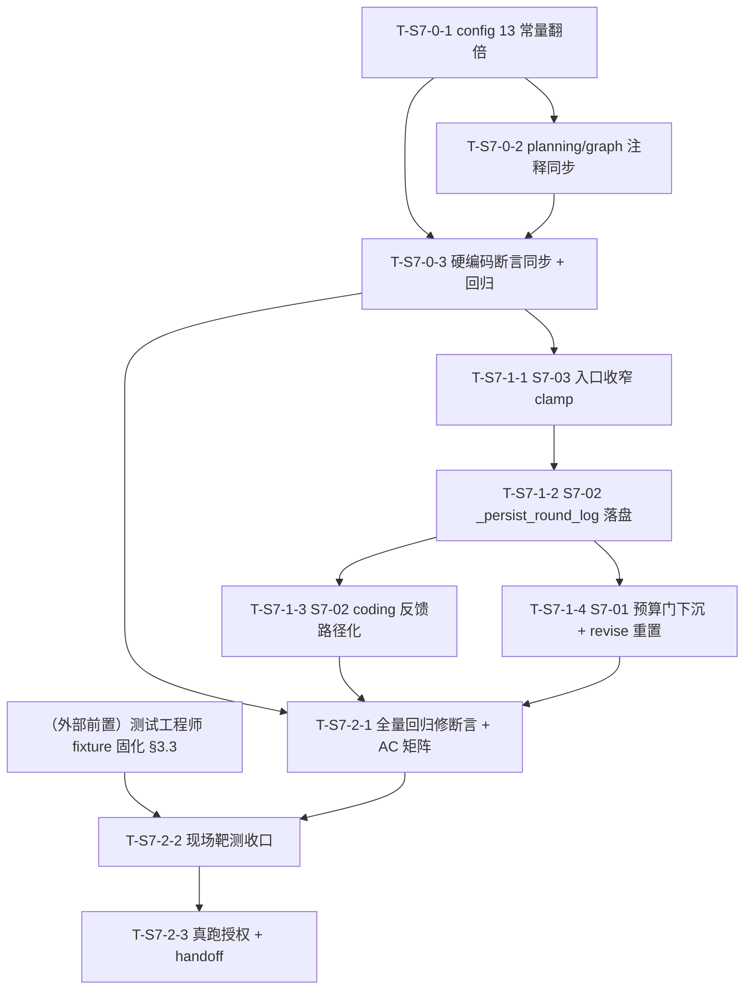

# Sprint 7 开发计划

**产品名称**：Auto-Reproduction —— 论文自动复现系统
**Sprint**：Sprint 7 —— 修复循环失控治理族：山穷水尽不问人（S7-01）、烧过头拦不住（S7-03）、coder 看不到真报错（S7-02）
**版本**：v1.0
**日期**：2026-07-19
**作者**：全栈开发工程师代理
**状态**：草案（待 Maria 审阅后逐批授权执行）
**对应 PRD**：`docs/sprint7/prd.md` v0.3（S7-01 P0 含 13 常量翻倍 / S7-02 P1 / S7-03 P1；AC-S7-01~08；A-S7-1~7；Q-S7-1~6）
**对应架构**：`docs/sprint7/architecture.md` v1.0（Q-S7-1~6 六项技术裁决 + 三需求文件级落点 + §7 变更总表 + §8 收口顺序 + §9 测试点 + §10 风险 R-S7-1~7 + §11 假设 AA-S7-1~7 + §12 AC 映射）
**体例参照**：`docs/sprint6/dev-plan.md` v1.0

> **本计划性质**：忠实落地 PRD v0.3 + 架构 v1.0，不重新决策、不改设计。所有取值/落点/顺序均取自架构定稿。批次划分严格按架构 §8 收口顺序。**批次边界逐批确认制**：每批收口门后停手，等 Maria 确认再开下一批。

---

## 0. 全局纪律（贯穿所有任务，不再逐项复述）

> 沿 sp5/sp6 教训与 PRD/架构红线，开工前逐条对照。

1. **回归现场样本只读勿动**：`checkpoints.db`（99MB，`task-99eef17bccf2` 现场所在真库——预算耗尽静默降级 + import 反复失败 + 烧 92 超 60 三缺陷同现场）**只读，任何任务不得写入 / 清理 / 重命名**。一切测试消费走 `tests/fixtures/checkpoints_s7_99eef17bccf2.db` 字节副本（**复制不移动**，源库 md5 前后逐一 MATCH，架构 §9.1 / sp6 §3.4 范式）。该 fixture **当前尚不存在**，须测试工程师在批次 2 靶测前固化（批次 2 前置门，见 §3.3）。
2. **测试命令口径**：`.venv/bin/pytest`（裸 `pytest` 不在 PATH；全量非 e2e 回归 = `.venv/bin/pytest -q -m "not e2e"`）。零退化基线以 **sp6 收官 1951 绿**（+1 预存在浏览器 flaky `test_e2e_code_only`）为准，批次 0 开工前主控实测一次落档，后续各批次收口对照。
3. **真跑授权红线**：一切耗 deepxiv 配额 / 真实 LLM 的动作（现场同构真实 e2e 抽验）**须 Maria 明确授权具体动作**，统一归集到批次 2 任务 T-S7-2-3，**合并为一次授权动作省配额**；mock 优先守门、smoke fail-fast、`task-99eef17bccf2` 为天然 fixture 勿清理。
4. **架构贯穿硬约束（红线，dev-plan 显式列为约束，任一任务不得破）**：
   - **零 GlobalState 字段新增/变更**；
   - **零 ExecutionResult 字段新增/变更**；
   - **零 interrupt#2 payload 键新增/变更**（面板键集合逐字冻结）；
   - **不新增 interrupt 种类**（三类封口：planning#1 / dev_loop#2 / user_input#3）；
   - **不加"追加预算"第四态**（interrupt#2 恰三态：terminate / revise_plan / export_code）；
   - **保 S-1 重跑幂等契约**（`_has_committed_result_for_round` guard，sandbox 不重跑）；
   - **成本硬上限对齐翻倍新值 240 / 120 绝不突破**；
   - **`execution_monitor.py` 本 Sprint 零改**（面板文案走 `replace(feedback, ...)` 数据通道，渲染逻辑不动）；
   - **不改 `core/react_base.py`**（S7-03 走入口收窄，不侵入通用子图）；
   - **不改 `_dev_loop_llm_calls` 计量口径**（S7-03 只收窄 max_rounds，累加埋点一字不动）；
   - **断言只换不弱化**（翻倍改被断言的常量值/等式两边数字，不弱化断言强度）；
   - **最小单一抽象**（不新造观测管道 / 不新增工具 / 不新增模块）。
5. **本 Sprint 架构级红利**：**GlobalState / ExecutionResult / interrupt#2 payload 键结构零新增字段**——`task-99eef17bccf2` 旧 checkpoint 与全部新代码天然相容，可用真库副本直接驱动 S7-01/02/03 全部回归靶。
6. **execution.py 单收口窗口令（架构 §8 批次 1）**：`core/nodes/execution.py` 被 S7-01/S7-02/S7-03 共同触碰（预算门判定 / 落盘反馈 / 子上限收窄），**收敛批次 1 一次改写，主控收口令**。窗口内子任务顺序严格 **S7-03 → S7-02 → S7-01**（架构 §8：一处 clamp 最小先落 → 落盘 helper 跨两文件 → 收尾判定重构改动最深最后落，避免与 S7-02 主流程接线互扰）。**函数级不重叠已坐实**（S7-03 在子图装配层 `_run_execution_agent`、S7-02 在落盘 helper + 主流程步骤 5-6 间、S7-01 在收尾判定 `_maybe_interrupt_or_return`），并行子代理不得直接改此文件，主控按序串行合入。
7. **Prompt Cache 纪律（R-PC4 无扰，写进注意事项）**：
   - **S7-03 收窄不进 HumanMessage**：`_build_execution_agent_context` 里的 `max_rounds` 数字保持联动值 `_effective_max_rounds(plan)`（plan 确定性产出，不随 `dev_calls` 抖动），收窄只作用于子图 `max_rounds` 护栏，agent 无需感知（架构 §6.2 / AA-S7-6）。
   - **日志文件名用确定性 `fix_loop_count` 不用时间戳/uuid**（架构 §5.3）：`round_{fix_loop_count}.log`，Prompt Cache 无扰、可复现、coder 可从 `fix_round` 反推文件名。
   - 本 Sprint **不触碰任何稳定前缀 / 工具 docstring**（S7-02 复用现有 `read_code_file` docstring 零改动；S7-01 面板文案走数据通道非 prompt）。
8. **批次边界逐批确认制**：每批收口门后停手，等 Maria 确认再开下一批；对某批的授权 ≠ 对后续批次的授权；耗配额 / 不可逆动作仍需单独授权。

---

## 1. 概述

### 1.1 Sprint 目标

Sprint 7 针对 `task-99eef17bccf2` 现场坐实的"修复循环反复失败时三个失控点"，作为一个治理族一次性收敛：

- **不失控之一 · 山穷水尽要问人（S7-01，P0）**：入口预算门（`execution.py:2029-2030`）在 `budget < DEV_LOOP_MIN_CALLS_PER_ROUND` 时反向绕过 interrupt#2、直接静默降级出报告（实测 `user_fix_decision=None` 用户从不被问）。修法=**预算门下沉为修复分支准入否决条件**（删降级 return + and 子句 + reason 分支），预算耗尽自动落既有两段式 interrupt#2 通道问用户；配套 **13 个预算常量全翻倍**（给余量、不替代升级）；revise_plan 分支补预算全额重置（补语义缝隙）。
- **不失控之二 · 想拦要拦得住（S7-03，P1）**：`MAX_DEV_LOOP_LLM_CALLS` 子上限只在轮边界检查，单轮 ReAct 子图一口气烧（实测 92 超 60 达 32）。修法=**`_run_execution_agent` 入口收窄本轮 `max_rounds = min(联动值, 剩余子预算)` 保底 1**，复用现成 `budget_check_node` 刹车，越界上界确定性 ≤ force_finish 1 轮 + metrics 抽取额度。
- **不失控之三 · 给 agent 看真相（S7-02，P1）**：coder 修复反馈全程看不到真报错（`stderr_tail` 取到后续成功步 stdout、`representative_stderr` 恒空，`No module named 'src'` 出现 831 次）——信息链路 bug。修法=**execution 每轮完整日志落盘 `<code_output_dir>/exec_logs/round_{n}.log`（错误优先编排）+ coding 反馈 `stderr_tail` 换成日志文件路径指引 + coder 用现有 `read_code_file` 自读**。

### 1.2 范围对齐

- **PRD 权威**：3 项需求 S7-01~03 + AC-S7-01~08 + 非目标（不做差异化降级标注体系 / 不改预算计量口径 / 不做撤销通道 / 不加第四态 / 不改 coder 修复策略 prompt / 不新造观测管道 / 不改 REACT_MAX_ROUNDS_* 轮次语义 / 不追求零越界 / 附B 验证门升级已砍不做）。
- **架构权威**：Q-S7-1~6 六项裁决全部落地为可执行设计（复用三态不加第四态 / 预算门下沉复用两段式 / 13 常量翻倍派生依赖已核 / 面板文案 replace 范式 / 日志落盘 + read_code_file 自读 + 错误优先编排应对 8000 截断 / 入口收窄 max_rounds），**本计划不重新决策**。
- **新增模块**：**0 个新 .py 模块**（S7-02 新增运行期目录 `<code_output_dir>/exec_logs/`，进 .gitignore；`_persist_round_log` 为 execution.py 内新纯函数）。
- **零 breaking**：无 state / ExecutionResult / interrupt payload 契约变更；旧 checkpoint 直接可被新代码消费。

### 1.3 关键风险一句话

**批次 1 `execution.py` 单收口窗口是 sp7 回归风险全 Sprint 最高点**（架构 R-S7-7 + R-S7-1）：S7-01 预算门下沉（实现 1）直接改写 `_maybe_interrupt_or_return` 的修复分支准入与 reason 链，误伤既有"预算充足失败"路由或破坏 self-loop 两段式即引入死锁 / 幂等退化。缓解=**收敛一批一次改写 + 主控收口令 + 子任务顺序 S7-03→S7-02→S7-01 + 现场靶 + 对照用例（预算充足/耗尽两分支各验路由）**。其次 AC-S7-05/07/08 三项**须验红**（沿 sp6 AC-S6-10 假绿转正教训：文件路径写了但反馈没真指过去 / 收窄没生效但常规 mock 假绿），注掉对应改动断言必须变红。

### 1.4 容量裁剪线（超限时依序执行）

若进度吃紧，按以下顺序顺延（**P0 载体不可裁**：批次 0 翻倍 + 批次 1 的 S7-01 是治理族主线，缺一环用户仍不被问）：

1. **先降 S7-02 规模**：保"完整日志落盘 + 反馈传路径 + coder 自读"（AC-S7-05/07），"错误优先编排应对 8000 截断"（R-S7-3 缓解）可降级为"单轮日志通常 < 8000 整读即可"先交、编排 helper 顺延；
2. **再降 S7-03 规模**：保入口收窄 clamp（AC-S7-08），越界上界精确度量（§6.3 metrics 额度）顺延为粗断言；
3. **S7-01 与翻倍不可降**（P0 主线）。

---

## 2. 任务清单总表

| 任务编号 | 承载需求 | 任务名 | 产出文件 | 依赖前置 | 估时 | 风险 |
|---|---|---|---|---|---|---|
| **T-S7-0-1** | S7-01 翻倍 | 13 常量翻倍 + 4 处注释同步 | `config.py` | 无 | 2h | 中（联动等式命门） |
| **T-S7-0-2** | S7-01 翻倍 | 3 处外部注释同步（planning.py / graph.py） | `core/nodes/planning.py` + `core/graph.py` | 无 | 0.5h | 低 |
| **T-S7-0-3** | S7-01 翻倍 | 十几处硬编码断言同步（只换不弱化）+ 全量回归 | `tests/`（§3.4 清单） | T-S7-0-1/0-2 | 4h | 中（回归面广 R-S7-6） |
| **T-S7-1-1** | S7-03 | `_run_execution_agent` 入口收窄 max_rounds clamp | `core/nodes/execution.py` | 批次 0 | 2h | 中（越界上界 + R-PC4） |
| **T-S7-1-2** | S7-02 | `_persist_round_log` 落盘 + 错误优先编排 + 主流程接线 | `core/nodes/execution.py` | T-S7-1-1（同文件串行） | 4h | 高（8000 截断 R-S7-3 + 落盘兜底 R-S7-4） |
| **T-S7-1-3** | S7-02 | coding 反馈 `log_file_path` 子键 + `stderr_tail` 指引化 | `core/nodes/coding.py` | T-S7-1-2 | 2.5h | 中（路径确定性推导 + AC-S7-07 验红） |
| **T-S7-1-4** | S7-01 | 预算门下沉 + reason 链 + `_BUDGET_EXHAUSTED_SUMMARY` + revise 预算重置 | `core/nodes/execution.py` | T-S7-1-2（同文件串行，改动最深最后落） | 5h | 高（死锁命门 R-S7-1 + 两段式幂等 R-S7-7） |
| **T-S7-2-1** | 回归 | 全量回归修断言收口 + AC-S7-01~08 覆盖矩阵审计 | `tests/`（§9.2 逐 AC） | 批次 0~1 | 5h | 中 |
| **T-S7-2-2** | 验收 | 现场靶测收口（`checkpoints_s7_99eef17bccf2.db` 三缺陷驱动） | `tests/test_sprint7_*` | T-S7-2-1 + 前置门 fixture 固化 | 4h | 中 |
| **T-S7-2-3** | 验收 | **真跑项（Maria 授权点）**：现场同构真实 e2e 抽验 + handoff | `docs/sprint7/test-reports/` + handoff | T-S7-2-2 | 4h | 中 |

**任务总数**：9 个（批次 0×3 + 批次 1×4 + 批次 2×3）。
**批次数**：3（批次 0 翻倍 / 批次 1 execution.py 单收口窗口 / 批次 2 收口）。
**检查点总数**：CP 约 32 个（分布见各批次任务，收口批次 2 三 CP 为总闸门）。
**总估时**：**~33h**（批次 0：6.5h / 批次 1：13.5h / 批次 2：13h）。若容量吃紧按 §1.4 裁剪线执行。

---

## 3. 批次划分与依赖图

### 3.1 批次总览（= 架构 §8 权威收口顺序）

| 批次 | 名称 | 任务 | 前置条件 | AC 映射 | 特殊标注 |
|---|---|---|---|---|---|
| **0** | 翻倍批（独立先行） | T-S7-0-1 → 0-2 → 0-3 | 无（config.py 独占，不碰 execution.py） | AC-S7-06 | **为后续所有批提供正确常量基线**（S7-03 收窄读 `MAX_DEV_LOOP_LLM_CALLS`、S7-01 revise 重置读 `MAX_TOTAL_LLM_CALLS`）；断言只换不弱化 |
| **1** | execution.py 单收口窗口 | T-S7-1-1 → 1-2 → 1-3 → 1-4 | 批次 0（正确常量基线） | AC-S7-01/02/03/04/05/07/08 | **execution.py 被三需求共触碰，收敛一批一次改写，主控收口令；子任务顺序 S7-03→S7-02→S7-01**（架构 §8）；AC-S7-05/07/08 须验红 |
| **2** | 收口 | T-S7-2-1 → 2-2 → 2-3 | 批次 0~1 全部 | AC-S7-01~08 全覆盖 + sp6 基线 1951 回归全绿 | **现场靶测（`checkpoints_s7_99eef17bccf2.db`）+ 真跑项合并一次 Maria 授权窗口省配额**；批次 2 前置门 = fixture 固化（§3.3） |

### 3.2 依赖关系图（Mermaid）



**关键路径**：翻倍批（config 常量基线）→ T-S7-1-1（S7-03 收窄）→ T-S7-1-2（S7-02 落盘，S7-03 之后先落）→ T-S7-1-4（S7-01 预算门下沉，改动最深最后落）→ T-S7-2-1 → 2-2 → 2-3。批次 0 三任务线性（注释同步依赖常量值定、断言同步依赖两者）；**批次 1 execution.py 四子任务全部串行（同文件单收口窗口，不并行）**，顺序 S7-03→S7-02→S7-01（其中 T-S7-1-3 coding.py 反馈随 S7-02 同改）。

### 3.3 批次 2 前置门（外部依赖，显式声明）

**测试工程师须在 T-S7-2-2 靶测验收前完成现场样本 fixture 固化**（架构 §9.1 / sp6 §3.4 复制不移动）：

- `tests/fixtures/checkpoints_s7_99eef17bccf2.db`：`task-99eef17bccf2` 真库字节副本——S7-01/02/03 天然 fixture：`retry_budget_remaining=0`（S7-01 预算耗尽靶）/ `execution_result.success=False` / `_dev_loop_llm_calls=92`（S7-03 冲过头靶）/ `fix_loop_history` 4 条全 `category=import` / `logs` 含 `No module named 'src'`（S7-02 真报错靶）/ `user_fix_decision=None`。

> **当前状态确认**：该 fixture **尚不存在**（`tests/fixtures/` 现只有 sp6 三 db）；源库 `checkpoints.db`（99MB）在仓库根、`task-99eef17bccf2` 现场在其中。固化须走 sp6 §3.4"复制不移动"范式：源库 md5 前后逐一 MATCH，原库零字节零元数据变动（只读连接会重建 -shm/-wal 属 WAL 正常行为，非损伤——用 `?mode=ro` URI 打开或先 `cp` 再验 md5）。fixture 未就绪时批次 1 开发可先行（临时以只读原库路径本地冒烟），但 **T-S7-2-2 靶测断言必须以固化 fixture 跑**（软前置门语义）。

### 3.4 翻倍批硬编码断言同步面（AC-S7-06，架构 §3.4 清单）

翻倍打破的硬编码断言分布（架构 Grep 坐实，重点文件）——纪律沿 sp5/sp6"断言只换不弱化"（改的是被断言的常量值 120→240 等与联动等式两边数字，**不弱化**等式/类型/强约束断言强度）：

- `tests/test_sprint3_a1.py`（35 处含 config 断言）
- `tests/test_sprint3_a_boundary.py`
- `tests/test_sprint5_t11_config.py`（18 处）
- `tests/test_sprint5_t25_budget_link.py`（联动公式断言：`CAP == DEV_LOOP/2`、`DEV_LOOP < TOTAL`）
- `tests/test_sprint4_e3.py`
- `tests/test_sprint3_e2*.py`（预算扣减断言）
- `tests/test_sprint2_a4.py`

> **实测同步面以 T-S7-0-3 开工时 `grep -rn` 精确清点为准**（架构清单为"重点文件"非穷举，全量回归零失败即闭合账目）。

---

## 4. 批次 0：翻倍批（独立先行，config.py 独占）

> **前置条件**：无（config.py 独占，不碰 execution.py，与批次 1 解耦）。
> **产出**：13 常量翻倍值 + 4 处 config 注释同步 + 3 处外部注释同步 + 十几处硬编码断言同步 + 全量回归零失败。为后续所有批提供正确常量基线。
> **文件边界**：`config.py` 独占（T-S7-0-1）；`planning.py`/`graph.py` 注释（T-S7-0-2）；`tests/`（T-S7-0-3）。**零逻辑改动**——翻倍是纯参数批。

### 任务 T-S7-0-1：config 13 常量翻倍 + config 内注释同步（S7-01 翻倍，架构 §3.1/§3.3）

- **产出文件**：`config.py`（13 常量值 + 4 处注释同步）
- **依赖项**：无
- **预计复杂度**：中（2h，联动等式命门）
- **架构参考**：architecture §3.1 逐常量表 + §3.2 联动验证 + §3.3 注释同步 + AC-S7-06

**需要实现的内容**（值取架构 §3.1 表，不自创）：

1. 13 常量翻倍（现值→新值，落点行号）：

| 常量 | config.py 落点 | 现→新 | 备注 |
|---|---|---|---|
| `MAX_TOTAL_LLM_CALLS` | :31 | 120→**240** | 全局硬上限 |
| `MAX_DEV_LOOP_LLM_CALLS` | :114 | 60→**120** | 修复循环子预算天花板（仍须 < TOTAL） |
| `MAX_NODE_LLM_CALLS` | :30 | 10→**20** | 单节点上限 |
| `MAX_FIX_LOOP_COUNT` | :32 | 10→**20** | 修复回合次数上限 |
| `DEV_LOOP_MIN_CALLS_PER_ROUND` | :115 | 2→**4** | 入口预算门阈值（S7-01 判定基准） |
| `REACT_MAX_ROUNDS_EXECUTION_CAP` | :143 | 30→**60** | 联动公式 = `MAX_DEV_LOOP_LLM_CALLS/2` = 120/2 |
| `REACT_MAX_ROUNDS_PAPER_INTAKE` | :58 | 5→**10** | |
| `REACT_MAX_ROUNDS_PAPER_ANALYSIS` | :59 | 12→**24** | |
| `REACT_MAX_ROUNDS_RESOURCE_SCOUT` | :66 | 10→**20** | |
| `REACT_MAX_ROUNDS_PLANNING` | :67 | 8→**16** | |
| `REACT_MAX_ROUNDS_CODING` | :116 | 12→**24** | |
| `REACT_MAX_ROUNDS_EXECUTION`（FLOOR） | :131 | 10→**20** | 预算联动公式下限 |
| `REACT_EXECUTION_ROUNDS_MARGIN`（K） | :142 | 5→**10** | 联动 K 裕量 |

2. **联动公式不变、翻倍后须成立**（架构 §3.2，AC-S7-06 守门）：`REACT_MAX_ROUNDS_EXECUTION_CAP == MAX_DEV_LOOP_LLM_CALLS / 2`（60 == 120/2）；`MAX_DEV_LOOP_LLM_CALLS < MAX_TOTAL_LLM_CALLS`（120 < 240）；`FLOOR <= CAP`（20 <= 60）——不得只翻一边破坏联动。
3. **4 处 config 内注释同步**（非逻辑，防误导后人，架构 §3.3）：`:112` 注释"60 < 120"→"120 < 240"；`:114` 注释"强约束 < MAX_TOTAL_LLM_CALLS=120"→"=240"；`:143` 注释"= MAX_DEV_LOOP_LLM_CALLS/2 = 60/2"→"= 120/2"；`:142` 注释若含旧值同步（K 裕量说明"prepare 1 + 收尾 1 + 兜底 3"随语义保持，量级说明可留）。
4. **零逻辑改动**——所有下游读常量自动传导（`state.py:340` `retry_budget_remaining=MAX_TOTAL_LLM_CALLS` 初值、planning payload 展示、面板分母、S7-01 revise 重置、S7-03 收窄公式均读常量，架构 §3.1 已逐条核派生依赖，无隐式比例依赖被打破）。

**自测检查点**：
- [ ] CP-0.1-1 13 常量值断言：逐个断言翻倍新值（`MAX_TOTAL_LLM_CALLS==240` / `MAX_DEV_LOOP_LLM_CALLS==120` / `MAX_NODE_LLM_CALLS==20` / `MAX_FIX_LOOP_COUNT==20` / `DEV_LOOP_MIN_CALLS_PER_ROUND==4` / `CAP==60` / 各节点轮次翻倍值），类型仍 int/Path（AC-S7-06 常量面）
- [ ] CP-0.1-2 **联动等式 + 强约束断言**：`REACT_MAX_ROUNDS_EXECUTION_CAP == MAX_DEV_LOOP_LLM_CALLS // 2`（60==60）；`MAX_DEV_LOOP_LLM_CALLS < MAX_TOTAL_LLM_CALLS`；`REACT_MAX_ROUNDS_EXECUTION <= REACT_MAX_ROUNDS_EXECUTION_CAP`（AC-S7-06 联动面）
- [ ] CP-0.1-3 config 内 4 处注释无旧值字面残留（`grep "60 < 120"` / `"=120"` / `"60/2"` 在 config.py 相关行零命中）

### 任务 T-S7-0-2：planning / graph 外部注释同步（S7-01 翻倍，架构 §3.3）

- **产出文件**：`core/nodes/planning.py`（:11 与 :881 注释）+ `core/graph.py`（:73 核对）
- **依赖项**：无
- **预计复杂度**：低（0.5h）
- **架构参考**：architecture §3.3 注释同步

**需要实现的内容**：

1. `planning.py:11` 注释"任务级兜底依赖 MAX_TOTAL_LLM_CALLS=120"→"=240"；
2. `planning.py:881` 注释"`# =120；总预算参考`"→"`# =240；总预算参考`"（该行逻辑读常量 `MAX_TOTAL_LLM_CALLS` 自动对齐，只改注释字面）；
3. `graph.py:73` **核对**：架构 §3.3 列此行为"MAX_TOTAL_LLM_CALLS=120"注释同步项，但**实测该行内容为 `MAX_TOTAL_LLM_CALLS 总预算 + cancel 主动出口三重自然兜底`，不含 "=120" 字面**（见 §14 落点勘误 P-1）——**无需改**，仅确认无旧值字面残留即可。

**自测检查点**：
- [ ] CP-0.2-1 `planning.py` 无 "=120" 旧值注释残留（`grep "=120" core/nodes/planning.py` 零命中）；`graph.py:73` 确认无旧值字面（勘误 P-1 已核）
- [ ] CP-0.2-2 planning payload `max_total_llm_calls` 值随常量翻倍为 240（读常量自动传导，非注释）

### 任务 T-S7-0-3：硬编码断言同步 + 全量回归（S7-01 翻倍，架构 §3.4）

- **产出文件**：`tests/`（§3.4 清单逐文件，只换不弱化）
- **依赖项**：T-S7-0-1 + T-S7-0-2
- **预计复杂度**：中（4h，回归面广 R-S7-6）
- **架构参考**：architecture §3.4 断言同步面 + §10/R-S7-6 + AC-S7-06

**需要实现的内容**：

1. 开工先 `grep -rn "== 120\|== 60\|== 30\|MAX_TOTAL_LLM_CALLS\|MAX_DEV_LOOP_LLM_CALLS\|REACT_MAX_ROUNDS_EXECUTION_CAP\|DEV_LOOP_MIN_CALLS_PER_ROUND\|MAX_FIX_LOOP_COUNT\|MAX_NODE_LLM_CALLS" tests/` 精确清点全部硬编码断言（架构 §3.4 为重点文件非穷举）；
2. 逐处将被断言的常量值/联动等式两边数字改为翻倍新值——**只换数字，不弱化断言强度**（等式断言仍是等式、强约束仍是不等式、类型断言保留）；重点文件：`test_sprint3_a1.py`（35 处）、`test_sprint3_a_boundary.py`、`test_sprint5_t11_config.py`（18 处）、`test_sprint5_t25_budget_link.py`（联动公式）、`test_sprint4_e3.py`、`test_sprint3_e2*.py`（预算扣减）、`test_sprint2_a4.py`；
3. 预算扣减类断言（如"扣减 N 次后余量 = TOTAL - N"）：常量翻倍后基数变化，同步基数不改扣减逻辑断言；
4. 全量非 e2e 回归零失败（账目精确闭合）。

**自测检查点**：
- [ ] CP-0.3-1 §3.4 清单逐文件断言同步完成（`grep -rn` 精确清点，无遗漏旧值断言）
- [ ] CP-0.3-2 联动公式断言用例（`test_sprint5_t25_budget_link.py`）翻倍后仍绿：`CAP == DEV_LOOP//2` / `DEV_LOOP < TOTAL` 等式两边数字同步为 60==120//2 / 120<240
- [ ] CP-0.3-3 **全量非 e2e 回归 `.venv/bin/pytest -q -m "not e2e"` 相对 sp6 基线 1951 零退化零失败**（翻倍断言同步毕，账目闭合，AC-S7-06 回归面）

> **批次 0 收口门**：CP-0.1~0.3 全绿 + 全量非 e2e 回归零失败（AC-S7-06 达标）。**停手等 Maria 确认再开批次 1。**

---

## 5. 批次 1：execution.py 单收口窗口（全 Sprint 最高回归风险）

> **前置条件**：批次 0（正确常量基线——S7-03 收窄读 `MAX_DEV_LOOP_LLM_CALLS=120`、S7-01 revise 重置读 `MAX_TOTAL_LLM_CALLS=240`）。
> **产出**：S7-03 入口收窄刹车 + S7-02 完整日志落盘 + 反馈路径化 + coder 自读 + S7-01 预算门下沉 interrupt#2 + revise 预算重置。
> **文件边界**：`core/nodes/execution.py`（**单收口窗口，四子任务一次串行改写，主控收口令**）+ `core/nodes/coding.py`（S7-02 反馈半边，随 T-S7-1-3）。**子任务顺序严格 S7-03→S7-02→S7-01**（架构 §8）。
> **红线**：零 state / 零 ExecutionResult / 零 interrupt payload 键 / 不改 react_base / 不改计量口径 / 不加第四态 / 不新增 interrupt 种类 / execution_monitor.py 零改 / 成本硬上限 240/120 不破 / 保 S-1 幂等 / R-PC4 无扰（架构 §8）。

### 任务 T-S7-1-1：S7-03 入口收窄 max_rounds clamp（S7-03，架构 §6.2）

- **产出文件**：`core/nodes/execution.py`（`_run_execution_agent` 的 `effective_max_rounds` 计算处，:1348）
- **依赖项**：批次 0
- **预计复杂度**：中（2h，越界上界 + R-PC4）
- **架构参考**：architecture §6.2 入口收窄 + §6.3 越界上界 + §6.4 三重护栏协同 + §10/R-S7-5 + AC-S7-08

**需要实现的内容**（架构 §6.2 给定，一处 clamp）：

1. `_run_execution_agent` 内 :1348 现 `effective_max_rounds = _effective_max_rounds(plan)` 改为：
   ```python
   base_rounds = _effective_max_rounds(plan)                          # 联动公式，不变
   dev_calls_so_far = state.get("_dev_loop_llm_calls", 0) or 0
   remaining_sub_budget = max(0, MAX_DEV_LOOP_LLM_CALLS - dev_calls_so_far)
   # 本轮子图轮次上限 = min(联动值, 剩余子预算)，保底 1 轮（防 0 轮死锁/退化，R-S7-5）
   effective_max_rounds = max(1, min(base_rounds, remaining_sub_budget))
   ```
2. **收窄值只喂子图护栏**（:1353 `create_react_subgraph(max_rounds=effective_max_rounds)` + :1359 ReActState `max_rounds`）；
3. **R-PC4 无扰红线**：`_build_execution_agent_context`（:1341 已构造、内部经 `_effective_max_rounds(plan)`）里 HumanMessage 的 `max_rounds` 数字**保持联动值不收窄**——它是给 agent 的"计划轮次预期"，收窄是 agent 无需感知的系统级护栏；两者语义不同不强制一致（架构 §6.2 / AA-S7-6）。**注意**：context 在 :1341 构造（早于 :1348 收窄），本身就不受收窄影响，务必保持此隔离，不得把收窄值回灌 context；
4. **零改计量口径**（`_dev_loop_llm_calls` 累加 :1828 `_map_execution_result` 一字不动）、**零 react_base 改动**（复用现成 `budget_check_node` :621-629 刹车）、**零 config 常量新增**、**零 state 字段**。

**自测检查点**：
- [ ] CP-1.1-1 **收窄逻辑单测**（AC-S7-08）：构造 `_dev_loop_llm_calls=118`（逼近 120）+ 联动值 60 的 state → 断言 `_run_execution_agent` 收窄后 `effective_max_rounds == max(1, min(60, 120-118)) == 2`；`dev_calls_so_far=0` → `min(60, 120) == 60`（不逼近时无收窄，退回联动值）
- [ ] CP-1.1-2 **保底 1 轮**（R-S7-5）：`_dev_loop_llm_calls=120`（已触顶）→ `remaining_sub_budget=0` → `max(1, min(60,0)) == 1`（不退化为 0 轮死锁）
- [ ] CP-1.1-3 **越界上界断言**（AC-S7-08）：构造"单轮内高频调用"场景，断言总冲过头幅度 ≤ force_finish 1 轮 + metrics 抽取额度（确定性小值，远小于实测 32）
- [ ] CP-1.1-4 **R-PC4 无扰**：截取两个不同 `_dev_loop_llm_calls` 值下的 execution HumanMessage，`max_rounds` 数字保持联动值恒定（不随 dev_calls 抖动）——收窄未污染 context 通道
- [ ] CP-1.1-5 **须验红**（沿 sp6 教训）：注掉收窄 clamp 后，CP-1.1-1 断言 `effective_max_rounds` 回到 60、CP-1.1-3 越界回到数十级 → 断言必须变红

### 任务 T-S7-1-2：S7-02 `_persist_round_log` 落盘 + 主流程接线（S7-02，架构 §5.3）

- **产出文件**：`core/nodes/execution.py`（新纯函数 `_persist_round_log` + 错误优先编排 helper + 主流程 2210-2214 区间接线）
- **依赖项**：T-S7-1-1（同文件串行）
- **预计复杂度**：高（4h，8000 截断 R-S7-3 + 落盘兜底 R-S7-4）
- **架构参考**：architecture §5.1/§5.2/§5.3 + §10/R-S7-3/R-S7-4 + AC-S7-05

**需要实现的内容**（架构 §5.3 给定）：

1. **新纯函数 `_persist_round_log(work_dir, fix_count, prep, run_results)`**（落盘，非污染 state）：
   - **位置**：`<code_output_dir>/exec_logs/`（code_output_dir 在 WORKSPACE_DIR 之下，`read_code_file` 天然可读，架构 §5.1 已坐实无需工具微调）；
   - **命名**：`round_{fix_loop_count}.log`（`fix_loop_count` 确定性编号，首跑=0，第 N 次修复回合=N；**不用时间戳/uuid**，Prompt Cache 无扰、coder 可从 `fix_round` 反推，架构 §5.3）；
   - **内容 = 完整日志**：`_aggregate_logs(prep, run_results)`（:1669-1691）的**未截断原文**（install_log + 各步 stdout/stderr），用 **mask 后**口径（与 `execution_result.logs` 同脱敏级别 :1744，coder 读到的日志不泄凭证）；
2. **错误优先编排 helper**（应对 `read_code_file` 8000 截断，R-S7-3）：文件头部先写"错误摘要区"——非零 exit 步骤的 `[step#i exit=N cmd=...]` + 其 stderr 段前置到文件头；随后完整时序日志。**保证真报错行（stderr / `No module named` 类）落在文件头 8000 字符内**，coder 整读一次即命中；
3. **主流程接线**：在 `_build_execution_result`（:2204-2210）之后、`_map_execution_result`（:2214）之前的 2210-2214 区间调 `_persist_round_log`（架构 §5.3）——确保只在真跑回合落盘（guard 命中路径本就不重跑 sandbox、不重落，日志已在上一次真跑回合落盘）；
4. **落盘异常兜底（R-S7-4）**：写文件失败（IO/越界）**不阻断节点**——try/except 兜底，失败时不炸（沿 coding gate 工具兜底范式）；日志路径由 §5.4 确定性推导（不存 state），落盘失败时确定性路径指向不存在文件，coder read 到"文件不存在"退回 `errors` 摘要（降级到 sp6 现状，可接受）；
5. **不改 `TOOL_RESULT_MAX_LENGTH=8000`**（全局 ReAct 工具结果护栏，改它影响面过大违反最小设计，架构 §5.2）。
6. **红线**：零 state 字段、零 ExecutionResult 字段（路径确定性推导不存）、零工具改动、零新增工具。

**自测检查点**：
- [ ] CP-1.2-1 `_persist_round_log` 落盘：构造 import 失败现场（含 `No module named 'src'` 的 run_results）→ 断言 `<code_output_dir>/exec_logs/round_{n}.log` 存在且内容含真报错行（AC-S7-05 落盘面）
- [ ] CP-1.2-2 **错误优先编排**（R-S7-3）：断言真报错行落在文件头 **8000 字符内**（模拟尾部为成功步 stdout 的现场，验前置有效）
- [ ] CP-1.2-3 命名确定性：`fix_loop_count=0` → `round_0.log`；`=2` → `round_2.log`（无时间戳/uuid，R-PC4 无扰）
- [ ] CP-1.2-4 mask 口径一致：落盘内容与 `execution_result.logs` 同脱敏级别（凭证不泄）
- [ ] CP-1.2-5 **落盘兜底不炸**（R-S7-4）：模拟写文件 IO 失败（如目录不可写）→ `_persist_round_log` try/except 兜底，节点不阻断（execution 主流程继续）
- [ ] CP-1.2-6 guard 命中路径不重落：self-loop 重入（`already_committed=True`）路径不触发 `_persist_round_log`（sandbox 不重跑、日志上轮已落）

### 任务 T-S7-1-3：S7-02 coding 反馈路径化（S7-02，架构 §5.4）

- **产出文件**：`core/nodes/coding.py`（`_digest_execution_feedback` 返回增 `log_file_path` 子键 + `stderr_tail` 改指引串，:233-265；由 `_resolve_code_output_dir`+`fix_round` 拼路径）
- **依赖项**：T-S7-1-2
- **预计复杂度**：中（2.5h，路径确定性推导 + AC-S7-07 验红）
- **架构参考**：architecture §5.4 反馈落点 + §5.5 representative_stderr 处置 + AC-S7-05/07

**需要实现的内容**（架构 §5.4 给定）：

1. `_digest_execution_feedback` 返回 dict **新增 `log_file_path` 子键**（完整日志入口，绝对路径 or None），**保留 `error_category`**（快速提示，PRD §2.3.2 要求），**`stderr_tail` 语义改为退化指引串**（非删键——删键会打破既有 coding prompt/context 对该键引用与测试面）：
   ```python
   return {
       "errors": [...],                    # 保留（摘要级）
       "error_category": error_category,   # 保留（快速提示）
       "log_file_path": <round_{n}.log 绝对路径 or None>,   # 新增：完整日志入口
       "stderr_tail": "完整日志见 log_file_path，请用 read_code_file 自读",  # 语义改为指引，不含 logs 内容
   }
   ```
2. **路径确定性推导（零 state 字段，架构 §5.4 / AA-S7-4）**：`log_file_path` 由 coding.py 侧已有的 `_resolve_code_output_dir(state)`（:305/:351）+ `fix_round`（:327 `fix_count`）拼出 `<code_output_dir>/exec_logs/round_{fix_round}.log`——**不从 exec_result 读路径字段、不存 state/ExecutionResult**；
3. `_digest_execution_feedback` 当前签名为 `(exec_result)`——路径推导需 code_output_dir + fix_round（来自 state / 调用点 :328 已有 `fix_count`）：最小改法是在调用点 :328 传入已解析的 code_output_dir + fix_round，或函数内接受额外参；**保持 `last_error_summary` 键结构稳定**（Prompt Cache 无扰）；
4. **不填充/不删 `representative_stderr`**（架构 §5.5：sp4 遗留字段、恒空、人向面板读它，S7-02 不触碰——它与 coder agent 向链路正交，保 payload 键结构冻结）；
5. **execution 侧修复反馈维持 stderr_tail 尾部不改路径**（架构 §5.4 末 / AA-S7-3：execution agent 工具无 `read_code_file`，改路径反使其更瞎；S7-02 只作用于 coding 反馈链路——PRD §0.7 坐实的信息链路 bug 现场正是 coder 侧）。

**自测检查点**：
- [ ] CP-1.3-1 `_digest_execution_feedback` 返回含 `log_file_path` 子键，指向 `<code_output_dir>/exec_logs/round_{fix_round}.log`（AC-S7-05 反馈面）；`error_category` 快速提示保留
- [ ] CP-1.3-2 **端到端可读**（AC-S7-05）：落盘 + 路径推导联跑——断言 `read_code_file(log_file_path)` 能读到含 `No module named 'src'` 的日志内容
- [ ] CP-1.3-3 **AC-S7-07 设计取舍守门（须验红）**：断言 `stderr_tail` **不再是** `logs[-2000:]` 截断产物（现 :247），而是固定指引串（不含日志内容）；断言反馈以 `log_file_path` 为准。**验红**：注掉落盘 + 路径注入后断言必须变红（防"路径写了但反馈没真指过去"假绿，沿 sp6 AC-S6-10 教训）
- [ ] CP-1.3-4 路径确定性推导：落盘失败/文件不存在时 `read_code_file` 读到"文件不存在"串，反馈退回 `errors` 摘要不炸（R-S7-4 降级面）
- [ ] CP-1.3-5 `representative_stderr` 未被 S7-02 触碰（保恒空 + payload 键结构冻结）；execution 侧 `_build_execution_agent_context` 的 stderr_tail 维持尾部（AA-S7-3 正交）

### 任务 T-S7-1-4：S7-01 预算门下沉 + reason 链 + revise 预算重置（S7-01，架构 §2.3/§2.4/§1.2）

- **产出文件**：`core/nodes/execution.py`（`_maybe_interrupt_or_return` :2029/:2033/:2069 + `_route_user_fix_decision` :1952 + `_BUDGET_EXHAUSTED_SUMMARY` 常量）
- **依赖项**：T-S7-1-2（同文件串行，**改动最深最后落**，避免与 S7-02 主流程接线互扰）
- **预计复杂度**：高（5h，死锁命门 R-S7-1 + 两段式幂等 R-S7-7）
- **架构参考**：architecture §2.2 时序 + §2.3 预算门下沉（实现 1）+ §2.4 reason 接线 + §1.2 revise 重置 + §4 面板文案 + §10/R-S7-1/R-S7-2/R-S7-7 + AC-S7-01/02/03/04

**需要实现的内容**（架构 §2.3 实现 1，最小 diff）：

1. **删预算门降级 return**（:2029-2030）：现 `if budget < DEV_LOOP_MIN_CALLS_PER_ROUND: return _mark_degraded_for_report(...)` 整段**删除**——预算门不再是"提前降级的旁路"；
2. **预算门下沉为修复分支准入否决条件**（:2033-2038）：修复分支准入增一项 `and budget >= DEV_LOOP_MIN_CALLS_PER_ROUND`：
   ```python
   if (
       feedback.auto_fixable
       and fix_count < MAX_FIX_LOOP_COUNT
       and dev_calls < MAX_DEV_LOOP_LLM_CALLS
       and budget >= DEV_LOOP_MIN_CALLS_PER_ROUND      # ← 预算门下沉为修复准入条件
       and not _no_metrics_stalled(state, feedback)
   ):
       ... 回 coding 修复
   ```
   预算耗尽（含其它准入不满足）→ **自动落既有两段式**（:2055 await / :2091 interrupt），复用 commit-边界-return + self-loop-重入，**`already_committed` guard 逻辑（:2055/:2126）一字不改，零新路径、零新 guard**（架构 §2.2 已坐实：预算门命中时 exec_result 已在 updates、sandbox 不重跑，两段式天然复用）；
3. **reason 链增预算耗尽分支**（:2069-2082），优先级：早停 > **预算耗尽** > 子上限 > 不可修复 > 修复耗尽（预算耗尽是更强的资源终态）：
   ```python
   panel_feedback = feedback
   if _no_metrics_stalled(state, feedback):          # 既有
       reason = _NO_METRICS_EARLY_STOP_SUMMARY
       panel_feedback = replace(feedback, summary=..., fix_hint=...)
   elif budget < DEV_LOOP_MIN_CALLS_PER_ROUND:       # ← 新增：预算耗尽终态
       reason = _BUDGET_EXHAUSTED_SUMMARY
       panel_feedback = replace(feedback, summary=_BUDGET_EXHAUSTED_SUMMARY,
                                fix_hint=_BUDGET_EXHAUSTED_SUMMARY)
   elif dev_calls >= MAX_DEV_LOOP_LLM_CALLS:         # 既有
       reason = "子预算触顶"
   elif not feedback.auto_fixable:                   # 既有
       reason = "不可修复"
   else:                                             # 既有
       reason = "修复耗尽"
   ```
4. **新增模块级文案常量 `_BUDGET_EXHAUSTED_SUMMARY`**（execution.py，与 `_NO_METRICS_EARLY_STOP_SUMMARY:1981` 同款，架构 §4.3 给定文案）：
   ```python
   _BUDGET_EXHAUSTED_SUMMARY = (
       "修复循环已反复失败，重试预算已耗尽（LLM 调用额度用尽）。"
       "系统不再自动继续，请在下方三种处置中选择：接受当前结果导出报告 / "
       "重订计划再试 / 终止任务。"
   )
   ```
   面板文案走既有 `summary`/`fix_hint` 通道经 `replace` 注入（复用 sp6 AC-S6-10 范式，**零新 payload 键**，`_build_dev_loop_interrupt_payload` 从 `feedback.summary`/`feedback.fix_hint` 取，:1906-1907）；
5. **`_route_user_fix_decision` revise_plan 分支增预算重置**（:1952-1965，Q-S7-1 方案 A）：在既有 `fix_loop_count=0`（:1963）后追加 `out["retry_budget_remaining"] = MAX_TOTAL_LLM_CALLS`（翻倍后 240，与 `state.py:340` 初始化同口径）——补齐 revise_plan"换计划=重新开始"的预算语义自洽，防预算耗尽下 revise_plan 空转（架构 §1.2）；**`_dev_loop_llm_calls` 累计不重置**（子上限硬顶继续生效于 :2036/:2077，叠加 S7-03 收窄，revise 后仍不破 240/120，R-S7-2）；
6. **红线**：零 state 字段、零 interrupt payload 键、零 graph 路由改动（`_route_after_execution` 完全不动，预算耗尽复用 `await_dev_loop_interrupt` 与 `user_fix_decision` 三态既有出边）、不加第四态、`execution_monitor.py` 零改（面板文案走数据通道，架构 §4.5）。

**自测检查点**：
- [ ] CP-1.4-1 **路由不再静默降级**（AC-S7-01）：mock state（`budget=0`/`success=False`）驱动 `_maybe_interrupt_or_return`——断言**不再**返回 `_mark_degraded_for_report`（degraded_nodes 不含 execution 的 budget_exhausted 降级）、而是置 `_dev_loop_route="await_dev_loop_interrupt"`（首次进入 `already_committed=False`）；以 `checkpoints_s7_99eef17bccf2.db` 同构 state 为回归靶
- [ ] CP-1.4-2 **两段式幂等**（AC-S7-02）：mock 时序断言两段式（首次 return await 标记、self-loop 重入后 `already_committed=True` 函数体 interrupt 恰一次）；既有 S-1 / interrupt#2 幂等套件零退化（guard 逻辑 :2110-2113 不动）
- [ ] CP-1.4-3 **面板文案 + 三态守门**（AC-S7-03）：预算耗尽 → 面板 `error_summary` 含"预算已耗尽"语义关键词；**对照用例**（非预算耗尽情形：预算充足 + 子上限触顶）不含该文案（防文案泛化）；payload 键集合与 sp6 逐字一致；`payload["options"] == ["terminate","revise_plan","export_code"]`（无第四态）
- [ ] CP-1.4-4 **硬上限守门**（AC-S7-04）：构造 `_dev_loop_llm_calls=120` / `retry_budget_remaining` 达顶 state，断言不突破 240/120；revise_plan 重置后再验子上限（:2036/:2077）仍拦（预算重置不越子上限硬顶，R-S7-2）
- [ ] CP-1.4-5 **revise 预算重置**（AC-S7-04）：`_route_user_fix_decision({"decision":"revise_plan"})` → `retry_budget_remaining == MAX_TOTAL_LLM_CALLS`（240）+ `fix_loop_count==0`；`_dev_loop_llm_calls` 累计未被重置
- [ ] CP-1.4-6 **R-S7-1 对照防误伤**：预算充足失败路径（`budget >= DEV_LOOP_MIN_CALLS_PER_ROUND` + auto_fixable）→ 仍正常回 coding 修复（路由未被预算门下沉误伤）；`_route_after_execution` 零改动（复用既有出边）

> **批次 1 收口门**：CP-1.1~1.4 全绿 + **AC-S7-05/07/08 验红通过**（注掉对应改动断言变红）+ execution.py + coding.py 触碰区回归零退化 + `execution_monitor.py` 零改（面板文案走数据通道守门）+ S-1 / interrupt#2 幂等套件零退化。**主控单收口令：四子任务一次串行改写，函数级不重叠已坐实。停手等 Maria 确认再开批次 2。**

---

## 6. 批次 2：收口——全量回归 + 现场靶测 + 真跑收口（真跑项合并一次 Maria 授权窗口）

> **前置条件**：批次 0~1 全部完成。
> **产出**：全量回归零退化（sp6 基线 1951+）+ AC-S7-01~08 覆盖矩阵审计 + 现场靶测（`checkpoints_s7_99eef17bccf2.db` 三缺陷驱动）+ 现场同构真实 e2e 抽验。
> **真跑纪律（全局纪律 3 / 架构 §9.4）**：一切耗配额 / 真实 LLM 动作**合并 T-S7-2-3 一次 Maria 授权窗口**（mock 守门先行、smoke fail-fast、`task-99eef17bccf2` 天然 fixture 勿清理）。

### 任务 T-S7-2-1：全量回归修断言 + AC 覆盖矩阵审计（架构 §9.2）

- **产出文件**：`tests/` 既有用例（翻倍 + 收窄 + 落盘 + 预算门下沉牵动的断言，只换不弱化）
- **依赖项**：批次 0~1 全部
- **预计复杂度**：中（5h）
- **架构参考**：architecture §9.2 逐 AC 测试点 + §9.3 测试盲区

**需要实现的内容**（逐 AC，架构 §9.2）：

1. **AC-S7-01/02（S7-01 路由 + 两段式幂等）**：mock state（budget=0/success=False）驱动 `_maybe_interrupt_or_return` 不再降级、置 await；mock 时序两段式（首次 return await、重入 interrupt 恰一次）；既有 S-1 / interrupt#2 幂等套件零退化；
2. **AC-S7-03（面板文案 + 三态守门）**：预算耗尽面板含关键词；对照用例（子上限触顶）不含；payload 键集合逐字一致；三态守门；
3. **AC-S7-04（硬上限守门）**：达顶 state 不突破 240/120；revise 重置后子上限仍拦；
4. **AC-S7-05（coder 见真错）**：`_persist_round_log` 落盘含真报错（头 8000 内）；`_digest_execution_feedback` 含 `log_file_path`；`read_code_file` 可读；
5. **AC-S7-06（翻倍 + 联动）**：13 常量值 + 联动等式 + 十几处旧断言同步（批次 0 已落，收口复核账目闭合）；
6. **AC-S7-07（设计取舍守门，须验红）**：`stderr_tail` 非截断产物、为指引串；注掉落盘 + 路径注入断言变红；
7. **AC-S7-08（刹车，须验红）**：收窄后 `effective_max_rounds == min(联动, 剩余子预算)`；越界上界 ≤ force_finish 1 轮 + metrics；注掉收窄 clamp 断言变红；
8. **测试盲区（架构 §9.3）**：预算耗尽 + import 反复失败是低频边界路径，常规 e2e 未必触达——必须专门构造 `retry_budget_remaining=0` / import 现场（沿 sp5 AC-S5-03 mock e2e 假绿教训）。

**自测检查点**：
- [ ] CP-2.1-1 逐 AC 测试点断言逐条适配完成（AC-S7-01~08，只换断言目标不弱化语义，清单记 TODO）
- [ ] CP-2.1-2 **AC-S7-05/07/08 三项验红**：注掉落盘/路径注入/收窄 clamp 后对应断言变红（防假绿，架构 §9.3）
- [ ] CP-2.1-3 **全量非 e2e 回归 `.venv/bin/pytest -q -m "not e2e"` 相对 sp6 基线 1951 零退化零失败**（翻倍断言 + sp7 新增用例账目精确闭合）
- [ ] CP-2.1-4 AC-S7-01~08 覆盖矩阵审计：每条 AC 至少一个可测断言映射（映射表落 handoff）

### 任务 T-S7-2-2：现场靶测收口（架构 §9.1）

- **产出文件**：`tests/test_sprint7_*`（`checkpoints_s7_99eef17bccf2.db` 三缺陷靶测收口）
- **依赖项**：T-S7-2-1 + 批次 2 前置门（fixture 固化 §3.3）
- **预计复杂度**：中（4h）
- **架构参考**：architecture §9.1 现场回归靶（强制）

**需要实现的内容**：

1. **`checkpoints_s7_99eef17bccf2.db` 三缺陷同现场靶测**（架构 §9.1，强制、非常规 mock 自证）：
   - **S7-01 靶**：`retry_budget_remaining=0` / `success=False` 驱动 → 路由不再直达 reporting 兜底、interrupt#2 被触发（`user_fix_decision` 应答前非已决态）；
   - **S7-02 靶**：现场 `logs` 含 `No module named 'src'` → 落盘 `round_{n}.log` 含真报错行、反馈 `log_file_path` 指向该文件、`read_code_file` 可读；
   - **S7-03 靶**：`_dev_loop_llm_calls=92`（现场已超 60）为回归锚——验收收窄公式在翻倍后（子上限 120）仍能约束单轮越界；
2. **低频边界路径专门构造**（架构 §9.3）：`retry_budget_remaining=0` + import 失败现场 mock（常规 e2e 未必触达）；
3. **LLM 服从度类回归纪律**：sp7 判定全为确定性代码（预算门/收窄/落盘均无 LLM），服从度敏感面低——现场靶测按确定性单测收口即可；涉幂等/两段式的时序敏感用例按项目纪律连跑（复现率高 ≥50% 连跑 3 次、低 10%~50% 连跑 5 次含全量回归）。

**自测检查点**：
- [ ] CP-2.2-1 `checkpoints_s7_99eef17bccf2.db` 三缺陷靶测全绿（S7-01 路由 / S7-02 落盘+反馈 / S7-03 越界约束）
- [ ] CP-2.2-2 低频边界构造（budget=0 + import 现场）确定性单测收口全绿
- [ ] CP-2.2-3 fixture 只读不写：靶测后 `checkpoints_s7_99eef17bccf2.db` md5 与固化时一致（源库 `checkpoints.db` 零变动）
- [ ] CP-2.2-4 AC-S7-01~08 逐条覆盖矩阵闭环（无 AC 缺测）

### 任务 T-S7-2-3：真跑项（Maria 授权点）+ handoff（架构 §9.4）

- **产出文件**：`docs/sprint7/test-reports/`（现场同构真实 e2e 报告）+ handoff
- **依赖项**：T-S7-2-2
- **预计复杂度**：中（4h，须 Maria 授权）
- **架构参考**：architecture §9.4 真跑项 + PRD §7 拆分建议 5

**需要实现的内容**（**全部合并一次 Maria 授权窗口**）：

1. **现场同构真实 e2e 抽验**（import 反复失败闭环，架构 §9.4）：预算耗尽→interrupt#2 问用户（S7-01）；coder 自读日志定位 import（S7-02）；子上限单轮刹车不冲过头（S7-03）——mock 守门先行、smoke fail-fast、`task-99eef17bccf2` 天然 fixture 靶省配额；
2. handoff：AC-S7-01~08 覆盖矩阵 + 已知限制（R-S7-4 落盘失败降级 sp6 现状 / R-S7-3 极端超长日志 list_dir 逐读兜底）+ 运行入口交测试工程师。

**自测检查点**：
- [ ] CP-2.3-1 **现场同构真实 e2e 闭环**（S7-01 问用户 / S7-02 coder 自读定位 / S7-03 单轮刹车）——须 Maria 授权
- [ ] CP-2.3-2 真跑证据齐（预算耗尽 interrupt#2 触发截图/日志 + 落盘 round_{n}.log 含真报错 + 单轮 dev_calls 不冲过头度量）+ handoff 归档

> **批次 2 收口门（= Sprint 7 总闸门）**：全量回归零退化（CP-2.1-3）+ 现场靶测全绿（CP-2.2-1）+ AC-S7-05/07/08 验红通过 + AC-S7-01~08 全覆盖 + 现场同构真实 e2e 闭环（CP-2.3-1）。真跑项须 Maria 明确授权具体动作。**Sprint 7 交付。**

---

## 7. 交付物清单

| 类别 | 文件 | 批次 | 说明 |
|---|---|---|---|
| config | `config.py`（13 常量翻倍 + 4 处注释同步） | 0 | 纯值改，联动等式/强约束保持；零逻辑改动 |
| 节点注释 | `core/nodes/planning.py`（:11/:881 注释）、`core/graph.py`（:73 核对无需改） | 0 | 注释同步，逻辑读常量自动传导 |
| 节点 · S7-03 | `core/nodes/execution.py`（`_run_execution_agent` :1348 入口收窄 clamp） | 1 | 一处 clamp，不改计量口径/react_base |
| 节点 · S7-02 | `core/nodes/execution.py`（`_persist_round_log` 新纯函数 + 错误优先编排 helper + 主流程 2210-2214 接线） | 1 | 落盘 `<code_output_dir>/exec_logs/round_{n}.log`，try/except 兜底 |
| 节点 · S7-02 | `core/nodes/coding.py`（`_digest_execution_feedback` 增 `log_file_path` + `stderr_tail` 指引化） | 1 | 路径确定性推导（code_output_dir+fix_round），零 state 字段 |
| 节点 · S7-01 | `core/nodes/execution.py`（`_maybe_interrupt_or_return` 预算门下沉 + reason 链 + `_BUDGET_EXHAUSTED_SUMMARY` + `_route_user_fix_decision` revise 重置） | 1 | 零 state / 零 payload 键 / 三态不加第四态 |
| 运行期目录 | `<code_output_dir>/exec_logs/`（新增，进 .gitignore） | 1 | 任务隔离、随 workspace 清理 |
| 测试 | `tests/`（翻倍断言同步 + sp7 新增 AC 用例 + 现场靶测 `test_sprint7_*`） | 0/2 | 只换不弱化；AC-S7-05/07/08 验红 |
| 测试 fixture（测试工程师） | `tests/fixtures/checkpoints_s7_99eef17bccf2.db` | 前置门 | 复制不移动，S7-01/02/03 天然 fixture |
| 报告/handoff | `docs/sprint7/test-reports/` + handoff | 2 | 真跑证据 + AC 覆盖矩阵 |

**新增模块/目录**：**0 个新 .py 模块**；新增运行期目录 `<code_output_dir>/exec_logs/`（进 .gitignore）。**旧 checkpoint 兼容**：零 state 变更 ⇒ `task-99eef17bccf2` 现场直接被新代码消费。

---

## 8. 风险登记与回归防线（引架构 §10 R-S7-1~7）

| 编号 | 风险 | 落点任务 | 缓解 | 回归面 |
|---|---|---|---|---|
| R-S7-1 | 预算门下沉（实现 1）误伤既有"预算充足失败"路由 | T-S7-1-4 | 现场靶 + 对照用例（预算充足/耗尽两分支各验路由，CP-1.4-6）；`_route_after_execution` 零改动 | 批次 1 execution 收尾判定层 |
| R-S7-2 | revise_plan 预算全额重置被误读为"绕过硬顶" | T-S7-1-4 | `_dev_loop_llm_calls` 不重置、子上限硬顶继续生效；AC-S7-04 守门（CP-1.4-4/1.4-5） | 批次 1 三态路由 |
| R-S7-3 | 日志落盘 8000 截断致真报错行不可达 | T-S7-1-2 | 错误优先编排（stderr/非零 exit 前置文件头，CP-1.2-2）；coder 有 list_dir 逐读兜底 | 批次 1 落盘 helper |
| R-S7-4 | 日志路径确定性推导与落盘失败不一致 | T-S7-1-2/1-3 | 落盘 try/except 兜底 + coder read 到"文件不存在"退回 errors 摘要（降级 sp6 现状，CP-1.2-5/1.3-4） | 批次 1 落盘 + 反馈 |
| R-S7-5 | max_rounds 收窄到极小值（剩余=1）致单轮几乎跑不动 | T-S7-1-1 | `max(1, ...)` 保底 1 轮（CP-1.1-2）；此时 dev_calls 已逼近上限本就该走 interrupt#2（收窄+轮边界双拦是预期行为） | 批次 1 子图装配 |
| R-S7-6 | 翻倍打破断言范围超预估（隐藏硬编码） | T-S7-0-3 | 全量回归 + §3.4 清单逐文件 `grep -rn` 精确清点；断言只换不弱化 | 批次 0 全量回归 |
| R-S7-7 | execution.py 单收口窗口内三子任务互扰 | 批次 1 全部 | §8 顺序（S7-03→S7-02→S7-01）+ 函数级不重叠已坐实 + 主控收口令一次改写 | 批次 1 单收口窗口 |

---

## 9. 关键纪律汇总（开工前逐条对照）

1. **批次边界逐批确认制**：每批收口门后停手等 Maria 确认（全局纪律 8）。
2. **execution.py 单收口窗口**：三需求共触碰收敛批次 1 一次改写，主控串行合入，子任务顺序 **S7-03→S7-02→S7-01**（全局纪律 6 / 架构 §8）。
3. **翻倍批独立先行**：config.py 独占、零逻辑改动、为后续批提供正确常量基线；断言只换不弱化（AC-S7-06）。
4. **R-PC4 无扰**：S7-03 收窄不进 HumanMessage（context max_rounds 保联动值不随 dev_calls 抖动）；日志文件名用确定性 `fix_loop_count` 不用时间戳/uuid（全局纪律 7）。
5. **AC-S7-05/07/08 须验红**：注掉落盘/路径注入/收窄 clamp 后断言必须变红（防假绿，沿 sp6 AC-S6-10 教训）。
6. **现场靶强制**：`checkpoints_s7_99eef17bccf2.db` 复制不移动，源库 `checkpoints.db` md5 前后 MATCH、零变动（§3.3 批次 2 前置门）。
7. **红线不破**：零 state / 零 ExecutionResult / 零 interrupt payload 键 / 不改 react_base / 不改计量口径 / 不加第四态 / 不新增 interrupt 种类 / execution_monitor.py 零改 / 成本硬上限 240/120 不破 / 保 S-1 幂等 / 最小设计（全局纪律 4）。
8. **真跑合并一次 Maria 授权窗口**：现场同构真实 e2e 归 T-S7-2-3（全局纪律 3）。
9. **TODO 维护**：每批开工前在 `docs/TODO.md` 标注负责人，收口后 `- [ ]`→`- [x]` 附日期与实跑数/耗时（沿 BUG-S1-02/03 归档格式）。

---

## 10. 架构落点核对结论（Read 定稿时逐处核源码）

落盘前已逐处核对架构 §落点行号与当前源码，**全部对得上**（详见 §14 勘误留档，仅 1 处轻微出入不影响实施）：

- **S7-01**：`execution.py:2029-2030` 预算门 return / :2033-2038 修复分支准入 / :2069-2082 reason 链 / `_route_user_fix_decision` revise 分支 `fix_loop_count=0`（:1963 区间内）—— **逐行一字对上**。
- **S7-02**：`coding.py:233-265` `_digest_execution_feedback` 返回 `{errors, error_category, stderr_tail}`、`stderr_tail=logs[-2000:]`（`_STDERR_TAIL_CHARS=2000` :72）、:305/:351 `_resolve_code_output_dir`、:327 `fix_round=fix_count`、:328 `last_error_summary` 接线 —— **对上**；`execution.py` 主流程 `_build_execution_result` 结束(:2210)→`_map_execution_result`(:2214) 之间即落盘接线区间 —— **对上**。
- **S7-03**：`execution.py:1348` `effective_max_rounds=_effective_max_rounds(plan)`、context 在 :1341 早于收窄构造（天然隔离 R-PC4）、`react_base.py:621-629` `budget_check_node` 判据 `round >= max_rounds-1`、:631 `force_finish_node` +1 轮 —— **对上**。
- **翻倍**：config 13 常量落点（:30/:31/:32/:58/:59/:66/:67/:114/:115/:116/:131/:142/:143）、`TOOL_RESULT_MAX_LENGTH=8000`（:63）、`read_code_file`/`list_dir` `@tool`（:167/:207）、`_is_within_workspace`/`_truncate`（code_fs_tools.py :57/:71）—— **对上**。
- **现场靶**：`checkpoints.db`（99MB）在仓库根、`task-99eef17bccf2` 现场在其中；`tests/fixtures/checkpoints_s7_99eef17bccf2.db` **尚不存在**（批次 2 前置门须固化）—— **已确认**。

---

## 11. 待架构/PM 确认项

无。Q-S7-1~6 六项已在架构 v1.0 全部裁决、AA-S7-1~7 假设已内置留档（均可单点推翻），PRD A-S7-1~7 已内置留档。本计划忠实落地，无需重新决策。落点勘误 P-1（§14）仅注释字面出入，已如实标注、不改设计。

---

## 12. 附：批次任务编号范围速查

| 批次 | 任务编号范围 | 任务数 | AC 映射 |
|---|---|---|---|
| 批次 0（翻倍批） | T-S7-0-1 ~ T-S7-0-3 | 3 | AC-S7-06 |
| 批次 1（execution.py 单收口窗口） | T-S7-1-1 ~ T-S7-1-4 | 4 | AC-S7-01/02/03/04/05/07/08 |
| 批次 2（收口） | T-S7-2-1 ~ T-S7-2-3 | 3 | AC-S7-01~08 全覆盖 |

---

## 13. 检查点总览（CP 索引）

- **批次 0**：CP-0.1-1~3（常量 + 联动 + config 注释）、CP-0.2-1~2（外部注释）、CP-0.3-1~3（断言同步 + 回归）
- **批次 1**：CP-1.1-1~5（S7-03 收窄，含验红）、CP-1.2-1~6（S7-02 落盘）、CP-1.3-1~5（S7-02 反馈，含 AC-S7-07 验红）、CP-1.4-1~6（S7-01 预算门下沉）
- **批次 2**：CP-2.1-1~4（全量回归 + 验红 + AC 矩阵）、CP-2.2-1~4（现场靶测）、CP-2.3-1~2（真跑 + handoff）

**验红专项**（须注掉改动断言变红，全 Sprint 3 项，防假绿）：CP-1.1-5（S7-03 收窄）、CP-1.3-3（AC-S7-07 stderr_tail 指引化）、CP-2.1-2（三项统一验红收口）。

---

## 14. 落点勘误留档（Read 定稿时发现的架构落点与源码出入）

| 编号 | 架构落点 | 源码实际 | 影响 | 处置 |
|---|---|---|---|---|
| P-1 | 架构 §3.3 列 `graph.py:73` 为"MAX_TOTAL_LLM_CALLS=120"注释同步项 | `graph.py:73` 实际内容为 `MAX_TOTAL_LLM_CALLS 总预算 + cancel 主动出口三重自然兜底`——**不含 "=120" 字面** | **无**（该行本就无旧值字面，无需改注释；真含 "=120" 的是 `planning.py:11`，已列 T-S7-0-2） | T-S7-0-2 只需核对 graph.py:73 无旧值字面（CP-0.2-1 已含），不改设计 |

> 其余所有架构 §落点行号（S7-01 预算门/reason 链/revise 分支、S7-02 落盘接线/coding 反馈链路、S7-03 收窄/budget_check、翻倍 13 常量/联动等式）**逐处核源码全部对得上**，无需调整设计。

*（全文完：§0 全局纪律 + §1 概述 + §2 任务总表（9 任务）+ §3 批次依赖图/前置门/断言同步面 + §4~§6 三批次任务详细规格（含 CP 检查点）+ §7 交付物 + §8 风险落点（R-S7-1~7）+ §9 纪律汇总 + §10 架构落点核对 + §11 待确认项（无）+ §12 编号速查 + §13 CP 索引 + §14 落点勘误。`docs/sprint7/dev-plan.md` v1.0 交付，待 Maria 审阅后逐批授权进入批次 0——批次边界逐批确认制照旧。）*
