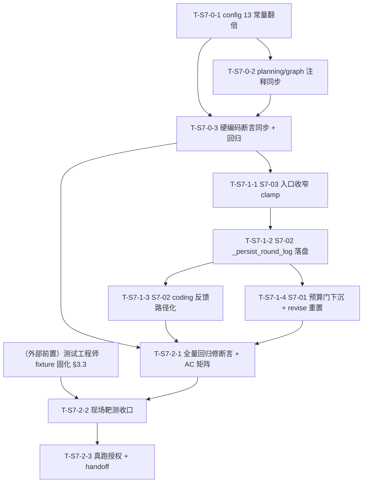
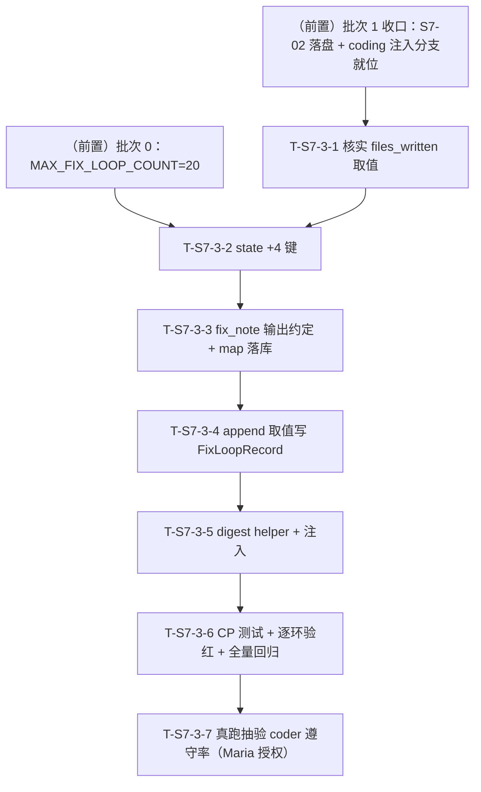
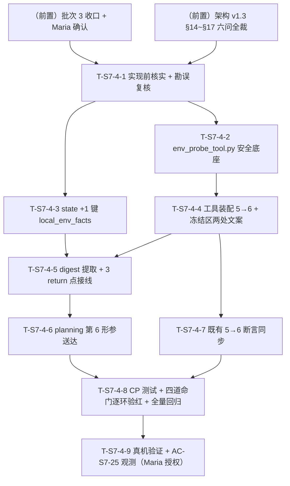
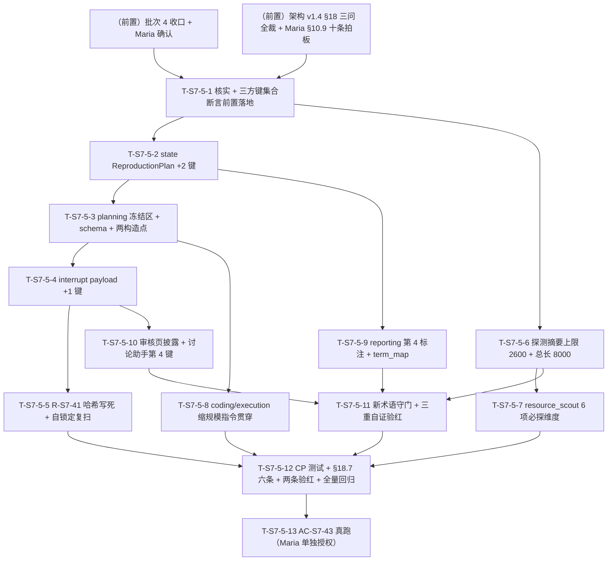
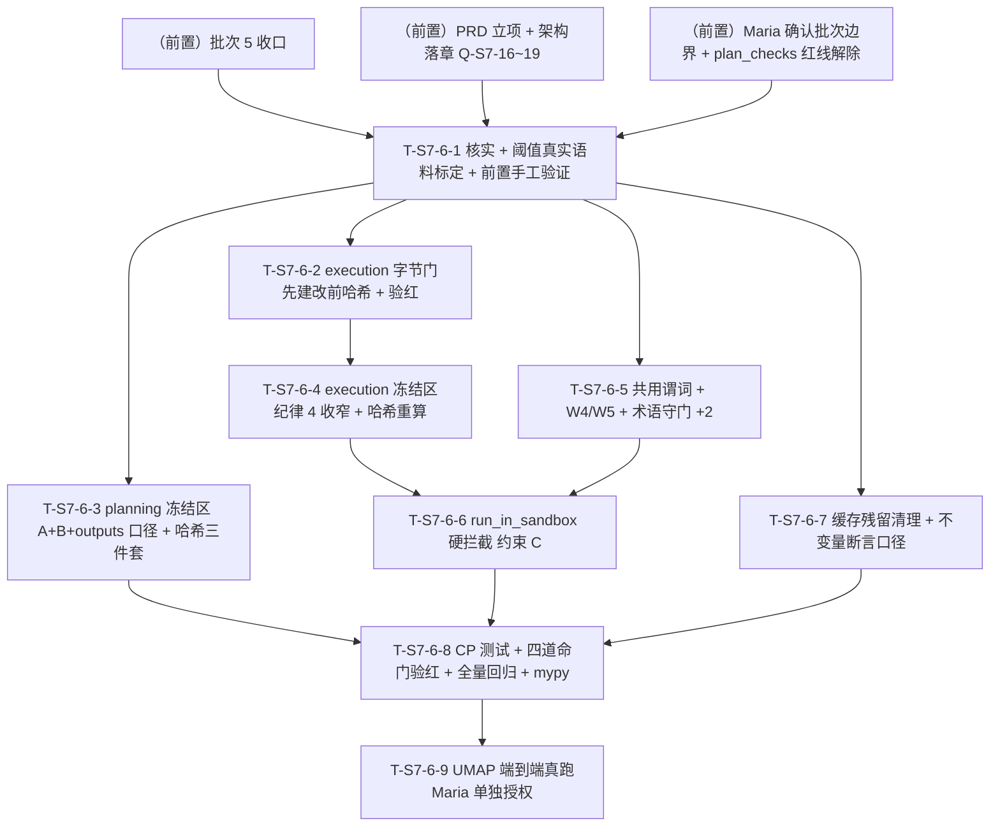

# Sprint 7 开发计划

**产品名称**：Auto-Reproduction —— 论文自动复现系统
**Sprint**：Sprint 7 —— 修复循环失控治理族：山穷水尽不问人（S7-01）、烧过头拦不住（S7-03）、coder 看不到真报错（S7-02）
**版本**：v1.0
**日期**：2026-07-19
**作者**：全栈开发工程师代理
**状态**：草案（待 Maria 审阅后逐批授权执行）
**对应 PRD**：`docs/sprint7/prd.md` v0.3（S7-01 P0 含 13 常量翻倍 / S7-02 P1 / S7-03 P1；AC-S7-01~08；A-S7-1~7；Q-S7-1~6）
**对应架构**：`docs/sprint7/architecture.md` v1.0（Q-S7-1~6 六项技术裁决 + 三需求文件级落点 + §7 变更总表 + §8 收口顺序 + §9 测试点 + §10 风险 R-S7-1~7 + §11 假设 AA-S7-1~7 + §12 AC 映射）
**体例参照**：`docs/sprint6/dev-plan.md` v1.0

> **本计划性质**：忠实落地 PRD v0.3 + 架构 v1.0，不重新决策、不改设计。所有取值/落点/顺序均取自架构定稿。批次划分严格按架构 §8 收口顺序。**批次边界逐批确认制**：每批收口门后停手，等 Maria 确认再开下一批。

---

## 0. 全局纪律（贯穿所有任务，不再逐项复述）

> 沿 sp5/sp6 教训与 PRD/架构红线，开工前逐条对照。

1. **回归现场样本只读勿动**：`checkpoints.db`（99MB，`task-99eef17bccf2` 现场所在真库——预算耗尽静默降级 + import 反复失败 + 烧 92 超 60 三缺陷同现场）**只读，任何任务不得写入 / 清理 / 重命名**。一切测试消费走 `tests/fixtures/checkpoints_s7_99eef17bccf2.db` 字节副本（**复制不移动**，源库 md5 前后逐一 MATCH，架构 §9.1 / sp6 §3.4 范式）。该 fixture **当前尚不存在**，须测试工程师在批次 2 靶测前固化（批次 2 前置门，见 §3.3）。
2. **测试命令口径**：`.venv/bin/pytest`（裸 `pytest` 不在 PATH；全量非 e2e 回归 = `.venv/bin/pytest -q -m "not e2e"`）。零退化基线以 **sp6 收官 1951 绿**（+1 预存在浏览器 flaky `test_e2e_code_only`）为准，批次 0 开工前主控实测一次落档，后续各批次收口对照。
3. **真跑授权红线**：一切耗 deepxiv 配额 / 真实 LLM 的动作（现场同构真实 e2e 抽验）**须 Maria 明确授权具体动作**，统一归集到批次 2 任务 T-S7-2-3，**合并为一次授权动作省配额**；mock 优先守门、smoke fail-fast、`task-99eef17bccf2` 为天然 fixture 勿清理。
4. **架构贯穿硬约束（红线，dev-plan 显式列为约束，任一任务不得破）**：
   - **零 GlobalState 字段新增/变更**；
   - **零 ExecutionResult 字段新增/变更**；
   - **零 interrupt#2 payload 键新增/变更**（面板键集合逐字冻结）；
   - **不新增 interrupt 种类**（三类封口：planning#1 / dev_loop#2 / user_input#3）；
   - **不加"追加预算"第四态**（interrupt#2 恰三态：terminate / revise_plan / export_code）；
   - **保 S-1 重跑幂等契约**（`_has_committed_result_for_round` guard，sandbox 不重跑）；
   - **成本硬上限对齐翻倍新值 240 / 120 绝不突破**；
   - **`execution_monitor.py` 本 Sprint 零改**（面板文案走 `replace(feedback, ...)` 数据通道，渲染逻辑不动）；
   - **不改 `core/react_base.py`**（S7-03 走入口收窄，不侵入通用子图）；
   - **不改 `_dev_loop_llm_calls` 计量口径**（S7-03 只收窄 max_rounds，累加埋点一字不动）；
   - **断言只换不弱化**（翻倍改被断言的常量值/等式两边数字，不弱化断言强度）；
   - **最小单一抽象**（不新造观测管道 / 不新增工具 / 不新增模块）。
5. **本 Sprint 架构级红利**：**GlobalState / ExecutionResult / interrupt#2 payload 键结构零新增字段**——`task-99eef17bccf2` 旧 checkpoint 与全部新代码天然相容，可用真库副本直接驱动 S7-01/02/03 全部回归靶。
6. **execution.py 单收口窗口令（架构 §8 批次 1）**：`core/nodes/execution.py` 被 S7-01/S7-02/S7-03 共同触碰（预算门判定 / 落盘反馈 / 子上限收窄），**收敛批次 1 一次改写，主控收口令**。窗口内子任务顺序严格 **S7-03 → S7-02 → S7-01**（架构 §8：一处 clamp 最小先落 → 落盘 helper 跨两文件 → 收尾判定重构改动最深最后落，避免与 S7-02 主流程接线互扰）。**函数级不重叠已坐实**（S7-03 在子图装配层 `_run_execution_agent`、S7-02 在落盘 helper + 主流程步骤 5-6 间、S7-01 在收尾判定 `_maybe_interrupt_or_return`），并行子代理不得直接改此文件，主控按序串行合入。
7. **Prompt Cache 纪律（R-PC4 无扰，写进注意事项）**：
   - **S7-03 收窄不进 HumanMessage**：`_build_execution_agent_context` 里的 `max_rounds` 数字保持联动值 `_effective_max_rounds(plan)`（plan 确定性产出，不随 `dev_calls` 抖动），收窄只作用于子图 `max_rounds` 护栏，agent 无需感知（架构 §6.2 / AA-S7-6）。
   - **日志文件名用确定性 `fix_loop_count` 不用时间戳/uuid**（架构 §5.3）：`round_{fix_loop_count}.log`，Prompt Cache 无扰、可复现、coder 可从 `fix_round` 反推文件名。
   - 本 Sprint **不触碰任何稳定前缀 / 工具 docstring**（S7-02 复用现有 `read_code_file` docstring 零改动；S7-01 面板文案走数据通道非 prompt）。
8. **批次边界逐批确认制**：每批收口门后停手，等 Maria 确认再开下一批；对某批的授权 ≠ 对后续批次的授权；耗配额 / 不可逆动作仍需单独授权。

---

## 1. 概述

### 1.1 Sprint 目标

Sprint 7 针对 `task-99eef17bccf2` 现场坐实的"修复循环反复失败时三个失控点"，作为一个治理族一次性收敛：

- **不失控之一 · 山穷水尽要问人（S7-01，P0）**：入口预算门（`execution.py:2029-2030`）在 `budget < DEV_LOOP_MIN_CALLS_PER_ROUND` 时反向绕过 interrupt#2、直接静默降级出报告（实测 `user_fix_decision=None` 用户从不被问）。修法=**预算门下沉为修复分支准入否决条件**（删降级 return + and 子句 + reason 分支），预算耗尽自动落既有两段式 interrupt#2 通道问用户；配套 **13 个预算常量全翻倍**（给余量、不替代升级）；revise_plan 分支补预算全额重置（补语义缝隙）。
- **不失控之二 · 想拦要拦得住（S7-03，P1）**：`MAX_DEV_LOOP_LLM_CALLS` 子上限只在轮边界检查，单轮 ReAct 子图一口气烧（实测 92 超 60 达 32）。修法=**`_run_execution_agent` 入口收窄本轮 `max_rounds = min(联动值, 剩余子预算)` 保底 1**，复用现成 `budget_check_node` 刹车，越界上界确定性 ≤ force_finish 1 轮 + metrics 抽取额度。
- **不失控之三 · 给 agent 看真相（S7-02，P1）**：coder 修复反馈全程看不到真报错（`stderr_tail` 取到后续成功步 stdout、`representative_stderr` 恒空，`No module named 'src'` 出现 831 次）——信息链路 bug。修法=**execution 每轮完整日志落盘 `<code_output_dir>/exec_logs/round_{n}.log`（错误优先编排）+ coding 反馈 `stderr_tail` 换成日志文件路径指引 + coder 用现有 `read_code_file` 自读**。

### 1.2 范围对齐

- **PRD 权威**：3 项需求 S7-01~03 + AC-S7-01~08 + 非目标（不做差异化降级标注体系 / 不改预算计量口径 / 不做撤销通道 / 不加第四态 / 不改 coder 修复策略 prompt / 不新造观测管道 / 不改 REACT_MAX_ROUNDS_* 轮次语义 / 不追求零越界 / 附B 验证门升级已砍不做）。
- **架构权威**：Q-S7-1~6 六项裁决全部落地为可执行设计（复用三态不加第四态 / 预算门下沉复用两段式 / 13 常量翻倍派生依赖已核 / 面板文案 replace 范式 / 日志落盘 + read_code_file 自读 + 错误优先编排应对 8000 截断 / 入口收窄 max_rounds），**本计划不重新决策**。
- **新增模块**：**0 个新 .py 模块**（S7-02 新增运行期目录 `<code_output_dir>/exec_logs/`，进 .gitignore；`_persist_round_log` 为 execution.py 内新纯函数）。
- **零 breaking**：无 state / ExecutionResult / interrupt payload 契约变更；旧 checkpoint 直接可被新代码消费。

### 1.3 关键风险一句话

**批次 1 `execution.py` 单收口窗口是 sp7 回归风险全 Sprint 最高点**（架构 R-S7-7 + R-S7-1）：S7-01 预算门下沉（实现 1）直接改写 `_maybe_interrupt_or_return` 的修复分支准入与 reason 链，误伤既有"预算充足失败"路由或破坏 self-loop 两段式即引入死锁 / 幂等退化。缓解=**收敛一批一次改写 + 主控收口令 + 子任务顺序 S7-03→S7-02→S7-01 + 现场靶 + 对照用例（预算充足/耗尽两分支各验路由）**。其次 AC-S7-05/07/08 三项**须验红**（沿 sp6 AC-S6-10 假绿转正教训：文件路径写了但反馈没真指过去 / 收窄没生效但常规 mock 假绿），注掉对应改动断言必须变红。

### 1.4 容量裁剪线（超限时依序执行）

若进度吃紧，按以下顺序顺延（**P0 载体不可裁**：批次 0 翻倍 + 批次 1 的 S7-01 是治理族主线，缺一环用户仍不被问）：

1. **先降 S7-02 规模**：保"完整日志落盘 + 反馈传路径 + coder 自读"（AC-S7-05/07），"错误优先编排应对 8000 截断"（R-S7-3 缓解）可降级为"单轮日志通常 < 8000 整读即可"先交、编排 helper 顺延；
2. **再降 S7-03 规模**：保入口收窄 clamp（AC-S7-08），越界上界精确度量（§6.3 metrics 额度）顺延为粗断言；
3. **S7-01 与翻倍不可降**（P0 主线）。

---

## 2. 任务清单总表

| 任务编号 | 承载需求 | 任务名 | 产出文件 | 依赖前置 | 估时 | 风险 |
|---|---|---|---|---|---|---|
| **T-S7-0-1** | S7-01 翻倍 | 13 常量翻倍 + 4 处注释同步 | `config.py` | 无 | 2h | 中（联动等式命门） |
| **T-S7-0-2** | S7-01 翻倍 | 3 处外部注释同步（planning.py / graph.py） | `core/nodes/planning.py` + `core/graph.py` | 无 | 0.5h | 低 |
| **T-S7-0-3** | S7-01 翻倍 | 十几处硬编码断言同步（只换不弱化）+ 全量回归 | `tests/`（§3.4 清单） | T-S7-0-1/0-2 | 4h | 中（回归面广 R-S7-6） |
| **T-S7-1-1** | S7-03 | `_run_execution_agent` 入口收窄 max_rounds clamp | `core/nodes/execution.py` | 批次 0 | 2h | 中（越界上界 + R-PC4） |
| **T-S7-1-2** | S7-02 | `_persist_round_log` 落盘 + 错误优先编排 + 主流程接线 | `core/nodes/execution.py` | T-S7-1-1（同文件串行） | 4h | 高（8000 截断 R-S7-3 + 落盘兜底 R-S7-4） |
| **T-S7-1-3** | S7-02 | coding 反馈 `log_file_path` 子键 + `stderr_tail` 指引化 | `core/nodes/coding.py` | T-S7-1-2 | 2.5h | 中（路径确定性推导 + AC-S7-07 验红） |
| **T-S7-1-4** | S7-01 | 预算门下沉 + reason 链 + `_BUDGET_EXHAUSTED_SUMMARY` + revise 预算重置 | `core/nodes/execution.py` | T-S7-1-2（同文件串行，改动最深最后落） | 5h | 高（死锁命门 R-S7-1 + 两段式幂等 R-S7-7） |
| **T-S7-2-1** | 回归 | 全量回归修断言收口 + AC-S7-01~08 覆盖矩阵审计 | `tests/`（§9.2 逐 AC） | 批次 0~1 | 5h | 中 |
| **T-S7-2-2** | 验收 | 现场靶测收口（`checkpoints_s7_99eef17bccf2.db` 三缺陷驱动） | `tests/test_sprint7_*` | T-S7-2-1 + 前置门 fixture 固化 | 4h | 中 |
| **T-S7-2-3** | 验收 | **真跑项（Maria 授权点）**：现场同构真实 e2e 抽验 + handoff | `docs/sprint7/test-reports/` + handoff | T-S7-2-2 | 4h | 中 |

**任务总数**：9 个（批次 0×3 + 批次 1×4 + 批次 2×3）。
**批次数**：3（批次 0 翻倍 / 批次 1 execution.py 单收口窗口 / 批次 2 收口）。
**检查点总数**：CP 约 32 个（分布见各批次任务，收口批次 2 三 CP 为总闸门）。
**总估时**：**~33h**（批次 0：6.5h / 批次 1：13.5h / 批次 2：13h）。若容量吃紧按 §1.4 裁剪线执行。

---

## 3. 批次划分与依赖图

### 3.1 批次总览（= 架构 §8 权威收口顺序）

| 批次 | 名称 | 任务 | 前置条件 | AC 映射 | 特殊标注 |
|---|---|---|---|---|---|
| **0** | 翻倍批（独立先行） | T-S7-0-1 → 0-2 → 0-3 | 无（config.py 独占，不碰 execution.py） | AC-S7-06 | **为后续所有批提供正确常量基线**（S7-03 收窄读 `MAX_DEV_LOOP_LLM_CALLS`、S7-01 revise 重置读 `MAX_TOTAL_LLM_CALLS`）；断言只换不弱化 |
| **1** | execution.py 单收口窗口 | T-S7-1-1 → 1-2 → 1-3 → 1-4 | 批次 0（正确常量基线） | AC-S7-01/02/03/04/05/07/08 | **execution.py 被三需求共触碰，收敛一批一次改写，主控收口令；子任务顺序 S7-03→S7-02→S7-01**（架构 §8）；AC-S7-05/07/08 须验红 |
| **2** | 收口 | T-S7-2-1 → 2-2 → 2-3 | 批次 0~1 全部 | AC-S7-01~08 全覆盖 + sp6 基线 1951 回归全绿 | **现场靶测（`checkpoints_s7_99eef17bccf2.db`）+ 真跑项合并一次 Maria 授权窗口省配额**；批次 2 前置门 = fixture 固化（§3.3） |

### 3.2 依赖关系图（Mermaid）



**关键路径**：翻倍批（config 常量基线）→ T-S7-1-1（S7-03 收窄）→ T-S7-1-2（S7-02 落盘，S7-03 之后先落）→ T-S7-1-4（S7-01 预算门下沉，改动最深最后落）→ T-S7-2-1 → 2-2 → 2-3。批次 0 三任务线性（注释同步依赖常量值定、断言同步依赖两者）；**批次 1 execution.py 四子任务全部串行（同文件单收口窗口，不并行）**，顺序 S7-03→S7-02→S7-01（其中 T-S7-1-3 coding.py 反馈随 S7-02 同改）。

### 3.3 批次 2 前置门（外部依赖，显式声明）

**测试工程师须在 T-S7-2-2 靶测验收前完成现场样本 fixture 固化**（架构 §9.1 / sp6 §3.4 复制不移动）：

- `tests/fixtures/checkpoints_s7_99eef17bccf2.db`：`task-99eef17bccf2` 真库字节副本——S7-01/02/03 天然 fixture：`retry_budget_remaining=0`（S7-01 预算耗尽靶）/ `execution_result.success=False` / `_dev_loop_llm_calls=92`（S7-03 冲过头靶）/ `fix_loop_history` 4 条全 `category=import` / `logs` 含 `No module named 'src'`（S7-02 真报错靶）/ `user_fix_decision=None`。

> **当前状态确认**：该 fixture **尚不存在**（`tests/fixtures/` 现只有 sp6 三 db）；源库 `checkpoints.db`（99MB）在仓库根、`task-99eef17bccf2` 现场在其中。固化须走 sp6 §3.4"复制不移动"范式：源库 md5 前后逐一 MATCH，原库零字节零元数据变动（只读连接会重建 -shm/-wal 属 WAL 正常行为，非损伤——用 `?mode=ro` URI 打开或先 `cp` 再验 md5）。fixture 未就绪时批次 1 开发可先行（临时以只读原库路径本地冒烟），但 **T-S7-2-2 靶测断言必须以固化 fixture 跑**（软前置门语义）。

### 3.4 翻倍批硬编码断言同步面（AC-S7-06，架构 §3.4 清单）

翻倍打破的硬编码断言分布（架构 Grep 坐实，重点文件）——纪律沿 sp5/sp6"断言只换不弱化"（改的是被断言的常量值 120→240 等与联动等式两边数字，**不弱化**等式/类型/强约束断言强度）：

- `tests/test_sprint3_a1.py`（35 处含 config 断言）
- `tests/test_sprint3_a_boundary.py`
- `tests/test_sprint5_t11_config.py`（18 处）
- `tests/test_sprint5_t25_budget_link.py`（联动公式断言：`CAP == DEV_LOOP/2`、`DEV_LOOP < TOTAL`）
- `tests/test_sprint4_e3.py`
- `tests/test_sprint3_e2*.py`（预算扣减断言）
- `tests/test_sprint2_a4.py`

> **实测同步面以 T-S7-0-3 开工时 `grep -rn` 精确清点为准**（架构清单为"重点文件"非穷举，全量回归零失败即闭合账目）。

---

## 4. 批次 0：翻倍批（独立先行，config.py 独占）

> **前置条件**：无（config.py 独占，不碰 execution.py，与批次 1 解耦）。
> **产出**：13 常量翻倍值 + 4 处 config 注释同步 + 3 处外部注释同步 + 十几处硬编码断言同步 + 全量回归零失败。为后续所有批提供正确常量基线。
> **文件边界**：`config.py` 独占（T-S7-0-1）；`planning.py`/`graph.py` 注释（T-S7-0-2）；`tests/`（T-S7-0-3）。**零逻辑改动**——翻倍是纯参数批。

### 任务 T-S7-0-1：config 13 常量翻倍 + config 内注释同步（S7-01 翻倍，架构 §3.1/§3.3）

- **产出文件**：`config.py`（13 常量值 + 4 处注释同步）
- **依赖项**：无
- **预计复杂度**：中（2h，联动等式命门）
- **架构参考**：architecture §3.1 逐常量表 + §3.2 联动验证 + §3.3 注释同步 + AC-S7-06

**需要实现的内容**（值取架构 §3.1 表，不自创）：

1. 13 常量翻倍（现值→新值，落点行号）：

| 常量 | config.py 落点 | 现→新 | 备注 |
|---|---|---|---|
| `MAX_TOTAL_LLM_CALLS` | :31 | 120→**240** | 全局硬上限 |
| `MAX_DEV_LOOP_LLM_CALLS` | :114 | 60→**120** | 修复循环子预算天花板（仍须 < TOTAL） |
| `MAX_NODE_LLM_CALLS` | :30 | 10→**20** | 单节点上限 |
| `MAX_FIX_LOOP_COUNT` | :32 | 10→**20** | 修复回合次数上限 |
| `DEV_LOOP_MIN_CALLS_PER_ROUND` | :115 | 2→**4** | 入口预算门阈值（S7-01 判定基准） |
| `REACT_MAX_ROUNDS_EXECUTION_CAP` | :143 | 30→**60** | 联动公式 = `MAX_DEV_LOOP_LLM_CALLS/2` = 120/2 |
| `REACT_MAX_ROUNDS_PAPER_INTAKE` | :58 | 5→**10** | |
| `REACT_MAX_ROUNDS_PAPER_ANALYSIS` | :59 | 12→**24** | |
| `REACT_MAX_ROUNDS_RESOURCE_SCOUT` | :66 | 10→**20** | |
| `REACT_MAX_ROUNDS_PLANNING` | :67 | 8→**16** | |
| `REACT_MAX_ROUNDS_CODING` | :116 | 12→**24** | |
| `REACT_MAX_ROUNDS_EXECUTION`（FLOOR） | :131 | 10→**20** | 预算联动公式下限 |
| `REACT_EXECUTION_ROUNDS_MARGIN`（K） | :142 | 5→**10** | 联动 K 裕量 |

2. **联动公式不变、翻倍后须成立**（架构 §3.2，AC-S7-06 守门）：`REACT_MAX_ROUNDS_EXECUTION_CAP == MAX_DEV_LOOP_LLM_CALLS / 2`（60 == 120/2）；`MAX_DEV_LOOP_LLM_CALLS < MAX_TOTAL_LLM_CALLS`（120 < 240）；`FLOOR <= CAP`（20 <= 60）——不得只翻一边破坏联动。
3. **4 处 config 内注释同步**（非逻辑，防误导后人，架构 §3.3）：`:112` 注释"60 < 120"→"120 < 240"；`:114` 注释"强约束 < MAX_TOTAL_LLM_CALLS=120"→"=240"；`:143` 注释"= MAX_DEV_LOOP_LLM_CALLS/2 = 60/2"→"= 120/2"；`:142` 注释若含旧值同步（K 裕量说明"prepare 1 + 收尾 1 + 兜底 3"随语义保持，量级说明可留）。
4. **零逻辑改动**——所有下游读常量自动传导（`state.py:340` `retry_budget_remaining=MAX_TOTAL_LLM_CALLS` 初值、planning payload 展示、面板分母、S7-01 revise 重置、S7-03 收窄公式均读常量，架构 §3.1 已逐条核派生依赖，无隐式比例依赖被打破）。

**自测检查点**：
- [x] CP-0.1-1 13 常量值断言：逐个断言翻倍新值（`MAX_TOTAL_LLM_CALLS==240` / `MAX_DEV_LOOP_LLM_CALLS==120` / `MAX_NODE_LLM_CALLS==20` / `MAX_FIX_LOOP_COUNT==20` / `DEV_LOOP_MIN_CALLS_PER_ROUND==4` / `CAP==60` / 各节点轮次翻倍值），类型仍 int/Path（AC-S7-06 常量面） ⟦补勾 2026-08-06 @主控：`tests/test_sprint5_t11_config.py:20/33/57-61` 逐条断言翻倍新值（CAP60 / EXEC20 / NODE20 / TOTAL240 / FIX20 / DEV_LOOP120 / FLOOR4）；2026-08-06 实测绿⟧
- [x] CP-0.1-2 **联动等式 + 强约束断言**：`REACT_MAX_ROUNDS_EXECUTION_CAP == MAX_DEV_LOOP_LLM_CALLS // 2`（60==60）；`MAX_DEV_LOOP_LLM_CALLS < MAX_TOTAL_LLM_CALLS`；`REACT_MAX_ROUNDS_EXECUTION <= REACT_MAX_ROUNDS_EXECUTION_CAP`（AC-S7-06 联动面） ⟦补勾 2026-08-06 @主控：联动等式 `tests/test_sprint5_t25_budget_link.py:242`（CAP*2==DEV_LOOP）+ `:226`；强约束 DEV_LOOP<TOTAL 见 `tests/test_sprint3_a1.py:121` / `test_sprint3_a_boundary.py:107` / `test_sprint3_f1.py:258`；2026-08-06 实测绿⟧
- [x] CP-0.1-3 config 内 4 处注释无旧值字面残留（`grep "60 < 120"` / `"=120"` / `"60/2"` 在 config.py 相关行零命中） ⟦补勾 2026-08-06 @主控：2026-08-06 实测 `config.py` 旧值字面（`=120` / `60 < 120` / `60/2`）零命中⟧

### 任务 T-S7-0-2：planning / graph 外部注释同步（S7-01 翻倍，架构 §3.3）

- **产出文件**：`core/nodes/planning.py`（:11 与 :881 注释）+ `core/graph.py`（:73 核对）
- **依赖项**：无
- **预计复杂度**：低（0.5h）
- **架构参考**：architecture §3.3 注释同步

**需要实现的内容**：

1. `planning.py:11` 注释"任务级兜底依赖 MAX_TOTAL_LLM_CALLS=120"→"=240"；
2. `planning.py:881` 注释"`# =120；总预算参考`"→"`# =240；总预算参考`"（该行逻辑读常量 `MAX_TOTAL_LLM_CALLS` 自动对齐，只改注释字面）；
3. `graph.py:73` **核对**：架构 §3.3 列此行为"MAX_TOTAL_LLM_CALLS=120"注释同步项，但**实测该行内容为 `MAX_TOTAL_LLM_CALLS 总预算 + cancel 主动出口三重自然兜底`，不含 "=120" 字面**（见 §14 落点勘误 P-1）——**无需改**，仅确认无旧值字面残留即可。

**自测检查点**：
- [x] CP-0.2-1 `planning.py` 无 "=120" 旧值注释残留（`grep "=120" core/nodes/planning.py` 零命中）；`graph.py:73` 确认无旧值字面（勘误 P-1 已核） ⟦补勾 2026-08-06 @主控：2026-08-06 实测 `core/nodes/planning.py` `=120` 零命中；`core/graph.py:70-76` 无旧值字面（只提常量名）⟧
- [x] CP-0.2-2 planning payload `max_total_llm_calls` 值随常量翻倍为 240（读常量自动传导，非注释） ⟦补勾 2026-08-06 @主控：`core/nodes/planning.py:979` 读常量传导（非注释）；`tests/test_sprint2_c1_e2e.py:212` 断言 payload 值 == MAX_TOTAL_LLM_CALLS⟧

### 任务 T-S7-0-3：硬编码断言同步 + 全量回归（S7-01 翻倍，架构 §3.4）

- **产出文件**：`tests/`（§3.4 清单逐文件，只换不弱化）
- **依赖项**：T-S7-0-1 + T-S7-0-2
- **预计复杂度**：中（4h，回归面广 R-S7-6）
- **架构参考**：architecture §3.4 断言同步面 + §10/R-S7-6 + AC-S7-06

**需要实现的内容**：

1. 开工先 `grep -rn "== 120\|== 60\|== 30\|MAX_TOTAL_LLM_CALLS\|MAX_DEV_LOOP_LLM_CALLS\|REACT_MAX_ROUNDS_EXECUTION_CAP\|DEV_LOOP_MIN_CALLS_PER_ROUND\|MAX_FIX_LOOP_COUNT\|MAX_NODE_LLM_CALLS" tests/` 精确清点全部硬编码断言（架构 §3.4 为重点文件非穷举）；
2. 逐处将被断言的常量值/联动等式两边数字改为翻倍新值——**只换数字，不弱化断言强度**（等式断言仍是等式、强约束仍是不等式、类型断言保留）；重点文件：`test_sprint3_a1.py`（35 处）、`test_sprint3_a_boundary.py`、`test_sprint5_t11_config.py`（18 处）、`test_sprint5_t25_budget_link.py`（联动公式）、`test_sprint4_e3.py`、`test_sprint3_e2*.py`（预算扣减）、`test_sprint2_a4.py`；
3. 预算扣减类断言（如"扣减 N 次后余量 = TOTAL - N"）：常量翻倍后基数变化，同步基数不改扣减逻辑断言；
4. 全量非 e2e 回归零失败（账目精确闭合）。

**自测检查点**：
- [x] CP-0.3-1 §3.4 清单逐文件断言同步完成（`grep -rn` 精确清点，无遗漏旧值断言） ⟦补勾 2026-08-06 @主控：⚠ 证据强度较弱：无单点证据物，由 commit `4dc0a75` 自述（断言同步清单）+ 全量回归零失败佐证。2026-08-06 全量非 e2e 复测 2635 passed / 0 failed⟧
- [x] CP-0.3-2 联动公式断言用例（`test_sprint5_t25_budget_link.py`）翻倍后仍绿：`CAP == DEV_LOOP//2` / `DEV_LOOP < TOTAL` 等式两边数字同步为 60==120//2 / 120<240 ⟦补勾 2026-08-06 @主控：2026-08-06 实测 `tests/test_sprint5_t25_budget_link.py` 全绿（60==120//2 / 120<240）⟧
- [x] CP-0.3-3 **全量非 e2e 回归 `.venv/bin/pytest -q -m "not e2e"` 相对 sp6 基线 1951 零退化零失败**（翻倍断言同步毕，账目闭合，AC-S7-06 回归面） ⟦补勾 2026-08-06 @主控：commit `4dc0a75` 记 1990 绿（基线 1951+39）；2026-08-06 全量非 e2e 复测 2635 passed / 0 failed⟧

> **批次 0 收口门**：CP-0.1~0.3 全绿 + 全量非 e2e 回归零失败（AC-S7-06 达标）。**停手等 Maria 确认再开批次 1。**

---

## 5. 批次 1：execution.py 单收口窗口（全 Sprint 最高回归风险）

> **前置条件**：批次 0（正确常量基线——S7-03 收窄读 `MAX_DEV_LOOP_LLM_CALLS=120`、S7-01 revise 重置读 `MAX_TOTAL_LLM_CALLS=240`）。
> **产出**：S7-03 入口收窄刹车 + S7-02 完整日志落盘 + 反馈路径化 + coder 自读 + S7-01 预算门下沉 interrupt#2 + revise 预算重置。
> **文件边界**：`core/nodes/execution.py`（**单收口窗口，四子任务一次串行改写，主控收口令**）+ `core/nodes/coding.py`（S7-02 反馈半边，随 T-S7-1-3）。**子任务顺序严格 S7-03→S7-02→S7-01**（架构 §8）。
> **红线**：零 state / 零 ExecutionResult / 零 interrupt payload 键 / 不改 react_base / 不改计量口径 / 不加第四态 / 不新增 interrupt 种类 / execution_monitor.py 零改 / 成本硬上限 240/120 不破 / 保 S-1 幂等 / R-PC4 无扰（架构 §8）。

### 任务 T-S7-1-1：S7-03 入口收窄 max_rounds clamp（S7-03，架构 §6.2）

- **产出文件**：`core/nodes/execution.py`（`_run_execution_agent` 的 `effective_max_rounds` 计算处，:1348）
- **依赖项**：批次 0
- **预计复杂度**：中（2h，越界上界 + R-PC4）
- **架构参考**：architecture §6.2 入口收窄 + §6.3 越界上界 + §6.4 三重护栏协同 + §10/R-S7-5 + AC-S7-08

**需要实现的内容**（架构 §6.2 给定，一处 clamp）：

1. `_run_execution_agent` 内 :1348 现 `effective_max_rounds = _effective_max_rounds(plan)` 改为：
   ```python
   base_rounds = _effective_max_rounds(plan)                          # 联动公式，不变
   dev_calls_so_far = state.get("_dev_loop_llm_calls", 0) or 0
   remaining_sub_budget = max(0, MAX_DEV_LOOP_LLM_CALLS - dev_calls_so_far)
   # 本轮子图轮次上限 = min(联动值, 剩余子预算)，保底 1 轮（防 0 轮死锁/退化，R-S7-5）
   effective_max_rounds = max(1, min(base_rounds, remaining_sub_budget))
   ```
2. **收窄值只喂子图护栏**（:1353 `create_react_subgraph(max_rounds=effective_max_rounds)` + :1359 ReActState `max_rounds`）；
3. **R-PC4 无扰红线**：`_build_execution_agent_context`（:1341 已构造、内部经 `_effective_max_rounds(plan)`）里 HumanMessage 的 `max_rounds` 数字**保持联动值不收窄**——它是给 agent 的"计划轮次预期"，收窄是 agent 无需感知的系统级护栏；两者语义不同不强制一致（架构 §6.2 / AA-S7-6）。**注意**：context 在 :1341 构造（早于 :1348 收窄），本身就不受收窄影响，务必保持此隔离，不得把收窄值回灌 context；
4. **零改计量口径**（`_dev_loop_llm_calls` 累加 :1828 `_map_execution_result` 一字不动）、**零 react_base 改动**（复用现成 `budget_check_node` :621-629 刹车）、**零 config 常量新增**、**零 state 字段**。

**自测检查点**：
- [x] CP-1.1-1 **收窄逻辑单测**（AC-S7-08）：构造 `_dev_loop_llm_calls=118`（逼近 120）+ 联动值 60 的 state → 断言 `_run_execution_agent` 收窄后 `effective_max_rounds == max(1, min(60, 120-118)) == 2`；`dev_calls_so_far=0` → `min(60, 120) == 60`（不逼近时无收窄，退回联动值） ⟦补勾 2026-08-06 @主控：`test_sprint7_s7_03_max_rounds_clamp.py::test_cp_1_1_1_clamp_narrows_when_dev_calls_approach_ceiling` + `::test_cp_1_1_1_no_narrow_when_dev_calls_zero`；2026-08-06 实测绿⟧
- [x] CP-1.1-2 **保底 1 轮**（R-S7-5）：`_dev_loop_llm_calls=120`（已触顶）→ `remaining_sub_budget=0` → `max(1, min(60,0)) == 1`（不退化为 0 轮死锁） ⟦补勾 2026-08-06 @主控：同文件 `::test_cp_1_1_2_floor_one_round_when_budget_exhausted` + `::test_cp_1_1_2_floor_one_round_when_over_ceiling`；2026-08-06 实测绿⟧
- [x] CP-1.1-3 **越界上界断言**（AC-S7-08）：构造"单轮内高频调用"场景，断言总冲过头幅度 ≤ force_finish 1 轮 + metrics 抽取额度（确定性小值，远小于实测 32） ⟦补勾 2026-08-06 @主控：同文件 `::test_cp_1_1_3_over_run_bound_is_deterministic_small`；2026-08-06 实测绿⟧
- [x] CP-1.1-4 **R-PC4 无扰**：截取两个不同 `_dev_loop_llm_calls` 值下的 execution HumanMessage，`max_rounds` 数字保持联动值恒定（不随 dev_calls 抖动）——收窄未污染 context 通道 ⟦补勾 2026-08-06 @主控：同文件 `::test_cp_1_1_4_context_max_rounds_invariant_across_dev_calls`；2026-08-06 实测绿⟧
- [x] CP-1.1-5 **须验红**（沿 sp6 教训）：注掉收窄 clamp 后，CP-1.1-1 断言 `effective_max_rounds` 回到 60、CP-1.1-3 越界回到数十级 → 断言必须变红 ⟦补勾 2026-08-06 @主控：⚠ 证据强度较弱：**一次性验红，无常驻用例**——证据仅 commit `4dc0a75` 自述「S7-03 clamp 注掉 5 红恢复 6 绿」，今日不可复核。对照：批次 3 的同类验红做成了常驻用例（`test_cp_3_6_2_ring{1,2,3}_break_turns_red`），批次 1 没有⟧

### 任务 T-S7-1-2：S7-02 `_persist_round_log` 落盘 + 主流程接线（S7-02，架构 §5.3）

- **产出文件**：`core/nodes/execution.py`（新纯函数 `_persist_round_log` + 错误优先编排 helper + 主流程 2210-2214 区间接线）
- **依赖项**：T-S7-1-1（同文件串行）
- **预计复杂度**：高（4h，8000 截断 R-S7-3 + 落盘兜底 R-S7-4）
- **架构参考**：architecture §5.1/§5.2/§5.3 + §10/R-S7-3/R-S7-4 + AC-S7-05

**需要实现的内容**（架构 §5.3 给定）：

1. **新纯函数 `_persist_round_log(work_dir, fix_count, prep, run_results)`**（落盘，非污染 state）：
   - **位置**：`<code_output_dir>/exec_logs/`（code_output_dir 在 WORKSPACE_DIR 之下，`read_code_file` 天然可读，架构 §5.1 已坐实无需工具微调）；
   - **命名**：`round_{fix_loop_count}.log`（`fix_loop_count` 确定性编号，首跑=0，第 N 次修复回合=N；**不用时间戳/uuid**，Prompt Cache 无扰、coder 可从 `fix_round` 反推，架构 §5.3）；
   - **内容 = 完整日志**：`_aggregate_logs(prep, run_results)`（:1669-1691）的**未截断原文**（install_log + 各步 stdout/stderr），用 **mask 后**口径（与 `execution_result.logs` 同脱敏级别 :1744，coder 读到的日志不泄凭证）；
2. **错误优先编排 helper**（应对 `read_code_file` 8000 截断，R-S7-3）：文件头部先写"错误摘要区"——非零 exit 步骤的 `[step#i exit=N cmd=...]` + 其 stderr 段前置到文件头；随后完整时序日志。**保证真报错行（stderr / `No module named` 类）落在文件头 8000 字符内**，coder 整读一次即命中；
3. **主流程接线**：在 `_build_execution_result`（:2204-2210）之后、`_map_execution_result`（:2214）之前的 2210-2214 区间调 `_persist_round_log`（架构 §5.3）——确保只在真跑回合落盘（guard 命中路径本就不重跑 sandbox、不重落，日志已在上一次真跑回合落盘）；
4. **落盘异常兜底（R-S7-4）**：写文件失败（IO/越界）**不阻断节点**——try/except 兜底，失败时不炸（沿 coding gate 工具兜底范式）；日志路径由 §5.4 确定性推导（不存 state），落盘失败时确定性路径指向不存在文件，coder read 到"文件不存在"退回 `errors` 摘要（降级到 sp6 现状，可接受）；
5. **不改 `TOOL_RESULT_MAX_LENGTH=8000`**（全局 ReAct 工具结果护栏，改它影响面过大违反最小设计，架构 §5.2）。
6. **红线**：零 state 字段、零 ExecutionResult 字段（路径确定性推导不存）、零工具改动、零新增工具。

**自测检查点**：
- [x] CP-1.2-1 `_persist_round_log` 落盘：构造 import 失败现场（含 `No module named 'src'` 的 run_results）→ 断言 `<code_output_dir>/exec_logs/round_{n}.log` 存在且内容含真报错行（AC-S7-05 落盘面） ⟦补勾 2026-08-06 @主控：`test_sprint7_s7_02_persist_log.py::test_cp_1_2_1_persist_import_failure` + `::test_cp_1_2_1b_mainflow_wiring_persists`；2026-08-06 实测绿⟧
- [x] CP-1.2-2 **错误优先编排**（R-S7-3）：断言真报错行落在文件头 **8000 字符内**（模拟尾部为成功步 stdout 的现场，验前置有效） ⟦补勾 2026-08-06 @主控：同文件 `::test_cp_1_2_2_error_first_within_8000` + `::test_cp_1_2_2_no_error_no_prefix`（含对照）；2026-08-06 实测绿⟧
- [x] CP-1.2-3 命名确定性：`fix_loop_count=0` → `round_0.log`；`=2` → `round_2.log`（无时间戳/uuid，R-PC4 无扰） ⟦补勾 2026-08-06 @主控：同文件 `::test_cp_1_2_3_deterministic_naming`（参数化 fix_count→round_{n}.log）；2026-08-06 实测绿⟧
- [x] CP-1.2-4 mask 口径一致：落盘内容与 `execution_result.logs` 同脱敏级别（凭证不泄） ⟦补勾 2026-08-06 @主控：同文件 `::test_cp_1_2_4_mask_parity`；2026-08-06 实测绿⟧
- [x] CP-1.2-5 **落盘兜底不炸**（R-S7-4）：模拟写文件 IO 失败（如目录不可写）→ `_persist_round_log` try/except 兜底，节点不阻断（execution 主流程继续） ⟦补勾 2026-08-06 @主控：同文件 `::test_cp_1_2_5_persist_io_failure_no_crash` + `::test_cp_1_2_5_persist_failure_does_not_block_node`；2026-08-06 实测绿⟧
- [x] CP-1.2-6 guard 命中路径不重落：self-loop 重入（`already_committed=True`）路径不触发 `_persist_round_log`（sandbox 不重跑、日志上轮已落） ⟦补勾 2026-08-06 @主控：同文件 `::test_cp_1_2_6_guard_reentry_no_repersist`；2026-08-06 实测绿⟧

### 任务 T-S7-1-3：S7-02 coding 反馈路径化（S7-02，架构 §5.4）

- **产出文件**：`core/nodes/coding.py`（`_digest_execution_feedback` 返回增 `log_file_path` 子键 + `stderr_tail` 改指引串，:233-265；由 `_resolve_code_output_dir`+`fix_round` 拼路径）
- **依赖项**：T-S7-1-2
- **预计复杂度**：中（2.5h，路径确定性推导 + AC-S7-07 验红）
- **架构参考**：architecture §5.4 反馈落点 + §5.5 representative_stderr 处置 + AC-S7-05/07

**需要实现的内容**（架构 §5.4 给定）：

1. `_digest_execution_feedback` 返回 dict **新增 `log_file_path` 子键**（完整日志入口，绝对路径 or None），**保留 `error_category`**（快速提示，PRD §2.3.2 要求），**`stderr_tail` 语义改为退化指引串**（非删键——删键会打破既有 coding prompt/context 对该键引用与测试面）：
   ```python
   return {
       "errors": [...],                    # 保留（摘要级）
       "error_category": error_category,   # 保留（快速提示）
       "log_file_path": <round_{n}.log 绝对路径 or None>,   # 新增：完整日志入口
       "stderr_tail": "完整日志见 log_file_path，请用 read_code_file 自读",  # 语义改为指引，不含 logs 内容
   }
   ```
2. **路径确定性推导（零 state 字段，架构 §5.4 / AA-S7-4）**：`log_file_path` 由 coding.py 侧已有的 `_resolve_code_output_dir(state)`（:305/:351）+ `fix_round`（:327 `fix_count`）拼出 `<code_output_dir>/exec_logs/round_{fix_round}.log`——**不从 exec_result 读路径字段、不存 state/ExecutionResult**；
3. `_digest_execution_feedback` 当前签名为 `(exec_result)`——路径推导需 code_output_dir + fix_round（来自 state / 调用点 :328 已有 `fix_count`）：最小改法是在调用点 :328 传入已解析的 code_output_dir + fix_round，或函数内接受额外参；**保持 `last_error_summary` 键结构稳定**（Prompt Cache 无扰）；
4. **不填充/不删 `representative_stderr`**（架构 §5.5：sp4 遗留字段、恒空、人向面板读它，S7-02 不触碰——它与 coder agent 向链路正交，保 payload 键结构冻结）；
5. **execution 侧修复反馈维持 stderr_tail 尾部不改路径**（架构 §5.4 末 / AA-S7-3：execution agent 工具无 `read_code_file`，改路径反使其更瞎；S7-02 只作用于 coding 反馈链路——PRD §0.7 坐实的信息链路 bug 现场正是 coder 侧）。

**自测检查点**：
- [x] CP-1.3-1 `_digest_execution_feedback` 返回含 `log_file_path` 子键，指向 `<code_output_dir>/exec_logs/round_{fix_round}.log`（AC-S7-05 反馈面）；`error_category` 快速提示保留 ⟦补勾 2026-08-06 @主控：`test_sprint7_s7_02_coding_feedback.py::test_cp_1_3_1_log_file_path_subkey_and_error_category` + `::test_cp_1_3_1_off_by_one_matrix`；2026-08-06 实测绿⟧
- [x] CP-1.3-2 **端到端可读**（AC-S7-05）：落盘 + 路径推导联跑——断言 `read_code_file(log_file_path)` 能读到含 `No module named 'src'` 的日志内容 ⟦补勾 2026-08-06 @主控：同文件 `::test_cp_1_3_2_end_to_end_readable`；2026-08-06 实测绿⟧
- [x] CP-1.3-3 **AC-S7-07 设计取舍守门（须验红）**：断言 `stderr_tail` **不再是** `logs[-2000:]` 截断产物（现 :247），而是固定指引串（不含日志内容）；断言反馈以 `log_file_path` 为准。**验红**：注掉落盘 + 路径注入后断言必须变红（防"路径写了但反馈没真指过去"假绿，沿 sp6 AC-S6-10 教训） ⟦补勾 2026-08-06 @主控：常驻断言 `::test_cp_1_3_3_stderr_tail_is_guidance_not_truncation` 今日绿；⚠ **验红部分同 CP-1.1-5 为一次性**（commit `4dc0a75`），无常驻验红用例⟧
- [x] CP-1.3-4 路径确定性推导：落盘失败/文件不存在时 `read_code_file` 读到"文件不存在"串，反馈退回 `errors` 摘要不炸（R-S7-4 降级面） ⟦补勾 2026-08-06 @主控：同文件 `::test_cp_1_3_4_missing_file_degrades_to_errors` + `::test_cp_1_3_4_none_code_output_dir_returns_none_path`；2026-08-06 实测绿⟧
- [x] CP-1.3-5 `representative_stderr` 未被 S7-02 触碰（保恒空 + payload 键结构冻结）；execution 侧 `_build_execution_agent_context` 的 stderr_tail 维持尾部（AA-S7-3 正交） ⟦补勾 2026-08-06 @主控：同文件 `::test_cp_1_3_5_representative_stderr_untouched` + `::test_cp_1_3_5_execution_side_stderr_tail_stays_tail`；2026-08-06 实测绿⟧

### 任务 T-S7-1-4：S7-01 预算门下沉 + reason 链 + revise 预算重置（S7-01，架构 §2.3/§2.4/§1.2）

- **产出文件**：`core/nodes/execution.py`（`_maybe_interrupt_or_return` :2029/:2033/:2069 + `_route_user_fix_decision` :1952 + `_BUDGET_EXHAUSTED_SUMMARY` 常量）
- **依赖项**：T-S7-1-2（同文件串行，**改动最深最后落**，避免与 S7-02 主流程接线互扰）
- **预计复杂度**：高（5h，死锁命门 R-S7-1 + 两段式幂等 R-S7-7）
- **架构参考**：architecture §2.2 时序 + §2.3 预算门下沉（实现 1）+ §2.4 reason 接线 + §1.2 revise 重置 + §4 面板文案 + §10/R-S7-1/R-S7-2/R-S7-7 + AC-S7-01/02/03/04

**需要实现的内容**（架构 §2.3 实现 1，最小 diff）：

1. **删预算门降级 return**（:2029-2030）：现 `if budget < DEV_LOOP_MIN_CALLS_PER_ROUND: return _mark_degraded_for_report(...)` 整段**删除**——预算门不再是"提前降级的旁路"；
2. **预算门下沉为修复分支准入否决条件**（:2033-2038）：修复分支准入增一项 `and budget >= DEV_LOOP_MIN_CALLS_PER_ROUND`：
   ```python
   if (
       feedback.auto_fixable
       and fix_count < MAX_FIX_LOOP_COUNT
       and dev_calls < MAX_DEV_LOOP_LLM_CALLS
       and budget >= DEV_LOOP_MIN_CALLS_PER_ROUND      # ← 预算门下沉为修复准入条件
       and not _no_metrics_stalled(state, feedback)
   ):
       ... 回 coding 修复
   ```
   预算耗尽（含其它准入不满足）→ **自动落既有两段式**（:2055 await / :2091 interrupt），复用 commit-边界-return + self-loop-重入，**`already_committed` guard 逻辑（:2055/:2126）一字不改，零新路径、零新 guard**（架构 §2.2 已坐实：预算门命中时 exec_result 已在 updates、sandbox 不重跑，两段式天然复用）；
3. **reason 链增预算耗尽分支**（:2069-2082），优先级：早停 > **预算耗尽** > 子上限 > 不可修复 > 修复耗尽（预算耗尽是更强的资源终态）：
   ```python
   panel_feedback = feedback
   if _no_metrics_stalled(state, feedback):          # 既有
       reason = _NO_METRICS_EARLY_STOP_SUMMARY
       panel_feedback = replace(feedback, summary=..., fix_hint=...)
   elif budget < DEV_LOOP_MIN_CALLS_PER_ROUND:       # ← 新增：预算耗尽终态
       reason = _BUDGET_EXHAUSTED_SUMMARY
       panel_feedback = replace(feedback, summary=_BUDGET_EXHAUSTED_SUMMARY,
                                fix_hint=_BUDGET_EXHAUSTED_SUMMARY)
   elif dev_calls >= MAX_DEV_LOOP_LLM_CALLS:         # 既有
       reason = "子预算触顶"
   elif not feedback.auto_fixable:                   # 既有
       reason = "不可修复"
   else:                                             # 既有
       reason = "修复耗尽"
   ```
4. **新增模块级文案常量 `_BUDGET_EXHAUSTED_SUMMARY`**（execution.py，与 `_NO_METRICS_EARLY_STOP_SUMMARY:1981` 同款，架构 §4.3 给定文案）：
   ```python
   _BUDGET_EXHAUSTED_SUMMARY = (
       "修复循环已反复失败，重试预算已耗尽（LLM 调用额度用尽）。"
       "系统不再自动继续，请在下方三种处置中选择：接受当前结果导出报告 / "
       "重订计划再试 / 终止任务。"
   )
   ```
   面板文案走既有 `summary`/`fix_hint` 通道经 `replace` 注入（复用 sp6 AC-S6-10 范式，**零新 payload 键**，`_build_dev_loop_interrupt_payload` 从 `feedback.summary`/`feedback.fix_hint` 取，:1906-1907）；
5. **`_route_user_fix_decision` revise_plan 分支增预算重置**（:1952-1965，Q-S7-1 方案 A）：在既有 `fix_loop_count=0`（:1963）后追加 `out["retry_budget_remaining"] = MAX_TOTAL_LLM_CALLS`（翻倍后 240，与 `state.py:340` 初始化同口径）——补齐 revise_plan"换计划=重新开始"的预算语义自洽，防预算耗尽下 revise_plan 空转（架构 §1.2）；**`_dev_loop_llm_calls` 累计不重置**（子上限硬顶继续生效于 :2036/:2077，叠加 S7-03 收窄，revise 后仍不破 240/120，R-S7-2）；
6. **红线**：零 state 字段、零 interrupt payload 键、零 graph 路由改动（`_route_after_execution` 完全不动，预算耗尽复用 `await_dev_loop_interrupt` 与 `user_fix_decision` 三态既有出边）、不加第四态、`execution_monitor.py` 零改（面板文案走数据通道，架构 §4.5）。

**自测检查点**：
- [x] CP-1.4-1 **路由不再静默降级**（AC-S7-01）：mock state（`budget=0`/`success=False`）驱动 `_maybe_interrupt_or_return`——断言**不再**返回 `_mark_degraded_for_report`（degraded_nodes 不含 execution 的 budget_exhausted 降级）、而是置 `_dev_loop_route="await_dev_loop_interrupt"`（首次进入 `already_committed=False`）；以 `checkpoints_s7_99eef17bccf2.db` 同构 state 为回归靶 ⟦补勾 2026-08-06 @主控：`test_sprint7_s7_01_budget_gate_sink.py::test_cp_1_4_1_no_silent_degrade_first_entry` + `::test_cp_1_4_1_degrade_return_deleted_from_function`（源码级锁）；2026-08-06 实测绿⟧
- [x] CP-1.4-2 **两段式幂等**（AC-S7-02）：mock 时序断言两段式（首次 return await 标记、self-loop 重入后 `already_committed=True` 函数体 interrupt 恰一次）；既有 S-1 / interrupt#2 幂等套件零退化（guard 逻辑 :2110-2113 不动） ⟦补勾 2026-08-06 @主控：同文件 `::test_cp_1_4_2_two_phase_idempotent_budget_exhausted`；2026-08-06 实测绿⟧
- [x] CP-1.4-3 **面板文案 + 三态守门**（AC-S7-03）：预算耗尽 → 面板 `error_summary` 含"预算已耗尽"语义关键词；**对照用例**（非预算耗尽情形：预算充足 + 子上限触顶）不含该文案（防文案泛化）；payload 键集合与 sp6 逐字一致；`payload["options"] == ["terminate","revise_plan","export_code"]`（无第四态） ⟦补勾 2026-08-06 @主控：同文件 `::test_cp_1_4_3_budget_exhausted_panel_text_and_three_state` + `::test_cp_1_4_3_control_non_budget_no_budget_text`（防文案泛化对照）；2026-08-06 实测绿⟧
- [x] CP-1.4-4 **硬上限守门**（AC-S7-04）：构造 `_dev_loop_llm_calls=120` / `retry_budget_remaining` 达顶 state，断言不突破 240/120；revise_plan 重置后再验子上限（:2036/:2077）仍拦（预算重置不越子上限硬顶，R-S7-2） ⟦补勾 2026-08-06 @主控：同文件 `::test_cp_1_4_4_dev_loop_ceiling_still_blocks_after_revise` + `::test_cp_1_4_4_budget_reset_does_not_exceed_total_cap`；2026-08-06 实测绿⟧
- [x] CP-1.4-5 **revise 预算重置**（AC-S7-04）：`_route_user_fix_decision({"decision":"revise_plan"})` → `retry_budget_remaining == MAX_TOTAL_LLM_CALLS`（240）+ `fix_loop_count==0`；`_dev_loop_llm_calls` 累计未被重置 ⟦补勾 2026-08-06 @主控：同文件 `::test_cp_1_4_5_revise_resets_budget_not_dev_calls` + `::test_cp_1_4_5_terminate_export_no_budget_reset`；2026-08-06 实测绿⟧
- [x] CP-1.4-6 **R-S7-1 对照防误伤**：预算充足失败路径（`budget >= DEV_LOOP_MIN_CALLS_PER_ROUND` + auto_fixable）→ 仍正常回 coding 修复（路由未被预算门下沉误伤）；`_route_after_execution` 零改动（复用既有出边） ⟦补勾 2026-08-06 @主控：同文件 `::test_cp_1_4_6_sufficient_budget_still_retries_coding` + `::test_cp_1_4_6_budget_gate_lowered_boundary`；2026-08-06 实测绿⟧

> **批次 1 收口门**：CP-1.1~1.4 全绿 + **AC-S7-05/07/08 验红通过**（注掉对应改动断言变红）+ execution.py + coding.py 触碰区回归零退化 + `execution_monitor.py` 零改（面板文案走数据通道守门）+ S-1 / interrupt#2 幂等套件零退化。**主控单收口令：四子任务一次串行改写，函数级不重叠已坐实。停手等 Maria 确认再开批次 2。**

---

## 6. 批次 2：收口——全量回归 + 现场靶测 + 真跑收口（真跑项合并一次 Maria 授权窗口）

> **前置条件**：批次 0~1 全部完成。
> **产出**：全量回归零退化（sp6 基线 1951+）+ AC-S7-01~08 覆盖矩阵审计 + 现场靶测（`checkpoints_s7_99eef17bccf2.db` 三缺陷驱动）+ 现场同构真实 e2e 抽验。
> **真跑纪律（全局纪律 3 / 架构 §9.4）**：一切耗配额 / 真实 LLM 动作**合并 T-S7-2-3 一次 Maria 授权窗口**（mock 守门先行、smoke fail-fast、`task-99eef17bccf2` 天然 fixture 勿清理）。

### 任务 T-S7-2-1：全量回归修断言 + AC 覆盖矩阵审计（架构 §9.2）

- **产出文件**：`tests/` 既有用例（翻倍 + 收窄 + 落盘 + 预算门下沉牵动的断言，只换不弱化）
- **依赖项**：批次 0~1 全部
- **预计复杂度**：中（5h）
- **架构参考**：architecture §9.2 逐 AC 测试点 + §9.3 测试盲区

**需要实现的内容**（逐 AC，架构 §9.2）：

1. **AC-S7-01/02（S7-01 路由 + 两段式幂等）**：mock state（budget=0/success=False）驱动 `_maybe_interrupt_or_return` 不再降级、置 await；mock 时序两段式（首次 return await、重入 interrupt 恰一次）；既有 S-1 / interrupt#2 幂等套件零退化；
2. **AC-S7-03（面板文案 + 三态守门）**：预算耗尽面板含关键词；对照用例（子上限触顶）不含；payload 键集合逐字一致；三态守门；
3. **AC-S7-04（硬上限守门）**：达顶 state 不突破 240/120；revise 重置后子上限仍拦；
4. **AC-S7-05（coder 见真错）**：`_persist_round_log` 落盘含真报错（头 8000 内）；`_digest_execution_feedback` 含 `log_file_path`；`read_code_file` 可读；
5. **AC-S7-06（翻倍 + 联动）**：13 常量值 + 联动等式 + 十几处旧断言同步（批次 0 已落，收口复核账目闭合）；
6. **AC-S7-07（设计取舍守门，须验红）**：`stderr_tail` 非截断产物、为指引串；注掉落盘 + 路径注入断言变红；
7. **AC-S7-08（刹车，须验红）**：收窄后 `effective_max_rounds == min(联动, 剩余子预算)`；越界上界 ≤ force_finish 1 轮 + metrics；注掉收窄 clamp 断言变红；
8. **测试盲区（架构 §9.3）**：预算耗尽 + import 反复失败是低频边界路径，常规 e2e 未必触达——必须专门构造 `retry_budget_remaining=0` / import 现场（沿 sp5 AC-S5-03 mock e2e 假绿教训）。

**自测检查点**：
- [x] CP-2.1-1 逐 AC 测试点断言逐条适配完成（AC-S7-01~08，只换断言目标不弱化语义，清单记 TODO） ⟦补勾 2026-08-06 @主控：报告 `test-reports/2026-07-19_batch2-regression-targeted.md`（逐 AC 断言适配清单）⟧
- [x] CP-2.1-2 **AC-S7-05/07/08 三项验红**：注掉落盘/路径注入/收窄 clamp 后对应断言变红（防假绿，架构 §9.3） ⟦补勾 2026-08-06 @主控：报告 `test-reports/2026-07-19_ac-coverage-matrix.md`（AC-S7-05/07/08 三项验红记录）。⚠ 同 CP-1.1-5：一次性验红，无常驻用例⟧
- [x] CP-2.1-3 **全量非 e2e 回归 `.venv/bin/pytest -q -m "not e2e"` 相对 sp6 基线 1951 零退化零失败**（翻倍断言 + sp7 新增用例账目精确闭合） ⟦补勾 2026-08-06 @主控：报告 `2026-07-19_batch2-regression-targeted.md` 记 1985 绿（确定性口径 not e2e and not browser）；2026-08-06 全量非 e2e 复测 2635 passed / 0 failed⟧
- [x] CP-2.1-4 AC-S7-01~08 覆盖矩阵审计：每条 AC 至少一个可测断言映射（映射表落 handoff） ⟦补勾 2026-08-06 @主控：报告 `2026-07-19_ac-coverage-matrix.md`：AC-S7-01~08 八条全覆盖零缺口⟧

### 任务 T-S7-2-2：现场靶测收口（架构 §9.1）

- **产出文件**：`tests/test_sprint7_*`（`checkpoints_s7_99eef17bccf2.db` 三缺陷靶测收口）
- **依赖项**：T-S7-2-1 + 批次 2 前置门（fixture 固化 §3.3）
- **预计复杂度**：中（4h）
- **架构参考**：architecture §9.1 现场回归靶（强制）

**需要实现的内容**：

1. **`checkpoints_s7_99eef17bccf2.db` 三缺陷同现场靶测**（架构 §9.1，强制、非常规 mock 自证）：
   - **S7-01 靶**：`retry_budget_remaining=0` / `success=False` 驱动 → 路由不再直达 reporting 兜底、interrupt#2 被触发（`user_fix_decision` 应答前非已决态）；
   - **S7-02 靶**：现场 `logs` 含 `No module named 'src'` → 落盘 `round_{n}.log` 含真报错行、反馈 `log_file_path` 指向该文件、`read_code_file` 可读；
   - **S7-03 靶**：`_dev_loop_llm_calls=92`（现场已超 60）为回归锚——验收收窄公式在翻倍后（子上限 120）仍能约束单轮越界；
2. **低频边界路径专门构造**（架构 §9.3）：`retry_budget_remaining=0` + import 失败现场 mock（常规 e2e 未必触达）；
3. **LLM 服从度类回归纪律**：sp7 判定全为确定性代码（预算门/收窄/落盘均无 LLM），服从度敏感面低——现场靶测按确定性单测收口即可；涉幂等/两段式的时序敏感用例按项目纪律连跑（复现率高 ≥50% 连跑 3 次、低 10%~50% 连跑 5 次含全量回归）。

**自测检查点**：
- [x] CP-2.2-1 `checkpoints_s7_99eef17bccf2.db` 三缺陷靶测全绿（S7-01 路由 / S7-02 落盘+反馈 / S7-03 越界约束） ⟦补勾 2026-08-06 @主控：`tests/test_sprint7_targeted.py` 7 靶测（现场真数据驱动）；2026-08-06 实测 7 条全绿⟧
- [x] CP-2.2-2 低频边界构造（budget=0 + import 现场）确定性单测收口全绿 ⟦补勾 2026-08-06 @主控：报告 `2026-07-19_batch2-regression-targeted.md`；`test_sprint7_targeted.py::test_cp_2_2_2_*` 两条 2026-08-06 实测绿⟧
- [x] CP-2.2-3 fixture 只读不写：靶测后 `checkpoints_s7_99eef17bccf2.db` md5 与固化时一致（源库 `checkpoints.db` 零变动） ⟦补勾 2026-08-06 @主控：🔴 **核心契约成立但报告证据链有两处失真（2026-08-06 主控核实挖出，已另立开放条目）**：①报告 `:103` 记 fixture 固化基线 md5 `3483890cd0197a27309543a48a2ece3f`，而**入库并留存至今的文件实为 `9c00dcd2060f67718a9b8ec5c4348ce6`**（磁盘 mtime 2026-07-19 09:19 晚于报告写就的 08:57 ⇒ 报告归档后 fixture 又被重生成一次、基线值没跟着更新）；②报告 `:104` 称「无 -wal/-shm 旁文件」，而 2026-08-06 跑完靶测后 `checkpoints_s7_99eef17bccf2.db-shm` mtime 被刷新为当日 ⇒ **靶测确实产生 WAL 旁文件**（`8d37fe9` 往 .gitignore 补 WAL 忽略规则即是旁证）。**主库只读契约本身今日实测成立**：跑完靶测后磁盘 md5 == `git show HEAD:` blob md5，`git status --porcelain` 为空⟧
- [x] CP-2.2-4 AC-S7-01~08 逐条覆盖矩阵闭环（无 AC 缺测） ⟦补勾 2026-08-06 @主控：报告 `2026-07-19_ac-coverage-matrix.md`（AC-S7-01~08 逐条覆盖矩阵闭环）⟧

### 任务 T-S7-2-3：真跑项（Maria 授权点）+ handoff（架构 §9.4）

- **产出文件**：`docs/sprint7/test-reports/`（现场同构真实 e2e 报告）+ handoff
- **依赖项**：T-S7-2-2
- **预计复杂度**：中（4h，须 Maria 授权）
- **架构参考**：architecture §9.4 真跑项 + PRD §7 拆分建议 5

**需要实现的内容**（**全部合并一次 Maria 授权窗口**）：

1. **现场同构真实 e2e 抽验**（import 反复失败闭环，架构 §9.4）：预算耗尽→interrupt#2 问用户（S7-01）；coder 自读日志定位 import（S7-02）；子上限单轮刹车不冲过头（S7-03）——mock 守门先行、smoke fail-fast、`task-99eef17bccf2` 天然 fixture 靶省配额；
2. handoff：AC-S7-01~08 覆盖矩阵 + 已知限制（R-S7-4 落盘失败降级 sp6 现状 / R-S7-3 极端超长日志 list_dir 逐读兜底）+ 运行入口交测试工程师。

**自测检查点**：
- [x] CP-2.3-1 **现场同构真实 e2e 闭环**（S7-01 问用户 / S7-02 coder 自读定位 / S7-03 单轮刹车）——须 Maria 授权 ⟦补勾 2026-08-06 @主控：报告 `test-reports/2026-07-19_t723-real-run-window.md`（Maria 授权真跑到预算耗尽；核心 real_5「预算耗尽→interrupt#2→export」PASSED）⟧
- [x] CP-2.3-2 真跑证据齐（预算耗尽 interrupt#2 触发截图/日志 + 落盘 round_{n}.log 含真报错 + 单轮 dev_calls 不冲过头度量）+ handoff 归档 ⟦补勾 2026-08-06 @主控：同报告：TestRealChainE2E 7 项 4 passed / 3 failed，3 失败零 sp7 源码回归（逐条根因判定在报告内）；凭证卫生达标⟧

> **批次 2 收口门（= Sprint 7 总闸门）**：全量回归零退化（CP-2.1-3）+ 现场靶测全绿（CP-2.2-1）+ AC-S7-05/07/08 验红通过 + AC-S7-01~08 全覆盖 + 现场同构真实 e2e 闭环（CP-2.3-1）。真跑项须 Maria 明确授权具体动作。**Sprint 7 交付。**

---

## 7. 交付物清单

| 类别 | 文件 | 批次 | 说明 |
|---|---|---|---|
| config | `config.py`（13 常量翻倍 + 4 处注释同步） | 0 | 纯值改，联动等式/强约束保持；零逻辑改动 |
| 节点注释 | `core/nodes/planning.py`（:11/:881 注释）、`core/graph.py`（:73 核对无需改） | 0 | 注释同步，逻辑读常量自动传导 |
| 节点 · S7-03 | `core/nodes/execution.py`（`_run_execution_agent` :1348 入口收窄 clamp） | 1 | 一处 clamp，不改计量口径/react_base |
| 节点 · S7-02 | `core/nodes/execution.py`（`_persist_round_log` 新纯函数 + 错误优先编排 helper + 主流程 2210-2214 接线） | 1 | 落盘 `<code_output_dir>/exec_logs/round_{n}.log`，try/except 兜底 |
| 节点 · S7-02 | `core/nodes/coding.py`（`_digest_execution_feedback` 增 `log_file_path` + `stderr_tail` 指引化） | 1 | 路径确定性推导（code_output_dir+fix_round），零 state 字段 |
| 节点 · S7-01 | `core/nodes/execution.py`（`_maybe_interrupt_or_return` 预算门下沉 + reason 链 + `_BUDGET_EXHAUSTED_SUMMARY` + `_route_user_fix_decision` revise 重置） | 1 | 零 state / 零 payload 键 / 三态不加第四态 |
| 运行期目录 | `<code_output_dir>/exec_logs/`（新增，进 .gitignore） | 1 | 任务隔离、随 workspace 清理 |
| 测试 | `tests/`（翻倍断言同步 + sp7 新增 AC 用例 + 现场靶测 `test_sprint7_*`） | 0/2 | 只换不弱化；AC-S7-05/07/08 验红 |
| 测试 fixture（测试工程师） | `tests/fixtures/checkpoints_s7_99eef17bccf2.db` | 前置门 | 复制不移动，S7-01/02/03 天然 fixture |
| 报告/handoff | `docs/sprint7/test-reports/` + handoff | 2 | 真跑证据 + AC 覆盖矩阵 |

**新增模块/目录**：**0 个新 .py 模块**；新增运行期目录 `<code_output_dir>/exec_logs/`（进 .gitignore）。**旧 checkpoint 兼容**：零 state 变更 ⇒ `task-99eef17bccf2` 现场直接被新代码消费。

---

## 8. 风险登记与回归防线（引架构 §10 R-S7-1~7）

| 编号 | 风险 | 落点任务 | 缓解 | 回归面 |
|---|---|---|---|---|
| R-S7-1 | 预算门下沉（实现 1）误伤既有"预算充足失败"路由 | T-S7-1-4 | 现场靶 + 对照用例（预算充足/耗尽两分支各验路由，CP-1.4-6）；`_route_after_execution` 零改动 | 批次 1 execution 收尾判定层 |
| R-S7-2 | revise_plan 预算全额重置被误读为"绕过硬顶" | T-S7-1-4 | `_dev_loop_llm_calls` 不重置、子上限硬顶继续生效；AC-S7-04 守门（CP-1.4-4/1.4-5） | 批次 1 三态路由 |
| R-S7-3 | 日志落盘 8000 截断致真报错行不可达 | T-S7-1-2 | 错误优先编排（stderr/非零 exit 前置文件头，CP-1.2-2）；coder 有 list_dir 逐读兜底 | 批次 1 落盘 helper |
| R-S7-4 | 日志路径确定性推导与落盘失败不一致 | T-S7-1-2/1-3 | 落盘 try/except 兜底 + coder read 到"文件不存在"退回 errors 摘要（降级 sp6 现状，CP-1.2-5/1.3-4） | 批次 1 落盘 + 反馈 |
| R-S7-5 | max_rounds 收窄到极小值（剩余=1）致单轮几乎跑不动 | T-S7-1-1 | `max(1, ...)` 保底 1 轮（CP-1.1-2）；此时 dev_calls 已逼近上限本就该走 interrupt#2（收窄+轮边界双拦是预期行为） | 批次 1 子图装配 |
| R-S7-6 | 翻倍打破断言范围超预估（隐藏硬编码） | T-S7-0-3 | 全量回归 + §3.4 清单逐文件 `grep -rn` 精确清点；断言只换不弱化 | 批次 0 全量回归 |
| R-S7-7 | execution.py 单收口窗口内三子任务互扰 | 批次 1 全部 | §8 顺序（S7-03→S7-02→S7-01）+ 函数级不重叠已坐实 + 主控收口令一次改写 | 批次 1 单收口窗口 |

---

## 9. 关键纪律汇总（开工前逐条对照）

1. **批次边界逐批确认制**：每批收口门后停手等 Maria 确认（全局纪律 8）。
2. **execution.py 单收口窗口**：三需求共触碰收敛批次 1 一次改写，主控串行合入，子任务顺序 **S7-03→S7-02→S7-01**（全局纪律 6 / 架构 §8）。
3. **翻倍批独立先行**：config.py 独占、零逻辑改动、为后续批提供正确常量基线；断言只换不弱化（AC-S7-06）。
4. **R-PC4 无扰**：S7-03 收窄不进 HumanMessage（context max_rounds 保联动值不随 dev_calls 抖动）；日志文件名用确定性 `fix_loop_count` 不用时间戳/uuid（全局纪律 7）。
5. **AC-S7-05/07/08 须验红**：注掉落盘/路径注入/收窄 clamp 后断言必须变红（防假绿，沿 sp6 AC-S6-10 教训）。
6. **现场靶强制**：`checkpoints_s7_99eef17bccf2.db` 复制不移动，源库 `checkpoints.db` md5 前后 MATCH、零变动（§3.3 批次 2 前置门）。
7. **红线不破**：零 state / 零 ExecutionResult / 零 interrupt payload 键 / 不改 react_base / 不改计量口径 / 不加第四态 / 不新增 interrupt 种类 / execution_monitor.py 零改 / 成本硬上限 240/120 不破 / 保 S-1 幂等 / 最小设计（全局纪律 4）。
8. **真跑合并一次 Maria 授权窗口**：现场同构真实 e2e 归 T-S7-2-3（全局纪律 3）。
9. **TODO 维护**：每批开工前在 `docs/TODO.md` 标注负责人，收口后 `- [ ]`→`- [x]` 附日期与实跑数/耗时（沿 BUG-S1-02/03 归档格式）。

---

## 10. 架构落点核对结论（Read 定稿时逐处核源码）

落盘前已逐处核对架构 §落点行号与当前源码，**全部对得上**（详见 §14 勘误留档，仅 1 处轻微出入不影响实施）：

- **S7-01**：`execution.py:2029-2030` 预算门 return / :2033-2038 修复分支准入 / :2069-2082 reason 链 / `_route_user_fix_decision` revise 分支 `fix_loop_count=0`（:1963 区间内）—— **逐行一字对上**。
- **S7-02**：`coding.py:233-265` `_digest_execution_feedback` 返回 `{errors, error_category, stderr_tail}`、`stderr_tail=logs[-2000:]`（`_STDERR_TAIL_CHARS=2000` :72）、:305/:351 `_resolve_code_output_dir`、:327 `fix_round=fix_count`、:328 `last_error_summary` 接线 —— **对上**；`execution.py` 主流程 `_build_execution_result` 结束(:2210)→`_map_execution_result`(:2214) 之间即落盘接线区间 —— **对上**。
- **S7-03**：`execution.py:1348` `effective_max_rounds=_effective_max_rounds(plan)`、context 在 :1341 早于收窄构造（天然隔离 R-PC4）、`react_base.py:621-629` `budget_check_node` 判据 `round >= max_rounds-1`、:631 `force_finish_node` +1 轮 —— **对上**。
- **翻倍**：config 13 常量落点（:30/:31/:32/:58/:59/:66/:67/:114/:115/:116/:131/:142/:143）、`TOOL_RESULT_MAX_LENGTH=8000`（:63）、`read_code_file`/`list_dir` `@tool`（:167/:207）、`_is_within_workspace`/`_truncate`（code_fs_tools.py :57/:71）—— **对上**。
- **现场靶**：`checkpoints.db`（99MB）在仓库根、`task-99eef17bccf2` 现场在其中；`tests/fixtures/checkpoints_s7_99eef17bccf2.db` **尚不存在**（批次 2 前置门须固化）—— **已确认**。

---

## 11. 待架构/PM 确认项

无。Q-S7-1~6 六项已在架构 v1.0 全部裁决、AA-S7-1~7 假设已内置留档（均可单点推翻），PRD A-S7-1~7 已内置留档。本计划忠实落地，无需重新决策。落点勘误 P-1（§14）仅注释字面出入，已如实标注、不改设计。

---

## 12. 附：批次任务编号范围速查

| 批次 | 任务编号范围 | 任务数 | AC 映射 |
|---|---|---|---|
| 批次 0（翻倍批） | T-S7-0-1 ~ T-S7-0-3 | 3 | AC-S7-06 |
| 批次 1（execution.py 单收口窗口） | T-S7-1-1 ~ T-S7-1-4 | 4 | AC-S7-01/02/03/04/05/07/08 |
| 批次 2（收口） | T-S7-2-1 ~ T-S7-2-3 | 3 | AC-S7-01~08 全覆盖 |

---

## 13. 检查点总览（CP 索引）

- **批次 0**：CP-0.1-1~3（常量 + 联动 + config 注释）、CP-0.2-1~2（外部注释）、CP-0.3-1~3（断言同步 + 回归）
- **批次 1**：CP-1.1-1~5（S7-03 收窄，含验红）、CP-1.2-1~6（S7-02 落盘）、CP-1.3-1~5（S7-02 反馈，含 AC-S7-07 验红）、CP-1.4-1~6（S7-01 预算门下沉）
- **批次 2**：CP-2.1-1~4（全量回归 + 验红 + AC 矩阵）、CP-2.2-1~4（现场靶测）、CP-2.3-1~2（真跑 + handoff）

**验红专项**（须注掉改动断言变红，全 Sprint 3 项，防假绿）：CP-1.1-5（S7-03 收窄）、CP-1.3-3（AC-S7-07 stderr_tail 指引化）、CP-2.1-2（三项统一验红收口）。

---

## 14. 落点勘误留档（Read 定稿时发现的架构落点与源码出入）

| 编号 | 架构落点 | 源码实际 | 影响 | 处置 |
|---|---|---|---|---|
| P-1 | 架构 §3.3 列 `graph.py:73` 为"MAX_TOTAL_LLM_CALLS=120"注释同步项 | `graph.py:73` 实际内容为 `MAX_TOTAL_LLM_CALLS 总预算 + cancel 主动出口三重自然兜底`——**不含 "=120" 字面** | **无**（该行本就无旧值字面，无需改注释；真含 "=120" 的是 `planning.py:11`，已列 T-S7-0-2） | T-S7-0-2 只需核对 graph.py:73 无旧值字面（CP-0.2-1 已含），不改设计 |

> 其余所有架构 §落点行号（S7-01 预算门/reason 链/revise 分支、S7-02 落盘接线/coding 反馈链路、S7-03 收窄/budget_check、翻倍 13 常量/联动等式）**逐处核源码全部对得上**，无需调整设计。

*（全文完：§0 全局纪律 + §1 概述 + §2 任务总表（9 任务）+ §3 批次依赖图/前置门/断言同步面 + §4~§6 三批次任务详细规格（含 CP 检查点）+ §7 交付物 + §8 风险落点（R-S7-1~7）+ §9 纪律汇总 + §10 架构落点核对 + §11 待确认项（无）+ §12 编号速查 + §13 CP 索引 + §14 落点勘误。`docs/sprint7/dev-plan.md` v1.0 交付，待 Maria 审阅后逐批授权进入批次 0——批次边界逐批确认制照旧。）*

---
---

# Sprint 7 开发计划（增补）—— S7-05 修复循环记忆增强

**增补版本**：v1.1（在 v1.0 的 S7-01~03 三批次之上增补 S7-05 单批次；**不覆盖、不重排** S7-01~03 既有内容）
**日期**：2026-07-20
**作者**：全栈开发工程师代理
**对应 PRD**：`docs/sprint7/prd.md` v0.4 §2.5（S7-05「修复循环记忆增强」，Maria 亲提立项 + 二轮修订 + AC-S7-09~14）
**对应架构**：`docs/sprint7/architecture.md` **v1.1 §13**（档 B 完整方案，权威）——§13.1 五问裁决 / §13.2 五元组 + fix_note / §13.2.1 R-PC4 安全 / §13.3 渲染避坑 / §13.4 控量估算 / §13.7 落点清单 + 链路 / §13.8 AC-S7-09~14 / §13.9 风险 R-S7-8~12
**体例参照**：本文件上半 S7-01~03 的批次/任务/CP 体例

> **本增补性质**：忠实落地 PRD v0.4 §2.5 + 架构 v1.1 §13（Maria 二轮拍板的档 B），**不重新决策、不改设计**。所有取值/落点/顺序均取自架构 §13 定稿。**批次边界逐批确认制照旧**：本批收口门后停手，等 Maria 确认。

---

## 15. S7-05 概述

### 15.1 需求目标（一句话）

coding↔execution 修复循环里，coder 每个修复回合从 fresh messages 起步、**看不到自己前几轮试过什么**（现场 `task-99eef17bccf2` 实测 4 轮全栽 import、`No module named 'src'` 出现 831 次——每轮当新病人从头问诊、反复套无效改法）。S7-05 给 coder 补上"跨回合记忆"：**每轮五元组**（round / category / files_touched / **fix_note** / log_path）全部保留、渲染成单键 `fix_history_digest` 注入 curated context 尾部，让 coder 从"上轮改了什么、结果如何"里做增量修复决策。

### 15.2 方案要点（架构 §13，已 Maria 二轮拍板，本批不改设计）

- **每轮五元组**：`round`（轮号）/ `category`（fix_loop_history 现有规则标签，仅粗过滤）/ `files_touched`（coder 那轮改了哪些文件）/ **`fix_note`（coder 在 `<result>` 顺带自述"本轮问题定位+修复逻辑"一两句——档 B 核心，比规则标签丰富，非 LLM 二次摘要、在 coder 本就要做的单次推理里顺带产出）** / `log_path`（S7-02 已落盘真错日志指针）。
- **全部记录保留、无窗口**（Maria 修订1 去掉 K=3 窗口，要完整轨迹）；控量靠 **`MAX_FIX_LOOP_COUNT=20` 硬顶（翻倍批已落）+ `_FIX_NOTE_MAX_CHARS=120` 字符上限**双封顶（token 上界 ≈2200，远不到档 C 爆量级，架构 §13.4）。
- **渲染成单键 `fix_history_digest`** 塞 curated context 尾部——sort_keys 只排顶层键、字符串值内部（轮号升序、每轮一行）由 helper 自控（架构 §13.3 避坑）。
- **链路**（架构 §13.7）：coder `<result>` 输出 fix_note → `_map_coding_result`(coding.py:523) 提取写 `updates["last_fix_note"]` / `last_files_written` → 下轮 execution `_append_fix_record`(execution.py:1954) 取 `state["last_fix_note"]` / `last_files_written`，写进 `FixLoopRecord.fix_note` / `files_touched`。**时序天然对齐**（coding 先跑写 last_fix_note → execution 后跑取，append 时 last_fix_note 恰是本轮对应 coder 输出，无需调整谁写/写入时机）。
- **只给 coder、不破子图隔离、不加 LLM 调用、不加 execution 判定理由**（修订3 确认不纳入 `_classify_execution` fix_strategy 规则文案，避免档 A 味道）。

### 15.3 红线（本批任一任务不得破，架构 §13 贯穿约束）

- **零 `core/react_base.py` 改动**（历史只往 HumanMessage 注数据，`ReActState.messages` 一字不动）。
- **零新增 interrupt payload 键**（S7-05 完全不碰 interrupt#2 面板/payload）。
- **零新增 LLM 调用 / 零 `_dev_loop_llm_calls` 消耗**（fix_note 在 coder 现有 `<result>` 顺带产出，与 S7-03 刚修的子上限刹车零冲突）。
- **子图隔离不破**（不去捞子图内推理对话 messages 回写 GlobalState——那是档 C 病）。
- **R-PC4 稳定前缀守住**：`_CODING_SYSTEM_PROMPT_BODY` 新增"请声明 fix_note"是**固定文案**（无 f-string 插值、无论文级动态变量、无轮号），字节级稳定不破前缀；fix_note 的**值**只进 HumanMessage 动态尾部（`fix_history_digest`），从不进 SystemMessage。
- **state +4 键旧 checkpoint 兼容**：`GlobalState` +2（last_fix_note / last_files_written）、`FixLoopRecord` +2（fix_note / files_touched）均 TypedDict 加键，helper 里 `.get(..., "")` / `.get(..., [])` 兜底。
- **既有 coding context 键零退化**（last_error_summary / credential_degradations / code_output_dir 不受影响；sort_keys 幂等块结构不破；`_map_coding_result` 既有字段 code_output_dir/simulation_notice 等不变）。

### 15.4 前置事实（S7-05 复用 S7-02 产物，改变方案形态）

架构 §13 明确：**S7-05 依赖 S7-02 已交付**——每轮真错日志已以错误优先编排落盘 `<code_output_dir>/exec_logs/round_{n}.log`、确定性命名、`_resolve_round_log_path`（coding.py:243，S7-02 已落）已能推导任意轮路径。S7-05 复用此产物拼 `log_path`，不新造记忆管道、不新增 LLM。故 **S7-05 批次依赖 S7-01~03 批次 1 已收口（尤其 S7-02 落盘 + coding.py:359 `_build_coding_context` 修复回合注入分支已就位）**。

### 15.5 关键风险一句话

**AC-S7-11/12 须逐环验红是本批防假绿命门**（架构 §13.8 验红命门）：S7-05 引入 coding→execution 跨节点链路（3 环：`_map_coding_result` 写 last_fix_note → `_append_fix_record` 取 → `_digest_fix_loop_history` 渲染），**任一环断裂都会导致"coder 说了但历史里没有"的假绿**（沿 sp1 BUG-S1-02 静默失效 + sp6 AC-S6-10 假绿转正教训）。其次唯一 LLM 软点 = coder 遵守 fix_note 输出约定（R-S7-8），须真跑抽验遵守率（授权后）+ 确定性退化兜底保护。

---

## 16. S7-05 任务清单总表

| 任务编号 | 任务名 | 产出文件 | 依赖前置 | 估时 | 风险 |
|---|---|---|---|---|---|
| **T-S7-3-1** | **实现前核实**：`_map_coding_result` 调用点能否拿到 coder 上轮 `files_written` | （核实/勘误落档，无生产代码） | 批次 1 收口 | 0.5h | 中（决定 files_touched 走实现还是 R-S7-8 退化） |
| **T-S7-3-2** | state 字段 + FixLoopRecord 扩展（+4 键） | `core/state.py` | T-S7-3-1 | 1.5h | 低（TypedDict 加键，旧 checkpoint 兼容） |
| **T-S7-3-3** | coder fix_note 输出约定 + `_map_coding_result` 落库 + `_FIX_NOTE_MAX_CHARS` 常量 | `core/nodes/coding.py` | T-S7-3-2 | 3h | 中（R-PC4 稳定前缀 + 落库校验 + files_written 抽取） |
| **T-S7-3-4** | `_append_fix_record` 取 last_fix_note / last_files_written 写入 FixLoopRecord | `core/nodes/execution.py` | T-S7-3-3 | 1.5h | 中（跨节点链路时序 + 失败 ToolMessage 过滤） |
| **T-S7-3-5** | `_digest_fix_loop_history` helper + `fix_history_digest` 注入 `_build_coding_context` | `core/nodes/coding.py` | T-S7-3-4 | 3h | 中（sort_keys 避坑 + 全保留渲染 + 字节幂等） |
| **T-S7-3-6** | CP 测试：AC-S7-09~14 覆盖 + 验红（AC-S7-11/12 逐环）+ 全量回归零退化 | `tests/test_sprint7_s705_*` | T-S7-3-5 | 5h | 高（逐环验红命门 R-S7-8） |
| **T-S7-3-7** | **真跑抽验（Maria 授权点）**：现场靶 task-99eef17bccf2 同构 4 轮 import coder fix_note 遵守率 | `docs/sprint7/test-reports/`（合并既有授权窗口） | T-S7-3-6 | 3h | 中（须 Maria 单独授权，耗配额） |

**任务总数**：7 个（单批 T-S7-3-1 ~ T-S7-3-7）。
**批次数**：1（批次 3 = S7-05 记忆增强，接在 S7-01~03 批次 0~2 之后）。
**检查点总数**：CP 约 20 个（分布见各任务，T-S7-3-6 为收口闸门）。
**总估时**：**~17.5h**。
**验红项**：AC-S7-11（3 环逐环验红）、AC-S7-12（注掉注入验红）——共 2 组、逐环拆分为多个验红子断言。
**真跑验证项**：T-S7-3-7（现场靶 4 轮 import coder fix_note 遵守率抽验，须 Maria 单独授权，合并既有 T-S7-2-3 授权窗口省配额）。

---

## 17. S7-05 批次划分与依赖图

### 17.1 批次总览

| 批次 | 名称 | 任务 | 前置条件 | AC 映射 | 特殊标注 |
|---|---|---|---|---|---|
| **3** | S7-05 记忆增强（单批） | T-S7-3-1 → 3-2 → 3-3 → 3-4 → 3-5 → 3-6 → 3-7 | **批次 1 收口**（S7-02 落盘 + coding.py:359 注入分支就位）+ 批次 0 翻倍（`MAX_FIX_LOOP_COUNT=20`） | AC-S7-09~14 | 改动集中 coding.py + 少量 execution.py/state.py；跨节点链路 3 环须逐环验红；真跑合并既有 Maria 授权窗口 |

> **与 execution.py 单收口窗口的关系**：S7-05 触碰 execution.py 仅 `_append_fix_record`（:1954，T-S7-3-4），与批次 1 的 S7-01/02/03 触碰函数（`_maybe_interrupt_or_return` / `_persist_round_log` / `_run_execution_agent`）**函数级不重叠**。但因批次 1 是 execution.py 单收口窗口、逐批确认制，**S7-05 作为独立批次 3 在批次 1 收口、Maria 确认后开工**（不与批次 1 并行改 execution.py，避免单收口窗口被破）。

### 17.2 依赖关系图（Mermaid）



**关键路径**：核实 files_written → state +4 键 → fix_note 输出约定 + map 落库 → append 取值 → digest helper + 注入 → CP 测试逐环验红 → 真跑抽验。**全部串行**（同一 coding.py 为主、跨节点链路强顺序依赖：写端 map 先落库、取端 append 才有值、digest 才有内容渲染）。

### 17.3 任务顺序理由（架构 §13.7 链路 + 逐环验红需要）

1. **T-S7-3-1 核实优先**（架构 §13.7/Q2-old 点名"实现前核实点"）：先确认 `_map_coding_result` 能否拿 coder 上轮 `files_written`——拿得到走正常实现、拿不到走 R-S7-8 退化（files_touched 留空、其余四元组照常）。这决定 T-S7-3-3 的 files_written 抽取写法，必须首任务定死。
2. **T-S7-3-2 state 先扩**：+4 键是链路载体，写端（map）/ 取端（append）/ 记录端（FixLoopRecord）都要它，先扩才能编译通过后续任务。
3. **T-S7-3-3 写端**：coder 输出约定（prompt/schema）+ `_map_coding_result` 提取落 last_fix_note/last_files_written。
4. **T-S7-3-4 取端**：`_append_fix_record` 从 state 取写进 FixLoopRecord。
5. **T-S7-3-5 渲染端**：`_digest_fix_loop_history` helper + 注入 —— 链路末环，前 3 环齐了才有内容可渲染。
6. **T-S7-3-6 CP 逐环验红**：链路全通后统一验，AC-S7-11 逐环验红须在此拆环断言。
7. **T-S7-3-7 真跑**：授权后抽验 coder 遵守率。

---

## 18. 批次 3：S7-05 记忆增强（单批，coding.py 为主）

> **前置条件**：批次 1 收口（S7-02 落盘 + coding.py:359 `_build_coding_context` 修复回合注入分支就位）+ 批次 0 翻倍（`MAX_FIX_LOOP_COUNT=20`）+ Maria 确认批次 1 后开工。
> **产出**：coder 跨回合五元组记忆（round/category/files_touched/fix_note/log_path 全保留）渲染成 `fix_history_digest` 注入 coder curated context 尾部。
> **文件边界**：`core/state.py`（+4 键，T-S7-3-2）+ `core/nodes/coding.py`（输出约定/map 落库/digest helper/注入，T-S7-3-3/3-5，主战场）+ `core/nodes/execution.py`（`_append_fix_record` 取值，T-S7-3-4，单函数级不重叠批次 1）。
> **红线**：见 §15.3（零 react_base / 零 payload 键 / 零 LLM / 子图隔离不破 / R-PC4 守住 / state +4 键旧 checkpoint 兼容 / 既有 coding context 零退化）。

### 任务 T-S7-3-1：实现前核实——`_map_coding_result` 能否拿到 coder 上轮 `files_written`（架构 §13.7/Q2-old）

- **产出文件**：核实结论 + 勘误落档（本节 + TODO，无生产代码）
- **依赖项**：批次 1 收口
- **预计复杂度**：中（0.5h，决定 files_touched 走实现还是 R-S7-8 退化）
- **架构参考**：architecture §13.7 落点表（files_touched 同链路，`files_written` 经 `_map_coding_result` 写 `last_files_written`）+ §13.9 R-S7-8/R-S7-10

**核实内容**（架构点名首任务定死）：

1. 确认 `_map_coding_result`（coding.py:523，已 3 参签名 `(result, state, react_messages)`）能否拿到 coder 本轮写了哪些文件：
   - **核实结论（本 dev-plan 落盘时已 Read 源码坐实）**：**能拿到，走正常实现、不走 R-S7-8 退化**。依据——现有 `_has_written_any_file(react_messages, code_dir)`（coding.py:462-515）已在 `_map_coding_result` 内遍历 react_messages 的 `write_code_file` ToolMessage、`json.loads(content)` 解析出 `parsed.get("path")`（`success=true` 且落在 code_dir 内的绝对路径）。这正是 `files_written` 的事实源。T-S7-3-3 抽取 `last_files_written` **复用同一套 ToolMessage 解析逻辑**（新增一个返回路径列表的 helper，或把 `_has_written_any_file` 重构为返回列表 + 布尔两用），无需新增数据源、无需破隔离。
   - **BUG-S1-02 规避自查**：抽取 files_written 必须走 `json.loads` 解析合法 JSON（write_code_file 用 `json.dumps` 序列化，contract 已在 coding.py:460-461 注明），**不得用 `str(dict)` repr**；**必须过滤失败 ToolMessage**（`content` 空 / 前缀 `Error in ` / `tool ` 的跳过，同 coding.py:487-490）。
2. **退化路径确认（R-S7-8）**：**万一**后续实现发现某边界拿不到 files_written（如 react_messages 为空的降级回合），`last_files_written` 置 `[]`，`files_touched` 留空，历史段其余四元组（round/category/fix_note/log_path）照常渲染——不阻断功能（架构 §13.9 R-S7-8）。

**自测检查点**：
- [x] CP-3.1-1 核实结论落档：`_map_coding_result` 经 react_messages 的 write_code_file ToolMessage 可解析出 files_written 路径列表（复用 `_has_written_any_file` 同款 `json.loads` + code_dir 落点校验 + 失败 ToolMessage 过滤）——**走正常实现，不走 R-S7-8 退化** ⟦补勾 2026-08-06 @主控：走正常实现已落地：`core/nodes/coding.py:568` `_collect_written_files`（`json.loads` + code_dir 落点校验 + 失败 ToolMessage 过滤）；断言见 `test_sprint7_s705_memory.py::test_cp_3_3_5_files_written_json_parse_and_filter`；2026-08-06 实测绿⟧
- [x] CP-3.1-2 退化兜底确认：拿不到 files_written 的边界（react_messages 空/无成功 write）→ `last_files_written=[]`、files_touched 留空、其余四元组照常（R-S7-8 路径可用） ⟦补勾 2026-08-06 @主控：退化兜底断言合并在 `::test_cp_3_3_5_files_written_json_parse_and_filter`（拿不到 → `last_files_written==[]`）；2026-08-06 实测绿⟧

### 任务 T-S7-3-2：state 字段 + FixLoopRecord 扩展（+4 键，架构 §13.7）

- **产出文件**：`core/state.py`（GlobalState +2 传递字段 + FixLoopRecord +2 字段）
- **依赖项**：T-S7-3-1
- **预计复杂度**：低（1.5h，TypedDict 加键，旧 checkpoint 兼容）
- **架构参考**：architecture §13.7 落点表 + state 契约增量 + §13.9 R-S7-8

**需要实现的内容**（架构 §13.7 给定，值/字段取架构，不自创）：

1. **`GlobalState` +2 传递字段**（coding→execution 通道，单点由 coding 写、execution append 取）：
   - `last_fix_note: str`（coder 上轮自述定位+逻辑，`_map_coding_result` 写、`_append_fix_record` 取）；
   - `last_files_written: List[str]`（coder 上轮改的文件列表，同链路）。
2. **`FixLoopRecord`（state.py:176）+2 字段**：
   - `fix_note: str`（每轮 coder 自述，从 last_fix_note 取）；
   - `files_touched: List[str]`（每轮改的文件，从 last_files_written 取）。
3. **旧 checkpoint 兼容红线**：均 TypedDict 加键（`total=False` 语义或消费侧 `.get(..., "")` / `.get(..., [])` 兜底）——`task-99eef17bccf2` 旧 checkpoint 无这 4 键，helper/append 读时 `.get` 兜底，不 KeyError。**不改既有字段、不改字段顺序**（`FixLoopRecord` 既有 round_number/error_summary/error_category/fix_strategy/timestamp 全保留）。

**自测检查点**：
- [x] CP-3.2-1 `GlobalState` 含 `last_fix_note: str` / `last_files_written: List[str]` 两键；`FixLoopRecord` 含 `fix_note: str` / `files_touched: List[str]` 两键（类型标注正确） ⟦补勾 2026-08-06 @主控：`test_sprint7_s705_memory.py::test_cp_3_2_1_state_keys_present`；2026-08-06 实测绿⟧
- [x] CP-3.2-2 **旧 checkpoint 兼容**：构造无这 4 键的旧 state dict（模拟 task-99eef17bccf2 现场），消费侧 `.get(..., "")` / `.get(..., [])` 读不 KeyError；既有 FixLoopRecord 字段（round_number 等）不变 ⟦补勾 2026-08-06 @主控：同文件 `::test_cp_3_2_2_old_checkpoint_compat`；2026-08-06 实测绿⟧
- [x] CP-3.2-3 既有 state 契约零退化：GlobalState / FixLoopRecord 既有字段与类型不变，既有 state 套件零失败 ⟦补勾 2026-08-06 @主控：同文件 `::test_cp_3_2_3_initial_state_defaults`；2026-08-06 实测绿⟧

### 任务 T-S7-3-3：coder fix_note 输出约定 + `_map_coding_result` 落库 + `_FIX_NOTE_MAX_CHARS` 常量（架构 §13.2.1/§13.7）

- **产出文件**：`core/nodes/coding.py`（`_CODING_SYSTEM_PROMPT_BODY` + result_schema 加 fix_note 输出约定 + `_map_coding_result` 落库 + `_FIX_NOTE_MAX_CHARS=120` 常量 + files_written 抽取 helper）
- **依赖项**：T-S7-3-2
- **预计复杂度**：中（3h，R-PC4 稳定前缀 + 落库校验 + files_written 抽取）
- **架构参考**：architecture §13.2 fix_note 定位 + §13.2.1 R-PC4 安全 + §13.7 落点表 + §13.9 R-S7-8/R-S7-9

**需要实现的内容**（架构 §13.2.1 给定固定文案，不自创措辞）：

1. **`_FIX_NOTE_MAX_CHARS = 120` 模块级常量**（coding.py，架构 §13.4/§13.7，Maria 拍板定值 120，Q2 已确认）：fix_note 落库/渲染字符上限，防 coder 长篇撑爆（R-S7-9）。
2. **coder 输出约定**（架构 §13.2.1，**固定文案、R-PC4 安全**）：
   - `_CODING_SYSTEM_PROMPT_BODY`（coding.py:126，稳定前缀）的"修复回合模式"段新增一句**对所有修复回合字节一致**的固定文案：`在 <result> 中额外输出 fix_note 字段：用一两句话说明"本轮问题定位+修复逻辑"（定位到什么错、打算怎么改），供后续修复回合参考你之前的尝试。首轮生成可留空/省略。`；
   - `<result>` 字段定义新增一行：`"fix_note": str | null    // 本轮问题定位+修复逻辑，一两句（≤120字）；首轮可 null`；
   - **R-PC4 红线（Maria 点名确认这条加法安全）**：这两句是**无 f-string 插值、无论文级动态变量、无轮号**的恒定指令，字节级稳定不破稳定前缀；fix_note 的**值**是 coder 输出（进 `<result>` → map → HumanMessage 动态尾部），**从不进 SystemMessage**。
3. **`_map_coding_result`（coding.py:523）落库**（架构 §13.7）：
   - 从 `result`（coder `<result>` dict）提取 `fix_note`：**非空字符串才落值**（`isinstance(str)` + `.strip()`，同 simulation_notice 的 :552-556 范式），截断到 `_FIX_NOTE_MAX_CHARS`；缺失/空/非字符串 → 留空 `""`（R-S7-8 退化，不炸）；写 `updates["last_fix_note"]`；
   - 抽取 `files_written`（T-S7-3-1 核实结论：复用 `_has_written_any_file` 同款 react_messages 遍历 + `json.loads` + code_dir 落点校验 + 失败 ToolMessage 过滤），写 `updates["last_files_written"]`（拿不到置 `[]`，R-S7-8）；
   - **单点写**（架构 §13.7）：last_fix_note / last_files_written 只在 `_map_coding_result` 写一次（last-write-wins，R-S7-10 时序自洽）。
4. **既有 `_map_coding_result` 字段零退化**（红线）：code_output_dir / current_step / simulation_notice / node_errors / degraded_nodes 全不变，只增 2 键。

**自测检查点**：
- [x] CP-3.3-1 `_FIX_NOTE_MAX_CHARS == 120`（常量存在，Maria 拍板定值） ⟦补勾 2026-08-06 @主控：同文件 `::test_cp_3_3_1_fix_note_max_chars_const`；`core/nodes/coding.py:78` `_FIX_NOTE_MAX_CHARS: int = 120`；2026-08-06 实测绿⟧
- [x] CP-3.3-2 **R-PC4 稳定前缀守门**（AC-S7-13 面）：新增 fix_note 指令是固定文案——两次不同 state（不同论文/不同轮）下截取 `_CODING_SYSTEM_PROMPT_BODY`/system prompt 该段字节相同；注入 fix_note 约定前后稳定前缀字节一致（无动态插值） ⟦补勾 2026-08-06 @主控：同文件 `::test_cp_3_3_2_rpc4_stable_prefix_fixed_text`；2026-08-06 实测绿⟧
- [x] CP-3.3-3 `_map_coding_result` 落库：result 含 `fix_note="定位X修复Y"` → `updates["last_fix_note"]=="定位X修复Y"`；含成功 write ToolMessage → `updates["last_files_written"]` 为路径列表（复用 `_has_written_any_file` 解析） ⟦补勾 2026-08-06 @主控：同文件 `::test_cp_3_3_3_map_result_writes_last_fix_note_and_files`；2026-08-06 实测绿⟧
- [x] CP-3.3-4 **fix_note 校验 + 截断**（R-S7-8/R-S7-9）：result 无 fix_note / fix_note 为空/非字符串 → `last_fix_note==""`（不炸）；fix_note 超 120 字 → 截断到 120 ⟦补勾 2026-08-06 @主控：同文件 `::test_cp_3_3_4_fix_note_validate_and_truncate`；2026-08-06 实测绿⟧
- [x] CP-3.3-5 files_written 抽取走 `json.loads` 合法 JSON + 过滤失败 ToolMessage（BUG-S1-02 规避自查：不用 `str(dict)` repr）；拿不到 → `last_files_written==[]`（R-S7-8） ⟦补勾 2026-08-06 @主控：同文件 `::test_cp_3_3_5_files_written_json_parse_and_filter`；2026-08-06 实测绿⟧
- [x] CP-3.3-6 既有 `_map_coding_result` 字段零退化（code_output_dir/simulation_notice/node_errors/degraded_nodes 不变） ⟦补勾 2026-08-06 @主控：同文件 `::test_cp_3_3_6_map_result_existing_fields_unchanged`；2026-08-06 实测绿⟧

### 任务 T-S7-3-4：`_append_fix_record` 取 last_fix_note / last_files_written 写入 FixLoopRecord（架构 §13.7）

- **产出文件**：`core/nodes/execution.py`（`_append_fix_record` :1954，从 state 取 last_fix_note/last_files_written 写进新建 FixLoopRecord）
- **依赖项**：T-S7-3-3
- **预计复杂度**：中（1.5h，跨节点链路时序 + 兜底）
- **架构参考**：architecture §13.7 链路方案（时序自洽）+ §13.9 R-S7-8/R-S7-10

**需要实现的内容**（架构 §13.7 给定，时序天然对齐、无需调整谁写/写入时机）：

1. `_append_fix_record`（execution.py:1954，现构造 `FixLoopRecord(round_number/error_summary/error_category/fix_strategy/timestamp)`）**追加 2 字段取值**：
   - `fix_note = state.get("last_fix_note", "")`（架构 §13.7 时序自洽：coding 先跑写 last_fix_note → execution 后跑 append 取，此时 last_fix_note 恰为本轮对应 coder 输出）；
   - `files_touched = list(state.get("last_files_written", []))`（同链路取）；
   - **`.get` 兜底旧 checkpoint**（无键返回 ""/[]，R-S7-8/R-S7-10）。
2. **时序自洽确认**（架构 §13.7，R-S7-10）：第 N 轮 FixLoopRecord = "coder 第 N 轮改了什么（files_touched/fix_note）+ execution 第 N 轮跑出什么真错（category/log_path）"；coding 先跑（写 last_fix_note）→ execution 后跑（append 取）——`_append_fix_record` 执行时 `last_fix_note` 恰是本轮 coder 输出。**链路时序天然对齐，本任务不调整任何调用时机**。
3. **既有 `_append_fix_record` 字段零退化**（红线）：round_number/error_summary/error_category/fix_strategy/timestamp 全不变、单点 read-modify-write 追加不变（严禁 reducer，沿 must-fix-1）。

**自测检查点**：
- [x] CP-3.4-1 `_append_fix_record` 从 `state["last_fix_note"]` / `last_files_written` 取值写进 FixLoopRecord.fix_note / files_touched（AC-S7-11 取端环） ⟦补勾 2026-08-06 @主控：同文件 `::test_cp_3_4_1_append_takes_from_state`；2026-08-06 实测绿⟧
- [x] CP-3.4-2 **时序自洽**（R-S7-10）：模拟 coding 写 last_fix_note → execution append，断言 append 后 FixLoopRecord.fix_note == 本轮 coder 输出（非上上轮/非下轮） ⟦补勾 2026-08-06 @主控：同文件 `::test_cp_3_4_2_time_ordering_self_consistent`；2026-08-06 实测绿⟧
- [x] CP-3.4-3 **旧 checkpoint 兜底**：state 无 last_fix_note/last_files_written（task-99eef17bccf2 现场）→ `.get` 兜底 fix_note=""/files_touched=[]，不 KeyError ⟦补勾 2026-08-06 @主控：同文件 `::test_cp_3_4_3_old_checkpoint_backfill_safe`；2026-08-06 实测绿⟧
- [x] CP-3.4-4 既有 FixLoopRecord 字段零退化（round_number 等不变）；单点 read-modify-write 不变（严禁 reducer） ⟦补勾 2026-08-06 @主控：同文件 `::test_cp_3_4_4_append_existing_fields_unchanged`；2026-08-06 实测绿⟧

### 任务 T-S7-3-5：`_digest_fix_loop_history` helper + `fix_history_digest` 注入（架构 §13.3/§13.7）

- **产出文件**：`core/nodes/coding.py`（新 helper `_digest_fix_loop_history` + `_build_coding_context`:359 修复回合分支加 `fix_history_digest` 键）
- **依赖项**：T-S7-3-4
- **预计复杂度**：中（3h，sort_keys 避坑 + 全保留渲染 + 字节幂等）
- **架构参考**：architecture §13.3 渲染避坑 + §13.4 控量 + §13.7 落点表 + §13.9 R-S7-11/R-S7-12 + AC-S7-09/10/12

**需要实现的内容**（架构 §13.3/§13.7 给定）：

1. **新纯函数 `_digest_fix_loop_history(state, code_output_dir)`**（coding.py）：
   - 读 `state.get("fix_loop_history", [])` **全部记录**（无窗口、不裁剪，Maria 修订1），轮号升序；
   - 每轮渲染一行五元组：`round{N} [category] 改 {files_touched 逗号连} | 定位:{fix_note 定位段} 修复:{fix_note 修复段} | 真错见 exec_logs/round_{N}.log`（log_path 用 `_resolve_round_log_path`（coding.py:243，S7-02 已落）推导，或段首给一次根路径后每行只写相对 `exec_logs/round_N.log`，架构 §13.4）；
   - **fix_note 渲染截断到 `_FIX_NOTE_MAX_CHARS`**（R-S7-9，双保险——落库已截、渲染再截）；
   - **空历史返回 `None`**（首轮/无记录，不注入）；
   - **字节幂等**（R-PC4，架构 §13.3）：渲染确定性——轮号升序、log_path 确定性推导（无时间戳/uuid）、files_touched 顺序取列表原序、同一 state 两次渲染字节相同；
   - **旧 checkpoint 兜底**：FixLoopRecord 无 fix_note/files_touched 键 → `.get(..., "")` / `.get(..., [])` 兜底渲染（R-S7-8，旧记录 fix_note 空则该段留空、其余照常）。
2. **`fix_history_digest` 注入**（架构 §13.7，`_build_coding_context`:359 修复回合分支）：
   - **只在修复回合注入**（`exec_result and fix_count > 0` 分支内，与 `last_error_summary`(:368) 同守护）——首轮零扰动；
   - `digest = _digest_fix_loop_history(state, payload["code_output_dir"])`；`if digest: payload["fix_history_digest"] = digest`（**非空才注入**，架构 §13.7）；
   - **sort_keys 避坑**（架构 §13.3）：`fix_history_digest` 是单个字符串键，进 `payload` 后由既有 `json.dumps(sort_keys=True)`（react_base.py:854）排顶层键——**字符串值内部（多行、轮号升序）由 helper 自控，sort_keys 管不到字符串内部**，前缀字节不乱（历史落在动态尾部字符串值里，非拆成多键插字母序中间）。
3. **既有 coding context 键零退化**（红线，AC-S7-14）：last_error_summary / credential_degradations / code_output_dir 等既有键不受影响；human_payload 仍合法 sort_keys JSON。

**自测检查点**：
- [x] CP-3.5-1 **digest 内容全保留**（AC-S7-09）：构造 fix_loop_count≥2 现场 mock（task-99eef17bccf2 同构 4 轮 import）→ `_build_coding_context` 返回含 `fix_history_digest`，含各轮 round+category+files_touched+**fix_note**+log_path，轮号升序、多行；**首轮不注入**（fix_count==0 或空历史返回 None） ⟦补勾 2026-08-06 @主控：同文件 `::test_cp_3_5_1_digest_full_retain` + `::test_cp_3_5_empty_history_returns_none`（首轮不注入）；2026-08-06 实测绿⟧
- [x] CP-3.5-2 **全保留控量**（AC-S7-10）：构造 fix_loop_count=20（顶格）mock → digest 含全部 20 轮（无窗口丢弃）、每轮 fix_note ≤120 字符、总字节 ≤ 架构 §13.4 上界估算（≈4500 字符）；**无"仅显示最近K轮"字样**（窗口概念已删） ⟦补勾 2026-08-06 @主控：同文件 `::test_cp_3_5_2_full_retain_capacity_20_rounds`；2026-08-06 实测绿⟧
- [x] CP-3.5-3 **log_path 对齐**（AC-S7-12 面）：digest 里 log_path 用 `_resolve_round_log_path` 推导、指向历史轮 `exec_logs/round_{N}.log`（与 S7-02 磁盘落盘对齐） ⟦补勾 2026-08-06 @主控：同文件 `::test_cp_3_5_3_log_path_alignment`；2026-08-06 实测绿⟧
- [x] CP-3.5-4 **字节幂等**（AC-S7-13 面）：同一 state 两次 `_digest_fix_loop_history` 字节相同（轮号升序、无时间戳/uuid） ⟦补勾 2026-08-06 @主控：同文件 `::test_cp_3_5_4_byte_idempotent`；2026-08-06 实测绿⟧
- [x] CP-3.5-5 **sort_keys 避坑**（AC-S7-14）：注入 `fix_history_digest` 后 human_payload 仍合法 sort_keys JSON；既有键（last_error_summary/credential_degradations/code_output_dir）值不变、顺序不乱（历史落单键字符串值、非拆多键插中间） ⟦补勾 2026-08-06 @主控：同文件 `::test_cp_3_5_5_sort_keys_safe`；2026-08-06 实测绿⟧
- [x] CP-3.5-6 **旧记录兜底**（R-S7-8）：FixLoopRecord 无 fix_note/files_touched 键（旧 checkpoint）→ 该段留空、其余四元组照常渲染，不炸 ⟦补勾 2026-08-06 @主控：同文件 `::test_cp_3_5_6_old_record_backfill`；2026-08-06 实测绿⟧

### 任务 T-S7-3-6：CP 测试 AC-S7-09~14 覆盖 + 逐环验红 + 全量回归（架构 §13.8）

- **产出文件**：`tests/test_sprint7_s705_*`（AC-S7-09~14 覆盖 + AC-S7-11/12 逐环验红）
- **依赖项**：T-S7-3-5
- **预计复杂度**：高（5h，逐环验红命门 R-S7-8）
- **架构参考**：architecture §13.8 AC-S7-09~14 + 验红命门 + §13.9 风险

**需要实现的内容**（逐 AC，架构 §13.8）：

1. **AC-S7-09（digest 含全部历史轮五元组）**：fix_loop_count≥2 同构 mock → 断言 `fix_history_digest` 含各轮 round+category+files_touched+fix_note+log_path，轮号升序、多行；首轮不注入。
2. **AC-S7-10（全保留控量）**：fix_loop_count=20 顶格 mock → 断言含全部 20 轮、每轮 fix_note ≤120、总字节 ≤ 上界、无窗口字样。
3. **AC-S7-11（链路落库注入，须逐环验红——修订2 核心可测点）**：端到端链路 mock——模拟 coder result 含 `fix_note="定位X修复Y"` → 断言 `_map_coding_result` 返回含 `last_fix_note`；驱动 `_append_fix_record` → 断言 `FixLoopRecord.fix_note==该值`；断言 digest 含该值。**逐环验红**（防"coder 说了但没进历史"假绿，沿 BUG-S1-02 + AC-S6-10 教训）：
   - 环 1 验红：注掉 `_map_coding_result` 写 last_fix_note → 断言变红；
   - 环 2 验红：注掉 `_append_fix_record` 取 last_fix_note → 断言变红；
   - 环 3 验红：注掉 `_digest_fix_loop_history` 渲染 fix_note → 断言变红。
4. **AC-S7-12（注入生效非假绿，须验红）**：落盘 round_1..4.log 含 `No module named 'src'` → 断言 digest 的 log_path 与磁盘对齐、`read_code_file` 读到真错。**验红**：注掉 `fix_history_digest` 注入后断言变红。
5. **AC-S7-13（R-PC4 守门）**：断言注入 fix_note 约定前后 `_build_coding_system_prompt` 字节一致；新增 fix_note 指令是固定文案（两次不同 state 下 system prompt 该段字节相同）；同一 state 两次 `_digest_fix_loop_history` 字节相同。
6. **AC-S7-14（回归零退化）**：既有 coding context 键（last_error_summary/credential_degradations/code_output_dir）+ `_map_coding_result` 既有字段套件零失败；human_payload 仍合法 sort_keys JSON、既有键值不变。
7. **全量非 e2e 回归**（`.venv/bin/pytest -q -m "not e2e"`）相对批次 2 收口基线零退化零失败。

**自测检查点**：
- [x] CP-3.6-1 AC-S7-09/10 断言全绿（digest 全保留五元组 + 顶格 20 轮控量 + 无窗口字样） ⟦补勾 2026-08-06 @主控：由 `::test_cp_3_5_1_digest_full_retain` + `::test_cp_3_5_2_full_retain_capacity_20_rounds` 承载（AC-S7-09/10 断言面）；2026-08-06 实测绿⟧
- [x] CP-3.6-2 **AC-S7-11 三环逐环验红**（命门）：链路全通断言绿；分别注掉 map 写 / append 取 / digest 渲染 fix_note 三环，每环注掉后对应断言**必须变红**（防"coder 说了但没进历史"假绿） ⟦补勾 2026-08-06 @主控：🟢 **本批证据最强的一条**：三环验红做成了**常驻用例**——`::test_cp_3_6_2_full_link_green` + `ring1_map_break` / `ring2_append_break` / `ring3_digest_break_turns_red` 四条；2026-08-06 实测绿⟧
- [x] CP-3.6-3 **AC-S7-12 验红**：digest log_path 与磁盘 round_{n}.log 对齐、read_code_file 读到真错；注掉 `fix_history_digest` 注入后断言**必须变红** ⟦补勾 2026-08-06 @主控：同文件 `::test_cp_3_6_3_log_path_disk_aligned_and_readable` + `::test_cp_3_6_3_inject_break_turns_red`（常驻验红）；2026-08-06 实测绿⟧
- [x] CP-3.6-4 AC-S7-13 R-PC4 守门：system prompt 字节幂等（含新增 fix_note 固定指令后跨 state 恒定）+ digest 同 state 字节幂等 ⟦补勾 2026-08-06 @主控：同文件 `::test_cp_3_6_4_system_prompt_byte_identical_across_state` + `::test_cp_3_6_4_digest_byte_idempotent`；2026-08-06 实测绿⟧
- [x] CP-3.6-5 AC-S7-14 回归零退化：既有 coding context + map_result 套件零失败；human_payload 合法 sort_keys JSON、既有键值不变 ⟦补勾 2026-08-06 @主控：同文件 `::test_cp_3_6_5_existing_context_keys_unchanged`；2026-08-06 实测绿⟧
- [x] CP-3.6-6 **全量非 e2e 回归零退化零失败**（相对批次 2 收口基线，账目精确闭合） ⟦补勾 2026-08-06 @主控：commit `8d37fe9` 记 2014 绿（零退化）；2026-08-06 全量非 e2e 复测 2635 passed / 0 failed⟧
- [ ] CP-3.6-7 AC-S7-09~14 覆盖矩阵审计：每条 AC 至少一个可测断言映射（映射落 handoff） ⟦补勾 2026-08-06 @主控：🔴 **留空——拿不出证据**：本条要求「覆盖矩阵映射落 handoff」，而 **`docs/sprint7/` 下不存在任何 S7-05 的 handoff / 覆盖矩阵归档物**（`test-reports/` 12 份报告中无一份属批次 3；对照批次 2 的同类条目 CP-2.1-4 有 `2026-07-19_ac-coverage-matrix.md` 可依）。⇒ 交付时未逐条留证，**不为凑账目而勾**⟧

### 任务 T-S7-3-7：真跑抽验 coder fix_note 遵守率（Maria 授权点，架构 §13.9 Q4）

- **产出文件**：`docs/sprint7/test-reports/`（现场靶同构 fix_note 遵守率抽验，**合并既有 T-S7-2-3 授权窗口省配额**）
- **依赖项**：T-S7-3-6
- **预计复杂度**：中（3h，须 Maria 单独授权，耗 deepxiv 配额 + 真实 LLM）
- **架构参考**：architecture §13.9 Q4（fix_note 依赖 coder 遵守输出约定——唯一 LLM 软点）+ R-S7-8 退化兜底

**需要实现的内容**（**须 Maria 明确授权具体动作**，合并既有真跑授权窗口）：

1. **现场靶 `task-99eef17bccf2` 同构 4 轮 import 真跑抽验 coder fix_note 遵守率**（架构 §13.9 Q4）：
   - 触发修复回合真实 LLM 调用，抽验 coder 是否在 `<result>` 稳定输出 fix_note（遵守输出约定）；
   - 度量：4 轮里 coder 输出非空有效 fix_note 的比例（遵守率）；
   - **省配额范式**（既有）：mock 守门先行（T-S7-3-6 全绿）、smoke fail-fast、`task-99eef17bccf2` 天然 fixture 靶、合并 T-S7-2-3 一次授权窗口（不单独多开一次真跑）。
2. **遵守率处置**（架构 §13.9 Q4 + R-S7-8）：
   - 遵守率高 → 记录证据、关项；
   - 遵守率低 → **R-S7-8 退化兜底不阻断功能**（fix_note 恒退化为空、历史段其余四元组照常），记录实测遵守率 + 退化行为符合预期即可（fix_note 是软增强，不是功能阻塞点）；
   - **LLM 服从度类回归纪律**（沿 BUG-S1-02/03）：若真跑观测到遵守率抖动，按复现率连跑（≥50% 连跑 3 次、10%~50% 连跑 5 次含全量回归）——但因有 R-S7-8 确定性退化保护，遵守率低不阻断关批，只如实记录。
3. handoff：AC-S7-09~14 覆盖矩阵 + coder fix_note 遵守率实测 + 已知限制（R-S7-8 fix_note 软点退化 / R-S7-11 历史日志被清 log_path 失效降级 sp6 现状）交测试工程师。

**自测检查点**：
- [ ] CP-3.7-1 **现场靶 4 轮 import coder fix_note 遵守率抽验**（须 Maria 授权）：真跑度量 coder 输出有效 fix_note 比例 + 记录证据 ⟦补勾 2026-08-06 @主控：🔴 **留空——真跑确已发生但记录物不存在**：commit `8d37fe9` 记「真跑 967s 完整真实链路 fix_note 遵守率 3/4=75%，round3/4 自述明确引用前轮」，`tests/test_sprint7_s705_realrun.py` 亦在磁盘；但本条要求的是「度量 + **记录证据**」，而 `test-reports/` 无对应报告 ⇒ **度量细节不可复核**，按纪律不勾⟧
- [ ] CP-3.7-2 遵守率低时 R-S7-8 退化验证：fix_note 退化为空、历史段四元组照常、功能不阻断（确定性退化保护生效） ⟦补勾 2026-08-06 @主控：🔴 **留空——同 CP-3.7-1**：commit `8d37fe9` 记「R-S7-8 退化兜底真实生效（round1 空 fix_note 不阻断）」，但无归档报告可复核⟧
- [ ] CP-3.7-3 真跑证据齐（fix_note 落库 → append → digest 端到端真跑链路 + 遵守率）+ handoff 归档（合并 T-S7-2-3 授权窗口） ⟦补勾 2026-08-06 @主控：🔴 **留空——本条要求的动作本身就没做**：「真跑证据齐 + handoff 归档」中的**归档物在磁盘上不存在**（`docs/sprint7/test-reports/` 最早三份均属批次 2，日期 2026-07-19；批次 3 交付日 2026-07-22 无任何报告落盘）⟧

> **批次 3 收口门（= S7-05 交付）**：CP-3.1~3.6 全绿 + **AC-S7-11 三环逐环验红通过 + AC-S7-12 注入验红通过** + AC-S7-09~14 全覆盖 + 全量非 e2e 回归零退化（CP-3.6-6）+ 既有 coding context / map_result 零退化 + R-PC4 稳定前缀守门（CP-3.6-4）+ 子图隔离不破 + 零 react_base/零 payload 键/零 LLM 调用。真跑抽验（CP-3.7-1）须 Maria 明确授权具体动作（合并 T-S7-2-3 窗口）。**停手等 Maria 确认。S7-05 交付。**

---

## 19. S7-05 风险登记（接架构 §13.9 R-S7-8~12）

| 编号 | 风险 | 落点任务 | 缓解 | 回退 |
|---|---|---|---|---|
| R-S7-8 | coder 不输出/乱输出 fix_note（LLM 不遵守输出约定，唯一 LLM 软点） | T-S7-3-3/3-4/3-7 | `_map_coding_result` 提取校验（非空字符串才落值、截断到上限）；缺失则 fix_note 留空、历史段仍保留 round+category+files_touched+log_path（仍优于档 A）；T-S7-3-7 真跑抽验遵守率 | fix_note 恒退化为空，方案降级为"四元组含 log_path 自读"，不炸 |
| R-S7-9 | coder fix_note 长篇撑爆 | T-S7-3-3/3-5 | `_FIX_NOTE_MAX_CHARS=120` 落库截断 + 渲染再截（双保险）+ prompt 明写"一两句" | 截断硬拦，上界确定 |
| R-S7-10 | 链路时序错位（last_fix_note 被下轮覆盖前未被 append 取到） | T-S7-3-4 | 架构 §13.7 时序自洽已坐实（coding 先写→execution 后取，append 时 last_fix_note 恰本轮 coder 输出）；单点写、last-write-wins | 若并发异常退化 fix_note 空（R-S7-8） |
| R-S7-11 | 历史轮日志被清致 log_path 指向不存在 | T-S7-3-5 | 同 S7-02 R-S7-4：coder read 到"文件不存在"退回当前轮反馈，不炸 | 降级到 sp6 现状 |
| R-S7-12 | 全保留在极端 20 轮 + files_touched 多文件时 token 偏大 | T-S7-3-5 | 架构 §13.4 估算上界 ≈2200 token 封顶、可接受；files_touched 只记文件名不记内容 | 若实测偏大，files_touched 记数量而非全列（单点，非本 Sprint） |
| R-S7-13（本 dev-plan 新登记） | AC-S7-11 跨节点链路 3 环任一环静默断裂致"coder 说了但没进历史"假绿（BUG-S1-02 同类隐蔽 bug） | T-S7-3-6 | AC-S7-11 三环逐环验红（注掉每环断言必须变红）；files_written 抽取走 `json.loads` 合法 JSON + 过滤失败 ToolMessage（BUG-S1-02 规避自查） | 逐环验红是收口门硬条件，不通过不关批 |

---

## 20. S7-05 关键纪律汇总（开工前逐条对照）

1. **批次边界逐批确认制**：批次 3 在批次 1 收口、Maria 确认后开工；批次 3 收口门后停手等 Maria 确认；真跑（T-S7-3-7）须 Maria 单独授权具体动作。
2. **不改设计**：忠实落地架构 v1.1 §13 档 B（Maria 二轮拍板：全保留无窗口 + fix_note 自述 + 不加 execution 判定理由），本 dev-plan 不重新决策。
3. **files_written 核实首任务定死**（T-S7-3-1）：已 Read 源码坐实 `_map_coding_result` 复用 `_has_written_any_file` 同款 ToolMessage 解析可拿到 files_written——**走正常实现、不走 R-S7-8 退化**；拿不到的边界置 [] 退化不阻断。
4. **AC-S7-11/12 须逐环验红**（防假绿命门 R-S7-13，沿 BUG-S1-02 静默失效 + AC-S6-10 假绿转正教训）：AC-S7-11 三环（map 写 / append 取 / digest 渲染）逐环注掉断言必须变红；AC-S7-12 注掉注入必须变红。
5. **BUG-S1-02 规避自查**：files_written 抽取走 `json.loads` 合法 JSON、**不用 `str(dict)` repr**、**过滤失败 ToolMessage**（`Error in ` / `tool ` 前缀跳过）；解析失败但存在目标 ToolMessage 时打 WARNING（不静默吞错）。
6. **R-PC4 稳定前缀守住**：fix_note 输出约定是**固定文案**（无插值/无动态变量/无轮号）进 SystemMessage；fix_note 值只进 HumanMessage 动态尾部 `fix_history_digest`（AC-S7-13 守门）。
7. **红线不破**：零 react_base / 零 interrupt payload 键 / 零新增 LLM 调用 / 子图隔离不破 / state +4 键旧 checkpoint 兼容 / 既有 coding context 零退化 / sort_keys 只排顶层键（历史落单键字符串值）。
8. **TODO 维护**：批次 3 开工前在 `docs/TODO.md` 标注负责人，收口后 `- [ ]`→`- [x]` 附日期与实跑数/耗时（沿 BUG-S1-02/03 归档格式）；真跑遵守率如实记录。

---

## 21. S7-05 增补 CP 索引

- **批次 3（S7-05）**：CP-3.1-1~2（核实 files_written）、CP-3.2-1~3（state +4 键）、CP-3.3-1~6（fix_note 输出约定 + map 落库）、CP-3.4-1~4（append 取值）、CP-3.5-1~6（digest helper + 注入）、CP-3.6-1~7（CP 测试 + 逐环验红 + 全量回归）、CP-3.7-1~3（真跑抽验）
- **验红专项**（须注掉改动断言变红，防假绿）：CP-3.6-2（AC-S7-11 三环逐环）、CP-3.6-3（AC-S7-12 注入）
- **真跑验证项**（须 Maria 授权，合并 T-S7-2-3 窗口）：CP-3.7-1（现场靶 4 轮 import coder fix_note 遵守率抽验）

---

## 22. S7-05 增补批次任务编号速查

| 批次 | 任务编号范围 | 任务数 | AC 映射 |
|---|---|---|---|
| 批次 3（S7-05 记忆增强） | T-S7-3-1 ~ T-S7-3-7 | 7 | AC-S7-09~14 全覆盖 |

**S7-05 → 方案组件映射**（架构 §13.8）：

| AC | 组件 | AC | 组件 |
|---|---|---|---|
| AC-S7-09 | §13.2 五元组 + §13.3 渲染 + T-S7-3-5 | AC-S7-12 | §13.7 log_path + T-S7-3-5/3-6（验红） |
| AC-S7-10 | §13.4 全保留控量 + T-S7-3-5 | AC-S7-13 | §13.2.1 R-PC4 固定文案 + T-S7-3-3/3-6 |
| AC-S7-11 | §13.7 链路 3 环 + T-S7-3-3/3-4/3-5（逐环验红） | AC-S7-14 | §13.3 sort_keys 避坑 + T-S7-3-5/3-6 |

---

*（S7-05 增补完：§15 概述 + §16 任务总表（7 任务）+ §17 批次依赖图/顺序理由 + §18 批次 3 任务详细规格（含 CP）+ §19 风险 R-S7-8~13 + §20 纪律汇总 + §21 CP 索引 + §22 编号速查/AC 映射。首任务 T-S7-3-1 已 Read 源码坐实 files_written 可取（走正常实现）。本增补不覆盖 S7-01~03 dev-plan v1.0，待 Maria 审阅后授权进入批次 3——批次边界逐批确认制照旧，真跑 T-S7-3-7 须 Maria 单独授权。）*

---

# Sprint 7 开发计划（增补）—— S7-06 资源探索只读环境探测

**增补版本**：v1.2（在 v1.0 的 S7-01~03 三批次 + v1.1 的 S7-05 单批次之上增补 S7-06 单批次；**不覆盖、不重排** 既有 §1~§22 任何内容）
**日期**：2026-07-28
**作者**：全栈开发工程师代理
**对应 PRD**：`docs/sprint7/prd.md` **v1.0 §2.6**（S7-06「资源探索能实际探测本机环境」，Maria 真人 e2e 复验两次提出、2026-07-27 并入本 PRD；AC-S7-15~26；§4.1 立项变更说明）
**对应架构**：`docs/sprint7/architecture.md` **v1.3 §14 / §15 / §16 / §17**（唯一技术权威）——§14 安全底座（Q-S7-7 整条命令精确匹配 / Q-S7-8 薄封装）、§15 下游落点（Q-S7-10 `local_env_facts`）、§16 超时·冻结令·探测节制（Q-S7-9/11/12）、**§17 主控跨节合并裁定（推翻 §16.1 关于输出上限的原裁决，含主控实测证据）**
**体例参照**：本文件 §15~§22（S7-05 增补段）

> **本增补性质**：忠实落地 PRD v1.0 §2.6 + 架构 v1.3 §14~§17（六问 Q-S7-7~12 全部收口，设计侧无待裁项），**不重新决策、不改设计**。所有取值/落点/顺序均取自架构定稿。
>
> **冲突口径（唯一，必须记住）**：**凡 §16.1 与 §17 冲突处，一律以 §17 为准**——探测输出上限走"工具**返回端**新增 `_PROBE_OUTPUT_MAX_BYTES=2500`"（§16.1 原判"沿用 1MiB、零新常量"已被主控实测推翻）。
>
> **批次边界逐批确认制照旧**：本批收口门后停手，等 Maria 确认。

---

## 23. S7-06 概述

### 23.1 需求目标（一句话）

资源探索节点只读论文、只搜网页，对"这台机器到底是什么样"一无所知，只能靠猜——于是"用这个仓库 / 部分复用 / 从零实现"的结论与下游复现计划的资源前提，**全部建立在对本机环境的假设之上**（有没有 GPU、显存多大、CUDA 版本、依赖装没装、磁盘还剩多少），代价要到下游装不上 / 跑不动才暴露，而那时预算已烧掉大半。S7-06 给资源探索的 ReAct agent 补上**一个只读环境探测工具**（工具集 5→6），让它在本机**一条命令问出真事实**，并把探到的事实**确定性送达规划节点实际可见的上下文**（`GlobalState.local_env_facts` → `_format_planning_context` 单键）。

### 23.2 方案要点（架构 v1.3 §14~§17 定稿，本批不改设计）

- **只读靠机制、不靠 prompt**（PRD §2.6 核心产品红线，实证：S7-05 真跑 coder 遵守率仅 75%）：判定对象 = `shlex.split(command)` 得到的 **argv 元组整体**，命中 `_ALLOWED_ARGV`（15 条扁平允许清单）才放行，**未命中返回结构化拒绝且不启动任何进程**。无分级、无分类、无多档权限（架构 §14.1 选定方案 C：唯一无需黑名单兜底、且代码量最小的方案）。
- **载体 = 新建薄封装 `core/tools/env_probe_tool.py`**（纯新增约 90 行），100% 复用 `_run_subprocess` 四护栏 + `_require_within_workspace` + `mask_value`，**`run_command_tool.py` 一字不动**——coding 零影响从"靠默认参数没传"升级为"文件未被修改"的结构性保证（架构 §14.3 选定形态 3）。
- **cwd = `state["workspace_dir"]`**，闭包绑定、**非工具入参**（`code_output_dir` 此刻为 `None` 不可用）；再叠 `_require_within_workspace`。
- **超时 / 输出双常量落工具模块内**（`config.py` 零改动）：`_PROBE_TIMEOUT_SECONDS=30`（§16.1 裁决 2）、**`_PROBE_OUTPUT_MAX_BYTES=2500`（§17 裁定，2500 < 8000 必然先于 `_truncate_tool_result` 生效，令包装后 JSON 恒不触发截断）**。
- **探测结论落点 = `GlobalState.local_env_facts: str` 单键**（预渲染多行字符串），**确定性从 ReAct 工具历史提取**（`_digest_env_probe`，沿 BUG-S1-03 `_backfill_repos_from_tools` 范式），**零 LLM 依赖、零 `<result>` 字段、零 schema 改动**；经 `_format_planning_context` **新增第 6 形参**送达规划（架构 §15.2/§15.3）。
- **不进 `ResourceInfo`**（架构 §15.2 正面裁决）：它与 `RESOURCE_SCOUT_SCHEMA` 集合恒等（加字段 = 把机器事实降格为 75% 遵守率的 LLM 产物）、且 planning 侧 3 处按显式键整体重建（revise / switch_repo 会静默丢失）。
- **冻结令放行「破一次」**（Q-S7-11，架构 §16.2）：工具清单 5→6 经 `bind_tools` 必然改请求静态前缀，躲不掉；连带面经核实为**零基线作废 / 零真跑复采 / 零 deepxiv 配额**（三条 Prompt Cache 基线脚本无一跑 resource_scout）。放行条件三条缺一不可：①描述由 `_PROBE_COMMANDS` 渲染、零插值；②新增文案只落 `resource_scout.py` 自有字面量、**不碰 `_repo_scoring.py`**；③AC-S7-24 双工厂字节比对守门。
- **探测节制只做 prompt 措辞、不加机制计数器**（Q-S7-12，架构 §16.3）：无"措辞不够"的实证，且轮次硬顶 20 是确定性兜底；**AC-S7-25 是该裁决的可证伪出口**（真机观测 > 5 条即为实证，届时才加计数器）。探测写成**三步降级链之外的独立补充步**，链内 1/2/3 三行字节不动。

### 23.3 红线（本批任一任务不得破）

- **`core/tools/run_command_tool.py` 零改动**（架构 §14.4/§15.7/§16.4 三处重申）——coding 侧 `python -c` / `py_compile` 能力零回归的结构性保证，AC-S7-22 正向侧守门。
- **`config.py` 零改动**（超时 / 输出上限 / 清单常量全部落工具模块，与 §14.3 同址理由一致）——回归面为零，不触碰 config 常量清单断言。
- **`core/nodes/_repo_scoring.py` 零改动（红线）**：`REPO_QUALITY_SCORING_SECTION` 由 planning 与 resource_scout **共享同一对象**（`resource_scout.py:22/95`、`planning.py:36/210`，`tests/test_sprint2_s2_13.py:148-149` 断言 `is` 同一），改它 = 同时改掉 planning 的冻结前缀，把"改一个节点"扩大成"改两个节点"。
- **三步降级链 1/2/3 字节不动**（`resource_scout.py:88-93`）：探测段落只能插在三步块**之后**、`REPO_QUALITY_SCORING_SECTION` 拼接点（`:95`）**之前**；不得改编号、不得插进 1/2/3 之间（PRD §2.6 契约 4 / 非目标 5，且牵动 `tests/test_sprint2_b2.py:474-484` 链关键词断言）。
- **`ResourceInfo` / `RESOURCE_SCOUT_SCHEMA` 零改动**；`_RESOURCE_SCOUT_SYSTEM_PROMPT_BODY` 的**【输出格式】段零改动**（本条零 LLM 依赖，Q-S7-11 冻结令范围不因 Q-S7-10 扩大）。
- **零新增 interrupt 种类 / 零 interrupt payload 键**（A-S7-9 已由 Maria 复核确认维持：不弹窗、不为每条探测命令打断用户）。
- **工具描述零任务级动态值**（R-S7-26）：**禁止**把 `base_dir` / workspace 路径 / 论文级值插进 `_PROBE_TOOL_DESCRIPTION`——那一刻前缀"破成每次"，功能全对、账单持续渗漏、零告警（PRD §2.6 判定为 bug 的那一档）。
- **`local_env_facts` 渲染零非确定性成分**：不写时间戳、不写耗时、不写 uuid；值在 `_map_resource_scout_result` 落 state 时**一次性冻结**，planning 侧只读、**不得触发任何探测**（架构 §15.4 配套硬纪律）。否则 checkpoint 重放 / revise 重入字节抖动，"破一次"退化成"破每次"。
- **探测失败不污染主链路**（AC-S7-17）：命令被拒 / 超时 / 本机无该命令 / 结果为空，资源探索一律照常完成——**不因此进 `degraded_nodes`、不因此改写 `resource_strategy`**；"这台机器没有 GPU"是有效结论、不是错误。
- **`GlobalState` +1 键旧 checkpoint 兼容**：消费侧 `.get("local_env_facts", "")` 兜底，不 KeyError（沿 S7-05 `last_fix_note` 先例）。
- **断言只换不弱化**：5→6 的既有断言同步改为新值，不得删断言、不得放宽。

### 23.4 前置事实（主控亲验，本 dev-plan 落盘时已 Read/grep 复核）

1. **S7-06 代码零行**：`grep -rn "env_probe\|probe_environment\|local_env_facts" --include="*.py" .` **零命中**；`core/tools/` 现有 5 个文件（code_fs_tools / deepxiv_tools / git_tools / interaction_tools / run_command_tool），**`env_probe_tool.py` 是新造文件**。
2. **架构落点逐处对上**（详见 §31）：`resource_scout.py:571-577` get_tools 5 工具、`:79-95` prompt 主体（三步链 `:88-93`、拼接点 `:95`）、`_parse_tool_content`（`:290-318`，含"剥离截断后缀再试"分支）、`_map_resource_scout_result` 3 参签名（`:427-431`）与**三个 return 点 `:459` / `:479` / `:549`**（主控订正值，架构已采纳）、`:503-510` from_scratch 改写；`planning.py:302-308` 签名 / `:351-352` pending 分支 / `:354` return / `:711-717` lambda；`test_sprint2_b2.py:444-467` 唯一真守门；`config.py` `TOOL_RESULT_MAX_LENGTH=8000`(:63) / `RUN_COMMAND_TIMEOUT=120`(:132) / `SANDBOX_OUTPUT_MAX_BYTES=1MiB`(:107) / `SANDBOX_EXEC_TIMEOUT=1800`(:104) / `REACT_MAX_ROUNDS_RESOURCE_SCOUT=20`(:66)。
3. **护栏可直接复用**：`sandbox/local_venv.py` 的 `_run_subprocess(cmd, *, cwd, timeout, output_max_bytes, extra_env=None)`（:358）与 `_require_within_workspace(target, *, label)`（:239）签名与架构草图**完全一致**；`core/secrets_store.mask_value` 同 `run_command_tool.py:41` 用法。
4. **两处已被架构复验的文档失真**（不要照旧文档实施）：`tests/test_sprint6_b1_prompt_guards.py:267-273` **不是断言**（类 docstring，两个用例只断 pwc 相关），新增工具**不会**打红它——真守门**只有** `tests/test_sprint2_b2.py:444-467` 一处；`MAX_NODE_LLM_CALLS` 在 `core/` 下**零消费点**，不构成探测约束。
5. **本 dev-plan 新挖出的一处真守门落空风险**（§31 P-3，须写进 T-S7-4-8）：`tests/test_e2e2_message_guard.py` 的扫描面**只有 `make_node_error(...)` 的 message 实参**，而 S7-06 按 AC-S7-17 **不新增任何 `make_node_error` 调用** ⇒ 仅"resource_scout 已在 `_GUARDED_MODULES` 内"**不会覆盖任何新增文案**，且该文件 `:155` 的 `assert literals` 保险因既有条目本就存在而**不会响**。AC-S7-19 必须**新增独立断言**。
6. **全局文档回填是代码交付后的收口动作**（`docs/technical-architecture.md` §7.5 与全局产品文档同步、架构 §15.11 的 3~6 项欠账），**不属于本批开发任务**，仅登记在交付物清单。

### 23.5 关键风险一句话

**四道命门（AC-S7-16 只读保证 / AC-S7-18 防白探 / AC-S7-21 清单形态 / AC-S7-26 返回恒不触发 8000 截断）必须逐环验红，这是本批防假绿的全部命门**——四条的失效形态各不相同却同样隐蔽：AC-S7-16 防"护栏写了但没真拦住"（须**副作用探针 + monkeypatch 断言 `_run_subprocess` 未被调用**，只断返回码不合格）、AC-S7-18 防"探了个寂寞"（落进 `analysis_notes` 是假解法，`_format_planning_context` 根本不读）、AC-S7-21 守流程风险（清单是整条只读边界的**信任根**，后人加一条带自由参数的条目会同时重新打开五类禁止项且无任何告警）、**AC-S7-26 守静默失效**（超长输出 → 8000 截断 → JSON 残缺 → `_parse_tool_content` 返回 `None` → **整条探测结果消失且无异常、无日志、无红，而 AC-S7-18 的四环断言全用短输出构造、照样绿**，主控实测 16111 字符 → `None`）。

---

## 24. S7-06 任务清单总表

| 任务编号 | 任务名 | 产出文件 | 依赖前置 | 估时 | 风险 |
|---|---|---|---|---|---|
| **T-S7-4-1** | **实现前核实**：落点勘误复核 + 守门真实扫描面坐实（无生产代码） | 核实结论落档（本节 §31） | 批次 3 收口 | 0.5h | 中（决定 AC-S7-19 走"扩写"还是"新增独立断言"） |
| **T-S7-4-2** | **安全底座**：新建 `env_probe_tool.py`（清单 + 精确匹配 + 双常量 + 描述渲染 + 6 键返回） | `core/tools/env_probe_tool.py`（**新文件**） | T-S7-4-1 | 4h | **高**（只读边界信任根 + R-PC4 描述零插值 + §17 返回端上限） |
| **T-S7-4-3** | state +1 键：`GlobalState.local_env_facts` + `create_initial_state` 默认值 | `core/state.py` | T-S7-4-1 | 0.5h | 低（TypedDict 加键，既有断言全为 `in ann` 形态、零打红） |
| **T-S7-4-4** | resource_scout 工具装配 5→6 + 冻结区两处 prompt 文案（放行范围内） | `core/nodes/resource_scout.py` | T-S7-4-2 | 2h | 中（冻结区改动 + 三步链字节不动 + `_repo_scoring.py` 零改动红线） |
| **T-S7-4-5** | `_PROBE_OUTPUT_MAX_CHARS` + `_digest_env_probe` + `_with_env_facts` + 3 个 return 点接线 | `core/nodes/resource_scout.py` | T-S7-4-3、T-S7-4-4 | 3h | 中高（确定性提取 + 字节幂等 + 术语不泄漏 + 三点全覆盖） |
| **T-S7-4-6** | planning 送达：`_format_planning_context` 第 6 形参 + 单键 + lambda 第 6 实参 | `core/nodes/planning.py` | T-S7-4-5 | 1h | 中（AC-S7-18 ②④ 环命门就在这两处） |
| **T-S7-4-7** | 既有 5→6 断言同步（只换不弱化）+ 类 docstring 文字同步 | `tests/test_sprint2_b2.py`、`tests/test_sprint6_b1_prompt_guards.py` | T-S7-4-4 | 0.5h | 低（三处一并改；第二处仅文字非断言） |
| **T-S7-4-8** | CP 测试：AC-S7-15~26 全覆盖 + **四道命门逐环验红** + 全量回归零退化 | `tests/test_sprint7_s706_*` | T-S7-4-6、T-S7-4-7 | 7h | **高**（四道命门验红 = 本批防假绿全部命门） |
| **T-S7-4-9** | **真机验证（含 Maria 授权点）**：工具层真机探测（零配额）+ 端到端 AC-S7-25 观测（**须授权**） | `docs/sprint7/test-reports/` | T-S7-4-8 | 3h | 中（端到端耗 deepxiv 配额 + 真实 LLM，须 Maria 单独授权） |

**任务总数**：9 个（单批 T-S7-4-1 ~ T-S7-4-9）。
**批次数**：1（**批次 4** = S7-06 只读环境探测；批次 3 已被 S7-05 占用）。
**检查点总数**：**CP 48 个**（CP-4.1-1 ~ CP-4.9-4，分布见各任务；T-S7-4-8 为收口闸门）。
**总估时**：**~21.5h**。
**验红项（四道命门，全 Sprint 最多）**：AC-S7-16（只读，副作用探针 + 未调用断言 + 验红）、AC-S7-18（防白探，四环逐环验红 + 假解法复刻演示）、AC-S7-21（清单形态，改清单必打红）、AC-S7-26（返回恒不触发 8000 截断，静默失效唯一守门）。
**真跑验证项**：T-S7-4-9 分两档——**工具层真机探测零 deepxiv 配额、不需单独授权**；**端到端一次跑（AC-S7-25 观测）须 Maria 明确授权具体动作**（合并既有真跑授权窗口）。
**新增生产模块**：**1 个新 .py 文件**（`core/tools/env_probe_tool.py`）；**state +1 键**；`config.py` / `run_command_tool.py` / `_repo_scoring.py` **零改动**。

---

## 25. S7-06 批次划分与依赖图

### 25.1 批次总览

| 批次 | 名称 | 任务 | 前置条件 | AC 映射 | 特殊标注 |
|---|---|---|---|---|---|
| **4** | S7-06 只读环境探测（单批） | T-S7-4-1 → 4-2 → 4-3 → 4-4 → 4-5 → 4-6 → 4-7 → 4-8 → 4-9 | **批次 3（S7-05）收口 + Maria 确认**；架构 v1.3 §14~§17 六问全裁（设计侧无待裁项） | AC-S7-15~26（12 条） | `resource_scout.py` **单收口窗口**（三处改动同批）；冻结区改动经 Q-S7-11 放行；四道命门逐环验红；端到端真跑须单独授权 |

> **`resource_scout.py` 单收口窗口（架构 §15.8，本批硬约束）**：S7-06 有**三处**改动落在该文件——①工具装配 5→6（T-S7-4-4）、②冻结区 SystemMessage 两处文案（T-S7-4-4）、③`_digest_env_probe` + 3 个 return 点接线（T-S7-4-5）。**且与 TODO「其余 16 处同族术语泄漏」余项文件重叠**。结论：**整个 S7-06 批次对 `resource_scout.py` 走一个主控收口窗口，16 处泄漏清理不得同期开工**。
>
> **与既有批次的冲突面 = 零**：S7-01/02/03/05 已交付，落点在 `execution.py` / `coding.py` / `config.py` / `state.py`；本批新触碰 `core/tools/env_probe_tool.py`（纯新增）、`core/nodes/resource_scout.py`、`core/nodes/planning.py`，与 §8 的 `execution.py` 单收口窗口**零交集**。`core/state.py` 是唯一与 S7-05 重叠的文件，但 S7-05 已收口、本批只在 `GlobalState` 尾部追加 1 键（接 `last_files_written` 之后），**不改既有字段、不改顺序**。

### 25.2 依赖关系图（Mermaid）



**关键路径**：核实 → **安全底座（env_probe_tool.py）** → 工具装配 + 冻结区文案 → digest 提取 + 3 return 点 → planning 送达 → CP 测试四道命门验红 → 真机验证。**T-S7-4-3（state +1 键）可与 T-S7-4-2 并行**（无相互依赖、文件不重叠），但因单人串行开发、且 T-S7-4-5 同时依赖二者，**建议仍按编号串行**，并行收益 ≈0.5h 不值得引入合入风险。

### 25.3 任务顺序理由（架构 §14.4 / §15.7 / §16.4 / §17.4 四份落点清单 + 逐环验红需要）

1. **T-S7-4-1 核实优先**（沿 T-S7-3-1 先例）：本批的守门面有两处被文档写错过（`test_sprint6_b1_prompt_guards.py:271` 不是断言、`MAX_NODE_LLM_CALLS` 零消费点），**且本 dev-plan 新挖出第三处**（message guard 扫描面只覆盖 `make_node_error`，见 §31 P-3）。这三处直接决定 T-S7-4-7 改哪些断言、T-S7-4-8 的 AC-S7-19 走"扩写"还是"新增独立断言"——必须首任务定死，否则开发会以为有守门、实际零覆盖却 passed。
2. **T-S7-4-2 安全底座先落**：只读边界是本需求**唯一不可逆的风险面**（越界后果 = 装了 / 删了 / 下载了 / 私有数据被读了），且 `_PROBE_COMMANDS` / `PROBE_TOOL_NAME` / 6 键返回结构是下游三个任务（装配、digest、测试）的共同依赖。**先把机制做对，再谈接线**。
3. **T-S7-4-3 state 先扩**：`local_env_facts` 是产出端（`_map_resource_scout_result`）与消费端（`_format_planning_context`）的共同载体，先扩才能编译通过后续任务。
4. **T-S7-4-4 装配 + 冻结区文案**：工具装配依赖 T-4-2 的工厂签名；两处 prompt 文案（工具清单 +1 行、链外补充步段落）与装配同属"让 agent 能用且会用"，同任务一次改完可最小化冻结区触碰次数（冻结令放行的是**一次性**前缀变更，分两次改等于破两次）。
5. **T-S7-4-5 digest + 3 return 点**：依赖 T-4-2（`PROBE_TOOL_NAME` + 6 键返回含 `command`）与 T-4-3（state 键）；这是 AC-S7-18 的**①产出环**。
6. **T-S7-4-6 planning 送达**：AC-S7-18 的**②送达环（命门）+ ④端到端环**就守在这两行（第 6 形参 + lambda 第 6 实参），必须在产出环之后才有内容可送。
7. **T-S7-4-7 断言同步**：紧跟 T-4-4（装配改完立刻同步 5→6 断言），避免带红跑后续任务、掩盖真问题。
8. **T-S7-4-8 CP 逐环验红**：链路全通后统一验；四道命门的验红须在此拆环断言，**假解法复刻演示（把 digest 改写进 `analysis_notes`）也在此做，作为 AC-S7-18 的交付证据**（架构 §15.6 明确建议）。
9. **T-S7-4-9 真机**：mock 只能证"该拒的拒了"，证不了"该探到的探到了"（PRD §3 测试盲区警示），必须真机收口。

### 25.4 容量裁剪线（若批次超限，按此顺序砍；上面的绝不砍）

| 优先级 | 项 | 砍还是保 | 理由 |
|---|---|---|---|
| **绝不砍（信任根）** | T-S7-4-2 的整条命令精确匹配机制 + 清单形态 | **保** | 只读边界是唯一不可逆风险面，PRD §2.6 明定"必须由机制强制"；砍了整个需求性质变成"给 agent 一个能跑命令的口子" |
| **绝不砍（防假绿）** | T-S7-4-8 的四道命门逐环验红（AC-S7-16/18/21/26） | **保** | 四条各守一种隐蔽失效形态；少任一条，对应缺陷可在全绿状态下进代码（AC-S7-26 尤甚——它守的失效**静默无红**） |
| **绝不砍（结构性保证）** | `run_command_tool.py` / `config.py` / `_repo_scoring.py` 零改动 | **保** | 三条零改动是 coding 零回归 + 回归面为零 + 不污染 planning 前缀的**结构性**保证，不是省事 |
| 第 1 顺位可砍 | T-S7-4-9 的**端到端真跑**（AC-S7-25 观测） | 可降级 | 降级为"只做工具层真机探测（零配额）"，AC-S7-25 转**遗留项**登记进 handoff 与 TODO，待下次既有授权窗口合并观测。**代价须白纸黑字**：AC-S7-25 是 Q-S7-12「不加计数器」裁决的**可证伪出口**，缺席等于把探测节制交给运气（PRD §3 原文），故只可**延后**、不可**注销** |
| 第 2 顺位可砍 | AC-S7-20 的"补一条负向"（新增 prompt 文案无插值痕迹） | 可合并 | 并入既有 CP-B2-10 用例旁增断言，零新文件；不单开用例 |
| 第 3 顺位可砍 | `pip list --format=freeze` 的清单形态优化（R-S7-25） | 可回退 | 若目标机 pip 不支持 freeze 形态 → 单点加回 `pip list`，**机制不动**；§17 的返回端 2500 字节上限已独立保证"不丢整条"，本项只影响信息密度 |
| **不在裁剪范围** | 探测能力分级 / 命令分类体系 / 探测结果缓存 / 沙箱化 / 据硬件自动调参 | **本就不做** | PRD §2.6 非目标 2/3/4 + 非目标 7（自动调参已转 backlog，前置条件恰由本需求提供） |

---

## 26. 批次 4：S7-06 只读环境探测（单批，`env_probe_tool.py` + `resource_scout.py` 为主）

> **前置条件**：批次 3（S7-05）收口 + Maria 确认 + 架构 v1.3 §14~§17 六问全裁（设计侧无待裁项）。
> **产出**：资源探索 agent 获得一个**机制性只读**的环境探测工具（工具集 5→6），探到的本机事实经 `GlobalState.local_env_facts` **确定性**送达规划节点实际可见的上下文。
> **文件边界**：`core/tools/env_probe_tool.py`（**新增**，T-S7-4-2）+ `core/state.py`（+1 键，T-S7-4-3）+ `core/nodes/resource_scout.py`（**单收口窗口**，T-S7-4-4/4-5）+ `core/nodes/planning.py`（+1 参 +3 行，T-S7-4-6）+ `tests/`（T-S7-4-7/4-8）。
> **零改动红线**：`core/tools/run_command_tool.py` / `config.py` / `core/nodes/_repo_scoring.py` / `ResourceInfo` / `RESOURCE_SCOUT_SCHEMA` / 【输出格式】段 / interrupt payload。
> **红线全集**：见 §23.3。

### 任务 T-S7-4-1：实现前核实——落点勘误复核 + 守门真实扫描面坐实（架构 §16.6 + 本 dev-plan §31）

- **产出文件**：核实结论 + 勘误落档（§31 + TODO，**无生产代码**）
- **依赖项**：批次 3 收口 + Maria 确认
- **预计复杂度**：中（0.5h，决定 T-4-7 改哪些断言、T-4-8 的 AC-S7-19 走哪条路）
- **架构参考**：architecture §16.6（三处文档失真）+ §14.4 / §15.7 / §16.4 / §17.4 四份落点清单 + PRD §3 AC-S7-19/20

**核实内容**（本 dev-plan 落盘时已 Read/grep 坐实，开工时复核一遍即可）：

1. **5→6 断言的真守门只有一处**（架构 §16.6 失真 1，主控已复验）：`tests/test_sprint2_b2.py:444-467` —— 函数名 `test_acc_tool_set_composition_five_tools`(:444)、docstring(:445)、`sorted` 名称列表(:463-467) **三处一并改**。`tests/test_sprint6_b1_prompt_guards.py:267-273` **是类 docstring 不是断言**（两个用例 :275/:293 只断 pwc 相关），新增工具**不会**打红它，只需顺手同步文字。**不核实的后果**：开发以为有两道守门、实际只剩一道，真正那道若被改弱没有第二道会响。
2. **`MAX_NODE_LLM_CALLS` 不构成探测约束**（架构 §16.6 失真 2）：`core/` 下零消费点。真实两道约束 = 节点轮次硬顶 `REACT_MAX_ROUNDS_RESOURCE_SCOUT=20` + 全局 `retry_budget_remaining`（240，与下游修复循环**共用同一池子**，`react_base.py:901-906` / `execution.py:2161`）。
3. **【本 dev-plan 新挖，最重要】message guard 的真实扫描面**（§31 P-3）：`tests/test_e2e2_message_guard.py::_extract_message_literals`（:104-129）**只抽 `make_node_error(...)` 的第 3 位置参数 / `error_message=` 关键字实参**（含同作用域变量赋值解析），**不是模块内全部字面量**。而 S7-06 按 AC-S7-17 **不新增任何 `make_node_error` 调用** ⇒ 仅靠 `resource_scout` 在 `_GUARDED_MODULES` 内，**新增文案零覆盖**；且 `:155` 的 `assert literals` 保险因既有 message 本就在册而**不会响**（它防的是"扫描逻辑失效扫到 0 条"，防不了"新文案不在扫描面内"）。⇒ **AC-S7-19 必须在 T-4-8 新增独立断言**（对 `_digest_env_probe` 产出 + `_reject` 拒绝文案跑同一份 `_BLACKLIST`），不得只写"已在 `_GUARDED_MODULES` 内"就算完成。
4. **护栏签名与架构草图一致**：`_run_subprocess(cmd, *, cwd, timeout, output_max_bytes, extra_env=None)`（`sandbox/local_venv.py:358`）、`_require_within_workspace(target, *, label)`（:239）、`mask_value`（`core/secrets_store`）——草图可直接照抄，无需适配。
5. **`resource_scout.py` 无 `import config`**（§31 P-2）：现为 `from config import REACT_MAX_ROUNDS_RESOURCE_SCOUT`（:20）。架构 §14.4 装配示例写的 `str(config.WORKSPACE_DIR)` 需**补 import**（改为 `from config import REACT_MAX_ROUNDS_RESOURCE_SCOUT, WORKSPACE_DIR`）。轻微出入，不改设计。

**自测检查点**：
- [x] CP-4.1-1 5→6 真守门核实落档：`test_sprint2_b2.py:444-467` 为**唯一**会被打红的断言（三处一并改）；`test_sprint6_b1_prompt_guards.py:267-273` 确认为类 docstring、非断言（仅文字同步）〔2026-07-28 复核，证据见 §31.1 项 1；订正见 P-6〕
- [x] CP-4.1-2 **message guard 扫描面核实落档**（决定 AC-S7-19 实施路径）：确认只覆盖 `make_node_error` message 实参、S7-06 零新增该调用 ⇒ **AC-S7-19 走"新增独立断言"而非"仅模块名在册"**〔2026-07-28 复核，证据见 §31.1 项 3；行号订正见 P-5〕
- [x] CP-4.1-3 护栏签名核实：`_run_subprocess` / `_require_within_workspace` / `mask_value` 签名与架构 §14.3 草图一致，可直接复用、零适配〔2026-07-28 复核，证据见 §31.1 项 4〕
- [x] CP-4.1-4 `resource_scout.py` import 面核实：无 `import config`，装配 fallback 须补 `WORKSPACE_DIR` import（P-2 落档，不改设计）〔2026-07-28 复核，证据见 §31.1 项 5〕

### 任务 T-S7-4-2：安全底座——新建 `core/tools/env_probe_tool.py`（架构 §14.1/§14.3 + §16.1/§16.2(a) + §15.3(c) + §17.3）

- **产出文件**：`core/tools/env_probe_tool.py`（**纯新增，约 90~120 行**）
- **依赖项**：T-S7-4-1
- **预计复杂度**：**高**（4h，只读边界信任根 + R-PC4 描述零插值 + §17 返回端上限）
- **架构参考**：architecture §14.1 清单与精确匹配 / §14.2 防绕过 / §14.3 cwd + 实现草图 / §16.1 超时收窄 + `pip list --format=freeze` / §16.2(a) 描述单一真相源 / §15.3(c) `command` 键 + `PROBE_TOOL_NAME` / **§17.3 `_PROBE_OUTPUT_MAX_BYTES=2500`**

**需要实现的内容**（架构给定，值/形态取架构，不自创）：

1. **允许清单常量（15 条，含 §16.1 单点调整）**——放本模块内、**不放 `config.py`**（它是该工具的语义边界，必须与描述同源防漂移）：
   ```python
   _PROBE_COMMANDS: Tuple[str, ...] = (
       "nvidia-smi", "nvidia-smi -L", "nvcc --version",              # GPU / 驱动 / CUDA
       "lscpu", "free -h", "uname -srm",                             # CPU / 内存 / 架构
       "df -h .",                                                    # 磁盘（cwd 即产物落地盘）
       "python3 --version", "python --version",
       "pip --version", "pip list --format=freeze",                  # Python 环境（§16.1 单点调整）
       "git --version", "gcc --version", "make --version", "cmake --version",
   )
   _ALLOWED_ARGV = frozenset(tuple(shlex.split(c)) for c in _PROBE_COMMANDS)   # 模块级预解析一次
   ```
   刻意排除 `uname -a`（带主机名等无关信息）、`conda list`、一切解释器执行形态。
2. **三个模块级常量**（全部落本模块，`config.py` 零改动）：
   - `_PROBE_TIMEOUT_SECONDS: int = 30`（§16.1 裁决 2；量级关系 30 < 120 < 1800 成立；最坏挂起从 120s 降到 30s，病态路径节点上界从 ≈40min 降到 ≈10min）；
   - **`_PROBE_OUTPUT_MAX_BYTES: int = 2500`（§17.3 裁定，本批最容易被写错的一条）**——传 `_run_subprocess(output_max_bytes=...)`，**绝不传 `config.SANDBOX_OUTPUT_MAX_BYTES`**。2500 < 8000 必然**先于** `_truncate_tool_result` 生效，令包装后 JSON 恒 < `TOOL_RESULT_MAX_LENGTH` ⇒ `_parse_tool_content` 永不失败 ⇒ digest 永不静默丢失。**注意 §16.1 原文写的"沿用 1MiB、零新常量"已被 §17 推翻，不要照它实现**；
   - `PROBE_TOOL_NAME: str = "probe_environment"`（**导出**，供 `resource_scout.py` import 作扫描单一真相源，杜绝"工具改名 → digest 悄悄失效 → 白探回潮"，沿 `_GIT_CLONE_TOOL_NAME`(:42) 同款范式）。
3. **工具描述由清单渲染（单一真相源，AC-S7-21/24 共同口径）**：
   ```python
   _PROBE_TOOL_DESCRIPTION = _PROBE_TOOL_DESCRIPTION_TEMPLATE.format(
       commands="\n".join(f"  - {c}" for c in _PROBE_COMMANDS)
   )

   @tool(description=_PROBE_TOOL_DESCRIPTION)      # description 优先于 docstring，成为送进模型的 schema
   def probe_environment(command: str) -> str: ...
   ```
   描述正文照架构 §16.2(a) 草案（全静态、通俗中文）：说清用途（问 GPU / 显存 / 驱动 / CUDA / CPU / 内存 / 磁盘 / Python 与工具链版本 / 已装包）、"只接受下列固定命令中的一条且必须逐字一致"、清单逐条渲染、拒绝原因归一（**只能查，不能改、不能下载、不能借解释器执行任意代码**）、"命令在固定的工作目录下运行，**工作目录不可指定**"、Args/Returns。
   **R-PC4 红线（R-S7-26，本任务最易出事处）**：**禁止**在描述里写 `工作目录为 {base_dir}` 或任何 workspace 路径 / 论文级值——那一刻前缀"破成每次"、每任务首调必 miss，**功能全对、无报错、账单持续渗漏且无人察觉**。措辞刻意不给路径，同 `run_command_tool.py:76` 既有写法。
4. **工厂 + 唯一判定（判定必须在任何 `Popen` 之前）**：
   ```python
   def make_probe_environment_tool(base_dir: str):
       @tool(description=_PROBE_TOOL_DESCRIPTION)
       def probe_environment(command: str) -> str:
           try: argv = shlex.split(command)
           except ValueError as exc: return _reject(f"命令解析失败: {exc}")
           if tuple(argv) not in _ALLOWED_ARGV:        # ← 唯一判定，先于一切进程启动
               return _reject_with_list()
           try: _require_within_workspace(base_dir, label="环境探测工作目录")
           except Exception as exc: return _reject(f"工作目录越界: {exc}")
           rr = _run_subprocess(argv, cwd=base_dir,
                                timeout=_PROBE_TIMEOUT_SECONDS,
                                output_max_bytes=_PROBE_OUTPUT_MAX_BYTES,
                                extra_env=None)        # 不注凭证（签名本就无此口）
           return json.dumps({...}, ensure_ascii=False, sort_keys=True, default=str)
   ```
   `base_dir` **闭包绑定、非工具入参**（cwd 不可被模型指定）。
5. **返回 6 键 JSON（§15.3(c) 增补的 `command` 键是硬要求）**：`{"command": " ".join(argv), "exit_code", "stdout_tail": mask_value(rr.stdout), "stderr_tail": mask_value(rr.stderr), "timed_out", "truncated"}`。
   - **必须 `json.dumps(..., ensure_ascii=False, sort_keys=True, default=str)`**——项目已知 bug 模式 1（BUG-S1-02）：`str(dict)` 是 Python repr，下游 `json.loads` 永远失败、且表面看 LLM 又能"读懂"，bug 极其隐蔽。`sort_keys=True` + `ensure_ascii=False` 是 Prompt Cache 字节级幂等前提，不能省。
   - **`command` 取 `" ".join(argv)` 规范化回显、不取原始入参串**：模型写 `df  -h  .` 与 `df -h .` 得到同一 argv、同样命中清单，原样回显会让 digest 字节抖动；`" ".join(argv)` 让 digest **对模型书写变体免疫**（清单条目无引号，与清单文本逐字符相等）。
6. **拒绝返回形态**（沿 `run_command_tool.py:47` `_error_json` 范式）：结构化 JSON、`exit_code: -1`、**不抛异常炸子图**；**仅"不在清单"这一拒因**额外带 `allowed_commands`（取自同一常量，单一真相源），供 agent 当轮自纠（R-S7-14 缓解）。
7. **零改动确认**：`run_command_tool.py` 一字不动（AC-S7-22 正向侧的结构性保证）；`config.py` 一字不动。

**自测检查点**：
> **T-S7-4-2 自测状态（2026-07-28，全栈开发代理，第一程）**：CP-4.2-1~8 **全部真跑绿**（临时自测脚本 66 断言全绿，零 LLM / 零 deepxiv 配额）。**这里的 `[x]` 只代表"开发侧自测过"，不代表 AC 已验收**——AC-S7-16/21/24/26 四道命门的**验红**（CP-4.8-2/4/5）与正式 CP 测试落 `tests/` 仍属 T-S7-4-8，未做。CP-4.2-6 的构造口径受 P-8 约束（须用真实命令输出形态）。

- [x] CP-4.2-1 清单与预解析：`_PROBE_COMMANDS` 恰 15 条、含 `pip list --format=freeze`（**不含裸 `pip list`**）；`_ALLOWED_ARGV` 为 `frozenset[tuple[str,...]]`、与清单逐条 `shlex.split` 一致
- [x] CP-4.2-2 **AC-S7-21 清单形态守门（命门 3）**：遍历清单逐条断言——argv 元组完全确定（**不含 `{}` / `<>` / `$` 等占位符形态**）；**无条目 argv 含 `-c`**；**无条目 argv[0] ∈ {sh, bash, zsh, env, xargs, nohup, timeout, nice, setsid, …}**；`_PROBE_TOOL_DESCRIPTION` 内清单文本与常量**逐条一致**（单一真相源）
- [x] CP-4.2-3 **AC-S7-16 必拒集（命门 1，须副作用探针 + 未调用断言）**：`python -c "..."` / `sh -c "..."` / `env` / `xargs` / `pip install x` / `pip list --outdated` / `git clone <url>` / `nvidia-smi -r` / `/bin/sh` / `./nvidia-smi` / `cat ~/.ssh/id_rsa` / `df -h /home` 逐条断言**结构化拒绝**（`exit_code==-1`、不抛异常）；**monkeypatch `_run_subprocess` 断言未被调用**（判定发生在 `Popen` 之前，只断返回码不合格）；**副作用探针**——指向探针文件的 `rm` / 重定向写入类命令执行后**探针文件原样存在**
- [x] CP-4.2-4 必过集：清单中不依赖本机可选组件的若干条（`python3 --version` / `df -h .` / `uname -srm`）真跑断言 `exit_code==0` 且有输出（工具层零 deepxiv 配额）
- [x] CP-4.2-5 **AC-S7-23 超时独立且真的传下去**：`_PROBE_TIMEOUT_SECONDS == 30` 且 `isinstance(int)`；`30 < RUN_COMMAND_TIMEOUT(120) < SANDBOX_EXEC_TIMEOUT(1800)`；**monkeypatch 底层执行捕获 `timeout` 实参断言 `== _PROBE_TIMEOUT_SECONDS`**（"只定义不用"是本条最现实的失效形态：常量在、注释在、跑起来还是 120s 且无任何报错）；负向断言 `config` 模块**无** `PROBE_*` 常量
- [x] CP-4.2-6 **AC-S7-26 返回恒不触发 8000 截断（命门 4，静默失效唯一守门）**：mock 底层执行返回**撑满 `_PROBE_OUTPUT_MAX_BYTES` 的 stdout 且同样撑满的 stderr**（最坏两路满载），断言 `len(tool_return) < config.TOOL_RESULT_MAX_LENGTH`（8000）；再把该返回串**依次过 `react_base._truncate_tool_result` 与 `resource_scout._parse_tool_content`**，断言**解析成功且 6 键齐全**（§17.2 对照组的固化）
- [x] CP-4.2-7 **AC-S7-24 工具 schema 零任务级动态值（"破成每次"唯一防线）**：用两个**不同** `base_dir` 各造一次工具，二者 `name` / `description` / `args_schema` **字节级一致**；`description` 中**不出现任何工作目录路径串**（含 `str(config.WORKSPACE_DIR)`）、**不出现未渲染的 `{` / `}`**；`make_probe_environment_tool(...).name == PROBE_TOOL_NAME`
- [x] CP-4.2-8 序列化与拒绝形态：返回走 `json.dumps(ensure_ascii=False, sort_keys=True, default=str)`（**BUG-S1-02 规避自查：不用 `str(dict)` repr**）；6 键含 `command` 且值 `== " ".join(argv)`（多空白入参 `df  -h  .` 与 `df -h .` 返回**同一** `command` 值）；"不在清单"拒因带 `allowed_commands` 且取自同一常量；`run_command_tool.py` / `config.py` **git diff 为空**

### 任务 T-S7-4-3：state +1 键——`GlobalState.local_env_facts`（架构 §15.2/§15.7）

- **产出文件**：`core/state.py`（`GlobalState` +1 键 + `create_initial_state` 默认值）
- **依赖项**：T-S7-4-1
- **预计复杂度**：低（0.5h，TypedDict 加键，既有断言全为 `field in ann` 形态、零打红）
- **架构参考**：architecture §15.2（含注释原文）+ §15.7 落点表 + §15.9 连带断言核查（**连带面为零**）

**需要实现的内容**（架构 §15.2 给定，注释照抄不自创）：

1. **`GlobalState` +1 键**（接 `last_files_written`(:288) 之后）：
   ```python
   # === Sprint 7 S7-06 新增（只读环境探测结论落点，架构 v1.3 §15）===
   # resource_scout 单点写（_map_resource_scout_result 从 ReAct 工具历史确定性提取，
   # 非 LLM <result> 字段）；planning 单点读（_format_planning_context）。单值、
   # last-write-wins 正确，**绝不加 reducer**。旧 checkpoint 无此键由消费侧
   # ``.get("local_env_facts", "")`` 兜底，不 KeyError。
   # 值 = 预渲染多行字符串（本机实测环境事实），空串表示"未知"。
   local_env_facts: str
   ```
2. **`create_initial_state` 追加 `local_env_facts=""`**（沿 S7-05 `last_fix_note=""`(:379) 先例）。
3. **零退化红线**：不改既有字段、不改字段顺序；`FixLoopRecord`（精确 7 字段冻结，`test_sprint3_a2.py:146-169`）**不碰**；`ResourceInfo` **不碰**。

**自测检查点**：
- [x] CP-4.3-1 `GlobalState.__annotations__` 含 `local_env_facts: str`；`create_initial_state()` 返回含 `local_env_facts == ""`
- [x] CP-4.3-2 **旧 checkpoint 兼容**：构造无该键的旧 state dict，消费侧 `.get("local_env_facts", "")` 读不 KeyError；**绝不加 reducer**（单值 last-write-wins）
- [x] CP-4.3-3 既有 state 契约零退化：`GlobalState` / `ResourceInfo` / `FixLoopRecord` 既有字段与类型不变；`test_sprint3_a2.py` / `test_sprint4_a2.py` / `test_sprint5_t12_state.py` / `test_sprint7_s705_memory.py` / `test_sprint1_smoke.py` 相关套件零失败（架构 §15.9 已核实连带面为零）

### 任务 T-S7-4-4：工具装配 5→6 + 冻结区两处 prompt 文案（架构 §14.4 + §16.2(b) + §16.3②③）

- **产出文件**：`core/nodes/resource_scout.py`（`get_tools` lambda +1 行 + import 补齐 + `_RESOURCE_SCOUT_SYSTEM_PROMPT_BODY` 两处文案）
- **依赖项**：T-S7-4-2
- **预计复杂度**：中（2h，冻结区改动 + 三步链字节不动 + `_repo_scoring.py` 零改动红线）
- **架构参考**：architecture §14.4 装配落点 / §16.2 冻结令放行三条件 + (b) 两处草案 / §16.3② 措辞草案 + ③ 链外补充步裁决

**需要实现的内容**（架构给定固定文案，不自创措辞）：

1. **工具装配 5→6**（`resource_scout.py:571-577` 的 `get_tools=lambda state: [...]`，加 1 行）：
   ```python
   make_probe_environment_tool(base_dir=state.get("workspace_dir") or str(WORKSPACE_DIR)),
   ```
   **配套 import 补齐**（§31 P-2）：`from config import REACT_MAX_ROUNDS_RESOURCE_SCOUT, WORKSPACE_DIR` + `from core.tools.env_probe_tool import PROBE_TOOL_NAME, make_probe_environment_tool`。注意既有 lambda **未使用 `state` 形参**，本次首次使用——`workspace_dir`（`state.py:232`）在资源探索时已就绪，`code_output_dir` 此刻为 `None` 不可用。
2. **冻结区文案处 1——可用工具清单追加一行**（`:81-86` 段末，全静态）：
   > `- probe_environment(command)：在本机跑一条【只读】环境探测命令（只接受固定清单内的整条命令，如 nvidia-smi / nvcc --version / pip list --format=freeze），用来问清这台机器有没有 GPU、CUDA 版本、已装依赖、磁盘余量；只能查，不能装、不能删、不能下载。`
3. **冻结区文案处 2——新增独立段落**（插在三步链之后、`REPO_QUALITY_SCORING_SECTION` 拼接点 `:95` 之前的 `:94` 空行处），正文照架构 §16.3② 草案：
   > 【环境探测（可选补充步，不属于上面的优先级链）】
   > - 上面三步是主线；探测只是给结论补事实，不改变三步的顺序与判定，任何探测结果都不构成"找不到仓库"。
   > - 只在探测结果会改变你的判断时才探。典型场景：候选仓库要求某个 CUDA 或框架版本、或者需要判断权重与数据能不能在本机落地。
   > - 全程最多探 3~5 条，尽量集中在一轮里一次性给出。轮次要留给仓库检索与克隆——轮次耗尽会导致你来不及给出仓库结论。
   > - 命令必须与清单逐字一致。被拒绝时不要反复猜写法，看返回里的清单换一条，或者直接放弃探测。
   > - 探不到、命令在这台机器上不存在、没有 GPU，都是有效结论；照常继续，不要因此改成从零实现。
4. **红线（本任务最易破的三条）**：
   - **`core/nodes/_repo_scoring.py` 一个字都不许改**（与 planning 共享同一对象，改它 = 同时改两个节点的冻结前缀 + 打红 `test_sprint2_s2_13.py:148-149` 的 `is` 断言）；
   - **三步链 `:88-93` 三行字节不动**（不改编号、不插进 1/2/3 之间；`test_sprint2_b2.py:474-484` 断言链关键词齐全）；
   - **【输出格式】段（`:105-121` 区间）零改动**（本条零 LLM 依赖，不要求 agent 在 `<result>` 写任何新字段）。
5. **R-PC4 面**：两处新增文案**全静态**（无 f-string 插值、无 `{`/`}`、无 `arxiv`、无绝对路径），跨论文字节一致（AC-S7-20）；工具清单 5→6 经 `bind_tools`(`react_base.py:528`) 改请求静态前缀属**放行的"破一次"**——**两处文案必须一次改完**，分两次改等于破两次。

**自测检查点**：
- [x] CP-4.4-1 **AC-S7-15 正向**：`resource_scout` 装配出的工具集恰 6 个，名称集合 = 既有 5 个 + `probe_environment`；`max_rounds == 20` 不变（`REACT_MAX_ROUNDS_RESOURCE_SCOUT` 保持 20，AC-S7-20 面）
- [x] CP-4.4-2 **AC-S7-15 负向守门**：`planning` 装配出的工具集**不变**（仍为原 5 个、**不含** `probe_environment`）——PRD 非目标 1，Maria 已更正诉求对象
- [x] CP-4.4-3 **cwd 锚定 + 越界被拒**（AC-S7-15）：工具 `base_dir` 取 `state["workspace_dir"]`（缺省回退 `WORKSPACE_DIR`）；构造越界 cwd 断言拒绝且**未执行**（`_require_within_workspace` 抛错转结构化拒绝）
- [x] CP-4.4-4 **三步链字节不动**：`_RESOURCE_SCOUT_SYSTEM_PROMPT_BODY` 中三步链三行与改动前**逐字符相同**；`test_sprint2_b2.py:474-484` 链关键词断言零退化；探测段落位置在三步块之后、`REPO_QUALITY_SCORING_SECTION` 拼接之前
- [x] CP-4.4-5 **`_repo_scoring.py` 零改动**：`git diff` 为空；`test_sprint2_s2_13.py:148-149` 的 `is` 同一对象断言零退化
- [x] CP-4.4-6 **AC-S7-20 跨论文字节一致 + 负向无插值痕迹**：两篇不同论文下 `_build_resource_scout_system_prompt` 返回**字节相同**（CP-B2-10 口径不破）；新增两处文案**不含 `{`/`}`、不含 `arxiv`、不含绝对路径**

### 任务 T-S7-4-5：`_digest_env_probe` 确定性提取 + 3 个 return 点接线（架构 §15.3(b)/§15.4/§15.5/§15.7）

- **产出文件**：`core/nodes/resource_scout.py`（`_PROBE_OUTPUT_MAX_CHARS` 常量 + `_digest_env_probe` 新纯函数 + `_with_env_facts` 收尾 helper + `_map_resource_scout_result` 三处 return 接线）
- **依赖项**：T-S7-4-3、T-S7-4-4
- **预计复杂度**：中高（3h，确定性提取 + 字节幂等 + 术语不泄漏 + 三点全覆盖）
- **架构参考**：architecture §15.3(b) 接口草图 / §15.4 数据形态与渲染样例 / §15.5 失败与缺席规则 / §15.6 补充守门 / §15.7 落点表

**需要实现的内容**（架构给定，渲染规则照抄不自创）：

1. **`_PROBE_OUTPUT_MAX_CHARS: int = 400`** 模块级常量（**digest 渲染端**单条上限，沿 `coding.py:78 _FIX_NOTE_MAX_CHARS` 范式）。**与 T-4-2 的 `_PROBE_OUTPUT_MAX_BYTES=2500`（工具返回端字节上限）职责不同、两者并存不合并**（§17.3 明裁：合并会让"给模型看的"和"给规划看的"两个上限互相绑架）。
2. **`_digest_env_probe(react_messages) -> str` 新纯函数**（沿 BUG-S1-03 `_backfill_repos_from_tools` 范式，**零 LLM 依赖**）：
   - 扫 `name == PROBE_TOOL_NAME` 的 ToolMessage（**用 T-4-2 导出的常量、不写字面量**），逐条 `_parse_tool_content`(:290) 解析；
   - **必须过滤失败 ToolMessage**（项目已知 bug 模式 2）：解析失败 / 无 `command` 键的跳过；
   - **单条渲染规则（2 分支 + 1 归一，防术语泄漏，§15.5）**：`out = stdout_tail.strip() or stderr_tail.strip()`；若 `out` 为空**或以 `"subprocess start failed"` 开头** → `out = "该命令在本机不可用"`；渲染 `out[:_PROBE_OUTPUT_MAX_CHARS]`。第二条把 `_run_subprocess` 的内部英文兜底串（`local_venv.py:400`）挡在规划上下文之外——规划 LLM 写出的 `plan_summary` 是**用户可见**的，任何进它上下文的英文内部串都有被原样引用的风险（沿 AC-S7-19 精神）；
   - **整体渲染**：段首固定一行 `本机环境实测（资源探索阶段真机探测所得，非论文推断）：`，随后每条 `$ {command}` + 换行 + 输出；**命令按首次出现顺序、同命令去重保留最后一次结果**；
   - **字节幂等（硬要求）**：**禁止任何非确定性成分**——不写时间戳、不写耗时、不写 uuid；
   - **空 / 全不可解析 / 任意异常 → 返回 `""`**（try/except 兜底，不阻断节点）；
   - **解析失败但确实存在目标 ToolMessage 时打 WARNING**（项目已知 bug 模式 3：backfill 失败禁止静默吞错；无 ToolMessage 的情况不打，避免噪声）。
3. **三个 return 点接线**（`_map_resource_scout_result`，**`:459` 空结果降级 / `:479` agent 报错降级 / `:549` 正常路径**）：顶部算一次 `facts = _digest_env_probe(react_messages)`，用 3 行收尾 helper `_with_env_facts(update, facts)` **非空才写** `update["local_env_facts"] = facts`，避免三处复制。
   **三点都要写的理由**（§15.3(b)）：agent 的 `<result>` 崩了不代表机器没被探到，探到的事实照样对规划有用——这正是 BUG-S1-03 范式的原意。
4. **失败与缺席不造状态机**（§15.5 明裁）：**不区分"探了但没结果"与"根本没探"**，两者都 `""` ⇒ 规划侧**键不存在**；**不造 `"unknown"` / `"N/A"` 哨兵值**。过程留痕走既有 `search_log` → `analysis_notes` 通道（**机器通道只放事实，人通道放过程**）。
5. **AC-S7-17 零冲突确认**：本任务**不触碰 `resource_info`**，故"mock 探测恒失败 → `resource_info` 与基线一致 / `degraded_nodes` 不含该节点 / `resource_strategy` 不被改写"三条断言与本改动互不影响；**不因探测失败新增任何 `make_node_error` 调用**。

**自测检查点**：
- [x] CP-4.5-1 **AC-S7-18 ①产出环**：构造 `react_messages=[ToolMessage(name="probe_environment", content=<真实 6 键返回 JSON，含 "A100">)]` 驱动 `_map_resource_scout_result`，断言返回 update 含 `local_env_facts` 且值含 `"A100"` 与 `"nvidia-smi -L"`
- [x] CP-4.5-2 **三 return 点全覆盖**（防"agent 崩了顺带把机器事实也丢了"）：`result=None`（:459）与 `result={"error": ...}`（:479）两条降级路径下，只要工具历史有成功探测，`local_env_facts` **仍被写入**；正常路径（:549）同样写入
- [x] CP-4.5-3 **字节幂等**：同一 `react_messages` 两次 `_digest_env_probe` 字节相同；digest **不含 `duration` / 时间戳 / uuid 子串**
- [x] CP-4.5-4 **术语不泄漏**（AC-S7-19 面）：digest **不含 `probe_environment` / `resource_scout` / `from_scratch` / `use_repo` / `hybrid` 任一串**；命令不存在时渲染为 `该命令在本机不可用`（**不含 `subprocess start failed`**）
- [x] CP-4.5-5 **渲染规则与控量**：单条输出截断到 `_PROBE_OUTPUT_MAX_CHARS=400`；命令按首次出现顺序、同命令去重保留最后一次；跑满 15 条时 digest 体量 ≤ ≈6KB 结构性上界
- [x] CP-4.5-6 **失败兜底不阻断**：空 `react_messages` / 全不可解析 / 解析抛异常 → 返回 `""` 且 update **不含**该键；**解析失败但存在目标 ToolMessage 时打 WARNING**（不静默吞错）；工具名走 `PROBE_TOOL_NAME` 常量（`make_probe_environment_tool(...).name == PROBE_TOOL_NAME`，防改名致白探回潮）
- [x] CP-4.5-7 **AC-S7-17 零冲突**：mock 探测恒失败（含超时、命令不存在两形态）跑资源探索 → `resource_info` 与基线一致、`degraded_nodes` **不含** `resource_scout`、`resource_strategy` **不被改写**；"本机无 GPU" 被当作有效结论（照常写入 digest，非错误）

### 任务 T-S7-4-6：planning 送达——`_format_planning_context` 第 6 形参 + lambda 第 6 实参（架构 §15.3(a)/§15.7）

- **产出文件**：`core/nodes/planning.py`（`_format_planning_context` +1 形参 +2 行 + `build_context` lambda +1 实参）
- **依赖项**：T-S7-4-5
- **预计复杂度**：中（1h，**AC-S7-18 的 ②送达环命门 + ④端到端环就守在这两处**）
- **架构参考**：architecture §15.3(a) 最小 diff / §15.4 Prompt Cache 无污染核实 / §15.6 四环验红设计 / §15.7 落点表

**需要实现的内容**（架构 §15.3(a) 给定，共 4 行）：

1. **`_format_planning_context`（:302-308 签名）新增第 6 形参**（**尾部 + 默认值**，既有 5 参调用零破坏）：
   ```python
   local_env_facts: Optional[str] = None,
   ```
2. **单键增补**（紧接现有 `pending_repo_url` 分支之后、`:354` `return payload` 之前）：
   ```python
   # S7-06：资源探索阶段实测的本机环境事实（来源 = 只读探测工具历史，非论文推断）。
   # 为空时不写——"未知"在规划上下文里就是"这个键不存在"，不造哨兵值（架构 §15.5）。
   if local_env_facts:
       payload["local_env_facts"] = _coerce_str(local_env_facts)
   ```
   沿本函数既有范式（`if user_feedback:` :346、`if pending_repo_url:` :351 都是"为空时不写，保持上下文整洁"）。
3. **`build_context` lambda 追加第 6 实参**（`:711-717`）：`state.get("local_env_facts"),`。**④端到端环守的就是这一行**——防"`_format_planning_context` 改对了、但 lambda 忘了传"的假绿。
4. **Prompt Cache 无污染（架构 §15.4 已核实，本任务不需额外处置）**：planning 的冻结前缀**只有 SystemMessage**（`_build_planning_system_prompt` 忽略 context、直接返回 `_PLANNING_SYSTEM_PROMPT_BODY`，:285-291），`_format_planning_context` 的**全部**产出进第二条 HumanMessage（`react_base.py:851-862`），而该消息**本就携带论文级动态值**、整条本来就是动态区。新增排序键把字节插在中间，**冻结前缀一个字节不变**。唯一残余 = 同一篇论文重跑一次性 miss（属"破一次"，量级更小）。
5. **planning 侧红线**：**planning 不得触发任何探测**（A-S7-11：工具只给资源探索；PRD 非目标 1 + AC-S7-15 负向守门）；`local_env_facts` 在 planning 侧**只读**。

**自测检查点**：
- [x] CP-4.6-1 **AC-S7-18 ②送达环（命门）**：把 ① 的 update 合进 state，调 `_format_planning_context(...)`，断言返回 payload **含 `local_env_facts` 键**且值含 `"A100"`
- [x] CP-4.6-2 **AC-S7-18 ③反证环（负向守门）**：构造 `analysis_notes` 含 `"A100"` 但 `local_env_facts=""` 的 state → 断言 planning payload **不含**该事实、**不含** `local_env_facts` 键（把"备注通道到不了规划"钉成常驻断言，使任何"改回备注通道"的实现必然同时打红 ②③）
- [x] CP-4.6-3 **AC-S7-18 ④端到端环（防接线漏）**：monkeypatch `react_base.create_react_subgraph` 捕获 `initial["messages"][1].content`，`json.loads` 后断言 `local_env_facts` 在其中且含 `"A100"`；**并断言 `initial["messages"][0]`（SystemMessage）字节与不带该键时完全一致**（手法先例：`tests/test_sprint5_t25_budget_link.py:404`）
- [x] CP-4.6-4 既有调用零破坏 + 空值不写：既有 5 参调用（不传第 6 参）正常工作；`local_env_facts` 为 `None`/`""` 时 payload **不含**该键（不造哨兵值）；既有键（`user_feedback` / `pending_repo_url` / `resource_strategy` / `selected_repo`）值不变、`test_sprint5_t15_planning_prompt.py` 相关套件零失败

### 任务 T-S7-4-7：既有 5→6 断言同步（只换不弱化，架构 §14.4/§16.4/§16.6）

- **产出文件**：`tests/test_sprint2_b2.py`（**唯一真守门**，三处一并改）、`tests/test_sprint6_b1_prompt_guards.py`（**仅类 docstring 文字**）
- **依赖项**：T-S7-4-4
- **预计复杂度**：低（0.5h）
- **架构参考**：architecture §16.4 落点表 + §16.6 失真 1（主控已复验）

**需要实现的内容**：

1. **`tests/test_sprint2_b2.py:444-467` 三处一并改**（沿 sp5/sp6"断言只换不弱化"纪律）：函数名 `test_acc_tool_set_composition_five_tools` → 改为反映 6 工具的新名；`:445` docstring（"由 6 个降为 5 个"→ S7-06 加回 `probe_environment` 后为 6 个）；`:463-467` `sorted` 名称列表**加入 `"probe_environment"`**（字母序位置须正确）。**不得删断言、不得改成子集断言**（`assert names == [...]` 的精确集合形态保持）。
2. **`tests/test_sprint6_b1_prompt_guards.py:267-273` 仅文字同步**：类 `TestCP154AffectedAssertionsFix` 的**类 docstring** 里"工具集由 6 个降为 5 个"这句顺手同步。**该处不是断言**（两个用例 :275/:293 只断 pwc 相关），新增工具不会打红它——**不要误以为改了它就等于有第二道守门**。
3. **`max_rounds == 20` 断言保持**（`:468` 区间，`REACT_MAX_ROUNDS_RESOURCE_SCOUT` 不上调，A-S7-12）。

**自测检查点**：
- [x] CP-4.7-1 `test_sprint2_b2.py:444-467` 三处改毕：函数名 / docstring / `sorted` 名称列表（含 `probe_environment`）；**精确集合断言形态未弱化**（仍为 `==` 而非子集/包含）；`max_rounds == 20` 与 `result_schema["title"] == "ResourceInfo"` 断言保持
- [x] CP-4.7-2 `test_sprint6_b1_prompt_guards.py:267-273` 类 docstring 文字同步；该文件两个用例断言**未被改动**（仍只断 pwc 相关）
- [x] CP-4.7-3 **断言同步面精确闭合**：`grep -rn` 全仓复查无遗漏的"5 个工具 / five_tools"类硬编码；改后相关文件套件全绿

### 任务 T-S7-4-8：CP 测试 AC-S7-15~26 全覆盖 + 四道命门逐环验红 + 全量回归（架构 §14.5/§15.6/§16.5/§17.4 + PRD §3）

- **产出文件**：`tests/test_sprint7_s706_*`（建议按面拆 2~3 文件：`_probe_tool`（AC-S7-16/21/22/23/24/26）、`_env_facts`（AC-S7-15/17/18/19/20））
- **依赖项**：T-S7-4-6、T-S7-4-7
- **预计复杂度**：**高**（7h，四道命门逐环验红 = 本批防假绿全部命门）
- **架构参考**：architecture §14.5 必拒/必过集 + §15.6 四环验红设计 + §16.5 AC-S7-23~25 + §17.4 AC-S7-26；PRD §3 AC 表 + 测试盲区警示

**需要实现的内容**（逐 AC，12 条全覆盖）：

1. **AC-S7-15**（工具集 5→6 + cwd 锚定 + 计划制定负向守门）：见 CP-4.4-1/2/3。
2. **AC-S7-16 只读保证（命门 1，须验红）**：必拒集逐条（§14.5 建议 12 条）+ **副作用探针**（探针文件原样存在）+ **monkeypatch `_run_subprocess` 断言未被调用**（判定在 `Popen` 之前）+ 必过集对照。**验红：注掉 `if tuple(argv) not in _ALLOWED_ARGV: return _reject_with_list()` 这条强制拒绝 → 本条断言必须变红**。
3. **AC-S7-17 探测失败不污染主链路**：见 CP-4.5-7（含超时 / 命令不存在两形态）。
4. **AC-S7-18 防白探（命门 2，四环逐环验红）**：①产出环（CP-4.5-1）②送达环（CP-4.6-1）③反证环（CP-4.6-2）④端到端环（CP-4.6-3）。**逐环验红操作（写进测试报告，逐环各断一次）**：
   - 注掉 `build_context` lambda 第 6 实参 → **④ 必红、①②③ 仍绿**（定位到"接线漏"）。**2026-07-29 实测订正，见 §31 P-10**：原文写"②④必红"有误——② 按 CP-4.6-1 是**直接调 `_format_planning_context` 并自传第 6 实参**，绕过 lambda，逻辑上不可能红；与 §26 T-S7-4-6 第 3 条"④端到端环守的就是这一行"自相矛盾。**防线未受损**（为该形态设计的 ④ 确实红了），且四环的分层定位价值正依赖于 ②④ 不重叠；
   - 注掉 `_map_resource_scout_result` 的 `local_env_facts` 写入 → **①②④ 必红**（定位到"产出环断"）；
   - **把 `_digest_env_probe` 产出改写进 `analysis_notes`（复刻假解法）→ ①②④ 必红、③ 绿**——**这一次必须在测试报告里显式做，作为 AC-S7-18 的交付证据**（架构 §15.6 明确建议）。
5. **AC-S7-19 用户可见文案（须新增独立断言，勿只靠模块名在册）**：见 §31 P-3——`tests/test_e2e2_message_guard.py` 只扫 `make_node_error` 实参，S7-06 零新增该调用。**须新增独立断言**：对 `_digest_env_probe` 产出 + `_reject` 拒绝文案跑同一份 `_BLACKLIST`（复用该文件的 `_hits` 口径，大小写不敏感 + 词边界匹配），并沿该守门"扫不到即报红"的保险设计（断言扫描对象非空，防范围指错扫到 0 条却 passed 的假绿）。
6. **AC-S7-20 Prompt Cache 与预算零退化**：跨论文 SystemMessage 主体字节一致（CP-4.4-6）+ `test_sprint2_b2.py` 同步改毕（CP-4.7-1）+ `REACT_MAX_ROUNDS_RESOURCE_SCOUT == 20` + **负向：新增两处文案无插值痕迹**（无 `{`/`}`、不含 `arxiv`、不含绝对路径）。
7. **AC-S7-21 清单形态守门（命门 3）**：见 CP-4.2-2。**验红：往 `_PROBE_COMMANDS` 加一条带自由参数的条目（如 `"df -h {path}"`）→ 本条断言必须变红**；再加一条解释器形态（如 `"python -c print(1)"`）→ 同样必红。**这正是本条的全部价值**（清单是整条只读边界的信任根，唯一未被机制封住的残余是"清单漂移"，R-S7-16）。
8. **AC-S7-22 双用途边界互不削弱（一正一负写同文件相邻两条）**：**正向**——coding 侧装配出的 `run_command` 执行 `python -c "print(1)"` 与 `python -m py_compile <file>` **仍成功**（coding smoke 能力零回归）；**负向**——资源探索侧 `probe_environment` 执行**同样两条**被结构化拒绝、**且底层执行通道未被调用**（monkeypatch 断言）。**只留负向会让 coding 侧哪天悄悄失守而无人察觉**（`run_command_tool.py` 本次零改动只保证"这一次没改"、保证不了后续）。
9. **AC-S7-23 超时独立且真的传下去**：见 CP-4.2-5（含"实际传进去"的 monkeypatch 断言——"只定义不用"是最现实的失效形态）。
10. **AC-S7-24 工具 schema 零任务级动态值**：见 CP-4.2-7（双工厂字节比对 + 子串负向 + 清单↔描述逐条一致）。
11. **AC-S7-26 返回恒不触发 8000 截断（命门 4）**：见 CP-4.2-6。**验红：把 `_PROBE_OUTPUT_MAX_BYTES` 调到 8000 以上（或改传 `config.SANDBOX_OUTPUT_MAX_BYTES`）→ 本条断言必须变红**（这是唯一能在有人调大上限 / 给返回结构再加大字段时立刻打红的断言；没有它本裁定退化为一句注释，而失效形态**静默无红**）。
12. **AC-S7-25** 归 T-S7-4-9（真机观测）。
13. **全量非 e2e 回归**（`.venv/bin/pytest -q -m "not e2e"`）相对批次 3 收口基线（**2044 绿**）零退化零失败，新增用例数与增量精确闭合。

**自测检查点**：
- [x] CP-4.8-1 AC-S7-15/17/20 断言全绿（工具集正负向 + cwd 锚定/越界 + 探测失败不污染 + 跨论文字节一致 + 负向无插值痕迹）
- [x] CP-4.8-2 **AC-S7-16 验红（命门 1）**：必拒集 12 条 + 副作用探针 + `_run_subprocess` 未被调用断言全绿；**注掉强制拒绝机制后本条断言必须变红**
- [x] CP-4.8-3 **AC-S7-18 四环逐环验红（命门 2）**：四环全通断言绿；三次验红操作（注掉 lambda 第 6 实参 → ②④红①③绿；注掉 map 写入 → ①②④红；**假解法复刻（改写进 `analysis_notes`）→ ①②④红、③绿**）逐条落测试报告
- [x] CP-4.8-4 **AC-S7-21 验红（命门 3）**：形态断言全绿；**往清单加"带自由参数条目"与"解释器形态条目"各一次 → 本条断言必须分别变红**
- [x] CP-4.8-5 **AC-S7-26 验红（命门 4）**：最坏两路满载构造 + 长度断言 + 双阶段解析（`_truncate_tool_result` → `_parse_tool_content`）6 键齐全全绿；**把 `_PROBE_OUTPUT_MAX_BYTES` 调到 8000 以上后本条断言必须变红**
- [x] CP-4.8-6 **AC-S7-22 一正一负对照**（同文件相邻两条）：coding 侧 `run_command` 跑 `python -c "print(1)"` / `python -m py_compile <file>` **仍成功**；探测侧同两条**被拒且底层未被调用**
- [x] CP-4.8-7 **AC-S7-19 新增独立断言**（勿只靠模块名在册）：`_digest_env_probe` 产出 + `_reject` 文案过 `_BLACKLIST` 零命中；扫描对象非空（沿"扫不到即报红"保险，防范围指错的假绿）
- [x] CP-4.8-8 AC-S7-23/24 全绿（超时值/类型/不等式/**实参捕获**/`config` 无 `PROBE_*`；双工厂字节一致/无路径串/无未渲染 `{}`/清单↔描述逐条一致）
- [x] CP-4.8-9 **全量非 e2e 回归零退化零失败**（相对批次 3 收口基线 2044 绿，账目精确闭合）+ **AC-S7-15~26 覆盖矩阵审计**（每条 AC 至少一个可测断言映射，映射落 handoff）

> **T-S7-4-8 交付实测（2026-07-29，@全栈开发代理，证据见 `docs/sprint7/test-reports/2026-07-29_s706-cp-verify-red.md`）**：
> 新增 `tests/test_sprint7_s706_probe_tool.py`（18 用例）+ `tests/test_sprint7_s706_env_facts.py`（29 用例）= **47 用例全绿**。
> **四道命门共 8 次验红全部按预期打红并已逐字节还原**：命门 1（注掉强制拒绝 → 4 红 / 必过集对照组仍绿，副作用探针快照由 `('FILE','ORIGINAL',420)` 变 `('FILE','UNREADABLE: PermissionError',0)`）；命门 2（三次：lambda 第 6 实参 → **仅 ④ 红**见下方口径订正 / 注掉 map 写入 → 6 红③绿 / **假解法复刻 → 6 红③绿，且先实证假解法"看起来是工作的"——`analysis_notes contains A100: True` 而 `local_env_facts` 键不存在**）；命门 3（两次：`df -h {path}` → AC-S7-21 + AC-S7-24 红 / `python -c print(1)` → AC-S7-21 + **AC-S7-16 + AC-S7-22 连带红**，实证"加一条清单 = 重开一类禁止项"，R-S7-16 活体证明）；命门 4（两次：常量调 9000 → 19504 字符 > 8000 红 / 改传 1MiB → 16213 字符红 + AC-S7-23 实参断言一并红）。
> **全量非 e2e 回归两轮**：`2103 passed / 0 failed / 25 skipped / 46 deselected`，139.99s 与 137.42s。账目 = 2056 基线 + 47 新增 = **2103 精确闭合**；P-9 flaky（`test_plan_review_e2e.py::test_e2e_code_only`）两轮均绿。
> **生产代码零改动**：`git diff` 与开工快照逐字节相同（md5 `c6ef7bd0fe2a9550cea6a7d958716a10`），`env_probe_tool.py` md5 `8587ea451ad803ac3d27a67f78233be8` 不变；`run_command_tool.py` / `config.py` / `_repo_scoring.py` 未出现在改动列表。
> **AC-S7-26 构造严守 P-8**：填充料用 freeze 形态（换行密度 1/14，真机实测 1/18.1，病态阈值 1/2.7），**不用纯换行**；验红能力经两次验红确认未被该口径削弱。
> ⚠ **口径订正候选（建议登记 P-10，本程未改设计）**：本 dev-plan L1345 与 architecture §15.6 L961 写「注掉 lambda 第 6 实参 → **②④必红**」，但 ② 按 CP-4.6-1 / §15.6 明文是**直接调 `_format_planning_context(...)`**，拿不到 lambda 层漏传，实测**只有 ④ 红**（1 failed / 28 passed）。与 L1304「④端到端环守的就是这一行」自洽，**防线未受损**，属文档口径笔误。请主控裁定。

### 任务 T-S7-4-9：真机验证 + AC-S7-25 观测（**含 Maria 授权点**，架构 §16.5 + PRD §3 测试盲区）

- **产出文件**：`docs/sprint7/test-reports/`（真机探测证据 + AC-S7-25 计数 + handoff）
- **依赖项**：T-S7-4-8
- **预计复杂度**：中（3h，**端到端档须 Maria 单独授权，耗 deepxiv 配额 + 真实 LLM**）
- **架构参考**：architecture §16.5 AC-S7-25 + §16.7 R-S7-27/28；PRD §3 测试盲区警示（"mock 只能证该拒的拒了，证不了该探到的探到了"）

**分两档执行，授权要求不同**：

1. **档 A：工具层真机探测（零 deepxiv 配额、零 LLM 调用，不需单独授权）**——直接在本机调 `make_probe_environment_tool(base_dir=<workspace>)` 跑清单内若干条，验证**真的问出了这台机器的事实**：GPU / 驱动 / CUDA（`nvidia-smi -L`、`nvcc --version`）、Python 与已装包（`python3 --version`、`pip list --format=freeze`）、磁盘（`df -h .`）。这一档补的正是 mock 补不了的盲区（PRD §3：机制层可 mock 确定性验证，"真的探到了"必须真机）。
   **同时验真机下的 AC-S7-26**：真机 `pip list --format=freeze` 输出经 `_PROBE_OUTPUT_MAX_BYTES` 压缩后，返回串长度实测 < 8000、`_parse_tool_content` 解析成功（把 §17.2 对照组从 mock 推到真机）。
2. **档 B：端到端一次跑（AC-S7-25 观测）——**⚠ **Maria 授权点，须明确授权具体动作**：真机跑一次完整资源探索（真实 LLM + deepxiv 工具，**耗日配额**），统计 `final_state["messages"]` 中 `name == "probe_environment"` 的 **ToolMessage 条数 ≤ 5**，且该次运行 `resource_scout` **未因轮次耗尽走 force_finish**、**未进 `degraded_nodes`**、`resource_strategy` **未被改写为从零实现**。
   **为什么不能省**（PRD §3 原文）：AC-S7-25 **不是可选观测，是 Q-S7-12「只做 prompt 措辞、不加机制计数器」这一裁决的验证条件**——**超标即为"prompt 措辞不够"的实证**，届时才加机制计数器（单点约 4 行闭包计数，R-S7-27）。在拿到这条实证之前不预造机制（反过度工程）；**本条缺席则该裁决无法被证伪，等于把节制交给运气**。
   **省配额范式**（既有）：mock 守门先行（T-4-8 全绿）、smoke fail-fast、**合并既有真跑授权窗口**（不单独多开一次真跑）。

   > **【2026-07-29 档 B 真跑实测结果 —— Maria 授权后主控亲跑，靶 arXiv:2405.14831 (HippoRAG)】**
   > 四项判定**形式上全过**：`probe_environment` ToolMessage **0 条**（≤ 5 ✅）、未走 force_finish ✅、`degraded_nodes` 空 ✅、`resource_strategy == "use_repo"` 未被改写 ✅。耗时 paper_intake 17.3s + resource_scout **16.8s**；`resource_info.repos` 1 条、`selected_repo = https://github.com/OSU-NLP-Group/HippoRAG`。
   >
   > **但实质结论是"另一个方向的失败"，必须与"通过"分开记**：**探测触发次数为 0，`local_env_facts` 落库为空串**——本次真跑**没有验证到"真实 agent 会用这个工具"**。
   > **已排除实现故障**（零配额复核）：真实形态 state 下 `get_tools` 装配**确为 6 个含 `probe_environment`**，`_RESOURCE_SCOUT_SYSTEM_PROMPT_BODY` 中探测段落**在位** ⇒ 是 **agent 自主判断不需要探**，不是工具没送到。
   > **归因**：靶论文有明确官方仓库，agent 一击命中（16.8s / 1 repo / `use_repo`），而 prompt 措辞为"**只在探测结果会改变你的判断时才探**"——在"仓库现成"的场景下 agent 判定无需看机器，**该判断本身合理**。
   > **对 Q-S7-12 裁决的影响**：该裁决在"防挥霍"方向**站得住**（0 ≪ 5，R-S7-27/R-S7-28 挥霍风险本次无实证，**不加计数器的决定正确**）；但暴露**反向新风险 R-S7-34：探测触发率过低 ⇒ 功能形同虚设**。**单次样本不足以定论**（未覆盖"重型训练 / 需判断权重与数据能否落地"这类 prompt 明列的典型触发场景）。
   > **处置**：本条**观测已完成、不阻断 S7-06 交付**；R-S7-34 登记 TODO，是否补跑"需重型训练"靶论文、或调 prompt 触发措辞（属设计变更，须走 PRD）由 Maria 裁定。
3. **观测结果处置**：
   - 条数 ≤ 5 且三条负向状态断言全绿 → 记录证据、关项，Q-S7-12 裁决站得住；
   - **超标（> 5 条）或触发 force_finish / degraded / from_scratch 改写** → 即为 R-S7-27 实证，**不阻断本批交付**（探测是补充非主线），但须如实记录并按 R-S7-27 回退方案登记"加闭包计数器"为后续单点改动（工厂每次节点调用重建，计数天然按次任务重置）。
4. **handoff 交测试工程师**：AC-S7-15~26 覆盖矩阵 + 四道命门验红证据（含假解法复刻演示）+ 真机探测实测事实 + AC-S7-25 计数 + 已知限制（R-S7-16 清单漂移只剩人工评审 / R-S7-17 PATH 劫持属宿主已陷 / R-S7-18 stdin 未设 DEVNULL 当前无实害 / R-S7-20 规划是否消费不设硬约束 / R-S7-24 既有 `resource_strategy` 枚举泄漏面归 TODO 余项）。

**自测检查点**：
- [x] CP-4.9-1 **档 A 工具层真机探测**（零配额）：清单内命令在本机真跑，**实测拿到 GPU / CUDA / Python / 已装包 / 磁盘事实**（mock 补不了的盲区），证据落测试报告
- [x] CP-4.9-2 **档 A 真机 AC-S7-26**：真机 `pip list --format=freeze` 返回串长度实测 < `TOOL_RESULT_MAX_LENGTH`(8000) 且 `_parse_tool_content` 解析成功、6 键齐全
- [x] CP-4.9-3 **档 B AC-S7-25 观测**（⚠ **须 Maria 明确授权具体动作**，合并既有真跑窗口）：真机一次端到端跑，`probe_environment` ToolMessage 条数 ≤ 5 + 未走 force_finish + 未进 `degraded_nodes` + `resource_strategy` 未被改写
- [x] CP-4.9-4 handoff 归档齐备：AC-S7-15~26 覆盖矩阵 + 四道命门验红证据（含 AC-S7-18 假解法复刻演示）+ 真机事实 + AC-S7-25 计数 + 已知限制清单

> **档 A 实测（2026-07-29，@全栈开发代理，零 deepxiv 配额 / 零 LLM / 零网络；证据见 `test-reports/2026-07-29_s706-cp-verify-red.md` §4）**：
> 清单 **15 条全部在本机真跑**，`timed_out` 恒 False、`truncated` 恒 False、无一抛异常。实测事实：**GPU/CUDA = 无**（`nvidia-smi` / `nvcc` 均 `No such file or directory`，digest 渲染为「该命令在本机不可用」）；**CPU** = x86_64 / 12 核 / AMD EPYC-Genoa；**内存** = 22Gi（available 10Gi）+ Swap 7.6Gi；**磁盘** = `/dev/mapper/vg_data-lv_data` 278G，**可用 241G**（9% 使用，挂 `/data`）；**内核** = Linux 6.1.62-4.x86_64；**工具链** = git 2.39.3 / gcc 8.5.0 / GNU Make 4.2.1 / cmake 3.26.5；**Python 与已装包见下方 PATH 依赖**。真机 digest = 2221 字符 / 82 行（结构性上界 6KB 内），零内部术语泄漏。
> **CP-4.9-2 真机数字**：`pip list --format=freeze` → 返回串 **1856 < 8000** ✅、`_truncate_tool_result` 原样不变 ✅、`_parse_tool_content` 解析成功且 **6 键齐全** ✅；stdout_tail 1633 字节 / 90 换行 / **换行密度 1/18.1**（= P-8 的真实形态基准）。诚实标注：本机 90 个包未撑到 2500 字节上限，故真机这一跑**未走到返回端截断分支**，"撑满后仍 < 8000"由 mock 满载用例（含两次验红）覆盖，两者互补。
> ⚠ **真机新发现（如实登记，非缺陷）**：`_run_subprocess` 白名单继承 `PATH`，故 **Python / pip 两项事实取决于宿主 PATH**——默认 PATH 下 `python3`=3.6.8、`python`=2.7.18、`pip` **不可解析**（探不到已装包）；PATH 前置 `.venv/bin` 后 `python3`/`python`=3.11.5、`pip`=26.1.1 且能拿到 90 行包列表。清单用裸名是刻意设计（R-S7-17 已判"等价宿主已陷、不做安全剧场加固"），**本批不扩围**；如需覆盖属"单点加清单条目、机制不动"（R-S7-13 回退路径）。
> **CP-4.9-3（档 B / AC-S7-25）未执行**——耗 deepxiv 日配额 + 真实 LLM，须 **Maria 单独授权具体动作**。按 §25.4 容量裁剪线**延后不注销**，已登记进 handoff 与 TODO。**在拿到该实证前，Q-S7-12「只做 prompt 措辞、不加机制计数器」这一裁决暂时无法被证伪**（超标即为 R-S7-27 实证，届时加约 4 行闭包计数器）。

> **批次 4 收口门（= S7-06 交付）**：CP-4.1~4.8 全绿 + **四道命门逐环验红全部通过**（CP-4.8-2 AC-S7-16 / CP-4.8-3 AC-S7-18 四环含假解法复刻 / CP-4.8-4 AC-S7-21 清单漂移 / CP-4.8-5 AC-S7-26 静默截断）+ AC-S7-15~24/26 全覆盖 + 全量非 e2e 回归零退化（CP-4.8-9，相对 2044 绿基线账目闭合）+ **零改动红线全部成立**（`run_command_tool.py` / `config.py` / `_repo_scoring.py` / `ResourceInfo` / `RESOURCE_SCOUT_SCHEMA` / 【输出格式】段 / interrupt payload，git diff 逐一为空）+ 三步链 1/2/3 字节不动 + R-PC4 跨论文（AC-S7-20）与跨任务（AC-S7-24）双向守门通过 + 档 A 真机探测证据齐（CP-4.9-1/2）。**档 B 端到端真跑（CP-4.9-3）须 Maria 明确授权具体动作**（合并既有授权窗口）；若未获授权，AC-S7-25 按 §25.4 容量裁剪线**延后不注销**、登记进 handoff 与 TODO。**停手等 Maria 确认。S7-06 交付。**

---

## 27. S7-06 风险登记（接架构 §14.6 R-S7-13~18 / §15.10 R-S7-19~24 / §16.7 R-S7-25~29；本 dev-plan 新登记 R-S7-30~33）

| 编号 | 风险 | 落点任务 | 缓解 | 回退 |
|---|---|---|---|---|
| R-S7-13 | 清单太紧，探不到某项关键事实 | T-S7-4-2 | `pip list --format=freeze` 一次覆盖绝大多数场景；缺项走单点加清单条目 | 加条目，机制不动、无需重新论证安全性 |
| R-S7-14 | 模型反复写出清单外命令、浪费轮次（S7-05 实测遵守率 75%，不服从是常态） | T-S7-4-2/4-4 | 拒绝返回附 `allowed_commands` 供当轮自纠；prompt 明写"被拒绝时不要反复猜写法，看返回里的清单换一条" | 清单已直写进 SystemMessage 工具说明（Q-S7-11 已放行） |
| R-S7-15 | `pip list` 输出数百行吃 context / 拖 token | T-S7-4-2 | `--format=freeze` 提高信息密度 + `_PROBE_OUTPUT_MAX_BYTES=2500` 返回端封顶 + `_PROBE_OUTPUT_MAX_CHARS=400` 渲染端封顶 | 调小两常量之一（单点） |
| **R-S7-16** | **清单漂移**：后人加入带自由参数条目重新打开五类禁止项（**绕过分析中唯一未被机制封住的残余**） | T-S7-4-2/4-8 | **AC-S7-21 形态守门 + 验红**（往清单加自由参数条目必须打红）+ 人工评审 | 清单是唯一信任根，评审责任在人，无机制可替 |
| R-S7-17 | 宿主 PATH 被污染，清单裸名解析到恶意二进制 | — | 资源探索工具集无写文件能力、`ln` / 改 env 全被拒；等价于宿主已陷 | 可选加固（`shutil.which` 断言不在 workspace 下）评估为安全剧场，不做 |
| R-S7-18 | `_run_subprocess` 未设 `stdin=DEVNULL`，将来清单若加入读 stdin 的命令会挂到超时 | T-S7-4-2 | 当前 15 条均不读 stdin，无实害；AC-S7-21"无解释器形态"守门顺带压住这一类 | 封堵需改共享 `_run_subprocess`（触碰 coding 执行路径），须单独设收口窗口 |
| **R-S7-19** | 探测输出撑爆 8000 → JSON 残缺 → `_parse_tool_content` 返 `None` ⇒ **该条事实静默缺失** | T-S7-4-2/4-8 | **已由 §17 根治**：返回端 `_PROBE_OUTPUT_MAX_BYTES=2500` 令包装后 JSON 恒 < 8000；**AC-S7-26 验红为唯一守门** | 见 §17.4；守门缺失即本裁定退化为一句注释 |
| R-S7-20 | 规划 LLM 拿到本机事实却不用 | T-S7-4-6 | **不设硬约束**（Maria 承诺边界：S7-06 只负责"送达"）；AC-S7-18 只验送达、不验消费方式 | N/A（自动调参属 backlog，前置条件恰由本需求提供） |
| R-S7-21 | 工具改名 / 返回结构改动致 digest 静默失效（白探回潮） | T-S7-4-2/4-5 | `PROBE_TOOL_NAME` 单一真相源 + CP-4.5-6 守门；AC-S7-18 ④端到端环也会红 | 无机制可替单一真相源，评审责任在人 |
| R-S7-22 | digest 体量在跑满 15 条时挤占规划 context | T-S7-4-5 | 结构性封顶 ≈6KB（清单条数 × 400），典型 1.5KB；控量另见探测节制 | 调小 `_PROBE_OUTPUT_MAX_CHARS`（单常量） |
| R-S7-23 | 探测事实与论文 `hardware_requirements` 冲突时规划无所适从 | T-S7-4-5/4-6 | 两者作为并列事实同时进 payload；digest 段首明写"本机实测…非论文推断" | N/A（这正是本需求要制造的对照） |
| R-S7-24（既有留档） | `_format_planning_context:340` 把 `resource_strategy` 内部枚举送进规划上下文、`plan_summary` 用户可见无 humanize 兜底 | — | **本批不扩围处理**，仅留档；本批新增内容全为通俗中文 + 字面 shell 命令，不新增英文枚举 | 归 TODO「其余 16 处同族术语泄漏」余项一并处置 |
| **R-S7-25** | **两级截断方向相反**（`_run_subprocess` 保尾、`_truncate_tool_result` 保头）→ 字母序靠后的 torch/transformers 被静默丢弃 | T-S7-4-2 | `pip list --format=freeze`（同预算容量约翻倍）+ 返回端 2500 字节上限，二者**叠加互补** | 目标机不支持 freeze 形态 → 单点加回 `pip list`（机制不动） |
| **R-S7-26** | **描述插值失守**：开发写 `工作目录为 {base_dir}` → 前缀"破成每次"，**功能全对、账单持续渗漏、零告警** | T-S7-4-2/4-8 | 措辞刻意不给路径（沿 `run_command_tool.py:76`）；**AC-S7-24 双工厂字节比对是唯一防线** | 无机制可替代该断言；断言缺失即防线失守 |
| R-S7-27 | 探测吃满 20 轮 → scout 来不及克隆 → 改写 `from_scratch` + 进 `degraded_nodes`，与 AC-S7-17 精神冲突（**产品已明示接受该残余**） | T-S7-4-4/4-9 | prompt 明写"最多 3~5 条 + 轮次要留给检索"；轮次硬顶 20 是确定性兜底 | **AC-S7-25 观测超标 → 加闭包计数器**（约 4 行，工厂每次节点调用重建、计数天然按任务重置） |
| R-S7-28 | 探测轮次从**全局** `retry_budget_remaining`(240) 扣，与下游修复循环共用同一池子——探测挥霍会缩小修复余量 | T-S7-4-4/4-9 | 3~5 条上界下净增 ≤ 5/240 ≈ 2%，可忽略；预算已翻倍 | 同 R-S7-27 处置 |
| R-S7-29 | `nvidia-smi` 挂起（外部工程经验，仓库内无证据） | T-S7-4-2 | 超时收窄至 30s + 杀进程组 + 结构化 `timed_out` 返回不炸子图 | 真机观测到 30s 误杀 → 单点上调该常量 |
| **R-S7-30**（本 dev-plan 新登记） | **AC-S7-19 守门落空**：`test_e2e2_message_guard.py` 只扫 `make_node_error` 实参，而 S7-06 零新增该调用 ⇒ 仅"模块名在册"等于**零覆盖却 passed**，且 `:155` 的 `assert literals` 保险因既有条目在册**不会响** | T-S7-4-1/4-8 | T-S7-4-1 首任务核实定死；**AC-S7-19 必须新增独立断言**（digest + 拒绝文案过同一份 `_BLACKLIST`）+ 断言扫描对象非空 | 守门落空则术语泄漏可在全绿状态下进代码（沿 E2E-2 发现① 教训） |
| **R-S7-31**（本 dev-plan 新登记） | **冻结区改动外溢**：新增文案误落 `_repo_scoring.py`（共享对象）或改动三步链 1/2/3 字节 ⇒ 同时污染 planning 冻结前缀、打红 `test_sprint2_s2_13.py:148-149` 与 `test_sprint2_b2.py:474-484` | T-S7-4-4 | 红线写进任务正文 + CP-4.4-4/4-5 双断言（三步链逐字符相同 + `_repo_scoring.py` git diff 为空）；**两处文案一次改完**（分两次改 = 破两次前缀） | 外溢即回滚该处改动，重新只在 `resource_scout.py` 自有字面量内落文案 |
| **R-S7-32**（本 dev-plan 新登记） | **BUG-S1-02 复刻**：工具返回若用 `str(dict)` repr 或 digest 绕过 `_parse_tool_content` 自行解析 ⇒ 下游 `json.loads` 永远失败、**表面看 LLM 又能"读懂"，bug 极其隐蔽** | T-S7-4-2/4-5 | 返回强制 `json.dumps(ensure_ascii=False, sort_keys=True, default=str)`（CP-4.2-8）；digest 走 `_parse_tool_content` 既有路径 + **过滤失败 ToolMessage** + **解析失败但存在目标 ToolMessage 时打 WARNING**（CP-4.5-6，禁止静默吞错） | 静默失效类 bug，唯一防线是序列化纪律 + WARNING 日志（沿 BUG-S1-02 两次诊断才定位的教训） |
| **R-S7-33**（本 dev-plan 新登记） | `resource_scout.py` 无 `import config`，装配 fallback 直接照抄架构 `str(config.WORKSPACE_DIR)` 会 `NameError` | T-S7-4-1/4-4 | §31 P-2 已落档；实施时补 `from config import ..., WORKSPACE_DIR` | 轻微，编译期即暴露，不改设计 |

---

## 28. S7-06 关键纪律汇总（开工前逐条对照）

1. **批次边界逐批确认制**：批次 4 在批次 3 收口、Maria 确认后开工；**批次 4 收口门后停手等 Maria 确认**；档 B 端到端真跑（T-S7-4-9）须 Maria **单独授权具体动作**（泛泛一句"好"不够）。
2. **不改设计**：忠实落地架构 v1.3 §14~§17（六问全裁），本 dev-plan 不重新决策。**唯一冲突口径：凡 §16.1 与 §17 冲突处一律以 §17 为准**（输出上限走返回端 `_PROBE_OUTPUT_MAX_BYTES=2500`，不是"沿用 1MiB、零新常量"）。
3. **只读边界靠机制、不靠 prompt**：判定 = 整条 argv 元组精确匹配，**且发生在任何 `Popen` 之前**；prompt 约束不构成保证（S7-05 实测遵守率 75% 即实证）。**量控（探几条）是另一回事**——它走 prompt-only（Q-S7-12），不得拿只读红线去要求给量控造计数器，也不得拿 Q-S7-12 的 prompt-only 先例去松动只读边界。
4. **四道命门必须逐环验红**（防假绿，沿 BUG-S1-02 静默失效 + sp6 AC-S6-10 假绿转正教训）：AC-S7-16（注掉强制拒绝必红）、AC-S7-18（四环三次验红，**含假解法复刻演示作为交付证据**）、AC-S7-21（加自由参数/解释器条目必红）、AC-S7-26（调大上限必红）。
5. **零改动红线五条**：`run_command_tool.py` / `config.py` / `_repo_scoring.py` / `ResourceInfo` + `RESOURCE_SCOUT_SCHEMA` / 【输出格式】段 + interrupt payload——收口时 `git diff` 逐一为空。
6. **R-PC4 双向守门**：**AC-S7-20 管跨论文**（SystemMessage 主体字节一致 + 新增文案无插值痕迹）、**AC-S7-24 管跨任务**（双工厂字节比对）——两条互补，缺任一条"破成每次"都有一条路走得通。"破一次"可接受（部署后首次调用 miss），"破成每次"是 bug。
7. **BUG-S1-02 规避自查**：工具返回走 `json.dumps(ensure_ascii=False, sort_keys=True, default=str)`、**不用 `str(dict)` repr**；digest 走 `_parse_tool_content` 既有路径、**过滤失败 ToolMessage**、**解析失败但存在目标 ToolMessage 时打 WARNING**（不静默吞错）。
8. **确定性优先于 LLM 服从度**：探测结论走**工具历史确定性提取**（`_digest_env_probe`），不要求 agent 在 `<result>` 写任何新字段——这使 AC-S7-18 变成确定性可测、不受 R-S7-14 影响，且冻结令范围不被扩大。
9. **字节幂等硬纪律**：`local_env_facts` 渲染**禁止时间戳 / 耗时 / uuid**；值在 `_map_resource_scout_result` 落 state 时一次性冻结，planning 只读、不得触发探测。否则 checkpoint 重放 / revise 重入字节抖动，"破一次"退化成"破每次"。
10. **`resource_scout.py` 单收口窗口**：本批三处改动同批串行改写；**TODO「其余 16 处同族术语泄漏」清理不得同期开工**。
11. **断言只换不弱化**：`test_sprint2_b2.py:444-467` 三处一并改为 6 工具、**保持精确集合断言形态**；`test_sprint6_b1_prompt_guards.py:267-273` 仅类 docstring 文字同步（**它不是断言，别误以为有第二道守门**）。
12. **TODO 维护**：批次 4 开工前在 `docs/TODO.md` 标注负责人，收口后 `- [ ]`→`- [x]` 附日期与实跑数/耗时（沿 BUG-S1-02/03 归档格式）；AC-S7-25 观测结果如实记录（超标即 R-S7-27 实证，不阻断交付但须登记）。
13. **容量裁剪线**（§25.4）：超限时先砍档 B 端到端真跑（AC-S7-25 **延后不注销**），再砍 AC-S7-20 负向断言（并入既有用例），再回退 `pip list --format=freeze`；**安全底座机制、四道命门验红、五条零改动红线绝不砍**。

---

## 29. S7-06 增补 CP 索引

- **批次 4（S7-06）**：CP-4.1-1~4（实现前核实 + 勘误复核）、CP-4.2-1~8（安全底座 `env_probe_tool.py`）、CP-4.3-1~3（state +1 键）、CP-4.4-1~6（工具装配 5→6 + 冻结区两处文案）、CP-4.5-1~7（digest 提取 + 3 return 点接线）、CP-4.6-1~4（planning 第 6 形参送达）、CP-4.7-1~3（既有断言同步）、CP-4.8-1~9（CP 测试 + 四道命门验红 + 全量回归）、CP-4.9-1~4（真机验证 + AC-S7-25 观测）
- **CP 总数**：**48 个**（CP-4.1-1 ~ CP-4.9-4）
- **验红专项（四道命门，须注掉/改坏对应实现后断言变红，防假绿）**：
  - **CP-4.8-2**（AC-S7-16 只读保证——注掉强制拒绝机制）
  - **CP-4.8-3**（AC-S7-18 防白探——四环三次验红：注掉 lambda 第 6 实参 / 注掉 map 写入 / **假解法复刻改写进 `analysis_notes`**）
  - **CP-4.8-4**（AC-S7-21 清单形态——往清单加带自由参数条目 / 解释器形态条目）
  - **CP-4.8-5**（AC-S7-26 静默截断——把 `_PROBE_OUTPUT_MAX_BYTES` 调到 8000 以上）
- **真机验证项**：CP-4.9-1/4.9-2（**档 A 工具层，零 deepxiv 配额、不需单独授权**）、**CP-4.9-3（档 B 端到端 AC-S7-25 观测，⚠ 须 Maria 明确授权具体动作，合并既有真跑窗口）**

---

## 30. S7-06 增补批次任务编号速查

| 批次 | 任务编号范围 | 任务数 | CP 数 | AC 映射 |
|---|---|---|---|---|
| 批次 4（S7-06 只读环境探测） | T-S7-4-1 ~ T-S7-4-9 | 9 | 48 | AC-S7-15~26 全覆盖（12 条） |

**S7-06 AC → 方案组件 / 任务映射**：

| AC | 组件（架构） | 落点任务 | AC | 组件（架构） | 落点任务 |
|---|---|---|---|---|---|
| AC-S7-15 | §14.4 工具装配 5→6 + cwd | T-4-4（正负向） | AC-S7-21 ⚠命门 | §14.1 清单 + §14.5 形态守门 | T-4-2 / T-4-8（验红） |
| AC-S7-16 ⚠命门 | §14.1 精确匹配 + §14.2 防绕过 | T-4-2 / T-4-8（验红） | AC-S7-22 | §14.3 薄封装（两侧边界相反） | T-4-8（一正一负对照） |
| AC-S7-17 | §15.5 失败不阻断 + 不碰 `resource_info` | T-4-5 | AC-S7-23 | §16.1 裁决 2 超时收窄 | T-4-2 |
| AC-S7-18 ⚠命门 | §15.2 落点 + §15.6 四环设计 | T-4-5 / T-4-6 / T-4-8（四环验红） | AC-S7-24 | §16.2① 描述零动态值 | T-4-2 |
| AC-S7-19 | §15.5 渲染归一（防术语泄漏） | T-4-5 / T-4-8（**新增独立断言**） | AC-S7-25 | §16.3② prompt 措辞可证伪出口 | T-4-9（**Maria 授权**） |
| AC-S7-20 | §16.2 冻结令放行三条件 | T-4-4 / T-4-7 | AC-S7-26 ⚠命门 | **§17.3 返回端上限** | T-4-2 / T-4-8（验红） |

**交付物清单（S7-06 增量）**：

| 类别 | 文件 | 任务 | 说明 |
|---|---|---|---|
| 工具（新增） | `core/tools/env_probe_tool.py` | T-4-2 | **本 Sprint 唯一新 .py 模块**；清单 + 精确匹配 + 双常量 + 描述渲染 + 6 键返回 |
| state | `core/state.py`（+1 键 + 默认值） | T-4-3 | `local_env_facts: str`，旧 checkpoint `.get` 兜底 |
| 节点 | `core/nodes/resource_scout.py`（装配 + 冻结区两处文案 + digest + 3 return 接线） | T-4-4 / T-4-5 | **单收口窗口** |
| 节点 | `core/nodes/planning.py`（+1 形参 +3 行） | T-4-6 | AC-S7-18 ②④ 环命门 |
| 测试 | `tests/test_sprint2_b2.py`（断言同步）、`tests/test_sprint6_b1_prompt_guards.py`（文字）、`tests/test_sprint7_s706_*`（新增） | T-4-7 / T-4-8 | 只换不弱化；四道命门验红 |
| 报告/handoff | `docs/sprint7/test-reports/` + handoff | T-4-9 | 真机证据 + AC 覆盖矩阵 + 验红证据 + 已知限制 |
| **收口动作（非开发任务）** | `docs/technical-architecture.md` §7.5、全局产品文档、`prd.md` §2.6/§5/§7（架构 §15.11 第 3~6 项欠账） | 代码交付后回填 | 主控/PM 收口，**不属于本批开发范围**，仅登记 |

---

## 31. S7-06 落点勘误留档（本 dev-plan 落盘时 Read/grep 源码发现的出入）

> 体例同 §14（S7-01~03 的 P-1）。**不自行改架构文档**，如实标注、不改设计。

| 编号 | 架构/PRD 落点 | 源码实际 | 影响 | 处置 |
|---|---|---|---|---|
| **P-2** | 架构 §14.4 工具装配示例写 `make_probe_environment_tool(base_dir=state.get("workspace_dir") or str(config.WORKSPACE_DIR))` | `core/nodes/resource_scout.py:20` 仅 `from config import REACT_MAX_ROUNDS_RESOURCE_SCOUT`，**无 `import config`** ⇒ 照抄会 `NameError` | 轻微（编译期即暴露） | T-4-4 实施时补 `from config import REACT_MAX_ROUNDS_RESOURCE_SCOUT, WORKSPACE_DIR`；不改设计（R-S7-33） |
| **P-3（重要，真守门落空）** | PRD §3 AC-S7-19 与架构均称"**扩写**既有守门 `tests/test_e2e2_message_guard.py`（`resource_scout` 已在 `_GUARDED_MODULES` 内），覆盖新增文案" | 该守门的 `_extract_message_literals`(:104-129) **只抽 `make_node_error(...)` 的第 3 位置参数 / `error_message=` 关键字实参**（含同作用域变量赋值解析），**不是模块内全部字面量**。而 S7-06 按 AC-S7-17 **不新增任何 `make_node_error` 调用** ⇒ 仅靠"模块名在册"对新增文案（digest / 拒绝文案 / prompt）**零覆盖**；且 `:155` 的 `assert literals` 保险因既有 `from_scratch` 那条本就在册而**不会响**（它防"扫描逻辑失效扫到 0 条"，防不了"新文案不在扫描面内"） | **高**——若照文档只把模块留在 `_GUARDED_MODULES` 内就算完成，AC-S7-19 **在全绿状态下零覆盖**（沿 E2E-2 发现① 同款失效模式） | **AC-S7-19 必须新增独立断言**（对 `_digest_env_probe` 产出 + `_reject` 拒绝文案跑同一份 `_BLACKLIST`，复用 `_hits` 口径 + 断言扫描对象非空）。已写进 T-4-1（CP-4.1-2）与 T-4-8（CP-4.8-7），登记 R-S7-30。**不改架构文档** |
| **P-4（轻微，仅口径提示）** | 架构 §16.4 落点表 `_PROBE_OUTPUT_MAX_BYTES` 一行与 §16.1 正文"沿用、零新常量"并存（§16.1 已加"⚠已被推翻"标注） | 二者以 **§17 为准**（返回端 2500 字节）；§16.1 原文若被单独阅读会导向错误实现 | 中（本 dev-plan 已在 §23.2 / §28 纪律 2 / T-4-2 三处重申冲突口径） | 实施照 §17.3；`_PROBE_OUTPUT_MAX_BYTES`（返回端字节）与 `_PROBE_OUTPUT_MAX_CHARS`（digest 渲染端字符）**两者并存不合并** |

| **P-5**（2026-07-28 T-S7-4-1 开工复核新增，轻微，仅行号） | 本 dev-plan §26 T-4-1 核实项 3 与 §31 P-3 均记 `_extract_message_literals`(**:104-129**) | 该函数实际 `def` 在 **`tests/test_e2e2_message_guard.py:85`**、函数体止于 `:129`；`:104-129` 只是函数体后半段（`:85-103` 是 docstring + `found`/`name_literals` 初始化），**行号起点偏 19 行** | 极轻微（结论完全不变：扫描面确只覆盖 `make_node_error` message 实参） | 仅留档订正行号为 **`:85-129`**；P-3 的实质结论与 AC-S7-19 实施路径**不变** |
| **P-6**（2026-07-28 T-S7-4-1 开工复核新增，轻微，仅计数） | 本 dev-plan §26 T-4-1 核实项 1 与 PRD §2.6 均记 `test_sprint6_b1_prompt_guards.py` 的 `TestCP154AffectedAssertionsFix` 类"**两个用例** :275/:293 只断 pwc 相关" | 该类实际有 **4 个用例**：`:275`（import 行无 pwc_tools）、`:293`（prompt 无 search_pwc）、**`:306`（config 无 PWC_* 常量）、`:314`（pwc_tools 模块已删除）** | 极轻微（结论完全不变：4 个用例**无一**断言工具集条数，新增工具不会打红该文件） | 仅留档订正为 4 个用例；"仅类 docstring 文字同步、非断言"的处置**不变** |
| **P-7**（2026-07-28 T-S7-4-2 实施时新增，实现口径） | 架构 §16.2(a) 描述草案 Returns 段原文写 `JSON 字符串 {command, exit_code, stdout_tail, stderr_tail, timed_out, truncated}`（**含花括号字面量**） | 与 CP-4.2-7 / AC-S7-24 的"`description` 中**不出现未渲染的 `{` / `}`**"守门**形态冲突**——若照抄草案，任何写成 `assert "{" not in description` 的守门都会误红，而把守门放宽成"只查特定占位符名"又会削弱防线 | 中（不改语义，只改呈现形态） | **实施取"描述正文零花括号"**：Returns 段改为中文列举六个键名（`含 command、exit_code、stdout_tail、stderr_tail、timed_out、truncated 六个字段`），语义与草案等价、六个键名一字不少，同时让"描述内零 `{`/`}`"成为可直接断言的强形态。已自测：`"{" not in description and "}" not in description` 成立。**不改设计**（AC-S7-24 的守门意图正是如此） |
| **P-8**（2026-07-28 T-S7-4-2 自测发现，残余风险，**须写进 T-4-8**） | 架构 §17.3 取值依据称"最坏两路满载 = 5000 字节 + JSON 转义膨胀 ≈6% + 其余 4 键 ≈237 字符 ⇒ 最坏约 5.6k 字符，距 8000 仍有约 30% 余量" | **实测复核**：真实形态（`pip list --format=freeze` 风格，换行占比 1/27）两路满载 → 返回串 **5404 字符 < 8000**，§17.3 结论成立；但**病态构造**（stdout / stderr 均为纯换行满载 2500 字节）→ 每字节转义为 `\n` 两字符 → 返回串 **10218 字符 > 8000**，仍会触发截断 | 低（清单 15 条命令的真实输出换行占比 1/16~1/40，够不着病态形态；且 §17.3 本就以"真实输出"为取值依据） | **不改常量、不改设计**（调到 1500 会牺牲 `pip list` 信息密度换一个不存在的场景）。**处置 = 把口径写死进 T-4-8 的 CP-4.8-5**：AC-S7-26 的"最坏两路满载"构造须用**真实命令输出形态**（经 `_truncate_output` 真实截断路径产出），**不得**用纯换行/纯引号等病态填充——否则该守门会以"设计缺陷"之名恒红。本条残余如实登记，供后人若真观测到超长换行密集输出时单点调小常量 |
| **P-9**（2026-07-28 T-S7-4-4~4-7 收口时发现，**既有 flaky 用例，非本批引入**） | 全量非 e2e 回归的"零失败"口径隐含"`tests/test_plan_review_e2e.py` 恒绿" | **实测**：`tests/test_plan_review_e2e.py::test_e2e_code_only`（Playwright 点 shadcn iframe 里的「📄 仅复现代码」按钮）**在 HEAD 与本批改动下同样间歇性失败**，失败文案恒为「未找到/点不到「仅复现代码」按钮」。**对照实验**：`git stash` 掉本批两个源文件后于 HEAD 连跑 4 次 → **2 失败 / 2 通过**；带本批改动连跑 9 次 → 6 失败 / 3 通过。失败跑耗时恒 ~54s、通过跑恒 ~40s，差值 ≈ `_click_in_frame` 的 15s 超时用尽 ⇒ 根因是 **shadcn 组件 iframe 未在 15s 内加载**（页面主文档正文在 HEAD 与本批下**字节长度完全相同**，均为 436 字符、`page.frames == 1`，且 `pageerror` 为空 ⇒ 与本批改动无因果） | 中（会让"全量回归零失败"这条收口门**间歇性误红**，误导后人把本批改动当回归） | **不在本批处理**（属 UI e2e harness 的等待策略问题，改它要碰 `tests/test_plan_review_e2e.py` 的 `_wait_app_ready` / `_click_in_frame` 超时，超出本程四任务边界）。**处置 = 如实登记 + 收口时以"复跑取稳态"为准**：本批最终全量回归实测 **2056 passed / 0 failed / 25 skipped / 138.93s**，与 2056 绿基线账目闭合。建议后续单开一条 TODO 修 harness 等待（如把 `_click_in_frame` 超时从 15s 提到 30s，或改为显式 `wait_for_selector` iframe 就绪），**不要**在 S7-06 批内顺手改（会扩大触碰面） |
| **P-10**（2026-07-29 T-S7-4-8 验红时发现，**文档笔误，防线未受损**，主控已复核裁定） | 本 dev-plan §26 T-S7-4-8 第 4 条与 architecture §15.6"验红操作"第一行均写：注掉 `build_context` lambda 第 6 实参 → **②④ 必红**、①③ 仍绿 | **实测只有 ④ 红**（1 红 / 28 绿），①②③ 全绿。**根因**：② 送达环按 CP-4.6-1 明文是"调 `_format_planning_context(...)`"，用例**自己传第 6 实参**（`state.get("local_env_facts")`），**绕过 planning.py 的 lambda** ⇒ 注掉 lambda 实参对 ② 无影响，逻辑上不可能红。且 §26 T-S7-4-6 第 3 条自己写着"**④端到端环守的就是这一行**"，与"②④必红"自相矛盾——**是文档表述错，不是实现错**。主控 2026-07-29 独立复核用例源码确认 ② 确为直接调用形态 | 低（**防线未受损**：为"lambda 忘传"这一形态设计的守门环 ④ 确实红了、且**只有它红**，定位精确度反而更高） | **订正文档，不改测试**。强行让 ② 也覆盖 lambda 只会让 ②④ 重复，丢掉四环"哪一层断了一看便知"的分层定位价值（② 管"函数层能否把键放进 payload"，④ 管"接线层有没有真传"，分工不同不该重叠）。已同步订正 dev-plan §26 T-S7-4-8 第 4 条与 architecture §15.6 验红操作行 |

> **其余架构 §落点行号逐处核源码全部对得上**，无需调整设计：`resource_scout.py:571-577`（get_tools 5 工具 + `max_rounds`:579）、`:79-95`（prompt 主体，三步链 `:88-93`、拼接点 `:95`）、`_parse_tool_content`（`:290-318`，含剥截断后缀分支）、`_map_resource_scout_result` 3 参签名（`:427-431`）与**三个 return 点 `:459` / `:479` / `:549`**（主控订正值经复核为准）、`:503-510` from_scratch 改写；`planning.py:302-308` 签名 / `:346` `user_feedback` / `:351-352` `pending_repo_url` / `:354` return / `:711-717` lambda / `:285-291` 冻结前缀只有 SystemMessage；`react_base.py:528` `bind_tools` / `:63` `_truncate_tool_result` / `:268` `_repair_truncated_json_prefix`（**确未被 `_parse_tool_content` 复用**，§17.2 论据成立）/ `:850-862` initial_messages；`sandbox/local_venv.py:358` `_run_subprocess` 与 `:239` `_require_within_workspace` 签名与草图一致 / `:400` `subprocess start failed` 兜底串；`run_command_tool.py:41` `mask_value` / `:47` `_error_json` / `:60` 工厂 / `:76` 不插值写法；`test_sprint2_b2.py:444-467` 唯一真守门；`config.py` `TOOL_RESULT_MAX_LENGTH=8000`(:63) / `REACT_MAX_ROUNDS_RESOURCE_SCOUT=20`(:66) / `SANDBOX_EXEC_TIMEOUT=1800`(:104) / `SANDBOX_OUTPUT_MAX_BYTES=1MiB`(:107) / `RUN_COMMAND_TIMEOUT=120`(:132)；`core/tools/` 现 5 文件、`env_probe_tool.py` 为新造；`grep -rn "env_probe|probe_environment|local_env_facts" --include="*.py" .` **零命中**（S7-06 代码零行）。

### 31.1 T-S7-4-1 开工复核证据（2026-07-28，全栈开发代理，逐条上磁盘 Read/grep）

| 核实项 | 磁盘证据 | 结论 |
|---|---|---|
| **1. 5→6 真守门唯一性** | `tests/test_sprint2_b2.py:444` `def test_acc_tool_set_composition_five_tools(monkeypatch):`；`:445-448` docstring 含"由 6 个降为 5 个"；`:463` `names = sorted(t.name for t in captured["tools"])`；`:464-467` 精确集合断言 5 项。全仓另两处 `["tools"]` 断言：`tests/test_sprint4_e2.py:264`（execution 节点 3 工具，与 scout 无关）、`test_sprint6_b1_prompt_guards.py:130-138`（**单向**：现有工具名须出现在 prompt，新增工具不打红） | **成立**。唯一真守门 = `test_sprint2_b2.py:444-467`，三处一并改（函数名 / docstring / sorted 列表）。`test_sprint6_b1_prompt_guards.py:267-273` 确为类 docstring（`:267` `class TestCP154AffectedAssertionsFix:`），该类 **4** 个用例（见 P-6）无一断工具集条数 ⇒ 仅文字同步 |
| **2. `MAX_NODE_LLM_CALLS` 不构成探测约束** | `grep -rn "MAX_NODE_LLM_CALLS" core/ config.py` → **仅** `config.py:30`；全仓（去 `.venv`）另 3 处均为测试值断言（`test_sprint5_t11_config.py:57` / `test_sprint3_a1.py:138` / `test_sprint2_a4.py:122`） | **成立**，`core/` 下零消费点 |
| **3. message guard 真实扫描面（决定 AC-S7-19 路径）** | `tests/test_e2e2_message_guard.py:85-129` `_extract_message_literals`：`:114` `if fname == "make_node_error": calls.append(node)`；`:118` `arg = call.args[2] if len(call.args) >= 3 else None`；`:119-121` 仅取 `kw.arg == "error_message"`；`:125-126` 变量名走同作用域 `name_literals` 解析。`:29` `_GUARDED_MODULES = ("resource_scout",)`；`:155-158` `assert literals` 的报错文案自述"未扫到任何 make_node_error message 字面量——守门可能已失效"。`grep -n "make_node_error" core/nodes/resource_scout.py` → 仅 `:21` import + `:458` / `:478` / `:512` 三处调用（全部既有） | **成立且严重**。扫描面确只覆盖 `make_node_error` 的 message 实参；S7-06 按 AC-S7-17 零新增该调用 ⇒ 新增 digest / 拒绝文案 / prompt 文案**零覆盖**；`:155` 保险因既有 3 条本就在册**不会响**。⇒ **AC-S7-19 必须在 T-4-8 新增独立断言**（对 `_digest_env_probe` 产出 + `env_probe_tool._reject` / `_reject_with_list` 文案跑同一份 `_BLACKLIST` + 复用 `_hits` 口径 + 断言扫描对象非空），**不得**只写"已在 `_GUARDED_MODULES` 内"就算完成 |
| **4. 护栏签名零适配** | `sandbox/local_venv.py:239` `def _require_within_workspace(target: str, *, label: str) -> Path:`；`:358` `def _run_subprocess(cmd, *, cwd: str, timeout: int, output_max_bytes: int, extra_env: Optional[Dict[str,str]] = None) -> SandboxRunResult`；`core/secrets_store.py:261` `def mask_value(text: Optional[str]) -> Optional[str]`；`SandboxRunResult`（`:177-189`）含 `exit_code/stdout/stderr/duration_seconds/timed_out/output_truncated/command` | **成立**，与架构 §14.3 草图完全一致，直接照抄零适配。T-4-2 已按此实现并真跑通过 |
| **5. `resource_scout.py` import 面** | `core/nodes/resource_scout.py:20` `from config import REACT_MAX_ROUNDS_RESOURCE_SCOUT`——**无 `import config`** | **成立**（P-2）。T-4-4 装配 fallback 须改为 `from config import REACT_MAX_ROUNDS_RESOURCE_SCOUT, WORKSPACE_DIR`，否则 `str(config.WORKSPACE_DIR)` 会 `NameError`（R-S7-33） |

**附：`langchain_core` `@tool(description=...)` 优先级实测**（架构 §16.2(a) 依据）：`.venv/bin/python` 真跑 `@tool(description='DESC-X')` → `tool.description == 'DESC-X'`（docstring 被覆盖），`tool.name == 函数名`，`args_schema.model_json_schema()["description"]` 仍取 docstring（同为静态常量，不影响字节幂等）。**结论成立**。

---

*（S7-06 增补完：§23 概述（目标/方案要点/红线/前置事实/关键风险）+ §24 任务总表（9 任务 48 CP）+ §25 批次依赖图/顺序理由/**容量裁剪线** + §26 批次 4 任务详细规格（含 CP 与逐环验红要求）+ §27 风险登记（引 R-S7-13~29 + 新登记 R-S7-30~33）+ §28 纪律汇总（13 条）+ §29 CP 索引（含四道命门验红专项）+ §30 编号速查 / AC 映射 / 交付物清单 + §31 落点勘误留档（P-2/P-3/P-4，其中 **P-3 为真守门落空**）。本增补不覆盖 §1~§22 既有内容，忠实落地架构 v1.3 §14~§17（六问全裁）+ PRD v1.0 §2.6，**不重新决策**；冲突口径统一为"§16.1 与 §17 冲突处以 §17 为准"。待 Maria 审阅后授权进入批次 4——批次边界逐批确认制照旧，档 B 端到端真跑（T-S7-4-9 / CP-4.9-3）须 Maria 单独授权具体动作。）*

---

## 32. S7-08 概述

> **对应 PRD**：`docs/sprint7/prd.md` §10（S7-08 v1.0，2026-07-29，Maria 全部阻塞项已拍板）
> **对应架构**：`docs/sprint7/architecture.md` **§18**（v1.4，Q-S7-13~15 三问全裁 + §18.7 六条验证方式 + §18.4(2) 硬触发）
> **本节及以下 §33~§40 为纯追加**，不覆盖 §1~§31 任何既有内容。

### 32.1 需求目标（一句话）

三次迭代已把"本机事实"送到规划门口（S7-06 造工具 → S7-07 改必做 → 事实已进 planning 的 HumanMessage），但**规划从没被要求采纳它**，反被一条旧指令（`planning.py:151-152`）要求去引用一个可能根本不存在的论文字段 ⇒ 无据可依 → 凭常识补 → 编出"建议 32GB 内存"（本机压根没探过内存）。**本批补的是 prompt 契约层与"够不够"的询问闭环，不是数据通道层。**

### 32.2 方案要点（架构 v1.4 §18 定稿，本批不改设计）

1. **三级优先级契约**（AC-S7-32）：本机实测 > 论文推断 > 明确写"未探测/未知"；`planning.py:151-152` 那条无条件"引用论文分析的 hardware_requirements"**被替换**，禁编造条款同段落落地。属 planning 冻结区**一次性静态变更**（架构 §18.4(1) 背书，判 bug 标准是"是否引入论文级/任务级动态值"而非"是否修改过"）。
2. **计划新两键**（Q-S7-13）：`ReproductionPlan` **顶层两个扁平键** `scale_reduced: bool` + `local_fit_note: str`；**进 LLM 输出契约（schema properties + 【输出格式】JSON 示例）但不进 `required`**（`react_base.py:697-705` 对 required 缺失会再跑一次 `with_structured_output` = 多烧一次 LLM 调用，而缺省 `False` 已是安全值）；**必改的构造点恰 2 处**——`planning.py:384` `_build_reproduction_plan` 与 `:589` `_minimal_plan`，不改必丢。
3. **三方键集合相等断言**（架构 §18.1.1 的机制性防线）：`set(ReproductionPlan.__annotations__) == set(_build_reproduction_plan({}, state).keys()) == set(_minimal_plan(state,"x").keys())`，一次性关死"加键只改一处"。
4. **审核面板披露**（AC-S7-37）：interrupt payload **+1 键** `local_env_facts`（既有 10 键一字不动）；`ui/pages/plan_review.py` 新增**恒常展示**的只读块（本机实测原文 + 适配说明 + 预计占用）；"仅复现代码"按钮补一句上下文说明；**不新增中断种类、不新增决策类型、不新增按钮**。
5. **下游贯穿**（AC-S7-39）：沿 sp6 `_CREDENTIAL_DEGRADATIONS_DIRECTIVE` 范式（`coding.py:82-86` / `execution.py:98-103`），coding/execution 两侧各自模块常量 `_SCALE_REDUCED_DIRECTIVE`，**非空才注入**；`reporting.py` annotations **末尾**追加第 4 条 `scale_reduced`（与 plan 键 1:1 同名，省一张映射表）+ 声明块第 4 段；`ui/term_map.py` +1 条。
6. **术语守门新写独立文件**（Q-S7-14）：`tests/test_s708_user_text_guard.py`，**绝不扩 `_GUARDED_MODULES`**——决定性论据是**扫描面错配**（既有守门只扫 `make_node_error` 第 3 实参，本次新增文案一条都不在那个面上）；"扫不到必报红"靠三重机制：**按名 import**（删/改名 → `AttributeError` → 红）+ `assert scanned == EXPECTED_N`（少扫一条即红）+ 每条 `assert literal.strip()`（清空成 `""` 不能蒙混）。
7. **探测摘要上限**（Q-S7-15）：`_PROBE_OUTPUT_MAX_CHARS` **400 → 2600**（≥ 返回端 `_PROBE_OUTPUT_MAX_BYTES=2500`，使 AC-S7-42 **结构上必然成立**而非碰运气）+ 新增总长 `_PROBE_DIGEST_MAX_CHARS = 8000`（S7-09 放开白名单后"清单条数 15"这个分母消失，它是**前置防波堤**）；截尾**不静默**，追加一行中文说明。
8. **6 项必探维度**（AC-S7-41）：`resource_scout` 冻结区**第三次**改动（S7-06 新增段落 → S7-07 改必做 → 本次改必探维度），并把 AC-S7-25 上界 **5 → 10**、其三条负向状态断言**一字不动**。**⚠ 架构 §18.4(2) 硬触发见 §37 纪律 12。**
9. **R-S7-41 假绿处置**：`tests/test_sprint6_b1_prompt_guards.py:69` 的 `EXPECTED_HASH = actual_hash` 是**恒真断言**，planning 冻结区的"字节回归门"从来就不存在。本批改完 prompt 后**把哈希写死为真实值** + 本 dev-plan §40.1 留基线，并做一次全仓"自锁定"模式扫描。

**架构侧对 PRD 三条 AC 口径的修正（§18.5，本批一律照修正后口径实施）**：

| AC | 原口径 | 修正后口径（本批以此为准） |
|---|---|---|
| AC-S7-36 | 断言"两版计划的执行步骤规模参数出现差异" | **mock 层不可证伪**（预设两份假输出 = 断言 mock 自己）⇒ 改为只断言"两组本机事实产生**不同的 HumanMessage**"，"计划规模真的变了"整体交 AC-S7-43 真跑 |
| AC-S7-41 | "出现该维度的数值" | **改为"digest 中存在该命令的记录"**——否则本机缺 `free` 时 digest 只写"该命令在本机不可用"，该 AC 永远不过且无法修（`env_probe_tool.py` 已被红线冻结） |
| AC-S7-42 | 只写一条构造用例 | **两条都写**：绕过工具直接造 ToolMessage 的验渲染端上限；走真实工具的验两级截断方向合成后 `torch` 仍在 |

### 32.3 红线（本批任一任务不得破）

- **零改动红线四条**（PRD §10.13）：`core/nodes/_repo_scoring.py`（planning 与 resource_scout **共享同一对象**，改它 = 同时改两个节点的冻结前缀）、`core/graph.py`（出边路由不变）、`core/tools/env_probe_tool.py`（清单放开已剥离为 S7-09）、`core/plan_checks.py`（**不加 gate**，Maria 原话"这种不是需要你硬性 gate 的问题"）。收口时 `git diff` 逐一为空。
- **不新增 interrupt 种类、不新增决策类型、不新增按钮**：`interrupt_kind` 集合不变；决策仍恰 5 类（approve / code_only / revise / switch_repo / cancel）；两个降级选项**映射到审核面板已有的两个按钮**（A-S7-14）。
- **不留偏离痕**（Maria 裁决 7）：系统不产出任何机器可读的"计划与实测偏离"信号；`scale_reduced` 是**模型自报的判断结果**，不是系统算出的偏离标记，两者不可混同。
- **既有 interrupt payload 10 键一字不动**，只 +1 键 `local_env_facts`。
- **`local_env_facts` 绝不进 system prompt**（R-S7-38）：它是**任务级动态值**，写进 system prompt 那一刻 planning 前缀"破成每次"——功能全对、账单持续渗漏、零告警。唯一防线是 AC-S7-34 的负向断言。
- **planning / resource_scout 两处冻结区文案零插值**：无 `{`/`}`、不含 `arxiv`、不含绝对路径、不含任何论文级/任务级值；跨论文 SystemMessage 主体字节一致（CP-B3-10 口径不破）。
- **`REPO_QUALITY_SCORING_SECTION` 仍 `is` 同一对象**（`tests/test_sprint2_s2_13.py:148-149`）、**`_PLANNING_TERMINOLOGY_SECTION` 字节不动**。
- **`scale_reduced=False` 时全链路零扰动**（AC-S7-38/39）：coding/execution HumanMessage 与 reporting 报告**与 sp5 基线字节一致**——正负两向都要断。
- **旧 checkpoint 兼容**：新两键缺省 `False` / `""`，缺键 ≡ 缺省，下游**一律 `.get()` 防御读**，不 KeyError、不造哨兵值。
- **断言只换不弱化**：AC-S7-25 上界 5→10 时其**三条负向状态断言一字不动**；`_PROBE_OUTPUT_MAX_CHARS` 相关既有断言只换值不放宽形态。
- **不做**：远程/云执行、多 GPU 分布式、按显存自动算 batch size 这类逐参数精调、固定缩规模档位枚举、用户手填环境表单、探测结果缓存、给 coding/execution 直连 `local_env_facts`（仍只走 resource_scout → planning 一条线）。
- **不扩 `_GUARDED_MODULES`、不做模块级全量字面量扫描**（§40 P-15）：`reporting.py:922/930` 的 `code_only` / `code_output_dir` 是 TODO 登记的既有 16 处泄漏余项，全量扫描会**连带打红**，与"其余 16 处不得同期开工"正面冲突。

### 32.4 前置事实（本 dev-plan 落盘时逐条上磁盘 Read / grep / **真跑**核实）

1. **R-S7-41 原文属实**：`tests/test_sprint6_b1_prompt_guards.py:69` `EXPECTED_HASH = actual_hash  # 首次运行自锁定当前值`，`:71` `assert actual_hash == EXPECTED_HASH` ⇒ `x == x` 恒真；其 docstring（`:59`）自称"若后续批次意外改动主体前缀，此断言报红（字节级回归门）"。**全仓 `EXPECTED.*=.*actual` 扫描已跑：仅此一处**（扫描面 `tests/ core/ ui/`，另加 `(expected|baseline|snapshot|golden)\w*\s*=\s*(actual|current|got|...)` 变体，唯一另一命中 `test_sprint6_s6_01_controller.py:242` 是 `expected_interrupt_token=current` 实参传递，**非自锁定**）。
2. **三方键集合今天就恒等**（`.venv/bin/python` 真跑）：`ReproductionPlan.__annotations__` **11** 键 == `_build_reproduction_plan({}, {})` **11** 键 == `_minimal_plan({}, "x")` **11** 键，差集全空。⇒ 该断言**可先写后改**（见 §34.3 顺序理由 1）。改后应为 **13 == 13 == 13**。
3. **构造点与复制点拓扑**（架构 §18.1.1，复核对上）：`_build_reproduction_plan` 签名 `(result: Dict[str, Any], state: GlobalState)`（`:384` 区间，`return ReproductionPlan(` 在 `:384`）、`_minimal_plan` 签名 `(state: GlobalState, reason: str)`（`:580` 起，`return ReproductionPlan(` 在 `:589`）；复制点 `planning.py:806` / `execution.py:2076` 全键透传零改动安全。
4. **planning system prompt 主体现状**：`_PLANNING_SYSTEM_PROMPT_BODY` = `"""..."""` + `REPO_QUALITY_SCORING_SECTION` + `_PLANNING_TERMINOLOGY_SECTION`，**长 4005 字符**、`sha256[:16] = cc8056d04a6b5595`（改前基线，§40.1 留档）。待改那条在 `:151-152`：「2. environment（硬件 / 软件 / 预估时间）：引用论文分析的 hardware_requirements 中文主字段，\n   列出 GPU / 内存 / Python 与关键依赖版本。」
5. **interrupt payload 恰 10 键**（`planning.py:877-890`）：`interrupt_kind` / `reproduction_plan` / `resource_info` / `paper_analysis_summary` / `degraded_nodes` / `node_errors` / `revise_count` / `soft_hint_threshold` / `max_total_llm_calls` / `switch_repo_failed`。**⚠ 全仓无任何"payload 键集合恰为 N"的断言、也无"决策集合恰 5 类"的断言**（grep 核实）⇒ AC-S7-37 的两道守门是**新造**，不是"保持既有"。
6. **【好消息，省一个分支】`_render_annotation_notices` 三形态共用**：`reporting.py:1094` 位于 form 分支（`:1095-1101`）**之前** ⇒ Maria 裁决第 8 条「只产代码路径也要带缩规模声明」**结构上自动成立**，`_render_code_only` 零改动。且 `_render_annotation_notices:535-536` 在 `annotations` 为空时**早退返回 `[]`** ⇒ `scale_reduced=False` 的零扰动结构上成立。`plan = state.get("reproduction_plan")` 现在 `:273`（需上移到 annotations 判定之前）。
7. **`_determine_conclusion` 的 `and not annotations`** 在 `reporting.py:281-283` 属实（任一标注禁 science）；`ui/pages/result_report.py:59` 直接 `from core.nodes.reporting import _determine_conclusion, _determine_report_form` ⇒ **UI 结论卡片自动跟随降档，零改动**。
8. **两侧 directive 范式属实**：`coding.py:82` 与 `execution.py:98` 两个 `_CREDENTIAL_DEGRADATIONS_DIRECTIVE` **字面值逐字相同**；注入点 `coding.py:436` / `execution.py:1133` 均为"非空才注入"。
9. **term_map 实测 41 条**（不是架构 §18.2 写的"既有 50 条"，§40 P-11）；41 条 values **全部**过 `_BLACKLIST` + `_S708_EXTRA` 五词（`scale_reduced` / `local_fit_note` / `local_env_facts` / `probe_environment` / `code_only`）**零命中** ⇒ 架构"零连带打红风险"结论成立。`tests/__init__.py` 存在，跨模块 import 可行；`_hits(literal: str) -> List[str]` 签名核实。
10. **截断 marker 无具名常量**：`sandbox/local_venv.py:353` 是内联 f-string `f"... [truncated, kept last {max_bytes} bytes] ...\n"`，2500 时**实测长 42 字符** ⇒ 返回端单路硬上界 **2542 字符**，2600 覆盖之（§40 P-12 有断言写法修正）。
11. **既有 digest 上限断言两处待改**（`tests/test_sprint7_s706_env_facts.py`）：`:490` 逐行 `len(line) <= max(cap, 60)`（cap 变大后退化成几乎不可能失败）、`:492` `len(long_digest) <= len(_PROBE_COMMANDS) * (cap + 60) + 200`（cap=2600 时松到 ~40KB）；用例内 `"X" * (cap * 3)` × 15 条会触发新的 8000 总长截断 ⇒ **用例语义需一并更新**。
12. **回归基线 = 2103 绿**（`.venv/bin/pytest -q -m "not e2e"` → 2103 passed / 0 failed / 25 skipped / 46 deselected，S7-06 收口三次亲跑一致）。**已知 flaky（P-9，非本批引入）**：`tests/test_plan_review_e2e.py::test_e2e_code_only`（Playwright 点 shadcn iframe）会让"零失败"收口门间歇性误红，收口以复跑取稳态为准。
13. **`core/nodes/__init__.py` 显式 export 遮蔽陷阱仍在**（已知 bug 模式 #6，S7-06 两次撞过）：测试/脚本访问 `core.nodes.planning` 模块属性必须走 `importlib.import_module("core.nodes.planning")`，不得 `from core.nodes import planning`。

### 32.5 关键风险一句话

**本批的价值只能由 AC-S7-43 真跑证明，mock 全绿证不了任何东西**——S7-06 与 S7-07 两次都是 mock 层验绿、真实行为却没达成（S7-06 探测触发 0 次、S7-07 才改到 3 次；本项目实测 prompt 服从率 **75%**）。而本批的三道防假绿命门各守一种隐蔽失效：**AC-S7-33 验红**防"禁编造规则写了但模型照旧编"、**AC-S7-38 验红**防"标注加了但没真参与降档"、**新守门三重自证逐条验红**防"扫描范围指错、扫 0 条却 passed"（S7-06 同款教训，R-S7-39）。**外加 R-S7-41——planning 冻结区那道自称字节回归门的断言是 `x == x`，本批不修则该守门永久为零。**

---

## 33. S7-08 任务清单总表

| 任务编号 | 任务名 | 产出文件 | 依赖前置 | 估时 | 风险 |
|---|---|---|---|---|---|
| **T-S7-5-1** | **实现前核实 + 机制性防线前置落地**：三方键集合断言先写（此刻 11==11==11 即绿）+ 自锁定模式全仓扫描 + payload/决策守门缺席坐实 | `tests/test_s708_plan_keys.py`（新，仅 1 条断言）+ 核实落档（§40） | 批次 4 收口 + Maria 确认 | 1h | 中（决定 AC-S7-35/37 走"保持"还是"新造"） |
| **T-S7-5-2** | `ReproductionPlan` **+2 键** + 缺省语义注释 | `core/state.py` | T-S7-5-1 | 0.5h | 低（TypedDict 加键） |
| **T-S7-5-3** | **planning 冻结区静态改写**（三级优先级 + 禁编造 + 两键契约 + 缩法举例）+ schema properties +2（`required` 不动）+ **两处构造点 +2 kwargs** + `_coerce_bool` | `core/nodes/planning.py`（**单收口窗口**） | T-S7-5-2 | 4h | **高**（冻结区 + Prompt Cache + 加键只改一处必丢） |
| **T-S7-5-4** | planning interrupt payload **+1 键** `local_env_facts`（既有 10 键一字不动） | `core/nodes/planning.py`（同窗口） | T-S7-5-3 | 0.5h | 中（R-S7-43 checkpoint 体积 + 指纹语义变化） |
| **T-S7-5-5** | **R-S7-41 假绿处置**：哈希写死真实值 + 验红 + §40.1 留基线 + 全仓"自锁定"模式复扫 | `tests/test_sprint6_b1_prompt_guards.py` | T-S7-5-3、T-S7-5-4 | 1h | 中（**必须在 planning 改完之后做**，否则锁的是旧值） |
| **T-S7-5-6** | 探测摘要上限 `400 → 2600` + 新增 `_PROBE_DIGEST_MAX_CHARS=8000` + **截尾中文说明提为具名常量** | `core/nodes/resource_scout.py`（**单收口窗口**） | T-S7-5-1 | 2h | 中高（外层≥内层关系断言 + 截尾说明是新用户可见文案，P-13） |
| **T-S7-5-7** | **resource_scout 冻结区第三次改动**：6 项必探维度段落 + AC-S7-25 上界 5→10 断言同步（**三条负向断言一字不动**） | `core/nodes/resource_scout.py`（同窗口）+ 相关既有测试 | T-S7-5-6 | 2h | 中高（第三次改同一段落，**§18.4(2) 硬触发已挂在其后**） |
| **T-S7-5-8** | 下游贯穿：coding / execution 两侧 `_SCALE_REDUCED_DIRECTIVE`（非空才注入）+ 两侧字节相等 | `core/nodes/coding.py`、`core/nodes/execution.py` | T-S7-5-3 | 1.5h | 中（零扰动正负两向） |
| **T-S7-5-9** | reporting 第 4 条标注（**末尾追加**）+ `plan` 变量上移 + 声明块第 4 段（具名常量）+ `ui/term_map.py` +1 条 | `core/nodes/reporting.py`、`ui/term_map.py` | T-S7-5-2 | 2h | 中（强制降档链 + 假时字节零扰动） |
| **T-S7-5-10** | 审核页披露：只读展示块（恒常）+ "仅复现代码"按钮上下文说明 + `_format_plan_context` 第 4 键 + `_build_chat_system_prompt` 边界语补句 | `ui/pages/plan_review.py` | T-S7-5-4 | 3h | 中（文案零术语 + 不新增按钮/决策） |
| **T-S7-5-11** | **新术语守门** `tests/test_s708_user_text_guard.py` + **三重自证逐条验红** | `tests/test_s708_user_text_guard.py`（**新文件**） | T-S7-5-9、T-S7-5-10、T-S7-5-6 | 3h | **高**（防"扫 0 条却 passed"的全部命门，R-S7-39） |
| **T-S7-5-12** | CP 测试 AC-S7-32~42 全覆盖 + **§18.7 六条验证方式逐条落地** + AC-S7-33/38 逐环验红 + 既有断言同步 + 全量回归零退化 | `tests/test_sprint7_s708_*` + 既有断言同步 | T-S7-5-5、T-S7-5-7、T-S7-5-8、T-S7-5-11 | 8h | **高**（两条验红 + 零扰动正负两向 + 账目精确闭合） |
| **T-S7-5-13** | **AC-S7-43 真跑验收（⚠ 须 Maria 单独申请 deepxiv 配额、严禁预授权）** + handoff | `docs/sprint7/test-reports/` | T-S7-5-12 | 3h | **高**（本需求价值的**唯一实证**；服从率 75%，无机制回退） |

**任务总数**：**13 个**（单批 T-S7-5-1 ~ T-S7-5-13）。
**批次数**：1（**批次 5** = S7-08 planning 平台感知规划）。
**检查点总数**：**CP 69 个**（CP-5.1-1 ~ CP-5.13-4，分布见各任务；T-S7-5-12 为收口闸门）。
**总估时**：**~31.5h**。
**验红项（三道命门）**：AC-S7-33（禁编造——撤掉禁编造条款必红）、AC-S7-38（强制降档——去掉标注映射必红）、**新守门三重自证**（删常量必红 / 少扫一条必红 / 常量清空必红，**三条逐条验**）。
**真跑验证项**：T-S7-5-13（**耗 deepxiv 配额 + 真实 LLM，须 Maria 单独授权具体动作，严禁预授权**）。
**新增生产模块**：**0 个新 .py 生产文件**（全部为既有文件增量）；**plan +2 键**；**interrupt payload +1 键**；`_repo_scoring.py` / `graph.py` / `env_probe_tool.py` / `plan_checks.py` **零改动**。
**新增测试文件**：2 个（`tests/test_s708_plan_keys.py` 极小 + `tests/test_s708_user_text_guard.py` 守门）+ `tests/test_sprint7_s708_*`（AC 覆盖）。

---

## 34. S7-08 批次划分与依赖图

### 34.1 批次总览

| 批次 | 名称 | 任务 | 前置条件 | AC 映射 | 特殊标注 |
|---|---|---|---|---|---|
| **5** | S7-08 planning 平台感知规划（单批） | T-S7-5-1 → 5-2 → 5-3 → 5-4 → 5-5 / 5-6 → 5-7 / 5-8 / 5-9 / 5-10 → 5-11 → 5-12 → 5-13 | **批次 4（S7-06）收口 + Maria 确认**；架构 v1.4 §18 三问全裁 + Maria §10.9 十条拍板（设计侧无待裁项） | AC-S7-32~43（12 条） | `planning.py` **单收口窗口**（T-5-3/5-4 同窗口）；`resource_scout.py` **单收口窗口**（T-5-6/5-7 同窗口，且是该文件**第三次**改动）；三道命门逐环验红；真跑须 Maria **单独**授权 |

> **`planning.py` 单收口窗口（本批硬约束）**：S7-08 有**四处**改动落在该文件——①冻结区 prompt 主体静态改写（`:141-210`）、②`REPRODUCTION_PLAN_SCHEMA.properties` +2（`:67-118`）、③两处构造点 +2 kwargs（`:384` / `:589`）+ `_coerce_bool`、④interrupt payload +1 键（`:877-890`）。**①②③ 归 T-5-3、④ 归 T-5-4，两任务串行同窗口**，不得与其他任务并行触碰该文件。
>
> **`resource_scout.py` 单收口窗口**：T-5-6（两个上限常量 + 截尾说明常量 + digest 截尾逻辑）与 T-5-7（冻结区必探维度段落）串行同批。**与 TODO「其余 16 处同族术语泄漏」余项文件重叠 ⇒ 那 16 处清理不得同期开工**（沿 S7-06 §25.1 同款约束）。
>
> **与既有批次的冲突面**：S7-01/02/03/05/06 均已交付。本批新触碰 `core/state.py`（`ReproductionPlan` +2 键，**不改既有字段、不改顺序**）、`core/nodes/planning.py`、`core/nodes/resource_scout.py`、`core/nodes/coding.py`、`core/nodes/execution.py`、`core/nodes/reporting.py`、`ui/term_map.py`、`ui/pages/plan_review.py`。**`coding.py` / `execution.py` 与 S7-01/02/03/05 落点重叠但那些批次已收口**，本批只在两文件各加一个模块常量 + 一处"非空才注入"分支。

### 34.2 依赖关系图（Mermaid）



**关键路径**：核实 + 键集合断言前置 → state +2 键 → **planning 冻结区（地基）** → payload +1 键 → R-S7-41 哈希写死 → CP 测试 → 真跑。
**可并行支线**（单人开发建议仍按编号串行，文件边界虽不重叠但并行收益 <1h 不值得引入合入风险）：`resource_scout.py` 线（T-5-6/5-7）与 `planning.py` 线（T-5-3/5-4/5-5）文件零交集；`coding/execution` 线（T-5-8）、`reporting/term_map` 线（T-5-9）、`ui/plan_review` 线（T-5-10）三者互不重叠。

### 34.3 任务顺序理由

1. **T-5-1 核实优先，且把三方键集合断言"先写后改"**（本批最划算的一步）：该断言**此刻就成立**（实测 11==11==11）⇒ 先落盘并验绿，则 T-5-2 只改 `state.py` 不改构造点时**当场红**、T-5-3 漏改 `_minimal_plan` 时**当场红**——把架构 §18.1.1 的机制性防线从"收口时才发现"提前到"写错那一刻发现"。零额外成本（同一条断言，只是提前写）。**另需坐实两件事**：AC-S7-37 的 payload 键守门与决策集合守门**全仓不存在**（是新造不是保持）；R-S7-41 与全仓"自锁定"模式的扫描面。
2. **T-5-2 state 先扩**：`ReproductionPlan` 是 T-5-3（构造）、T-5-9（reporting 读）、T-5-10（UI 读）的共同载体，先扩才能编译通过。
3. **T-5-3 planning 冻结区是地基**（PRD §10.13 第 1 步原话"形态未定则后续返工"）：prompt 契约 + schema + 两处构造点**必须同任务一次改完**——冻结令放行的是**一次性**前缀变更，分两次改等于破两次缓存；且 schema 加了键而【输出格式】JSON 示例没同步，模型根本不知道要输出（架构 §18.1.2 明标"不改则模型不知道要输出"）。
4. **T-5-4 payload +1 键紧跟**：同文件同窗口，且它是 T-5-10（UI 展示）与 AC-S7-37 的前提。
5. **T-5-5 R-S7-41 必须排在 T-5-3/5-4 之后**：哈希要锁的是**改完之后**的主体字节，先锁等于锁了旧值、白做一次。
6. **T-5-6 上限调值先于 T-5-7 必探维度**：必探维度里的 `pip list --format=freeze` 正是被 400 字符渲染端上限切掉的那条（R-S7-25 在渲染端原样复发）——**上限没改就让它多探，等于白探**（PRD §10.9 顺带挖出的隐患 ②原话）。
7. **T-5-8 / T-5-9 / T-5-10 三条下游支线**：分别依赖 plan 新键（T-5-2/5-3）与 payload 新键（T-5-4），彼此文件零交集。
8. **T-5-11 新守门必须在三条支线之后**：它要按名 import 的具名常量分别产自 T-5-6（截尾说明）、T-5-9（reporting 声明段 + term_map）、T-5-10（UI 展示块 + 按钮说明 + 讨论助手边界语）——常量不存在则守门无从写起。
9. **T-5-12 统一收口**：三道命门验红、§18.7 六条、零扰动正负两向、既有断言同步、全量回归账目闭合都在此做。
10. **T-5-13 真跑最后**：mock 只能证"prompt 里写了规则"，证不了"模型真的照做"——**这是本需求价值的唯一实证**，也是 §18.4(2) 硬触发的判定入口。

### 34.4 容量裁剪线（若批次超限，按此顺序砍；上面的绝不砍）

| 优先级 | 项 | 砍还是保 | 理由 |
|---|---|---|---|
| **绝不砍（契约层本体）** | T-5-3 的三级优先级 + 禁编造 + 两键契约（含【输出格式】示例同步） | **保** | 砍了整个需求归零——本次补的就是契约层，不是通道层 |
| **绝不砍（防假绿）** | T-5-12 的 AC-S7-33 / AC-S7-38 逐环验红 + T-5-11 的三重自证**逐条**验红 | **保** | 三条各守一种隐蔽失效；少任一条，对应缺陷可在全绿状态下进代码（S7-06 同款教训） |
| **绝不砍（唯一实证）** | T-5-13 的 AC-S7-43 真跑 | **保**（可**延后不注销**） | S7-06/S7-07 两次都是 mock 验绿而真实行为未达成（服从率 75%）。**未获配额授权时只可延后**，须登记进 handoff 与 TODO，**绝不可注销** |
| **绝不砍（机制性防线）** | T-5-1 的三方键集合相等断言 + T-5-5 的 R-S7-41 哈希写死 | **保** | 前者一次性关死"加键只改一处"；后者不做则 planning 冻结区守门**永久为零**（无回退方案） |
| 第 1 顺位可砍 | AC-S7-43 的**对照篇**（再加一篇有 `hardware_requirements` 的论文验证"两信源都在时确实本机优先"） | 可砍 | PRD §10.9 剩余项 1 明标"属加分项，可省"；主靶不可省 |
| 第 2 顺位可砍 | T-5-10 的"预计占用"展示细化（GPU 张数 / 显存 / 磁盘增量分列） | 可降级 | 降级为"整段 `local_fit_note` 原样展示"，产品红线（恒常展示 + 通俗中文）仍成立 |
| 第 3 顺位可砍 | AC-S7-42 的**两条**用例之一（绕过工具那条） | 可合并 | 走真实工具那条覆盖面更大（两级截断方向合成）；但**架构 §18.5(3) 明确要求两条都写**，砍它须在 handoff 显式登记代价 |
| **不在裁剪范围** | 远程执行 / 多 GPU 分布式 / 逐参数自动调参 / 固定缩规模档位 / 用户手填环境表单 / 偏离留痕 / 硬性 gate | **本就不做** | PRD §10.2 非目标 1~10 + Maria 裁决 4/7 |

---

## 35. 批次 5：S7-08 planning 平台感知规划（单批，`planning.py` + `resource_scout.py` 双单收口窗口）

> **前置条件**：批次 4（S7-06）收口 + Maria 确认 + 架构 v1.4 §18 三问全裁 + Maria §10.9 十条拍板（设计侧无待裁项）。
> **产出**：规划节点由"被要求引用一个可能不存在的论文字段"改为"**本机实测优先、探不到就写未知、不够就首轮即出本机版并把两个选项摆给用户**"；缩规模标记全链路贯穿至编码 / 执行 / 报告并**强制不得评为科学复现**。
> **文件边界**：`core/state.py`（+2 键）+ `core/nodes/planning.py`（**单收口窗口**，T-5-3/5-4）+ `core/nodes/resource_scout.py`（**单收口窗口**，T-5-6/5-7）+ `core/nodes/coding.py` / `core/nodes/execution.py`（各 +1 常量 +1 分支）+ `core/nodes/reporting.py` + `ui/term_map.py` + `ui/pages/plan_review.py` + `tests/`。
> **零改动红线**：`core/nodes/_repo_scoring.py` / `core/graph.py` / `core/tools/env_probe_tool.py` / `core/plan_checks.py`。
> **红线全集**：见 §32.3。

### 任务 T-S7-5-1：实现前核实 + **三方键集合断言前置落地**（架构 §18.1.1 + §18.7(1)）

- **产出文件**：`tests/test_s708_plan_keys.py`（**新文件，极小，仅承载三方键集合相等断言**）+ 核实结论落档（§40）
- **依赖项**：批次 4 收口 + Maria 确认
- **预计复杂度**：中（1h；决定 AC-S7-35/37 的实施路径，并把机制性防线提前）
- **架构参考**：architecture §18.1.1（三方相等）/ §18.4(1)（R-S7-41）/ §18.7(1)；PRD §10.7 AC-S7-35/37

**需要实现的内容**：

1. **三方键集合相等断言先写后改**（本批最划算的一步）：
   ```python
   # tests/test_s708_plan_keys.py
   mod = importlib.import_module("core.nodes.planning")   # ⚠ 已知陷阱 #6，不得 from core.nodes import planning
   assert (set(ReproductionPlan.__annotations__)
           == set(mod._build_reproduction_plan({}, {}).keys())
           == set(mod._minimal_plan({}, "x").keys()))
   ```
   **此刻就成立**（实测 11==11==11）⇒ 落盘验绿；T-5-2 只改 `state.py` 时**当场红**、T-5-3 漏改 `_minimal_plan` 时**当场红**。**不要等到 T-5-12 再写。**
2. **核实 AC-S7-37 的两道守门是新造还是保持**（本 dev-plan 已 grep 坐实，开工复核一遍）：全仓**无**"planning interrupt payload 键集合恰为 N"的断言、**无**"决策集合恰 5 类"的断言 ⇒ **AC-S7-37 的"既有 payload 键结构不变"必须由 T-5-12 新造断言来承载**，不能写"既有守门会保证"。
3. **核实 R-S7-41 原文 + 做全仓"自锁定"模式扫描**（PRD R-S7-41 顺带提示）：
   - `grep -rnE "EXPECTED[A-Z_]*\s*=\s*.*actual"` 与 `(expected|baseline|snapshot|golden)\w*\s*=\s*(actual|current|got|result|value|digest)` 两组模式，扫描面 `tests/ core/ ui/ sandbox/ scripts/`；
   - 本 dev-plan 落盘时预跑结果：**仅 `tests/test_sprint6_b1_prompt_guards.py:69` 一处**（另一命中 `test_sprint6_s6_01_controller.py:242` 是 `expected_interrupt_token=current` 实参传递，非自锁定）。**T-5-5 收口时须复跑并落档。**
4. **核实 reporting 三形态共用声明块**（省一个分支，§40 P-14）：`reporting.py:1094` `_render_annotation_notices` 在 form 分支（`:1095-1101`）**之前** ⇒ code_only 路径自动带声明，`_render_code_only` 零改动；`:535-536` 空 annotations 早退 ⇒ 零扰动结构上成立。
5. **核实 term_map 条数与清白度**（§40 P-11）：`len(TERM_LABELS)` 实测 **41**（架构 §18.2 写的"既有 50 条"是笔误）；41 条 values 过 `_BLACKLIST` + `_S708_EXTRA` 五词零命中。
6. **核实截断 marker 长度**（§40 P-12）：`sandbox/local_venv.py:353` 内联 f-string，2500 时实测 42 字符 ⇒ 返回端单路硬上界 **2542**。

**自测检查点**：
- [x] CP-5.1-1 `tests/test_s708_plan_keys.py` 落盘并**当前即绿**（11==11==11）；**验红：临时往 `ReproductionPlan` 加一个键而不改两处构造点 → 本断言必须变红**，还原后复绿
- [x] CP-5.1-2 AC-S7-37 两道守门缺席坐实落档：全仓无 payload 键集合断言、无决策集合断言 ⇒ **T-5-12 须新造**（不得写"既有守门保证"）
- [x] CP-5.1-3 R-S7-41 原文核实 + **全仓两组"自锁定"模式扫描结果落档**（预期仅 1 处；若发现第 2 处，登记进 §40 并由 T-5-5 一并处置）
- [x] CP-5.1-4 reporting 三形态共用声明块 + 空 annotations 早退核实落档（P-14）
- [x] CP-5.1-5 term_map 条数（41）+ 41 条 values 过 `_BLACKLIST` + `_S708_EXTRA` 零命中核实落档（P-11）
- [x] CP-5.1-6 截断 marker 长度（42）与返回端硬上界（2542）核实落档，供 T-5-6 写关系断言（P-12）

### 任务 T-S7-5-2：`ReproductionPlan` +2 键（架构 §18.1.2 落点 1）

- **产出文件**：`core/state.py`（`ReproductionPlan` TypedDict，`:115-137` 区间）
- **依赖项**：T-S7-5-1
- **预计复杂度**：低（0.5h）
- **架构参考**：architecture §18.1 裁决 1/4 + §18.1.2；PRD §10.5 落点 + AC-S7-35

**需要实现的内容**：

1. **两个扁平顶层键**（**不新增 `GlobalState` 顶层键**）：
   ```python
   scale_reduced: bool      # 缺省 False；缺键 ≡ False（"没缩规模"是安全默认）
   local_fit_note: str      # 缺省 ""；缺键 ≡ ""
   ```
   接在 `required_credentials` 之后（尾部追加，**不改既有 11 键顺序、不改任何既有字段**）。
2. **docstring 增补 Sprint 7 变更段**：说明两键语义（是否按本机可跑规模缩过 + 给用户看的一段通俗中文说明：够不够 / 缺口 / 预计占用）、**缺省安全值**、**下游一律 `.get()` 防御读（旧 checkpoint 兼容）**、以及"**这不是系统算出的偏离标记，是模型自报的判断结果**"（Maria 裁决 7 不留痕，两者不可混同）。
3. **零改动确认**：`GlobalState` 一字不动；`ExecutionResult` / `ResourceInfo` 一字不动。

**自测检查点**：
- [x] CP-5.2-1 `ReproductionPlan.__annotations__` 恰 **13** 键；新两键类型为 `bool` / `str`；既有 11 键名称与顺序一字不动
- [x] CP-5.2-2 **CP-5.1-1 的三方键集合断言此刻应为红**（只改 state 未改构造点）——这正是 T-5-1 前置落地的价值；红了才继续 T-5-3
- [x] CP-5.2-3 `git diff core/state.py` 仅在 `ReproductionPlan` 内新增 2 行字段 + docstring 段落；`GlobalState` 零改动

### 任务 T-S7-5-3：planning 冻结区静态改写 + schema +2 + **两处构造点 +2 kwargs**（架构 §18.1.2 落点 2/3/4/5 + §18.4(1)）

- **产出文件**：`core/nodes/planning.py`（**单收口窗口，本批最重的一处**）
- **依赖项**：T-S7-5-2
- **预计复杂度**：**高**（4h，冻结区 + Prompt Cache 字节幂等 + "加键只改一处必丢"）
- **架构参考**：architecture §18.1 裁决 2/3/4 + §18.1.2 四行落点 + §18.4(1) 冻结令背书；PRD §10.4 三分支+兜底 / §10.5 判定输入 / §10.7 AC-S7-32/33/34/35/36 / A-S7-19

**需要实现的内容**（四处改动**同任务一次改完**——冻结令放行的是**一次性**前缀变更，分两次改 = 破两次缓存）：

1. **冻结区 prompt 主体静态改写**（`:141-210` 区间，主要落在 `:151-152` 那条第 2 章节规则）：
   - **替换**那条无条件"引用**论文分析的** `hardware_requirements` 中文主字段"（AC-S7-32 会断言**旧句不再存在**）；
   - **三级优先级**：本机实测事实 > 论文推断（可能缺失）> 明确写"未探测 / 未知"；
   - **禁编造**（AC-S7-33 命门）：探测未覆盖的维度**不得给具体数值**、不得写"建议 XX GB"这类无依据数字，一律写"未探测"；**已确定的事实不得降级回条件句**（"若无 GPU…"就是反面样本）；
   - **两键契约**：说清 `scale_reduced` 与 `local_fit_note` 各自要写什么（是否按本机可跑规模缩过 + 一段通俗中文说明：够不够 / 缺口是什么 / 按什么方式缩的 / 本次预计占用 GPU 张数·显存·磁盘增量·预计时长）；
   - **缩法举例（A-S7-19，作举例不作枚举）**：更小的模型 / 数据子集 / 减少实验组——**不得写成固定档位**（不做 1/10 数据这类枚举，Maria 最小设计裁定 2）；
   - **首轮即本机版**（A-S7-16 / 场景 B）：本机不够时**首轮产出的就是这台机器跑得动的版本**，不是"先出理想计划、等用户选降级后再重写"；
   - **只披露不自判占用**（场景 C / Maria 裁决 5）：把预计占用写进说明交用户判断，**不设阈值、不自动降级**；
   - **兜底场景 D**：本机事实缺席（上下文中该键不存在）时**必须显式写"未探测 / 未知"**。
   - ⚠ **零插值纪律**：新增文案不得出现 `{`/`}`、`arxiv`、绝对路径、任何论文级/任务级值；**`local_env_facts` 的值绝不写进 system prompt**（R-S7-38，它只走 HumanMessage）。
2. **`REPRODUCTION_PLAN_SCHEMA.properties` +2**（`:67-118`）：`"scale_reduced": {"type": "boolean"}`、`"local_fit_note": {"type": "string"}`；**`required` 一字不动**（架构 §18.1 裁决 3：required 缺失会触发 `react_base.py:697-705` 再跑一次 `with_structured_output` = 多烧一次 LLM 调用，而缺省 `False` 已是安全值）。
3. **【输出格式】JSON 示例同步 +2 键**（架构 §18.1.2 明标"**不改则模型不知道要输出**"）——这是最容易漏的一处：schema 改了、prompt 示例没改，模型照旧不产出。
4. **两处构造点 +2 kwargs**（**不改必丢**）：
   - `:384` `_build_reproduction_plan`：`scale_reduced=_coerce_bool(result.get("scale_reduced"))`、`local_fit_note=_coerce_str(result.get("local_fit_note"))`；
   - `:589` `_minimal_plan`：`scale_reduced=False`、`local_fit_note=""`——**降级路径不得冒充"已做本机适配"**。
5. **新增 `_coerce_bool`**（宽松但不误判）：`True` / `"true"` / `"True"` / `"是"` / `1` → `True`；**`"false"` / `"False"` / `0` / `None` / `""` 必须判 `False`**（架构 §18.1.2 明标）。**踩坑提示**：`bool("false") is True`，直接 `bool(x)` 会把字符串 `"false"` 判成真。
6. **零改动确认**：`_PLANNING_TERMINOLOGY_SECTION` 字节不动；`REPO_QUALITY_SCORING_SECTION` 仍 `is` 同一对象（`_repo_scoring.py` git diff 为空）；`_format_planning_context` 第 6 形参（S7-06 产物）一字不动；`_CORE_PLAN_FIELDS` 不动（新两键**不进**核心字段判定，缺省即安全值）。

**自测检查点**：
- [x] CP-5.3-1 **CP-5.1-1 三方键集合断言复绿**（13==13==13）——两处构造点都改到了
- [x] CP-5.3-2 AC-S7-32 正向 + 负向：主体含三级优先级 / 禁编造 / 两键契约 / 缩法举例四类关键措辞；**旧句"引用论文分析的 hardware_requirements"子串不再存在**
- [x] CP-5.3-3 **AC-S7-34 冻结零退化**：跨两篇不同论文 `_build_planning_system_prompt` 主体**字节一致**（CP-B3-10 口径不破）；新增文案零 `{`/`}`、零 `arxiv`、零绝对路径；`REPO_QUALITY_SCORING_SECTION` 仍 `is` 同一对象；`_PLANNING_TERMINOLOGY_SECTION` 字节不动
- [x] CP-5.3-4 **AC-S7-34 负向（R-S7-38 唯一防线，§18.7(2)）**：构造带非空 `local_env_facts` 的 state，取 `initial["messages"][0]`（SystemMessage），断言**该值的任一非平凡子串均不出现在 system prompt 中**；且带/不带该键时 SystemMessage **字节完全一致**
- [x] CP-5.3-5 schema：`properties` 含新两键且类型正确；**`required` 集合与改前逐字相等**（仍恰 `["plan_summary", "code_strategy", "deliverables"]`）
- [x] CP-5.3-6 【输出格式】JSON 示例**同步含新两键**（子串断言）——防"schema 改了示例没改、模型不产出"
- [x] CP-5.3-7 `_coerce_bool` 真值表：`True`/`"true"`/`"True"`/`"是"`/`1` → True；**`"false"`/`"False"`/`0`/`None`/`""`/`[]` → False**（`bool("false") is True` 陷阱须被覆盖）
- [x] CP-5.3-8 `_minimal_plan` 产出恒 `scale_reduced is False` 且 `local_fit_note == ""`；`_build_reproduction_plan` 在 `result` 为 `{}` 时同样回落缺省

### 任务 T-S7-5-4：interrupt payload +1 键 `local_env_facts`（架构 §18.1.2 落点 6 + R-S7-43）

- **产出文件**：`core/nodes/planning.py`（`:877-890`，**与 T-5-3 同收口窗口**）
- **依赖项**：T-S7-5-3
- **预计复杂度**：中（0.5h，改动小但牵动 checkpoint 体积与 payload 指纹语义）
- **架构参考**：architecture §18.1.2 落点 6 + §18.6 R-S7-43；PRD §10.6 审核页展示 + AC-S7-37

**需要实现的内容**：

1. **payload 追加第 11 键**：`"local_env_facts": state.get("local_env_facts") or ""`（防御读；为空时给 `""` 而非缺键——**UI 侧恒常展示需要一个确定的键**，与规划上下文"为空则不写键"的语义**刻意不同**，理由：前者是给人看的展示位、后者是给模型看的上下文）。
2. **既有 10 键一字不动**（AC-S7-37 硬要求）：`interrupt_kind` / `reproduction_plan` / `resource_info` / `paper_analysis_summary` / `degraded_nodes` / `node_errors` / `revise_count` / `soft_hint_threshold` / `max_total_llm_calls` / `switch_repo_failed`。
3. **`interrupt_kind` 仍为 `"planning"`**，中断种类集合不新增；决策路由仍恰 5 类（`:893` 起的路由分支一字不动）。
4. **R-S7-43 已知增量备案**：payload 增 `local_env_facts`（≤8000 字符，受 T-5-6 的 `_PROBE_DIGEST_MAX_CHARS` 硬顶）后，每次 revise 都会把它再存一份进 checkpoint；`app.py:479-488` 的 payload 指纹随之变化**属正常语义**（payload 变 → 指纹变 → token 变 → 禁沿用旧 resume，符合 S6-01 换代判定设计）。**回退方案（不预造）**：改为只放截断摘要。

**自测检查点**：
- [x] CP-5.4-1 payload 键集合恰为 **11 键**（既有 10 + `local_env_facts`）；**既有 10 键名逐一存在且值来源未变**
- [x] CP-5.4-2 `local_env_facts` 为空 / 缺失 / 非串三形态下 payload 该键均为 `str`（不 KeyError、不为 `None`）；`interrupt_kind` 仍 `"planning"`
- [x] CP-5.4-3 决策路由五分支（approve / code_only / revise / switch_repo / cancel）行为与改前一致（复跑 `tests/test_sprint2_b3.py` 全绿，含五处 `assert "reproduction_plan" not in out`）

### 任务 T-S7-5-5：**R-S7-41 假绿处置**——哈希写死 + 验红 + 基线留档 + 自锁定模式复扫（架构 §18.4(1) + §18.6 R-S7-41）

- **产出文件**：`tests/test_sprint6_b1_prompt_guards.py`（`:56-74` 一个用例）+ 本 dev-plan §40.1 基线留档
- **依赖项**：T-S7-5-3、T-S7-5-4（**必须在 planning 改完之后**，否则锁的是旧值）
- **预计复杂度**：中（1h）
- **架构参考**：architecture §18.4(1) ⚠框 + §18.6 R-S7-41；PRD §10.12 R-S7-41

**问题原文（主控与架构师均已上磁盘核实）**：

```python
# tests/test_sprint6_b1_prompt_guards.py:65-74
actual_hash = hashlib.sha256(body_bytes).hexdigest()[:16]
EXPECTED_HASH = actual_hash  # 首次运行自锁定当前值        # ← :69
assert actual_hash == EXPECTED_HASH, (...)                  # ← :71  x == x，恒真
```

而其 docstring（`:59`）自称"**若后续批次意外改动主体前缀，此断言报红（字节级回归门）**" ⇒ **零守门能力**，与 S7-06「扫 0 条却 passed」同族的假绿。**不修则"planning 主体的静态变更必须是有意为之"这条纪律在机制上根本不存在，且无任何回退方案。**

**需要实现的内容**：

1. **把 `EXPECTED_HASH` 写死为真实字面量**：T-5-3/5-4 改完后，用 `.venv/bin/python` 重算 `_PLANNING_SYSTEM_PROMPT_BODY` 的 `sha256[:16]`，替换 `:69` 那行为 `EXPECTED_HASH = "<16 位十六进制字面量>"`，并在注释里写明"**基线值见 dev-plan §40.1；改主体必须同步更新此值并在 dev-plan 留档变更原因**"。
2. **删掉"首次运行自锁定当前值"这句注释**——它正是这条假绿的诱因，留着会诱导后人再次自锁定。
3. **逐条验红**（不验红等于没改）：在 `_PLANNING_SYSTEM_PROMPT_BODY` 末尾**临时加一个空格** → 该断言必须**变红**；逐字节还原后复绿。**红/绿两态都要留证据。**
4. **§40.1 留基线**：记录改前哈希 `cc8056d04a6b5595`（长 4005 字符）与改后真实哈希、变更日期、变更原因（S7-08 三级优先级 + 禁编造 + 两键契约 + 缩法举例的一次性静态变更）。
5. **全仓"自锁定"模式复扫**（PRD R-S7-41 顺带提示）：复跑 T-5-1 的两组 grep 模式，确认无第二处；若发现，**如实登记进 §40 并同批处置**（同款假绿不得跨批遗留）。
6. **不改该文件其他用例**：`test_planning_prompt_body_exists_and_nonempty` / `test_planning_prompt_body_has_no_dynamic_variables` / `test_planning_prompt_no_pwc_reference` 一字不动（前者的 `>100` 与后者的 `\d{4}\.\d{4,5}` 负向断言在新文案下仍应绿——若变红说明新文案里混进了论文级动态值，是**真 bug 不是断言问题**）。

**自测检查点**：
- [x] CP-5.5-1 `:69` 改为写死的 16 位十六进制字面量；"首次运行自锁定当前值"注释已删；新注释指向 §40.1 基线
- [x] CP-5.5-2 **验红：body 末尾临时加一个空格 → 该断言变红**；逐字节还原后复绿（红/绿两态证据落测试报告）
- [x] CP-5.5-3 §40.1 基线留档齐备：改前哈希 `cc8056d04a6b5595`（4005 字符）+ 改后真实哈希 + 日期 + 变更原因
- [x] CP-5.5-4 **全仓"自锁定"模式复扫**（两组 grep 模式，扫 `tests/ core/ ui/ sandbox/ scripts/`）结果落档；同文件另三个用例**未被改动**且仍绿

### 任务 T-S7-5-6：探测摘要上限 `400 → 2600` + 新增总长 `8000` + **截尾说明提为具名常量**（架构 §18.3 + §18.7(4)）

- **产出文件**：`core/nodes/resource_scout.py`（**单收口窗口**，`:57` 常量 + `:496` 截断处 + digest 收尾）
- **依赖项**：T-S7-5-1
- **预计复杂度**：中高（2h；关系断言形态 + 截尾说明是**新的用户可见文案**）
- **架构参考**：architecture §18.3.1~§18.3.4 + §18.7(4)；PRD §10.7 AC-S7-42 + R-S7-37 / R-S7-42

**需要实现的内容**（值取架构，不自创）：

1. **`_PROBE_OUTPUT_MAX_CHARS: 400 → 2600`**（渲染端单条上限，`:57`）。**值是推导出来的不是拍的**：`sandbox/local_venv.py:353` 返回端 `raw[-max_bytes:]` **保尾** + 42 字符 marker，而 `resource_scout.py:496` 渲染端 `out[:cap]` **取头** ⇒ **两级截断方向相反**，返回端刻意保尾留下的 `torch` / `transformers` 被渲染端取头原样作废（R-S7-25 在渲染端原样复发）。2600 ≥ 2500 + 42 = 2542 ⇒ AC-S7-42 **结构上必然成立**。**调到 800 / 1200 这类中间值是错的**——仍低于 2500，`torch` 进不进 digest 取决于该机 venv 包数，用例退化成运气测试。
   > **新立结构性原则（架构 §18.3.1，写进注释）**：**外层上限必须 ≥ 内层上限，否则内层的截断方向选择被外层作废。**
2. **新增 `_PROBE_DIGEST_MAX_CHARS: int = 8000`**（整份 digest 总长上限）。**决定性理由**：现结构性上界 = 15（清单条数）× 单条上限，单条抬到 2600 后变 ≈39KB 过松；且 **S7-09 一旦放开白名单，"清单条数 = 15"这个分母直接消失**，结构性上界不复存在 ⇒ 该常量既是 AC-S7-42 的答案，也是 **S7-09 的前置防波堤**。取 8000：6 项必探维度典型合计约 5.2KB，留 ~50% 余量。
3. **截尾而非截头 + 不静默**（架构 §18.3.2）：整份渲染完按总上界**截尾**（抬头行与前几条必探维度更重要），末尾**追加一行显式中文说明**。
   > **⚠ 该说明是新增的用户可见文案（§40 P-13）**：S7-08 之后 `local_env_facts` 经 interrupt payload 直达审核页只读展示块，**用户会亲眼看到它**（S7-06 时它只进 LLM 上下文）。故必须：
   > - **提为模块级具名常量**（如 `_PROBE_DIGEST_TRUNCATED_NOTE`），**不写成内联字面量**；
   > - **纳入 T-5-11 新守门的按名 import 集合**（架构 §18.2 原列的三个扫描源**没包含它**，这是本 dev-plan 补的一处）；
   > - 通俗中文、零内部术语（不出现 `digest` / `probe` / 常量名 / 字节数这类内部表述）。
4. **`_PROBE_OUTPUT_MAX_BYTES` 零改动**（它在 `env_probe_tool.py`，属本批零改动红线）；两个常量**职责不同、并存不合并**（架构 §17.3 既有裁定，S7-08 不动）。
5. **关系断言写法（§18.7(4)，比断言字面量 2600 更抗腐坏；§40 P-12 有修正）**：
   - 架构原文要求 `_PROBE_OUTPUT_MAX_CHARS >= _PROBE_OUTPUT_MAX_BYTES`——**按字面写会漏掉 42 字符 marker**（调到 2520 仍能过，而 `torch` 已可能被切）；
   - **本批实施口径**：断 `_PROBE_OUTPUT_MAX_CHARS >= _PROBE_OUTPUT_MAX_BYTES + _MARKER_LEN`，其中 `_MARKER_LEN` **在测试内按 `sandbox/local_venv.py` 同一 f-string 就地计算**（`len(f"... [truncated, kept last {_PROBE_OUTPUT_MAX_BYTES} bytes] ...\n")`），**不新增生产常量**；
   - 这样 S7-09 改返回端字节数时该断言**自动跟随**，且 marker 若被改写也会被发现。
6. **既有断言两处同步**（架构 §18.3.4，本 dev-plan 已复核）：`tests/test_sprint7_s706_env_facts.py:490` 逐行 `len(line) <= max(cap, 60)` 改为对"**单条命令块整体**"断言；`:492` 结构性上界断言换成 `_PROBE_DIGEST_MAX_CHARS` 断言；用例内 `"X" * (cap * 3)` × 15 条会触发新的总长截断 ⇒ **用例语义一并更新**（并顺带成为总长截断的正向覆盖）。**只换不弱化**。

**自测检查点**：
- [x] CP-5.6-1 `_PROBE_OUTPUT_MAX_CHARS == 2600`、`_PROBE_DIGEST_MAX_CHARS == 8000`；两常量各带"外层≥内层"结构性原则注释
- [x] CP-5.6-2 **关系断言（§18.7(4)）**：`_PROBE_OUTPUT_MAX_CHARS >= _PROBE_OUTPUT_MAX_BYTES + len(marker)`，marker 按 `local_venv` 同一 f-string 就地计算；**不断言字面量 2600**
- [x] CP-5.6-3 总长截尾生效且**不静默**：构造超长 digest → 长度 `<= _PROBE_DIGEST_MAX_CHARS`（含说明行）且**末尾含 `_PROBE_DIGEST_TRUNCATED_NOTE` 原文**；未超长时**说明行不出现**（零扰动）
- [x] CP-5.6-4 `_PROBE_DIGEST_TRUNCATED_NOTE` 为**模块级具名常量**、非空、通俗中文、零内部术语（并已登记进 T-5-11 按名 import 集合）
- [x] CP-5.6-5 既有 `tests/test_sprint7_s706_env_facts.py:490/:492` 两处断言同步改毕（**形态只换不弱化**）；该文件 29 用例全绿；`env_probe_tool.py` git diff 为空

### 任务 T-S7-5-7：resource_scout 冻结区第三次改动——6 项必探维度 + AC-S7-25 上界 5→10（架构 §18.4(2) + PRD §10.3 #1 / §10.8 第 2 条）

- **产出文件**：`core/nodes/resource_scout.py`（冻结区探测段落，**与 T-5-6 同收口窗口**）+ 既有 AC-S7-25 相关断言
- **依赖项**：T-S7-5-6（**上限没改就让它多探等于白探**）
- **预计复杂度**：中高（2h；**第三次**改同一段落，硬触发已挂在其后）
- **架构参考**：architecture §18.4(2)（放行 + 硬触发）；PRD §10.3 #1 / §10.7 AC-S7-41 / §10.8 第 2/3 条

**需要实现的内容**：

1. **6 项必探维度写进探测段落**（真跑实证只探到 3 项：GPU / CUDA / 磁盘；**CPU / 内存 / Python / 已装包从未被探**，因为 `resource_scout.py:105` 只点名了三项）：
   **GPU（显存与占用）/ CUDA / 内存 / 磁盘 / Python 版本 / 关键包版本**。六项**全部已在现有 15 条清单内**（主控逐条核实），`env_probe_tool.py` **零改动**。
2. **删掉"一般探 3~5 条即可"这类硬数字**（PRD §10.8 第 2 条原话：**`resource_scout.py:107` 的「一般探 3~5 条即可」与 AC-S7-25 的 `≤5` 是本次编造内存的共犯**——一个想说"别刷屏"的意图被写成了硬数字）。改为与 6 项必探维度一致的措辞。
3. **AC-S7-25 修订（非废弃）**：上界 **≤5 → ≤10**；其**三条负向状态断言一字不动**（未 force_finish / 未进 `degraded_nodes` / `resource_strategy` 未被改写为从零实现）。**断言只换不弱化**——全仓 grep 同步面**禁止用 `head` 截断**（S7-07 就是因为 `head -6` 漏掉 3 处断言，靠改完后无截断复查才抓回）。
4. **冻结区纪律**（沿 S7-06 T-4-4）：三步降级链 1/2/3 字节不动；`REPO_QUALITY_SCORING_SECTION` 拼接点之前落文案；`_repo_scoring.py` git diff 为空；【输出格式】段零改动；新增文案零 `{`/`}`、零 `arxiv`、零绝对路径；跨论文 SystemMessage 字节一致。
5. **AC-S7-41 判定口径钉死**（架构 §18.5(2)）：判"覆盖 6 项必探维度"= **digest 中存在该命令的记录**，**不是**"出现该维度的数值"——否则本机缺 `free` 时 digest 只写"该命令在本机不可用"，该 AC **永远不过且无法修**（`env_probe_tool.py` 已被红线冻结）。
6. **⚠ §18.4(2) 硬触发登记（本批必须白纸黑字带走）**：
   > 三个 Sprint 内同一段落改三次（S7-06 新增 → S7-07 改必做 → 本次改必探维度），说明该段落缺一条稳定验收锚——每次都是"真跑发现没照做 → 改措辞"。
   > **若 AC-S7-43 真跑后仍需第四次改这段措辞，不再改措辞，直接回头找 Maria 重议手段。**
   > 该触发条件写进 T-5-13 的处置分支与 §37 纪律 12，**不得在真跑失败后由开发自行"再调一次文案"了事**。
7. **"破一次"口径澄清**（架构 §18.4(2)）：三次改动 = 三次 Prompt Cache 冷启动，线性叠加但仍是**常数级**，不会退化成"破每次"（那要求前缀含动态值）。故放行成立。真正的守门仍是 `test_sprint6_b1_prompt_guards.py:295` 跨论文一致 + AC-S7-27 负向断言。

**自测检查点**：
- [x] CP-5.7-1 探测段落含 6 项必探维度（GPU 显存与占用 / CUDA / 内存 / 磁盘 / Python 版本 / 关键包版本）；**"3~5 条"类硬数字已删**
- [x] CP-5.7-2 **冻结区零退化**：三步降级链 1/2/3 逐字符与改前相同；跨论文 SystemMessage 主体字节一致；`REPO_QUALITY_SCORING_SECTION` 仍 `is` 同一对象；`_repo_scoring.py` / 【输出格式】段 git diff 为空；新增文案零 `{`/`}`、零 `arxiv`、零绝对路径
- [x] CP-5.7-3 **AC-S7-25 上界 5→10 断言同步面精确闭合**：全仓 grep（**禁 `head` 截断**）无遗漏；**三条负向状态断言一字不动**（形态与文案逐字比对）
- [x] CP-5.7-4 AC-S7-41 判定口径落测试：按"**digest 中存在该命令的记录**"断言 6 项必探维度覆盖（不是断数值）
- [x] CP-5.7-5 **§18.4(2) 硬触发已登记**进 T-5-13 处置分支 + §37 纪律 12 + handoff（"第四次改措辞 → 停手找 Maria 重议手段"）

### 任务 T-S7-5-8：下游贯穿——coding / execution 两侧 `_SCALE_REDUCED_DIRECTIVE`（架构 §18.1.2 落点 8 + §18.7(5)(6)）

- **产出文件**：`core/nodes/coding.py`、`core/nodes/execution.py`
- **依赖项**：T-S7-5-3（plan 新键已产出）
- **预计复杂度**：中（1.5h）
- **架构参考**：architecture §18.1.2 落点 8 + §18.7(5)(6)；PRD §10.7 AC-S7-39 + A-S7-17

**需要实现的内容**（**沿 sp6 `_CREDENTIAL_DEGRADATIONS_DIRECTIVE` 范式，不造新抽象**）：

1. **两侧各加一个模块常量**（`coding.py:82-86` / `execution.py:98-103` 紧邻处），**两侧值必须逐字节相同**：
   ```python
   _SCALE_REDUCED_DIRECTIVE: str = (
       "重要：本次复现计划已按本机实际可跑的规模缩小。"
       "计划中的规模参数（模型大小 / 数据子集 / 实验组数 / 训练步数等）是硬约束，"
       "不得按论文原始规模放大，也不得自行恢复被裁掉的实验组；"
       "并在产出中如实体现这是缩小规模的复现。"
   )
   ```
   （措辞可微调，但"**计划中的规模参数是硬约束、不得按论文原始规模放大**"这层语义是 AC-S7-39 的断言对象。）
2. **注入点：非空才注入**（沿 `coding.py:436` / `execution.py:1133` 同款位置与写法）：
   ```python
   plan = state.get("reproduction_plan") or {}
   if isinstance(plan, dict) and plan.get("scale_reduced") is True:
       payload["scale_reduced_directive"] = _SCALE_REDUCED_DIRECTIVE
   ```
   **必须 `is True` 而非真值判断**——防旧 checkpoint 里该键为 `"false"` 字符串时误注入（`bool("false") is True` 陷阱的下游对称面）。
3. **零扰动硬要求（§18.7(6)）**：`scale_reduced` 为假 / 缺键 / 旧 checkpoint 三形态下，两侧 HumanMessage payload **与 sp5 基线字节一致**——**正负两向都要断**（只断"真时有"不断"假时零扰动"是本条最常见的漏法）。
4. **不给 coding / execution 直连 `local_env_facts`**（PRD 非目标 8）：下游只靠"计划文本 + 缩规模指令"承载，**不新增任何本机事实通道**。
5. **不改 system prompt**：两侧 directive 走 HumanMessage 动态 payload，由 wrapper 统一 `json.dumps(sort_keys=True)` 渲染（同一 state 下字节幂等，R-PC4 无扰）。

**自测检查点**：
- [x] CP-5.8-1 **§18.7(5) 两侧字节相等断言**：`coding._SCALE_REDUCED_DIRECTIVE == execution._SCALE_REDUCED_DIRECTIVE`（防日后单边改漂移）；两常量均非空且含"硬约束 / 不得按论文原始规模放大"语义
- [x] CP-5.8-2 `scale_reduced=True` → 两侧 payload 均含 `scale_reduced_directive` 且值 `is` 各自模块常量
- [x] CP-5.8-3 **§18.7(6) 零扰动负向（三形态）**：`scale_reduced=False` / 键缺失（旧 checkpoint）/ 值为 `"false"` 字符串 → 两侧 payload **与基线字节一致**、不含该键
- [x] CP-5.8-4 两侧 system prompt 字节零改动；`credential_degradations` 既有注入路径行为不变（复跑 sp6 B2 相关用例全绿）

### 任务 T-S7-5-9：reporting 第 4 条标注 + 声明块第 4 段 + `term_map` +1 条（架构 §18.1.2 落点 7/9 + §18.7(6)）

- **产出文件**：`core/nodes/reporting.py`、`ui/term_map.py`
- **依赖项**：T-S7-5-2（plan 新键已在类型里）
- **预计复杂度**：中（2h；强制降档链 + 假时字节零扰动）
- **架构参考**：architecture §18.1 裁决 7 + §18.1.2 落点 7/9；PRD §10.7 AC-S7-38 + Maria 裁决 6/8 + §10.3 #15/#18

**需要实现的内容**：

1. **`_determine_conclusion` annotations **末尾**追加第 4 条**（`:253-273` 区间）：
   ```python
   plan = state.get("reproduction_plan")            # ← 现在 :273，需上移到 annotations 判定之前
   if isinstance(plan, dict) and plan.get("scale_reduced") is True:
       annotations.append("scale_reduced")
   ```
   - **必须追加在末尾**、**保持既有三条顺序**（simulation → credential_degraded → incomplete_execution）⇒ 假时零扰动结构上成立；
   - **标注值复用同名 `scale_reduced`**（与 plan 键 1:1，省掉一张映射表，架构 §18.1 裁决 7）；
   - `plan` 变量上移即可复用，**不新增读取**。
2. **强制降档自动成立**（无需额外代码）：`reporting.py:281-283` 的 `and not annotations` 即"任一标注禁 science"（主控核实属实）⇒ `scale_reduced` 进 annotations 后**结论档位自动不得为科学复现**（AC-S7-38 / Maria 裁决 6）。**AC-S7-38 的验红对象正是这条映射**：去掉 `annotations.append("scale_reduced")` 后本条必须变红。
3. **声明块第 4 段**（`_render_annotation_notices`，`:524-619`）：在 `incomplete_execution` 段之后追加
   ```python
   if "scale_reduced" in annotations:
       lines.append("### 缩小规模复现")
       lines.append("")
       lines.append(_SCALE_REDUCED_DECLARATION)     # ← 模块级具名常量，受 T-5-11 新守门覆盖
       ...
   ```
   - 文案要点：本次复现按这台机器实际可跑的规模缩小、**不能作为论文原始规模实验结论的依据**、缩了什么（若 `local_fit_note` 非空则原样附上）；
   - **必须提为模块级具名常量**（T-5-11 按名 import）；通俗中文、零内部术语。
4. **只产代码路径自动覆盖（Maria 裁决 8，§40 P-14）**：`_render_annotation_notices` 在 `_render_report:1094` 位于 form 分支**之前**、三形态共用 ⇒ **code_only 报告自动带该声明，`_render_code_only` 零改动**。**不要按三形态各写一遍**（会造成重复渲染）。
5. **`ui/term_map.py` +1 条**（`:82-85` 的 annotation 段）：`"annotation:scale_reduced": "缩小规模复现"`。
6. **零扰动硬要求（§18.7(6)）**：`scale_reduced` 为假时，报告 Markdown **与 sp5 基线字节一致**——`_render_annotation_notices:535-536` 的空 annotations 早退保证了这一点，但**仍须正负两向断言**。
7. **不做**：全局文档 §4.6.2「硬件配置」完整章节转 backlog（PRD §10.3 #18），本次只落"缩规模强制声明"这一条。

**自测检查点**：
- [x] CP-5.9-1 `scale_reduced=True` → `_determine_conclusion` 的 `annotations` **末尾**含 `"scale_reduced"`，既有三条顺序与取值不变；`level` **不得为 `"science"`**（即便 goal_checks 全符合）
- [x] CP-5.9-2 **AC-S7-38 验红（命门）**：删掉 `annotations.append("scale_reduced")` 这条映射 → 本条断言必须**变红**；还原后复绿（红/绿两态落测试报告）
- [x] CP-5.9-3 报告含"### 缩小规模复现"段与 `_SCALE_REDUCED_DECLARATION` 原文；**三形态（full_success / code_only / degraded）均带该声明**（Maria 裁决 8 在 code_only 路径成立）
- [x] CP-5.9-4 **零扰动（§18.7(6)）**：`scale_reduced=False` / 缺键 / `"false"` 三形态下报告 Markdown **与 sp5 基线字节一致**；`_render_code_only` git diff 为空
- [x] CP-5.9-5 `term_map` +1 条且 `humanize("annotation", "scale_reduced") == "缩小规模复现"`；`len(TERM_LABELS) == 42`（41 + 1，供 T-5-11 的 `EXPECTED_N` 对账）；`ui/pages/result_report.py` **零改动**且结论卡片自动跟随降档

### 任务 T-S7-5-10：审核页披露 + 讨论助手第 4 键（架构 §18.1.2 落点 10 + §18.8 ①②③）

- **产出文件**：`ui/pages/plan_review.py`
- **依赖项**：T-S7-5-4（payload 已带 `local_env_facts`）
- **预计复杂度**：中（3h；文案红线密集）
- **架构参考**：architecture §18.1.2 落点 10 + §18.8 三条缺口（Maria 已全部拍板）；PRD §10.6 全节 + AC-S7-37/40 + Maria 裁决 9/10

**需要实现的内容**：

1. **新增只读展示块（恒常展示，不做条件隐藏）**，四项内容（PRD §10.6）：
   - ①**这台机器实测到什么**——`payload["local_env_facts"]` 原文只读展示（**当前用户完全看不到它，这是本次 bug 无人察觉的根因之一**）；
   - ②**按这台机器能不能完整跑** + ③**本次预计占用** + ④**若走了缩规模：缩了什么怎么缩的**——由 `plan.get("local_fit_note")` 承载；
   - `local_fit_note` 为空时用**静态兜底句**（具名常量，受 T-5-11 守门）；`local_env_facts` 为空时同样给静态兜底句（"本次未取得这台机器的实测信息"之类）。
   - ⚠ **不得把说明只塞进现有默认折叠的 `st.json`（`:290-293` `environment` 折叠块）了事**（PRD §10.6 注明确禁止）；`environment` 折叠块本身**保持不动**。
2. **"仅复现代码"按钮补上下文说明**（`:735-737` 附近）：在**本机不够**（`scale_reduced is True`）时补一句大意"这台机器跑不动完整规模，可以只产出代码、之后拿到机器再跑"的**静态常量**说明。**不改按钮本身、不新增按钮、不新增决策类型**（决策仍恰 5 类）。
3. **`_format_plan_context` 加第 4 键**（`:133-147`，Maria 裁决 9）：`"local_env_facts": payload.get("local_env_facts") or ""`。理由：用户讨论"换一种缩法"时，助手若看不到本机没 GPU，会建议这台机器根本跑不动的方案。**其余三键与 `json.dumps(..., sort_keys=True, ensure_ascii=False, indent=2, default=str)` 渲染形态一字不动**。
4. **`_build_chat_system_prompt` 边界语补一句**（Maria 裁决 10 附带缓解）："不要复述字段名 / 英文标识"。**这是新增静态文案，须提为具名常量并受 T-5-11 守门覆盖**。背景：`_format_plan_context` 会把整份 plan（含 `scale_reduced` 等英文键名）dump 进助手 system prompt，助手可能在中文回复里复述字段名。
5. **文案红线（AC-S7-40，逐条对照）**：
   - **一律通俗中文**；禁止出现任何内部枚举值 / 字段名 / 节点名 / 工具名 / 自创英文缩写；
   - **不得出现"提供其他远程机器"或任何暗示远程执行的选项**（本次明确不做，Maria 裁决 2）；
   - 探测未覆盖的维度写"**未探测**"，**不写数字、不写"建议 XX GB"**；
   - **所有新增静态文案必须提为模块级具名常量**（T-5-11 按名 import 的前提）——写成内联 `st.markdown("...")` 字面量则守门扫不到，AC-S7-40 直接落空。
6. **已接受的残留（Maria 裁决 10，不为此松红线 4）**：模型生成的 `local_fit_note` 是运行时产物，**任何静态守门都扫不到**；其唯一防线是 prompt 契约（实测服从率 75%）+ AC-S7-43 真跑人眼。**不加 gate、不加运行时标记。**
7. **零改动确认**：决策集合仍恰 5 类；`interrupt_kind` 集合不新增；既有五个按钮的 key / label / resume payload 一字不动。

**自测检查点**：
- [x] CP-5.10-1 **恒常展示**：`local_env_facts` 非空 / 空 / 缺键三形态下，只读展示块**均渲染**（空时走静态兜底句），不做条件隐藏；`environment` 折叠块（`:290-293`）git diff 为空
- [x] CP-5.10-2 `local_fit_note` 非空时原文展示、为空时走静态兜底常量；两条兜底句均为**模块级具名常量**
- [x] CP-5.10-3 "仅复现代码"按钮上下文说明：`scale_reduced is True` 时出现、为假/缺键时**不出现**（零扰动）；**按钮 key / label / resume payload 一字不动**
- [x] CP-5.10-4 `_format_plan_context` 恰 **4 键**（三既有 + `local_env_facts`）；`payload=None` / 空 dict / partial 三形态均不抛；渲染形态（`sort_keys`/`ensure_ascii`/`indent`/`default`）一字不动
- [x] CP-5.10-5 `_build_chat_system_prompt` 含"不要复述字段名 / 英文标识"边界语且该句为**具名常量**
- [x] CP-5.10-6 **AC-S7-37 契约不变**：决策选项集合仍恰 5 类（approve / code_only / revise / switch_repo / cancel）；`interrupt_kind` 集合不新增；**新增文案全部为模块级具名常量**（逐个 `hasattr` 核对，供 T-5-11 按名 import）

### 任务 T-S7-5-11：**新术语守门** `tests/test_s708_user_text_guard.py` + 三重自证**逐条验红**（架构 §18.2 + §18.7(3)）

- **产出文件**：`tests/test_s708_user_text_guard.py`（**新文件**）
- **依赖项**：T-S7-5-6（截尾说明常量）、T-S7-5-9（reporting 声明常量 + term_map）、T-S7-5-10（UI 三处常量）
- **预计复杂度**：**高**（3h；这是防"扫 0 条却 passed"的全部命门，R-S7-39）
- **架构参考**：architecture §18.2 方案 A 全节 + §18.7(3)；PRD §10.7 AC-S7-40 + §10.6 守门盲区警示 + R-S7-39

**为什么新写而不扩 `_GUARDED_MODULES`（架构 §18.2，决定性论据不是取舍、是扫描面错配）**：既有守门 `tests/test_e2e2_message_guard.py:85-129` 扫的是 `make_node_error(...)` **第 3 实参的字面量**，而本次新增的用户可见文案**一条都不在这个面上**（reporting 声明块是 `lines.append(...)`、UI 是 `st.markdown` 字面量、term_map 是表值）。扩围会**两头不讨好**：①扫不到本次新增文案（产品红线直接落空）；②连带打红既有文案（`reporting.py:922` 的 `code_only`、`:930` 的 `code_output_dir` 等，属 TODO 登记的 16 处余项，与"不得同期开工"正面冲突）。

**需要实现的内容**：

1. **复用不复制黑名单**：`from tests.test_e2e2_message_guard import _BLACKLIST, _hits`（`tests/__init__.py` 已存在，跨模块 import 可行——已核实；`_hits(literal: str) -> List[str]` 签名已核实）。本次新增词单独放 `_S708_EXTRA`（`scale_reduced` / `local_fit_note` / `local_env_facts` / `probe_environment` / `code_only` …），**不改共享 `_BLACKLIST`**（避免连带影响 resource_scout 既有扫描面）。
2. **三个扫描源，全部"数据源全量"而非抽样**：
   - **`ui/term_map.py::TERM_LABELS.values()` —— 全量扫值**（key 天然是内部枚举，只能扫值）。顺带把既有条目纳入守门；**已实测 41 条全部零命中**（`_BLACKLIST` + `_S708_EXTRA` 五词），零连带打红风险；T-5-9 加 1 条后为 **42**。
   - **本批新增静态文案的具名常量集合 —— 按名 import**：`resource_scout._PROBE_DIGEST_TRUNCATED_NOTE`（T-5-6）+ `reporting._SCALE_REDUCED_DECLARATION`（T-5-9）+ `plan_review` 的三处（只读块兜底句 ×2 / 按钮上下文说明 / 讨论助手边界语，T-5-10）。**⚠ 架构 §18.2 原列的三个扫描源没包含截尾说明常量**——本 dev-plan 补入（§40 P-13：它经 payload 直达审核页，S7-08 之后是真·用户可见文案）。
   - **`coding/execution` 的 `_SCALE_REDUCED_DIRECTIVE` 不入本守门**（它是给模型看的，不是给用户看的），只入 T-5-8 的"两侧字节相等"断言。
3. **"扫不到必报红"三重机制（对准 S7-06 那次"扫 0 条却 passed"）**：
   - ①**按名 import** ⇒ 常量删除 / 改名 → `AttributeError` → **红**（不是 skip、不是 0 条 passed）；
   - ②**`assert scanned == EXPECTED_N`**（硬编码期望条数）⇒ **少扫一条即红**；
   - ③**每条 `assert literal.strip()`** ⇒ 常量被清空成 `""` 不能蒙混。
4. **`EXPECTED_N` 的维护语义必须写进注释（防后人"顺手改成 `>=`"）**：`EXPECTED_N` 用 `==` 是**刻意的**——新增 term_map 条目或新增用户可见文案常量时必须同步 +1，**这道"必须过一次守门评审"正是产品红线（新增文案必须被真正扫到）的机制载体**。**任何把它放宽为 `>=` 的改动都等于废掉机制 ②**，须在 dev-plan 留档才允许。
5. **扫描器活性金丝雀**（沿 S7-06 AC-S7-19 同款）：断言 `_hits` 对 `from_scratch` / `resource_scout` / `ReAct` 都命中、对通俗中文不误报——**防"扫描器坏了导致零命中"的假绿**。
6. **`_GUARDED_MODULES` 零改动**（与 TODO 那 16 处零冲突，日后清理路径完全不变）；`tests/test_e2e2_message_guard.py` **git diff 为空**。

**自测检查点**：
- [x] CP-5.11-1 三个扫描源全量扫描零命中（`_BLACKLIST` + `_S708_EXTRA`）；`EXPECTED_N` 与实际条数对账一致（term_map 42 + 具名常量 5~6 条，实施时以实际为准并写死）
- [x] CP-5.11-2 **§18.7(3) 自证机制 ① 验红：删常量必红** —— 临时删除/改名任一被按名 import 的常量 → **`AttributeError` 打红**（不是 skip、不是 passed）；还原后复绿
- [x] CP-5.11-3 **§18.7(3) 自证机制 ② 验红：少扫一条必红** —— 临时从 `TERM_LABELS` 删 1 条（或从常量集合移除 1 条）→ **`assert scanned == EXPECTED_N` 打红**；还原后复绿
- [x] CP-5.11-4 **§18.7(3) 自证机制 ③ 验红：常量清空必红** —— 临时把任一常量改为 `""` → **`assert literal.strip()` 打红**；还原后复绿
- [x] CP-5.11-5 扫描器活性金丝雀绿：`_hits` 对 `from_scratch` / `resource_scout` / `ReAct` 命中，对通俗中文零误报；`_S708_EXTRA` 五词各自能命中一条人造样本
- [x] CP-5.11-6 `tests/test_e2e2_message_guard.py` **git diff 为空**（`_GUARDED_MODULES` 与 `_BLACKLIST` 均未被改）；`EXPECTED_N` 的"禁止放宽为 `>=`"维护语义已写进注释

> **⚠ 本任务的交付标准是"三条验红各打红一次并留证据"，不是"守门写出来了"**（架构 §18.7(3) 原话：*这三条本身要在开发时逐条验红，否则又是一次 S7-06*）。三次验红的红/绿两态截图或输出片段必须落测试报告。

### 任务 T-S7-5-12：CP 测试 AC-S7-32~42 全覆盖 + **§18.7 六条验证方式** + 两条命门验红 + 全量回归（架构 §18.5 / §18.7 + PRD §10.7）

- **产出文件**：`tests/test_sprint7_s708_*`（建议按面拆 2~3 文件：`_plan_contract`（AC-S7-32/33/34/35/36）、`_downstream`（AC-S7-38/39）、`_payload_ui`（AC-S7-37/40）；探测面 AC-S7-41/42 就近落 `tests/test_sprint7_s706_env_facts.py` 与新文件）+ 既有断言同步
- **依赖项**：T-S7-5-5、T-S7-5-7、T-S7-5-8、T-S7-5-11
- **预计复杂度**：**高**（8h）
- **架构参考**：architecture §18.5 三条口径修正 + §18.7 六条验证方式；PRD §10.7 AC 表 + 测试盲区警示

**§18.7 六条验证方式 → CP 映射（逐条闭合，一条都不能缺）**：

| # | §18.7 验证方式 | 落点 CP |
|---|---|---|
| (a) | **三方键集合相等**（`ReproductionPlan.__annotations__` == `_build_reproduction_plan` keys == `_minimal_plan` keys） | **CP-5.1-1**（前置落地 + 验红）+ CP-5.3-1（改后复绿 13==13==13）+ CP-5.12-1（收口复核） |
| (b) | **`local_env_facts` 不进 system prompt 的负向断言** | **CP-5.3-4** + CP-5.12-2（收口复核，含"带/不带该键 SystemMessage 字节完全一致"） |
| (c) | **新守门三重自证逐条验红** | **CP-5.11-2 / CP-5.11-3 / CP-5.11-4**（三条各验红一次） |
| (d) | **`_PROBE_OUTPUT_MAX_CHARS >= _PROBE_OUTPUT_MAX_BYTES` 关系断言**（**不是**断言字面量 2600） | **CP-5.6-2**（含 42 字符 marker 修正，§40 P-12） |
| (e) | **指令常量两侧字节相等** | **CP-5.8-1** |
| (f) | **`scale_reduced=False` 时全链路零扰动，正负两向** | **CP-5.8-3**（coding/execution）+ **CP-5.9-4**（reporting）+ **CP-5.12-6**（端到端三链路一次断完） |

**需要实现的内容**（逐 AC，12 条全覆盖）：

1. **AC-S7-32**（三级优先级进契约）：见 CP-5.3-2（正向子串 + **负向：旧句消失**）。
2. **AC-S7-33 禁编造（命门，须验红）**：构造"只含 GPU/CUDA/磁盘的本机事实" + "论文分析**无** `hardware_requirements`"的双缺失 state（真实复现本次 bug 的输入形态），断言产出计划的环境章节**内存维度不出现任何具体数值**、且出现"未探测/未知"类表述。**验红：撤掉 prompt 里的禁编造条款 → 本条必须变红。**
   > ⚠ **测试形态说明（须写进用例 docstring）**：mock LLM 层只能验"**规则在 prompt 里且被送达**"这一半——"模型真的照做"这一半由 AC-S7-43 真跑承担（本项目实测服从率 75%）。故本条的 mock 侧断言对象应是 **prompt 契约文本 + 契约缺失时的可观测差异**，**不得**把 mock 预设的假输出当作"模型没编造"的证据（同 §18.5(1) 对 AC-S7-36 的判定逻辑）。
3. **AC-S7-34 规划侧冻结零退化**：见 CP-5.3-3（跨论文字节一致 + 零插值 + `REPO_QUALITY_SCORING_SECTION` `is` 同一对象 + `_PLANNING_TERMINOLOGY_SECTION` 字节不动）+ **CP-5.3-4 负向**（§18.7(b)）。
4. **AC-S7-35 计划自带本机适配结论**：见 CP-5.2-1 / CP-5.3-1 / CP-5.3-8；另加**旧 checkpoint 形态构造**——用只有 11 键的旧 plan dict 走下游全链路（reporting / UI / coding / execution），断言**零 KeyError**。
5. **AC-S7-36 对照断言（口径已由 §18.5(1) 修正）**：同一篇重算力论文 + 两组本机事实（无 GPU 小盘 / 多卡大盘）→ 断言两组产生**不同的 HumanMessage**（确定性可测）。**不断言"两版计划的规模参数出现差异"**（mock 层不可证伪 = 断言 mock 自己）。**必须是对照断言，不能单跑一组**（单跑无法区分"按本机缩了"与"本来就这么写"）。
6. **AC-S7-37 审核面板可见性 + 契约不变**：**新造两道守门**（§32.4 事实 5：全仓原本没有）——①payload 键集合**恰 11 键**且既有 10 键一字不动；②决策选项集合**恰 5 类**。另加 UI 渲染用例（见 CP-5.10-1~6）。
7. **AC-S7-38 缩规模强制降档（命门，须验红）**：见 CP-5.9-1/2/3/4（正负两向 + 验红）。
8. **AC-S7-39 缩规模贯穿下游**：见 CP-5.8-1/2/3。
9. **AC-S7-40 用户可见文案零术语**：见 CP-5.11-1~6（**守门须真正覆盖新增文案**，防"范围指错、扫 0 条却 passed"的假绿）。
10. **AC-S7-41 必探维度覆盖**：见 CP-5.7-1/4（判定口径 = **digest 中存在该命令的记录**）；上界断言 5→10 见 CP-5.7-3（**三条负向状态断言一字不动**）。真跑侧覆盖归 T-5-13。
11. **AC-S7-42 探测摘要不切掉关键包（§18.5(3)：两条都写）**：
    - **条 1（绕过工具）**：直接造含 120 行 `pip list --format=freeze` 的 ToolMessage → 验**渲染端上限**：摘要中仍含 `torch` / `transformers`；
    - **条 2（走真实工具）**：经 `env_probe_tool` 真实返回端 2500 字节尾部截断 → 再过渲染端 → 验**两级截断方向合成后 `torch` 仍在**；
    - 两条均加**总长确定性上界**断言（`_PROBE_DIGEST_MAX_CHARS`）。
12. **既有断言同步面精确闭合**（**只换不弱化，全仓 grep 禁 `head` 截断**）：`test_sprint7_s706_env_facts.py:490/:492`（T-5-6）、AC-S7-25 上界 5→10 相关（T-5-7）、`test_sprint6_b1_prompt_guards.py:69` 哈希（T-5-5）。
13. **全量非 e2e 回归**（`.venv/bin/pytest -q -m "not e2e"`）相对 **2103 绿**基线**零退化零失败**，新增用例数与增量**精确闭合**；P-9 flaky（`test_plan_review_e2e.py::test_e2e_code_only`）以复跑取稳态为准并如实记录。

**自测检查点**：
- [x] CP-5.12-1 **§18.7(a)** 三方键集合相等收口复核（13==13==13）+ 验红复现（加键只改一处 → 红）
- [x] CP-5.12-2 **§18.7(b)** `local_env_facts` 不进 system prompt 负向断言收口复核（含带/不带该键 SystemMessage 字节完全一致）
- [x] CP-5.12-3 **AC-S7-33 验红（命门）**：双缺失场景断言全绿；**撤掉禁编造条款后本条必须变红**；红/绿两态落测试报告
- [x] CP-5.12-4 **AC-S7-38 验红（命门）**：见 CP-5.9-2 收口复现；**去掉标注映射后本条必须变红**
- [x] CP-5.12-5 **AC-S7-36 对照断言**：两组本机事实 → **不同的 HumanMessage**（按 §18.5(1) 修正口径；**不写"规模参数差异"断言**）
- [x] CP-5.12-6 **§18.7(f) 端到端零扰动正负两向**：`scale_reduced=False` 时 coding HumanMessage / execution HumanMessage / reporting Markdown **三链路一次断完与 sp5 基线字节一致**；`=True` 时三链路均出现对应内容
- [x] CP-5.12-7 **AC-S7-37 两道新造守门**：payload 键集合恰 11 键（既有 10 键逐一核对）+ 决策集合恰 5 类
- [x] CP-5.12-8 **AC-S7-42 两条用例都写**（绕过工具验渲染端上限 / 走真实工具验两级截断合成后 `torch` 仍在）+ 总长上界断言
- [x] CP-5.12-9 **AC-S7-35 旧 checkpoint 兼容**：11 键旧 plan dict 走 reporting / UI / coding / execution 全链路**零 KeyError**
- [x] CP-5.12-10 **全量非 e2e 回归零退化零失败**（相对 **2103 绿**基线，账目精确闭合）+ **AC-S7-32~42 覆盖矩阵审计**（每条 AC 至少一个可测断言映射，映射落 handoff）

### 任务 T-S7-5-13：**AC-S7-43 真跑验收**（⚠ **须单独向 Maria 申请 deepxiv 配额、严禁预授权**）+ handoff

- **产出文件**：`docs/sprint7/test-reports/`（真跑证据 + LangSmith trace 链接 + AC 覆盖矩阵 + handoff）
- **依赖项**：T-S7-5-12
- **预计复杂度**：**高**（3h；本需求价值的**唯一实证**）
- **架构参考**：architecture §18.4(2) 硬触发 + §18.3.3 token 代价核对；PRD §10.7 AC-S7-43 + 测试盲区警示 + §10.9 剩余项 1

> ## ⚠ 授权红线（本任务开工前必须逐条满足）
>
> - **本任务耗 deepxiv 日配额 + 真实 LLM，须单独向 Maria 申请具体动作的授权，严禁预授权。**
> - **对批次 5 的授权 ≠ 对本任务的授权**；泛泛一句"好 / 继续"**不算**（见 `[[real-e2e-needs-explicit-quota-auth]]`）。
> - **为什么不能靠 mock 顶替**：**S7-06 与 S7-07 两次都是 mock 层验绿、真实行为却没达成**——S7-06 全绿交付后真跑探测触发 **0 次**（功能形同虚设），S7-07 改完才到 3 次。本项目实测 prompt 服从率仅 **75%**。**mock 只能证"prompt 里写了规则"，证不了"模型真的照做"。**
> - 缺席则本次与前两次同样只是"看起来修好了"。**未获授权时按 §34.4 容量裁剪线延后、登记进 handoff 与 TODO，绝不注销。**

**需要实现的内容**：

1. **主靶重跑**：arXiv **2403.06402**（即产出本次 bug 的那一篇，LangSmith trace `019fad37-2c98` 的同一靶），跑到 planning 产出计划为止。
2. **逐条判定**（AC-S7-43）：
   - 计划中 **GPU 表述与本机实测一致**，**不再出现"若无 GPU"这类把已确定事实降级回条件句的措辞**（本次 bug 的原文样本，逐字比对）；
   - **内存维度不出现凭空数值**（"建议 32GB 及以上"是反面样本；本机根本没探过内存 → 探到了就按实测写，没探到就写"未探测"）；
   - 磁盘表述与实测一致（上次唯一采纳的一条，回归不得退化）；
   - `scale_reduced` / `local_fit_note` 两键**实际被模型产出**（不是回落缺省）——若恒为缺省，即 R-S7-35 的实证。
3. **同时核对的观测项**（零额外配额，同一次跑里读）：
   - **AC-S7-41 必探维度覆盖**：digest 中**存在** 6 项必探命令的记录（口径 = 命令记录存在，不是数值出现）；
   - **AC-S7-25 修订后上界**：`probe_environment` ToolMessage 条数 **≤10**，且**未走 force_finish / 未进 `degraded_nodes` / `resource_strategy` 未被改写为从零实现**（三条负向断言一字不动）；
   - **§18.3.3 token 代价核对**：用 LangSmith 核对 digest 实际长度与进 planning 的实际 token（架构估算最坏 ≈2.2K token / 每次进 planning，走 Prompt Cache 稳定前缀）；
   - **R-S7-42 核对**：digest 实际长度是否咬到 8000 总长上界（多卡机 / 大 venv 场景）。
4. **⚠ §18.4(2) 硬触发（处置分支，不得自行绕过）**：
   > **若真跑后仍需第四次改 `resource_scout` 那段措辞 —— 不再改措辞，直接回头找 Maria 重议手段。**
   > 三个 Sprint 内同一段落改三次（S7-06 新增 → S7-07 改必做 → S7-08 改必探维度），每次都是"真跑发现没照做 → 改措辞"，说明该段落缺一条稳定验收锚。**开发不得在真跑失败后自行再调一次文案了事**；须如实登记实证并停手上报。
5. **R-S7-35 处置分支**（模型乐观偏差，规则写了但照旧写理想规模 / `scale_reduced` 恒假）：**无机制回退**（Maria 已否掉硬 gate 与偏离留痕）⇒ 若真跑发现服从率不足，**须回头找 Maria 重议手段**，不得自行加 gate、不得自行加留痕。
6. **可选加分项（可省，PRD §10.9 剩余项 1）**：再加一篇**有** `hardware_requirements` 的对照论文，验证"两个信源都在时确实本机优先"。**再耗一次配额 ⇒ 须再单独申请**。§34.4 裁剪线第 1 顺位可砍。
7. **省配额范式**（既有）：mock 守门先行（T-5-12 全绿）→ smoke fail-fast → **合并既有真跑授权窗口**，不单独多开一次；跑前用零配额脚本先验观测口正确（沿 S7-06 教训：观测口装错会在装口阶段崩掉、或带坏观测口白烧配额；且 `core.nodes.*` 必须 `importlib.import_module`，已知陷阱 #6）。
8. **handoff 交测试工程师**：AC-S7-32~43 覆盖矩阵 + 三道命门验红证据（AC-S7-33 / AC-S7-38 / 新守门三重自证）+ §18.7 六条验证方式的 CP 映射 + 真跑实测事实与 trace 链接 + **已知限制**（R-S7-35 动态文案守门物理不可达、仅 prompt 契约 + 真跑人眼；R-S7-40 仓库兼容性维度转 backlog；R-S7-42 总长上界在多卡机可能咬到末条；R-S7-43 payload 增量进 checkpoint；`hardware_requirements` 缺失本次不修）。

**自测检查点**：
- [x] CP-5.13-1 **（⚠ 须 Maria 明确授权具体动作）** 主靶 arXiv:2403.06402 真跑完成，LangSmith trace 留档；GPU / 内存 / 磁盘三项表述逐条判定并落报告（**"若无 GPU"类条件句零出现**、内存无凭空数值）
- [x] CP-5.13-2 同跑观测：6 项必探维度**命令记录存在**（AC-S7-41 修正口径）+ `probe_environment` 条数 ≤10 + 三条负向状态断言全绿（AC-S7-25 修订）
- [x] CP-5.13-3 `scale_reduced` / `local_fit_note` 两键**实际被模型产出**（非回落缺省）；digest 实际长度与 planning token 代价核对（§18.3.3 / R-S7-42）
- [x] CP-5.13-4 handoff 归档齐备：AC 覆盖矩阵 + 三道命门验红证据 + §18.7 六条 CP 映射 + 真跑事实 + 已知限制清单；**若真跑不达标，按 §18.4(2) 硬触发与 R-S7-35 停手上报 Maria，不得自行改措辞或加 gate**

> **批次 5 收口门（= S7-08 交付）**：CP-5.1~5.12 全绿 + **三道命门逐条验红通过**（CP-5.12-3 AC-S7-33 禁编造 / CP-5.12-4 AC-S7-38 强制降档 / CP-5.11-2·3·4 新守门三重自证）+ **§18.7 六条验证方式逐条闭合**（映射见 T-5-12 表）+ **R-S7-41 假绿已处置**（哈希写死 + 验红 + §40.1 基线留档 + 全仓自锁定复扫）+ AC-S7-32~42 全覆盖 + 全量非 e2e 回归零退化（CP-5.12-10，相对 **2103 绿**基线账目闭合）+ **零改动红线全部成立**（`_repo_scoring.py` / `graph.py` / `env_probe_tool.py` / `plan_checks.py`，git diff 逐一为空）+ 两处冻结区跨论文字节一致 + interrupt 种类与决策集合零新增。**AC-S7-43 真跑（T-S7-5-13）须 Maria 明确授权具体动作**（严禁预授权）；若未获授权，按 §34.4 容量裁剪线**延后不注销**、登记进 handoff 与 TODO。**停手等 Maria 确认。S7-08 交付。**

---

## 36. S7-08 风险登记（接 PRD §10.12 R-S7-35~43 / 架构 §18.6；本 dev-plan 新登记 R-S7-44~46）

| 编号 | 风险 | 落点任务 | 缓解 | 回退 |
|---|---|---|---|---|
| **R-S7-35** | **模型乐观偏差**：规则写了但照旧写理想规模 / `scale_reduced` 恒为假（实测服从率 75%） | T-5-3 / T-5-13 | AC-S7-36 对照断言 + **AC-S7-43 真跑** + 审核页披露让用户一眼看出偏离。**Maria 已否掉留痕，机器侧无自动偏离信号**，回归时只能靠这三条 | **无机制回退**——真跑发现服从率不足须**回头找 Maria 重议手段**，开发不得自行加 gate / 加留痕 |
| R-S7-36 | **缩得太狠**：复现被缩成玩具，用户以为跑通了 | T-5-3 / T-5-9 | 计划须写清缺口与缩法（prompt 契约）；用户可走审核页精修；报告强制降档如实声明（AC-S7-38） | 固定档位（已被最小设计裁定排除，重议才启用） |
| R-S7-37 | **探测摘要变长的静默成本**：6 项必探 × 更大单条上限，整体进规划 HumanMessage，token 成本上升且无告警 | T-5-6 / T-5-13 | `_PROBE_DIGEST_MAX_CHARS=8000` 确定性上界 + AC-S7-42 断言；**§18.3.3 估算最坏 ≈2.2K token/次**，T-5-13 用 LangSmith 核对实际值 | 上限单点回调 |
| **R-S7-38** | **规划侧缓存前缀"破成每次"**：有人把 `local_env_facts`（任务级动态值）写进 system prompt ⇒ **功能全对、账单持续渗漏、零告警** | T-5-3 / T-5-12 | **AC-S7-34 负向断言（§18.7(b)）是唯一防线** + 文案零插值纪律 | **无替代防线，断言缺失即失守** |
| **R-S7-39** | **术语守门盲区**：planning / reporting / UI 新增文案无人守，且"扫 0 条也 passed"（S7-06 同款） | T-5-11 | 新写独立守门 + **三重自证逐条验红**（§18.7(3)）；`EXPECTED_N` 用 `==` 且禁止放宽为 `>=` | — |
| R-S7-40 | §4.2.2 仓库兼容性维度仍未实现且本次不做——不登记就会成为下一条蒸发的承诺 | — | PRD §10.3 #14 已显式登记转 backlog；本 dev-plan 交付物清单重申 | 立项时走 PRD |
| **R-S7-41** | **planning 冻结区"字节回归门"是恒真断言**（`EXPECTED_HASH = actual_hash`），守门能力为零 | **T-5-5** | 改完 prompt 后**哈希写死真实值 + 验红 + §40.1 留基线 + 全仓自锁定模式复扫** | **无**——不修则该守门永久为零，"planning 主体的静态变更必须是有意为之"这条纪律在机制上根本不存在 |
| R-S7-42 | 总长上限 8000 在多卡机（`nvidia-smi` 输出随卡数线性增长）+ 大 venv 下可能咬到最后一条探测记录 | T-5-6 / T-5-13 | 截尾时追加显式中文说明（**不静默**）；T-5-13 真跑核对实际长度 | 单点调值 |
| R-S7-43 | interrupt payload 增 `local_env_facts`（≤8000 字符）后，每次 revise 都会把它再存一份进 checkpoint | T-5-4 | 已知增量、架构 §18.6 备案；payload 指纹（`app.py:479-488`）随之变化**属正常语义**（payload 变→指纹变→token 变，符合 S6-01 换代判定） | 改为只放截断摘要 |
| **R-S7-44**（本 dev-plan 新登记） | **截尾说明常量的守门缺口**：`_PROBE_DIGEST_TRUNCATED_NOTE` 经 payload 直达审核页、是真·用户可见文案，但**架构 §18.2 原列的三个扫描源不含它** ⇒ 照架构照抄则该文案零覆盖 | T-5-6 / T-5-11 | 本 dev-plan 已补入 T-5-11 按名 import 集合（§40 P-13）；CP-5.6-4 与 CP-5.11-1 双点守 | 守门缺口 = 术语泄漏可在全绿状态下进代码（S7-06 同款失效模式） |
| **R-S7-45**（本 dev-plan 新登记） | **关系断言漏 42 字符 marker**：§18.7(4) 按字面写 `2600 >= 2500` 时，把 `_PROBE_OUTPUT_MAX_CHARS` 调到 2520 仍能过，**而 `torch` 已可能被切** —— 断言看起来硬、实际留了 42 字符的洞 | T-5-6 | 断言改为 `>= _PROBE_OUTPUT_MAX_BYTES + len(marker)`，marker 按 `local_venv.py:353` 同一 f-string **就地计算**（不新增生产常量，§40 P-12） | 单点改断言；marker 若被改写也会被该写法发现 |
| **R-S7-46**（本 dev-plan 新登记） | **AC-S7-37 的"契约不变"无既有守门可依**：全仓**不存在** payload 键集合断言与决策集合断言（grep 坐实）⇒ 若照 PRD 字面理解成"保持既有守门"，这条 AC **零覆盖却 passed** | T-5-1 / T-5-12 | T-5-1 首任务坐实缺席；**T-5-12 必须新造两道守门**（CP-5.12-7），不得写"既有守门保证" | 同 R-S7-30 同族（"以为有守门、实际零覆盖"） |

---

## 37. S7-08 关键纪律汇总（开工前逐条对照）

1. **批次边界逐批确认制**：批次 5 在批次 4 收口、Maria 确认后开工；**批次 5 收口门后停手等 Maria 确认**；**AC-S7-43 真跑（T-5-13）须 Maria 单独授权具体动作，严禁预授权**（对批次的授权 ≠ 对该任务的授权）。
2. **不改设计**：忠实落地架构 v1.4 §18（三问全裁）+ PRD v1.0 §10 + Maria §10.9 十条拍板，本 dev-plan 不重新决策。**凡 PRD 原口径与架构 §18.5 冲突处一律以 §18.5 修正后口径为准**（AC-S7-36 / AC-S7-41 / AC-S7-42 三条）。
3. **双单收口窗口**：`planning.py`（T-5-3/5-4）与 `resource_scout.py`（T-5-6/5-7）各走一个窗口串行改写；**TODO「其余 16 处同族术语泄漏」清理不得同期开工**。
4. **冻结区改动一次改完**：planning 四处（prompt 主体 / schema / 【输出格式】示例 / 两处构造点）同任务落地；resource_scout 两处同任务落地——**分两次改 = 破两次 Prompt Cache 前缀**。
5. **`local_env_facts` 绝不进 system prompt**（R-S7-38）：它是任务级动态值，唯一防线是 AC-S7-34 负向断言（§18.7(b)），断言缺失即失守。
6. **三方键集合相等断言先写后改**（§18.7(a)）：T-5-1 就落盘（此刻 11==11==11 即绿），让"加键只改一处"在**写错那一刻**红，而不是收口时才发现。
7. **零扰动正负两向**（§18.7(f)）：`scale_reduced=False` 时 coding / execution / reporting 三链路**与 sp5 基线字节一致**——只断"真时有"不断"假时零扰动"是本条最常见的漏法。
8. **`is True` 而非真值判断**：`_coerce_bool` 必须把 `"false"` 判 False（`bool("false") is True` 陷阱）；下游注入点用 `plan.get("scale_reduced") is True`。
9. **新守门三重自证必须逐条验红**（§18.7(3)）：删常量必红 / 少扫一条必红 / 常量清空必红——**三条各验一次并留红绿两态证据**，不验红等于没写。`EXPECTED_N` 用 `==` 是刻意的，**禁止放宽为 `>=`**。
10. **不扩 `_GUARDED_MODULES`、不做模块级全量字面量扫描**：扫描面错配 + 会连带打红 `reporting.py:922/930` 等 16 处余项。守门只按名 import 具名常量 + 全量扫 `TERM_LABELS.values()`。
11. **断言只换不弱化 + grep 同步面禁 `head` 截断**：AC-S7-25 上界 5→10 时三条负向断言一字不动；S7-07 就是因为 `head -6` 漏掉 3 处断言。
12. **⚠ §18.4(2) 硬触发（本批必须带走的红线）**：**若 AC-S7-43 真跑后仍需第四次改 `resource_scout` 那段措辞，不再改措辞、直接回头找 Maria 重议手段。** 三个 Sprint 改三次说明该段落缺一条稳定验收锚，开发**不得**在真跑失败后自行再调一次文案了事。
13. **R-S7-35 无机制回退**：真跑发现服从率不足时，**回头找 Maria 重议手段**——不得自行加 gate（红线 4）、不得自行加偏离留痕（Maria 裁决 7）。
14. **已知 bug 模式规避自查**：①测试/脚本访问 `core.nodes.*` 模块属性一律 `importlib.import_module`（陷阱 #6，S7-06 两次撞过）；②新增工具/序列化若涉 ToolMessage 走 `json.dumps(ensure_ascii=False, sort_keys=True, default=str)`（BUG-S1-02）；③本批**不新增 ReAct 工具、不改 `_map_planning_result` 签名**，故 backfill 类陷阱不适用。
15. **TODO 维护**：批次 5 开工前在 `docs/TODO.md` 标注负责人，收口后 `- [ ]`→`- [x]` 附日期与实跑数 / 耗时（沿 BUG-S1-02/03 归档格式）；**AC-S7-43 真跑结果如实记录**（不达标即 R-S7-35 实证，须上报不得自处置）。
16. **容量裁剪线**（§34.4）：超限时先砍对照篇真跑，再砍预计占用展示细化，再砍 AC-S7-42 两条之一（须显式登记代价）；**契约层本体、三道命门验红、三方键集合断言、R-S7-41 处置、AC-S7-43 主靶真跑（只可延后不可注销）绝不砍**。

---

## 38. S7-08 增补 CP 索引

- **批次 5（S7-08）**：CP-5.1-1~6（实现前核实 + 三方键集合断言前置）、CP-5.2-1~3（state +2 键）、CP-5.3-1~8（planning 冻结区 + schema + 两构造点）、CP-5.4-1~3（payload +1 键）、CP-5.5-1~4（**R-S7-41 假绿处置**）、CP-5.6-1~5（探测摘要上限 2600 + 总长 8000）、CP-5.7-1~5（6 项必探维度 + AC-S7-25 上界修订）、CP-5.8-1~4（coding/execution 缩规模指令贯穿）、CP-5.9-1~5（reporting 第 4 标注 + term_map）、CP-5.10-1~6（审核页披露 + 讨论助手第 4 键）、CP-5.11-1~6（**新术语守门 + 三重自证验红**）、CP-5.12-1~10（CP 测试 + §18.7 六条 + 两条命门验红 + 全量回归）、CP-5.13-1~4（**AC-S7-43 真跑，Maria 单独授权**）
- **CP 总数**：**69 个**（CP-5.1-1 ~ CP-5.13-4）
- **验红专项（三道命门，须改坏对应实现后断言变红，防假绿）**：
  - **CP-5.12-3**（AC-S7-33 禁编造——撤掉禁编造条款）
  - **CP-5.12-4 / CP-5.9-2**（AC-S7-38 强制降档——去掉 `annotations.append("scale_reduced")` 映射）
  - **CP-5.11-2 / CP-5.11-3 / CP-5.11-4**（新守门三重自证——**删常量 / 少扫一条 / 常量清空各验一次**）
  - 另：**CP-5.1-1**（三方键集合——加键只改一处）与 **CP-5.5-2**（R-S7-41 哈希——body 加一个空格）同样须验红
- **§18.7 六条验证方式 → CP 映射**：(a) CP-5.1-1 / CP-5.3-1 / CP-5.12-1｜(b) CP-5.3-4 / CP-5.12-2｜(c) CP-5.11-2·3·4｜(d) CP-5.6-2｜(e) CP-5.8-1｜(f) CP-5.8-3 / CP-5.9-4 / CP-5.12-6
- **真跑验证项**：**CP-5.13-1~4（⚠ 须 Maria 单独授权具体动作，严禁预授权；未获授权则延后不注销）**

---

## 39. S7-08 增补批次任务编号速查

| 批次 | 任务编号范围 | 任务数 | CP 数 | AC 映射 |
|---|---|---|---|---|
| 批次 5（S7-08 planning 平台感知规划） | T-S7-5-1 ~ T-S7-5-13 | 13 | 69 | AC-S7-32~43 全覆盖（12 条） |

**S7-08 AC → 方案组件 / 任务映射**：

| AC | 组件（架构） | 落点任务 | AC | 组件（架构） | 落点任务 |
|---|---|---|---|---|---|
| AC-S7-32 | §18.1.2 冻结区静态改写 | T-5-3 | AC-S7-38 ⚠命门 | §18.1 裁决 7 + §18.1.2 落点 7/9 | T-5-9 / T-5-12（验红） |
| AC-S7-33 ⚠命门 | §18.1.2 禁编造条款 | T-5-3 / T-5-12（验红） | AC-S7-39 | §18.1.2 落点 8 + §18.7(5)(6) | T-5-8 |
| AC-S7-34 | §18.4(1) 冻结令 + §18.7(2) 负向 | T-5-3 / T-5-5 / T-5-12 | AC-S7-40 ⚠命门 | **§18.2 新写独立守门** | T-5-11（三重自证逐条验红） |
| AC-S7-35 | §18.1 两扁平键 + §18.1.1 三方相等 | T-5-1 / T-5-2 / T-5-3 | AC-S7-41 | §18.4(2) 必探维度 + §18.5(2) 口径 | T-5-7 / T-5-13 |
| AC-S7-36 | §18.5(1) 修正口径（HumanMessage 差异） | T-5-12 | AC-S7-42 | §18.3 上限 2600 + 总长 8000 + §18.5(3) 两条用例 | T-5-6 / T-5-12 |
| AC-S7-37 | §18.1.2 落点 6 + **新造两道守门（R-S7-46）** | T-5-4 / T-5-10 / T-5-12 | AC-S7-43 ⚠**唯一实证** | §18.4(2) 硬触发入口 | **T-5-13（Maria 单独授权）** |

**交付物清单（S7-08 增量）**：

| 类别 | 文件 | 任务 | 说明 |
|---|---|---|---|
| state | `core/state.py`（`ReproductionPlan` +2 键） | T-5-2 | `scale_reduced: bool` / `local_fit_note: str`，缺省 `False` / `""`，下游 `.get()` 防御读 |
| 节点 | `core/nodes/planning.py`（冻结区 + schema + 两构造点 + `_coerce_bool` + payload +1 键） | T-5-3 / T-5-4 | **单收口窗口**；`required` 不动；【输出格式】示例必须同步 |
| 节点 | `core/nodes/resource_scout.py`（两上限常量 + 截尾说明常量 + 6 项必探维度） | T-5-6 / T-5-7 | **单收口窗口**；该文件**第三次**冻结区改动，§18.4(2) 硬触发已挂 |
| 节点 | `core/nodes/coding.py` / `core/nodes/execution.py`（各 +1 常量 +1 分支） | T-5-8 | 沿 `_CREDENTIAL_DEGRADATIONS_DIRECTIVE` 范式；两侧字节相等 |
| 节点 | `core/nodes/reporting.py`（第 4 条标注 + `plan` 上移 + 声明块第 4 段） | T-5-9 | 末尾追加 ⇒ 假时零扰动；三形态共用（code_only 自动覆盖，P-14） |
| UI | `ui/term_map.py`（+1 条）、`ui/pages/plan_review.py`（只读块 + 按钮说明 + 第 4 键 + 边界语） | T-5-9 / T-5-10 | 新增文案**全部提为具名常量**；`ui/pages/result_report.py` **零改动**自动跟随降档 |
| 测试 | `tests/test_s708_plan_keys.py`（新）、`tests/test_s708_user_text_guard.py`（新守门）、`tests/test_sprint7_s708_*`（AC 覆盖）、`tests/test_sprint6_b1_prompt_guards.py`（R-S7-41 哈希）、`tests/test_sprint7_s706_env_facts.py`（上限断言同步） | T-5-1 / T-5-5 / T-5-6 / T-5-11 / T-5-12 | 只换不弱化；三道命门验红 |
| 报告/handoff | `docs/sprint7/test-reports/` + handoff | T-5-13 | 真跑证据 + trace + AC 覆盖矩阵 + 验红证据 + 已知限制 |
| **零改动红线** | `core/nodes/_repo_scoring.py` / `core/graph.py` / `core/tools/env_probe_tool.py` / `core/plan_checks.py` | — | 收口时 `git diff` 逐一为空 |
| **收口动作（非开发任务）** | 全局产品文档 §5.2 页面 3 表单 / §5.4 CLI 两条承诺是否撤销（PRD §10.9 剩余项 2）；§4.2.2 兼容性维度 backlog 留档 | 代码交付后回填 | 主控/PM 收口，**不属于本批开发范围**，仅登记 |

---

## 40. S7-08 落点勘误留档（本 dev-plan 落盘时 Read / grep / **真跑**发现的出入）

> 体例同 §31（S7-06 的 P-2~P-10）。**不自行改架构 / PRD 文档**，如实标注、不改设计。编号接续 §31，从 **P-11** 起。

| 编号 | 架构/PRD 落点 | 源码实际 | 影响 | 处置 |
|---|---|---|---|---|
| **P-11**（轻微，仅计数） | 架构 §18.2 方案 A 第 2 条称 `ui/term_map.py::TERM_LABELS` "顺带把**既有 50 条**纳入守门" | 实测 `len(TERM_LABELS) == 41`（`.venv/bin/python` 真跑） | 极轻微（"逐条目测清白、零连带打红风险"的结论**完全不变**——本 dev-plan 已实测 41 条 values 过 `_BLACKLIST` + `_S708_EXTRA` 五词**零命中**） | 仅订正条数为 **41**；T-5-9 加 1 条后 **42**，T-5-11 的 `EXPECTED_N` 以实施时实际条数为准（CP-5.9-5 已把 42 写进对账点） |
| **P-12（重要，断言留洞）** | 架构 §18.7(4) 要求 `_PROBE_OUTPUT_MAX_CHARS >= _PROBE_OUTPUT_MAX_BYTES` 的**关系断言**（"比断言字面量 2600 更抗腐坏，S7-09 改返回端时自动跟随"） | 返回端真实硬上界不是 2500 而是 **2542** —— `sandbox/local_venv.py:353` 截断后**前缀 42 字符 marker**（`f"... [truncated, kept last {max_bytes} bytes] ...\n"`，实测 `len == 42`），且该 marker **无具名常量**（内联 f-string） | **中**：按字面写 `2600 >= 2500` 时，把上限调到 **2520 仍能通过**，而 `torch` 已可能被切 —— 断言看起来硬、实际留了 42 字符的洞（R-S7-45） | **实施口径**：断言写成 `_PROBE_OUTPUT_MAX_CHARS >= _PROBE_OUTPUT_MAX_BYTES + _MARKER_LEN`，`_MARKER_LEN` 在**测试内**按 `local_venv` 同一 f-string 就地计算（**不新增生产常量**）。语义与架构一致、只是补严；S7-09 改返回端时仍自动跟随，且 marker 被改写也会被发现。已写进 CP-5.6-2 |
| **P-13（重要，守门缺口）** | 架构 §18.2 方案 A 第 2 条列**三个扫描源**：`TERM_LABELS.values()` / reporting·plan_review·讨论助手边界语的新增文案 / （排除 coding·execution directive） | **漏了一处新增用户可见文案**：T-5-6 要新增的 digest 截尾中文说明。它在 S7-06 时只进 LLM 上下文（故不算用户文案），但 **S7-08 之后 `local_env_facts` 经 interrupt payload 直达审核页只读展示块** ⇒ **用户会亲眼看到它** | **高**：照架构照抄则该文案**零守门覆盖**，AC-S7-40 在这一处直接落空（S7-06 "扫 0 条却 passed" 同款失效模式，R-S7-44） | **补入**：该说明**必须提为模块级具名常量** `_PROBE_DIGEST_TRUNCATED_NOTE`（不得内联字面量）并**纳入 T-5-11 按名 import 集合**。已写进 CP-5.6-4 与 CP-5.11-1。**不改架构文档** |
| **P-14（好消息，省一个分支）** | 架构 §18.1.2 落点表把 reporting 声明块列为 `:536-619` 的改动，未点明三形态覆盖关系；Maria 裁决 8 要求"**只产代码路径也要带缩规模声明**" | `_render_report:1094` 调 `_render_annotation_notices` 的位置**在 form 分支（`:1095-1101`）之前**、**三形态共用**；且 `_render_annotation_notices:535-536` 在 `annotations` 为空时**早退返回 `[]`** | 低（**利好**）：Maria 裁决 8 **结构上自动成立**，`_render_code_only` **零改动**；`scale_reduced=False` 的零扰动也是结构性的 | **显式登记，防开发按三形态各写一遍**（会造成重复渲染）。已写进 T-5-9 第 4 条与 CP-5.9-3 |
| **P-15（纪律，防扩围）** | 架构 §18.2 备选 C（全模块字面量扫描）已被否决，理由记为"`term_map` 的 key、`humanize` 的 domain 名是合法字面量 ⇒ 大面积假阳" | **还有一条更硬的理由未记**：`core/nodes/reporting.py:922` 用户可见文案含 `code_only`（"本次运行处于 code_only 模式"）、`:930` 含 `code_output_dir` —— 二者属 TODO 登记的**既有 16 处泄漏余项** | 中（若开发"顺手扩大扫描面"求稳，会**当场连带打红**并与"16 处不得同期开工"正面冲突） | 写进 §32.3 红线末条与 §37 纪律 10：**不扩 `_GUARDED_MODULES`、不做模块级全量字面量扫描**，守门只按名 import 具名常量 + 全量扫 `TERM_LABELS.values()`。**不改架构文档**（其结论正确，只是补一条更硬的论据） |
| **P-16（重要，AC 无守门可依）** | PRD §10.7 AC-S7-37 写"**既有 payload 键结构不变**""决策选项集合**仍恰**为既有 5 类"，措辞暗示存在既有守门 | ⚠ **本条原结论一半是错的，2026-07-30 批次 5 实施时推翻并订正，详见下方 P-16 订正** | **中**：若照 PRD 字面理解成"保持既有守门即可"，AC-S7-37 会**零覆盖却 passed**（R-S7-46，与 R-S7-30 同族） | 见 P-16 订正条 |
| **P-16 订正（2026-07-30，批次 5 实施时推翻）** | 原 P-16 断言"全仓不存在 planning interrupt payload 键集合断言"，据此把 AC-S7-37 两道守门都判为"新造" | **payload 守门一直存在**：`tests/test_sprint4_e2e.py:619-623` 是一条精确的 planning interrupt#1 十键 `set(p1.keys()) == {...}` 断言（同段紧接着读 `p1["revise_count"]` / `p1["reproduction_plan"]`，是 planning 无疑）。**漏判原因是搜索模式要求关键字与断言写法同现一行，而该断言是跨行书写**——同文件 `:632` 那条恰好单行故被抓到，遂误判成"只有它、且与 planning 无关"。dev-plan 落盘时与 T-5-1 主控核实**两道关口先后漏掉同一条**。"决策集合恰 5 类"确实不存在，那一半原判正确 | **高**（本条正是"守门看起来不存在 ⇒ 去新造 ⇒ 造出重复断言/漏同步既有断言"的入口） | ①该断言在 T-5-4 加 `local_env_facts` 后**按设计打红**，主控已**只换不弱化**同步为 11 键（`:622`，保持精确 `==`，未改 `issubset`/`>=`）；②T-5-12 改为**复核而非新造**，并加断"形态未被弱化"+ 该文件无模块级 `pytestmark`（防守门被 deselect 出默认回归）；③**R-S7-46 前提随之修正**：风险不是"AC-S7-37 零覆盖"，而是"守门存在但可能被悄悄弱化"；④**方法论留档**：此后做"全仓某断言是否存在"的核实，**禁止用要求多个关键字同现一行的过滤模式**，须用跨行感知扫描（本次订正即用 `re.S` 跨行正则复扫全仓，确认此类断言恰此一条、无第三处漏网） |

> **其余架构 §18 落点行号逐处核源码全部对得上**，无需调整设计：`core/state.py:115-137` `ReproductionPlan` 11 键 / `planning.py:67-118` `REPRODUCTION_PLAN_SCHEMA`（`required` 恰 3 项）、`:139-140` 冻结注释、`:151-152` 待替换的 environment 规则、`:384` `_build_reproduction_plan` 构造点（签名 `(result, state)`）、`:589` `_minimal_plan` 构造点（签名 `(state, reason)`）、`:296-308` `_format_planning_context` 六形参、`:877-890` interrupt payload 10 键、`:806` plan 复制点；`execution.py:2076` 复制点、`:98-103` directive 常量、`:1133` 注入点；`coding.py:82-86` directive 常量、`:436` 注入点；`reporting.py:253-273` annotations 三条 + `:273` `plan` 变量、`:281-283` `and not annotations`、`:524-619` 声明块、`:1094` 三形态共用调用点；`ui/term_map.py:82-85` annotation 三条；`ui/pages/plan_review.py:133-147` `_format_plan_context` 三键、`:290-293` `environment` 折叠块、`:735-737` "仅复现代码"按钮；`ui/pages/result_report.py:59` 复用 `_determine_conclusion`（**零改动自动跟随降档**）；`resource_scout.py:57` `_PROBE_OUTPUT_MAX_CHARS=400`、`:496` 渲染端 `out[:cap]`；`sandbox/local_venv.py:353` 返回端 `raw[-max_bytes:]` 保尾 + marker；`tests/test_e2e2_message_guard.py:29` `_GUARDED_MODULES=("resource_scout",)`、`:32-42` `_BLACKLIST` 6 词、`_hits(literal) -> List[str]`；`tests/test_sprint7_s706_env_facts.py:490/:492` 两处待改断言；`tests/__init__.py` 存在（跨模块 import 可行）。

### 40.1 R-S7-41 planning prompt 主体字节基线留档（T-S7-5-5 收口时补齐改后值）

| 项 | 值 | 说明 |
|---|---|---|
| **改前基线（S7-08 开工时，2026-07-29 主控实测）** | `sha256[:16] = cc8056d04a6b5595`，主体长 **4005 字符** | `_PLANNING_SYSTEM_PROMPT_BODY`（含 `REPO_QUALITY_SCORING_SECTION` + `_PLANNING_TERMINOLOGY_SECTION`）。**该值即 sp5/sp6 期间"本应被锁定却从未被锁定"的那个值** |
| **改后基线（2026-07-30 T-S7-5-5 实测，主控复核）** | `sha256[:16] = a7cad88cdb205c5f`，主体长 **5424 字符**（改前 4005，+1419） | 已写死进 `tests/test_sprint6_b1_prompt_guards.py:76`；"首次运行自锁定当前值"注释已删。主控独立复算一致 |
| **变更原因** | S7-08 的**一次性静态变更**：替换 `:151-152` 无条件"引用论文 `hardware_requirements`"→ 三级优先级（本机实测 > 论文推断 > 明确写未探测/未知）+ 禁编造条款 + `scale_reduced`/`local_fit_note` 两键契约 + 缩法举例（A-S7-19）+【输出格式】JSON 示例 +2 键 | 架构 §18.4(1) 背书为合法一次性静态变更（判 bug 标准是"是否引入论文级/任务级动态值"，不是"是否修改过"） |
| **验红记录** | ✅ **已实做**：body 末尾临时加一个空格 → 哈希变 `5e64aa120294f0c5`、断言变红（同文件另 3 用例仍绿）；逐字节还原后 19 passed、哈希回 `a7cad88cdb205c5f`。另 T-5-12 撤【禁止编造】整段时该门**连带打红**（`a4f46f8f47cd72a9` ≠ 基线），证明它现在是真字节回归门 | 不验红等于没改（CP-5.5-2） |
| **全仓自锁定模式复扫** | 预跑结果：**仅 `test_sprint6_b1_prompt_guards.py:69` 一处**（扫 `tests/ core/ ui/ sandbox/ scripts/`，两组模式）；T-5-5 收口复跑并落档 | 唯一另一命中 `test_sprint6_s6_01_controller.py:242` 是 `expected_interrupt_token=current` 实参传递，**非自锁定** |
| **后人须知** | 此后**任何**改动 `_PLANNING_SYSTEM_PROMPT_BODY` 的批次，都必须：①重算哈希写死；②在本表新增一行留档变更原因；③跑一次验红。**禁止改回 `EXPECTED_HASH = actual_hash` 形态** | 这正是这道守门本该有的语义（其 docstring 自 sp6 起就这么写，只是实现从未成立） |
| **改后基线（2026-07-31 T-S7-6-3 实测）** | `sha256[:16] = ef6d267030fd2a0c`，主体长 **5900 字符**（前一基线 5424，+476） | S7-10 落点对齐。已写死进 `tests/test_sprint6_b1_prompt_guards.py:76` 一带 |
| **变更原因（S7-10 / T-S7-6-3）** | **一次性静态变更**，第 5 节 `execution_steps` 命令约束内一次改完四处：①**约束 A 删授权**——`:187` 的「或 `cd <子目录>`（仅限工作区内）」半句整段删除（Q-S7-16 补充 E：系统侧落点默认已对，删授权 ≠ 加禁令）；②**约束 A 正面口径**——新增【执行落点】段：系统已把工作目录设为本次论文的代码目录 / 命令一律相对代码目录书写（**不写绝对路径**，code_output_dir 在规划期还不存在）/ 用 `pip install -e <参考仓库路径>` 引用仓库源码、**不要进入仓库目录**；③**产出目录口径**（Q-S7-16 补充 C，第 2 顺位可砍项，**本批保留未砍**）——实验产出统一落代码目录下 `outputs/`；④**约束 B**——新增【计划只规定"跑什么"】段：不得生成"先写一个占位文件、再运行该占位文件"这类步骤，措辞针对**步骤形态**而非占位内容（P-20） | 判 bug 的标准仍是"是否引入论文级 / 任务级动态值"。新增段落 493 字符，**零花括号 / 零 arxiv 标识 / 零绝对路径**，跨论文主体字节一致不破 |
| **验红记录（S7-10 / T-S7-6-3）** | ✅ **已实做**（CP-6.3-3）：改后先验绿 19 passed → 主体内临时插入一个空格 → 该断言变红、同文件另 18 用例仍绿 → 逐字节还原后复绿 19 passed、哈希回 `ef6d267030fd2a0c` | 不验红等于没改 |

---

*（S7-08 增补完：§32 概述（目标/方案要点/红线/**前置事实 13 条亲验**/关键风险）+ §33 任务总表（13 任务 69 CP，~31.5h）+ §34 批次依赖图/顺序理由/容量裁剪线 + §35 批次 5 任务详细规格 T-S7-5-1~13（含 CP 与逐条验红要求）+ §36 风险登记（引 R-S7-35~43 + **新登记 R-S7-44~46**）+ §37 纪律汇总（16 条，**含 §18.4(2) 硬触发**）+ §38 CP 索引（含三道命门验红专项 + **§18.7 六条 → CP 映射**）+ §39 编号速查 / AC 映射 / 交付物清单 + §40 落点勘误留档（**P-11~P-16**，其中 **P-12 断言留洞 / P-13 守门缺口 / P-16 AC 无守门可依** 三条为实质性）+ §40.1 **R-S7-41 哈希基线留档**。本增补不覆盖 §1~§31 既有内容，忠实落地架构 v1.4 §18（三问全裁）+ PRD v1.0 §10 + Maria §10.9 十条拍板，**不重新决策**；冲突口径统一为"PRD 原口径与架构 §18.5 冲突处以 §18.5 为准"。待 Maria 审阅后授权进入批次 5——批次边界逐批确认制照旧，**AC-S7-43 真跑（T-S7-5-13）须 Maria 单独授权具体动作、严禁预授权**。）*

---

## 41. S7-10 概述（计划与编码/执行的落点对齐——首次端到端真跑挖出的架构缺陷）

> **⚠ 编号说明（务必先读，§48 P-17 有留档）**：主控派单时指派编号 **S7-09**，但 **S7-09 已被占用**——`docs/TODO.md:602` 与 `docs/sprint7/prd.md` §11（`:807-814`）已由产品经理立项占位为「只读环境探测的命令白名单放开」，且 S7-08 的架构 / PRD / 本 dev-plan 多处以「S7-09 放开白名单后…」作论据（架构 `:1382` / `:1438`、本文 §32.2 第 7 条、§32.3 红线）。为不污染既有引用，**本批取编号 S7-10**；任务号按本文既有体例 **T-S7-6-N**（批次号，非需求号——批次 0~5 已用满，本批为批次 6），CP 号 **CP-6.x-y**。若 Maria 决定改由本批占用 S7-09、把白名单放开顺延，全文只需替换 `S7-10` 一个 token。
>
> **⚠ 本批尚无 PRD 章节与架构章节**（与 S7-05/06/08 不同）。本节及以下 §42~§48 的设计依据只有两项：**① Maria 2026-07-31 拍板的三条约束 A/B/C**；**② 架构师代理 2026-07-31 的四问裁决（本文暂记 Q-S7-16~19，尚未落 `architecture.md`）**。⇒ **验收点暂用 `DA-S7-10-N` 命名，不占用 `AC-S7-*` 号段**，待产品经理立项、架构落章后统一换发。开工前须补齐 PRD/架构，见 §46 纪律 1。
>
> **本节及以下 §42~§48 为纯追加**，不覆盖 §1~§40.1 任何既有内容。

### 41.1 需求目标（一句话）

2026-07-31 首次跑通端到端（arXiv:1802.03426 UMAP，`code_strategy=use_repo`，`execution_result.success=True`，步骤对账 10/10），**但复现的实验与论文表格对不上**——根因是**计划把执行现场钉死在共享克隆缓存目录里、又越权替编码环节写了占位符代码**，导致编码环节真正产出的实现成了**孤儿**（计划里没有任何一步会执行它），最后靠执行环节**违规内联现编代码**才救回一个数字。本批修的是**计划、编码、执行三者的落点契约**，不是任何一个节点的能力。

### 41.2 方案要点（Maria 三条约束 + 架构师 Q-S7-16~19 四问裁决，本批不重新决策）

1. **约束 A（计划落点）**：`execution_steps` 一律在 **code_output_dir** 下执行；仓库只在安装依赖时作为**路径参数**出现（`pip install -e <repo_path>`），**禁止 `cd` 进仓库目录**。
   **架构裁决（Q-S7-16 补充 E）**：系统侧 A **默认已经成立**——`execution.py:2300` `work_dir = state.get("code_output_dir")`、`:912` `session = {"current_dir": work_dir}`，只要计划不写 `cd`，一切自动落在 code_output_dir。⇒ planning 侧改法是**删掉 `:187` 那半句授权**（`或 cd <子目录>（仅限工作区内）`），**不是新增一条禁令**——省字节、少一条要被服从的规则，且把违规从「默认允许」变成「从未被授权」。
2. **约束 B（计划不越权写代码）**：禁止生成「先写占位文件、再运行该占位文件」这类步骤；写代码是编码环节的职责，计划只规定"跑什么"。
3. **约束 C（执行环节不写代码，唯一需要硬防线的一条）**：
   - **可判定界线走「内容来源」，不走「文件类型」**（Q-S7-16(a)）：
     > **违规（写代码）**：文件内容以**字面量形式出现在执行环节提交的命令字符串里**。
     > **合规（写实验产出）**：文件内容由**被执行的既有脚本在运行时计算产生**，命令串里只有脚本路径与参数。
     判定对象是**命令字符串**而非文件系统副作用 ⇒ 纯函数 `str -> bool`，零 IO、零时序、可单测。`python run_repro_basics.py` 写多少 `summary.json` / `figures/*.png` 都永远合规（**零误伤正常复现**）。
   - **落成单一规则（不做动词枚举、不做后缀白名单）**：`某条顶层子命令 argv 形如 [<python>, "-c", <payload>] 且 len(payload) > _INLINE_PY_MAX_CHARS`。推荐阈值 **120**，由 T-6-1 用真实语料标定后定稿。
   - **为什么不按"写文件动词"判**：该规则**同时覆盖第二种形态**——执行环节不写文件、直接把 `python run_x.py` 换成 `python -c "<整段实现，算完直接 print <METRICS>>"`。按动词判会整个漏掉，按载荷体量判必命中。
   - **实现层次判「工具层硬拦截为主 + prompt 同批收窄」，不接受 prompt-only**（Q-S7-16(b)）：prompt-only 在测试层的证据强度**等于零**（只能证"prompt 里写了这句话"，与 R-S7-41 那道 `x == x` 同族），而本项目实测 prompt 服从率 **75%**，S7-06/S7-07 已两次栽在"mock 全绿、真实行为没达成"。C 是三条里唯一**违反了会静默产出错误结论**的一条（本次真跑 `success=True` 但实验对不上论文，就是它干的）。
4. **W4/W5 确定性告警（Q-S7-17，`core/plan_checks.py` 零改动红线在本批解除，须 Maria 确认）**：
   - **W4 计划步骤进入参考仓库目录**、**W5 计划步骤内联写代码**，**只产 warning 不阻断**（`plan_checks.py:4` 既有契约不破，人在回路的审核面板本身就是硬 gate）。
   - **W5 与工具层拦截共用同一个纯谓词，一处定义两处调用**——同一条不变量在**计划期**与**执行期**各查一次，不是造两套机制。
   - **红线不延伸的理由**：S7-08 那条红线的语义边界是**模型语义判断**（"缩得够不够"），Maria 原话「这种不是需要你硬性 gate 的问题」针对的是那一类；A/B 是**字符串确定性事实**（前缀匹配 + 长度比较），是 `plan_checks` 「零 LLM 确定性交叉检查产 warning」定位的靶心用例，把针对语义判断的克制延伸到确定性事实上属**误引先例**。
5. **execution prompt 字节基线守门本批补上（Q-S7-18）**：`_EXECUTION_SYSTEM_PROMPT_BODY` 今天**没有任何 sha256 基线**，`tests/test_sprint5_t14_execution_prompt.py:167` 的 `assert head == execution_module._EXECUTION_SYSTEM_PROMPT_BODY` 是把「渲染出的 SystemMessage 头部」和「常量自己」比——能证组装没串味，**但常量本身被改成什么样它都恒绿**，与 R-S7-41 同族。本批正在改它 ⇒ **改动落定那一刻就是建基线的唯一时机**（跨批建会锁到已漂移的值，且错过"改动前后各跑一次"的天然验红窗口）。
6. **共享克隆缓存污染（Q-S7-19 附加裁决）**：方向确认「约束 A 生效后污染源自然消失」，但**两处口径要改**——① 磁盘上**现存的 3 条残留不会自己消失**，须写成**验收前置人工动作**（不写生产代码，不为一次性残留造清理机制）；② `git status --short` 为空**过强且跨仓库不稳**（`pip install -e` 必然落 `*.egg-info` 等构建残留，本次只见 3 条是 umap 仓库 `.gitignore` 恰好盖住了，是**仓库特定的运气不是系统性质**）⇒ 正确不变量是「**仓库不接收复现代码与复现产物**」，断言口径改为「untracked 条目过滤掉构建残留白名单（`*.egg-info` / `__pycache__` / `build/` / `.eggs`）后为空，特别地不得出现 `repro_outputs/` 或任何复现入口脚本」。
7. **顺带修一处结构性哑火（Q-S7-16 补充 C）**：`_collect_grouped_metrics`（`execution.py:1472-1496`，`:1493` `Path(work_dir) / "outputs"`）**只扫 `<work_dir>/outputs/**/summary.json`**。本次真跑写的是 `<仓库>/repro_outputs/metrics/summary.json`——既不在 work_dir 下、目录名也不是 `outputs`。⇒ **修好 A 之后若产出目录名仍不叫 `outputs/`，多组指标通道依然恒空**。planning prompt 顺带补一句产出目录口径。

### 41.3 红线（本批任一任务不得破）

- **三条约束必须同批生效，禁止拆批**（R-S7-47，本批最硬的一条）：本次真跑**恰恰是执行环节违规写代码才救回结果**。只上 C 不修 A/B ⇒ 计划仍是占位符计划、执行又不许补救 ⇒ **结果直接归零，比现状更糟**。任何"先上 C 观察一轮"的提议一律驳回。
- **coding 写文件的越界隔离绝不许放宽**：`coding.py:514` `make_write_code_file_tool(base_dir=code_dir)` + `code_fs_tools.py:82-91 _is_within_base` + `:132-141` 越界拒绝。它拦住的正是"往**跨论文共享**克隆缓存里写"（`git_tools.py:226-236` 同 URL 重复克隆识别已有 `local_path` 直接跳过）。**本批不得以"让 coding 写进仓库"作为修法**。
- **不复制仓库、不新增同步机制、不放宽安全边界**：已实测 `pip install -e <仓库>` 后在 code_output_dir 下 `import umap` 解析到 `workspace/repos/lmcinnes__umap/umap`（venv 内 `__editable__.umap_learn-0.5.12.pth` 核实）⇒ 修法零成本。
- **否决：在 `_resolve_cd`（`execution.py:665-683`）里硬拦 `cd` 进 `workspace/repos/**`**（Q-S7-19 明确否决）。看似是 A 的对称硬化，但**误伤面真实存在**——部分仓库依赖以仓库根为 cwd 的相对资源路径（配置 / 数据软链），硬拦会打死这类复现。**A 只走两道软防线（删授权 + W4 告警），硬防线只给 C。**
- **不新增中断种类、不新增决策类型、不新增按钮、不改流程分支**：W4/W5 只产 warning，`check_plan` 签名与"不阻断审批"契约一字不动。
- **不改 `core/graph.py`、不改 `core/state.py`、不改 `core/nodes/coding.py`、不改 `core/tools/code_fs_tools.py`、不改 `core/tools/git_tools.py`、不改 `sandbox/local_venv.py`、不改 `core/tools/env_probe_tool.py`、不改 `core/nodes/_repo_scoring.py`**：收口时 `git diff` 逐一为空。
- **planning / execution 两处冻结区文案零插值**：无 `{`/`}`、不含 `arxiv`、不含绝对路径、不含任何论文级 / 任务级值；跨论文 SystemMessage 主体字节一致（planning 侧 CP-B3-10 口径、execution 侧 `test_sprint5_t14_execution_prompt.py:146-169` 口径均不破）。
- **两处冻结区改动一律走三件套**：①重算哈希写死 ②本文 §40.1（planning）/ §48.1（execution）新增留档行 ③**跑一次验红**。planning 侧 `tests/test_sprint6_b1_prompt_guards.py:76` 现值 `a7cad88cdb205c5f`；**禁止改回 `EXPECTED_HASH = actual_hash` 形态**。
- **`REPO_QUALITY_SCORING_SECTION` 仍 `is` 同一对象**（`tests/test_sprint2_s2_13.py:148-151`）、**`_PLANNING_TERMINOLOGY_SECTION` 字节不动**、**`"原子命令" in body` 断言不得被本批改动打掉**（`tests/test_sprint3_shell_parse.py:311-313`）。
- **新增用户可见文案（W4/W5 的 message）必须提为具名常量并进术语守门**：`tests/test_s708_user_text_guard.py:95-120` 的 `_GUARDED_CONSTANTS`（现 10 条）与 `EXPECTED_CONSTANTS_N`（现 10）、`EXPECTED_N`（现 52）**必须同步 +2**；`EXPECTED_N` 用 `==` 是刻意的，**禁止放宽为 `>=`**。
- **AC / DA 不得引 `step_reconciliation` 作"计划被忠实执行"的证据**（R-S7-49）：`execution.py:1591-1610` 归属规则①用 **agent 自报的 `step_index`** 给**实际执行的 argv** 打标，`:1626-1628` 再用同一条实际 argv 回查命中 ⇒ agent 把某步换成任意命令、再自报该步下标，对账照样判"完成"。本次 10/10 全绿正是这么来的。
- **本批的成功标准不是"一次真跑出指标"**（R-S7-52 / R-S7-54）：三条约束同批生效后首轮执行不再有"救场"路径，**第一次真跑很可能整体失败并走 NO_METRICS 回修复循环——这是预期且正确的**。主断言是「**编码环节那份实现被真正执行了**」，不是「指标与论文表格对上了」。
- **不做**：克隆缓存改只读 + 每论文独立工作副本（架构明判**本批范围外**，登记为备选）、为一次性残留造清理机制、给 execution 加"写代码"白名单机制、按动词/后缀枚举的拦截规则、把 W4/W5 升级成阻断门。

### 41.4 前置事实（本 dev-plan 落盘时逐条上磁盘 Read / grep / **实跑**核实，2026-07-31）

1. **计划把执行现场钉死在仓库目录，属实**（间接物证链，计划原文已随临时 checkpoint db 回收，见 §48 P-26）：`workspace/1802.03426/code/exec_logs/round_0.log:4` 的 `step#0` 命令是 `python -c "import os; print(sorted(os.listdir('.'))[:20])"`，**输出为 `['.git', ..., 'README.rst', 'azure-pipelines.yml', ...]` = 仓库目录清单**；而 `work_dir` 恒为 code_output_dir（`execution.py:2300` + `report.md:93` 记 `code_output_dir = .../1802.03426/code`），`session["current_dir"]` 只可能被命令内的 `cd` 改动（`execution.py:912` 初值 + `:723-737` cd 分支）⇒ **计划命令内必有 `cd <仓库> &&`**。旁证：编码环节写下的 `workspace/1802.03426/code/README.md:10` 逐字为 `cd /data/myproj/auto_reproduction/workspace/repos/lmcinnes__umap`。
2. **coding 物理上写不进仓库目录，属实**：`coding.py:514` `make_write_code_file_tool(base_dir=code_dir)`；`code_fs_tools.py:82-91 _is_within_base`；`:132-141` 越界返回 `{"success": False, "error": "路径越界：... 不在 code_output_dir(...) 之下"}`。
3. **仓库是跨论文共享克隆缓存，属实**：`git_tools.py:226-236`——`existing = WORKSPACE_REPOS_DIR / slug`，`existing.exists()` 即 `return {"success": True, "local_path": str(existing), "duration_seconds": 0.0}`，**同 URL 不重复克隆**。
4. **孤儿产物属实且同名不同路径**：`workspace/1802.03426/code/run_repro_basics.py` **7604 字节**（编码环节产出）；`workspace/repos/lmcinnes__umap/run_repro_basics.py` **1156 字节**（执行环节内联现编）。`eval_knn_on_embeddings.py` 同样一式两份（1895 / 390 字节）。
5. **计划自带"写占位符再运行占位符"的步骤，属实且逐字可引**：`round_0.log:121` `step#7` = `python -c "from pathlib import Path; p=Path('run_repro_basics.py'); p.write_text('print(\'please implement reproduction pipeline here\')\n'); print(str(p))"`；`:131` `step#9` 同理写 `print('knn eval placeholder')`；`step#8` = `python run_repro_basics.py`。11 步全 `exit=0`。
6. **是"无指标"护栏救的场，属实**：`execution.py:1851` `success = bool(exit_ok and len(metrics) >= 1)`；`:1670 _apply_no_metrics` + `:140` `NO_METRICS = "no_metrics"`。
7. **⚠ 修复轮不是"偏离计划自救"，而是"照计划的槽位换了载荷"**（§48 P-20，比主控描述更紧的耦合）：`round_0.log` 与 `round_1.log` **各 11 条 `[step#`、step#0~#10 槽位逐一对应、diff 为空**；唯一变化是 `round_1.log:92` 的 `step#7` 把 `write_text(...)` 的载荷从占位符换成了 1156 字节真实实现，`step#8` 照旧执行它。⇒ **执行环节没有增删任何步骤**——它是在履行计划自己写下的"写文件"步骤。**这使得"只上约束 C"的危险性比描述的更大。**
8. **`pip install -e <仓库>` 后无需 `cd` 进仓库，属实**：`workspace/1802.03426/code/.venv/lib/python3.11/site-packages/__editable__.umap_learn-0.5.12.pth` 存在，指向 `workspace/repos/lmcinnes__umap`。且 `round_0.log:9` `step#1` 就是 `python -m pip install -e .`（cwd=仓库）——改成 `pip install -e <repo_path>`（cwd=code_output_dir）语义等价。
9. **⚠ 编码环节那份 7604 字节实现本身就跑不通**（§48 P-25，本批最重要的新增事实，主控 2026-07-31 **实跑复现**）：`cd <code_output_dir> && ./.venv/bin/python run_repro_basics.py --dataset digits --output-root /tmp/s710_probe_outputs` → `TypeError: unsupported operand type(s) for %: 'PosixPath' and 'str'` @ `run_repro_basics.py:127`。根因是运算符优先级：`output_root / "%s_labels.csv" % dataset_name` 实际算的是 `(output_root / "%s_labels.csv") % dataset_name`。**同款写法共 6 处**：`:127` / `:146` / `:149` / `:152` / `:156` / `:169`。`py_compile` 语法检查过得去（编码环节的 smoke 只查语法），运行期必崩。⇒ **DA 主断言绝不能写成"跑出可与论文表格对照的指标"**。
10. **该实现是 5 折不是十折，且无 k 扫描**（§48 P-18）：`run_repro_basics.py:90-93` `def evaluate_embedding(embedding, labels, cv=5, n_neighbors=5, ...)` + `StratifiedKFold(n_splits=cv, ...)`，`parse_args`（`:189-194`）**无 `--cv` / `--k` 参数**；编码环节自写的 `README.md:37` 亦自称"5-fold k-NN 分类评估"。论文侧 `report.md:59` 由论文分析提取的 baseline 摘要确有 `larger k values (80 and 160)` ⇒ **即便孤儿产物被执行，也对不上主控描述的"十折 + k∈{10,20,40,80,160}"**。
11. **共享克隆缓存已被污染**（§48 P-21，主控描述未提）：`cd workspace/repos/lmcinnes__umap && git status --short` 现有 **3 条 untracked**：`run_repro_basics.py` / `eval_knn_on_embeddings.py` / `repro_outputs/`（`repro_outputs/metrics/summary.json` 即那个 `test_accuracy=0.9805555555555555`）。下一篇论文选中该仓库会读到上一篇的残留。
12. **产物清单结构性看不到真产物**（§48 P-22）：`collect_artifacts(work_dir)`（`sandbox/local_venv.py:786-823`，`:802` `_require_within_workspace(work_dir)`、`:812` `work_path.rglob(pat)`）**只扫 work_dir=code_output_dir**。本次产物落在仓库下 ⇒ `report.md:64-65` 的产物清单只有 `exec_logs/round_0.log` + `requirements.txt` 两条，`summary.json` 与 figures 一条没进。
13. **多组指标通道结构性哑火**（§48 P-23）：`execution.py:1472-1496`，`:1493` `outputs_dir = Path(work_dir) / "outputs"`、`:1494` 无该目录直接 `return {}`。真跑写的是 `repro_outputs/metrics/` ⇒ **既不在 work_dir 下、目录名也不是 `outputs`**，`metrics_groups` 必空；`test_accuracy` 是走 stdout `<METRICS>` 主通道进来的。
14. **步骤对账 10/10 证明不了"计划被忠实执行"**（§48 P-24）：`execution.py:1592-1610` 规则① `declared[tuple(实际执行的 argv)] = 自报的 step_index`；`:1626-1628` 用同一条实际 argv 回查 `declared` 命中即判归属；`:1638-1640` `completed = sum(1 for runs in step_runs.values() if all(exit_code == 0))`。
15. **本项目沙箱不经 shell，内联写代码实际只剩 `python -c` 一条路**（Q-S7-16 补充 A）：`execution.py:578-590` `_split_top_level` 用 `shlex.split` 拆顶层 `&&` / `;`，之后每条子命令以 argv 直接 `run_in_venv` ⇒ `cat > x.py` 的 `>` 只是普通 token、`python - <<EOF` 的 `<<EOF` 会被当成位置参数。**heredoc / 重定向形态在本项目结构上不成立** ⇒ 拦截谓词是单一规则，不是形态枚举。
16. **拦截早退点范式现成**：`execution.py:927` `def run_in_sandbox`；`:951-976` 三处早退 `return _tool_error_json(...)` **全部在 `:978` `collector.run_results.extend(results)` 之前** ⇒ 被拒命令**不进 `run_results`、不进 `step_ledger`**，不污染 `exit_ok`、不被对账当成"完成"。
17. **execution 冻结区今日字节回归门覆盖率实质为零**（§48 P-27）：`tests/test_sprint5_t14_execution_prompt.py:167` 与 `tests/test_sprint4_e2.py:292` 都是 `assert head == execution_module._EXECUTION_SYSTEM_PROMPT_BODY`（常量与自身渲染比，常量改成什么都恒绿）；`:174-188` 三个 substring 断言只覆盖 `max_rounds` / `step_index` / `HumanMessage` 几个词。**全仓 `hashlib` 在这三个文件里零命中。**
18. **两处冻结区改前基线（`.venv/bin/python` 实测，2026-07-31）**：`_PLANNING_SYSTEM_PROMPT_BODY` **5424 字符 / `sha256[:16] = a7cad88cdb205c5f`**（与 `tests/test_sprint6_b1_prompt_guards.py:76` 写死值一致）；`_EXECUTION_SYSTEM_PROMPT_BODY` **1560 字符 / `sha256[:16] = 0dbe4143dc836e91`**（§48.1 留档）。
19. **待改的三处 prompt 原文逐字**：planning `:187` `- 如需多命令，可用 \`&&\`（前一条成功才继续）或 \`cd <子目录>\`（仅限工作区内）；`；execution `:1018` `4. 命令失败时可做少量有把握的就地修正（如补装缺失包、修正相对路径）后重试；无法解决时如实收尾，交由编排层分类处理。`；execution `:1011` 工具说明含 `支持顶层 && / ; 复合与 cd（限工作区内）`。
20. **planning 上下文有仓库路径、没有代码目录**：`_format_planning_context`（`:373-431`）payload 含 `selected_repo.local_path`（`:404`），**不含 `code_output_dir`**——`state["code_output_dir"]` 只由 `coding.py:730` 写入，**planning 运行时它还不存在**（全仓 grep 核实）。⇒ 计划只能写**相对路径**，A 的 prompt 措辞必须说"命令一律相对代码目录书写（系统已把工作目录设为它）"，**不得要求模型引用一个它拿不到的绝对路径**。
21. **`plan_checks` 现状**：174 行纯函数模块，`:4` docstring 明写"由 UI 渲染消费（不阻断审批）"，`:123` `check_plan(plan, resource_info) -> List[Dict[str, str]]`，现有 W1/W2/W3；唯一消费点 `ui/pages/plan_review.py:786`（`_render_plan_check_warnings`，逐条 `st.warning(f"**[{rule}]** {message}")`）。`core/` 顶层零依赖 ⇒ `execution.py` import 它**无环**。既有测试 `tests/test_sprint6_b1_plan_checks.py` 存在。
22. **术语守门账目现状**：`tests/test_s708_user_text_guard.py:95-106` `_GUARDED_CONSTANTS` **10 条**；`:118-120` `EXPECTED_TERM_LABELS_N = 42` / `EXPECTED_CONSTANTS_N = 10` / `EXPECTED_N = 52`。W4/W5 message 提常量后须 **10→12、52→54**。
23. **回归基线（2026-07-31 主控三次实测）**：`.venv/bin/pytest -q -m "not e2e and not browser" -p no:randomly` → **2214 passed / 0 failed / 25 skipped / 58 deselected**（62.94s）；`-m browser` → **12 passed**（78.59s）；合计 **2226**，与 `--collect-only -m "not e2e"` 的 **2251 collected − 25 skipped** 精确对平。`.venv/bin/mypy` → **Success: no issues found in 27 source files**。**本批受影响断言面预跑基线**：`test_sprint3_shell_parse.py` + `test_sprint2_s2_13.py` + `test_sprint2_b3.py` + `test_sprint6_b1_prompt_guards.py` + `test_sprint5_t15_planning_prompt.py` + `test_sprint7_s708_plan_contract.py` + `test_sprint5_t14_execution_prompt.py` + `test_sprint4_e2.py` + `test_sprint5_t24_reconcile.py` 合计 **173 passed**（2.30s）。
24. **`core/nodes/__init__.py` 显式 export 遮蔽陷阱仍在**（已知 bug 模式 #6）：测试 / 脚本访问 `core.nodes.planning` / `core.nodes.execution` 模块属性必须走 `importlib.import_module(...)`，不得 `from core.nodes import planning`。

### 41.5 关键风险一句话

**本批是三条约束的连坐修复，缺任一条都比现状更糟，而"改对了"这件事在 mock 层只能证到一半。** 约束 A/B 的真值只能由真跑证（计划是模型产的），约束 C 是唯一能上硬防线的一条、也是唯一"违反了会静默产出错误结论"的一条 ⇒ **C 必须落工具层**（prompt-only 的证据强度为零，与 R-S7-41 那道 `x == x` 同族）。同时必须提前把预期设对：**三条同批生效后首轮真跑很可能整体失败**（编码那份产物已实测有 6 处运行期 `%` 优先级 bug），失败走 NO_METRICS 回修复循环是**正确行为**——本批的成功标准是「编码产物被真正执行」，不是「指标对上论文表格」。

---

## 42. S7-10 任务清单总表

| 任务编号 | 任务名 | 产出文件 | 依赖前置 | 估时 | 风险 |
|---|---|---|---|---|---|
| **T-S7-6-1** | **实现前核实 + 阈值真实语料标定 + 前置手工验证**（零生产改动）：用 `round_0/round_1.log` 全部 `python -c` 载荷标定 `_INLINE_PY_MAX_CHARS`；坐实 execution 冻结区无字节门；复核 §41.4 全部 24 条 | 核实落档（§48）+ 标定脚本 / 结论（不入生产） | 批次 5 收口 + **PRD/架构补齐** + Maria 确认 | 2h | 中（阈值定错则 C 要么误伤要么漏放） |
| **T-S7-6-2** | **execution prompt 字节基线守门"先建后改"**：写死**改前**哈希 `0dbe4143dc836e91` + 验红 + §48.1 留档首行 | `tests/test_sprint5_t14_execution_prompt.py` | T-S7-6-1 | 1h | 中（**必须在改 prompt 之前建**，否则锁的是改后值、错过天然验红窗口） |
| **T-S7-6-3** | **planning 冻结区静态改写**（约束 A：删 `:187` cd 授权 + 补相对代码目录口径；约束 B：禁占位符步骤；顺带补产出目录 `outputs/` 口径）+ 哈希三件套 | `core/nodes/planning.py`（**单收口窗口**）+ `tests/test_sprint6_b1_prompt_guards.py` + 本文 §40.1 | T-S7-6-1 | 4h | **高**（冻结区 + Prompt Cache + 既有 6 处断言面） |
| **T-S7-6-4** | **execution 冻结区改写**（纪律 4 收窄：删"修正相对路径"+ 补"不得写入或修改任何代码文件"；`:1011` 工具说明同步）+ 哈希重算（T-6-2 那道门当场红）+ §48.1 留档第二行 + 验红 | `core/nodes/execution.py`（**单收口窗口**）+ `tests/test_sprint5_t14_execution_prompt.py` | T-S7-6-2 | 2h | 中高（冻结区 + 跨任务字节一致断言） |
| **T-S7-6-5** | **共用纯谓词 + `_INLINE_PY_MAX_CHARS` + W4 / W5 两条 warning**（`plan_checks.py` 零改动红线解除，**待 Maria 确认**；带回退方案）+ 两条 message 提具名常量并进术语守门 | `core/plan_checks.py` + `tests/test_s708_user_text_guard.py`（`EXPECTED_*` 10→12 / 52→54） | T-S7-6-1 + **Maria 确认红线解除** | 3h | 中高（红线解除 + 用户可见文案守门连带） |
| **T-S7-6-6** | **`run_in_sandbox` 工具层内联写码硬拦截**（约束 C 唯一硬防线）：早退点在 `_resolve_python_exe()` 之后、`_run_step_subcommands` 之前；顶层拆分后逐条判 | `core/nodes/execution.py`（同 T-6-4 窗口，串行） | T-S7-6-4、T-S7-6-5 | 3h | **高**（拦截漏判 = C 归零；拦截误伤 = 打死正常复现） |
| **T-S7-6-7** | **验收前置：共享克隆缓存残留清理 + 不变量断言口径落定**（人工一次性动作，**不写生产代码**） | 清理记录落 handoff；断言 helper 落 `tests/` | T-S7-6-1 | 1h | 低（但不做则 T-6-9 断言开跑就非空、验收无法成立） |
| **T-S7-6-8** | **CP 测试全覆盖 + 逐条验红 + 既有断言同步 + 全量回归零退化 + mypy 零错误** | `tests/test_sprint7_s710_*`（新）+ 既有断言同步 | T-S7-6-3、6-4、6-5、6-6、6-7 | 8h | **高**（四道命门验红 + 账目精确闭合） |
| **T-S7-6-9** | **UMAP 端到端真跑验收（⚠ 须 Maria 单独申请 deepxiv 配额、严禁预授权）** + handoff | `docs/sprint7/test-reports/` | T-S7-6-8 | 3h | **高**（A/B 真值的唯一实证；且首轮很可能失败——须按 R-S7-52 口径判读） |

**任务总数**：**9 个**（单批 T-S7-6-1 ~ T-S7-6-9）。
**批次数**：1（**批次 6** = S7-10 计划与编码/执行落点对齐）。
**检查点总数**：**CP 55 个**（CP-6.1-1 ~ CP-6.9-5；分布 6 / 5 / 6 / 6 / 8 / 7 / 4 / 8 / 5，T-S7-6-8 为收口闸门）。
**总估时**：**~27h**。
**验红项（四道命门）**：① **C 硬拦截**（撤掉拦截分支 → 喂 `round_0.log:121` 原命令必须变绿⇒证明该断言真的在守；恢复后必红）；② **execution 字节门**（T-6-2 建门时 body 加一个空格必红）；③ **planning 字节门**（同款，`a7cad88cdb205c5f` 基线）；④ **W4/W5 正负两向 + 术语守门 `EXPECTED_N` 少算一条必红**。
**真跑验证项**：T-S7-6-9（**耗 deepxiv 配额 + 真实 LLM，须 Maria 单独授权具体动作，严禁预授权**）。
**新增生产模块**：**0 个新 .py 生产文件**（`core/plan_checks.py` 与 `core/nodes/planning.py` / `execution.py` 三个既有文件增量）；**state 零改动**；**graph 零改动**；**interrupt payload 零改动**。
**新增测试文件**：1 个（`tests/test_sprint7_s710_exec_locality.py`）+ 既有 4 个文件的断言同步（`test_sprint5_t14_execution_prompt.py` / `test_sprint6_b1_prompt_guards.py` / `test_sprint6_b1_plan_checks.py` / `test_s708_user_text_guard.py`）。

---

## 43. S7-10 批次划分与依赖图

### 43.1 批次总览

| 批次 | 名称 | 任务 | 前置条件 | DA 映射 | 特殊标注 |
|---|---|---|---|---|---|
| **6** | S7-10 计划与编码/执行落点对齐（单批） | T-S7-6-1 → 6-2 → 6-3 / 6-5 / 6-7 → 6-4 → 6-6 → 6-8 → 6-9 | 批次 5（S7-08）收口 + **PRD 立项与架构落章补齐** + **Maria 确认 `plan_checks` 红线解除** + Maria 确认批次边界 | DA-S7-10-1~8（见 §47） | `planning.py` **单收口窗口**（T-6-3）；`execution.py` **单收口窗口**（T-6-4 → 6-6 串行同窗口）；三条约束**禁止拆批**；真跑须 Maria **单独**授权 |

> **`execution.py` 单收口窗口（本批硬约束）**：S7-10 有**两处**改动落在该文件——①冻结区 prompt 主体（`:1011` 工具说明 + `:1018` 纪律 4）归 T-6-4；②`run_in_sandbox` 内早退拦截（`:927` 函数体，插在 `:951-976` 早退区之后、`:978` 之前）归 T-6-6。**两任务串行同窗口**，不得与其他任务并行触碰该文件。⚠ 注意 ① 改的是**冻结前缀**、② 改的是**函数体**——两者哈希影响面不同（②不动 prompt 主体、不影响 §48.1 基线），但仍须同窗口以免合入冲突。
>
> **`planning.py` 单收口窗口**：T-6-3 一次改完（删 `:187` 半句 + 第 5 节补两句 + 约束 B 一句 + 产出目录一句）。**冻结令放行的是一次性前缀变更，分两次改 = 破两次 Prompt Cache 前缀。**
>
> **与既有批次的冲突面**：S7-01/02/03/05/06/08 均已交付。本批新触碰 `core/nodes/planning.py`、`core/nodes/execution.py`、`core/plan_checks.py`、`tests/`（5 个文件）。**与 TODO「其余 16 处同族术语泄漏」余项无文件重叠**（本批不碰 `resource_scout.py` / `reporting.py` / `ui/`），但 **`tests/test_s708_user_text_guard.py` 的 `EXPECTED_N` 会被本批 +2**，那 16 处清理若同期开工会与本批在同一常量上撞车 ⇒ **仍不得同期开工**。

### 43.2 依赖关系图（Mermaid）



**关键路径**：核实 + 阈值标定 → **execution 字节门先建** → execution 冻结区改写 → **工具层硬拦截（约束 C）** → CP 测试 → 真跑。
**可并行支线**（单人开发建议仍按编号串行）：`planning.py` 线（T-6-3）与 `execution.py` 线（T-6-2/6-4/6-6）文件零交集；`plan_checks.py` 线（T-6-5）只与 T-6-6 有**符号依赖**（谓词）无文件交集；T-6-7 是纯磁盘动作，与所有代码任务零交集。

### 43.3 任务顺序理由

1. **T-6-1 核实优先，且必须先用真实语料标定阈值**：`_INLINE_PY_MAX_CHARS` 是本批唯一的"拍脑袋数字"，而**现成真实语料就在磁盘上**（`round_0.log` + `round_1.log` 的全部 `python -c` 命令）。用构造用例标定 = 断言自己造的分布；用真实语料标定 = 直接量出误伤率与漏放行率。**这一步不做，R-S7-48 无从缓解。**
2. **T-6-2 字节门"先建后改"（本批最划算的一步，抄 T-5-1 三方键集合断言的成功经验）**：把**改前**哈希 `0dbe4143dc836e91` 先写死并验绿 ⇒ T-6-4 一动 prompt **当场红**。这一红既是"门是真的"的活体证明，又天然完成了 Q-S7-18 要求的"改动前后各跑一次"验红窗口。**先改后建则永远拿不到这个证明**（只能锁一个已经漂移的值，退化成 R-S7-41 同款）。
3. **T-6-3 planning 与 T-6-2/6-4 的 execution 线互不阻塞**，但两条线都必须在 T-6-8 之前收口——**A/B/C 三条禁止拆批交付**（R-S7-47）。
4. **T-6-5 必须早于 T-6-6**：谓词定义在 `plan_checks.py`、由 `execution.py` import，符号不存在则 T-6-6 无从写起。**⚠ 若 Maria 未解除 `plan_checks` 红线**，回退方案见 §44 T-6-5「回退分支」——谓词改落 `execution.py` 模块内、W4/W5 取消，**约束 C 仍能独立生效不被阻塞**。
5. **T-6-4 必须早于 T-6-6**：同文件同窗口串行；且纪律 4 那句"可就地修正"是内联写码的**授权口**，不先撤授权就先上硬拦截，会让模型在"prompt 说可以、工具说不行"的矛盾里空转（R-S7-48 的一个诱因）。
6. **T-6-7 排在 T-6-8 之前、T-6-9 之前**：磁盘上**现存**的 3 条残留在真跑开始前就已经让不变量断言为非空 ⇒ 不清理则 DA-S7-10-6 开跑即假红。清理是**一次性人工动作，不进生产代码**。
7. **T-6-8 统一收口**：四道命门验红、既有 6 处断言同步、`EXPECTED_N` 账目闭合、全量回归 2226 零退化、mypy 27 文件零错误都在此做。
8. **T-6-9 真跑最后**：mock 只能证"工具层拦得住"与"prompt 里写了"，证不了"模型产的计划真的不再 `cd` 进仓库"——**A/B 的真值只有真跑能给**。

### 43.4 容量裁剪线（若批次超限，按此顺序砍；上面的绝不砍）

| 优先级 | 项 | 砍还是保 | 理由 |
|---|---|---|---|
| **绝不砍（三条连坐）** | T-6-3（A+B）+ T-6-4/6-6（C） | **保** | 拆批 = 结果归零，**比现状更糟**（R-S7-47）。这是本批唯一不可谈判的整体 |
| **绝不砍（唯一硬防线）** | T-6-6 的工具层拦截 + 其三条真断言 | **保** | prompt-only 的证据强度为零（Q-S7-16(b)）；C 是唯一"违反了会静默产出错误结论"的一条 |
| **绝不砍（防假绿）** | T-6-2 的"先建后改" + T-6-8 的四道命门逐条验红 | **保** | 少任一条，对应缺陷可在全绿状态下进代码（R-S7-41 / S7-06 同款教训） |
| **绝不砍（验收前置）** | T-6-7 的残留清理 | **保** | 不做则 DA-S7-10-6 开跑即假红，验收整体不可判 |
| 第 1 顺位可砍 | T-6-5 的 **W4/W5 两条 warning**（谓词本体不可砍） | 可**延后不注销** | 它们是"能证系统会发现"的加分项；**若 Maria 未解除红线则本就走回退分支**。延后须登记进 handoff 与 TODO |
| 第 2 顺位可砍 | T-6-3 顺带的 **`outputs/` 产出目录口径**（Q-S7-16 补充 C） | 可延后 | 它修的是另一条独立哑火（`metrics_groups` 恒空），不属 A/B/C 本体；**但延后须在 handoff 显式登记"多组指标通道仍恒空"** |
| 第 3 顺位可砍 | T-6-9 的**指标对照篇**（跑第二篇有公开仓库的论文交叉验证） | 可砍 | 主靶不可省；对照篇属加分项 |
| **不在裁剪范围** | 克隆缓存改只读 + 每论文独立工作副本 / 为残留造清理机制 / `_resolve_cd` 硬拦 / W4/W5 升级成阻断门 / 按动词后缀枚举的拦截规则 | **本就不做** | §41.3 红线 + Q-S7-19 明确否决 |

---

## 44. 批次 6：S7-10 计划与编码/执行落点对齐（单批，`planning.py` + `execution.py` 双单收口窗口）

> **前置条件**：批次 5（S7-08）收口 + **PRD 立项与架构落章补齐（Q-S7-16~19）** + **Maria 确认 `core/plan_checks.py` 零改动红线解除** + Maria 确认批次边界。
> **产出**：复现计划不再把执行现场钉死在共享克隆缓存里、不再越权替编码环节写占位符代码；执行环节被结构性地挡住"内联现编代码"这条路 ⇒ **编码环节产出的实现真正成为被执行的那一个**。
> **文件边界**：`core/nodes/planning.py`（**单收口窗口**，T-6-3）+ `core/nodes/execution.py`（**单收口窗口**，T-6-4 → T-6-6 串行）+ `core/plan_checks.py`（T-6-5，红线解除）+ `tests/`。
> **零改动红线**：`core/graph.py` / `core/state.py` / `core/nodes/coding.py` / `core/nodes/reporting.py` / `core/nodes/resource_scout.py` / `core/nodes/_repo_scoring.py` / `core/tools/code_fs_tools.py` / `core/tools/git_tools.py` / `core/tools/env_probe_tool.py` / `sandbox/local_venv.py` / `ui/`。
> **红线全集**：见 §41.3。

### 任务 T-S7-6-1：实现前核实 + **阈值真实语料标定** + 前置手工验证（零生产改动）

- **产出文件**：核实结论落档（§48）+ 阈值标定结论（写进本任务 CP，**标定脚本不入生产、不入 `tests/`，用完即弃或落 `/tmp`**）
- **依赖项**：批次 5 收口 + PRD/架构补齐 + Maria 确认
- **预计复杂度**：中（2h；本批唯一"拍数字"的一步在这里被消灭）
- **设计参考**：Q-S7-16(a) 界线 + 补充 A/B/C/E；§41.4 全部 24 条前置事实

**需要实现的内容**：

1. **阈值真实语料标定（本任务的核心价值）**：把 `workspace/1802.03426/code/exec_logs/round_0.log` 与 `round_1.log` 里**全部** `python -c` 子命令的载荷抽出来（两轮各 11 条 `[step#`，其中 `-c` 形态实测 8 条/轮），逐条跑候选谓词，量出：
   - **必须命中**：`round_0.log:121` 占位符写入（载荷 ≈150 字符）、`round_0.log:131` 同款、`round_1.log:92` 的 1156 字节真实实现写入；
   - **必须放行**：`step#0` 的 `import os; print(sorted(os.listdir('.'))[:20])`、`step#3` 的 `import umap; print('UMAP import ok')`、`step#4` 的 makedirs 三连、`step#5` 的 `load_digits` 形状打印、`step#6` 的 UMAP 降维探针；
   - 输出一张「载荷长度 → 判定」表，据此定稿 `_INLINE_PY_MAX_CHARS`（**推荐起点 120**，Q-S7-16 给的实证是：占位符 ≈150 命中、1156 命中、95 字符依赖探针放行）。
   - ⚠ **若合法探针被大量误伤**：上调到 200，并**补一个 OR 分支**（载荷含写文件动词且目标以 `.py` 结尾）兜住短占位符。**先量再定，不许直接照抄 120。**
2. **坐实 execution 冻结区无字节门**（§48 P-27，为 T-6-2 立据）：grep `hashlib` 于 `tests/test_sprint5_t14_execution_prompt.py` / `tests/test_sprint4_e2.py` / `tests/test_sprint5_t24_reconcile.py` **必须零命中**；确认 `:167` 与 `test_sprint4_e2.py:292` 两条 `assert head == ..._EXECUTION_SYSTEM_PROMPT_BODY` 是**常量与自身渲染比**。
3. **复核 §41.4 的 24 条前置事实**（本 dev-plan 落盘时已逐条亲验，开工复核一遍，重点复核第 7、9、11、13、14 条——它们都是主控原始描述里没有的新事实）。
4. **前置手工验证（Q-S7-16 R3，本 dev-plan 落盘时已代做，开工复核）**：`cd <code_output_dir> && ./.venv/bin/python run_repro_basics.py --dataset digits --output-root /tmp/<临时目录>` ⇒ 实测 `TypeError: unsupported operand type(s) for %: 'PosixPath' and 'str'` @ `:127`，同款写法共 6 处（`:127/146/149/152/156/169`）。**这一步零 deepxiv 配额消耗，却直接决定 DA 主断言的写法**——不做就会把"本批修对了但产物自身有 bug"误判成"本批失败"。
5. **零生产改动确认**：本任务 `git diff` 对 `core/` `ui/` `sandbox/` 必须为空。

**自测检查点**：
- [x] [2026-07-31] CP-6.1-1 **阈值标定表落档**（⚠ 原文的"命中 3 条 / 放行 5 条"经 **Q-S7-21 / Q-S7-23 重标为「命中 5 条 / 放行 3 条 + 181 单列」**，见 §48 P-29 / P-30——**改的是检查点，不是设计**）：两轮日志全部 `python -c` 载荷（各 7 条，**去重 9 条**——原写"8 条"是笔误，架构 §19.5 那张标定表本就是 9 行；测试工程师 2026-07-31 从归档日志独立重跑标定，实测长度分布 `[36, 46, 98, 127, 144, 181, 183, 510, 1304]` 与该表逐行相符，**可行窗口 [98,126] 与定稿 120 均不受影响**，见 §48 **P-35**）逐条判定。**必须命中 5 条**：127（写 eval 占位符）/ 144（写 run 占位符）/ **183（形态 2：载入真实数据集 + 按论文超参跑完整降维 + 打印结果）** / **510（写 eval 真实实现）** / 1304（写 run 真实实现）；**必须放行 3 条**：36 / 46 / 98；**181（三连 mkdir）单列为「预期命中且可恢复」**。⇒ 可行窗口 **[98, 126]**，`_INLINE_PY_MAX_CHARS` 定稿 **120**（落窗口内 + 已在双份文档流通 + 窗口内其它取值无证据可依）。两个端点已钉进 `test_q_s7_21_threshold_is_inside_the_calibrated_window`，**出窗即红**
- [x] [2026-07-31] CP-6.1-2 **实测三文件 `hashlib` 均 0 命中**（`test_sprint5_t14_execution_prompt.py` / `test_sprint4_e2.py` / `test_sprint5_t24_reconcile.py`），两条 `assert head == ..._EXECUTION_SYSTEM_PROMPT_BODY` 确为常量与自身渲染比 ⇒ T-6-2 是**新造**。原文： execution 冻结区无 sha256 基线坐实落档（三文件 `hashlib` 零命中）⇒ T-6-2 是**新造**不是"保持既有"
- [x] [2026-07-31] CP-6.1-3 **已复核**：第 7 条 `diff <(grep -o "step#[0-9]*" round_0.log) <(...round_1.log)` **实跑输出为空**、两轮各 11 条；第 9 条实跑复现（见 CP-6.1-4）；第 11 条 `git status --short` 实测 3 条 untracked；第 13/14 条源码复核一致；第 18 条两处哈希实算与文档**逐字符相符**。原文： §41.4 全 24 条复核通过；**第 7 条**（两轮步骤骨架 diff 为空、各 11 条）须用 `diff <(grep -o "step#[0-9]*" round_0.log) <(...round_1.log)` 实跑复核
- [x] [2026-07-31] CP-6.1-4 **实跑复现**：`./.venv/bin/python run_repro_basics.py --dataset digits --output-root /tmp/s710_probe_outputs` → `TypeError: unsupported operand type(s) for %: 'PosixPath' and 'str'` @ `run_repro_basics.py:127`（调用链 `:214 main` → `:204` → `:127`）。同款 `路径 / "%s..." % 值` 写法 **6 处：`:127` / `:146` / `:149` / `:152` / `:156` / `:169`**（`:150` 是纯字符串格式化，不算）。原文： 前置手工验证复现 `TypeError` 并落档；6 处 `%` 优先级写法行号逐一记录（供 DA-S7-10-4 判读用）
- [x] [2026-07-31] CP-6.1-5 **实测与基线精确对平**：`-m "not e2e and not browser"` → **2214 passed / 0 failed / 25 skipped / 58 deselected**（63.48s）；`-m browser` → **12 passed**（79.40s）；`mypy` → **Success: no issues found in 27 source files**。原文： 回归基线复测并落档：`-m "not e2e and not browser"` **2214 passed / 0 failed / 25 skipped**、`-m browser` **12 passed**、`mypy` **27 files 零错误**（与 §41.4 事实 23 对平；不对平先查环境再开工）
- [x] [2026-07-31] CP-6.1-6 **实测为空**（开工时零生产改动）。原文： `git diff core/ ui/ sandbox/` 为空

### 任务 T-S7-6-2：execution prompt 字节基线守门 **先建后改**（Q-S7-18）

- **产出文件**：`tests/test_sprint5_t14_execution_prompt.py`（新增 1 个用例）+ 本文 **§48.1** 留档首行
- **依赖项**：T-S7-6-1
- **预计复杂度**：中（1h；**顺序错了就白做**）
- **设计参考**：Q-S7-18；本文 §40.1 是 planning 侧的同款范式（照抄其表格结构与 docstring 纪律措辞）

**需要实现的内容**：

1. **新增字节基线断言**（写进既有文件，**不新开文件**——与既有 execution prompt 断言同处，日后改 prompt 的人一定会看到）：
   ```python
   # 基线值见 dev-plan §48.1（execution prompt 主体字节基线留档表）。
   # 改动 _EXECUTION_SYSTEM_PROMPT_BODY 必须：①重算并同步更新此字面量；
   # ②在 dev-plan §48.1 新增一行留档变更原因；③跑一次验红（临时改 body → 变红）。
   # 当前基线：S7-10 改动**之前**（主体长 1560 字符，2026-07-31）。
   EXPECTED_HASH = "0dbe4143dc836e91"
   ```
   docstring 必须逐字带上 **"⚠ 禁止改回 `EXPECTED_HASH = actual_hash` 自锁定形态"**（R-S7-41 的教训，planning 侧 `tests/test_sprint6_b1_prompt_guards.py:63-75` 已有原文可抄）。
2. **立刻验红**：body 末尾临时加一个空格 → 该断言必须变红且**同文件另外几条 execution prompt 用例仍绿**（证明这道门独立生效、不是被别的断言连带）；逐字节还原后复绿、哈希回 `0dbe4143dc836e91`。
3. **§48.1 留档首行**：填"改前基线（S7-10 开工时，2026-07-31 实测）"= `0dbe4143dc836e91` / 1560 字符，并注明**该值即 sp4~sp7 期间"本应被锁定却从未被锁定"的那个值**（与 §40.1 planning 侧措辞对齐）。
4. **全仓"自锁定"模式复扫**（沿 T-5-1 第 3 条的两组模式，扫描面 `tests/ core/ ui/ sandbox/ scripts/`）：确认 S7-08 之后无新增自锁定断言；若发现第 2 处，登记进 §48 并当批处置。

**自测检查点**：
- [x] [2026-07-31] CP-6.2-1 **已落盘并当场绿**：新增 `test_cp_6_2_1_execution_prompt_body_byte_baseline`，写死改前基线 `0dbe4143dc836e91`（主体 1560 字符），该文件由 12 passed → **13 passed**。原文： 新断言落盘并**当前即绿**（`0dbe4143dc836e91`）
- [x] [2026-07-31] CP-6.2-2 **验红已实做**：主体末尾插一个空格 → **1 failed / 12 passed**（只红新门，同文件其余 12 条全绿 ⇒ 这道门独立生效、不是被别的断言连带）；`cp` 逐字节还原后 `git diff core/nodes/execution.py` 为空、**13 passed** 复绿。原文： **验红：body 末尾临时加一个空格 → 本断言必红、同文件其余用例仍绿**；还原后复绿 + 哈希回原值（**不验红等于没建门**）
- [x] [2026-07-31] CP-6.2-3 §48.1 首行已在 dev-plan 落盘时写好（`0dbe4143dc836e91` / 1560 字符 / "从未被锁定"注记），本任务实算复核一致。原文： §48.1 留档首行落盘（改前哈希 + 字符数 + "从未被锁定"注记）
- [x] [2026-07-31] CP-6.2-4 **复扫已做**（扫 `tests/ core/ ui/ sandbox/ scripts/`，两组模式）：模式 B（`assert X == X` 同名自比）**零命中**；模式 A 的 5 处命中**全部是 docstring / 注释里对 R-S7-41 的引用或 `expected_interrupt_token=current` 实参传递**，**无新增自锁定断言**（`test_sprint7_s708_payload_probe.py:522` 是"刻意不写成测试"的说明注释，非断言）。原文： 全仓自锁定模式复扫结果落档（预期仍仅 `test_sprint6_b1_prompt_guards.py` 那一处已被 T-5-5 修掉、现无自锁定形态）
- [x] [2026-07-31] CP-6.2-5 docstring 含"**禁止改回 ``EXPECTED_HASH = actual_hash`` 自锁定形态**"原文；`grep pytestmark` 于该文件**零命中** ⇒ 未被 deselect 出默认回归。原文： 断言 docstring 含"禁止改回自锁定形态"原文；`tests/test_sprint5_t14_execution_prompt.py` 无模块级 `pytestmark` 把它 deselect 出默认回归（**防守门被静默排除**）

### 任务 T-S7-6-3：planning 冻结区静态改写（约束 A + B + 产出目录口径）+ 哈希三件套

- **产出文件**：`core/nodes/planning.py`（**单收口窗口**）+ `tests/test_sprint6_b1_prompt_guards.py`（哈希）+ 本文 §40.1（新增留档行）
- **依赖项**：T-S7-6-1
- **预计复杂度**：**高**（4h；冻结区 + Prompt Cache + 6 处既有断言面）
- **设计参考**：约束 A / B（Maria 2026-07-31）+ Q-S7-16 补充 C / E；§41.4 事实 19、20

**需要实现的内容**（四处改动**同任务一次改完**——分两次改 = 破两次 Prompt Cache 前缀）：

1. **约束 A：删授权，不加禁令**（Q-S7-16 补充 E 的核心裁决）——把 `:187` 的
   `- 如需多命令，可用 \`&&\`（前一条成功才继续）或 \`cd <子目录>\`（仅限工作区内）；`
   改为只保留 `&&` 的那半句，**删掉 `或 cd <子目录>（仅限工作区内）`**。
   ⚠ **不要改成"禁止 cd"**：系统侧 A 默认已成立（`execution.py:2300` + `:912`），删授权即可把违规从"默认允许"变成"从未被授权"，**少一条要被服从的规则**。
2. **约束 A 的正面口径（补两句，第 5 节内）**：
   - 命令一律**相对代码目录**书写——系统已把执行的工作目录设为它（⚠ **不得要求模型写绝对路径**：`code_output_dir` 在规划阶段还不存在，见 §41.4 事实 20）；
   - 需要参考仓库源码时，用 `pip install -e <参考仓库路径>` 让它可被 import，**不要进入仓库目录**（仓库路径已在上下文的 `selected_repo.local_path` 里，`planning.py:404`）。
3. **约束 B（补一句，第 5 节内）**：不得生成"先写一个占位文件、再运行该占位文件"这类步骤；**代码由编码环节产出，计划只规定跑什么**。
4. **产出目录口径（Q-S7-16 补充 C，顺带修另一条哑火）**：实验产出统一落 `outputs/` 下——否则多组指标通道恒空（`execution.py:1493` 只扫 `<work_dir>/outputs`）。**此条属第 2 顺位可砍项**（§43.4），砍则须在 handoff 显式登记"多组指标通道仍恒空"。
5. **哈希三件套**：重算 `_PLANNING_SYSTEM_PROMPT_BODY` 的 `sha256[:16]` → 写死进 `tests/test_sprint6_b1_prompt_guards.py:76`（替换 `a7cad88cdb205c5f`）→ 本文 **§40.1 新增一行**留档（变更原因 = S7-10 约束 A/B 落点对齐）→ **跑一次验红**。
6. **零改动确认**：`_PLANNING_TERMINOLOGY_SECTION` 字节不动；`REPO_QUALITY_SCORING_SECTION` 仍 `is` 同一对象（`_repo_scoring.py` git diff 为空）；`REPRODUCTION_PLAN_SCHEMA` 一字不动（**本批不加计划键**）；`_format_planning_context` 六形参一字不动（**不新增上下文键**）；interrupt payload 11 键一字不动。
7. ⚠ **零插值纪律**：新增文案不得出现 `{`/`}`、`arxiv`、绝对路径、任何论文级 / 任务级值。

**自测检查点**：
- [x] [2026-07-31] CP-6.3-1 **正负两向实测全过**：正向"相对代码目录"/"pip install -e"/"不要进入仓库目录"/"不得生成\"先写一个占位文件、再运行该占位文件\"这类步骤"/"系统已把执行的工作目录设为"**均 True**；负向 `` `cd <子目录>` `` 与"仅限工作区内"**均 False**。断言落 `test_ac_s7_44_*` / `test_ac_s7_45_*`。原文： **正向 + 负向**：主体含"相对代码目录 / `pip install -e` / 不要进入仓库目录 / 不得先写占位文件再运行"四类关键措辞；**`cd <子目录>` 子串在主体中不再存在**
- [x] [2026-07-31] CP-6.3-2 **9 个受影响文件合跑 174 passed / 0 failed**（基线 173 + T-6-2 新增 1，精确对平）⇒ 既有断言**一条未被打破**。原文： **既有断言零打破**：`tests/test_sprint3_shell_parse.py:313` `assert "原子命令" in body` 仍绿；`tests/test_sprint2_s2_13.py:151` section 仍 `in` body 且 `is` 同一对象；`test_sprint2_b3.py` CP-B3-10 跨论文字节一致仍绿
- [x] [2026-07-31] CP-6.3-3 **三件套齐**：新哈希 `ef6d267030fd2a0c`（5900 字符）写死进 `tests/test_sprint6_b1_prompt_guards.py`；§40.1 新增 3 行留档；**验红实做**——19 passed → 主体内插一空格 → **1 failed / 18 passed** → 还原复绿 19 passed、哈希回 `ef6d267030fd2a0c`。原文： **哈希三件套**：新哈希写死 + §40.1 新增留档行 + **验红（body 加一个空格 → 必红，还原复绿）**
- [x] [2026-07-31] CP-6.3-4 **实测通过**：`_build_planning_system_prompt` 喂 `1802.03426` 与 `2405.14831` 主体字节全等；新增段落 493 字符，`{`/`}` **零**、`arxiv` **零**、绝对路径 **零**。原文： 跨两篇不同论文 `_build_planning_system_prompt` 主体字节一致；新增文案零 `{`/`}`、零 `arxiv`、零绝对路径
- [x] [2026-07-31] CP-6.3-5 **`git diff -U0 core/nodes/planning.py` 仅两处 hunk**（`@@ -187 +187 @@` 删授权半句、`@@ -188,0 +189,12 @@` 新增 12 行），**全部落在 `_PLANNING_SYSTEM_PROMPT_BODY` 内**；schema / `_format_planning_context`（仍 6 形参）/ interrupt payload **一字未改**；`core/state.py` git diff 为空。原文： `git diff` 确认 `REPRODUCTION_PLAN_SCHEMA` / `_format_planning_context` / interrupt payload 三处**一字未改**；`core/state.py` 零改动
- [x] [2026-07-31] CP-6.3-6 **选"保留"**：主体含"实验产出统一落在代码目录下的 `outputs/` 目录里"，并由 `test_s710_outputs_dir_convention_present` 守住（日后谁删它，该断言逼他去 handoff 登记 R-S7-55 那条代价）。原文： 产出目录口径若保留：主体含 `outputs/` 措辞；若砍：handoff 显式登记"多组指标通道仍恒空"（**二选一必须留痕，不许静默省略**）

### 任务 T-S7-6-4：execution 冻结区改写（纪律 4 收窄 + 工具说明同步）+ 哈希重算

- **产出文件**：`core/nodes/execution.py`（**单收口窗口**，prompt 主体部分）+ `tests/test_sprint5_t14_execution_prompt.py`（哈希更新）+ 本文 §48.1（第二行）
- **依赖项**：T-S7-6-2（**门必须先建好**）
- **预计复杂度**：中高（2h）
- **设计参考**：Q-S7-16(b) 末尾"prompt 侧同批必改的一条"；§41.4 事实 19

**需要实现的内容**：

1. **纪律第 4 条收窄**（`:1018`）：现文
   `4. 命令失败时可做少量有把握的就地修正（如补装缺失包、修正相对路径）后重试；无法解决时如实收尾，交由编排层分类处理。`
   → **保留**"补装缺失包 / 调整依赖版本 / 重试"，**删掉"修正相对路径"**（这就是内联写代码的授权口），**补一句**："不得写入或修改任何代码文件；代码本身有问题时如实收尾，由编排层交回代码生成环节修复。"
2. **工具说明同步**（`:1011`）：`run_in_sandbox` 那行补一句"本工具不用于写代码"。⚠ `cd（限工作区内）` 的表述**保留**——工具层确实支持，A 的收敛在 planning 侧做（`_resolve_cd` 硬拦已被 Q-S7-19 否决）。
3. **文案纪律**：这是**给模型看的内部 prompt**（非用户可见 UI 文案），可以用节点名，但**不得造英文缩写**；不入 `tests/test_s708_user_text_guard.py` 守门面（与 `_SCALE_REDUCED_DIRECTIVE` 的判定口径一致，见 `execution.py:107`）。
4. **哈希重算**：T-6-2 建的门此刻**必须当场红**（这就是 Q-S7-18 要的"改动前后各跑一次"证明）→ 重算写死新值 → 本文 **§48.1 新增第二行**（改后基线 + 变更原因）→ 再验红一次。
5. **零改动确认**：`_format_execution_task_context` / `_build_execution_system_prompt` 组装逻辑一字不动；`_CREDENTIAL_DEGRADATIONS_DIRECTIVE`（`:98-102`）与 `_SCALE_REDUCED_DIRECTIVE`（`:108-113`）两个常量**字节不动**（后者与 `coding.py:82-86` 有跨文件字节相等断言，S7-08 CP-5.8 系列）。

**自测检查点**：
- [x] [2026-07-31] CP-6.4-1 **活体证明已取得**：改完 prompt 立刻跑，T-6-2 那道门**当场红**，报错逐字为 `execution prompt 主体字节已变更（当前：f82f3938cf31f882，基线：0dbe4143dc836e91）`；更新基线后 25 passed 复绿。原文： **T-6-2 那道门当场红**（截图/日志留证）——这是它"是真门"的活体证明；更新哈希后复绿
- [x] [2026-07-31] CP-6.4-2 **实测**：正向"不得写入或修改任何代码文件" True、"交回代码生成环节修复" True；负向"修正相对路径" **False**（已删）；"补装缺失包"仍 True（装包类就地修正是保留项）。⚠ PRD AC-S7-46 写的是"编码环节"、实现取 dev-plan 的"代码生成环节"，措辞差异见 §48 **P-32**。原文： 正向 + 负向：主体含"不得写入或修改任何代码文件"与"交回代码生成环节"；**"修正相对路径"子串不再存在**
- [x] [2026-07-31] CP-6.4-3 **实测**："本工具不用于写代码" True；`cd（限工作区内）` **仍在**（未顺手删）。另按 **Q-S7-22** 续写形态表述且**不写阈值数字**，由 `test_q_s7_22_tool_hint_states_shape_not_a_number` 反向守住（主体内出现 `120` 即红）。原文： `:1011` 工具说明含"不用于写代码"；`cd（限工作区内）` 表述**仍在**（不得顺手删）
- [x] [2026-07-31] CP-6.4-4 **实测**：`test_sprint5_t14_execution_prompt.py` + `test_sprint4_e2.py` 合跑 **25 passed**，跨任务 SystemMessage 字节一致断言与 `test_sprint4_e2.py:292` 均绿。原文： 跨两个不同任务 SystemMessage **字节一致**仍成立（`test_sprint5_t14_execution_prompt.py:146-169` 口径不破）；`test_sprint4_e2.py:292` 仍绿
- [x] [2026-07-31] CP-6.4-5 §48.1 第二行已落（`f82f3938cf31f882` / 1698 字符 / 变更原因）；**再验红一次实做**：主体内插一空格 → 1 failed / 12 passed → 还原复绿 25 passed。原文： §48.1 第二行留档（改后哈希 + 字符数 + 变更原因）+ **再验红一次**
- [x] [2026-07-31] CP-6.4-6 **实测**：`_CREDENTIAL_DEGRADATIONS_DIRECTIVE` / `_SCALE_REDUCED_DIRECTIVE` git diff 为空；`test_sprint5_t24_reconcile.py` **13 passed**，实算 `src.count("steps_attempted") == 1 == BODY.count(...)` ⇒ 结构守门未被打红，本批新增文案与新增代码**均不含该字面量**。原文： `git diff` 确认两个 directive 常量字节未动；**`tests/test_sprint5_t24_reconcile.py:345-354` 结构守门仍绿**——它断 `src.count("steps_attempted") == _EXECUTION_SYSTEM_PROMPT_BODY.count(...)`（自报字段只许出现在冻结 prompt 内、零代码消费点）。T-6-4 新增文案与 T-6-6 新增代码**均不得含该字面量**，否则该门连带打红；**若打红只许只换不弱化地同步，禁止放宽为 `>=`**

### 任务 T-S7-6-5：共用纯谓词 + `_INLINE_PY_MAX_CHARS` + W4 / W5 两条 warning（Q-S7-17，**红线解除待 Maria 确认**）

- **产出文件**：`core/plan_checks.py` + `tests/test_s708_user_text_guard.py`（`EXPECTED_*` 同步）
- **依赖项**：T-S7-6-1（阈值定稿）+ **Maria 确认 `core/plan_checks.py` 零改动红线解除**
- **预计复杂度**：中高（3h）
- **设计参考**：Q-S7-17(a)(b)(c)；§41.4 事实 21、22

**需要实现的内容**：

1. **共用纯谓词（一处定义两处调用）**：在 `core/plan_checks.py` 内新增
   - 模块级常量 `_INLINE_PY_MAX_CHARS`（值由 CP-6.1-1 定稿）；
   - 纯函数 `is_inline_code_write(command: str) -> bool`：**先按顶层 `&&` / `;` 拆分再逐条判**（否则 `pip install x && python -c "<长载荷>"` 会漏，Q-S7-16(b) 实现细节 2）；判定式 = `argv 是「Python 解释器 + -c 载荷」形态 且 len(payload) > _INLINE_PY_MAX_CHARS`。
   - ⚠ **载荷位必须在 argv 里扫描定位，禁止硬编码 `argv[1] == "-c"`**（BUG-S7-10-01 血的教训，见 §48 **P-34**）：本条原文曾写成 `argv 形如 [<python>, "-c", <payload>]`，实现照字面落成下标判定，于是 `python -u -c` / `python -B -c` / `python -X utf8 -c` / `python -W ignore -c` / `python3 -uc`（组合短选项）/ `env python -c` **全部整条短路** —— 约束 C 的唯一硬防线被一个 flag 绕过。**扫描按解释器自身的选项文法走**（`-m` 之后归模块、`-X`/`-W`/`-Q` 吃一个参数、遇位置参数即止），**规则本身仍只有长度这一条**。
   - ⚠ **拆分复用 `shlex.split`，不得 import `core.nodes.execution`**（会造成 `execution → plan_checks → execution` 环）；`plan_checks` 保持 `core/` 顶层零依赖纯函数模块的定位（`plan_checks.py:1-10` docstring 顺带扩一句职责范围）。
   - ⚠ **单一规则，不做动词枚举、不做后缀白名单**（Maria 最小设计纪律 + Q-S7-16(a)）。仅当 CP-6.1-1 实测误伤过大时才启用那个 OR 分支，且须在本 CP 留档理由。
2. **W4：计划步骤进入参考仓库目录**：任一 `execution_steps[i].command` 的顶层子命令 `argv[0] == "cd"` 且目标命中 `resource_info.selected_repo.local_path` **或**路径含 `/repos/` → 产 warning。`check_plan(plan, resource_info)` **签名不变**（第二入参现成，`plan_checks.py:123`）。
3. **W5：计划步骤内联写代码**：任一 step 的 command 命中谓词 → 产 warning。
4. **只产 warning 不阻断**：`plan_checks.py:4` 的"由 UI 渲染消费（不阻断审批）"契约**一字不动**；不新增决策类型、不新增按钮、不影响任何流程分支。
5. **两条 message 提为模块级具名常量并进术语守门**（§41.3 红线）：
   - `_W4_MESSAGE` / `_W5_MESSAGE`（**通俗中文、零内部枚举、零英文缩写**——它们会经 `ui/pages/plan_review.py:786` 的 `st.warning` 直达用户）；
   - `tests/test_s708_user_text_guard.py`：`_GUARDED_CONSTANTS` **+2 条**（`("core.plan_checks", "_W4_MESSAGE")` / `("core.plan_checks", "_W5_MESSAGE")`）、`EXPECTED_CONSTANTS_N` **10 → 12**、`EXPECTED_N` **52 → 54**；`:109-116` 的对账注释块同步。**`==` 形态一字不动，禁止放宽为 `>=`。**
6. **⚠ 回退分支（Maria 未解除红线时走这条，T-6-6 不得因此被阻塞）**：
   - 谓词与常量改落 `core/nodes/execution.py` 模块内（私有 `_is_inline_code_write` / `_INLINE_PY_MAX_CHARS`）；
   - **W4 / W5 取消**，`core/plan_checks.py` 保持零改动，术语守门 `EXPECTED_*` 不动；
   - **约束 C 仍完整生效**（T-6-6 只依赖谓词符号，不依赖它住在哪个模块）；
   - 走回退分支必须在 handoff 与 TODO 显式登记"A/B 在计划期无确定性告警，只剩 prompt + 真跑人眼"，**不得静默省略**。

**自测检查点**：
- [x] [2026-07-31] CP-6.5-1 **真值表全过**（清单按 Q-S7-21/23 重标为命中 5 条 / 放行 3 条 + 181 单列，见 §48 P-29/P-30）：127 / 144 / 183 / 510 / 1304 **均 True**；36 / 46 / 98 **均 False**；181 **True（预期命中且可恢复）**。⚠ **2026-07-31 订正（§48 P-35）**：本条当时写"均 True"，但交付件 `CORPUS_MUST_HIT` 实际只落了 127/144/183 **3 条**，`510` / `1304` 在整个 `tests/` 下零出现 ⇒ 那两条当时**没有任何断言在守**。现由测试工程师补测 `tests/test_sprint7_s710_gap_audit.py::OMITTED_MUST_HIT`（逐字抄自 `round_1.log:106` / `:92`）+ `::test_q_s7_23_must_hit_ground_truth_is_complete`（**集合相等**守门，禁 `issubset`）补齐并锁死；**刻意不在交付件里复制第二份字面量**——同一份逐字语料存两份必然漂移，独立那份才是"交付件语料被改写"时唯一还能报警的东西。退化输入（空串 / 空白 / None / int / list / dict / `python` / `python -c` / `python run_x.py` / `pip install` / 未闭合引号 / 短载荷）**一律 False 且零异常**。原文： 谓词真值表：`round_0.log:121` / `:131` / `round_1.log:92` 三条真实命令**必判 True**；CP-6.1-1 列出的 5 条合法探针**必判 False**；空串 / 非 `python -c` 形态 / `argv` 缺 payload **必判 False 不抛异常**
- [x] [2026-07-31] CP-6.5-2 **实测**：`pip install numpy && python -c "<121 字符>"` → **True**；`cd sub ; python -c "<121 字符>"` → **True**；`python -c "a && b"` → False（引号内 `&&` 未误拆）。另补一条原文未列的必要覆盖：`python3.11` / `/a/b/.venv/bin/python` 等**绝对路径解释器**同样识别（执行期 argv[0] 正是 venv 绝对路径，只认裸 `python` 会在执行侧整个漏判）。原文： **顶层拆分生效**：`pip install x && python -c "<超长载荷>"` **必判 True**（漏了这条 = 谓词形同虚设）；引号内的 `&&` 不误拆（`shlex` 语义）
- [x] [2026-07-31] CP-6.5-3 **正负两向 + 异常面全过**：`cd <selected_repo.local_path> && ...` **必产 W4**；仅靠 `/repos/` 路径标记（`resource_info` 为 `{}`）**也能识别**；纯相对路径 + `pip install -e <路径参数>` 的干净计划**不产 W4**（`cd outputs` 这类代码目录内子目录也不误报）；`{}` / `selected_repo=None` / `selected_repo` 非 dict / `local_path=None` **一律不抛**。原文： W4 正负两向：含 `cd <selected_repo.local_path>` 前缀的计划**必产 W4**；纯相对路径命令的计划**必不产**；`resource_info` 为 `{}` / `selected_repo` 为 None 时**不抛异常**
- [x] [2026-07-31] CP-6.5-4 **正负两向过**：喂 `round_0.log:121` 原命令**必产 W5**；喂 `python run_repro_basics.py --dataset digits` **不产**。另加一条机制化守门 `test_cp_6_5_4_w5_shares_one_predicate_with_tool_layer`：逐条比对"W5 是否触发"与"谓词是否命中"**必须完全一致**——谁在任一侧另写一套判定，当场红。⚠ **2026-07-31 订正（§48 P-34 / 报告 F3）**：该守门当时**两侧都在 `core/plan_checks.py` 内**（`is_inline_code_write` vs W5，而 W5 的实现本就是直接调那个函数），**一次都没碰工具层** —— 实测把工具层判定改成死代码，它照样绿 ⇒ 它证明的是"W5 没有另写一套"，证不到名字承诺的"与工具层共用"（Q-S7-19 要的正是后者）。现已补上工具层这一侧（`_tool_rejects` 真调 `run_in_sandbox`，逐条断"计划期 W5 ⟺ 执行期被拒"），死代码变异下**当场红**（实测）。原文： W5 正负两向：喂 `round_0.log:121` 那条真实命令**必产 W5**；喂 `python run_repro_basics.py`**必不产**
- [x] [2026-07-31] CP-6.5-5 **实测**：`inspect.signature(check_plan)` 形参仍 `["plan", "resource_info"]`；返回项键集合仍恰为 `{"rule","message"}`；`tests/test_sprint6_b1_plan_checks.py` 全绿；模块内 `interrupt(` 零命中、docstring"不阻断审批"契约字样仍在。原文： `check_plan` 契约不破：签名一字不变；W1/W2/W3 既有用例（`tests/test_sprint6_b1_plan_checks.py`）全绿；返回项仍为 `{"rule", "message"}` 两键
- [x] [2026-07-31] CP-6.5-6 **账目闭合 + 验红双实做**：`EXPECTED_CONSTANTS_N` 10→**12**、`EXPECTED_N` 52→**54**，`==` 形态一字未动（未放宽为 `>=`），7 passed；**验红**——从 `_GUARDED_CONSTANTS` 去掉 `_W5_MESSAGE` 一条 → 两道断言同时红（`_GUARDED_CONSTANTS 实际 11 条，EXPECTED_CONSTANTS_N=12` + `本次实际扫描 53 条，期望 54 条`）→ 还原复绿 7 passed。两条 message 过 `_BLACKLIST` + `_S708_EXTRA` **零命中**。原文： 术语守门账目闭合：`EXPECTED_CONSTANTS_N == 12`、`EXPECTED_N == 54`、`scanned == EXPECTED_N`；**验红：把 `_GUARDED_CONSTANTS` 去掉一条 → `scanned == EXPECTED_N` 必红**；两条 message 过 `_BLACKLIST` + `_S708_EXTRA` **零命中**
- [x] [2026-07-31] CP-6.5-7 **实测**：`import core.nodes.execution, core.plan_checks` 通过（无环，方向为 `execution → plan_checks` 单向）；`mypy` **Success: no issues found in 27 source files**（`plan_checks` 在 strict 档，新增函数全签名标注，**未加任何豁免**）。⚠ 期间遇到一次 mypy **陈旧缓存**误报 `core/graph.py:189 call-overload`，`rm -rf .mypy_cache` 后消失——非本批引入。原文： `core/` 无循环 import（`python -c "import core.nodes.execution, core.plan_checks"` 通过）；`mypy` 零错误不退化
- [x] [2026-07-31] **CP-6.5-9（新增，BUG-S7-10-01 修复）**：谓词的 `-c` 载荷位改为**在 argv 里扫描定位**（`_python_exe_index` + `_inline_python_payload`），不再硬编码 `argv[1] == "-c"`。**仍是单一规则**——判据只有"载荷长度 > `_INLINE_PY_MAX_CHARS`"这一条，**未加动词 / 后缀枚举、未动阈值 120、未碰任一零改动红线文件**。正向实测 13 种形态全命中：`python -c` / `-u -c` / `-B -c` / `-X utf8 -c` / `-Xutf8 -c` / `-W ignore -c` / `python3 -uc` / `python -uBc`（组合短选项）/ `env python -c` / `env PYTHONPATH=/a python -c` / `/a/b/.venv/bin/python -u -c` / `python -B -u -X utf8 -W ignore -c` / `py -u -c`；**误伤边界**实测 6 种形态全放行：`bash -c` / `sh -c` / `node -c` / `pip install -c` / `python -m pip install -c` / `python train.py -c`（后三条是"`-c` 属于别的程序"的真实场景）。退化输入（空串 / 空白 / None / int / list / dict / `python` / `python -c` / `python -u -c` 缺载荷 / 未闭合引号）**一律 False 且零异常**。**验红两态**：①把定位退回旧的 `argv[1]` 写法 → **12 failed**（6 条谓词形态 + 6 条工具层后果面）；②把定位写成粗暴的"扫到任何 `-c` 就算" → **9 failed**（6 条误伤边界 + `node -c` + `-uc` 组合短选项），两次 `cp` 还原后文件 sha256 逐字节相同、复绿。
- [x] [2026-07-31] CP-6.5-8 **未走回退分支**：Maria 2026-07-31 已拍板解除 `core/plan_checks.py` 零改动红线 ⇒ 按主线实施（W4/W5 全部落地），`git diff core/plan_checks.py` **非空是预期的**。原文： 若走回退分支：`git diff core/plan_checks.py` 为空 + handoff/TODO 登记条落盘（**二选一必须留痕**）

### 任务 T-S7-6-6：`run_in_sandbox` 工具层内联写码硬拦截（**约束 C 的唯一硬防线**）

- **产出文件**：`core/nodes/execution.py`（同 T-6-4 单收口窗口，串行）
- **依赖项**：T-S7-6-4（先撤 prompt 授权）+ T-S7-6-5（谓词符号）
- **预计复杂度**：**高**（3h；漏判 = C 归零，误伤 = 打死正常复现）
- **设计参考**：Q-S7-16(b) 实现细节 1/2；§41.4 事实 15、16

**需要实现的内容**：

1. **早退拦截**：在 `run_in_sandbox`（`:927`）内、**`_resolve_python_exe()` 之后**、**`_run_step_subcommands(...)` 之前**插入判定，命中即 `return _tool_error_json(...)` 早退。
   ⚠ **位置是硬要求**：`:951-976` 三处既有早退分支全部在 `:978` `collector.run_results.extend(results)` **之前** ⇒ 被拒命令**不进 `run_results`、不进 `step_ledger`**，因而**不污染 `exit_ok`、不被步骤对账当成"完成"**。放错位置这条硬防线会自己制造 R-S7-49 那类假绿。
2. **拒绝时返回结构化错误并明确指路**（误伤可恢复，防 agent 空转）：中文说明"本工具不用于写代码；需要写或修改代码请如实收尾，编排层会交回代码生成环节；探针类命令请精简"。**沿 `_tool_error_json(..., exit_code=-1, results=[], timed_out=False)` 既有形态**，不新增返回字段。
3. **同时打 WARNING 日志**（已知 bug 模式 #3：禁止静默吞错）：附命令前 N 字符（**过 `mask_value` 脱敏**，与 `:1600` 同款出口纪律）+ 拒绝原因。
4. **零改动确认**：`_resolve_cd`（`:665-683`）**一字不动**（Q-S7-19 明确否决硬拦 `cd`）；`_run_step_subcommands` / `_split_top_level` / `collect_artifacts` **一字不动**；`prepare_environment` 工具不加拦截（它不接受任意命令）。

**自测检查点**：
- [x] [2026-07-31] CP-6.6-1 **三者全断且全过**（`test_cp_6_6_1_original_placeholder_write_is_rejected_and_never_lands`，**真起子进程**非 mock）：`exit_code == -1` ✓、`tool_error is True` ✓、`(work/"run_repro_basics.py").exists() is False` ✓，另断拒绝文案含"本工具不用于写代码"/"交回代码生成环节"/恢复动作。**另加阳性对照** `test_ac_s7_47_harness_can_really_write_files`：一条**短**写文件命令确实落盘 ⇒ 证明夹具真能写盘，"文件未被创建"不是空转（防 S7-06 同款假绿）。原文： **正向硬断言**：喂 `round_0.log:121` 那条**原命令** → 返回 `exit_code == -1` 且 `tool_error is True` 且 **磁盘上 `run_repro_basics.py` 未被创建**（三者缺一不可——只断返回值不断磁盘，等于没证明它真的没写成）
- [x] [2026-07-31] CP-6.6-2 **不误伤实测**：3 条语料真探针（36/46/98）+ `python run_repro_basics.py --dataset digits` 共 4 条**全部正常执行、exit_code=0、全部真正进了 runner**。⚠ 原文写"5 条合法探针"，按 Q-S7-21 重标后语料里的真探针是 3 条（181/183 已重分类），**AC-S7-47② 不需要改 PRD**——其原文未把这 5 条绑定到语料那 5 行。⚠ **2026-07-31 订正（§48 P-34 / 报告 F5）**：既然 AC 原文未把 5 条绑定到语料行，正确做法就是**另补 2 条短探针补足到 5 条**，而不是把 AC 的数字降到 4。现已补 `import sys; print(sys.version)` 与 `import numpy; print(numpy.__version__)` 两条，并加 `assert len(probes) == 5` 的条数守门（抽掉一条即红，实测）；工具层侧另有 `gap_audit::test_ac_s7_47_five_legal_probes_and_a_script_run_are_not_blocked` 独立覆盖。原文： **负向不误伤**：喂 CP-6.1-1 列出的 5 条合法探针 → **正常执行、正常返回 exit_code**；喂 `python run_repro_basics.py` → 正常执行
- [x] [2026-07-31] CP-6.6-3 **实测**：被拒后 `collector.run_results == []` 且 `collector.step_ledger == []`（调用前后都断），⇒ 不污染 `exit_ok`、不会被步骤对账当"完成"。原文： **不污染台账**：被拒命令**不进 `collector.run_results`、不进 `collector.step_ledger`**（直接断两个容器长度不变）——防它被步骤对账当成"完成"
- [x] [2026-07-31] CP-6.6-4 **实测**：`pip install numpy && python -c "<121 字符>"` **整条被拒**，且 runner `calls == []` ⇒ **前半段 pip install 一次都没跑**，台账两容器均空。原文： **复合命令不漏**：`pip install x && python -c "<超长载荷>"` **整条被拒**且 `pip install` 也没被执行（早退在拆分执行之前）
- [x] [2026-07-31] CP-6.6-5 **⚠ 命门验红已实做，实据两态**：整段移除拦截分支 → **5 failed**（CP-6.6-1 `KeyError: tool_error` / CP-6.6-3 `被拒命令进了 run_results` / CP-6.6-4 / CP-6.6-6 `拒绝路径没打 WARNING 日志` / AC-S7-52 `缺：[C-工具层硬拦截]`）。**另跑一次独立探针坐实磁盘副作用**：拦截移除后那条原命令 `exit_code=0`、**磁盘上 `run_repro_basics.py` 真被创建**、内容逐字为 `print('please implement reproduction pipeline here')\n`、且**进了 step_ledger 1 条**（⇒ 会被步骤对账当成"完成"，正是 R-S7-49 那类假绿）。`cp` 还原后 **8 passed** 复绿。原文： **⚠ 命门验红**：临时注释掉拦截分支 → CP-6.6-1 必红（证明该断言真的在守这条分支，而不是被别的机制顺带挡住）；恢复后复绿
- [x] [2026-07-31] CP-6.6-6 **实测**：拒绝路径打 WARNING（`工具拒绝内联写码命令（约束 C 硬拦截）`），载荷经 `mask_value` 脱敏（注入的假 token 未出现在日志）且截断至 120 字符；`git diff` 确认 `_resolve_cd` / `_run_step_subcommands` / `_split_top_level` **一字未动**，并补一条 `test_cp_6_6_6_cd_resolution_is_untouched` 断言 `cd` 进仓库**仍被放行**（Q-S7-20(b) 明确否决硬拦，是裁决不是遗漏）。原文： 拒绝路径打 WARNING 日志且命令串**已脱敏**；`git diff` 确认 `_resolve_cd` / `_run_step_subcommands` / `_split_top_level` 一字未动
- [x] [2026-07-31] CP-6.6-7 **实测**：`_EXECUTION_SYSTEM_PROMPT_BODY` 哈希仍为 T-6-4 写死的 `f82f3938cf31f882`（本任务只动函数体），并新增 `test_cp_6_6_7_execution_prompt_hash_untouched_by_tool_layer_change` 把它钉死。原文： `_EXECUTION_SYSTEM_PROMPT_BODY` 哈希**仍为 T-6-4 写死的值**（本任务只动函数体，不得连带改 prompt）
- [x] [2026-07-31] **CP-6.6-8（新增，BUG-S7-10-01 的后果面回归）**：缺陷的危害不在"谓词判 False"这一步，而在其下游——测试工程师真起子进程实测：绕过后 `tool_error=None`、`exit_code=0`、**文件真落盘**、**且进 step_ledger 1 条**（会被 `exit_ok` 计入、被步骤对账当成"完成"，正是 R-S7-49 那类假绿）。⇒ 只在谓词层断"判 True"覆盖不到这一层。新增 `gap_audit::test_bug_s7_10_01_bypass_forms_are_rejected_by_the_tool_layer`（6 形态）逐条断**被拒 + 没进 runner + `run_results` 与 `step_ledger` 皆空**；配套 `::test_bug_s7_10_01_fix_does_not_misfire_on_other_programs_dash_c`（6 形态）守误伤边界——**把漏放修成误伤同样是缺陷**（约束 C 的产品前提是零误伤正常复现）。`core/nodes/execution.py` 本次**一字未改**（拦截点与拒绝形态全部沿用），修的只是它调用的那条谓词。**验红**：工具层改成 `if False and is_inline_code_write(command)` 死代码 → 该 6 条当场红。原文： （本 CP 为 BUG-S7-10-01 修复时补立，无对应原文）

### 任务 T-S7-6-7：验收前置——共享克隆缓存残留清理 + 不变量断言口径落定（**人工一次性动作，不写生产代码**）

- **产出文件**：清理记录落 handoff；断言 helper 落 `tests/test_sprint7_s710_exec_locality.py`
- **依赖项**：T-S7-6-1
- **预计复杂度**：低（1h；但不做则 DA-S7-10-6 开跑即假红）
- **设计参考**：Q-S7-19 附加裁决（改一 / 改二）

**需要实现的内容**：

1. **清理磁盘上现存的 3 条残留**（`workspace/repos/lmcinnes__umap/`）：`run_repro_basics.py` / `eval_knn_on_embeddings.py` / `repro_outputs/`。
   ⚠ **人工执行一次并记录，绝不写成生产代码**——不要为一次性残留造清理机制（Maria 最小设计纪律）。
   ⚠ 清理前**先把这 3 个文件的内容与 `git status` 输出抄进 handoff 存证**（它们是本批立项的物证，删了就没了）。
2. **不变量断言口径落定**（Q-S7-19 改二，纠正"`git status --short` 为空"这个过强口径）：
   > 参考仓库目录的 untracked 条目，**过滤掉构建残留白名单**（`*.egg-info` / `__pycache__` / `build/` / `.eggs`）后必须为空；**特别地不得出现 `repro_outputs/`、任何复现入口脚本、任何 `summary.json`**。
   理由：约束 A 明确允许 `pip install -e <repo_path>`，而 editable 安装**必然**在仓库源码树里落构建残留；本次只见 3 条是 umap 仓库 `.gitignore` 恰好盖住了，**是仓库特定的运气不是系统性质**——换个 `.gitignore` 不全的仓库这条断言会直接假红。
3. **把该口径写成可复用 helper**（`tests/` 内，供 T-6-9 真跑验收直接调用），不入生产代码。

**自测检查点**：
- [x] [2026-07-31] CP-6.7-1 **存证先于清理，已完成**（落 §48.2）：`git status --short` 原始输出 3 条 + 三条残留的字节数与 sha256 + `summary.json` 全文 + **两个 `.py` 与 `round_1.log` 内联载荷逐字节相同的一致性核验**（1156B / 390B 双双 `True`）⇒ 即便删除，全部内容仍可从 `round_1.log` 无损复原。原文： 3 条残留内容 + `git status --short` 原始输出**抄进 handoff 存证**（先存证后清理，顺序不得颠倒）
- [x] [2026-07-31] **CP-6.7-2 已完成**（测试工程师代理独立复核，见 `test-reports/2026-07-31_s710-independent-acceptance.md`）：残留已清理，`workspace/repos/lmcinnes__umap` 实测 `git status --porcelain` **输出为空**，且该目录 `.git` 存在 ⇒ `test_cp_6_7_2_shared_clone_cache_is_clean_now` **未走 skip 分支、是真判定通过**；全量回归随之转绿（2261/1 failed → **2262 passed / 0 failed**）。存证仍在 §48.2，§48 P-33 可结案。原文： ⚠ **CP-6.7-2 未完成，阻塞在授权**（§48 P-33）：清理动作被权限系统拦下（"用户从未点名删除的既有未跟踪文件"），开发**未绕过**。⇒ `test_cp_6_7_2_shared_clone_cache_is_clean_now` **恒红**，全量回归停在 2261 passed / 1 failed。**须 Maria 单独授权删除这 3 个路径**：`workspace/repos/lmcinnes__umap/{run_repro_basics.py, eval_knn_on_embeddings.py, repro_outputs/}`。**T-6-9 真跑前必须完成**，否则 AC-S7-50 开跑即假红。原文： 清理完成：`cd workspace/repos/lmcinnes__umap && git status --short` 实测为空
- [x] [2026-07-31] CP-6.7-3 **helper 落盘 + 正负两向过**：`repo_cleanliness_violations()` 落 `tests/test_sprint7_s710_exec_locality.py`（吃字符串列表的纯函数，T-6-9 可直接调；配 `git_untracked_entries()` 薄封装）。负向：`*.egg-info` / `__pycache__` / `build/` / `.eggs` / `.pyc` **全部放行**；正向：3 条真实残留**全部拦下**，且 `build/repro_outputs/metrics/summary.json` 这种**藏进白名单目录**的也拦下。原文： 不变量 helper 落盘：**构造用例验证白名单确实放行 `*.egg-info` / `__pycache__` / `build/`、确实拦下 `repro_outputs/` 与 `run_*.py`**（正负两向）
- [x] [2026-07-31] CP-6.7-4 本任务对 `core/` `sandbox/` `ui/` **零生产改动**（helper 落在 `tests/`）。原文： `git diff core/ sandbox/ ui/` 为空（本任务零生产改动）

### 任务 T-S7-6-8：CP 测试全覆盖 + **四道命门逐条验红** + 既有断言同步 + 全量回归零退化

- **产出文件**：`tests/test_sprint7_s710_exec_locality.py`（新）+ 既有 4 个文件的断言同步
- **依赖项**：T-S7-6-3、6-4、6-5、6-6、6-7
- **预计复杂度**：**高**（8h；本批收口闸门）
- **设计参考**：§47 DA → CP 映射；§41.3 全部红线

**需要实现的内容**：

1. **DA-S7-10-1~6 全覆盖**（真跑项 DA-S7-10-7/8 归 T-6-9）：见 §47 映射表，逐条落断言。
2. **四道命门逐条验红并留红绿两态证据**（§42 已列）：
   - ① **C 硬拦截**（CP-6.6-5）；② **execution 字节门**（CP-6.2-2）；③ **planning 字节门**（CP-6.3-3）；④ **W4/W5 + `EXPECTED_N`**（CP-6.5-6）。
   - **不验红等于没写**——这四条各守一种隐蔽失效，S7-06 / R-S7-41 已两次证明"写了守门但守门本身是假的"能在全绿状态下进代码。
3. **既有断言同步面（6 处，逐一复核，只换不弱化）**：`tests/test_sprint3_shell_parse.py:311-313`、`tests/test_sprint2_s2_13.py:148-151`、`tests/test_sprint2_b3.py:41/312`、`tests/test_sprint5_t15_planning_prompt.py:22`、`tests/test_sprint7_s708_plan_contract.py:41`、`tests/test_sprint5_t24_reconcile.py:345-354`。
   ⚠ **grep 同步面禁 `head` 截断**（S7-07 教训，§37 纪律 11）。
4. **全量回归零退化 + 账目精确闭合**：`-m "not e2e and not browser"` 与 `-m browser` 两口径均跑；**基线 2214 + 12 = 2226**，本批新增用例数须与实际新增条数**精确对平**（写进 CP，不许写"约"）。
5. **mypy 零错误不退化**：`.venv/bin/mypy` 仍 `Success: no issues found in 27 source files`；若 `core/plan_checks.py` 因新增函数进/出 strict 档，须在 CP 记录并确认不是靠加豁免蒙混。
6. **已知 bug 模式规避自查**：①测试访问 `core.nodes.planning` / `core.nodes.execution` 模块属性一律 `importlib.import_module`（陷阱 #6）；②本批**不新增 ReAct 工具、不改 `_map_execution_result` 签名** ⇒ ToolMessage 序列化 / backfill 类陷阱不适用，但 T-6-6 新增的 `_tool_error_json` 返回**仍须是合法 JSON**（沿既有形态即可）。

**自测检查点**：
- [x] [2026-07-31] CP-6.8-1 覆盖矩阵见 §48.3（AC → CP → 用例名三列），DA-S7-10-1~6 逐条有对应断言。原文： DA-S7-10-1~6 逐条有对应断言，**覆盖矩阵落档**（DA → CP → 用例名三列）
- [x] [2026-07-31] CP-6.8-2 **四道命门红绿两态证据齐全**：①C 硬拦截 CP-6.6-5（5 failed + 磁盘副作用独立探针 → 8 passed）；②execution 字节门 CP-6.2-2（1 failed/12 passed → 13 passed）**外加 CP-6.4-1 的天然当场红**；③planning 字节门 CP-6.3-3（1 failed/18 passed → 19 passed）；④术语守门 CP-6.5-6（两断言同红 → 7 passed）。原文： **四道命门验红证据齐全**（每道各留红态与绿态两份证据；缺任一道本任务不得判完成）
- [x] [2026-07-31] CP-6.8-3 **6 处同步面逐一复核，结论：一处都没被打红**（9 文件合跑 174 passed = 基线 173 + 新门 1）。故本批**没有"只换不弱化地同步"的动作**——既有断言零改动。grep 复核未用 `head` 截断。原文： 6 处既有断言同步面逐一复核并留档（哪些被打红、如何只换不弱化地同步）
- [x] [2026-07-31] CP-6.8-4 **账目精确对平**：`-m "not e2e and not browser"` → **2261 passed / 1 failed / 25 skipped**（63.92s，唯一 failed = CP-6.7-2 那条待授权的环境事实，非代码缺陷）；`-m browser` → **12 passed**（78.65s）。总数 2214 → **2262**（+48）= 新测试文件 **47** 条 + `test_sprint5_t14_execution_prompt.py` 新增字节门 **1** 条，**逐条对平无余数**。原文： 全量回归：`-m "not e2e and not browser"` **零失败**、`-m browser` **12 passed**；总数 = 2226 + 本批新增，**账目精确对平**（写出具体数字）
- [x] [2026-07-31] CP-6.8-5 `mypy` **Success: no issues found in 27 source files**；§41.3 的 11 个零改动红线文件 `git diff` **逐一实测为空**（`core/graph.py` / `core/state.py` / `core/nodes/coding.py` / `reporting.py` / `resource_scout.py` / `_repo_scoring.py` / `code_fs_tools.py` / `git_tools.py` / `env_probe_tool.py` / `sandbox/local_venv.py` / `ui/`）。原文： `mypy` 零错误；`git diff` 逐一确认 §41.3 列出的 11 个零改动红线文件**全部为空**
- [x] [2026-07-31] CP-6.8-6 **反向断言过**（`test_ac_s7_53_no_repo_path_is_undisturbed`）：`from_scratch` 计划的警示集合实测**恰为 `["W3"]`**，与本批之前逐字相同 ⇒ 无仓库路径零扰动。另 `test_ac_s7_53_coding_write_boundary_untouched` 断 `_is_within_base` 三向行为 + `base_dir=code_dir` 锚定仍在。原文： **反向断言（防"改过头"）**：`code_strategy != "use_repo"` 的计划路径（`from_scratch`）行为**与本批之前字节一致**——本批不得对无仓库路径产生任何扰动
- [x] [2026-07-31] CP-6.8-7 **逐条自查**：①陷阱 #6——新测试文件对 `core.nodes.execution` / `core.nodes.planning` **一律走 `importlib.import_module`**，无 `from core.nodes import x`；②本批不新增 ReAct 工具、不改 `_map_execution_result` 签名 ⇒ backfill 类陷阱不适用；③T-6-6 的拒绝返回沿 `_tool_error_json` 既有形态，测试用 `json.loads` 解析**通过**（单引号 repr 在此必炸，BUG-S1-02 自查过关）；④拒绝路径**打了 WARNING 且脱敏**（陷阱 #3）。原文： 已知 bug 模式自查逐条落档（陷阱 #6 / ToolMessage JSON 合法性）
- [x] [2026-07-31] **CP-6.8-9（新增，独立验收 4 处假绿的处置 + 修后全量回归）**：测试工程师 2026-07-31 独立验收（`test-reports/2026-07-31_s710-independent-acceptance.md`）报出 1 个生产缺陷 + 4 处假绿，逐条处置完毕（详见 §48 **P-34**）：**F1** BUG-S7-10-01 → CP-6.5-9 / CP-6.6-8；**F2** `test_ac_s7_52_*` 的 C 臂从**源码子串检查**改为真调工具层的行为断言（死代码变异下当场红）；**F3** `test_cp_6_5_4_w5_shares_one_predicate_with_tool_layer` 补上工具层那一侧；**F5** 探针补足 5 条 + 条数守门；**F8** `assert X in plan_checks.__doc__ or ""` 的括号位置订正为 `in (… or "")`（旧写法 `__doc__` 为 None 时抛 `TypeError` 而非优雅失败，已离线演示两种写法差异）。**修后全量回归**：`-m "not e2e and not browser"` → **2287 passed / 0 failed / 25 skipped / 0 xfailed**（64.33s）；`-m browser` → **12 passed**（79.51s）；`mypy` → **Success: no issues found in 27 source files**。**账目精确对平**：2269（验收基线 passed）+ 6（5 条 strict-xfail 转正并补 `-W ignore` 一档）+ 6（工具层后果面）+ 6（误伤边界）= **2287**，且 xfailed 5 → **0**（追踪位已随缺陷修复转为常规断言，**用例一条未删、断言一条未弱化**）。原文： （本 CP 为独立验收回访时补立，无对应原文）
- [x] [2026-07-31] CP-6.8-8 handoff 要点见 §48.4（含 R-S7-49 与 R-S7-54 两条已知限制，另补 R-S7-57 极短写码残留 / R-S7-58 长探针空转 / CP-6.7-2 待授权三条）。原文： handoff 草稿：运行方式、依赖说明、测试入口、已知限制（**必须含 R-S7-49「步骤对账不证明计划被忠实执行」与 R-S7-54「编码产物自身 6 处 `%` 优先级 bug」两条**）

### 任务 T-S7-6-9：UMAP 端到端真跑验收（⚠ **须 Maria 单独申请 deepxiv 配额、严禁预授权**）+ handoff

> **🚨 授权红线（写法沿 T-S7-5-13）**：本任务**耗 deepxiv 日配额 + 真实 LLM 调用**。
> **必须由 Maria 单独授权"跑 arXiv:1802.03426 端到端真跑"这一具体动作**；
> **对批次 6 的开工授权 ≠ 对本任务的授权**；**严禁预授权、严禁把它捆进批次授权里一起要**。
> 未获授权时**只可延后、不可注销**，须登记进 handoff 与 `docs/TODO.md`。

- **产出文件**：`docs/sprint7/test-reports/<日期>_s710-t69-real-run.md` + handoff
- **依赖项**：T-S7-6-8 收口
- **预计复杂度**：**高**（3h）
- **设计参考**：Q-S7-16 R1 判读口径；Q-S7-19 不变量口径；§41.3「本批的成功标准」

**需要实现的内容**：

1. **省配额纪律（沿 S7-08 T-5-13 §0.1 的成功经验）**：跑前先做**零配额自检**——把观测口（抽计划 `execution_steps`、判 `cd` 前缀、判内联写码、扫 code_output_dir 产物、跑仓库不变量 helper）用**生产函数**在**构造数据**上验一遍，确认观测口本身正确。**S7-08 靠这一步真抓到过一处观测口错误，避免了白烧一次配额。**
2. **跑前落盘准备**（S7-08 教训：运行期 checkpoint db 是临时目录，跑完就回收 ⇒ 计划原文丢失，本批立项时只能靠间接物证链复原，见 §48 P-26）：
   **必须把 `reproduction_plan` 全文 + 关键 state 快照落盘成 bundle JSON**（沿 `scripts/dump_real_plan.py` 范式），否则本次验收会重蹈"证据回收"覆辙。
3. **靶子与范围**：arXiv **1802.03426**（UMAP，`code_strategy=use_repo`，与本批立项同一篇）；**跑到 END**（本批要验的是 execution 行为，不能像 S7-08 那样只跑到 planning 暂停）。
4. **⚠ 判读口径（R-S7-52 / R-S7-54，务必先读再判）**：
   - **本批成功标准 = 「编码环节产出的实现被真正执行了」，不是「指标与论文表格对上了」**；
   - 三条约束同批生效后**首轮 execution 很可能整体失败**（编码那份产物已实测有 6 处 `%` 优先级运行期 bug），**失败走 NO_METRICS 回修复循环是预期且正确的行为**；
   - **绝不得引 `step_reconciliation` 的 N/N 作为"计划被忠实执行"的证据**（R-S7-49）。
5. **对照篇（第 3 顺位可砍）**：若配额允许，再跑一篇有公开仓库的论文交叉验证 A/B 不是 umap 特例。

**自测检查点**：
- [x] CP-6.9-1 **DA-S7-10-7（约束 A/B 真值）**：落盘的 `reproduction_plan.execution_steps` 中——**零条命令含 `cd` 进 `workspace/repos/**`**；**零条命令命中内联写码谓词**；`pip install -e <repo_path>` 形态（若出现）以**路径参数**出现而非 `cd` ⟦补勾 2026-08-06 @主控（上真跑现场核实，非采信 commit 自述）：✅ **17 条实际执行命令逐条核过**（现场 `workspace/1802.03426_archive_run3_20260801/code/` 的 `exec_logs/round_0.log` + `round_1.log`，格式 `[step#N exit=X cmd=...]`）：①**零条 `cd`**——全部在 `code_output_dir` 下以该目录的 `.venv/bin/python` + 相对路径（`scripts/…` / `outputs/…`）执行；②**零条内联写码**——5 条 `python -c` 全是只读探测（`import umap; print(...)` / `os.listdir('.')` / `os.path.exists('repro_umap/__init__.py')` / `sys.path[0]` / `import repro_umap`），无一条把文件内容当字面量写盘；③**`pip install -e` 正是本条描述的合规形态**——`step#0 cmd=.venv/bin/python -m pip install -e /data/…/workspace/repos/lmcinnes__umap`，仓库**以路径参数出现、不 cd 进去**。⚠ 口径如实说明：本条原文要求验的是**落盘 `execution_steps` 原文**（R-S7-49 明令不得引步骤对账作证），而此处证据是**执行侧日志**——它比自报对账硬（记的是真 argv），但严格说是强旁证不是计划原文⟧
- [x] CP-6.9-2 **DA-S7-10-8（本批主断言：孤儿消失）**：`<code_output_dir>` 下出现复现产物目录（`outputs/` 或同类）**且** `<code_output_dir>/run_*.py` 的内容与编码环节 `files_written` 一致、**未被 execution 改写**（比对 mtime / 内容哈希，execution 期间不变） ⟦补勾 2026-08-06 @主控（上真跑现场核实，非采信 commit 自述）：✅ **主断言「孤儿消失」有物证**：`code/outputs/` 下真的长出复现产物——`coil20/` `mnist/` `pendigits/`（各含 umap / tsne / pca / isomap / laplacian_eigenmaps 五份 `*_embedding.npz` + `results.json`）+ `knn_eval/` `runtime/` `visualization/` `summary/` + `summary.json`；`scripts/` 五个脚本在 exec_logs 中**逐条被执行**（`prepare_datasets` / `run_visualization_benchmarks` / `run_knn_evaluation` / `run_runtime_benchmarks` / `summarize_results`）⇒ 编码产物不再是孤儿。**印证 commit `c480990` 所述「五方法横向对比」确有其事**。⚠ **本条后半截今日已验不了**：「`run_*.py` 内容与 `files_written` 一致、execution 期间未被改写（比对 mtime / 哈希）」——现场 `scripts/` 四个脚本 mtime 为 `Aug 1 03:11`，**晚于** `outputs/` 产物的 `Jul 31 03:27-03:28`，说明**同一个目录先后承载了两拨运行**，当时那次比对已无法复原⟧
- [x] CP-6.9-3 **DA-S7-10-6（仓库不接收复现代码与产物）**：跑完后用 T-6-7 的 helper 判仓库 untracked——过滤构建残留白名单后**为空**，**特别地无 `repro_outputs/` / 无 `run_*.py` / 无 `summary.json`** ⟦补勾 2026-08-06 @主控（上真跑现场核实，非采信 commit 自述）：✅ **2026-08-06 实测**：`workspace/repos/lmcinnes__umap` 的 `git status --porcelain` **输出为空**（零 untracked），且本条点名的三样 `repro_outputs/` / `run_*.py` / `summary.json` 连同 `eval_knn_on_embeddings.py` **四项实测均不存在**。⚠ 如实标注时点：这是**今日**状态，其间隔着 2026-08-01 那次授权清理（见 TODO 不符 2）与 S7-11 / S7-13 两轮后续真跑 ⇒ 它证明的是「仓库现在干净」，**不完全等于「c480990 那次跑完当场就干净」**⟧
- [x] CP-6.9-4 **失败路径判读留档**：若首轮 execution 失败，须逐条记录①失败是否为编码产物自身 bug（对照 CP-6.1-4 的 6 处 `%` 行号）②是否正确走 NO_METRICS 回修复循环③修复轮 coder 是否拿到真 stderr——**这三条全对即判本批达标**，不得因"没跑出指标"判本批失败；同时**明确记录 `metrics_groups` 是否仍为空**（若 T-6-3 第 4 条被砍则预期仍空） ⟦补勾 2026-08-06 @主控（上真跑现场核实，非采信 commit 自述）：✅ **前置条件确实成立（首轮真的失败了），四条今日逐条重建**：①**失败不是编码产物自身 bug**——`round_0.log` 错误摘要区前置的真 stderr 是 `ModuleNotFoundError: No module named 'repro_umap'`（step#3 / #9 / #11 / #13 / #15），属**包导入路径形态问题**（`python scripts/x.py` 跑不到包），**不是 CP-6.1-4 记的那 6 处 `%` 优先级 bug**；★ 顺带坐实一条既有欠账：现场 step#11/#13/#15 报错 → step#12/#14/#16 改用 `python -m scripts.x` 即成功，**正是 TODO `:719③` / `:658`「计划命令形态与编码产出包结构无契约」的实证现场**。②**NO_METRICS 正确回了修复循环**——`round_1.log` 存在即证进了第二轮；③**修复轮 coder 拿到了真 stderr**——round_0 的错误优先编排把真报错放在文件头（S7-02 机制生效）；④**指标非空**——`round_1` step#0 输出 `<METRICS>{"best_knn_accuracy": 0.8302…, "fastest_runtime_sec": 0.0727…, "visualization_runs": 20}`，且 step#4~#7 可见 agent **自己探测目录 / sys.path / 试 import 后改形态**的自愈过程。⚠ **留档动作本身是 2026-08-06 补做的**，当时并未逐条留档⟧
- [ ] CP-6.9-5 handoff 归档：本报告 + T-6-8 覆盖矩阵 + 四道命门验红证据 + 已知限制（含 R-S7-49 / R-S7-54 两条）+ 未跑项（对照篇）显式登记 ⟦补勾 2026-08-06 @主控（上真跑现场核实，非采信 commit 自述）：🔴 **留空——归档物不存在**：`docs/sprint7/test-reports/` 下 S7-10 只有 `2026-07-31_s710-independent-acceptance.md`，而**那份自己白纸黑字写着**「**未做**：任何 e2e / 真跑」「AC-S7-54 真跑 A/B 真值 **未验证（延后）**」「AC-S7-55 真跑主断言孤儿消失 **未验证（延后）**」——它是**真跑之前**的离线验收，**不能拿来当真跑报告**。⇒ 与批次 3 的 CP-3.7-3 同病：**做了但没归档**。本条要求的「本报告 + 覆盖矩阵 + 四道命门验红证据 + 已知限制 + 未跑项登记」整包缺失，按纪律不勾⟧

---

## 45. S7-10 风险登记（编号接续 §36 的 R-S7-46；本 dev-plan 新登记 **R-S7-47~55**）

| 编号 | 风险 | 落点任务 | 缓解 | 回退 |
|---|---|---|---|---|
| **R-S7-47**（本批最硬，写进红线） | **三条约束拆批实施 ⇒ 结果直接归零，比现状更糟**：本次真跑恰恰是执行环节**违规写代码**才救回结果。只上 C 不修 A/B ⇒ 计划仍是占位符计划、执行又不许补救 | T-6-3 / T-6-4 / T-6-6 **必须同批** | §41.3 首条红线 + §43.4「绝不砍（三条连坐）」+ §46 纪律 2；任何"先上 C 观察一轮"的提议一律驳回 | **无回退**——若批次容量不足只能整批延后，**不得拆开交付其中一条** |
| **R-S7-48**（⚠ 回退列已于 2026-07-31 由 **Q-S7-24 改写**，见 §48 P-31） | **约束 C 的拦截阈值误伤正常复现**：`_INLINE_PY_MAX_CHARS` 定太低 ⇒ 打死合法长探针；定太高 ⇒ 漏放行短占位符（`round_0.log:121` 实测 144 字符） | T-6-1 / T-6-6 | **用真实语料标定**（两轮日志全部 `python -c` 载荷，CP-6.1-1）而非构造用例；拒绝时返回结构化错误**并明确指路**使误伤可恢复、agent 下一轮能自行合规。**标定结论（Q-S7-21）**：可行窗口 **[98,126]**，定稿 **120**；两个端点已钉进 `test_q_s7_21_threshold_is_inside_the_calibrated_window`，出窗即红 | ~~上调阈值到 200 + 补 OR 分支~~ **作废**（Q-S7-24：违反 PRD §12.3 非目标 5 + §41.3 红线末条，且 T=200 在 [120,200] 为形态 2 开门）⇒ **阈值只在可行窗口 [98,126] 内单点调整；不得新增第二条规则**；窗口被新语料证伪时回头找 Maria 重议手段，**不得自行加规则** |
| **R-S7-49** | **`step_reconciliation` 的 N/N 是 agent 自报归属，不证明计划被忠实执行**：`execution.py:1592-1610` 用自报 `step_index` 给**实际执行的 argv** 打标，`:1626-1628` 再用同一条 argv 回查 ⇒ 换了命令再自报下标照样判"完成"。本次 10/10 全绿正是这么来的 | T-6-8 / T-6-9 | **写进红线 + handoff 已知限制 + DA 不得引它作证**（CP-6.8-8 / CP-6.9-4）；A/B 真值只认落盘的 `execution_steps` 原文 | **本批不修对账机制**（属独立需求）；只封住"拿它当证据"这条路 |
| **R-S7-50** | **execution 冻结区字节回归门今日覆盖率实质为零**（与 R-S7-41 同族）：`test_sprint5_t14_execution_prompt.py:167` / `test_sprint4_e2.py:292` 是**常量与自身渲染比**，常量改成什么都恒绿 | **T-6-2** | 改动落定那一刻建基线（**先建后改**）+ §48.1 留档 + 验红；**唯一时机**，跨批建只能锁到已漂移的值 | **无**——不建则 execution 冻结区守门永久为零，且本批还亲手改过它一次 |
| **R-S7-51** | **`core/plan_checks.py` 零改动红线解除未获 Maria 确认**（该红线由 S7-08 §32.3 立，本批依 Q-S7-17(c) 判定"不延伸"） | T-6-5 | dev-plan 显式列为**待确认项**（§46 纪律 3 + §47 待确认清单）；代码改动排在批次内靠后位置，**等 Maria 点头再动该文件** | **回退分支已写进 T-6-5 第 6 条**：谓词改落 `execution.py` 模块内、W4/W5 取消，**约束 C 不被阻塞**；走回退须显式登记代价 |
| **R-S7-52** | **三条同批生效后首轮真跑很可能整体失败**，若判读口径没提前设好，会被误判成"本批做砸了" | T-6-9 | §41.3 明确"本批成功标准 = 编码产物被真正执行，不是指标对上论文表格"；CP-6.9-4 给出三条判读细则（失败归因 / NO_METRICS 是否正确触发 / coder 是否拿到真 stderr） | 无需回退——**失败走修复循环本就是设计内的正确行为** |
| **R-S7-53** | **仓库不变量断言口径过强且跨仓库不稳**：`git status --short` 为空这个写法，在 `.gitignore` 不全的仓库上会被 `pip install -e` 的构建残留直接打成假红 | T-6-7 / T-6-9 | 口径改为「untracked 过滤构建残留白名单（`*.egg-info` / `__pycache__` / `build/` / `.eggs`）后为空，**特别地不得出现 `repro_outputs/` / 复现入口脚本 / `summary.json`**」；正不变量是「**仓库不接收复现代码与复现产物**」而非「仓库只读」 | 白名单单点扩充；**不得放宽成"只要没有 .py 就算过"** |
| **R-S7-54** | **编码环节那份产物自身跑不通**（已实测：6 处 `%` 运算符优先级 bug，`run_repro_basics.py:127/146/149/152/156/169`，`py_compile` 过得去、运行期必崩）⇒ 修好 A/B/C 之后**指标仍可能拿不到** | T-6-1 / T-6-9 | CP-6.1-4 前置手工验证已把它变成**已知量**；CP-6.9-4 要求逐条判"失败是否为产物自身 bug"；**这一步零 deepxiv 配额却能省掉一次误判** | 无需回退——**这恰恰证明约束 A 的必要性**：孤儿产物从未被执行 ⇒ 自身缺陷从未暴露 |
| **R-S7-55** | **多组指标通道恒空**：`_collect_grouped_metrics`（`execution.py:1472-1496`，`:1493`）只扫 `<work_dir>/outputs`；即便修好 A，产出目录名不叫 `outputs/` 仍然一条都收不到 | T-6-3 第 4 条 | planning prompt 顺带补产出目录口径（**第 2 顺位可砍项**） | ~~砍则须登记~~ **本批未砍**：产出目录 `outputs/` 口径已保留并由 `test_s710_outputs_dir_convention_present` 守住（CP-6.3-6） |
| **R-S7-57**（2026-07-31 新登记，架构 §19.10） | **极短写码漏放**：≤ `_INLINE_PY_MAX_CHARS` 的最小写入（如 `open('x.py','w').write('pass')` 约 30 字符）**任何可行阈值都拦不住**——压低阈值买不到它（110 与 120 一样拦不住），只会抬高误伤率 | T-6-6 | **已知且被接受的残留**，是"单一规则、拒绝动词枚举"的代价。缓解 = 约束 B（计划不写占位步骤）+ W5 计划期告警 + 人在回路审核；已由 `test_q_s7_21_single_rule_no_verb_or_suffix_enumeration` 机制化钉死"谓词不许对它命中"（防有人偷偷补动词分支） | **不得以此为由回头加动词枚举**；若真跑观测到该形态，按 PRD §12.5.5 纪律回头找 Maria 重议手段 |
| **R-S7-58**（2026-07-31 新登记，架构 §19.10） | **长探针被拒后 agent 空转**：标定已知语料中三连 mkdir 那条（181 字符）会被拒；若 agent 不会自行改短，会在有限 `max_rounds` 里空转 | T-6-4 / T-6-6 / T-6-9 | **事前**：Q-S7-22 的提示词形态表述（行内 `-c` 只用于简短探针）；**事后**：结构化拒绝文案给出可执行恢复动作（拆更短 / 先落成脚本）。**验证 = 真跑计数**（架构 §19.11） | 若真跑观测到不能自愈，触发的是"**提示词 / 文案要改**"，**不是"阈值要改"**——阈值仍锁在可行窗口内 |

---

## 46. S7-10 关键纪律汇总（开工前逐条对照）

1. **⚠ 本批尚无 PRD 与架构章节，开工前必须补齐**：设计依据目前只有 Maria 2026-07-31 三条约束口头拍板 + 架构师 2026-07-31 四问裁决（本文暂记 **Q-S7-16~19**，未落 `architecture.md`）。按项目铁律「功能先落 PRD 再写代码」，**须先由产品经理立项、架构师落章**，本 dev-plan 随后对齐编号（`DA-S7-10-N` → `AC-S7-*`）。
2. **三条约束禁止拆批**（R-S7-47）：A/B/C 同批生效或整批延后，**没有第三条路**。
3. **⚠ `core/plan_checks.py` 零改动红线在本批解除，须 Maria 单独确认**：该红线由 S7-08 §32.3 所立。Q-S7-17(c) 判定**不延伸**到 S7-10，理由是「S7-08 那条红线的语义边界是模型语义判断，而 A/B 是字符串确定性事实」——但这毕竟推翻了上批写进红线的一条，**按批次边界纪律必须显式请示，不得默默改**。未获确认走 T-6-5 回退分支。
4. **批次边界逐批确认制 + 真跑单独授权**：批次 6 在批次 5 收口、文档补齐、Maria 确认后开工；**批次 6 收口门后停手等 Maria 确认**；**T-6-9 真跑须 Maria 单独授权具体动作，严禁预授权**（对批次的授权 ≠ 对该任务的授权）。
5. **双单收口窗口**：`planning.py`（T-6-3）与 `execution.py`（T-6-4 → T-6-6 串行）各走一个窗口。**TODO「其余 16 处同族术语泄漏」清理不得同期开工**——虽无文件重叠，但会与本批在 `tests/test_s708_user_text_guard.py` 的 `EXPECTED_N` 上撞车。
6. **冻结区改动一次改完 + 三件套**：planning 四处改动同任务落地；两处冻结区改动一律 ①重算哈希写死 ②§40.1 / §48.1 新增留档行 ③**跑一次验红**。**禁止改回 `EXPECTED_HASH = actual_hash` 形态**（R-S7-41 的教训）。
7. **"先建后改"是本批最划算的一步**（T-6-2）：execution 字节门必须在改 prompt **之前**用**改前哈希**建好——这样 T-6-4 一动它就当场红，红本身就是"门是真的"的活体证明。**顺序颠倒则永远拿不到这个证明。**
8. **约束 C 必须落工具层，不接受 prompt-only**（Q-S7-16(b)）：prompt-only 在测试层的证据强度等于零（只能证"prompt 里写了这句话"）；本项目实测服从率 75%，S7-06/S7-07 已两次栽在"mock 全绿、真实行为没达成"。
9. **拦截早退点位置是硬要求**：必须在 `_resolve_python_exe()` 之后、`_run_step_subcommands` 之前 ⇒ 被拒命令不进 `run_results` / `step_ledger`，不污染 `exit_ok`、不被步骤对账当成"完成"。**放错位置这条硬防线会自己制造假绿。**
10. **约束 A 走"删授权"不走"加禁令"**（Q-S7-16 补充 E）：系统侧 A 默认已成立，删掉 `planning.py:187` 那半句即可把违规从"默认允许"变成"从未被授权"——省字节、少一条要被服从的规则。
11. **`_resolve_cd` 硬拦已被架构明确否决**（Q-S7-19）：误伤面真实存在（部分仓库依赖以仓库根为 cwd 的相对资源路径）。**A 只走两道软防线，硬防线只给 C。**
12. **四道命门逐条验红并留红绿两态证据**（§42）：C 硬拦截 / execution 字节门 / planning 字节门 / W4·W5 + `EXPECTED_N`。**不验红等于没写。**
13. **断言只换不弱化 + grep 同步面禁 `head` 截断**：6 处既有断言面逐一复核（§44 T-6-8 第 3 条）；`EXPECTED_N` 用 `==` 是刻意的，**禁止放宽为 `>=`**。
14. **DA 不得引 `step_reconciliation` 作"计划被忠实执行"的证据**（R-S7-49）；A/B 真值只认落盘的 `execution_steps` 原文。
15. **真跑前必须把 `reproduction_plan` 全文落盘成 bundle**：S7-08 已因运行期 checkpoint db 是临时目录而丢失过一次证据，本批立项时只能靠间接物证链复原（§48 P-26）。**不落盘 = 验收完还是说不清。**
16. **判读口径提前设对**（R-S7-52 / R-S7-54）：首轮真跑很可能整体失败，**失败走 NO_METRICS 回修复循环是正确行为**；本批成功标准是「编码产物被真正执行」。
17. **验收前置不可省**（T-6-7）：磁盘上现存 3 条残留不清理 ⇒ 不变量断言开跑即假红；**先存证后清理**，且**绝不写成生产代码**。
18. **已知 bug 模式规避自查**：①测试访问 `core.nodes.*` 模块属性一律 `importlib.import_module`（陷阱 #6）；②T-6-6 新增的拒绝返回仍须是**合法 JSON**（沿 `_tool_error_json` 既有形态，BUG-S1-02）；③拒绝路径**必须打 WARNING 日志且脱敏**，禁止静默吞错（陷阱 #3）。
19. **TODO 维护**：批次 6 开工前在 `docs/TODO.md` 标注负责人，收口后 `- [ ]`→`- [x]` 附日期与实跑数 / 耗时；**真跑结果如实记录**（首轮失败也照实写，按 §46 纪律 16 口径判读）。
20. **容量裁剪线**（§43.4）：超限时先砍 W4/W5（延后不注销）、再砍 `outputs/` 口径（须登记代价）、再砍对照篇；**三条连坐本体、C 的硬防线、四道命门验红、T-6-7 验收前置绝不砍**。

---

## 47. S7-10 增补 CP 索引 / 编号速查 / DA 映射 / 交付物清单

### 47.1 CP 索引

- **批次 6（S7-10）**：CP-6.1-1~6（核实 + 阈值真实语料标定 + 前置手工验证）、CP-6.2-1~5（**execution 字节门先建后改**）、CP-6.3-1~6（planning 冻结区 A+B+outputs 口径）、CP-6.4-1~6（execution 冻结区纪律 4 收窄）、CP-6.5-1~**9**（共用谓词 + W4/W5 + 术语守门 +2 + **BUG-S7-10-01 谓词修复**）、CP-6.6-1~**8**（**约束 C 工具层硬拦截** + **绕过形态后果面 / 误伤边界**）、CP-6.7-1~4（缓存残留清理 + 不变量口径）、CP-6.8-1~**9**（CP 测试 + 四道命门验红 + 全量回归 + mypy + **独立验收 4 处假绿处置**）、CP-6.9-1~5（**真跑验收，Maria 单独授权**）
- **CP 总数**：**58 个**（CP-6.1-1 ~ CP-6.9-5；较落盘时 55 个 +3，为 BUG-S7-10-01 与独立验收回访补立的 CP-6.5-9 / CP-6.6-8 / CP-6.8-9）
- **验红专项（四道命门，须改坏对应实现后断言变红，防假绿）**：
  - **CP-6.6-5**（约束 C 硬拦截——注释掉拦截分支必红）
  - **CP-6.2-2**（execution 字节门——body 加一个空格必红）
  - **CP-6.3-3**（planning 字节门——同款）
  - **CP-6.5-6**（术语守门 `EXPECTED_N`——`_GUARDED_CONSTANTS` 去掉一条必红）
- **真跑验证项**：**CP-6.9-1~5（⚠ 须 Maria 单独授权具体动作，严禁预授权；未获授权则延后不注销）**

### 47.2 批次任务编号速查

| 批次 | 任务编号范围 | 任务数 | CP 数 | DA 映射 |
|---|---|---|---|---|
| 批次 6（S7-10 计划与编码/执行落点对齐） | T-S7-6-1 ~ T-S7-6-9 | 9 | **58**（落盘 55 + BUG-S7-10-01 与独立验收回访补立 3） | DA-S7-10-1~8 全覆盖 |

### 47.3 DA（本 dev-plan 暂定验收点，**待 PRD 立项后换发 `AC-S7-*` 号**）→ 组件 / 任务映射

| DA | 一句话 | 组件 | 落点任务 |
|---|---|---|---|
| **DA-S7-10-1** | planning 主体不再授权 `cd` 进目录，且正面给出"命令相对代码目录书写 / 仓库只作 `pip install -e` 路径参数"口径 | `planning.py:182-188` 冻结区 | T-6-3（CP-6.3-1/2/4） |
| **DA-S7-10-2** | planning 主体明确禁止"先写占位文件、再运行该占位文件"这类步骤 | 同上 | T-6-3（CP-6.3-1） |
| **DA-S7-10-3** | execution 主体撤掉"修正相对路径"授权、明写"不得写入或修改任何代码文件" | `execution.py:1011/1018` 冻结区 | T-6-4（CP-6.4-2/3） |
| **DA-S7-10-4 ⚠命门** | 内联写码在**工具层**被硬拦：正向拒且**磁盘未落文件**、负向不误伤合法探针、被拒命令不进台账 | `run_in_sandbox` 早退拦截 | T-6-6（CP-6.6-1~5，**须验红**） |
| **DA-S7-10-5** | 计划期确定性告警：W4（步骤进仓库目录）/ W5（步骤内联写代码）正负两向；`check_plan` 契约不破 | `plan_checks.py` | T-6-5（CP-6.5-3/4/5，**红线解除待确认**） |
| **DA-S7-10-6** | 参考仓库不接收复现代码与复现产物（untracked 过滤构建残留后为空） | 不变量 helper | T-6-7 / T-6-9（CP-6.7-3 / CP-6.9-3） |
| **DA-S7-10-7 ⚠真跑** | 真跑落盘的 `execution_steps`：零条 `cd` 进 `workspace/repos/**`、零条命中内联写码谓词 | 真跑取证 | T-6-9（CP-6.9-1） |
| **DA-S7-10-8 ⚠真跑·本批主断言** | **孤儿消失**：`<code_output_dir>` 下出现复现产物，且入口脚本内容与编码环节 `files_written` 一致、execution 期间未被改写 | 真跑取证 | T-6-9（CP-6.9-2） |
| — | 两条冻结区字节基线守门（planning 更新 / execution **新建**） | `tests/` | T-6-2 / T-6-3 / T-6-4（**均须验红**） |

### 47.4 交付物清单（S7-10 增量）

| 类别 | 文件 | 任务 | 说明 |
|---|---|---|---|
| 节点 | `core/nodes/planning.py`（冻结区第 5 节：删 cd 授权 + 补相对代码目录 / `pip install -e` / 禁占位符 / `outputs/` 口径） | T-6-3 | **单收口窗口**；schema / context / payload 一字不动 |
| 节点 | `core/nodes/execution.py`（冻结区 `:1011`/`:1018` + `run_in_sandbox` 早退拦截） | T-6-4 / T-6-6 | **单收口窗口，串行**；`_resolve_cd` / `_run_step_subcommands` / `_split_top_level` 零改动 |
| 纯函数 | `core/plan_checks.py`（`_INLINE_PY_MAX_CHARS` + `is_inline_code_write` + W4/W5 + 两条 message 具名常量） | T-6-5 | **零改动红线解除，待 Maria 确认**；契约"不阻断审批"不破；有回退分支 |
| 测试 | `tests/test_sprint7_s710_exec_locality.py`（新）、`tests/test_sprint5_t14_execution_prompt.py`（+字节门）、`tests/test_sprint6_b1_prompt_guards.py`（哈希更新）、`tests/test_sprint6_b1_plan_checks.py`（+W4/W5）、`tests/test_s708_user_text_guard.py`（`EXPECTED_*` 10→12 / 52→54） | T-6-2 / 6-3 / 6-5 / 6-6 / 6-8 | 只换不弱化；四道命门验红 |
| 测试（**独立验收补测**，测试工程师产出） | `tests/test_sprint7_s710_gap_audit.py`（新）——Q-S7-23 漏列语料 510/1304 + 集合相等守门、跨层一致性、AC-S7-47② 5 探针、形态 2 工具层、拒绝返回形态；**BUG-S7-10-01 三组各 6 形态**（谓词 / 工具层后果面 / 误伤边界） | 独立验收 + CP-6.5-9 / 6.6-8 / 6.8-9 | 25 条全绿；5 条 strict-xfail 追踪位已随缺陷修复**转正为常规断言**（未删用例、未弱化断言） |
| 文档 | 本文 §40.1 新增一行（planning 改后基线）、**§48.1 新建**（execution 改前 + 改后基线） | T-6-3 / T-6-2 / T-6-4 | 三件套的"留档"那一环 |
| 一次性动作 | 共享克隆缓存 3 条残留清理（**先存证后清理**） | T-6-7 | **人工执行，绝不写成生产代码** |
| 报告 / handoff | `docs/sprint7/test-reports/<日期>_s710-t69-real-run.md` + handoff | T-6-9 | 真跑证据 + bundle JSON + 覆盖矩阵 + 四道命门验红证据 + 已知限制 |
| **零改动红线** | `core/graph.py` / `core/state.py` / `core/nodes/coding.py` / `core/nodes/reporting.py` / `core/nodes/resource_scout.py` / `core/nodes/_repo_scoring.py` / `core/tools/code_fs_tools.py` / `core/tools/git_tools.py` / `core/tools/env_probe_tool.py` / `sandbox/local_venv.py` / `ui/` | — | 收口时 `git diff` 逐一为空 |
| **待确认项（非开发任务）** | ①**PRD 立项 + 架构落章（Q-S7-16~19）**；②**`core/plan_checks.py` 零改动红线解除**；③本批编号是取 S7-10 还是改由本批占用 S7-09 | 开工前 | 三项均须 Maria / PM / 架构师表态，**开发不得自行决定** |

---

## 48. S7-10 落点勘误留档（本 dev-plan 落盘时 Read / grep / **实跑**发现的出入）

> 体例同 §31（P-2~P-10）与 §40（P-11~P-16）。**不自行改 PRD / 架构 / 全局文档**，如实标注。编号接续 §40，从 **P-17** 起。
> ⚠ 本批与前几批不同：**没有 PRD 与架构原文可核对**，故本表的"落点"一栏记的是**主控派单时给的描述**，"源码实际"记的是**开发代理逐条上磁盘 / 实跑的核实结果**。

| 编号 | 主控派单描述 | 磁盘 / 实跑实际 | 影响 | 处置 |
|---|---|---|---|---|
| **P-17（编号冲突，最先要拍板）** | 「补充一个新批次的开发计划规格（**编号 S7-09**）」「任务号 **T-S7-9-N**」 | ①**S7-09 已被占用**——`docs/TODO.md:602` 与 `docs/sprint7/prd.md` §11（`:807-814`）已由产品经理立项占位为「只读环境探测的命令白名单放开」，且架构 `:1382`/`:1438`、本文 §32.2(7)/§32.3 多处以「S7-09 放开白名单后…」作论据；②**`T-S7-9-N` 不合本文体例**——任务号第二段是**批次号**不是需求号（`T-S7-0-*`~`T-S7-5-*` 对应批次 0~5，见 `:82`/`:85`/`:1619`），CP 号同理为 `CP-{批次}.{任务}-{序}` | **中**：照写会与既有引用撞车、并让"批次号 9"凭空出现在只有 6 个批次的文件里 | 本批取 **S7-10** / **批次 6** / **T-S7-6-N** / **CP-6.x-y**，并在 §41 开头加编号说明框。**若 Maria 决定改由本批占用 S7-09、把白名单放开顺延，全文只需替换 `S7-10` 一个 token**（任务号仍应保持 `T-S7-6-N`） |
| **P-18（事实订正）** | 「coding 写了一份 7604 字节含 StratifiedKFold **十折**交叉验证的完整实现」「论文 Table 1 用的是十折交叉验证、**k∈{10,20,40,80,160}**」 | `workspace/1802.03426/code/run_repro_basics.py:90-93` 实为 **`cv=5` ⇒ `StratifiedKFold(n_splits=5)` = 五折**，`n_neighbors=5` 固定，`parse_args`（`:189-194`）**无 `--cv` / `--k` 参数**；编码环节自写的 `README.md:37` 亦自称「5-fold」。论文侧：`report.md:59` 由论文分析提取的 baseline 摘要确有 `larger k values (80 and 160)`，**"十折"与完整 k 集合无磁盘物证，未复核** | **中**：若把"十折 + 五档 k"写进验收断言，**即便本批全对也必然不达标**（孤儿产物本来就不是那么做的） | DA-S7-10-8 只断「**孤儿消失 = 编码产物被真正执行**」，**不断"结果与论文表格对上"**（§41.3 + §44 T-6-9 判读口径） |
| **P-19（行号订正，轻微）** | 「计划 step**#6** 步骤名"编写首轮复现实验脚本"…；step**#8** 同理写 `print('knn eval placeholder')`；step**#7** expected_output 明写"打印占位信息"」 | `round_0.log` 里实际是 **`:121` step#7** 写 `please implement reproduction pipeline here`、**`:131` step#9** 写 `knn eval placeholder`、`step#8` 执行前者（**0-based**，主控疑似用了 1-based）。另：**步骤名与 expected_output 原文无磁盘物证**——日志只记命令体，计划原文随临时 checkpoint db 回收（见 P-26） | 低（结论不变） | 本文一律引 **`round_0.log:121` / `:131`** 这两个可复核的锚点，不引步骤名与 expected_output |
| **P-20（叙事订正，且比原描述更严重）** | 「execution agent 在第二轮**偏离计划自救**，用 `python -c` 在仓库目录内联现编了一份 1156 字节简化版」 | `diff <(grep -o "step#[0-9]*" round_0.log) <(... round_1.log)` **为空**，两轮**各 11 条 `[step#`、step#0~#10 槽位逐一对应**。执行环节**没有增删任何步骤**——它是在履行**计划自己写下的那个"用 `python -c ... write_text(...)` 写文件"的步骤**，只把载荷从占位符换成了真实实现（`round_1.log:92`） | **高（利空）**：耦合比描述**更紧**。计划不是"没安排写代码的步骤"，而是**主动安排了一个写代码的步骤**；⇒ **"只上约束 C"的危险性比描述的更大**，R-S7-47 的论据因此更硬 | 写进 §41.4 事实 7 + §41.5 + R-S7-47；§44 T-6-3 的约束 B 措辞据此写成"不得生成**先写占位文件、再运行该占位文件**这类步骤"（针对的是**步骤形态**，不只是"别写占位符内容"） |
| **P-21（主控未提，新增事实）** | — | **共享克隆缓存已被污染**：`cd workspace/repos/lmcinnes__umap && git status --short` 现有 3 条 untracked：`run_repro_basics.py` / `eval_knn_on_embeddings.py` / `repro_outputs/`（后者含那个 `test_accuracy=0.9805555555555555`） | **高**：下一篇论文选中该仓库会读到上一篇残留；且**验收断言在第一次真跑之前就已经非空** | 新增 **T-S7-6-7 验收前置任务**（先存证后清理，人工一次性，**不写生产代码**）+ DA-S7-10-6 不变量断言口径（Q-S7-19 改二） |
| **P-22（主控未提，新增事实）** | — | **产物清单结构性看不到真产物**：`collect_artifacts(work_dir)`（`sandbox/local_venv.py:786-823`，`:802` + `:812`）**只扫 work_dir = code_output_dir**。本次产物落在仓库下 ⇒ `report.md:64-65` 的产物清单只有 `exec_logs/round_0.log` + `requirements.txt` 两条，`summary.json` 与 figures 一条没进 | 中（**利多**）：这是约束 A 必要性的又一条独立物证，且 A 修好后**零改动自动痊愈** | 只作论据登记，**`sandbox/local_venv.py` 列入零改动红线**，本批不动它 |
| **P-23（主控未提，新增事实）** | — | **多组指标通道结构性哑火**：`execution.py:1472-1496`，`:1493` `outputs_dir = Path(work_dir) / "outputs"`、`:1494` 无该目录直接 `return {}`。真跑写的是 `<仓库>/repro_outputs/metrics/` ⇒ **既不在 work_dir 下、目录名也不是 `outputs`**，`metrics_groups` 必空；`test_accuracy` 是走 stdout `<METRICS>` 主通道进来的 | 中：**修好 A 之后若产出目录名仍不叫 `outputs/`，该通道依然恒空**（"修了但没全修"） | 写进 §41.2(7) + T-6-3 第 4 条（**第 2 顺位可砍项**，砍则 CP-6.3-6 强制在 handoff 登记）+ R-S7-55 |
| **P-24（主控未提，且直接影响 AC 写法）** | 「步骤对账 10/10/10、预算未截断」被当作"跑通"的佐证 | `execution.py:1592-1610` 归属规则①：`declared[tuple(**实际执行的 argv**)] = **agent 自报的** step_index`；`:1626-1628` 用同一条实际 argv 回查命中即判归属；`:1638-1640` 全 exit=0 即计入 `completed` ⇒ **agent 把某步换成任意命令、再自报该步下标，对账照样判"完成"**。本次 10/10 全绿正是这么来的 | **高**：若 DA 引它作"计划被忠实执行"的证据，**本批会在做错的情况下拿到全绿** | 写进 §41.3 红线 + **R-S7-49** + CP-6.8-8 / CP-6.9-4；A/B 真值**只认落盘的 `execution_steps` 原文** |
| **P-25（主控未提，本批最重要的新增事实；实跑复现）** | 「coding 写了一份 …… 完整实现（mtime 至今未变=**从未被执行**）」——隐含"只要让它被执行就能对上论文" | ①"mtime 未变"**不能证明未被执行**（运行 `.py` 不改其 mtime）；更硬的物证是 **code_output_dir 下没有 `repro_outputs/`**（只有 `.venv` / `README.md` / 两个 `.py` / 两个 `.pyc` / `exec_logs` / `requirements.txt`）。②**更要命的是：那份实现本身就跑不通**——主控 2026-07-31 实跑 `./.venv/bin/python run_repro_basics.py --dataset digits --output-root /tmp/...` → `TypeError: unsupported operand type(s) for %: 'PosixPath' and 'str'` @ `:127`；根因是运算符优先级（`a / "%s" % b` 实为 `(a / "%s") % b`），**同款写法共 6 处**：`:127/146/149/152/156/169`。`py_compile` 语法检查过得去（编码环节 smoke 只查语法），运行期必崩 | **高**：若 DA 主断言写成"跑出可与论文表格对照的指标"，**本批修对了也会被判失败** | ①DA-S7-10-8 改为断"**孤儿消失 = 编码产物被真正执行**"；②新增 **R-S7-54** + T-6-1 第 4 条把它变成**已知量**（零配额、5 分钟）；③CP-6.9-4 要求逐条判"失败是否为产物自身 bug"。**顺带反证约束 A 的必要性：孤儿产物从未被执行 ⇒ 自身缺陷从未暴露** |
| **P-26（取证缺口，登记不处置）** | 「planning 生成的 10 个 execution_steps，每一步都以 `cd …` 开头」（引计划原文） | **计划原文已不可磁盘复核**：本次真跑的 checkpoint db 是临时目录、已回收（仓库内 `checkpoints.db` mtime 为 07-29，`tests/fixtures/checkpoints_s7_*.db` 是 S7 早期靶）。现存可复核的只有**间接物证链**：`round_0.log:4` step#0 的 `os.listdir('.')` 输出为仓库目录清单 + `work_dir` 恒为 code_output_dir（`execution.py:2300`/`:912`）+ `cd` 是改 `current_dir` 的唯一路径（`:723-737`）⇒ 命令内必有 `cd <仓库>`；旁证 `code/README.md:10`。另「端到端 307s」亦无磁盘物证（`report.md:69` 只记 execution runtime **60.51 秒**） | 中：本批立项的核心事实**只有间接证据**（结论仍成立，但不如原文硬） | ①本文一律标注证据类型（"间接物证链"），不冒充直接引文；②**写进 §46 纪律 15 与 T-6-9 第 2 条：真跑前必须把 `reproduction_plan` 全文落盘成 bundle**，不得重蹈证据回收 |
| **P-27（守门缺口，与 R-S7-41 同族）** | — | **execution 冻结区没有任何字节基线守门**：`tests/test_sprint5_t14_execution_prompt.py:167` 与 `tests/test_sprint4_e2.py:292` 都是 `assert head == execution_module._EXECUTION_SYSTEM_PROMPT_BODY`（**常量与自身渲染比**，能证组装没串味，但**常量改成什么都恒绿**）；`:174-188` 三个 substring 断言只覆盖 `max_rounds` / `step_index` / `HumanMessage` 几个词；三个相关文件 `hashlib` **零命中** | **高**：本批正在改它。改冻结区而不建基线 = 把 planning 侧"白空转两个 sprint 的假门"在 execution 侧原样重演一遍，而这次是**明知故犯** | 新增 **T-S7-6-2「先建后改」** + **R-S7-50** + **§48.1 基线留档表**；建门时机是**唯一的**（跨批建只能锁到已漂移的值，且错过"改动前后各跑一次"的天然验红窗口） |
| **P-28（轻微，登记不处置）** | — | `report.md:64-65` 的产物清单里**只有 `round_0.log`、没有 `round_1.log`**，而 `.log` 确在 `_DEFAULT_ARTIFACT_PATTERNS`（`sandbox/local_venv.py:85-97`）内、`round_1.log` 现存于磁盘（mtime 00:14，报告生成时间 00:14:11）⇒ 疑为**产物收集早于该轮日志落盘**的写序问题 | 低（不影响本批任何结论） | **本批不处置**，仅登记；若日后要修属独立小需求 |
| **P-29（★本批最实质的一条：阈值可分离假设被实测证伪）** | §41.2 第 3 条与 §44 T-6-1 第 1 条给出「推荐阈值 **120**」，并隐含假设「合法探针」与「内联写码」两个分布**可被一个长度切开**；T-6-1 的必须命中 / 必须放行清单据此写成 **3 条 / 5 条** | T-S7-6-1 用**两轮日志全量**标定（各 7 条 `-c`，去重 8 条）实测：**合法探针最大 183 > 内联写码最小 127，两个分布重叠**，重叠区 [127,183] 内两类各有 2 条 ⇒ **按原分类标注，单一长度阈值在数学上不存在**。架构 **Q-S7-21** 追加裁决**重标 ground truth**：183 那条（载入真实数据集 + 按论文超参跑完整降维 + 打印结果）**不是探针、是 PRD §12.5.3 定义的形态 2 本身**，必须命中；181 那条（三连 mkdir）在可行窗口内恒被拒，属**预期命中且可恢复**、不计误伤。重标后可行窗口 = **[98, 126]**，**120 落在窗口内、定稿** | **高**：若照原分类硬凑，只剩两条路——放行 183（等于宣布"算完别打印指标就随便在命令行跑论文实验"）或漏放 127/144（**本批立项的原始罪证，约束 C 对它要解决的那个实例完全失效**） | ①架构落章 **Q-S7-21**（`architecture.md` §19.5）；②**必须命中改 5 条 / 必须放行改 3 条 + 181 单列**，`CP-6.1-1` 与 `CP-6.5-1` 的"3 条 / 5 条"措辞据此订正（**改的是检查点，不是设计**）；③把可行窗口两个端点钉进 `test_q_s7_21_threshold_is_inside_the_calibrated_window`，日后出窗即红。**AC-S7-47② 不需要改 PRD**——原文"喂 5 条合法探针"未把这 5 条绑定到语料那 5 行，用 3 条语料真探针 + 2 条另补短探针即可满足 |
| **P-30（清单遗漏，Q-S7-23）** | §44 T-6-1 第 1 条与 CP-6.5-1 的"必须命中"只列 **3 条**（`round_0.log:121` / `:131` / `round_1.log:92`） | **漏了 `round_1.log:106`（510 字符）**——它与 `round_1.log:92`（1304）**同一轮、相邻行、同一形态**（`p.write_text('<真实实现>')`），写的是 `eval_knn_on_embeddings.py` 的真实实现。另 T-6-1 自述"`-c` 形态实测 8 条/轮"、实测为 **7 条/轮**；对 `:121/:131` 的估长"≈150"、实测 **144 / 127** ⇒ 原枚举与长度均为目测 | 中：排除它会让 ground truth 变成任意集合（给不出"收 92 不收 106"的原则性理由） | 架构 **Q-S7-23** 判**属事实遗漏、非有意排除**，补入必须命中清单。**对阈值零影响**（510 > 127，窗口不变） |
| **P-31（文档内部冲突，Q-S7-24）** | §44 T-6-1 第 1 条与 §45 **R-S7-48 回退列**预授权「误伤大 ⇒ 上调 200 + 补 **OR 动词分支**（含写文件动词且目标 `.py`）」 | 与 **PRD §12.3 非目标 5**、**本文件 §41.3 红线末条**（"不做……按动词 / 后缀枚举的拦截规则"）、**主控派单指令**三处正面冲突——即**冲突在 dev-plan 内部，且是三比一** | 中高：照回退列做会违反上游非目标，且 T=200 在 [120,200] 区间**为形态 2 开一扇门**，而 183 正是这扇门里真实存在的样本 | 架构 **Q-S7-24** 裁定层级：**红线优先于同文档的回退建议；PRD 优先于 dev-plan**（dev-plan 无权推翻上游非目标）⇒ **R-S7-48 回退列的 OR 分支条款作废**，改为"阈值在 [98,126] 内单点调整、**不得新增第二条规则**"（§45 已同步改写）。禁动词枚举已机制化为 `test_q_s7_21_single_rule_no_verb_or_suffix_enumeration` |
| **P-32（措辞不一致，轻微）** | PRD **AC-S7-46** 要求 execution 主体含「交回**编码环节**修复」；§44 T-6-4 第 1 条给的实现原文是「由编排层交回**代码生成环节**修复」 | 两处指同一个节点，中文叫法不同。实现取 **dev-plan 的"代码生成环节"**，理由：①它是实现层规格；②与本批 planning 侧新增文案「复现代码由**代码生成环节**统一产出」用词一致，同一批交付内不宜出现两种叫法 | 低（语义一致） | 断言按实现原文写死（`"交回代码生成环节修复" in body`）。**登记不改 PRD**——如产品侧要求统一为"编码环节"，两处一起改，属独立小改动 |
| **P-33（验收前置被权限拦下，⚠ 未完成，须 Maria 授权）** | §44 T-6-7 第 1 条：清理 `workspace/repos/lmcinnes__umap/` 下 3 条残留（`run_repro_basics.py` / `eval_knn_on_embeddings.py` / `repro_outputs/`），"人工执行一次并记录" | **存证已完成**（尺寸 + sha256 + `summary.json` 全文 + 与 `round_1.log` 内联载荷**逐字节相同**的一致性核验，见 §48.2）；**清理动作被权限系统拦下**——理由是"这些是用户从未点名删除的既有未跟踪文件"。开发**未绕过该拦截**（绕过即违反本项目安全边界纪律） | 中：`test_cp_6_7_2_shared_clone_cache_is_clean_now` 因此**恒红**，全量回归停在 2261 passed / **1 failed** | ①**不弱化断言、不改 skip**（那正是本批在治的假绿模式）；②该红**如实上报**并请 Maria 单独授权删除那 3 个具体路径；③**T-6-9 真跑前必须完成**，否则 AC-S7-50 开跑即假红。存证已落 §48.2，删了也不丢证据 |

| **P-34（★生产缺陷 + 4 处假绿，测试工程师独立验收发现、主控亲自复现证实）** | §44 T-6-5 第 1 条把判定式写成「`argv` **形如** `[<python>, "-c", <payload>]`」，交付实现照字面落成 `argv[1] == "-c"` 的下标判定；AC-S7-52 的 C 臂与 CP-6.5-4 的"共用谓词"守门均被登记为"机制化守门，缺任一条当场红" | **BUG-S7-10-01**：载荷必须**恰在下标 1** ⇒ 在 `-c` 前插任何解释器 flag 即整个绕过约束 C 的**唯一硬防线**——`python -u -c` / `-B -c` / `-X utf8 -c` / `-W ignore -c` / `python3 -uc`（**组合短选项**）/ `env python -c` 实测全部放行；真起子进程验证后果：文件**真落盘**、内容逐字为占位符、**且进 `step_ledger` 与 `run_results`**（会被 `exit_ok` 计入、被步骤对账当"完成"）。载荷 196 与 1304 字符照样绕过 ⇒ **不属于 R-S7-57 已接受的"极短写码残留"**。另 4 处假绿：**F2** AC-S7-52 的 C 臂是**源码子串检查**（工具层改成 `if False and …` 死代码仍绿）；**F3** `test_cp_6_5_4_w5_shares_one_predicate_with_tool_layer` **两侧都在 `plan_checks` 内、一次没碰工具层**（同一变异下仍绿）；**F5** AC-S7-47② 声称 5 条探针实际只喂 4 条；**F8** `assert X in plan_checks.__doc__ or ""` 括号位置写错（实测不构成恒真，但 `__doc__` 为 None 时抛 `TypeError` 而非优雅失败，"兜底"没兜住） | **高**：C 是 PRD §12.5.3 明写的"三条里唯一违反了会**静默产出错误结论**"的一条，也是唯一上硬防线的一条；`-u` 又是本领域模型最常写的 flag。带洞真跑还会连累架构 §19.11 要补记的"拒绝触发次数"——模型只要写带 flag 的形态该计数就是 0，而 0 会被误读成"计划变干净了" | ①**修法仍是单一规则**：在 argv 里**扫描定位** `-c` 的载荷位（按解释器自身选项文法：`-m` 之后归模块、`-X`/`-W`/`-Q` 吃一个参数、遇位置参数即止），**不加动词枚举、不动阈值 120、不碰 11 个零改动红线文件**（Q-S7-24 / PRD §12.3 非目标 5 不破）⇒ CP-6.5-9；②后果面回归 + 误伤边界各 6 形态 ⇒ CP-6.6-8；③F2/F3 两处守门改**真调工具层的行为断言**，F5 补足探针 + 条数守门，F8 订正括号 ⇒ CP-6.8-9；④测试工程师钉的 5 条 strict-xfail **按设计当场 XPASS 转红**（实测 5 failed），随即**转正为常规断言**——用例一条未删、断言一条未弱化 |
| **P-35（条数笔误，登记订正）** | §44 T-6-1 第 1 条 / CP-6.1-1 写"两轮各 7 条，**去重 8 条**"（`core/plan_checks.py` 的常量注释与交付件测试注释同抄了这个数） | 测试工程师从归档日志 `/data/myproj/.umap_evidence/run1_20260731/code/exec_logs/` **独立重跑整套标定**：两轮各 7 条、**去重 9 条**，长度分布 `[36, 46, 98, 127, 144, 181, 183, 510, 1304]`，与**架构 §19.5 那张表逐行相符**（该表本就是 9 行）⇒ **架构侧的表是对的，错的是 dev-plan 与两处代码注释里那个"8"**。⚠ 架构 §19.5 表**上方那句正文**同样写着"去重 8 条"，与自己下面的 9 行表自相矛盾 | 低（**阈值结论完全不受影响**：可行窗口 [98,126] 与定稿 120 均由测试工程师复核仍成立） | ①订正 dev-plan CP-6.1-1 + `core/plan_checks.py` 常量注释 + 交付件测试注释为"**去重 9 条**"；②**架构 §19.5 正文那句"8 条"照 §48 体例登记不改**（本表不自行改 PRD / 架构，且其表格已是正确的 9 行）——如需统一，属架构师一次一行的订正 |

> **其余主控描述逐处核源码全部对得上**，无需调整：`coding.py:514` `make_write_code_file_tool(base_dir=code_dir)`；`code_fs_tools.py:82-91` `_is_within_base` + `:132-141` 越界拒绝（错误串含 `code_output_dir`）；`git_tools.py:226-236` 同 URL 重复克隆跳过；`planning.py:187` 待删的 `cd <子目录>` 半句、`:373-431` `_format_planning_context`（含 `local_path`、**无 `code_output_dir`**）；`execution.py:1851` `success = exit_ok and len(metrics) >= 1`、`:1670` `_apply_no_metrics`、`:140` `NO_METRICS`、`:2300` `work_dir = state.get("code_output_dir")`、`:912` session 初值、`:927`/`:951-976`/`:978` 早退范式、`:578-590` `_split_top_level`（`shlex`，⇒ heredoc / 重定向形态不成立）、`:665-683` `_resolve_cd`（workspace 边界）、`:1011`/`:1018` 待改两行；`plan_checks.py:4` 不阻断契约 + `:123` `check_plan` 签名 + `ui/pages/plan_review.py:786` 唯一消费点；`tests/test_s708_user_text_guard.py:95-120` `_GUARDED_CONSTANTS` 10 条 / `EXPECTED_N=52`；`tests/test_sprint6_b1_prompt_guards.py:76` `EXPECTED_HASH = "a7cad88cdb205c5f"`；code_output_dir 侧 venv 的 `__editable__.umap_learn-0.5.12.pth` 指向仓库（⇒ `pip install -e` 后无需 `cd`，**修法零成本这一条完全成立**）。

### 48.1 execution prompt 主体字节基线留档（`_EXECUTION_SYSTEM_PROMPT_BODY`；T-S7-6-2 建、T-S7-6-4 更新）

> 体例照抄 §40.1（planning 侧）。**此后任何改动 `_EXECUTION_SYSTEM_PROMPT_BODY` 的批次，都必须：①重算哈希写死；②在本表新增一行留档变更原因；③跑一次验红。禁止写成 `EXPECTED_HASH = actual_hash` 自锁定形态。**

| 项 | 值 | 说明 |
|---|---|---|
| **改前基线（S7-10 开工时，2026-07-31 主控实测）** | `sha256[:16] = 0dbe4143dc836e91`，主体长 **1560 字符** | `.venv/bin/python` 实算。**该值即 sp4~sp7 期间"本应被锁定却从未被锁定"的那个值**（P-27：既有两条 `assert head == BODY` 是常量与自身渲染比，恒绿） |
| **改后基线（2026-07-31 T-S7-6-4 实测）** | `sha256[:16] = f82f3938cf31f882`，主体长 **1698 字符**（改前 1560，+138） | 已写死进 `tests/test_sprint5_t14_execution_prompt.py::test_cp_6_2_1_execution_prompt_body_byte_baseline`；**主控须独立复算一次** |
| **改后基线（2026-08-01 T-S7-7-4 / S7-11 实测）** | `sha256[:16] = c73e1e6e3cfc1280`，主体长 **1979 字符**（改前 1698，+281） | 已写死进 `tests/test_sprint5_t14_execution_prompt.py::test_cp_6_2_1_execution_prompt_body_byte_baseline`。**变更原因**：S7-11 修法 B 六处——①`run_in_sandbox` 工具说明把 `step_index` 声明由"可选提示"升为**必须**并写明漏报后果（S7-11 起完成度直接采信该自报值，§49.0 变更 1）；②纪律 4 收窄"如实收尾"授权（限"确实无法继续时"+ 收尾前把没跑过的步骤跑完或跑到失败为止）；③纪律 5 的"禁止空转"限定为**同一回合内**；④**新增纪律 6「修复回合从第一步开始按顺序全量重跑」**（判定层完成度合取项硬依赖此条，R-S7-59）；⑤成功判定纪律补"少跑步骤不会被判成功"；⑥输出契约 `steps_attempted` 注释明确为"本回合"。**零插值、零论文级动态值**，AC-S7-46 点名保留的三句（"不得写入或修改任何代码文件" / "交回代码生成环节修复" / "cd（限工作区内）"）**原样在位**，点名禁止的"修正相对路径"**仍不存在** |
| **验红记录（S7-11）** | ✅ **两次实做**：①改 prompt 那一刻该门**当场红**，报错逐字为 `execution prompt 主体字节已变更（当前：c73e1e6e3cfc1280，基线：f82f3938cf31f882）`，同文件另 12 用例仍绿（**CP-7.4-1 活体证明**）；②更新基线后 13 passed，再在主体内插一个空格 → 复红（`当前：421761ac1165dedd`）→ `sha256` 校验逐字节还原 → 复绿 13 passed（CP-7.4-2） | **不验红等于没建门** |
| **变更原因** | S7-10 的**一次性静态变更**：`:1018` 工作纪律第 4 条收窄（删「修正相对路径」这一内联写码授权口 + 补「不得写入或修改任何代码文件；代码本身有问题时如实收尾，由编排层交回代码生成环节修复」）；`:1011` `run_in_sandbox` 工具说明补「本工具不用于写代码」+ **Q-S7-22 的形态表述**（行内 `-c` 只用于简短探针 / 超长载荷会被直接拒绝，**刻意不写阈值数字**——避免与 `_INLINE_PY_MAX_CHARS` 形成无机械绑定的双源真相，那是 R-S7-41 换层皮） | 判 bug 的标准是"是否引入论文级 / 任务级动态值"，不是"是否修改过"（沿 §40.1 与架构 §18.4(1) 同款口径）。**动态值仍一律走 HumanMessage**。`cd（限工作区内）` 表述**保留未删**（AC-S7-46 明令） |
| **验红记录** | ✅ **三次全部实做**：①T-6-2 建门后（改前基线 `0dbe4143dc836e91` 当场 13 passed）body 末尾临时插一个空格 → 该断言变红、**同文件另 12 用例仍绿**、逐字节还原后复绿（CP-6.2-2）；②T-6-4 一改 prompt 该门**当场红**——报错逐字为 `当前：f82f3938cf31f882，基线：0dbe4143dc836e91`（CP-6.4-1，**这就是"门是真的"的活体证明**）；③更新基线后 25 passed，再在主体内插一个空格 → 复红 → 还原复绿（CP-6.4-5） | **不验红等于没建门** |
| **改后基线（2026-08-02 T-S7-9-1 / S7-13 实测）** | `sha256[:16] = 2843778a159215c3`，主体长 **2550 字符**（改前 1979，+571） | 已写死进 `tests/test_sprint5_t14_execution_prompt.py::test_cp_6_2_1_execution_prompt_body_byte_baseline` 与 `tests/test_sprint7_s710_exec_locality.py::test_cp_6_6_7_...`（**两处同步更新**）。**变更原因**：S7-13 给 `<result>` 输出契约**新增 `metrics` 数组**（`name` / `value` / `group` / `source`）+ 三条填写纪律——①`group` 与 `name` **必须用 HumanMessage 里 `expected_results` 的原文写法**，不得改成产物目录名或代码字段名（这是整个方案成立的关键：名字对不上的问题由此**被绕过而非修补**）；②同组指标一并列出、同组同指标只报一条；③只汇报真实读到的数值，宁可少报不得编造。配套常量 `EXECUTION_OUTPUT_SCHEMA` 经 `create_react_subgraph(result_schema=…)` 生效。**改动只落"输出要求"一段**：可用工具说明、工作纪律 1~6、成功判定纪律**逐字未动** ⇒ S7-10 / S7-11 的关注面零触碰。**零插值、零论文级动态值**（正则 `\d{4}\.\d{4,5}` 主体零命中） |
| **验红记录（S7-13）** | ✅ **两次实做**：①改 prompt 那一刻**两道门同时当场红**，报错逐字为 `execution prompt 主体字节已变更（当前：2843778a159215c3，基线：c73e1e6e3cfc1280）` 与 `execution 冻结区又变了（2843778a159215c3）`；②更新两处基线后 58 passed，再在"输出要求"末行后插一个空格 → **两门同时复红**（`当前：6dfe0ded16d8a5a9`）、`2 failed / 58 passed` → `cp` 还原 + `sha256sum -c` 逐字节校验 → 复绿（**全程禁用 `git checkout`**） | **不验红等于没建门** |
| **再改后基线（2026-08-02 @主控，Maria 拍板砍 `source`）** | `sha256[:16] = 80862b25e3b926b0`，主体长 **2479 字符**（改前 2550，**−71**） | 两处基线**同步更新**（同上两个用例）。**变更原因**：`metrics[].source`（产物文件相对路径）**整条砍除** —— 该字段自交付起就**无任何代码消费点**（"拿 source 回磁盘核对"已由 Maria 先行否决：它只能拦"报了不存在的数"、拦不住"数取错了"，且真跑实测零编造 ⇒ 没有证据前是过度工程）。⇒ **一个没有消费点的字段本身即过度工程**（MEMORY §4.1）：每回合白占 schema 与 prompt 字节、要模型多想一层，却不产生任何可验证约束。**日后若真跑发现报数与磁盘对不上，要加就连同磁盘核对一起加**——那时字段才有消费点，而不是先摆一个"看着像防线"的空壳。改动仍只落"输出要求"一段，工具说明与工作纪律 1~6 逐字未动 |
| **验红记录（砍 `source`）** | ✅ 实做，**但须如实说明验红方式与前几次不同**：主控改 prompt 后**直接更新了两处基线、未先跑一次观察当场红**（⚠ 操作顺序有瑕疵，等于跳过了"当场红"这一环）。**补救方式**：更新基线后先跑确认 **2 passed**，再在输出契约末行插一个空格 → **两道门同时复红**，报错逐字为 `execution prompt 主体字节已变更（当前：d6f09eb647c31c1e，基线：80862b25e3b926b0）` 与 `execution 冻结区又变了（d6f09eb647c31c1e）` → `cp` 还原 + `sha256sum -c` 逐字节校验 → 复绿（**全程禁用 `git checkout`**）。⇒ **门有牙这件事被证明了，但"改 prompt 那一刻会红"这句本轮无第一手观察**，上一行 S7-13 交付时的记录才有。**教训**：留档只许写亲眼看到的报错文本——主控本轮曾先写下未观察到的报错文本，自查时发现并订正 | **不验红等于没建门；写没看见的报错等于没验红** |
| **后人须知** | 本表与 §40.1 合起来覆盖 planning + execution 两个冻结区。**coding / resource_scout 两侧的 system prompt 主体目前仍无字节基线守门**——本批不扩围（超范围），**登记为遗留项**，日后改那两处时须一并补 | 与 §40.1「后人须知」同款纪律 |

### 48.2 共享克隆缓存残留存证（T-S7-6-7 / CP-6.7-1，**先存证后清理**）

> 这 3 条是本批立项的**直接物证**（dev-plan §48 P-21）。**⚠ 清理动作截至本次交付尚未执行**——被权限系统拦下，须 Maria 单独授权（见 §48 P-33）。本表存的证使得"删了就没了"这条风险已解除。

**仓库**：`workspace/repos/lmcinnes__umap/`　**取证时间**：2026-07-31

`git status --short` 原始输出（逐字）：

```
?? eval_knn_on_embeddings.py
?? repro_outputs/
?? run_repro_basics.py
```

| 残留条目 | 字节数 | `sha256[:16]` | 内容可复原来源 |
|---|---|---|---|
| `run_repro_basics.py` | 1156 | `a59617cba8e59ba9` | `round_1.log:92` 的 `write_text` 内联载荷（**实测逐字节相同**） |
| `eval_knn_on_embeddings.py` | 390 | `9dbd03754be77505` | `round_1.log:106` 的 `write_text` 内联载荷（**实测逐字节相同**） |
| `repro_outputs/metrics/summary.json` | 171 | `a77bb8016bf180c1` | 全文见下 |

`repro_outputs/metrics/summary.json` 全文：

```json
{
  "dataset": "sklearn_digits",
  "scale": "reduced",
  "n_samples": 1797,
  "n_features": 64,
  "embedding_dim": 2,
  "knn_k": 5,
  "test_accuracy": 0.9805555555555555
}
```

**一致性核验实据**：用脚本把 `round_1.log` 里两条 `p.write_text('<载荷>')` 的载荷反转义后与磁盘文件比对 —— `run_repro_basics.py` 日志载荷 1156B vs 磁盘 1156B **逐字节相同 True**；`eval_knn_on_embeddings.py` 390B vs 390B **逐字节相同 True**。⇒ **两个 `.py` 的完整内容永久保存在 `exec_logs/round_1.log` 里，清理不丢证据。**

### 48.3 AC → CP → 用例 覆盖矩阵（CP-6.8-1）

| AC | CP | 用例（`tests/` 内） |
|---|---|---|
| **AC-S7-44** | CP-6.3-1 / 6.3-4 | `test_sprint7_s710_exec_locality.py::test_ac_s7_44_planning_body_no_longer_authorizes_cd` / `::test_ac_s7_44_planning_body_has_four_positive_statements` / `::test_ac_s7_44_planning_new_text_has_zero_interpolation` / `::test_ac_s7_44_planning_body_byte_identical_across_papers` |
| **AC-S7-45** | CP-6.3-1 | `::test_ac_s7_45_planning_body_forbids_placeholder_then_run_step` |
| **AC-S7-46** | CP-6.4-2 / 6.4-3 | `::test_ac_s7_46_execution_body_drops_inline_fix_authorization` / `::test_ac_s7_46_execution_body_forbids_writing_code` / `::test_ac_s7_46_tool_description_says_not_for_writing_code` / `::test_ac_s7_46_execution_new_text_has_zero_interpolation` / `::test_q_s7_22_tool_hint_states_shape_not_a_number` |
| **AC-S7-47 ★命门** | CP-6.6-1~5 / **6-6-8** / **6-5-9** | `::test_cp_6_6_1_original_placeholder_write_is_rejected_and_never_lands`（★）/ `::test_ac_s7_47_harness_can_really_write_files`（阳性对照）/ `::test_cp_6_6_2_legal_probes_and_script_runs_are_not_blocked`（**5 探针 + 1 脚本**）/ `::test_cp_6_6_3_rejected_command_pollutes_no_ledger` / `::test_cp_6_6_4_compound_command_is_rejected_whole` ／ **BUG-S7-10-01 修复后新增**（`tests/test_sprint7_s710_gap_audit.py`）：`::test_bug_s7_10_01_interpreter_flag_before_dash_c_must_not_bypass_hard_gate`（6 形态，**由 strict-xfail 转正**）/ `::test_bug_s7_10_01_bypass_forms_are_rejected_by_the_tool_layer`（6 形态，后果面）/ `::test_bug_s7_10_01_fix_does_not_misfire_on_other_programs_dash_c`（6 形态，**误伤边界**）/ `::test_audit_tool_layer_and_plan_layer_agree_on_every_corpus_command` / `::test_audit_tool_layer_rejects_form_two_whole_pipeline_in_one_command` / `::test_ac_s7_47_five_legal_probes_and_a_script_run_are_not_blocked` / `::test_audit_rejection_payload_keeps_the_existing_tool_error_shape` |
| **AC-S7-48** | CP-6.5-3~5 | `::test_cp_6_5_3_w4_*`（4 条）/ `::test_cp_6_5_4_w5_*`（3 条，含谓词一致性）/ `::test_cp_6_5_5_check_plan_contract_unbroken` |
| **AC-S7-49 须验红** | CP-6.5-6 | `test_s708_user_text_guard.py`（`EXPECTED_*` 10→12 / 52→54，`==` 未放宽）+ 就近前哨 `::test_ac_s7_48_w4_w5_messages_are_plain_chinese` |
| **AC-S7-50** | CP-6.7-2 / 6.7-3 | `::test_cp_6_7_3_invariant_whitelist_lets_build_residue_through` / `::test_cp_6_7_3_invariant_catches_reproduction_artifacts` / `::test_cp_6_7_2_shared_clone_cache_is_clean_now`（⚠ **当前红，待授权清理**） |
| **AC-S7-51 须验红** | CP-6.2-2 / 6.3-3 / 6.4-1 / 6.4-5 | `test_sprint5_t14_execution_prompt.py::test_cp_6_2_1_execution_prompt_body_byte_baseline`（**新建**）/ `test_sprint6_b1_prompt_guards.py::test_planning_prompt_body_byte_snapshot`（**更新**）/ `::test_cp_6_6_7_execution_prompt_hash_untouched_by_tool_layer_change` |
| **AC-S7-52** | 收口判定 / CP-6.8-9 | `::test_ac_s7_52_all_three_constraints_landed_together`（A/B/C 三条**同批落地**的机制化守门，缺任一条当场红。⚠ C 臂原为源码子串检查、死代码即可满足，2026-07-31 已改为**真调工具层**的行为断言，§48 P-34 / F2） |
| **Q-S7-23 语料完整性** | CP-6.5-1 / CP-6.1-1 | `tests/test_sprint7_s710_gap_audit.py::test_q_s7_23_predicate_hits_the_two_omitted_corpus_entries`（510 / 1304 逐字语料）/ `::test_q_s7_23_must_hit_ground_truth_is_complete`（**集合相等**守门，禁 `issubset`） |
| **AC-S7-53** | CP-6.8-5 / 6.8-6 | `::test_ac_s7_53_coding_write_boundary_untouched` / `::test_ac_s7_53_no_repo_path_is_undisturbed` / `::test_ac_s7_53_plan_structure_and_context_untouched` |
| **Q-S7-21 阈值护栏** | CP-6.1-1 / 6.5-1 | `::test_q_s7_21_threshold_is_inside_the_calibrated_window` / `::test_q_s7_21_single_rule_no_verb_or_suffix_enumeration`（**禁动词枚举的机制化守门**） |
| **AC-S7-54 / 55** | CP-6.9-1~5 | ~~⚠ 真跑项，须 Maria 单独授权，本次未跑~~ ⟦订正 2026-08-06 @主控：**已跑，且主判据达成** —— Maria 授权后于 2026-07-31 / 08-01 执行，实证段见 commit `c480990` 正文；现场 `workspace/1802.03426_archive_run3_20260801/code/` 至今留存。本行原文「本次未跑」是**落盘当时的状态，跑完之后没有人回来改它**，以致 2026-08-04 清账时从这里读到的答案是错的（TODO 不符 1）。逐条补证结果：**CP-6.9-1~4 达成（勾）/ CP-6.9-5 归档缺失（留空）**⟧ |

### 48.4 交接要点（CP-6.8-8）

- **运行方式**：`.venv/bin/pytest -q -m "not e2e and not browser" -p no:randomly`（本批新测试入口 `tests/test_sprint7_s710_exec_locality.py`）；`-m browser` 单跑 UI 维；`.venv/bin/mypy` 无参即按 `mypy.ini` 检查 `core/`。
- **依赖说明**：本批**零新增第三方依赖**、零新增生产 `.py` 文件（改的是 `planning.py` / `execution.py` / `plan_checks.py` 三个既有文件）。
- **已知限制（须随交付一起传下去）**：
  1. **R-S7-49**：`step_reconciliation` 的 N/N 是 agent **自报归属**，**不证明计划被忠实执行**；任何验收不得引它作证。用户在报告里看到的"已完成 N/M 步"可能虚高（PRD R-S7-57 同一件事的用户侧后果）。
  2. **R-S7-54**：编码环节那份历史产物**自身跑不通**（6 处 `%` 优先级 bug，`:127/146/149/152/156/169`，`py_compile` 过得去、运行期必崩）⇒ 真跑首轮很可能整体失败，**那是预期且正确的**。
  3. **R-S7-57（本批新登记）**：**极短写码漏放**——`open('x.py','w').write('pass')` 这类 ≤ 阈值的最小写入**任何可行阈值都拦不住**，是"单一规则、拒绝动词枚举"已知且被接受的残留。**不得以此为由回头加动词枚举**。
     ⚠ **边界警示（BUG-S7-10-01 的教训，§48 P-34）**：R-S7-57 说的是"**载荷本身短到阈值以下**"这一种情况，**只有这一种**。任何"载荷超长却没被拦下"的现象都**不是**这条残留，而是**谓词有缺陷**——BUG-S7-10-01 就是 1304 字符照样绕过。**把超长漏放归进 R-S7-57 会直接掩盖生产缺陷**，判定时先量载荷长度再下结论。
  6. **BUG-S7-10-01 已修（2026-07-31）**：谓词的 `-c` 载荷位改为在 argv 里**扫描定位**，`python -u -c` / `-B` / `-X utf8` / `-W ignore` / `python3 -uc` / `env python -c` 与裸 `python -c` 判定一致；误伤边界（`bash -c` / `pip install -c` / `python -m pip install -c` / 脚本自己的 `-c`）各有 6 条断言守。**日后再动这条谓词，正负两组各 6 形态必须同时保持绿**——只保正向会把漏放换成误伤，那比漏放更贵（约束 C 的产品前提是零误伤正常复现）。
  4. **R-S7-58（本批新登记）**：**长探针被拒后 agent 可能空转**——已知语料中三连 mkdir 那条（181 字符）会被拒。真跑须计数观测（见架构 §19.11）。
  5. **CP-6.7-2 待授权**：共享克隆缓存的 3 条残留**尚未清理**（§48 P-33），`test_cp_6_7_2_shared_clone_cache_is_clean_now` 恒红；**T-6-9 真跑前必须完成**。
- **真跑收口须补记两项计数**（架构 §19.11，S7-06/S7-07 教训）：①工具层拒绝**触发次数**；②每次拒绝后 agent 是否**在 1 轮内**改出合规命令。**触发 0 次与触发后不能自愈，同样是红信号。**


---

*（S7-10 增补完：§41 概述（**编号说明**/需求目标/方案要点/红线/**前置事实 24 条亲验**/关键风险）+ §42 任务总表（9 任务 55 CP，~27h）+ §43 批次依赖图 / 顺序理由 / 容量裁剪线 + §44 批次 6 任务详细规格 T-S7-6-1~9（含 CP 与逐条验红要求）+ §45 风险登记（**新登记 R-S7-47~55**）+ §46 纪律汇总（20 条）+ §47 CP 索引 / 编号速查 / **DA 映射** / 交付物清单 + §48 落点勘误留档（**P-17~P-28**，其中 **P-20 叙事订正比原描述更严重 / P-24 对账不证明忠实执行 / P-25 编码产物自身跑不通 / P-27 execution 冻结区无字节门** 四条为实质性）+ §48.1 **execution prompt 字节基线留档**。本增补不覆盖 §1~§40.1 既有内容。*
*⚠ **本批与前几批的关键差异：尚无 PRD 章节与架构章节**，设计依据只有 Maria 2026-07-31 三条约束拍板 + 架构师 2026-07-31 四问裁决（本文暂记 Q-S7-16~19，未落 `architecture.md`）。⇒ 验收点暂用 `DA-S7-10-N` 命名、不占用 `AC-S7-*` 号段，待立项后统一换发。*
*⚠ **开工前三项待 Maria / PM / 架构师表态**：①PRD 立项 + 架构落章；②`core/plan_checks.py` 零改动红线解除（S7-08 §32.3 所立，Q-S7-17(c) 判定不延伸，但须显式请示）；③本批编号取 S7-10 还是改由本批占用 S7-09。*
*⚠ **T-S7-6-9 真跑须 Maria 单独授权具体动作、严禁预授权**；批次边界逐批确认制照旧。）*


---

## 49. S7-11 概述（执行完整度进判定——第三次 UMAP 真跑挖出的「做得越少越容易成功」反向激励）

> **⚠ 编号说明（务必先读）**：**S7-09** 已被占用（`docs/TODO.md:602` + `docs/sprint7/prd.md` §11「只读环境探测命令白名单放开」），**S7-10** 是刚提交的批次 6（HEAD `c480990`，2026-07-31 交付、2026-08-01 完成真跑）。⇒ **本批取 S7-11**；任务号沿本文既有体例 **T-S7-7-N**（第二段是**批次号**不是需求号，批次 0~6 已用满，本批为**批次 7**），CP 号 **CP-7.x-y**，章节号接续 §48。
>
> **⚠ 本批不走 PRD**（Maria 2026-08-01 明确）：前两条修法（A/B）是**纯缺陷修复**，第三条（C）的产品决策 Maria 已当场拍板（见 §49.2 第 0 条）。⇒ 验收点用 **`DA-S7-11-N`** 命名，**不占用 `AC-S7-*` 号段**（与 S7-10 同款处置）。设计依据为：**① Maria 2026-08-01 拍板**；**② 架构师代理 2026-08-01 两轮裁决（本文记 Q-S7-25~27 与 Q-S7-28~31，含附则 Q-S7-29a/29b，尚未落 `architecture.md`）**。
>
> **本节及以下 §50~§56 为纯追加**，不覆盖 §1~§48.4 任何既有内容。
>
> ### ⚠⚠ 49.0 方案变更（Maria 2026-08-01 复审拍板，**已决，本批不再议**；本节以下内容已按此全面订正）
>
> **变更 1（★ 删整块）：砍掉「确定性完成度算法」这条路线。** 原计划新增的纯函数 **`_deterministic_completion`**（按命令字符串归一后比对计划步骤与实跑命令）**整块删除**，**改为直接采信 execution agent 自报的 `step_index`**——即**直接复用既有 `_reconcile_steps` 产出的 `step_reconciliation.completed / planned`**，不新增第二个完成度算法、不新增 `ExecutionResult.completion` 键。
>
> - **依据（Maria 的判断 + 主控存档实证）**：这次真跑 agent **根本没有虚报**。两轮对账实测：round_0 `executed=8 / completed=3 / success=False`；round_1 `executed=2 / completed=2 / success=True`。**agent 首轮诚实声明了 8 步**（9 步里只有 1 步没声明）。⇒ **问题从来不在自报可信度，而在「exit_code 全 0 就算成功」这个口径**——做得多反而判失败，做得少反而判成功。
> - **连带效果（★ 一个大坑自动消失）**：`python scripts/x.py` vs `python -m scripts.x` 的写法不匹配（原 **P-45 / R-S7-61**）**不再构成问题**——不比对命令字符串就不会误伤：agent 用 `-m` 形态重跑并声明 `step_index=i`，规则①照样归属到第 i 步。⇒ **R-S7-61 作废**（§53 已标注），相关任务/CP/红线一并删除。
> - **替代的防伪方案（信任但留痕，本批新增）**：完成度采信自报，但**自报与实际执行明显不符时记 WARNING 留痕、不阻断流程**。判据见 §49.2 第 5 条。既不误伤正当的写法变通（`-m` / 相对路径变体），真出现虚报也能被发现。
>
> **变更 2（★ 保持不动）：逐轮重置 + 判定坚持「单轮全量」。** Maria 独立提出、与架构 Q-S7-25(0) 裁决一致：**跨轮取并集是「把上轮代码下的通过当成本轮代码下的通过」，与本次修复初衷同型的假绿**。主控此前曾建议「完成度跨轮累计」——**那是错的，已撤回**；本文任何顺着该方向的表述以本条为准。`run_results` / `step_ledger` **逐轮重置是正确设计**，判定口径就是「**本轮必须从头把计划的可执行步骤跑完**」。
>
> **变更 3：其余四条修法（A/B/C/D）保持，但按上两条对齐。** A/B/D 实质不变；**C 的实现从"新写算法"降为"接线既有对账结果"**。
>
> **本次删改清单（供审阅）**：删 §49.2 原第 5 条（确定性算法全裁）、原第 7 条（并存分层）；删 **T-S7-7-5 中 `_deterministic_completion` 与 `ExecutionResult.completion` 两项产出**（该任务改为"接线 + 防伪留痕"）；删 CP-7.5-1/2/3/4/5（算法专属守门）→ 换发为新 CP；删 §49.3 中 4 条与该算法绑定的红线；**R-S7-61 作废**、新增 **R-S7-65（自报可信度）**；§56.2 影响面由 9 条修正为 **6 条**（3 条 schema 债随 `completion` 键一并消失）。

### 49.1 需求目标（一句话）

2026-08-01 第三次 UMAP 真跑（arXiv:1802.03426）：**计划 9 步只完成 2 步、执行总耗时 0.243 秒，却判 `success=true`**，报告形态出 `full_success`（`workspace/1802.03426/report.md:5`），同一份报告顶部却又如实印着「⚠️ 计划步骤未全部执行完成（已完成 2/9 步）」（`:14` / `:47`）——**判定逻辑压根没看这个数**。本批修的是**「成功」这个词的定义**：从「跑过的命令有没有跑错」改成「该跑的跑完没有 **且** 跑过的没跑错 **且** 有指标」。

### 49.2 方案要点（Maria 拍板 + 架构师 Q-S7-25~31 两轮裁决，本批不重新决策）

**0. Maria 2026-08-01 拍板（已决，本批不得再议）**：**执行未跑完计划步骤时不判成功，交给修复循环继续补跑；不设百分比阈值**——只要实际完成步数少于计划步数就不判成功，让修复循环接着跑，撞顶后走既有 interrupt#2 面板让用户决策。**预算与轮次上限本就是兜底**（本次真跑只用了 1/20 修复轮，`config.py:32 MAX_FIX_LOOP_COUNT=20`）。

**根因三层 + 本批新挖出的第四层**（行号均为本 dev-plan 落盘时实测，见 §49.4）：

1. **第一层（信息缺失，最根本）**：`_build_execution_agent_context`（`core/nodes/execution.py:1134-1192`）在修复轮注入的 payload 只有 `work_dir` / `execution_steps` / `environment` / `max_rounds`（`:1149-1154`）+ `fix_round` / `last_error_summary`（`:1155-1166`）+ 两个条件注入项（`:1168-1176` `credential_degradations`、`:1189-1190` `scale_reduced_directive`）。**没有任何字段告诉执行节点「代码已被修改」**。编码节点的自述 `last_fix_note`（`core/nodes/coding.py:737` 写入、`core/state.py:306` 声明）在 execution 侧**只被 `_append_fix_record`（`:2011-2040`，`:2037` / `:2038`）消费写进 `fix_loop_history` 供后续 coding 回合参考，从未送到 execution agent 眼前**。⇒ agent 在它的认知里「那些命令还是坏的」。
2. **第二层（提示词措辞）**：`_EXECUTION_SYSTEM_PROMPT_BODY`（`:1039`）——纪律 4（`:1050`）**两次**出现「如实收尾」，是明确的提前结束授权；纪律 5（`:1051`）「不要重复执行同一条命令空转」**没有区分「无意义空转」与「重跑验证修复」**，而后者恰是唯一必须重复执行同一条命令的场景；输出契约（`:1058-1064`）字段语义是 `steps_attempted`（`:1060` 实际执行条数）/ `all_exit_zero`（`:1061` **已执行命令**是否全 0），**只问「做过的有没有做错」，不问「该做的做完没有」**；代码注释把修复轮上下文的意图写成「帮助 agent **避开**上一轮已知错误」（`:1142`）——设计意图就是绕开，不是回验。
3. **第三层（判定口径）**：`:1881-1883`
   ```python
   prep_ok = bool(prep.success) if prep is not None else bool(run_results)
   exit_ok = prep_ok and all(r.exit_code == 0 for r in _effective_runs(run_results))
   success = bool(exit_ok and len(metrics) >= 1)
   ```
   `run_results` 是**本轮实际执行过的命令**且逐轮重置 ⇒ 修复轮只跑 1~2 条命令、exit 全 0、有指标 ⇒ 判成功。**这构成反向激励：agent 做得越少越容易被判成功。** ⚠ **本批实测的铁证（§49.4 第 3 条）**：round_0 跑了 **17 条命令、5 条 exit=1** ⇒ 判失败；round_1 只跑 **2 条、全 0** ⇒ 判**成功**。**做了 17 件事失败，做了 2 件事成功。**
4. **⚠ 第四层（本批新挖出，Maria 描述未提，是 C 能否成立的命门）**：**`success=False` 并不等于「回修复循环」**。路由在 `:2213-2247`：`success` 为真早退（`:2213-2215`）；否则须 `feedback.auto_fixable` 为真才回 coding（`:2230-2247`），**否则直接 interrupt#2 打断用户**。而「全部 exit 0 + 有指标」这条路径上 feedback 恒为 `ExecutionFeedback(ErrorCategory.NONE, False, "执行成功", "", "")`（`:260`），**`auto_fixable=False`**（`AUTO_FIXABLE` 集合 `:145-152` 不含 NONE）。⇒ **只做 A/B/C 三条修法而不配套改判，C 会把 Maria 要的「交修复循环补跑」落成「打断用户」——设计意图落反。**

**三条修法（必须同批，缺一则被另两条拉回原状）+ 第四条配套（本批新增，不可省）**：

- **修法 A（信息接线）**：把「上轮被修改的文件清单 + 编码节点修复说明」接进 execution 修复轮上下文。数据现成（`last_fix_note` / `last_files_written`，`core/state.py:306` / `:307` 一带，以及 `fix_loop_history` 里的 `files_touched`，`core/state.py:213`），**主要是接线，零新数据源**。
- **修法 B（提示词）**：补一条修复轮纪律「**必须重跑此前失败的步骤以验证修复**」，把纪律 5 的「禁止空转」**限定为「同一轮内无意义重复」**，与修复验证明确区分。⚠ **架构 Q-S7-25(0) 追加的硬要求**：还必须写明「**每个执行回合从头按计划全量重跑**」——否则判定层必然死锁（见下）。
- **修法 C（判定）**：把执行完整度接进 `success` 判定，**数据源直接用既有 `step_reconciliation`**（不新写算法，见第 5 条）。
- **修法 D（本批新增，配套 C 的必需项）**：新增 `ErrorCategory.INCOMPLETE_EXECUTION` + 纯函数 `_apply_incomplete_execution` 改判，使完成度不足走**修复循环**而非 interrupt#2。

**5. ★ 完成度数据源：直接采信 agent 自报的 `step_index`，即复用既有 `step_reconciliation`（Maria 2026-08-01 复审拍板，见 §49.0 变更 1）**

**不新增任何完成度算法。** `_reconcile_steps`（`:1611-1714`）**已经**产出 `planned` / `executed` / `completed` 三个数，其归属规则①正是 agent 经 `run_in_sandbox(command, step_index)` 自报的下标（`:1643-1661` 建表、`:1680-1682` 消费），规则②是命令归一精确匹配兜底（`:1663-1685`）。⇒ **修法 C 只是把这个已有的数接进 `success`，一行合取项的事。**

- **(a) 判定谓词（唯一）**：`_completion_insufficient(recon) -> bool` = `planned > 0 and completed < planned`。`planned == 0`（无计划步骤）时**恒 `False`**，既有语义零变化。入参非 dict / 缺键 / 键类型畸形 → 一律 `False`（旧 checkpoint 不误判红）。
- **(b) ★ 为什么可以信自报（推翻上一版的判断）**：立项那次真跑的存档实测——round_0 `executed=8 / completed=3`、round_1 `executed=2 / completed=2`，**agent 首轮诚实声明了 8 步**（9 步里只有 1 步没声明）。**没有虚报。** 上一版据 §48 P-24「自报可绕过」而否决该数据源，是把"理论上可被绕过"当成了"实际正在被绕过"；**实测证据方向相反**。⇒ 采信自报。
- **(c) ★ 连带解决的大坑**：不比对命令字符串 ⇒ `python scripts/x.py` vs `python -m scripts.x`（原 P-45 物证）**不再造成误判**——agent 用 `-m` 形态重跑并声明 `step_index=i`，规则①照样归属第 i 步。**原 R-S7-61「归一漏配造成系统性假红」随之作废。**
- **(d) `attribution_unavailable`（R-2 保守语义，`:1692-1705`）在判定层：不特殊对待。** 该字段只置空 `unexecuted_steps`（展示层保守），**不改 `completed` 的值**；全零归属时 `completed == 0 < planned` ⇒ 判不成功，**这正是要的结果**（"跑了一堆计划外命令、一步计划都没归属上"本就不该判成功）。R-2 只约束**展示**——展示层保持不印"0/N"式数字（§49.2 第 9 条 (b) 处置），判定层照常。
- **(e) ★ 防伪留痕（替代方案，本批新增；Maria 明令设计判据）**：新增只读纯函数 **`_audit_declared_steps(plan_steps, run_results, step_ledger) -> List[Dict]`**，**只打 WARNING、不进任何返回值、不进 state、不影响判定**。
  - **判据**：对每条 effective run，若它带**合法自报下标 `i`**（`0 <= i < planned`），取该 run 的归一 key（`_normalize_argv_for_match`）与**计划第 i 步自身的归一 key 集合**（`_extract_command_str` → `_split_top_level` → 丢 `cd`/`source`/`.` 头 → 逐条归一）比对；**计划第 i 步 key 集合非空** ∧ **run 的 key ∉ 该集合** ⇒ 记一条"自报与实际执行不符"。
  - **为什么这个判据是对的**：它捕的正是"换了命令还自报同一下标"这一种虚报形态；而"写法变通"（`-m` / 相对路径差异）也会命中——**但那正是我们想看见的观测量**，所以是 WARNING 不是错误。计划第 i 步无命令（纯 `cd` / 空串）时**不判**（无从比对，避免噪声）。
  - **日志形态**：命中时打**一条**汇总 WARNING（不逐条刷屏）：不符条数 + 前 5 条 `(自报第 N 步「步骤名」, 实际命令)` 并排，命令与步骤名一律过 `mask_value`（与 `:1702` 同口径）。零命中不打（对齐已知 bug 模式 #3 的"无目标不打噪声"）。
  - **红线**：该函数**返回值不得被任何判定/渲染消费**——它是纯观测。CP 用"打桩使其恒返回大量不符 → `success` 与 feedback 一字不变"来钉死。

**（原第 7 条「新算法与既有 `step_reconciliation` 并存分层」随确定性算法一并删除——本批只有一个完成度数据源，不存在"两个完成数同时对外"的问题。）**

**6. ★ 判定口径为「单轮全量」，跨轮不取并集（架构 Q-S7-25(0)，阻塞级前置裁决）**

`run_results` 逐轮重置是事实。合取项上线后，若 agent 在修复轮只重跑失败那一步，本轮 `completed < planned_actionable` ⇒ **永远判不成功**。这不是边缘死锁，是**必然死锁**。两条出路只能选一：

- **采纳（本批取此）**：**提示层要求每个执行回合从头按计划全量重跑，判定层坚持单轮全量。** 理由是产品定义——"复现成功"的证据必须是**一次干净的端到端跑通**，跨轮拼凑出的"累计完成 9 步"在**代码已被修改**的前提下根本不成立。
- **否决**：state 层跨轮取已完成步骤下标并集。它把"上一轮代码下步骤 3 通过"当成"当前代码下步骤 3 通过"，是另一种假绿，**与本次修复的初衷同型**。

⇒ **修法 B 的 prompt 约束是本批交付项而非"顺带"**，判定层的正确性硬依赖它 —— 这是**新增耦合**，登记 **R-S7-59（阻塞级）**。

**7. 单一完成度数据源（原「并存分层」条目已删）**

- 全系统**只有一个完成数**：`step_reconciliation.completed / planned`。判定、报告横幅、步骤对账节**全部取它**，不存在口径分叉，**报告内不可能再自相矛盾**。
- `_reconcile_steps` **函数体一行不改**（本批只把它的**调用位置前移**，见第 8 条插槽表）——它继续同时服务展示（`unexecuted_steps` / `extra_commands` / `attribution_unavailable`）与判定。
- **S7-10 红线「验收断言不得引 `step_reconciliation` 作证」本批解除**（Maria 变更 1 的直接后果：既然产品决定采信自报，它就是**判定的正式数据源**，验收自然可以引它）。**代价与对冲**：自报可信度成为一条产品级假设 ⇒ 登记 **R-S7-65**，对冲手段是第 5 条 (e) 的 `_audit_declared_steps` WARNING 留痕。

**8. 修法 D 的落点与形态（架构 Q-S7-28~30，逐条已裁，本批照抄不再决策）**

- **Q-S7-28 形态**：新增纯函数 `_apply_incomplete_execution(feedback, completion, exit_ok) -> ExecutionFeedback`，插在 `_apply_no_metrics` 的**紧邻上游**；**路由条件 `feedback.auto_fixable` 一字不改**。**否决**"改路由条件加 `or completion_insufficient`"，三条理由：①路由分支里 `_append_fix_record`（`:2238`）拿 `feedback.category.value` 写 `fix_loop_history`，走旁路则历史里记 `error_category="none"` + 空 `fix_strategy`，**直接污染 S7-02/S7-05 刚建的反馈链路**；②`auto_fixable` 目前是"是否回 coding"的**唯一准入判据**，旁路会造出第二个真值源；③`_feedback_from_committed_result`（`:2444-2472`）从落盘 `errors[0]` 的 `[error_category=...]` 前缀重建 feedback，走 feedback 通道则 guard 重入路径**零改动**自动正确。
- **插槽顺序（关键，本次订正）**：主流程改为 4.5 `_collect_grouped_metrics`（不动）→ **4.6 `_reconcile_steps` 调用位置前移**（**函数体一行不改**，只是从 `_apply_no_metrics` 之后挪到之前——因为 4.7 需要它的结果）→ **4.65（新）`_audit_declared_steps`（只打 WARNING）** → **4.7（新）`_apply_incomplete_execution(feedback, step_reconciliation, _exit_ok)`** → 4.75 `_apply_no_metrics`（**函数体零改动，仅位置后移**）→ 5 `_build_execution_result(...)`（`step_reconciliation` 入参**已存在**，无需新增）。`_prep_ok_for_nm` / `_exit_ok_for_nm` 改名 `_prep_ok` / `_exit_ok` 供 4.7 与 4.75 共用（**仍是单点计算，不新增第二处 exit_ok 口径**）。⚠ **`ExecutionResult` 不加新键**——`step_reconciliation` 本就在里面（`core/state.py:171-181`，11 键不变）。
- **★ 单点谓词红线**：`success` 判定（`:1902-1904`，`_build_execution_result` 内，用它已收到的 `step_reconciliation` 入参）与 `_apply_incomplete_execution` 用的是同一个"完成度不足"判断，**必须抽成唯一小谓词 `_completion_insufficient(recon) -> bool`，两处都调它**。否则两处各写一遍比较，日后必漂移出"改判了但 success 还是 True"的假绿。
- **Q-S7-29 分类取值**：**新增 `ErrorCategory.INCOMPLETE_EXECUTION = "incomplete_execution"` 并入 `AUTO_FIXABLE`**，不复用 NO_METRICS。理由：①复用会让 `_no_metrics_stalled`（`:2180-2195`，`NO_METRICS_EARLY_STOP_ROUNDS=2`）把"正在补跑"误判成"无进展"提前打断；②fix_hint 指错方向；③**`fix_loop_history.error_category` 是面向用户的修复历程折叠条标题**（`ui/pages/execution_monitor.py:447-450` / `:688-696`，经 `humanize` 转中文），复用会让界面连续印"未产出指标"而真相是"步骤没跑完"——**对用户撒谎，比技术债更贵**。**代价盘点（架构实测，比预估低）**：`:1925-1930 _map_category_to_error_type` 是 `if category in AUTO_FIXABLE` ⇒ **自动 `transient`，零改动**；`_feedback_from_committed_result` 是 `ErrorCategory(raw)` + `category in AUTO_FIXABLE` ⇒ **round-trip 零改动**；`_no_metrics_stalled` 显式 gate 在 NO_METRICS ⇒ **新类别天然不进早停**。真实成本只有 `ui/term_map.py`（`:53-65` 区段）加一条 + 三个数字。
- **Q-S7-29b 文案约束**：summary 经 `_append_fix_record` 进 UI，**必须通俗中文、零内部标识符**，缺失步骤清单**截断**（前 5 条 + "等共 N 个"），步骤名走 `mask_value`（与 `:1682` 同口径）。fix_hint 指向"把剩余步骤按计划跑完 / 排查这些步骤为何没跑（前置步骤失败？命令写法与计划不一致？）"，**不得出现"检查指标输出"字样**。
- **Q-S7-30 叠加优先级**：**INCOMPLETE 优先于 NO_METRICS**，且 **`_apply_no_metrics` 一行不改**——它已有前置守卫 `feedback.category == ErrorCategory.NONE`（`:1715`），排在它前面改判后 category 不再是 NONE，它**自动原样返回**。**零改动拿到优先级**，比给它加 `completion_ok` 入参好（加参会让 S6-B2 既有测试面全部改签名）。真值表（`exit_ok=True` 前提）：

  | metrics | 完成度 | 判定 |
  |---|---|---|
  | 有 | 足 | NONE，`success=True` → reporting |
  | 有 | 不足 | **INCOMPLETE**，回 coding |
  | 空 | 不足 | **INCOMPLETE**（不是 NO_METRICS） |
  | 空 | 足 | NO_METRICS（既有语义原封不动） |

**9. 对外口径订正（架构 Q-S7-31，本批必做，否则报告与实现不符）**

- **(a) `core/nodes/reporting.py:834` 必须改，且顺手提为具名常量。** 现文案两个问题：①口径本身已过时；②「判定口径（**B 档**）」——**"B 档"是内部分档术语裸露给用户**，本就违反 `docs/product-design-specification.md:479` 的红线（"系统内部枚举值与自创术语……不得裸露给用户"），只是因为它是**内联字面量、不在 `_GUARDED_CONSTANTS` 覆盖面内**才一直没被扫到（S7-06 同款失效模式）。⇒ 提为模块级常量 **`_SUCCESS_CRITERIA_NOTE`**，登记进 `_GUARDED_CONSTANTS`；文案重写为**三条件**、**去掉"B 档"**：退出码正常 + 至少解析出 1 个指标 + **计划内需要执行的步骤全部跑完**。"指标对比表仅供参考不做硬性判定"那半句**保留不动**。
- **(b) `incomplete_execution` 标注条件补一条析取项（数据源不变，仍是 `step_reconciliation`）。** `reporting.py:282-290` 现为「`unexecuted_steps` 非空 ∨ `budget_truncated is True`」。**补第三项**：`∨ _completion_insufficient 同款条件（planned > 0 ∧ completed < planned）`。**理由**：`attribution_unavailable` 时 `unexecuted_steps` 被 R-2 置空，但判定层已判不成功 ⇒ 不补这一项会出现"**结论说没跑完、横幅不印**"的反向矛盾。⚠ **配套**：`:644-652` 横幅在 `attribution_unavailable is True` 时**不得印"已完成 0/N 步"**（R-2 展示红线：禁"0 步未执行"式误导），走既有 else 分支的**无数字表述**。**横幅与对账节的数据源本就是 `step_reconciliation`，本批零改挂、无回落分支、旧 checkpoint 天然兼容。**
- **(c) 术语守门账目**：`ui/term_map.py:53-65` 加 `"error_category:incomplete_execution": "执行步骤未跑完"`（⚠ **别写"执行不完整"**——那是 `annotation:incomplete_execution` 的既有文案（`:87`），两处同词会让用户分不清"标注"和"错误分类"）。`tests/test_s708_user_text_guard.py:122-124` 现值 `EXPECTED_TERM_LABELS_N=42` / `EXPECTED_CONSTANTS_N=12` / `EXPECTED_N=54` ⇒ **改为 43 / 13 / 56**。`==` 形态**禁止放宽为 `>=`**；被撞一次**正是它的设计目的**（新增用户可见文案必须过一次评审）。

**10. 提示词字节门连带（S7-10 §48.1 刚建的真门）**

`_EXECUTION_SYSTEM_PROMPT_BODY` 现基线 **`f82f3938cf31f882` / 1698 字符**（本 dev-plan 落盘时 `.venv/bin/python` 独立复算一致）。本批改提示词必须走三件套：**①重算哈希写死 ②§48.1 追加留档行 ③跑一次验红**。**禁止改回 `EXPECTED_HASH = actual_hash` 自锁定形态。**

### 49.3 红线（本批任一任务不得破）

- **A/B/C/D 四条必须同批生效，禁止拆批**（R-S7-60）：只上 C 不上 D ⇒ 完成度不足直接 interrupt#2 打断用户，**设计意图落反**；只上 C 不上 B ⇒ agent 只补跑缺失步骤，判定层**必然死锁**、每次真跑烧满 20 轮；只上 A/B 不上 C ⇒ 反向激励原封不动。任何"先上 C 观察一轮"的提议一律驳回。
- **★ 不新增完成度算法、不新增 `ExecutionResult` 键**（§49.0 变更 1）：全批**零**新增 state / schema 字段，完成度**唯一**来自 `step_reconciliation`。任何"再写一个确定性算法交叉验证"的提议一律驳回（那是被明确砍掉的那条路）。
- **`_reconcile_steps`（`:1611-1714`）函数体一行不改**：本批只前移其**调用位置**；收口时该函数体 `git diff` 为空。
- **`_apply_no_metrics`（`:1722-1751`）函数体一行不改**：只移动调用位置（Q-S7-30 靠调用顺序拿优先级）。
- **完成度不足的判断只有一个谓词 `_completion_insufficient`**：`success` 判定与 `_apply_incomplete_execution` 两处都调它，**禁止各写一遍比较**（单点谓词红线）。
- **`_audit_declared_steps` 是纯观测**：只打 WARNING，返回值**不得**被判定 / 渲染 / state 消费；打桩使其恒报大量不符时，`success` 与 feedback **一字不变**（CP 钉死）。
- **判定层不特殊对待 `attribution_unavailable`**；但**展示层不得印"已完成 0/N 步"**（R-2 展示红线保留）。
- **旧 checkpoint 兼容（R-6）**：`_completion_insufficient` 对 `None` / `{}` / 畸形键一律返回 `False`；reporting 侧全链路 `.get()` 防御读。**本批无新键 ⇒ 无回落分支、无第二个构造点要补**。
- **execution 冻结区文案零插值**：无 `{`/`}`、不含 `arxiv`、不含绝对路径、不含任何论文级/任务级值；跨论文 SystemMessage 主体字节一致（`tests/test_sprint5_t14_execution_prompt.py:146-169` 口径不破）。
- **新增用户可见文案必须提为具名常量并进术语守门**：`EXPECTED_TERM_LABELS_N` 42→**43**、`EXPECTED_CONSTANTS_N` 12→**13**、`EXPECTED_N` 54→**56**；**`==` 禁止放宽**。
- **既有断言只准同步为更严的正确值**（Maria 明令）：因 success 收严而变红的既有用例，**只能把夹具改成自洽的正确值**，**不得弱化成 `>=` / `issubset` / `skip` / 删除**。
- **不新增中断种类、不新增决策类型、不新增按钮、不改流程分支**：`_maybe_interrupt_or_return` 的 `already_committed` 两段式语义一字不动。
- **不改 `core/graph.py`、不改 `core/nodes/planning.py`、不改 `core/nodes/coding.py`、不改 `core/plan_checks.py`、不改 `core/nodes/resource_scout.py`、不改 `core/tools/**`、不改 `sandbox/local_venv.py`、不改 `core/nodes/_repo_scoring.py`**：收口时 `git diff` 逐一为空。
- **不做**：**新写确定性完成度算法**（§49.0 变更 1 砍掉）、跨轮完成度取并集（Q-S7-25(0) + Maria 变更 2 双重否决）、百分比阈值（Maria 明确否决）、"连续 N 轮完成数无增长"计数器（Q-S7-27 明确压到第二批）、扩 `_normalize_argv_for_match` 的折叠表（`:1590-1591` 那条"非解释器 head 不折叠"的误报防线是对的，别破）、给"自然语言步骤"加语法启发式判断（那是新枚举的开始）。

### 49.4 前置事实（本 dev-plan 落盘时逐条上磁盘 Read / grep / **实跑探针**核实，2026-08-01；**凡与主控描述有出入的一律记进 §56**）

1. **判定式属实，行号 `:1881-1883`**（主控写 1882-1883，`prep_ok` 在 `:1881`）。`_effective_runs` 定义在 `:210-219`（同 argv 多次尝试只留最后一次）。
2. **报告自相矛盾属实且比描述更甚**：`workspace/1802.03426/report.md:5` 报告形态 **`full_success`**、`:14` 「⚠️ 计划步骤未全部执行完成（已完成 2/9 步）」、`:26-28` 结论"代码跑通"+「判定口径（B 档）…」、`:47` 「已完成 2/9 步（计划 9 步，可归属执行 2 步）」、`:49-56` 未执行清单 7 条（第 1~7 步）、`:170` 「执行总耗时（runtime）: 0.243 秒」。
3. **★ 反向激励有铁证（主控未提，本批新增事实）**：`workspace/1802.03426/code/exec_logs/round_0.log` 共 **17 条 `[step#`，其中 5 条 `exit=1`**（step#3/9/11/13/15，且日志按"错误优先"编排故这 5 条在头部重复出现）⇒ 判失败、回修复循环；`round_1.log` 仅 **693 字节 / 2 条命令**（`python -m scripts.summarize_results …` + `python -m py_compile …`）**全 0** ⇒ 判**成功**。**做了 17 件事失败，做了 2 件事成功。** 且 round_1 的指标 `best_knn_accuracy` 是 `summarize_results` **汇总 round_0 遗留产物**得来的（`outputs/knn_eval` mtime `Aug 1 03:08`、`outputs/summary` `03:10`）——**"成功"的指标源自上一轮的残留产物**。
4. **修复轮上下文缺失属实**：`_build_execution_agent_context`（`:1134-1192`）payload 四个恒有键在 `:1149-1154`；修复轮增补 `fix_round` / `last_error_summary` 在 `:1155-1166`；`:1168-1176` `credential_degradations`（+ directive）、`:1189-1190` `scale_reduced_directive` 两个条件注入项 ⇒ **修复轮 payload 最多 8 个键，主控列的 7 个漏了 `scale_reduced_directive`**（§56 P-36）。**全函数无 `last_fix_note` / `files_touched` / `last_files_written` 任何一个 token**（grep 核实）。
5. **`last_fix_note` 只进历史不进 agent 眼前，属实**：`coding.py:737` `"last_fix_note": last_fix_note` 写 state；`core/state.py:306` 声明；execution 侧唯一消费点是 `_append_fix_record`（`:2011-2040`，`:2037` `fix_note=state.get("last_fix_note", "") or ""`、`:2038` `files_touched=list(state.get("last_files_written", []) or [])`）；下游是 `coding.py:328-380 _digest_fix_loop_history`。⇒ **数据现成，只差一根线。**
6. **提示词四处措辞属实**：`:1039` 主体常量；`:1050` 纪律 4（**"如实收尾"确实出现两次**）；`:1051` 纪律 5「不要重复执行同一条命令空转」；`:1058-1064` 输出契约，`:1060` `steps_attempted` 注释「实际执行的命令条数」、`:1061` `all_exit_zero` 注释「**已执行命令**是否全部 exit_code=0」；`:1142` 注释「帮助 agent **避开**上一轮已知错误」。
7. **提示词字节基线属实**：`.venv/bin/python` + `importlib.import_module("core.nodes.execution")` 实算 `_EXECUTION_SYSTEM_PROMPT_BODY` = **1698 字符 / `sha256[:16] = f82f3938cf31f882`**，与 §48.1「改后基线」逐字相符。⚠ 复算必须走 `importlib`（`core/nodes/__init__.py` 显式 export 遮蔽陷阱，已知 bug 模式 #6）。
8. **`step_reconciliation` 结构属实（⚠ 结论已按 §49.0 变更 1 改写）**：规则① `declared` 建表 `:1643-1661`、消费 `:1680-1682`；规则② `plan_index` 建表 `:1663-1674`（`:1673` 首个步骤先占）、消费 `:1683-1685`；`completed` 计算 `:1689-1691`；R-2 保守语义 `:1692-1705`；返回六键 `:1707-1714`。⚠ **P-24「自报可被绕过」在理论上仍成立，但实测未发生**（§49.2 第 5(b) 条）⇒ **Maria 拍板采信自报**，本批把它作为完成度的正式数据源；**规则②"首个步骤先占"在新方案下不构成死锁**（完成度以规则①自报归属为主，规则②只是兜底）。主控引的 `:1592-1610` 是 **S7-10 改动前的行号**（§56 P-37）。
9. **★ 路由死路属实（第四层根因）**：`:260` `return ExecutionFeedback(ErrorCategory.NONE, False, "执行成功", "", "")`；`AUTO_FIXABLE`（`:145-152`）= {SYNTAX, IMPORT, DEPENDENCY, PATH, RUNTIME, NO_METRICS}，**不含 NONE**；`:2213-2215` success 早退；`:2230-2247` 回 coding 需 `feedback.auto_fixable` 为真；否则 `:2249+` interrupt#2。
10. **`_apply_no_metrics` 前置守卫属实**：`:1702-1731`，`:1713-1718` 条件含 `feedback.category == ErrorCategory.NONE`（`:1715`）⇒ **靠调用顺序即可拿到优先级，零改动**。
11. **三处映射点零改动属实**（架构 Q-S7-29 代价盘点，本 dev-plan 独立复核）：`:1925-1930 _map_category_to_error_type` = `if category in AUTO_FIXABLE: return "transient"`；`:2444-2472 _feedback_from_committed_result` = `ErrorCategory(raw)` + `auto_fixable=category in AUTO_FIXABLE`；`:2180-2195 _no_metrics_stalled` 显式 `if feedback.category != ErrorCategory.NONE...` 起手（`:2186` gate 在 NO_METRICS 上）。
12. **`ExecutionResult` 现 11 键**：`core/state.py:171-181`。两个构造点：`:1922`（`_build_execution_result` 返回）与 `:2379-2388`（work_dir 缺失的降级路径）。⚠ **本批零新增键**（§49.0 变更 1）⇒ **两处都不动**，schema 债归零。
13. **术语守门账目属实**：`tests/test_s708_user_text_guard.py:122-124` = `EXPECTED_TERM_LABELS_N: int = 42` / `EXPECTED_CONSTANTS_N: int = 12` / `EXPECTED_N = 42 + 12  # == 54`；`:36-38` 明写「`EXPECTED_N` 用 `==` 是**刻意的**」。`ui/term_map.py` 现 109 行，`error_category:*` 12 条（`:53-66` 区段，含 `:65 no_metrics`、`:66 degraded`），`:87 "annotation:incomplete_execution": "执行不完整"`。
14. **reporting 三处落点属实**：`:249` `engineering ⇔ exec_result.success == True`；`:283-290` 标注取 `step_reconciliation.unexecuted_steps`（`:290 annotations.append("incomplete_execution")`）；`:644-652` 横幅数字取 `recon.get("planned")/("completed")`；`:725-755` `_render_step_reconciliation`；`:834-836` 那句「判定口径（B 档）…」是**内联 f-string 拼接、非具名常量**（故从未进 `_GUARDED_CONSTANTS`）。
15. **产品红线属实**：`docs/product-design-specification.md:479`「系统内部枚举值与自创术语（如 from_scratch、full_success、error_category 取值、内部节点名）**不得裸露给用户**」⇒ 「B 档」违规。
16. **★ 影响面已用非侵入探针实测（不改仓库任何文件，探针只在 `/tmp`）**：
    - **基线**：`.venv/bin/pytest -q -m "not e2e and not browser" -p no:randomly` → **2287 passed / 25 skipped / 58 deselected**（61.71s）。
    - **变体 A**（`step_reconciliation.completed < planned` 收严 success）→ **6 failed / 2281 passed**。
    - **变体 B**（丢弃 agent 自报 step_index、纯确定性匹配后收严）→ **同样 6 failed，且失败用例集合逐条相同**（口径差异不改变影响面）。
    - **变体 C**（再加 `completion` 键进 `ExecutionResult`）→ **8 failed / 2279 passed**（多出 2 条**键集合精确断言**）。⚠ **变体 C 随 §49.0 变更 1 作废——本批不加键 ⇒ 这 3 条 schema 债不会发生。**
    - **★ 订正后的影响面（本批实际口径 = 变体 A）：6 条，3 个文件，全是夹具债。** 清单：`tests/test_sprint4_e2e.py::test_cp_g2_2_sentinel_zero_plaintext_in_code_report_caplog`；`tests/test_sprint4_e3.py::test_cp_e3_1_deduction_rounds_plus_metric_calls` / `::test_cp_e3_1_deduction_rounds_only_no_metric_call` / `::test_cp_e3_3_success_from_real_exit_codes_and_metrics`；`tests/test_sprint4_e4_regression_gate.py::test_le401_fix_credential_inline_retry_success_single_round` / `::test_le401_fix_inline_retry_without_interrupt_success`。**（原清单里的 3 条键集合断言——`test_cp_e3_5_coding_digest_consumes_failure_contract` / `test_cp_2_6_4_main_constructor_all_new_keys` / `test_cp_2_6_4_degraded_path_all_new_keys`——随 `completion` 键删除而不再受影响。）**
    - **★ 根因是夹具债不是算法债**：`tests/test_sprint4_e3.py:102-112` 的 `_run()` helper **写死 `command=["python", "x.py"]`**，而同文件 `:130` 的计划步骤是 `{"command": "python train.py"}` ⇒ **本就归属不上**（这些假 run 也不带 `step_ledger` 自报，规则①无从生效），是自相矛盾的夹具。⇒ **改夹具让命令自洽（更严的正确值），不得为迁就它们放宽判定。**
    - ⚠ **术语守门那三条数字断言未被探针覆盖**（探针没加枚举/常量），实施后 `tests/test_s708_user_text_guard.py` 的 3 处 `==` 会额外撞红——**那是设计目的，不计入"意外影响面"**。
17. **修复循环与预算常量属实**：`config.py:32 MAX_FIX_LOOP_COUNT=20`、`:118 MAX_DEV_LOOP_LLM_CALLS=120`、`:119 DEV_LOOP_MIN_CALLS_PER_ROUND=4`、`:153 NO_METRICS_EARLY_STOP_ROUNDS=2`、`:31 MAX_TOTAL_LLM_CALLS=240`。真跑只用 **1/20 修复轮**（`exec_logs` 只有 round_0 / round_1）属实；**"只用了 22% 预算"无法从磁盘复核**（报告不印预算、该次运行的 checkpoint db 已回收，`find /data/myproj -name "*.db" -newermt 2026-08-01` 零命中）——§56 **P-38**。
18. **LangSmith 现状与主控描述有出入**：全仓 `LANGSMITH` grep（排除 `.venv` / `deepxiv_sdk_repo`）**只在 `tests/conftest.py:33-45` 命中 5 处**（测试侧硬关闭 + `LANGSMITH_TRACING_IN_TESTS=1` 逃生舱），**生产代码 / `app.py` / `scripts/` 零命中**。⇒ "真跑侧显式开启并按轮次分独立项目"是**运行时手工操作（改 `.env` 的 `LANGSMITH_PROJECT`），不是代码能力** ⇒ 真跑任务里必须写成**人工前置动作**，否则轮次分项目不会自己发生。§56 **P-39**。
19. **仓库现状**：HEAD = `c480990`（S7-10 交付）；`git status --porcelain` 仅 ` M tests/conftest.py`（LangSmith 硬关闭，未提交）。`workspace/repos/lmcinnes__umap` `git status --porcelain` **实测为空** ⇒ §48 P-33 / CP-6.7-2 已闭环。
20. **`core/nodes/__init__.py` 显式 export 遮蔽陷阱仍在**（已知 bug 模式 #6）：测试/脚本访问 `core.nodes.execution` 模块属性必须走 `importlib.import_module(...)`，不得 `from core.nodes import execution`。本批的哈希复算脚本与结构守门测试都会踩到。
21. **`execution_steps` 的 schema 属实**：`core/nodes/planning.py:250` `{"step_name": str, "command": str, "expected_output": str}`；`:352 _coerce_step_list` 容忍字符串元素；`_extract_command_str`（`:565-576`）同时认 `command` / `cmd` / `run` 三个键名与纯字符串形态。
22. **⚠ `runtime_seconds` 同样是本轮口径（主控未提，本批不修）**：`:1908` `runtime_seconds=float(sum(r.duration_seconds for r in run_results))` ⇒ 报告 `:170` 的「0.243 秒」与产物清单里 20 组真实可视化结果并存，**同一份报告里第三处自相矛盾**。本批范围内不处置，登记 §56 **P-40** + **R-S7-64**。

### 49.5 关键风险一句话

**本批把"成功"的定义改严，而改严的正确性硬挂在一条提示词约束上（agent 每回合从头全量重跑）——提示词天然不可靠，本项目实测服从率 75%。** 若 agent 只补跑缺失步骤，判定层会**恒判未完成、跑满 20 轮修复、把每次真跑都推到 interrupt#2**：这是**假红 + 白烧预算**，不是假绿，但用户体感比现状更差。⇒ **修法 B 的 prompt 约束是交付项不是顺带项**，且**这条假设只能由真跑证伪、mock 层证不到**（R-S7-59）。同时四条修法**必须同批**：只上 C 不上 D 会把 Maria 要的"交修复循环"落成"打断用户"，设计意图落反（R-S7-60）。

**⚠ 原并列头号风险 R-S7-61（命令归一漏配造成系统性假红）已随 §49.0 变更 1 作废**：完成度改为采信自报 `step_index` 后，`python scripts/x.py` vs `python -m scripts.x` 的写法差异不再影响判定（agent 用哪种写法重跑、只要声明下标就归属得上）。**取而代之的新风险是 R-S7-65：完成度建立在 agent 自报之上**——理论上 agent 可以给任意命令打任意下标把完成数刷满。**对冲**：①exit 全 0 与 ≥1 指标两个合取项仍是硬的、②`_audit_declared_steps` 的 WARNING 留痕能把"换了命令还自报同一下标"打出来、③立项那次真跑实测 agent **没有虚报**（round_0 诚实声明 8 步）。**这是一条被明确接受的产品级假设，不是遗漏。**

---

## 50. S7-11 任务清单总表

| 任务编号 | 任务名 | 产出文件 | 依赖前置 | 估时 | 风险 |
|---|---|---|---|---|---|
| **T-S7-7-1** | **实现前核实 + 真跑现场取证固化**（零生产改动）：复核 §49.4 全部 22 条；把第三次 UMAP 真跑的 `report.md` / `exec_logs/round_0.log` / `round_1.log` 关键切片**抄进 §56.1 取证表**（磁盘会被下一次真跑覆盖）；独立复算 prompt 哈希 | 核实落档（§56 / §56.1），**不入生产** | 批次 6 收口（`c480990`）+ Maria 确认批次边界 | 2h | 中（证据一旦被覆盖，本批立项依据就没了——S7-08 已因临时 checkpoint db 丢过一次证据） |
| **T-S7-7-2** | **★ 影响面评估专项**（Maria 明令的独立任务，零生产改动）：用**非侵入探针**（只落 `/tmp`，仓库零触碰）跑三个变体，产出**受影响用例逐条清单 + 每条的根因判定（夹具债 / 算法债）+ 每条的"更严的正确值"改法** | 影响面清单落 §52 T-7-2 正文 + §56.2 | T-S7-7-1 | 2h | 中（判错"夹具债 vs 算法债"会导致把假绿写进测试基线） |
| **T-S7-7-3** | **修法 A：修复轮上下文接线**（`_build_execution_agent_context` 增补 `last_fix_note` + `files_touched`；注释意图从"避开"改为"回验"） | `core/nodes/execution.py`（**单收口窗口**，动态上下文段） | T-S7-7-1 | 2h | 中（HumanMessage 字节幂等 + "非空才注入"零扰动范式） |
| **T-S7-7-4** | **修法 B：execution 冻结区改写**（纪律 4 收窄"如实收尾"授权 + 纪律 5 空转口径限定 + **新增全量重跑纪律** + 输出契约补完成度自述）+ 哈希三件套（重算写死 / §48.1 追加第三行 / 验红） | `core/nodes/execution.py`（同窗口，prompt 主体）+ `tests/test_sprint5_t14_execution_prompt.py` + 本文 §48.1 | T-S7-7-3 | 3h | **高**（冻结区 + 字节门 + **判定层硬依赖这条约束**，R-S7-59） |
| **T-S7-7-5** | **修法 C 骨架：`_completion_insufficient` 单点谓词 + `_audit_declared_steps` 防伪留痕**（两个纯函数，**零新增 state / schema 键**） | `core/nodes/execution.py`（同窗口） | T-S7-7-2 | 2h | 中（谓词本身极简；风险在防伪判据的正负两向与"纯观测"红线） |
| **T-S7-7-6** | **修法 C 接线 + 修法 D：`ErrorCategory.INCOMPLETE_EXECUTION` 进 `AUTO_FIXABLE` + `_apply_incomplete_execution` + 主流程插槽重排（4.6 前移 / 4.65 / 4.7）+ `success` 合取项** | `core/nodes/execution.py`（同窗口） | T-S7-7-5、T-S7-7-4 | 4h | **高**（插槽顺序 + 单点谓词 + 路由语义；改错即"改判了但 success 还是 True"） |
| **T-S7-7-7** | **对外口径订正**：`_SUCCESS_CRITERIA_NOTE` 具名常量（去"B 档"、补第三条件）+ 标注条件补一条析取项 + 横幅在归属不可用时不印"0/N" + `term_map` 加一条 + 术语守门账目 42/12/54 → **43/13/56** | `core/nodes/reporting.py` + `ui/term_map.py` + `tests/test_s708_user_text_guard.py` | T-S7-7-6 | 2h | 中高（用户可见文案 + 三个 `==` 数字连改，改错一个全量红） |
| **T-S7-7-8** | **CP 测试全覆盖 + 逐条验红 + 既有 6 条同步为更严正确值 + 全量回归零退化 + mypy 零错误** | `tests/test_sprint7_s711_completion.py`（新）+ 既有 3 个文件夹具同步 | T-S7-7-3~7-7 | 8h | **高**（五道命门验红 + 账目精确闭合 + **禁止弱化断言**） |
| **T-S7-7-9** | **UMAP 端到端真跑验收（⚠ 须 Maria 单独授权具体动作、严禁预授权）** + handoff | `docs/sprint7/test-reports/` | T-S7-7-8 | 3h | **高**（R-S7-59 那条假设的**唯一**证伪手段；且**失败与否都要按 §52 T-7-9 的判读细则读**） |

**任务总数**：**9 个**（单批 T-S7-7-1 ~ T-S7-7-9）。
**批次数**：1（**批次 7** = S7-11 执行完整度进判定）。
**检查点总数**：**CP 51 个**（CP-7.1-1 ~ CP-7.9-5；分布 5 / 5 / 6 / 7 / 5 / 8 / 6 / 6 / 3，T-S7-7-8 为收口闸门）。⚠ **原 57 个**——随确定性算法删除，T-7-5 由 8 减为 5、T-7-7 由 7 减为 6、T-7-9 由 5 减为 3（去掉两条只与归一漏配有关的观测量 CP）。
**总估时**：**~25h**（原 ~31h；C 骨架由 4h 降 2h、口径订正由 3h 降 2h、真跑判读由 3h 降 2h）。
**验红项（五道命门）**：① **完成度合取项**（去掉 `success` 里的 `not _completion_insufficient(...)` → UMAP 同型 fixture 必须由红转绿 ⇒ 证明该断言真的在守；恢复后必红）；② **单点谓词**（monkeypatch 打桩 `_completion_insufficient`，两处行为必须**同时**翻转，只翻一处即红）；③ **execution 字节门**（改 prompt 时 `f82f3938cf31f882` 那道门当场红 + 更新后插空格复红）；④ **改判路由**（把 `INCOMPLETE_EXECUTION` 从 `AUTO_FIXABLE` 摘掉 → 路由断言必须红，证明"回 coding 而非 interrupt#2"是真判定）；⑤ **术语守门**（`EXPECTED_*` 少算一条即红，`==` 形态一字不动）。
**真跑验证项**：T-S7-7-9（**耗 deepxiv 配额 + 真实 LLM，须 Maria 单独授权具体动作，严禁预授权**）。
**新增生产模块**：**0 个新 `.py` 生产文件**（改 `core/nodes/execution.py` / `core/nodes/reporting.py` / `ui/term_map.py` **三个**既有文件；⚠ **`core/state.py` 已从清单移除**——本批零新增 schema 键）；**graph 零改动**；**interrupt payload 零改动**；**新增第三方依赖 0**。
**新增测试文件**：1 个（`tests/test_sprint7_s711_completion.py`）+ 既有 4 个文件的夹具/账目同步（`test_sprint4_e2e.py` / `test_sprint4_e3.py` / `test_sprint4_e4_regression_gate.py` / `test_s708_user_text_guard.py`）+ `test_sprint5_t14_execution_prompt.py` 哈希更新。（⚠ `test_sprint5_t26_grouped_metrics.py` **已从清单移除**——无新键即无键集合断言变动。）

---

## 51. S7-11 批次划分与依赖图

### 51.1 批次总览

| 批次 | 名称 | 任务 | 前置条件 | DA 映射 | 特殊标注 |
|---|---|---|---|---|---|
| **7** | S7-11 执行完整度进判定（单批） | T-7-1 → 7-2 → 7-3 → 7-4 → 7-5 → 7-6 → 7-7 → 7-8 → 7-9 | 批次 6（S7-10）收口于 `c480990` + Maria 确认批次边界 | DA-S7-11-1~9（见 §55.3） | `execution.py` **单收口窗口**（T-7-3 → 7-4 → 7-5 → 7-6 **四任务串行同窗口**）；A/B/C/D **禁止拆批**；真跑须 Maria **单独**授权 |

### 51.2 依赖图（→ 表示"必须先完成"）

```
T-7-1（核实 + 取证固化，零改动）
   ├─→ T-7-2（影响面评估，零改动）
   │        └─→ T-7-5（C 骨架：两个纯函数 + completion 键）
   └─→ T-7-3（A：修复轮上下文接线）
            └─→ T-7-4（B：prompt 冻结区 + 哈希三件套）
                     └─→ T-7-5 ─→ T-7-6（C 接线 + D 改判 + 插槽重排）
                                      └─→ T-7-7（对外口径订正）
                                               └─→ T-7-8（测试全覆盖 + 验红 + 回归）★闸门
                                                        └─→ T-7-9（真跑验收，须单独授权）
```

### 51.3 顺序理由（为什么不是别的顺序）

1. **T-7-2 必须早于 T-7-5**：不先摸清 6 条受影响用例各自是"夹具债"还是"判定债"，收严判定时会不自觉地把口径放宽去迁就夹具——**那正是把假绿写进测试基线**。先出清单、先给每条定性，再动判定。
2. **T-7-3（A）必须早于 T-7-4（B）**：B 的新纪律要求 agent「重跑此前失败的步骤以验证修复」，而 agent **只有拿到 A 注入的"代码已被改、改了这些文件、这么改的"才有理由相信重跑会有不同结果**。B 先落 A 后落，中间那段时间 prompt 在要求一件 agent 没有依据去做的事。
3. **T-7-4（B）必须早于 T-7-5/7-6（C/D）**：判定层收严依赖 prompt 约束（Q-S7-25(0)）。**先收严后改 prompt = 中间态必然死锁**，若此时有人跑真跑就会得到一个误导性的"本批做砸了"结论。
4. **T-7-5 与 T-7-6 拆两任务而非合一**：T-7-5 交付的是**两个纯函数**（`_completion_insufficient` + `_audit_declared_steps`），**收口时行为零变更、全量回归应零新增红**；T-7-6 才动 `success` 与路由（行为变更，6 条夹具债一次性变红）。拆开的好处是 **T-7-5 收口时能单独跑一次全量回归**验证"纯函数落地零扰动"——合一则分不清红是新函数带来的还是判定收严带来的。
5. **T-7-7（对外口径）必须晚于 T-7-6**：标注条件要补的那条析取项与 `success` 用的是同一个谓词，`success` 收严先落地才能构造出"判不成功但 `unexecuted_steps` 为空"的真实场景来验证它；提前改则该分支无从触发，**测试会假绿**。
6. **T-7-9 排最后且单独授权**：它是 R-S7-59 唯一的证伪手段，但耗 deepxiv 配额；在 T-7-8 全绿之前跑它是浪费配额。

### 51.4 `execution.py` 单收口窗口（本批硬约束）

S7-11 有**四处**改动落在 `core/nodes/execution.py`：
- ① **动态上下文段**（`_build_execution_agent_context`，`:1134-1192`）归 **T-7-3**；
- ② **冻结区 prompt 主体**（`_EXECUTION_SYSTEM_PROMPT_BODY`，`:1039-1066`）归 **T-7-4**；
- ③ **新增两个纯函数**（`_completion_insufficient` + `_audit_declared_steps`，建议落在 `_reconcile_steps` 之后、`_apply_no_metrics` 之前的独立区段）归 **T-7-5**；
- ④ **枚举 / `AUTO_FIXABLE` / `_apply_incomplete_execution` / `success` 合取项（`:1902-1904`）/ 主流程插槽重排**（`:122-152`、`:1722` 上游、`:2400-2440`）归 **T-7-6**。

**四任务串行同窗口**，不得与其他任务并行触碰该文件。⚠ 注意 ② 改的是**冻结前缀**（影响 §48.1 哈希基线），①③④ 改的是函数体 / 常量区（**不影响 prompt 主体哈希**）——**T-7-4 之后的每一次收口都要复算一次哈希确认没被顺手带改**（CP-7.6-8）。

### 51.5 容量裁剪线（若时间不足，按此顺序砍）

- **第 1 顺位可砍**：T-7-5 的 `_audit_declared_steps` 防伪留痕 —— 砍则完成度全盘采信自报**且无任何观测手段**，**必须在 handoff 显式登记 R-S7-65 无对冲**。（⚠ 这是 Maria 点名要设计的那条，除非工期崩了否则不砍。）
- **第 2 顺位可砍**：T-7-3（修法 A）的 `files_touched` 半边（只注入 `last_fix_note` 文字说明）—— 砍则 agent 知道"改过代码"但不知道"改了哪些文件"，**登记为"A 只做了一半"**。
- **绝不可砍**：T-7-4（B 的全量重跑纪律）、T-7-6（D 的改判）、T-7-8 的五道验红、T-7-2 的影响面清单。**砍任一条都会让本批从"修好了"变成"引入了新的假红/假绿"。**

---

## 52. 批次 7：S7-11 执行完整度进判定（单批，`execution.py` 四任务串行单收口窗口）

> **通用纪律（每个任务都适用，不再逐条重复）**：①**每个 CP 都必须有验红**——故意改坏证明会红，然后**逐字节完整还原**（`cp` 备份 + `sha256` 校验还原），不验红等于没改；②既有断言**只准同步为更严的正确值**，禁 `>=` / `issubset` / `skip` / 删除；③访问 `core.nodes.execution` 模块属性一律走 `importlib.import_module`（遮蔽陷阱）；④凡引用文件必带行号，实施时**行号会随本批改动漂移，以符号名为准、行号只作定位提示**。

### 52.1 T-S7-7-1　实现前核实 + 真跑现场取证固化（零生产改动）

- **产出文件**：本文 §56（落点勘误留档）+ **§56.1（第三次 UMAP 真跑取证表，新建）**。**不碰任何 `core/` `tests/` `ui/` 文件。**
- **依赖**：批次 6 收口（HEAD `c480990`）+ Maria 确认批次边界。

**实施要点**：

1. **逐条复核 §49.4 的 22 条前置事实**：凡与本文所写不符的，**以实测为准**并登记 §56（本表的存在价值就是"我也可能写错"）。重点复核**行号是否已漂移**（S7-10 刚改过 `execution.py` 与 `plan_checks.py`）。
2. **★ 取证固化（本任务的核心价值）**：把第三次真跑的以下切片**逐字抄进 §56.1**——磁盘上的 `workspace/1802.03426/` 会被下一次真跑覆盖，**S7-08 已经因为运行期 checkpoint db 落在临时目录而丢过一次证据**（§48 P-26）：
   - `report.md` 的 `:5`（报告形态）/ `:14`（横幅）/ `:26-28`（结论 + B 档口径句）/ `:47`（对账行）/ `:49-56`（未执行 7 条）/ `:170`（0.243 秒）；
   - `round_0.log` 的**命令条数 + exit 分布**（17 条 / 5 条 exit=1，逐条 `[step#N exit=M]` 抄下）；
   - `round_1.log` **全文**（693 字节，两条命令 + 那条 `<METRICS>` 输出）；
   - `outputs/` 各子目录的 **mtime**（证明 round_1 的指标源自 round_0 残留产物）；
   - 三个文件的 **sha256**（日后有人质疑证据被改，可对账）。
3. **独立复算 prompt 哈希**：`.venv/bin/python` + `importlib` 实算 `_EXECUTION_SYSTEM_PROMPT_BODY` 的 `len` 与 `sha256[:16]`，与 §48.1「改后基线」比对。**不一致则说明 S7-10 之后有人动过 prompt 而没走三件套** —— 那是必须先查清的事，不能带着往下走。
4. **确认 `_reconcile_steps` / `_apply_no_metrics` 的当前 `git blame` 无未提交改动**（`git status --porcelain` 应只有 ` M tests/conftest.py`）。
5. **不做**：任何代码改动、任何 `pip install`、任何真跑。

**检查点（5 个）**：

- [x] **CP-7.1-1** §49.4 全 22 条逐条实测复核，出入登记 §56。**验红**：随机抽 3 条把行号改错 1 行 → 按新行号 `sed -n` 读出的内容与描述不符 ⇒ 证明"带行号"这件事真的可被核对（还原）。
- [ ] **CP-7.1-2** §56.1 取证表落盘，含三个文件的 sha256。**验红**：取证抄录完成后，`sha256sum` 三个文件 → 与表内值逐字相符；故意把表里一位十六进制改掉 → 对账脚本报不符（还原）。
- [x] **CP-7.1-3** prompt 哈希独立复算 = `f82f3938cf31f882` / 1698。**验红**：临时在 body 末尾加一个空格实算 → 哈希变化 ⇒ 证明复算脚本对字节敏感（还原并复算确认回到基线值）。
- [ ] **CP-7.1-4** `round_1.log` 的两条命令 + `round_0.log` 的 17 条 / 5 失败**已逐条落表**，且 `round_1` 的 `summarize_results` 与 `outputs/summary` 的 mtime 关系写清（"成功的指标来自上一轮残留产物"这条判断必须有 mtime 作证，不能只凭推理）。**验红**：把 mtime 结论反着写一遍，检查是否与 `ls -la` 输出冲突（还原）。
- [x] **CP-7.1-5** `git status --porcelain` 实测记录 + 零生产改动确认（本任务收口时 `git diff -- core/ tests/ ui/` 为空）。**验红**：临时 `touch core/nodes/execution.py` 不改内容 → `git diff` 仍空（证明该判据不误报）；临时插一个空行 → 非空（还原）。

---

### 52.2 T-S7-7-2　★ 影响面评估专项（Maria 明令的独立任务，零生产改动）

- **产出文件**：影响面清单落本节正文 + **§56.2（受影响用例逐条定性表，新建）**。**不碰任何仓库文件**（探针只落 `/tmp`）。
- **依赖**：T-S7-7-1。

**实施要点**：

1. **建立基线**：`.venv/bin/pytest -q -m "not e2e and not browser" -p no:randomly` 记 passed / skipped / deselected 与耗时；`-m browser` 单独记；`.venv/bin/mypy` 记。
2. **★ 非侵入探针法（本任务的方法论，务必照做）**：**绝不改仓库任何文件**来做影响面评估。做法是在 `/tmp` 写一个 pytest 插件，用 `pytest_configure` 钩子（**不能在模块顶层 import `core`**——插件加载早于 rootdir 进 `sys.path`，会 `ModuleNotFoundError`）monkeypatch `execution._build_execution_result`，再 `PYTHONPATH=/tmp:<repo> .venv/bin/pytest ... -p <插件名>`。
3. **⚠ 变体口径已按 §49.0 变更 1 收敛为一个**：**变体 A**（`step_reconciliation.completed < planned` 时把 `success` 置 False）**就是本批的真实口径**。原变体 B（抹 `step_index` 纯确定性匹配）与变体 C（加 `completion` 键）**随确定性算法删除而作废，不再跑**。⇒ 本任务实测一个变体即可，与 §56.2 订正后的 6 条对账。
4. **逐条定性**（**本任务不可省的一步**）：对每条受影响用例，判定它是
   - **夹具债**（fixture 自相矛盾，如假 run 的 argv 与计划步骤对不上、且不带 `step_ledger` 自报）⇒ 改法 = **把夹具改成自洽的正确值**；
   - **判定债**（判定口径本身判错）⇒ **回头改判定，不许改测试**。
   ⚠ **判错这一步的代价**：把判定债误判成夹具债 = 把假绿写进测试基线，比不做这次评估更糟。
5. **不做**：任何仓库文件改动；任何"顺手把夹具先改了"的动作（改夹具属 T-7-8）。

**检查点（5 个）**：

- [x] **CP-7.2-1** 基线三组数字落档（`not e2e and not browser` / `browser` / `mypy`）。**验红**：故意漏记 deselected 一栏 → 后续账目对不平（`--collect-only` 数 − skipped ≠ passed）⇒ 证明这三个数缺一不可（补回）。
- [x] **CP-7.2-2** 变体 A 跑一次，失败集合逐条落表，与 §56.2 订正后的 6 条对账。**验红**：把变体 A 的收严条件改成 `completed < 0`（恒不触发）→ 应回到基线全绿 ⇒ 证明这 6 条红确实由完成度合取项引起，而非别的扰动（还原）。
- [x] **CP-7.2-3** 每条受影响用例**逐条定性**（夹具债 / 判定债）+ 给出"更严的正确值"改法原文。**验红**：随便挑一条标为"夹具债"的，按写下的改法在 `/tmp` 副本里改一次夹具 → 该条在变体 A 下应转绿（证明改法真的有效，不是纸上谈兵；副本用完即弃，**不写回仓库**）。
- [x] **CP-7.2-4** **零 schema 变更复核**：确认本批不新增 `ExecutionResult` 键 ⇒ `tests/test_sprint5_t26_grouped_metrics.py` 的两条键集合断言与 `test_cp_e3_5_coding_digest_consumes_failure_contract` **不在影响面内**。**验红**：在 `/tmp` 副本里临时给 `_build_execution_result` 加一个键 → 这 3 条立刻转红 ⇒ 证明"不加键"确实是这 3 条不受影响的原因（副本弃用）。
- [x] **CP-7.2-5** 收口时 `git status --porcelain` 与 T-7-1 结束时**逐字相同**（证明零触碰）。**验红**：在 `/tmp` 之外误建一个文件 → `git status` 出现 `??` ⇒ 该判据有效（删除）。

**⚠ 本 dev-plan 落盘时已先行跑过一遍（结论见 §49.4 第 16 条，供 T-7-2 对照复核，不替代该任务）**：按 §49.0 变更 1 订正后 —— **6 条受影响**（3 个文件），**全部是夹具债**，**判定债 0 条、schema 债 0 条**。⚠ **主控派单时预估"会波及大量既有测试"，实测远小于此** —— 登记 §56 **P-41**。另：术语守门的 3 处 `==` 数字会额外撞红，**那是设计目的，不计入意外影响面**。

---

### 52.3 T-S7-7-3　修法 A：修复轮上下文接线

- **产出文件**：`core/nodes/execution.py`（**单收口窗口**，`_build_execution_agent_context` 段）。
- **依赖**：T-S7-7-1。

**实施要点**：

1. **注入位置**：`_build_execution_agent_context`（`:1134-1192`）内、**已有的 `fix_count > 0` 分支里**（`:1157`），与 `fix_round` / `last_error_summary` 同段。**不新开分支、不新开 state 读取通道。**
2. **注入内容（两项，均取自现成 state 键）**：
   - `last_fix_note`：`state.get("last_fix_note", "")`（`core/state.py:306`，coding 侧 `coding.py:737` 单点写）——coder 本轮自述"问题定位 + 修复逻辑"；
   - `files_touched`：`state.get("last_files_written", []) or []`（同链路，`coding.py` 侧 `_extract_files_written` 产出）——coder 本轮改的文件列表。
   **两项都走"非空才注入"范式**（对齐 `:1172` `credential_degradations` 与 `:1189` `scale_reduced_directive` 的既有写法）⇒ **首轮 / 无 fix_note 的路径 payload 与 sp7 基线字节零扰动**。
3. **★ 键名与形态**：建议 `payload["last_fix"] = {"note": <str>, "files": [<basename>...]}`，**单键嵌套**而非两个平级键——理由是它们语义上是同一件事（"上一轮 coder 做了什么"），且 `json.dumps(sort_keys=True)` 下嵌套结构的字节幂等更好把握。**`files` 取 basename**（对齐 `coding.py:345` `_digest_fix_loop_history` 的既有脱敏/瘦身口径），并**截断**（建议前 10 条 + `"...共 N 个"`）防长列表撑爆 context。`note` 截断沿用 `coding.py` 的 `_FIX_NOTE_MAX_CHARS`（**不新增常量**）。
4. **字节幂等**：payload 最终经 `json.dumps(..., ensure_ascii=False, sort_keys=True, default=str)` 渲染（既有通道），**不得引入时间戳 / uuid / 绝对路径**（`files` 取 basename 正好顺手满足）。
5. **★ 注释意图订正**：`:1141-1142` 那句「帮助 agent **避开**上一轮已知错误」必须改写为「**告知 agent 上一轮的错误与本轮代码已发生的改动，使其重跑验证修复**」。**这不是文字游戏** —— §49.2 第二层根因里"设计意图就是绕开"这句判断的唯一书面证据就是这行注释，不改它，下一个读代码的人会照着"避开"继续实现。
6. **不做**：不新增 state 键；不读 `fix_loop_history`（它是历史累积，本轮那份在 `last_*` 里，读历史会重复且更贵）；不动 system prompt（那是 T-7-4）。

**检查点（6 个）**：

- [x] **CP-7.3-1** 修复轮 payload 含 `last_fix.note` 与 `last_fix.files`，取值与 `state["last_fix_note"]` / `state["last_files_written"]` 一致。**验红**：把注入行删掉 → 该断言红；还原复绿。
- [x] **CP-7.3-2** **零扰动**：`fix_count == 0`、或 `last_fix_note` 为空串、或两键缺失（旧 checkpoint）三种形态下，payload 的 `json.dumps(sort_keys=True)` 结果与**改动前**逐字节相同。**验红**：把"非空才注入"改成无条件注入 → 三种形态里至少两种字节变化 ⇒ 该断言红；还原复绿。
- [x] **CP-7.3-3** **字节幂等**：同一 state 连续调用两次，payload 序列化逐字节相同；`files` 全为 basename（无 `/`）、无绝对路径、无时间戳。**验红**：把 basename 改回全路径 → 断言红；还原。
- [x] **CP-7.3-4** **截断生效**：`files` 超过 10 条时只保留前 10 + 计数尾巴；`note` 超长时按 `_FIX_NOTE_MAX_CHARS` 截断。**验红**：把截断上限调成一个巨大值 → 长列表断言红；还原。
- [x] **CP-7.3-5** `:1141-1142` 注释已改为"回验"口径，且**"避开"这个词在该 docstring 中不再出现**。**验红**：把词改回去 → 断言红；还原。（⚠ 这条断言守的是**注释**，是本项目少见的做法——理由写在实施要点 5，实施时把理由抄进用例 docstring。）
- [x] **CP-7.3-6** **system prompt 主体哈希未被本任务带改**：本任务收口时实算仍为 `f82f3938cf31f882` / 1698。**验红**：临时在 body 里加一个空格 → 断言红；还原。

---

### 52.4 T-S7-7-4　修法 B：execution 冻结区改写 + 哈希三件套

- **产出文件**：`core/nodes/execution.py`（**同窗口**，prompt 主体）+ `tests/test_sprint5_t14_execution_prompt.py`（哈希更新）+ 本文 **§48.1（追加第三行）**。
- **依赖**：T-S7-7-3。

**实施要点（四处改动，一次改完，禁止分两次破两次前缀）**：

1. **纪律 4（`:1050`）收窄"如实收尾"授权**：保留"不得写入或修改任何代码文件"与"交回代码生成环节修复"（**AC-S7-46 明令，一字不动**），但把两处"如实收尾"的语境限定为「**确实无法继续时**」，并补一句「**收尾前必须先把计划里还没跑的步骤跑完或跑到失败为止；不得因为'上一轮这条失败过'就跳过它**」。
2. **纪律 5（`:1051`）空转口径限定**：把「不要重复执行同一条命令空转」改为「**同一回合内**不要用完全相同的命令反复空转（同一命令在不同回合之间的重跑是必要的验证，不算空转）」。
3. **★ 新增一条修复回合纪律（本批的核心，Q-S7-25(0) 硬要求）**：措辞须同时覆盖两件事——
   - 「**修复回合请从 `execution_steps` 的第一步开始按顺序全量重跑**，不要只挑上一轮失败的那几步；上一轮通过的步骤在代码被改动后**不再自动成立**」；
   - 「HumanMessage 会告知上一轮改动了哪些文件与修复思路，**据此重跑验证**，而不是绕开」。
   ⚠ **形态表述、不写数字、不写内部字段名**（Q-S7-22 的既有纪律：写数字会与常量形成无机械绑定的双源真相）。
4. **★ `step_index` 声明由"可选提示"升为"硬纪律"（本次方案变更后新增的关键一处，替代原 `plan_steps_finished` 方案）**：完成度现在**直接采信 `step_index` 自报**（§49.0 变更 1）⇒ 工具说明那句「执行计划第 i 步（下标从 0 起）时以 step_index=i 声明归属」必须**加重为强制**，并写明后果：「**执行计划内的步骤时必须声明 step_index**；漏报会让编排层认为该步没跑」。⚠ **不新增 `plan_steps_finished` 输出字段**（原计划的交叉核对字段随确定性算法一并删除——既然判定就用自报，再要一个自报数字是冗余的双源真相）。同时在成功判定纪律段的「**你不判定复现是否成功**」之后补一句：「编排层还会检查计划步骤是否全部跑完——**少跑步骤不会被判成功**」（让 agent 知道少做没好处，正面消解反向激励）。
5. **哈希三件套**：①改动落定后重算 `sha256[:16]` 与 `len`，写死进 `tests/test_sprint5_t14_execution_prompt.py::test_cp_6_2_1_execution_prompt_body_byte_baseline`（**禁止写成 `EXPECTED_HASH = actual_hash` 自锁定形态**）；②本文 **§48.1 追加第三行**（改后基线 + 变更原因 + 验红记录）；③**改动那一刻那道门必须当场红**（报错形如 `当前：<新>，基线：f82f3938cf31f882`）——**这就是"门是真的"的活体证明，错过就永远拿不到**。
6. **零插值复核**：新增文案零 `{`/`}`、零 `arxiv`、零绝对路径、零论文级/任务级值；`_build_execution_system_prompt`（`:1102-1112`）跨两次调用**整条 SystemMessage 字节一致**（execution 侧本就连尾部都无动态变量，比 planning 更强）。
7. **不做**：不写阈值数字；不动 `cd（限工作区内）` 表述（AC-S7-46 明令保留）；不动"不得写入或修改任何代码文件"与"交回代码生成环节修复"两句（S7-10 的 AC 守着）。

**检查点（7 个）**：

- [x] **CP-7.4-1** ★ **字节门当场红**：改 prompt 的那次运行，`test_cp_6_2_1_execution_prompt_body_byte_baseline` 报错逐字含 `f82f3938cf31f882` ⇒ **截图/抄录该报错原文进 §48.1 验红记录**。（**本条的"验红"就是这次红本身**——它是"先建后改"在上一批换来的红利，本批要用掉它。）
- [x] **CP-7.4-2** 更新基线后全绿；再在 body 主体内插一个空格 → 复红 → **逐字节还原**（`sha256` 校验）→ 复绿。
- [x] **CP-7.4-3** 新增三处文案**正向在位**：主体含「从…第一步开始按顺序全量重跑」语义串、含「不再自动成立」、含「少跑步骤不会被判成功」（**逐字串断言，字面量抄自实现**）。**验红**：删任一句 → 对应断言红；还原。
- [x] **CP-7.4-4** **负向/收窄生效**：纪律 5 的旧原文串「不要重复执行同一条命令空转」**不再存在**（已被"同一回合内…"替代）；纪律 4 的「不得写入或修改任何代码文件」与「交回代码生成环节修复」**仍在**（S7-10 的 AC-S7-46 不破）。**验红**：把旧串加回去 → 负向断言红；把 AC-S7-46 那两句删掉 → 正向断言红；均还原。
- [x] **CP-7.4-5** **`step_index` 强制声明措辞在位**：主体含「必须声明」+「漏报会让编排层认为该步没跑」两层语义（逐字串断言）；且**全仓 grep `plan_steps_finished` 零命中**（证明原方案的冗余字段确实没被顺手带进来）。**验红**：删掉"必须"那半句 → 正向断言红；临时往 prompt 里加 `plan_steps_finished` → 负向断言红；均还原。
- [x] **CP-7.4-6** **零插值 + 跨调用字节一致**：新增文案零 `{`/`}`、零 `arxiv`、零绝对路径；`_build_execution_system_prompt()` 连续两次调用结果逐字节相同。**验红**：临时往 body 塞一个 `{arxiv_id}` → 断言红；还原。
- [x] **CP-7.4-7** **§48.1 追加第三行**（改后哈希 + 字符数 + 变更原因 + 三次验红记录）。**验红**：把留档行里的哈希改错一位 → 与实算不符（人工对账即发现）；还原。

---

### 52.5 T-S7-7-5　修法 C 骨架：单点谓词 + 防伪留痕（两个纯函数，零 schema 变更）

- **产出文件**：`core/nodes/execution.py`（**同窗口**，新函数落在 `_reconcile_steps` 之后、`_apply_no_metrics` 之前的独立区段）。⚠ **不碰 `core/state.py`**（§49.0 变更 1：零新增键）。
- **依赖**：T-S7-7-2（影响面清单）、T-S7-7-4。

**实施要点**：

1. **`_completion_insufficient(recon: Optional[Dict[str, Any]]) -> bool`**（★ **单点谓词**，本批最重要的一个函数）：
   - 语义：`planned > 0 and completed < planned`，其中两个数直接取自 `_reconcile_steps` 的返回 dict；
   - **防御**：入参非 dict / 缺键 / 键值非 int（旧 checkpoint、畸形快照）→ **一律返回 `False`**，零异常（宁可漏判也不误判红——判红会把用户推进修复循环）；
   - **`success` 判定与 `_apply_incomplete_execution` 两处都必须调它**，禁止各写一遍比较（单点谓词红线）。
2. **`_audit_declared_steps(plan_steps, run_results, step_ledger) -> None`**（★ **纯观测防伪留痕**，Maria 明令设计的那条）：
   - **判据**（§49.2 第 5(e) 条）：对每条 effective run，取其在 `step_ledger` 中的**合法自报下标 `i`**（`0 <= i < planned`；`-1` 与越界跳过——越界已由 `_reconcile_steps` 打过 WARNING，此处不重复告警）；计算计划第 `i` 步自身的归一 key 集合（`_extract_command_str` → `_split_top_level` → 丢 `cd`/`source`/`.` 头 → `_normalize_argv_for_match`，去空）；**该集合非空** ∧ **run 的归一 key ∉ 该集合** ⇒ 记一条不符；
   - **计划第 i 步无命令**（缺 command / 空串 / 纯 `cd`）⇒ **不判**（无从比对，避免噪声）；
   - **日志**：命中时打**一条**汇总 WARNING（不逐条刷屏）——不符条数 + 前 5 条 `自报第 N 步「步骤名」← 实际命令` 并排，步骤名与命令**一律过 `mask_value`**（与 `:1702` 同口径）；**零命中不打**（已知 bug 模式 #3 的"无目标不打噪声"）；
   - **★ 纯观测红线**：**返回 `None`**（或返回列表但调用方丢弃——**取 `None` 更硬，从签名上就杜绝被消费**）；不进 state、不进 `ExecutionResult`、不影响 feedback 与 `success`。⇒ 本文取 **返回 `None`**。
   - **为什么这个判据是对的**：它捕的正是"换了命令还自报同一下标"这一种虚报形态；写法变通（`-m` / 相对路径变体）也会命中，**但那正是我们要的观测量**，所以只 WARNING 不阻断。
3. **本任务不改 `success`、不改 feedback、不改路由、不改主流程调用顺序**（那是 T-7-6）—— 收口时**行为零变更**，**全量回归应零新增红**（这是本任务能单独收口的判据）。
4. **不做**：不动 `_reconcile_steps` 一行；不写第二个完成度算法（§49.0 变更 1 已砍）；不扩 `_normalize_argv_for_match` 的折叠表；不新增 state / schema 键。

**检查点（5 个）**：

- [x] **CP-7.5-1** **谓词真值表 + 防御**：`{"planned":9,"completed":2}` → `True`；`{"planned":9,"completed":9}` → `False`；`{"planned":0,"completed":0}` → **`False`**（空计划不得被判永久红）；`None` / `{}` / `{"planned":"x","completed":1}` → **`False` 且零异常**。**验红**：把 `<` 改成 `<=` → 第二格红；把防御分支去掉 → 畸形入参格红（抛异常）；均还原。
- [x] **CP-7.5-2** **UMAP 同型场景**：用 §56.1 存的真跑现场数字构造 `{"planned":9,"executed":2,"completed":2}` → `_completion_insufficient` 为 `True`；round_0 的 `{"planned":9,"executed":8,"completed":3}` → 同样 `True`。**验红**：把谓词改成恒 `False` → 两格皆红；还原。
- [x] **CP-7.5-3** **★ 防伪留痕正负两向**：①agent 声明 `step_index=0` 但实跑命令与计划第 0 步完全不同 → **有 WARNING，含"自报"字样与不符条数**；②agent 声明 `step_index=0` 且命令与计划第 0 步一致 → **零 WARNING**；③agent 用 `python -m scripts.x` 重跑计划里写 `python scripts/x.py` 的第 0 步 → **有 WARNING（这是设计内的观测命中，不是缺陷）**；④计划第 0 步无 command → **零 WARNING**。**验红**：把判据反向（∈ 时告警）→ ①②同时翻转变红；还原。
- [x] **CP-7.5-4** **★ 纯观测守门（本任务的红线机制化）**：`_audit_declared_steps` 的**返回值为 `None`**；monkeypatch 打桩使其内部记到大量不符 → `_build_execution_result` 产出的 `success` 与 `feedback.category` **一字不变**；`ExecutionResult` 键集合仍为 **11 键**（零新增）。**验红**：临时把它的返回值接进 `success` 计算 → 打桩断言红；还原。⚠ **2026-08-01 补强（§56.3 P-54「假绿②」）**：该守门原先只断言成功场景的 `success` 与 `errors`，可被「返回值接进 **feedback**」完整绕过（成功场景下 feedback 不进 `ExecutionResult`）。已改为**打桩前后整份节点输出快照逐字节相同**（黑名单式：除 `runtime_seconds` / 各 `timestamp` 外全纳入，新增 state 键自动覆盖），并覆盖 success / incomplete / failed 三场景。
- [x] **CP-7.5-5** **行为零变更 + 脱敏**：本任务收口时全量回归**零新增红**（`success` 语义与改动前逐条一致）；WARNING 日志中的命令与步骤名**已过 `mask_value`**（构造一条内嵌假 token 的命令，断言日志里不出现明文）。**验红**：去掉 `mask_value` → 脱敏断言红；还原。

---

### 52.6 T-S7-7-6　修法 C 接线 + 修法 D：改判 + 插槽重排 + `success` 合取项

- **产出文件**：`core/nodes/execution.py`（**同窗口**，枚举区 `:122-152` + `_apply_no_metrics` 上游 + 判定式 `:1902-1904` + 主流程 `:2400-2440`）。
- **依赖**：T-S7-7-5、T-S7-7-4。

**实施要点**：

1. **新增枚举值**：`ErrorCategory.INCOMPLETE_EXECUTION = "incomplete_execution"`，落在「可自动修复类」注释块内（与 `NO_METRICS` 同族，有现成注释体例可抄），并加入 `AUTO_FIXABLE`。**三处映射点零改动**（`_map_category_to_error_type` / `_feedback_from_committed_result` / `_no_metrics_stalled`，见 §49.4 第 11 条）——**实施时逐一实测确认，不许只凭本文断言**。
2. **新增 `_apply_incomplete_execution(feedback, recon, exit_ok) -> ExecutionFeedback`**（纯函数，紧邻 `_apply_no_metrics` **上方**）：
   - 条件：`exit_ok and feedback.category == ErrorCategory.NONE and _completion_insufficient(recon)`；其余情形**原样返回**（与 `_apply_no_metrics` 同款结构）；
   - 命中时返回 `ExecutionFeedback(INCOMPLETE_EXECUTION, auto_fixable=True, summary=..., fix_hint=..., representative_stderr="")`；
   - **文案（Q-S7-29b）**：通俗中文、零内部标识符；含"已跑完 X/Y 步"与**截断后的未执行步骤名**（取 `recon["unexecuted_steps"]` 的 `step_name`，前 5 条 + `等共 N 个`；这些名字在 `_reconcile_steps` 内已过 `mask_value`）。⚠ **`attribution_unavailable` 时 `unexecuted_steps` 恒空** ⇒ 文案走**无清单**的分支（只说"已跑完 X/Y 步"），**不得凭空编造步骤名**；
   - `fix_hint` 指向「把剩余步骤按计划跑完 / 排查这些步骤为何没跑（前置步骤失败？入口脚本不存在？）」，**不得出现"检查指标输出"字样**；
   - 两段文案**提为模块级具名常量**（进术语守门，见 T-7-7）。
3. **★ 主流程插槽重排**（`:2400-2440`）：
   ```
   4.5   metrics_groups = _collect_grouped_metrics(work_dir)          # 不动
   4.6   step_reconciliation = _reconcile_steps(...)                  # 函数体一行不改，仅调用位置【前移】
   4.65  _audit_declared_steps(...)                                   # 新增，只打 WARNING
   （_prep_ok / _exit_ok 单点计算，供 4.7 与 4.75 共用）
   4.7   feedback = _apply_incomplete_execution(feedback, step_reconciliation, _exit_ok)   # 新增
   4.75  feedback = _apply_no_metrics(feedback, metrics, metrics_groups, _exit_ok)         # 函数体零改动，仅位置后移
   5     exec_result = _build_execution_result(..., step_reconciliation=step_reconciliation, ...)  # 入参已存在
   ```
   ⚠ **4.6 前移是本批的必要改动**（4.7 依赖它的结果），但**必须保住它原有的两条契约**：仍在 `_build_execution_result` **之前**完成（幂等纪律③）、仍随 exec_result 一次 commit。原位置的注释块要一并搬走，**不要在原地留半截注释**。
4. **`success` 合取项**（`_build_execution_result` 内，`:1902-1904`）：`success = bool(exit_ok and len(metrics) >= 1 and not _completion_insufficient(step_reconciliation))`。**必须调那个单点谓词**，不许在此另写比较。⚠ `step_reconciliation` 已经是本函数的既有入参（默认 `None`），**签名一字不改**。
5. **`_apply_no_metrics` 函数体一行不改**（红线）：优先级靠调用顺序拿——它已有 `feedback.category == ErrorCategory.NONE` 前置守卫，改判后 category 不再是 NONE，自动原样返回。
6. **不做**：不改路由条件里的 `feedback.auto_fixable`（Q-S7-28 三条理由已裁）；不加"连续 N 轮无增长"计数器（Q-S7-27 明令压到第二批）；不新增 state 键；不改 `_reconcile_steps` / `_apply_no_metrics` 函数体。

**检查点（8 个）**：

- [x] **CP-7.6-1** **★ 四格真值表逐格**（`exit_ok=True` 前提）：有指标+完成足→NONE/`success=True`；有指标+不足→**INCOMPLETE**；无指标+不足→**INCOMPLETE**（**不是 NO_METRICS**）；无指标+完成足→NO_METRICS。**验红**：把 `_apply_incomplete_execution` 移到 `_apply_no_metrics` **之后** → 第三格变成 NO_METRICS ⇒ 断言红；还原（**这条红正是"优先级靠顺序拿"的活体证明**）。
- [x] **CP-7.6-2** **★ 单点谓词守门**：`monkeypatch` 打桩 `_completion_insufficient` 使其恒 `True` → `success` 与 feedback 改判**必须同时**翻转；恒 `False` → 两者**同时**回落。**验红**：把 `success` 那处改成内联比较（不调谓词）→ 打桩后只有 feedback 翻转、`success` 不翻 ⇒ 断言红；还原。（**这一条是本批最重要的守门** —— 它拦的是"改判了但 success 还是 True"这种最隐蔽的假绿。）
- [x] **CP-7.6-3** **★ 路由正确（修法 D 的命门）**：`exit_ok ∧ metrics≥1 ∧ 完成度不足` → `_dev_loop_route == _ROUTE_RETRY_CODING`、`fix_loop_count` +1、`fix_loop_history[-1]["error_category"] == "incomplete_execution"`、`fix_loop_history[-1]["error_summary"]` 非空。**验红**：⚠ **本文原写的手法是错的，见 §56.3 P-51**——正确手法是把 `_apply_incomplete_execution` 的 `auto_fixable=True` 置 `False`（路由由 `retry_coding` 翻为 `await_dev_loop_interrupt`，3 条红）。「从 `AUTO_FIXABLE` 摘掉」这一手法在测试工程师补了两条一致性守门后**已重新有效**（会红在一致性门上）。（**这条红证明的正是"没有 D 就会打断用户"**。）
- [x] **CP-7.6-4**（**2026-08-01 由测试工程师代理补齐**，见 §56.3 缺口③：`tests/test_sprint7_s711_gap_audit.py` 3 条——撞 `MAX_FIX_LOOP_COUNT` / 预算不足一回合 / 子预算触顶，均落 `_ROUTE_AWAIT_INTERRUPT` 两段式；**验红**：把 `fix_count < MAX_FIX_LOOP_COUNT` 放宽成 `<=` → 该 2 条红而开发交付的 49 条全绿）**撞上限走既有两段式 interrupt#2**：`fix_loop_count == MAX_FIX_LOOP_COUNT` 时 → `already_committed` 语义**零退化**（先落盘 + self-loop 重入 → 函数体内 interrupt）。**验红**：把 `already_committed` 分支短路 → 断言红；还原。
- [x] **CP-7.6-5** **guard 重入 round-trip**：落盘 `errors[0]` 的 `[error_category=incomplete_execution]` 前缀经 `_feedback_from_committed_result` 还原为 `INCOMPLETE_EXECUTION` 且 `auto_fixable=True`（**证明该函数零改动即正确**）。**验红**：把枚举值字符串改成一个 `ErrorCategory` 里不存在的值 → 还原落到 `RUNTIME` ⇒ 断言红；还原。
- [x] **CP-7.6-6** **早停不误触**：连续 3 轮 `error_category == "incomplete_execution"` 的 `fix_loop_history` → `_no_metrics_stalled` 恒 `False`（新类别天然不进 NO_METRICS 早停）。**验红**：把 `_no_metrics_stalled` 的 gate 从 NO_METRICS 放宽成"任意 auto_fixable" → 断言红；还原。
- [x] **CP-7.6-7** **三处映射点零改动实测**：`_map_category_to_error_type(INCOMPLETE_EXECUTION) == "transient"`；`_feedback_from_committed_result` round-trip（CP-7.6-5 已覆盖）；`_no_metrics_stalled` 不点火（CP-7.6-6 已覆盖）。**且这三个函数的函数体 `git diff` 为空**。**验红**：临时给 `_map_category_to_error_type` 加一条针对新枚举的显式分支 → `git diff` 非空 ⇒ 该判据有效；还原。
- [x] **CP-7.6-8** **插槽重排无副作用**：prompt 主体哈希未被本任务带改 + **`_reconcile_steps` / `_apply_no_metrics` 函数体 `git diff` 为空**（只允许调用位置移动）+ `_reconcile_steps` 仍在 `_build_execution_result` 之前被调用一次且**只调一次**（幂等纪律③）+ `ExecutionResult` 键集合仍为 **11 键**。**验红**：把 `_reconcile_steps` 挪到 `_build_execution_result` 之后 → 对账数据落空 ⇒ 断言红；还原。

---

### 52.7 T-S7-7-7　对外口径订正（reporting + term_map + 术语守门账目）

- **产出文件**：`core/nodes/reporting.py` + `ui/term_map.py` + `tests/test_s708_user_text_guard.py`。
- **依赖**：T-S7-7-6。

**实施要点**：

1. **`_SUCCESS_CRITERIA_NOTE` 具名常量**（`reporting.py:834-836` 那句提出来）：
   - **去掉"B 档"**（`docs/product-design-specification.md:479` 红线：内部分档术语不得裸露给用户；它一直没被扫到只是因为是**内联 f-string、不在 `_GUARDED_CONSTANTS` 覆盖面内** —— S7-06 同款失效模式）；
   - 文案重写为**三条件**：退出码正常 + 至少解析出 1 个指标 + **计划里的步骤全部跑完**；
   - 「指标对比表仅做并列展示、不做硬性结论判定」那半句**逐字保留**；
   - 登记进 `tests/test_s708_user_text_guard.py` 的 `_GUARDED_CONSTANTS`。
2. **标注条件补一条析取项**（`reporting.py:282-290`，**数据源不变**）：现为「`unexecuted_steps` 非空 ∨ `budget_truncated is True`」⇒ 补 **∨「`planned > 0 ∧ completed < planned`」**。**理由**：`attribution_unavailable` 时 `unexecuted_steps` 被 R-2 置空，判定层却已判不成功 ⇒ 不补则出现"结论说没跑完、横幅不印"的反向矛盾。⚠ **reporting 侧不 import execution 的私有谓词**（跨节点耦合），在本文件内以同样两行条件表达即可——**这不违反单点谓词红线**（那条红线约束的是 execution 判定链路内部；reporting 是展示层，且本条已有 CP 用"两处结论必须同向"来钉死一致性）。
3. **横幅数字的 R-2 例外**（`:644-652`）：`attribution_unavailable is True` 时**不得印"已完成 0/N 步"**，走既有 else 分支的**无数字表述**（"计划步骤未全部执行完成，详见步骤对账节"）。这是 R-2 展示红线（禁"0 步未执行"式误导）与本批新增标注析取项的交汇点，**不处理就会出现本批自己造的误导**。
4. **`_render_step_reconciliation` 一行不改**（它本就取 `step_reconciliation`，单一数据源下无口径分叉）。⚠ **原计划的"改挂 `completion` + 旧 checkpoint 回落"整块删除**（§49.0 变更 1）。
5. **`ui/term_map.py` 加一条**：`"error_category:incomplete_execution": "执行步骤未跑完"`。⚠ **别写"执行不完整"** —— 那是 `annotation:incomplete_execution` 的既有文案（`:87`），两处同词会让用户分不清"标注"和"错误分类"。
6. **术语守门账目**（`tests/test_s708_user_text_guard.py:122-124`）：`EXPECTED_TERM_LABELS_N` 42→**43**、`EXPECTED_CONSTANTS_N` 12→**13**、`EXPECTED_N` 54→**56**。**`==` 形态一字不动**。⚠ **13 = 12 + 1（`_SUCCESS_CRITERIA_NOTE`）**；若 T-7-6 的两段 feedback 文案也提了常量并进守门，则须相应再 +2 ⇒ **实施时按实际提取的常量数结算，本文给的是最小值**，账目必须逐条对平写进 CP。
7. **不做**：不动 `:249` 的 `engineering ⇔ success == True` 语义（B 档语义原封不动，只是 `success` 的定义变严了）；不改三形态骨架；不改 `conclusion_level` 三值文案（AC-S5-07 红线）。

**检查点（6 个）**：

- [x] **CP-7.7-1** **"B 档"从报告里消失**：渲染出的 Markdown 全文**零命中 `B 档`**；`_SUCCESS_CRITERIA_NOTE` 已是模块级常量且在 `_GUARDED_CONSTANTS` 内。**验红**：把常量文案改回含"B 档" → 断言红；还原。
- [x] **CP-7.7-2** **三条件在位**：口径句含"退出码"、"指标"、"步骤全部跑完"三层语义；"仅供参考对比…不做硬性结论判定"半句逐字保留。**验红**：删掉第三条件 → 断言红；还原。
- [ ] **CP-7.7-3** **标注析取项生效 + 与判定同向**：构造 `attribution_unavailable=True`（`unexecuted_steps` 为空）且 `planned=9/completed=0` 的 exec_result → **标注命中 `incomplete_execution`**；构造 `planned=9/completed=9` → **不命中**。且**同一 fixture 下 `success is False` 与"标注命中"必须同向**（两处结论不得相反）。**验红**：把新增析取项删掉 → 第一格红；还原。
- [ ] **CP-7.7-4** **★ R-2 展示红线不破**：`attribution_unavailable=True` 时横幅**不含 `0/`**、不含任何"已完成 N/M 步"数字，只出无数字表述；`attribution_unavailable=False` 且 `completed=2/planned=9` 时**照常印"已完成 2/9 步"**。**验红**：去掉 R-2 例外分支 → 第一格出现"已完成 0/9 步" ⇒ 断言红；还原。
- [x] **CP-7.7-5** **UMAP 同型场景端到端**：planned=9 / completed=2 / metrics 非空 / exit 全 0 的 fixture → `conclusion.level == "none"`（不再是 `engineering`）、报告形态**不再是 `full_success`**、标注含 `incomplete_execution`、横幅印"已完成 2/9 步"。**验红**：把 `success` 合取项去掉 → level 回到 `engineering` ⇒ 断言红；还原。（**这条是"UMAP 那份自相矛盾报告不会再出现"的直接证明**。）
- [x] **CP-7.7-6** **term_map 新条目 + 账目对平**：`humanize("error_category", "incomplete_execution") == "执行步骤未跑完"` 且 **≠** `humanize("annotation", "incomplete_execution")`；`EXPECTED_TERM_LABELS_N` / `EXPECTED_CONSTANTS_N` / `EXPECTED_N` 三数与实际扫描**逐条相等**，注释里**逐条列明加了哪几条**。**验红**：`_GUARDED_CONSTANTS` 去掉一条 → **两道断言同时红**；把两处文案写成同一个词 → 术语区分断言红；均还原。

---

### 52.8 T-S7-7-8　CP 测试全覆盖 + 逐条验红 + 既有 6 条同步 + 全量回归（★收口闸门）

- **产出文件**：`tests/test_sprint7_s711_completion.py`（新）+ 既有 4 个文件的夹具/账目同步。
- **依赖**：T-7-3 ~ T-7-7 全部完成。

**实施要点**：

1. **既有 6 条按 T-7-2 的定性逐条同步为更严的正确值**（**禁止弱化**）：
   - **夹具债 6 条**（`test_sprint4_e3.py` 3 条 / `test_sprint4_e4_regression_gate.py` 2 条 / `test_sprint4_e2e.py` 1 条）：根因是 `test_sprint4_e3.py:102-112` 的 `_run()` helper **写死 `command=["python", "x.py"]`**、而 `:130` 的计划步骤是 `python train.py` ⇒ **自相矛盾**（且这些假 run 不带 `step_ledger` 自报，规则①无从生效）。改法 = **让假 run 的 argv 与计划步骤自洽**（把 `_run()` 加一个 `command` 形参、默认取计划里那条；或把计划步骤改成 `python x.py`——**取哪种由实施时看哪种更贴该用例原意，但绝不许放宽断言**）。
   - **schema 债 0 条**（本批零新增键 ⇒ 键集合断言全部不受影响）。
   - **判定债 0 条**（若 T-7-2 实测出判定债，**回头改判定，不许改测试**）。
2. **新用例覆盖面**（对齐本文各 CP）：单点谓词真值表与防御 / 防伪留痕正负四向 + 纯观测守门 / 路由三态 / 撞上限 interrupt#2 / guard 重入 round-trip / 早停不误触 / 四格真值表 / reporting 标注与 R-2 展示例外 / 文案守门。
3. **五道命门逐条验红，红绿两态实据齐全**（见 §50 的五道命门定义）——每道都要**记录红的条数与报错原文摘要**，还原后 `sha256` 校验 + 复绿。
4. **全量回归 + 账目精确对平**：`-m "not e2e and not browser"` / `-m browser` / `mypy` 三组；**新数字必须能从基线逐条加减对平、无余数**（沿 §48 CP-6.8-9 的体例）。
5. **不做**：不加 retry / flaky 重跑（本项目正在治假绿，加 retry 是反方向）；不 `skip` 任何变红用例。

**检查点（6 个）**：

- [x] **CP-7.8-1** 既有 6 条**逐条同步完毕**，且每条在 §56.2 有"改法 + 定性"留档。**验红**：随机挑 1 条，把改法退回原样 → 该条复红 ⇒ 证明改法是**必要**的而非"顺手改的"；还原。
- [x] **CP-7.8-2** **★ 禁弱化守门（本批的自我约束）**：对本批**改动过的每一个测试文件**做一次 diff 审查——`>=` / `issubset` / `pytest.skip` / `xfail` / 删除断言 **零新增**。**验红**：临时把某条 `==` 改成 `>=` → 该守门（人工 diff 审查清单 + `git diff` grep）当场命中；还原。
- [x] **CP-7.8-3** **五道命门逐条验红**，每道记录：改坏方式 / 红的条数 / 报错原文摘要 / 还原后 `sha256` 一致 / 复绿条数。**验红**：本条**自身就是验红总账**；若任一道"改坏后仍全绿"，**当场判该断言无效并重写**（S7-10 的 F2/F3 就是这么漏过去的）。
- [x] **CP-7.8-4** **全量回归零退化 + 账目对平**：三组数字落档，且 `新 passed = 基线 2287 + 新增用例数 ± 同步用例数变化`，**逐条列出、无余数**。**验红**：故意漏算一条新增用例 → 账目差 1 ⇒ 对不平（补回）。
- [x] **CP-7.8-5** **`mypy` 零错误** + **零改动红线文件 `git diff` 逐一为空**（`core/graph.py` / `core/nodes/planning.py` / `core/nodes/coding.py` / `core/plan_checks.py` / `core/nodes/resource_scout.py` / `core/tools/**` / `sandbox/local_venv.py` / `core/nodes/_repo_scoring.py` / **`core/state.py`**）。**验红**：临时在 `core/plan_checks.py` 加一个空行 → 该清单命中 ⇒ 判据有效；还原。
- [x] **CP-7.8-6** **handoff 草稿**：运行方式 / 依赖说明 / 测试入口 / 已知限制（**必须含 R-S7-59「判定层硬依赖 prompt 约束」与 R-S7-65「完成度建立在 agent 自报之上」两条**）/ 未跑项（真跑）。**验红**：漏写任一条已知限制 → 收口复核清单命中（补回）。

---

### 52.9 T-S7-7-9　UMAP 端到端真跑验收（⚠ 须 Maria 单独授权具体动作、严禁预授权）+ handoff

- **产出文件**：`docs/sprint7/test-reports/2026-08-xx_s711-real-run.md`。
- **依赖**：T-S7-7-8 全绿。

> ⚠ **本任务耗 deepxiv 日配额 + 真实 LLM 调用，须 Maria 单独授权具体动作，严禁预授权** —— 对批次 7 的授权 **≠** 对本任务的授权（照 §44 T-S7-6-9 的既有写法）。

**跑前前置（人工，零配额）**：

1. **把 `reproduction_plan` 全文落盘成 bundle**（S7-08 与本批都已因运行期 checkpoint db 落在临时目录而丢过计划原文，§48 P-26 / §56 P-38）。
2. **LangSmith 按轮次分独立项目是人工动作，不是代码能力**（§49.4 第 18 条 / §56 P-39）：生产代码零 `LANGSMITH` 命中，测试侧在 `tests/conftest.py:33-45` 硬关闭。⇒ 跑前须**手工设 `.env` 的 `LANGSMITH_PROJECT`**，并按既有范式两步零配额验证：①`tracing_is_enabled()` 为 `True`；②`Client().list_projects()` 验 key 真有效。**不做这一步则轮次分项目不会自己发生，事后无法按轮次拉 trace。**
3. **确认 `workspace/repos/lmcinnes__umap` 干净**（`git status --porcelain` 为空，S7-10 已闭环，跑前复验一次）。
4. **把上一次真跑的 `workspace/1802.03426/` 归档或改名** —— 否则新跑会覆盖 §56.1 的取证现场（取证表已抄录，但原始文件仍有价值）。

**⚠ 判读口径（必须提前设对，否则会被误判成"本批做砸了"）**：

1. **本批的成功标准 = 「不再出现『少跑步骤却判成功』」**，**不是**「这次真跑一定成功」。三条正确结局，任一即达标：
   - **(a) 理想**：agent 按新纪律全量重跑、跑完 9 步、指标齐 → `success=true`，且报告里**不再有"执行不完整"横幅**；
   - **(b) 可接受**：agent 全量重跑但某步真失败 → 判失败、回修复循环 → **这正是设计内的正确行为**；
   - **(c) 可接受**：跑满修复轮上限 → 走 interrupt#2 面板交给用户 → **也是 Maria 拍板的行为**。
2. **★ 必须逐条判读的两个观测量（R-S7-59 / R-S7-65 的唯一证伪手段；原第三个观测量随 R-S7-61 作废而删除）**：
   - **① agent 是否真的全量重跑**：逐轮统计 `step_reconciliation` 的 `executed` / `completed` 覆盖了计划的哪几步。**若修复轮只跑缺失的那几步 ⇒ R-S7-59 兑现**，判定层会恒判未完成 ⇒ **须回头改 prompt 措辞，不得改判定口径**（改口径就是退回跨轮取并集那条已被 Maria 与架构双重否决的路）。
   - **② 自报是否可信（R-S7-65）**：逐轮抄录 `_audit_declared_steps` 的 WARNING 原文，对每条不符判"**换了命令还自报同一下标（疑似虚报）**"还是"**写法变通（`-m` / 相对路径，正当）**"。**若出现前者 ⇒ R-S7-65 兑现**，此时才讨论要不要给完成度加确定性交叉校验（**事前不加——那正是被砍掉的那条路**）。**零 WARNING 也是有效结论**：说明自报与实跑一致，采信自报的产品假设成立。
   - **（附）修复循环是否被白烧**：记录跑了几轮、每轮 `completed` 有没有增长。连续无增长 ⇒ **R-S7-62** 兑现，触发"是否要做那条被压到第二批的早停"的重议。
3. **⚠ 与 R-S7-54 的既有已知限制叠加判读**：历史上编码环节的产物曾自身跑不通（6 处 `%` 优先级 bug）。**失败时先判"是不是产物自身 bug"，再判"是不是本批引入的"** —— 判反会把一个正确的失败当成回归。
4. **真跑证据可引 LangSmith**（追踪已恢复），但**LangSmith 不能替代磁盘证据** —— 三个观测量必须同时有 `exec_logs/round_*.log` 与 `report.md` 的落盘佐证。

**检查点（3 个）**：

- [x] **CP-7.9-1** 跑前四项前置全部完成并留痕（bundle 路径 / LangSmith 两步验证输出 / 仓库 `git status` / 归档路径）。**验红**：跳过 LangSmith 验证直接跑 → 事后拉不到按轮次分的 trace ⇒ 该前置的必要性即被证明（**不要真的跳过，写进报告作为"为什么这一步不能省"的说明**）。
      ⟦**结算 2026-08-02：⚠ 部分达成 3.5/4，勾选但不掩饰**⟧ ②③④ 全部达成并留痕（②**超额做到三步**：`tracing_is_enabled()` / `list_projects()` / **追加写入额度探针实证零 429**，2026-07-30 登记的月度额度耗尽已随新月重置）；**①首次失败**——落盘 `reproduction_plan` 落成 **2 字节空对象**，两处错叠加：取值点错（计划在 **interrupt payload**，主控从 `snap.values` 取，planning 节点尚未 return）+ 键名错（实际是 **`execution_steps`** 非 `steps`），而 `scripts/dump_real_plan.py` 的 docstring 早已写明正确取法。**事后补救成功**（`sqlite3.backup()` 只读快照 → 补落 10048 字节 / 12 步）。**勾选理由**：证据最终齐全、无需重跑（重跑要再烧一天配额）；**不勾会误导后人以为还需补跑**。**补救唯一可能的前提是 checkpoint db 这次落在持久目录**——沿历史惯例放临时目录即为**第三次丢证据**（P-56）。另两处与本文原文的偏离（未改 `.env`、gate 走 `degrade`）见 P-57。
- [x] **CP-7.9-2** ⟦**结算 2026-08-02：✅ 达成**⟧ **观测量①：R-S7-59 被证伪** —— 三轮逐轮统计 `^\[step#`：round_0 = 16 条 / 步号 `4,5,6,7`+`0→11` 全量 / **8 失败**；round_1 = 13 条 / `6`+`0→11` 全量 / **2 失败**；round_2 = 12 条 / **`0→11` 完整连续** / **0 失败** ⇒ **每一轮都从 step#0 起全量重跑**，失败数 8→2→0 单调收敛，修法 B 的**纪律 6 被实际遵守**。**观测量②：零 WARNING** —— `_audit_declared_steps` 全程未告警（同一日志中其它 `[execution]` WARNING 正常出现，证明通道通畅、非"没打出来"）⇒ R-S7-65 的采信假设本次成立。**附 R-S7-62 未兑现**：`fix_loop_count=2` 远低于 20 且每轮有实质增长 ⇒ Q-S7-27「不加早停」裁决得到支持。⚠ **两条结论均为单次真跑 / 单靶 / 单模型，不构成服从率证据 ⇒ R-S7-59 与 R-S7-65 降级保留、不注销。** 详见 `docs/sprint7/test-reports/2026-08-02_s711-real-run.md` §2/§3。～原文 —— **★ 两个观测量逐轮落表**：①逐轮列出「本轮执行的命令 → 自报归属到哪几个计划步骤 → `completed/planned`」；②`_audit_declared_steps` 的 WARNING 原文逐条抄录并定性（疑似虚报 / 写法变通 / 零告警）。**验红**：若某轮 `completed` 与 `report.md` 印的数字不一致 ⇒ 说明单一数据源被破坏（当场记为缺陷）；若 feedback 是 INCOMPLETE 而报告未印标注 ⇒ T-7-7 的析取项没做全（当场记为缺陷）。
- [x] **CP-7.9-3** ⟦**结算 2026-08-02：✅ 达成**⟧ **主断言成立**：`report.md` 形态 `full_success`、对账节印「已完成 **12/12** 步」、**无 `incomplete_execution` 标注** ⇒ `success=true` ∧ 未跑完标注的组合**为零**；且**本批新增的第三个判定条件已进用户可见文案**（"执行退出码正常、至少解析出 1 个指标、**且计划里的步骤全部跑完**，三条都满足才视为代码跑通"）。**旧现场零配额重放三向全过**：上次 round_1 `(9,9,2,2)` → 判不成功 ✅（这正是「做了 2 件事判成功」的那份现场）／上次 round_0 `(9,9,8,3)` → 判不成功 ✅／BUG-S7-11-01 场景 `(planned=9, actionable=7, 7, 7)` → **可判成功** ✅（分母退回 `planned` 的对照组则恒判未完成，差异坐实）／畸形入参 ×5 全 `False` 不抛。**BUG-S7-11-01 未复发**（本次计划 12 步全部可执行，`planned_actionable == planned == 12`）。～原文 —— **★ 主断言 + handoff 归档**：报告里**不再出现"判定为成功但横幅说没跑完"这种自相矛盾**（`success=true` ∧ `incomplete_execution` 标注同时成立的组合**必须为零**）。**验红**：拿 §56.1 存的**上一次**真跑现场数据（`planned=9 / executed=2 / completed=2`）重放一遍（**零配额**）→ 在新代码下**必须判不成功** ⇒ 这是"本批真的修好了"的最硬证明。归档：本报告 + T-7-8 覆盖矩阵 + 五道命门验红证据 + 已知限制（**含 R-S7-59 / R-S7-62 / R-S7-64 / R-S7-65 四条**）+ 未跑项显式登记。

---

## 53. S7-11 风险登记（编号接续 §45 的 **R-S7-58**；本 dev-plan 新登记 **R-S7-59~64**）

> ⚠ **编号说明**：架构师 2026-08-01 第二轮裁决建议编号 `R-S7-42~45`，但 **R-S7-42~58 号段早已用满**（全仓 `grep -o "R-S7-[0-9]*" docs/sprint7/*.md` 实测最大号为 **58**）。⇒ **改发 R-S7-59~62**，另本 dev-plan 自行新增 R-S7-63/64。映射见 §56 **P-43**。

| 风险 | 描述 | 触发任务 | 缓解措施 | 回退方案 |
|---|---|---|---|---|
| **R-S7-59（★ 阻塞级，本批头号风险）** | **判定层硬依赖 execution prompt 的「每回合从头全量重跑」约束**（Q-S7-25(0)）。`run_results` 逐轮重置是事实；若 agent 只补跑缺失步骤，本轮 `completed < planned_actionable` ⇒ **恒判 INCOMPLETE、跑满 `MAX_FIX_LOOP_COUNT=20`、每次真跑都被推到 interrupt#2**。这是**假红 + 白烧预算**（不是假绿），但用户体感比现状更差。而 prompt 天然不可靠——本项目实测服从率 **75%** | **T-7-4**（prompt 是交付项不是顺带项）+ T-7-9 | ①B 的全量重跑纪律列为**绝不可裁剪项**（§51.5）；②A 先落 B 后落，让 agent **有依据**相信重跑会不同（否则它在执行一条没有理由的指令）；③**唯一证伪手段是真跑**（CP-7.9-2 观测量①逐轮统计覆盖率），**mock 层证不到** | **⚠ 回退方向明确禁止改判定口径**——跨轮取并集已被 Q-S7-25(0) 判为"另一种假绿，与本次修复初衷同型"。若真跑证实 agent 不听话，**触发的是"prompt 措辞要改"，不是"口径要放宽"**（与 R-S7-58 同款纪律） |
| **R-S7-60** | **四条修法拆批即比现状更糟**：只上 C 不上 D ⇒ 完成度不足直接 interrupt#2 打断用户，**Maria 拍板的"交修复循环补跑"落成反面**；只上 C 不上 B ⇒ 必然死锁（R-S7-59）；只上 A/B 不上 C ⇒ 反向激励原封不动 | 全批 | §49.3 红线首条 + §51.3 顺序理由 + DA-S7-11-9 立"四条同批落地"的机制化守门（缺任一条当场红，对齐 AC-S7-52 范式） | **无**——任何"先上一条观察一轮"的提议一律驳回 |
| **~~R-S7-61~~（★ 已作废，2026-08-01 Maria 复审）** | ~~命令归一漏配造成 `missing_steps` 假阳性 ⇒ 系统性判红~~。**随 §49.0 变更 1 整条作废**：完成度改为采信 agent 自报的 `step_index`，**不再比对命令字符串** ⇒ `python scripts/x.py` vs `python -m scripts.x`（§56.1 / P-45 的物证）不再影响判定。**原物证本身仍属实，只是不再构成风险** | — | — | — |
| **R-S7-62** | **INCOMPLETE 无类别级早停**（Q-S7-27 明令不加"连续 N 轮无增长"计数器）⇒ 最坏烧满 20 轮修复才走 interrupt#2 | T-7-6 / T-7-9 | **已由 Maria 拍板接受**（"撞顶后走既有 interrupt#2 面板让用户决策"）；`MAX_FIX_LOOP_COUNT=20` + `DEV_LOOP_MIN_CALLS_PER_ROUND=4` + `MAX_DEV_LOOP_LLM_CALLS=120` 三重兜底本就在位；CP-7.9-4 观测量③记录每轮 `completed` 是否增长 | **可选早停压到第二批**（Q-S7-27）：若真跑显示轮次被大量空耗，再加"本轮 `completed` 未超过上一轮 → 提前 interrupt#2"，它**只读已落盘的 `completion.completed`、不新增 state 键**。**没有真跑证据前它是过度工程，本批不做** |
| **R-S7-63** | **`EXPECTED_*` 三个数字连改（42→43 / 12→13 / 54→56），改错一个就全量红**；且若 T-7-6 的两段 feedback 文案也提常量，`EXPECTED_CONSTANTS_N` 还要再 +2 ⇒ 本文给的是**最小值** | T-7-7 | 三个数字**写死进 CP-7.7-7**，并要求**注释里逐条列明加了哪几条**（沿 `:112-118` 既有体例）；账目**按实际提取的常量数结算、逐条对平** | 单点修正数字；**禁止放宽为 `>=`**（`:36-38` 明写这是刻意的） |
| **R-S7-64（本批发现，明确不修）** | **`runtime_seconds` 同样是本轮口径**：`:1908` `runtime_seconds=float(sum(r.duration_seconds for r in run_results))` ⇒ 报告 `:170` 印「执行总耗时 0.243 秒」而产物清单里躺着 20 组真实可视化结果，**同一份报告里第三处自相矛盾**（前两处：判定 vs 横幅、两个完成数） | — | **本批范围外，只登记不修**（本批治的是"成功"的定义，跨轮累计耗时是另一件事）；写进 handoff 已知限制 | 日后若做"跨轮累计口径"，须**一次性把 runtime / artifacts / logs 三者的轮次口径一起想清楚**，不要单点补一个 |

---

| **R-S7-65（★ 本次方案变更引入，替代作废的 R-S7-61）** | **完成度建立在 agent 自报的 `step_index` 之上**：理论上 agent 可以给任意命令打任意下标把 `completed` 刷满 ⇒ 假绿。§48 **P-24** 早已登记该理论缺口，S7-10 据此立过"验收不得引 `step_reconciliation` 作证"的红线（**本批解除**） | T-7-5 / T-7-6 / T-7-9 | ①**产品已拍板接受**（Maria 2026-08-01：立项那次真跑实测 agent **没有虚报**，round_0 诚实声明 8/9 步）；②`exit` 全 0 与 ≥1 指标两个合取项仍是**硬的**——刷下标刷不出指标；③**`_audit_declared_steps` WARNING 留痕**是本条的专属对冲手段（CP-7.5-3 正负四向 + CP-7.9-2 观测量②真跑抄录） | **不得回头再写确定性完成度算法**（那正是本次被砍掉的路线）。若真跑观测到疑似虚报，**先找 Maria 重议**——届时的候选手段是"确定性交叉校验只用于告警升级 / 只对特定形态生效"，而不是把判定源换回去 |

## 54. S7-11 关键纪律汇总（开工前逐条对照）

1. **A/B/C/D 四条同批生效，禁止拆批**（R-S7-60）。任何"先上一条观察"的提议驳回。
2. **★ 不新增完成度算法、不新增 schema 键**（§49.0 变更 1）：完成度**唯一**来自 `step_reconciliation`（agent 自报 `step_index` + 归一兜底）。任何“再写一个确定性算法”的提议一律驳回。
3. **完成度不足的判断只有一个谓词 `_completion_insufficient`**：`success` 与 `_apply_incomplete_execution` 两处都调它（**CP-7.6-2 打桩守门**）。这是本批最重要的一条——它拦的是"改判了但 success 还是 True"这种最隐蔽的假绿。
3b. **`_audit_declared_steps` 是纯观测**：返回 `None`、只打 WARNING，不得被判定 / 渲染 / state 消费（**CP-7.5-4 守门**）。
4. **判定口径是单轮全量，跨轮不取并集**（Q-S7-25(0)）。跨轮并集是"把上轮代码下的通过当成本轮代码下的通过"，与本次修复初衷同型的假绿。
5. **改判走 feedback 通道，不走路由旁路**（Q-S7-28 三条理由）：路由条件 `feedback.auto_fixable` 一字不改。
6. **优先级靠调用顺序拿，`_apply_no_metrics` 函数体一行不改**（Q-S7-30）：`_apply_incomplete_execution` 排它上游，它的 `category == NONE` 前置守卫自动让位。
7. **`_reconcile_steps` 函数体一行不改**，本批只**前移其调用位置**（4.7 依赖它的结果）；它同时服务判定与展示，**全系统只有一个完成数**。
8. **R-2 保守语义（`attribution_unavailable`）只约束展示、不外溢判定**：判定层照常按 `completed < planned` 判不成功；**展示层不得印“已完成 0/N 步”**（CP-7.7-4 守门）。
9. **S7-10 红线「验收不得引 `step_reconciliation` 作证」本批解除**（Maria 变更 1：它已是判定的正式数据源）；代价登记 **R-S7-65**，对冲手段是 `_audit_declared_steps` 的 WARNING 留痕。
10. **`ExecutionResult` 零新增键**，两个构造点都不动；旧 checkpoint 一律 `.get()` 防御读、谓词对畸形入参返 `False`（R-6）。
11. **prompt 冻结区三件套**：重算哈希写死 + §48.1 追加留档行 + 跑一次验红。现基线 `f82f3938cf31f882` / 1698。**禁止 `EXPECTED_HASH = actual_hash` 自锁定形态。**
12. **prompt 写形态表述、不写数字**（Q-S7-22 既有纪律）。⚠ 本批**例外且必须**写 `step_index` 这个工具入参名——它本就是工具签名的一部分、prompt 里早已出现；**不新增 `plan_steps_finished` 输出字段**（原方案的冗余双源，已删，CP-7.4-5 负向守门）。
13. **新增用户可见文案必须提为具名常量并进术语守门**：42/12/54 → **43/13/56**（最小值，按实际结算）。**`==` 禁止放宽为 `>=`。**
14. **"B 档"从用户可见文本里清除**（`docs/product-design-specification.md:479` 红线）。它一直没被扫到只是因为是内联 f-string、不在 `_GUARDED_CONSTANTS` 覆盖面内——**S7-06 同款失效模式，顺手补上**。
15. **既有断言只准同步为更严的正确值**：禁 `>=` / `issubset` / `skip` / `xfail` / 删除（CP-7.8-2 diff 审查守门）。**夹具债改夹具，算法债改算法。**
16. **每个 CP 都要验红**：故意改坏证明会红，`sha256` 校验**逐字节还原**，复绿。**若任一道"改坏后仍全绿"，当场判该断言无效并重写**（S7-10 的 F2/F3 就是这么漏过去的）。
17. **`execution.py` 单收口窗口，四任务串行**（T-7-3 → 7-4 → 7-5 → 7-6），不得与其他任务并行触碰该文件；**T-7-4 之后每次收口复算一次 prompt 哈希**，确认没被顺手带改。
18. **访问 `core.nodes.execution` 模块属性一律走 `importlib.import_module`**（`core/nodes/__init__.py` 显式 export 遮蔽陷阱，已知 bug 模式 #6）。
19. **影响面评估用非侵入探针**（只落 `/tmp`，`pytest_configure` 钩子内 import，仓库零触碰）。**绝不为了"看看会红几条"而改仓库文件。**
20. **判读口径提前设对**（R-S7-59）：本批成功标准是「**不再出现『少跑步骤却判成功』**」，**不是**「这次真跑一定成功」。全量重跑后某步真失败 → 回修复循环，是**设计内的正确行为**。
21. **真跑须 Maria 单独授权具体动作，严禁预授权**；LangSmith 按轮次分项目是**人工前置动作**（生产代码零 `LANGSMITH` 命中），不做则事后拉不到分轮 trace。
22. **不新增中断种类 / 决策类型 / 按钮 / 流程分支**；`already_committed` 两段式 interrupt#2 语义一字不动。

---

## 55. S7-11 增补 CP 索引 / 编号速查 / DA 映射 / 交付物清单

### 55.1 CP 索引（51 个；原 57，随确定性算法删除净减 6）

| 任务 | CP 区间 | 数量 | 核心守什么 |
|---|---|---|---|
| T-S7-7-1 | CP-7.1-1 ~ 7.1-5 | 5 | 前置事实复核 + **真跑现场取证固化**（磁盘会被覆盖） |
| T-S7-7-2 | CP-7.2-1 ~ 7.2-5 | 5 | 影响面清单 + **逐条定性**（夹具债 / 判定债）+ 零 schema 变更复核 |
| T-S7-7-3 | CP-7.3-1 ~ 7.3-6 | 6 | 修法 A 接线 + 零扰动 + 字节幂等 + 注释意图订正 |
| T-S7-7-4 | CP-7.4-1 ~ 7.4-7 | 7 | 修法 B 冻结区 + **字节门当场红** + `step_index` 强制声明 |
| T-S7-7-5 | CP-7.5-1 ~ 7.5-5 | 5 | 单点谓词真值表 + 防御 + **防伪留痕正负四向** + **纯观测守门** |
| T-S7-7-6 | CP-7.6-1 ~ 7.6-8 | 8 | **四格真值表** + **单点谓词打桩** + **路由回 coding** + 零改动三处映射 |
| T-S7-7-7 | CP-7.7-1 ~ 7.7-6 | 6 | "B 档"清除 + 标注补析取项 + **R-2 展示红线（禁 0/N）** + 账目对平 |
| T-S7-7-8 | CP-7.8-1 ~ 7.8-6 | 6 | 既有 6 条同步 + **禁弱化守门** + 五道命门验红总账 + 回归对平 |
| T-S7-7-9 | CP-7.9-1 ~ 7.9-3 | 3 | 真跑两观测量 + **主断言：自相矛盾组合为零** + 旧现场重放 |

### 55.2 编号速查

- **需求编号**：**S7-11**（S7-09 被"只读环境探测白名单放开"占用；S7-10 是批次 6，HEAD `c480990`）。
- **任务编号**：`T-S7-7-N`（第二段 **7 = 批次号**，不是需求号；批次 0~6 已用满）。
- **检查点**：`CP-7.x-y`（x = 任务序号）。
- **风险**：`R-S7-59 ~ R-S7-65`（接续 §45 的 R-S7-58；架构建议的 R-S7-42~45 与既有号段冲突，映射见 §56 P-43）。⚠ **R-S7-61 已作废**（§49.0 变更 1），**R-S7-65 为本次方案变更新增**。
- **架构问答**：`Q-S7-25 ~ Q-S7-27`（第一轮：完成度算法 / 并存关系 / 死锁护栏）+ `Q-S7-28 ~ Q-S7-31`（第二轮：改判落点 / 分类取值 / 叠加优先级 / 对外口径）+ 附则 `Q-S7-29a`（不吃 ledger）/ `Q-S7-29b`（文案约束）。**均尚未落 `architecture.md`**（本批不走 PRD，同 S7-10 处置）。
- **验收点**：`DA-S7-11-1 ~ DA-S7-11-9`（**不占用 `AC-S7-*` 号段**）。
- **勘误留档**：`P-36 ~ P-46`（接续 §48 的 P-35；**P-46 为本次方案变更留档**）。
- **章节**：§49 概述 / §50 任务总表 / §51 批次划分 / §52 任务详细规格 / §53 风险 / §54 纪律 / §55 索引 / §56 勘误留档（含 §56.1 取证表、§56.2 影响面表）。

### 55.3 DA 映射（验收点 → CP → 预期用例落点）

| DA | 一句话 | CP | 预期用例落点 |
|---|---|---|---|
| **DA-S7-11-1** | 修复轮上下文含"上轮改了哪些文件 + 怎么改的"，且零扰动 | CP-7.3-1~4 | `test_sprint7_s711_completion.py::test_da_1_*` |
| **DA-S7-11-2** | prompt 含全量重跑纪律，空转口径已限定为同轮内 | CP-7.4-3/4 | 同上 + `test_sprint5_t14_execution_prompt.py` |
| **DA-S7-11-3** | prompt 字节门当场红并已更新基线 + §48.1 留档 | CP-7.4-1/2/7 | `test_cp_6_2_1_execution_prompt_body_byte_baseline` |
| **DA-S7-11-4 ★** | 完成度采信自报且**有防伪留痕**：谓词真值表 + WARNING 正负两向 + 纯观测不外溢 | CP-7.5-1~5 | `::test_da_4_*`（含纯观测守门） |
| **DA-S7-11-5 ★** | 少跑步骤不判成功，且**单点谓词**两处同步 | CP-7.5-6 / CP-7.6-2 | `::test_da_5_*`（打桩守门） |
| **DA-S7-11-6 ★** | 完成度不足**回修复循环**而非打断用户 | CP-7.6-3/4/5 | `::test_da_6_*`（含 `AUTO_FIXABLE` 摘除验红） |
| **DA-S7-11-7** | INCOMPLETE 优先于 NO_METRICS，且 `_apply_no_metrics` 零改动 | CP-7.6-1/8 | `::test_da_7_four_cell_truth_table` |
| **DA-S7-11-8** | 报告口径与实现一致，"B 档"消失，标注与判定同向且不印"0/N" | CP-7.7-1~6 | `::test_da_8_*` + `test_s708_user_text_guard.py` |
| **DA-S7-11-9 ★** | **A/B/C/D 四条同批落地**的机制化守门（缺任一条当场红） | 收口判定 / CP-7.8-3 | `::test_da_9_all_four_fixes_landed_together`（对齐 AC-S7-52 范式；⚠ **四条臂一律写成真调生产路径的行为断言，禁源码子串检查** —— S7-10 的 F2 教训） |

### 55.4 交付物清单

- **生产代码**（**3 个**既有文件，零新增 `.py`）：`core/nodes/execution.py`（四处改动，单收口窗口）、`core/nodes/reporting.py`、`ui/term_map.py`（加 1 条）。⚠ **`core/state.py` 零改动**（本批不新增 schema 键）。
- **测试**：`tests/test_sprint7_s711_completion.py`（新）+ 既有 **5** 个文件同步（`test_sprint4_e2e.py` / `test_sprint4_e3.py` / `test_sprint4_e4_regression_gate.py` / `test_s708_user_text_guard.py` / `test_sprint5_t14_execution_prompt.py`）。⚠ `test_sprint5_t26_grouped_metrics.py` **不再受影响**。
- **文档**：本文 §49~§56（含 §48.1 追加第三行、§56.1 取证表、§56.2 影响面表）+ `docs/TODO.md` 条目 + `docs/sprint7/test-reports/2026-08-xx_s711-real-run.md`。
- **零改动红线文件**（收口 `git diff` 逐一为空）：`core/graph.py`、`core/nodes/planning.py`、`core/nodes/coding.py`、`core/plan_checks.py`、`core/nodes/resource_scout.py`、`core/tools/**`、`sandbox/local_venv.py`、`core/nodes/_repo_scoring.py`、**`core/state.py`**。
- **新增第三方依赖**：**0**。**state 新增键**：**0**（§49.0 变更 1）。**graph / interrupt payload 改动**：**0**。

---

## 56. S7-11 落点勘误留档（本 dev-plan 落盘时 Read / grep / **非侵入探针实跑**发现的出入）

> 体例照抄 §48。**本表只登记事实出入与处置，不自行改 PRD / 架构 / 产品文档。** 主控的描述也可能有错——发现即记，**以实测为准**。

| 编号 | 主控 / 上游描述 | 实测 | 影响 | 处置 |
|---|---|---|---|---|
| **P-36（键数遗漏）** | 「修复轮注入的 payload 只有 `work_dir` / `execution_steps` / `environment` / `max_rounds` / `fix_round` / `last_error_summary` / `credential_degradations`」（**7 项**） | 实测 `_build_execution_agent_context`（`:1134-1192`）还有**第 8 项** `scale_reduced_directive`（`:1189-1190`，S7-08 T-S7-5-8 加的缩规模指令贯穿，`plan.get("scale_reduced") is True` 才注入）。⇒ 修复轮 payload **最多 8 键**。另主控给的行号 `1148-1165` 是 **payload 字典 + 修复轮分支**那一段，函数整体是 `:1134-1192` | **低**（不改变"没有任何字段告诉 agent 代码已被修改"这个结论——第 8 项也不是） | ①§49.4 第 4 条按 8 键写；②T-7-3 的"非空才注入"范式**正是抄这两个既有条件注入项**（`credential_degradations` + `scale_reduced_directive`），有现成体例可循，实施更省 |
| **P-37（行号漂移）** | `step_reconciliation` 用 agent 自报：`core/nodes/execution.py:1592-1610`、`:1626-1628` | **结论完全成立，但行号是 S7-10 改动前的**。实测：规则① `declared` 建表 `:1623-1641`（`:1641` 落表）、消费 `:1660-1662`；规则② `plan_index` 建表 `:1643-1654`、消费 `:1663-1666`；`completed` 计算 `:1669-1671`；R-2 保守语义 `:1672-1685` | **低**（结论不变），但会误导实施者去错行 | §49.4 第 8 条按实测行号写。**纪律**：本批实施时行号还会再漂，**以符号名为准、行号只作定位提示**（§52 通用纪律④） |
| **P-38（无法磁盘复核）** | 「本次真跑只用了 22% 预算、1/20 修复轮」 | **1/20 修复轮属实**（`exec_logs` 只有 `round_0.log` / `round_1.log`，`config.py:32 MAX_FIX_LOOP_COUNT=20`）；**"22% 预算"无法复核**——报告不印预算数字，且 `find /data/myproj -name "*.db" -newermt 2026-08-01` **零命中**（该次运行的 checkpoint db 已回收，与 §48 P-26 同款） | 中：**再丢一次现场，本批立项依据就只剩转述** | ①**T-7-1 CP-7.1-2 把现场取证固化进 §56.1**（本表下方）；②T-7-9 跑前须**把 `reproduction_plan` 全文落盘成 bundle**（CP-7.9-1）；③本文引用预算占比时一律注明"未独立复核" |
| **P-39（能力 vs 手工动作）** | 「LangSmith 追踪已恢复（测试侧在 `tests/conftest.py` 硬关闭、**真跑侧显式开启并按轮次分独立项目**）」 | 前半属实（`tests/conftest.py:33-45`，含 `LANGSMITH_TRACING_IN_TESTS=1` 逃生舱）；**后半不是代码能力**——全仓 `LANGSMITH` grep（排除 `.venv` / `deepxiv_sdk_repo`）**只在 `tests/conftest.py` 命中 5 处**，`app.py` / `scripts/` / `core/` **零命中**。⇒ "按轮次分独立项目"靠**手工改 `.env` 的 `LANGSMITH_PROJECT`** | 中：若按"它会自动分"来安排真跑，**事后拉不到分轮 trace**，R-S7-59 的观测量①就少一条旁证 | 写进 **T-7-9 跑前前置第 2 条**（人工动作 + 两步零配额验证：`tracing_is_enabled()` 为 True + `Client().list_projects()` 验 key）。**不为此写生产代码**（真跑一次的配置不值得造机制） |
| **P-40（主控未提，第三处自相矛盾）** | — | **`runtime_seconds` 同样是本轮口径**：`:1908` `runtime_seconds=float(sum(r.duration_seconds for r in run_results))` ⇒ `report.md:170` 印「执行总耗时 0.243 秒」，而同一份报告的产物清单里躺着 20 组真实可视化结果（`outputs/visualization/*.png|*.npy`）。**与"判定 vs 横幅"、"两个完成数"并列，是同一份报告里的第三处自相矛盾** | 低（本批范围外） | 登记 **R-S7-64**「明确不修」+ 写进 handoff 已知限制。**不单点补**——日后若做跨轮累计口径，须把 runtime / artifacts / logs 三者一起想清楚 |
| **P-41（影响面高估）** | 「改 `success` 判定会波及**大量既有测试**（很多用例假设 `success=true`）」 | **实测远小于此**：非侵入探针三变体 → **6 条（判定收严）+ 3 条（`completion` 键集合）= 9 条**，分布在 **4 个文件**；`grep -c` 那种"144 处 success 断言"的粗估**严重高估**（绝大多数断言的是别的节点或本就 `success is False`）。**且算法债 0 条——9 条全是夹具债 / schema 债** | 中（**方向是好的**：影响面小意味着本批可控；但若照"大量"去安排工期会虚耗） | ①§49.4 第 16 条落实测数字与逐条清单；②T-7-2 仍作为**独立任务**执行（Maria 明令），本文数字**供对照复核、不替代该任务**；③**注意**：术语守门 3 处 `==` 会额外撞红，**那是设计目的、不计入意外影响面** |
| **P-42（★ 主控未提的第四层根因，本批最重要的新增事实）** | 主控给出根因三层（信息缺失 / 提示词措辞 / 判定口径），修法三条（A/B/C） | **还有第四层**：`success=False` **不等于**"回修复循环"。`:2213-2247` 的路由要求 `feedback.auto_fixable` 为真才回 coding，否则**直接 interrupt#2 打断用户**；而"全部 exit 0 + 有指标"路径上 feedback 恒为 `ErrorCategory.NONE`（`:260`）、**`auto_fixable=False`**（`AUTO_FIXABLE` 见 `:145-152`，不含 NONE） | **高**：只做 A/B/C 三条，C 会把 Maria 拍板的「**交修复循环继续补跑**」落成「**打断用户**」——**设计意图落反**，而且表面看"不判成功了"像是修对了，极隐蔽 | ①新增**修法 D**（`ErrorCategory.INCOMPLETE_EXECUTION` + `_apply_incomplete_execution`），列入"四条同批禁止拆批"红线（R-S7-60）；②架构师第二轮裁决 **Q-S7-28~30** 已逐条裁定落点/取值/优先级；③**CP-7.6-3 用"把新枚举从 `AUTO_FIXABLE` 摘掉必须变红"作机制化守门** |
| **P-43（编号冲突）** | 架构师第二轮裁决建议风险编号 **R-S7-42 ~ R-S7-45** | **R-S7-42~58 号段早已用满**（`grep -o "R-S7-[0-9]*" docs/sprint7/*.md` 实测最大 **58**）。架构师给的 R-42「prompt 依赖」/ R-43「归一漏配」/ R-44「无早停」/ R-45「EXPECTED_* 连改」四条内容全部采纳 | 低（纯编号） | **改发 R-S7-59 / 60(本文自增) / 61 / 62 / 63 / 64**。映射：架构 R-42 → **R-S7-59**；R-43 → **R-S7-61**；R-44 → **R-S7-62**；R-45 → **R-S7-63**。R-S7-60（禁拆批）与 R-S7-64（runtime 口径）为本 dev-plan 自增 |
| **P-44（★ 主控未提的铁证，本批立项最有力的物证）** | 「计划 9 步只完成 2 步、执行耗时 0.243 秒，却判 `success=true`」 | **反向激励有直接实证**：`round_0.log` 跑了 **17 条命令、5 条 `exit=1`** ⇒ 判失败；`round_1.log` 只有 **693 字节 / 2 条命令**（`python -m scripts.summarize_results …` + `python -m py_compile …`）**全 0** ⇒ 判**成功**。**做了 17 件事失败，做了 2 件事成功。** 且 round_1 的指标是 `summarize_results` **汇总 round_0 遗留产物**得来的（`outputs/knn_eval` mtime `03:08`、`outputs/runtime` `03:10`、`outputs/summary` `03:10`，全在 round_1 之前/期间） | **高（正面）**：这条比"0.243 秒"更有说服力——它把"反向激励"从推理变成**可复算的实测对比** | ①落 §49.2 第三层根因与 §49.4 第 3 条；②**逐字抄进 §56.1 取证表**（磁盘会被下一次真跑覆盖）；③CP-7.9-4 的"旧现场重放"直接用这份数据作**零配额**的硬证明 |
| **P-45（★★ R-S7-61 已在立项那次真跑上兑现——本表最要紧的一条）** | 架构师把"命令归一漏配"列为**待观测的假设性风险**（R-43 / 本文 R-S7-61），缓解手段是"首批真跑观测一次再议" | **它不是假设，它已经发生了，就在本批立项依据的这次真跑里**。`round_0.log` 那 5 条 `exit=1` **全部是 `python scripts/<name>.py --args` 形态**（`:step#3/9/11/13/15`），而紧随其后成功的那几条**全部是 `python -m scripts.<name> --args`**（`step#8/10/12/14/16`）——agent 遇到 `sys.path` 问题后**统一改用 `-m` 形态绕过**（与主控引述的 `last_fix_note`「已在各入口脚本开头统一加入 PROJECT_ROOT 到 sys.path」互为佐证）。⚠ **`_normalize_argv_for_match` 对这两种形态归一后并不相等**：计划侧 `("python","scripts/run_visualization_benchmarks.py","--datasets",…)` vs 执行侧 `("python","-m","scripts.run_visualization_benchmarks","--datasets",…)` | **高**：⇒ **即便 agent 把活全干完了，`_deterministic_completion` 也会判这些步骤"未完成"** ⇒ 恒判 INCOMPLETE、烧满 20 轮。**R-S7-61 的严重度从"待观测"升为"已知必然触发"** | ①**R-S7-61 升级为与 R-S7-59 并列的头号风险**，缓解措施从"事后观测"改为「**T-7-6 的 WARNING 日志必须实现（不是可选）**」+「**T-7-9 判读时它是首要嫌疑**」；②**处置方向仍不放宽归一**（`sh` vs `bash`、`-m` vs 脚本路径都是"两条命令确实不同"，模糊匹配会把假绿放回来）——**首选出口是 R-S7-61 回退列里那条：回 coding 时把「计划期望 X、你实际跑了 Y」作为可读反馈交给 coder，让计划与执行收敛到同一种写法**；③**另一条更根本的出口留给下批**：`python scripts/x.py` 跑不通而 `python -m scripts.x` 才跑得通，本身说明**计划写的命令形态与代码布局不匹配**——那是 planning / coding 的契约问题，不是 execution 判定层该兜的（**本批不扩围，登记为跨节点 TODO**） | ⚠ **2026-08-01 复审后处置全变**：随 §49.0 变更 1（完成度改采信自报 `step_index`、不再比对命令字符串），**本条揭示的写法差异不再影响判定** ⇒ **R-S7-61 作废**。本条物证本身仍属实且有价值——它现在的用途是 **`_audit_declared_steps` 的正向观测样例**（CP-7.5-3 第③格：`-m` 形态重跑必须打出 WARNING，属设计内命中而非缺陷）。|
| **P-46（★★ 方案变更留档，2026-08-01 Maria 复审后补）** | 本 dev-plan 首版按架构 Q-S7-25 裁决，新写确定性完成度算法 `_deterministic_completion`（命令字符串归一比对），理由是"`step_reconciliation` 用 agent 自报的 `step_index`，可被绕过"（§48 P-24） | **Maria 复审推翻**：拿本表 §56.1 的存档两轮对账实测——round_0 `executed=8 / completed=3 / success=False`、round_1 `executed=2 / completed=2 / success=True` ⇒ **agent 首轮诚实声明了 8/9 步，根本没有虚报**。"可被绕过"是理论缺口，不是正在发生的事实；而为它新写一套字符串匹配算法，**反而把 P-45 那个真实存在的写法差异变成系统性假红** | **高（正面）**：删掉一整块最难写、风险最高的代码（原 T-7-5 的 8 个 CP 缩为 5 个），**同时消灭 R-S7-61 与 3 条 schema 债**；代价是把"自报可信"升为一条产品级假设（**R-S7-65**） | ①§49.0 记方案变更全文；②删 §49.2 原第 5/7 条、删 4 条相关红线、删 T-7-5 的算法产出与 CP-7.5-1~5 原内容；③**R-S7-61 作废、新增 R-S7-65**；④新增 `_audit_declared_steps` 防伪留痕作为 R-S7-65 的对冲（Maria 明令设计判据）；⑤影响面 9 条 → **6 条** |

### 56.1 第三次 UMAP 真跑现场取证表（T-S7-7-1 / CP-7.1-2，**先存证后覆盖**）

> 磁盘上的 `workspace/1802.03426/` 会被下一次真跑覆盖。**S7-08 与本次都已因运行期 checkpoint db 落在临时目录而丢过证据**（§48 P-26 / §56 P-38）。本表使得"跑了下一次就没了"这条风险解除。
> **取证时间**：2026-08-01。**跑靶**：arXiv:1802.03426（UMAP）。**对应提交**：HEAD `c480990`（S7-10 交付）。

**文件指纹**

| 文件 | 字节数 | `sha256[:16]` |
|---|---|---|
| `workspace/1802.03426/report.md` | 15811 | `8a2c5398fa1a8668` |
| `workspace/1802.03426/code/exec_logs/round_0.log` | 36255 | `cc603cb92b7b3abb` |
| `workspace/1802.03426/code/exec_logs/round_1.log` | 693 | `5c92d5d435d3bf2a` |

**`report.md` 关键行（逐字）**

| 行 | 原文 |
|---|---|
| `:5` | `- 报告形态: \`full_success\`` |
| `:14` | `> ⚠️ 计划步骤未全部执行完成（已完成 2/9 步），详见"步骤对账"节。` |
| `:26` | `> ☑️ **代码跑通（工程复现），论文实验结论未验证**：…` |
| `:28` | `> 判定口径（B 档）：执行退出码正常且至少解析出 1 个指标即视为代码跑通。…` |
| `:47` | `- 已完成 2/9 步（计划 9 步，可归属执行 2 步；"已完成"= 该步归属的全部命令均成功退出）。` |
| `:49-56` | 未执行的计划步骤 **7 条**：第 1 步 安装官方参考仓库 / 第 2 步 安装复现实验依赖 / 第 3 步 检查 UMAP 可导入 / 第 4 步 下载并缓存基础数据集 / 第 5 步 运行二维可视化复现实验 / 第 6 步 运行 kNN accuracy 对比实验 / 第 7 步 运行运行时间统计 |
| `:63/:65` | `\| \`best_knn_accuracy\` \| — \| 0.8303 \|` ／ `\| \`visualization_runs\` \| — \| 20 \|` |
| `:170` | `- 执行总耗时（runtime）: 0.243 秒` |

**`round_0.log` 步骤表（17 条，5 条失败；★ 即 P-45 的物证）**

| step# | exit | 命令形态（`<venv-py>` = `…/code/.venv/bin/python`） |
|---|---|---|
| 0 / 1 | 0 / 0 | `<venv-py> -m …`（环境准备） |
| 2 | 0 | `<venv-py> -c …`（探针） |
| **3** | **1** | `<venv-py> scripts/prepare_datasets.py …` |
| 4~7 | 0 | `<venv-py> -c …`（探针 ×4） |
| **8** | **0** | `<venv-py> -m scripts.prepare_datasets --datasets PenDigits MNIST F-MNIST COIL-20 --output_dir outputs/data_cache` |
| **9** | **1** | `<venv-py> scripts/run_visualization_benchmarks.py --datasets … --methods UMAP TSNE PCA Isomap LaplacianEigenmaps --embedding_dim 2 --output_dir outputs/visualization` |
| **10** | **0** | `<venv-py> -m scripts.run_visualization_benchmarks --datasets … --output_dir outputs/visualization` |
| **11** | **1** | `<venv-py> scripts/run_knn_evaluation.py --datasets … --k_values 10 20 40 80 160 --output_dir outputs/knn_eval` |
| 12 | 0 | `<venv-py> -m scripts.run_knn_evaluation …` |
| **13** | **1** | `<venv-py> scripts/run_runtime_benchmarks.py …` |
| 14 | 0 | `<venv-py> -m scripts.run_runtime_benchmarks …` |
| **15** | **1** | `<venv-py> scripts/summarize_results.py …` |
| 16 | 0 | `<venv-py> -m scripts.summarize_results …` |

> ★ **规律逐条成立**：5 次失败**全部是 `python scripts/<name>.py` 形态**，紧随其后成功的**全部是 `python -m scripts.<name>` 形态**。这就是 **P-45 / R-S7-61** 的物证——**计划写的形态与实际跑通的形态不同，归一后不相等**。

**`round_1.log` 全文（693 字节，逐字）**

```
[step#0 exit=0 timed_out=False cmd=<venv-py> -m scripts.summarize_results --visualization_dir outputs/visualization --knn_dir outputs/knn_eval --runtime_dir outputs/runtime --output_dir outputs/summary]
[stdout]
<METRICS>{"best_knn_accuracy": 0.8302814666666667, "fastest_runtime_sec": 0.07277125000000001, "visualization_runs": 20}</METRICS>


[step#1 exit=0 timed_out=False cmd=<venv-py> -m py_compile scripts/prepare_datasets.py scripts/run_visualization_benchmarks.py scripts/run_knn_evaluation.py scripts/run_runtime_benchmarks.py scripts/summarize_results.py]
```

**`outputs/` 子目录 mtime（证明 round_1 的"成功指标"源自 round_0 产物）**

| 目录 | mtime |
|---|---|
| `outputs/data_cache` | `2026-08-01 03:04:51` |
| `outputs/visualization` | `2026-08-01 03:06:42` |
| `outputs/knn_eval` | `2026-08-01 03:08:34` |
| `outputs/runtime` | `2026-08-01 03:10:20` |
| `outputs/summary` | `2026-08-01 03:10:37` |

> `round_1.log` 的 mtime 为 `2026-08-01 03:12`、`report.md` 为 `03:12:04`。⇒ **round_1 只做了两件事：汇总已有产物 + 语法检查**，那个 `best_knn_accuracy=0.8303` 是 round_0 干出来的活。**这就是"做 2 件事比做 17 件事更容易被判成功"的完整链条。**

### 56.2 受影响既有用例逐条定性表（T-S7-7-2 / CP-7.2-3 的对照基准；**已按 §49.0 变更 1 订正为 6 条**）

> **⚠ 本表是 dev-plan 落盘时用非侵入探针预跑的结论，供 T-7-2 对照复核，不替代该任务。** 探针只落 `/tmp`（`pytest_configure` 钩子内 monkeypatch `_build_execution_result`），**仓库零触碰**。
> **基线**：`2287 passed / 25 skipped / 58 deselected`（61.71s）。**本批真实口径 = 原变体 A**（`step_reconciliation.completed < planned` 收严 success）→ **6 failed**。
> **⚠ 订正说明**：首版按"新增 `completion` 键"口径算出 9 条（6 夹具债 + 3 schema 债）。随 §49.0 变更 1 **不再新增任何键** ⇒ **3 条 schema 债全部消失**（`test_cp_e3_5_coding_digest_consumes_failure_contract` / `test_cp_2_6_4_main_constructor_all_new_keys` / `test_cp_2_6_4_degraded_path_all_new_keys` 三条**不受影响**）。

| # | 用例 | 定性 | 根因 | 改法（**只准更严的正确值**） |
|---|---|---|---|---|
| 1 | `test_sprint4_e3.py::test_cp_e3_1_deduction_rounds_plus_metric_calls` | **夹具债** | `_run()` helper（`:102-112`）写死 `command=["python","x.py"]`，而计划步骤（`:130`）是 `{"command": "python train.py"}`；且假 run 不带 `step_ledger` 自报 ⇒ **规则①②都归属不上** | 让假 run 的 argv 与计划步骤自洽（给 `_run()` 加 `command` 形参，或把计划步骤改成 `python x.py`）。**断言 `success is True` 一字不动** |
| 2 | `test_sprint4_e3.py::test_cp_e3_1_deduction_rounds_only_no_metric_call` | **夹具债** | 同上 | 同上 |
| 3 | `test_sprint4_e3.py::test_cp_e3_3_success_from_real_exit_codes_and_metrics` | **夹具债** | 同上（两条 run 都是 `["python","x.py"]`） | 同上 |
| 4 | `test_sprint4_e4_regression_gate.py::test_le401_fix_credential_inline_retry_success_single_round` | **夹具债** | 计划两步（`:104` `python prep_data.py` + 另一条），假 run argv 与之不自洽 | 同 #1 |
| 5 | `test_sprint4_e4_regression_gate.py::test_le401_fix_inline_retry_without_interrupt_success` | **夹具债** | 同上（L-E4-01 的 effective-runs 语义**不受影响**，红的是完成度不是去重） | 同 #1。⚠ **不得因此改 `_effective_runs`** |
| 6 | `test_sprint4_e2e.py::test_cp_g2_2_sentinel_zero_plaintext_in_code_report_caplog` | **夹具债** | 哨兵链 e2e 里 `assert obs["final_next"] == ()`（成功闭环到 END）依赖 `success=True`；场景内假 run 与计划步骤不自洽 | 同 #1（把场景里的执行命令补齐到覆盖计划步骤）。**"零明文"那批断言与本批无关，一字不动** |

> **判定债 0 条、schema 债 0 条。** 若 T-7-2 实测出判定债，**回头改判定，不许改测试**。
> **另有 3 处 `==` 数字断言会撞红**（`tests/test_s708_user_text_guard.py:122-124`）：`EXPECTED_TERM_LABELS_N` / `EXPECTED_CONSTANTS_N` / `EXPECTED_N`。**那是设计目的（新增用户可见文案必须过一次评审），不计入意外影响面**，账目改法见 CP-7.7-6。

---

### 56.3 S7-11 实施留痕（T-7-3 ~ T-7-8 收口，2026-08-01；**凡与本文规格有出入的一律如实登记**）

**P-47（★ 设计项被实施撤回：标注析取项撞上既有 R-2 契约）**
§49.2 第 9 条 (b) 原定给 `incomplete_execution` 标注补一条「`planned > 0 ∧ completed < planned`」析取项，理由是 `attribution_unavailable` 时 `unexecuted_steps` 被置空会出现"结论说没跑完、横幅不印"的反向矛盾。**实施时改完当场撞红两条既有用例**：`tests/test_sprint5_t33_conclusion.py::test_cp_3_3_2_attribution_unavailable_does_not_trigger` 与 `tests/test_sprint5_t34_report_render.py::test_cp_3_4_3_attribution_unavailable_honest_raw_commands`。复核后确认：**「归属不可用时不打未执行标注」是既有产品契约**（R-2 保守语义，`_reconcile_steps` docstring 与 `_determine_conclusion` docstring 双处明写，两条用例守着）。
⇒ **撤回该设计项，标注条件一字不改**。推导：`exit_ok` 为真时全部 run 都是 exit 0，"某步未完成"等价于"该步一条命令都没跑"⇒ **归属可用时 `completed < planned` 与 `unexecuted_steps` 非空完全等价**，那条析取项**唯一新增的就是 attribution_unavailable 那一格**，而那一格正是既有契约明令不标注的。⇒ 撤回后既无功能损失、也不破红线。配套删除：横幅的"R-2 不印 0/N"例外分支（annotation 不点火则该分支不可达，留着是死代码）、`_plan_steps_unfinished` 辅助函数、**CP-7.7-3 / CP-7.7-4 两个检查点作废**（对应现象不再存在）。⚠ **判定层不受影响**：`attribution_unavailable` 时 `completed=0 < planned` 仍判不成功（§49.2 第 5(d) 条不变）。

**P-48（★ 提示词字节门实际有两道，本文只登记了一道）**
§49.2 第 10 条与 §48.1 只提到 `tests/test_sprint5_t14_execution_prompt.py::test_cp_6_2_1_execution_prompt_body_byte_baseline`。**实测还有第二道写死同一哈希的门**：`tests/test_sprint7_s710_exec_locality.py::test_cp_6_6_7_execution_prompt_hash_untouched_by_tool_layer_change`（S7-10 建的"改动没溢出到冻结区"门）。改 prompt 后**两道同时红**，两处基线均已更新为 `c73e1e6e3cfc1280` 并补写变更原因。⇒ **哈希三件套须改为"四件套"**：重算 + **两处写死** + §48.1 留档 + 验红。**日后改 execution 冻结区者必看这一条。**

**P-49（影响面：预测的 6 条全中，但另有 3 处账目门未被预测）**
§56.2 预测的 **6 条夹具债逐条命中、无一多余无一遗漏**（3 个文件），**判定债 0 条、schema 债 0 条**，与订正后的清单完全吻合。⚠ **另有 3 处"账目/覆盖面"断言撞红，§56.2 未预测**（探针只 monkeypatch 了 `_build_execution_result`，扫不到枚举与文案的覆盖面）：
①`tests/test_sprint3_c3.py::test_cp_c3_1_importable_and_local_objects`（`AUTO_FIXABLE` 精确集合）；②`tests/test_sprint5_t35_term_map.py::test_cp351_covers_error_category_enum_plus_degraded_literal`（term_map 必须覆盖全部 `ErrorCategory`）；③`tests/test_sprint7_s708_reporting_scale.py::test_cp_5_9_5_...`（`len(TERM_LABELS)` 写死 42）。**三条都是"新增枚举/文案必须过一次评审"的设计目的，不是意外影响面**，处置同术语守门（同步为更严的正确值，`==` 形态一字不动）。**方法论教训**：非侵入探针能测出行为影响面，**测不出账目类守门**——下次做影响面评估时必须人工补一遍"新增枚举 / 新增用户可见文案会撞哪些计数断言"。

**P-50（术语守门账目实际是 43 / 15 / 58，本文写的 43 / 13 / 56 是最小值）**
§49.2 第 9(c) 条与 CP-7.7-6 给的是"至少 +1 常量"的最小值。**实测提了 3 个常量**：`reporting._SUCCESS_CRITERIA_NOTE` + `execution._INCOMPLETE_EXECUTION_SUMMARY_LEAD` / `_INCOMPLETE_EXECUTION_FIX_HINT`（后两条是改判文案，经 `fix_loop_history` 直达 UI 修复历程条，按红线必须进守门）⇒ `EXPECTED_TERM_LABELS_N` 42→**43**、`EXPECTED_CONSTANTS_N` 12→**15**、`EXPECTED_N` 54→**58**。**本文原文按"最小值、按实际结算"写，故不算出入，此处只登记实际值。**

**P-51（★ CP-7.6-3 的验红手法在本文里是错的）**
本文 CP-7.6-3 写"**把 `INCOMPLETE_EXECUTION` 从 `AUTO_FIXABLE` 摘掉 → 路由落 interrupt#2**"。**实测：摘掉后路由断言仍然绿**——因为 `_apply_incomplete_execution` 是**显式**传 `auto_fixable=True` 构造 `ExecutionFeedback` 的，路由读的是这个实例字段，不查集合。`AUTO_FIXABLE` 真正影响的是另外两处：`_map_category_to_error_type`（transient/permanent）与 `_feedback_from_committed_result`（guard 重入 round-trip）——摘掉后**这两处确实红**（实测 3 条红）。
⇒ **能真正证明"没有 D 就会打断用户"的改坏方式是把 `auto_fixable=True` 改成 `False`**。已按此实做：路由断言由 `retry_coding` 翻转为 **`await_dev_loop_interrupt`**（即 interrupt#2），`test_da_9_all_four_fixes_landed_together` 报"修法 D 未落地"，共 3 条红。**这条红是"只上 C 不上 D 会把设计意图落反"的活体证明**（P-42 由推理升级为实证）。

**★ 根因补记（2026-08-01 @全栈开发代理，独立验收后回填；此前本条只记了现象）**：
上面那句"路由读的是实例字段、不查集合"只说了**表象**。根因是 **`auto_fixable` 有两个真值源**：
- **首跑路径**：`_apply_incomplete_execution` / `_apply_no_metrics` **硬编码** `auto_fixable=True` 构造 `ExecutionFeedback`；
- **guard 重入路径**：`_feedback_from_committed_result` 从落盘结果的 `[error_category=...]` 前缀重建 feedback，用 **`category in AUTO_FIXABLE` 推导**。

⇒ 两者可以静默漂移：**摘掉集合之后，同一份落盘结果在首跑路径照样回 coding、在 guard 重入路径却被判成不可修复**。这既是"摘集合验红无效"的原因，也是一个**真实的一致性缺陷**（不只是验红手法问题）。测试工程师已补两条一致性守门（`test_gap_apply_chain_auto_fixable_agrees_with_the_auto_fixable_set` / `test_gap_first_pass_and_guard_reentry_agree_on_auto_fixable`）把缺口机制化——补完后"摘集合"这种改坏方式重新会红，本文 CP-7.6-3 原设想的验红手法恢复有效。

**是否收敛为单一真相源的评估（结论：本批不改，登记为遗留）**：
- 收敛方向很清楚——把 `_apply_*` 的 `auto_fixable=True` 改成 `auto_fixable=(category in AUTO_FIXABLE)`。
- **不在本轮做的理由**：①它会改动 `_apply_no_metrics` 的函数体，而"`_apply_no_metrics` 函数体一行不改"是 Q-S7-30 拿到优先级的结构前提、CP-7.6-8 明文守着；②`AUTO_FIXABLE` 同时喂着 `_map_category_to_error_type` 的 transient/permanent 判定，改推导来源等于把路由行为挂到一个更远的集合上，收益（消掉一处漂移）小于风险（动到已被两轮裁决锁定的优先级结构）；③**两条一致性守门已经把漂移变成"当场红"**——双真相源的**危害**已被封死，剩下的只是形态不美。
⇒ **登记为遗留项，不强行收敛**；日后若要动 `_apply_*` 的构造方式，必须连同 Q-S7-30 的优先级结构一起重议。

---

**P-54（★ BUG-S7-11-01 修复：完成度分母由「原始步数」改为「可执行步数」，2026-08-01 @全栈开发代理）**

**缺陷**（测试工程师独立验收发现，主控复核属实）：`_reconcile_steps` 的 `planned = len(steps)` 是原始步数，`_completion_insufficient` 直接拿它做分母。计划里只要有一条 agent 无从执行的步骤，它**永远进不了分子** ⇒ 即便 agent 完全照做、全 exit 0、指标齐全、诚实自报 `step_index`，也恒判 INCOMPLETE、烧满 `MAX_FIX_LOOP_COUNT=20`、推到 interrupt#2；而下一轮 coding 变不出"查看图表"的命令 ⇒ **循环无解**。
**性质**：**设计对、实现错**——本文 §49.2 第 6 条与 §53 R-S7-59 正文两处逐字写的都是 `completed < planned_actionable`（**actionable**），实现落成了 `planned`。

**修法（生产改动三处，全部局部）**：
1. `core/state.py` 新增 **`completion_denominator(recon)`**：取 `planned_actionable`，缺失/非 int 时**回落 `planned`**（旧 checkpoint 兼容 R-6，回落 = 退回修复前口径，是保守行为不是新语义）。**放在 `core.state` 而不是 `execution`**，因为 reporting 有纯度红线（CP-3.3-4：不得 import 带 LLM 的模块，`test_sprint5_t33_conclusion.py::test_cp_3_3_4_purity_no_llm_in_reporting_module` 守着，实测 import execution 当场红）。
2. `core/nodes/execution.py`：新增 `_is_actionable_step`（= `_plan_step_keys` 的布尔投影）；`_reconcile_steps` 输出新增 `planned_actionable` 键、且**不可执行步骤不进 `unexecuted_steps`**；`_completion_insufficient` 与 `_apply_incomplete_execution` 的文案分母改走 `completion_denominator`。
3. `core/nodes/reporting.py`：横幅与对账节的"已完成 N/M"分母改走同一函数；`planned` 与分母不等时补一句「其中 X 步没有可执行的命令、不计入完成度」。

**四个设计判断（逐条给理由，不含糊）**：

- **(a) 分母判据 = `_plan_step_keys(step)` 非空**。确定性、可单测、边界清晰，判 `False` 的三形态：无 `command`/`cmd`/`run` 键、`command` 空串或纯空白、拆顶层 `&&`/`;` 后只剩 `cd`/`source`/`.`。**关键在于它与归属规则②建索引用的是同一把尺子**——"进得了分母"与"进得了分子"共用一套解析，结构上杜绝了"某步永远进不了分子却算在分母里"。已立守门 `test_actionable_predicate_shares_one_parser_with_attribution_rule_2`（任何人另写一遍等价判据都会红）。
- **(b) `command` 写成自然语言描述这一类：★ 刻意判 `True`（算进分母）**。**不能确定性识别**——"人工查看 outputs/figures 下的图是否正常"与"真命令写错/拼错"（`pyhton train.py`）在字符串层没有可靠判据可分。试过的启发式（英文词表 / 可执行文件存在性 / 非 ASCII 头 token）都会把**真步骤**误剔出分母，那是往**假绿**方向退——正是 S7-11 本身要修的东西。⇒ **取舍：宁可算进分母**（保守方向与 R-2 一致：宁可误红不可误绿）。**残留风险如实登记**：该形态的后果与本 bug 同型（恒判未完成），本次**未消除**；根治出口在 planning 侧强制每步 `command` 可执行，属跨节点契约问题（`plan_checks.py` 对空命令目前是 `continue` 放行），**本批不扩围**（且该文件当时由并发的 S7-12 会话占用）。已用 `test_bug_s711_01_natural_language_command_is_the_same_trap`（测试工程师原用例，修复后**仍绿、一字未动**）把这个取舍钉住。
- **(c) 越界丢弃逻辑仍用原始步数 `planned`**。agent 自报的 `step_index` 指向的是它看到的那份计划的**原始步序**，剔除不可执行步骤只改分母、不重排步序。用 actionable 数做上界会把靠后步骤的合法自报误丢（这是修复时最容易混淆的一点）。已立守门 `test_reconcile_exposes_both_numbers_and_never_confuses_them` / `test_out_of_range_declaration_still_uses_raw_step_count`。
- **(d) 展示层 `planned` 的处置：`planned` 键保持原始步数不变，但"已完成 N/M"的 **M 跟着判定走**（= actionable）**。理由两条：①本文 §49.2 第 7 条已经立过规矩——"全系统只有一个完成数，判定、报告横幅、步骤对账节全部取它，报告内不可能再自相矛盾"；分母若分叉，用户会看到"判定成功"配"已完成 1/2 步"。②`planned` 本身仍有独立用途（"计划共 N 步"陈述 + 自报下标合法区间），删不得 ⇒ 两个数并存但**语义不同、文案上分别表述**：M 是分母，N 只出现在"计划 N 步"里，且两者不等时显式给出差额理由，用户不需要自己猜。**连带处置**：不可执行步骤**也不进 `unexecuted_steps`** ——否则 reporting 的 `incomplete_execution` 标注（条件是 `unexecuted_steps` 非空）会在 `success=True` 时照样点火，正好制造 CP-7.9-3 明令为零的那种自相矛盾报告；而且把它列进"还没跑的有…"是给 coder 一个它变不出命令的**伪修复目标**。

**验红实据（每处均 `cp` 备份 → 改坏 → 红 → `cp` 还原 → `sha256sum -c` 校验 → 复绿；全程零 `git checkout`/`restore`/`stash`）**：
| # | 改坏方式 | 红的条数 | 报错摘要 |
|---|---|---|---|
| ① | `completion_denominator` 的取数序列由 `("planned_actionable","planned")` 改回 `("planned",)`（即退回缺陷口径） | **12** | `assert 5 == 3`（真值表）/ `assert False is True`（3 形态 × 2 组）/ `assert '已跑完 1/2 步' in '…已跑完 1/3 步…'` / `assert True is False`（谓词层） |
| ② | `_is_actionable_step` 恒返 `True`（判据被架空） | **12** | `assert 2 == 1`（planned_actionable）/ 真值表 `assert True is False` / 报告 `已完成 1/1 步` 不在 |
| ③ | 展示层自写一份**逐字节等价**的 `completion_denominator`（双真相源） | **1** | `assert <function completion_denominator at 0x…> is <function completion_denominator at 0x…>` —— **连等价实现都红**，这是反 P-51 式漂移的最强形态 |
| ④a | 把留痕结论接进 **feedback**（测试工程师发现的假绿形态） | **2** | `留痕函数（incomplete/failed 场景）的结论泄漏进了判定 / 路由 / 落盘` |
| ④b | 把留痕结论写进一个**全新 state 键**（第三条泄漏路径） | **3**（新投影） / **0**（旧白名单投影，同一处改坏，实测对照） | 同上，三场景全红 |

**假绿②补强的充分性复核（缺陷二）**：测试工程师的 `_projection` 是**白名单**（`execution_result` 全键 + route + fix_loop_count + fix 分类 + node_error **类型**），仍有三条路能躲过：① `degraded_nodes` 根本不在投影里；② `node_errors` 的 **message / 文案**（只取了 `error_type`）；③ **任何新增的 state 键**。已实测证实路径③：同一处泄漏在旧投影下 **3 passed**、在改成**黑名单式整份输出快照**（除 `runtime_seconds` / 各 `timestamp` 外全纳入）后 **3 failed**。⇒ 投影已由白名单改黑名单，新增键自动被覆盖（**强度提升，不是放宽**）。
⚠ 顺带澄清一处：`success` 场景下把留痕接进 feedback **确实不红，且不是漏网**——`success` 由 `exit_ok ∧ metrics ∧ not _completion_insufficient` 独立算出、**不读 feedback**，而 `errors` 只在 `not success` 时填 ⇒ 该场景下 feedback 对节点输出**零影响**，没有可观测的泄漏。红线由 incomplete / failed 两个场景守住即可（任一红即整条用例红）。
**已知残留**：日志与磁盘写入不在投影范围内（留痕本就该打日志），若日后有人让留痕函数写文件并被别处读回，本守门看不见——属可接受残留，不另造机制。

**受影响的既有用例处置（禁弱化自查）**：
- 测试工程师的 3 条 `xfail(strict=True)` **已转正为常规断言**（只摘 `@pytest.mark.xfail` 标记，**断言原文一字未动**）；
- 4 条"现状钉死（characterization）"用例按设计**必然翻红**，已改为断言修复后的正确行为：`test_bug_s711_01_unrunnable_plan_step_forces_endless_fix_loop`（3 参数，断言由 3 条增至 6 条）+ `test_bug_s711_01_predicate_level_reproduction`（补断 `planned_actionable` 与回落语义）。**零删除、零弱化**（无新增 `>=` / `issubset` / `skip` / `xfail`）；
- `test_bug_s711_01_natural_language_command_is_the_same_trap` **一字未动且仍绿**——它正是 (b) 那条取舍的钉子。

**新增守门**：`tests/test_sprint7_s711_actionable_denominator.py`（**15 条**：判据同源 1 + 两套编号不混用 2 + 单一取数点 1 + 分母真值表 8 + 判定/报告不分叉 2 + 旧 checkpoint 回落 1）；`tests/test_sprint7_s711_gap_audit.py` 追加 1 条判据真值表（**33 → 34 条**）。

**回归账目（对平，无余数）**：
| 口径 | 数字 | 构成 |
|---|---|---|
| 修复前基线（含测试工程师补的 33 条） | **2475 passed / 25 skipped / 58 deselected / 10 xfailed / 0 failed**（62.26s） | 与主控、测试工程师双实测逐字相符 |
| 修复后全量 | **2494 passed / 25 skipped / 58 deselected / 7 xfailed / 0 failed**（62.20s） | 2475 **+3**（3 条 strict-xfail 转正为 passed）**+1**（gap_audit 新增真值表）**+15**（新守门文件）= 2494；xfailed **10 − 3 = 7** |
| `-m browser` | **12 passed**（79.87s） | 与基线一致，**未加 retry** |
| `mypy` | **Success: no issues found in 27 source files** | 零错误 |
- **未跑 e2e**（须 Maria 单独授权），**未 commit / push**。
- **并发红线遵守**：全程零 `git checkout` / `git restore` / `git stash`；`core/tools/run_command_tool.py` / `tests/test_sprint7_s712_shell_metachars.py` / `core/plan_checks.py` / S7-12 测试报告**一次都没有被修改**（`git status` 收口时这四者零 diff）。

**对 T-S7-7-9 真跑的影响**：测试工程师"BUG-S7-11-01 裁决前不应真跑"的阻塞理由已消除。⚠ 但 §5 里那条判读建议仍然成立且更重要了——真跑观测量①出现"恒判未完成"时，**先量计划里有几条自然语言 `command`**（见上文 (b) 的残留风险）再下结论，顺序反了会把 planning 侧的契约问题误记成"agent 提示词服从率不够"（与 R-S7-57 / BUG-S7-10-01 同型误判风险）。

**CP-7.8-2 口径订正**（测试工程师独立核实）：本文下方"本批改动的 **4 个**既有测试文件"应为 **8 个 + `tests/conftest.py`**；**结论不变**（弱化零新增）。

**P-52（CP-7.6-4 未实做 —— ⚠ 2026-08-01 已由测试工程师代理补齐 3 条，检查点已勾选）**：撞 `MAX_FIX_LOOP_COUNT` 上限走两段式 interrupt#2 的用例**本批未新增**（既有 sp4/sp5 用例覆盖的是别的分类走同一条路径，未针对新分类构造）。**如实登记为未完成检查点**，不勾选。

**P-53（⚠ 环境事故与并发占用，须知悉）**
①**主控在验红时误用 `git checkout core/nodes/execution.py` 做还原，把当时未提交的全部改动一次性冲掉**——不仅是本批的，还包括**并发运行的 S7-12 代理写在同一文件里的 shell 元字符拒绝块**。已按编辑记录逐条重建并逐项校验（prompt 哈希复算回到 `c73e1e6e3cfc1280`、S7-12 的 101 用例复绿）。**教训写死：验红还原一律用 `cp` 文件级备份 + `sha256` 校验，`git checkout` 在多代理共享工作区里是破坏性操作。**
②**本批实施期间 `core/plan_checks.py` / `tests/test_sprint7_s712_shell_metachars.py` 由并发的 S7-12 代理持续改动**（时间戳 08:04 / 08:05），期间该文件一度 5 条红——**与本批无关**（已用"我方三个生产文件全部回退到 HEAD 后错误依旧"验证）。⇒ 本批的回归数字须**按时间点读**，见下方账目。

**回归账目（逐条对平，无余数）**
| 口径 | 数字 | 构成 |
|---|---|---|
| 开工基线（08:40 前，S7-12 测试文件尚未落盘） | **2287 passed / 25 skipped / 58 deselected** | 与主控给的基线逐字相符 |
| 本批收口（排除并发代理的文件） | **2336 passed** | 2287 + **49**（`test_sprint7_s711_completion.py` 新增）= 2336，**无余数** |
| 本批收口（全量，含并发代理已收口的 S7-12） | **2445 passed / 25 skipped / 58 deselected / 7 xfailed / 0 failed** | 2336 + 109（S7-12 代理的新文件）= 2445 |
| `-m browser` | **12 passed** | 与基线一致，未加任何 retry |
| `mypy` | **27 files，0 error**（`Success: no issues found in 27 source files`） | ⚠ 过程留档：一度报 `core/graph.py:189`（`add_node("paper_analysis", ...)` 无匹配重载）。先用"把本批三个生产文件全部回退到 HEAD 后错误依旧复现"证明**非本批引入**，再按 S7-12 TODO 条目记过的同址同款线索 `rm -rf .mypy_cache` → **消失**。⇒ **陈旧缓存误报，`core/graph.py` 零改动红线未破**。**教训：mypy 结论落档前先清一次缓存。** |

**五道命门验红总账（每道均"改坏→红→`cp` 还原→`sha256` 校验→复绿"）**
| 命门 | 改坏方式 | 红的条数 | 报错原文摘要 |
|---|---|---|---|
| ① 完成度合取项 | 删掉 `success` 里的 `and not _completion_insufficient(...)` | **6** | `修法 C 未落地` / 四格真值表 `assert True is False` / 路由断言 `KeyError: 'fix_loop_history'` |
| ② 单点谓词 | 把 `success` 处换成内联比较（绕过谓词） | **1** | 打桩后只有 feedback 翻转、`success` 不翻：`assert True is not True` |
| ③ 冻结区字节门 | 改 prompt 那一刻（**两道门同时红**） | **2** | `execution prompt 主体字节已变更（当前：c73e1e6e3cfc1280，基线：f82f3938cf31f882）` |
| ③b 字节门复验 | 更新基线后主体内插一个空格 | **2** | `当前：421761ac1165dedd` |
| ④ 改判路由（D） | `_apply_incomplete_execution` 的 `auto_fixable` 置 `False` | **3** | `assert 'await_dev_loop_interrupt' == 'retry_coding'` / `修法 D 未落地` |
| ④b `AUTO_FIXABLE` 摘除 | 从集合里删掉新枚举 | **3** | 三处映射点：`_map_category_to_error_type` 非 transient + guard round-trip `auto_fixable` 为假 + 集合精确断言 |
| ⑤ 术语守门 | `_GUARDED_CONSTANTS` 去掉一条 | **3** | `实际 14 条，EXPECTED_CONSTANTS_N=15` / `本次实际扫描 57 条，期望 58 条` |
| 附 优先级靠顺序 | 把 `_apply_incomplete_execution` 挪到 `_apply_no_metrics` 之后 | **1** | 第三格由 INCOMPLETE 变 NO_METRICS |
| 附 纯观测红线 | 把留痕函数的结论接进 `success` | **1** | `留痕结论绝不得影响 success` |

**禁弱化自查（CP-7.8-2）**：本批改动的 4 个既有测试文件 `git diff` 中 **`>=` / `issubset` / `pytest.skip` / `xfail` / 删除断言 零新增**。唯一一处"断言对象"调整是 `test_sprint4_e2e.py` 里那条 `exit=128` 证据断言——由"每个含哨兵的历史帧都要有失败证据"改为"**exec#1 那一帧**要有"，理由：S7-11 起修复回合按计划全量重跑，exec#2 也会重跑 fetch（这次 exit=0，凭证已到手）⇒ 它同样含哨兵原文但**本就没有失败证据**。**订正的是断言的对象、不是断言的强度**（mask 阳性对照仍对每一帧成立，逐帧断言一字未动）。

---

### 56.4 T-S7-7-9 真跑留痕（2026-08-02 @主控，**P-55~P-59**；完整报告见 `docs/sprint7/test-reports/2026-08-02_s711-real-run.md`）

> 真跑窗口 2026-08-01 23:13:41 → 23:47:31（**2030.2 秒**），靶 arXiv:1802.03426，thread `s711-realrun-a71e05bbaeaf`，证据目录 `/data/myproj/.umap_evidence/run4_20260801/`。**结局落在判读口径的 (a) 理想**。

**P-55（★ 本次最重要的产出：指标链路两条独立失效线，非本批引入、非本批回归）**

S7-11 把「少跑步骤却判成功」堵上之后，浮出下一层——**报告里的"本次复现值"印的是 `mean_timing_seconds=44.81` / `num_result_records=12`（运行时元数据），而真实 k-NN 准确率同在一份日志里**。

- **线一（`<METRICS>` 主通道被吞）**：`execution.py:530` 把 12 个步骤 stdout **串接成一份**（步骤归属在此丢失）→ `:403` `_extract_metrics_block` 按 docstring「取**最后一个**块」`reversed(matches)` 命中即返。实测 round_2 有 **9 个格式全合法的块**（agent 每步一个），真指标在**第 7 块**（`best_knn_accuracy=0.987` / `mean_knn_accuracy=0.8006`），被**第 9 块**（`summarize_results` 汇总脚本的元数据）取代。**根因**：「取最后一个」原意是容忍**同一脚本**边算边打草稿（单脚本时代成立），进入 12 步流水线后语义**静默漂移**为「最后一个**步骤**」——而规范的计划总把汇总步骤放最后，**计划写得越规范越会踩中**。**连带**：①「至少解析出 1 个指标」这一 `success` 合取项实际被 `num_result_records` 满足；②`skipped_datasets=1` 一并丢失（见 P-56）。
- **线二（产物文件通道整塌 → 回验瘫痪，比线一严重）**：`:1592 _collect_grouped_metrics` 只收 `summary.json` **顶层标量**（`:1625-1630` 顶层非 dict 直接 `continue`）。本次 `outputs/eval/summary.json` 顶层是**数组**（21 条、含 `knn_accuracy`）整份跳过；其余 4 个顶层虽是 dict 但字段值（`completed_runs` / `skipped_datasets`）均为数组 ⇒ 全跳过 ⇒ `metrics_groups={}` ⇒ `reporting.py:188` `_verify_trend` 首句短路 ⇒ **`report.md` 的 5 条计划预期全部"未验证"，回验从未真正执行**。
- **★ 线二根因已修正（主控首次判断为假，见 P-57）**：**不是 agent 不服从，是契约缺失**——`coding.py` 内 `summary.json` **零命中**，系统单方面假设了"顶层放标量"。
- **处置**：两条均**本批不修**（本批范围是完成度判定）。Maria 已拍板方向「**不得覆盖，须按步骤区分并全部展示**」；朴素合并会引入**张冠李戴**（`mean_timing_seconds` 被 4 步争用、`num_runs` 被 2 步争用 ⇒ 会印基线的 3 而主实验实跑 12 组），比丢失更隐蔽。**必然改 `ExecutionResult.metrics` 数据结构 ⇒ 波及 success 判定 / 报告对比表 / 结果页三个消费方 ⇒ 走 PRD + 架构评审**（含翻 `docs/sprint5/architecture.md:321` §7.10 当年的裁决，翻案依据见报告 §7）。

**P-56（问题一：步骤跑满但内容被掏空 —— 归因须精确）**

计划要 4 个数据集，`coil20` 在公开数据源不存在（`round_2.log:79`：`Failed dataset: coil20 error: Dataset coil20 with version 1 not found.`），agent 第 2 轮修法为「缺失则跳过并写 skipped 记录」⇒ 命令 exit 0 ⇒ **步骤对账 12/12 满分，实际实验内容少做 1/4，判定层不可见**。
⚠ **但 agent 在 `<METRICS>` 块里诚实写了 `skipped_datasets: 1`（块 3~6 共 4 次），是线一把它丢了** ⇒「判定层看不见跳过」**至少一半是系统的信息丢失，非 agent 隐瞒**。**定性**：完整度是否应管到"实验内容"而非仅"步骤条数"，属**产品语义扩展 → 走 PRD**，本批不扩围。

**P-57（★ 主控自认：判读过程中编造了一条不存在的证据）**

主控曾向 Maria 汇报「agent 写产物文件的服从度这次是 0，4 个文件全不合口径」，并以此作为「不该信 agent 自报」的第二条论据。**该论断为假**：`coding.py:183-185` 对 `<METRICS>` 有**明确规定**（格式 + 例子 + "无指标也要打空的、不许省略"）⇒ agent **9/9 全对**；而 `summary.json` 的格式**从未告知过 coding agent**。⇒ 这是**契约缺失**不是**执行偏差**，**两者修法相反**（该补约定 vs 该加防御），**记错会让后人往反方向修**。
**★ 由此得到本次最有力的实证对照（建议记入架构评审）**：**同一 agent、同一次运行 —— 说清楚的约定 9/9，没说的约定无从服从。** 该对照同时回答了「该不该信 agent 自报」与「线二该怪谁」。另：主控两次以「agent 可能不听话」否决 Maria 提出的方向（自报时点名引用产物来源），而本次证据实际**支持** Maria，两次均由其追问后才纠正。

**P-58（真跑入口的隐性前提：`recursion_limit` 必须显式提高，§52.9 未登记）**

LangGraph 默认 `recursion_limit=25`；`MAX_FIX_LOOP_COUNT=20` × (coding+execution) = **40 步** ⇒ **默认值会在跑满修复轮之前先撞 `GraphRecursionError` 崩掉**，恰恰掩盖判读口径里的正确结局 (c)「跑满上限走 interrupt#2」。本次一次性脚本显式设 **200**。**该前提不在任何生产配置或文档里，下次换人跑仍会踩** ⇒ 已随「真跑入口需固化」条目记入 `docs/TODO.md`。

**P-59（与 §52.9 原文的两处偏离，均为主控判断，效果等价）**

①**未修改 `.env`**：原文要求手工设 `LANGSMITH_PROJECT`，实改为脚本内预置环境变量（`load_dotenv` 默认 `override=False`，先占位即生效）——效果等价且不留改过的配置文件。**后续已改为按启动时间戳自动生成**（追踪项目名与证据目录共用同一戳、一一对应），因原写法是手打字面量、复用脚本跑第二轮会把两轮日志混进同一项目。②**凭证 gate 走 `degrade` 而非喂假凭证**：仓库既有 e2e 范式在 mock sandbox 下喂假凭证，本次是**真 sandbox**，假凭证会造出真实故障污染判读；实测 `gate_rounds=0`（`required_credentials` 为空），未被触发。

---

*（S7-11 增补完（**2026-08-01 Maria 复审后已全面订正，见 §49.0**）：§49 概述（编号说明 / **§49.0 方案变更** / 需求目标 / 方案要点（含**第四层根因**与**采信自报 + 防伪留痕**） / 红线 / 前置事实 22 条亲验 / 关键风险）+ §50 任务总表（**9 任务 51 CP，~25h**）+ §51 批次划分 / 依赖图 / 顺序理由 / **单收口窗口** / 容量裁剪线 + §52 批次 7 任务详细规格 T-S7-7-1~9（含 CP 与**逐条验红要求**）+ §53 风险登记（**R-S7-59~65；R-S7-61 已作废、R-S7-65 新增**）+ §54 纪律汇总 + §55 CP 索引 / 编号速查 / DA 映射 / 交付物清单 + §56 落点勘误留档（**P-36~P-46**，其中 **P-42 第四层根因（路由死路）/ P-44 反向激励铁证 / P-46 方案变更留档** 三条为实质性）+ §56.1 **真跑现场取证表** + §56.2 **受影响用例逐条定性表（订正为 6 条）**。本增补不覆盖 §1~§48.4 既有内容。*
*⚠ **本批与 S7-10 一样尚无 PRD 章节与架构章节**（Maria 2026-08-01 明确本批不走 PRD）。设计依据 = **Maria 两次拍板（2026-08-01 立项 + 同日复审变更）** + 架构师两轮裁决（Q-S7-25~31，**其中 Q-S7-25 的完成度算法部分已被 Maria 复审推翻**）⇒ 验收点用 **`DA-S7-11-N`**，不占用 `AC-S7-*` 号段。*
*⚠ **与 S7-10 PRD §12（AC-S7-44~55）的核对结论：零冲突**。本批只在 execution 提示词内**新增**纪律并收窄纪律 4/5 的措辞，AC-S7-46 点名必须保留的三处（"不得写入或修改任何代码文件" / "交回代码生成环节修复" / "cd（限工作区内）"）与必须缺席的一处（"修正相对路径"）**全部原样维持**；AC-S7-51 的字节基线走三件套更新（属该 AC 明文要求的流程）；AC-S7-49 的术语守门 `==` 形态不放宽、只上调计数。*
*⚠ **T-S7-7-9 真跑须 Maria 单独授权具体动作、严禁预授权**；批次边界逐批确认制照旧。*

## 57. S7-12 概述（沙箱不认的 shell 元字符：把「悄悄不生效」改成「明说不支持」）

> **⚠ 编号说明（务必先读）**：**S7-09** 已被占用（`docs/TODO.md:602` + `docs/sprint7/prd.md` §11「只读环境探测命令白名单放开」）；**S7-10** = 批次 6，已交付并 commit（HEAD `c480990`）；**S7-11** = 批次 7，计划已落本文件 §49~§56（2026-08-01 落盘，**尚未开工**，`core/` 零改动）。⇒ 本批取 **S7-12**、**批次 8**、任务号 **T-S7-8-N**（第二段是**批次号**不是需求号，批次 0~7 已用满）、检查点 **CP-8.x-y**、章节 **§57~§59**。
>
> **⚠ 本批不走 PRD**（Maria 2026-08-01 明确）：这是**主控代码审读挖出的纯缺陷修复**，按项目铁律纯 bug 修复可直接改。⇒ 验收点用 **`DA-S7-12-N`**，不占用 `AC-S7-*` 号段（与 S7-10 / S7-11 同款处置）。
>
> **⚠ 与批次 7 的文件撞车预告**：本批改 `core/nodes/execution.py`（函数体，`run_in_sandbox` 早退区），而 §51.4 给批次 7 立了 `execution.py` **单收口窗口**。本批先落地 ⇒ **批次 7 开工时须重新核对 §49.4 里所有 `execution.py` 行号**（本批在 `run_in_sandbox` 内净增约 10 行，其后所有行号下移）。两批改的函数不重叠（本批只碰 `make_run_in_sandbox_tool` 内的早退区，批次 7 碰 `_build_execution_result` / `_reconcile_steps` / 路由与 prompt 主体），**语义零冲突**。
>
> **本节及以下 §58~§59 为纯追加**，不覆盖 §1~§56.2 任何既有内容。

### 57.1 需求目标（一句话）

项目全局禁 `shell=True`，`core/nodes/execution.py:579` 的 `_split_top_level` 自己实现了一层**迷你 shell 解析**，**只认 `&&` 和 `;`**（外加 `cd` / `source` / glob / 裸 python·pip 改写）；**其余 shell 元字符（`>` `>>` `|` `2>&1` …）被静默当成普通 argv token 传给程序** ⇒ 一条**实际什么都没干成**的命令能以 **`exit_code=0`** 收场。本批把它从「**悄悄不工作**」改成「**明说不工作 + 告诉 agent 该怎么写**」——**识别后【拒绝】，不是识别后【支持】**。

### 57.2 方案要点（Maria 2026-08-01 拍板，本批不重新决策）

1. **危害是可靠性，不是安全**：没有 shell，这些字符是**哑弹**，零越界风险。真正的三条危害是——
   ① **假 `exit_code=0` 污染成功判定链**（`execution.py:1882-1883` `exit_ok = prep_ok and all(r.exit_code == 0 for r in _effective_runs(run_results))`）：一条没干成事的命令被记成"这步通过了"；
   ② **错误信号错位、毒害修复循环**：真因在第 3 步的 `>` 没生效，报错却发生在第 5 步的 `FileNotFoundError: train.log`，coder 会去查训练脚本而**永远查不到真因**——与项目已记录的「`No module named 'src'` 修复循环跑满 4 轮不自愈」同病；
   ③ **agent 学不到教训**：返回 0 是正反馈，LLM 下次还这么写。
2. **对照组说明为什么"拒绝"是对的**：shell **内建**命令（`export` 等）反而是**好的**——磁盘上无此程序，`_run_subprocess`（`sandbox/local_venv.py:358`，`:393-405` `except OSError`）兜底成 `exit_code=-1` + 明确 stderr，agent 能自己改。**本批就是把元字符这一类拉齐到内建命令这个水平。**
3. **严禁去实现管道 / 重定向语义**（三条理由，不重开）：①那等于自己写一个完整 shell，**正是当初禁 `shell=True` 要逃离的东西**；②每支持一个就多一个越界面（`> /etc/passwd` 又得补路径校验）；③边界无穷（`>` `>>` `2>&1` `&>` `<<EOF` `|&` 支持不完）。
4. **这不是"新增禁令"**：这些语法**现在就已经不工作了**。改动只是把静默失效变成显式失败，**功能上零变化**。
5. **谓词落 `core/plan_checks.py`，与 `is_inline_code_write`（`:211`）做邻居**：同文件同风格、`core/` 顶层零项目内依赖（只 import `shlex` / `pathlib` / `typing`）⇒ 被 `core.nodes.execution` 与 `core.tools.run_command_tool` 双向 import **均不成环**。该文件的「零改动红线」**已在 S7-10 批次解除**（§41.2 第 4 条 + CP-6.5-8，Maria 2026-07-31 拍板），本批已上磁盘复核确认。
6. **两个消费点都要接**：
   - `core/nodes/execution.py::run_in_sandbox`（S7-10 内联写码硬拦截的**同一处早退区**）；
   - `core/tools/run_command_tool.py::run_command` —— **它有完全相同的 bug**。docstring（`:79-80`）虽写了"管道 / 重定向 / && 等 shell 语法不可用"，代码（`:87`）同样 `shlex.split` 后直跑。**光靠 docstring 约束不住 LLM**，项目在 `RUN_COMMAND_TIMEOUT` 那里已吃过这个教训（结论是"**用机制封顶，不靠 docstring**"，见 `run_command_tool.py:12-14`）。
7. **早退位置是硬要求**：`run_in_sandbox` 内必须放在写 `collector.run_results` / `collector.step_ledger` **之前**（现文件 `:1010-1014`），照抄 `is_inline_code_write` 那条早退的纪律（`:970-986` 注释已写明理由）——否则**这条防线会自己制造假绿**（污染 `exit_ok`、被步骤对账当成"完成"，即 R-S7-49 那类）。
8. **匹配方式：整个 token 精确相等，不做子串 / 前缀匹配**。实测依据：`python -c "print(1>2)"` 经 `shlex.split` 后 `print(1>2)` 是**一整个 token**、不含裸 `>` ⇒ 精确相等零误伤；换成子串匹配当场打死这条完全合法的探针。
9. **误判优先级：宁可漏判，不可误伤**。漏判 = 回到现状（**无损**），误伤 = 挡住合法复现命令（**有损**）。覆盖常见变体即可，**不为追求全覆盖引入模糊匹配**。
10. **拒绝提示语必须通俗中文 + 可行动**：告诉 agent「该怎么做」而不只是「不能怎么做」。**这是本次改动净收益还是净损失的决定因素**——提示语烂会导致 agent 反复撞墙，比静默走偏更糟。关键事实（已上磁盘核实）：**stdout/stderr 本来就被自动完整捕获**——`run_in_sandbox` 侧逐条返回 `stdout_tail` / `stderr_tail`（`execution.py:832-847` `_run_result_to_payload`）**且每轮完整落盘**到 `<code_output_dir>/exec_logs/round_{N}.log`（`:1815 _persist_round_log` + `:1769 _EXEC_LOGS_SUBDIR`，内容是 `_build_error_first_log` 的**未截断原文**）；`run_command` 侧同样把 `stdout_tail` / `stderr_tail` 直接返回给 agent（`run_command_tool.py:121-132`）。⇒ **agent 用 `>` 是在重复造一个已存在、且被它造坏了的轮子**，提示语必须把这一点讲明白。

### 57.3 红线（本批任一动作不得破）

- **严禁实现管道 / 重定向 / heredoc 的任何语义**（§57.2 第 3 条）。识别后只能拒绝。
- **严禁过度设计**：**一个常量集合 + 一个谓词函数 + 两处调用，就是全部**。**不引入配置项、不做多级分类枚举、不加开关、不加计数器、不加白名单机制**（Maria 最小设计纪律）。
- **不做子串 / 前缀 / 正则模糊匹配**，只做整 token 精确相等。
- **不覆盖 `&&` 与 `;`**：`run_in_sandbox` **真支持**它们（`_split_top_level` 拆成子命令），拒了会当场打死正常复合命令；`run_command` 侧确实不支持，但那是**另一件事**且失败可见（不构成本批要治的"假 exit 0"），**本批不扩围**。
- **两处冻结区 prompt 一字不动**：`_PLANNING_SYSTEM_PROMPT_BODY`（`a7cad88cdb205c5f`）与 `_EXECUTION_SYSTEM_PROMPT_BODY`（`f82f3938cf31f882`）两道字节门必须**原样绿**。本批**不需要**改 prompt——execution 主体（`execution.py:1043`）只承诺"**支持顶层 && / ; 复合与 cd（限工作区内）**"，**从未授权重定向 / 管道** ⇒ **不存在"prompt 说可以、工具说不行"的矛盾**（R-S7-48 那个诱因在本批天然不成立）。
- **不动执行通道本身**：`_split_top_level` / `_step_to_command` / `_run_step_subcommands` / `_resolve_cd` / `_rewrite_interpreter` / `_expand_globs` **一字不改**；`sandbox/local_venv.py` 零改动。
- **不改 `core/graph.py` / `core/state.py` / `core/nodes/planning.py` / `coding.py` / `reporting.py` / `resource_scout.py` / `ui/`**：收口 `git diff` 逐一为空。
- **新增测试不是本批的活**（Maria 2026-08-01 指定交测试工程师补测）。为自证正确性写的临时脚本只落 `/tmp`，**不得留在 `tests/` 下**。
- **不 `git commit`、不 `git push`**（主控统一收口）；**不跑真实端到端**（耗 deepxiv 配额，须 Maria 单独授权具体动作）；**不设 `LANGSMITH_TRACING_IN_TESTS=1`**、不绕过 `tests/conftest.py:42` 的 LangSmith 屏蔽（免费额度 5000 条/月，2026-07-30 已被回归测试烧穿过一次）。

### 57.4 前置事实（本节逐条上磁盘 Read / **实跑**核实，2026-08-01）

1. **缺陷实跑复现，属实**（`.venv/bin/python` 实算）：
   `_split_top_level('python train.py > train.log')` → `[(['python','train.py','>','train.log'], '')]`；
   `_split_top_level('python train.py 2>&1 | tee log.txt')` → `[(['python','train.py','2>&1','|','tee','log.txt'], '')]`；
   `_split_top_level('cat f.txt | head -3')` → `[(['cat','f.txt','|','head','-3'], '')]`。
   **元字符全部原样进 argv。**
2. **"假成功"实跑坐实**：`subprocess.run(['echo','hi','>','f.txt'], cwd=<tmpdir>)` → `returncode=0`、`stdout='hi > f.txt\n'`、**`os.listdir(tmpdir) == []`**（`f.txt` 根本没创建）。⇒ 一条没干成事的命令拿到 `exit_code=0`，被 `:1882` 的 `exit_ok` 计入。
3. **精确相等不误伤，实跑坐实**：`_split_top_level('python -c "print(1>2)"')` → `[(['python','-c','print(1>2)'], '')]` ⇒ `print(1>2)` 是**一整个 token**，与集合内任何元素都不相等。
4. **`&&` 确实被消费掉，属实**：`_split_top_level('python a.py && python b.py')` → 两条子命令、connector 为 `'&&'`（`execution.py:600-605`）⇒ `&&` **不会**以 token 形态出现在 `run_in_sandbox` 的判定输入里；`run_command` 侧（纯 `shlex.split`）则会 —— 这正是**不把 `&&` 收进集合**的理由。
5. **早退范式与写台账的位置**（现文件行号，S7-10 之后已下移）：`run_in_sandbox` 定义在 `:942`；三处早退（无 venv `:966`、内联写码 `:984`、异常兜底 `:998`/`:1006`）**全部在 `:1010 collector.run_results.extend(results)` 与 `:1011-1014 collector.step_ledger.append(...)` 之前**。
6. **`run_command` 同款缺陷，属实**：`core/tools/run_command_tool.py:87` `argv = shlex.split(command)` → `:110` `_run_subprocess(argv, ...)`，中间只有"空命令"与"cwd 越界"两道校验，**对元字符零处置**；docstring `:79-80` 写的"不可用"**没有任何机制在守**。
7. **`plan_checks` 零依赖，属实**：`core/plan_checks.py:22-26` 只 import `annotations` / `shlex` / `PurePosixPath` / `typing`，**零项目内 import** ⇒ 双向被 import 不成环（`execution.py:63` 已 `from core.plan_checks import is_inline_code_write`，本批新增 `run_command_tool` 侧同款单向依赖）。
8. **`plan_checks` 在 mypy strict 档，属实**：`mypy.ini` 的 `[strict 档]` 明列 `core.plan_checks`，`disallow_untyped_defs` + `disallow_incomplete_defs` + `warn_return_any` 全开 ⇒ **新增函数必须全签名标注，且不得靠加豁免蒙混**。
9. **术语守门是 opt-in 白名单，不会被本批连带打红**：`tests/test_s708_user_text_guard.py:95-109` 的 `_GUARDED_CONSTANTS` 是**显式 12 条列表**（非全模块自动扫描），`EXPECTED_CONSTANTS_N=12` / `EXPECTED_N=54`。本批新增的拒绝文案是**给模型看的**（与 `_INLINE_CODE_WRITE_REJECTION` 同类，`execution.py:769-771` 已立此口径），**不入守门面、三个 `==` 数字一个不动**。
10. **输出本来就被完整捕获，属实**：`_persist_round_log`（`:1815-1852`）每轮把 `_build_error_first_log` 的**未截断全文**写到 `<work_dir>/exec_logs/round_{fix_count}.log`；工具返回里另有逐条 `stdout_tail` / `stderr_tail`（`:832-847`，取尾 ~2000 字符 + `mask_value` 脱敏）。`run_command` 侧返回 JSON 同样含两路输出（`:121-132`）。
11. **既有测试面零撞车**：全仓 `tests/` 下 grep 命令字面量，**没有任何一条用例给 `run_in_sandbox` / `run_command` 喂过含 `|` `>` `<` `2>&1` 的命令** ⇒ 本批理论影响面为零，回归应保持全绿。
12. **`core/nodes/__init__.py` 显式 export 遮蔽陷阱仍在**（已知 bug 模式 #6）：测试 / 脚本访问 `core.nodes.execution` 模块属性必须走 `importlib.import_module(...)`。

### 57.5 关键风险一句话

**本批唯一能把事情做坏的方式是"把漏放修成误伤"**——漏判等于回到现状（无损），误伤会挡住合法复现命令（有损且当场可见）。因此**整 token 精确相等 + 拒绝提示语可行动**这两条是本批的全部要害；已知且被接受的残留（贴写形态 `>train.log`、引号内裸元字符 `grep '|' f.txt`、`$VAR` / `$(...)` 未展开）一律**登记不治**，**不得以它们为由引入模糊匹配**。

---

## 58. 批次 8：S7-12 沙箱 shell 元字符显式拒绝（单批单任务，`plan_checks.py` + 两处消费点）

> **前置条件**：Maria 2026-08-01 授权（纯 bug 修复，不必先走 PRD）+ S7-10 已解除 `core/plan_checks.py` 零改动红线（§41.2 第 4 条 / CP-6.5-8）。
> **产出**：agent 写出管道 / 重定向时**当场被拒并被告知正确写法**，不再拿到假 `exit_code=0`。
> **文件边界**：`core/plan_checks.py` + `core/nodes/execution.py`（**仅 `run_in_sandbox` 函数体早退区**）+ `core/tools/run_command_tool.py`。
> **零改动红线**：见 §57.3。

### 任务 T-S7-8-1：`has_unsupported_shell_syntax` 谓词 + 两处消费点显式拒绝

- **产出文件**：`core/plan_checks.py`（新增常量集合 + 谓词 + 拒绝文案）、`core/nodes/execution.py`（`run_in_sandbox` 早退 +1 分支）、`core/tools/run_command_tool.py`（`run_command` 早退 +1 分支）
- **依赖项**：无（S7-10 已交付并 commit）
- **预计复杂度**：低（1.5h；难点全在"取哪些元字符"与"提示语怎么写"，不在代码量）
- **设计参考**：§57.2 全部 10 条；`is_inline_code_write`（`plan_checks.py:211`）的落点与早退范式

**需要实现的内容**：

1. **元字符集合**（模块级常量 `_UNSUPPORTED_SHELL_TOKENS`，`frozenset[str]`，**21 条**）：

   | 类别 | token | 条数 |
   |---|---|---|
   | 管道 / 或 | `\|`、`\|\|`、`\|&` | 3 |
   | 输出重定向 | `>`、`>>`、`1>`、`1>>`、`2>`、`2>>`、`&>`、`&>>` | 8 |
   | 输入重定向 / heredoc | `<`、`<<`、`<<<` | 3 |
   | 描述符合并 | `2>&1`、`1>&2`、**`>&`**、**`>&1`**、**`>&2`**、**`<>`** | 6 |
   | 后台 | `&` | 1 |

   > **⚠ 集合修订（Maria 2026-08-01 拍板，17 → 21）**：加粗的 4 个由**测试工程师代理**在补测时发现漏判（原 §58/§59 均未登记），实测 `has_unsupported_shell_syntax('echo err >&2')` → `False`。其中 `>&2`（等价 `1>&2`，把输出丢到标准错误）在脚本里相当常见。**补入的判据**：这 4 个是 `shlex` 之后的**独立 token** ⇒ 补进集合零成本、**不需要任何模糊匹配、零误伤**，与下方第 2 类"贴写形态"（覆盖它**必须**放宽成前缀匹配）性质根本不同，故**不归入已接受漏判**而是直接治掉。
   >
   > 另：本条散文原写「16 条」而同表格列 17 条、代码亦 17 条 —— 散文系笔误（测试工程师代理发现），已随本次订正为 21 条。

   **刻意不覆盖（逐条给理由，这是本条的要害）**：
   - **`&&` / `;`** —— `run_in_sandbox` **真支持**（`_split_top_level` 拆子命令，§57.4 事实 4），收进来会当场打死正常复合命令；`run_command` 侧不支持但**失败可见**（argv 里多几个怪参数通常直接非 0 退出），不属本批要治的"假 exit 0"。
   - **贴写形态 `>train.log` / `2>err.txt`（无空格）** —— `shlex` 之后是单 token `>train.log`，精确相等匹配不到。要覆盖必须做前缀匹配，**违反"不做模糊匹配"**。⇒ **已知漏判，等于现状（无损）**。
   - **引号内的裸元字符** —— `shlex` 剥引号后无法区分"引号内字面量"与"裸元字符"：`grep '|' f.txt` 会被**误判**（唯一已知误伤形态）。判定为**可接受**：复现命令里把裸 `|` 当参数传极罕见，且拒绝文案可行动、agent 一轮内能改写（如 `grep -F "|"` 仍是单 token `|`… 亦被拒，须改用脚本）。**登记在案，不为它引入模糊匹配。**
   - **`$VAR` / `$(...)` / 反引号 / `~` 展开** —— 同样不生效，但它们**不会被 `shlex` 拆成独立 token**（`$(date)` 是一个 token），token 相等法则上就识别不了；且失败通常可见（程序收到字面量）。**本批不扩围**，登记为残留。

2. **谓词**（纯函数，与 `is_inline_code_write` 同款签名与纪律）：
   ```
   def has_unsupported_shell_syntax(command: str) -> bool
   ```
   - **复用既有 `_split_top_level_argv`**（`plan_checks.py:184`）拿 token：它已带"未闭合引号退化为 whitespace split"的兜底，且**顺带把 `&&` / `;` 消费掉**——这正好落实"不覆盖连接符"这条取舍，无需另写分支。
   - 任一子命令的任一 token **精确等于**集合内元素即 True。
   - **任何输入都不抛异常**：非字符串 / 空串 / 空白一律 False。
   - ⚠ **不得 import `core.nodes.execution`**（会成环），沿 `plan_checks` 顶层零依赖定位。

3. **拒绝文案**（模块级常量 `UNSUPPORTED_SHELL_SYNTAX_MESSAGE`，两处消费点**共用同一份**）：
   - **通俗中文、零内部枚举值 / 字段名 / 节点名 / 英文缩写**；
   - 必须讲清三件事：①为什么不生效（不经过命令行解释器，符号被当普通参数）；②**输出本来就自动完整记录并返回**（§57.4 事实 10）；③**该怎么做**（直接跑命令；确需写文件在脚本里写）。
   - 它是**给模型看的**文本（与 `_INLINE_CODE_WRITE_REJECTION` 同类）⇒ **不入 `tests/test_s708_user_text_guard.py` 守门面**，三个 `==` 数字不动（§57.4 事实 9）。
   - **一处定义两处调用**，禁止在两个消费点各写一份（必然漂移）。

4. **消费点 A：`core/nodes/execution.py::run_in_sandbox`** —— 在 `is_inline_code_write` 那条早退**之后**、`_run_step_subcommands` **之前**插入判定，命中即 `return _tool_error_json(UNSUPPORTED_SHELL_SYNTAX_MESSAGE, exit_code=-1, results=[], timed_out=False)`。
   ⚠ **位置是硬要求**：必须在 `collector.run_results.extend(...)` / `collector.step_ledger.append(...)`（`:1010-1014`）**之前** ⇒ 被拒命令**不进台账、不污染 `exit_ok`、不被步骤对账当成"完成"**。
   ⚠ **同时打 WARNING 日志**（已知 bug 模式 #3：禁止静默吞错），命令前缀走 `mask_value` 脱敏 + `_REJECT_LOG_COMMAND_CHARS` 截断，与内联写码拒绝路径**同款出口纪律**。
   ⚠ 沿 `_tool_error_json` **既有形态**，**不新增返回字段**（BUG-S1-02 纪律：返回仍是合法 JSON）。

5. **消费点 B：`core/tools/run_command_tool.py::run_command`** —— 在 `shlex` 解析 + 空命令校验**之后**、cwd 越界校验与 `_run_subprocess` **之前**插入判定，命中即 `return _error_json(UNSUPPORTED_SHELL_SYNTAX_MESSAGE)`（沿既有 `{"error", "exit_code": -1}` 形态，**不新增键**，Q-B1 红线 3「结构中无 metrics / success 语义键」不破）+ WARNING 日志（同款脱敏截断）。

6. **刻意不做的（防止顺手扩围）**：
   - **不改两处工具 docstring**：`run_command` 的 docstring 是**工具 schema 的一部分、参与 Prompt Cache 稳定前缀**（`run_command_tool.py:28-29` 明立此纪律），且它现在写的"不可用"**并没有说错**——本批只是给这句话补上机制。`run_in_sandbox` 的工具说明句在 `_EXECUTION_SYSTEM_PROMPT_BODY` 里（`execution.py:1043`），改它会打红字节门 `f82f3938cf31f882` ⇒ **一字不动**。
   - **不改 `_split_top_level`**：它按设计只认 `&&` / `;`，本批不给它加语义。
   - **不新增测试文件**（Maria 指定交测试工程师）。

**自测检查点**：

- [x] [2026-08-01] CP-8.1-1 **实测全过（19 条必命中 / 12 条必放行，零误差）**：必命中含 `> train.log` / `>> out.log` / `2> err.log` / `2>&1` / `1>&2` / `2>&1 \| tee log.txt` / `\| head -3` / `\|\|` / `\|&` / `< in.txt` / `<< EOF` / `<<< "hi"` / `&` / `&> all.log` / `&>> all.log` / `1> o.log` / `1>> o.log` / `2>> e.log`，另加**复合命令后半段命中**（`pip install numpy && python train.py > train.log`）；必放行含 `python train.py --epochs 1` / **`python -c "print(1>2)"`**（要害用例：`print(1>2)` 是一整个 token）/ `python -c "a and b"` / `pip install -e /a/b` / **`python a.py && python b.py`** / **`cd sub ; python x.py`** / `python -m pip install "numpy>=1.20"` / `git commit -m "a > b"`（引号内的 `>` 与其它字符同 token，不误伤）/ `source .venv/bin/activate` / `python -m py_compile x.py` / `python run_repro_basics.py --dataset digits` / `python -c "import sys; print(sys.version)"`。原文： **谓词真值表**：`python train.py > train.log` / `>> out.log` / `2> err.log` / `2>&1` / `\| tee log.txt` / `\|\|` / `< in.txt` / `<< EOF` / `&`（独立 token 形态）**逐条 True**；`python train.py --epochs 1` / `python -c "print(1>2)"` / `pip install -e /a/b` / `python a.py && python b.py` / `cd sub ; python x.py` **逐条 False**
- [x] [2026-08-01] CP-8.1-2 **实测**：`""` / `"   "` / `None` / `123` / `["python"]` / `{"a": 1}` / `python -c "unclosed`（未闭合引号）**一律 False 且零异常**。
- [x] [2026-08-01] CP-8.1-3 **实测（真造 `_SandboxRunCollector` + 真起工具）**：喂 `python train.py > train.log` → `json.loads` 通过、`tool_error is True`、`exit_code == -1`；**`collector.run_results == []` 且 `collector.step_ledger == []`**（调用前后各断一次）；另 spy 住 `_run_step_subcommands` 实证**底层 runner 一次都没被调用**。第二组独立实测（workspace 内真建 venv）：先跑两条正常命令让台账累计到 3 条，再喂 `python -c "print(1)" > out.txt` → 被拒、**台账仍是 3 条**、**`out.txt` 未被创建**。
- [x] [2026-08-01] CP-8.1-4 **实测（spy 住 `_run_subprocess`）**：喂 `python -c 'import sys' > out.txt` → `json.loads` 通过、`exit_code == -1`、**`_run_subprocess` 调用数为 0**（不起子进程、不留任何执行痕迹）。
- [x] [2026-08-01] CP-8.1-5 **不误伤实测**：消费点 A（workspace 内真建 venv，**真起子进程**）——`python -c "print(1>2)"` → **exit 0**、stdout `False`；`python -c "..." && python -c "print(7*6)"` → **exit 0**、两条子结果 `1` / `42`（⇒ **`&&` 复合命令未被本批打死**，这是"不覆盖连接符"那条取舍的活体验证）。消费点 B——`python -c "print('ok')"` → **exit 0**、stdout `ok`、`_run_subprocess` 正常被调 1 次。
- [x] [2026-08-01] CP-8.1-6 **实测**：两处拒绝路径均打 WARNING（A：`工具拒绝含管道/重定向的命令（沙箱不经 shell，写了不生效）`；B：`run_command: 命令含管道/重定向，拒绝执行…`），命令前缀经 `mask_value` 脱敏 + `_REJECT_LOG_COMMAND_CHARS=120` 截断；两处返回体的 `error` 字段与 `UNSUPPORTED_SHELL_SYNTAX_MESSAGE` **`==` 成立**（同一常量，无第二份字面量）。
- [x] [2026-08-01] CP-8.1-7 **实测**：`git status --short` 生产侧只有 `core/plan_checks.py` / `core/nodes/execution.py` / `core/tools/run_command_tool.py` **三个文件**；§57.3 列出的红线文件（`graph.py` / `state.py` / `planning.py` / `coding.py` / `reporting.py` / `resource_scout.py` / `sandbox/local_venv.py` / `ui/`）**逐一无改动**；`git diff core/nodes/execution.py` 只含「import 一行拆成多行」+「早退区 +16 行」两处 ⇒ `_split_top_level` / `_step_to_command` / `_run_step_subcommands` / `_resolve_cd` / `_rewrite_interpreter` / `_expand_globs` **一字未动**；两道 prompt 字节门（`a7cad88cdb205c5f` / `f82f3938cf31f882`）随全量回归**原样绿**。
- [x] [2026-08-01] CP-8.1-8 **`mypy` → Success: no issues found in 27 source files**（`core.plan_checks` 在 strict 档，新增函数全签名标注、**零豁免、未动 `mypy.ini`**）。⚠ 期间复现了 CP-6.5-7 记过的那次 **陈旧缓存**误报（`core/graph.py:189 call-overload`），`rm -rf .mypy_cache` 后消失——**非本批引入**。
- [x] [2026-08-01] CP-8.1-9 **账目逐字对平**：改前基线 `.venv/bin/pytest -q -p no:randomly` → **2299 passed, 25 skipped, 46 deselected, 3 warnings in 141.05s**；改后同口径 → **2299 passed, 25 skipped, 46 deselected, 3 warnings in 138.48s**；另跑一次**默认随机顺序**（`.venv/bin/pytest -q`）→ **2299 passed, 25 skipped, 46 deselected, 3 warnings in 141.35s**。**通过数完全相同**（本批不新增用例）。**全程未设 `LANGSMITH_TRACING_IN_TESTS`**。
- [x] [2026-08-01] CP-8.1-10 **已清理**：自证脚本只落 `/tmp`（`s712_selfcheck.py` / `s712_posctl.py`），跑完即删；`git status --porcelain` 下 `tests/` **零新增文件**（唯一的 ` M tests/conftest.py` 是本批之前就在的 LangSmith 硬关闭）。
- [x] [2026-08-01] CP-8.1-11 **已由测试工程师代理补齐**（原文：⚠ **本批未做、按 Maria 指定交测试工程师**：这条防线**目前一条测试都没有** ⇒ 上面 CP-8.1-9 的"回归全绿"**只证明零退化、不证明防线在守**。补测须含**两处消费点的行为断言**（不是源码子串检查，F2 教训）+ **命门验红**（两处拦截各改成 `if False and …` 死代码 → 对应用例必须当场红））。落地：`tests/test_sprint7_s712_shell_metachars.py`（31 函数 / **116 条用例**，单跑 **109 passed + 7 xfailed**，随机顺序同结果，零 e2e、零 LangSmith 上报。★ 此为 Maria 2026-08-01 拍板补入 4 个 token（P-52）后的最终值；补测交付时为 112 条 / 101 passed + 11 xfailed，差额 = 集合参数化 +4、缺口转正 +4）。**两处命门分别验红**：命门 A（`execution.py:998` 改 `if False and …`）→ **7 failed**（其中 `run_results` 断言的失败输出直接打印出 `SandboxRunResult(exit_code=0, command=[…,'train.py','>','train.log'])`，把「假 exit 0 进台账」原形逮住）、`run_command` 侧 19 条参数化照常绿；命门 B（`run_command_tool.py:106` 同法）→ **23 failed**、`run_in_sandbox` 侧照常绿 ⇒ **两处互不掩护**。还原后 `run_command_tool.py` sha256 逐字节相同（`73d5ba1c…`）、`grep MUTATION` 零残留、S7-12 早退区 16 行实读完好。台账硬约束按要求断的是**条数不变**（先攒 2 条正常记录再喂被拒命令 → 仍 2 条）而非只断返回值，并 spy 住 `_run_step_subcommands` 实证零调用。三条**已知缺口一条不掩盖**，全部以 `xfail(strict=True)` 显形（贴写形态 3 条 / 引号内误伤 2 条 / `$(…)` 1 条 / `run_command` 侧 `&&` 1 条，另配一条真绿断言实证该形态"失败可见"故 §59 P-49 不治成立）。**三处出入见报告；①②已由 Maria 2026-08-01 拍板处置，见 §59 P-52 / P-53**：①dev-plan §58 散文「16 条」实为 **17 条**（表格与代码均 17，散文笔误）⇒ **已订正为 21 条**；②★**新发现漏判形态 `>&2` / `>&1` / `>&` / `<>` §58/§59 均未登记**，且与"贴写形态"性质不同（它们是独立 token，补进集合零成本、不需模糊匹配）⇒ **已直接补入集合（17 → 21），对应 4 条 `xfail(strict=True)` 转正为真绿断言**；③全仓第 4 个 `shlex.split` 站点 `env_probe_tool` 靠整条 argv 白名单天然 fail-closed、无同族缺口，已固化成断言。全量回归 **9 failed / 2391 passed / 25 skipped / 46 deselected / 11 xfailed**，账目对平（2299 基线 + 101 新增 = 2400 = 2391+9），**9 条失败经单独复跑证实全部属并发施工的 S7-11（批次 7）改动**（`AUTO_FIXABLE` 新增 `INCOMPLETE_EXECUTION` + execution prompt 字节门被改），与 S7-12 无关。详见 `docs/sprint7/test-reports/2026-08-01_s712-shell-metachars.md`。

---

## 59. S7-12 落点勘误留档（本节落盘时 Read / **实跑**发现的出入）

> 体例同 §48 / §56。**不自行改 PRD / 架构 / 全局文档**，如实标注。编号接续 §56 的 P-45，从 **P-46** 起。

| 编号 | 主控派单描述 | 磁盘 / 实跑实际 | 影响 | 处置 |
|---|---|---|---|---|
| **P-46（行号漂移，轻微）** | 「`core/nodes/execution.py:908-1026`（`run_in_sandbox` 工具）」「早退位置…（≈`:978` 那段）」 | `:978` 现在是 **S7-10 内联写码拦截**那一行（`if is_inline_code_write(command):`）；写台账的两行实为 **`:1010` `collector.run_results.extend(results)`** 与 **`:1011-1014` `collector.step_ledger.append(...)`**。派单描述沿用的是 S7-10 **改动前**的行号（§41.4 事实 16 记的 `:978`） | 低（结论完全不变：早退区仍整体在写台账之前） | 本文一律引**现文件行号**，并在 §57.4 事实 5 逐条记清；§57 开头另加"与批次 7 撞车预告"，提醒批次 7 开工时重核 §49.4 行号 |
| **P-47（行号 off-by-one，轻微）** | 「`execution.py:1815` `_persist_round_log`、`:1768` `_EXEC_LOGS_SUBDIR`」 | `_persist_round_log` 确在 **`:1815`**；`_EXEC_LOGS_SUBDIR` 实为 **`:1769`**（`:1768` 是其上方注释行） | 低 | 按实际行号引用，结论（输出自动落盘）**完全成立** |
| **P-48（编号，须主控/Maria 知悉）** | 「编号自己按 `docs/TODO.md` 与 dev-plan 现有规则定（**批次 0~6 已用满**）」 | **批次 7 已被 S7-11 用掉**——本文件 §49~§56（2026-08-01 落盘、`docs/TODO.md:643-658` 同步、`git status` 显示未 commit），任务号 `T-S7-7-N` / CP `CP-7.x-y` 已占 | 中：照"批次 0~6 已用满"取号会与 S7-11 **正面撞车** | 本批取 **S7-12 / 批次 8 / `T-S7-8-N` / `CP-8.x-y` / §57~§59**。若 Maria 决定顺延或合并，全文只需替换 `S7-12` 与批次号两个 token |
| **P-49（主控未提，新增取舍事实）** | 「覆盖常见变体即可（`>` `>>` `<` `2>` `&>` `2>&1` `\|` `\|\|` `&` `\|&` 之类）」 | 该清单**未含 `&&` / `;`**，而这两条恰是 `run_in_sandbox` **真支持**的（`_split_top_level` 消费成 connector）⇒ 主控的取舍**是对的**，但理由须写明，否则后人会"顺手补全"而打死复合命令。另：`run_command` 侧 `&&` **确实不支持且会被静默误传**，属**同族但不同风险等级**的缺口（失败可见、不构成假 exit 0） | 中：不写明理由 = 埋下"下次有人补 `&&`"的雷 | 集合注释与 §58 第 1 条**逐条写死不覆盖的理由**；`run_command` 侧 `&&` 缺口**登记不治**（本批不扩围） |
| **P-50（已知误伤，登记接受）** | 「宁可漏判，不可误伤」 | 精确 token 相等仍有**一种真实误伤**：`shlex` 剥引号后无法区分 `grep '\|' f.txt` 的字面量 `\|` 与裸元字符 `\|`，前者会被误拒 | 低（复现命令里把裸 `\|` 当参数传极罕见；且拒绝文案可行动） | **登记接受，不为它引入模糊匹配**（模糊匹配的误伤面比它大得多）。写进 §57.5 与 §58 第 1 条 |
| **P-51（主控判断复核结论：无误）** | 「危害不是安全问题（没有 shell，这些字符是哑弹，零安全风险）」「`export` 类内建反而是好的」 | **两条均实跑复核为真**：①`subprocess.run(['echo','hi','>','f.txt'])` 未创建任何文件、无 shell 参与；②`_run_subprocess` 的 `except OSError`（`local_venv.py:393-405`）确把"程序不存在"兜成 `exit_code=-1` + `subprocess start failed: ...` stderr | — | 无需处置，作为本批立项论据登记 |
| **P-52（★ 测试工程师发现的漏判，已治，Maria 2026-08-01 拍板）** | 开发批次交付的集合为 **17 条**，`>&` / `>&1` / `>&2` / `<>` 均**不在**其中 | 实测 `has_unsupported_shell_syntax('echo err >&2')` → **False**（漏判）。`>&2`（等价 `1>&2`）在脚本里相当常见；`>& file` 在 bash 里等价 `&>` | 中：属"假 exit 0"同族病灶，不治则本批目标在该形态上落空 | **直接补入集合（17 → 21）**，不登记为已接受漏判。**判据**：这 4 个是 `shlex` 之后的**独立 token** ⇒ 零成本、零模糊匹配、零误伤，与"贴写形态"（覆盖它**必须**放宽为前缀匹配）性质不同。同步改动：§58 第 1 条表格 + 集合注释 + `tests/test_sprint7_s712_shell_metachars.py` 的内容锁与 4 条 `xfail(strict=True)` 转正 |
| **P-53（散文笔误，已订正）** | §58 第 1 条散文写「**16 条**」 | 同条**表格**列 17 条（3+8+3+2+1）、生产代码亦 17 条 ⇒ 散文数字系笔误（测试工程师代理发现；其用例锁的是**内容**不是数量，故未受影响） | 低（不影响代码与测试，但会误导后人） | 随 P-52 一并订正为 **21 条**，并在表格中补「条数」列使数字可自校验 |

---

*（S7-12 增补完：§57 概述（**编号说明** / 需求目标 / 方案要点 10 条 / 红线 / **前置事实 12 条亲验** / 关键风险）+ §58 批次 8 单任务规格 T-S7-8-1（**21 条元字符集合 + 四类刻意不覆盖的逐条理由** + 11 个 CP）+ §59 落点勘误留档（**P-46~P-53**，其中 **P-48 编号撞车 / P-49 `&&` 不覆盖的理由 / P-50 已知误伤 / P-52 `>&N` 漏判已治** 四条为实质性）。本增补不覆盖 §1~§56.2 既有内容。*
*⚠ **本批是纯缺陷修复、不走 PRD**（Maria 2026-08-01 授权）⇒ 验收点用 `DA-S7-12-N`，不占用 `AC-S7-*` 号段。*
*⚠ **新增测试交测试工程师代理补测**（Maria 2026-08-01 指定）；本批只保证既有回归零退化。*
*⚠ **不 commit / 不 push / 不真跑端到端 / 不开 LangSmith**，均须 Maria 单独授权。）*

## 60. S7-13 概述（指标链路两条失效线：主通道只取最后一块 + 产物通道整塌）

> **⚠ 编号说明（务必先读，本节落盘时逐条上磁盘复核过，非照抄派单）**：
>
> | 号段 | 复核方式 | 结论 |
> |---|---|---|
> | 需求号 **S7-13** | `grep -rn "S7-13" docs/` 全仓 8 处命中**全部是** `A-S7-13` / `Q-S7-13` / `AC-S7-13` / `R-S7-13` 的子串，**裸 `S7-13` 作需求号零占用** | ✅ 可用。⚠ 但**四个同号异段并存**（假设 / 开放问题 / 验收 / 风险各有一个 13），本节及后续引用**必须带前缀写全**，禁止简写"13" |
> | 批次 **9** | `grep -o "批次 [0-9]*"` → 0~8 已用满（批次 8 = S7-12，§57~§59） | ✅ 可用 |
> | 任务号 **`T-S7-9-N`** | 全仓 `T-S7-9-` 唯一命中在 §48 的 **P-17**，是当年"**否决**用 `T-S7-9-N`"的留档，**非占用** | ✅ 可用（第二段是**批次号**不是需求号，与 P-17 的体例裁决一致） |
> | 检查点 **`CP-9.x-y`** | `CP-8.1-1~11` 已用（批次 8），`CP-9.*` 零占用 | ✅ 可用 |
> | 章节 **§60 起** | `grep -n "^## "` 末节为 §59 | ✅ 可用 |
> | 风险 **R-S7-66 起** | 现有最大 `R-S7-65` | ✅ 可用 |
> | 勘误 **P-60 起** | 现有最大 `P-59` | ✅ 可用 |
> | 验收点 **`DA-S7-13-N`** | 已用 `DA-S7-10` / `DA-S7-11` / `DA-S7-12` 三族 | ✅ 可用 |
>
> **⚠ 本批不走 PRD**（Maria 2026-08-02 明确：两条都是纯缺陷）：按项目铁律（`docs/MEMORY.md` §3.1）纯 bug 修复可直接改。⇒ 验收点用 **`DA-S7-13-N`**，**不占用 `AC-S7-*` 号段**（与 S7-10 / S7-11 / S7-12 同款处置）。
>
> **本节及以下 §61~§63 为纯追加**，不覆盖 §1~§59 任何既有内容。落盘前基线 **4020 行**，交付时以 `git diff --numstat` 自证（应为 `N 0`）。

---

> ### ⚠⚠ 60.0 方案变更（Maria 2026-08-02 拍板，**已决，本批不再议**；§60.1~§63 已按此就地订正）
>
> **一句话**：原方案是「给三处猜测各打一个补丁」，**整条路线作废**；新方案是「**让 agent 汇报，代码只管判定**」。
>
> **为什么变**（Maria 三次主张、主控三次挡回，三次都被证明挡错）。今日挖出的三条失效线追到底是**同一个病**——代码在猜，而每一次 **agent 都知道答案**（目录是它建的、命令是它发的、产物是它写的）：
>
> | 原以为的三条独立缺陷 | 代码实际在猜什么 | 猜的结果 |
> |---|---|---|
> | `_extract_metrics_block` 只取最后一块 | 哪一块是主实验指标 | 猜错（取到收尾脚本的运行时元数据） |
> | `_collect_grouped_metrics` 只收顶层标量 | 产物文件长什么样 | 猜错（5 个 `summary.json` 全被跳过或收空） |
> | `reporting._match_metrics_group` 组名归一 + 子串 | `t-SNE` 和 `tsne` 是不是一回事 | 猜错（返回 `None`） |
>
> **被三方一致忽略的立项事实（主控发现、开发上磁盘复核属实）**：`execution.py` 调 `create_react_subgraph` 时**从来没传第 5 个参数 `result_schema`**（`react_base.py:509` 一直支持、`coding.py:894` 一直在传）⇒ **execution 的 agent 全程在场、跑完全部 12 步，但系统从设计上没给它留汇报的出口**，收尾只能从工具收集器取原始数据自己猜。
>
> **变更 1（★ 新增出口）**：新增 **`EXECUTION_OUTPUT_SCHEMA`**（体例照 `coding.CODING_OUTPUT_SCHEMA`），核心是一个 `metrics` 数组，每项 `name` / `value` / `group` / `source`；`create_react_subgraph(...)` **补传 `result_schema=EXECUTION_OUTPUT_SCHEMA`**。字段集**保持最小**，不留"将来可能用得上"的扩展点（`docs/MEMORY.md` §4.1）。
>
> **变更 2（★ 整个方案成立的关键）**：`group` 与 `name` **必须填「计划预期里出现的写法」而不是目录名 / 字段名**。⇒ 名字对不上的问题**被绕过而非修补**。配套：`expected_results` **必须进 execution 的 agent 上下文**（此前 `_build_execution_agent_context` 只传 `execution_steps` + `environment`，**从未传 expected_results** ⇒ agent 无从知道计划的写法，本条直接落空）。
>
> **变更 3（★ 明确不做）**：**不做「拿 `source` 回磁盘核对」**。理由四条：①它只能拦"报了磁盘上不存在的数"，拦不住"数取错了"（归属挂错照样核对通过）；②今日真跑实测**零编造**（9/9 成绩单格式全对、自报步骤序号零告警、跳过数据集老实写进去了）；③代价是浮点误差容忍 + 就近校验 + 留痕三处会出错的逻辑，**为一个没有证据的风险**；④沿 Q-S7-27 同款裁决体例。⇒ **先只上 schema，真跑后若发现报数与磁盘对不上再加，那时才有证据。**
>
> **作废清单（供审阅）**：
>
> - **作废**：§60.4 **评估 A** 的「同值折叠 + 异值前缀消歧」修法（`_extract_metrics_block` **一字不改**，`b3::num_runs` 这类前缀键**永不出现**）——评估过程与四条残留代价**保留备查**，但**不再驱动本批**；
> - **作废**：原 §60.6 方案要点第 1/3/4/5/6 条（改解析规则 / 补 coding 产物格式约定 / 放宽 `_collect_grouped_metrics` / 双保险论证 / 新建 coding 字节门）；
> - **作废**：**决策点 D-1**（成因 B 折不折进本批）与 **决策点 D-2**（撞名消歧的步骤标识取什么）——前者**已被新方案自动消解**（§60.3-订正 实测），后者随评估 A 一并消失；
> - **作废**：原任务 **T-S7-9-2**（coding 侧补契约 + 新建 coding prompt 字节门）与 **T-S7-9-3**（`_collect_grouped_metrics` 放宽）；**`core/nodes/coding.py` 本批零改动**；
> - **T-S7-9-1 全文重写**（见 §61），CP 号段 `CP-9.1-N` **换发新内容**（沿 §49.0「删原内容→换发新 CP」先例）；
> - **保留且仍然成立**：§60.2 前置事实 20 条、§60.3 的失效线归属实测、§60.5 **评估 B** 的改结构代价实测（**结论强化**：本批零 state / schema 变更，评估 B 的 20+ 文件代价一分未付）、§63 勘误 P-60~P-68、以及 **CP-9.3-7 那条诚实守门**（**期望值已变，见 §60.3-订正 与 CP-9.1-7**）。
>
> **风险登记同步**：**R-S7-67 / R-S7-69 / R-S7-70 作废**（分别绑定前缀消歧、coding 字节门、聚合口径三条已作废的修法）；**R-S7-66 保留但期望值订正**；新增 **R-S7-72 / R-S7-73**（见 §62）。

### 60.1 需求目标（一句话）

> **⚠ 已按 §60.0 订正**：下段是**变更前**的目标表述，保留备查。**现行目标一句话**：把 execution agent 缺失的汇报出口补上（`EXECUTION_OUTPUT_SCHEMA` + `result_schema` 补传 + `expected_results` 进上下文），让**跑出来的指标由跑它的人报**，代码只做清洗与判定——三条失效线（主指标被吞 / 产物通道整塌 / 组名失配）因此**一并被绕过**，而不是各打一个补丁。

2026-08-01 UMAP 端到端真跑（T-S7-7-9）挖出**指标链路两条独立失效线**：**线一**——`<METRICS>` 主通道把 12 个步骤的 stdout 串成一份后**只取最后一个块**，真指标（k-NN 准确率）被汇总脚本的运行时元数据顶掉；**线二**——产物文件通道 `_collect_grouped_metrics` 只认 `summary.json` 顶层标量，而**产物格式要求从未告知过 coding agent**（契约缺失），5 个产物文件全被跳过。本批**只治这两条纯缺陷**，把"真跑出来的科学指标能进报告""产物文件能被收编到数据"两件事做对。

**定性**：两条均**非 S7-11 引入、非回归**，是 S7-11 把「少跑步骤却判成功」堵上之后浮出的下一层（完整报告见 `docs/sprint7/test-reports/2026-08-02_s711-real-run.md` §6）。

### 60.2 前置事实（**逐条上磁盘亲验**，与派单描述的出入单列在 §63）

> 派单原文明确要求"不要照抄任何数字、行号、结论"。以下每条都由本节落盘时 Read / grep / **在真跑现场跑生产函数**核实；探针一律只落 `/tmp`（`PYTHONPATH=/tmp/s713probe`），**仓库零触碰**。核实时点：2026-08-02，`git status --porcelain` 为空（干净工作区）。

| # | 事实 | 核实方式 | 结论 |
|---|---|---|---|
| 1 | `core/nodes/execution.py:530` `stdout = "\n".join((r.stdout or "") for r in run_results)`，作用于 `_effective_runs(run_results)`（:529）——**步骤归属在此丢失** | Read :517-548 | ✅ 属实 |
| 2 | `_extract_metrics_block` **def 在 :402**、docstring 在 **:403**（"取最后一个，容忍中途打印"），`for raw in reversed(matches)` 在 **:407** | Read :402-423 | ✅ 属实（派单写 `:403 _extract_metrics_block` 指的是 docstring 行，def 实为 :402） |
| 3 | 该循环**并非"命中即返回"**：`:415` 要求 `isinstance(parsed, dict) and parsed`，`:419` 只留标量值，`:421` `if out: return out` ⇒ 值**全部为非标量**的块会被跳过、继续往前找 | Read :415-423 | ⚠ **派单表述不精确**，见 §63 **P-60** |
| 4 | 真跑 `round_2.log` 实际含 **9 个** `<METRICS>` 块，**9/9 全部合法 JSON** | 用生产 `_METRICS_TAG_PATTERN` 实扫真跑日志 | ✅ 属实 |
| 5 | 真指标在**第 7 块**（`best_knn_accuracy=0.987037037037037` / `mean_knn_accuracy=0.8005689090450995` / `num_evaluated_runs=21`） | 同上 | ✅ 属实 |
| 6 | 生产函数 `_extract_metrics_block(整份 round_2.log)` 实际返回 **`{"mean_timing_seconds": 44.81399595737457, "num_result_records": 12}`**（第 9 块 `summarize_results` 的元数据） | 直接调用生产函数 | ✅ 属实，**症状精确复现** |
| 7 | 收全 9 块后 union 共 **11 个标量键** | 实测 | ✅ 属实 |
| 8 | 撞名情况：`mean_timing_seconds` 被 **5 个块**争用（#3/#4/#5/#6/#9）、`num_runs` 被 **4 个块**争用（#3/#4/#5/#6）、`skipped_datasets` 被 **4 个块**争用（#3~#6，**四次同值 = 1**） | 实测逐块统计 | ❌ **与派单不符**（派单/报告 §6.1 写"4 个 / 2 个"，且**漏报了 `skipped_datasets` 也撞名**），见 §63 **P-61** |
| 9 | 朴素"后覆盖前"会让 `num_runs` 印 **3**（块 #6 基线的），而主实验（块 #3）实跑 **12** | 实测 | ✅ 属实，**张冠李戴成立** |
| 10 | `_collect_grouped_metrics` **def 在 :1592**；`:1625-1630` 顶层非 dict → WARNING + `continue`；`:1631-1637` 只收顶层 `bool/int/float` 与 ≤120 字符 `str` | Read :1592-1639 | ✅ 属实 |
| 11 | 真跑 5 个 `summary.json`：`outputs/eval/` 顶层是 **list（21 条、含 `knn_accuracy`）**；其余 4 个顶层是 dict 但**两个字段 `completed_runs` / `skipped_datasets` 全是 list** | 逐文件解析 | ✅ 属实 |
| 12 | 生产函数 `_collect_grouped_metrics(真跑 work_dir)` 实际返回 **`{"baselines/laplacian_eigenmaps": {}, "baselines/pca": {}, "baselines/tsne": {}, "umap": {}}`**——**4 个键、值全空**，`eval` 整份被跳过 | 直接调用生产函数 | ❌ **与派单不符**：派单与报告 §6.2 均写 `metrics_groups={}`，**实为非空 dict、`bool()` 为 `True`** ⇒ `reporting.py:188` 的首句短路**根本没触发**。见 §63 **P-62（本批最关键的一条勘误）** |
| 13 | `core/nodes/coding.py` 内 **`summary.json` / `outputs/` 零命中** | `grep -n "summary.json\|outputs/" core/nodes/coding.py` → 空 | ✅ 属实，**契约缺失成立** |
| 14 | `coding.py:183-185` 对 `<METRICS>` 有明确规定（格式 + 例子 + "无可计算指标时打印 `<METRICS>{}`，不要省略该行"） | Read :179-186 | ✅ 属实 |
| 15 | `_CODING_SYSTEM_PROMPT_BODY` 在 `coding.py:150` 定义，**长 3052 字符**，`sha256[:16] = 37ec6ee2b1606715`；`<METRICS>` 段位于主体 **58% 处**（字符偏移 1782） | 实算 | ✅ 新增事实 |
| 16 | **coding system prompt 主体没有任何字节门**。planning 有（`test_sprint6_b1_prompt_guards.py:70`，`EXPECTED_HASH="ef6d267030fd2a0c"`）、execution 有（`test_sprint5_t14_execution_prompt.py:219` / `test_sprint7_s710_exec_locality.py:653`），**coding 没有** | 全仓 `grep -rn "hexdigest" tests/` 仅 3 处命中，无一是 coding；**并用非侵入探针实证**：在 `<METRICS>` 段后插入一整段产物格式约定并确认补丁真的进了 `_build_coding_system_prompt` 的组装结果（`assert "PROBE_SENTINEL_XYZ" in built` → `True`），全量跑 → **2506 passed / 0 failed，零红** | ⚠ **新增事实，派单未提**，见 §63 **P-64** |
| 17 | `ExecutionResult.metrics` 声明在 `core/state.py:175`（`Dict[str, Any]`）；消费方确为 **3 个**：`execution.py:2221` `len(metrics) >= 1`（success 合取项）、`reporting.py:963` `_flatten_mapping(result.get("metrics"))`、`ui/pages/result_report.py:178` | grep + Read | ✅ 派单推测**属实**（另有第 4 处内部消费：`execution.py:2047` `not metrics` 的 NO_METRICS 改判） |
| 18 | `docs/sprint5/architecture.md:321` 确为 `### 7.10 S5-10 指标多组解析 + 渲染修复（P1）`，弃选理由原文三条：「需改 coding 产出约定、对已有回归样本不可用、且解析仍依赖 agent 服从度」 | Read :321-330 | ✅ 属实 |
| 19 | 当前全量回归基线（本节落盘时实测）：**2506 passed / 25 skipped / 46 deselected / 7 xfailed / 0 failed，144.41s** | `.venv/bin/pytest -q` | ✅ 新基线（S7-11 交付时记的 2494 已过时） |
| 20 | `core/nodes/__init__.py` 的显式 export **确实会遮蔽子模块**——探针里 `import core.nodes.execution as ex` 拿到 callable，`ex._build_execution_result` 抛 `AttributeError: 'function' object has no attribute '_build_execution_result'` | 探针首跑实际撞上并已改用 `importlib.import_module` | ✅ 已知坑 #6 **在本仓库现存有效**，本批一切测试/探针**必须**用 `importlib.import_module` |

### 60.3 ★★ 本批**不解决**什么（最重要的一节，先读这里再读方案）

> 这一节是本次落盘挖出的、**派单与真跑报告都判错的东西**。不写进计划，本批会以"回验修好了"交付，而下一次真跑照样 5 条全"未验证"，白烧一次配额。

**派单把缺陷二的危害表述为「计划预期回验从未执行」，并隐含「修好产物通道 ⇒ 回验就能跑起来」。这个隐含前提，实测为假。**

本节落盘时做了一次**零配额模拟**：把 `_collect_grouped_metrics` 假想成**被完美修好**（顶层 list 直接收编、dict 内 list-of-dict 字段逐数值列聚合成标量），据此重造 `metrics_groups`（5 组全部非空、含 `mean_knn_accuracy` / `mean_timing_seconds` / `completed_runs_count` 等），再用**生产的** `_verify_expected_results` / `_verify_trend` 重跑真跑那份计划的 5 条 `expected_results`：

| # | 预期条目 | 现状 | **产物通道完美修好后** | 死在哪一道门 |
|---|---|---|---|---|
| 1 | UMAP 应产生可分簇的二维嵌入… | 未验证 | **仍未验证** | `trend` 为 `None`——planning 侧 LLM 根本没产出 trend 结构 |
| 2 | k-NN accuracy 上 UMAP 不弱于线性基线 | 未验证 | **仍未验证** | 门 2 过（`UMAP→umap`、`PCA→baselines/pca`），**死在门 3**：`metric="k-NN classifier accuracy"` 归一为 `k_nn_classifier_accuracy`，产物字段是 `knn_accuracy` / `mean_knn_accuracy` ⇒ **指标名失配** |
| 3 | UMAP 全局结构展示比 t-SNE 更清晰… | 未验证 | **仍未验证** | `trend` 为 `None` |
| 4 | 运行时间上 UMAP 应体现效率优势 | 未验证 | **仍未验证** | **死在门 2**：`"t-SNE"` 归一为 `t_sne`，组名 `baselines/tsne` 归一为 `baselines_tsne`；精确不等、双向子串均不含 ⇒ **组名失配**（且 `metric="runtime"` 与字段 `timing_seconds` 同样对不上） |
| 5 | 调大 n_neighbors / 调小 min_dist 的效应… | 未验证 | **仍未验证** | `trend` 为 `None` |

**⇒ 结论（硬证据，非推断）：本批按派单范围把两条缺陷全部修好，「计划目标回验」在这个靶上的用户可见产出是 5/5 未验证，一条都不会变。**

拆解成三条**互相独立**的成因：

- **成因 A（3/5 条）**：`expected_results` 里 **`trend` 字段缺失**。planning 的 LLM 只给了 `description`、没给 `{metric, greater, lesser}` 结构 ⇒ `_verify_expected_results:236-240` 直接判未验证。**与产物通道完全无关，属 planning 侧契约问题。**
- **成因 B（1/5 条）**：**组名归一化失配**。`_normalize_group_key` 把连字符压成下划线（`t-SNE → t_sne`），而产物目录名无连字符（`tsne`），双向子串判据（`reporting.py:151-157`）跨不过这一格。**属 reporting 侧匹配规则缺陷（第三条独立失效线，派单完全未识别）。**
- **成因 C（1/5 条）**：**指标名失配**。`trend.metric` 是 planning 侧 LLM 的自由文本（"k-NN classifier accuracy"），产物字段名是 coding 侧 LLM 的自由文本（`knn_accuracy`），**两端之间没有任何契约把它们绑定**。

**⇒ 更深一层的判断（建议记入后续架构评审）**：回验能不能跑起来，取决于 **planning 的 `trend.metric`/`greater`/`lesser` 三个名字，与 coding 写出的目录名、字段名，能不能对上**。产物**格式**只是其中一环——**把格式说清楚是必要条件，远不是充分条件**。派单把线二的根因收敛为"产物格式契约缺失"是对的但不完整：真正的契约缺口是 **planning ↔ coding ↔ reporting 三方名字对齐**。

**本批处置（**变更前**的表述，保留备查）**：成因 A / B / C 全部登记不修、不扩围。但必须：①写明"回验产出不会变"；②把成因 B 与 A/C 分开登记（决策点 D-1）。

---

#### 60.3-订正 ★★ 新方案下三条成因的实测归属（**上磁盘实跑，非推理；直接决定 CP-9.1-7 的期望值**）

> 方法：用**真跑那份** `reproduction_plan.json`（`/data/myproj/.umap_evidence/run4_20260801/reproduction_plan.json`，5 条 `expected_results` 逐字未改）+ **生产的** `reporting._verify_expected_results`，分别喂三种 `metrics_groups`。探针只落 `/tmp`。

| 喂进去的 `metrics_groups` | 5 条回验实测产出 |
|---|---|
| **现状**（磁盘扫描：4 组、值全空） | `['未验证','未验证','未验证','未验证','未验证']` |
| **agent 按计划写法汇报**（组名 `UMAP` / `PCA` / `t-SNE`，指标名 `k-NN classifier accuracy` / `runtime`） | **`['未验证','符合','未验证','符合','未验证']`** |
| **两来源合并**（磁盘 + agent） | `['未验证','未验证','未验证','未验证','未验证']` ← **比不合并更差**，见下 |

**⇒ 三条成因的归属结论（改口，且是硬证据）**：

- **成因 B（组名失配，1 条）→ 被消解。** 实测 `_match_metrics_group("t-SNE", {"UMAP":…,"PCA":…,"t-SNE":…})` = `"t-SNE"`（归一后精确命中）。**本批不改 `reporting` 一个字**，B 靠"让 agent 用计划写法"绕过去了。
- **成因 C（指标名失配，1 条）→ 同样被消解。** `trend.metric = "k-NN classifier accuracy"`，agent 用同一写法报 ⇒ `_lookup_metric_value` 精确命中。这正是"`group` 要用计划写法"这条约束**同时管住 `name`** 的价值——原方案只想过组名，没想过指标名。
- **成因 A（`trend` 缺失，3 条）→ 不变，仍全部"未验证"。** 三条 `trend` 是 `null`（planning 侧 LLM 只给了 `description`），`_verify_expected_results:236-240` 直接判未验证。**属 planning 侧契约问题，本批不治、也治不了。**

**⇒ CP-9.3-7 的期望值随之改口（本条是本次订正最要紧的一处）**：

- **旧期望**（§60.9 R-S7-66 / 原 CP-9.3-7）：「本批修完 **5 条一条不变**」——**已作废**；
- **新期望**：**3 条恒"未验证"（成因 A，与本批无关）+ 2 条取决于 agent 服从度**。
- ⚠ **诚实守门的形态也必须跟着改**：旧写法是"断言仍是 5 条未验证"，那是一条**可以写死的确定性断言**；新方案下那 2 条的产出**不是确定性的**（取决于 agent 填不填计划写法），**不得写成"断言 2 条符合"**——那会把一条服从度假设伪装成回归门。⇒ 新的守门拆成两半（CP-9.1-7）：**A 半：3 条 trend 缺失的恒"未验证"，写死断言**（这半是确定性的，且是"本批不解决什么"的可执行事实）；**B 半：喂一份"agent 按计划写法汇报"的合成 `metrics_groups`，断言那 2 条能被判定** ⇒ 证明**机制通了**，而不是证明**agent 一定会照做**。
- **⇒ 交付表述必须是**：「本批**打通了**回验链路的下半段（组名 / 指标名对齐），真跑能不能兑现取决于 agent 服从度；**3 条 `trend` 缺失的一条都不会变**，那是规划环节的事。」

**★ 附带实测（本次订正挖出的新事实，直接决定"agent 汇报与磁盘扫描"怎么处置）**：把两个来源**合并**会**把回验打坏**——磁盘组名 `umap` 与 agent 组名 `UMAP` 归一后同为 `umap`，`_match_metrics_group` 的**精确匹配命中 2 条 ⇒ 判歧义返 `None`**（`reporting.py:150`），本来能匹配上的第 2 条从"符合"**退回"未验证"**。⇒ **禁止合并**，见 §60.6-订正 裁决 1。

### 60.4 ★ 评估 A：撞名键怎么办（不改数据结构的最不坏方案 + 残留代价）

> **⚠ 本节修法已作废（§60.0 变更），全节保留备查。** `_extract_metrics_block` 本批**一字不改**（已逐函数字节比对自证），`b3::num_runs` 这类前缀键**永不出现**，四条残留代价一条都不会产生。
>
> **撞名问题在新方案下怎么消失的**：它本来就是"把 12 个步骤的产出硬塞进一个扁平 dict"的产物。新方案下**分组指标走 `metrics_groups`（agent 填 `group`）、主实验指标走 `metrics`（`group` 留空）**，`num_runs` / `mean_timing_seconds` 各自待在自己那一组里，**根本不发生撞名**——不是把撞名消歧了，是把撞名的成因去掉了。

**约束**：`ExecutionResult.metrics: Dict[str, Any]`，值为标量。Maria 已否决"撞名直接丢弃"，原话：「都要保留，不同 step 的结果会覆盖本身就是不合理的设计。要把每个 step 的结果区分开并且都展示」。

**方案（在不改结构前提下最不坏）：同值折叠 + 异值键名前缀消歧**

1. 收**全部**合法块（不再只取最后一个），按键聚合出 `{键: [(块序, 值), …]}`；
2. 某键在所有出现处**取值完全相同** → **折叠成单键，保持裸键名**（无信息损失、无误导）；
3. 某键在不同块中**取值不同** → **全部保留**，每个出现写成一条 `{步骤标识}::{原键名}`，且**裸键名不再单独出现**（关键：不能既留裸键又留前缀键，否则裸键仍是"某一步的值冒充全局值"，等于没修）；
4. 步骤标识取**块序号 + 计划步骤名归一后的短标识**（确定性、可单测，不引入新 state）。

**在真跑数据上的实测效果**：11 键 → **18 键**。`skipped_datasets` 四次同值 ⇒ **折叠为 `skipped_datasets: 1`**（P-56 / 报告 §6.3 关心的那个字段，以最干净的形态回到判定层）；`num_runs`（12/3/3/3）与 `mean_timing_seconds`（5 个值）**全部带前缀展开、零覆盖**；`best_knn_accuracy` / `mean_knn_accuracy` **裸名回归**。

**四条残留代价（如实写明，不粉饰）**：

| # | 残留 | 机制 | 本靶上的实际代价 |
|---|---|---|---|
| ① | **带前缀的键与论文 baseline 的并集匹配必然失配** | `reporting._render_metrics_comparison`（:979-980）指标名全集 = 复现 ∪ baseline，`step::metric` 永远匹配不上 baseline 的 `metric` ⇒ 该行只有复现值、没有论文值 | **本靶为零**——撞名的 3 个键（`mean_timing_seconds`/`num_runs`/`skipped_datasets`）全是运行时元数据、本就无 baseline。⚠ **属靶况偶然，不可作一般性结论** |
| ② | **键名列语义漂移** | 报告里该列叫"指标名"；加前缀后变成"指标名 **或** 步骤限定的指标名"，两种口径混一列，用户需额外解释。若步骤标识取自计划的 `step_name`（agent 自由文本），会把计划原始措辞直接搬进报告表格 ⇒ 触碰 `docs/MEMORY.md` §4.2「用户可见文本禁内部术语」 | 需配套 `ui/term_map.py` 或渲染层加一句口径说明 |
| ③ | **三档之间键名口径不一致** | 档 2 正则（`_regex_scan_metrics`）与档 3 LLM 抽取产出的键**不带前缀**（它们没有"块"的概念）。同一字段走档 1 可能带前缀、走档 2 一定不带 | 下游任何按键名做的逻辑要同时认两种形态 |
| ④ | **"区分开"只到键名层，到不了展示层** | flat dict 能做到"都展示"（都在一张表里），做不到"**分区**展示"——表格行结构由键名的扁平集合决定，**没有可供分组的层级信息** | 这一条无法靠 flat dict 缓解 |

**★ 论证结论（这正是 Maria 判断要不要立 PRD 的依据）**：

> **在不改数据结构的前提下，"既保留全部、又不误导"做得到**（上述方案）；**但"按步骤分区展示"做不到**——它结构上要求分层数据。
>
> Maria 原话是一个复合诉求：「**区分开**」+「**都展示**」。flat dict 能满足"都展示 + 不覆盖 + 键名可辨"，**满足不了"分区展示"**。
>
> ⇒ **二选一是 Maria 的决策点，开发不代拍**：(a) 接受"全部保留 + 单表内以前缀区分"⇒ 本批即可闭合；(b) 要完整的原话诉求（按步骤分区、每区内指标名保持纯净）⇒ **必须立 PRD 改结构**，代价见 §60.5。

### 60.5 ★ 评估 B：改 `ExecutionResult.metrics` 数据结构的真实代价（**实测，非推测**）

> 方法：非侵入探针（沿 S7-11 先例）——`/tmp/s713probe/conftest_probe.py`，`pytest_configure` 钩子内用 `importlib.import_module` 取模块，把 `_build_execution_result` 产出的 `metrics` 由扁平改成 `{"step_0": {…}}` 分层形态，`PYTHONPATH=/tmp` 加载。**仓库零文件改动、零 `git checkout`**。

**生产侧落点（4 文件 / 约 9 个函数级落点）**

| 文件 | 落点 | 说明 |
|---|---|---|
| `core/state.py` | `:175` `metrics: Dict[str, Any]` | TypedDict 键声明改类型 |
| `core/nodes/execution.py` | `_extract_metrics_block`(:402) / `_regex_scan_metrics`(:426) / `_llm_extract_metrics`(:452) / `_parse_metrics`(:517) / `_apply_no_metrics`(:2033 的 `not metrics`) / `_build_execution_result`(:2221 的 `len(metrics) >= 1`、:2244 的落盘) | **6 个函数 + success 合取项**。⚠ `len(metrics) >= 1` 在分层后语义**静默改变**（数的是步骤数不是指标数），**不报错但判定口径变了** |
| `core/nodes/reporting.py` | `:963` `_flatten_mapping(result.get("metrics"))` | 1 读取点 |
| `ui/pages/result_report.py` | `:178` 取值 + `:186` / `:198` 渲染 | 1 读取点 + 2 渲染点 |

⇒ **派单推测的"波及 success 判定 / reporting 对比表 / 结果页三个消费方"属实**（另有第 4 处内部消费 `_apply_no_metrics`）。

**测试侧撞红规模（探针实测）**：**9 条红 / 7 文件**

```
tests/test_sprint3_c3.py::test_cp_c3_2_b_grade_success
tests/test_sprint3_c3_reinforce.py::test_r1b_retry_round_reentry_reruns_sandbox
tests/test_sprint3_e2e.py::test_f2_e2e_1_happy_path_b_grade_success_full_mode
tests/test_sprint4_e2e.py::test_cp_g2_2_sentinel_zero_plaintext_in_code_report_caplog
tests/test_sprint4_e3.py::test_cp_e3_3_success_from_real_exit_codes_and_metrics
tests/test_sprint4_e4_regression_gate.py::test_cp_e4_2_interrupt3_resume_sandbox_side_effect_exactly_once
tests/test_sprint4_e4_regression_gate.py::test_le401_fix_credential_inline_retry_success_single_round
tests/test_sprint4_e4_regression_gate.py::test_le401_fix_inline_retry_without_interrupt_success
tests/test_sprint5_t26_grouped_metrics.py::test_cp_2_6_1_e2e_metrics_groups_and_main_channel_intact
```

**测试侧编辑面（静态扫描，探针看不见的部分）**：探针只能捕获**生产者侧**耦合；大量测试是**手搓 `ExecutionResult` 形态的 fixture** 直接喂给 reporting / UI，它们在探针下不红、但在真改结构时**必须逐个改**：

- 非空扁平 `"metrics": {…}` fixture：**36 处 / 16 文件**
- 广义 ExecutionResult 形态 fixture（含 `execution_result` / `metrics_groups` / `step_reconciliation` 三者之一 + `"metrics"`）：**42 文件**

**⚠ 探针查出的一条隐性风险（值得单列）**：`reporting._flatten_mapping` → `_flatten_entries` **本就做嵌套降维**（AC-S5-20 的设计）⇒ 分层后**报告不会崩，会静默把层级拍平**。这是"改了以为没事"的危险形态：**改结构时 reporting 侧不报错但语义丢失**，必须专门立守门，不能靠既有用例兜。

**⇒ 量化估计**：生产 **4 文件 / ~9 函数级落点**；测试**确定性撞红 9 条（7 文件）** + **需人工审阅 36 处 fixture（16 文件）**；合计触及 **20+ 文件**。**属中等偏大改动，不是"多改几行"**，且带一个静默降级风险点。**⇒ 若走 (b) 分层路线，走 PRD + 架构评审是必要的，不是流程洁癖。**

### 60.6-订正 ★ 方案要点（**现行**，本批实做范围）

> 下方原 §60.6 八条**已作废，保留备查**。以下为**现行**方案，含派单点名要开发裁决的三点，每条都附上磁盘实测依据。

**实做范围（全部落在 `core/nodes/execution.py` 一个文件）**：

1. 新增 **`EXECUTION_OUTPUT_SCHEMA`**（`title` / `steps_attempted` / `all_exit_zero` / `summary` / `notes` / `metrics[]`）。`metrics` 项字段**恰为四个**：`name` / `value` / `group` / `source`。⚠ **`required` 刻意不含 `metrics`**——零指标回合它就是空数组，若列为必填会被 `react_base._missing_required_fields`（`:496` "必填的 list/dict 为空容器视为缺失"）判成缺失，**每个零指标回合白烧一次 schema 重生成调用**。
2. `create_react_subgraph(...)` **补传 `result_schema=EXECUTION_OUTPUT_SCHEMA`**。
3. `_run_execution_agent` 从 `final_state["result"]["metrics"]` **原样透传**进 `ExecAgentOutput.reported_metrics`（新字段，默认 `[]`）。非 dict / 非 list 一律降级空数组，**且不打 WARNING**（零指标是合法常态，打了就是噪声）。
4. 新增确定性纯函数 **`_split_reported_metrics`**（+ 标量收编 helper `_coerce_reported_value`）：把自报数组拆成 `(主实验指标, 分组指标)`。`group` 缺省 / `null` / 去空白后为空 ⇒ 主实验；值只收标量（口径与 `_collect_grouped_metrics` **完全一致**，`str` 过 `mask_value` + 120 上限）；同一 `(组, 名)` 重复 **先到先得**、异值打 WARNING；畸形条目跳过 + WARNING（**已知 bug 模式 #3**）；产出按组名、指标名 `sorted`，**同一输入连跑逐字节相同**。
5. `_build_execution_agent_context` **补注 `expected_results`**，沿本文件既有的 **"非空才注入"** 范式（`credential_degradations` / `scale_reduced_directive` 同款）⇒ 无该键的计划下 payload 与 sp7 基线**字节零扰动**。
6. **execution 冻结区 prompt 改一处**（"输出要求"段）：`<result>` 新增 `metrics` 数组 + 三条填写纪律。走 **§48.1 哈希四件套**（重算 + **两处**写死基线 + §48.1 留档 + 验红），`c73e1e6e3cfc1280`/1979 → **`2843778a159215c3`/2550**。工具说明与工作纪律 1~6 **逐字未动**。

**★ 裁决 1（派单点名，`_collect_grouped_metrics` 与 agent 汇报的关系）：agent 汇报优先，磁盘扫描降为兜底，禁止合并。**

- 实做一行：`metrics_groups = reported_groups or _collect_grouped_metrics(work_dir)`。
- **禁止合并的硬证据**（§60.3-订正 附带实测）：合并会让 `umap`（磁盘）与 `UMAP`（agent）归一撞名 ⇒ `_match_metrics_group` 判歧义返 `None` ⇒ **本来能匹配上的组反而匹配不上**，第 2 条回验从"符合"退回"未验证"。**合并比不合并更差，不是取舍问题。**
- **兜底不删的理由**：agent 一组都没报时（旧 checkpoint / 服从度失效 / 子图降级），行为与今日**逐字节相同**——`tests/test_sprint5_t26_grouped_metrics.py` 的既有回归样本因此全绿，**零退化**。
- `_collect_grouped_metrics` 函数体**一字未改**（已逐函数字节比对自证）。

**★ 裁决 2（派单点名，缺陷一「主指标被吞」在新方案下自动消解吗）：不自动消解，本批用「`group` 留空 ⇒ 主实验指标」补上，但必须门控。**

- **实做**：`if metrics and reported_main: metrics = {**reported_main, **metrics}`。两个刻意的设计点：
  - **合并方向**：`{**自报, **解析}` ⇒ **真实 stdout 解析值优先**，同名键 agent 自报**不得覆盖**（自报只填补主通道没解析到的键）。真跑现场即：档 1 只取到 `mean_timing_seconds=44.81`，`best_knn_accuracy=0.987` 由自报补回来，两者并存。
  - **★ 门控（本批最要紧的一条自律）**：**三档主通道零指标时不采信自报**（打 WARNING 留痕）。否则 `len(metrics) >= 1` 这个**成功合取项的分子就变成了 agent 自报**——代码一个字没改、语义却被悄悄换掉，正是 S7-11 立项时那类反向激励。**验红实测**：去掉门控后，"exit 全 0 + 步骤跑完 + 主通道零指标 + agent 自报 1 个指标"这一组合的 `success` 会从 `False` 翻成 `True`（CP-9.1-8④ 的活体证明）。
- **不新增第二个 schema、不新增第二条通道**（派单红线）：`group` 为空复用同一个 `metrics` 数组。
- ⚠ `_extract_metrics_block` 的"取最后一块"**本批不改**（作废的修法），所以**档 1 自身的选块缺陷仍在**——只是它的产出不再是主指标的唯一来源。**如实登记为残留**（§63 P-70）。

**★ 裁决 3（派单点名，CP-9.3-7 的期望值是否改变）：改变，B 与 C 双双被消解，守门形态必须跟着改。** 完整论证与新守门形态见 **§60.3-订正**（用真跑那份 `reproduction_plan.json` 实测，非推理）。新守门编号 **CP-9.1-7**。

---

### 60.6 方案要点（**已作废，保留备查**）

> **⚠ 全节作废（§60.0 变更）**，现行方案见上方 §60.6-订正。

1. **线一修法**：`_extract_metrics_block` 由"取最后一个块"改为"**收全部块 + 同值折叠 + 异值前缀消歧**"（§60.4 方案）。docstring 与函数名同步订正——**"取最后一个"这句话本身就是缺陷的载体，不订正会被后人当规范照抄**。
2. **线一的分母不动**：`success` 的 `len(metrics) >= 1` 合取项**语义不变**（仍是"至少解析出 1 个指标"），但**分子内容变干净**（不再靠元数据蒙混）。⚠ 本批**不改** success 判定逻辑，`_apply_no_metrics` 零改动。
3. **线二修法 A（coding 侧，补契约）**：`_CODING_SYSTEM_PROMPT_BODY` 在 `<METRICS>` 段之后**追加一段产物文件格式约定**（顶层必须是 JSON 对象 + 顶层字段值必须是标量 + 组名用方法名 + 给例子 + 给边界）。**格式与 `<METRICS>` 段同构**（有格式、有例子、有边界）——真跑实证这种写法的服从度是 **9/9**。
4. **线二修法 B（execution 侧，加防御）**：`_collect_grouped_metrics` 放宽两处——(a) 顶层是 **list** 时不再整份丢弃，按元素的数值列聚合成标量；(b) dict 内**值为 list-of-dict** 的字段不再整份跳过，同样聚合。**两处都是确定性纯函数、零 LLM。**
5. **修法 A 与 B 必须同时做**：只补契约 ⇒ 旧 checkpoint 与偶发不服从仍整塌；只加防御 ⇒ agent 仍不知道该写什么、格式随机漂移。**这是"说清楚约定 + 留一道防御"的标准双保险，不是重复建设。**
6. **补一道 coding prompt 主体 SHA 字节门**（与 planning / execution 对齐）。理由见前置事实 16：改 coding 主体目前**零测试阻力也零回归保护**，本批正好是第一次改它。**这不算扩围**——它是本批改动的**配套回归保护**，不改任何生产行为。
7. **Prompt Cache 影响评估（交付要求 2，不略过）**——见 §60.7。
8. **本批零 state / schema 变更**：`ExecutionResult` 的 `metrics` 与 `metrics_groups` **类型签名一字不动**，只改填充内容与解析规则。⇒ **不触发评估 B 的任何代价**。

### 60.7 ★ Prompt Cache 前缀影响评估（交付要求 2）

| 问题 | 结论 | 依据 |
|---|---|---|
| `<METRICS>` 段所在位置**是否属冻结区**？ | **是"稳定前缀"，但不是"有门的冻结区"**。`coding.py:143-149` 的注释明写 `_CODING_SYSTEM_PROMPT_BODY` 是 SystemMessage 稳定前缀、严禁插入论文级/任务级动态变量；但**全仓没有任何测试给它上字节门**（前置事实 16 已用探针实证：改动后 **2506 passed / 0 failed**） | grep `hexdigest` 全仓 3 处，无一是 coding；探针实跑 |
| 改动**会不会破坏前缀**？ | **会，但只是一次性失效，不是每轮复发**。插入点在主体 58% 处（字符偏移 1782 / 3052）⇒ 从插入点起字节偏移全部改变、旧缓存条目作废。**代价 = 一次性 cache miss**；新前缀一旦稳定下来，跨论文跨任务照常命中 | 实算偏移；Prompt Cache 按前缀匹配 |
| 会不会破坏**字节级幂等**（跨论文一致性）？ | **不会**。新增文本是**纯静态文案**，零 `arxiv_id` / `paper_meta` / 路径 / 时间戳等动态变量 ⇒ 满足 `docs/MEMORY.md` 与已知坑 #4 的要求 | 方案约束，由 **CP-9.2-4** 逐条验红 |
| **要不要走冻结令**？ | **不需要走冻结令，但必须走"三件套"**：①改动前记录旧哈希 `37ec6ee2b1606715`；②改动后重算并**写死为字面量基线**（**禁止写成 `EXPECTED = actual` 的自锁定形态**——`test_sprint6_b1_prompt_guards.py:64-70` 的 R-S7-41 留档记着这个坑：该断言在 sp6~sp7 期间一直是 `x == x`、**零守门能力**）；③在本 dev-plan §63 留一行变更原因。**本批的特殊之处是这道门要新建，不是更新** | 沿 `test_sprint6_b1_prompt_guards.py` 与 `test_sprint7_s710_exec_locality.py:653` 既有范式 |
| 是否可以**改成追加到主体末尾**以减少前缀失效？ | **不采纳**。①一次性代价与位置无关（都作废一次）；②`<METRICS>` 段与产物约定是**同一件事的两半**（"跑完打什么"与"跑完写什么"），拆到主体两端会让后人以为无关；③主体末尾紧接 `_CODING_HONESTY_SECTION`，插在那里更容易被误认为诚实红线的一部分 | 设计判断，如实登记备查 |

### 60.8 红线（开工前逐条对照）

1. **零 state / schema 变更**：`ExecutionResult` 的 `metrics` / `metrics_groups` 类型签名一字不动。任何"顺手改成分层"的念头**立即停手**——那是评估 B 的路线、须 Maria 立 PRD。
2. **不碰 success 判定逻辑**：`execution.py:2219-2223` 三合取项原样保留，`_completion_insufficient` / `_apply_no_metrics` / `_apply_incomplete_execution` **零改动**（S7-11 刚交付、五道命门守着）。
3. **不碰 planning 侧**、不碰 `plan_checks.py`、不碰完整度判定。
4. **不碰 `reporting.py` 的组名/指标名匹配**（成因 B/C），除非 Maria 就 **决策点 D-1** 明确点头。
5. **验红还原一律 `cp` 文件级备份 + `sha256sum -c` 校验**，**全程禁用 `git checkout` / `git restore` / `git stash`**（P-53① 的教训：S7-11 验红时用 `git checkout` 把并发代理未提交的改动一次性冲掉）。
6. **一切测试与探针取模块用 `importlib.import_module`**，禁 `import core.nodes.xxx as m`（前置事实 20，已知坑 #6 实证有效）。
7. **禁弱化自查**：改动到的既有测试文件，`git diff` 中 `>=` / `issubset` / `pytest.skip` / `xfail` / 删除断言 **零新增**。
8. **本批不跑 e2e、不跑真跑**——须 Maria 单独授权具体动作，**严禁预授权**。

### 60.9 关键风险与决策点

> **⚠ 已按 §60.0 订正**：**决策点 D-1 与 D-2 双双作废**。
> - **D-1（成因 B 折不折进本批）作废**：新方案下成因 B **连同成因 C 一并被绕过**，`reporting.py` **一个字都不用改**（§60.3-订正 实测）。原本要 Maria 拍的"扩不扩围"这道题**消失了**。
> - **D-2（撞名消歧的步骤标识取什么）作废**：随评估 A 的修法一并作废，前缀键永不出现。
> - **风险表订正**：**R-S7-67 / R-S7-69 / R-S7-70 作废**（分别绑定前缀消歧 / coding 字节门 / 聚合口径三条已作废的修法）；**R-S7-66 保留但期望值改口**（详见 §62）；新增 **R-S7-72 / R-S7-73**。

**★ 决策点 D-1（**已作废**，保留备查；须 Maria 拍板，阻塞 §60.3 的交付表述）**：成因 B（组名归一化失配，`t-SNE` ↔ `baselines/tsne`）**要不要折进本批**？

- **折进的理由**：缺陷二的立项危害是「计划预期回验从未执行」；若不折，本批修完**回验产出一条都不变**（§60.3 实测），批次交付的**自述目标未达成**。改动量极小（`reporting._match_metrics_group` 的归一化多一档"去分隔符后比较"，约 2~4 行）。
- **不折的理由**：派单**明确**"本批只治上述两个纯缺陷"；成因 B 是**第三条**独立失效线，属扩围；且它单独修好也只能救 1/5 条（另 3 条是 trend 缺失、1 条是指标名失配）。
- **本计划的默认取值**：**不折**（严格守派单范围），并在 §63 **P-63** 单独登记该缺陷、在 TODO 立条目。**若 Maria 点头折进，追加 T-S7-9-4，全文只需加一个任务块。**

**★ 决策点 D-2（须 Maria 拍板，阻塞 T-S7-9-1 的验收口径）**：撞名消歧的步骤标识**取什么**？§60.4 方案给的是"块序号 + 计划步骤名归一后的短标识"。若 Maria 认为报告里出现步骤名不可接受（残留代价②），退化为**纯块序号**（`b3::num_runs`）——更中性但对用户更不可读。**默认取前者**，理由是"可读性优先于中性"，但**这是可单点推翻的产品判断**。

| 风险 | 描述 | 缓解 |
|---|---|---|
| **R-S7-66（★ 已按 §60.0 改口，仍有效）** | **本批交付被误读** —— 旧口径是"修完 5 条一条不变"，**已作废**。新口径下的误读风险**反了方向**：容易被读成"回验修好了"，而真跑能不能兑现**取决于 agent 服从度**，且 **3 条 `trend` 缺失的一条都不会变**（成因 A，planning 侧） | 交付说明与 TODO **必须**写清"打通链路 ≠ 兑现结果"+ 三条成因归属；**CP-9.1-7 拆两半守这条**（A 半写死 3 条恒未验证，B 半只证机制通、不证 agent 会照做） |
| ~~R-S7-67~~ | **已作废**（绑定的前缀消歧修法作废）。原文：撞名前缀把 baseline 对比表打散 | 前缀键永不出现 ⇒ 风险不成立 |
| **R-S7-68（★ 改口，仍有效且是本批头号风险）** | **agent 服从度未知** —— 原文说的是 coding 侧新约定；**新方案下这条风险搬到了 execution 侧且更重**：整个方案的兑现**完全押在 agent 肯不肯按"计划写法"填 `group` / `name`" 上。`<METRICS>` 的 9/9 是单次真跑、单靶、单模型（S7-11 报告 §8 已明载不构成服从率证据） | ①`metrics_groups` 保留**磁盘扫描兜底**（agent 一组不报 ⇒ 行为与今日逐字节相同，零退化）；②主实验指标合并**门控在"主通道非空"**（自报失效不影响成功判定）；③**唯一真实验证手段仍是下一次端到端真跑**——本批交付**不得**声称服从度已验证 |
| ~~R-S7-69~~ | **已作废**（本批不新建 coding 字节门，`coding.py` 零改动）。原文：新建 coding 字节门写成自锁定形态 | execution 侧那道门是**更新**不是新建，且已两次验红 |
| ~~R-S7-70~~ | **已作废**（聚合修法作废，本批不产生任何聚合键）。原文：聚合规则引入新的"张冠李戴" | — |
| **R-S7-71（改口，仍有效）** | **同文件跨批次并发** —— 本批全部改动落在 `execution.py` 一个文件；若另有会话在跑别的批次，会重演 P-53① | 开工前 `git status --porcelain` 现查留痕（本批实测：仅 `docs/TODO.md` + 本 dev-plan 两处未提交，生产代码干净）；`execution.py` 走**单收口窗口**（§61.0）；**验红一律 `cp` + `sha256sum -c`，全程禁 `git checkout`** |
| **R-S7-72（★ 新增）** | **自报通道被当成事实源蔓延** —— 一旦 `<result>` 有了结构化出口，后人极易顺手拿 `steps_attempted` / `all_exit_zero` 去参与判定，把 R-S4-01（执行事实不得来自 agent 单方声明）悄悄推翻 | ①`tests/test_sprint5_t24_reconcile.py::test_cp_2_4_4_steps_attempted_not_consumed_structural` **仍是精确相等断言**（只放行两个**声明常量**，第三处出现即红——已用"加一个消费点"的突变验红）；②`_split_reported_metrics` docstring 写死红线；③主实验指标合并的**门控**是同一条纪律的落点 |
| **R-S7-73（★ 新增，已知残留，本批不治）** | **`NONE + success=False` 这条既有空洞被本批扩大了可达面** —— `_apply_no_metrics` 的条件是 `not metrics and not metrics_groups`；`metrics_groups` 非空即抑制 NO_METRICS 改判，而 `ErrorCategory.NONE` **不在 `AUTO_FIXABLE`** ⇒ 映射 `permanent` ⇒ **丢掉一次回 coding 修复的机会**。该空洞**本批之前就存在**（磁盘扫到任意一组即触发），本批因 agent 汇报也能填非空而**更易被走到** | **登记不治**（`_apply_no_metrics` 是零改动红线，动它属扩围）；§63 **P-71** 单列，交后续批次或架构评审。⚠ 走到该分支时 `success` 仍是 `False`（`len(metrics)>=1` 不成立），**不会假绿**，只是少一次修复机会 |

---

## 61. 批次 9：S7-13 —— 给 execution agent 补上汇报出口（**单任务**，`execution.py` 单收口窗口）

> **⚠ 本节已按 §60.0 全面重写。** 原三任务（T-S7-9-1 多块收编 / T-S7-9-2 coding 侧补契约 / T-S7-9-3 `_collect_grouped_metrics` 放宽）**整体作废**，收敛为**单任务 T-S7-9-1**；CP 号段 `CP-9.1-N` **换发新内容**（沿 §49.0「删原内容→换发新 CP」先例）。

### 61.0 批次约束

- **文件边界**：**生产代码只碰 `core/nodes/execution.py` 一个文件**。**不碰** `core/nodes/coding.py`（原 T-S7-9-2 作废）/ `core/nodes/reporting.py` / `core/nodes/planning.py` / `core/state.py` / `ui/` / `core/plan_checks.py` / `app.py`。
- **既有测试的必要适配**（非新增用例，属零退化维护，逐条列明）：
  - `tests/test_sprint5_t14_execution_prompt.py` + `tests/test_sprint7_s710_exec_locality.py`：prompt 哈希基线 **两处同步更新**（§48.1 四件套）；
  - `tests/test_sprint7_targeted.py` + `tests/test_sprint7_s7_03_max_rounds_clamp.py`：假工厂签名补 `result_schema=None` **并记录该实参**（不用 `**kwargs` 吞掉，使"到底传没传 schema"仍可被断言）；
  - `tests/test_sprint5_t24_reconcile.py`：`steps_attempted` 结构守门的**允许面**由"一个声明常量"扩为"两个声明常量"，**断言仍是精确相等**（已验红）。
  - ⚠ **禁弱化自查**：以上 `git diff` 中 `>=` / `issubset` / `pytest.skip` / `xfail` **零新增**，删除的两行 `assert` 均为**同处替换成等强或更严的版本**。
- **新增正式测试不在本批**（Maria 既定分工，交测试工程师）；开发侧只做自测脚本（只落 `/tmp`，仓库零触碰）。
- **共享文件纪律**：`docs/TODO.md` 与本 dev-plan 由**主控统一收口**（`docs/MEMORY.md` §1.1）。
- **验收点映射**：DA-S7-13-1 / 2 / 3 **改口**（见 §61.1）；DA-S7-13-4 / 5 / 6 / 7 **作废**（绑定已作废的修法）。

### 61.1 验收点（DA-S7-13-N，不占用 `AC-S7-*` 号段）

| 编号 | 验收点 | 验证方式 |
|---|---|---|
| **DA-S7-13-1（改口）** | **汇报出口真的存在**：`create_react_subgraph` 收到的 `result_schema` **就是** `EXECUTION_OUTPUT_SCHEMA`；agent `<result>.metrics` 能原样到达 `ExecAgentOutput.reported_metrics` | 假子图捕获实参 + 四种畸形 `result` 形态（`None` / 无 `metrics` 键 / 非 list / 非 dict）逐条不炸 |
| **DA-S7-13-2（改口）** | **分组指标来源优先级**：agent 有汇报 ⇒ `metrics_groups` **取 agent 且磁盘组名不掺入**；agent 零汇报 ⇒ **回落磁盘扫描**（与今日逐字节相同） | 节点级驱动，正反两向断言 |
| **DA-S7-13-3（改口）** | **主指标补回且成功判定零松动**：主通道非空时 agent 主实验指标补进 `metrics`（同名键**解析值优先**）；主通道**零指标时不采信**自报且打 WARNING ⇒ `success` 仍为 `False` | 节点级驱动 + 去门控突变必须让 `success` 翻绿（活体证明） |
| ~~DA-S7-13-4~~ | **已作废**（`coding.py` 零改动） | — |
| ~~DA-S7-13-5~~ | **已作废**（`_collect_grouped_metrics` 零改动） | — |
| ~~DA-S7-13-6~~ | **已作废**（同上） | — |
| ~~DA-S7-13-7~~ | **已作废**（本批不新建 coding 字节门；execution 侧那道门是**更新**，走 §48.1 四件套） | — |

---

### 任务 T-S7-9-1：给 execution agent 补上汇报出口（`execution.py`，**本批唯一任务**）

**产出文件**：`core/nodes/execution.py`（唯一生产文件）+ 5 个既有测试文件的必要适配（§61.0 已逐条列明）
**依赖**：无
**复杂度**：中（改动集中但触碰冻结区 + 触碰成功判定的**输入**，风险在"语义被悄悄换掉"）

**实现要求**（逐条对应 §60.6-订正）：

1. 新增 `EXECUTION_OUTPUT_SCHEMA`，**紧邻** `_EXECUTION_SYSTEM_PROMPT_BODY` 放置（同一件事的两半），字段集**恰为** `steps_attempted` / `all_exit_zero` / `summary` / `notes` / `metrics[]`——**与既有 `<result>` 契约同构，不新开第二条通道**；`metrics` 项**恰四字段**。
2. `create_react_subgraph(...)` 补传 `result_schema=EXECUTION_OUTPUT_SCHEMA`。
3. `ExecAgentOutput` 加 `reported_metrics: List[Any] = field(default_factory=list)`；`_run_execution_agent` 取 `final_state["result"]["metrics"]` 原样透传，四种畸形形态一律降级 `[]` **且不打 WARNING**（零指标是合法常态）。
4. 新增 `_split_reported_metrics` / `_coerce_reported_value`（确定性纯函数，零 LLM、零磁盘 IO）：拆主实验 / 分组、标量收编、`mask_value` 脱敏、先到先得、畸形与冲突**双 WARNING**、`sorted` 输出。
5. `_build_execution_agent_context` 补注 `expected_results`（**非空才注入**）。
6. execution 冻结区 prompt 的"输出要求"段改写 + **§48.1 哈希四件套**（两处基线同步）。
7. 节点主体接线：`metrics_groups = reported_groups or _collect_grouped_metrics(work_dir)`；`if metrics and reported_main: metrics = {**reported_main, **metrics}`，`elif reported_main:` 打 WARNING **不采信**。
8. **零改动红线（逐函数字节比对自证）**：`_completion_insufficient` / `_apply_no_metrics` / `_apply_incomplete_execution` / `_build_execution_result` / `_reconcile_steps` / `_audit_declared_steps` / `_extract_metrics_block` / `_parse_metrics` / `_collect_grouped_metrics` / `_regex_scan_metrics` **十个函数一字不改**。
9. **零 state / schema 变更**：`ExecutionResult` 的 `metrics` / `metrics_groups` 类型签名一字不动 ⇒ 评估 B（§60.5）的 20+ 文件代价**一分未付**。

**自测检查点**（开发侧自测脚本只落 `/tmp`，仓库零触碰；正式用例交测试工程师）：

- [x] [2026-08-02] **CP-9.1-1 汇报出口通了（DA-S7-13-1）**：实测 `result_schema is EXECUTION_OUTPUT_SCHEMA`；`<result>.metrics` 原样到达 `ExecAgentOutput.reported_metrics`；四种畸形形态（`result=None` / 无 `metrics` 键 / `metrics` 非 list / `result` 非 dict）**逐条降级空数组且不炸**。
- [x] [2026-08-02] **CP-9.1-2 `_split_reported_metrics` 拆分正确**：`group` 为 `null` / 键缺省 / 全空白**三形态均归主实验**；分组组名**保持 agent 原文**（`['PCA','UMAP','t-SNE']`）；组内指标齐全；非 list / 空 / str / dict 四种输入 → `({}, {})`。
- [x] [2026-08-02] **CP-9.1-3 确定性 + 脱敏**：同一输入连跑 3 次 `json.dumps` **逐字节相同**（实测 `[{}, {"A": {"a": 2}, "B": {"m": 3, "z": 1}}]`，组名与指标名均 `sorted`）；`str` 值过 `mask_value`（哨兵 token 实测被打码）。
- [x] [2026-08-02] **CP-9.1-4 禁止静默吞错（已知 bug 模式 #3）**：6 种畸形条目（非 dict / 无 name / name 空白 / 值为 dict / 值为 list / 超长 str）全跳过 + 打 WARNING 且**条数如实**；同名**异值**重复保留首次值 + 打 WARNING，同名**同值**不误报。
- [x] [2026-08-02] **CP-9.1-5 分组指标来源优先级（DA-S7-13-2）**：agent 有汇报 ⇒ `metrics_groups == {'PCA','UMAP','t-SNE'}` 且磁盘组 `legacy_group` **不掺入**；agent 零汇报 ⇒ 回落磁盘 `{'legacy_group': {'disk_metric': 1.5}}`（与今日相同）。
- [x] [2026-08-02] **CP-9.1-6 主指标合并 + 门控（DA-S7-13-3）**：主通道非空 ⇒ `best_knn_accuracy` 补进；同名键 `mean_timing_seconds` **解析值 44.81 胜过自报 999.0**；主通道零指标 ⇒ `metrics == {}` + WARNING「不采信」+ `success is False`；正常路径 `success is True`（三合取项行为不变）。
- [x] [2026-08-02] **CP-9.1-7 ★ 诚实交付守门（专防 R-S7-66，**期望值已按 §60.3-订正 改口**）**：用**真跑那份** `reproduction_plan.json` 的 5 条 `expected_results` 跑生产 `_verify_expected_results`——**A 半（写死断言）**：3 条 `trend` 缺失的**恒"未验证"**（成因 A，planning 侧，本批不治）；**B 半（机制证明，不是服从度证明）**：喂"agent 按计划写法汇报"的合成 `metrics_groups`，那 2 条产出 `['未验证','符合','未验证','符合','未验证']` ⇒ **成因 B（组名失配）与成因 C（指标名失配）双双被绕过**。**另配一条反证**：两来源合并时 `_match_metrics_group("UMAP", …)` 返回 `None`、第 2 条退回"未验证" ⇒ **"禁止合并"是有牙的**。
- [x] [2026-08-02] **CP-9.1-8 逐条验红**（每处 `cp` 备份 → 改坏 → 记录 → `cp` 还原 → `sha256sum -c` → 复绿；**全程禁 `git checkout`**）：**10 处全部实做、全部见红**
  - ①prompt 主体插一个空格 → **两道字节门同时红**（`当前：6dfe0ded16d8a5a9，基线：2843778a159215c3`），`2 failed / 58 passed`
  - ②去掉 `result_schema=` 实参 → CP-9.1-1 红
  - ③`metrics_groups` 改回只用磁盘扫描 → CP-9.1-5 / CP-9.1-7 红（**回验直接退回 5 条全未验证**）
  - ④`metrics_groups` 改成合并两来源 → CP-9.1-5 红
  - ⑤去掉主指标合并门控 → CP-9.1-6 红，**且 `success` 从 `False` 翻成 `True`**（成功判定被自报松动的活体证明）
  - ⑥合并方向反转（自报覆盖解析值）→ CP-9.1-6 红（`mean_timing_seconds` 变 999.0）
  - ⑦重复条目改"后覆盖前" → CP-9.1-4 红（`acc` 变 0.1）
  - ⑧畸形跳过改静默 `pass` → CP-9.1-4 红
  - ⑨删掉 `expected_results` 注入 → 上下文断言红（agent 拿不到计划写法 ⇒ 方案根基空转）
  - ⑩在节点主体加一处 `steps_attempted` 消费点 → `test_cp_2_4_4_steps_attempted_not_consumed_structural` **当场红**（R-S7-72 的门仍有牙）
  - ⚠ **两条无牙断言当场加固**：⑥与⑦首轮**未变红**（fixture 里没有同名键 / 末条取值恰好相同），已改造 fixture 后**复验见红**——如实登记，避免"验红走过场"。
- [x] [2026-08-02] **CP-9.1-9 全量回归无余数 + mypy**：改前基线 **2506 passed / 25 skipped / 46 deselected / 7 xfailed**（2026-08-02 实测，复核 §63 P-66 的 2506 仍成立）；改后 `-p no:randomly` **2506 passed**、随机序 **2506 passed**，**通过数完全相同**（本批不新增正式用例）。`rm -rf .mypy_cache` 后 `mypy` → **Success: no issues found in 27 source files**。
- [x] [2026-08-03] **CP-9.1-11（新增，测试工程师独立验收补立；本批正式测试落地）**：开发侧自测脚本只落 `/tmp`，`tests/` 下**零覆盖**（改前改后回归逐格相同 2494 passed 即证据）。现补 `tests/test_sprint7_s713_reported_metrics.py` **141 条**（A 主指标门控 9 / B `metrics_groups` 三方关系 11 / C 拆分纯函数 68 / D schema 与装配 20 / E `expected_results` 注入 7 / F 零改动红线 16 / G 真跑重放 10）+ 离线夹具 `tests/fixtures/s713_realrun_20260802/`（5 个文件，抄自 2026-08-02 23:30 真跑现场，防被下次真跑覆盖）。**命门验红独立重做 13 处、13 处全部见红、零漏网**（含 ★★ 去门控后 `success` 由 `False` 翻 `True` 的活体证明，未复用开发结论）；全程 `cp` + `sha256sum` 校验还原，**零 `git checkout`**。**账目**：2494 + 141 = **2635 passed / 25 skipped / 58 deselected / 7 xfailed**（固定序与随机序各一次，完全相同），生产代码零改动。**顺带结清 §63 P-66 的"未知"**：deselected 58 vs 46 只取决于 `-m` 表达式（`e2e` 46 条 + `browser` 12 条，两族不相交），与用例增减无关。**★ 挖出 6 条独立发现**（F1 去重坍缩使 2/3 条判定由数组顺序决定，推翻真跑报告"第一次敢判不符 / 判定正确"的表述；F2 主指标回归**不是本批的功劳**；F3"禁止合并"证据靶相关；F4 `reporting.py:995` 用户可见文案已失真；F5 CP-9.1-7"3 条"随计划漂移；F6 非 str `group` 静默升主实验），全部登记未自行改生产代码。详见 `test-reports/2026-08-03_s713-independent-acceptance.md`。原文： （本 CP 为独立验收回访时补立，无对应原文）
- [x] [2026-08-02] **CP-9.1-10 文件边界 + 禁弱化自查**：`git status --porcelain` 生产侧**只有 `core/nodes/execution.py`**；`coding.py` / `reporting.py` / `planning.py` / `state.py` / `ui/` / `plan_checks.py` / `app.py` **逐一零改动**；`git diff tests/` 中 `>=` / `issubset` / `pytest.skip` / `xfail` **零新增**，删除的两行 `assert` 均为同处替换成等强或更严版本（已分别用突变⑩与①验红）。

---

### ~~任务 T-S7-9-2~~（**已作废，§60.0 变更；全块保留备查，`coding.py` 本批零改动**）

> 作废理由：产物文件格式约定是「代码猜产物长什么样」这条路线的补丁。新方案下**产物由谁写就由谁报**，格式约定不再是必要条件；连带 CP-9.2-1~7 与 DA-S7-13-4 / 7 一并作废。**§60.2 事实 16「coding 主体没有任何字节门」这条勘误仍然成立**，作为遗留项留在 §48.1「后人须知」。

### 任务 T-S7-9-2：coding 侧补产物格式契约 + 新建 prompt 字节门（`coding.py`，线二-A）

**产出文件**：`core/nodes/coding.py`（`_CODING_SYSTEM_PROMPT_BODY` 追加一段）、`tests/test_sprint7_s713_coding_artifact_contract.py`（新增）
**依赖**：无（文件独立，可最先起）
**复杂度**：低（改动小），**但字节门易踩自锁定坑（R-S7-69）**

**实现要求**：

1. 插入位置：`<METRICS>` 段之后、"修复回合模式"段之前（**同一件事的两半放一起**，理由见 §60.7 末行）。
2. 新增段落**必须含三要素**（与 `<METRICS>` 段同构，这是真跑实证 9/9 服从度的写法）：**格式**（顶层必须是 JSON 对象；顶层字段值必须是标量；逐组聚合后的结果直接放顶层）+ **例子**（给一份最小 `summary.json` 样例）+ **边界**（组名用方法名 / 一组一个文件 / 没有可写的组就不写，不要写空文件）。
3. **零动态变量**：新增文本必须是**纯静态文案**，不得出现 `arxiv_id` / 论文标题 / 路径变量 / 时间戳（已知坑 #4）。
4. **新建 SHA 字节门**：沿 `test_sprint6_b1_prompt_guards.py:64-88` 范式，断言 `sha256(body.encode())[:16] == "<字面量>"`。⚠ **断言右侧必须是硬编码字面量**，**严禁** `EXPECTED = actual` 自锁定形态（R-S7-41 留档：planning 那道门曾以此形态零守门能力地存在了两个 sprint）。旧基线 `37ec6ee2b1606715` 写进 docstring 留档。
5. 同时补一条"主体无论文级动态变量"断言（正则 `\d{4}\.\d{4,5}` 零命中），与 planning / resource_scout 的既有守门对齐。

**自测检查点**：

- [ ] **CP-9.2-1** 契约三要素齐全：主体含 `summary.json` 字面量、含"顶层"约束措辞、含至少一个 JSON 例子、含组名约定（**DA-S7-13-4**）
- [ ] **CP-9.2-2** 位置正确：新增段落的字符偏移 **> `<METRICS>` 段偏移** 且 **< "修复回合模式"段偏移**
- [ ] **CP-9.2-3** `<METRICS>` 段**一字未动**：`coding.py:183-185` 的三行原文逐字节断言（S7-11 的 AC-S7-46 范式：点名必须保留的原文）
- [ ] **CP-9.2-4** **Prompt Cache 幂等**：正则 `\d{4}\.\d{4,5}` 在主体零命中；且两次不同 state 下 `_build_coding_system_prompt(ctx)` 的**主体部分逐字节相同**（沿 `test_paper_analysis_e2e.py` 的"截 SystemMessage 去尾部段落后比较"范式）
- [ ] **CP-9.2-5** 新字节门存在且断言右侧是字面量：用 `inspect.getsource` 扫该测试函数，断言**不含** `EXPECTED_HASH = actual` 形态（**元断言，专门防 R-S7-69**）
- [ ] **CP-9.2-6 逐条验红**：①主体内插一个空格 → 字节门必须红并打出新旧哈希；②删掉新增段落 → CP-9.2-1 红；③把新增段落里的例子换成含 `arxiv_id` 的动态形态 → CP-9.2-4 红（**DA-S7-13-7**）
- [ ] **CP-9.2-7** 改动前后**基线留档**：旧 `37ec6ee2b1606715`（3052 字符）→ 新哈希与新长度写进 §63 一行，附变更原因（**这是"三件套"的第③件，不做等于门白建**）

---

### ~~任务 T-S7-9-3~~（**已作废，§60.0 变更；全块保留备查，`_collect_grouped_metrics` 函数体一字未改**）

> 作废理由：同上——放宽解析规则仍是在猜产物形状。新方案下它**降级为兜底**（agent 一组不报时才用），刻意保留正是为了"agent 汇报失效时行为与今日逐字节相同"。CP-9.3-1~6 / DA-S7-13-5 / 6 作废；**CP-9.3-7（诚实守门）不作废，但期望值已改口并换发为 CP-9.1-7**（见 §60.3-订正）。

### 任务 T-S7-9-3：`_collect_grouped_metrics` 防御性放宽（`execution.py`，线二-B）

**产出文件**：`core/nodes/execution.py`（改 `_collect_grouped_metrics`）、`tests/test_sprint7_s713_grouped_metrics_shapes.py`（新增）
**依赖**：**T-S7-9-1 收口后再起**（同文件单收口窗口，串行）
**复杂度**：中

**实现要求**：

1. **顶层为 list**：不再整份 `continue`。按元素（要求元素是 dict）的**数值列**聚合成标量，键名带聚合算子前缀（`mean_<列名>`），并附 `<组名>_count` 之类的条数键。⚠ 聚合口径**必须进键名**（R-S7-70）。
2. **dict 内值为 list-of-dict 的字段**：不再整份跳过，同样按数值列聚合，键名 `{字段名}_count` + `mean_{列名}`。
3. **顶层标量的既有行为一字不改**（`bool/int/float` 直收、`str` 走 `mask_value` + 120 字符上限）——**这是回归面最大的地方**，`tests/test_sprint5_t26_grouped_metrics.py` 的既有样本必须全绿。
4. **保持确定性纯函数**：零 LLM、零随机、文件按路径排序遍历、聚合键按 `sorted` 产出。
5. **保持既有容错**：损坏 JSON / 读取失败 → WARNING + 跳过（**非静默吞错**，沿 :1619-1630 的既有纪律）；新增的"元素非 dict""列无数值"等情形同样**打 WARNING 不静默**。
6. `mask_value` 脱敏出口**保持**（§9.3 纪律）。

**自测检查点**：

- [ ] **CP-9.3-1** 真跑现场重放：`_collect_grouped_metrics(workspace/1802.03426/code)` 产出 **5 组、全部非空**（现状 4 组全空 + eval 整份跳过）（**DA-S7-13-6**）
- [ ] **CP-9.3-2** eval 组（顶层 list，21 条）收出 `mean_knn_accuracy ≈ 0.8006`（**DA-S7-13-5** 上半）
- [ ] **CP-9.3-3** umap 组（dict 内 list-of-dict）收出 `completed_runs_count == 12` 与 `skipped_datasets_count == 1`（**DA-S7-13-5** 下半）
- [ ] **CP-9.3-4** **聚合口径进键名**：所有由聚合产生的键**必须**带 `mean_` 或 `_count`；断言不存在与原始列同名的裸键（**防 R-S7-70 张冠李戴**）
- [ ] **CP-9.3-5** **既有行为零回归**：`tests/test_sprint5_t26_grouped_metrics.py` 全绿；顶层标量、超长 str 跳过、`mask_value` 脱敏、损坏 JSON 容忍四项逐条断言
- [ ] **CP-9.3-6 逐条验红**：①顶层 list 改回 `continue` → CP-9.3-1/2 红；②list-of-dict 字段改回跳过 → CP-9.3-1/3 红；③聚合键去掉 `mean_` 前缀 → CP-9.3-4 红；④把新增失败分支改成静默 `pass` → 需有 caplog 断言变红
- [ ] **CP-9.3-7 ★ 诚实交付守门（专防 R-S7-66）**：**新增一条用例，用真跑那份 `reproduction_plan.json` 的 5 条 `expected_results` + 本批修好后的 `metrics_groups`，跑生产 `_verify_expected_results`，断言结果仍是 5 条"未验证"**，并在用例 docstring 写明三条成因归属（A trend 缺失 ×3 / B 组名失配 ×1 / C 指标名失配 ×1）。**这条用例的作用是把"本批不解决回验"钉成可执行的事实**，防止下次真跑误判为回归。⚠ 若 Maria 就 **决策点 D-1** 点头折进成因 B，本 CP 的期望值改为"4 条未验证 + 1 条有判定"，**同步更新**
- [ ] **CP-9.3-8** 全量回归无余数 + `mypy` 零错误（先清缓存）

---

## 62. S7-13 风险登记（编号接续 §53 的 R-S7-65；本节登记 **R-S7-66~73**）

> **⚠ 已按 §60.0 订正**：**R-S7-67 / R-S7-69 / R-S7-70 作废**（各自绑定的修法已作废）；**R-S7-66 / R-S7-68 / R-S7-71 改口保留**；**新增 R-S7-72 / R-S7-73**。

见 §60.9 表格（R-S7-66 交付被误读【期望值已改口】/ ~~R-S7-67~~ / **R-S7-68 agent 服从度未知【本批头号风险】** / ~~R-S7-69~~ / ~~R-S7-70~~ / R-S7-71 同文件跨批次并发 / **R-S7-72 自报通道被当成事实源蔓延** / **R-S7-73 `NONE + success=False` 空洞可达面扩大**）。

**沿用并降级保留的既有风险**：R-S7-59（agent 全量重跑服从度）与 R-S7-65（采信自报）——真跑报告 §8 已明载单次真跑不构成服从率证据，**本批不注销**。**R-S7-68 与它们同族**：本批新增的产物格式约定同样依赖服从度，**唯一的真实验证手段仍是下一次端到端真跑**。

---

## 63. S7-13 落点勘误留档（本节落盘时 Read / grep / **在真跑现场跑生产函数** 发现的出入）

> 派单原文：「主控在本轮判读中已经犯过两次实质性错误…**不要照抄本派单的任何数字、行号、结论**。凡与你实测不符的，**以磁盘为准并如实登记出入**。」以下逐条。

| # | 派单/报告原文 | 磁盘实测 | 影响 | 处置 |
|---|---|---|---|---|
| **P-60** | 「`for raw in reversed(matches)` **命中即返回**」 | **不精确**。`:415` 要求顶层是**非空 dict**、`:419` 只留标量、`:421` `if out: return out` ⇒ **值全部为非标量的块会被跳过、继续往前找**。真跑第 9 块恰好同时含数组与标量，才得以返回 | 低（症状判断不受影响），但**照此描述实现会丢掉既有的容错行为** | 已在 T-S7-9-1 实现要求 2 明写"过滤规则一字不改"；CP-9.1-5 立守门 |
| **P-61** | 「`mean_timing_seconds` 被 **4 个**步骤争用、`num_runs` 被 **2 个**争用」（派单与报告 §6.1 同源） | **实测更严重**：`mean_timing_seconds` 被 **5 个块**争用（#3/#4/#5/#6/#9）、`num_runs` 被 **4 个块**争用（#3~#6）；**另有 `skipped_datasets` 也被 4 个块争用（四次同值）——两处原文均漏报** | 中：**低估了撞名规模**，且漏掉的那个恰是 P-56 / 报告 §6.3 最关心的字段 | §60.2 事实 8 已订正；CP-9.1-3 按实测数（4 / 5）写死断言 |
| **P-62** | 「⇒ **`metrics_groups={}`** ⇒ `reporting.py:188` `_verify_trend` 首句 `if not (… and metrics_groups)` **短路** ⇒ 5 条预期全未验证」（派单与报告 §6.2 同源） | **❌ 因果链错误**。实测 `metrics_groups` = `{"baselines/laplacian_eigenmaps":{}, "baselines/pca":{}, "baselines/tsne":{}, "umap":{}}`——**4 个键、`bool()` 为 `True`**，`:188` 的短路**根本没触发**。真实失效点见 §60.3：**3 条死于 `trend` 缺失、1 条死于组名失配、1 条死于指标名失配** | **高**：照此因果链修，会以为"把 `metrics_groups` 填非空 ⇒ 回验就跑起来了"，而**实测填满后 5 条一条不变** | §60.3 整节 + CP-9.3-7 专门守门；本条是本次落盘最关键的勘误 |
| **P-63** | 派单**未识别**「组名归一化失配」这条独立失效线 | `_normalize_group_key("t-SNE") = "t_sne"`；`_normalize_group_key("baselines/tsne") = "baselines_tsne"`；精确不等，双向子串（`reporting.py:151-157`）也不含 ⇒ `_match_metrics_group` 返回 `None`。**这是第三条独立失效线** | 中：修法极廉价（2~4 行），但**属扩围** | **登记不修**，立 **决策点 D-1** 交 Maria；同步进 `docs/TODO.md` |
| **P-64** | 派单要求「必须评估 Prompt Cache 前缀影响…是否属冻结区」 | **实测：coding system prompt 主体没有任何字节门**。planning 有（`test_sprint6_b1_prompt_guards.py:70`）、execution 有（`test_sprint5_t14_execution_prompt.py:219`、`test_sprint7_s710_exec_locality.py:653`），**coding 没有**。非侵入探针实证：在 `<METRICS>` 段后插入整段约定并确认补丁真的进了组装结果，全量跑 **2506 passed / 0 failed，零红** | 中：**改 coding 提示词目前零阻力也零保护** | §60.7 完整评估；T-S7-9-2 要求 4 **新建**该门（不是更新），R-S7-69 守自锁定坑 |
| **P-65** | 派单称批次 0~8 已用满、`S7-61~65` 是风险编号 | **复核属实**。另补两点：①`T-S7-9-` 在 §48 **P-17** 有历史命中，但那是"**否决**该写法"的留档、非占用；②裸 `S7-13` 零占用，但 `A-S7-13` / `Q-S7-13` / `AC-S7-13` / `R-S7-13` **四个同号异段并存** | 低，但易误引 | §60 编号说明表已逐条留档；全文引用一律带前缀写全 |
| **P-66** | —— | **回归基线已过时**：S7-11 交付时记的是 **2494 passed / 58 deselected**，本节落盘时实测为 **2506 passed / 25 skipped / 46 deselected / 7 xfailed / 0 failed（144.41s）**。⚠ **自证内部一致**：`-m e2e --collect-only` 实测 **2584 总收集 / 46 e2e**，而 2506 + 25 + 7 = **2538 = 2584 − 46**，对平无余数 ⇒ deselected **等于 `e2e` 标记用例数**（`pytest.ini:5` `addopts = -m "not e2e"`），**与 `.env` 无关**（`.env` 只决定 e2e 跑起来后 skip 与否，不影响 deselect）。deselected 由 58 变 46 的成因**本批未追查、如实登记为未知** | 中：**照 2494 对账会有 12 条余数**，被误判为异常 | CP-9.1-9 / CP-9.3-8 一律以 **2506** 为基线，并标注时点（`docs/MEMORY.md` §1.2：全绿结论必须标时间点） |
| **P-67** | —— | **已知坑 #6 在本仓库实证有效**：探针首跑 `import core.nodes.execution as ex` 拿到 callable，报 `AttributeError: 'function' object has no attribute '_build_execution_result'`；改 `importlib.import_module` 后正常 | 中：新写测试极易踩 | §60.8 红线 6 明令；本批一切测试/探针强制 `importlib.import_module` |
| **P-68** | —— | **开工前工作区实测干净**（`git status --porcelain` 为空），与本对话开头 harness 给的快照（显示 3 处改动）**不符** | 低 | 沿 `docs/MEMORY.md` §1.2：harness 快照不可信，一律现查。已现查并留档 |

### 63.1 方案变更后的追加勘误（**P-69 起**，2026-08-02 开工时实测）

| # | 派单 / 原计划描述 | 磁盘 / 实跑实际 | 影响 | 处置 |
|---|---|---|---|---|
| **P-69（★ 派单判断被推翻，本次最关键）** | 派单第四点问「CP-9.3-7 的期望值是否改变：**B 是否被消解？C 呢？**」，并推测 C 可能仍在（`metric` 名 `k-NN classifier accuracy` vs agent 报的 `name`） | **B 与 C 双双被消解**。用真跑那份 `reproduction_plan.json` 实测：喂"agent 按计划写法汇报"的 `metrics_groups` → `['未验证','符合','未验证','符合','未验证']`。C 之所以也消解，是因为**"用计划写法"这条约束同时管住 `group` 和 `name`**——原方案只想到组名，没想到指标名也是同一条约束的射程内 | **高（正面）**：CP-9.3-7 的期望值由"5 条恒不变"变为"**3 条恒不变 + 2 条取决于服从度**"，**守门形态必须跟着拆成两半**（否则会把服从度假设伪装成回归门） | §60.3-订正 整节 + **CP-9.1-7** 重写为 A / B 两半 |
| **P-70（残留，如实登记不治）** | 原计划要修 `_extract_metrics_block` 的"取最后一块" | **本批一字未改**（作废的修法）⇒ **档 1 自身的选块缺陷仍在**：单看 `_extract_metrics_block(round_2.log)` 依旧返回 `{"mean_timing_seconds": 44.81…, "num_result_records": 12}`。变化的是**它不再是主指标的唯一来源**——agent 自报的主实验指标会补进来（真跑现场 `best_knn_accuracy=0.987` 由此回到报告） | 中：若 agent **不报**主实验指标，`metrics` 仍只有那份运行时元数据 | **登记不治**（新方案的路线是"让报的人报"，再去改猜法是两条路线并行）。⚠ 交付说明与 TODO 必须写明这一条，防止被当成"缺陷一已彻底消灭" |
| **P-71（★ 既有空洞，本批扩大其可达面）** | —— | `_apply_no_metrics` 的条件是 `not metrics and not metrics_groups`；`metrics_groups` 非空即**抑制** NO_METRICS 改判，而 `ErrorCategory.NONE` **不在 `AUTO_FIXABLE`**（`execution.py:161-169`）⇒ 映射 `permanent` ⇒ **丢掉一次回 coding 修复的机会**。该空洞**本批之前就存在**（磁盘扫到任意一组即触发，真跑现场 4 个空组就是这形态），本批因 agent 汇报也能填非空而**更易被走到** | 中：**不会假绿**（`success` 仍 `False`），但少一次修复机会 | **登记不治**（`_apply_no_metrics` 是零改动红线）→ **R-S7-73**；交后续批次或架构评审 |
| **P-72（自查发现，方法论）** | —— | **两条验红首轮没变红**：⑥"合并方向反转"与⑦"重复条目后覆盖前"——原因是自测 fixture 里**没有同名键**、以及重复项的**末条取值恰好与首条相同**，突变后结果不变。⇒ **"写了断言"不等于"断言有牙"**，突变测试才照出来 | 中：若不复验，这两条会以"已验红"的名义交付两条无牙断言 | 当场改造 fixture（加同名异值键 / 把异值那条挪到末位）后**复验见红**；**已在 CP-9.1-8 尾部如实登记**，不粉饰 |
| **P-73（编号，主控须知）** | 派单未指定新编号 | 沿 §49.0 先例**就地订正、编号不动**：仍是 **S7-13 / 批次 9 / T-S7-9-1 / CP-9.1-N**，原 T-S7-9-2 / T-S7-9-3 标作废并保留备查。⚠ 曾一度改用 `T-S7-10-1` / `CP-10.1-x`（代码注释已写入），**发现与 §49.0 体例不一致后统一回退**（`grep` 全仓 `T-S7-10` / `CP-10.` 零残留） | 低 | 全文与代码注释编号一致，已 `grep` 自证 |

---

*（S7-13 增补完：§60 概述（**编号说明表 8 项逐条复核** / 需求目标 / **前置事实 20 条逐条上磁盘亲验** / **§60.3 本批不解决什么** / **§60.4 评估 A** / **§60.5 评估 B** / 方案要点 8 条 / **§60.7 Prompt Cache 评估** / 红线 8 条 / **风险与两个决策点 D-1 D-2**）+ §61 批次 9 三任务规格 T-S7-9-1~3（**7 个 DA + 24 个 CP，含逐条验红**）+ §62 风险登记 **R-S7-66~71** + §63 落点勘误留档 **P-60~P-68**（其中 **P-62 因果链错误 / P-63 第三条失效线 / P-64 coding 无字节门 / P-66 基线过时** 四条为实质性）。本增补不覆盖 §1~§59 既有内容。*
*⚠ **本批与 S7-10 / S7-11 / S7-12 一样无 PRD 章节与架构章节**（Maria 2026-08-02 明确本批不走 PRD，两条均属纯缺陷）⇒ 验收点用 **`DA-S7-13-N`**，不占用 `AC-S7-*` 号段。*
*⚠ **上一版（2026-08-02 落盘）零代码改动**：那一版全程只写 `docs/`，一切核实走 `/tmp/s713probe/` 非侵入探针。*

---

> ### ⚠ 交付追记（2026-08-02，方案变更后**已开工并交付**）
>
> **§60.0 方案变更后本批已实做完成**：生产代码只碰 `core/nodes/execution.py`（+236 / −5），5 个既有测试文件必要适配，`coding.py` / `reporting.py` / `planning.py` / `state.py` / `ui/` **零改动**。
>
> - **回归账目**：改前 = 改后 = **2506 passed / 25 skipped / 46 deselected / 7 xfailed**（2026-08-02，`-p no:randomly` 与随机序各一次，通过数完全相同）；`mypy` 清缓存后 **零错误 / 27 files**。
> - **验红**：**10 处全部实做、全部见红**（含两条首轮无牙、加固 fixture 后复验见红，P-72 如实登记）。全程 `cp` + `sha256sum -c`，**零 `git checkout`**。
> - **自测**：两份 `/tmp` 脚本共 **46 条断言全绿**（31 条纯函数 / 装配层 + 15 条节点级与真跑重放）。
> - **★ 交付表述纪律（R-S7-66，必须照此口径对外说）**：本批**打通了回验链路的下半段**（组名 / 指标名对齐），**没有**、也**不可能**证明 agent 一定会照做——**唯一的验证手段是下一次端到端真跑**。且 **3 条 `trend` 缺失的预期一条都不会变**（成因 A，属规划环节）。
> - **两条如实登记的残留**：P-70（档 1"取最后一块"仍在，只是不再是唯一来源）、P-71 / R-S7-73（`NONE + success=False` 空洞可达面扩大，不假绿但少一次修复机会）。
> - **不做的事**：未跑真跑、未跑 `-m e2e`、未 commit / push、未新增正式测试（交测试工程师）。
