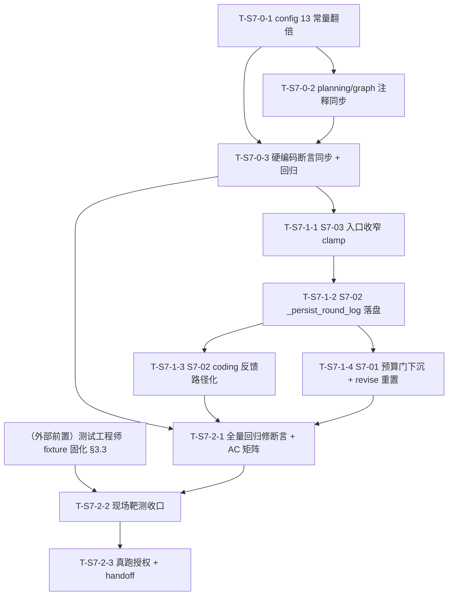
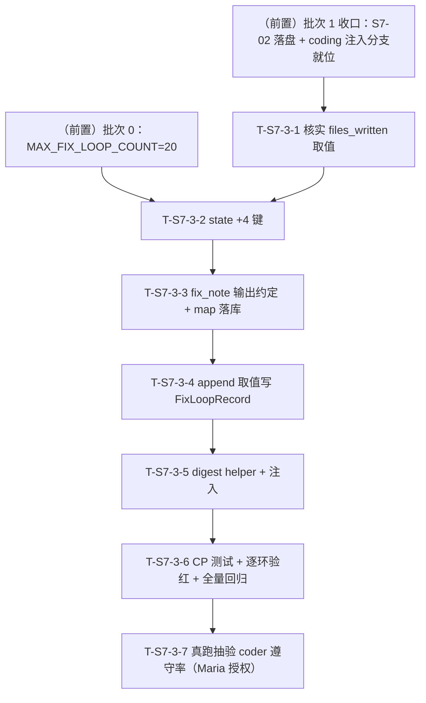
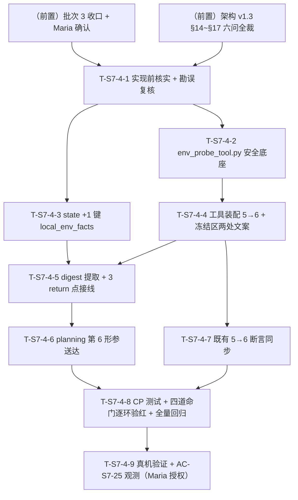

# Sprint 7 开发计划

**产品名称**：Auto-Reproduction —— 论文自动复现系统
**Sprint**：Sprint 7 —— 修复循环失控治理族：山穷水尽不问人（S7-01）、烧过头拦不住（S7-03）、coder 看不到真报错（S7-02）
**版本**：v1.0
**日期**：2026-07-19
**作者**：全栈开发工程师代理
**状态**：草案（待 Maria 审阅后逐批授权执行）
**对应 PRD**：`docs/sprint7/prd.md` v0.3（S7-01 P0 含 13 常量翻倍 / S7-02 P1 / S7-03 P1；AC-S7-01~08；A-S7-1~7；Q-S7-1~6）
**对应架构**：`docs/sprint7/architecture.md` v1.0（Q-S7-1~6 六项技术裁决 + 三需求文件级落点 + §7 变更总表 + §8 收口顺序 + §9 测试点 + §10 风险 R-S7-1~7 + §11 假设 AA-S7-1~7 + §12 AC 映射）
**体例参照**：`docs/sprint6/dev-plan.md` v1.0

> **本计划性质**：忠实落地 PRD v0.3 + 架构 v1.0，不重新决策、不改设计。所有取值/落点/顺序均取自架构定稿。批次划分严格按架构 §8 收口顺序。**批次边界逐批确认制**：每批收口门后停手，等 Maria 确认再开下一批。

---

## 0. 全局纪律（贯穿所有任务，不再逐项复述）

> 沿 sp5/sp6 教训与 PRD/架构红线，开工前逐条对照。

1. **回归现场样本只读勿动**：`checkpoints.db`（99MB，`task-99eef17bccf2` 现场所在真库——预算耗尽静默降级 + import 反复失败 + 烧 92 超 60 三缺陷同现场）**只读，任何任务不得写入 / 清理 / 重命名**。一切测试消费走 `tests/fixtures/checkpoints_s7_99eef17bccf2.db` 字节副本（**复制不移动**，源库 md5 前后逐一 MATCH，架构 §9.1 / sp6 §3.4 范式）。该 fixture **当前尚不存在**，须测试工程师在批次 2 靶测前固化（批次 2 前置门，见 §3.3）。
2. **测试命令口径**：`.venv/bin/pytest`（裸 `pytest` 不在 PATH；全量非 e2e 回归 = `.venv/bin/pytest -q -m "not e2e"`）。零退化基线以 **sp6 收官 1951 绿**（+1 预存在浏览器 flaky `test_e2e_code_only`）为准，批次 0 开工前主控实测一次落档，后续各批次收口对照。
3. **真跑授权红线**：一切耗 deepxiv 配额 / 真实 LLM 的动作（现场同构真实 e2e 抽验）**须 Maria 明确授权具体动作**，统一归集到批次 2 任务 T-S7-2-3，**合并为一次授权动作省配额**；mock 优先守门、smoke fail-fast、`task-99eef17bccf2` 为天然 fixture 勿清理。
4. **架构贯穿硬约束（红线，dev-plan 显式列为约束，任一任务不得破）**：
   - **零 GlobalState 字段新增/变更**；
   - **零 ExecutionResult 字段新增/变更**；
   - **零 interrupt#2 payload 键新增/变更**（面板键集合逐字冻结）；
   - **不新增 interrupt 种类**（三类封口：planning#1 / dev_loop#2 / user_input#3）；
   - **不加"追加预算"第四态**（interrupt#2 恰三态：terminate / revise_plan / export_code）；
   - **保 S-1 重跑幂等契约**（`_has_committed_result_for_round` guard，sandbox 不重跑）；
   - **成本硬上限对齐翻倍新值 240 / 120 绝不突破**；
   - **`execution_monitor.py` 本 Sprint 零改**（面板文案走 `replace(feedback, ...)` 数据通道，渲染逻辑不动）；
   - **不改 `core/react_base.py`**（S7-03 走入口收窄，不侵入通用子图）；
   - **不改 `_dev_loop_llm_calls` 计量口径**（S7-03 只收窄 max_rounds，累加埋点一字不动）；
   - **断言只换不弱化**（翻倍改被断言的常量值/等式两边数字，不弱化断言强度）；
   - **最小单一抽象**（不新造观测管道 / 不新增工具 / 不新增模块）。
5. **本 Sprint 架构级红利**：**GlobalState / ExecutionResult / interrupt#2 payload 键结构零新增字段**——`task-99eef17bccf2` 旧 checkpoint 与全部新代码天然相容，可用真库副本直接驱动 S7-01/02/03 全部回归靶。
6. **execution.py 单收口窗口令（架构 §8 批次 1）**：`core/nodes/execution.py` 被 S7-01/S7-02/S7-03 共同触碰（预算门判定 / 落盘反馈 / 子上限收窄），**收敛批次 1 一次改写，主控收口令**。窗口内子任务顺序严格 **S7-03 → S7-02 → S7-01**（架构 §8：一处 clamp 最小先落 → 落盘 helper 跨两文件 → 收尾判定重构改动最深最后落，避免与 S7-02 主流程接线互扰）。**函数级不重叠已坐实**（S7-03 在子图装配层 `_run_execution_agent`、S7-02 在落盘 helper + 主流程步骤 5-6 间、S7-01 在收尾判定 `_maybe_interrupt_or_return`），并行子代理不得直接改此文件，主控按序串行合入。
7. **Prompt Cache 纪律（R-PC4 无扰，写进注意事项）**：
   - **S7-03 收窄不进 HumanMessage**：`_build_execution_agent_context` 里的 `max_rounds` 数字保持联动值 `_effective_max_rounds(plan)`（plan 确定性产出，不随 `dev_calls` 抖动），收窄只作用于子图 `max_rounds` 护栏，agent 无需感知（架构 §6.2 / AA-S7-6）。
   - **日志文件名用确定性 `fix_loop_count` 不用时间戳/uuid**（架构 §5.3）：`round_{fix_loop_count}.log`，Prompt Cache 无扰、可复现、coder 可从 `fix_round` 反推文件名。
   - 本 Sprint **不触碰任何稳定前缀 / 工具 docstring**（S7-02 复用现有 `read_code_file` docstring 零改动；S7-01 面板文案走数据通道非 prompt）。
8. **批次边界逐批确认制**：每批收口门后停手，等 Maria 确认再开下一批；对某批的授权 ≠ 对后续批次的授权；耗配额 / 不可逆动作仍需单独授权。

---

## 1. 概述

### 1.1 Sprint 目标

Sprint 7 针对 `task-99eef17bccf2` 现场坐实的"修复循环反复失败时三个失控点"，作为一个治理族一次性收敛：

- **不失控之一 · 山穷水尽要问人（S7-01，P0）**：入口预算门（`execution.py:2029-2030`）在 `budget < DEV_LOOP_MIN_CALLS_PER_ROUND` 时反向绕过 interrupt#2、直接静默降级出报告（实测 `user_fix_decision=None` 用户从不被问）。修法=**预算门下沉为修复分支准入否决条件**（删降级 return + and 子句 + reason 分支），预算耗尽自动落既有两段式 interrupt#2 通道问用户；配套 **13 个预算常量全翻倍**（给余量、不替代升级）；revise_plan 分支补预算全额重置（补语义缝隙）。
- **不失控之二 · 想拦要拦得住（S7-03，P1）**：`MAX_DEV_LOOP_LLM_CALLS` 子上限只在轮边界检查，单轮 ReAct 子图一口气烧（实测 92 超 60 达 32）。修法=**`_run_execution_agent` 入口收窄本轮 `max_rounds = min(联动值, 剩余子预算)` 保底 1**，复用现成 `budget_check_node` 刹车，越界上界确定性 ≤ force_finish 1 轮 + metrics 抽取额度。
- **不失控之三 · 给 agent 看真相（S7-02，P1）**：coder 修复反馈全程看不到真报错（`stderr_tail` 取到后续成功步 stdout、`representative_stderr` 恒空，`No module named 'src'` 出现 831 次）——信息链路 bug。修法=**execution 每轮完整日志落盘 `<code_output_dir>/exec_logs/round_{n}.log`（错误优先编排）+ coding 反馈 `stderr_tail` 换成日志文件路径指引 + coder 用现有 `read_code_file` 自读**。

### 1.2 范围对齐

- **PRD 权威**：3 项需求 S7-01~03 + AC-S7-01~08 + 非目标（不做差异化降级标注体系 / 不改预算计量口径 / 不做撤销通道 / 不加第四态 / 不改 coder 修复策略 prompt / 不新造观测管道 / 不改 REACT_MAX_ROUNDS_* 轮次语义 / 不追求零越界 / 附B 验证门升级已砍不做）。
- **架构权威**：Q-S7-1~6 六项裁决全部落地为可执行设计（复用三态不加第四态 / 预算门下沉复用两段式 / 13 常量翻倍派生依赖已核 / 面板文案 replace 范式 / 日志落盘 + read_code_file 自读 + 错误优先编排应对 8000 截断 / 入口收窄 max_rounds），**本计划不重新决策**。
- **新增模块**：**0 个新 .py 模块**（S7-02 新增运行期目录 `<code_output_dir>/exec_logs/`，进 .gitignore；`_persist_round_log` 为 execution.py 内新纯函数）。
- **零 breaking**：无 state / ExecutionResult / interrupt payload 契约变更；旧 checkpoint 直接可被新代码消费。

### 1.3 关键风险一句话

**批次 1 `execution.py` 单收口窗口是 sp7 回归风险全 Sprint 最高点**（架构 R-S7-7 + R-S7-1）：S7-01 预算门下沉（实现 1）直接改写 `_maybe_interrupt_or_return` 的修复分支准入与 reason 链，误伤既有"预算充足失败"路由或破坏 self-loop 两段式即引入死锁 / 幂等退化。缓解=**收敛一批一次改写 + 主控收口令 + 子任务顺序 S7-03→S7-02→S7-01 + 现场靶 + 对照用例（预算充足/耗尽两分支各验路由）**。其次 AC-S7-05/07/08 三项**须验红**（沿 sp6 AC-S6-10 假绿转正教训：文件路径写了但反馈没真指过去 / 收窄没生效但常规 mock 假绿），注掉对应改动断言必须变红。

### 1.4 容量裁剪线（超限时依序执行）

若进度吃紧，按以下顺序顺延（**P0 载体不可裁**：批次 0 翻倍 + 批次 1 的 S7-01 是治理族主线，缺一环用户仍不被问）：

1. **先降 S7-02 规模**：保"完整日志落盘 + 反馈传路径 + coder 自读"（AC-S7-05/07），"错误优先编排应对 8000 截断"（R-S7-3 缓解）可降级为"单轮日志通常 < 8000 整读即可"先交、编排 helper 顺延；
2. **再降 S7-03 规模**：保入口收窄 clamp（AC-S7-08），越界上界精确度量（§6.3 metrics 额度）顺延为粗断言；
3. **S7-01 与翻倍不可降**（P0 主线）。

---

## 2. 任务清单总表

| 任务编号 | 承载需求 | 任务名 | 产出文件 | 依赖前置 | 估时 | 风险 |
|---|---|---|---|---|---|---|
| **T-S7-0-1** | S7-01 翻倍 | 13 常量翻倍 + 4 处注释同步 | `config.py` | 无 | 2h | 中（联动等式命门） |
| **T-S7-0-2** | S7-01 翻倍 | 3 处外部注释同步（planning.py / graph.py） | `core/nodes/planning.py` + `core/graph.py` | 无 | 0.5h | 低 |
| **T-S7-0-3** | S7-01 翻倍 | 十几处硬编码断言同步（只换不弱化）+ 全量回归 | `tests/`（§3.4 清单） | T-S7-0-1/0-2 | 4h | 中（回归面广 R-S7-6） |
| **T-S7-1-1** | S7-03 | `_run_execution_agent` 入口收窄 max_rounds clamp | `core/nodes/execution.py` | 批次 0 | 2h | 中（越界上界 + R-PC4） |
| **T-S7-1-2** | S7-02 | `_persist_round_log` 落盘 + 错误优先编排 + 主流程接线 | `core/nodes/execution.py` | T-S7-1-1（同文件串行） | 4h | 高（8000 截断 R-S7-3 + 落盘兜底 R-S7-4） |
| **T-S7-1-3** | S7-02 | coding 反馈 `log_file_path` 子键 + `stderr_tail` 指引化 | `core/nodes/coding.py` | T-S7-1-2 | 2.5h | 中（路径确定性推导 + AC-S7-07 验红） |
| **T-S7-1-4** | S7-01 | 预算门下沉 + reason 链 + `_BUDGET_EXHAUSTED_SUMMARY` + revise 预算重置 | `core/nodes/execution.py` | T-S7-1-2（同文件串行，改动最深最后落） | 5h | 高（死锁命门 R-S7-1 + 两段式幂等 R-S7-7） |
| **T-S7-2-1** | 回归 | 全量回归修断言收口 + AC-S7-01~08 覆盖矩阵审计 | `tests/`（§9.2 逐 AC） | 批次 0~1 | 5h | 中 |
| **T-S7-2-2** | 验收 | 现场靶测收口（`checkpoints_s7_99eef17bccf2.db` 三缺陷驱动） | `tests/test_sprint7_*` | T-S7-2-1 + 前置门 fixture 固化 | 4h | 中 |
| **T-S7-2-3** | 验收 | **真跑项（Maria 授权点）**：现场同构真实 e2e 抽验 + handoff | `docs/sprint7/test-reports/` + handoff | T-S7-2-2 | 4h | 中 |

**任务总数**：9 个（批次 0×3 + 批次 1×4 + 批次 2×3）。
**批次数**：3（批次 0 翻倍 / 批次 1 execution.py 单收口窗口 / 批次 2 收口）。
**检查点总数**：CP 约 32 个（分布见各批次任务，收口批次 2 三 CP 为总闸门）。
**总估时**：**~33h**（批次 0：6.5h / 批次 1：13.5h / 批次 2：13h）。若容量吃紧按 §1.4 裁剪线执行。

---

## 3. 批次划分与依赖图

### 3.1 批次总览（= 架构 §8 权威收口顺序）

| 批次 | 名称 | 任务 | 前置条件 | AC 映射 | 特殊标注 |
|---|---|---|---|---|---|
| **0** | 翻倍批（独立先行） | T-S7-0-1 → 0-2 → 0-3 | 无（config.py 独占，不碰 execution.py） | AC-S7-06 | **为后续所有批提供正确常量基线**（S7-03 收窄读 `MAX_DEV_LOOP_LLM_CALLS`、S7-01 revise 重置读 `MAX_TOTAL_LLM_CALLS`）；断言只换不弱化 |
| **1** | execution.py 单收口窗口 | T-S7-1-1 → 1-2 → 1-3 → 1-4 | 批次 0（正确常量基线） | AC-S7-01/02/03/04/05/07/08 | **execution.py 被三需求共触碰，收敛一批一次改写，主控收口令；子任务顺序 S7-03→S7-02→S7-01**（架构 §8）；AC-S7-05/07/08 须验红 |
| **2** | 收口 | T-S7-2-1 → 2-2 → 2-3 | 批次 0~1 全部 | AC-S7-01~08 全覆盖 + sp6 基线 1951 回归全绿 | **现场靶测（`checkpoints_s7_99eef17bccf2.db`）+ 真跑项合并一次 Maria 授权窗口省配额**；批次 2 前置门 = fixture 固化（§3.3） |

### 3.2 依赖关系图（Mermaid）



**关键路径**：翻倍批（config 常量基线）→ T-S7-1-1（S7-03 收窄）→ T-S7-1-2（S7-02 落盘，S7-03 之后先落）→ T-S7-1-4（S7-01 预算门下沉，改动最深最后落）→ T-S7-2-1 → 2-2 → 2-3。批次 0 三任务线性（注释同步依赖常量值定、断言同步依赖两者）；**批次 1 execution.py 四子任务全部串行（同文件单收口窗口，不并行）**，顺序 S7-03→S7-02→S7-01（其中 T-S7-1-3 coding.py 反馈随 S7-02 同改）。

### 3.3 批次 2 前置门（外部依赖，显式声明）

**测试工程师须在 T-S7-2-2 靶测验收前完成现场样本 fixture 固化**（架构 §9.1 / sp6 §3.4 复制不移动）：

- `tests/fixtures/checkpoints_s7_99eef17bccf2.db`：`task-99eef17bccf2` 真库字节副本——S7-01/02/03 天然 fixture：`retry_budget_remaining=0`（S7-01 预算耗尽靶）/ `execution_result.success=False` / `_dev_loop_llm_calls=92`（S7-03 冲过头靶）/ `fix_loop_history` 4 条全 `category=import` / `logs` 含 `No module named 'src'`（S7-02 真报错靶）/ `user_fix_decision=None`。

> **当前状态确认**：该 fixture **尚不存在**（`tests/fixtures/` 现只有 sp6 三 db）；源库 `checkpoints.db`（99MB）在仓库根、`task-99eef17bccf2` 现场在其中。固化须走 sp6 §3.4"复制不移动"范式：源库 md5 前后逐一 MATCH，原库零字节零元数据变动（只读连接会重建 -shm/-wal 属 WAL 正常行为，非损伤——用 `?mode=ro` URI 打开或先 `cp` 再验 md5）。fixture 未就绪时批次 1 开发可先行（临时以只读原库路径本地冒烟），但 **T-S7-2-2 靶测断言必须以固化 fixture 跑**（软前置门语义）。

### 3.4 翻倍批硬编码断言同步面（AC-S7-06，架构 §3.4 清单）

翻倍打破的硬编码断言分布（架构 Grep 坐实，重点文件）——纪律沿 sp5/sp6"断言只换不弱化"（改的是被断言的常量值 120→240 等与联动等式两边数字，**不弱化**等式/类型/强约束断言强度）：

- `tests/test_sprint3_a1.py`（35 处含 config 断言）
- `tests/test_sprint3_a_boundary.py`
- `tests/test_sprint5_t11_config.py`（18 处）
- `tests/test_sprint5_t25_budget_link.py`（联动公式断言：`CAP == DEV_LOOP/2`、`DEV_LOOP < TOTAL`）
- `tests/test_sprint4_e3.py`
- `tests/test_sprint3_e2*.py`（预算扣减断言）
- `tests/test_sprint2_a4.py`

> **实测同步面以 T-S7-0-3 开工时 `grep -rn` 精确清点为准**（架构清单为"重点文件"非穷举，全量回归零失败即闭合账目）。

---

## 4. 批次 0：翻倍批（独立先行，config.py 独占）

> **前置条件**：无（config.py 独占，不碰 execution.py，与批次 1 解耦）。
> **产出**：13 常量翻倍值 + 4 处 config 注释同步 + 3 处外部注释同步 + 十几处硬编码断言同步 + 全量回归零失败。为后续所有批提供正确常量基线。
> **文件边界**：`config.py` 独占（T-S7-0-1）；`planning.py`/`graph.py` 注释（T-S7-0-2）；`tests/`（T-S7-0-3）。**零逻辑改动**——翻倍是纯参数批。

### 任务 T-S7-0-1：config 13 常量翻倍 + config 内注释同步（S7-01 翻倍，架构 §3.1/§3.3）

- **产出文件**：`config.py`（13 常量值 + 4 处注释同步）
- **依赖项**：无
- **预计复杂度**：中（2h，联动等式命门）
- **架构参考**：architecture §3.1 逐常量表 + §3.2 联动验证 + §3.3 注释同步 + AC-S7-06

**需要实现的内容**（值取架构 §3.1 表，不自创）：

1. 13 常量翻倍（现值→新值，落点行号）：

| 常量 | config.py 落点 | 现→新 | 备注 |
|---|---|---|---|
| `MAX_TOTAL_LLM_CALLS` | :31 | 120→**240** | 全局硬上限 |
| `MAX_DEV_LOOP_LLM_CALLS` | :114 | 60→**120** | 修复循环子预算天花板（仍须 < TOTAL） |
| `MAX_NODE_LLM_CALLS` | :30 | 10→**20** | 单节点上限 |
| `MAX_FIX_LOOP_COUNT` | :32 | 10→**20** | 修复回合次数上限 |
| `DEV_LOOP_MIN_CALLS_PER_ROUND` | :115 | 2→**4** | 入口预算门阈值（S7-01 判定基准） |
| `REACT_MAX_ROUNDS_EXECUTION_CAP` | :143 | 30→**60** | 联动公式 = `MAX_DEV_LOOP_LLM_CALLS/2` = 120/2 |
| `REACT_MAX_ROUNDS_PAPER_INTAKE` | :58 | 5→**10** | |
| `REACT_MAX_ROUNDS_PAPER_ANALYSIS` | :59 | 12→**24** | |
| `REACT_MAX_ROUNDS_RESOURCE_SCOUT` | :66 | 10→**20** | |
| `REACT_MAX_ROUNDS_PLANNING` | :67 | 8→**16** | |
| `REACT_MAX_ROUNDS_CODING` | :116 | 12→**24** | |
| `REACT_MAX_ROUNDS_EXECUTION`（FLOOR） | :131 | 10→**20** | 预算联动公式下限 |
| `REACT_EXECUTION_ROUNDS_MARGIN`（K） | :142 | 5→**10** | 联动 K 裕量 |

2. **联动公式不变、翻倍后须成立**（架构 §3.2，AC-S7-06 守门）：`REACT_MAX_ROUNDS_EXECUTION_CAP == MAX_DEV_LOOP_LLM_CALLS / 2`（60 == 120/2）；`MAX_DEV_LOOP_LLM_CALLS < MAX_TOTAL_LLM_CALLS`（120 < 240）；`FLOOR <= CAP`（20 <= 60）——不得只翻一边破坏联动。
3. **4 处 config 内注释同步**（非逻辑，防误导后人，架构 §3.3）：`:112` 注释"60 < 120"→"120 < 240"；`:114` 注释"强约束 < MAX_TOTAL_LLM_CALLS=120"→"=240"；`:143` 注释"= MAX_DEV_LOOP_LLM_CALLS/2 = 60/2"→"= 120/2"；`:142` 注释若含旧值同步（K 裕量说明"prepare 1 + 收尾 1 + 兜底 3"随语义保持，量级说明可留）。
4. **零逻辑改动**——所有下游读常量自动传导（`state.py:340` `retry_budget_remaining=MAX_TOTAL_LLM_CALLS` 初值、planning payload 展示、面板分母、S7-01 revise 重置、S7-03 收窄公式均读常量，架构 §3.1 已逐条核派生依赖，无隐式比例依赖被打破）。

**自测检查点**：
- [ ] CP-0.1-1 13 常量值断言：逐个断言翻倍新值（`MAX_TOTAL_LLM_CALLS==240` / `MAX_DEV_LOOP_LLM_CALLS==120` / `MAX_NODE_LLM_CALLS==20` / `MAX_FIX_LOOP_COUNT==20` / `DEV_LOOP_MIN_CALLS_PER_ROUND==4` / `CAP==60` / 各节点轮次翻倍值），类型仍 int/Path（AC-S7-06 常量面）
- [ ] CP-0.1-2 **联动等式 + 强约束断言**：`REACT_MAX_ROUNDS_EXECUTION_CAP == MAX_DEV_LOOP_LLM_CALLS // 2`（60==60）；`MAX_DEV_LOOP_LLM_CALLS < MAX_TOTAL_LLM_CALLS`；`REACT_MAX_ROUNDS_EXECUTION <= REACT_MAX_ROUNDS_EXECUTION_CAP`（AC-S7-06 联动面）
- [ ] CP-0.1-3 config 内 4 处注释无旧值字面残留（`grep "60 < 120"` / `"=120"` / `"60/2"` 在 config.py 相关行零命中）

### 任务 T-S7-0-2：planning / graph 外部注释同步（S7-01 翻倍，架构 §3.3）

- **产出文件**：`core/nodes/planning.py`（:11 与 :881 注释）+ `core/graph.py`（:73 核对）
- **依赖项**：无
- **预计复杂度**：低（0.5h）
- **架构参考**：architecture §3.3 注释同步

**需要实现的内容**：

1. `planning.py:11` 注释"任务级兜底依赖 MAX_TOTAL_LLM_CALLS=120"→"=240"；
2. `planning.py:881` 注释"`# =120；总预算参考`"→"`# =240；总预算参考`"（该行逻辑读常量 `MAX_TOTAL_LLM_CALLS` 自动对齐，只改注释字面）；
3. `graph.py:73` **核对**：架构 §3.3 列此行为"MAX_TOTAL_LLM_CALLS=120"注释同步项，但**实测该行内容为 `MAX_TOTAL_LLM_CALLS 总预算 + cancel 主动出口三重自然兜底`，不含 "=120" 字面**（见 §14 落点勘误 P-1）——**无需改**，仅确认无旧值字面残留即可。

**自测检查点**：
- [ ] CP-0.2-1 `planning.py` 无 "=120" 旧值注释残留（`grep "=120" core/nodes/planning.py` 零命中）；`graph.py:73` 确认无旧值字面（勘误 P-1 已核）
- [ ] CP-0.2-2 planning payload `max_total_llm_calls` 值随常量翻倍为 240（读常量自动传导，非注释）

### 任务 T-S7-0-3：硬编码断言同步 + 全量回归（S7-01 翻倍，架构 §3.4）

- **产出文件**：`tests/`（§3.4 清单逐文件，只换不弱化）
- **依赖项**：T-S7-0-1 + T-S7-0-2
- **预计复杂度**：中（4h，回归面广 R-S7-6）
- **架构参考**：architecture §3.4 断言同步面 + §10/R-S7-6 + AC-S7-06

**需要实现的内容**：

1. 开工先 `grep -rn "== 120\|== 60\|== 30\|MAX_TOTAL_LLM_CALLS\|MAX_DEV_LOOP_LLM_CALLS\|REACT_MAX_ROUNDS_EXECUTION_CAP\|DEV_LOOP_MIN_CALLS_PER_ROUND\|MAX_FIX_LOOP_COUNT\|MAX_NODE_LLM_CALLS" tests/` 精确清点全部硬编码断言（架构 §3.4 为重点文件非穷举）；
2. 逐处将被断言的常量值/联动等式两边数字改为翻倍新值——**只换数字，不弱化断言强度**（等式断言仍是等式、强约束仍是不等式、类型断言保留）；重点文件：`test_sprint3_a1.py`（35 处）、`test_sprint3_a_boundary.py`、`test_sprint5_t11_config.py`（18 处）、`test_sprint5_t25_budget_link.py`（联动公式）、`test_sprint4_e3.py`、`test_sprint3_e2*.py`（预算扣减）、`test_sprint2_a4.py`；
3. 预算扣减类断言（如"扣减 N 次后余量 = TOTAL - N"）：常量翻倍后基数变化，同步基数不改扣减逻辑断言；
4. 全量非 e2e 回归零失败（账目精确闭合）。

**自测检查点**：
- [ ] CP-0.3-1 §3.4 清单逐文件断言同步完成（`grep -rn` 精确清点，无遗漏旧值断言）
- [ ] CP-0.3-2 联动公式断言用例（`test_sprint5_t25_budget_link.py`）翻倍后仍绿：`CAP == DEV_LOOP//2` / `DEV_LOOP < TOTAL` 等式两边数字同步为 60==120//2 / 120<240
- [ ] CP-0.3-3 **全量非 e2e 回归 `.venv/bin/pytest -q -m "not e2e"` 相对 sp6 基线 1951 零退化零失败**（翻倍断言同步毕，账目闭合，AC-S7-06 回归面）

> **批次 0 收口门**：CP-0.1~0.3 全绿 + 全量非 e2e 回归零失败（AC-S7-06 达标）。**停手等 Maria 确认再开批次 1。**

---

## 5. 批次 1：execution.py 单收口窗口（全 Sprint 最高回归风险）

> **前置条件**：批次 0（正确常量基线——S7-03 收窄读 `MAX_DEV_LOOP_LLM_CALLS=120`、S7-01 revise 重置读 `MAX_TOTAL_LLM_CALLS=240`）。
> **产出**：S7-03 入口收窄刹车 + S7-02 完整日志落盘 + 反馈路径化 + coder 自读 + S7-01 预算门下沉 interrupt#2 + revise 预算重置。
> **文件边界**：`core/nodes/execution.py`（**单收口窗口，四子任务一次串行改写，主控收口令**）+ `core/nodes/coding.py`（S7-02 反馈半边，随 T-S7-1-3）。**子任务顺序严格 S7-03→S7-02→S7-01**（架构 §8）。
> **红线**：零 state / 零 ExecutionResult / 零 interrupt payload 键 / 不改 react_base / 不改计量口径 / 不加第四态 / 不新增 interrupt 种类 / execution_monitor.py 零改 / 成本硬上限 240/120 不破 / 保 S-1 幂等 / R-PC4 无扰（架构 §8）。

### 任务 T-S7-1-1：S7-03 入口收窄 max_rounds clamp（S7-03，架构 §6.2）

- **产出文件**：`core/nodes/execution.py`（`_run_execution_agent` 的 `effective_max_rounds` 计算处，:1348）
- **依赖项**：批次 0
- **预计复杂度**：中（2h，越界上界 + R-PC4）
- **架构参考**：architecture §6.2 入口收窄 + §6.3 越界上界 + §6.4 三重护栏协同 + §10/R-S7-5 + AC-S7-08

**需要实现的内容**（架构 §6.2 给定，一处 clamp）：

1. `_run_execution_agent` 内 :1348 现 `effective_max_rounds = _effective_max_rounds(plan)` 改为：
   ```python
   base_rounds = _effective_max_rounds(plan)                          # 联动公式，不变
   dev_calls_so_far = state.get("_dev_loop_llm_calls", 0) or 0
   remaining_sub_budget = max(0, MAX_DEV_LOOP_LLM_CALLS - dev_calls_so_far)
   # 本轮子图轮次上限 = min(联动值, 剩余子预算)，保底 1 轮（防 0 轮死锁/退化，R-S7-5）
   effective_max_rounds = max(1, min(base_rounds, remaining_sub_budget))
   ```
2. **收窄值只喂子图护栏**（:1353 `create_react_subgraph(max_rounds=effective_max_rounds)` + :1359 ReActState `max_rounds`）；
3. **R-PC4 无扰红线**：`_build_execution_agent_context`（:1341 已构造、内部经 `_effective_max_rounds(plan)`）里 HumanMessage 的 `max_rounds` 数字**保持联动值不收窄**——它是给 agent 的"计划轮次预期"，收窄是 agent 无需感知的系统级护栏；两者语义不同不强制一致（架构 §6.2 / AA-S7-6）。**注意**：context 在 :1341 构造（早于 :1348 收窄），本身就不受收窄影响，务必保持此隔离，不得把收窄值回灌 context；
4. **零改计量口径**（`_dev_loop_llm_calls` 累加 :1828 `_map_execution_result` 一字不动）、**零 react_base 改动**（复用现成 `budget_check_node` :621-629 刹车）、**零 config 常量新增**、**零 state 字段**。

**自测检查点**：
- [ ] CP-1.1-1 **收窄逻辑单测**（AC-S7-08）：构造 `_dev_loop_llm_calls=118`（逼近 120）+ 联动值 60 的 state → 断言 `_run_execution_agent` 收窄后 `effective_max_rounds == max(1, min(60, 120-118)) == 2`；`dev_calls_so_far=0` → `min(60, 120) == 60`（不逼近时无收窄，退回联动值）
- [ ] CP-1.1-2 **保底 1 轮**（R-S7-5）：`_dev_loop_llm_calls=120`（已触顶）→ `remaining_sub_budget=0` → `max(1, min(60,0)) == 1`（不退化为 0 轮死锁）
- [ ] CP-1.1-3 **越界上界断言**（AC-S7-08）：构造"单轮内高频调用"场景，断言总冲过头幅度 ≤ force_finish 1 轮 + metrics 抽取额度（确定性小值，远小于实测 32）
- [ ] CP-1.1-4 **R-PC4 无扰**：截取两个不同 `_dev_loop_llm_calls` 值下的 execution HumanMessage，`max_rounds` 数字保持联动值恒定（不随 dev_calls 抖动）——收窄未污染 context 通道
- [ ] CP-1.1-5 **须验红**（沿 sp6 教训）：注掉收窄 clamp 后，CP-1.1-1 断言 `effective_max_rounds` 回到 60、CP-1.1-3 越界回到数十级 → 断言必须变红

### 任务 T-S7-1-2：S7-02 `_persist_round_log` 落盘 + 主流程接线（S7-02，架构 §5.3）

- **产出文件**：`core/nodes/execution.py`（新纯函数 `_persist_round_log` + 错误优先编排 helper + 主流程 2210-2214 区间接线）
- **依赖项**：T-S7-1-1（同文件串行）
- **预计复杂度**：高（4h，8000 截断 R-S7-3 + 落盘兜底 R-S7-4）
- **架构参考**：architecture §5.1/§5.2/§5.3 + §10/R-S7-3/R-S7-4 + AC-S7-05

**需要实现的内容**（架构 §5.3 给定）：

1. **新纯函数 `_persist_round_log(work_dir, fix_count, prep, run_results)`**（落盘，非污染 state）：
   - **位置**：`<code_output_dir>/exec_logs/`（code_output_dir 在 WORKSPACE_DIR 之下，`read_code_file` 天然可读，架构 §5.1 已坐实无需工具微调）；
   - **命名**：`round_{fix_loop_count}.log`（`fix_loop_count` 确定性编号，首跑=0，第 N 次修复回合=N；**不用时间戳/uuid**，Prompt Cache 无扰、coder 可从 `fix_round` 反推，架构 §5.3）；
   - **内容 = 完整日志**：`_aggregate_logs(prep, run_results)`（:1669-1691）的**未截断原文**（install_log + 各步 stdout/stderr），用 **mask 后**口径（与 `execution_result.logs` 同脱敏级别 :1744，coder 读到的日志不泄凭证）；
2. **错误优先编排 helper**（应对 `read_code_file` 8000 截断，R-S7-3）：文件头部先写"错误摘要区"——非零 exit 步骤的 `[step#i exit=N cmd=...]` + 其 stderr 段前置到文件头；随后完整时序日志。**保证真报错行（stderr / `No module named` 类）落在文件头 8000 字符内**，coder 整读一次即命中；
3. **主流程接线**：在 `_build_execution_result`（:2204-2210）之后、`_map_execution_result`（:2214）之前的 2210-2214 区间调 `_persist_round_log`（架构 §5.3）——确保只在真跑回合落盘（guard 命中路径本就不重跑 sandbox、不重落，日志已在上一次真跑回合落盘）；
4. **落盘异常兜底（R-S7-4）**：写文件失败（IO/越界）**不阻断节点**——try/except 兜底，失败时不炸（沿 coding gate 工具兜底范式）；日志路径由 §5.4 确定性推导（不存 state），落盘失败时确定性路径指向不存在文件，coder read 到"文件不存在"退回 `errors` 摘要（降级到 sp6 现状，可接受）；
5. **不改 `TOOL_RESULT_MAX_LENGTH=8000`**（全局 ReAct 工具结果护栏，改它影响面过大违反最小设计，架构 §5.2）。
6. **红线**：零 state 字段、零 ExecutionResult 字段（路径确定性推导不存）、零工具改动、零新增工具。

**自测检查点**：
- [ ] CP-1.2-1 `_persist_round_log` 落盘：构造 import 失败现场（含 `No module named 'src'` 的 run_results）→ 断言 `<code_output_dir>/exec_logs/round_{n}.log` 存在且内容含真报错行（AC-S7-05 落盘面）
- [ ] CP-1.2-2 **错误优先编排**（R-S7-3）：断言真报错行落在文件头 **8000 字符内**（模拟尾部为成功步 stdout 的现场，验前置有效）
- [ ] CP-1.2-3 命名确定性：`fix_loop_count=0` → `round_0.log`；`=2` → `round_2.log`（无时间戳/uuid，R-PC4 无扰）
- [ ] CP-1.2-4 mask 口径一致：落盘内容与 `execution_result.logs` 同脱敏级别（凭证不泄）
- [ ] CP-1.2-5 **落盘兜底不炸**（R-S7-4）：模拟写文件 IO 失败（如目录不可写）→ `_persist_round_log` try/except 兜底，节点不阻断（execution 主流程继续）
- [ ] CP-1.2-6 guard 命中路径不重落：self-loop 重入（`already_committed=True`）路径不触发 `_persist_round_log`（sandbox 不重跑、日志上轮已落）

### 任务 T-S7-1-3：S7-02 coding 反馈路径化（S7-02，架构 §5.4）

- **产出文件**：`core/nodes/coding.py`（`_digest_execution_feedback` 返回增 `log_file_path` 子键 + `stderr_tail` 改指引串，:233-265；由 `_resolve_code_output_dir`+`fix_round` 拼路径）
- **依赖项**：T-S7-1-2
- **预计复杂度**：中（2.5h，路径确定性推导 + AC-S7-07 验红）
- **架构参考**：architecture §5.4 反馈落点 + §5.5 representative_stderr 处置 + AC-S7-05/07

**需要实现的内容**（架构 §5.4 给定）：

1. `_digest_execution_feedback` 返回 dict **新增 `log_file_path` 子键**（完整日志入口，绝对路径 or None），**保留 `error_category`**（快速提示，PRD §2.3.2 要求），**`stderr_tail` 语义改为退化指引串**（非删键——删键会打破既有 coding prompt/context 对该键引用与测试面）：
   ```python
   return {
       "errors": [...],                    # 保留（摘要级）
       "error_category": error_category,   # 保留（快速提示）
       "log_file_path": <round_{n}.log 绝对路径 or None>,   # 新增：完整日志入口
       "stderr_tail": "完整日志见 log_file_path，请用 read_code_file 自读",  # 语义改为指引，不含 logs 内容
   }
   ```
2. **路径确定性推导（零 state 字段，架构 §5.4 / AA-S7-4）**：`log_file_path` 由 coding.py 侧已有的 `_resolve_code_output_dir(state)`（:305/:351）+ `fix_round`（:327 `fix_count`）拼出 `<code_output_dir>/exec_logs/round_{fix_round}.log`——**不从 exec_result 读路径字段、不存 state/ExecutionResult**；
3. `_digest_execution_feedback` 当前签名为 `(exec_result)`——路径推导需 code_output_dir + fix_round（来自 state / 调用点 :328 已有 `fix_count`）：最小改法是在调用点 :328 传入已解析的 code_output_dir + fix_round，或函数内接受额外参；**保持 `last_error_summary` 键结构稳定**（Prompt Cache 无扰）；
4. **不填充/不删 `representative_stderr`**（架构 §5.5：sp4 遗留字段、恒空、人向面板读它，S7-02 不触碰——它与 coder agent 向链路正交，保 payload 键结构冻结）；
5. **execution 侧修复反馈维持 stderr_tail 尾部不改路径**（架构 §5.4 末 / AA-S7-3：execution agent 工具无 `read_code_file`，改路径反使其更瞎；S7-02 只作用于 coding 反馈链路——PRD §0.7 坐实的信息链路 bug 现场正是 coder 侧）。

**自测检查点**：
- [ ] CP-1.3-1 `_digest_execution_feedback` 返回含 `log_file_path` 子键，指向 `<code_output_dir>/exec_logs/round_{fix_round}.log`（AC-S7-05 反馈面）；`error_category` 快速提示保留
- [ ] CP-1.3-2 **端到端可读**（AC-S7-05）：落盘 + 路径推导联跑——断言 `read_code_file(log_file_path)` 能读到含 `No module named 'src'` 的日志内容
- [ ] CP-1.3-3 **AC-S7-07 设计取舍守门（须验红）**：断言 `stderr_tail` **不再是** `logs[-2000:]` 截断产物（现 :247），而是固定指引串（不含日志内容）；断言反馈以 `log_file_path` 为准。**验红**：注掉落盘 + 路径注入后断言必须变红（防"路径写了但反馈没真指过去"假绿，沿 sp6 AC-S6-10 教训）
- [ ] CP-1.3-4 路径确定性推导：落盘失败/文件不存在时 `read_code_file` 读到"文件不存在"串，反馈退回 `errors` 摘要不炸（R-S7-4 降级面）
- [ ] CP-1.3-5 `representative_stderr` 未被 S7-02 触碰（保恒空 + payload 键结构冻结）；execution 侧 `_build_execution_agent_context` 的 stderr_tail 维持尾部（AA-S7-3 正交）

### 任务 T-S7-1-4：S7-01 预算门下沉 + reason 链 + revise 预算重置（S7-01，架构 §2.3/§2.4/§1.2）

- **产出文件**：`core/nodes/execution.py`（`_maybe_interrupt_or_return` :2029/:2033/:2069 + `_route_user_fix_decision` :1952 + `_BUDGET_EXHAUSTED_SUMMARY` 常量）
- **依赖项**：T-S7-1-2（同文件串行，**改动最深最后落**，避免与 S7-02 主流程接线互扰）
- **预计复杂度**：高（5h，死锁命门 R-S7-1 + 两段式幂等 R-S7-7）
- **架构参考**：architecture §2.2 时序 + §2.3 预算门下沉（实现 1）+ §2.4 reason 接线 + §1.2 revise 重置 + §4 面板文案 + §10/R-S7-1/R-S7-2/R-S7-7 + AC-S7-01/02/03/04

**需要实现的内容**（架构 §2.3 实现 1，最小 diff）：

1. **删预算门降级 return**（:2029-2030）：现 `if budget < DEV_LOOP_MIN_CALLS_PER_ROUND: return _mark_degraded_for_report(...)` 整段**删除**——预算门不再是"提前降级的旁路"；
2. **预算门下沉为修复分支准入否决条件**（:2033-2038）：修复分支准入增一项 `and budget >= DEV_LOOP_MIN_CALLS_PER_ROUND`：
   ```python
   if (
       feedback.auto_fixable
       and fix_count < MAX_FIX_LOOP_COUNT
       and dev_calls < MAX_DEV_LOOP_LLM_CALLS
       and budget >= DEV_LOOP_MIN_CALLS_PER_ROUND      # ← 预算门下沉为修复准入条件
       and not _no_metrics_stalled(state, feedback)
   ):
       ... 回 coding 修复
   ```
   预算耗尽（含其它准入不满足）→ **自动落既有两段式**（:2055 await / :2091 interrupt），复用 commit-边界-return + self-loop-重入，**`already_committed` guard 逻辑（:2055/:2126）一字不改，零新路径、零新 guard**（架构 §2.2 已坐实：预算门命中时 exec_result 已在 updates、sandbox 不重跑，两段式天然复用）；
3. **reason 链增预算耗尽分支**（:2069-2082），优先级：早停 > **预算耗尽** > 子上限 > 不可修复 > 修复耗尽（预算耗尽是更强的资源终态）：
   ```python
   panel_feedback = feedback
   if _no_metrics_stalled(state, feedback):          # 既有
       reason = _NO_METRICS_EARLY_STOP_SUMMARY
       panel_feedback = replace(feedback, summary=..., fix_hint=...)
   elif budget < DEV_LOOP_MIN_CALLS_PER_ROUND:       # ← 新增：预算耗尽终态
       reason = _BUDGET_EXHAUSTED_SUMMARY
       panel_feedback = replace(feedback, summary=_BUDGET_EXHAUSTED_SUMMARY,
                                fix_hint=_BUDGET_EXHAUSTED_SUMMARY)
   elif dev_calls >= MAX_DEV_LOOP_LLM_CALLS:         # 既有
       reason = "子预算触顶"
   elif not feedback.auto_fixable:                   # 既有
       reason = "不可修复"
   else:                                             # 既有
       reason = "修复耗尽"
   ```
4. **新增模块级文案常量 `_BUDGET_EXHAUSTED_SUMMARY`**（execution.py，与 `_NO_METRICS_EARLY_STOP_SUMMARY:1981` 同款，架构 §4.3 给定文案）：
   ```python
   _BUDGET_EXHAUSTED_SUMMARY = (
       "修复循环已反复失败，重试预算已耗尽（LLM 调用额度用尽）。"
       "系统不再自动继续，请在下方三种处置中选择：接受当前结果导出报告 / "
       "重订计划再试 / 终止任务。"
   )
   ```
   面板文案走既有 `summary`/`fix_hint` 通道经 `replace` 注入（复用 sp6 AC-S6-10 范式，**零新 payload 键**，`_build_dev_loop_interrupt_payload` 从 `feedback.summary`/`feedback.fix_hint` 取，:1906-1907）；
5. **`_route_user_fix_decision` revise_plan 分支增预算重置**（:1952-1965，Q-S7-1 方案 A）：在既有 `fix_loop_count=0`（:1963）后追加 `out["retry_budget_remaining"] = MAX_TOTAL_LLM_CALLS`（翻倍后 240，与 `state.py:340` 初始化同口径）——补齐 revise_plan"换计划=重新开始"的预算语义自洽，防预算耗尽下 revise_plan 空转（架构 §1.2）；**`_dev_loop_llm_calls` 累计不重置**（子上限硬顶继续生效于 :2036/:2077，叠加 S7-03 收窄，revise 后仍不破 240/120，R-S7-2）；
6. **红线**：零 state 字段、零 interrupt payload 键、零 graph 路由改动（`_route_after_execution` 完全不动，预算耗尽复用 `await_dev_loop_interrupt` 与 `user_fix_decision` 三态既有出边）、不加第四态、`execution_monitor.py` 零改（面板文案走数据通道，架构 §4.5）。

**自测检查点**：
- [ ] CP-1.4-1 **路由不再静默降级**（AC-S7-01）：mock state（`budget=0`/`success=False`）驱动 `_maybe_interrupt_or_return`——断言**不再**返回 `_mark_degraded_for_report`（degraded_nodes 不含 execution 的 budget_exhausted 降级）、而是置 `_dev_loop_route="await_dev_loop_interrupt"`（首次进入 `already_committed=False`）；以 `checkpoints_s7_99eef17bccf2.db` 同构 state 为回归靶
- [ ] CP-1.4-2 **两段式幂等**（AC-S7-02）：mock 时序断言两段式（首次 return await 标记、self-loop 重入后 `already_committed=True` 函数体 interrupt 恰一次）；既有 S-1 / interrupt#2 幂等套件零退化（guard 逻辑 :2110-2113 不动）
- [ ] CP-1.4-3 **面板文案 + 三态守门**（AC-S7-03）：预算耗尽 → 面板 `error_summary` 含"预算已耗尽"语义关键词；**对照用例**（非预算耗尽情形：预算充足 + 子上限触顶）不含该文案（防文案泛化）；payload 键集合与 sp6 逐字一致；`payload["options"] == ["terminate","revise_plan","export_code"]`（无第四态）
- [ ] CP-1.4-4 **硬上限守门**（AC-S7-04）：构造 `_dev_loop_llm_calls=120` / `retry_budget_remaining` 达顶 state，断言不突破 240/120；revise_plan 重置后再验子上限（:2036/:2077）仍拦（预算重置不越子上限硬顶，R-S7-2）
- [ ] CP-1.4-5 **revise 预算重置**（AC-S7-04）：`_route_user_fix_decision({"decision":"revise_plan"})` → `retry_budget_remaining == MAX_TOTAL_LLM_CALLS`（240）+ `fix_loop_count==0`；`_dev_loop_llm_calls` 累计未被重置
- [ ] CP-1.4-6 **R-S7-1 对照防误伤**：预算充足失败路径（`budget >= DEV_LOOP_MIN_CALLS_PER_ROUND` + auto_fixable）→ 仍正常回 coding 修复（路由未被预算门下沉误伤）；`_route_after_execution` 零改动（复用既有出边）

> **批次 1 收口门**：CP-1.1~1.4 全绿 + **AC-S7-05/07/08 验红通过**（注掉对应改动断言变红）+ execution.py + coding.py 触碰区回归零退化 + `execution_monitor.py` 零改（面板文案走数据通道守门）+ S-1 / interrupt#2 幂等套件零退化。**主控单收口令：四子任务一次串行改写，函数级不重叠已坐实。停手等 Maria 确认再开批次 2。**

---

## 6. 批次 2：收口——全量回归 + 现场靶测 + 真跑收口（真跑项合并一次 Maria 授权窗口）

> **前置条件**：批次 0~1 全部完成。
> **产出**：全量回归零退化（sp6 基线 1951+）+ AC-S7-01~08 覆盖矩阵审计 + 现场靶测（`checkpoints_s7_99eef17bccf2.db` 三缺陷驱动）+ 现场同构真实 e2e 抽验。
> **真跑纪律（全局纪律 3 / 架构 §9.4）**：一切耗配额 / 真实 LLM 动作**合并 T-S7-2-3 一次 Maria 授权窗口**（mock 守门先行、smoke fail-fast、`task-99eef17bccf2` 天然 fixture 勿清理）。

### 任务 T-S7-2-1：全量回归修断言 + AC 覆盖矩阵审计（架构 §9.2）

- **产出文件**：`tests/` 既有用例（翻倍 + 收窄 + 落盘 + 预算门下沉牵动的断言，只换不弱化）
- **依赖项**：批次 0~1 全部
- **预计复杂度**：中（5h）
- **架构参考**：architecture §9.2 逐 AC 测试点 + §9.3 测试盲区

**需要实现的内容**（逐 AC，架构 §9.2）：

1. **AC-S7-01/02（S7-01 路由 + 两段式幂等）**：mock state（budget=0/success=False）驱动 `_maybe_interrupt_or_return` 不再降级、置 await；mock 时序两段式（首次 return await、重入 interrupt 恰一次）；既有 S-1 / interrupt#2 幂等套件零退化；
2. **AC-S7-03（面板文案 + 三态守门）**：预算耗尽面板含关键词；对照用例（子上限触顶）不含；payload 键集合逐字一致；三态守门；
3. **AC-S7-04（硬上限守门）**：达顶 state 不突破 240/120；revise 重置后子上限仍拦；
4. **AC-S7-05（coder 见真错）**：`_persist_round_log` 落盘含真报错（头 8000 内）；`_digest_execution_feedback` 含 `log_file_path`；`read_code_file` 可读；
5. **AC-S7-06（翻倍 + 联动）**：13 常量值 + 联动等式 + 十几处旧断言同步（批次 0 已落，收口复核账目闭合）；
6. **AC-S7-07（设计取舍守门，须验红）**：`stderr_tail` 非截断产物、为指引串；注掉落盘 + 路径注入断言变红；
7. **AC-S7-08（刹车，须验红）**：收窄后 `effective_max_rounds == min(联动, 剩余子预算)`；越界上界 ≤ force_finish 1 轮 + metrics；注掉收窄 clamp 断言变红；
8. **测试盲区（架构 §9.3）**：预算耗尽 + import 反复失败是低频边界路径，常规 e2e 未必触达——必须专门构造 `retry_budget_remaining=0` / import 现场（沿 sp5 AC-S5-03 mock e2e 假绿教训）。

**自测检查点**：
- [ ] CP-2.1-1 逐 AC 测试点断言逐条适配完成（AC-S7-01~08，只换断言目标不弱化语义，清单记 TODO）
- [ ] CP-2.1-2 **AC-S7-05/07/08 三项验红**：注掉落盘/路径注入/收窄 clamp 后对应断言变红（防假绿，架构 §9.3）
- [ ] CP-2.1-3 **全量非 e2e 回归 `.venv/bin/pytest -q -m "not e2e"` 相对 sp6 基线 1951 零退化零失败**（翻倍断言 + sp7 新增用例账目精确闭合）
- [ ] CP-2.1-4 AC-S7-01~08 覆盖矩阵审计：每条 AC 至少一个可测断言映射（映射表落 handoff）

### 任务 T-S7-2-2：现场靶测收口（架构 §9.1）

- **产出文件**：`tests/test_sprint7_*`（`checkpoints_s7_99eef17bccf2.db` 三缺陷靶测收口）
- **依赖项**：T-S7-2-1 + 批次 2 前置门（fixture 固化 §3.3）
- **预计复杂度**：中（4h）
- **架构参考**：architecture §9.1 现场回归靶（强制）

**需要实现的内容**：

1. **`checkpoints_s7_99eef17bccf2.db` 三缺陷同现场靶测**（架构 §9.1，强制、非常规 mock 自证）：
   - **S7-01 靶**：`retry_budget_remaining=0` / `success=False` 驱动 → 路由不再直达 reporting 兜底、interrupt#2 被触发（`user_fix_decision` 应答前非已决态）；
   - **S7-02 靶**：现场 `logs` 含 `No module named 'src'` → 落盘 `round_{n}.log` 含真报错行、反馈 `log_file_path` 指向该文件、`read_code_file` 可读；
   - **S7-03 靶**：`_dev_loop_llm_calls=92`（现场已超 60）为回归锚——验收收窄公式在翻倍后（子上限 120）仍能约束单轮越界；
2. **低频边界路径专门构造**（架构 §9.3）：`retry_budget_remaining=0` + import 失败现场 mock（常规 e2e 未必触达）；
3. **LLM 服从度类回归纪律**：sp7 判定全为确定性代码（预算门/收窄/落盘均无 LLM），服从度敏感面低——现场靶测按确定性单测收口即可；涉幂等/两段式的时序敏感用例按项目纪律连跑（复现率高 ≥50% 连跑 3 次、低 10%~50% 连跑 5 次含全量回归）。

**自测检查点**：
- [ ] CP-2.2-1 `checkpoints_s7_99eef17bccf2.db` 三缺陷靶测全绿（S7-01 路由 / S7-02 落盘+反馈 / S7-03 越界约束）
- [ ] CP-2.2-2 低频边界构造（budget=0 + import 现场）确定性单测收口全绿
- [ ] CP-2.2-3 fixture 只读不写：靶测后 `checkpoints_s7_99eef17bccf2.db` md5 与固化时一致（源库 `checkpoints.db` 零变动）
- [ ] CP-2.2-4 AC-S7-01~08 逐条覆盖矩阵闭环（无 AC 缺测）

### 任务 T-S7-2-3：真跑项（Maria 授权点）+ handoff（架构 §9.4）

- **产出文件**：`docs/sprint7/test-reports/`（现场同构真实 e2e 报告）+ handoff
- **依赖项**：T-S7-2-2
- **预计复杂度**：中（4h，须 Maria 授权）
- **架构参考**：architecture §9.4 真跑项 + PRD §7 拆分建议 5

**需要实现的内容**（**全部合并一次 Maria 授权窗口**）：

1. **现场同构真实 e2e 抽验**（import 反复失败闭环，架构 §9.4）：预算耗尽→interrupt#2 问用户（S7-01）；coder 自读日志定位 import（S7-02）；子上限单轮刹车不冲过头（S7-03）——mock 守门先行、smoke fail-fast、`task-99eef17bccf2` 天然 fixture 靶省配额；
2. handoff：AC-S7-01~08 覆盖矩阵 + 已知限制（R-S7-4 落盘失败降级 sp6 现状 / R-S7-3 极端超长日志 list_dir 逐读兜底）+ 运行入口交测试工程师。

**自测检查点**：
- [ ] CP-2.3-1 **现场同构真实 e2e 闭环**（S7-01 问用户 / S7-02 coder 自读定位 / S7-03 单轮刹车）——须 Maria 授权
- [ ] CP-2.3-2 真跑证据齐（预算耗尽 interrupt#2 触发截图/日志 + 落盘 round_{n}.log 含真报错 + 单轮 dev_calls 不冲过头度量）+ handoff 归档

> **批次 2 收口门（= Sprint 7 总闸门）**：全量回归零退化（CP-2.1-3）+ 现场靶测全绿（CP-2.2-1）+ AC-S7-05/07/08 验红通过 + AC-S7-01~08 全覆盖 + 现场同构真实 e2e 闭环（CP-2.3-1）。真跑项须 Maria 明确授权具体动作。**Sprint 7 交付。**

---

## 7. 交付物清单

| 类别 | 文件 | 批次 | 说明 |
|---|---|---|---|
| config | `config.py`（13 常量翻倍 + 4 处注释同步） | 0 | 纯值改，联动等式/强约束保持；零逻辑改动 |
| 节点注释 | `core/nodes/planning.py`（:11/:881 注释）、`core/graph.py`（:73 核对无需改） | 0 | 注释同步，逻辑读常量自动传导 |
| 节点 · S7-03 | `core/nodes/execution.py`（`_run_execution_agent` :1348 入口收窄 clamp） | 1 | 一处 clamp，不改计量口径/react_base |
| 节点 · S7-02 | `core/nodes/execution.py`（`_persist_round_log` 新纯函数 + 错误优先编排 helper + 主流程 2210-2214 接线） | 1 | 落盘 `<code_output_dir>/exec_logs/round_{n}.log`，try/except 兜底 |
| 节点 · S7-02 | `core/nodes/coding.py`（`_digest_execution_feedback` 增 `log_file_path` + `stderr_tail` 指引化） | 1 | 路径确定性推导（code_output_dir+fix_round），零 state 字段 |
| 节点 · S7-01 | `core/nodes/execution.py`（`_maybe_interrupt_or_return` 预算门下沉 + reason 链 + `_BUDGET_EXHAUSTED_SUMMARY` + `_route_user_fix_decision` revise 重置） | 1 | 零 state / 零 payload 键 / 三态不加第四态 |
| 运行期目录 | `<code_output_dir>/exec_logs/`（新增，进 .gitignore） | 1 | 任务隔离、随 workspace 清理 |
| 测试 | `tests/`（翻倍断言同步 + sp7 新增 AC 用例 + 现场靶测 `test_sprint7_*`） | 0/2 | 只换不弱化；AC-S7-05/07/08 验红 |
| 测试 fixture（测试工程师） | `tests/fixtures/checkpoints_s7_99eef17bccf2.db` | 前置门 | 复制不移动，S7-01/02/03 天然 fixture |
| 报告/handoff | `docs/sprint7/test-reports/` + handoff | 2 | 真跑证据 + AC 覆盖矩阵 |

**新增模块/目录**：**0 个新 .py 模块**；新增运行期目录 `<code_output_dir>/exec_logs/`（进 .gitignore）。**旧 checkpoint 兼容**：零 state 变更 ⇒ `task-99eef17bccf2` 现场直接被新代码消费。

---

## 8. 风险登记与回归防线（引架构 §10 R-S7-1~7）

| 编号 | 风险 | 落点任务 | 缓解 | 回归面 |
|---|---|---|---|---|
| R-S7-1 | 预算门下沉（实现 1）误伤既有"预算充足失败"路由 | T-S7-1-4 | 现场靶 + 对照用例（预算充足/耗尽两分支各验路由，CP-1.4-6）；`_route_after_execution` 零改动 | 批次 1 execution 收尾判定层 |
| R-S7-2 | revise_plan 预算全额重置被误读为"绕过硬顶" | T-S7-1-4 | `_dev_loop_llm_calls` 不重置、子上限硬顶继续生效；AC-S7-04 守门（CP-1.4-4/1.4-5） | 批次 1 三态路由 |
| R-S7-3 | 日志落盘 8000 截断致真报错行不可达 | T-S7-1-2 | 错误优先编排（stderr/非零 exit 前置文件头，CP-1.2-2）；coder 有 list_dir 逐读兜底 | 批次 1 落盘 helper |
| R-S7-4 | 日志路径确定性推导与落盘失败不一致 | T-S7-1-2/1-3 | 落盘 try/except 兜底 + coder read 到"文件不存在"退回 errors 摘要（降级 sp6 现状，CP-1.2-5/1.3-4） | 批次 1 落盘 + 反馈 |
| R-S7-5 | max_rounds 收窄到极小值（剩余=1）致单轮几乎跑不动 | T-S7-1-1 | `max(1, ...)` 保底 1 轮（CP-1.1-2）；此时 dev_calls 已逼近上限本就该走 interrupt#2（收窄+轮边界双拦是预期行为） | 批次 1 子图装配 |
| R-S7-6 | 翻倍打破断言范围超预估（隐藏硬编码） | T-S7-0-3 | 全量回归 + §3.4 清单逐文件 `grep -rn` 精确清点；断言只换不弱化 | 批次 0 全量回归 |
| R-S7-7 | execution.py 单收口窗口内三子任务互扰 | 批次 1 全部 | §8 顺序（S7-03→S7-02→S7-01）+ 函数级不重叠已坐实 + 主控收口令一次改写 | 批次 1 单收口窗口 |

---

## 9. 关键纪律汇总（开工前逐条对照）

1. **批次边界逐批确认制**：每批收口门后停手等 Maria 确认（全局纪律 8）。
2. **execution.py 单收口窗口**：三需求共触碰收敛批次 1 一次改写，主控串行合入，子任务顺序 **S7-03→S7-02→S7-01**（全局纪律 6 / 架构 §8）。
3. **翻倍批独立先行**：config.py 独占、零逻辑改动、为后续批提供正确常量基线；断言只换不弱化（AC-S7-06）。
4. **R-PC4 无扰**：S7-03 收窄不进 HumanMessage（context max_rounds 保联动值不随 dev_calls 抖动）；日志文件名用确定性 `fix_loop_count` 不用时间戳/uuid（全局纪律 7）。
5. **AC-S7-05/07/08 须验红**：注掉落盘/路径注入/收窄 clamp 后断言必须变红（防假绿，沿 sp6 AC-S6-10 教训）。
6. **现场靶强制**：`checkpoints_s7_99eef17bccf2.db` 复制不移动，源库 `checkpoints.db` md5 前后 MATCH、零变动（§3.3 批次 2 前置门）。
7. **红线不破**：零 state / 零 ExecutionResult / 零 interrupt payload 键 / 不改 react_base / 不改计量口径 / 不加第四态 / 不新增 interrupt 种类 / execution_monitor.py 零改 / 成本硬上限 240/120 不破 / 保 S-1 幂等 / 最小设计（全局纪律 4）。
8. **真跑合并一次 Maria 授权窗口**：现场同构真实 e2e 归 T-S7-2-3（全局纪律 3）。
9. **TODO 维护**：每批开工前在 `docs/TODO.md` 标注负责人，收口后 `- [ ]`→`- [x]` 附日期与实跑数/耗时（沿 BUG-S1-02/03 归档格式）。

---

## 10. 架构落点核对结论（Read 定稿时逐处核源码）

落盘前已逐处核对架构 §落点行号与当前源码，**全部对得上**（详见 §14 勘误留档，仅 1 处轻微出入不影响实施）：

- **S7-01**：`execution.py:2029-2030` 预算门 return / :2033-2038 修复分支准入 / :2069-2082 reason 链 / `_route_user_fix_decision` revise 分支 `fix_loop_count=0`（:1963 区间内）—— **逐行一字对上**。
- **S7-02**：`coding.py:233-265` `_digest_execution_feedback` 返回 `{errors, error_category, stderr_tail}`、`stderr_tail=logs[-2000:]`（`_STDERR_TAIL_CHARS=2000` :72）、:305/:351 `_resolve_code_output_dir`、:327 `fix_round=fix_count`、:328 `last_error_summary` 接线 —— **对上**；`execution.py` 主流程 `_build_execution_result` 结束(:2210)→`_map_execution_result`(:2214) 之间即落盘接线区间 —— **对上**。
- **S7-03**：`execution.py:1348` `effective_max_rounds=_effective_max_rounds(plan)`、context 在 :1341 早于收窄构造（天然隔离 R-PC4）、`react_base.py:621-629` `budget_check_node` 判据 `round >= max_rounds-1`、:631 `force_finish_node` +1 轮 —— **对上**。
- **翻倍**：config 13 常量落点（:30/:31/:32/:58/:59/:66/:67/:114/:115/:116/:131/:142/:143）、`TOOL_RESULT_MAX_LENGTH=8000`（:63）、`read_code_file`/`list_dir` `@tool`（:167/:207）、`_is_within_workspace`/`_truncate`（code_fs_tools.py :57/:71）—— **对上**。
- **现场靶**：`checkpoints.db`（99MB）在仓库根、`task-99eef17bccf2` 现场在其中；`tests/fixtures/checkpoints_s7_99eef17bccf2.db` **尚不存在**（批次 2 前置门须固化）—— **已确认**。

---

## 11. 待架构/PM 确认项

无。Q-S7-1~6 六项已在架构 v1.0 全部裁决、AA-S7-1~7 假设已内置留档（均可单点推翻），PRD A-S7-1~7 已内置留档。本计划忠实落地，无需重新决策。落点勘误 P-1（§14）仅注释字面出入，已如实标注、不改设计。

---

## 12. 附：批次任务编号范围速查

| 批次 | 任务编号范围 | 任务数 | AC 映射 |
|---|---|---|---|
| 批次 0（翻倍批） | T-S7-0-1 ~ T-S7-0-3 | 3 | AC-S7-06 |
| 批次 1（execution.py 单收口窗口） | T-S7-1-1 ~ T-S7-1-4 | 4 | AC-S7-01/02/03/04/05/07/08 |
| 批次 2（收口） | T-S7-2-1 ~ T-S7-2-3 | 3 | AC-S7-01~08 全覆盖 |

---

## 13. 检查点总览（CP 索引）

- **批次 0**：CP-0.1-1~3（常量 + 联动 + config 注释）、CP-0.2-1~2（外部注释）、CP-0.3-1~3（断言同步 + 回归）
- **批次 1**：CP-1.1-1~5（S7-03 收窄，含验红）、CP-1.2-1~6（S7-02 落盘）、CP-1.3-1~5（S7-02 反馈，含 AC-S7-07 验红）、CP-1.4-1~6（S7-01 预算门下沉）
- **批次 2**：CP-2.1-1~4（全量回归 + 验红 + AC 矩阵）、CP-2.2-1~4（现场靶测）、CP-2.3-1~2（真跑 + handoff）

**验红专项**（须注掉改动断言变红，全 Sprint 3 项，防假绿）：CP-1.1-5（S7-03 收窄）、CP-1.3-3（AC-S7-07 stderr_tail 指引化）、CP-2.1-2（三项统一验红收口）。

---

## 14. 落点勘误留档（Read 定稿时发现的架构落点与源码出入）

| 编号 | 架构落点 | 源码实际 | 影响 | 处置 |
|---|---|---|---|---|
| P-1 | 架构 §3.3 列 `graph.py:73` 为"MAX_TOTAL_LLM_CALLS=120"注释同步项 | `graph.py:73` 实际内容为 `MAX_TOTAL_LLM_CALLS 总预算 + cancel 主动出口三重自然兜底`——**不含 "=120" 字面** | **无**（该行本就无旧值字面，无需改注释；真含 "=120" 的是 `planning.py:11`，已列 T-S7-0-2） | T-S7-0-2 只需核对 graph.py:73 无旧值字面（CP-0.2-1 已含），不改设计 |

> 其余所有架构 §落点行号（S7-01 预算门/reason 链/revise 分支、S7-02 落盘接线/coding 反馈链路、S7-03 收窄/budget_check、翻倍 13 常量/联动等式）**逐处核源码全部对得上**，无需调整设计。

*（全文完：§0 全局纪律 + §1 概述 + §2 任务总表（9 任务）+ §3 批次依赖图/前置门/断言同步面 + §4~§6 三批次任务详细规格（含 CP 检查点）+ §7 交付物 + §8 风险落点（R-S7-1~7）+ §9 纪律汇总 + §10 架构落点核对 + §11 待确认项（无）+ §12 编号速查 + §13 CP 索引 + §14 落点勘误。`docs/sprint7/dev-plan.md` v1.0 交付，待 Maria 审阅后逐批授权进入批次 0——批次边界逐批确认制照旧。）*

---
---

# Sprint 7 开发计划（增补）—— S7-05 修复循环记忆增强

**增补版本**：v1.1（在 v1.0 的 S7-01~03 三批次之上增补 S7-05 单批次；**不覆盖、不重排** S7-01~03 既有内容）
**日期**：2026-07-20
**作者**：全栈开发工程师代理
**对应 PRD**：`docs/sprint7/prd.md` v0.4 §2.5（S7-05「修复循环记忆增强」，Maria 亲提立项 + 二轮修订 + AC-S7-09~14）
**对应架构**：`docs/sprint7/architecture.md` **v1.1 §13**（档 B 完整方案，权威）——§13.1 五问裁决 / §13.2 五元组 + fix_note / §13.2.1 R-PC4 安全 / §13.3 渲染避坑 / §13.4 控量估算 / §13.7 落点清单 + 链路 / §13.8 AC-S7-09~14 / §13.9 风险 R-S7-8~12
**体例参照**：本文件上半 S7-01~03 的批次/任务/CP 体例

> **本增补性质**：忠实落地 PRD v0.4 §2.5 + 架构 v1.1 §13（Maria 二轮拍板的档 B），**不重新决策、不改设计**。所有取值/落点/顺序均取自架构 §13 定稿。**批次边界逐批确认制照旧**：本批收口门后停手，等 Maria 确认。

---

## 15. S7-05 概述

### 15.1 需求目标（一句话）

coding↔execution 修复循环里，coder 每个修复回合从 fresh messages 起步、**看不到自己前几轮试过什么**（现场 `task-99eef17bccf2` 实测 4 轮全栽 import、`No module named 'src'` 出现 831 次——每轮当新病人从头问诊、反复套无效改法）。S7-05 给 coder 补上"跨回合记忆"：**每轮五元组**（round / category / files_touched / **fix_note** / log_path）全部保留、渲染成单键 `fix_history_digest` 注入 curated context 尾部，让 coder 从"上轮改了什么、结果如何"里做增量修复决策。

### 15.2 方案要点（架构 §13，已 Maria 二轮拍板，本批不改设计）

- **每轮五元组**：`round`（轮号）/ `category`（fix_loop_history 现有规则标签，仅粗过滤）/ `files_touched`（coder 那轮改了哪些文件）/ **`fix_note`（coder 在 `<result>` 顺带自述"本轮问题定位+修复逻辑"一两句——档 B 核心，比规则标签丰富，非 LLM 二次摘要、在 coder 本就要做的单次推理里顺带产出）** / `log_path`（S7-02 已落盘真错日志指针）。
- **全部记录保留、无窗口**（Maria 修订1 去掉 K=3 窗口，要完整轨迹）；控量靠 **`MAX_FIX_LOOP_COUNT=20` 硬顶（翻倍批已落）+ `_FIX_NOTE_MAX_CHARS=120` 字符上限**双封顶（token 上界 ≈2200，远不到档 C 爆量级，架构 §13.4）。
- **渲染成单键 `fix_history_digest`** 塞 curated context 尾部——sort_keys 只排顶层键、字符串值内部（轮号升序、每轮一行）由 helper 自控（架构 §13.3 避坑）。
- **链路**（架构 §13.7）：coder `<result>` 输出 fix_note → `_map_coding_result`(coding.py:523) 提取写 `updates["last_fix_note"]` / `last_files_written` → 下轮 execution `_append_fix_record`(execution.py:1954) 取 `state["last_fix_note"]` / `last_files_written`，写进 `FixLoopRecord.fix_note` / `files_touched`。**时序天然对齐**（coding 先跑写 last_fix_note → execution 后跑取，append 时 last_fix_note 恰是本轮对应 coder 输出，无需调整谁写/写入时机）。
- **只给 coder、不破子图隔离、不加 LLM 调用、不加 execution 判定理由**（修订3 确认不纳入 `_classify_execution` fix_strategy 规则文案，避免档 A 味道）。

### 15.3 红线（本批任一任务不得破，架构 §13 贯穿约束）

- **零 `core/react_base.py` 改动**（历史只往 HumanMessage 注数据，`ReActState.messages` 一字不动）。
- **零新增 interrupt payload 键**（S7-05 完全不碰 interrupt#2 面板/payload）。
- **零新增 LLM 调用 / 零 `_dev_loop_llm_calls` 消耗**（fix_note 在 coder 现有 `<result>` 顺带产出，与 S7-03 刚修的子上限刹车零冲突）。
- **子图隔离不破**（不去捞子图内推理对话 messages 回写 GlobalState——那是档 C 病）。
- **R-PC4 稳定前缀守住**：`_CODING_SYSTEM_PROMPT_BODY` 新增"请声明 fix_note"是**固定文案**（无 f-string 插值、无论文级动态变量、无轮号），字节级稳定不破前缀；fix_note 的**值**只进 HumanMessage 动态尾部（`fix_history_digest`），从不进 SystemMessage。
- **state +4 键旧 checkpoint 兼容**：`GlobalState` +2（last_fix_note / last_files_written）、`FixLoopRecord` +2（fix_note / files_touched）均 TypedDict 加键，helper 里 `.get(..., "")` / `.get(..., [])` 兜底。
- **既有 coding context 键零退化**（last_error_summary / credential_degradations / code_output_dir 不受影响；sort_keys 幂等块结构不破；`_map_coding_result` 既有字段 code_output_dir/simulation_notice 等不变）。

### 15.4 前置事实（S7-05 复用 S7-02 产物，改变方案形态）

架构 §13 明确：**S7-05 依赖 S7-02 已交付**——每轮真错日志已以错误优先编排落盘 `<code_output_dir>/exec_logs/round_{n}.log`、确定性命名、`_resolve_round_log_path`（coding.py:243，S7-02 已落）已能推导任意轮路径。S7-05 复用此产物拼 `log_path`，不新造记忆管道、不新增 LLM。故 **S7-05 批次依赖 S7-01~03 批次 1 已收口（尤其 S7-02 落盘 + coding.py:359 `_build_coding_context` 修复回合注入分支已就位）**。

### 15.5 关键风险一句话

**AC-S7-11/12 须逐环验红是本批防假绿命门**（架构 §13.8 验红命门）：S7-05 引入 coding→execution 跨节点链路（3 环：`_map_coding_result` 写 last_fix_note → `_append_fix_record` 取 → `_digest_fix_loop_history` 渲染），**任一环断裂都会导致"coder 说了但历史里没有"的假绿**（沿 sp1 BUG-S1-02 静默失效 + sp6 AC-S6-10 假绿转正教训）。其次唯一 LLM 软点 = coder 遵守 fix_note 输出约定（R-S7-8），须真跑抽验遵守率（授权后）+ 确定性退化兜底保护。

---

## 16. S7-05 任务清单总表

| 任务编号 | 任务名 | 产出文件 | 依赖前置 | 估时 | 风险 |
|---|---|---|---|---|---|
| **T-S7-3-1** | **实现前核实**：`_map_coding_result` 调用点能否拿到 coder 上轮 `files_written` | （核实/勘误落档，无生产代码） | 批次 1 收口 | 0.5h | 中（决定 files_touched 走实现还是 R-S7-8 退化） |
| **T-S7-3-2** | state 字段 + FixLoopRecord 扩展（+4 键） | `core/state.py` | T-S7-3-1 | 1.5h | 低（TypedDict 加键，旧 checkpoint 兼容） |
| **T-S7-3-3** | coder fix_note 输出约定 + `_map_coding_result` 落库 + `_FIX_NOTE_MAX_CHARS` 常量 | `core/nodes/coding.py` | T-S7-3-2 | 3h | 中（R-PC4 稳定前缀 + 落库校验 + files_written 抽取） |
| **T-S7-3-4** | `_append_fix_record` 取 last_fix_note / last_files_written 写入 FixLoopRecord | `core/nodes/execution.py` | T-S7-3-3 | 1.5h | 中（跨节点链路时序 + 失败 ToolMessage 过滤） |
| **T-S7-3-5** | `_digest_fix_loop_history` helper + `fix_history_digest` 注入 `_build_coding_context` | `core/nodes/coding.py` | T-S7-3-4 | 3h | 中（sort_keys 避坑 + 全保留渲染 + 字节幂等） |
| **T-S7-3-6** | CP 测试：AC-S7-09~14 覆盖 + 验红（AC-S7-11/12 逐环）+ 全量回归零退化 | `tests/test_sprint7_s705_*` | T-S7-3-5 | 5h | 高（逐环验红命门 R-S7-8） |
| **T-S7-3-7** | **真跑抽验（Maria 授权点）**：现场靶 task-99eef17bccf2 同构 4 轮 import coder fix_note 遵守率 | `docs/sprint7/test-reports/`（合并既有授权窗口） | T-S7-3-6 | 3h | 中（须 Maria 单独授权，耗配额） |

**任务总数**：7 个（单批 T-S7-3-1 ~ T-S7-3-7）。
**批次数**：1（批次 3 = S7-05 记忆增强，接在 S7-01~03 批次 0~2 之后）。
**检查点总数**：CP 约 20 个（分布见各任务，T-S7-3-6 为收口闸门）。
**总估时**：**~17.5h**。
**验红项**：AC-S7-11（3 环逐环验红）、AC-S7-12（注掉注入验红）——共 2 组、逐环拆分为多个验红子断言。
**真跑验证项**：T-S7-3-7（现场靶 4 轮 import coder fix_note 遵守率抽验，须 Maria 单独授权，合并既有 T-S7-2-3 授权窗口省配额）。

---

## 17. S7-05 批次划分与依赖图

### 17.1 批次总览

| 批次 | 名称 | 任务 | 前置条件 | AC 映射 | 特殊标注 |
|---|---|---|---|---|---|
| **3** | S7-05 记忆增强（单批） | T-S7-3-1 → 3-2 → 3-3 → 3-4 → 3-5 → 3-6 → 3-7 | **批次 1 收口**（S7-02 落盘 + coding.py:359 注入分支就位）+ 批次 0 翻倍（`MAX_FIX_LOOP_COUNT=20`） | AC-S7-09~14 | 改动集中 coding.py + 少量 execution.py/state.py；跨节点链路 3 环须逐环验红；真跑合并既有 Maria 授权窗口 |

> **与 execution.py 单收口窗口的关系**：S7-05 触碰 execution.py 仅 `_append_fix_record`（:1954，T-S7-3-4），与批次 1 的 S7-01/02/03 触碰函数（`_maybe_interrupt_or_return` / `_persist_round_log` / `_run_execution_agent`）**函数级不重叠**。但因批次 1 是 execution.py 单收口窗口、逐批确认制，**S7-05 作为独立批次 3 在批次 1 收口、Maria 确认后开工**（不与批次 1 并行改 execution.py，避免单收口窗口被破）。

### 17.2 依赖关系图（Mermaid）



**关键路径**：核实 files_written → state +4 键 → fix_note 输出约定 + map 落库 → append 取值 → digest helper + 注入 → CP 测试逐环验红 → 真跑抽验。**全部串行**（同一 coding.py 为主、跨节点链路强顺序依赖：写端 map 先落库、取端 append 才有值、digest 才有内容渲染）。

### 17.3 任务顺序理由（架构 §13.7 链路 + 逐环验红需要）

1. **T-S7-3-1 核实优先**（架构 §13.7/Q2-old 点名"实现前核实点"）：先确认 `_map_coding_result` 能否拿 coder 上轮 `files_written`——拿得到走正常实现、拿不到走 R-S7-8 退化（files_touched 留空、其余四元组照常）。这决定 T-S7-3-3 的 files_written 抽取写法，必须首任务定死。
2. **T-S7-3-2 state 先扩**：+4 键是链路载体，写端（map）/ 取端（append）/ 记录端（FixLoopRecord）都要它，先扩才能编译通过后续任务。
3. **T-S7-3-3 写端**：coder 输出约定（prompt/schema）+ `_map_coding_result` 提取落 last_fix_note/last_files_written。
4. **T-S7-3-4 取端**：`_append_fix_record` 从 state 取写进 FixLoopRecord。
5. **T-S7-3-5 渲染端**：`_digest_fix_loop_history` helper + 注入 —— 链路末环，前 3 环齐了才有内容可渲染。
6. **T-S7-3-6 CP 逐环验红**：链路全通后统一验，AC-S7-11 逐环验红须在此拆环断言。
7. **T-S7-3-7 真跑**：授权后抽验 coder 遵守率。

---

## 18. 批次 3：S7-05 记忆增强（单批，coding.py 为主）

> **前置条件**：批次 1 收口（S7-02 落盘 + coding.py:359 `_build_coding_context` 修复回合注入分支就位）+ 批次 0 翻倍（`MAX_FIX_LOOP_COUNT=20`）+ Maria 确认批次 1 后开工。
> **产出**：coder 跨回合五元组记忆（round/category/files_touched/fix_note/log_path 全保留）渲染成 `fix_history_digest` 注入 coder curated context 尾部。
> **文件边界**：`core/state.py`（+4 键，T-S7-3-2）+ `core/nodes/coding.py`（输出约定/map 落库/digest helper/注入，T-S7-3-3/3-5，主战场）+ `core/nodes/execution.py`（`_append_fix_record` 取值，T-S7-3-4，单函数级不重叠批次 1）。
> **红线**：见 §15.3（零 react_base / 零 payload 键 / 零 LLM / 子图隔离不破 / R-PC4 守住 / state +4 键旧 checkpoint 兼容 / 既有 coding context 零退化）。

### 任务 T-S7-3-1：实现前核实——`_map_coding_result` 能否拿到 coder 上轮 `files_written`（架构 §13.7/Q2-old）

- **产出文件**：核实结论 + 勘误落档（本节 + TODO，无生产代码）
- **依赖项**：批次 1 收口
- **预计复杂度**：中（0.5h，决定 files_touched 走实现还是 R-S7-8 退化）
- **架构参考**：architecture §13.7 落点表（files_touched 同链路，`files_written` 经 `_map_coding_result` 写 `last_files_written`）+ §13.9 R-S7-8/R-S7-10

**核实内容**（架构点名首任务定死）：

1. 确认 `_map_coding_result`（coding.py:523，已 3 参签名 `(result, state, react_messages)`）能否拿到 coder 本轮写了哪些文件：
   - **核实结论（本 dev-plan 落盘时已 Read 源码坐实）**：**能拿到，走正常实现、不走 R-S7-8 退化**。依据——现有 `_has_written_any_file(react_messages, code_dir)`（coding.py:462-515）已在 `_map_coding_result` 内遍历 react_messages 的 `write_code_file` ToolMessage、`json.loads(content)` 解析出 `parsed.get("path")`（`success=true` 且落在 code_dir 内的绝对路径）。这正是 `files_written` 的事实源。T-S7-3-3 抽取 `last_files_written` **复用同一套 ToolMessage 解析逻辑**（新增一个返回路径列表的 helper，或把 `_has_written_any_file` 重构为返回列表 + 布尔两用），无需新增数据源、无需破隔离。
   - **BUG-S1-02 规避自查**：抽取 files_written 必须走 `json.loads` 解析合法 JSON（write_code_file 用 `json.dumps` 序列化，contract 已在 coding.py:460-461 注明），**不得用 `str(dict)` repr**；**必须过滤失败 ToolMessage**（`content` 空 / 前缀 `Error in ` / `tool ` 的跳过，同 coding.py:487-490）。
2. **退化路径确认（R-S7-8）**：**万一**后续实现发现某边界拿不到 files_written（如 react_messages 为空的降级回合），`last_files_written` 置 `[]`，`files_touched` 留空，历史段其余四元组（round/category/fix_note/log_path）照常渲染——不阻断功能（架构 §13.9 R-S7-8）。

**自测检查点**：
- [ ] CP-3.1-1 核实结论落档：`_map_coding_result` 经 react_messages 的 write_code_file ToolMessage 可解析出 files_written 路径列表（复用 `_has_written_any_file` 同款 `json.loads` + code_dir 落点校验 + 失败 ToolMessage 过滤）——**走正常实现，不走 R-S7-8 退化**
- [ ] CP-3.1-2 退化兜底确认：拿不到 files_written 的边界（react_messages 空/无成功 write）→ `last_files_written=[]`、files_touched 留空、其余四元组照常（R-S7-8 路径可用）

### 任务 T-S7-3-2：state 字段 + FixLoopRecord 扩展（+4 键，架构 §13.7）

- **产出文件**：`core/state.py`（GlobalState +2 传递字段 + FixLoopRecord +2 字段）
- **依赖项**：T-S7-3-1
- **预计复杂度**：低（1.5h，TypedDict 加键，旧 checkpoint 兼容）
- **架构参考**：architecture §13.7 落点表 + state 契约增量 + §13.9 R-S7-8

**需要实现的内容**（架构 §13.7 给定，值/字段取架构，不自创）：

1. **`GlobalState` +2 传递字段**（coding→execution 通道，单点由 coding 写、execution append 取）：
   - `last_fix_note: str`（coder 上轮自述定位+逻辑，`_map_coding_result` 写、`_append_fix_record` 取）；
   - `last_files_written: List[str]`（coder 上轮改的文件列表，同链路）。
2. **`FixLoopRecord`（state.py:176）+2 字段**：
   - `fix_note: str`（每轮 coder 自述，从 last_fix_note 取）；
   - `files_touched: List[str]`（每轮改的文件，从 last_files_written 取）。
3. **旧 checkpoint 兼容红线**：均 TypedDict 加键（`total=False` 语义或消费侧 `.get(..., "")` / `.get(..., [])` 兜底）——`task-99eef17bccf2` 旧 checkpoint 无这 4 键，helper/append 读时 `.get` 兜底，不 KeyError。**不改既有字段、不改字段顺序**（`FixLoopRecord` 既有 round_number/error_summary/error_category/fix_strategy/timestamp 全保留）。

**自测检查点**：
- [ ] CP-3.2-1 `GlobalState` 含 `last_fix_note: str` / `last_files_written: List[str]` 两键；`FixLoopRecord` 含 `fix_note: str` / `files_touched: List[str]` 两键（类型标注正确）
- [ ] CP-3.2-2 **旧 checkpoint 兼容**：构造无这 4 键的旧 state dict（模拟 task-99eef17bccf2 现场），消费侧 `.get(..., "")` / `.get(..., [])` 读不 KeyError；既有 FixLoopRecord 字段（round_number 等）不变
- [ ] CP-3.2-3 既有 state 契约零退化：GlobalState / FixLoopRecord 既有字段与类型不变，既有 state 套件零失败

### 任务 T-S7-3-3：coder fix_note 输出约定 + `_map_coding_result` 落库 + `_FIX_NOTE_MAX_CHARS` 常量（架构 §13.2.1/§13.7）

- **产出文件**：`core/nodes/coding.py`（`_CODING_SYSTEM_PROMPT_BODY` + result_schema 加 fix_note 输出约定 + `_map_coding_result` 落库 + `_FIX_NOTE_MAX_CHARS=120` 常量 + files_written 抽取 helper）
- **依赖项**：T-S7-3-2
- **预计复杂度**：中（3h，R-PC4 稳定前缀 + 落库校验 + files_written 抽取）
- **架构参考**：architecture §13.2 fix_note 定位 + §13.2.1 R-PC4 安全 + §13.7 落点表 + §13.9 R-S7-8/R-S7-9

**需要实现的内容**（架构 §13.2.1 给定固定文案，不自创措辞）：

1. **`_FIX_NOTE_MAX_CHARS = 120` 模块级常量**（coding.py，架构 §13.4/§13.7，Maria 拍板定值 120，Q2 已确认）：fix_note 落库/渲染字符上限，防 coder 长篇撑爆（R-S7-9）。
2. **coder 输出约定**（架构 §13.2.1，**固定文案、R-PC4 安全**）：
   - `_CODING_SYSTEM_PROMPT_BODY`（coding.py:126，稳定前缀）的"修复回合模式"段新增一句**对所有修复回合字节一致**的固定文案：`在 <result> 中额外输出 fix_note 字段：用一两句话说明"本轮问题定位+修复逻辑"（定位到什么错、打算怎么改），供后续修复回合参考你之前的尝试。首轮生成可留空/省略。`；
   - `<result>` 字段定义新增一行：`"fix_note": str | null    // 本轮问题定位+修复逻辑，一两句（≤120字）；首轮可 null`；
   - **R-PC4 红线（Maria 点名确认这条加法安全）**：这两句是**无 f-string 插值、无论文级动态变量、无轮号**的恒定指令，字节级稳定不破稳定前缀；fix_note 的**值**是 coder 输出（进 `<result>` → map → HumanMessage 动态尾部），**从不进 SystemMessage**。
3. **`_map_coding_result`（coding.py:523）落库**（架构 §13.7）：
   - 从 `result`（coder `<result>` dict）提取 `fix_note`：**非空字符串才落值**（`isinstance(str)` + `.strip()`，同 simulation_notice 的 :552-556 范式），截断到 `_FIX_NOTE_MAX_CHARS`；缺失/空/非字符串 → 留空 `""`（R-S7-8 退化，不炸）；写 `updates["last_fix_note"]`；
   - 抽取 `files_written`（T-S7-3-1 核实结论：复用 `_has_written_any_file` 同款 react_messages 遍历 + `json.loads` + code_dir 落点校验 + 失败 ToolMessage 过滤），写 `updates["last_files_written"]`（拿不到置 `[]`，R-S7-8）；
   - **单点写**（架构 §13.7）：last_fix_note / last_files_written 只在 `_map_coding_result` 写一次（last-write-wins，R-S7-10 时序自洽）。
4. **既有 `_map_coding_result` 字段零退化**（红线）：code_output_dir / current_step / simulation_notice / node_errors / degraded_nodes 全不变，只增 2 键。

**自测检查点**：
- [ ] CP-3.3-1 `_FIX_NOTE_MAX_CHARS == 120`（常量存在，Maria 拍板定值）
- [ ] CP-3.3-2 **R-PC4 稳定前缀守门**（AC-S7-13 面）：新增 fix_note 指令是固定文案——两次不同 state（不同论文/不同轮）下截取 `_CODING_SYSTEM_PROMPT_BODY`/system prompt 该段字节相同；注入 fix_note 约定前后稳定前缀字节一致（无动态插值）
- [ ] CP-3.3-3 `_map_coding_result` 落库：result 含 `fix_note="定位X修复Y"` → `updates["last_fix_note"]=="定位X修复Y"`；含成功 write ToolMessage → `updates["last_files_written"]` 为路径列表（复用 `_has_written_any_file` 解析）
- [ ] CP-3.3-4 **fix_note 校验 + 截断**（R-S7-8/R-S7-9）：result 无 fix_note / fix_note 为空/非字符串 → `last_fix_note==""`（不炸）；fix_note 超 120 字 → 截断到 120
- [ ] CP-3.3-5 files_written 抽取走 `json.loads` 合法 JSON + 过滤失败 ToolMessage（BUG-S1-02 规避自查：不用 `str(dict)` repr）；拿不到 → `last_files_written==[]`（R-S7-8）
- [ ] CP-3.3-6 既有 `_map_coding_result` 字段零退化（code_output_dir/simulation_notice/node_errors/degraded_nodes 不变）

### 任务 T-S7-3-4：`_append_fix_record` 取 last_fix_note / last_files_written 写入 FixLoopRecord（架构 §13.7）

- **产出文件**：`core/nodes/execution.py`（`_append_fix_record` :1954，从 state 取 last_fix_note/last_files_written 写进新建 FixLoopRecord）
- **依赖项**：T-S7-3-3
- **预计复杂度**：中（1.5h，跨节点链路时序 + 兜底）
- **架构参考**：architecture §13.7 链路方案（时序自洽）+ §13.9 R-S7-8/R-S7-10

**需要实现的内容**（架构 §13.7 给定，时序天然对齐、无需调整谁写/写入时机）：

1. `_append_fix_record`（execution.py:1954，现构造 `FixLoopRecord(round_number/error_summary/error_category/fix_strategy/timestamp)`）**追加 2 字段取值**：
   - `fix_note = state.get("last_fix_note", "")`（架构 §13.7 时序自洽：coding 先跑写 last_fix_note → execution 后跑 append 取，此时 last_fix_note 恰为本轮对应 coder 输出）；
   - `files_touched = list(state.get("last_files_written", []))`（同链路取）；
   - **`.get` 兜底旧 checkpoint**（无键返回 ""/[]，R-S7-8/R-S7-10）。
2. **时序自洽确认**（架构 §13.7，R-S7-10）：第 N 轮 FixLoopRecord = "coder 第 N 轮改了什么（files_touched/fix_note）+ execution 第 N 轮跑出什么真错（category/log_path）"；coding 先跑（写 last_fix_note）→ execution 后跑（append 取）——`_append_fix_record` 执行时 `last_fix_note` 恰是本轮 coder 输出。**链路时序天然对齐，本任务不调整任何调用时机**。
3. **既有 `_append_fix_record` 字段零退化**（红线）：round_number/error_summary/error_category/fix_strategy/timestamp 全不变、单点 read-modify-write 追加不变（严禁 reducer，沿 must-fix-1）。

**自测检查点**：
- [ ] CP-3.4-1 `_append_fix_record` 从 `state["last_fix_note"]` / `last_files_written` 取值写进 FixLoopRecord.fix_note / files_touched（AC-S7-11 取端环）
- [ ] CP-3.4-2 **时序自洽**（R-S7-10）：模拟 coding 写 last_fix_note → execution append，断言 append 后 FixLoopRecord.fix_note == 本轮 coder 输出（非上上轮/非下轮）
- [ ] CP-3.4-3 **旧 checkpoint 兜底**：state 无 last_fix_note/last_files_written（task-99eef17bccf2 现场）→ `.get` 兜底 fix_note=""/files_touched=[]，不 KeyError
- [ ] CP-3.4-4 既有 FixLoopRecord 字段零退化（round_number 等不变）；单点 read-modify-write 不变（严禁 reducer）

### 任务 T-S7-3-5：`_digest_fix_loop_history` helper + `fix_history_digest` 注入（架构 §13.3/§13.7）

- **产出文件**：`core/nodes/coding.py`（新 helper `_digest_fix_loop_history` + `_build_coding_context`:359 修复回合分支加 `fix_history_digest` 键）
- **依赖项**：T-S7-3-4
- **预计复杂度**：中（3h，sort_keys 避坑 + 全保留渲染 + 字节幂等）
- **架构参考**：architecture §13.3 渲染避坑 + §13.4 控量 + §13.7 落点表 + §13.9 R-S7-11/R-S7-12 + AC-S7-09/10/12

**需要实现的内容**（架构 §13.3/§13.7 给定）：

1. **新纯函数 `_digest_fix_loop_history(state, code_output_dir)`**（coding.py）：
   - 读 `state.get("fix_loop_history", [])` **全部记录**（无窗口、不裁剪，Maria 修订1），轮号升序；
   - 每轮渲染一行五元组：`round{N} [category] 改 {files_touched 逗号连} | 定位:{fix_note 定位段} 修复:{fix_note 修复段} | 真错见 exec_logs/round_{N}.log`（log_path 用 `_resolve_round_log_path`（coding.py:243，S7-02 已落）推导，或段首给一次根路径后每行只写相对 `exec_logs/round_N.log`，架构 §13.4）；
   - **fix_note 渲染截断到 `_FIX_NOTE_MAX_CHARS`**（R-S7-9，双保险——落库已截、渲染再截）；
   - **空历史返回 `None`**（首轮/无记录，不注入）；
   - **字节幂等**（R-PC4，架构 §13.3）：渲染确定性——轮号升序、log_path 确定性推导（无时间戳/uuid）、files_touched 顺序取列表原序、同一 state 两次渲染字节相同；
   - **旧 checkpoint 兜底**：FixLoopRecord 无 fix_note/files_touched 键 → `.get(..., "")` / `.get(..., [])` 兜底渲染（R-S7-8，旧记录 fix_note 空则该段留空、其余照常）。
2. **`fix_history_digest` 注入**（架构 §13.7，`_build_coding_context`:359 修复回合分支）：
   - **只在修复回合注入**（`exec_result and fix_count > 0` 分支内，与 `last_error_summary`(:368) 同守护）——首轮零扰动；
   - `digest = _digest_fix_loop_history(state, payload["code_output_dir"])`；`if digest: payload["fix_history_digest"] = digest`（**非空才注入**，架构 §13.7）；
   - **sort_keys 避坑**（架构 §13.3）：`fix_history_digest` 是单个字符串键，进 `payload` 后由既有 `json.dumps(sort_keys=True)`（react_base.py:854）排顶层键——**字符串值内部（多行、轮号升序）由 helper 自控，sort_keys 管不到字符串内部**，前缀字节不乱（历史落在动态尾部字符串值里，非拆成多键插字母序中间）。
3. **既有 coding context 键零退化**（红线，AC-S7-14）：last_error_summary / credential_degradations / code_output_dir 等既有键不受影响；human_payload 仍合法 sort_keys JSON。

**自测检查点**：
- [ ] CP-3.5-1 **digest 内容全保留**（AC-S7-09）：构造 fix_loop_count≥2 现场 mock（task-99eef17bccf2 同构 4 轮 import）→ `_build_coding_context` 返回含 `fix_history_digest`，含各轮 round+category+files_touched+**fix_note**+log_path，轮号升序、多行；**首轮不注入**（fix_count==0 或空历史返回 None）
- [ ] CP-3.5-2 **全保留控量**（AC-S7-10）：构造 fix_loop_count=20（顶格）mock → digest 含全部 20 轮（无窗口丢弃）、每轮 fix_note ≤120 字符、总字节 ≤ 架构 §13.4 上界估算（≈4500 字符）；**无"仅显示最近K轮"字样**（窗口概念已删）
- [ ] CP-3.5-3 **log_path 对齐**（AC-S7-12 面）：digest 里 log_path 用 `_resolve_round_log_path` 推导、指向历史轮 `exec_logs/round_{N}.log`（与 S7-02 磁盘落盘对齐）
- [ ] CP-3.5-4 **字节幂等**（AC-S7-13 面）：同一 state 两次 `_digest_fix_loop_history` 字节相同（轮号升序、无时间戳/uuid）
- [ ] CP-3.5-5 **sort_keys 避坑**（AC-S7-14）：注入 `fix_history_digest` 后 human_payload 仍合法 sort_keys JSON；既有键（last_error_summary/credential_degradations/code_output_dir）值不变、顺序不乱（历史落单键字符串值、非拆多键插中间）
- [ ] CP-3.5-6 **旧记录兜底**（R-S7-8）：FixLoopRecord 无 fix_note/files_touched 键（旧 checkpoint）→ 该段留空、其余四元组照常渲染，不炸

### 任务 T-S7-3-6：CP 测试 AC-S7-09~14 覆盖 + 逐环验红 + 全量回归（架构 §13.8）

- **产出文件**：`tests/test_sprint7_s705_*`（AC-S7-09~14 覆盖 + AC-S7-11/12 逐环验红）
- **依赖项**：T-S7-3-5
- **预计复杂度**：高（5h，逐环验红命门 R-S7-8）
- **架构参考**：architecture §13.8 AC-S7-09~14 + 验红命门 + §13.9 风险

**需要实现的内容**（逐 AC，架构 §13.8）：

1. **AC-S7-09（digest 含全部历史轮五元组）**：fix_loop_count≥2 同构 mock → 断言 `fix_history_digest` 含各轮 round+category+files_touched+fix_note+log_path，轮号升序、多行；首轮不注入。
2. **AC-S7-10（全保留控量）**：fix_loop_count=20 顶格 mock → 断言含全部 20 轮、每轮 fix_note ≤120、总字节 ≤ 上界、无窗口字样。
3. **AC-S7-11（链路落库注入，须逐环验红——修订2 核心可测点）**：端到端链路 mock——模拟 coder result 含 `fix_note="定位X修复Y"` → 断言 `_map_coding_result` 返回含 `last_fix_note`；驱动 `_append_fix_record` → 断言 `FixLoopRecord.fix_note==该值`；断言 digest 含该值。**逐环验红**（防"coder 说了但没进历史"假绿，沿 BUG-S1-02 + AC-S6-10 教训）：
   - 环 1 验红：注掉 `_map_coding_result` 写 last_fix_note → 断言变红；
   - 环 2 验红：注掉 `_append_fix_record` 取 last_fix_note → 断言变红；
   - 环 3 验红：注掉 `_digest_fix_loop_history` 渲染 fix_note → 断言变红。
4. **AC-S7-12（注入生效非假绿，须验红）**：落盘 round_1..4.log 含 `No module named 'src'` → 断言 digest 的 log_path 与磁盘对齐、`read_code_file` 读到真错。**验红**：注掉 `fix_history_digest` 注入后断言变红。
5. **AC-S7-13（R-PC4 守门）**：断言注入 fix_note 约定前后 `_build_coding_system_prompt` 字节一致；新增 fix_note 指令是固定文案（两次不同 state 下 system prompt 该段字节相同）；同一 state 两次 `_digest_fix_loop_history` 字节相同。
6. **AC-S7-14（回归零退化）**：既有 coding context 键（last_error_summary/credential_degradations/code_output_dir）+ `_map_coding_result` 既有字段套件零失败；human_payload 仍合法 sort_keys JSON、既有键值不变。
7. **全量非 e2e 回归**（`.venv/bin/pytest -q -m "not e2e"`）相对批次 2 收口基线零退化零失败。

**自测检查点**：
- [ ] CP-3.6-1 AC-S7-09/10 断言全绿（digest 全保留五元组 + 顶格 20 轮控量 + 无窗口字样）
- [ ] CP-3.6-2 **AC-S7-11 三环逐环验红**（命门）：链路全通断言绿；分别注掉 map 写 / append 取 / digest 渲染 fix_note 三环，每环注掉后对应断言**必须变红**（防"coder 说了但没进历史"假绿）
- [ ] CP-3.6-3 **AC-S7-12 验红**：digest log_path 与磁盘 round_{n}.log 对齐、read_code_file 读到真错；注掉 `fix_history_digest` 注入后断言**必须变红**
- [ ] CP-3.6-4 AC-S7-13 R-PC4 守门：system prompt 字节幂等（含新增 fix_note 固定指令后跨 state 恒定）+ digest 同 state 字节幂等
- [ ] CP-3.6-5 AC-S7-14 回归零退化：既有 coding context + map_result 套件零失败；human_payload 合法 sort_keys JSON、既有键值不变
- [ ] CP-3.6-6 **全量非 e2e 回归零退化零失败**（相对批次 2 收口基线，账目精确闭合）
- [ ] CP-3.6-7 AC-S7-09~14 覆盖矩阵审计：每条 AC 至少一个可测断言映射（映射落 handoff）

### 任务 T-S7-3-7：真跑抽验 coder fix_note 遵守率（Maria 授权点，架构 §13.9 Q4）

- **产出文件**：`docs/sprint7/test-reports/`（现场靶同构 fix_note 遵守率抽验，**合并既有 T-S7-2-3 授权窗口省配额**）
- **依赖项**：T-S7-3-6
- **预计复杂度**：中（3h，须 Maria 单独授权，耗 deepxiv 配额 + 真实 LLM）
- **架构参考**：architecture §13.9 Q4（fix_note 依赖 coder 遵守输出约定——唯一 LLM 软点）+ R-S7-8 退化兜底

**需要实现的内容**（**须 Maria 明确授权具体动作**，合并既有真跑授权窗口）：

1. **现场靶 `task-99eef17bccf2` 同构 4 轮 import 真跑抽验 coder fix_note 遵守率**（架构 §13.9 Q4）：
   - 触发修复回合真实 LLM 调用，抽验 coder 是否在 `<result>` 稳定输出 fix_note（遵守输出约定）；
   - 度量：4 轮里 coder 输出非空有效 fix_note 的比例（遵守率）；
   - **省配额范式**（既有）：mock 守门先行（T-S7-3-6 全绿）、smoke fail-fast、`task-99eef17bccf2` 天然 fixture 靶、合并 T-S7-2-3 一次授权窗口（不单独多开一次真跑）。
2. **遵守率处置**（架构 §13.9 Q4 + R-S7-8）：
   - 遵守率高 → 记录证据、关项；
   - 遵守率低 → **R-S7-8 退化兜底不阻断功能**（fix_note 恒退化为空、历史段其余四元组照常），记录实测遵守率 + 退化行为符合预期即可（fix_note 是软增强，不是功能阻塞点）；
   - **LLM 服从度类回归纪律**（沿 BUG-S1-02/03）：若真跑观测到遵守率抖动，按复现率连跑（≥50% 连跑 3 次、10%~50% 连跑 5 次含全量回归）——但因有 R-S7-8 确定性退化保护，遵守率低不阻断关批，只如实记录。
3. handoff：AC-S7-09~14 覆盖矩阵 + coder fix_note 遵守率实测 + 已知限制（R-S7-8 fix_note 软点退化 / R-S7-11 历史日志被清 log_path 失效降级 sp6 现状）交测试工程师。

**自测检查点**：
- [ ] CP-3.7-1 **现场靶 4 轮 import coder fix_note 遵守率抽验**（须 Maria 授权）：真跑度量 coder 输出有效 fix_note 比例 + 记录证据
- [ ] CP-3.7-2 遵守率低时 R-S7-8 退化验证：fix_note 退化为空、历史段四元组照常、功能不阻断（确定性退化保护生效）
- [ ] CP-3.7-3 真跑证据齐（fix_note 落库 → append → digest 端到端真跑链路 + 遵守率）+ handoff 归档（合并 T-S7-2-3 授权窗口）

> **批次 3 收口门（= S7-05 交付）**：CP-3.1~3.6 全绿 + **AC-S7-11 三环逐环验红通过 + AC-S7-12 注入验红通过** + AC-S7-09~14 全覆盖 + 全量非 e2e 回归零退化（CP-3.6-6）+ 既有 coding context / map_result 零退化 + R-PC4 稳定前缀守门（CP-3.6-4）+ 子图隔离不破 + 零 react_base/零 payload 键/零 LLM 调用。真跑抽验（CP-3.7-1）须 Maria 明确授权具体动作（合并 T-S7-2-3 窗口）。**停手等 Maria 确认。S7-05 交付。**

---

## 19. S7-05 风险登记（接架构 §13.9 R-S7-8~12）

| 编号 | 风险 | 落点任务 | 缓解 | 回退 |
|---|---|---|---|---|
| R-S7-8 | coder 不输出/乱输出 fix_note（LLM 不遵守输出约定，唯一 LLM 软点） | T-S7-3-3/3-4/3-7 | `_map_coding_result` 提取校验（非空字符串才落值、截断到上限）；缺失则 fix_note 留空、历史段仍保留 round+category+files_touched+log_path（仍优于档 A）；T-S7-3-7 真跑抽验遵守率 | fix_note 恒退化为空，方案降级为"四元组含 log_path 自读"，不炸 |
| R-S7-9 | coder fix_note 长篇撑爆 | T-S7-3-3/3-5 | `_FIX_NOTE_MAX_CHARS=120` 落库截断 + 渲染再截（双保险）+ prompt 明写"一两句" | 截断硬拦，上界确定 |
| R-S7-10 | 链路时序错位（last_fix_note 被下轮覆盖前未被 append 取到） | T-S7-3-4 | 架构 §13.7 时序自洽已坐实（coding 先写→execution 后取，append 时 last_fix_note 恰本轮 coder 输出）；单点写、last-write-wins | 若并发异常退化 fix_note 空（R-S7-8） |
| R-S7-11 | 历史轮日志被清致 log_path 指向不存在 | T-S7-3-5 | 同 S7-02 R-S7-4：coder read 到"文件不存在"退回当前轮反馈，不炸 | 降级到 sp6 现状 |
| R-S7-12 | 全保留在极端 20 轮 + files_touched 多文件时 token 偏大 | T-S7-3-5 | 架构 §13.4 估算上界 ≈2200 token 封顶、可接受；files_touched 只记文件名不记内容 | 若实测偏大，files_touched 记数量而非全列（单点，非本 Sprint） |
| R-S7-13（本 dev-plan 新登记） | AC-S7-11 跨节点链路 3 环任一环静默断裂致"coder 说了但没进历史"假绿（BUG-S1-02 同类隐蔽 bug） | T-S7-3-6 | AC-S7-11 三环逐环验红（注掉每环断言必须变红）；files_written 抽取走 `json.loads` 合法 JSON + 过滤失败 ToolMessage（BUG-S1-02 规避自查） | 逐环验红是收口门硬条件，不通过不关批 |

---

## 20. S7-05 关键纪律汇总（开工前逐条对照）

1. **批次边界逐批确认制**：批次 3 在批次 1 收口、Maria 确认后开工；批次 3 收口门后停手等 Maria 确认；真跑（T-S7-3-7）须 Maria 单独授权具体动作。
2. **不改设计**：忠实落地架构 v1.1 §13 档 B（Maria 二轮拍板：全保留无窗口 + fix_note 自述 + 不加 execution 判定理由），本 dev-plan 不重新决策。
3. **files_written 核实首任务定死**（T-S7-3-1）：已 Read 源码坐实 `_map_coding_result` 复用 `_has_written_any_file` 同款 ToolMessage 解析可拿到 files_written——**走正常实现、不走 R-S7-8 退化**；拿不到的边界置 [] 退化不阻断。
4. **AC-S7-11/12 须逐环验红**（防假绿命门 R-S7-13，沿 BUG-S1-02 静默失效 + AC-S6-10 假绿转正教训）：AC-S7-11 三环（map 写 / append 取 / digest 渲染）逐环注掉断言必须变红；AC-S7-12 注掉注入必须变红。
5. **BUG-S1-02 规避自查**：files_written 抽取走 `json.loads` 合法 JSON、**不用 `str(dict)` repr**、**过滤失败 ToolMessage**（`Error in ` / `tool ` 前缀跳过）；解析失败但存在目标 ToolMessage 时打 WARNING（不静默吞错）。
6. **R-PC4 稳定前缀守住**：fix_note 输出约定是**固定文案**（无插值/无动态变量/无轮号）进 SystemMessage；fix_note 值只进 HumanMessage 动态尾部 `fix_history_digest`（AC-S7-13 守门）。
7. **红线不破**：零 react_base / 零 interrupt payload 键 / 零新增 LLM 调用 / 子图隔离不破 / state +4 键旧 checkpoint 兼容 / 既有 coding context 零退化 / sort_keys 只排顶层键（历史落单键字符串值）。
8. **TODO 维护**：批次 3 开工前在 `docs/TODO.md` 标注负责人，收口后 `- [ ]`→`- [x]` 附日期与实跑数/耗时（沿 BUG-S1-02/03 归档格式）；真跑遵守率如实记录。

---

## 21. S7-05 增补 CP 索引

- **批次 3（S7-05）**：CP-3.1-1~2（核实 files_written）、CP-3.2-1~3（state +4 键）、CP-3.3-1~6（fix_note 输出约定 + map 落库）、CP-3.4-1~4（append 取值）、CP-3.5-1~6（digest helper + 注入）、CP-3.6-1~7（CP 测试 + 逐环验红 + 全量回归）、CP-3.7-1~3（真跑抽验）
- **验红专项**（须注掉改动断言变红，防假绿）：CP-3.6-2（AC-S7-11 三环逐环）、CP-3.6-3（AC-S7-12 注入）
- **真跑验证项**（须 Maria 授权，合并 T-S7-2-3 窗口）：CP-3.7-1（现场靶 4 轮 import coder fix_note 遵守率抽验）

---

## 22. S7-05 增补批次任务编号速查

| 批次 | 任务编号范围 | 任务数 | AC 映射 |
|---|---|---|---|
| 批次 3（S7-05 记忆增强） | T-S7-3-1 ~ T-S7-3-7 | 7 | AC-S7-09~14 全覆盖 |

**S7-05 → 方案组件映射**（架构 §13.8）：

| AC | 组件 | AC | 组件 |
|---|---|---|---|
| AC-S7-09 | §13.2 五元组 + §13.3 渲染 + T-S7-3-5 | AC-S7-12 | §13.7 log_path + T-S7-3-5/3-6（验红） |
| AC-S7-10 | §13.4 全保留控量 + T-S7-3-5 | AC-S7-13 | §13.2.1 R-PC4 固定文案 + T-S7-3-3/3-6 |
| AC-S7-11 | §13.7 链路 3 环 + T-S7-3-3/3-4/3-5（逐环验红） | AC-S7-14 | §13.3 sort_keys 避坑 + T-S7-3-5/3-6 |

---

*（S7-05 增补完：§15 概述 + §16 任务总表（7 任务）+ §17 批次依赖图/顺序理由 + §18 批次 3 任务详细规格（含 CP）+ §19 风险 R-S7-8~13 + §20 纪律汇总 + §21 CP 索引 + §22 编号速查/AC 映射。首任务 T-S7-3-1 已 Read 源码坐实 files_written 可取（走正常实现）。本增补不覆盖 S7-01~03 dev-plan v1.0，待 Maria 审阅后授权进入批次 3——批次边界逐批确认制照旧，真跑 T-S7-3-7 须 Maria 单独授权。）*

---

# Sprint 7 开发计划（增补）—— S7-06 资源探索只读环境探测

**增补版本**：v1.2（在 v1.0 的 S7-01~03 三批次 + v1.1 的 S7-05 单批次之上增补 S7-06 单批次；**不覆盖、不重排** 既有 §1~§22 任何内容）
**日期**：2026-07-28
**作者**：全栈开发工程师代理
**对应 PRD**：`docs/sprint7/prd.md` **v1.0 §2.6**（S7-06「资源探索能实际探测本机环境」，Maria 真人 e2e 复验两次提出、2026-07-27 并入本 PRD；AC-S7-15~26；§4.1 立项变更说明）
**对应架构**：`docs/sprint7/architecture.md` **v1.3 §14 / §15 / §16 / §17**（唯一技术权威）——§14 安全底座（Q-S7-7 整条命令精确匹配 / Q-S7-8 薄封装）、§15 下游落点（Q-S7-10 `local_env_facts`）、§16 超时·冻结令·探测节制（Q-S7-9/11/12）、**§17 主控跨节合并裁定（推翻 §16.1 关于输出上限的原裁决，含主控实测证据）**
**体例参照**：本文件 §15~§22（S7-05 增补段）

> **本增补性质**：忠实落地 PRD v1.0 §2.6 + 架构 v1.3 §14~§17（六问 Q-S7-7~12 全部收口，设计侧无待裁项），**不重新决策、不改设计**。所有取值/落点/顺序均取自架构定稿。
>
> **冲突口径（唯一，必须记住）**：**凡 §16.1 与 §17 冲突处，一律以 §17 为准**——探测输出上限走"工具**返回端**新增 `_PROBE_OUTPUT_MAX_BYTES=2500`"（§16.1 原判"沿用 1MiB、零新常量"已被主控实测推翻）。
>
> **批次边界逐批确认制照旧**：本批收口门后停手，等 Maria 确认。

---

## 23. S7-06 概述

### 23.1 需求目标（一句话）

资源探索节点只读论文、只搜网页，对"这台机器到底是什么样"一无所知，只能靠猜——于是"用这个仓库 / 部分复用 / 从零实现"的结论与下游复现计划的资源前提，**全部建立在对本机环境的假设之上**（有没有 GPU、显存多大、CUDA 版本、依赖装没装、磁盘还剩多少），代价要到下游装不上 / 跑不动才暴露，而那时预算已烧掉大半。S7-06 给资源探索的 ReAct agent 补上**一个只读环境探测工具**（工具集 5→6），让它在本机**一条命令问出真事实**，并把探到的事实**确定性送达规划节点实际可见的上下文**（`GlobalState.local_env_facts` → `_format_planning_context` 单键）。

### 23.2 方案要点（架构 v1.3 §14~§17 定稿，本批不改设计）

- **只读靠机制、不靠 prompt**（PRD §2.6 核心产品红线，实证：S7-05 真跑 coder 遵守率仅 75%）：判定对象 = `shlex.split(command)` 得到的 **argv 元组整体**，命中 `_ALLOWED_ARGV`（15 条扁平允许清单）才放行，**未命中返回结构化拒绝且不启动任何进程**。无分级、无分类、无多档权限（架构 §14.1 选定方案 C：唯一无需黑名单兜底、且代码量最小的方案）。
- **载体 = 新建薄封装 `core/tools/env_probe_tool.py`**（纯新增约 90 行），100% 复用 `_run_subprocess` 四护栏 + `_require_within_workspace` + `mask_value`，**`run_command_tool.py` 一字不动**——coding 零影响从"靠默认参数没传"升级为"文件未被修改"的结构性保证（架构 §14.3 选定形态 3）。
- **cwd = `state["workspace_dir"]`**，闭包绑定、**非工具入参**（`code_output_dir` 此刻为 `None` 不可用）；再叠 `_require_within_workspace`。
- **超时 / 输出双常量落工具模块内**（`config.py` 零改动）：`_PROBE_TIMEOUT_SECONDS=30`（§16.1 裁决 2）、**`_PROBE_OUTPUT_MAX_BYTES=2500`（§17 裁定，2500 < 8000 必然先于 `_truncate_tool_result` 生效，令包装后 JSON 恒不触发截断）**。
- **探测结论落点 = `GlobalState.local_env_facts: str` 单键**（预渲染多行字符串），**确定性从 ReAct 工具历史提取**（`_digest_env_probe`，沿 BUG-S1-03 `_backfill_repos_from_tools` 范式），**零 LLM 依赖、零 `<result>` 字段、零 schema 改动**；经 `_format_planning_context` **新增第 6 形参**送达规划（架构 §15.2/§15.3）。
- **不进 `ResourceInfo`**（架构 §15.2 正面裁决）：它与 `RESOURCE_SCOUT_SCHEMA` 集合恒等（加字段 = 把机器事实降格为 75% 遵守率的 LLM 产物）、且 planning 侧 3 处按显式键整体重建（revise / switch_repo 会静默丢失）。
- **冻结令放行「破一次」**（Q-S7-11，架构 §16.2）：工具清单 5→6 经 `bind_tools` 必然改请求静态前缀，躲不掉；连带面经核实为**零基线作废 / 零真跑复采 / 零 deepxiv 配额**（三条 Prompt Cache 基线脚本无一跑 resource_scout）。放行条件三条缺一不可：①描述由 `_PROBE_COMMANDS` 渲染、零插值；②新增文案只落 `resource_scout.py` 自有字面量、**不碰 `_repo_scoring.py`**；③AC-S7-24 双工厂字节比对守门。
- **探测节制只做 prompt 措辞、不加机制计数器**（Q-S7-12，架构 §16.3）：无"措辞不够"的实证，且轮次硬顶 20 是确定性兜底；**AC-S7-25 是该裁决的可证伪出口**（真机观测 > 5 条即为实证，届时才加计数器）。探测写成**三步降级链之外的独立补充步**，链内 1/2/3 三行字节不动。

### 23.3 红线（本批任一任务不得破）

- **`core/tools/run_command_tool.py` 零改动**（架构 §14.4/§15.7/§16.4 三处重申）——coding 侧 `python -c` / `py_compile` 能力零回归的结构性保证，AC-S7-22 正向侧守门。
- **`config.py` 零改动**（超时 / 输出上限 / 清单常量全部落工具模块，与 §14.3 同址理由一致）——回归面为零，不触碰 config 常量清单断言。
- **`core/nodes/_repo_scoring.py` 零改动（红线）**：`REPO_QUALITY_SCORING_SECTION` 由 planning 与 resource_scout **共享同一对象**（`resource_scout.py:22/95`、`planning.py:36/210`，`tests/test_sprint2_s2_13.py:148-149` 断言 `is` 同一），改它 = 同时改掉 planning 的冻结前缀，把"改一个节点"扩大成"改两个节点"。
- **三步降级链 1/2/3 字节不动**（`resource_scout.py:88-93`）：探测段落只能插在三步块**之后**、`REPO_QUALITY_SCORING_SECTION` 拼接点（`:95`）**之前**；不得改编号、不得插进 1/2/3 之间（PRD §2.6 契约 4 / 非目标 5，且牵动 `tests/test_sprint2_b2.py:474-484` 链关键词断言）。
- **`ResourceInfo` / `RESOURCE_SCOUT_SCHEMA` 零改动**；`_RESOURCE_SCOUT_SYSTEM_PROMPT_BODY` 的**【输出格式】段零改动**（本条零 LLM 依赖，Q-S7-11 冻结令范围不因 Q-S7-10 扩大）。
- **零新增 interrupt 种类 / 零 interrupt payload 键**（A-S7-9 已由 Maria 复核确认维持：不弹窗、不为每条探测命令打断用户）。
- **工具描述零任务级动态值**（R-S7-26）：**禁止**把 `base_dir` / workspace 路径 / 论文级值插进 `_PROBE_TOOL_DESCRIPTION`——那一刻前缀"破成每次"，功能全对、账单持续渗漏、零告警（PRD §2.6 判定为 bug 的那一档）。
- **`local_env_facts` 渲染零非确定性成分**：不写时间戳、不写耗时、不写 uuid；值在 `_map_resource_scout_result` 落 state 时**一次性冻结**，planning 侧只读、**不得触发任何探测**（架构 §15.4 配套硬纪律）。否则 checkpoint 重放 / revise 重入字节抖动，"破一次"退化成"破每次"。
- **探测失败不污染主链路**（AC-S7-17）：命令被拒 / 超时 / 本机无该命令 / 结果为空，资源探索一律照常完成——**不因此进 `degraded_nodes`、不因此改写 `resource_strategy`**；"这台机器没有 GPU"是有效结论、不是错误。
- **`GlobalState` +1 键旧 checkpoint 兼容**：消费侧 `.get("local_env_facts", "")` 兜底，不 KeyError（沿 S7-05 `last_fix_note` 先例）。
- **断言只换不弱化**：5→6 的既有断言同步改为新值，不得删断言、不得放宽。

### 23.4 前置事实（主控亲验，本 dev-plan 落盘时已 Read/grep 复核）

1. **S7-06 代码零行**：`grep -rn "env_probe\|probe_environment\|local_env_facts" --include="*.py" .` **零命中**；`core/tools/` 现有 5 个文件（code_fs_tools / deepxiv_tools / git_tools / interaction_tools / run_command_tool），**`env_probe_tool.py` 是新造文件**。
2. **架构落点逐处对上**（详见 §31）：`resource_scout.py:571-577` get_tools 5 工具、`:79-95` prompt 主体（三步链 `:88-93`、拼接点 `:95`）、`_parse_tool_content`（`:290-318`，含"剥离截断后缀再试"分支）、`_map_resource_scout_result` 3 参签名（`:427-431`）与**三个 return 点 `:459` / `:479` / `:549`**（主控订正值，架构已采纳）、`:503-510` from_scratch 改写；`planning.py:302-308` 签名 / `:351-352` pending 分支 / `:354` return / `:711-717` lambda；`test_sprint2_b2.py:444-467` 唯一真守门；`config.py` `TOOL_RESULT_MAX_LENGTH=8000`(:63) / `RUN_COMMAND_TIMEOUT=120`(:132) / `SANDBOX_OUTPUT_MAX_BYTES=1MiB`(:107) / `SANDBOX_EXEC_TIMEOUT=1800`(:104) / `REACT_MAX_ROUNDS_RESOURCE_SCOUT=20`(:66)。
3. **护栏可直接复用**：`sandbox/local_venv.py` 的 `_run_subprocess(cmd, *, cwd, timeout, output_max_bytes, extra_env=None)`（:358）与 `_require_within_workspace(target, *, label)`（:239）签名与架构草图**完全一致**；`core/secrets_store.mask_value` 同 `run_command_tool.py:41` 用法。
4. **两处已被架构复验的文档失真**（不要照旧文档实施）：`tests/test_sprint6_b1_prompt_guards.py:267-273` **不是断言**（类 docstring，两个用例只断 pwc 相关），新增工具**不会**打红它——真守门**只有** `tests/test_sprint2_b2.py:444-467` 一处；`MAX_NODE_LLM_CALLS` 在 `core/` 下**零消费点**，不构成探测约束。
5. **本 dev-plan 新挖出的一处真守门落空风险**（§31 P-3，须写进 T-S7-4-8）：`tests/test_e2e2_message_guard.py` 的扫描面**只有 `make_node_error(...)` 的 message 实参**，而 S7-06 按 AC-S7-17 **不新增任何 `make_node_error` 调用** ⇒ 仅"resource_scout 已在 `_GUARDED_MODULES` 内"**不会覆盖任何新增文案**，且该文件 `:155` 的 `assert literals` 保险因既有条目本就存在而**不会响**。AC-S7-19 必须**新增独立断言**。
6. **全局文档回填是代码交付后的收口动作**（`docs/technical-architecture.md` §7.5 与全局产品文档同步、架构 §15.11 的 3~6 项欠账），**不属于本批开发任务**，仅登记在交付物清单。

### 23.5 关键风险一句话

**四道命门（AC-S7-16 只读保证 / AC-S7-18 防白探 / AC-S7-21 清单形态 / AC-S7-26 返回恒不触发 8000 截断）必须逐环验红，这是本批防假绿的全部命门**——四条的失效形态各不相同却同样隐蔽：AC-S7-16 防"护栏写了但没真拦住"（须**副作用探针 + monkeypatch 断言 `_run_subprocess` 未被调用**，只断返回码不合格）、AC-S7-18 防"探了个寂寞"（落进 `analysis_notes` 是假解法，`_format_planning_context` 根本不读）、AC-S7-21 守流程风险（清单是整条只读边界的**信任根**，后人加一条带自由参数的条目会同时重新打开五类禁止项且无任何告警）、**AC-S7-26 守静默失效**（超长输出 → 8000 截断 → JSON 残缺 → `_parse_tool_content` 返回 `None` → **整条探测结果消失且无异常、无日志、无红，而 AC-S7-18 的四环断言全用短输出构造、照样绿**，主控实测 16111 字符 → `None`）。

---

## 24. S7-06 任务清单总表

| 任务编号 | 任务名 | 产出文件 | 依赖前置 | 估时 | 风险 |
|---|---|---|---|---|---|
| **T-S7-4-1** | **实现前核实**：落点勘误复核 + 守门真实扫描面坐实（无生产代码） | 核实结论落档（本节 §31） | 批次 3 收口 | 0.5h | 中（决定 AC-S7-19 走"扩写"还是"新增独立断言"） |
| **T-S7-4-2** | **安全底座**：新建 `env_probe_tool.py`（清单 + 精确匹配 + 双常量 + 描述渲染 + 6 键返回） | `core/tools/env_probe_tool.py`（**新文件**） | T-S7-4-1 | 4h | **高**（只读边界信任根 + R-PC4 描述零插值 + §17 返回端上限） |
| **T-S7-4-3** | state +1 键：`GlobalState.local_env_facts` + `create_initial_state` 默认值 | `core/state.py` | T-S7-4-1 | 0.5h | 低（TypedDict 加键，既有断言全为 `in ann` 形态、零打红） |
| **T-S7-4-4** | resource_scout 工具装配 5→6 + 冻结区两处 prompt 文案（放行范围内） | `core/nodes/resource_scout.py` | T-S7-4-2 | 2h | 中（冻结区改动 + 三步链字节不动 + `_repo_scoring.py` 零改动红线） |
| **T-S7-4-5** | `_PROBE_OUTPUT_MAX_CHARS` + `_digest_env_probe` + `_with_env_facts` + 3 个 return 点接线 | `core/nodes/resource_scout.py` | T-S7-4-3、T-S7-4-4 | 3h | 中高（确定性提取 + 字节幂等 + 术语不泄漏 + 三点全覆盖） |
| **T-S7-4-6** | planning 送达：`_format_planning_context` 第 6 形参 + 单键 + lambda 第 6 实参 | `core/nodes/planning.py` | T-S7-4-5 | 1h | 中（AC-S7-18 ②④ 环命门就在这两处） |
| **T-S7-4-7** | 既有 5→6 断言同步（只换不弱化）+ 类 docstring 文字同步 | `tests/test_sprint2_b2.py`、`tests/test_sprint6_b1_prompt_guards.py` | T-S7-4-4 | 0.5h | 低（三处一并改；第二处仅文字非断言） |
| **T-S7-4-8** | CP 测试：AC-S7-15~26 全覆盖 + **四道命门逐环验红** + 全量回归零退化 | `tests/test_sprint7_s706_*` | T-S7-4-6、T-S7-4-7 | 7h | **高**（四道命门验红 = 本批防假绿全部命门） |
| **T-S7-4-9** | **真机验证（含 Maria 授权点）**：工具层真机探测（零配额）+ 端到端 AC-S7-25 观测（**须授权**） | `docs/sprint7/test-reports/` | T-S7-4-8 | 3h | 中（端到端耗 deepxiv 配额 + 真实 LLM，须 Maria 单独授权） |

**任务总数**：9 个（单批 T-S7-4-1 ~ T-S7-4-9）。
**批次数**：1（**批次 4** = S7-06 只读环境探测；批次 3 已被 S7-05 占用）。
**检查点总数**：**CP 48 个**（CP-4.1-1 ~ CP-4.9-4，分布见各任务；T-S7-4-8 为收口闸门）。
**总估时**：**~21.5h**。
**验红项（四道命门，全 Sprint 最多）**：AC-S7-16（只读，副作用探针 + 未调用断言 + 验红）、AC-S7-18（防白探，四环逐环验红 + 假解法复刻演示）、AC-S7-21（清单形态，改清单必打红）、AC-S7-26（返回恒不触发 8000 截断，静默失效唯一守门）。
**真跑验证项**：T-S7-4-9 分两档——**工具层真机探测零 deepxiv 配额、不需单独授权**；**端到端一次跑（AC-S7-25 观测）须 Maria 明确授权具体动作**（合并既有真跑授权窗口）。
**新增生产模块**：**1 个新 .py 文件**（`core/tools/env_probe_tool.py`）；**state +1 键**；`config.py` / `run_command_tool.py` / `_repo_scoring.py` **零改动**。

---

## 25. S7-06 批次划分与依赖图

### 25.1 批次总览

| 批次 | 名称 | 任务 | 前置条件 | AC 映射 | 特殊标注 |
|---|---|---|---|---|---|
| **4** | S7-06 只读环境探测（单批） | T-S7-4-1 → 4-2 → 4-3 → 4-4 → 4-5 → 4-6 → 4-7 → 4-8 → 4-9 | **批次 3（S7-05）收口 + Maria 确认**；架构 v1.3 §14~§17 六问全裁（设计侧无待裁项） | AC-S7-15~26（12 条） | `resource_scout.py` **单收口窗口**（三处改动同批）；冻结区改动经 Q-S7-11 放行；四道命门逐环验红；端到端真跑须单独授权 |

> **`resource_scout.py` 单收口窗口（架构 §15.8，本批硬约束）**：S7-06 有**三处**改动落在该文件——①工具装配 5→6（T-S7-4-4）、②冻结区 SystemMessage 两处文案（T-S7-4-4）、③`_digest_env_probe` + 3 个 return 点接线（T-S7-4-5）。**且与 TODO「其余 16 处同族术语泄漏」余项文件重叠**。结论：**整个 S7-06 批次对 `resource_scout.py` 走一个主控收口窗口，16 处泄漏清理不得同期开工**。
>
> **与既有批次的冲突面 = 零**：S7-01/02/03/05 已交付，落点在 `execution.py` / `coding.py` / `config.py` / `state.py`；本批新触碰 `core/tools/env_probe_tool.py`（纯新增）、`core/nodes/resource_scout.py`、`core/nodes/planning.py`，与 §8 的 `execution.py` 单收口窗口**零交集**。`core/state.py` 是唯一与 S7-05 重叠的文件，但 S7-05 已收口、本批只在 `GlobalState` 尾部追加 1 键（接 `last_files_written` 之后），**不改既有字段、不改顺序**。

### 25.2 依赖关系图（Mermaid）



**关键路径**：核实 → **安全底座（env_probe_tool.py）** → 工具装配 + 冻结区文案 → digest 提取 + 3 return 点 → planning 送达 → CP 测试四道命门验红 → 真机验证。**T-S7-4-3（state +1 键）可与 T-S7-4-2 并行**（无相互依赖、文件不重叠），但因单人串行开发、且 T-S7-4-5 同时依赖二者，**建议仍按编号串行**，并行收益 ≈0.5h 不值得引入合入风险。

### 25.3 任务顺序理由（架构 §14.4 / §15.7 / §16.4 / §17.4 四份落点清单 + 逐环验红需要）

1. **T-S7-4-1 核实优先**（沿 T-S7-3-1 先例）：本批的守门面有两处被文档写错过（`test_sprint6_b1_prompt_guards.py:271` 不是断言、`MAX_NODE_LLM_CALLS` 零消费点），**且本 dev-plan 新挖出第三处**（message guard 扫描面只覆盖 `make_node_error`，见 §31 P-3）。这三处直接决定 T-S7-4-7 改哪些断言、T-S7-4-8 的 AC-S7-19 走"扩写"还是"新增独立断言"——必须首任务定死，否则开发会以为有守门、实际零覆盖却 passed。
2. **T-S7-4-2 安全底座先落**：只读边界是本需求**唯一不可逆的风险面**（越界后果 = 装了 / 删了 / 下载了 / 私有数据被读了），且 `_PROBE_COMMANDS` / `PROBE_TOOL_NAME` / 6 键返回结构是下游三个任务（装配、digest、测试）的共同依赖。**先把机制做对，再谈接线**。
3. **T-S7-4-3 state 先扩**：`local_env_facts` 是产出端（`_map_resource_scout_result`）与消费端（`_format_planning_context`）的共同载体，先扩才能编译通过后续任务。
4. **T-S7-4-4 装配 + 冻结区文案**：工具装配依赖 T-4-2 的工厂签名；两处 prompt 文案（工具清单 +1 行、链外补充步段落）与装配同属"让 agent 能用且会用"，同任务一次改完可最小化冻结区触碰次数（冻结令放行的是**一次性**前缀变更，分两次改等于破两次）。
5. **T-S7-4-5 digest + 3 return 点**：依赖 T-4-2（`PROBE_TOOL_NAME` + 6 键返回含 `command`）与 T-4-3（state 键）；这是 AC-S7-18 的**①产出环**。
6. **T-S7-4-6 planning 送达**：AC-S7-18 的**②送达环（命门）+ ④端到端环**就守在这两行（第 6 形参 + lambda 第 6 实参），必须在产出环之后才有内容可送。
7. **T-S7-4-7 断言同步**：紧跟 T-4-4（装配改完立刻同步 5→6 断言），避免带红跑后续任务、掩盖真问题。
8. **T-S7-4-8 CP 逐环验红**：链路全通后统一验；四道命门的验红须在此拆环断言，**假解法复刻演示（把 digest 改写进 `analysis_notes`）也在此做，作为 AC-S7-18 的交付证据**（架构 §15.6 明确建议）。
9. **T-S7-4-9 真机**：mock 只能证"该拒的拒了"，证不了"该探到的探到了"（PRD §3 测试盲区警示），必须真机收口。

### 25.4 容量裁剪线（若批次超限，按此顺序砍；上面的绝不砍）

| 优先级 | 项 | 砍还是保 | 理由 |
|---|---|---|---|
| **绝不砍（信任根）** | T-S7-4-2 的整条命令精确匹配机制 + 清单形态 | **保** | 只读边界是唯一不可逆风险面，PRD §2.6 明定"必须由机制强制"；砍了整个需求性质变成"给 agent 一个能跑命令的口子" |
| **绝不砍（防假绿）** | T-S7-4-8 的四道命门逐环验红（AC-S7-16/18/21/26） | **保** | 四条各守一种隐蔽失效形态；少任一条，对应缺陷可在全绿状态下进代码（AC-S7-26 尤甚——它守的失效**静默无红**） |
| **绝不砍（结构性保证）** | `run_command_tool.py` / `config.py` / `_repo_scoring.py` 零改动 | **保** | 三条零改动是 coding 零回归 + 回归面为零 + 不污染 planning 前缀的**结构性**保证，不是省事 |
| 第 1 顺位可砍 | T-S7-4-9 的**端到端真跑**（AC-S7-25 观测） | 可降级 | 降级为"只做工具层真机探测（零配额）"，AC-S7-25 转**遗留项**登记进 handoff 与 TODO，待下次既有授权窗口合并观测。**代价须白纸黑字**：AC-S7-25 是 Q-S7-12「不加计数器」裁决的**可证伪出口**，缺席等于把探测节制交给运气（PRD §3 原文），故只可**延后**、不可**注销** |
| 第 2 顺位可砍 | AC-S7-20 的"补一条负向"（新增 prompt 文案无插值痕迹） | 可合并 | 并入既有 CP-B2-10 用例旁增断言，零新文件；不单开用例 |
| 第 3 顺位可砍 | `pip list --format=freeze` 的清单形态优化（R-S7-25） | 可回退 | 若目标机 pip 不支持 freeze 形态 → 单点加回 `pip list`，**机制不动**；§17 的返回端 2500 字节上限已独立保证"不丢整条"，本项只影响信息密度 |
| **不在裁剪范围** | 探测能力分级 / 命令分类体系 / 探测结果缓存 / 沙箱化 / 据硬件自动调参 | **本就不做** | PRD §2.6 非目标 2/3/4 + 非目标 7（自动调参已转 backlog，前置条件恰由本需求提供） |

---

## 26. 批次 4：S7-06 只读环境探测（单批，`env_probe_tool.py` + `resource_scout.py` 为主）

> **前置条件**：批次 3（S7-05）收口 + Maria 确认 + 架构 v1.3 §14~§17 六问全裁（设计侧无待裁项）。
> **产出**：资源探索 agent 获得一个**机制性只读**的环境探测工具（工具集 5→6），探到的本机事实经 `GlobalState.local_env_facts` **确定性**送达规划节点实际可见的上下文。
> **文件边界**：`core/tools/env_probe_tool.py`（**新增**，T-S7-4-2）+ `core/state.py`（+1 键，T-S7-4-3）+ `core/nodes/resource_scout.py`（**单收口窗口**，T-S7-4-4/4-5）+ `core/nodes/planning.py`（+1 参 +3 行，T-S7-4-6）+ `tests/`（T-S7-4-7/4-8）。
> **零改动红线**：`core/tools/run_command_tool.py` / `config.py` / `core/nodes/_repo_scoring.py` / `ResourceInfo` / `RESOURCE_SCOUT_SCHEMA` / 【输出格式】段 / interrupt payload。
> **红线全集**：见 §23.3。

### 任务 T-S7-4-1：实现前核实——落点勘误复核 + 守门真实扫描面坐实（架构 §16.6 + 本 dev-plan §31）

- **产出文件**：核实结论 + 勘误落档（§31 + TODO，**无生产代码**）
- **依赖项**：批次 3 收口 + Maria 确认
- **预计复杂度**：中（0.5h，决定 T-4-7 改哪些断言、T-4-8 的 AC-S7-19 走哪条路）
- **架构参考**：architecture §16.6（三处文档失真）+ §14.4 / §15.7 / §16.4 / §17.4 四份落点清单 + PRD §3 AC-S7-19/20

**核实内容**（本 dev-plan 落盘时已 Read/grep 坐实，开工时复核一遍即可）：

1. **5→6 断言的真守门只有一处**（架构 §16.6 失真 1，主控已复验）：`tests/test_sprint2_b2.py:444-467` —— 函数名 `test_acc_tool_set_composition_five_tools`(:444)、docstring(:445)、`sorted` 名称列表(:463-467) **三处一并改**。`tests/test_sprint6_b1_prompt_guards.py:267-273` **是类 docstring 不是断言**（两个用例 :275/:293 只断 pwc 相关），新增工具**不会**打红它，只需顺手同步文字。**不核实的后果**：开发以为有两道守门、实际只剩一道，真正那道若被改弱没有第二道会响。
2. **`MAX_NODE_LLM_CALLS` 不构成探测约束**（架构 §16.6 失真 2）：`core/` 下零消费点。真实两道约束 = 节点轮次硬顶 `REACT_MAX_ROUNDS_RESOURCE_SCOUT=20` + 全局 `retry_budget_remaining`（240，与下游修复循环**共用同一池子**，`react_base.py:901-906` / `execution.py:2161`）。
3. **【本 dev-plan 新挖，最重要】message guard 的真实扫描面**（§31 P-3）：`tests/test_e2e2_message_guard.py::_extract_message_literals`（:104-129）**只抽 `make_node_error(...)` 的第 3 位置参数 / `error_message=` 关键字实参**（含同作用域变量赋值解析），**不是模块内全部字面量**。而 S7-06 按 AC-S7-17 **不新增任何 `make_node_error` 调用** ⇒ 仅靠 `resource_scout` 在 `_GUARDED_MODULES` 内，**新增文案零覆盖**；且 `:155` 的 `assert literals` 保险因既有 message 本就在册而**不会响**（它防的是"扫描逻辑失效扫到 0 条"，防不了"新文案不在扫描面内"）。⇒ **AC-S7-19 必须在 T-4-8 新增独立断言**（对 `_digest_env_probe` 产出 + `_reject` 拒绝文案跑同一份 `_BLACKLIST`），不得只写"已在 `_GUARDED_MODULES` 内"就算完成。
4. **护栏签名与架构草图一致**：`_run_subprocess(cmd, *, cwd, timeout, output_max_bytes, extra_env=None)`（`sandbox/local_venv.py:358`）、`_require_within_workspace(target, *, label)`（:239）、`mask_value`（`core/secrets_store`）——草图可直接照抄，无需适配。
5. **`resource_scout.py` 无 `import config`**（§31 P-2）：现为 `from config import REACT_MAX_ROUNDS_RESOURCE_SCOUT`（:20）。架构 §14.4 装配示例写的 `str(config.WORKSPACE_DIR)` 需**补 import**（改为 `from config import REACT_MAX_ROUNDS_RESOURCE_SCOUT, WORKSPACE_DIR`）。轻微出入，不改设计。

**自测检查点**：
- [ ] CP-4.1-1 5→6 真守门核实落档：`test_sprint2_b2.py:444-467` 为**唯一**会被打红的断言（三处一并改）；`test_sprint6_b1_prompt_guards.py:267-273` 确认为类 docstring、非断言（仅文字同步）
- [ ] CP-4.1-2 **message guard 扫描面核实落档**（决定 AC-S7-19 实施路径）：确认只覆盖 `make_node_error` message 实参、S7-06 零新增该调用 ⇒ **AC-S7-19 走"新增独立断言"而非"仅模块名在册"**
- [ ] CP-4.1-3 护栏签名核实：`_run_subprocess` / `_require_within_workspace` / `mask_value` 签名与架构 §14.3 草图一致，可直接复用、零适配
- [ ] CP-4.1-4 `resource_scout.py` import 面核实：无 `import config`，装配 fallback 须补 `WORKSPACE_DIR` import（P-2 落档，不改设计）

### 任务 T-S7-4-2：安全底座——新建 `core/tools/env_probe_tool.py`（架构 §14.1/§14.3 + §16.1/§16.2(a) + §15.3(c) + §17.3）

- **产出文件**：`core/tools/env_probe_tool.py`（**纯新增，约 90~120 行**）
- **依赖项**：T-S7-4-1
- **预计复杂度**：**高**（4h，只读边界信任根 + R-PC4 描述零插值 + §17 返回端上限）
- **架构参考**：architecture §14.1 清单与精确匹配 / §14.2 防绕过 / §14.3 cwd + 实现草图 / §16.1 超时收窄 + `pip list --format=freeze` / §16.2(a) 描述单一真相源 / §15.3(c) `command` 键 + `PROBE_TOOL_NAME` / **§17.3 `_PROBE_OUTPUT_MAX_BYTES=2500`**

**需要实现的内容**（架构给定，值/形态取架构，不自创）：

1. **允许清单常量（15 条，含 §16.1 单点调整）**——放本模块内、**不放 `config.py`**（它是该工具的语义边界，必须与描述同源防漂移）：
   ```python
   _PROBE_COMMANDS: Tuple[str, ...] = (
       "nvidia-smi", "nvidia-smi -L", "nvcc --version",              # GPU / 驱动 / CUDA
       "lscpu", "free -h", "uname -srm",                             # CPU / 内存 / 架构
       "df -h .",                                                    # 磁盘（cwd 即产物落地盘）
       "python3 --version", "python --version",
       "pip --version", "pip list --format=freeze",                  # Python 环境（§16.1 单点调整）
       "git --version", "gcc --version", "make --version", "cmake --version",
   )
   _ALLOWED_ARGV = frozenset(tuple(shlex.split(c)) for c in _PROBE_COMMANDS)   # 模块级预解析一次
   ```
   刻意排除 `uname -a`（带主机名等无关信息）、`conda list`、一切解释器执行形态。
2. **三个模块级常量**（全部落本模块，`config.py` 零改动）：
   - `_PROBE_TIMEOUT_SECONDS: int = 30`（§16.1 裁决 2；量级关系 30 < 120 < 1800 成立；最坏挂起从 120s 降到 30s，病态路径节点上界从 ≈40min 降到 ≈10min）；
   - **`_PROBE_OUTPUT_MAX_BYTES: int = 2500`（§17.3 裁定，本批最容易被写错的一条）**——传 `_run_subprocess(output_max_bytes=...)`，**绝不传 `config.SANDBOX_OUTPUT_MAX_BYTES`**。2500 < 8000 必然**先于** `_truncate_tool_result` 生效，令包装后 JSON 恒 < `TOOL_RESULT_MAX_LENGTH` ⇒ `_parse_tool_content` 永不失败 ⇒ digest 永不静默丢失。**注意 §16.1 原文写的"沿用 1MiB、零新常量"已被 §17 推翻，不要照它实现**；
   - `PROBE_TOOL_NAME: str = "probe_environment"`（**导出**，供 `resource_scout.py` import 作扫描单一真相源，杜绝"工具改名 → digest 悄悄失效 → 白探回潮"，沿 `_GIT_CLONE_TOOL_NAME`(:42) 同款范式）。
3. **工具描述由清单渲染（单一真相源，AC-S7-21/24 共同口径）**：
   ```python
   _PROBE_TOOL_DESCRIPTION = _PROBE_TOOL_DESCRIPTION_TEMPLATE.format(
       commands="\n".join(f"  - {c}" for c in _PROBE_COMMANDS)
   )

   @tool(description=_PROBE_TOOL_DESCRIPTION)      # description 优先于 docstring，成为送进模型的 schema
   def probe_environment(command: str) -> str: ...
   ```
   描述正文照架构 §16.2(a) 草案（全静态、通俗中文）：说清用途（问 GPU / 显存 / 驱动 / CUDA / CPU / 内存 / 磁盘 / Python 与工具链版本 / 已装包）、"只接受下列固定命令中的一条且必须逐字一致"、清单逐条渲染、拒绝原因归一（**只能查，不能改、不能下载、不能借解释器执行任意代码**）、"命令在固定的工作目录下运行，**工作目录不可指定**"、Args/Returns。
   **R-PC4 红线（R-S7-26，本任务最易出事处）**：**禁止**在描述里写 `工作目录为 {base_dir}` 或任何 workspace 路径 / 论文级值——那一刻前缀"破成每次"、每任务首调必 miss，**功能全对、无报错、账单持续渗漏且无人察觉**。措辞刻意不给路径，同 `run_command_tool.py:76` 既有写法。
4. **工厂 + 唯一判定（判定必须在任何 `Popen` 之前）**：
   ```python
   def make_probe_environment_tool(base_dir: str):
       @tool(description=_PROBE_TOOL_DESCRIPTION)
       def probe_environment(command: str) -> str:
           try: argv = shlex.split(command)
           except ValueError as exc: return _reject(f"命令解析失败: {exc}")
           if tuple(argv) not in _ALLOWED_ARGV:        # ← 唯一判定，先于一切进程启动
               return _reject_with_list()
           try: _require_within_workspace(base_dir, label="环境探测工作目录")
           except Exception as exc: return _reject(f"工作目录越界: {exc}")
           rr = _run_subprocess(argv, cwd=base_dir,
                                timeout=_PROBE_TIMEOUT_SECONDS,
                                output_max_bytes=_PROBE_OUTPUT_MAX_BYTES,
                                extra_env=None)        # 不注凭证（签名本就无此口）
           return json.dumps({...}, ensure_ascii=False, sort_keys=True, default=str)
   ```
   `base_dir` **闭包绑定、非工具入参**（cwd 不可被模型指定）。
5. **返回 6 键 JSON（§15.3(c) 增补的 `command` 键是硬要求）**：`{"command": " ".join(argv), "exit_code", "stdout_tail": mask_value(rr.stdout), "stderr_tail": mask_value(rr.stderr), "timed_out", "truncated"}`。
   - **必须 `json.dumps(..., ensure_ascii=False, sort_keys=True, default=str)`**——项目已知 bug 模式 1（BUG-S1-02）：`str(dict)` 是 Python repr，下游 `json.loads` 永远失败、且表面看 LLM 又能"读懂"，bug 极其隐蔽。`sort_keys=True` + `ensure_ascii=False` 是 Prompt Cache 字节级幂等前提，不能省。
   - **`command` 取 `" ".join(argv)` 规范化回显、不取原始入参串**：模型写 `df  -h  .` 与 `df -h .` 得到同一 argv、同样命中清单，原样回显会让 digest 字节抖动；`" ".join(argv)` 让 digest **对模型书写变体免疫**（清单条目无引号，与清单文本逐字符相等）。
6. **拒绝返回形态**（沿 `run_command_tool.py:47` `_error_json` 范式）：结构化 JSON、`exit_code: -1`、**不抛异常炸子图**；**仅"不在清单"这一拒因**额外带 `allowed_commands`（取自同一常量，单一真相源），供 agent 当轮自纠（R-S7-14 缓解）。
7. **零改动确认**：`run_command_tool.py` 一字不动（AC-S7-22 正向侧的结构性保证）；`config.py` 一字不动。

**自测检查点**：
- [ ] CP-4.2-1 清单与预解析：`_PROBE_COMMANDS` 恰 15 条、含 `pip list --format=freeze`（**不含裸 `pip list`**）；`_ALLOWED_ARGV` 为 `frozenset[tuple[str,...]]`、与清单逐条 `shlex.split` 一致
- [ ] CP-4.2-2 **AC-S7-21 清单形态守门（命门 3）**：遍历清单逐条断言——argv 元组完全确定（**不含 `{}` / `<>` / `$` 等占位符形态**）；**无条目 argv 含 `-c`**；**无条目 argv[0] ∈ {sh, bash, zsh, env, xargs, nohup, timeout, nice, setsid, …}**；`_PROBE_TOOL_DESCRIPTION` 内清单文本与常量**逐条一致**（单一真相源）
- [ ] CP-4.2-3 **AC-S7-16 必拒集（命门 1，须副作用探针 + 未调用断言）**：`python -c "..."` / `sh -c "..."` / `env` / `xargs` / `pip install x` / `pip list --outdated` / `git clone <url>` / `nvidia-smi -r` / `/bin/sh` / `./nvidia-smi` / `cat ~/.ssh/id_rsa` / `df -h /home` 逐条断言**结构化拒绝**（`exit_code==-1`、不抛异常）；**monkeypatch `_run_subprocess` 断言未被调用**（判定发生在 `Popen` 之前，只断返回码不合格）；**副作用探针**——指向探针文件的 `rm` / 重定向写入类命令执行后**探针文件原样存在**
- [ ] CP-4.2-4 必过集：清单中不依赖本机可选组件的若干条（`python3 --version` / `df -h .` / `uname -srm`）真跑断言 `exit_code==0` 且有输出（工具层零 deepxiv 配额）
- [ ] CP-4.2-5 **AC-S7-23 超时独立且真的传下去**：`_PROBE_TIMEOUT_SECONDS == 30` 且 `isinstance(int)`；`30 < RUN_COMMAND_TIMEOUT(120) < SANDBOX_EXEC_TIMEOUT(1800)`；**monkeypatch 底层执行捕获 `timeout` 实参断言 `== _PROBE_TIMEOUT_SECONDS`**（"只定义不用"是本条最现实的失效形态：常量在、注释在、跑起来还是 120s 且无任何报错）；负向断言 `config` 模块**无** `PROBE_*` 常量
- [ ] CP-4.2-6 **AC-S7-26 返回恒不触发 8000 截断（命门 4，静默失效唯一守门）**：mock 底层执行返回**撑满 `_PROBE_OUTPUT_MAX_BYTES` 的 stdout 且同样撑满的 stderr**（最坏两路满载），断言 `len(tool_return) < config.TOOL_RESULT_MAX_LENGTH`（8000）；再把该返回串**依次过 `react_base._truncate_tool_result` 与 `resource_scout._parse_tool_content`**，断言**解析成功且 6 键齐全**（§17.2 对照组的固化）
- [ ] CP-4.2-7 **AC-S7-24 工具 schema 零任务级动态值（"破成每次"唯一防线）**：用两个**不同** `base_dir` 各造一次工具，二者 `name` / `description` / `args_schema` **字节级一致**；`description` 中**不出现任何工作目录路径串**（含 `str(config.WORKSPACE_DIR)`）、**不出现未渲染的 `{` / `}`**；`make_probe_environment_tool(...).name == PROBE_TOOL_NAME`
- [ ] CP-4.2-8 序列化与拒绝形态：返回走 `json.dumps(ensure_ascii=False, sort_keys=True, default=str)`（**BUG-S1-02 规避自查：不用 `str(dict)` repr**）；6 键含 `command` 且值 `== " ".join(argv)`（多空白入参 `df  -h  .` 与 `df -h .` 返回**同一** `command` 值）；"不在清单"拒因带 `allowed_commands` 且取自同一常量；`run_command_tool.py` / `config.py` **git diff 为空**

### 任务 T-S7-4-3：state +1 键——`GlobalState.local_env_facts`（架构 §15.2/§15.7）

- **产出文件**：`core/state.py`（`GlobalState` +1 键 + `create_initial_state` 默认值）
- **依赖项**：T-S7-4-1
- **预计复杂度**：低（0.5h，TypedDict 加键，既有断言全为 `field in ann` 形态、零打红）
- **架构参考**：architecture §15.2（含注释原文）+ §15.7 落点表 + §15.9 连带断言核查（**连带面为零**）

**需要实现的内容**（架构 §15.2 给定，注释照抄不自创）：

1. **`GlobalState` +1 键**（接 `last_files_written`(:288) 之后）：
   ```python
   # === Sprint 7 S7-06 新增（只读环境探测结论落点，架构 v1.3 §15）===
   # resource_scout 单点写（_map_resource_scout_result 从 ReAct 工具历史确定性提取，
   # 非 LLM <result> 字段）；planning 单点读（_format_planning_context）。单值、
   # last-write-wins 正确，**绝不加 reducer**。旧 checkpoint 无此键由消费侧
   # ``.get("local_env_facts", "")`` 兜底，不 KeyError。
   # 值 = 预渲染多行字符串（本机实测环境事实），空串表示"未知"。
   local_env_facts: str
   ```
2. **`create_initial_state` 追加 `local_env_facts=""`**（沿 S7-05 `last_fix_note=""`(:379) 先例）。
3. **零退化红线**：不改既有字段、不改字段顺序；`FixLoopRecord`（精确 7 字段冻结，`test_sprint3_a2.py:146-169`）**不碰**；`ResourceInfo` **不碰**。

**自测检查点**：
- [ ] CP-4.3-1 `GlobalState.__annotations__` 含 `local_env_facts: str`；`create_initial_state()` 返回含 `local_env_facts == ""`
- [ ] CP-4.3-2 **旧 checkpoint 兼容**：构造无该键的旧 state dict，消费侧 `.get("local_env_facts", "")` 读不 KeyError；**绝不加 reducer**（单值 last-write-wins）
- [ ] CP-4.3-3 既有 state 契约零退化：`GlobalState` / `ResourceInfo` / `FixLoopRecord` 既有字段与类型不变；`test_sprint3_a2.py` / `test_sprint4_a2.py` / `test_sprint5_t12_state.py` / `test_sprint7_s705_memory.py` / `test_sprint1_smoke.py` 相关套件零失败（架构 §15.9 已核实连带面为零）

### 任务 T-S7-4-4：工具装配 5→6 + 冻结区两处 prompt 文案（架构 §14.4 + §16.2(b) + §16.3②③）

- **产出文件**：`core/nodes/resource_scout.py`（`get_tools` lambda +1 行 + import 补齐 + `_RESOURCE_SCOUT_SYSTEM_PROMPT_BODY` 两处文案）
- **依赖项**：T-S7-4-2
- **预计复杂度**：中（2h，冻结区改动 + 三步链字节不动 + `_repo_scoring.py` 零改动红线）
- **架构参考**：architecture §14.4 装配落点 / §16.2 冻结令放行三条件 + (b) 两处草案 / §16.3② 措辞草案 + ③ 链外补充步裁决

**需要实现的内容**（架构给定固定文案，不自创措辞）：

1. **工具装配 5→6**（`resource_scout.py:571-577` 的 `get_tools=lambda state: [...]`，加 1 行）：
   ```python
   make_probe_environment_tool(base_dir=state.get("workspace_dir") or str(WORKSPACE_DIR)),
   ```
   **配套 import 补齐**（§31 P-2）：`from config import REACT_MAX_ROUNDS_RESOURCE_SCOUT, WORKSPACE_DIR` + `from core.tools.env_probe_tool import PROBE_TOOL_NAME, make_probe_environment_tool`。注意既有 lambda **未使用 `state` 形参**，本次首次使用——`workspace_dir`（`state.py:232`）在资源探索时已就绪，`code_output_dir` 此刻为 `None` 不可用。
2. **冻结区文案处 1——可用工具清单追加一行**（`:81-86` 段末，全静态）：
   > `- probe_environment(command)：在本机跑一条【只读】环境探测命令（只接受固定清单内的整条命令，如 nvidia-smi / nvcc --version / pip list --format=freeze），用来问清这台机器有没有 GPU、CUDA 版本、已装依赖、磁盘余量；只能查，不能装、不能删、不能下载。`
3. **冻结区文案处 2——新增独立段落**（插在三步链之后、`REPO_QUALITY_SCORING_SECTION` 拼接点 `:95` 之前的 `:94` 空行处），正文照架构 §16.3② 草案：
   > 【环境探测（可选补充步，不属于上面的优先级链）】
   > - 上面三步是主线；探测只是给结论补事实，不改变三步的顺序与判定，任何探测结果都不构成"找不到仓库"。
   > - 只在探测结果会改变你的判断时才探。典型场景：候选仓库要求某个 CUDA 或框架版本、或者需要判断权重与数据能不能在本机落地。
   > - 全程最多探 3~5 条，尽量集中在一轮里一次性给出。轮次要留给仓库检索与克隆——轮次耗尽会导致你来不及给出仓库结论。
   > - 命令必须与清单逐字一致。被拒绝时不要反复猜写法，看返回里的清单换一条，或者直接放弃探测。
   > - 探不到、命令在这台机器上不存在、没有 GPU，都是有效结论；照常继续，不要因此改成从零实现。
4. **红线（本任务最易破的三条）**：
   - **`core/nodes/_repo_scoring.py` 一个字都不许改**（与 planning 共享同一对象，改它 = 同时改两个节点的冻结前缀 + 打红 `test_sprint2_s2_13.py:148-149` 的 `is` 断言）；
   - **三步链 `:88-93` 三行字节不动**（不改编号、不插进 1/2/3 之间；`test_sprint2_b2.py:474-484` 断言链关键词齐全）；
   - **【输出格式】段（`:105-121` 区间）零改动**（本条零 LLM 依赖，不要求 agent 在 `<result>` 写任何新字段）。
5. **R-PC4 面**：两处新增文案**全静态**（无 f-string 插值、无 `{`/`}`、无 `arxiv`、无绝对路径），跨论文字节一致（AC-S7-20）；工具清单 5→6 经 `bind_tools`(`react_base.py:528`) 改请求静态前缀属**放行的"破一次"**——**两处文案必须一次改完**，分两次改等于破两次。

**自测检查点**：
- [ ] CP-4.4-1 **AC-S7-15 正向**：`resource_scout` 装配出的工具集恰 6 个，名称集合 = 既有 5 个 + `probe_environment`；`max_rounds == 20` 不变（`REACT_MAX_ROUNDS_RESOURCE_SCOUT` 保持 20，AC-S7-20 面）
- [ ] CP-4.4-2 **AC-S7-15 负向守门**：`planning` 装配出的工具集**不变**（仍为原 5 个、**不含** `probe_environment`）——PRD 非目标 1，Maria 已更正诉求对象
- [ ] CP-4.4-3 **cwd 锚定 + 越界被拒**（AC-S7-15）：工具 `base_dir` 取 `state["workspace_dir"]`（缺省回退 `WORKSPACE_DIR`）；构造越界 cwd 断言拒绝且**未执行**（`_require_within_workspace` 抛错转结构化拒绝）
- [ ] CP-4.4-4 **三步链字节不动**：`_RESOURCE_SCOUT_SYSTEM_PROMPT_BODY` 中三步链三行与改动前**逐字符相同**；`test_sprint2_b2.py:474-484` 链关键词断言零退化；探测段落位置在三步块之后、`REPO_QUALITY_SCORING_SECTION` 拼接之前
- [ ] CP-4.4-5 **`_repo_scoring.py` 零改动**：`git diff` 为空；`test_sprint2_s2_13.py:148-149` 的 `is` 同一对象断言零退化
- [ ] CP-4.4-6 **AC-S7-20 跨论文字节一致 + 负向无插值痕迹**：两篇不同论文下 `_build_resource_scout_system_prompt` 返回**字节相同**（CP-B2-10 口径不破）；新增两处文案**不含 `{`/`}`、不含 `arxiv`、不含绝对路径**

### 任务 T-S7-4-5：`_digest_env_probe` 确定性提取 + 3 个 return 点接线（架构 §15.3(b)/§15.4/§15.5/§15.7）

- **产出文件**：`core/nodes/resource_scout.py`（`_PROBE_OUTPUT_MAX_CHARS` 常量 + `_digest_env_probe` 新纯函数 + `_with_env_facts` 收尾 helper + `_map_resource_scout_result` 三处 return 接线）
- **依赖项**：T-S7-4-3、T-S7-4-4
- **预计复杂度**：中高（3h，确定性提取 + 字节幂等 + 术语不泄漏 + 三点全覆盖）
- **架构参考**：architecture §15.3(b) 接口草图 / §15.4 数据形态与渲染样例 / §15.5 失败与缺席规则 / §15.6 补充守门 / §15.7 落点表

**需要实现的内容**（架构给定，渲染规则照抄不自创）：

1. **`_PROBE_OUTPUT_MAX_CHARS: int = 400`** 模块级常量（**digest 渲染端**单条上限，沿 `coding.py:78 _FIX_NOTE_MAX_CHARS` 范式）。**与 T-4-2 的 `_PROBE_OUTPUT_MAX_BYTES=2500`（工具返回端字节上限）职责不同、两者并存不合并**（§17.3 明裁：合并会让"给模型看的"和"给规划看的"两个上限互相绑架）。
2. **`_digest_env_probe(react_messages) -> str` 新纯函数**（沿 BUG-S1-03 `_backfill_repos_from_tools` 范式，**零 LLM 依赖**）：
   - 扫 `name == PROBE_TOOL_NAME` 的 ToolMessage（**用 T-4-2 导出的常量、不写字面量**），逐条 `_parse_tool_content`(:290) 解析；
   - **必须过滤失败 ToolMessage**（项目已知 bug 模式 2）：解析失败 / 无 `command` 键的跳过；
   - **单条渲染规则（2 分支 + 1 归一，防术语泄漏，§15.5）**：`out = stdout_tail.strip() or stderr_tail.strip()`；若 `out` 为空**或以 `"subprocess start failed"` 开头** → `out = "该命令在本机不可用"`；渲染 `out[:_PROBE_OUTPUT_MAX_CHARS]`。第二条把 `_run_subprocess` 的内部英文兜底串（`local_venv.py:400`）挡在规划上下文之外——规划 LLM 写出的 `plan_summary` 是**用户可见**的，任何进它上下文的英文内部串都有被原样引用的风险（沿 AC-S7-19 精神）；
   - **整体渲染**：段首固定一行 `本机环境实测（资源探索阶段真机探测所得，非论文推断）：`，随后每条 `$ {command}` + 换行 + 输出；**命令按首次出现顺序、同命令去重保留最后一次结果**；
   - **字节幂等（硬要求）**：**禁止任何非确定性成分**——不写时间戳、不写耗时、不写 uuid；
   - **空 / 全不可解析 / 任意异常 → 返回 `""`**（try/except 兜底，不阻断节点）；
   - **解析失败但确实存在目标 ToolMessage 时打 WARNING**（项目已知 bug 模式 3：backfill 失败禁止静默吞错；无 ToolMessage 的情况不打，避免噪声）。
3. **三个 return 点接线**（`_map_resource_scout_result`，**`:459` 空结果降级 / `:479` agent 报错降级 / `:549` 正常路径**）：顶部算一次 `facts = _digest_env_probe(react_messages)`，用 3 行收尾 helper `_with_env_facts(update, facts)` **非空才写** `update["local_env_facts"] = facts`，避免三处复制。
   **三点都要写的理由**（§15.3(b)）：agent 的 `<result>` 崩了不代表机器没被探到，探到的事实照样对规划有用——这正是 BUG-S1-03 范式的原意。
4. **失败与缺席不造状态机**（§15.5 明裁）：**不区分"探了但没结果"与"根本没探"**，两者都 `""` ⇒ 规划侧**键不存在**；**不造 `"unknown"` / `"N/A"` 哨兵值**。过程留痕走既有 `search_log` → `analysis_notes` 通道（**机器通道只放事实，人通道放过程**）。
5. **AC-S7-17 零冲突确认**：本任务**不触碰 `resource_info`**，故"mock 探测恒失败 → `resource_info` 与基线一致 / `degraded_nodes` 不含该节点 / `resource_strategy` 不被改写"三条断言与本改动互不影响；**不因探测失败新增任何 `make_node_error` 调用**。

**自测检查点**：
- [ ] CP-4.5-1 **AC-S7-18 ①产出环**：构造 `react_messages=[ToolMessage(name="probe_environment", content=<真实 6 键返回 JSON，含 "A100">)]` 驱动 `_map_resource_scout_result`，断言返回 update 含 `local_env_facts` 且值含 `"A100"` 与 `"nvidia-smi -L"`
- [ ] CP-4.5-2 **三 return 点全覆盖**（防"agent 崩了顺带把机器事实也丢了"）：`result=None`（:459）与 `result={"error": ...}`（:479）两条降级路径下，只要工具历史有成功探测，`local_env_facts` **仍被写入**；正常路径（:549）同样写入
- [ ] CP-4.5-3 **字节幂等**：同一 `react_messages` 两次 `_digest_env_probe` 字节相同；digest **不含 `duration` / 时间戳 / uuid 子串**
- [ ] CP-4.5-4 **术语不泄漏**（AC-S7-19 面）：digest **不含 `probe_environment` / `resource_scout` / `from_scratch` / `use_repo` / `hybrid` 任一串**；命令不存在时渲染为 `该命令在本机不可用`（**不含 `subprocess start failed`**）
- [ ] CP-4.5-5 **渲染规则与控量**：单条输出截断到 `_PROBE_OUTPUT_MAX_CHARS=400`；命令按首次出现顺序、同命令去重保留最后一次；跑满 15 条时 digest 体量 ≤ ≈6KB 结构性上界
- [ ] CP-4.5-6 **失败兜底不阻断**：空 `react_messages` / 全不可解析 / 解析抛异常 → 返回 `""` 且 update **不含**该键；**解析失败但存在目标 ToolMessage 时打 WARNING**（不静默吞错）；工具名走 `PROBE_TOOL_NAME` 常量（`make_probe_environment_tool(...).name == PROBE_TOOL_NAME`，防改名致白探回潮）
- [ ] CP-4.5-7 **AC-S7-17 零冲突**：mock 探测恒失败（含超时、命令不存在两形态）跑资源探索 → `resource_info` 与基线一致、`degraded_nodes` **不含** `resource_scout`、`resource_strategy` **不被改写**；"本机无 GPU" 被当作有效结论（照常写入 digest，非错误）

### 任务 T-S7-4-6：planning 送达——`_format_planning_context` 第 6 形参 + lambda 第 6 实参（架构 §15.3(a)/§15.7）

- **产出文件**：`core/nodes/planning.py`（`_format_planning_context` +1 形参 +2 行 + `build_context` lambda +1 实参）
- **依赖项**：T-S7-4-5
- **预计复杂度**：中（1h，**AC-S7-18 的 ②送达环命门 + ④端到端环就守在这两处**）
- **架构参考**：architecture §15.3(a) 最小 diff / §15.4 Prompt Cache 无污染核实 / §15.6 四环验红设计 / §15.7 落点表

**需要实现的内容**（架构 §15.3(a) 给定，共 4 行）：

1. **`_format_planning_context`（:302-308 签名）新增第 6 形参**（**尾部 + 默认值**，既有 5 参调用零破坏）：
   ```python
   local_env_facts: Optional[str] = None,
   ```
2. **单键增补**（紧接现有 `pending_repo_url` 分支之后、`:354` `return payload` 之前）：
   ```python
   # S7-06：资源探索阶段实测的本机环境事实（来源 = 只读探测工具历史，非论文推断）。
   # 为空时不写——"未知"在规划上下文里就是"这个键不存在"，不造哨兵值（架构 §15.5）。
   if local_env_facts:
       payload["local_env_facts"] = _coerce_str(local_env_facts)
   ```
   沿本函数既有范式（`if user_feedback:` :346、`if pending_repo_url:` :351 都是"为空时不写，保持上下文整洁"）。
3. **`build_context` lambda 追加第 6 实参**（`:711-717`）：`state.get("local_env_facts"),`。**④端到端环守的就是这一行**——防"`_format_planning_context` 改对了、但 lambda 忘了传"的假绿。
4. **Prompt Cache 无污染（架构 §15.4 已核实，本任务不需额外处置）**：planning 的冻结前缀**只有 SystemMessage**（`_build_planning_system_prompt` 忽略 context、直接返回 `_PLANNING_SYSTEM_PROMPT_BODY`，:285-291），`_format_planning_context` 的**全部**产出进第二条 HumanMessage（`react_base.py:851-862`），而该消息**本就携带论文级动态值**、整条本来就是动态区。新增排序键把字节插在中间，**冻结前缀一个字节不变**。唯一残余 = 同一篇论文重跑一次性 miss（属"破一次"，量级更小）。
5. **planning 侧红线**：**planning 不得触发任何探测**（A-S7-11：工具只给资源探索；PRD 非目标 1 + AC-S7-15 负向守门）；`local_env_facts` 在 planning 侧**只读**。

**自测检查点**：
- [ ] CP-4.6-1 **AC-S7-18 ②送达环（命门）**：把 ① 的 update 合进 state，调 `_format_planning_context(...)`，断言返回 payload **含 `local_env_facts` 键**且值含 `"A100"`
- [ ] CP-4.6-2 **AC-S7-18 ③反证环（负向守门）**：构造 `analysis_notes` 含 `"A100"` 但 `local_env_facts=""` 的 state → 断言 planning payload **不含**该事实、**不含** `local_env_facts` 键（把"备注通道到不了规划"钉成常驻断言，使任何"改回备注通道"的实现必然同时打红 ②③）
- [ ] CP-4.6-3 **AC-S7-18 ④端到端环（防接线漏）**：monkeypatch `react_base.create_react_subgraph` 捕获 `initial["messages"][1].content`，`json.loads` 后断言 `local_env_facts` 在其中且含 `"A100"`；**并断言 `initial["messages"][0]`（SystemMessage）字节与不带该键时完全一致**（手法先例：`tests/test_sprint5_t25_budget_link.py:404`）
- [ ] CP-4.6-4 既有调用零破坏 + 空值不写：既有 5 参调用（不传第 6 参）正常工作；`local_env_facts` 为 `None`/`""` 时 payload **不含**该键（不造哨兵值）；既有键（`user_feedback` / `pending_repo_url` / `resource_strategy` / `selected_repo`）值不变、`test_sprint5_t15_planning_prompt.py` 相关套件零失败

### 任务 T-S7-4-7：既有 5→6 断言同步（只换不弱化，架构 §14.4/§16.4/§16.6）

- **产出文件**：`tests/test_sprint2_b2.py`（**唯一真守门**，三处一并改）、`tests/test_sprint6_b1_prompt_guards.py`（**仅类 docstring 文字**）
- **依赖项**：T-S7-4-4
- **预计复杂度**：低（0.5h）
- **架构参考**：architecture §16.4 落点表 + §16.6 失真 1（主控已复验）

**需要实现的内容**：

1. **`tests/test_sprint2_b2.py:444-467` 三处一并改**（沿 sp5/sp6"断言只换不弱化"纪律）：函数名 `test_acc_tool_set_composition_five_tools` → 改为反映 6 工具的新名；`:445` docstring（"由 6 个降为 5 个"→ S7-06 加回 `probe_environment` 后为 6 个）；`:463-467` `sorted` 名称列表**加入 `"probe_environment"`**（字母序位置须正确）。**不得删断言、不得改成子集断言**（`assert names == [...]` 的精确集合形态保持）。
2. **`tests/test_sprint6_b1_prompt_guards.py:267-273` 仅文字同步**：类 `TestCP154AffectedAssertionsFix` 的**类 docstring** 里"工具集由 6 个降为 5 个"这句顺手同步。**该处不是断言**（两个用例 :275/:293 只断 pwc 相关），新增工具不会打红它——**不要误以为改了它就等于有第二道守门**。
3. **`max_rounds == 20` 断言保持**（`:468` 区间，`REACT_MAX_ROUNDS_RESOURCE_SCOUT` 不上调，A-S7-12）。

**自测检查点**：
- [ ] CP-4.7-1 `test_sprint2_b2.py:444-467` 三处改毕：函数名 / docstring / `sorted` 名称列表（含 `probe_environment`）；**精确集合断言形态未弱化**（仍为 `==` 而非子集/包含）；`max_rounds == 20` 与 `result_schema["title"] == "ResourceInfo"` 断言保持
- [ ] CP-4.7-2 `test_sprint6_b1_prompt_guards.py:267-273` 类 docstring 文字同步；该文件两个用例断言**未被改动**（仍只断 pwc 相关）
- [ ] CP-4.7-3 **断言同步面精确闭合**：`grep -rn` 全仓复查无遗漏的"5 个工具 / five_tools"类硬编码；改后相关文件套件全绿

### 任务 T-S7-4-8：CP 测试 AC-S7-15~26 全覆盖 + 四道命门逐环验红 + 全量回归（架构 §14.5/§15.6/§16.5/§17.4 + PRD §3）

- **产出文件**：`tests/test_sprint7_s706_*`（建议按面拆 2~3 文件：`_probe_tool`（AC-S7-16/21/22/23/24/26）、`_env_facts`（AC-S7-15/17/18/19/20））
- **依赖项**：T-S7-4-6、T-S7-4-7
- **预计复杂度**：**高**（7h，四道命门逐环验红 = 本批防假绿全部命门）
- **架构参考**：architecture §14.5 必拒/必过集 + §15.6 四环验红设计 + §16.5 AC-S7-23~25 + §17.4 AC-S7-26；PRD §3 AC 表 + 测试盲区警示

**需要实现的内容**（逐 AC，12 条全覆盖）：

1. **AC-S7-15**（工具集 5→6 + cwd 锚定 + 计划制定负向守门）：见 CP-4.4-1/2/3。
2. **AC-S7-16 只读保证（命门 1，须验红）**：必拒集逐条（§14.5 建议 12 条）+ **副作用探针**（探针文件原样存在）+ **monkeypatch `_run_subprocess` 断言未被调用**（判定在 `Popen` 之前）+ 必过集对照。**验红：注掉 `if tuple(argv) not in _ALLOWED_ARGV: return _reject_with_list()` 这条强制拒绝 → 本条断言必须变红**。
3. **AC-S7-17 探测失败不污染主链路**：见 CP-4.5-7（含超时 / 命令不存在两形态）。
4. **AC-S7-18 防白探（命门 2，四环逐环验红）**：①产出环（CP-4.5-1）②送达环（CP-4.6-1）③反证环（CP-4.6-2）④端到端环（CP-4.6-3）。**逐环验红操作（写进测试报告，逐环各断一次）**：
   - 注掉 `build_context` lambda 第 6 实参 → **②④ 必红、①③ 仍绿**（定位到"送达环断"）；
   - 注掉 `_map_resource_scout_result` 的 `local_env_facts` 写入 → **①②④ 必红**（定位到"产出环断"）；
   - **把 `_digest_env_probe` 产出改写进 `analysis_notes`（复刻假解法）→ ①②④ 必红、③ 绿**——**这一次必须在测试报告里显式做，作为 AC-S7-18 的交付证据**（架构 §15.6 明确建议）。
5. **AC-S7-19 用户可见文案（须新增独立断言，勿只靠模块名在册）**：见 §31 P-3——`tests/test_e2e2_message_guard.py` 只扫 `make_node_error` 实参，S7-06 零新增该调用。**须新增独立断言**：对 `_digest_env_probe` 产出 + `_reject` 拒绝文案跑同一份 `_BLACKLIST`（复用该文件的 `_hits` 口径，大小写不敏感 + 词边界匹配），并沿该守门"扫不到即报红"的保险设计（断言扫描对象非空，防范围指错扫到 0 条却 passed 的假绿）。
6. **AC-S7-20 Prompt Cache 与预算零退化**：跨论文 SystemMessage 主体字节一致（CP-4.4-6）+ `test_sprint2_b2.py` 同步改毕（CP-4.7-1）+ `REACT_MAX_ROUNDS_RESOURCE_SCOUT == 20` + **负向：新增两处文案无插值痕迹**（无 `{`/`}`、不含 `arxiv`、不含绝对路径）。
7. **AC-S7-21 清单形态守门（命门 3）**：见 CP-4.2-2。**验红：往 `_PROBE_COMMANDS` 加一条带自由参数的条目（如 `"df -h {path}"`）→ 本条断言必须变红**；再加一条解释器形态（如 `"python -c print(1)"`）→ 同样必红。**这正是本条的全部价值**（清单是整条只读边界的信任根，唯一未被机制封住的残余是"清单漂移"，R-S7-16）。
8. **AC-S7-22 双用途边界互不削弱（一正一负写同文件相邻两条）**：**正向**——coding 侧装配出的 `run_command` 执行 `python -c "print(1)"` 与 `python -m py_compile <file>` **仍成功**（coding smoke 能力零回归）；**负向**——资源探索侧 `probe_environment` 执行**同样两条**被结构化拒绝、**且底层执行通道未被调用**（monkeypatch 断言）。**只留负向会让 coding 侧哪天悄悄失守而无人察觉**（`run_command_tool.py` 本次零改动只保证"这一次没改"、保证不了后续）。
9. **AC-S7-23 超时独立且真的传下去**：见 CP-4.2-5（含"实际传进去"的 monkeypatch 断言——"只定义不用"是最现实的失效形态）。
10. **AC-S7-24 工具 schema 零任务级动态值**：见 CP-4.2-7（双工厂字节比对 + 子串负向 + 清单↔描述逐条一致）。
11. **AC-S7-26 返回恒不触发 8000 截断（命门 4）**：见 CP-4.2-6。**验红：把 `_PROBE_OUTPUT_MAX_BYTES` 调到 8000 以上（或改传 `config.SANDBOX_OUTPUT_MAX_BYTES`）→ 本条断言必须变红**（这是唯一能在有人调大上限 / 给返回结构再加大字段时立刻打红的断言；没有它本裁定退化为一句注释，而失效形态**静默无红**）。
12. **AC-S7-25** 归 T-S7-4-9（真机观测）。
13. **全量非 e2e 回归**（`.venv/bin/pytest -q -m "not e2e"`）相对批次 3 收口基线（**2044 绿**）零退化零失败，新增用例数与增量精确闭合。

**自测检查点**：
- [ ] CP-4.8-1 AC-S7-15/17/20 断言全绿（工具集正负向 + cwd 锚定/越界 + 探测失败不污染 + 跨论文字节一致 + 负向无插值痕迹）
- [ ] CP-4.8-2 **AC-S7-16 验红（命门 1）**：必拒集 12 条 + 副作用探针 + `_run_subprocess` 未被调用断言全绿；**注掉强制拒绝机制后本条断言必须变红**
- [ ] CP-4.8-3 **AC-S7-18 四环逐环验红（命门 2）**：四环全通断言绿；三次验红操作（注掉 lambda 第 6 实参 → ②④红①③绿；注掉 map 写入 → ①②④红；**假解法复刻（改写进 `analysis_notes`）→ ①②④红、③绿**）逐条落测试报告
- [ ] CP-4.8-4 **AC-S7-21 验红（命门 3）**：形态断言全绿；**往清单加"带自由参数条目"与"解释器形态条目"各一次 → 本条断言必须分别变红**
- [ ] CP-4.8-5 **AC-S7-26 验红（命门 4）**：最坏两路满载构造 + 长度断言 + 双阶段解析（`_truncate_tool_result` → `_parse_tool_content`）6 键齐全全绿；**把 `_PROBE_OUTPUT_MAX_BYTES` 调到 8000 以上后本条断言必须变红**
- [ ] CP-4.8-6 **AC-S7-22 一正一负对照**（同文件相邻两条）：coding 侧 `run_command` 跑 `python -c "print(1)"` / `python -m py_compile <file>` **仍成功**；探测侧同两条**被拒且底层未被调用**
- [ ] CP-4.8-7 **AC-S7-19 新增独立断言**（勿只靠模块名在册）：`_digest_env_probe` 产出 + `_reject` 文案过 `_BLACKLIST` 零命中；扫描对象非空（沿"扫不到即报红"保险，防范围指错的假绿）
- [ ] CP-4.8-8 AC-S7-23/24 全绿（超时值/类型/不等式/**实参捕获**/`config` 无 `PROBE_*`；双工厂字节一致/无路径串/无未渲染 `{}`/清单↔描述逐条一致）
- [ ] CP-4.8-9 **全量非 e2e 回归零退化零失败**（相对批次 3 收口基线 2044 绿，账目精确闭合）+ **AC-S7-15~26 覆盖矩阵审计**（每条 AC 至少一个可测断言映射，映射落 handoff）

### 任务 T-S7-4-9：真机验证 + AC-S7-25 观测（**含 Maria 授权点**，架构 §16.5 + PRD §3 测试盲区）

- **产出文件**：`docs/sprint7/test-reports/`（真机探测证据 + AC-S7-25 计数 + handoff）
- **依赖项**：T-S7-4-8
- **预计复杂度**：中（3h，**端到端档须 Maria 单独授权，耗 deepxiv 配额 + 真实 LLM**）
- **架构参考**：architecture §16.5 AC-S7-25 + §16.7 R-S7-27/28；PRD §3 测试盲区警示（"mock 只能证该拒的拒了，证不了该探到的探到了"）

**分两档执行，授权要求不同**：

1. **档 A：工具层真机探测（零 deepxiv 配额、零 LLM 调用，不需单独授权）**——直接在本机调 `make_probe_environment_tool(base_dir=<workspace>)` 跑清单内若干条，验证**真的问出了这台机器的事实**：GPU / 驱动 / CUDA（`nvidia-smi -L`、`nvcc --version`）、Python 与已装包（`python3 --version`、`pip list --format=freeze`）、磁盘（`df -h .`）。这一档补的正是 mock 补不了的盲区（PRD §3：机制层可 mock 确定性验证，"真的探到了"必须真机）。
   **同时验真机下的 AC-S7-26**：真机 `pip list --format=freeze` 输出经 `_PROBE_OUTPUT_MAX_BYTES` 压缩后，返回串长度实测 < 8000、`_parse_tool_content` 解析成功（把 §17.2 对照组从 mock 推到真机）。
2. **档 B：端到端一次跑（AC-S7-25 观测）——**⚠ **Maria 授权点，须明确授权具体动作**：真机跑一次完整资源探索（真实 LLM + deepxiv 工具，**耗日配额**），统计 `final_state["messages"]` 中 `name == "probe_environment"` 的 **ToolMessage 条数 ≤ 5**，且该次运行 `resource_scout` **未因轮次耗尽走 force_finish**、**未进 `degraded_nodes`**、`resource_strategy` **未被改写为从零实现**。
   **为什么不能省**（PRD §3 原文）：AC-S7-25 **不是可选观测，是 Q-S7-12「只做 prompt 措辞、不加机制计数器」这一裁决的验证条件**——**超标即为"prompt 措辞不够"的实证**，届时才加机制计数器（单点约 4 行闭包计数，R-S7-27）。在拿到这条实证之前不预造机制（反过度工程）；**本条缺席则该裁决无法被证伪，等于把节制交给运气**。
   **省配额范式**（既有）：mock 守门先行（T-4-8 全绿）、smoke fail-fast、**合并既有真跑授权窗口**（不单独多开一次真跑）。
3. **观测结果处置**：
   - 条数 ≤ 5 且三条负向状态断言全绿 → 记录证据、关项，Q-S7-12 裁决站得住；
   - **超标（> 5 条）或触发 force_finish / degraded / from_scratch 改写** → 即为 R-S7-27 实证，**不阻断本批交付**（探测是补充非主线），但须如实记录并按 R-S7-27 回退方案登记"加闭包计数器"为后续单点改动（工厂每次节点调用重建，计数天然按次任务重置）。
4. **handoff 交测试工程师**：AC-S7-15~26 覆盖矩阵 + 四道命门验红证据（含假解法复刻演示）+ 真机探测实测事实 + AC-S7-25 计数 + 已知限制（R-S7-16 清单漂移只剩人工评审 / R-S7-17 PATH 劫持属宿主已陷 / R-S7-18 stdin 未设 DEVNULL 当前无实害 / R-S7-20 规划是否消费不设硬约束 / R-S7-24 既有 `resource_strategy` 枚举泄漏面归 TODO 余项）。

**自测检查点**：
- [ ] CP-4.9-1 **档 A 工具层真机探测**（零配额）：清单内命令在本机真跑，**实测拿到 GPU / CUDA / Python / 已装包 / 磁盘事实**（mock 补不了的盲区），证据落测试报告
- [ ] CP-4.9-2 **档 A 真机 AC-S7-26**：真机 `pip list --format=freeze` 返回串长度实测 < `TOOL_RESULT_MAX_LENGTH`(8000) 且 `_parse_tool_content` 解析成功、6 键齐全
- [ ] CP-4.9-3 **档 B AC-S7-25 观测**（⚠ **须 Maria 明确授权具体动作**，合并既有真跑窗口）：真机一次端到端跑，`probe_environment` ToolMessage 条数 ≤ 5 + 未走 force_finish + 未进 `degraded_nodes` + `resource_strategy` 未被改写
- [ ] CP-4.9-4 handoff 归档齐备：AC-S7-15~26 覆盖矩阵 + 四道命门验红证据（含 AC-S7-18 假解法复刻演示）+ 真机事实 + AC-S7-25 计数 + 已知限制清单

> **批次 4 收口门（= S7-06 交付）**：CP-4.1~4.8 全绿 + **四道命门逐环验红全部通过**（CP-4.8-2 AC-S7-16 / CP-4.8-3 AC-S7-18 四环含假解法复刻 / CP-4.8-4 AC-S7-21 清单漂移 / CP-4.8-5 AC-S7-26 静默截断）+ AC-S7-15~24/26 全覆盖 + 全量非 e2e 回归零退化（CP-4.8-9，相对 2044 绿基线账目闭合）+ **零改动红线全部成立**（`run_command_tool.py` / `config.py` / `_repo_scoring.py` / `ResourceInfo` / `RESOURCE_SCOUT_SCHEMA` / 【输出格式】段 / interrupt payload，git diff 逐一为空）+ 三步链 1/2/3 字节不动 + R-PC4 跨论文（AC-S7-20）与跨任务（AC-S7-24）双向守门通过 + 档 A 真机探测证据齐（CP-4.9-1/2）。**档 B 端到端真跑（CP-4.9-3）须 Maria 明确授权具体动作**（合并既有授权窗口）；若未获授权，AC-S7-25 按 §25.4 容量裁剪线**延后不注销**、登记进 handoff 与 TODO。**停手等 Maria 确认。S7-06 交付。**

---

## 27. S7-06 风险登记（接架构 §14.6 R-S7-13~18 / §15.10 R-S7-19~24 / §16.7 R-S7-25~29；本 dev-plan 新登记 R-S7-30~33）

| 编号 | 风险 | 落点任务 | 缓解 | 回退 |
|---|---|---|---|---|
| R-S7-13 | 清单太紧，探不到某项关键事实 | T-S7-4-2 | `pip list --format=freeze` 一次覆盖绝大多数场景；缺项走单点加清单条目 | 加条目，机制不动、无需重新论证安全性 |
| R-S7-14 | 模型反复写出清单外命令、浪费轮次（S7-05 实测遵守率 75%，不服从是常态） | T-S7-4-2/4-4 | 拒绝返回附 `allowed_commands` 供当轮自纠；prompt 明写"被拒绝时不要反复猜写法，看返回里的清单换一条" | 清单已直写进 SystemMessage 工具说明（Q-S7-11 已放行） |
| R-S7-15 | `pip list` 输出数百行吃 context / 拖 token | T-S7-4-2 | `--format=freeze` 提高信息密度 + `_PROBE_OUTPUT_MAX_BYTES=2500` 返回端封顶 + `_PROBE_OUTPUT_MAX_CHARS=400` 渲染端封顶 | 调小两常量之一（单点） |
| **R-S7-16** | **清单漂移**：后人加入带自由参数条目重新打开五类禁止项（**绕过分析中唯一未被机制封住的残余**） | T-S7-4-2/4-8 | **AC-S7-21 形态守门 + 验红**（往清单加自由参数条目必须打红）+ 人工评审 | 清单是唯一信任根，评审责任在人，无机制可替 |
| R-S7-17 | 宿主 PATH 被污染，清单裸名解析到恶意二进制 | — | 资源探索工具集无写文件能力、`ln` / 改 env 全被拒；等价于宿主已陷 | 可选加固（`shutil.which` 断言不在 workspace 下）评估为安全剧场，不做 |
| R-S7-18 | `_run_subprocess` 未设 `stdin=DEVNULL`，将来清单若加入读 stdin 的命令会挂到超时 | T-S7-4-2 | 当前 15 条均不读 stdin，无实害；AC-S7-21"无解释器形态"守门顺带压住这一类 | 封堵需改共享 `_run_subprocess`（触碰 coding 执行路径），须单独设收口窗口 |
| **R-S7-19** | 探测输出撑爆 8000 → JSON 残缺 → `_parse_tool_content` 返 `None` ⇒ **该条事实静默缺失** | T-S7-4-2/4-8 | **已由 §17 根治**：返回端 `_PROBE_OUTPUT_MAX_BYTES=2500` 令包装后 JSON 恒 < 8000；**AC-S7-26 验红为唯一守门** | 见 §17.4；守门缺失即本裁定退化为一句注释 |
| R-S7-20 | 规划 LLM 拿到本机事实却不用 | T-S7-4-6 | **不设硬约束**（Maria 承诺边界：S7-06 只负责"送达"）；AC-S7-18 只验送达、不验消费方式 | N/A（自动调参属 backlog，前置条件恰由本需求提供） |
| R-S7-21 | 工具改名 / 返回结构改动致 digest 静默失效（白探回潮） | T-S7-4-2/4-5 | `PROBE_TOOL_NAME` 单一真相源 + CP-4.5-6 守门；AC-S7-18 ④端到端环也会红 | 无机制可替单一真相源，评审责任在人 |
| R-S7-22 | digest 体量在跑满 15 条时挤占规划 context | T-S7-4-5 | 结构性封顶 ≈6KB（清单条数 × 400），典型 1.5KB；控量另见探测节制 | 调小 `_PROBE_OUTPUT_MAX_CHARS`（单常量） |
| R-S7-23 | 探测事实与论文 `hardware_requirements` 冲突时规划无所适从 | T-S7-4-5/4-6 | 两者作为并列事实同时进 payload；digest 段首明写"本机实测…非论文推断" | N/A（这正是本需求要制造的对照） |
| R-S7-24（既有留档） | `_format_planning_context:340` 把 `resource_strategy` 内部枚举送进规划上下文、`plan_summary` 用户可见无 humanize 兜底 | — | **本批不扩围处理**，仅留档；本批新增内容全为通俗中文 + 字面 shell 命令，不新增英文枚举 | 归 TODO「其余 16 处同族术语泄漏」余项一并处置 |
| **R-S7-25** | **两级截断方向相反**（`_run_subprocess` 保尾、`_truncate_tool_result` 保头）→ 字母序靠后的 torch/transformers 被静默丢弃 | T-S7-4-2 | `pip list --format=freeze`（同预算容量约翻倍）+ 返回端 2500 字节上限，二者**叠加互补** | 目标机不支持 freeze 形态 → 单点加回 `pip list`（机制不动） |
| **R-S7-26** | **描述插值失守**：开发写 `工作目录为 {base_dir}` → 前缀"破成每次"，**功能全对、账单持续渗漏、零告警** | T-S7-4-2/4-8 | 措辞刻意不给路径（沿 `run_command_tool.py:76`）；**AC-S7-24 双工厂字节比对是唯一防线** | 无机制可替代该断言；断言缺失即防线失守 |
| R-S7-27 | 探测吃满 20 轮 → scout 来不及克隆 → 改写 `from_scratch` + 进 `degraded_nodes`，与 AC-S7-17 精神冲突（**产品已明示接受该残余**） | T-S7-4-4/4-9 | prompt 明写"最多 3~5 条 + 轮次要留给检索"；轮次硬顶 20 是确定性兜底 | **AC-S7-25 观测超标 → 加闭包计数器**（约 4 行，工厂每次节点调用重建、计数天然按任务重置） |
| R-S7-28 | 探测轮次从**全局** `retry_budget_remaining`(240) 扣，与下游修复循环共用同一池子——探测挥霍会缩小修复余量 | T-S7-4-4/4-9 | 3~5 条上界下净增 ≤ 5/240 ≈ 2%，可忽略；预算已翻倍 | 同 R-S7-27 处置 |
| R-S7-29 | `nvidia-smi` 挂起（外部工程经验，仓库内无证据） | T-S7-4-2 | 超时收窄至 30s + 杀进程组 + 结构化 `timed_out` 返回不炸子图 | 真机观测到 30s 误杀 → 单点上调该常量 |
| **R-S7-30**（本 dev-plan 新登记） | **AC-S7-19 守门落空**：`test_e2e2_message_guard.py` 只扫 `make_node_error` 实参，而 S7-06 零新增该调用 ⇒ 仅"模块名在册"等于**零覆盖却 passed**，且 `:155` 的 `assert literals` 保险因既有条目在册**不会响** | T-S7-4-1/4-8 | T-S7-4-1 首任务核实定死；**AC-S7-19 必须新增独立断言**（digest + 拒绝文案过同一份 `_BLACKLIST`）+ 断言扫描对象非空 | 守门落空则术语泄漏可在全绿状态下进代码（沿 E2E-2 发现① 教训） |
| **R-S7-31**（本 dev-plan 新登记） | **冻结区改动外溢**：新增文案误落 `_repo_scoring.py`（共享对象）或改动三步链 1/2/3 字节 ⇒ 同时污染 planning 冻结前缀、打红 `test_sprint2_s2_13.py:148-149` 与 `test_sprint2_b2.py:474-484` | T-S7-4-4 | 红线写进任务正文 + CP-4.4-4/4-5 双断言（三步链逐字符相同 + `_repo_scoring.py` git diff 为空）；**两处文案一次改完**（分两次改 = 破两次前缀） | 外溢即回滚该处改动，重新只在 `resource_scout.py` 自有字面量内落文案 |
| **R-S7-32**（本 dev-plan 新登记） | **BUG-S1-02 复刻**：工具返回若用 `str(dict)` repr 或 digest 绕过 `_parse_tool_content` 自行解析 ⇒ 下游 `json.loads` 永远失败、**表面看 LLM 又能"读懂"，bug 极其隐蔽** | T-S7-4-2/4-5 | 返回强制 `json.dumps(ensure_ascii=False, sort_keys=True, default=str)`（CP-4.2-8）；digest 走 `_parse_tool_content` 既有路径 + **过滤失败 ToolMessage** + **解析失败但存在目标 ToolMessage 时打 WARNING**（CP-4.5-6，禁止静默吞错） | 静默失效类 bug，唯一防线是序列化纪律 + WARNING 日志（沿 BUG-S1-02 两次诊断才定位的教训） |
| **R-S7-33**（本 dev-plan 新登记） | `resource_scout.py` 无 `import config`，装配 fallback 直接照抄架构 `str(config.WORKSPACE_DIR)` 会 `NameError` | T-S7-4-1/4-4 | §31 P-2 已落档；实施时补 `from config import ..., WORKSPACE_DIR` | 轻微，编译期即暴露，不改设计 |

---

## 28. S7-06 关键纪律汇总（开工前逐条对照）

1. **批次边界逐批确认制**：批次 4 在批次 3 收口、Maria 确认后开工；**批次 4 收口门后停手等 Maria 确认**；档 B 端到端真跑（T-S7-4-9）须 Maria **单独授权具体动作**（泛泛一句"好"不够）。
2. **不改设计**：忠实落地架构 v1.3 §14~§17（六问全裁），本 dev-plan 不重新决策。**唯一冲突口径：凡 §16.1 与 §17 冲突处一律以 §17 为准**（输出上限走返回端 `_PROBE_OUTPUT_MAX_BYTES=2500`，不是"沿用 1MiB、零新常量"）。
3. **只读边界靠机制、不靠 prompt**：判定 = 整条 argv 元组精确匹配，**且发生在任何 `Popen` 之前**；prompt 约束不构成保证（S7-05 实测遵守率 75% 即实证）。**量控（探几条）是另一回事**——它走 prompt-only（Q-S7-12），不得拿只读红线去要求给量控造计数器，也不得拿 Q-S7-12 的 prompt-only 先例去松动只读边界。
4. **四道命门必须逐环验红**（防假绿，沿 BUG-S1-02 静默失效 + sp6 AC-S6-10 假绿转正教训）：AC-S7-16（注掉强制拒绝必红）、AC-S7-18（四环三次验红，**含假解法复刻演示作为交付证据**）、AC-S7-21（加自由参数/解释器条目必红）、AC-S7-26（调大上限必红）。
5. **零改动红线五条**：`run_command_tool.py` / `config.py` / `_repo_scoring.py` / `ResourceInfo` + `RESOURCE_SCOUT_SCHEMA` / 【输出格式】段 + interrupt payload——收口时 `git diff` 逐一为空。
6. **R-PC4 双向守门**：**AC-S7-20 管跨论文**（SystemMessage 主体字节一致 + 新增文案无插值痕迹）、**AC-S7-24 管跨任务**（双工厂字节比对）——两条互补，缺任一条"破成每次"都有一条路走得通。"破一次"可接受（部署后首次调用 miss），"破成每次"是 bug。
7. **BUG-S1-02 规避自查**：工具返回走 `json.dumps(ensure_ascii=False, sort_keys=True, default=str)`、**不用 `str(dict)` repr**；digest 走 `_parse_tool_content` 既有路径、**过滤失败 ToolMessage**、**解析失败但存在目标 ToolMessage 时打 WARNING**（不静默吞错）。
8. **确定性优先于 LLM 服从度**：探测结论走**工具历史确定性提取**（`_digest_env_probe`），不要求 agent 在 `<result>` 写任何新字段——这使 AC-S7-18 变成确定性可测、不受 R-S7-14 影响，且冻结令范围不被扩大。
9. **字节幂等硬纪律**：`local_env_facts` 渲染**禁止时间戳 / 耗时 / uuid**；值在 `_map_resource_scout_result` 落 state 时一次性冻结，planning 只读、不得触发探测。否则 checkpoint 重放 / revise 重入字节抖动，"破一次"退化成"破每次"。
10. **`resource_scout.py` 单收口窗口**：本批三处改动同批串行改写；**TODO「其余 16 处同族术语泄漏」清理不得同期开工**。
11. **断言只换不弱化**：`test_sprint2_b2.py:444-467` 三处一并改为 6 工具、**保持精确集合断言形态**；`test_sprint6_b1_prompt_guards.py:267-273` 仅类 docstring 文字同步（**它不是断言，别误以为有第二道守门**）。
12. **TODO 维护**：批次 4 开工前在 `docs/TODO.md` 标注负责人，收口后 `- [ ]`→`- [x]` 附日期与实跑数/耗时（沿 BUG-S1-02/03 归档格式）；AC-S7-25 观测结果如实记录（超标即 R-S7-27 实证，不阻断交付但须登记）。
13. **容量裁剪线**（§25.4）：超限时先砍档 B 端到端真跑（AC-S7-25 **延后不注销**），再砍 AC-S7-20 负向断言（并入既有用例），再回退 `pip list --format=freeze`；**安全底座机制、四道命门验红、五条零改动红线绝不砍**。

---

## 29. S7-06 增补 CP 索引

- **批次 4（S7-06）**：CP-4.1-1~4（实现前核实 + 勘误复核）、CP-4.2-1~8（安全底座 `env_probe_tool.py`）、CP-4.3-1~3（state +1 键）、CP-4.4-1~6（工具装配 5→6 + 冻结区两处文案）、CP-4.5-1~7（digest 提取 + 3 return 点接线）、CP-4.6-1~4（planning 第 6 形参送达）、CP-4.7-1~3（既有断言同步）、CP-4.8-1~9（CP 测试 + 四道命门验红 + 全量回归）、CP-4.9-1~4（真机验证 + AC-S7-25 观测）
- **CP 总数**：**48 个**（CP-4.1-1 ~ CP-4.9-4）
- **验红专项（四道命门，须注掉/改坏对应实现后断言变红，防假绿）**：
  - **CP-4.8-2**（AC-S7-16 只读保证——注掉强制拒绝机制）
  - **CP-4.8-3**（AC-S7-18 防白探——四环三次验红：注掉 lambda 第 6 实参 / 注掉 map 写入 / **假解法复刻改写进 `analysis_notes`**）
  - **CP-4.8-4**（AC-S7-21 清单形态——往清单加带自由参数条目 / 解释器形态条目）
  - **CP-4.8-5**（AC-S7-26 静默截断——把 `_PROBE_OUTPUT_MAX_BYTES` 调到 8000 以上）
- **真机验证项**：CP-4.9-1/4.9-2（**档 A 工具层，零 deepxiv 配额、不需单独授权**）、**CP-4.9-3（档 B 端到端 AC-S7-25 观测，⚠ 须 Maria 明确授权具体动作，合并既有真跑窗口）**

---

## 30. S7-06 增补批次任务编号速查

| 批次 | 任务编号范围 | 任务数 | CP 数 | AC 映射 |
|---|---|---|---|---|
| 批次 4（S7-06 只读环境探测） | T-S7-4-1 ~ T-S7-4-9 | 9 | 48 | AC-S7-15~26 全覆盖（12 条） |

**S7-06 AC → 方案组件 / 任务映射**：

| AC | 组件（架构） | 落点任务 | AC | 组件（架构） | 落点任务 |
|---|---|---|---|---|---|
| AC-S7-15 | §14.4 工具装配 5→6 + cwd | T-4-4（正负向） | AC-S7-21 ⚠命门 | §14.1 清单 + §14.5 形态守门 | T-4-2 / T-4-8（验红） |
| AC-S7-16 ⚠命门 | §14.1 精确匹配 + §14.2 防绕过 | T-4-2 / T-4-8（验红） | AC-S7-22 | §14.3 薄封装（两侧边界相反） | T-4-8（一正一负对照） |
| AC-S7-17 | §15.5 失败不阻断 + 不碰 `resource_info` | T-4-5 | AC-S7-23 | §16.1 裁决 2 超时收窄 | T-4-2 |
| AC-S7-18 ⚠命门 | §15.2 落点 + §15.6 四环设计 | T-4-5 / T-4-6 / T-4-8（四环验红） | AC-S7-24 | §16.2① 描述零动态值 | T-4-2 |
| AC-S7-19 | §15.5 渲染归一（防术语泄漏） | T-4-5 / T-4-8（**新增独立断言**） | AC-S7-25 | §16.3② prompt 措辞可证伪出口 | T-4-9（**Maria 授权**） |
| AC-S7-20 | §16.2 冻结令放行三条件 | T-4-4 / T-4-7 | AC-S7-26 ⚠命门 | **§17.3 返回端上限** | T-4-2 / T-4-8（验红） |

**交付物清单（S7-06 增量）**：

| 类别 | 文件 | 任务 | 说明 |
|---|---|---|---|
| 工具（新增） | `core/tools/env_probe_tool.py` | T-4-2 | **本 Sprint 唯一新 .py 模块**；清单 + 精确匹配 + 双常量 + 描述渲染 + 6 键返回 |
| state | `core/state.py`（+1 键 + 默认值） | T-4-3 | `local_env_facts: str`，旧 checkpoint `.get` 兜底 |
| 节点 | `core/nodes/resource_scout.py`（装配 + 冻结区两处文案 + digest + 3 return 接线） | T-4-4 / T-4-5 | **单收口窗口** |
| 节点 | `core/nodes/planning.py`（+1 形参 +3 行） | T-4-6 | AC-S7-18 ②④ 环命门 |
| 测试 | `tests/test_sprint2_b2.py`（断言同步）、`tests/test_sprint6_b1_prompt_guards.py`（文字）、`tests/test_sprint7_s706_*`（新增） | T-4-7 / T-4-8 | 只换不弱化；四道命门验红 |
| 报告/handoff | `docs/sprint7/test-reports/` + handoff | T-4-9 | 真机证据 + AC 覆盖矩阵 + 验红证据 + 已知限制 |
| **收口动作（非开发任务）** | `docs/technical-architecture.md` §7.5、全局产品文档、`prd.md` §2.6/§5/§7（架构 §15.11 第 3~6 项欠账） | 代码交付后回填 | 主控/PM 收口，**不属于本批开发范围**，仅登记 |

---

## 31. S7-06 落点勘误留档（本 dev-plan 落盘时 Read/grep 源码发现的出入）

> 体例同 §14（S7-01~03 的 P-1）。**不自行改架构文档**，如实标注、不改设计。

| 编号 | 架构/PRD 落点 | 源码实际 | 影响 | 处置 |
|---|---|---|---|---|
| **P-2** | 架构 §14.4 工具装配示例写 `make_probe_environment_tool(base_dir=state.get("workspace_dir") or str(config.WORKSPACE_DIR))` | `core/nodes/resource_scout.py:20` 仅 `from config import REACT_MAX_ROUNDS_RESOURCE_SCOUT`，**无 `import config`** ⇒ 照抄会 `NameError` | 轻微（编译期即暴露） | T-4-4 实施时补 `from config import REACT_MAX_ROUNDS_RESOURCE_SCOUT, WORKSPACE_DIR`；不改设计（R-S7-33） |
| **P-3（重要，真守门落空）** | PRD §3 AC-S7-19 与架构均称"**扩写**既有守门 `tests/test_e2e2_message_guard.py`（`resource_scout` 已在 `_GUARDED_MODULES` 内），覆盖新增文案" | 该守门的 `_extract_message_literals`(:104-129) **只抽 `make_node_error(...)` 的第 3 位置参数 / `error_message=` 关键字实参**（含同作用域变量赋值解析），**不是模块内全部字面量**。而 S7-06 按 AC-S7-17 **不新增任何 `make_node_error` 调用** ⇒ 仅靠"模块名在册"对新增文案（digest / 拒绝文案 / prompt）**零覆盖**；且 `:155` 的 `assert literals` 保险因既有 `from_scratch` 那条本就在册而**不会响**（它防"扫描逻辑失效扫到 0 条"，防不了"新文案不在扫描面内"） | **高**——若照文档只把模块留在 `_GUARDED_MODULES` 内就算完成，AC-S7-19 **在全绿状态下零覆盖**（沿 E2E-2 发现① 同款失效模式） | **AC-S7-19 必须新增独立断言**（对 `_digest_env_probe` 产出 + `_reject` 拒绝文案跑同一份 `_BLACKLIST`，复用 `_hits` 口径 + 断言扫描对象非空）。已写进 T-4-1（CP-4.1-2）与 T-4-8（CP-4.8-7），登记 R-S7-30。**不改架构文档** |
| **P-4（轻微，仅口径提示）** | 架构 §16.4 落点表 `_PROBE_OUTPUT_MAX_BYTES` 一行与 §16.1 正文"沿用、零新常量"并存（§16.1 已加"⚠已被推翻"标注） | 二者以 **§17 为准**（返回端 2500 字节）；§16.1 原文若被单独阅读会导向错误实现 | 中（本 dev-plan 已在 §23.2 / §28 纪律 2 / T-4-2 三处重申冲突口径） | 实施照 §17.3；`_PROBE_OUTPUT_MAX_BYTES`（返回端字节）与 `_PROBE_OUTPUT_MAX_CHARS`（digest 渲染端字符）**两者并存不合并** |

> **其余架构 §落点行号逐处核源码全部对得上**，无需调整设计：`resource_scout.py:571-577`（get_tools 5 工具 + `max_rounds`:579）、`:79-95`（prompt 主体，三步链 `:88-93`、拼接点 `:95`）、`_parse_tool_content`（`:290-318`，含剥截断后缀分支）、`_map_resource_scout_result` 3 参签名（`:427-431`）与**三个 return 点 `:459` / `:479` / `:549`**（主控订正值经复核为准）、`:503-510` from_scratch 改写；`planning.py:302-308` 签名 / `:346` `user_feedback` / `:351-352` `pending_repo_url` / `:354` return / `:711-717` lambda / `:285-291` 冻结前缀只有 SystemMessage；`react_base.py:528` `bind_tools` / `:63` `_truncate_tool_result` / `:268` `_repair_truncated_json_prefix`（**确未被 `_parse_tool_content` 复用**，§17.2 论据成立）/ `:850-862` initial_messages；`sandbox/local_venv.py:358` `_run_subprocess` 与 `:239` `_require_within_workspace` 签名与草图一致 / `:400` `subprocess start failed` 兜底串；`run_command_tool.py:41` `mask_value` / `:47` `_error_json` / `:60` 工厂 / `:76` 不插值写法；`test_sprint2_b2.py:444-467` 唯一真守门；`config.py` `TOOL_RESULT_MAX_LENGTH=8000`(:63) / `REACT_MAX_ROUNDS_RESOURCE_SCOUT=20`(:66) / `SANDBOX_EXEC_TIMEOUT=1800`(:104) / `SANDBOX_OUTPUT_MAX_BYTES=1MiB`(:107) / `RUN_COMMAND_TIMEOUT=120`(:132)；`core/tools/` 现 5 文件、`env_probe_tool.py` 为新造；`grep -rn "env_probe|probe_environment|local_env_facts" --include="*.py" .` **零命中**（S7-06 代码零行）。

---

*（S7-06 增补完：§23 概述（目标/方案要点/红线/前置事实/关键风险）+ §24 任务总表（9 任务 48 CP）+ §25 批次依赖图/顺序理由/**容量裁剪线** + §26 批次 4 任务详细规格（含 CP 与逐环验红要求）+ §27 风险登记（引 R-S7-13~29 + 新登记 R-S7-30~33）+ §28 纪律汇总（13 条）+ §29 CP 索引（含四道命门验红专项）+ §30 编号速查 / AC 映射 / 交付物清单 + §31 落点勘误留档（P-2/P-3/P-4，其中 **P-3 为真守门落空**）。本增补不覆盖 §1~§22 既有内容，忠实落地架构 v1.3 §14~§17（六问全裁）+ PRD v1.0 §2.6，**不重新决策**；冲突口径统一为"§16.1 与 §17 冲突处以 §17 为准"。待 Maria 审阅后授权进入批次 4——批次边界逐批确认制照旧，档 B 端到端真跑（T-S7-4-9 / CP-4.9-3）须 Maria 单独授权具体动作。）*
