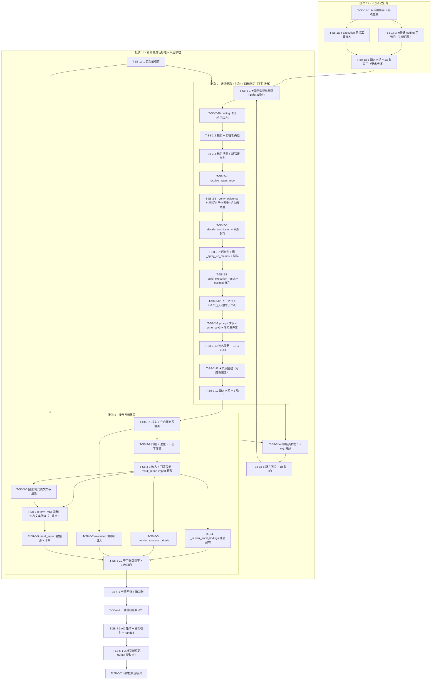

# Sprint 8 开发计划

**产品名称**：Auto-Reproduction —— 论文自动复现系统
**Sprint**：Sprint 8 —— 输出契约驱动的复现结果链路 + 本篇专属的成功标准
**版本**：**v1.3（+ 2026-08-07 收口订正）**
> 🔴 **2026-08-07 收口订正（约 20 处，一次做完）**：①**编号换发** `AR-S8-13` → **`AR-S8-15`**（与架构 v2.2 已占用号撞车，裁定正身已落架构 **v2.5 §17**；含一处**悬空引用** `§6` → **§17.6 第 2 条**）；②**架构号段口径** `AR-S8-01~08` → `AR-S8-01~15` 四处；③**§12 新增第 17 条 `R-S8-42`**（TypedDict 声明与构造点原子同批）；④**`T-S8-1a-2` 注销后的全部连带跟改**（§2 总表 / 三处悬空依赖 / §3.1 / §3.2 依赖图 / §3.4 关键路径 / §4 与 §5 文件边界与前置）；⑤**全部汇总口一次对平**——任务 41→**40**、检查点 328→**329**（逐批 25/45/148/83/16/12）、勘误 15→**20**、批次 2 任务 14→**15**、冻结表「10→6 行」→~~**「10→4 行」**~~ 🔴 **该次订正把换发行也减掉了，「10→4」仍是错数；2026-08-08 实算再订正为「10→`5` 行」**（`P-S8-22`，§15.0c）四处；⑥`P-S8-17` 第③条**改判为"无须再做"**（架构 v2.4 早已改过）、`P-S8-20` **改判为"已修复"**（测试工程师 2026-08-07 落盘）。**旧结论一律划删保留、不洗白。**
> 🔴 **2026-08-08 批次 1b 开工前置（本轮，经 Maria 授权直接落盘）**：①**补做 `P-S8-12 ~ P-S8-15` 四条勘误复核**（`CP-1a.1-3` 当年照 §15 表头的"11 条"去数，漏了 §15.0 这四条）⇒ 结论落 **§15.0a**，并挖出两条新失真 **`P-S8-21` / `P-S8-22`**（**§15.0c**）；②**修四处语义性过期**：§12 第 5 条（`state.py` 一次收口，已被 `AR-S8-15` 推翻、与同表第 17 条直接打架）+ §0.7 同源一处（**交叉引用指向已注销的 `T-S8-1a-2`**）、§3.3 表 `_parse_metrics` 处置（"死参数被清"→**整体删除**）、冻结表账目三处残留、§0.0 那条「1a 5 个任务 / 批次 2 14 个任务」（**两数皆错**）；③执行 `T-S8-1b-1` 实现前核实。**本轮零生产改动。**
> 🔴 **2026-08-08 批次 1b 代码交付 + 主控收口（本节最新一轮，读"现行账"以本行为准）**：①**`T-S8-1b-2 ~ 1b-5` 四任务串行交付**（生产侧恰 4 文件：`planning.py` / `plan_checks.py` / `state.py` 加 `success_criteria` 一键 / `plan_review.py`；`tests/` 8 处既有断言换发、**净增用例 0 条**——§0.3 第 6 条明令新增正式测试不在开发侧）；回归 **2671 passed / 0 failed 守恒**、mypy 零错误；planning 哈希门三件套闭合（`ef6d267030fd2a0c` → **`b83e05728769ec8e`**）。②**新增勘误 10 条**（`P-S8-26 ~ P-S8-35`，§15.0d）。③**主控收口**：`P-S8-28`（补齐 `CP-1b.2-12~15` 四行复选框）/ `P-S8-33`（`CP-1b.2-7` 三处中的两处**跨批次换发**为 `CP-2.1b-11` + `CP-2.8b-7`）/ `P-S8-35`（§5 批次 2 文件边界 + `CP-2.12-6` 三处 `AR-S8-15` 漏网）。
> 　⇒ 🔴🔴 **本行 = 全文唯一权威汇总口（2026-08-09 立，`P-S8-32` 收口）。以下五个数只在本行与 §13 实算表出现，全文其余各处一律引用本行、不得复述数字** —— 此前检查点总数有 6 个、勘误总数有 5 个同源抄写口，是本 Sprint 最高频的失真源。改数时只需改两处：**本行 + §13 实算表**。
> 　⇒ 🔴 **现行汇总账（2026-08-08；数字取自 §13 实算表，逐行加总非沿用）：检查点 `331` 个**（逐批 **25 / 45 / `150` / 83 / 16 / 12**）、**任务 40 个**（批次 2 = **15**）、**落点勘误 ~~`38`~~ ~~`41`~~ ~~`44`~~ ~~`47`~~ ~~`49`~~ ~~`50`~~ ~~`54`~~ `59` 条**（`P-S8-1` ~ **`P-S8-59`**，其中**实质性 ~~`16`~~ ~~`17`~~ ~~`18`~~ ~~`20`~~ ~~`22`~~ ~~`26`~~ `31` 条**；
🔴 **2026-08-10 ~ 08-11 批次 2 执行期新增 ~~6~~ ~~9~~ ~~11~~ ~~12~~ ~~16~~ `21` 条 `P-S8-39 ~ ~~P-S8-44~~ `P-S8-59``，见 §15.0e** —— `39~41` 由 `T-S8-2-2` 实现前核实挖出、`42~44` 由 `T-S8-2-1` 真跑全量回归暴露、**`45~47` 由 `T-S8-2-1b` 实做时挖出**（`45` 收网抓出第四处 `<METRICS>`；`46` 是两条各自正确的约束互相拉扯；`47` 超范围登记不治））、**冻结表 10 行 → `5` 行**。~~（作废旧账：勘误 `35` 条）~~⚠ **上一行（`:6`，2026-08-07 那轮）记的 `329` / `148` / `20 条` / 「10→4」全部是当时的账、已被本轮作废** —— 保留作留痕，**不要照它对账**。
> 🔴 **2026-08-09 批次 2 开工前置（三组失真收口，经 Maria 授权直接落盘；本轮零生产改动）**：①**验钞口径全文统一到七重**（`P-S8-36`，10 处，其中 3 处是 grep 收网挖出的、原先无人点名）；②**`T-S8-2-8` 正文补"第 0 条"+ 三行实体复选框 + `R-S8-42` 验红项**（`P-S8-37`，`:593` 那条挂了两天的"唯一未做"结清）；③**§3.4 C 表与 `T-S8-3-1` 术语守门现值订正为 18 / 43 / 61**（`P-S8-30` 结清，目标下限随基数由 ≥19 改为 **≥22**）。**新登记勘误 3 条**（`P-S8-36 ~ P-S8-38`，§15.0d）⇒ 总数 35 → **`38`**，实质性 14 → **`16`**。🔴 **检查点总数与任务数均未变（现值见文首「现行汇总账」权威行）**（三条 CP 本就已计入 `T-S8-2-8` 的 19 条，本轮只是把它们的实体补上）。
（🔴 **v1.3 = 跟改 `prd.md` v4.1 + `architecture.md` v2.4**：①**S8-06 / S8-07 回炉**——结果形状由执行环节决定，原方案 A「把维度写进组名」作废，新增结果块契约 / 证据台账 / 通用渲染；②**验钞五重扩为七重**（论文值侧两重，AR-S8-14）；③**`ExecutionResult.metrics` / `metrics_groups` 本 Sprint 删键**（Maria 推翻停产默认取值）；④四个折叠 / 扫盘函数整体删除；⑤`T-S8-3-9` 整条作废并换发。连带见 §14.3 / §15 / §16。v1.2 = v1.0 = 2026-08-04 初稿；v1.1 = 同日回填 Maria 拍板 1/2；**v1.2 = 同日再回填架构师两项裁定 + Maria 加拍**：①**三档 + `_parse_metrics` 四函数整体删除**（推翻本计划默认取值 A）；②**execution 上下文注入迁入批次 2**（`T-S8-2-8b`）；③**Maria 加拍：coding 侧改词一并迁入批次 2**（`T-S8-2-1b`）⇒ **批次 1a 收敛为「只加不改行为」的 5 个任务**。连带同步见 §0.0 / §3.1 / §3.4 / §14.2 / §15 / §16；架构文档同批跟改至 **v2.1**）
**日期**：2026-08-04
**作者**：全栈开发工程师代理
**状态**：草案（待 Maria 审阅后**逐批**授权执行）
**对应 PRD**：`docs/sprint8/prd.md` **v4.1**（AC-S8-01 ~ **AC-S8-26**；R-S8-01 ~ **R-S8-26**）（S8-01 ~ S8-11 十一条全 P0；AC-S8-01 ~ AC-S8-25；R-S8-01 ~ R-S8-17；A-S8-01 ~ A-S8-10；Q-S8-01 ~ Q-S8-07）
**对应架构**：`docs/sprint8/architecture.md` **v2.5**（Q-S8-01 ~ **Q-S8-10**；AR-S8-01 ~ **AR-S8-15**；**§17 `AR-S8-15` 全裁（两键迁出 / `R-S8-42`）/ §2.6 删键 / §5.8 degraded 缺口 / §5.9 报告侧重裁 / §16 结果块全节**）（~~v2.4：AR-S8-01 ~ AR-S8-14~~；~~v2.0：Q-S8-01 ~ Q-S8-09 九项裁决 + §12 文件级开发交接清单 + AR-S8-01 ~ AR-S8-08 + §14 跟改说明 + §15 护栏 3 落点~~）
**体例参照**：`docs/sprint7/dev-plan.md` v1.0（§0 全局纪律 → 概述 → 任务清单总表 → 批次划分与依赖图 → 批次正文逐任务带 CP → 交付物 → 风险登记 → 关键纪律汇总 → 落点核对结论 → 待确认项 → 编号速查 → CP 索引 → 落点勘误留档）

> **本计划性质**：忠实落地 PRD v3.0 + 架构 v2.0，**不重新决策、不改设计**。所有取值 / 落点 / 顺序均取自两份定稿。凡在磁盘上核不实的落点，一律进 §15「落点勘误留档」；凡两份文档之间或与既有实现存在张力的，一律进 §16「待架构 / PM 确认项」并给默认取值，**不自行拍板改设计**。
>
> **⚠ 编号对照（架构 §14.2 已裁，务必先读）**：PRD v3.0 §8 表里那一行 **「Q-S8-07（护栏 3 落点与 `plan_checks.py` 红线再次解锁）」，本计划一律读作 `Q-S8-09`**（架构文档 §7 先占了 `Q-S8-07`）。**本计划全文以架构文档编号为准。**

---

## 0. 全局纪律（贯穿所有批次，不再逐任务复述）

### 0.0 ★★★ 可用性中间态告示（AR-S8-01 / 架构 §11 前置约束 2）——**开工前必须读这一条**

> **🔴 窗口已被压缩进批次 2 内部（Maria 2026-08-04 拍板 2）：从批次 2 内部合入 T-S8-2-1 那一刻起、到批次 2 收口门通过为止，本系统处于「一律判失败」的不可用中间态。**
>
> ⇒ ✅ **批次 1a 落盘后系统仍然可用、可真跑、可演示。** 这正是本次拍板要买到的东西。

因果链（架构 §11 前置②、PRD §4.5.6 已各自论证一次，此处逐环写死）：

| 环 | 事实 | 源码依据 |
|---|---|---|
| ① | **批次 2 首位**的 T-S8-2-1 把 `<METRICS>` 三档从判定链路解绑 | `execution.py:2935` `metrics, llm_calls_used = _parse_metrics(...)` 解绑后 `metrics` 只剩 agent 自报一条来源 |
| ② | 而 S7-13 的自律门控要到 T-S8-2-11 才废止 —— **门控的条件是"主通道非空才采信自报"** | `execution.py:2939-2952`（`if metrics and reported_main` / `elif reported_main:` 打 WARNING 不采信） |
| ③ | ⇒ 主通道恒空 ⇒ 自报恒不采信 ⇒ **`metrics` 恒为 `{}`** | 上两条的合取 |
| ④ | 而 `success` 的第二合取项 `len(metrics) >= 1` 要到 T-S8-2-8 才被四档判据取代 | `execution.py:2428-2432` |
| ⑤ | ⇒ **`success` 恒 `False` ⇒ 所有论文一律判失败**，报告顶部一律印降级形态 | — |

**因此，从批次 2 内部合入 T-S8-2-1 的那一刻起，到批次 2 收口门通过为止（⚠ 窗口整体落在批次 2 内部；批次 1a 期间不受此约束）：**

1. 🔴 **不得做任何端到端真跑**（`-m e2e`、真实 LLM、真实 deepxiv 配额一律不动）；
2. 🔴 **不得对外演示、不得截图、不得拿这期间的结果写进任何报告或简历材料**；
3. 🔴 **不得据此判断"哪里坏了"**——这期间看到的"全判失败"是**计划内的**，不是回归；
4. 单元 / 集成回归**照常跑**（它们喂的是构造 fixture，不依赖真跑），但**涉及 `success is True` 的既有用例会成片变红**，这是预期的（见 §3.3 账目表），**不得为了让它们变绿而回滚 T-S8-2-1**。

**这不是"能不能开工"的问题，是"可用性什么时候恢复"的问题。** **可用性恢复点 = T-S8-2-11（节点主体接线 + S7-13 门控废止）完成**；收口点 = 批次 2 收口门通过。窗口期间若有真跑 / 演示需求，**唯一正确的做法是把批次 2 做完**，不是回滚 T-S8-2-1。

> ### 🔴 排期留痕：窗口为什么被压进批次 2（**Maria 2026-08-04 拍板 2 —— 已裁定，不再是开放项**）
>
> | 项 | 内容 |
> |---|---|
> | **原方案**（本计划 v1.0） | 照 PRD §10 把 S8-02 整体划进批次 1a ⇒ 解绑发生在批次 1a，**不可用窗口横跨「批次 1a 收口 → 批次 2 收口」两个批次边界**，其间还夹着一次"停手等确认"，窗口被人为拉长 |
> | **Maria 拍板** | 把解绑任务（**v1.0 原编号 `T-S8-1a-7`**）**挪到批次 2 首位**，现编号 **`T-S8-2-1`** |
> | **拍板意图（逐字）** | 把「一律判失败」的不可用窗口**压缩进批次 2 内部**，让**批次 1a 落盘后系统仍然可真跑、可演示** |
> | **技术上无障碍** | 该任务与批次 2 同在 `core/nodes/execution.py` 单收口窗口内，本就串行 |
> | **代价** | 批次 2 由 11 个任务变 **12 个**，是全 Sprint 最大的一批 —— 但它**本就受 R-S8-06「内部不得拆分」约束**，多一个任务不改变交付单元的粒度 |
> | **连带同步** | ①批次 1a 收口门由"允许带红"**恢复为要求全绿**（§3.3 / §4）；②§3.3 预期变红面**整体后移进批次 2**；③批次 1a 7 个任务 / 批次 2 **12** 个任务；④编号已重排，迁移留痕见 §14 |
> | **⚠ v1.2 更新（主控复核订正，2026-08-04）** | 本表记录的是 **v1.1 当时**的账，**上方"代价"与"连带同步③"两格的任务数已过期**：v1.2 又把 `T-S8-1a-4`（coding 改词）与 `T-S8-1a-6`（execution 注入）一并迁入批次 2 ⇒ ~~**现为批次 1a 5 个任务 / 批次 2 14 个任务**~~，以 §3.1 为准。⟦🔴 **2026-08-08 再订正：上面这两个数是 v1.2 当时的账，两数皆已过期** —— **批次 1a 实为 4 个任务**（`T-S8-1a-2` 随 `AR-S8-15` 整条注销并迁出，2026-08-07）、**批次 2 实为 15 个任务**（v1.3 新增 `T-S8-2-10b`）。⚠ **本格连着被两版账压过**（v1.1 的数被 v1.2 订正、v1.2 的数又被 v1.3 作废而无人跟改）—— 与 §14 编号速查、§2 摘要行、结语行**同源**：**"以 §3.1 为准"这句免责不能替代跟改**，读的人会先读到具体数字才读到那句话⟧⟦另订正一处**事实错误**：v1.1 此表把解绑任务的旧号写作 `T-S8-1a-5`，实为 **`T-S8-1a-7`**（与 §6 `T-S8-2-1` 迁移留痕、§14.2 编号迁移表三处互证）。成因与 §14.2 记的两处残留同型——**改号时的机械替换连历史留痕一起改了**，而历史留痕恰恰不该跟着动⟧ |
> | **裁定人 / 日期** | **Maria，2026-08-04** |

### 0.1 批次边界逐批确认制（MEMORY §3.3，铁律）

- **每批收口门后停手**，等 Maria 明确确认再开下一批。
- **对某一批的授权 ≠ 对后续批次的授权。**
- **耗配额 / 不可逆的动作即使在批内也须单独授权**（批次 5 全部属此类，且**严禁预授权**）。
- 触发这条纪律的历史事件：sprint5 只批了「批次 0」却被一路推到批次 4。**本 Sprint 五个批次，五道停手线。**

### 0.2 编号约定与起点（防撞号）

| 号段 | 已占用 | 本计划起点 | 说明 |
|---|---|---|---|
| 需求 `S8-xx` | PRD §1：S8-01 ~ S8-11 | — | 本计划不新增需求号 |
| 验收 `AC-S8-xx` | PRD §5：AC-S8-01 ~ AC-S8-25 | — | 本计划不新增验收号；新登记的缺陷用 `DA-S8-N`（见下） |
| 架构问题 `Q-S8-xx` | 架构 §0：Q-S8-01 ~ Q-S8-09 | — | 一律以架构文档编号为准（PRD 的 Q-S8-07 读作 Q-S8-09） |
| PRD 风险 `R-S8-xx` | PRD §6：R-S8-01 ~ R-S8-17 | **R-S8-18 起** | 本计划新登记的风险接续此号段（见 §11） |
| 架构风险 `AR-S8-xx` | 架构 §10：~~AR-S8-01 ~ AR-S8-08~~ ⇒ **AR-S8-01 ~ `AR-S8-15`**（2026-08-07 现查架构 v2.5；`AR-S8-14` 为 v2.4 论文值验钞两重、**`AR-S8-15` 为 §17 两键迁出**，⚠ `AR-S8-13` 是 v2.2 的「schema 重生成路径块内容」，与两键迁出**不是同一条**，撞车换发见架构 §17.0） | — | **本计划不扩这个号段**（它是架构自留段） |
| 任务 `T-S8-{批次}-N` | — | **`T-S8-1a-1` 起** | 批次名用 `1a` / `1b` / `2` / `3` / `4` / `5`，**从 1a 起编，不接 sprint7 的批次 9** |
| 检查点 `CP-{批次}.{任务序}-N` | — | **`CP-1a.1-1` 起** | 例：T-S8-2-5 的检查点是 `CP-2.5-1`、`CP-2.5-2` … |
| 落点勘误 `P-S8-N` | — | **`P-S8-1` 起** | 与 sprint7 的裸 `P-N`（已用到 P-73）**显式分段**，避免跨 Sprint 撞号 |
| 本计划新登记缺陷 `BUG-S8-NN` | — | **`BUG-S8-01` 起** | 沿 Sprint 1 的 `BUG-S1-02` 体例 |
| dev-plan 自定验收点 `DA-S8-N` | — | **`DA-S8-1` 起** | 只给"PRD 未覆盖但本计划要交付"的项（目前仅 BUG-S8-01），**不占用 `AC-S8-*`**（沿 sprint7 S7-10/11/12/13 同款处置） |

### 0.3 测试与回归口径

1. **命令口径**：一律 `.venv/bin/pytest`。裸 `pytest` 不在 PATH；`python3 -m pytest` 报 `No module named pytest`；裸 `python` 是 Python 2（MEMORY §2）。全量非 e2e 回归 = `.venv/bin/pytest -q -m "not e2e"`。
2. **零退化基线 = 2635 passed / 25 skipped / 58 deselected / 7 xfailed**（`docs/TODO.md:845`，2026-08-03 S7-13 独立验收后实测，PRD AC-S8-23 引的就是这个数）。
   - ⚠ **该基线必须在批次 1a 开工第一件事重新实测一次并落档**（T-S8-1a-1 / CP-1a.1-1）。理由：MEMORY §1.2 明写"harness 给的 `git status` 快照不可信、全绿结论必须标时间点"；且本计划落盘与开工之间可能隔着别的会话的改动。
   - ⚠ `deselected` 数只取决于 `-m` 表达式（`e2e` 46 条 + `browser` 12 条，两族不相交，sprint7 §63 P-66 已结清），**与用例增减无关**，对账时不要拿它当分子。
3. **禁弱化自查**（每批收口门必查）：本批 `git diff tests/` 中 `>=` / `issubset` / `pytest.skip` / `xfail` / 删除断言 **零新增**。删除的断言必须是**同处替换成等强或更严的版本**，且逐条能说出替换关系。
4. **验红纪律**：一切验红还原走 **`cp` 文件级备份 + `sha256sum -c` 校验**，**全程禁用 `git checkout` / `git restore` / `git stash`**（sprint7 P-53① 的教训：验红时用 `git checkout` 把并发代理未提交的改动一次性冲掉）。
5. **"写了断言" ≠ "断言有牙"**（sprint7 P-72）：验红首轮没变红的，一律当场加固 fixture 后复验，**并如实登记"首轮无牙"这件事**，不粉饰。
6. **新增正式测试不在开发侧**（沿 sprint7 §61.0 既定分工，交测试工程师）。开发侧只做自测脚本，**只落 `/tmp`，仓库零触碰**。本计划的 CP 是**开发自测检查点**，不是正式用例清单。
7. **一切测试与探针取模块用 `importlib.import_module`**，禁 `import core.nodes.xxx as m`（已知坑 #6：`core/nodes/__init__.py` 的显式 export 会遮蔽子模块，sprint7 P-67 在本仓库实证有效）。
8. **真跑授权红线**：一切耗 deepxiv 配额 / 真实 LLM 的动作**须 Maria 明确授权具体动作**，**严禁预授权**，全部归集到批次 5。泛泛的"好"不构成授权（MEMORY / 记忆条目「真实 e2e 须明确授权」）。

### 0.4 架构贯穿硬约束（红线，任一任务不得破；来源：架构头部「贯穿硬约束」）

- **不新增 interrupt 种类**（三类封口：planning#1 / dev_loop#2 / user_input#3）；
- **不改编排图**（`core/graph.py` 本 Sprint **零改动**）；
- **不改人在回路三个交互点**；
- **保 S-1 重跑幂等契约**（`_has_committed_result_for_round` guard 函数**一字不改**）；
- **状态契约新增严格限两处两键**：`ExecutionResult.conclusion` + `ReproductionPlan.success_criteria`，**上限就是两处**（架构 Q-S8-02）；
- **护栏 3 只产警示、不阻断审批**（`check_plan` 既有五条 W 的 rule / message / 触发条件**一字不动**，既有两个调用点不改也能跑）；
- **`config.py` 零改动**（新早停常量复用 `NO_METRICS_EARLY_STOP_ROUNDS` 现有取值，架构 Q-S8-04）；
- **`core/react_base.py` 一字不动**（架构 §1.2 已论证：`force_finish` schema 成功分支已把结果同步写成一条 `<result>` 包裹的 AIMessage，回读兜底不需要它改）；
- **`core/tools/code_fs_tools.py` 一字不动**（架构 Q-S8-03 方案 A：验钞函数内联自判，工具层边界不收窄）；
- **`_SandboxRunCollector` dataclass 一字不动**（含 `:812-817` 那段 R-S4-10 注记，架构 §1.1 裁定 1）；
- **反过度工程**（MEMORY §4.1）：**零新模块、零新 Python Enum 类、零"将来可能用得上"的扩展点**。四档档名落盘的字面量**就是**四个中文串，不做"内部枚举 + 展示名"两套（架构 §2.3 / A-S8-05）。

### 0.5 🔴 两层分离总纲（本 Sprint 落地时最容易搞砸的一件事，架构头部 v2.0 总纲 + §2.5.4）

**一句话记法（PRD §4.5.2）**：**PRD 定义「什么算复现成功」这句话的含义；计划定义「对这篇论文来说，满足什么就算达到了那个含义」。**

| 层 | 落在代码的哪里（**物理位置必须分开**） | 跨论文 | 谁能改 |
|---|---|---|---|
| **第一层：四档语义边界** | ①`execution.py` 四个模块级档名常量 + `_LEVELS` 顺序元组；②**系统提示词主体里的四档语义段**（稳定前缀，进提示词哈希基线） | **恒定** | 只有改代码 |
| **第二层：本篇达标线** | `plan["success_criteria"]` → 经 **HumanMessage 动态通道**注入执行上下文（与 coding 上下文） | **每篇不同** | 规划环节写、用户在审核页改 |

**三条可静态断言的红线（架构 §2.5.4，AC-S8-08 的断言对象）**：

1. **四档语义段必须在系统提示词里，达标线必须在 HumanMessage 里，两者不得混在同一段文本。** 混了就是：要么把第一层做成动态的（= 允许计划越权），要么把第二层做成静态的（= 退回硬编码，直接复发病③）。
2. **`_decide_conclusion` 不得读 `success_criteria`。** 达标线是**给 agent 看的判断依据**，不是给代码看的判据——代码只做三条客观封顶。**代码一旦开始解析达标线文本，就是在把第二层重新硬编码回代码里。**
3. **静态可断言**：`success_criteria` 在 `core/` 下的出现点 ~~**只允许四处**~~ ⇒ 🔴 **全 Sprint 完成后逐文件实为六处**——`state.py`（声明）、`planning.py`（生产）、**`plan_checks.py`（W6 判据，批次 1b 已交付）**、`execution._build_execution_agent_context`（注入）、`coding.py` 上下文（注入）、`reporting._render_success_criteria`（读点，批次 3）。**判定函数体内零出现。**
   > ⚠ 架构 §2.5.4 红线 3 原文写"只允许三处"，但把 `_build_execution_agent_context` 与 `coding.py` 上下文并成了一处 ⇒ 逐文件数实为**四处**（另加批次 3 的 `reporting._render_success_criteria` 一处读点，共五处）。**这是数法差异不是设计差异**，已登记 §15 **P-S8-10**，断言按逐文件的实际处数写。
   > 🔴 **2026-08-08 主控再订正（`P-S8-34`，架构师代理挖出）：上面"四处 / 五处"两个数都漏了 `core/plan_checks.py`** —— W6 的判据**按架构 §15.3 的设计本身就要读 `plan["success_criteria"]`**（现查 `plan_checks.py` 确有命中，批次 1b 已交付）。⇒ **正确数 = 6 处**，架构 §2.5.4 已同批订正为逐文件 6 处落点表。
   > ⚠ **`plan_checks.py` 那一处属"警示"不属"判定"，红线 2 未被破** —— 红线 2（`_decide_conclusion` 不得读 `success_criteria`）守的是**判定链路**，而 W6 只产给人看的警示、**不参与档位判定**，两者不冲突。**这句不许删**，否则后人会误以为红线 2 被破而去"修"一个没坏的东西。
   > ⚠ **成因（第三次同型）**：`P-S8-10` 订正时只把"三处"改成了"四处/五处"，**没有回头数一遍磁盘** —— 与 `P-S8-22`（冻结表连订三轮仍错）/ `P-S8-32`（汇总口只改三处）同族。⇒ 断言落地时**一律现查磁盘逐文件数，不引用本行的数字**。

**为什么 `success_criteria` 是单个字符串而不是"档位→达标线"的字典**（架构 §2.5.2，落地时最容易被"优化"掉的一条）：**四档名根本不出现在计划里 ⇒ 计划在结构上就没有改动第一层的入口**——不是靠提示词去劝它别越权，是**它连能写越权内容的字段都没有**。任何"看起来更灵活"的字典 / 列表形态**一律否决**。

### 0.6 已知 bug 模式对照（每个新增函数 / 新增注入点开工前逐条自查）

| # | 模式 | 本 Sprint 的具体作用面 |
|---|---|---|
| **#1** | ToolMessage 序列化必须是合法 JSON（`json.dumps(..., ensure_ascii=False, sort_keys=True, default=str)`，禁 `str(dict)`） | 本 Sprint **不新造工具**（只绑既有 `read_code_file` / `list_dir`），该模式**无新增作用面**；但 `_resolve_agent_report` 回读 `<result>` 时的 JSON 解析纪律同源（沿 `_rebuild_*_from_messages` 的截断容忍路径，**不自行另写解析**） |
| **#2** | 3 参签名 + 工具历史回填 | **本 Sprint 不适用**：execution 走的是 `result_schema` 结构化出口（S7-13 已建），不是 `_map_xxx_result`。`_resolve_agent_report` 的"子图 result 优先、messages 末条 `<result>` 回读补位"是它的对偶形态，已由架构 §1.3 裁定 |
| **#3 🔴** | **禁止静默吞错** | **本 Sprint 命中三处**：①`_resolve_agent_report` 两通道皆空 / 有标签但解析不出 → **必须 WARNING**（架构 §1.3，且与 `reported_metrics` 的"零指标不打 WARNING"相反——**档位缺失不是合法常态**）；②`_verify_evidence` IO 异常 → 该条判**不成立** + WARNING（AR-S8-03）；③🔴 **`_split_reported_metrics` 的非 str `group` 今天就是静默吞**（BUG-S8-01，见 §1.6） |
| **#4 🔴** | Prompt Cache 字节级幂等不能被动态拼接破坏 | **本 Sprint 命中三处 prompt 主体改写**（coding / planning / execution）：新增文本必须是**纯静态文案**，零 `arxiv_id` / 论文标题 / 路径 / 时间戳；动态内容一律走 HumanMessage（`json.dumps(sort_keys=True)`）。三处各配一条"主体无论文级动态变量"断言（正则 `\d{4}\.\d{4,5}` 零命中） |
| **#5** | 回归验收必须连跑足够次数 | 本 Sprint 的 LLM 服从度类风险（R-S8-02 规划把及格线画低 / R-S8-08 组名服从度 / R-S8-10 服从率约 75%）**只能靠批次 5 真跑观测**，且**单次真跑不构成服从率证据**（sprint7 §8 已明载）。⇒ 交付表述纪律见 §12 第 1 条 |
| **#6** | 改 `__init__.py` 显式 export 时小心遮蔽子模块 | 本 Sprint **不改** `core/nodes/__init__.py`；但一切测试 / 探针**强制** `importlib.import_module`（§0.3 第 7 条） |

### 0.7 文件边界与并发纪律（MEMORY §1.1 / §1.2）

1. **共享文件谁都不许碰**：`app.py`、`docs/TODO.md`、本 dev-plan —— **由主控统一收口**。
2. **单收口窗口**（同一文件被同批多个任务触碰时，任务**串行**、主控收口令，不并行派子代理）：
   - `core/nodes/execution.py`：**批次 1a（3 任务）+ 批次 2（10 任务）+ 批次 3（1 任务）** 共触碰。三批之间是串行的批次边界，批内串行。
   - `core/nodes/reporting.py`：**批次 3 独占**（5 任务串行）。
   - `core/state.py`：🔴 **两键各随其构造点原子同批**（`AR-S8-15` / `R-S8-42`，§12 第 5 条 + 第 17 条）——`success_criteria` 落 **`T-S8-1b-2`**、`conclusion` 落 **`T-S8-2-8`**；**批次 1a 对本文件零改动**。⇒ 本文件被**两个批次各触碰一次**，但两次分属不同批次边界、天然串行，**不需要单收口窗口**。
     > ~~原文：「🔴 **批次 1a 一次收口，此后全 Sprint 零改动**（见 T-S8-1a-2 的理由）」~~ —— 🔴 **2026-08-08 订正（原文划删保留）**：`T-S8-1a-2` 已随 `AR-S8-15` **整条注销**，该交叉引用**指向一个不存在的任务**（悬空引用），且"一次收口"的口径本身已被推翻（理由见 §12 第 5 条）。**这是 `AR-S8-15` 连带跟改时漏掉的一处**——与 §12 第 5 条同源，两处一并收口。
3. **跨会话并发**：开工前 `git status --porcelain` **现查留痕**（harness 开头给的快照不可信）。**同一个文件被两个批次同时改 ⇒ 无法按文件粒度分离提交 ⇒ 停手请示**，不要自作主张打包提交。
4. **全量回归与文档收口由主控统一做**，不下放给子代理。

---

## 1. 概述

### 1.1 Sprint 目标

Sprint 8 治的是**一条从头断到尾的输出契约链**，以及**"一套判据套所有论文"这个前提本身**：

- **链路断裂（PRD §0.1）**：计划的 `expected_output` **全仓零判定消费点**；编码环节**从没有人告诉过它 `summary.json` 或 `outputs/` 的存在**（`coding.py` 全文两者零命中，本计划已复核属实）；执行环节在等一个没人被要求生产的文件、且**一个读文件的工具都没绑**；报告靠一条即将失效的扁平字段渲染。
- **判据的三个病（PRD §0.2）**：①全局文档承诺的"与论文报告一致"代码从来没实现过（唯一实现 `_verify_trend` 只做组间比大小）；②全有全无（`all(check == "符合")`，三个实验对上两个与一条没对上评价完全相同）；③标准照着"有多组对照实验的论文"设计，无对照组的论文**结构性永远拿不到最高档**。
- **根因（PRD §0.3，Maria 第四轮拍板）**：以上全部问题的根源是**一套判据套所有论文**。⇒ **成功标准改由论文分析 + 规划针对本篇论文推导出来、写进计划**，四档只作统一表达框架。

**本 Sprint 交付后应当成立的四件事**：

1. **一篇纯定性论文，代码跑通、图画出来，能判复现成功**（AC-S8-12）。
2. **部分复现有名分**：三个实验对上两个，不再与一条没对上同等评价（AC-S8-10）。
3. **同一份执行产物 + 两份不同达标线的计划 → 判出不同档位**（AC-S8-07，本版主断言，直接证明"标准生效了"）。
4. **判断权交给执行环节 agent，代码退居验钞**，并守住三条只压不抬的客观封顶（AC-S8-09）。

### 1.2 范围对齐

- **PRD 权威**：S8-01 ~ S8-11 十一条，**全部 P0、同批交付**（S8-05 是硬约束，批次 2 内部不得拆分）；AC-S8-01 ~ AC-S8-25；十一条"明确不做"（看图判断 / 通用多维容器 / 图片内嵌 / 成功率 KPI / 步骤对账归属 / 命令层新增拦截规则 / 人工确认交互入口 / 治审计盲区 / 教代码绕开审计 / **计划改动四档语义边界** / **护栏 3 做成阻断门**）。
- **架构权威**：Q-S8-01 ~ Q-S8-09 九项裁决全部落地为可执行任务，**本计划不重新决策**。
- **本计划新增（Maria 2026-08-04 已同意，纯 bug 修复不走 PRD）**：**BUG-S8-01**（非 str `group` 静默升格），见 §1.6。
- **新增模块**：**0 个新 `.py` 模块**。新增抽象总量（架构头部已量化，本计划逐条对上）：
  - **2 个状态契约键**（跨 `ReproductionPlan` 与 `ExecutionResult` 两个结构）
  - **1 个 `ErrorCategory` 成员**（`NO_VERIFIABLE_OUTPUT`；`NO_METRICS` 成员**保留**，架构 Q-S8-07）
  - **4 个 execution 侧纯函数**（`_resolve_agent_report` / `_verify_evidence` / `_decide_conclusion` / `_apply_no_verifiable_output`）
  - **2 个 reporting 侧纯函数**（`_render_audit_findings` / `_render_success_criteria`）
    > ⚠ 架构头部写"1 个 reporting 侧纯函数"，但 §5.6(B) 与 §5.7 各裁了一个，逐条数实为 **2 个**。已登记 §15 **P-S8-11**（表述差，非设计差）。
  - **1 条 `check_plan` 警示**（W6）+ **1 组 term_map 换发**
- **breaking 面**：两个新状态键均**缺省安全 + `.get()` 防御读**，旧 checkpoint 不 KeyError（架构 §2.4 / §2.5.5）；`ErrorCategory.NO_METRICS` 保留成员保住旧 checkpoint 反序列化面（架构 §7）。**真正的 breaking 是"档位语义与判据来源双变更 ⇒ 历史结论不可跨版本比较"**（R-S8-11），属产品口径而非数据契约。

### 1.3 关键风险一句话

**批次 2 是全 Sprint 的风险顶点**，且它同时是**可用性恢复点**（§0.0）：十个任务全部落在 `execution.py` 一个文件、全部串行、其中 `_decide_conclusion` + 三条封顶 + `success` 由 `level` 派生这三件事**同时改写成功判定的分子与分母**——而这块区域正是 S7-11「做得越少越容易成功」反向激励刚刚治好的地方（`execution.py:2423-2426` 逐字记着：真跑 17 条挂 5 条判失败、只跑 2 条全 0 反而判成功）。**任一封顶被写漏 / 写成"可以抬高"，S7-11 的反向激励当场复活，且这次连"分子是不是 agent 自报"这道自律门控也一并废止了。** 缓解 = 三条封顶做成**按 `_LEVELS` 元组下标取更低档**（不写 if 链，架构 §2.3，天然满足"只压不抬"）+ AC-S8-09 四向验红 + 批次 2 收口门强制全量回归。

次高风险是 **R-S8-13「两层分离落地时混成一层」**（§0.5）与 **AR-S8-04「一条统一判据长回两套」**：开发极可能顺手给 `_decide_conclusion` 按"数值 / 趋势 / 定性"写三个分支——**那正是病③的复发形态**，AC-S8-08② 的负向静态断言对象就是这个函数。

### 1.4 容量裁剪线（超限时依序执行；**上面的绝不砍**）

> **不可裁的三条**（缺一环整个 Sprint 的立项目标不成立）：批次 1a 的 S8-03（读文件能力，没它整件事无从谈起）、批次 1b 的 `success_criteria` 生产链、批次 2 全部（PRD 明令内部不得拆分）。

1. **先降批次 5 规模**：AC-S8-25（护栏真值）可与 AC-S8-24 合并在**同一次真跑**里取证（同一份计划落盘后既核成功标准是否引用具体主张、又核 W6 是否未命中），省一次配额。
2. **再降批次 3 的展示面**：`_render_success_criteria`（§5.7 报告展示本篇成功标准）与 `ui/pages/result_report.py` 的卡片跟改可分两次落——但 🔴 **`_determine_conclusion` 改名连带的 `result_report.py` import 跟改（P-S8-4）不可延后**，它是**模块导入即崩**级别的连带。
3. 🔴 **coding prompt 字节门（T-S8-1a-3）不可裁、不可顺延**。理由：它是 T-S8-2-1b 的**前置**——“先建后改”一旦变成“改完再建”，建出来的基线是照着改后字节写死的、**永远绿**，与自锁定形态等价（R-S7-41 / sprint7 P-27 两次实证）。**要么在改 prompt 之前建，要么这道门根本不该记进交付。**
4. **绝不裁**：三条封顶（护栏 2）、~~五重验钞~~ **七重验钞（产物侧五重 + 论文值侧两重）**、护栏 1 的审核页展示。护栏 1 是**三道护栏里唯一真正的兜底**（PRD §4.11.2：唯有人眼能判断"这条标准对这篇论文算不算宽"）。🔴 **论文值侧那两重同样不可裁**（`P-S8-36`）——它守的是 `AR-S8-14`（把对照基准往低了编），裁掉等于把 `T-S8-2-5` 的命门（AC-S8-06）验收对象一并裁掉。

### 1.5 前置事实（本计划落盘时逐条上磁盘 Read / grep 核实，2026-08-04；凡与 PRD / 架构描述有出入的一律进 §15）

> 核实时点：2026-08-04，`git status --porcelain` **为空**（干净工作区），`HEAD = 191bd93`。

| # | 事实 | 核实方式 | 结论 |
|---|---|---|---|
| 1 | `ReproductionPlan` 在 `core/state.py:115-157`，**既有 13 键**（plan_summary / environment / data_preparation / code_strategy / execution_steps / expected_results / estimated_time / deliverables / user_feedback / approved / required_credentials / scale_reduced / local_fit_note） | Read | ✅ 与架构 §12 一致 |
| 2 | `ExecutionResult` 在 `core/state.py:159-184`，**既有 11 键**（success / metrics / logs / errors / artifacts / runtime_seconds / environment_info / step_reconciliation / budget_truncated / metrics_groups / degraded_credentials） | Read + 逐键数 | ❌ 架构 §2.1 写"既有 **10** 键"，**实为 11 键**。见 §15 **P-S8-1** |
| 3 | `core/nodes/coding.py` 内 `summary.json` / `outputs/` / `expected_results` / `success_criteria` **四者全部零命中** | `grep -n` | ✅ PRD §0.1 与 §4.2 第 3 条属实 |
| 4 | execution 工具列 `:1581-1585` 恰三个工具（`prepare_environment` / `run_in_sandbox` / `request_user_input`） | Read | ✅ 属实（架构写 `:1581-1584`，列表右括号在 `:1585`） |
| 5 | `coding.py:515-516` 今天就绑了 `make_read_code_file_tool()` + `make_list_dir_tool()` | Read | ✅ PRD §4.3「读取面不是本次新开的」属实 |
| 6 | `_parse_metrics(run_results, plan, state)` 的 `plan` 形参**函数体一次没用过**（`:517-550` 全文只用 `run_results` 与 `state`） | Read | ✅ PRD §4.2 第 5 条属实 |
| 7 | `_parse_metrics` 的第二返回值 `llm_calls_used` 流向 `_map_execution_result(..., llm_calls_used=...)`（`:3016`）→ 预算扣减 `total_calls = react_rounds_used + llm_calls_used`（`:2533`） | grep 全 8 处出现点 | ⚠ **架构 §12 未提**：解绑三档后这条预算支路要显式归零，见 T-S8-2-1 与 §15 **P-S8-6** |
| 8 | `_split_reported_metrics` docstring `:1796-1797` 写"先到先得"，**真正的代码在 `:1828-1831`** | Read | ✅ 架构 AR-S8-08 引的行号是 docstring，属实；改策略时**两处都要动** |
| 9 | 🔴 `execution.py:1826` `group = str(raw_group).strip() if isinstance(raw_group, str) else ""` —— 非 str `group` **静默**吞成空串 ⇒ 归主实验桶 | Read | ❌ **PRD 与架构全文零登记**（`非 str` / `畸形` / `F6` 三词全文零命中）。⇒ **BUG-S8-01**，见 §1.6 |
| 10 | 同函数 docstring `:1798-1799` 明写「畸形条目（非 dict / 无 name / 值非标量）跳过并**打 WARNING**（已知 bug 模式 #3：禁止静默吞错）」 | Read | ✅ **说明书与实现自相矛盾**：非 dict / 无 name / 值非标量三种确实打了 WARNING，**唯独 group 类型不对是静默吞** |
| 11 | `success` 三合取项在 `:2428-2432`；S7-11 反向激励注记在 `:2423-2426` | Read | ✅ 与架构 §12 一致 |
| 12 | S7-13 自律门控在 `:2939-2952`；`_collect_grouped_metrics` 兜底在 `:2961` | Read | ✅ 与 PRD §4.5.5 留档 2 / 架构 §13 一致 |
| 13 | `ui/` 全目录对 `metrics_groups` **零命中** | `grep -rn metrics_groups ui/` | ✅ PRD §4.7 第 2 条属实 |
| 14 | 🔴 `humanize("report_form", ...)` 与 `humanize("conclusion_level", ...)` **全仓零调用点** | `grep -rn` 全仓（排除 `.venv`） | ❌ **实质性勘误**：改 `ui/term_map.py:80-86` **用户看到的一个字都不会变**。真正的文案在别处三处。见 §15 **P-S8-3** |
| 15 | 🔴 `ui/pages/result_report.py:59` `from core.nodes.reporting import _determine_conclusion, _determine_report_form` | Read | ❌ **实质性勘误**：架构 §5.2 要把 `_determine_conclusion` 改名，`ui/` 条目**没提这个 import** ⇒ 改名后结果页**模块导入即崩**。见 §15 **P-S8-4** |
| 16 | `ui/pages/result_report.py:121-135` `_conclusion_card_key` 按 `level == "science"` 分卡 | Read | ⚠ 四档制下该分支**恒不成立** ⇒ 所有 full_success 都印 `full_success_engineering` 卡。架构未提。见 §15 **P-S8-4** |
| 17 | 🔴 编码侧 prompt **今天没有任何字节门**：全仓 `hexdigest` 命中的**真 prompt 门只有 3 处**（planning 1 = `test_sprint6_b1_prompt_guards.py:79`；execution 2 = `test_sprint5_t14_execution_prompt.py` + `test_sprint7_s710_exec_locality.py`），**coding 零**；唯一沾边的 `tests/test_sprint5_t13_coding_prompt.py:180-183` 是 `expected_prefix = _CODING_SYSTEM_PROMPT_BODY + _CODING_HONESTY_SECTION` 的**自锁定形态**（等号两边同源，常量改成什么都恒绿） | grep 全仓 + Read（复核 sprint7 P-64 与 `docs/TODO.md:633`） | ❌ AC-S8-21② 说“编码侧提示词哈希基线**换发**”，**实为新建**。见 §15 **P-S8-5**、任务 **T-S8-1a-3** |
| 18 | `tests/test_s708_user_text_guard.py`：`EXPECTED_TERM_LABELS_N = 43` / ~~`EXPECTED_CONSTANTS_N = 15`~~ / ~~`EXPECTED_N = 58`~~，三个数**必须 `==`，禁改 `>=`** | Read `:95-133` | ✅ AC-S8-20⑤"计数精确闭合、禁止放宽"有具体落点<br>🔴 **2026-08-09 现查更新（`P-S8-30` 收网，`P-S8-38` 同族）**：**左栏是 2026-08-04 的核实记录，批次 1b 交付后已过期** ⇒ 现为 `43` / **`18`** / **`61`**（`:144-146`，`len(_GUARDED_CONSTANTS)` 实测 18 项在 `:95-121`）。**"禁改 `>=`" 这条结论不变。** ⚠ **本处是守门计数的第 3 个同源落点**（另两处是 §3.4 C 表与 `T-S8-3-1` 第 2 条），`P-S8-30` **原文只点了那两处** |
| 19 | `ui/term_map.py::TERM_LABELS` 实测 **43 条**（error_category 14 / node 7 / annotation 4 / code_strategy 3 / resource_strategy 3 / report_form 3 / conclusion_level 3 / audit_rule 3 / user_fix_decision 3） | `.venv/bin/python` 实算 | ✅ 与守门 `EXPECTED_TERM_LABELS_N` 对平 |
| 20 | 函数源码字节冻结表在 `tests/test_sprint7_s713_reported_metrics.py:994-1005`，**恰 10 个函数** | Read | ✅ PRD §4.2 引的落点属实；必红行数见 §15 **P-S8-9** |
| 21 | `check_plan` 现签名 `(plan, resource_info)`（`core/plan_checks.py:483`）；调用点共 **19 处**（生产 1：`ui/pages/plan_review.py:786`；测试 18：全在 `tests/test_sprint6_b1_plan_checks.py`），**全部两参** | grep 全仓 | ✅ 架构 Q-S8-09 方案 A（加带默认值的第三个关键字形参）**既有调用零改动**成立 |
| 22 | 🔴 `ui/pages/plan_review.py` **没有任何计划字段的就地编辑控件**：`revise` 一次性文本框已于 S2-12 迁到多轮对话面板，用户"调整计划"走的是**讨论助手 → 修改方向纪要 → 重新规划**这条路 | Read + grep | ⚠ 与 AC-S8-14「可编辑」的字面读法有张力。架构 §12 已裁"**只读展示**"。✅ **Maria 2026-08-04 拍板 1 已确认按只读展示验收**，见 §16.A |
| 23 | `SandboxRunResult`（`sandbox/local_venv.py:176-189`）只有 `duration_seconds`，**无任何挂钟时间戳** | Read | ✅ PRD §4.9.6「mtime 比对数据源不存在」属实 |
| 24 | `core/react_base.py:665-672` `force_finish` 的 schema 成功分支**确实把结果同步追加成一条 `<result>` 包裹的 AIMessage** | Read | ✅ 架构 §1.2 (c) 的"另一半好消息"属实 ⇒ 回读兜底不需要改 `react_base` |
| 25 | `REACT_RESULT_TAG_OPEN/CLOSE` 在 `config.py:61-62`；`react_base._RESULT_TAG_PATTERN`（`:87`）是私有符号 | Read | ✅ 架构 §1.3「execution 侧按同一对常量自建模块级 pattern，不 import 私有符号」可执行 |
| 26 | `TOOL_RESULT_MAX_LENGTH = 8000`（`config.py:63`），`code_fs_tools._truncate`（`:57-64`）读它 | Read | ✅ R-S8-09 的 8000 截断属实（**登记不治**） |
| 27 | `_build_execution_agent_context` 现签名恰 **3 个形参**（state / work_dir / plan） | Read `:1299-1303` | ✅ 架构 §5.6(A)「审计结果作为第 4 个入参」可执行 |
| 28 | `_INCOMPLETE_EXECUTION_SUMMARY_LEAD`（`:2180`）/ `_INCOMPLETE_EXECUTION_FIX_HINT`（`:2181`）已是模块级具名常量**且已进术语守门** | Read + 守门表 `:113-114` | ✅ 新错误类别的文案按同款范式提常量 + 进守门 |
| 29 | ⚠ `_NO_METRICS_EARLY_STOP_SUMMARY`（`:2715-2718`）**不在** `_GUARDED_CONSTANTS` 里 | 比对守门表 `:95-115` | ⚠ 它是直达用户的终态面板文案却从未被守门扫到（与 sprint7 P-13 / S7-11 `_SUCCESS_CRITERIA_NOTE` 同款失效模式）。本批要改它 ⇒ **顺手补进守门**。见 §15 **P-S8-8** |
| 30 | `reporting._header`（`:522`）打印 `` - 报告形态: `{form}` `` —— **直接把内部键印给用户** | Read | ⚠ MEMORY §4.2 的**既有违反**，架构未提。见 §15 **P-S8-3** |

### 1.6 🔴 BUG-S8-01：畸形字段被静默吞（本计划新登记，纯 bug 修复；**v1.3 已重判并换发落点**）

> **📌 v1.3 重判结论（上磁盘重新判定，不是想当然作废）**：
> - **原始缺陷的原址消失**：`execution.py:1826` 位于 `_split_reported_metrics` 内，该函数随 S8-06 回炉**整体删除**（T-S8-2-10）⇒ 那一行不复存在，`group` 这个概念本身也不复存在。
> - 🔴 **但缺陷类别转移了，而且转移后更危险**：新的 `_collect_result_blocks` 对 agent 汇报的 `title` / `note` / `cell` 做同款处理，而**架构 §16.5① 只写了"过 `mask_value`"、没说非 str 怎么办**。实测 `mask_value(非 str)`：**无凭证时静默原样返回（脱敏被跳过）、有凭证时抛 `AttributeError`（炸节点）** ⇒ **测试环境全绿、真跑当场炸**。详见 §15 **P-S8-12**。
> - **⇒ DA-S8-1 换发（不注销）**：由「非 str `group` 跳过 + WARNING」换发为「**非 str 的 `title` / `note` / `cell` 必须先确定性转字符串再过脱敏，容器形态置占位符不做 `str()` 强转，畸形一律 WARNING**」，落点 **T-S8-2-10b / CP-2.10b-7**。
> - **下方原文保留供追溯，不删。**

**来源**：sprint7 测试工程师在 S7-13 独立验收中登记的 **F6**（`docs/TODO.md:849`，原话：「`group` 为非 str 时静默归入主实验桶 ⇒ 等于"畸形 `group` 把指标偷偷升格为 `success` 分子的候选"」）。**主控 2026-08-04 上磁盘核实、本计划落盘时复核属实。**

**缺陷本体**（`core/nodes/execution.py:1826`）：

```python
raw_group = item.get("group")
group = str(raw_group).strip() if isinstance(raw_group, str) else ""
```

agent 把 `group` 填成**数字 / 数组 / dict** 时，`isinstance(raw_group, str)` 为假 ⇒ 落 `""` ⇒ 而 `""` 在本函数里的含义正是「**这是主实验指标**」（docstring `:1789` 逐字写着"`group` 缺省 / null / 去空白后为空 ⇒ **主实验指标**"）⇒ **该指标被悄悄归进主实验桶**，全程零日志。

**为什么它是缺陷而不是设计**（三条，缺一条都不足以定性）：

1. **同函数 docstring `:1798-1799` 明写**「畸形条目（非 dict / 无 name / 值非标量）跳过并**打 WARNING**（已知 bug 模式 #3：禁止静默吞错）」——非 dict、无 name、值非标量三种**确实都打了 WARNING**（`:1811` / `:1817` / `:1823` 三处 `skipped.append`），**唯独 group 类型不对是静默吞** ⇒ **说明书与实现自相矛盾**。
2. **静默吞的方向是"升格"不是"降格"**：吞成 `""` 等于把一条来路不明的指标塞进主实验桶——sp8 之前它是 `len(metrics) >= 1` 这个成功合取项的分子候选，sp8 之后主实验桶是**判档位的证据之一**。⇒ **危害变形但不消失。**
3. **PRD 与架构全文零登记**：本计划落盘时 grep sp8 两份文档，`非 str` / `畸形` / `F6` 三词**零命中** ⇒ 确认未被接住。

**定性**：**纯 bug 修复**（MEMORY §3.1：纯 bug 修复可直接改，不走 PRD）。Maria 2026-08-04 已同意。

**落点**：与架构 AR-S8-08 要改的是**同一个函数的同一段代码**（`_split_reported_metrics` 的撞名策略改为"值不同则两条都丢弃 + WARNING"）⇒ **顺手带上，不单开任务**，落在 **T-S8-2-10**。

**修法**（最小改动，不引入新分支形态）：把 `else ""` 这条静默路径拆成两条——`raw_group is None` **仍归主实验**（`null` 是合法的"没有组"，docstring 已写明）；`raw_group` 非 None 且非 str ⇒ **该条目跳过 + WARNING**（与既有三种畸形同款处置，走同一个 `skipped` 列表）。

> ⚠ **不要把它改成 `str(raw_group)` 强转**：那会把 `{"a":1}` 变成组名 `"{'a': 1}"`，制造一个 Python repr 形态的组名进报告——踩已知 bug 模式 #1 的同族坑，且 MEMORY §4.2 禁止内部表示裸露给用户。

**验收点**：**DA-S8-1**（不占用 `AC-S8-*` 号段）—— `group` 为 `int` / `list` / `dict` 三形态时该条目**不进主实验桶、不进任何分组桶、且打 WARNING**；`group` 为 `None` / 缺键 / 全空白字符串三形态**仍归主实验桶**（既有行为一字不变）。

---

## 2. 任务清单总表

| 任务编号 | 承载 | 任务名 | 产出文件 | 依赖前置 | 复杂度 | 风险 |
|---|---|---|---|---|---|---|
| **T-S8-1a-1** | 前置 | 实现前核实 + 回归基线重测落档（**零生产改动**） | `/tmp` 自测脚本 + §15 勘误回填 | 无 | 低 | 低 |
| ~~**T-S8-1a-2**~~ 🔴 **已注销并迁出** | ~~Q-S8-02~~ | ~~**`core/state.py` 两键一次收口** + `:170` 注释订正~~ ⇒ **整条注销（`AR-S8-15`，2026-08-07）**：`success_criteria` 声明 → **`T-S8-1b-2`**；`conclusion` 声明 → **`T-S8-2-8`**（各自与构造点原子同批，`R-S8-42`）；`:170` 注释订正 → **注销**（键本身在 `T-S8-2-8` 被删，P-S8-17） | ~~`core/state.py`~~ **本任务不产出** | ~~T-S8-1a-1~~ | — | — |
| **T-S8-1a-3** | AC-S8-21② | 🔴 **新建** coding 侧 system prompt 字节哈希门（**先建后改，零生产改动**） | `tests/`（新门）+ §15.1 留档 | T-S8-1a-1 | 中 | 中（P-S8-5：AC 写“换发”实为新建；自锁定坑 R-S7-41） |
| **T-S8-1a-4** | S8-03 | execution 只读工具接入（`read_code_file` / `list_dir`）—— **只加工具，判定链路一字不动** | `core/nodes/execution.py` | ~~T-S8-1a-2~~ **T-S8-1a-1**（`AR-S8-15` 之后：本任务只碰工具装配，与 `state.py` 无关，原依赖是随 `T-S8-1a-2` 注销而**悬空**的） | 低 | 中（两个闸不许合并，Q-S8-03） |
| **T-S8-1a-5** | 收口 | 既有断言同步 + 批次 1a 自测收口门（**要求全绿**） | `tests/`（同步面） | T-S8-1a-3 + T-S8-1a-4 | 中 | 中 |
| **T-S8-1b-1** | 前置 | 实现前核实（planning 两处构造点 / W1~W5 行为基线 / plan_review payload 键） | `/tmp` 自测脚本 | 无（可与 1a 并行） | 低 | 低 |
| **T-S8-1b-2** | S8-01 | planning 冻结区改写 + schema `success_criteria` 进 `required` + 两处构造点 + 哈希三件套　🔴 **`AR-S8-15` 之后新增第 0 条：`core/state.py` 加 `success_criteria: str` 声明（与本任务两处构造点原子同批）** | `core/nodes/planning.py` **+ `core/state.py`**（`AR-S8-15` 迁入） | ~~T-S8-1b-1 + T-S8-1a-2~~ **T-S8-1b-1**（`T-S8-1a-2` 已注销，其第 1 条**并入本任务**，故不再是外部依赖） | **高** | **高**（两层分离命门 + 冻结区 + required 破例 + `R-S8-42` 原子同批） |
| **T-S8-1b-3** | S8-11 / Q-S8-09 | `plan_checks` W6 + 带默认值的第三个关键字形参 | `core/plan_checks.py` | T-S8-1b-1 | 中 | 中（零改动红线再解锁，范围严格限两项） |
| **T-S8-1b-4** | S8-11 | 审核页护栏 1 只读展示 + W6 展示通道多传一参 | `ui/pages/plan_review.py` | T-S8-1b-2/3 | 中 | 中（"可编辑"口径 ✅ 已由拍板 1 裁定为只读展示，§16.A） |
| **T-S8-1b-5** | 收口 | 既有断言同步 + 批次 1b 自测收口门 | `tests/`（同步面） | T-S8-1b-2/3/4 | 中 | 中 |
| **T-S8-2-1** | S8-02 | 🔴 三档判定链路解绑 + `_parse_metrics` 死参 + `llm_calls_used` 归零 —— **★不可用窗口起点**（拍板 2 由批次 1a 迁入） | `core/nodes/execution.py` | **批次 1a + 1b 全部收口** | 中 | **高**（AR-S8-01 窗口；回归成片变红） |
| **T-S8-2-1b** | S8-02 编码侧 | coding 侧：三处 `<METRICS>` 清除 + 产出约定 + 上下文补两键 + 字节门基线换发（**v1.2 由 1a 迁入**） | `core/nodes/coding.py` | **T-S8-2-1** + T-S8-1a-3（门已在 1a 建好）+ ~~T-S8-1a-2~~ **T-S8-1b-2**（`AR-S8-15` 之后：本任务上下文要注入的 `success_criteria` **键名与声明现落在 `T-S8-1b-2`**；批次 1b 早于批次 2 收口，依赖天然满足） | 中 | 中（首次改 coding 冻结区） |
| **T-S8-2-2** | 前置 | 实现前核实 + **三处 prompt 旧哈希先记后改** | `/tmp` + §15 回填 | T-S8-2-1b | 低 | 低（不做等于门白建） |
| **T-S8-2-3** | S8-05 | 四档名模块常量 + `_LEVELS` 顺序元组 + `ErrorCategory.NO_VERIFIABLE_OUTPUT`（`NO_METRICS` 保留加注释） | `core/nodes/execution.py` | T-S8-2-2 | 低 | 中（Q-S8-07：删枚举成员会炸旧 checkpoint） |
| **T-S8-2-4** | Q-S8-01 | `_resolve_agent_report` + `ExecAgentOutput.report` + `reported_metrics` 改从 `report` 取 | `core/nodes/execution.py` | T-S8-2-3 | 中 | **高**（跨中断保真，Q-S8-01 最硬） |
| **T-S8-2-5** | S8-04 | `_verify_evidence` ~~五重验钞~~ **七重验钞（产物侧五重 + 论文值侧两重）**（内联自判，工具层一字不动） | `core/nodes/execution.py` | T-S8-2-4 | **高** | **高**（AC-S8-06 命门须验红） |
| **T-S8-2-6** | S8-05 | `_decide_conclusion` + 三条封顶（按 `_LEVELS` 下标取更低档，**不写 if 链**） | `core/nodes/execution.py` | T-S8-2-5 | **高** | **高**（AR-S8-04 长回两套 / 只压不抬） |
| **T-S8-2-7** | Q-S8-04 | `_apply_no_verifiable_output` + 删 `_apply_no_metrics` + `_no_progress_stalled` + 早停文案换发 | `core/nodes/execution.py` | T-S8-2-6 | 中 | 中（29 + 10 处既有断言） |
| **T-S8-2-8** | S8-05 | `_build_execution_result` +`conclusion` 形参 + `success` 由 `level` 派生 + 降级构造点补默认 | `core/nodes/execution.py` | T-S8-2-7 | **高** | **高**（改动最深，S7-11 反向激励复活风险） |
| **T-S8-2-8b** | S8-10 + 前置① | execution 上下文补 `baseline_results` + `success_criteria`（非空才注入）—— **v1.2 由 1a 迁入，须早于 2-9** | `core/nodes/execution.py` | **T-S8-2-8** | 中 | 中（字节零扰动是命门；AC-S8-15③ 落点） |
| **T-S8-2-9** | S8-04/05 | execution 冻结区 prompt 改写（判定纪律 + 输出要求）+ `EXECUTION_OUTPUT_SCHEMA` +3 字段 + 哈希三件套 | `core/nodes/execution.py` | T-S8-2-8 | **高** | **高**（两层分离第一层的物理落点；AR-S8-07 不进 required） |
| **T-S8-2-10** | S8-06 | 🔴 **四个折叠 / 扫盘函数整体删除**（`_split_reported_metrics` / `_coerce_reported_value` / `_collect_grouped_metrics` / `_GROUP_METRIC_STR_MAX_LEN` + `reported_metrics` 字段）+ **BUG-S8-01 重判留痕**（v1.3 整条改判） | `core/nodes/execution.py` | T-S8-2-9 | 中 | 中（R-S8-20 能力回退如实登记） |
| **T-S8-2-10b** | S8-06 | 🔴 **新增 `_collect_result_blocks` + 四个上限常量**（脱敏 / 长度 / 对齐 / 上限 / 引用 / 不合法 六道处置）+ **DA-S8-1 换发落点**（v1.3 新增） | `core/nodes/execution.py` | T-S8-2-10 + T-S8-2-5 | **高** | **高**（P-S8-12 非 str 环境相关坑） |
| **T-S8-2-11** | S8-04/05/06 | 节点主体接线（插入步骤 4.75 / 4.8）+ **S7-13 自律门控废止** —— ★可用性恢复点 | `core/nodes/execution.py` | T-S8-2-10 | **高** | **高**（幂等纪律③ / 步骤顺序即优先级） |
| **T-S8-2-12** | 收口 | 既有断言同步 + 冻结表逐行换发 + 批次 2 自测收口门 | `tests/`（同步面） | T-S8-2-3 ~ 2-10 | **高** | **高** |
| **T-S8-3-1** | 前置 | 实现前核实 + 术语守门账目预清点（43/15/58 → 目标值） | `/tmp` + §15 回填 | 批次 2 | 低 | 低 |
| **T-S8-3-2** | S8-08 | reporting 四个函数删除 + `_verify_expected_results` 退化 + 三态字面量换发 | `core/nodes/reporting.py` | T-S8-3-1 | 中 | 中 |
| **T-S8-3-3** | S8-07 | `_determine_conclusion` → `_assemble_conclusion` + 判定段删除 + audit 析取删除 + 🔴 **`result_report.py` import 跟改** | `core/nodes/reporting.py` + `ui/pages/result_report.py` | T-S8-3-2 | **高** | **高**（P-S8-4：不跟改则结果页导入即崩） |
| **T-S8-3-4** | S8-09 | `_render_audit_findings` 独立成节 + hits 表搬出 + 导语改写 | `core/nodes/reporting.py` | T-S8-3-3 | 中 | 中（文案不得暗示作弊） |
| **T-S8-3-5** | S8-07 | `_render_success_criteria`（原文照登，位置紧接档位之后） | `core/nodes/reporting.py` | T-S8-3-3 | 低 | 低 |
| **T-S8-3-6** | S8-07/08 | `_render_goal_checks` icons + 文案 / `_render_metrics_comparison` 组名说明 + 复现侧无数据不渲染主表 / `_SUCCESS_CRITERIA_NOTE` 换发 | `core/nodes/reporting.py` | T-S8-3-3 | 中 | 中 |
| **T-S8-3-6b** | S8-07 | 🔴 **新增 `_render_result_blocks` + 两处调用点**（`full_success` 原位 + **`degraded` 新增**）+ 核验边界导语（v1.3 新增） | `core/nodes/reporting.py` | T-S8-3-2 | 中 | **高**（§5.8 degraded 真缺口；AR-S8-09 导语不得软化） |
| **T-S8-3-7** | S8-09 | execution 侧审计注入（`audit_code_dir` + `code_audit_findings` + directive 常量 + 异常兜底） | `core/nodes/execution.py` | T-S8-3-1 | 中 | 中（字节零扰动 + 不阻断执行） |
| **T-S8-3-8** | Q-S8-08 + **Maria 拍板 2** | `term_map` 四档换发 + **形态文案降级为纯结构描述（三落点）** + `error_category` +1 | `ui/term_map.py` + `core/nodes/reporting.py` | T-S8-3-3/6 | 中 | **高**（P-S8-3：只改 term_map 等于什么都没改） |
| **T-S8-3-9** | S8-07 | 🔴 **界面结果页按结果块渲染**（`_metric_comparison_rows` 整体替换 + `_render_metrics_section` 逐块 + 空文案换发）—— **v1.3 整条作废并换发** | `ui/pages/result_report.py` | T-S8-3-3/3-6b/3-8 | 中 | 中（P-S8-4 下半 + 旧任务照做会重建旧格子） |
| **T-S8-3-10** | 收口 | 术语守门账目对平 + 既有断言同步 + 批次 3 自测收口门 | `tests/`（同步面） | T-S8-3-2 ~ 3-9 | 中 | 中 |
| **T-S8-4-1** | AC-S8-23 | 全量回归修断言 + 增减账清单逐条对平 | `tests/` | 批次 1a/1b/2/3 | **高** | **高** |
| **T-S8-4-2** | AC-S8-21 | **三类基线账目显式对平**（函数字节冻结表 / 三处 prompt 哈希 / 术语守门计数） | `tests/` + 本 dev-plan §15 留档 | T-S8-4-1 | 中 | 中（红线：禁整表删除 / 禁改"不少于"） |
| **T-S8-4-3** | AC-S8-22 | AC 覆盖矩阵审计 + **五条留档文字核对** + handoff 交接文档 | 交接文档 | T-S8-4-2 | 中 | 低 |
| **T-S8-5-1** | AC-S8-24 | ⚠ **端到端真跑取证**（须 Maria 单独授权具体动作，严禁预授权） | `docs/sprint8/test-reports/` | 批次 4 | 中 | 中 |
| **T-S8-5-2** | AC-S8-25 | ⚠ **护栏真值核对**（计划全文落盘后人工核对 + W6 未命中） | 同上 | T-S8-5-1 | 低 | 低 |

**任务总数**：~~41 个~~ **40 个**（~~1a×5~~ **1a×4** + 1b×5 + 2×**15** + 3×**11** + 4×3 + 5×2 = 4+5+15+11+3+2 = **40**）
> 🔴 **−1 = `T-S8-1a-2` 整条注销并迁出**（`AR-S8-15`，2026-08-07）。批次 1a 现为 `1a-1` / `1a-3` / `1a-4` / `1a-5` 四个任务。

**批次数**：**6 个**（1a / 1b / 2 / 3 / 4 / 5）
**检查点总数**：🔴 **见文首「现行汇总账」权威行（唯一权威口，2026-08-09 起本处不复述数字）**；分布与实算见 §13 CP 索引。~~（作废旧账，留痕勿据此对账：328 个 ｜ 329 个 ｜ 331 个；逐批 1a=32 / 1b=41 / 2=144 / 3=83 / 4=16 / 5=12 ｜ 1a=25 / 1b=45 / 2=148 / 3=83 / 4=16 / 5=12）~~
> 🔴 **实算算式不在此处复述** —— 唯一实算落点为 **§13 的批次小计行 + 合计行**，现值见文首「现行汇总账」权威行（2026-08-09 `P-S8-32` 收口，此前本处是第 3 个抄写口）。~~（2026-08-07：`25 + 45 + 148 + 83 + 16 + 12 = 329`）~~
> **329 → 331 的净 +2 从哪来**：`CP-1b.2-7` 原文要求三处（`plan_review` 展示 / `execution` 注入 / `coding` 注入），其中**两处在批次 1b 物理上不存在** ⇒ 沿 `P-S8-19` 范式**跨批次换发**：`CP-2.1b-11`（coding 侧）+ `CP-2.8b-7`（execution 侧）。⚠ **这不是批内等量搬移** —— `CP-1b.2-7` **本身留在批次 1b 并已勾**（缩范围到本批真能验的那一处），批次 1b 小计 **45 不变**，批次 2 **+2**。登记见 §15.0d **`P-S8-33`**。
> **328 → 329 的净 +1 从哪来**：`T-S8-1a-2` 名下 6 条 `CP-1a.2-*` 迁出（1a **−6**），落地成 **7 条**新检查点——1b 得 4 条（`CP-1b.2-12/13/14/15`），批次 2 得 3 条（`CP-2.8-17/19/20`）；另有 2 条**被既有检查点吸收 / 并入、不新设**（`CP-1a.2-3` 计划侧 → `CP-1b.2-7` 吸收；`CP-1a.2-2` 执行结果侧 → 并入 `CP-2.8-11`）。⇒ **6 出 7 进 = 净 +1**，不是批内等量搬移。
> ⚠ **还有 1 条待定**：`CP-2.8-18`（旧快照 `result.get("conclusion") or {}` → `{}`）按原文是「批次 2 开工时先核对 `CP-2.8-1 ~ 16` 是否已覆盖：**有则登记吸收、不新设；无则新设**」⇒ ~~**若新设，批次 2 = 149、总数 = 330**。本轮按"尚未新设"记 329~~ ⇒ 🔴 **2026-08-09 订正（`P-S8-37` 收网）：该条件数是 2026-08-07 的账、已过期两轮**（批次 2 此后由 148 → 150、总数 329 → 331）⇒ **若新设，批次 2 = `151`、总数 = `332`**（与 §13 末合计行一致）。现按"尚未新设"记账（现值见文首「现行汇总账」权威行），**待批次 2 开工核对后回填**。

**落点勘误**：🔴 **总数见文首「现行汇总账」权威行（本处 2026-08-09 起不复述数字）**；下列为编号构成。~~（作废旧账：15 / 20 / 25 / 34 / `35` 条）~~（§15；v1.0~v1.2 的 **P-S8-1 ~ P-S8-11**（11 条）+ v1.3 新增 **P-S8-12 ~ P-S8-15**（4 条，§15.0）+ 批次 1a 执行期 **P-S8-16 ~ P-S8-20**（5 条，§15.0b）+ 批次 1b 开工前置期 **`P-S8-21 ~ P-S8-25`**（5 条，§15.0c）+ **批次 1b 执行期 + 批次 2 开工前置期 `P-S8-26` ~ ~~`P-S8-35`~~ `P-S8-38`**（~~10 条~~ **`13` 条**，**§15.0d**，2026-08-08 ~ 08-09，含主控收口挖出的 `P-S8-35` 与批次 2 开工前置三组失真收口的 **`P-S8-36 ~ P-S8-38`**）+ 🔴 **批次 2 执行期 `P-S8-39 ~ ~~P-S8-44~~ `P-S8-59``**（~~6 条~~ ~~9 条~~ ~~11 条~~ ~~12 条~~ ~~16 条~~ **`21` 条**，**§15.0e**，2026-08-10 ~ **08-11**；`39~41` 由 `T-S8-2-2` 实现前核实挖出、`42~44` 由 `T-S8-2-1` 真跑全量回归暴露、**`45~47` 由 `T-S8-2-1b` 实做时挖出、`48~49` 由 `T-S8-2-3` 实做时挖出、**`51~54` 由 `T-S8-2-4` 实做时挖出、**`55~59` 由 `T-S8-2-5` 实做时挖出**（`55` 是第④重的实现原文漏了相对路径锚定，`58` 是把 `P-S8-53` 的建议真当判据扫全同类才现形，`59` 是主控在自己上一轮的产出里撞出的同行内互斥）**；**其中 ~~3 条~~ ~~5 条~~ `10` 条是同一份文档内部两处直接打架**）。实质性 ~~`14`~~ ~~`16`~~ ~~`17`~~ ~~`18`~~ ~~`20`~~ ~~`22`~~ **不在本处复述（现值见文首「现行汇总账」权威行）**⟦🔴 **2026-08-11 主控订正（`P-S8-59`，本轮 `T-S8-2-5` 收网时在自己上一轮的产出里撞出）**：本处原写 `22`，而**同一行的编号列表当时实为 26 个** —— `T-S8-2-4` 推数时编号加进了列表、这个数字没跟改。⇒ **改为不复述**（与 §15 表头 `:2677` 的既有做法一致）：**少一个抄写口，就少一条会独立老化的支路**⟧⟦🔴 **2026-08-11 主控订正（第一次）**：本行原写 `17`，而**同一行的编号列表实为 18 个**（下列逐个可数），文首 `:10` 权威行写的也是 `18` ⇒ 上一轮新增两条实质性（`P-S8-40` / `P-S8-42`）时**编号加进来了、数字只推了一格**。🔴 **`P-S8-32` 同族又一次发作，且这次最刺眼——两个对不上的数就在同一行里**，连"跨章节漏跟"这个借口都没有。⟧⟦**同日第二次推数**：`T-S8-2-1b` 交付新增 `P-S8-45` / `P-S8-46` 两条实质性（`P-S8-47` 属超范围登记不治、不计入）⇒ `18` → **`20`**，编号列表同批补入，**本轮已按 §3.10 全文 grep 五个同源汇总口一并推**⟧：P-S8-3 / P-S8-4 / P-S8-5 / P-S8-9 / 🔴 **P-S8-12（架构未覆盖）** / 🔴 **P-S8-16（`AR-S8-15` 触发条）** / P-S8-18 / `P-S8-21` / `P-S8-22` / `P-S8-23` / `P-S8-24` / **`P-S8-27`** / **`P-S8-31`** / **`P-S8-35`** / 🔴 **`P-S8-36`（验钞口径，安全面）** / 🔴 **`P-S8-37`（`T-S8-2-8` 缺实现步骤）** / 🔴 **`P-S8-40`（`_collect_grouped_metrics` 存废，三处仍写「不删」）** / 🔴🔴 **`P-S8-42`（§3.3 变红面表漏三族，收口门自身失效）** / 🔴 **`P-S8-45`（三处 `<METRICS>` 实为四处，两道验收口都判绿）** / 🔴 **`P-S8-46`（「例子要具体」与「主体禁含论文级字面量」互相拉扯，初版当场被判红）** / 🔴 **`P-S8-48`（「零命中」按字符串判与留痕互斥，43 号同型复发）**⟦⚠ 此处刻意**不写成 `P-S8-43` 的编号格式** —— 本列表的长度要能被 `grep -oE "P-S8-[0-9]+"` 机械核验，括号内作说明用的编号会混进计数（本轮初版即因此数出 23 而非 22）⟧ / 🔴 **`P-S8-49`（新增枚举成员的隐式跨文件契约，四处同步）** / 🔴 **`P-S8-51`（架构 §1.3 的 docstring 原文与同节条款打架，照抄会写进一个反向操作）** / 🔴 **`P-S8-52`（★★命门的取证夹具里没有 messages、也没有档位字段）** / 🔴🔴 **`P-S8-53`（AC 交叉引用整代偏移 9 处，机械筛只抓到 3 处）** / 🔴 **`P-S8-54`（半维护的抄写口：编号跟改、中文数词三轮没改）** / 🔴🔴 **`P-S8-55`（第④重实现原文漏相对路径锚定，会让整台验钞机静默失效）** / 🔴 **`P-S8-56`（台账建账从来没有落点，单条目签名结构上不可能去重）** / 🔴 **`P-S8-57`（台账遍历序只点两处，schema 实有三处）** / 🔴🔴 **`P-S8-58`（v1.3 改判只做一半，两个下游任务照做会被自己的检查点打红）** / 🔴 **`P-S8-59`（主控自查：同一行内声明 22、列表 26，且当轮收网脚本只核列表不核声明）**）⟦🔴 **2026-08-08 订正**：本行**上一轮（20 → 25）整个漏跟**，四个同源汇总口只改了另外三处 ⇒ 同一份文档里两个数并存了半天。已登记 **`P-S8-32`**（`P-S8-22` 同族复发）⟧⟦🔴 **2026-08-09 补充实测**：`P-S8-32` 说勘误总数有"**4 个**同源汇总口"，**实为 5 个** —— 它漏了**文首 `:9` 那行「现行汇总账」**（该行同样写着"落点勘误 N 条"）。本轮已**五处一并**推到 `38` 条 / 实质性 `16` 条⟧
**待确认项**：**0 项**（§16 的 16.A~16.D 四项**全部已裁定**，§16 标题即「🟢 零开放项」。⟦2026-08-06 主控订正：本行原写「4 项（均不阻塞批次 1a 开工）」，是 **v1.1 时期的账**，v1.2 四项裁完后 §16 正文改了、本摘要行没跟 ⇒ **读摘要得到的答案是错的**。与 sprint7 `architecture.md` 头部长期停在 v1.3 同型态：分散的章节各自更新、没有人回头改汇总口⟧）

---

## 3. 批次划分与依赖图

### 3.1 批次总览（= PRD §10 拆分 + 架构 §11 两条前置约束）

| 批次 | 名称 | 任务 | 前置条件 | AC 映射 | 特殊标注 |
|---|---|---|---|---|---|
| **1a** | 🔴 **只加不改行为** | T-S8-1a-1 → 1a-5（**串行**，~~5 个任务~~ **4 个任务**：`1a-1` / `1a-3` / `1a-4` / `1a-5`；**`T-S8-1a-2` 已注销并迁出，`AR-S8-15`**） | Q-S8-06 已裁 + Q-S8-02 字段名已裁（架构 §2.5 ⇒ 依赖即刻解除） | AC-S8-05/21② | 🔴 **四个任务全部「加了但不改变行为」** ⇒ **落盘后系统行为与今天完全一致、可真跑可演示**；🔴 **T-S8-1a-3（建门）必须早于 T-S8-2-1b（改词）——该次序跨批次成立**；**收口门要求全绿**；~~`core/state.py` **本批一次收口，此后全 Sprint 零改动**~~ ⇒ 🔴 **`AR-S8-15` 改判：本批对 `core/state.py` 零改动**（两键各随其构造点落 1b / 2，`R-S8-42`） |
| **1b** | 计划侧成功标准 + 三道护栏 | T-S8-1b-1 → 1b-5（**串行**） | Q-S8-02 §2.5 已裁 + Q-S8-09 §15 已裁；~~`state.py` 两键须 T-S8-1a-2 先落~~ ⇒ 🔴 **`AR-S8-15` 改判：`state.py` 的 `success_criteria` 键声明**并入 `T-S8-1b-2`** 本身（原子同批），**无外部前置** | AC-S8-01/02/13/14 | **可与 1a 并行开工**（文件边界不重叠：1b 碰 planning / plan_checks / plan_review **+ `state.py`**；1a 已不碰 `state.py`），~~但 **T-S8-1b-2 须等 T-S8-1a-2 的 state 键落盘**~~ ⇒ **该交点已消失，两批真正零交点** |
| **2** | 🔴 **一切会改变行为的事**：通道退场（执行侧删函数 + 编码侧改词）+ 上下文注入 + 验钞 + 四档判定 + 维度不坍缩 | T-S8-2-1 → 2-12（**串行**，含 `2-1b` / `2-8b` / `2-10b`，~~14 个任务~~ **15 个任务**） | 批次 1a + 1b 全部收口 | **AC-S8-03/04/15** + AC-S8-06/07/08/09/10/11/12/16/18/19/22 | 🔴 **PRD 明令内部不得拆分**（R-S8-06），~~14 个任务~~ **15 个任务是一个交付单元**（⚠ **本格原写 14，是 v1.2 时期的账**：v1.3 新增 `T-S8-2-10b`（`_collect_result_blocks`）后 §2 总表与 §13 索引都记 15，**只有本格没跟** —— 2026-08-07 补齐）；🔴 **不可用窗口整体落在本批内部**：T-S8-2-1 起、**T-S8-2-11 是可用性恢复点**，**窗口不因迁入两个任务而变长**；🔴 **T-S8-2-1（删通道）与 T-S8-2-8（装新判据）是天然配对，中间不得留缝** |
| **3** | 报告与结果页 + 三态回验 + 审计改证据 | T-S8-3-1 → 3-10（`reporting.py` 独占 5 任务串行） | 批次 2 收口（`conclusion` 已能落盘） | AC-S8-16/17/20 | Q-S8-08 文案连带面**单列任务**（架构 §8 明令"不许挂在别的任务下顺手做"） |
| **4** | 全量回归 + 三类基线账目对平 | T-S8-4-1 → 4-3 | 批次 1a/1b/2/3 全部 | AC-S8-21/22/23 全覆盖 | 账目**红线**：禁整表删除、禁改"不少于" |
| **5** | 真跑取证 | T-S8-5-1 → 5-2 | 批次 4 收口 | AC-S8-24/25 | ⚠ **须 Maria 单独授权具体动作，严禁预授权**；耗 deepxiv 配额 |

### 3.2 依赖关系图



> 🔴 **依赖图改动留痕（2026-08-07，`AR-S8-15`）**：原图有节点 ~~`A2[T-S8-1a-2 state 两键一次收口]`~~ 与三条边 ~~`A1 --> A2`~~ / ~~`A2 --> A4`~~ / ~~`A2 --> B2`~~，**随该任务注销一并删除**（mermaid 语法无法承载划删线，故在此留痕，不在图内留空节点）。⇒ **改后 `A1` 直连 `A4`；`B2` 只剩 `B1` 一个前置**，批次 1a 与 1b 之间**再无任何依赖边**。
> 🔴 **依赖图第二处改动留痕（2026-08-09，`P-S8-36`）**：节点 `C4` 的标签原为 ~~`C4[T-S8-2-5 _verify_evidence 五重验钞]`~~，**已改为 `七重验钞 产物五重+论文值两重`**（v1.3 起现行口径就是七重，图内一直没跟）。**同上，mermaid 语法无法承载划删线**，故在此留痕。

**关键路径**：~~`T-S8-1a-2`（state 两键）→~~ **`T-S8-1a-1`（核实 + 基线重测）**→ 批次 1a 收口（**此时系统仍可用**）→ `T-S8-2-1`（解绑，**不可用窗口起点**）→ 批次 2 ~~十四任务~~ **十五任务**串行 → `T-S8-2-11`（**可用性恢复**）→ `T-S8-2-12`（批次 2 收口）→ 批次 3 → 批次 4 → 批次 5。

**可并行的两处**（且**仅此两处**）：

1. **批次 1a 与批次 1b 可并行**（文件边界零重叠：1a 碰 ~~`state.py` / `coding.py` /~~ `execution.py` **一个文件**；1b 碰 `planning.py` / `plan_checks.py` / `plan_review.py` **+ `state.py`**）。~~唯一的交点是 **T-S8-1b-2 依赖 T-S8-1a-2 的 `success_criteria` 键声明**——因此 **T-S8-1a-2 必须最先落**。~~ ⇒ 🔴 **`AR-S8-15` 之后该交点已消失**：`state.py` 的键声明并入 `T-S8-1b-2` 自身（`R-S8-42` 原子同批），1a 对 `state.py` 零改动 ⇒ **两批零依赖边、零文件重叠，可完全独立并行**。
2. **批次 3 内 T-S8-3-7（execution 侧审计注入）与 T-S8-3-2~3-6（reporting 侧）可并行**——但两者都要在 T-S8-3-10 前汇合。**若派子代理并行，必须遵守 §0.7 的单收口窗口令**。

**为什么批次 2 ~~十四~~ 十五个任务全部串行**：主体全部落在 `core/nodes/execution.py` 一个文件（`T-S8-2-1b` 落在 `coding.py`，但它在次序上依赖 `T-S8-2-1`），且后一个任务的输入是前一个任务的产物（**删通道 → 编码侧改词 → 档名常量 → 判定函数 → 改判 → 结果构造 → 上下文注入 → prompt → 接线**）。sprint7 批次 1 的教训（§5 单收口窗口令）在这里加倍成立。

🔴 **T-S8-2-1 与 T-S8-2-8 是天然配对，中间不得留缝**：前者**撤掉旧判据的分子**（`<METRICS>` 三档解绑 ⇒ `metrics` 恒空），后者**装上新判据**（`success` 改由 `level` 派生）。**只做前者不做后者 = 系统一律判失败；只做后者不做前者 = 旧通道还在教 agent 写标签、两套判据并存。** 这正是 PRD §4.5.6「禁止拆批」与 **R-S8-06** 在批次 2 内部的具体形态 —— 🔴 **批次 2 本就受"内部不得拆分"约束，本次迁入一个任务不改变这条约束，只是让它多管一个任务。**

### 3.3 🔴 中间态期间的预期变红面（AR-S8-01 的可执行形态，**不得当成回归**）

> 🔴 **本表整体落在批次 2 内部**（Maria 2026-08-04 拍板 2 之后）。**批次 1a 期间不产生本表任何一族的红。**

**批次 2 内部**合入 T-S8-2-1 后、T-S8-2-8 完成前，以下用例族**会成片变红，这是计划内的**：

| 断言族 | 为什么变红 | 何时复绿 |
|---|---|---|
| 任何断言 `execution_result["success"] is True` 的用例 | `metrics` 恒空 ⇒ `len(metrics) >= 1` 恒假 | **T-S8-2-8**（`success` 改由 `level` 派生） |
| 任何断言 `metrics` 非空的用例（喂 `<METRICS>` stdout fixture 的） | 三档已解绑，stdout 不再进 `metrics` | T-S8-2-11（agent 自报无门控直通） |
| `_apply_no_metrics` 相关（29 处 / 5 文件） | 解绑后条件更容易命中；随后函数被删 | **T-S8-2-7 / T-S8-2-12** |
| `_no_metrics_stalled` 相关（10 处 / 2 文件） | 改名 `_no_progress_stalled` + 类别换 | **T-S8-2-7 / T-S8-2-12** |
| 冻结表 ~~`_parse_metrics` 一行~~ ⇒ **三行**（`_extract_metrics_block` / `_parse_metrics` / `_regex_scan_metrics`，见 `P-S8-39`） | ~~死参数被清 ⇒ 源码字节变~~ ⇒ 🔴 **v1.3 改判：函数被整体删除 ⇒ `inspect.getsource` 直接抛异常**（不是"字节变了"，是**取不到源码**；实测更早一步：`getattr` 就先抛 `AttributeError`） | **T-S8-2-12**（**整行移出冻结表**，不是逐行换发） |

🔴 **以下三族由 `T-S8-2-1` 实做时真跑全量回归暴露，2026-08-10 补入（`P-S8-42`）。原表只覆盖"判定链路变了"，完全没覆盖"符号没了"这一整类**：

| 断言族 | 为什么变红 | 实测条数 | 何时复绿 |
|---|---|---|---|
| 🔴 **`monkeypatch.setattr(execution_module, "<已删函数名>", ...)` 打桩族** | `setattr` 默认 `raising=True`，目标属性不存在即 `AttributeError` —— **与该用例测什么无关**，只要打过这个桩就红 | **42**（本族最大，占全部红面的一半以上） | **T-S8-2-12** |
| 🔴 **用例内直接调用 / 函数级 import 已删符号族** | `NameError` / `ImportError` | **5** | **T-S8-2-12** |
| 🔴🔴 **模块顶层 `from core.nodes.execution import <已删函数名>` 族** | **不是"变红"，是整个文件 collection 失败** ⇒ pytest `Interrupted: N errors during collection`，**其余全部用例一个都不跑** | **2 文件**（`test_sprint3_c3.py` / `test_sprint3_c3_reinforce.py`） | 🔴 **不能等 T-S8-2-12** —— 见下方处置 |

> 🔴🔴 **第三族必须在 `T-S8-2-1` 当场处理，不得挂起**：本批次的收口纪律是「红面必须 ⊆ 本表且逐条能说出归属」，而**收集中断会让红面根本不可见** ⇒ 这条门在批次 2 剩余 13 个任务期间将完全无法执行。
> ⇒ **处置（2026-08-10 已做，严格最小）**：只从那两个文件的**顶层 import 列表**摘掉已删符号（`git diff` 恰 5 行删除、全是 import 行），**不动任何断言、不删任何用例、不改任何期望值**。摘掉后其中真正引用已删符号的用例转为 `NameError` / `AttributeError` 变红，归入上面第一、二族，由 `T-S8-2-12` 按"只换不弱化"统一同步。

**⇒ `T-S8-2-1` 落盘后全量回归实测（2026-08-10，`-m "not e2e and not browser"`）：80 failed / 2727 passed / 0 error。**
**用例总数守恒自证：2727 + 80 = `2807`**，与批次 1b 交付时的全绿基线**逐数相同** ⇒ 零遗漏、零新增、零静默跳过。
**红面逐条归属：**打桩族 42 + 直接调用族 5 + `success` 恒假族 **28**（含 9 条下游连锁：`success` 恒假 ⇒ 修复循环多跑两轮 / 三态 resume 走别的分支 / `test_b4` 投影里多出带时间戳的 `node_errors`）+ `metrics` 恒空族 5 = **80，归不到的红 `0` 条。**

⇒ 🔴 **本表的红全部发生在批次 2 内部**（拍板 2 之后）。因此：

- ✅ **批次 1a 收口门：要求全量回归零失败。** ⚠ 本计划 v1.0 曾把 1a 定为"本 Sprint 唯一一个允许带红收口的门"，**该表述随拍板 2 整条作废**；
- **批次 2 的中途**（T-S8-2-1 合入后到 T-S8-2-8 完成前）允许带红，但**红面必须 ⊆ 上表且逐条能说出归属** —— 🔴 **归不到的红 = 真回归，当场查清**，不得记账挂起；
- **批次 2 收口门仍要求全绿**（T-S8-2-12）；**批次 1b / 3 / 4 的收口门一律要求全绿**。

### 3.4 三类基线账目面（AC-S8-21 的预先列示，**禁止事后补记**）

架构 §6.2④ 明令"须在开发计划里**预先**列为预期改动，禁止事后补记"。逐类列示：

**A. 函数源码字节冻结表**（`tests/test_sprint7_s713_reported_metrics.py:994-1005`，10 行）

| 函数 | 本 Sprint 是否改动 | 处置 | 落在 |
|---|---|---|---|
| `_completion_insufficient` | **否** | 一字不动，哈希不变 | — |
| `_apply_no_metrics` | 🔴 **删除** | **整行移出冻结表** | T-S8-2-7 / T-S8-2-12 |
| `_apply_incomplete_execution` | **否** | 一字不动，哈希不变 | — |
| `_build_execution_result` | **是**（+`conclusion` 形参、`success` 改派生） | **换发哈希 + 写明原因** | T-S8-2-8 / T-S8-2-12 |
| `_reconcile_steps` | **否** | 一字不动 | — |
| `_audit_declared_steps` | **否** | 一字不动 | — |
| `_extract_metrics_block` | 🔴 **删除**（v1.2 裁定 1） | **整行移出冻结表** | T-S8-2-1 / T-S8-2-12 |
| `_parse_metrics` | 🔴 **删除**（v1.2 裁定 1；**删函数严格强于清死参** ⇒ PRD §4.2 第 5 条被**超越**而非违反） | **整行移出冻结表** | T-S8-2-1 / T-S8-2-12 |
| `_collect_grouped_metrics` | 🔴 **删除**（**v1.3 跟改架构 §16.6，推翻架构 v2.1 §13 的「不删、不改」**） | **整行移出冻结表** | T-S8-2-10 / T-S8-2-12 |
| `_regex_scan_metrics` | 🔴 **删除**（v1.2 裁定 1） | **整行移出冻结表** | T-S8-2-1 / T-S8-2-12 |

⇒ 🔴 **现行账目（2026-08-08 实算复核，`HEAD=1a28e93`）：5 行移出**（`_apply_no_metrics` / `_extract_metrics_block` / `_parse_metrics` / `_regex_scan_metrics` / **`_collect_grouped_metrics`**）**+ 1 行换发**（`_build_execution_result`，**换发 = 函数还在、只换哈希值，该行留在表内**）**= 6 行动；冻结表 10 行 → `5` 行** —— 剩 **5 行 = 换发 1（`_build_execution_result`）+ 不变 4（`_completion_insufficient` / `_apply_incomplete_execution` / `_reconcile_steps` / `_audit_declared_steps`）**。

> 🔴 **本行的两笔历史错账，逐笔留痕（不洗白）**：
> - ~~**v1.2 的账**：4 行移出 + 1 行换发 = 5 行动，**10 → 6**~~ —— **算术自洽**（10−4=6），**错在漏了一个移出项**：`_collect_grouped_metrics` 当时还按架构 v2.1 §13 的"不删、不改"记在"不变"里，v2.4 §16.6 把它改判为整体删除后没跟改。
> - ~~**v1.3 的账**：5 行移出 + 1 行换发 = 6 行动，**10 → 4**~~ —— **补上了移出项，却把换发的那一行也当成离开了表**。⇒ **减了 6 行，但实际只有 5 行离开。** 旁证：`CP-2.12-2` 与 `CP-4.2-1` 自己写的分解「移出 5 + 换发 1 + **不变 4**」加起来正好是 10、**分解完全正确**，只有末尾的结论数与自家分解打架。
> ⇒ **两笔均已就地划删并订正为 `10 → 5`**，全文同源处一并跟改（`:6` 摘要行 / 本行 / `T-S8-2-12` 正文与 `CP-2.12-2` / `CP-4.2-1` / §13 索引 / §15.0 `P-S8-14` / §15 `P-S8-9` / §16.C③）。新登记 **`P-S8-22`**（§15.0c）。

⚠ **口径澄清（v1.1 曾算错，如实留痕）**：
- 🔴 **v1.1 的保留理由③（现 §16.C 表第 ③ 行）写的是「删除会把冻结表必红行数从 3 推到 6，账目翻倍」——这个数算错了**：`_parse_metrics` 删了就**不存在「换发」**（是移出），`_llm_extract_metrics` **本来就不在冻结表 10 行里**。~~实际是 **5 行动 / 表由 10 行缩到 6 行**。~~ ⇒ 🔴 **该订正数本身也已过期**（那是 v1.2 的账，未含 `_collect_grouped_metrics`），**现行为 6 行动 / 表 10 → `5` 行**，见上。
- **PRD §4.2 的「至少 6 行必红」**同样不是本表的靶。**账目一律以本表逐行为准**（AC-S8-21① 的「逐一换发并写明原因」）。
🔴 **红线**：禁止整表删除、禁止把断言改成"不少于"来规避（AC-S8-21 原文）。

**B. 三处 prompt 主体哈希基线**

| 侧 | 现状 | 本 Sprint | 落在 | 备注 |
|---|---|---|---|---|
| **planning** | 已有门（~~`tests/test_sprint6_b1_prompt_guards.py:70`~~ ⇒ **`:79`**，2026-08-08 订正，`P-S8-25`） | **换发一次** | T-S8-1b-2 | ⚠ 该门历史上曾是 `EXPECTED = actual` 自锁定形态（R-S7-41 留档），换发时**必须确认右侧是硬编码字面量** ⇒ ✅ **`CP-1b.1-5` 已实测：现为真门**（右侧 `ast.Constant` = `'ef6d267030fd2a0c'`），**换发时保持字面量形态即可** |
| **execution** | 已有门**两处**（`test_sprint5_t14_execution_prompt.py:219` + `test_sprint7_s710_exec_locality.py:653`） | **换发一次**（两处同步） | T-S8-2-9 | 架构 §6.2④：判定纪律段 + 输出要求段属**同一次改写**，哈希**只换发一次** |
| **coding** | 🔴 **零字节门**（sprint7 P-64 + `docs/TODO.md:633` 开放遗留，本计划复核仍成立） | 🔴 **新建**（**单列任务 T-S8-1a-3**，先建后改） | 建门 **T-S8-1a-3** / 换发 **T-S8-2-1b** | AC-S8-21② 说“换发”，**实为新建**（P-S8-5）。唯一沾边的 `test_sprint5_t13_coding_prompt.py:180-183` 是**自锁定形态、零守门效力**。走三件套：旧哈希先记（T-S8-1a-1）→ 建门并验红（T-S8-1a-3）→ 改后重算写死字面量 + §15.1 留档（T-S8-2-1b） |

**C. 术语守门计数**（`tests/test_s708_user_text_guard.py`，三个数必须 `==`）

| 项 | 现值 | 目标值（预测） | 增量来源 |
|---|---|---|---|
> 🔴 **现值列已于 2026-08-09 就地订正（`P-S8-30` 结清，`P-S8-38` 收网）**：下表原写的 `15 / 43 / 58` 是**批次 1b 交付之前**的账。**批次 1b 已按守门自身的维护语义 +3**（`tests/test_s708_user_text_guard.py` 的 `_GUARDED_CONSTANTS` 加 3 项、`EXPECTED_CONSTANTS_N` 15 → 18、`EXPECTED_N` 58 → 61；**`EXPECTED_TERM_LABELS_N` 本批零改动、仍 43**）。**现查磁盘**（2026-08-09，含批次 1b 未提交改动）：`:144` `EXPECTED_TERM_LABELS_N = 43` / `:145` `EXPECTED_CONSTANTS_N = 18` / `:146` `EXPECTED_N = EXPECTED_TERM_LABELS_N + EXPECTED_CONSTANTS_N  # == 61`，`len(_GUARDED_CONSTANTS)` 实测 18 项（`:95-121`）。

| 项 | 现值（🔴 **2026-08-09 现查**） | 目标值（预测） | 增量来源 |
|---|---|---|---|
| `EXPECTED_TERM_LABELS_N` | **43**（本批零改动） | **45** | `conclusion_level` 3 → 4（**+1**）；`error_category` 14 → 15（新增 `no_verifiable_output`，**+1**；`no_metrics` **保留不删**，架构 §7）。`report_form` 3 条**只换文案不改条数**（+0） |
| `EXPECTED_CONSTANTS_N` | ~~**15**~~ ⇒ **18** | ~~**≥ 19**~~ ⇒ **≥ 22**（开工时按实际提取的具名常量精确定；**基数换成 18 之后，同一份预计增量对应的下限整体 +3**） | 🔴 **已发生（批次 1b，2026-08-08，+3）**：`core.plan_checks._W6_MESSAGE`（护栏 3 第六条警示，`T-S8-1b-3`）、`ui.pages.plan_review._SUCCESS_CRITERIA_HEADING` / `_SUCCESS_CRITERIA_FALLBACK`（护栏 1 顶部只读展示的标题与兜底句，`T-S8-1b-4`）—— **本行原先漏列这三条，导致"现值 15"与"增量来源"两栏同时失真**。<br>**尚未发生（批次 2 / 3 预计）**：execution 新错误类别的 summary/fix_hint 两常量（`T-S8-2-3` 已提，**尚未进表**）、`_NO_METRICS_EARLY_STOP_SUMMARY` **补进守门**（P-S8-8，它今天不在表里）、reporting 的 `_render_success_criteria` 措辞常量、`_render_audit_findings` 中性节文案常量、🔴 **`T-S8-2-5` 新提的 `13` 条验钞不成立原因文案**（`execution._EV_REASON_*`，2026-08-11 已落盘、**本批不碰 `tests/`**，沿 `T-S8-2-3` 同款先例交 `T-S8-3-10` 账目对平）⇒ **本行预计增量因此再 +13，`T-S8-3-1` 定档时须把这一族一并计入** |
| `EXPECTED_N` | ~~**58**~~ ⇒ **61** | 两项之和 | 随上两行（本批 +3 全部来自 `EXPECTED_CONSTANTS_N`） |

⚠ **`EXPECTED_CONSTANTS_N` 的目标值必须在 T-S8-3-1 按实际提取的常量清单精确定**，不得在本计划阶段写死一个数当靶——**写死一个猜的数，等于给自己造一条注定要改的断言**。
🔴 **本表"现值"列同样不是靶，是账**（`P-S8-30` 的教训）：`T-S8-3-1` 第 2 条本就写死"开工时按实际提取的常量清单精确定"、**照办即可自动吸收批次 1b 的 +3**；但读的人**会先读到这张表里的具体数字** ⇒ **凡有批次改动守门计数，本表现值列必须同批跟改**，否则下一个批次照旧数定档，`CP-3.8-7` / `CP-3.10-1` 两道门恒对不平。
🔴 **禁止把 `==` 放宽为 `>=`**（AC-S8-20⑤ 原文 + 该测试模块 docstring `:36-38` 已写明"用 `==` 是刻意的，不是写死忘了改"）。

---

## 4. 批次 1a：能力接入（S8-02 编码侧 / S8-03 / S8-10）

> **前置条件**：Q-S8-06（已裁，架构 §6）+ Q-S8-02 的**字段名**（架构 §2.5 已裁定 `success_criteria`，依赖即刻解除）。
> **产出**：state 两键落盘 + 编码环节知道要产出什么 + 执行环节能读文件 + 论文报告值与本篇成功标准送达。
> ⚠ **`<METRICS>` 执行侧通道退场已随拍板 2 迁出本批**（现 `T-S8-2-1`，批次 2 首位）⇒ **本批落盘后系统仍然可真跑、可演示**。
> **文件边界**：~~`core/state.py`（T-S8-1a-2 **一次收口**）+~~ `tests/`（T-S8-1a-3 建门，**零生产改动**）+ `core/nodes/execution.py`（**仅 T-S8-1a-4 一处：工具列 3→5**）+ `tests/`（T-S8-1a-5）。🔴 **本批不碰 `core/nodes/coding.py`**（改词已迁走）；🔴 **本批不碰 `core/state.py`**（`AR-S8-15`：两键各随其构造点落 1b / 2）；**不碰** `planning.py` / `plan_checks.py` / `reporting.py` / `ui/` / `graph.py` / `config.py`。⇒ **本批生产改动面 = `core/nodes/execution.py` 一个文件**（已由 `CP-1a.5-5` 实测自证）。
> **红线**：🔴 **本批不得改变任何运行时行为** —— 判定链路、`_EXECUTION_SYSTEM_PROMPT_BODY`、上下文 payload、编码提示词**一字不动**；工具层 `code_fs_tools.py` 一字不动；`_collect_grouped_metrics` 一字不动。
> ✅ **本批收口门要求全量回归零失败**（拍板 2 之后，§3.3 的预期变红面整体后移进批次 2 ⇒ 本批不产生计划内的红）。

### 任务 T-S8-1a-1：实现前核实 + 回归基线重测落档（**零生产改动**）

- **产出文件**：`/tmp` 自测脚本（仓库零触碰）+ 本 dev-plan §15 勘误回填（由主控收口写入）
- **依赖项**：无
- **预计复杂度**：低
- **参考**：本计划 §1.5 前置事实 30 条 + §15 勘误 11 条

**需要做的事**：

1. `git status --porcelain` **现查**并留痕（MEMORY §1.2：harness 开头的快照不可信）。若生产代码非干净 ⇒ **停手请示**（可能有别的会话在跑别的批次）。
2. **重测回归基线并落档时间点**：`.venv/bin/pytest -q -m "not e2e"`，与 `docs/TODO.md:845` 的 **2635 passed / 25 skipped / 58 deselected / 7 xfailed** 对账。不一致时**先查清原因再开工**，不要带着不明差额往下走。
3. **逐条复核 §15 的 11 条勘误**（尤其 P-S8-3 / P-S8-4 / P-S8-5 / P-S8-9 四条实质性的），凡与本计划记载不符的**以磁盘为准**并回报主控更新 §15。
4. **预清点本批的既有断言同步面**（精确 `grep -rn`，不照抄本计划的估数）：
   - `<METRICS>` / 三档函数 / 零指标相关：本计划落盘时实测 **268 处 / 36 文件**（PRD §4.2 写"117 处 / 17 个文件"，见 §15 **P-S8-7**）；
   - `_apply_no_metrics`：**29 处 / 5 文件**；`_no_metrics_stalled`：**10 处 / 2 文件**。
5. **记下 coding prompt 主体的旧哈希**（三件套第①件，不做等于 T-S8-2-1b 的门白建）：`sha256(_CODING_SYSTEM_PROMPT_BODY.encode())[:16]` + 字符长度。sprint7 §60.2 事实 15 记的是 `37ec6ee2b1606715` / 3052 字符，**须现算复核**。

**自测检查点**：
- [x] **CP-1a.1-1** 回归基线重测落档：实测数字 + **时间点** + 与 2635 的差额归因（MEMORY §1.2：全绿结论必须标时间点，否则等于没说）
  > **实测（2026-08-06 23:5x PDT，HEAD=`0e250fb`）**：`.venv/bin/pytest -q -m "not e2e and not browser"` → **2635 passed / 25 skipped / 58 deselected / 7 xfailed / 0 failed**，63.26s。**与 `docs/TODO.md:845` 基线逐项相同，差额 = 0，无需归因。**
- [x] **CP-1a.1-2** 工作区干净性现查留痕；`git status --porcelain` 生产侧为空（或差异已请示）
  > 开工前现查 `git status --porcelain` **输出为空**（完全干净），`git rev-parse HEAD` = `0e250fbbdbf27433906f7f0594b7d300310c2152`。
- [x] **CP-1a.1-3** §15 十一条勘误逐条复核，实测与本计划记载**逐条对上或已订正**
  > 🔴 **覆盖面不足的实情（2026-08-08 就地补注，勾选状态不动 —— 它对"11 条"这个当时的口径是如实的，改勾等于抹掉证据）**：本条执行时**磁盘上实为 15 条**（§15 本表 11 + §15.0 四条），而本条只数了 11 条 —— 因为 §15 表头当时逐字写着"下表 11 条"，本条**照着那一行去数**。⇒ **`P-S8-12 ~ P-S8-15` 四条（v1.3 新增）当时零覆盖。** 成因与危害见 §15 表头「失真危害」段（`docs/TODO.md:1175` 亦登记要求补做）。
  > ✅ **四条已于 2026-08-08 补做**（批次 1b 开工前置，`HEAD=1a28e93`，逐条上磁盘 + 实跑），**结论见 §15.0a**：`P-S8-13` / `P-S8-15` 属实，`P-S8-12` / `P-S8-14` **部分属实**，并由此挖出两条新失真 **`P-S8-21`（`mask_value` 对 falsy 非 str 静默漏过）** / **`P-S8-22`（冻结表「10→4」是错数，实为 `10→5`）**，见 §15.0c。
  > ⚠ **对后续批次的可执行教训**：**"照汇总口去数"这个动作本身就是失效模式** —— 本条、`P-S8-18`⑤（照 §3.3 表预清点变红面覆盖不全）、`P-S8-22`（照 v1.3 订正数对账）**是同一个病的三次发作**。凡 CP 写"逐条复核 N 条"的，**N 必须现场数磁盘、不得引用任何汇总行**。
  > **11 条全部复核，逐条对上，零订正**。要点：P-S8-1 `ExecutionResult` 实为 **11 键**（已逐键 dump）✓；P-S8-2 `def _render_report` 实为 `:1172` ✓；P-S8-3 `humanize("report_form"/"conclusion_level")` 全仓**零调用点**、`reporting.py:522` 裸键 `` - 报告形态: `{form}` `` 确在 ✓；P-S8-4 `result_report.py:59` 直接 import `_determine_conclusion, _determine_report_form` 确在、`_conclusion_card_key` 按 `level == "science"` 分卡确在、`_determine_conclusion` 引用**测试侧恰 48 处 / 7 个测试文件**（13+1+21+9+1+2+1）+ `term_map` 注释 1 处，与本计划记载**逐数对上** ✓；P-S8-5 `tests/` 下 `hexdigest` 命中 8 文件、真 prompt 门恰 3 处、coding 侧零、`test_sprint5_t13_coding_prompt.py:180-183` 自锁定形态确在 ✓；P-S8-6 `llm_calls_used` 支路 `:2935`→`:3016`→`:2533` 三点确在 ✓；P-S8-8 `_NO_METRICS_EARLY_STOP_SUMMARY`（`execution.py:2715`）在 `test_s708_user_text_guard.py` 中**零命中**，确未进守门 ✓；P-S8-9 冻结表 `:994-1005` 恰 10 行、逐名对上 ✓；P-S8-10 `success_criteria` 在 `core/` 下当前**零出现** ✓。
- [x] **CP-1a.1-4** 三处断言同步面精确清点（`<METRICS>` 族 / `_apply_no_metrics` / `_no_metrics_stalled`），数字落档
  > **实测（2026-08-06，`grep -rn` on `tests/`）**：`<METRICS>` 族（同 §15 P-S8-7 的七关键词并集）**268 处 / 36 文件**；`_apply_no_metrics` **29 处 / 5 文件**；`_no_metrics_stalled` **10 处 / 2 文件**。**三组数字与本计划 §4 记载逐一相同。**
- [x] **CP-1a.1-5** coding prompt 主体旧哈希 + 长度现算落档（三件套第①件）
  > **现算（2026-08-06，HEAD=`0e250fb`）**：`_CODING_SYSTEM_PROMPT_BODY` → `sha256[:16] = 37ec6ee2b1606715`，**3052 字符** —— **与 sprint7 §60.2 事实 15 记载逐字相同，复核通过**。另算稳定前缀 `_CODING_SYSTEM_PROMPT_BODY + _CODING_HONESTY_SECTION` → `sha256[:16] = 2973ea0f0ad17502`，**3485 字符**（`_CODING_HONESTY_SECTION` 单体 433 字符 / `55f3740622b23807`）。两值均已写进 T-S8-1a-3 的门。

### 任务 T-S8-1a-2：`core/state.py` 两键一次收口 + `:170` 注释订正　🔴 **已注销并迁出（`AR-S8-15`，2026-08-07）**

> ## 🔴 本任务整条注销，内容迁往批次 1b / 批次 2
>
> **裁定人 / 日期**：架构师代理，**2026-08-07**（编号 **`AR-S8-15`**；开发代理执行批次 1a 时上磁盘实测触发，未自行拍板）
> ⚠ **原编号 `AR-S8-13` 与架构 v2.2 已占用的号撞车**（那条是「schema 重生成路径的块内容可能与真实产物不符」），**2026-08-07 换发为 `AR-S8-15`**（先占先得，同 §14.2 处置 `Q-S8-07` 的规则），登记见架构 **§17.0**。裁定正身已落 `docs/sprint8/architecture.md` **v2.5 §17**（九个小节）。**本文件全文的旧号 `AR-S8-13` 已于本次逐处换发**；读旧对话记录时凡指向「两键迁出 / `T-S8-1a-2` 注销 / TypedDict 原子同批」的 `AR-S8-13`，**一律读作 `AR-S8-15`**。
> **状态**：`T-S8-1a-2` **不在批次 1a 执行**。批次 1a 由 5 个任务变 **4 个**（`T-S8-1a-1` / `1a-3` / `1a-4` / `1a-5`）。
>
> ### 触发事实（开发代理实测，2026-08-06/07，HEAD=`0e250fb`）
>
> 按本任务原文加完两个**普通必填键**后，`rm -rf .mypy_cache && .venv/bin/mypy` **出 4 个错误**：
>
> ```
> core/nodes/planning.py:467:12: error: Missing key "success_criteria" for TypedDict "ReproductionPlan"  [typeddict-item]
> core/nodes/planning.py:676:12: error: Missing key "success_criteria" for TypedDict "ReproductionPlan"  [typeddict-item]
> core/nodes/execution.py:2451:12: error: Missing key "conclusion" for TypedDict "ExecutionResult"  [typeddict-item]
> core/nodes/execution.py:2908:23: error: Missing key "conclusion" for TypedDict "ExecutionResult"  [typeddict-item]
> Found 4 errors in 2 files (checked 27 source files)
> ```
>
> 根因：`TypedDict` 默认 `total=True`，**加一个必填键会让所有既有构造点当场 mypy 红**；而这四个构造点的补默认值动作两份文档都排在后续批次（`planning.py` 两处 → `T-S8-1b-2`；`execution.py:2451` 在**冻结表函数** `_build_execution_result` 内、`:2908` 降级构造点 → `T-S8-2-8`）。
> ⇒ 本任务与 **`CP-1a.5-6`（mypy 清缓存后零错误）在设计上互斥**。三条退路（改 `planning.py` / 改冻结表函数 / 往 `mypy.ini` 债务清单加 `typeddict-item`）经核实**分别撞批次 1a 文件边界、撞冻结表红线、撞 `mypy.ini:25` ratchet 纪律「禁止反向新增 code」**，无一可走。
>
> ### 裁定内容
>
> **两键仍为普通必填键（架构 §2.1 `:156` / §2.5.1 `:269` 的声明形态一字不改）**，但**各自与其构造点原子同批**：
>
> | 原内容 | 去向 |
> |---|---|
> | 第 1 条 `ReproductionPlan` 加 `success_criteria: str` + docstring | → **`T-S8-1b-2` 新增第 0 条**（与 `planning.py:467` / `:676` 同批同 commit）；该任务产出文件扩为 `core/nodes/planning.py` **+ `core/state.py`** |
> | 第 2 条 `ExecutionResult` 加 `conclusion: Dict[str, Any]` + docstring | → **`T-S8-2-8` 新增第 0 条**（与 `_build_execution_result` 换发 + `:2908` 降级构造点同批同 commit，**与已裁的 `metrics` / `metrics_groups` 删键落在同一任务**）；产出文件扩为 `core/nodes/execution.py` **+ `core/state.py`** |
> | 第 3 条 `state.py:170` `metrics_groups` 注释订正 | 🔴 **整条注销**（**P-S8-17**）：该注释**所依附的键在 `T-S8-2-8` 被整体删除** ⇒ 订正一个即将被删掉的注释是净负工作 |
>
> **旁证（本次上磁盘核实，强力支持本裁定）**：批次 2 的 **`CP-2.8-10` 早已写着**「`set(ExecutionResult.__annotations__)` **恰为 10 键**（11 − `metrics` − `metrics_groups` **+ `conclusion`**）」，**批次 2 的键数账本来就把「在 `T-S8-2-8` 加 `conclusion`」算进去了** —— 本裁定是把排期改成与既有账目一致，不是新造一套。
> 另 **`CP-2.8-16`** 已写着「删形参与删声明**在同一次提交内完成**……若拆成两步，中间态必报 `typeddict-unknown-key`」——与本裁定同一条原理的**另一半**。
>
> ### 连带（⚠ 由主控收口落盘，开发代理未改本批次以外的段落）
>
> §3.1 批次总览 1a/1b 两行、§3.2 依赖图 `A2` 节点、`:498` 本批文件边界、§5 批次 1b 文件边界与 `T-S8-1b-2` 正文、`T-S8-2-8` 正文、§13 CP 索引、§12 关键纪律（新纪律 **`R-S8-42`「TypedDict 声明与构造点必须原子同批」**，加键 / 删键双向适用、读侧不受此限）、§15.0 新增 **P-S8-16 / P-S8-17** 两条勘误。
>
> ✅ **连带清单执行状态（2026-08-07 逐项落盘，经 Maria 授权）**：§3.1 两行 ✅ / §3.2 依赖图 `A2` 节点与三条边**已删并留痕** ✅ / §4 本批文件边界 ✅ / §5 批次 1b 前置 + 文件边界 ✅ / `T-S8-1b-2` 正文**已加"第 0 条"** ✅ / §13 CP 索引与六个小计**已实算对平** ✅ / §12 关键纪律**已加第 17 条 `R-S8-42`** ✅ / §15.0b P-S8-16 / P-S8-17 ✅ / §2 任务清单总表 + 三处悬空依赖前置 ✅。
> ~~⬜ **唯一未做**：`T-S8-2-8` 正文的"第 0 条"（加 `conclusion` 声明）**本轮未展开写**——该任务在批次 2，本轮授权范围是"收口 dev-plan 已列待改点"，**新写批次 2 任务正文属新增内容**，已回报主控待定。⚠ **批次 2 开工前必须补**，否则 `CP-2.8-17/19/20` 三条检查点在任务体内**没有对应的实现步骤**。~~
> ⇒ ✅ **已于 2026-08-09 补齐（经 Maria 授权直接落盘，`P-S8-37`）**：`T-S8-2-8` 正文已加"第 0 条"（含①加键②删两键③换发④降级构造点的**四件原子同批表** + 现查行号 + 位移警示），`CP-2.8-17` / `CP-2.8-19` / `CP-2.8-20` **三行复选框已实体落盘**（此前只在 §13 索引与 §4 迁出留痕里以叙述存在、**物理上勾不了** —— 与 `P-S8-28` 记的批次 1b 那四条**同型**），`CP-2.8-9` 已追加验红第 ④ 项（`R-S8-42` 在执行侧的活体证明，§12 第 17 条要求、此前无门）。⚠ **这条"唯一未做"从 2026-08-07 挂到 2026-08-09 共两天**，期间 §13 索引一直把这三条计进 `T-S8-2-8` 的 19 条里 —— **索引记着、正文没有**，是"账目先行、实体缺位"的又一实例。
>
> ### 🔴 元教训（务必进 §15.0 按语）
>
> **P-S8-13 把「删键」方向实测了、裁了、留档了，但没有人回头检查「加键」方向。** 同一份文档在同一次 v1.3 修订里，对同一个机制只查了一半。这不是疏忽，是**勘误流程缺一步「对称面复查」**——凡实测出某个方向的静态约束，须当场问一句「反方向呢」。
>
> <details>
> <summary>▼ 展开：本任务原文（保留供追溯，<b>不执行</b>）</summary>

- **产出文件**：`core/state.py`
- **依赖项**：T-S8-1a-1
- **预计复杂度**：低
- **架构参考**：§2.1（`ExecutionResult.conclusion`）+ §2.5.1（`ReproductionPlan.success_criteria`）+ §12 `core/state.py` 条目

> **🔴 为什么两个键在同一个任务里一次加齐**（这是本计划相对架构 §11 的一处**排期**判断，非设计变更）：
> 1. `core/state.py` 是**跨批次共享文件**。架构 Q-S8-02 的"阻塞批次"栏写「批次 1a（字段名）／1b（生产者）／2（消费者）」——那说的是**依赖解除的时点**，不是"要改三次"。若真分三次改，`state.py` 会在 1a / 1b / 2 三个批次里被反复触碰，正撞 MEMORY §1.2「同一个文件被两个批次同时改 ⇒ 无法按文件粒度分离提交」。
> 2. ~~TypedDict 键**无运行时约束**：声明一个还没有生产者的键，零副作用（`.get()` 读到 `None`，下游按缺省处理）。~~ 🔴 **这一句是本任务被注销的直接原因，已被实测推翻**（`P-S8-16`）：**运行时确实无约束，但静态有** —— `TypedDict` 默认 `total=True`，**加必填键 ⇒ 既有构造点全红 `[typeddict-item]`**（实测 4 处）、**删必填键 ⇒ 残留传参全红 `[typeddict-unknown-key]`**（`P-S8-13` 实测另一半，2026-08-08 复核属实）。**读侧不受此限**（`.get()` 读未声明键 mypy 不报）。⇒ 升格为 `R-S8-42`（§12 第 17 条）。
> 3. 架构 §12 把两个键**并列写在同一个 `core/state.py` 条目下**，一次改完与架构文本一致。
> ⇒ ~~**本批一次收口后，`core/state.py` 全 Sprint 零改动。** 这一条写进 §12 关键纪律。~~ 🔴 **该结论随本任务注销而作废**；它当年**确实被写进了 §12 第 5 条**，而那条纪律与后加的第 17 条 `R-S8-42` **直接打架**，直到 **2026-08-08 才跟改收口**（见 §12 第 5 条的划删留痕）。
>
> ⚠ **上面第 2、3 条与结论行按纪律原样保留（划删不删除）** —— 它们是"一次错误的技术前提如何一路传导成一条错误纪律"的完整链条：**错误论断（第 2 条）→ 排期判断（一次收口）→ 写进 §12 红线清单 → 与后来的正确纪律并存打架一天**。🔴 **另需登记（2026-08-08 自查发现）**：`P-S8-16` 处置栏第①项承诺"该句**订正为**……"，但**磁盘上此前从未落实**，本轮补上 —— **"处置栏写了"不等于"改了"**，这与本轮补做 `P-S8-12~15` 是同型问题（**纸面账与磁盘账须分别核**）。

**需要实现的内容**（取值取自架构，不自创）：

1. `ReproductionPlan`（`:115-157`）**加 1 键**：`success_criteria: str`，放在既有 13 键之后，**既有 13 键与顺序一字不动**。docstring 补一段（沿 sp5 / sp7 加键注释体例）说明：
   - 语义：**对这篇论文而言，「论文核心结论得到印证」具体指什么**；由论文分析 + 规划推导，经用户在计划审核页审核批准；
   - 🔴 **单个字符串，不是"档位→达标线"的字典**——**四档名因此根本不出现在计划里，两层分离由结构本身守住**（架构 §2.5.2）。这句必须写进 docstring，防后人"优化"成字典；
   - 缺省 `""`，**缺键 ≡ `""`**（沿 S7-08 `scale_reduced` / `local_fit_note` 范式），下游一律 `.get("success_criteria") or ""`。
2. `ExecutionResult`（`:159-184`）**加 1 键**：`conclusion: Dict[str, Any]`，放在既有 **11** 键之后（⚠ 不是架构 §2.1 写的 10 键，见 P-S8-1），**既有键与顺序一字不动**。docstring 补 Sprint 8 段，写明形态：
   ```jsonc
   {"level": "复现成功",              // 四档字面量之一，就是用户可见文案本身
    "goal_checks": [{"description": "…", "verdict": "印证上了",
                     "evidence": [{"path": "...", "value": "...", "ok": true, "reason": ""}]}],
    "evidence": [{"path": "...", "value": "...", "ok": false, "reason": "路径越出本次代码目录"}]}
   ```
   并写明：**写入方单点 = `execution._decide_conclusion`**；**消费侧一律 `.get("conclusion") or {}`**（旧 checkpoint 读到 `{}` ⇒ 报告侧走旧快照兼容分支，不崩、不假装有结论）。
3. `:170` 的 `metrics_groups` 注释订正：现文「多组指标 {组名: {指标: 值}}（execution `_collect_grouped_metrics` 写）」**今天就已失真**——S7-13 起 agent 汇报优先、磁盘扫描降为兜底（`execution.py:2954-2961`），且组名是 agent 按计划写法填的、**与产物目录无关**。改为如实描述（架构 §5.5 末段点名的两处注释订正之一；另两处 `reporting.py:955` / `:995` 在批次 3）。

**红线**：
- 🔴 **不得给 `ReproductionPlan` 或 `ExecutionResult` 加第三个键**（架构贯穿硬约束：状态契约新增严格限两处两键）。
- 🔴 `GlobalState` **零改动**。

**自测检查点**：
- 〔已迁出 `AR-S8-15`〕 **CP-1a.2-1** 两键声明存在且类型正确 ⇒ 拆分迁出：①`CP-1b.2-12`（`ReproductionPlan.__annotations__["success_criteria"] is str`；已核实 `core/state.py` **无** `from __future__ import annotations`，`is str` 成立）②`CP-2.8-17`（`ExecutionResult.__annotations__["conclusion"] == Dict[str, Any]`，🔴 **用 `==` 不用 `is`**，泛型别名每次下标求值不保证同一对象）
- 〔已迁出 `AR-S8-15`〕 **CP-1a.2-2** 既有键与顺序零扰动 ⇒ ①计划侧迁 `CP-1b.2-13`；②执行结果侧 🔴 **不新设，并入既有 `CP-2.8-11`** —— 批次 2 同任务内既加 `conclusion` 又删 `metrics`/`metrics_groups`，"前 11 键逐字相同"在 `T-S8-2-8` 内部**就是假的**；`CP-2.8-11` 现有口径「11→10 键 + 其余 8 键逐字未变」已把加键算进账，新设只会造出一个自相矛盾的门
- 〔已迁出 `AR-S8-15`〕 **CP-1a.2-3** 旧快照防御读不崩 ⇒ ①计划侧由既有 `CP-1b.2-7` 吸收（已逐字覆盖）；②执行结果侧由 `T-S8-2-8` 承担 —— **开工时先核对 `CP-2.8-1 ~ 16` 是否已覆盖 `result.get("conclusion") or {}` → `{}`：有则登记吸收、不新设；无则新设 `CP-2.8-18`**
- 〔已迁出 `AR-S8-15`〕 **CP-1a.2-4** `success_criteria` docstring 含"不是字典"结构性红线文字（`inspect.getdoc` 子串元断言）⇒ `CP-1b.2-14`
- 〔🔴 已注销 P-S8-17〕 **CP-1a.2-5** `:170` 注释失真表述零残留 ⇒ **换发为 `CP-2.8-20`**：`core/state.py` 中 `metrics_groups` / `_collect_grouped_metrics` **零命中**（注释随键一并删除、零残留）
- 〔已迁出 `AR-S8-15`〕 **CP-1a.2-6** `GlobalState` 键集合与改前逐字相同（负向：零新增）⇒ **一分为二**（两个碰 `state.py` 的批次各须自证一次）：`CP-1b.2-15` + `CP-2.8-19`

> ⚠ **六条一律「不勾、不留空、标注去向」**（~~AR-S8-13 §6 第 2 条~~ ⇒ **`AR-S8-15` / 架构 `docs/sprint8/architecture.md` v2.5 §17.6 第 2 条**）：留空会被后人当成"没做完"，标注去向才是可追溯的账。
> ⚠ **失真痕迹（2026-08-07 订正，不洗白）**：本条原写「AR-S8-13 **§6** 第 2 条」——**这是一个悬空引用，裁定原文从未有过 §6**（当时裁定只写在本 dev-plan 里、架构文档零改动，根本不存在可被引的小节号）。正身是架构 v2.5 补落章的 **§17.6 第 2 条**（架构师已特意把该条排成第 2 条，让这个引用落地）。⇒ **教训：引一个"还没落章的裁定"的小节号，等于引空气**；裁定必须先落章，引用才有对象。
> 🔴 **另须追加的验红子项（R-S8-42 唯一的活体证明，不做则该纪律无门）**：`CP-1b.2-11` 加一项「⑥ 把 `success_criteria` 从 `planning.py` 任一处构造点删掉 → `.venv/bin/mypy` 必红 `[typeddict-item]`」；`CP-2.8-*` 的验红条同款追加一项针对 `execution.py:2908` 降级构造点的。
>
> </details>
>
> **✅ 开发代理已实测确认**：`T-S8-1a-2` 不执行后，批次 1a 的 mypy 面**零变化**，`CP-1a.5-6` 直接绿（`rm -rf .mypy_cache && .venv/bin/mypy` → `Success: no issues found in 27 source files`，2026-08-07）。改动草稿已按 `cp`/`git apply -R` 纪律完整还原，`core/state.py` **逐字节回到 HEAD 原样**（`git diff` 为空自证）。

### 任务 T-S8-1a-3：🔴 **新建** coding 侧 system prompt 字节哈希门（**先建后改，零生产改动**）

- **产出文件**：`tests/`（新建门的落点，见下）+ 本 dev-plan §15.1 基线留档
- **依赖项**：T-S8-1a-1（旧哈希已现算落档）
- **预计复杂度**：中（改动小，**但它是 T-S8-2-1b 的前置，顺序错了这道门就白建**）
- **参考**：**AC-S8-21②**（口径须按 P-S8-5 订正）+ `docs/TODO.md:633`（sp7 已登记的开放遗留）+ sprint7 **T-S7-6-2「先建后改」**先例 + **R-S7-41** 自锁定坑留档

> **🔴 这是一个独立任务，不是 T-S8-2-1b 的一个子项。** 三条理由，缺一条都不足以单列：
>
> 1. **AC-S8-21② 的字面写法会让这件事落空。** PRD `:411` 原文是「执行侧、编码侧、规划侧提示词哈希基线**换发**」——但**编码侧根本没有基线可换发**（P-S8-5，证据见下）。照"换发"去做，开发会去找一个不存在的基线，任务当场落空，事后又多一条"写了没人做"。
> 2. **它是 sp7 已登记的开放条件，Sprint 8 正是它说的那个"日后"。** `docs/TODO.md:633` 逐字写着：「`coding.py` / `resource_scout.py` 两侧 system prompt 主体仍无字节基线守门……本批**不扩围**（超范围），**日后改那两处 prompt 时须一并补齐"写死哈希 + 留档 + 验红"三件套**」。⇒ **本任务不是扩围，是履行前批留下的前置条件。**
> 3. **"先建后改"是本项目验证门真实性的既有范式**（sprint7 T-S7-6-2 / §48 P-27）：用**改前**哈希建门 → 下一个任务一改 prompt，门**当场红** ⇒ **那次红本身就是"这道门是真的"的活体证明**。反过来"改完再建门"永远证明不了门有牙。
>
> **磁盘证据（本计划落盘时实测，2026-08-04）**：
> - 全仓 `grep -rn "hexdigest" tests/` 命中的**真 prompt 字节门只有三处**：`test_sprint6_b1_prompt_guards.py:79`（planning，`EXPECTED_HASH = "ef6d267030fd2a0c"`）+ `test_sprint5_t14_execution_prompt.py`（execution）+ `test_sprint7_s710_exec_locality.py`（execution 第二处）。其余 `hexdigest` 命中（`test_react_base.py` / `test_sprint6_s6_01_controller.py` / `test_sprint6_s6_07_task_status.py` / `test_sprint5_t52_regression_targets.py` / `test_sprint7_s713_reported_metrics.py`）**均非 prompt 门**（分别是子图 / 控制器 / 任务态 / 回归靶 / 函数源码冻结表）。**coding 侧零。**
> - 唯一沾边的 `tests/test_sprint5_t13_coding_prompt.py:180-183` 是**自锁定形态**：
>   ```python
>   expected_prefix = _CODING_SYSTEM_PROMPT_BODY + _CODING_HONESTY_SECTION
>   assert prefix_a == expected_prefix
>   ```
>   等号两边都从同一组常量算出 ⇒ **常量改成什么它都恒绿**，与 R-S7-41 那道 `x == x`、以及 sprint7 P-27 记的 execution 侧旧门**完全同族**，**零守门效力**。
> - sp7 S7-13 已用非侵入探针实证：改 coding 主体后全量 **2506 passed / 0 failed，零红**（§63 P-64）。

**需要实现的内容**：

1. **确定被守对象 = coding 的完整稳定前缀**：`_CODING_SYSTEM_PROMPT_BODY + _CODING_HONESTY_SECTION` 两个常量的拼接体。
   - 理由：`test_sprint5_t13_coding_prompt.py:167` 已确立"稳定前缀 = 主体 + 诚实红线段"这一口径（`_CODING_HONESTY_SECTION` **进稳定前缀**，R-PC4）。只守 `_CODING_SYSTEM_PROMPT_BODY` 会漏掉诚实红线段被改的情形。
   - **默认取值**：建**两条**断言——①主体单独一条（本批要改的就是它，红得精准）；②拼接体一条（覆盖诚实红线段）。若嫌冗余，最少也要有主体那一条。
2. **哈希写死为字面量**：`sha256(body.encode())[:16] == "<改前实测值>"`，取值来自 **CP-1a.1-5** 落档的旧哈希。
   - 🔴 **严禁 `EXPECTED_HASH = actual` 的自锁定形态**——这正是 R-S7-41 与本任务立项证据里那两道假门的死法。断言右侧**必须是硬编码字面量**。
   - 配一条**元断言**（沿 sprint7 CP-9.2-5 范式）：用 `inspect.getsource` 扫该测试函数，断言其中**不含**把 `EXPECTED_*` 赋成运行时算出值的形态。
3. **配套补一条"主体无论文级动态变量"断言**（已知 bug 模式 #4）：正则 `\d{4}\.\d{4,5}` 在主体零命中，与 planning / resource_scout 的既有守门对齐。
4. **失败信息必须同时打出新旧哈希**（沿 `test_sprint6_b1_prompt_guards.py:82` 范式）：`f"coding prompt 主体字节已变更（当前：{actual}，基线：{EXPECTED}）"`。门红的时候，后人要能一眼看出"该重算基线了"而不是"哪里坏了"。
5. **§15.1 留档**（三件套第③件）：旧哈希 + 长度 + 建门时点 + 建门原因。**T-S8-2-1b 改完 prompt 后回来把新哈希补上同一行。**

**红线**：
- 🔴 **本任务零生产改动**：`core/nodes/coding.py` 逐字节未改（`git diff` 为空自证）。这道门必须建在**改动之前**的字节上。
- 🔴 **不扩围到 `resource_scout.py`**：`docs/TODO.md:633` 登记的是**两侧**都缺门，但 **Sprint 8 不动 `resource_scout` 的 prompt** ⇒ 按同一条纪律（"日后改那处 prompt 时再补"）**本批不建它的门**。已在 §15 **P-S8-5** 注明"另一侧仍无门，属 sp7 遗留、本批不扩围"。
- 🔴 **不动 `test_sprint5_t13_coding_prompt.py:180-183` 那条自锁定断言**：它虽零守门效力，但它证明的另一件事（"稳定前缀 == 两常量拼接"这个**结构**关系）仍然成立且有价值。**新门是补充，不是替换。** 若要顺手改造它，属独立事项，登记不做。

**自测检查点**：
> **落点**：新建 `tests/test_sprint8_s8_1a3_coding_prompt_guard.py`（**7 个用例，零生产改动**）。

- [x] **CP-1a.3-1** 门存在且**当前绿**：以 CP-1a.1-5 落档的改前哈希建门，跑一次 → **绿**（证明基线取值正确，不是抄错了一个数）
  > 建了**两条**（按本任务第 1 条"默认取值"）：①主体单条 `37ec6ee2b1606715` / 3052；②稳定前缀（主体+诚实红线段）`2973ea0f0ad17502` / 3485。`.venv/bin/pytest -q tests/test_sprint8_s8_1a3_coding_prompt_guard.py` → **7 passed**（2026-08-07）。
- [x] **CP-1a.3-2** 断言右侧**是硬编码字面量**（元断言，`inspect.getsource` 扫；专防 R-S7-41 自锁定坑）
  > 做成 **AST 元断言**（比子串扫更硬）：`ast.parse` 模块源码 → 四个 `EXPECTED_*` 的赋值右侧**必须是 `ast.Constant`**，否则判红；另加一条"门函数体内不得对 `EXPECTED_*` 赋值"。⚠ **该元断言已实测有牙**：对自锁定版本跑 → 红，报 `EXPECTED_BODY_HASH 的赋值右侧不是字面量常量，而是 Subscript`。
- [x] **CP-1a.3-3** 失败信息含**新旧两个哈希**（构造一次假红验证信息可读）
  > 由 CP-1a.3-5 的真验红**活体验证**（非构造假红）：`AssertionError: coding prompt 主体字节已变更（当前：26029801abd2165d，基线：37ec6ee2b1606715；当前长度 3053，基线长度 3052）——若是合规变更，请重算并更新本文件字面量，并在 dev-plan §15.1 留档变更原因`。**新旧哈希 + 新旧长度 + 该怎么办，四项俱全。**
- [x] **CP-1a.3-4** "主体无论文级动态变量"断言：正则 `\d{4}\.\d{4,5}` 在主体零命中
  > 主体与稳定前缀**各一条**，均零命中，与 planning / resource_scout 既有守门对齐。
- [x] **CP-1a.3-5** ★**验红（这一步就是"门是真的"的活体证明）**：`cp` 备份 `coding.py` → 主体内**插一个空格** → 门**必须红**并打出新旧哈希 → `cp` 还原 → `sha256sum -c` 校验 → 复绿。**全程禁 `git checkout`**
  > **已做，全程 `cp` + `sha256sum -c`，零 `git checkout` / `git restore` / `git stash`。** 在主体首句后插一个空格 → **两条门同时红**（主体 `37ec6ee2b1606715`→`26029801abd2165d`、前缀 `2973ea0f0ad17502`→`2b149baa324d9258`，长度 3052→3053 / 3485→3486）→ `cp /tmp/coding_py_backup_1a3.py` 还原 → `sha256sum -c` **OK** → 复跑 **7 passed**。
- [x] **CP-1a.3-6** ★**证否自锁定**：把门临时改成 `EXPECTED = actual` 形态 → 再插空格 → **它不会红**（把"假门长什么样"实测一遍，留档在 §15.1）→ 还原
  > **已做，且仓库零触碰**（把门复制到 `/tmp/s8_selflock_probe/` 后在副本上改成自锁定形态，正式测试文件全程未被改）。在**主体已被改（sha16 = `26029801abd2165d` ≠ 基线）**的状态下跑自锁定版两条字节门 → **2 passed，绿**。⇒ **假门实测存证**：同一处改动，真门红、假门绿。留档见 §15.1。
- [x] **CP-1a.3-7** **零生产改动**：`git status --porcelain` 中 `core/nodes/coding.py` **不出现**；`resource_scout.py` 同（不扩围自证）
  > 本任务收尾时 `git status --porcelain` 仅 `M core/state.py`（当时的 T-S8-1a-2 草稿，后已还原）+ `?? tests/test_sprint8_s8_1a3_coding_prompt_guard.py`。**`coding.py` / `resource_scout.py` 均未出现**；批次收口时二者 `git diff --stat` 亦为空。
- [x] **CP-1a.3-8** §15.1 留档已写（旧哈希 + 长度 + 时点 + 原因；新哈希留空待 T-S8-2-1b 回填）
  > 见 §15.1 coding 两行（正式行 + 自锁定证否留档行），均已回填。

> **⚠ 顺序纪律（本批最容易做反的一件事）**：**T-S8-1a-3 必须在 T-S8-2-1b 之前完成并绿**。若先改了 `coding.py` 再建门，建出来的就是"照着改后字节写死的基线"——它**永远绿**，与自锁定形态等价，**这道门等于没建**。

### 任务 T-S8-1a-4：execution 只读工具接入（S8-03）

- **产出文件**：`core/nodes/execution.py`（`_run_execution_agent` 工具列 `:1581-1585`）
- **依赖项**：~~T-S8-1a-2~~ **T-S8-1a-1**（`AR-S8-15` 之后订正：原依赖随 `T-S8-1a-2` 注销而**悬空**；本任务只碰工具装配，与 `state.py` 无任何关系）
- **预计复杂度**：低（但边界纪律是命门）
- **架构参考**：Q-S8-03 §3.1/§3.3 + PRD §4.3

**需要实现的内容**：

1. 工具列 **3 → 5**：加入 `make_read_code_file_tool()` 与 `make_list_dir_tool()`（`core/tools/code_fs_tools.py:159` / `:198`）。**不新造工具**（PRD §4.3 明令）。
2. 🔴 **`core/tools/code_fs_tools.py` 一字不动**（架构 Q-S8-03 方案 A / 贯穿硬约束）。**明确否决**给 `make_read_code_file_tool` 加 `base_dir` 参数在工具层收窄（架构 §3.2 方案 C：那会砍掉"执行环节读参考仓库诊断问题"的能力，**直接违反 PRD §4.3**）。
3. 🔴 **两个闸物理分处两文件，不许合并**（架构 §3.3，**须逐字进交接文档**）：

   | 闸 | 管什么 | 落点 | 边界 |
   |---|---|---|---|
   | 工具边界 | **agent 能读什么** | `code_fs_tools._is_within_workspace`（`:71-79`） | **整个工作区**（含参考仓库 `selected_repo.local_path`）——**本次一字不改** |
   | 证据边界 | **什么能当判定物证** | `execution._verify_evidence` 第④重（**批次 2** T-S8-2-5） | **仅 `code_output_dir` 之下** |

   ⇒ agent 读参考仓库里的结果表**不被拒绝**，但**拿它当物证一律不成立**。
4. 🔴 **执行环节不得写代码这条硬防线一字不动**（`execution.py:995` `is_inline_code_write`）；`:1010` 管道/重定向/后台拒绝一字不动。
5. ⚠ **本任务不动 prompt 主体**（工具说明段的改写随 T-S8-2-9 一次落，见本批红线）。⇒ 本任务落盘后到批次 2 之间，agent 手上有工具但系统提示词没介绍它——**这期间不真跑，无实际影响**（§0.0）。

**自测检查点**：
- [x] **CP-1a.4-1** 工具列 **3 → 5**，且新增的恰是 `read_code_file` / `list_dir` 两个（按 `tool.name` 断言，**不按下标**）
  > 装配序列实测 `['prepare_environment', 'run_in_sandbox', 'request_user_input', 'read_code_file', 'list_dir']`；`tool.name` 逐一核对为 `read_code_file` / `list_dir`。**已同步换发正式用例** `tests/test_sprint4_e2.py::test_cp_e2_1_five_tools_mounted`（详见 CP-1a.5-3）。
- [x] **CP-1a.4-2** 既有三个工具的**装配顺序与构造实参一字不动**（`prepare_environment` / `run_in_sandbox` / `request_user_input`）
  > 三行构造实参逐字节比对通过：`make_prepare_environment_tool(work_dir, plan, collector, extra_env)` / `make_run_in_sandbox_tool(work_dir, collector, extra_env, python_exe_ref)` / `make_request_user_input_tool(state.get("credential_degradations") or {})`。`git diff -U0 core/nodes/execution.py` 仅 **2 个 hunk**（`@@ -76,0 +77 @@` import 行 + `@@ -1584,0 +1586,19 @@` 追加两行装配 + 注释），**既有三行零触碰**。
- [x] **CP-1a.4-3** ★**正向**：执行环节**能读参考仓库**（构造 `selected_repo.local_path` 下的文件 → `read_code_file` 成功返回内容）
  > 在 `WORKSPACE_DIR` 下造 `_probe_repo_1a4/results/table1.md` → `read_code_file` 返回 `'| acc | 0.912 |\n'`（非 `Error` 前缀）；`list_dir` 返回 `{"entries": ["table1.md"], "success": true, ...}`。⇒ **架构 §3.3「agent 读参考仓库不被拒绝」成立。**
- [x] **CP-1a.4-4** ★**负向**：工作区之外的路径**被拒**（`_is_within_workspace` 既有拦截用例全绿，`code_fs_tools.py` 逐字节未改，`git diff` 为空自证）
  > `read_code_file("/etc/passwd")` → `Error: 路径越界：/etc/passwd 不在 WORKSPACE_DIR(...) 之下`；`list_dir("/etc")` → `{"success": false, "error": "路径越界..."}`。`code_fs_tools.py` **`git diff --stat` 为空**（逐字节未改，架构 Q-S8-03 方案 A / 贯穿硬约束）。既有拦截用例族 **423 passed / 7 xfailed / 0 failed**（14 个相关测试文件）。
- [x] **CP-1a.4-5** **不得写代码的硬防线零改动**（AC-S8-05）：`execution.py:995` 与 `:1010` 两处逐字节未改；既有内联写码拒绝用例 + 管道拒绝用例全绿
  > ⚠ **行号因新增 1 行 import 整体 +1**，现为 `:996` `if is_inline_code_write(command):` / `:1011` `if has_unsupported_shell_syntax(command):`，与 `git show HEAD:core/nodes/execution.py` 的 `:995` / `:1010` **逐字节相同**（已逐行比对）。相关用例（含 `test_sprint7_s712_shell_metachars.py`）全绿。
- [x] **CP-1a.4-6 逐条验红**：①去掉 `read_code_file` 装配 → CP-1a.4-1 红；②把 `_is_within_workspace` 改成永远返回 True → CP-1a.4-4 红（**验后立即 `cp` 还原 + `sha256sum -c`**）
  > **两条均已实测变红，全程 `cp` + `sha256sum -c`，零 `git checkout`。**
  > ①去掉 `make_read_code_file_tool()` 装配 → 序列变 4 项、CP-1a.4-1 断言红；**另在正式用例上复验一次** → `test_cp_e2_1_five_tools_mounted` **FAILED**（集合不等）。
  > ②`_is_within_workspace` 首行插 `return True` → `read_code_file("/etc/passwd")` **真的读出了 `/etc/passwd` 全文**，CP-1a.4-4 断言红；同时**既有拦截用例族由 0 failed 变 11 failed**（377 passed）⇒ 这道闸有牙。
  > 还原后 `sha256sum -c` 对 `core/nodes/execution.py` 与 `core/tools/code_fs_tools.py` **双 OK**，复跑 **423 passed / 0 failed**。
  > ⚠ **验红副作用留痕（重要）**：②期间 `test_cp_b2_1_write_absolute_outside_rejected` 在闸被拆掉的状态下**真的把 `/tmp/evil.py` 写了出来**；还原后该用例仍红，因为它断言的是**全局路径 `/tmp/evil.py` 不存在**。`rm -f /tmp/evil.py` 后复绿。⇒ 该用例存在**文件系统全局态依赖**（非 `tmp_path` 隔离），已如实登记，**本批不改**（超范围）。
  > ✅ **后续更新（2026-08-07，本条以上为当时的如实记录、保留不动）**：该缺陷（§15.0b **P-S8-20**）**已由测试工程师代理修复** —— 两处越界目标均改为 `tmp_path` 下（`test_sprint3_b2.py:91` / `test_sprint3_b2_strengthen.py:96`）。⇒ 🔴 **后续批次验红时不必再 `rm -f /tmp/evil.py`**，那条连带提醒已作废。

### 任务 T-S8-1a-5：既有断言同步 + 批次 1a 自测收口门

- **产出文件**：`tests/`（同步面，只换不弱化）
- **依赖项**：T-S8-1a-3 + T-S8-1a-4（**本批全部生产任务**）　⚠ **v1.2 订正**：v1.1 此处写的是「T-S8-1a-4 + T-S8-2-1」——批次 1a 的收口任务**前向依赖批次 2 首位任务**，是拍板 2 改号时的机械替换残留（悬空依赖）。两个被依赖任务本次又双双迁进批次 2，故按迁移后的实际组成重算
- **预计复杂度**：中
- **参考**：§3.3 预期变红面 + §0.3 禁弱化自查

**需要做的事**：

1. **精确清点变红面**（不照抄本计划的估数，`.venv/bin/pytest -q -m "not e2e"` 实跑取全量红名单）。
2. **逐条归因**：每一条红必须能归到 §3.3 表的某一行。🔴 **归不到的红 = 真回归，必须当场查清**，不得记账挂起。
3. **本批只同步"归属明确且在本批就该改"的断言**：

   > ⚠ **本条原列两项均不适用，已就地订正（v1.1/v1.2 残留，§15 P-S8-18；订正时点 2026-08-07）。原文保留划删线，实际同步面另起。**

   - ~~`coding.py` 三处清除引发的正向断言（原来断言 prompt 里有 `<METRICS>` 的）→ **改为负向断言**（断言不存在），**这是"只换不弱化"的典型形态**：强度不降，方向反转；~~
     🔴 **不适用**：改词随 v1.2 裁定**整条迁入批次 2**（`T-S8-2-1b`），批次 1a 红线明写"本批不碰 `core/nodes/coding.py`" ⇒ **本批不存在这一同步面**，该同步动作已随改词一并挂到 `T-S8-2-1b` / `CP-2.1b-1`。
   - ~~🔴 **coding prompt 字节门基线**（T-S8-1a-3 建、T-S8-2-1b 换发）→ 确认门**当前是绿的**……~~
     🔴 **不属"同步面"**：该门是 `T-S8-1a-3` **新建**（不是"换发"，P-S8-5 已订正口径；换发在批次 2 的 `CP-2.1b-8`）⇒ 本批对它**只有"确认仍绿"这一动作，没有任何断言要同步**。确认动作**保留**、不取消：确认门当前绿且断言右侧仍是硬编码字面量；确认 `test_sprint5_t13_coding_prompt.py:180-183` 那条自锁定断言**仍在且仍绿**（它守的是"稳定前缀 == 两常量拼接"的结构关系，本批未改该结构）。
   - ✅ **本批真实的断言同步面恰一处**（本计划原文未列，由第 1 步全量回归实跑暴露）：`tests/test_sprint4_e2.py::test_cp_e2_1_three_tools_mounted` —— 它断言执行侧工具集合 `names == {3 个}`，被 `T-S8-1a-4` 的"工具列 3→5"打红。按**只换不弱化**换发为 `test_cp_e2_1_five_tools_mounted`（仍用 `==` 精确集合语义，另加装配顺序断言 + `"write_code_file" not in names` 负向断言 ⇒ 强度不降反升）。详见 `CP-1a.5-3`。
   > 🔴 **给后续批次的教训**（§15 P-S8-18 已同步登记）：**第 1 步"精确清点变红面"照 §3.3 表预清点时，对"加工具 / 加装配项"这类改动覆盖不全**——§3.3 整表只覆盖**判定链路**变动，而"集合型精确断言（`== {…}`）被新增成员打红"不在其中，**只有真跑全量回归才会暴露**。⇒ **本步骤第 1 条的实跑不可省、不可用照表预估代替**（T-S8-2-12 / T-S8-1b-5 / T-S8-3-* 各收口任务同此）。
4. 🔴 **本批不碰判定链路，因此不产生 §3.3 的任何一族红**（拍板 2 之后解绑已迁到 T-S8-2-1）⇒ 一切 `success is True` 族、`metrics` 非空族、`_apply_no_metrics` / `_no_metrics_stalled` 族、冻结表 `_parse_metrics` 一行 **本批全部保持原样、保持绿**，挂到批次 2（T-S8-2-12）处理。**本批不得提前改它们**——改了就是改两遍，且会把批次 2 的账目搅乱。
5. **禁弱化自查**：`git diff tests/` 中 `>=` / `issubset` / `pytest.skip` / `xfail` **零新增**。

**自测检查点**：
- [x] **CP-1a.5-1** ★**全量非 e2e 回归零失败**（含时间点）—— 拍板 2 之后本批**不允许带红收口**
  > **2026-08-07 01:35 PDT**：`.venv/bin/pytest -q -m "not e2e and not browser"` → **2642 passed / 25 skipped / 58 deselected / 7 xfailed / 0 failed**，62.90s。
  > **账目闭合**：2642 = 开工基线 **2635** + 新建门 **7** 条（`test_sprint8_s8_1a3_coding_prompt_guard.py`）。`skipped` / `deselected` / `xfailed` **三项与基线逐一相同**（`deselected` 只取决于 `-m` 表达式，§0.3 第 2 条）。**净增全部有归属，零不明差额。**
- [x] **CP-1a.5-2** ★**可用性自证**：本批落盘后系统**仍可判出 `success is True`**（构造 exit 全 0 + 步骤跑完 + `<METRICS>` stdout → `metrics` 非空、`success is True`）⇒ **证明不可用窗口确实没有在本批开启**
  > `/tmp` 探针实构造 `SandboxRunResult(exit_code=0, stdout='<METRICS>{"acc":0.91,"f1":0.88}</METRICS>', ...)` → `_parse_metrics` 返回 `{'acc': 0.91, 'f1': 0.88}`（`llm_calls_used = 0`）→ `_build_execution_result(...)` → **`success = True`**。
  > 另有既有 `success is True` 族用例作旁证：`test_sprint4_e3` / `test_sprint5_t26_grouped_metrics` / `test_sprint7_s713_reported_metrics` / `test_sprint5_t52_regression_targets` 合计 **159 passed**。
  > ⇒ **不可用窗口确实没有在批次 1a 开启，本批落盘后系统仍可真跑、可演示**（真跑仍须 Maria 单独授权，§0.3 第 8 条）。
- [x] **CP-1a.5-3** 本批该同步的断言已同步（~~coding 三处负向~~ / coding 字节门基线已**新建**且绿）；🔴 **`_parse_metrics` 相关与冻结表逐行保持原样**（负向：本批 `git diff` 中冻结表零改动）
  > ⚠ **本条原文两处口径已订正（v1.1 残留，见 §15 P-S8-18）**：①「coding 三处负向断言」**随改词整条迁入批次 2**（`T-S8-2-1b`），批次 1a 红线明写"本批不碰 `core/nodes/coding.py`" ⇒ **本批无此同步面**；②「字节门基线已**换发**」应为「已**新建**」（P-S8-5 已订正过口径，此处漏跟改）。**同源残留还有一处在 `T-S8-1a-5` 正文第 3 条**（已一并划删线订正）。
  > 🔴 **为什么必须订正而不是留着不管（危害）**：**照原文对账，会以为漏做了 coding 侧那三处同步**——而它根本不在本批；对账人为了"补上"，**反过来很可能去改本批红线明令不碰的 `core/nodes/coding.py`**，那就同时踩坏两件事：批次 1a 的"只加不改行为"承诺（拍板 2 买到的可演示性）、以及"先建后改"的跨批次次序（门在 1a 建、词在 2 改）。
  > **实际同步面恰一处**（全量回归实测暴露，本计划原文未列）：`tests/test_sprint4_e2.py::test_cp_e2_1_three_tools_mounted` 断言 `names == {3 个工具}` ⇒ 换发为 `test_cp_e2_1_five_tools_mounted`。**只换不弱化**：仍用 `==` 精确集合语义（未放宽为 `>=`/`issubset`），且**强度不降反升**——另加装配顺序断言 + `"write_code_file" not in names` 负向断言。改名理由：原名"three"与断言内容不符，全仓 `grep` 确认**零其它引用点**。已验红（去掉工具装配 → FAILED）。
  > 🔴 **字节门当前绿且断言右侧是硬编码字面量**（CP-1a.3-1 / 3-2）；`test_sprint5_t13_coding_prompt.py:180-183` 那条自锁定断言**仍在且仍绿**（本批未改其守的"稳定前缀 == 两常量拼接"结构关系）。
  > 🔴 **冻结表零改动自证**：`git diff -- tests/test_sprint7_s713_reported_metrics.py` **0 行**；`-k frozen` → **10 passed**（10 行逐行原样）。`_parse_metrics` / `_apply_no_metrics` / `_no_metrics_stalled` 三族断言**本批一处未动**。
- 〔**已改判迁出 → `CP-2.1b-10`**（批次 2 / `T-S8-2-1b`），2026-08-07〕 ~~**CP-1a.5-3b** ★**三件套闭合自证**：coding 侧的旧哈希（CP-1a.1-5）、建门时的红（CP-2.1b-7）、换发后的新哈希（CP-2.1b-8）**三个证据齐全并落在 §15.1 同一行**——缺任一件，这道门在交付说明里**不得声称"已建"**~~
  > 🔴 **归属改判（§15 P-S8-19）**：本条**在批次 1a 内物理上不可结**——三件证据中第①件已备（旧哈希 `37ec6ee2b1606715` / 3052 字符，已落 §15.1），但第②件（`CP-2.1b-7` 建门时的红）与第③件（`CP-2.1b-8` 换发后的新哈希）**都产生在批次 2 的 `T-S8-2-1b`**。⇒ **整条改判到批次 2 的 `T-S8-2-1b` 收口位，换发为 `CP-2.1b-10`**（内容一字未减）。
  > ⚠ **本条按"不勾、不留空、标注去向"处理**（沿 `CP-1a.2-*` 六条迁出的同款账目纪律）：留空会被后人当成"批次 1a 没做完"，标注去向才是可追溯的账。**批次 1a 的收口门不再包含本条**（1a CP 数 7 → 6，§13 已同步）。
  > 🔴 **口径不随改判放松**：在 `T-S8-2-1b` / `CP-2.1b-10` 完成前，**任何交付说明里都不得声称这道门"三件套已闭合"** —— 批次 1a 可声称的只有「门已建、当前绿、已验红证明有牙」。
- [x] **CP-1a.5-4** 禁弱化自查通过（`git diff tests/` 四类零新增；删除的断言逐条能说出等强或更严的替换关系）
  > `git diff tests/` 中 `>=` / `issubset` / `pytest.skip` / `xfail` **四类零新增**（唯一含 `>=` 的新增行是 docstring 里"**禁止**放宽为 `>=`"这句禁令本身，非断言）。
  > **删除的断言恰 1 条**：`assert names == {"prepare_environment", "run_in_sandbox", "request_user_input"}` → **同处替换**为 `assert names == {同上三个 + "read_code_file" + "list_dir"}`，并**额外新增 2 条**（顺序断言 + `write_code_file` 负向）。⇒ **等强 + 更严，替换关系可逐条说清。**
- [x] **CP-1a.5-5** **文件边界自查**：`git status --porcelain` 生产侧**只有** ~~`core/state.py` /~~ ~~`core/nodes/coding.py` /~~ `core/nodes/execution.py` ~~三个~~ **一个**文件；`planning.py` / `plan_checks.py` / `reporting.py` / `ui/` / `graph.py` / `config.py` **逐一零改动**
  > ⚠ **本条原文的三文件清单已过期（§15 P-S8-18）**：`core/state.py` 随 `T-S8-1a-2` 注销而**迁出**（~~AR-S8-13~~ **`AR-S8-15`**）；`core/nodes/coding.py` 随改词**迁入批次 2**（v1.2 已裁，本条漏跟改）。⇒ **实际生产改动面收窄为 1 个文件**，比原口径更严。
  > **实测 `git status --porcelain`**：`M core/nodes/execution.py`、`M tests/test_sprint4_e2.py`、`?? tests/test_sprint8_s8_1a3_coding_prompt_guard.py` —— **生产侧恰 1 个文件**。
  > **逐一零改动核验（`git diff --stat` 均为空）**：`core/nodes/planning.py` / `core/plan_checks.py` / `core/nodes/reporting.py` / `core/graph.py` / `config.py` / `core/state.py` / `core/nodes/coding.py` / `core/tools/code_fs_tools.py` / `core/react_base.py` / `app.py` / `ui/` **全部零改动**。
- [x] **CP-1a.5-6** `mypy` 清缓存后零错误（`rm -rf .mypy_cache` 再跑）
  > `rm -rf .mypy_cache && .venv/bin/mypy` → **`Success: no issues found in 27 source files`**（2026-08-07 01:35 PDT）。`mypy.ini` **零改动**，债务清单**零新增 code**（ratchet 纪律 `:25` 未破）。

> **批次 1a 收口门**：CP-1a.1-\* ~ CP-1a.5-\* 全绿 + ✅ **全量非 e2e 回归零失败**。
> ⚠ **口径澄清（2026-08-07）**：`CP-1a.5-3b` **已改判迁往批次 2 `CP-2.1b-10`**（§15 P-S8-19），**不属本门**；`CP-1a.2-*` 六条随 `T-S8-1a-2` 注销（~~AR-S8-13~~ **`AR-S8-15`** / 架构 v2.5 §17.6）而**迁出五条 + 换发一条**（`CP-1a.2-5` → `CP-2.8-20`，P-S8-17），同样不属本门。⇒ **本门 = CP-1a.1-1~5 + CP-1a.3-1~8 + CP-1a.4-1~6 + CP-1a.5-1~6（不含 3b）共 25 条**，全部已勾。**改判前本门内含一条注定拿不到证据的 `[ ]`，等于门自相矛盾**；改判后"全绿"才是可达成的口径。
> 🔴 **停手等 Maria 确认再开下一批。**
> ✅ **收口后系统仍然可用**（拍板 2）：可真跑、可演示 —— 但真跑仍须 Maria 单独授权（§0.3 第 8 条）。

---

## 5. 批次 1b：计划侧成功标准 + 三道护栏（S8-01 扩围 / S8-11）

> **前置条件**：Q-S8-02 §2.5 已裁 + Q-S8-09 §15 已裁；~~**T-S8-1a-2 的 `state.py` 两键须先落**~~ ⇒ 🔴 **`AR-S8-15` 改判（2026-08-07）：本批无 `state.py` 外部前置** —— `T-S8-1a-2` 整条注销，`ReproductionPlan.success_criteria` 的**键声明并入 `T-S8-1b-2` 自身第 0 条**，与该任务的两处构造点**原子同批**（`R-S8-42`，§12 第 17 条）。
> **产出**：计划针对本篇论文写明成功标准 + 三道护栏（审核页显眼可见可改 / 客观封顶 / W6 空话告警）。
> **文件边界**：`core/nodes/planning.py`（T-S8-1b-2 单收口）**+ `core/state.py`**（🔴 **`AR-S8-15` 迁入，仅 `T-S8-1b-2` 一处：`ReproductionPlan` 加 `success_criteria: str` + docstring**）+ `core/plan_checks.py`（T-S8-1b-3）+ `ui/pages/plan_review.py`（T-S8-1b-4）+ `tests/`（T-S8-1b-5）。~~**不碰** `state.py`（1a 已收口）~~ ⇒ **本批碰 `state.py`，但严格限 `ReproductionPlan` 一键**；🔴 **不得顺手加 `ExecutionResult.conclusion`**（那是 `T-S8-2-8` 的，跨批次抢改会让批次 2 的键数账对不平、且当场撞 `[typeddict-item]`）。**不碰** `execution.py` / `coding.py` / `reporting.py` / `term_map.py` / `graph.py` / `config.py`。
> **可与批次 1a 并行**（文件边界零重叠），~~但 T-S8-1b-2 须等 T-S8-1a-2~~ ⇒ **`AR-S8-15` 之后两批零依赖边**。
> **红线**：护栏 3 **只产警示、不阻断审批**；`check_plan` 既有五条 W 的 rule / message / 触发条件**一字不动**；`_INLINE_PY_MAX_CHARS` 的可行窗口 `[98,126]` 与「单一规则、不做动词枚举、不做后缀白名单」两条红线（`plan_checks.py:76-89`）**一字不动**。

### 任务 T-S8-1b-1：实现前核实（**零生产改动**）

- **产出文件**：`/tmp` 自测脚本 + §15 勘误回填
- **依赖项**：无
- **预计复杂度**：低

**需要做的事**：

1. **核实 planning 的两处 plan 构造点**（新增键必须两处都补，漏一处则某条路径下 `success_criteria` 恒缺失）：本计划实测为 `planning.py:473-483`（`_map_planning_result` 的 ReAct 产出映射）与 `:683-697`（降级兜底计划）。**开工时逐处 Read 复核行号。**
2. **核实 planning 输出契约的 `required`**：本计划实测 `:122` = `["plan_summary", "code_strategy", "deliverables"]`。
3. **核实 `check_plan` 的既有五条 W 行为基线**（Q-S8-09 方案 A 的"既有行为字节级零扰动"是命门）：跑 `tests/test_sprint6_b1_plan_checks.py` 全绿并**把 18 处两参调用的返回值逐条 dump 落档**——这是 G5 契约回归的对照基准。
4. **核实 `plan_review` 的 payload 键与展示区结构**：`paper_analysis_summary` 在 `:1005` 就在读（架构 §12 `ui/` 条目所指）；`_render_plan_check_warnings` 在 `:779`、调用点 `:1015`；计划展示区的"顶部"在哪一段（护栏 1 的落点）。
5. 🔴 **核实"可编辑"的既有通道**（§16.A 拍板 1 的事实依据，开工时复核）：本计划实测 `plan_review.py` **没有任何计划字段的就地编辑控件**，S2-12 起 revise 一次性文本框已迁到多轮对话面板（`:47-59` 注释逐字写着）。**开工时复核，若已变化以磁盘为准。**
6. **记下 planning prompt 主体旧哈希**（三件套第①件）：~~`tests/test_sprint6_b1_prompt_guards.py:70`~~ **`:79`**（**2026-08-08 订正**，`P-S8-25`：`:70` 是算 `actual_hash` 那行，基线字面量在 `:79`、断言在 `:81`）的 `EXPECTED_HASH`。⚠ **同时核实该断言右侧是不是硬编码字面量**——R-S7-41 留档记着它曾是 `EXPECTED = actual` 自锁定形态、零守门能力地存在了两个 sprint。~~**若现在仍是自锁定形态，本批必须顺手改成字面量**（属配套回归保护，不算扩围）。~~ ⇒ ✅ **已实测：右侧是硬编码字面量 `'ef6d267030fd2a0c'`（AST `ast.Constant`），是真门、非自锁定 ⇒ 该动作前提不成立，无须做**（`CP-1b.1-5`）。

**自测检查点**：

> ✅ **本任务已执行（2026-08-08 批次 1b 开工前置，开发代理，`HEAD=1a28e93`，工作区生产侧干净：`git status --porcelain` 仅 `M docs/sprint8/dev-plan.md`）。零生产改动，自测脚本只落 scratchpad，仓库零触碰。**

- [x] **CP-1b.1-1** planning 两处构造点行号 + `required` 列表现查落档
  > **`required` 完全属实**：`core/nodes/planning.py:122` = `["plan_summary", "code_strategy", "deliverables"]`（**三项**）✔。
  > ⚠ **两处构造点行号与本任务正文记载不符，以磁盘为准**：正文写「`:473-483` 与 `:683-697`」，**实测 `return ReproductionPlan(` 分别在 `:467`（`_build_reproduction_plan`，字段 `:468-483`，右括号 `:484`）与 `:676`（`_minimal_plan`，字段 `:677-697`，右括号 `:698`）**。⇒ 正文引的是**字段区间的一段**、不是构造点起点（`:473` 实为一行注释、`:683` 实为 `required_credentials=[]`）。**加 kwarg 时按 `:467` / `:676` 两个 `return` 定位**；与 `P-S8-16` 引的 mypy 报错行 `:467` / `:676` **逐数一致**（互证）。
  > `ReproductionPlan` 既有键现查 **13 个**（`core/state.py:143-156`）✔ —— 与 `T-S8-1b-2` 第 0 条「既有 13 键」逐数对上。
- [x] **CP-1b.1-2** `check_plan` 18 处两参调用的返回值**逐条 dump 落档**（G5 对照基准）
  > 🔴 **"18 处"与磁盘不符，实测 37 处**（详见 §15.0c **`P-S8-23`**）。基准已按**实际全量**落档，非按 18 条。
  > **落档方式（真跑，非读代码推断）**：pytest plugin 在 `pytest_configure`（早于测试模块 import）替换 `core.plan_checks.check_plan` 为**签名逐字一致**的 wrapper，记录每次调用的 `call_site` / 入参指纹 / 返回值 / 返回值 sha16 / 命中规则。
  > **实测结果**：`.venv/bin/pytest -q -p dump_check_plan_plugin tests/test_sprint6_b1_plan_checks.py tests/test_plan_review_logic.py tests/test_sprint7_s710_exec_locality.py` → **136 passed / 0 failed**；观测 **82 次调用，覆盖 37 个不同调用点**（与 AST 静态清点的 37 处**逐数对上**）。规则分布 **W1×56 / W2×43 / W3×17 / W4×2 / W5×6**，另 **20 次返回空列表** ⇒ **既有五条 W 全部被基准覆盖**，G5 有真实对照面。
  > **基准可复现性已验**：连跑两次落档**逐字节相同**，整体 `sha256[:16] = 87c758dd321defeb`（`diff -q` 通过）。⇒ 该基准可直接用于 `CP-1b.3-6` / `CP-1b.5-2` 的"逐字节相同"比对。
  > ⚠ **探针副作用留痕（如实登记）**：首版 wrapper 写成 `(plan, resource_info, *args, **kwargs)`，**被 `tests/test_sprint7_s710_exec_locality.py:799` 的签名精确断言当场打红**（1 failed）；不带 plugin 复跑该用例 passed ⇒ 确认是**探针自身**造成、非真实回归。改成签名逐字一致后 136 全绿。**这次误红直接挖出了 `P-S8-24`**（见下）。
- [x] **CP-1b.1-3** `plan_review` payload 键 / 展示区结构 / `_render_plan_check_warnings` 调用点现查落档
  > **四项全部属实**：`paper_analysis_summary` 在 **`:1005`**（`payload.get("paper_analysis_summary") or {}`）✔；`_render_plan_check_warnings` **def `:779`** ✔、**调用点 `:1015`** ✔（现为关键字实参形态 `plan=` / `resource_info=` ⇒ **`T-S8-1b-4` 多传一参时沿关键字形态追加即可，不动既有两参**）；`_render_plan` **def `:323` / 唯一调用点 `:997`**。
  > **该文件内 `check_plan` 的真实调用点是 `:786`**（在 `_render_plan_check_warnings` 函数体内，位置实参 2 个）—— 与 `:1015` **不是同一层**，对账时别混。
- [x] **CP-1b.1-4** ★"可编辑"既有通道核实：就地编辑控件**有无**、revise 走哪条路 —— 结论回填 §16.A（若磁盘已变化，须回报主控）
  > ✅ **磁盘现状与拍板 1 的事实依据一致，无变化 ⇒ 无须回报变更**。**结论已回填 §16.A**（三行表：就地编辑控件仍为零 / revise 通道注释仍在 `:47-59` / 护栏 1 的物理插入点 = `:327` 标题之后）。
  > 要点：全文 `st.text_input` 2 处（`:759` / `:887`）、`st.text_area` 1 处（`:882`），**无一是计划字段的就地编辑** ⇒ **`CP-1b.4-2b` 的负向计数基线 = text_input 2 / text_area 1**，`T-S8-1b-4` 改后须逐一相同。
- [x] **CP-1b.1-5** planning prompt 旧哈希落档 + **自锁定形态检查**（`inspect.getsource` 扫该断言）
  > ✅ **是真门，不是自锁定形态** —— **AST 元断言实测**：`tests/test_sprint6_b1_prompt_guards.py:79` 的 `EXPECTED_HASH` 赋值右侧是 `ast.Constant`（**硬编码字符串字面量** `'ef6d267030fd2a0c'`），**不是**运行时算出的表达式。断言在 `:81` `assert actual_hash == EXPECTED_HASH`。
  > ⇒ 🔴 **`T-S8-1b-1` 第 6 步那句「若现在仍是自锁定形态，本批必须顺手改成字面量」的前提不成立 ⇒ 该动作无须做**（R-S7-41 记的自锁定形态**此处已被修好**，不要照着旧记载再改一遍）。
  > **旧哈希落档（三件套第①件，`HEAD=1a28e93`）**：`_PLANNING_SYSTEM_PROMPT_BODY` → `sha256[:16] = ef6d267030fd2a0c`，**5900 字符 / 11168 字节**。门内基线与现算**一致，门当前绿**。已同步 §15.1 planning 行。
  > ⚠ **行号订正**：本任务正文与 §3.4 B 表均写 `:70`，**实测 `EXPECTED_HASH` 在 `:79`**（`:70` 是 `actual_hash = hashlib.sha256(...)` 那一行）；§15.1 写的 `:79` 才是对的 ⇒ **同一份文档内两个行号打架，已订正**（登记 `P-S8-25`）。

### 任务 T-S8-1b-2：planning 冻结区改写 + schema `success_criteria` 进 `required` + 两处构造点 + 哈希三件套

- **产出文件**：`core/nodes/planning.py` **+ `core/state.py`**（🔴 `AR-S8-15` 迁入，见下"第 0 条"）
- **依赖项**：~~T-S8-1b-1 + T-S8-1a-2~~ **T-S8-1b-1**（`AR-S8-15` 之后：`T-S8-1a-2` 整条注销，其第 1 条**并入本任务成为第 0 条**，故不再是外部依赖）
- **预计复杂度**：**高**（两层分离命门 + 冻结区 + `required` 破例 + `R-S8-42` 原子同批）

> 🔴 **新增第 0 条（`AR-S8-15` / 架构 v2.5 §17.3 迁入，2026-08-07）—— 必须与本任务的两处构造点在同一次 commit 内落地**：
> `core/state.py` 的 `ReproductionPlan`（`:115-157`）**加 1 键 `success_criteria: str`**，放在既有 13 键之后，**既有 13 键与顺序一字不动**；docstring 按原 `T-S8-1a-2` 第 1 条的三点写（语义 / 🔴「**单个字符串，不是"档位→达标线"的字典**」结构性红线 / 缺省 `""`、缺键 ≡ `""`）。**声明形态一字不改**——不改 `NotRequired`、不动 `total`（架构 §17.3 明令）。
> **为什么必须同批**（`R-S8-42`，§12 第 17 条）：`TypedDict` 默认 `total=True`，声明先落而 `planning.py:467` / `:676` 两处构造点未补 ⇒ `.venv/bin/mypy` 当场 `[typeddict-item]` 红；而 `mypy.ini:43` `files = core` 覆盖 `state.py`，各批收口门都要求 mypy 零错误 ⇒ **拆开必红一整批**（实测证据见 §15.0b P-S8-16）。
> **迁入的检查点**（原 `CP-1a.2-*`）：`CP-1b.2-12`（`ReproductionPlan.__annotations__["success_criteria"] is str`；已核实 `core/state.py` **无** `from __future__ import annotations`，`is str` 成立）/ `CP-1b.2-13`（既有 13 键与顺序零扰动）/ `CP-1b.2-14`（docstring 含"不是字典"红线文字，`inspect.getdoc` 子串元断言）/ `CP-1b.2-15`（`GlobalState` 键集合与改前逐字相同，负向零新增）。另 `CP-1b.2-7` 已逐字覆盖"旧快照防御读不崩"，**不新设**。
> 🔴 **`CP-1b.2-11` 须追加验红第 ⑥ 项**（`R-S8-42` 的活体证明，不做则该纪律无门）：把 `success_criteria` 从 `planning.py` 任一处构造点删掉 → `.venv/bin/mypy` **必红** `[typeddict-item]`。
- **架构参考**：§2.5.1/§2.5.4/§2.5.5 + §12 `core/nodes/planning.py` 条目 + PRD §4.1

**需要实现的内容**：

1. **交付清单语义扩围**（复裁 2 / PRD §4.1.1）：`deliverables` 提示词措辞扩为「**本次复现应当落地的产物**」（原为最低交付基准线）；`expected_output` 要求**写清产出文件相对代码目录的路径**（作为给编码环节看的说明）。
   - 🔴 **`:196` 那句产出目录约定保留不动**（架构 §12 明令）：「实验产出统一落在代码目录下的 `outputs/` 目录里」。
   - 🔴 **这份清单不是档位判据**（PRD §4.1.1 第 3 条），提示词里**不得写成"照这个清单判成功"**。
2. 🔴 **新增 `success_criteria` 输出字段**（S8-01 扩围，第四批拍板；**推翻了 A-S8-02「不需要新增计划字段」**）：
   - schema 加 `"success_criteria": {"type": "string"}`；
   - 🔴 **进输出契约的 `required`** —— **这是对 S7-08 纪律 2 的有意背离，须留档**（架构 §2.5.5 逐字）：纪律 2（新键不进 required，避免 `react_base` finalize 多烧一次 schema 重生成）的成立前提是"缺省已是安全值"，而这里缺省 `""` **不是**安全值——等于这篇论文没有判定依据，整条判定链当场断。⇒ **代价（缺失时多烧一次调用）正当且可接受**，与 `scale_reduced` 的情形**性质相反，不构成对该纪律的推翻**。
   - `required` 由 `["plan_summary", "code_strategy", "deliverables"]` 变为 **+`"success_criteria"`**（四项）。
3. **两处构造点各补一个 kwarg**（`:473-483` 与 `:683-697`，实际行号以 CP-1b.1-1 为准）：`success_criteria=_coerce_str(result.get("success_criteria"))` / 兜底计划里给一句**明确说明"本篇标准缺失"的静态中文**（⚠ **不得编造一条达标线**——兜底计划编一条标准出来比留空更危险，那是系统在替用户批准一条没人看过的及格线）。
   > **默认取值**：兜底路径 `success_criteria=""`。理由：架构 §2.5.6 已裁「标准缺失 ⇒ agent 没有可核验的「印证」判据 ⇒ 落既有封顶 3「仅代码跑通」」，且明令**不得在代码里另写一条"标准为空则降档"的分支**。⇒ 留空是**已被架构定义过语义**的状态，编一条则不是。
4. 🔴 **提示词须同时立三条约束**（架构 §12 逐字，一条不能少）：
   - ①**只写本篇达标线、不得改动四档的含义**（两层分离，§0.5）；
   - ②**必须引用论文的具体主张**（点名指标或论文结论），**禁止"能运行即可"这类空话**（护栏 3 的提示词侧）；
   - ③**四档的语义边界不得写进计划提示词的可填内容里**——它属第一层，写进去就等于把第一层交给计划改。
5. **推导原料的说明**：提示词要点明这份标准由**论文分析已产出的 `metrics` / `datasets` / `baseline_results` / `method_summary`** 推导（`planning.py:379-382` 的透传清单**今天就含 `baseline_results`**，§1.5 已核）⇒ **本次不新增上游能力**。
6. **证据形态是举例，不是清单**（PRD §4.5.2 逐字）：达标线可表述为「数值与论文报告对上」「组间趋势对上」「定性产物支持论文说法」等——**但这是举例，不是可选项清单**。沿 `planning.py:233` 已有的同款措辞范式（「缩规模的常见做法（**举例，不是可选项清单**）」）。
   - 🔴 **系统不实现"证据形态分类"**：不得引入证据类型枚举、不得按形态分支——**一旦按形态分支，就又变成照着某类论文设计，直接复发病③**（AC-S8-08② 的负向静态审查对象）。
7. **哈希三件套**（planning 侧）：旧哈希（CP-1b.1-5）→ 新哈希写死字面量 → §15.1 留档。⚠ 若发现该门是自锁定形态，**同批改成字面量**。

**红线**：
- 🔴 **四档档名（复现成功 / 部分复现 / 仅代码跑通 / 失败）不得出现在 `planning.py` 里**（架构 §2.5.2 方案 A 的全部价值就在这——**计划连能写越权内容的字段都没有**）。⇒ 本任务加一条负向断言。
- 🔴 新增文本纯静态，零论文级动态变量（已知 bug 模式 #4）。
- 🔴 `local_fit_note` / `scale_reduced` 相关段落、`:196` 产出目录约定、既有 13 键与顺序**一字不动**。
- 🔴 用户可见文本禁内部术语（MEMORY §4.2）：**别拿英文枚举当叙述示范**，否则模型会把它抄进自由文本字段。

**自测检查点**：

> ✅ **本任务已执行（2026-08-08 批次 1b，开发代理，起点 `HEAD=1a28e93`）。自测脚本 `selftest_1b2.py` 只落 scratchpad，仓库零触碰；生产改动 = `core/state.py`（+1 键 + docstring）与 `core/nodes/planning.py`（schema + 提示词 + 两处构造点）。42 项自测 PASS / 0 FAIL。**

- [x] **CP-1b.2-1** schema 含 `success_criteria: string` 且**在 `required` 里**（AC-S8-02①）
  > 实测 `properties["success_criteria"] == {"type": "string"}`；`required == ["plan_summary", "code_strategy", "deliverables", "success_criteria"]`（**四项**）。背离 S7-08 纪律 2 的理由已逐字写进 schema 内联注释 + `state.py` docstring 纪律 2。
- [x] **CP-1b.2-2** ★**两处构造点都补齐**：ReAct 正常产出路径与降级兜底路径**各自**产出的 plan 都含 `success_criteria` 键（**逐路径构造用例，不用一条通用断言代替**）
  > **逐路径各构造一条**：`_build_reproduction_plan({}, {})`（`:510`）与 `_minimal_plan({}, "子图失败")`（`:723`）**各自**产出 14 键、均含 `success_criteria` ✔。另补三条取值用例：带值透传 / 非 str 归一为 str / `None` 归一为空串。
- [x] **CP-1b.2-3** 兜底路径 `success_criteria == ""`，**不编造达标线**（负向：兜底计划文本中不出现任何数值门槛表述）
  > `_minimal_plan(...)["success_criteria"] == ""` ✔；负向扫兜底计划全部文本（plan_summary + local_fit_note + deliverables + success_criteria）：`(大于|小于|不低于|至少|超过|>=|<=|>|<)\s*\d` **零命中**、`\d+\s*%` **零命中** ✔。
- [x] **CP-1b.2-4** ★**提示词三条约束正向断言**（AC-S8-02②）：主体含"只写本篇达标线 / 不改档位含义"、"必须引用论文的具体指标或结论"、"禁止空话"三层意思的文字
  > 三条逐条正向命中（新增段落【本篇论文的达标线：success_criteria 字段】）：①「**只写本篇的达标线**」+「**不在这份计划的可填范围内**」+「不要在这里重述它、改写它」；②「**必须点名论文里的具体主张**」+「哪个指标」+「哪一条结论」；③「"能跑起来就行"…**这类空话不算数**」。另 4 条（本任务正文第 1/5 条，AC-S8-01）一并断言通过：推导原料四项点名（`metrics`/`datasets`/`baseline_results`/`method_summary`）、`expected_output` 相对路径要求、`deliverables` 语义扩围、「不是用来判定本次做得好不好的评分标准」。
- [x] **CP-1b.2-5** ★★**命门·负向断言：四档档名零出现**（AC-S8-02③ / AC-S8-08①）：`grep -c "复现成功\|部分复现\|仅代码跑通"` 在 `core/nodes/planning.py` **零命中**（"失败"一词是常用词，**单独用上下文人工审 + 断言不出现"四档"/"档位"这类元表述**）
  > **`复现成功` / `部分复现` / `仅代码跑通` / `四档` 四词全文各 0 命中** ✔（改前亦为 0，本次未引入）。⚠ **「档位」一词实测 1 命中、且本任务无法降到 0**：那一处是 sp7 冻结段 `_PLANNING_SYSTEM_PROMPT_BODY` 内的「**不要**套用固定比例或固定档位；」（缩规模写法约束），属本任务红线明令「一字不动」的 `scale_reduced` 段。⇒ **断言按"精确计数 == 1 且该处逐字仍是 sp7 原句"写**，比"零命中"更严（既禁新增、又禁篡改既有那句）。**这是本 CP 正文与磁盘的一处出入，已如实登记（§15.0d `P-S8-26`）。** 另补一条结构性断言：`ReproductionPlan.__annotations__["success_criteria"] is str`（单字符串、非字典 ⇒ 计划在结构上就没有改第一层的入口）。
- [x] **CP-1b.2-6** ★**负向：无证据形态枚举 / 无按形态分支**（AC-S8-08②）：`planning.py` 与新增提示词中不出现证据类型枚举；三种形态以"举例"措辞出现（正向断言含"举例"字样）
  > 正向：新增段落含「**举例，不是可选项清单**」（与 `:233` 缩规模段同款措辞范式，全文 2 处）+「**不要套模板、不要按论文类型套用固定写法**」✔。负向四条：正则 `_(EVIDENCE|CRITERIA|PROOF)_(TYPES|KINDS|FORMS)|EvidenceType|CriteriaType` 零命中；`planning.py` 不 import `enum`；`success_criteria` 在 `planning.py` 内**零分支消费**（无 `if`/`elif`/`.split(` 触碰）⇒ 生产侧不解析达标线文本 ✔。
- [x] **CP-1b.2-7** **旧快照兼容**（AC-S8-02④）：缺 `success_criteria` 的旧计划 dict 经下游 `.get(...) or ""` 读**不崩**；~~`plan_review` 展示 / `execution` 注入 / `coding` 注入三处均按空处理~~ ⇒ 🔴 **本批口径 = `plan_review` 展示一处**（另两处已换发批次 2，见下）
  > 🔴 **2026-08-08 主控改判（`P-S8-33`，沿 `P-S8-19` → `CP-2.1b-10` 同款范式）**：原文要求的三处里**有两处在批次 1b 物理上不存在** —— `execution` 注入是 `T-S8-2-8b`、`coding` 注入是 `T-S8-2-1b`，**均在批次 2**；开发代理现查两文件对 `success_criteria` **各 0 命中**。⇒ **本条缩范围到本批真正能验的那一处并勾上**，剩余两处**换发为 `CP-2.1b-11`（coding 注入侧）与 `CP-2.8b-7`（execution 注入侧）**，落在各自任务的检查点末位、内容一字未减。
  > ✅ **本批那一处已验**（`selftest_1b4.py`）：删掉 `success_criteria` + `scale_reduced` + `local_fit_note` 的旧 plan 经 AppTest 跑完整页面，`at.exception is None`、展示走静态兜底句。
  > ⚠ **在 `CP-2.1b-11` / `CP-2.8b-7` 完成前，交付说明里不得声称 AC-S8-02④「旧快照兼容」已整体验讫** —— 可声称的只是「计划审核页那一侧已验」。
- [x] **CP-1b.2-8** **Prompt Cache 幂等**：正则 `\d{4}\.\d{4,5}` 在主体零命中；两次不同 state 下主体逐字节相同
  > 正则零命中 ✔；两篇不同论文（`1111.11111`/A/`metrics=["acc"]` 与 `2222.22222`/B/`metrics=["f1"]`+`user_feedback`）走 `_format_planning_context` → `_build_planning_system_prompt`，产出**与常量三方 `.encode()` 逐字节相同** ✔。
- [x] **CP-1b.2-9** 哈希三件套齐全：新哈希 + 长度算出、断言右侧是**硬编码字面量**（元检查）、§15.1 留档已写
  > 新基线 **`b83e05728769ec8e` / 7168 字符 / 14152 字节**（旧 `ef6d267030fd2a0c` / 5900 / 11168）。AST 元检查：`EXPECTED_HASH` 赋值右侧仍是 `ast.Constant`（硬编码字面量，未退化为自锁定）✔。**§15.1 planning 行已当场补齐（非事后补记）**，含三件套三格。
- [x] **CP-1b.2-10** `:196` 产出目录约定与 `local_fit_note` / `scale_reduced` 段落**逐字节未改**
  > 与 `git show HEAD:core/nodes/planning.py` 对比：①产出目录约定原句「实验产出统一落在代码目录下的 `outputs/` 目录里（指标汇总、图、中间结果都放这里）。」两侧各恰 1 处、逐字节相同 ✔；②【本机适配结论：scale_reduced 与 local_fit_note 两个判断字段】**整段 766 字节，sha256 两侧相同** ✔；③schema 内 `"scale_reduced"` / `"local_fit_note"` 两行声明未改 ✔。
- [x] **CP-1b.2-11 逐条验红**：①主体插空格 → 字节门必红；②删掉"不改档位含义"那条 → CP-1b.2-4 红；③在提示词里塞一个四档档名 → CP-1b.2-5 红；④`success_criteria` 移出 `required` → CP-1b.2-1 红；⑤只补一处构造点 → CP-1b.2-2 红；⑥（`R-S8-42` 活体证明）把 `success_criteria` 从任一构造点删掉 → `.venv/bin/mypy` 必红 `[typeddict-item]`
  > **六项逐条实做、逐条见红，全程 `cp` + `sha256sum -c` 还原，零 `git checkout` / `git restore` / `git stash`**：
  > ①主体首句后插一个空格 → 字节门 `1 failed`（`AssertionError: 当前 b83e05728769ec8e ≠ 基线 …`）；
  > ②删掉「只写本篇的达标线」整条 → `CP-1b.2-4a` FAIL；
  > ③提示词塞入「达到这条线就判复现成功。」→ `CP-1b.2-5[复现成功]` FAIL（count=1）；
  > ④`required` 去掉该键 → `CP-1b.2-1b` FAIL（实得三项）；
  > ⑤只删 `_minimal_plan` 那一处 → `CP-1b.2-2b` FAIL（降级侧 13 键）+ `tests/test_s708_plan_keys.py` 与 `test_sprint7_s708_plan_contract.py` 共 **2 failed**；
  > ⑥**`R-S8-42` 活体证明**：从 `_build_reproduction_plan` 删该 kwarg → `core/nodes/planning.py:510: error: Missing key "success_criteria" for TypedDict "ReproductionPlan" [typeddict-item]`；从 `_minimal_plan` 删 → 同款报在 `:723`。**两处构造点各自证一次，还原后 mypy `Success: no issues found in 27 source files`。**
  > ⚠ **首轮无牙登记：本组六项均为首轮即见红，无需加固**（`selftest_1b4.py` 里另有两条首轮无牙的，已在 `CP-1b.4-9` 如实登记）。

> 🔴 **2026-08-08 主控收口（`P-S8-28`）：以下四条原先在全文里没有任何 `- [ ]`**（`AR-S8-15` 把四条 `CP-1a.2-*` 迁进来时**只搬了叙述、没搬勾选行**），而 §13 索引已把它们计入 `T-S8-1b-2` 的 15 条与批次 1b 小计 45 条 ⇒ **索引说有、正文勾不了，收口门"全绿"口径不可达**（与 `P-S8-19` 同型）。**处置 = 补齐四行复选框**（而非改索引口径：四条实测均已通过且证据在磁盘，改索引等于把已完成的工作从账上抹掉）。实测结论逐条附在各自行下。

- [x] **CP-1b.2-12** `ReproductionPlan.__annotations__["success_criteria"] is str`（迁自 `CP-1a.2-1` 计划侧，`AR-S8-15`）
  > ✅ 为真（`core/state.py` 现查仍**无** `from __future__ import annotations`，`is str` 成立、不是字符串形式的注解）。
- [x] **CP-1b.2-13** 既有 13 键与顺序零扰动、新键在末位（迁自 `CP-1a.2-2` 计划侧）
  > ✅ `list(__annotations__)` 实测 = `[plan_summary, environment, data_preparation, code_strategy, execution_steps, expected_results, estimated_time, deliverables, user_feedback, approved, required_credentials, scale_reduced, local_fit_note] + [success_criteria]`，前 13 项与改前**逐位相同**。声明形态未动（未改 `NotRequired`、未动 `total`）。
- [x] **CP-1b.2-14** docstring 含"不是字典"结构性红线文字（`inspect.getdoc` 子串元断言，迁自 `CP-1a.2-4`）
  > ✅ 三条全中：含「**不是"档位→达标线"的字典**」红线原文、含语义「论文核心结论得到印证」、含缺省与缺键语义（`缺省 ""` / `缺键 ≡`）。
- [x] **CP-1b.2-15** `GlobalState` 键集合与改前逐字相同（负向：零新增；迁自 `CP-1a.2-6`，两个碰 `state.py` 的批次各自证一次，另一半是 `CP-2.8-19`）
  > ✅ **负向零新增**：`GlobalState.__annotations__` 键集合与 `git show HEAD:core/state.py` 编译出的版本**对称差为空集**。另核 `core/state.py` 全 diff 为 **+19 行、0 删除**，且 diff 内对 `conclusion` / `ExecutionResult` / `metrics` **零命中**（🔴 未跨批次抢改 `T-S8-2-8` 的那一键）。

### 任务 T-S8-1b-3：`plan_checks` W6 + 带默认值的第三个关键字形参（护栏 3，Q-S8-09）

- **产出文件**：`core/plan_checks.py`
- **依赖项**：T-S8-1b-1
- **预计复杂度**：中
- **架构参考**：§15 全节（Q-S8-09）+ PRD §4.11.3

> **零改动红线本次再解锁，范围严格限于两项**（架构 §12）：①新增 W6；②`check_plan` 加一个带默认值的关键字形参。**其余一字不动。** 先例：S7-10 曾解锁过一次（W4/W5 就是那次加的）。

**需要实现的内容**：

1. **签名扩展**（架构 §15.2 方案 A）：`check_plan(plan, resource_info, paper_analysis: Optional[Dict[str, Any]] = None)`。
   - ✅ 既有 **19 个调用点**（生产 1 + 测试 18，§1.5 事实 21）**不改也能跑**；默认 `None` ⇒ W6 不触发 ⇒ **既有行为字节级零扰动**。
   - 🔴 **精确表述**（架构 §15.2 已如实登记，交接文档须逐字照抄）：PRD §8 那句"函数签名一字不变"**不成立**，正确表述是「**向后兼容、既有调用零改动、既有五条警示行为一字不变**」。
   - ❌ **明确否决**方案 B（判据只看计划内部）：判据被掏空，计划自己引用自己，论文里报了什么根本不看；❌ 方案 C（W6 放 UI 侧）：把确定性判定塞进展示层，不可单测复用。
2. **W6 判据**（架构 §15.3，纯字符串、零 IO、可单测、低误伤）：
   - **候选集** = `paper_analysis` 的 `metrics`（列表元素）+ `datasets`（列表元素）+ `baseline_results`（**字典的键**）三处的事实层英文名，**去空白、去空串**；
   - **命中判定**：`success_criteria` 文本中出现任一候选（**大小写不敏感的子串匹配**）⇒ **不报**；一个都没出现 ⇒ **报 W6**；
   - **两条边界**（沿既有"宁窄勿宽"误报防线 R-S6-A5）：**候选集为空** ⇒ **不报**（无从比对时报警只会制造噪声）；**`success_criteria` 为空串** ⇒ **报**（空标准是最该被用户看到的一种，不能因为"没内容所以没法判"就沉默）；
   - `rule` 字符串用 `"W6"`（沿既有字面量风格，**不建 Enum**）；
   - `message` 用**通俗中文**、**不得出现内部字段名**（MEMORY §4.2）——不得写"success_criteria 未引用 paper_analysis.metrics"这种。
3. 🔴 **既有五条 W 一字不动**：W1~W5 的 `rule` 字符串、`message`、触发条件逐字节未改。
4. 🔴 **`_INLINE_PY_MAX_CHARS`（`:90`）与 `:76-89` 的两条红线一字不动**（可行窗口 `[98,126]` / 单一规则不做动词枚举不做后缀白名单）。本任务与内联写码那条规则**完全不相干**，不得顺手动它。
5. **局限如实登记**（架构 §15.4，**不得包装**）：它挡的是空话，**挡不住"具体但宽松"**——「knn_accuracy 大于 0 即算成功」引用了具体指标名，照样过（R-S8-17）。⇒ **真正兜底的是护栏 1（人眼）**。这句要写进 W6 的实现注释里，防后人把它当成"防止标准画低"的保证。

**自测检查点**（对应架构 §15.5 的 G1~G7）：

> ✅ **本任务已执行（2026-08-08 批次 1b，开发代理）。自测脚本 `selftest_1b3.py` 只落 scratchpad；生产改动仅 `core/plan_checks.py`。36 项自测 PASS / 0 FAIL。**
> 🔴 **一处实现顺序是被硬约束逼出来的、已写进代码注释，交接必须知道**：**「候选集为空 ⇒ 不报」的早退必须排在「空串 ⇒ 报」之前**。架构 §15.3 把两条边界并列写，没说谁优先；但既有 **37 处两参调用一律拿不到 `paper_analysis`**，那些计划又普遍没写达标线 ⇒ 若"空串则报"先判，**它们会被集体打上 W6，G5 契约当场破**。⇒ 顺序不可调，验红②已实证（把早退改成恒真 ⇒ 既有套件 `6 failed`）。

- [x] **CP-1b.3-1（G1 正向）** 成功标准里写了论文分析中的某个指标名 → **不报 W6**
  > `success_criteria = "knn_accuracy 要与论文报告的数值对上"`、候选集 `["knn_accuracy","Recall@5","MuSiQue","HippoRAG-MuSiQue-F1"]` → 返回规则集 `[]`，**W6 不出现** ✔。
- [x] **CP-1b.3-2（G2 负向）** 成功标准 = "只要代码能跑起来就算成功" → **报 W6**
  > 同一候选集下返回 `["W6"]` ✔。
- [x] **CP-1b.3-3（G3 边界）** 候选集为空（`paper_analysis` 无 metrics/datasets/baseline_results）→ **不报**（宁窄勿宽）
  > **五种"候选集为空"形态逐条验**：`{}` / `None` / 三键皆空 / 三键皆非法类型（`metrics="acc"`、`datasets=3`、`baseline_results=[]`）/ 元素皆非 str（`[1, 2.0, None]`）—— **全部不报** ✔。另加一条**优先级自证**：候选集为空 **且** `success_criteria` 为空串 → **仍不报**（早退压过"空串则报"）。
- [x] **CP-1b.3-4（G4 边界）** `success_criteria` 为空串 → **报**
  > **四种形态逐条验**（候选集非空前提下）：空串 `""` / 纯空白 `"   \n "` / **缺键** / **非 str（`42`）** —— **全部报 W6** ✔。
- [x] **CP-1b.3-5** 大小写不敏感 + 三处候选源各自生效：`metrics` 元素 / `datasets` 元素 / `baseline_results` **键**各构造一条命中用例
  > 三条各构造且**故意换大小写**：`KNN_ACCURACY`（metrics 元素，原值小写）/ `musique`（datasets 元素，原值 `MuSiQue`）/ `hipporag-musique-f1`（baseline_results **键**，原值含大写）—— **三条均不报** ✔。反向一条「跑完不报错就行」→ **报** ✔。另断言候选集**已去空白去空串**：`datasets` 里的 `"  "` 与 `baseline_results` 里的 `""` 键**未进候选**（否则空串会成为命中任意文本的万能候选、W6 永久失效）。
- [x] **CP-1b.3-6（G5 ★契约回归）** 两参调用 `check_plan(plan, resource_info)` **不抛异常**；**既有五条 W 的输出与 CP-1b.1-2 落档的 ~~18 条~~ **全量 37 处 / 82 次** dump 逐字节相同**；W6 不出现
  > ⚠ **"18 条"按 `P-S8-23` 一律改读作"全量 37 调用点 / 82 次调用"**，比对按落档基准的**实际全量**做。
  > **两次真跑比对，均 `136 passed / 0 failed`**（与 `CP-1b.1-2` 基准跑数逐数一致）：
  > - **改完 `T-S8-1b-3`、尚未改 UI 时**（37 处仍全是两参调用，探针记录"传入非空 `paper_analysis` 的调用次数 = **0**"）：规则分布 **W1×56 / W2×43 / W3×17 / W4×2 / W5×6 + 20 次空返回**，与基准**逐数相同**，**W6 出现 0 次**。整档 diff 的**唯一差异是 2 个 `call_site` 行号**（`test_sprint7_s710_exec_locality.py` `:803→:821` / `:973→:991`，成因是我给该文件补 docstring 造成行位移）；**去掉行号后两侧 `sha16` 同为 `afa3da7b45083685`，82 条返回值 / 入参指纹逐字节相同** ✔。
  > - **`T-S8-1b-4` 接线之后复跑**（生产调用点已变三参，探针记录"传入非空 `paper_analysis` 的调用次数 = **33**"）：按 (文件, plan 指纹, resource 指纹) 归并后 **53 个条目与基准逐条比对，差异条目数 = 0**；规则分布仍是 **W1×56 / W2×43 / W3×17 / W4×2 / W5×6 + 20 空** ✔。⇒ **既有五条 W 行为在"接线前"与"接线后"两个时点均字节级零扰动。**
  > - 两参调用 `check_plan(plan, resource_info)` **不抛 TypeError**、返回不含 W6 ✔。
- [x] **CP-1b.3-7** W6 的 `message` **零内部字段名**（负向断言：不含 `success_criteria` / `paper_analysis` / `metrics` 这类字段名字面量）
  > 三重验：①十个字段名/函数名字面量（`success_criteria` / `paper_analysis` / `metrics` / `datasets` / `baseline_results` / `plan_checks` / `check_plan` / `W6` / `ReproductionPlan` / `PaperAnalysis`）**零命中**；②正则 `[A-Za-z_]{3,}` **零命中**（全中文，连英文单词都没有）；③过既有守门黑名单 `_hits()` **零命中**。另 `_W6_MESSAGE` 已提为模块级具名常量并**进术语守门**（见 `CP-1b.4-4`）。
- [x] **CP-1b.3-8** 既有五条 W 与 `_INLINE_PY_MAX_CHARS` / `:76-89` **逐字节未改**（`ast.get_source_segment` + `sha256`）
  > 与 `git show HEAD:core/plan_checks.py` 逐段对 sha256：①**W1~W5 五段判定体整体** `61e5a2d06bb7343c` 两侧相同 ✔；②`_W4_MESSAGE` / `_W5_MESSAGE` 常量段两侧相同、W1~W3 三条 message 字面量两侧各恰 1 处 ✔；③**`_INLINE_PY_MAX_CHARS` 的整块 `#:` 注释 + 赋值** `4e9d9aa3c5acf98d` 两侧相同、取值仍 `120` ✔；④两条红线原文「可行窗口 **[98, 126]**」「**单一规则，不做动词枚举、不做后缀白名单**」仍在 ✔；⑤`_DATA_KEYWORDS` / `_METRIC_KEYWORDS` 两张关键词小表逐字节未改 ✔；⑥未引入 `interrupt(` / 未建 Enum、W6 的 `rule` 仍是字符串字面量 `"W6"` ✔。
  > ⚠ **本文件确有两处非红线改动，如实登记**：模块 docstring 由"五条规则"改写为"六条规则"并补 S8-11 解锁说明；`check_plan` 的 docstring 补第三形参说明。**两处都不在"既有五条 W 的 rule / message / 触发条件"射程内**，且模块 docstring 里 `test_cp_6_5_5` 断言的「不阻断审批」原句仍在。
- [x] **CP-1b.3-9（G7 验红）** 去掉 W6 判据 → CP-1b.3-2 / CP-1b.3-4 **必红**；把边界"候选集为空则不报"改成"照报" → CP-1b.3-3 必红
  > **两项逐条实做、逐条见红，`cp` + `sha256sum -c` 还原，零 `git checkout`/`restore`/`stash`**：
  > ①删掉整个 W6 判定块 → `CP-1b.3-2` FAIL + `CP-1b.3-4` **四条形态全 FAIL** ✔；
  > ②把 `if fact_terms:` 改成 `if True:`（即"候选集为空也照报"）→ `CP-1b.3-3` **六条全 FAIL**、`CP-1b.3-6b` FAIL，**且既有套件当场 `6 failed / 130 passed`** —— 这一条同时是"判定顺序不可调"的活体证明 ✔。
  > 还原后 `36 PASS / 0 FAIL`。**两项均首轮即见红，无需加固。**

### 任务 T-S8-1b-4：审核页护栏 1 只读展示 + W6 展示通道多传一参

- **产出文件**：`ui/pages/plan_review.py`
- **依赖项**：T-S8-1b-2 + T-S8-1b-3
- **预计复杂度**：中
- **架构参考**：§12 `ui/` 条目第三项 + PRD §4.11.2 / AC-S8-14
- **产品裁定**：🔴 **Maria 2026-08-04 拍板 1 —— AC-S8-14「可编辑」按只读展示验收**（详见下方"裁定留痕"，**已裁定，不再是开放项**）

> ### 🔴 裁定留痕：AC-S8-14「成功标准可编辑」怎么验（**Maria 2026-08-04 拍板 1**）
>
> | 项 | 内容 |
> |---|---|
> | **争点** | **AC-S8-14**（PRD §5）要求成功标准「独立可见 **且可编辑**；用户改后以改后版本为准」，判定方式含「**改后取值断言**」；而**架构 §12** 裁的是「顶部**只读展示**……**不新增交互种类、不新增按钮**」。两句字面冲突 |
> | **磁盘事实**（§1.5 事实 22，开工时须复核） | `ui/pages/plan_review.py` **没有任何计划字段的就地编辑控件**。S2-12 起 revise 一次性文本框已迁到**多轮对话讨论面板**（`:47-59` 注释逐字写着），用户"调整计划"走的是「讨论助手 → 修改方向纪要（作 `user_feedback`）→ 重新规划」这一条路 |
> | **裁定** | ✅ **按只读展示验收**：成功标准在计划审核页**顶部、显眼、独立**只读展示；「可改」**走现成的多轮对话修订通道**，**不新增任何交互控件种类** |
> | **理由 1** | 新增就地编辑控件**直接违反 PRD 非目标 8**（"不新增中断种类 / 决策按钮 / 流程分支"）与 **PRD §4.11.2**（"不新增交互种类、不新增按钮"）—— 一条 AC 的字面读法不能反过来推翻同一份 PRD 的非目标 |
> | **理由 2** | **本项目一贯反对为单个字段新增交互形态**（`docs/MEMORY.md` §4.1 最小单一抽象；判例：sprint4 交互工具的 5 种 `input_type` 枚举被否，收敛为单个 `request_user_input`）。为 `success_criteria` 一个字段单开一套编辑控件，正是那条判例要防的形态 |
> | **AC-S8-14 的可执行读法** | 「**可编辑**」读作「**可经既有修订通道调整**」；「**改后取值断言**」读作「**计划经 revise 重生成后，审核页展示与下游注入取的都是新版本的 `success_criteria`**」（⇒ CP-1b.4-2b） |
> | **裁定人 / 日期** | **Maria，2026-08-04** |

**需要实现的内容**：

1. **护栏 1：成功标准在计划展示区顶部只读展示**（架构 §12 逐字："**顶部**只读展示，**不得埋在一堆字里**"；**Maria 拍板 1 已确认此口径**）：
   - 独立小节 + 独立标题，**不与其它字段挤在一段**（AC-S8-14"独立可见"）；
   - 原文照登（不摘要、不截断）；
   - 缺失 / 空时给一句**通俗中文兜底句**（如"这份计划没有写明本篇论文什么样算复现成功"），提为**模块级具名常量**并进术语守门（沿 `_LOCAL_ENV_FACTS_FALLBACK` 既有范式，§1.5 事实 28）；
   - 🔴 **沿用既有"用户可调整任何部分"契约，不新增交互种类、不新增按钮**（PRD §4.11.2 + 非目标 8）。
   - ✅ **AC-S8-14 的"可编辑"按拍板 1 的口径验收**：本任务**只做只读展示**，"可改"由既有的「讨论助手 → 修改方向纪要 → 重新规划」通道承担。🔴 **不得为此新增任何交互控件种类**（PRD 非目标 8 + MEMORY §4.1）。
2. **W6 展示通道接线**（架构 §12："`:1015` 的 `_render_plan_check_warnings` 调用**多传一个已在 payload 里的 `paper_analysis_summary`**（`:1005` 就在读它）"）：
   - `_render_plan_check_warnings(plan=..., resource_info=..., paper_analysis=payload.get("paper_analysis_summary") or {})`；
   - 🔴 **警示展示通道零改动、"不阻断审批"契约一字不动**（`:787-792` 的渲染循环逐字节未改；approve 按钮仍正常可用）。
3. **零新 payload 键**：`paper_analysis_summary` 本来就在 payload 里（`:1005`），**不新增 interrupt#1 payload 键**。

**红线**：
- 🔴 **不新增交互种类 / 不新增按钮 / 不新增中断种类 / 不新增流程分支**（PRD 非目标 8）。
- 🔴 **护栏 3 不做阻断门**（PRD 非目标 7 / A-S8-10）：W6 命中时 approve 按钮**必须仍可用**。
- 🔴 用户可见文本禁内部术语（MEMORY §4.2）：兜底句 / 小节标题一律通俗中文，不出现 `success_criteria` 这类字段名。

**自测检查点**：

> ✅ **本任务已执行（2026-08-08 批次 1b，开发代理）。自测脚本 `selftest_1b4.py` 只落 scratchpad，复用 `tests/test_plan_review_logic.py` 的 `AppTest` 范式（不起浏览器、不点 iframe）；生产改动仅 `ui/pages/plan_review.py`。65 项自测 PASS / 0 FAIL。**
> **落点**：护栏 1 插在 `_render_plan` 的 `st.markdown("### 📋 复现计划")` **紧后一行**（即 `CP-1b.1-4` 定的物理插入点），形态 = 一条 `st.markdown(标题常量)` + 一条 `st.info(正文)`，**恒常展示、不折叠、无任何输入控件与按钮**。
> 🔴 **实现期修掉一条自测抓出来的真缺陷（不掩盖）**：初版 `_success_criteria_text` 照抄同文件 `_local_fit_note_text` 的既有范式写成 `str(raw).strip()`，被 `CP-1b.4-3` 当场打红两条 —— **非 str 的 `0` 与 `{}` 被 `str()` 强转成 `"0"` / `"{}"` 这两个 truthy 串，绕过兜底、把 Python 的对象写法直接印给用户**。这与 `BUG-S8-01` / **`P-S8-21`**（"非 str 处置不得依赖真值、不得靠 `str()` 强转"）**是同一个病**。已改为按类型判定（`isinstance(raw, str)`），与 `check_plan` 里 W6 取 `success_criteria` 的方式**统一成同一条规则**。⚠ **同文件的 `_local_fit_note_text` 仍是旧写法**（sp7 遗留、不在本批射程），已在代码注释里点名并登记 §15.0d **`P-S8-29`**。

- [x] **CP-1b.4-1** ★**独立可见**（AC-S8-14）：成功标准渲染为**独立小节**（独立标题 + 独立块），且位置在计划展示区**顶部**（相对既有各块的顺序断言）
  > AppTest 元素树实测：`markdown` 序列里标题常量的下标 = 「### 📋 复现计划」下标 **+1**（**紧接标题**）；且**严格小于**「**计划概述**」与「**代码策略**」的下标 ⇒ 位于计划展示区**最顶部**、先于既有各块 ✔。正文走**独立的 `st.info` 块**，且原文**不出现在任何一条 `markdown` 里** ⇒ **没有与任何字段挤在同一段** ✔。
- [x] **CP-1b.4-2** **原文照登**：展示文本与 `plan["success_criteria"]` **逐字相同**（不摘要、不截断、不加省略号）
  > 用一条 **849 字符**的长标准实测：展示文本与输入**逐字相同**、无截断、无 `…` / `...` ✔。纯函数 `_success_criteria_text({"success_criteria": SC}) == SC` ✔。⚠ 唯一加工是 `.strip()` 去首尾空白（避免渲染出前后空行的块），**不摘要、不截断**，已写进函数 docstring。
- [x] **CP-1b.4-2b（AC-S8-14「改后取值」，按拍板 1 口径）★** **走既有修订通道改后以新版为准**：模拟一次 revise 重生成（新计划的 `success_criteria` 与旧版不同）→ 审核页展示区**取的是新版本**；🔴 **负向：本任务未新增任何交互控件种类**（`plan_review.py` 的 `st.text_input` / `st.text_area` / 按钮**计数与改前逐一相同**）
  > 正向：旧版 payload 展示旧文本、新版 payload 展示新文本，且**新版渲染里旧文本零残留** ✔（展示区取的是当次 payload 的计划，没有任何缓存/快照层）。
  > 负向：**14 类控件构造逐一计数与 `git show HEAD:` 版本相同** —— `st.text_input` **2→2**、`st.text_area` **1→1**（与 `CP-1b.1-4` 落档的负向基线逐数一致）、`st.button` **6→6**、`ui.button` **4→4**、`st.chat_input` **1→1**，另 `selectbox` / `checkbox` / `radio` / `form` / `file_uploader` / `slider` / `number_input` / `multiselect` / `toggle` **均 0→0** ⇒ **零新增交互控件种类** ✔。
- [x] **CP-1b.4-3** 缺失 / 空串 / 非 str 三形态 → 走兜底句，**不崩、不显示空块**
  > **六种形态各跑一次完整页面**：缺键 / 空串 `""` / 纯空白 `"   "` / `None` / `0`（int）/ `{}`（dict）—— 每一种都 ①`at.exception is None`、②`st.info` 里出现兜底常量原文、③`st.info` 列表中**不含空串**（无空块）✔。另 `_success_criteria_text(None)` 走兜底、不崩 ✔。⚠ **`0` 与 `{}` 两条正是上方那条真缺陷的发现者**。
- [x] **CP-1b.4-4** 兜底句已提为模块级具名常量并进术语守门候选清单（交 T-S8-3-10 账目对平）；文本**零内部字段名**
  > 两条文案均为模块级具名常量：`_SUCCESS_CRITERIA_HEADING` / `_SUCCESS_CRITERIA_FALLBACK`（沿 `_LOCAL_ENV_FACTS_FALLBACK` 既有范式）。**已进术语守门**：`tests/test_s708_user_text_guard.py::_GUARDED_CONSTANTS` 追加**三条**（另含 `T-S8-1b-3` 的 `core.plan_checks._W6_MESSAGE`，沿 `_W4_MESSAGE` / `_W5_MESSAGE` 既有先例）。
  > 🔴 **账目已同批同步、仍是 `==` 未放宽**：`EXPECTED_CONSTANTS_N` **15 → 18**、`EXPECTED_N` **58 → 61**（`EXPECTED_TERM_LABELS_N` 本批**零改动**，仍 43 —— 批次 1b 不碰 `ui/term_map.py`）。走的正是该文件 docstring 写死的维护语义（新增用户可见静态文案 ⇒ 提常量 ⇒ 进表 ⇒ 计数 +1），**不是放宽**。⚠ **这会让 §3.4 C 表与 `T-S8-3-1` 正文里的"现值 15"过期**（届时现值是 18，且 C 表预列的增量来源里没有本批这三条）—— 已登记 §15.0d **`P-S8-30`**，交 `T-S8-3-1` 定档时按磁盘现值重算。
  > 文本红线：两条常量的九类内部字段名字面量**零命中**、过既有黑名单 `_hits()` **零命中** ✔。
- [x] **CP-1b.4-5** ★**W6 接线生效**：payload 含 `paper_analysis_summary` 时，空话式 `success_criteria` **确实在审核页出现 W6 警示**；引用了具体指标名时**不出现**
  > 三条：①`paper_analysis_summary` 含 `metrics/datasets/baseline_results` + 空话标准 → 审核页 `st.warning` 里**出现 `**[W6]**`** ✔；②同 payload 换成引用 `knn_accuracy` / `MuSiQue` 的标准 → **不出现 W6**（仅既有 W1/W2/W3）✔；③`paper_analysis_summary = {}` + 空话标准 → **不出现 W6**（宁窄勿宽的边界在真实渲染链路上也成立）✔。
- [x] **CP-1b.4-6（G6 ★产品契约）** ★**只产警示、不阻断审批**（AC-S8-13③）：W6 出现时 **approve 按钮仍可用**（`disabled` 为假）
  > W6 出现的那一次渲染：①无异常**且页面跑到了决策区**（`### 🎯 决策` 已渲染）✔；②生产代码全文 `st.stop(` **零命中**（改前改后皆零）✔；③`_render_plan_check_warnings` 函数体内无 `st.stop` / `raise` ✔；④`disabled=` 传参**计数与改前相同（1→1）**、未新增任何按需禁用 ✔。
  > ⚠ **口径如实说明**：本项目决策按钮走 `streamlit_shadcn_ui`（渲染在 iframe 内），`AppTest` **读不到 shadcn 按钮的 `disabled` 属性**（`tests/test_plan_review_logic.py` 文件头已逐字记载这条限制）。⇒ 「`disabled` 为假」是用**四条等价证据**（页面未截停 + 零 `st.stop` + 警示函数无早退 + `disabled=` 传参零变化）替代直读属性的，**不是直接读到了该属性**。真正直读需 Playwright 侧用例，属测试工程师射程。
- [x] **CP-1b.4-7** 既有警示渲染循环（`:787-792`）与既有五条 W 的展示行为**逐字节未改**
  > 渲染循环段（`if not warnings: return` 起至函数末）与 `git show HEAD:` 版本 **sha256 相同**，实测原文逐字节为 `if not warnings:/return/for w in warnings:/rule=.../message=.../st.warning(f"**[{rule}]** {message}")` ✔。既有五条 W 的展示行为：同一份计划在 `paper_analysis_summary={}` 下渲染出的警示集合恰为 `["W1","W2","W3"]`，与改前一致 ✔。
- [x] **CP-1b.4-8** **零新 payload 键**：interrupt#1 payload 键集合与改前**逐字相同**
  > AST 扫全文 `payload.get("<常量>")` 形态取键集合，**与 `git show HEAD:` 版本对称差为空集** ✔；且 `paper_analysis_summary` **改前就在被读**（`:1005`）⇒ 本次是复用、非新增 ✔。另 `tests/test_sprint7_s708_payload_probe.py` 的「payload 应恰 11 键」断言**未被触动、仍绿**。
- [x] **CP-1b.4-9 逐条验红**：①去掉 `paper_analysis` 实参 → CP-1b.4-5 红（W6 因默认 `None` 不触发）；②把成功标准塞回既有某个块里 → CP-1b.4-1 红；③给 W6 加 `st.stop()` 阻断 → CP-1b.4-6 红
  > **三项逐条实做、逐条见红，`cp` + `sha256sum -c` 还原，零 `git checkout`/`restore`/`stash`**：
  > ①删掉调用点的 `paper_analysis=` 实参 → `CP-1b.4-5a` FAIL（只剩 W1，W6 消失）✔；
  > ②删掉独立小节、把标准并进「**计划概述**」那一段 → `CP-1b.4-1b` / `-1c` / `-1e` FAIL ✔；
  > ③在渲染循环里给 `rule == "W6"` 加 `st.stop()` → `CP-1b.4-6b` / `-6c` / `-6d` FAIL ✔。
  > 🔴 **首轮无牙登记（如实，不粉饰，§0.3 第 5 条）——本轮有两条**：
  > - **`CP-1b.4-1d`**（"先于计划概述/代码策略"）在变异②下**首轮为 PASS**：标题被删后 `i_head` 取到哨兵 `-1`，而 `-1 < 1` 恒真 ⇒ **假绿**。已当场加固为 `i_head >= 0 and i_head < ...`，复验：变异②下 **FAIL**、正常态 PASS。
  > - **`CP-1b.4-6a`**（原写作"W6 出现时无异常"）在变异③下**首轮为 PASS**：`st.stop()` 在 `AppTest` 里**不抛异常**、只是安静地截停脚本 ⇒ 只验"无异常"看不出阻断。已当场加固为「无异常 **且** 页面跑到了 `### 🎯 决策`」，复验：变异③下 **FAIL**、正常态 PASS。
  > ⇒ 两条加固后**六项验红全部有牙**，还原后 `65 PASS / 0 FAIL`。

### 任务 T-S8-1b-5：既有断言同步 + 批次 1b 自测收口门

- **产出文件**：`tests/`（同步面）
- **依赖项**：T-S8-1b-2/3/4
- **预计复杂度**：中

**需要做的事**：

1. planning 侧同步面：schema `required` 长度 / 键集合断言、两处构造点产出的 plan 键集合断言、prompt 哈希基线（两处若有）。
2. `plan_checks` 侧同步面：`tests/test_sprint6_b1_plan_checks.py` **18 处两参调用全绿且返回值与 CP-1b.1-2 落档逐字节相同**（这就是 G5）。
3. `plan_review` 侧同步面：payload 键集合断言、展示块顺序断言（若有）。
4. **禁弱化自查**（§0.3 第 3 条）。
5. **本批要求全量回归全绿**（1b 不碰判定链路，不受 §0.0 中间态影响）。
   - ⚠ **若与批次 1a 并行**，全量回归会带上 1a 的预期红面 ⇒ 此时的口径是「**1b 触碰的文件相关用例全绿 + 全量红面 ⊆ §3.3**」。**两批并行时的收口口径必须在交接记录里写清是哪一种**，不能含糊。

**自测检查点**：

> ✅ **本任务已执行（2026-08-08 批次 1b，开发代理）。同步面共 6 个测试文件、8 处换发，`tests/` 净增用例函数 **0** 条（§0.3 第 6 条：新增正式测试不在开发侧，交测试工程师）。**

- [x] **CP-1b.5-1** planning / plan_checks / plan_review 三侧同步面逐条完成
  > **实际同步面 8 处 / 6 个文件，逐条列明（正文只列了三侧，其中 3 处正文未覆盖，见下方 ⚠）**：
  > | # | 落点 | 换发内容 | 触发源 |
  > |---|---|---|---|
  > | 1 | `test_sprint5_t15_planning_prompt.py::test_cp_1_5_2_schema_top_level_required_unchanged` | `_SCHEMA["required"] == [3 项]` → `== [4 项]` | schema `required` +1 |
  > | 2 | `test_sprint7_s710_exec_locality.py::test_ac_s7_53_plan_structure_and_context_untouched` | `set(schema["required"]) == {3 项}` → `== {4 项}`（`code_output_dir` 负向断言表达式一字未动） | schema `required` +1 |
  > | 3 | `test_sprint6_b1_prompt_guards.py::test_planning_prompt_body_byte_snapshot` | `EXPECTED_HASH` 换发 + 变更原因注释 | prompt 主体改写 |
  > | 4 ⚠ | `test_sprint7_s708_plan_contract.py::test_cp_5_12_1_three_way_key_sets_closed_at_thirteen` → **`..._at_fourteen`** | 键数 13 → 14 + **新增**一条 `_S801_NEW_PLAN_KEYS <= keys` | `ReproductionPlan` 加键 |
  > | 5 ⚠ | `test_sprint7_s708_plan_contract.py::test_cp_5_12_9_legacy_plan_really_has_eleven_keys_and_neither_new_key` | 被减集合 `- S708两键` → `- S708两键 - S801一键` + **新增**一条旧形态负向断言 | `ReproductionPlan` 加键 |
  > | 6 🔴 | `test_sprint7_s710_exec_locality.py::test_cp_6_5_5_check_plan_contract_unbroken`（`:799`） | `list(sig.parameters) == ["plan","resource_info"]` → `== [... ,"paper_analysis"]` + **新增**一条 `default is None` + docstring 补"向后兼容"精确表述 | **`P-S8-24`**（`check_plan` 加形参） |
  > | 7 ⚠ | `test_sprint7_s708_payload_probe.py` AC 覆盖矩阵 `AC-S7-35` 条目 | 指向的用例名跟改（第 4 项那次改名的连带） | 用例改名 |
  > | 8 | `test_s708_user_text_guard.py` | `_GUARDED_CONSTANTS` **+3**（`_W6_MESSAGE` / `_SUCCESS_CRITERIA_HEADING` / `_SUCCESS_CRITERIA_FALLBACK`）、`EXPECTED_CONSTANTS_N` 15→18、`EXPECTED_N` 58→61（**仍 `==`**） | 新增用户可见静态文案 |
  >
  > ⚠ **本条正文只列了「planning / plan_checks / plan_review 三侧」，第 4 / 5 / 7 三处按正文做必漏**（它们既不是调用点、也不在三侧的文件里）。第 6 处即 `P-S8-24` 已提前登记；**第 4/5/7 三处是本轮新挖的同族**，已登记 §15.0d **`P-S8-27`**（`P-S8-24` 同族**第四次发作**）。
  > **第 7 处尤其值得留痕**：它是 `test_cp_5_12_10_ac_coverage_matrix_maps_every_ac_to_an_existing_test` **自己抓出来的** —— 那道守门专为"矩阵写得很满、被映射的用例早已改名/删除"的假 100% 覆盖而设，本次改名当场把它打红。**守门有牙的一次正面实证。**
- [x] **CP-1b.5-2** ★`tests/test_sprint6_b1_plan_checks.py` 全绿，~~18 条~~ **全量 37 处 / 82 次**返回值与落档基准**逐字节相同**
  > ⚠ 数字按 `P-S8-23` 改读作全量。**两个时点各跑一次，均 `136 passed / 0 failed`**；差异条目数 = 0，规则分布 `W1×56 / W2×43 / W3×17 / W4×2 / W5×6 + 20 空` 两侧逐数相同，W6 在既有面上 0 次。详见 `CP-1b.3-6`（含"唯一差异是 2 个 call_site 行号、去行号后 sha16 双侧同为 `afa3da7b45083685`"的实证）。
- [x] **CP-1b.5-3** 全量非 e2e 回归：**1b 相关用例全绿**；红面（若有）⊆ §3.3 且逐条归因
  > `.venv/bin/pytest -q -m "not e2e and not browser"` → **`2671 passed, 25 skipped, 58 deselected, 7 xfailed`，63.92s，0 failed**。
  > **与开工前实测基线（同命令、同机、本轮开工第一件事跑的）`2671 passed / 25 skipped / 58 deselected / 7 xfailed`，63.97s —— 逐数完全相同。**
  > 🔴 **"数字必涨"的预期不成立，账目在这里对平（须写清，否则会被当成漏跑）**：§0.3 第 6 条明令**新增正式测试不在开发侧**（交测试工程师），开发侧只做落 `/tmp` 的自测脚本。本轮 `tests/` 的 8 处改动**全是既有断言换发，净增用例函数 0 条** ⇒ 用例总数不变是**正确结果**。
  > **AST 精确清点为证**（6 个被触碰文件，改前 → 改后）：`test_sprint5_t15_planning_prompt` 15→15 / `test_sprint7_s708_plan_contract` 14→14（**唯一变化是一处改名**）/ `test_sprint7_s710_exec_locality` 43→43 / `test_sprint6_b1_prompt_guards` 19→19 / `test_s708_user_text_guard` 7→7 / `test_sprint7_s708_payload_probe` 10→10 ⇒ **合计 108 → 108，净增 0**。
  > **红面为空**（0 failed），故无需 §3.3 归因（§3.3 整表本就只覆盖批次 2 判定链路，1b 不碰判定链路）。**本批未与批次 1a 并行**（批次 1a 已于 2026-08-07 合入 `HEAD=1a28e93`），故收口口径是 **"全量全绿"这一种，不是"红面 ⊆ §3.3"那一种**（`T-S8-1b-5` 正文第 5 条要求写清是哪一种，此即）。
- [x] **CP-1b.5-4** 禁弱化自查通过
  > `git diff -- tests/` 新增行里：`>=` **3 处命中全部是 docstring 里"**未改成 `>=` / 子集判定**"的说明文字，不是断言**；`issubset` / `pytest.skip` / `xfail` / `.skip(` **零命中**。
  > **删除的断言共 5 行，逐条能说出替换关系（全部同处替换成等强或更严）**：①`required == [3项]` → `== [4项]`（等强）；②`set(_LEGACY_11_KEY_PLAN) == 声明-S708两键` → `- S801一键`（等强）**且同处新增一条负向断言 ⇒ 更严**；③`sig.parameters == ["plan","resource_info"]` → `== [三项]` **且同处新增 `default is None` ⇒ 更严**；④`set(schema["required"]) == {3项}` → `== {4项}`（等强）；⑤`"code_output_dir" not in ...` —— **断言表达式一字未改**，只把失败消息从"本批"改成"S7-10 那批"（消歧，非弱化）。
  > 另：术语守门三个数**仍是 `==`**（15→18 / 58→61 是按机制走的 +3，非放宽）；`_EXPECTED_PLAN_KEY_COUNT` 13→14 仍是 `==`。
- [x] **CP-1b.5-5** **文件边界自查**：`git status --porcelain` 生产侧~~**只有** `core/nodes/planning.py` / `core/plan_checks.py` / `ui/pages/plan_review.py` 三个文件；`state.py` /~~ `execution.py` / `coding.py` / `reporting.py` / `term_map.py` / `graph.py` / `config.py` **逐一零改动**
  > 🔴 **正文的"三个文件 + `state.py` 零改动"是 `AR-S8-15` 之前的账、已过期**（本节 §5 文件边界与 `T-S8-1b-2` 第 0 条都明写"本批碰 `state.py`，严格限 `ReproductionPlan` 一键"）—— **同一份文档内两处对立**，与 §0.7 第 2 条、§12 第 5 条那两处同源（`AR-S8-15` 连带跟改的又一处漏网）。已登记 §15.0d **`P-S8-31`**，请主控收口正文。**下面按 §5 的口径核实。**
  > **实测 `git status --porcelain` 生产侧恰 4 个文件**：`core/nodes/planning.py` / `core/plan_checks.py` / `core/state.py` / `ui/pages/plan_review.py` —— 与 §5 文件边界逐一相符。
  > **禁改文件逐一 `git diff --quiet` 核实为零改动**：`execution.py` ✔ / `coding.py` ✔ / `reporting.py` ✔ / `ui/term_map.py` ✔ / `core/graph.py` ✔ / `config.py` ✔ / `app.py` ✔ / `docs/sprint8/architecture.md` ✔ / `docs/sprint8/prd.md` ✔。
  > **`core/state.py` 改动面收窄自证**：`git diff --stat` = **1 file changed, 19 insertions(+), 0 deletions** —— **纯新增、零删除**；diff 全文对 `conclusion` / `ExecutionResult` / `metrics` **零命中** ⇒ 🔴 **未跨批次抢改 `T-S8-2-8` 的 `ExecutionResult.conclusion`**（批次 2 的键数账不受影响）。
  > ⚠ `docs/TODO.md` 在 `git status` 里显示为已修改，但**那是本轮开工前工作区就存在的改动（主控收口面），本代理全程零触碰**；`docs/sprint8/dev-plan.md` 的改动 = 本轮经 Maria 授权的"勾 CP + 就地补注实测 + §15.1 留档"。
- [x] **CP-1b.5-6** `mypy` 清缓存后零错误
  > `rm -rf .mypy_cache && .venv/bin/mypy` → **`Success: no issues found in 27 source files`**（`mypy.ini:43` `files = core` 覆盖 `core/state.py`）。本轮共跑 **5 次**（`state.py`+构造点原子落地后 / `plan_checks` 改完后 / 验红⑤⑥各一次 / 最终收口），只有两次**故意删构造点**时按预期红 `[typeddict-item]`，其余四次全为零错误。

> **批次 1b 收口门**：CP-1b.1-\* ~ CP-1b.5-\* 全绿。🔴 **停手等 Maria 确认再开批次 2。**

---

## 6. 批次 2：验钞 + 四档判定 + 维度不坍缩（S8-04 / S8-05 / S8-06）🔴 **内部不得拆分**

> **前置条件**：批次 1a + 批次 1b **全部收口**。
> **产出**：**`<METRICS>` 通道整体退场（执行侧四函数删除 + 编码侧教学文本清除）** + **执行上下文注入** + `_resolve_agent_report` + `_verify_evidence` ~~五重验钞~~ **七重验钞（产物侧五重 + 论文值侧两重）** + `_decide_conclusion` 四档判定 + 三条封顶 + 新错误类别 + `success` 由 `level` 派生 + 撞名两条都丢弃 + **BUG-S8-01**。
> **文件边界**：`core/nodes/execution.py`（**主体，单收口窗口，主控收口令**）+ **`core/nodes/coding.py`（仅 T-S8-2-1b）** + **`core/state.py`**（🔴 **`AR-S8-15` 迁入，仅 `T-S8-2-8` 一处：`ExecutionResult` 加 `conclusion` + 删 `metrics` / `metrics_groups` 两键，与 `_build_execution_result` 换发及 ~~`:2908`~~ **现查 `:2928`（2026-08-09，`P-S8-37`）** 降级构造点原子同批，`R-S8-42`**）+ `tests/`（T-S8-2-12）。~~**十四任务**~~ **十五任务串行。不碰** ~~`state.py`（1a 已收口）/~~ `planning.py` / `plan_checks.py` / `reporting.py` / `ui/` / `graph.py` / `config.py`。
> 　⟦🔴 **2026-08-08 主控收口（`P-S8-35`）**：本行两处皆为 `AR-S8-15` 之前的账 —— ①「**不碰 `state.py`（1a 已收口）**」与 `T-S8-2-8` 第 0 条要求加 `conclusion` 声明**直接对立**，与 §0.7 第 2 条 / §12 第 5 条 / `CP-1b.5-5` 三处**同源、第四处漏网**；②「十四任务」是 v1.2 的账，v1.3 新增 `T-S8-2-10b` 后 §2 总表与 §13 索引都记 15、**只有本行没跟**（与 §0.0 那条「批次 2 14 个任务」同源）。⚠ **成因值得记**：`AR-S8-15` 的连带跟改**已经做过三轮**（08-07 一轮、08-08 两轮）仍在漏 —— 前三轮都是「被点名几处就改几处」，这一处是**全文 grep `state.py` 收网**才挖出来的⟧
> 🔴 **PRD 明令批次 2 内部不得拆分**（R-S8-06）：档位判定与本篇标准**互为前提**——没有标准无从判档，没有判档标准写了也没人用。~~**十四个任务**~~ **十五个任务是一个交付单元，不得只交前几个。**
>
> 🔴 **v1.2 迁入两个任务**：`T-S8-2-1b`（编码侧改词，Maria 加拍）与 `T-S8-2-8b`（执行上下文注入，裁定 2）。**窗口不因此变长**——起点仍是 T-S8-2-1、恢复点仍是 T-S8-2-11，两个迁入任务都落在窗口内部。⇒ **批次 2 现在承载「一切会改变行为的事」。**
>
> 🔴 **本批含全 Sprint 唯一的不可用窗口**（Maria 2026-08-04 拍板 2 把它压进了本批内部）：
> - **窗口起点** = **T-S8-2-1**（三档解绑，本批首位任务，由批次 1a 迁入）；
> - **窗口终点 / 可用性恢复点** = **T-S8-2-11**（节点主体接线 + S7-13 门控废止）；
> - **窗口期间**：不得端到端真跑、不得对外演示、不得据此判断"哪里坏了"、不得为让回归变绿而回滚 T-S8-2-1（§0.0 全文）。
>
> 🔴 **T-S8-2-1 与 T-S8-2-8 是天然配对，中间不得留缝**：前者撤掉旧判据的分子（`metrics` 恒空），后者装上新判据（`success` 由 `level` 派生）。**解绑与取代必须同批完成** —— 这正是 R-S8-06「内部不得拆分」在本批内部的具体形态。**任何"先交前几个任务"的想法都会把系统停在一律判失败上。**
> **红线**：不新增 interrupt 种类 / 不改编排图 / 保 S-1 幂等（`_has_committed_result_for_round` **一字不改**）/ `_SandboxRunCollector` **一字不动** / `react_base.py` **一字不动** / `code_fs_tools.py` **一字不动** / `config.py` **零改动** / 状态契约**不得再加第三个键** / `:995` 与 `:1010` 两条硬防线一字不动 / `:2817-2840` 早停优先级链**顺序**一字不动 / `_reconcile_steps` / `_completion_insufficient` / `_audit_declared_steps` ~~/ `_collect_grouped_metrics`~~ **~~四~~ 三个函数一字不动**。⟦🔴 **2026-08-10 订正（`P-S8-40`）**：`_collect_grouped_metrics` **本 Sprint 要删**（v1.3 跟改架构 §16.6、推翻架构 v2.1 §13，落点 `T-S8-2-10`，§3.4 A 表已列它进"移出 5"，冻结表「10→`5` 行」就是这么算出来的）⇒ **它不属"一字不动"面**，只是**在 `T-S8-2-1` 这一个任务里不动**。原文是 v1.2 之前的账、v1.3 改判时漏跟改⟧

### 任务 T-S8-2-1：🔴 三档 + `_parse_metrics` 四个函数**整体删除** + `<METRICS>` 标签常量删除 + `llm_calls_used` 归零 —— ★**不可用窗口起点**

> **📌 迁移与裁定留痕（两轮）**：
> 1. 本任务在 v1.0 中编号 **`T-S8-1a-7`**（批次 1a 第 7 位）。**Maria 2026-08-04 拍板 2** 把它挪到**批次 2 首位**（现号 `T-S8-2-1`），把不可用窗口压进批次 2 内部。
> 2. 🔴 **v1.2 裁定 1（架构师裁定 + Maria 已认，2026-08-04）**：由「**解绑但保留**」**改为「四个函数整体删除**」——**推翻本计划 v1.0/v1.1 的默认取值 A**。结案论证见 **§16.C**。

- **产出文件**：`core/nodes/execution.py`（四个函数 + 标签常量 + 调用点 + 模块 docstring 两处）
- **依赖项**：**批次 1a + 批次 1b 全部收口**（本任务是批次 2 的首位任务）
- **预计复杂度**：中（删除本身简单，**但引用清零面是全 Sprint 最广的一次**）
- **架构参考**：架构 v2.1 §12 `execution.py` 第 2 条（**已同批改为"整体删除"**）+ §7 末段边界澄清 + §13 + PRD §4.2 第 4 条
- **⚠⚠ 本任务合入即开启 AR-S8-01 不可用窗口，见 §0.0。开工前必须再读一遍 §0.0。**
- 🔴 **配对约束**：本任务与 **T-S8-2-8**（`success` 由 `level` 派生）**是天然配对，中间不得留缝**——前者撤掉旧判据的分子，后者装上新判据。**批次 2 受 R-S8-06「内部不得拆分」约束**，本任务尤其不得单独交付。

**需要实现的内容**：

0. 🔴 **开工第一步（零生产改动，因本任务被前移到批次 2 首位而随之前移）**：先记下**冻结表 10 行的当前值**。理由：本任务会删掉冻结表里的三个函数 ⇒ 那三行必须移出；而记录冻结表基线的 T-S8-2-2 现在排在本任务**之后**，若不前移这一步，T-S8-2-12 的逐行对账当场失去参照。⚠ **其余基线（execution prompt 两处旧哈希等）不受本任务影响，仍由 T-S8-2-2 记录。**
   > ✅ **2026-08-10 实做：本条已由"整体前置 `T-S8-2-2`"取代，无须再走"拆两笔"的路径。** Maria 同批授权 `T-S8-2-1` + `T-S8-2-2` 后，主控把**零生产改动的 `T-S8-2-2` 整体提到本任务之前**执行 ⇒ 冻结表 10 行**一次性全记**（§15.3），本条要防的"取不到改前值"从根上不成立。
   > 🔴 **这个补丁本身就是排序造成的**（原文逐字："因本任务被前移到批次 2 首位而随之前移"）。它写对了"三个函数"，而它要补的另一端 `CP-2.2-3` **仍写着"一行"** ⇒ 登记 **`P-S8-39`**。⚠ **通用教训：凡为迁就排序而给某个任务打的补丁，必须顺手检查被补的那一端有没有跟改** —— 打补丁的人知道真相，写在补丁里；读原文的人不会看到补丁。

1. 🔴 **四个函数整体删除**（落点已逐处上磁盘核实，2026-08-04）：

   | 函数 | 落点 | 备注 |
   |---|---|---|
   | `_extract_metrics_block` | `:402-423` | 档 1 结构化标签 |
   | `_regex_scan_metrics` | `:426-449` | 档 2 正则兜底 |
   | `_llm_extract_metrics` | `:452-514` | 档 3 LLM 抽取兜底 |
   | `_parse_metrics` + **调用点** | `:517-550` / **`:2935`** | 三档调度 |

2. 🔴 **`<METRICS>` 标签常量与 pattern 一并删除**（`:393-399`：`_METRICS_TAG_OPEN` / `_METRICS_TAG_CLOSE` / `_METRICS_TAG_PATTERN`）。**已核实其唯一消费者就是 `_extract_metrics_block`** ⇒ 留着即死代码。⚠ 连同 `:390-392` 那三行"步骤 4：metrics 三档解析"的分节注释一并订正。

3. 🔴 **模块 docstring 两处订正**（**本 Sprint 之后这两处全是假话**）：
   - **`:9-10`**（七步骨架第 4/5 步）：现文「4. `_parse_metrics` 三档解析（结构化标签 → 正则 → LLM 抽取兜底）；5. `_build_execution_result` B 档 success 判定（exit 0 且 ≥1 指标）」—— 两句**同批失真**（第 4 步的函数不存在了、第 5 步的判据换成四档派生）。
   - **`:26-27`**（治理范式）：现文「execution 主体不调 LLM（零扣减）；仅 metrics 档 3 LLM 抽取兜底触发时按实际次数单点回写 `retry_budget_remaining` + 累加 `_dev_loop_llm_calls`」—— 后半句所指的通道**已不存在**。
   - ✨ **附带红利（须在此处与交接文档各留一行）**：`_llm_extract_metrics` 是 `execution` 主体在 ReAct 子图**之外唯一的 LLM 调用入口**。删除后，「**执行主体不调 LLM**」这句从"目前恒成立"升级为"**结构上不可能不成立**"——这是本次删除白拿的一条不变量强化。

4. **`llm_calls_used` 归零**（⚠ **架构 §12 未提，本计划实测补出，见 §15 P-S8-6**）：原 `metrics, llm_calls_used = _parse_metrics(...)` 的第二返回值流向 `_map_execution_result(..., llm_calls_used=llm_calls_used)`（`:3016`）→ 预算扣减 `total_calls = react_rounds_used + llm_calls_used`（`:2533`）。四函数删除后该支路**恒 0**。
   - **实做**：`_map_execution_result` 的 `llm_calls_used` 形参**保留默认值 `0`、签名一字不动**，调用点**不再传该 kwarg**（或显式传 `0`，二选一，**在实现里注释说明选了哪个及为什么**）。
   - 🔴 **不得顺手改预算扣减公式**（`:2533`）——那是另一件事，本 Sprint 非目标。

5. **在删除处写一条注释**，逐字写明：`<METRICS>` 通道退场（Maria 决策 3，是废掉不是收窄）、`metrics` 现在的唯一来源、**以及"在 T-S8-2-8 装上新判据之前 `success` 会恒假、这是计划内的"**（**给后人看的**，防止有人在窗口期看到全判失败就来"修"）。

🔴 **边界澄清：以下三样不在删除面内，一并清零会当场打掉旧快照兼容与唯一的扫盘兜底**（架构 v2.1 §7 末段已同批补入）：

| 不删 | 理由 |
|---|---|
| `_collect_grouped_metrics`（~~`:1709`~~ ⇒ **现查 `:1729-1776`**） | ~~**有生产调用者**（`:2961` 扫盘兜底），且**数据源本 Sprint 被强化**（编码侧产出约定 T-S8-2-1b）；与三档不同类——三档的**输入源本批被同批拆除**，它的没有（架构 v2.1 §13 已补此句）~~<br>⟦🔴 **2026-08-10 订正（`P-S8-40`）**：**上面这个理由已被 v1.3 推翻，不要照它读。** 现行口径是 —— **本 Sprint 确实要删它**（v1.3 跟改架构 §16.6、推翻架构 v2.1 §13；§3.4 A 表列它进"移出 5"；§2 总表 `T-S8-2-10` 写"四个折叠 / 扫盘函数整体删除"含它）。**它落在本表里的唯一正确理由是：删它是 `T-S8-2-10` 的事，不是本任务的事。**⇒ 本任务对它**一字不动**（`CP-2.1-7` 仍成立、仍要验），但**不得据此推断"本 Sprint 保留它"**⟧ |
| `ErrorCategory.NO_METRICS` 枚举成员（`:151`） | `_feedback_from_committed_result`（`:3026`）从旧 checkpoint 的 `[error_category=no_metrics]` **反序列化**重建；删成员 ⇒ 旧任务 resume 当场炸（架构 Q-S8-07） |
| `ui/term_map.py` 的 `error_category:no_metrics` | 旧报告仍要能渲染 |

⇒ **清零断言的对象是"四个函数及其全部引用"，不是枚举成员、不是扫盘兜底。**

**红线**：
- 🔴 **不得顺手把 `success` 的 `len(metrics) >= 1` 合取项一起改掉**——那是 T-S8-2-8 的事。
- 🔴 **不得为了让回归变绿而回滚本任务**（§0.0 第 4 条）。
- 🔴 `_collect_grouped_metrics` **本任务内一字不动** ⟦2026-08-10 订正（`P-S8-40`）：原文写~~「一字不动（架构 §13）」~~，会被读成"本 Sprint 保留"。**架构 §13 那条已被 v1.3 / 架构 §16.6 推翻**，该函数由 `T-S8-2-10` 整体删除。**本条红线的射程只到本任务边界。**⟧

**自测检查点**：
- [x] **CP-2.1-0** ★**改前基线前移记录**（零生产改动）：冻结表 10 行当前值**现算落档**（T-S8-2-12 逐行对账的参照） ⇒ ✅ **[2026-08-10] 10 行一次性全记，与门内写死值 0 处不符**，留档见 **§15.3**。⚠ **本轮未走「前移拆两笔」的路径** —— `T-S8-2-2` 已整体提到本任务之前执行（见本任务第 0 条订正），故本条与 `CP-2.2-3` 由同一次现算共同满足
- [x] **CP-2.1-1（★由 v1.1 的「调用链断言」升级换发）** ★★**符号不存在 + 全仓引用清零**：①四个函数在 `core/nodes/execution.py` 中**符号不存在**（`hasattr` 为假 / `ast` 扫模块顶层 def 无此四名）；②`_METRICS_TAG_OPEN` / `_METRICS_TAG_CLOSE` / `_METRICS_TAG_PATTERN` 同；③**全仓**（`core/` + `ui/` + `app.py`）四名~~零引用~~ ⇒ **零*代码*引用**⟦🔴 2026-08-10 口径收窄，见 `P-S8-43`：按字符串命中判会与同任务 `CP-2.1-6`（要求删除处注释逐一点名这四个函数）**直接互斥**，本轮初版自测即因此红了 11 处、全是为满足 `CP-2.1-6` 写下的注释。⇒ 改判为扫 `ast.Name` / `ast.Attribute` / `ast.ImportFrom`，**注释与 docstring 不计**⟧ ⇒ ✅ **[2026-08-10] ①②③ 全过**（③ `ast` 扫 `core/` + `ui/` + `app.py` + `sandbox/`，**零命中**）。⚠ **删除是 AC-S8-03「不再被判定链路调用」的加强版，不冲突**
- [x] **CP-2.1-2（★v1.1 原条整条作废并换发）** ~~旧签名调用报 TypeError~~ → 换发为：**导入即失败自证** —— `from core.nodes.execution import _parse_metrics` **抛 `ImportError`**（证明是真删除，不是留了个空壳或别名） ⇒ ✅ **[2026-08-10]** 实测抛 `ImportError: cannot import name '_parse_metrics' from 'core.nodes.execution'`；**并由 `CP-2.1-8②` 反证**：留一个同名空壳且**不接调用链**时本条**仍然红** ⇒ 它断言的确实是「符号不存在」而非「调用链不通」
- [x] **CP-2.1-3** ★`llm_calls_used` 支路归零：`_map_execution_result` 收到的 `llm_calls_used` 恒为 `0`；预算扣减 `total_calls == react_rounds_used`（**本计划实测补出，架构没写，必须验**） ⇒ ✅ **[2026-08-10]** 实做选**「调用点不再传该 kwarg」**（正文第 4 条的二选一，理由已逐字写进调用点注释：形参默认值 `0` 本身就是归零后的正确取值，显式传 `0` 反而暗示「这里还有个会变的量」）；**`_map_execution_result` 签名一字未动**（形参在、默认值仍 `0`）、**预算扣减公式一字未动** ⇒ `total_calls` 恒 = `react_rounds_used`
- [x] **CP-2.1-4（★v1.1 原条整条作废并换发）** ~~三档函数本体逐字节未改~~ → 换发为：**模块 docstring 两处已订正** —— `:9-10` 不含"`_parse_metrics` 三档解析"、`:26-27` 不含"metrics 档 3 LLM 抽取兜底"（负向断言）；且**"执行主体不调 LLM"的表述已升级为结构性保证**（正向断言 + 元检查） ⇒ ✅ **[2026-08-10]** 两条负向 + 一条正向（docstring 现含「结构上不可能」与「唯一的 LLM 调用入口」）全过
- [x] **CP-2.1-4b** ✨**红利自证**：`core/nodes/execution.py` 中**除 ReAct 子图装配外零 LLM 调用入口**（`ast` 扫：无 `invoke_with_retry` / `with_structured_output` / LLM client 的直接调用点，除 `_run_execution_agent` 的子图装配路径外） ⇒ ✅ **[2026-08-10]** `ast` 逐函数扫描：排除 `_run_execution_agent` 后**零命中**；**并带对照组** —— 子图装配路径内 `create_llm`（`:1455`）**仍在**，证明上一条不是因为扫不到而恒真。另：`_llm_extract_metrics` 内的**函数级** `from core.llm_client import` 已随之消失（模块级 `:70` 那行保留，供子图装配用）
- [x] **CP-2.1-5** ★**不可用窗口如实开启**（不是"验证它坏了"，是**验证它按预期地坏**）：构造"exit 全 0 + 步骤跑完 + agent 自报 1 个主实验指标"→ `metrics == {}`（门控不采信）+ `success is False` + WARNING 已打。**这条 CP 在 T-S8-2-11 之后期望值会翻转**，届时换发（沿 sprint7 §49.0「删原内容→换发新 CP」先例）；**配对翻转 CP = CP-2.11-2** ⇒ ✅ **[2026-08-10] 已取证**：构造 exit 全 0 + 计划步骤全部跑完 + **stdout 里带 `<METRICS>` 标签** + agent 另报 1 个主实验指标（三合取项里「最容易判成功」的一组前提）⇒ ①`metrics == {}` ②门控 WARNING 逐字为「主通道零指标，agent 自报的 1 个主实验指标不采信（成功判定的指标分子只认真实 stdout 解析）」③`success is False`。**并带对照组**：同一份夹具用被删函数的原始算法在本地重放，确认删除前档 1 **确实**能解析出 `{'acc': 0.9}` ⇒ 本条不是因为夹具没料而恒真。⚠ 取证脚本刻意放在**仓库之外**（新增正式测试归 `T-S8-2-12`，§0.3 第 6 条）
- [x] **CP-2.1-6** 删除处注释含窗口告示的指路文字（元检查，防后人误"修"） ⇒ ✅ **[2026-08-10]** 六条指路串逐一命中：「<METRICS> 通道整体退场」/「是废掉，不是收窄」/「一律判失败」/「不要回滚本次删除来让回归变绿」/「恢复点 = T-S8-2-11」/「唯一正确的做法是把批次 2 做完」
- [x] **CP-2.1-7** ★**边界澄清三样均未被误删**：`_collect_grouped_metrics` **逐字节未改**且 ~~`:2961`~~ **现查 `:2981`** 调用点仍在；`ErrorCategory.NO_METRICS` 成员仍在（构造旧 `errors` 前缀 → `_feedback_from_committed_result` 不抛）；`ui/term_map.py` 的 `error_category:no_metrics` 仍在 ⇒ ✅ **[2026-08-10]** 三样全在，`_collect_grouped_metrics` 源码 sha16 = `bd837c45105b9646`（与 §15.3 改前基线**逐字节相同**）。<br>🔴 **本条当场抓到一次真违规（如实留痕，不洗白）**：主控实做时**顺手订正了该函数 docstring 里两句已失真的话**（"与档 1 `_extract_metrics_block` 同口径" / "既有 <METRICS> 三档主通道语义零改动"），当场把哈希打成 `7d1bb0ff515121ff` ⇒ **本条自测立刻红**，已原样回滚。⚠ **那两句失真不单独订正** —— 该函数由 `T-S8-2-10` 整体删除，docstring **随所在物一起消失**（同架构 §5.5 对 `state.py:170` 的裁定）。**教训："顺手把明显的错话改对"在冻结区就是违规**，而冻结门恰恰是为拦这个动作而建的
- [x] **CP-2.1-8 逐条验红** ⇒ ✅ **[2026-08-10] 四项全部实测确实变红**（每项：备份 → 突变 → 探针 → 还原 → 核对 sha256 与原始一致）。②的意义已回写进 `CP-2.1-2`；④ **红得比预期更狠** —— 删掉 `NO_METRICS` 成员后 `core.nodes.execution` **模块导入即崩**（`AUTO_FIXABLE` 在模块级引用它），比 `CP-2.1-7` 的断言更早一步拦住。原文四项：①把四个函数中任一个加回去并接进 `execution()` → CP-2.1-1 红；②留一个同名空壳（`def _parse_metrics(...): return {}, 0`）→ CP-2.1-2 **仍须红**（证明断言的是"符号不存在"而不是"调用链不通"）；③顺手删掉 `_collect_grouped_metrics` → CP-2.1-7 红；④顺手删掉 `NO_METRICS` 枚举成员 → CP-2.1-7 红

### 任务 T-S8-2-1b：coding 侧三处 `<METRICS>` 清除 + 产出约定 + 上下文补两键

> **📌 迁移留痕（v1.2，Maria 2026-08-04 加拍）**：本任务原为 **`T-S8-1a-4`**（批次 1a）。**Maria 加拍迁入批次 2**，置于 **T-S8-2-1 之后**。
>
> **理由（架构师新识别 1）**：清掉三处 `<METRICS>` 教学文本后，编码 agent **不再被告知打标签** ⇒ **档 1 从批次 1a 起就实际失效**；而此时解绑（T-S8-2-1）尚未做、`success` 仍要求 `len(metrics) >= 1` ⇒ **批次 1a 之后判失败概率显著上升**，拍板 2 买到的「1a 可演示」**名不副实**。迁入批次 2 后，1a 期间教学文本**原样保留** ⇒ 档 1 照常有效 ⇒ 系统**真**可用。
>
> 🔴 **不得排在 T-S8-2-1 之前**——否则它自己就成了新的不可用窗口起点。
>
> 🔴 **T-S8-1a-3（新建 coding 侧字节门）留在批次 1a 不动**：它**零生产改动、零行为变化**，先建好等在那里。⇒ **「先建后改」的强制次序由「同批建门→改词」改为「批次 1a 建门 → 批次 2 改词」，跨批次仍然成立且更稳**（门在批次 1a 收口时就已经是**全绿基线**，中间隔一个批次边界不影响它守什么）。**不要以为门和改词必须同批。**

- **产出文件**：`core/nodes/coding.py`
- **依赖项**：**T-S8-2-1**（不得排在其前）+ **T-S8-1a-3（字节门须在批次 1a 已建好并绿）** + ~~T-S8-1a-2（`success_criteria` 键名）~~ **T-S8-1b-2**（`AR-S8-15` 之后：`success_criteria` 的**键名与声明现随 `T-S8-1b-2` 落盘**；批次 1b 早于批次 2 收口，该依赖天然满足，**不构成新的排期约束**）
- **预计复杂度**：中
- **架构参考**：§12 `core/nodes/coding.py` 条目 + PRD §4.2

**需要实现的内容**：

1. 🔴 **三处 `<METRICS>` 教学文本全部清除**（PRD §4.2 明写"只删中间一段会留下两处仍在教 agent 写标签的文本"）：
   - `:113` —— `entry_script` 的**结构声明 description**（"（运行后末尾打印 `<METRICS>{...}</METRICS>`）"），**每回合都进提示词**；
   - `:181-186` —— "入口脚本指标输出约定（强约束，下游执行节点依赖）"**整段 6 行**；
   - `:191` —— 修复回合那句"保持入口脚本的 `<METRICS>` 输出约定不变"。
   > ⚠ **`:113` 在 `CODING_OUTPUT_SCHEMA` 里，不在 prompt 主体里** —— 它不影响主体哈希，但它**确实每回合进提示词**（schema 经 `with_structured_output` 下发）。三处的落点性质不同，**不要因为改主体时没看见 `:113` 就漏掉它**。
2. **补上取代它的产出约定**（PRD §4.2 第 2 条 + 架构 §12）：每组实验跑完写结果文件（`summary.json`），**落在计划声明的位置**；**结构由编码环节自己定**（Maria 决策 4），只要求**合法 JSON、顶层是对象**。
   - 🔴 **不得写成"字段必须叫什么"**——那是回到"代码猜产物长什么样"的老路（sprint7 §60.0 已整条作废那条路线）。
   - 写法沿 `<METRICS>` 段被实证有效的三要素结构（**格式 + 例子 + 边界**，sprint7 真跑实测该写法服从度 9/9）：格式（顶层 JSON 对象）+ 一份最小样例 + 边界（放在 `expected_output` 指定的相对路径下；没有可写的就不写，不要写空文件）。
3. **上下文补两键**（今天 `coding.py` 对两者**均零命中**，§1.5 事实 3）：
   - `expected_results` —— 定性物证的生产者；不补则编码环节**根本不知道这次要拿出什么证据**；
   - `success_criteria` —— 让编码环节知道"这次要拿出什么才算成功"；
   - **两者均"非空才注入"**（架构 §2.5.5 + §12），沿 execution 侧 `credential_degradations` / `scale_reduced_directive` / `expected_results` 三处既有先例。⇒ 无该数据的旧计划下 payload 与基线**字节零扰动**。
   - ⚠ **此时 `success_criteria` 还没有生产者**（生产者在批次 1b 的 T-S8-1b-2）⇒ 读到空 ⇒ 不注入 ⇒ 字节零扰动，**不会因为字段没人写而出错**（架构 §11 前置①逐字如此）。
4. **字节门基线换发**（三件套的第②③件；第①件"记旧哈希"在 T-S8-1a-1、**门本身在 T-S8-1a-3 已建好并绿**）：
   - 🔴 **改 prompt 的第一件事，是先跑一次 T-S8-1a-3 建的门，确认它当场变红。** 这一红**不是故障**，它是"门有牙"的活体证明（sprint7 T-S7-6-2「先建后改」范式）。**没红 = 门是假的，停手回查 T-S8-1a-3。**
   - 重算新哈希并**写死为字面量基线**替换旧值——🔴 **严禁改成 `EXPECTED = actual` 的自锁定形态**（R-S7-41 留档：planning 那道门曾以此形态**零守门能力**地存在了两个 sprint）。
   - 在本 dev-plan §15.1 把新哈希 + 新长度 + 变更原因补进 T-S8-1a-3 留下的那一行（三件套第③件闭合）。
   > ⚠ **分工**：正式测试文件的最终归属交测试工程师（§0.3 第 6 条）。但**这道门必须在 T-S8-1a-3 就真实存在并可跑**——否则"先建后改"无从谈起。开发侧先落一个可跑的门（位置建议与 `tests/test_sprint5_t13_coding_prompt.py` 同族或新建 sp8 文件），测试工程师后续可搬家但**不得降级为自锁定形态**。

**红线**：
- 🔴 新增文本必须是**纯静态文案**：零 `arxiv_id` / 论文标题 / 路径变量 / 时间戳（已知 bug 模式 #4；`coding.py:143-149` 的既有注释已明写主体是 SystemMessage 稳定前缀、严禁插入论文级/任务级动态变量）。
- 🔴 **不得在编码提示词里教"怎么写才不被审计命中"**（PRD 非目标 5 / §4.9.2 三做一不做的"一不做"）。
- `CODING_OUTPUT_SCHEMA` 除 `:113` 那句 description 外**其余字段一字不动**；`create_react_subgraph(..., result_schema=CODING_OUTPUT_SCHEMA)`（`:894`）不动。

**自测检查点**：
- [x] **CP-2.1b-1** **三处清除逐处验**（AC-S8-03 负向）：`grep -n "METRICS" core/nodes/coding.py` **零命中**；且分别断言 `:113` description、`:181-186` 段、`:191` 那句**三处各自不存在**（**逐处断言，不用一条全局 grep 代替**——全局 grep 过了不代表三处都清了，可能是清了一处另两处被改写成别的写法） ⇒ ✅ **[2026-08-11]** 三处逐处断言全过，`grep -n "METRICS" core/nodes/coding.py` **零命中**。🔴 **实为四处**：收网时挖出 `:178` 工作策略第 5 条「并打印关键指标」—— 它**无 `<METRICS>` 字面量**，故本条的三处清单与全局 grep 断言**都扫不到它**，但它教的正是已废弃的行为；已一并改为「按下面的产出约定把结果落盘」，登记 **`P-S8-45`**
- [x] **CP-2.1b-2** 产出约定三要素齐全（AC-S8-04 提示词面）：主体含 `summary.json` 字面量 + "顶层"对象约束措辞 + 至少一个 JSON 例子 + "落在计划声明的位置"这层边界 ⇒ ✅ **[2026-08-11]** 四要素逐项命中：`summary.json` 字面量 / 「合法 JSON」+「顶层是一个对象」/ 例子 `{"accuracy": 0.873, "f1": 0.81, "epochs": 20}` / 边界「以 execution_steps 里该步骤的 expected_output 声明为准」
- [x] **CP-2.1b-3** **负向：不得规定字段名**（防复发"代码猜产物"路线）：新增段落中不出现任何具体指标字段名的强制要求措辞（人工审 + 关键词负向断言） ⇒ ✅ **[2026-08-11]** 强制措辞正则（`(必须|应当|需要|要求).{0,20}(字段名|键名|命名为|叫)`）**零命中**；且显式写入「由你按这次实验真实产出了什么来定，**不必迎合任何预设字段名**」，例子另标「仅示例，键名不作要求」
- [x] **CP-2.1b-4** 上下文补两键（AC-S8-04 上下文面）：计划含 `expected_results` / `success_criteria` 时，`_build_coding_context`（或等价上下文构造点）产出的 payload **含这两键** ⇒ ✅ **[2026-08-11]** 两键非空时 payload 双双含之（实测 `expected_results=[{...}]` / `success_criteria='acc ≥ 0.85'`）。沿 `credential_degradations` / `scale_reduced_directive` / execution 侧 `expected_results` 同款「非空才注入」范式
- [x] **CP-2.1b-5** ★**字节零扰动**：两键均缺 / 均为空 / 一有一无 三种形态下，payload 与改前基线**逐字节相同**（`json.dumps(sort_keys=True)` 比对） ⇒ ✅ **[2026-08-11]** 以 `git show HEAD:core/nodes/coding.py` 载入**改前版本**作参照逐形态实比：**两键均缺 / 均空 → payload 与改前逐字节相同**；一有一无（两向各一次）→ **只多出该一个键、其余键逐字节不变**
- [x] **CP-2.1b-6** **Prompt Cache 幂等**（已知 bug 模式 #4）：正则 `\d{4}\.\d{4,5}` 在主体零命中；两次不同 state 下 `_build_coding_system_prompt(...)` 的**主体部分逐字节相同**（沿 `test_paper_analysis_e2e.py` 的"截 SystemMessage 去尾部段落后比较"范式） ⇒ ✅ **[2026-08-11]** ①主体 `\d{4}\.\d{4,5}` **零命中**；②两次不同 state（其一带 `arxiv_id="1802.03426"`）下截去尾部段落后主体**逐字节相同**（3534 == 3534）
- [x] **CP-2.1b-7** ★★**先建后改的活体证明**：改 prompt **之前**先跑一次 T-S8-1a-3 建的门 → **实测变红**并打出新旧两个哈希，**红的证据落档**。🔴 **没红就停手回查 T-S8-1a-3**——那说明门是假的（自锁定或守错了对象），此时继续改 prompt 等于门白建 ⇒ ✅ **[2026-08-11] 门当场变红，「门有牙」活体证明成立**：改主体后**两条门同时红**（`2 failed / 5 passed`），报 `coding prompt 主体字节已变更（当前：ff741c03002db5f8，基线：37ec6ee2b1606715；当前长度 3112，基线长度 3052）`。⚠ **改之前先跑过一次确认门是绿的**（`7 passed`）—— 没有这一步，后面那个红没有参照、证明不了任何事
- [x] **CP-2.1b-8** 字节门基线换发闭合（三件套第②③件）：新哈希 + 新长度算出并**写死为字面量**；断言右侧仍是硬编码字面量（元检查复跑 CP-1a.3-2）；门**复绿**；§15.1 那一行补齐新哈希 ⇒ ✅ **[2026-08-11]** 四个 `EXPECTED_*` 均**写死为字面量**（元检查：`grep` 现查无 `= _sha16(` / `= len(` 形态），门**复绿 7 passed**，§15.1 该行已补齐。⚠ **换发实际做了两轮**：初版值 `ff741c03002db5f8` / 3112 被既有防线 `CP-F3-1` 判红而作废，**最终基线 `92362448116543e2` / 3101（主体）与 `3d9391e7b6b337ed` / 3534（前缀）**，成因见 `P-S8-46`
- [x] **CP-2.1b-9** **逐条验红**（`cp` 备份 → 改坏 → 记录 → `cp` 还原 → `sha256sum -c` → 复绿）：①主体再插一个空格 → 字节门必红并打出新旧哈希；②删掉新增产出约定段 → CP-2.1b-2 红；③把例子换成含 `arxiv_id` 的动态形态 → CP-2.1b-6 红；④删掉 `success_criteria` 注入 → CP-2.1b-4 红 ⇒ ✅ **[2026-08-11] 四项逐条实测变红**（全程 `cp` 备份 + `sha256sum -c` 还原核验，**零 `git checkout` / `git restore` / `git stash`**）：①主体插一空格 → 门红并打出 `当前：08d1f594780e7e47，基线：92362448116543e2`；②删产出约定段 → `CP-2.1b-2` 红；③例子换成含 arxiv 号形态 → `CP-2.1b-6a` 红；④删 `success_criteria` 注入 → `CP-2.1b-4` 红。**四项还原后逐次校验通过，收尾核验源文件零残留改动**
- [x] **CP-2.1b-10** ★**三件套闭合自证**（**由批次 1a 的 `CP-1a.5-3b` 改判迁入，2026-08-07，§15 P-S8-19**）：coding 侧的旧哈希（`CP-1a.1-5`，**批次 1a 已备**：`37ec6ee2b1606715` / 3052 字符，已落 §15.1）、建门时的红（`CP-2.1b-7`）、换发后的新哈希（`CP-2.1b-8`）**三个证据齐全并落在 §15.1 同一行**——**缺任一件，这道门在交付说明里不得声称"已建"** ⇒ ✅ **[2026-08-11] 三件证据齐落 §15.1 同一行**：①旧哈希 `37ec6ee2b1606715` / 3052（`CP-1a.1-5`，批次 1a 已备）；②建门后改词时的红（`CP-2.1b-7`，实证串已逐字落档）；③换发后新哈希 `92362448116543e2` / 3101（`CP-2.1b-8`）⇒ **这道门自此可以声称「已建且三件套闭合」**
  > 🔴 **改判理由**：本条原编在批次 1a 的收口任务 `T-S8-1a-5` 下，但第②③件证据**都产生在本任务**，批次 1a 内**物理上不可取得** ⇒ 它注定要么被迫留空、要么诱使人"先勾了再说"。**落在本任务是三件证据首次同时具备的最早时点。**
  > ⚠ **这是"闭合自证"不是"重跑一遍"**：`CP-2.1b-7` / `CP-2.1b-8` 各自证明单件证据成立，本条只证明**三件都落到了 §15.1 的同一行**（可追溯性），**不得用前两条已绿代替本条**。
- [x] **CP-2.1b-11** **旧快照兼容·coding 注入侧**（AC-S8-02④，**由批次 1b 的 `CP-1b.2-7` 改判迁入，2026-08-08，§15.0d `P-S8-33`**）：缺 `success_criteria` 的旧计划 dict 经 coding 上下文构造点 `.get(...) or ""` 读**不崩**、按空处理 ⇒ ✅ **[2026-08-11]** 缺 `success_criteria` 的旧计划 dict 走完整条读路径**不抛异常**、按空处理且**不注入该键**（`.get(...) or ""` 范式，与 `core/state.py:147` 同款）。⚠ **附带超范围发现**：`reproduction_plan` 为**非 dict**（字符串 / 列表）时 `_build_coding_context` 会 `AttributeError`，但崩点在函数开头 `:404-405`（**改前版本同样崩，已实测对照**），**与本次改动无关**，登记 `P-S8-47` 不治
  > 🔴 **改判理由**：本条原是 `CP-1b.2-7` 三处要求之一，但 coding 侧的注入**在批次 1b 根本还不存在**（开发代理现查 `core/nodes/coding.py` 对 `success_criteria` 0 命中）⇒ 与 `P-S8-19` 同型：编在拿不到证据的批次里。**本任务（`T-S8-2-1b`）正是该注入落地的那一刻，是最早能验的时点。**
  > ⚠ 与 `CP-2.1b-5`（字节零扰动）**不是同一件事**：那条证明"两键均缺时 payload 与改前逐字节相同"，本条证明"**旧计划 dict 走完整条读路径不抛异常**"。前者是字节账，后者是崩不崩。

### 任务 T-S8-2-2：实现前核实 + **旧基线先记后改**（**零生产改动**）

- **产出文件**：`/tmp` 自测脚本 + §15.1 基线留档
- **依赖项**：批次 1a + 1b 收口
- **预计复杂度**：低（**但不做等于后面三道门全白建**）

**需要做的事**：

1. `git status --porcelain` 现查留痕；确认批次 1a / 1b 的改动已全部合入且工作区无第三方改动。
0. ⚠ **冻结表 `_parse_metrics` 一行的改前值已由 T-S8-2-1 / CP-2.1-0 前移记录**（原因见该任务第 0 条）；本任务负责其余基线。
2. 🔴 **execution prompt 主体旧哈希先记**（两处门：`test_sprint5_t14_execution_prompt.py:219` + `test_sprint7_s710_exec_locality.py:653`）——T-S8-2-9 要改它，**不先记就没有"改前"这个参照**。同时**核实两处断言右侧是不是硬编码字面量**（sprint7 P-27 记着 execution 侧曾有过 `assert head == _EXECUTION_SYSTEM_PROMPT_BODY` 这种常量与自身比的假门；S7-10 的 T-S7-6-2 已改造，**复核它没退化回去**）。
3. 🔴 **函数源码字节冻结表 10 行的当前哈希全部现算落档**（`tests/test_sprint7_s713_reported_metrics.py:994-1005`）——T-S8-2-12 要逐行对账，**没有改前值就对不了账**。
4. **核实 §1.5 事实 7~12 与 24~27**（`llm_calls_used` 支路 / 撞名代码真实位置 / BUG-S8-01 现场 / `react_base` 回读通道 / `_build_execution_agent_context` 形参数）。
5. **核实 `EXECUTION_OUTPUT_SCHEMA`（`:1092`）的 `required` 列表**——AR-S8-07 要求新增字段**一律不列 required**，须知道现在 required 里有什么。
6. **核实早停优先级链 `:2817-2840` 的 elif 顺序**并逐行抄录落档（T-S8-2-7 要"原位继承"，改动前后要能逐行比对证明**顺序一字未动**）。

**自测检查点**：
- [x] **CP-2.2-1** 工作区干净性现查；批次 1a/1b 改动已合入自证 ⇒ ✅ **[2026-08-10]** `git status --porcelain` **输出为空**；`HEAD=ac60379`，批次 1a（`eeba2cf`）与 1b（`89c5ad8`）均已在历史中，**无第三方未提交改动**
- [x] **CP-2.2-2** ★execution prompt 两处门的旧哈希现算落档 + **断言右侧是字面量**的元检查（防退化回假门） ⇒ ✅ **[2026-08-10]** 旧哈希 **`80862b25e3b926b0` / 2479 字符**，与两处门内基线逐字一致、两门当前均绿；**元检查通过**（t14 `EXPECTED_HASH = "80862b25e3b926b0"` 在 `:238`、s710 `assert actual == "80862b25e3b926b0"` 在 `:654`，**均为硬编码字面量**）⇒ sprint7 P-27 记的 execution 侧自锁定假门（S7-10 / `T-S7-6-2` 已改造）**未退化回去**。留档见 **§15.1**
- [x] **CP-2.2-3** ★冻结表基线**复核** ⟦🔴 **2026-08-10 就地订正，见 `P-S8-39`**：原文写~~「10 行中 `_parse_metrics` 那行的改前值已由 **CP-2.1-0** 前移记录；其余 9 行本任务未受影响」~~ —— **数字与射程双错，实为 3 行受影响 / 7 行未受影响**（`_extract_metrics_block` / `_parse_metrics` / `_regex_scan_metrics`；`_llm_extract_metrics` 本就不在表内）。**与同文件 `T-S8-2-1` 第 0 条「删掉冻结表里的三个函数」直接打架，那一处才是对的。**⟧ ⇒ ✅ **本轮 10 行一次性全记**（`T-S8-2-2` 提到 `T-S8-2-1` 之前执行，见该任务第 0 条订正），现算与门内写死值**逐行一致、0 处不符** ⇒ 留档见 **§15.3**
- [x] **CP-2.2-4** §1.5 事实 7~12 / 24~27 逐条复核，不符者回填 §15 ⇒ ✅ **[2026-08-10] 十条结论全部仍然成立**，逐条现查行号见 **§15.4 C 表**；**两处行号出入已登记 `P-S8-41`**（`config.py` 也会位移，`P-S8-38` 此前只盯了 `execution.py` / `state.py`）
- [x] **CP-2.2-5** `EXECUTION_OUTPUT_SCHEMA.required` 现值落档 ⇒ ✅ **[2026-08-10]** `properties` **5** 个 / `required` **3** 个（`steps_attempted` / `all_exit_zero` / `summary`）⇒ `T-S8-2-9` 加 3 字段后应为 **8 / 3**，**`required` 长度一变即违反 `AR-S8-07`**。留档见 **§15.4 A**
- [x] **CP-2.2-6** 早停优先级链 ~~`:2817-2840`~~ ⇒ **现查 `:2836-2861`** elif 顺序逐行抄录落档 ⇒ ✅ **[2026-08-10]** 五档顺序 = 早停 → 预算耗尽 → 子预算触顶 → 不可修复 → 修复耗尽，**逐行抄录见 §15.4 B**（代码注释里写着优先级理由，`T-S8-2-7` 只换第 1 档的谓词与文案，**不得动 2~5 的次序**）

### 任务 T-S8-2-3：四档名模块常量 + `_LEVELS` 顺序元组 + `ErrorCategory.NO_VERIFIABLE_OUTPUT`

- **产出文件**：`core/nodes/execution.py`（`ErrorCategory` `:132-157` / `AUTO_FIXABLE` `:161-169` / 新增四个模块级常量）
- **依赖项**：T-S8-2-2
- **预计复杂度**：低（**但 Q-S8-07 那条不删枚举成员的纪律是命门**）
- **架构参考**：§2.3（档名一套值）+ Q-S8-04 §4.1 + **Q-S8-07 §7**

**需要实现的内容**：

1. **四个模块级档名常量**（架构 §2.3）：`_LEVEL_SUCCESS = "复现成功"` / `_LEVEL_PARTIAL = "部分复现"` / `_LEVEL_CODE_ONLY = "仅代码跑通"` / `_LEVEL_FAILED = "失败"`。
   - 🔴 **落盘的字面量就是这四个中文串**。**不引入 `ConclusionLevel` Enum、不引入 `"success"/"partial"` 之类的英文内部值**（A-S8-05 / 反过度工程）。
2. **`_LEVELS: Tuple[str, ...]` 顺序元组**，**从高到低**：`(_LEVEL_SUCCESS, _LEVEL_PARTIAL, _LEVEL_CODE_ONLY, _LEVEL_FAILED)`。
   - 🔴 **封顶 = 按元组下标取更低档，不写 if 链**（架构 §2.3）——这**同时天然满足 AC-S8-09④「只压低不抬高」**。这一条要写进常量旁的注释，它是全 Sprint 最容易被"优化"成 if 链的地方。
3. **`ErrorCategory.NO_VERIFIABLE_OUTPUT`**（Q-S8-04）：
   - 加成员 + **并入 `AUTO_FIXABLE`**（`auto_fixable=True`——产出没落地正是编码环节能修的）；
   - 用户可见文案："跑通了，但计划里说好要产出的东西没落地"（架构 §4.1）。**提为模块级具名常量**（summary / fix_hint 两条，沿 `_INCOMPLETE_EXECUTION_SUMMARY_LEAD` / `_INCOMPLETE_EXECUTION_FIX_HINT` 既有范式）**并登记进术语守门候选**（交 T-S8-3-10 账目）。
   - 🔴 **不复用 `NO_METRICS`**：`execution.py:152-156` 已为 `INCOMPLETE_EXECUTION` 写死过同款理由的三条——①会被无进展早停误伤；②fix_hint 指错方向；③**「对用户撒谎比技术债更贵」**。
4. 🔴 **`ErrorCategory.NO_METRICS`（`:151`）成员必须保留**（架构 Q-S8-07）：
   - 理由：`_feedback_from_committed_result`（`:3026`）从已落盘 `ExecutionResult.errors[0]` 的 `[error_category=xxx]` 前缀**反序列化**重建 `ErrorCategory`。旧 checkpoint 里存着 `error_category=no_metrics` 的字符串，**删成员会让旧任务 resume 当场炸**。
   - 加注释：「Sprint 8 起无生产者，仅供旧 checkpoint 反序列化」；
   - `AUTO_FIXABLE` 中的**归属不动**；`ui/term_map.py` 的 `error_category:no_metrics` 文案**保留不删**（旧报告仍要能渲染，落在 T-S8-3-8）。
   - ⚠ **这条同时是 AC-S8-18「`_apply_no_metrics` 已删除且无残留引用」的边界澄清**：清零断言的对象是**函数与其调用点**，**不是枚举成员**。写测试时若把枚举成员一并清零，会当场把旧快照兼容打掉。

**自测检查点**：
- [x] **CP-2.3-1** 四个档名常量取值**逐字等于**四个中文串；`_LEVELS` 顺序**从高到低**且长度为 4 ⇒ ✅ **[2026-08-11]** 四个常量取值逐字相等（`复现成功` / `部分复现` / `仅代码跑通` / `失败`）；`_LEVELS` 为 4 元 `tuple`、顺序从高到低
- [x] **CP-2.3-2** ★**负向：无第二套值**（AC-S8-08 同族）：`execution.py` 中**不存在** `ConclusionLevel` Enum，也不存在 `"success"` / `"partial"` / `"code_only"` 之类的档位英文内部值 ⇒ ✅ **[2026-08-11]** 无 `ConclusionLevel` Enum（`ast` 扫类定义）；`code_only` / `partial` 作为**代码层字符串常量零命中**；四个档名值均无 ASCII 字母。⚠ **口径按 `P-S8-43` 收窄为「代码层」**（`ast.Constant`，注释与 docstring 不计）—— 按字符串判会与本任务正文「把"不引入英文内部值"这层意图写进常量旁注释」**直接互斥**：本轮初版自测即因此红，而**唯一命中恰是那句说明"不引入它们"的注释**。登记 **`P-S8-48`**
- [x] **CP-2.3-3** `ErrorCategory.NO_VERIFIABLE_OUTPUT` 存在且**在 `AUTO_FIXABLE` 里**；文案已提为模块级具名常量、通俗中文、零内部字段名 ⇒ ✅ **[2026-08-11]** 成员存在且在 `AUTO_FIXABLE` 内；`_NO_VERIFIABLE_OUTPUT_SUMMARY_LEAD` = 「跑通了，但计划里说好要产出的东西没落地」（与架构 §4.1 逐字一致）+ `_NO_VERIFIABLE_OUTPUT_FIX_HINT` 两条均为模块级具名常量，内部术语扫描零命中。⚠ **本任务只立常量、不接线**，消费方 `_apply_no_verifiable_output` 落 `T-S8-2-7`
- [x] **CP-2.3-4** ★**`NO_METRICS` 成员仍在**（Q-S8-07）：构造 `errors=["[error_category=no_metrics] ..."]` 的旧形态 `ExecutionResult` → `_feedback_from_committed_result` **不抛异常**且重建出 `ErrorCategory.NO_METRICS` ⇒ ✅ **[2026-08-11]** 构造 `errors=["[error_category=no_metrics] …"]` 的旧形态 → `_feedback_from_committed_result` **不抛异常**且重建出 `ErrorCategory.NO_METRICS`
- [x] **CP-2.3-5** `ErrorCategory` 既有成员集合**零删除**（负向：改前成员 ⊆ 改后成员） ⇒ ✅ **[2026-08-11]** 以 `git show HEAD:core/nodes/execution.py` 载入改前版本实比：`ErrorCategory` **13 → 14**，新增恰 `NO_VERIFIABLE_OUTPUT`、**丢失 0**；`AUTO_FIXABLE` 同样零删除（**7 → 8**）
- [x] **CP-2.3-6 验红**：删掉 `NO_METRICS` 成员 → CP-2.3-4 **必红**（把"删了会炸"实测一遍，留档） ⇒ ✅ **[2026-08-11] 已实测**（`cp` 备份 + `sha256sum -c` 还原核验，零 `git checkout` / `restore` / `stash`）：删掉 `NO_METRICS` 成员后 **`core.nodes.execution` 模块导入即崩** —— `AUTO_FIXABLE` 在模块级引用该成员，**比 `CP-2.3-4` 的断言更早一步拦住**（与 `CP-2.1-8④` 记的红法同源）。还原后校验通过、复绿 6/6

### 任务 T-S8-2-4：`_resolve_agent_report` + `ExecAgentOutput.report`（Q-S8-01，最硬的一项）

- **产出文件**：`core/nodes/execution.py`（新纯函数，**紧邻 `_merge_with_collector`（`:1517`）放置，共用同一段范式注释**；`ExecAgentOutput`（`:1186`）加字段；`_run_execution_agent`（`:1551`）收尾改调）
- **依赖项**：T-S8-2-3
- **预计复杂度**：中
- **架构参考**：§1 全节（Q-S8-01）

> **先把矛盾拆准**（架构 §1.1 裁定 1，落地时最容易做反的一件事）：**判定天然不是累积型数据。** `_SandboxRunCollector` 治的是"保真度差"（收集器全文 > 回读尾部）；判定这边**没有这个保真度差**——回读的是同一份 JSON 文本的同一份字节，只有"在不在"的差别，没有"全不全"的差别。
> ⇒ 🔴 **档位 / 逐条结论 / 物证清单一律不进 `_SandboxRunCollector`**。把判定塞进收集器**不但拿不到额外保真度，反而会把一个"终态一次写"的数据降级成"累积型"，从而主动获得收集器的前半段丢失面**——那正是 Q-S8-01 最需要避免的结果。

**需要实现的内容**：

1. **新纯函数 `_resolve_agent_report(final_state, final_messages) -> Dict[str, Any]`**，docstring **逐字写明与 `_merge_with_collector` 的方向镜像关系**（架构 §1.3 已给出原文，照抄）：
   - `_merge_with_collector` 治"保真度差" ⇒ **收集器优先**；
   - 本函数治"存在性差"（两边字节同源、无截断差）⇒ **子图 `result` 优先**，缺失/空/必填不全时用 messages 末条 `<result>` 回读补位；
   - 两条都拿不到 → 返回 `{}`，由调用方走封顶（**绝不因此判失败**）。
2. **优先级**：`final_state["result"]` 是 dict 且非空 → 直接采用；否则**逆序**扫 `final_messages` 找**最后一条**含 `<result>...</result>` 的 `AIMessage`，`json.loads` 解析。
3. 🔴 **写死三条防"假绿通道"**（AR-S8-02）：**只认 `<result>` 标签包裹**、**只取最后一条**、**解析失败即空**。不得放宽到"任意 AIMessage 里的 JSON 块"。
4. 🔴 **禁静默吞错**（已知 bug 模式 #3 / 架构 §1.3）：
   - 存在 `<result>` 标签**却一条都解析不出**时打 **WARNING**；
   - **两条通道都空时也打 WARNING** —— ⚠ **这一条与 `reported_metrics` 的"零指标不打 WARNING"相反**：**档位缺失不是合法常态**。这个反差要写进注释，否则后人会照 `reported_metrics` 的先例把它"统一"掉。
5. **零新依赖**：正则复用 `config.REACT_RESULT_TAG_OPEN/CLOSE`（`config.py:61-62`），execution 侧**自建一个模块级 pattern**，🔴 **不 import `react_base._RESULT_TAG_PATTERN` 这个私有符号**（与 `reporting._resolve_report_path` 自写边界判定同一取向）。
6. **`ExecAgentOutput` 扩一个字段** `report: Dict[str, Any] = field(default_factory=dict)`（**有默认值** ⇒ 降级路径 `:1638` 与既有构造点天然为空，与 `reported_metrics` 的加法逐字同款）。
7. **`reported_metrics` 改为从 `report.get("metrics")` 取**，**不再单独读 `final_state["result"]`** —— 消除两个取数口径。
8. 🔴 **`react_base.py` 一字不动**：`force_finish` 的 schema 成功分支**已经**把结果同步写了一条 `<result>` 包裹的 AIMessage（`:665-672`，§1.5 事实 24 已核）⇒ messages 通道天然携带同一份判定。

**自测检查点**（对应架构 §1.6 的 V1~V7；V8 真跑在批次 5）：
- [x] **CP-2.4-1（V1）** 结构性回读兜底：`final_state` 无 `result`、messages 末尾带 `<result>{...}</result>` → 取出完整档位（覆盖架构 §1.2 的缺失路径 (b)(c)） ⇒ ✅ **[2026-08-11]** 四种入参形态（无 `result` 键 / `result=None` / `result={}` / `final_state` 非 dict）**逐条**从 messages 末条 `<result>` 取出**完整**汇报（`level` + `metrics` + `findings` 逐键相同），覆盖架构 §1.2 缺失路径 (b)(c)
- [x] **CP-2.4-2（V2）** 优先级：两通道都有且**内容不同** → 取 `final_state["result"]`（单一权威） ⇒ ✅ **[2026-08-11]** 两通道内容不同（result 侧「部分复现」/ messages 侧「复现成功」）→ 取 result 侧；且返回的是**拷贝**（`is not` 断言），调用方改动不回写子图状态
- [x] **CP-2.4-3（V3）★★命门** **收集器截断不改判定**：同一份 messages 跑两遍——①收集器满载 ②收集器只留尾段（模拟 R-S4-10 resume）→ **两次 `conclusion.level` 逐字相同**。**这条直接证否"一丢就变失败"**（建议直接用既有真跑夹具 `tests/fixtures/s713_realrun_20260802/` 重放，与 AC-S8-19 共用夹具、不新建现场） ⇒ ✅ **[2026-08-11] 结构证明 + 行为证明双管**。**结构**：`_resolve_agent_report` 签名 = `(final_state, final_messages)`，**根本没有 collector 入参**；函数体 `ast` 扫描对 `collector` / `_SandboxRunCollector` / `run_results` / `prep_results` / `step_ledger` **代码层零引用** ⇒ 收集器**在结构上不可能**影响判定（比「两次相同」更强的证法）。**行为**：同一份 messages 跑两遍 `_run_execution_agent` —— ①收集器满载 5 条 ②只留尾段 1 条 → `report` 逐键逐值相同、`level` 逐字相同（`部分复现`）、24 条指标逐条相同。🔴 **另加一条「自变量真的动了」的断言**（`run_results` 5 vs 1），否则本条会退化成空跑而无人察觉。⚠ **计划建议的取证现场站不住**（登记 **`P-S8-52`**）：该夹具没有 messages 流、也没有任何档位字段，本轮只把它真能提供的部分（`agent_reported_metrics.json` 的 24 条真跑指标）用作 report 载荷
- [x] **CP-2.4-4（V7）** 异常降级：子图抛非 `GraphBubbleUp` 异常 → 不炸节点、`report={}` ⇒ ✅ **[2026-08-11]** 子图抛 `RuntimeError` → 不炸节点、`report={}`（默认值兜底）、`reported_metrics=[]`、`rounds_used=0`（不扣预算）、WARNING 已打；**顺带守住**：`GraphBubbleUp` 仍直通上浮（BUG-S4-B1-01 红线未被本次改动碰到）
- [x] **CP-2.4-5** ★**禁静默吞错**：①有 `<result>` 标签但内容非法 JSON → WARNING 已打；②两通道皆空 → WARNING 已打；③正常路径 **不打** WARNING（避免噪声） ⇒ ✅ **[2026-08-11]** 三态实测：①`<result>` 在但内容非法 JSON → `{}` + WARNING；②两通道皆空 → WARNING；③正常路径（result 通道命中）**零 WARNING**；**回读补位路径亦零 WARNING、另留 1 条 INFO** 记明本回合走了架构 §1.2 (b)/(c)。⚠ 「档位缺失必打 WARNING」与 `reported_metrics`「零指标不打 WARNING」的**反差已写进两处注释**（计划第 4 条明令），防后人照先例把它「统一」掉
- [x] **CP-2.4-6** ★**防假绿通道**（AR-S8-02）：①非 `<result>` 包裹的 JSON 块**不被采信**；②有多条 `<result>` 时**只取最后一条**；③解析失败返回 `{}` 而非部分结果 ⇒ ✅ **[2026-08-11]** 三条纪律逐条实测：①非 `<result>` 包裹的裸 JSON 块**不被采信**（返回 `{}` 并按「皆空」留痕）；②多条消息各带标签 / 同一条消息内多块 / 末条标签在 `ToolMessage` 里 —— **三种构造均只取最后一条 AIMessage 的末块**；③末条解析失败 → `{}` 而**不回头采信更早那条有效标签**（另测 JSON 数组 / JSON 标量 / 空对象三种形态，逐条 `{}` + WARNING）
- [x] **CP-2.4-7** `reported_metrics` 改从 `report` 取后，四种畸形形态（`result=None` / 无 `metrics` 键 / `metrics` 非 list / `result` 非 dict）**逐条降级空数组且不炸**（S7-13 既有行为不退化） ⇒ ✅ **[2026-08-11]** 四种畸形（`result=None` / 无 `metrics` 键 / `metrics` 非 list / `result` 非 dict）经 `_run_execution_agent` **全链路实跑**：`reported_metrics` 均为 `[]`、`report` 均为 dict、**零异常**（S7-13 既有行为不退化）
- [x] **CP-2.4-8** ★**`_SandboxRunCollector` 逐字节未改**（含 `:812-817` 的 R-S4-10 注记）；`react_base.py` 逐字节未改（`git diff` 为空自证） ⇒ ✅ **[2026-08-11]** `git diff HEAD -- core/react_base.py` **0 字符**；`_SandboxRunCollector` 类源码（含 `@dataclass` 装饰器）改前改后 sha256 **逐字节相同**（`3d0100d402e00f68`）；R-S4-10 注记按**内容**核实仍在类 docstring 内。⚠ 计划写的 `:812-817` 已随批次 2 前序交付位移（现 `:742-747`）——**位移是预期的**，`T-S8-2-2` 已声明「批次 2 内部串行改同一文件，行号会反复位移」，故本条按内容核而非按行号核
- [x] **CP-2.4-9** **不 import 私有符号**：`execution.py` 中不出现 `_RESULT_TAG_PATTERN` 的跨模块 import ⇒ ✅ **[2026-08-11] 口径按 `R-S8-44` 写明层次**：零命中判在 **import 层 + 属性访问层** —— `ast` 扫 `core.react_base` 的 import 名单 = `['_repair_truncated_json_prefix', 'create_react_subgraph']`（无 `_RESULT_TAG_PATTERN`），代码层亦无 `react_base._RESULT_TAG_PATTERN` 属性访问。本模块自建 `_RESULT_TAG_RE`（**刻意不同名**，两模块同名私有量正是本条要防的混淆），由 `config.REACT_RESULT_TAG_OPEN/CLOSE` **现算**、零硬编码字面量。⚠ 字符串层命中 1 次且**已断言全部位于注释层**（留痕要求把「不 import 它」的理由点名写清）。🔴 **`R-S8-44` 首次预防性生效**：本条 CP 原文自带「**的跨模块 import**」这个限定 ⇒ 层次本就写明，`P-S8-48` / `P-S8-43` 同型**未再发作**
- [x] **CP-2.4-10 逐条验红**：①把回读放宽到"任意 AIMessage 里的 JSON" → CP-2.4-6① 红；②把"取最后一条"改成"取第一条" → CP-2.4-6② 红；③把两通道皆空的 WARNING 去掉 → CP-2.4-5② 红 ⇒ ✅ **[2026-08-11] 三处削弱逐条实测**（`cp` 备份 + `sha256sum -c` 还原核验，**零 `git checkout` / `restore` / `stash`**）：①回读放宽到「任意 AIMessage 里的 JSON」→ **`CP-2.4-6①` 红**（仅此 1 条）；②「取最后一条」改成「取第一条」（逆序扫→正序扫 + 末块→首块）→ **`CP-2.4-6②` 红**（连带 `CP-2.4-6③`，共 3 条）；③两通道皆空的 WARNING 降为 `debug` → **`CP-2.4-5②` 红**（连带 `CP-2.4-6①`，共 2 条）。三次变异均已还原且 `sha256sum -c` 通过，复绿后 CP-2.4-1 ~ 9 全部通过

### 任务 T-S8-2-5：`_verify_evidence` **七重验钞**（产物侧五重 + **论文值侧两重**）（S8-04，AC-S8-06 命门）

- **产出文件**：`core/nodes/execution.py`（新纯函数）
- **依赖项**：T-S8-2-4
- **预计复杂度**：**高**
- **架构参考**：Q-S8-03 §3 全节 + PRD §4.4

**需要实现的内容**：

> **📌 v1.3 扩围留痕（架构 v2.4 §16.3.2 / AR-S8-14，Maria 已认）**：由**五重**扩为**七重**。新增的是**论文报告值侧两重** —— 架构 v2.2 曾裁「论文值不进台账、不参与验钞」，**v2.3 自我推翻**：「不按产物文件验」是对的，「那就不验了」是错的，中间漏了「**换个东西验**」。**不验的代价是 AR-S8-14：agent 把论文值报低，自己跑出来的数就"对上了"。**

🔴 **形参多一个 `baseline_results`**（架构 §12）：`_verify_evidence(evidence_item, code_output_dir, extra_commands, baseline_results)`。调用方从 `state["paper_analysis"]` 取——这是 execution 侧对 `paper_analysis` 的**第二个**消费点（第一个是 T-S8-2-8b 的上下文注入），**两处取同一字段，不新增状态读取面**。

🔴 **按「出处」二选一，各走各的核验**（`path` 与 `metric` **互斥且必居其一**；两者都有 / 都无 ⇒ 该条不成立 + WARNING，**畸形不静默吞**）：

| 出处 | 记录形态 | 核验 |
|---|---|---|
| **本次跑出来的** | `{path, value?, source_note?}` | **产物侧五重**（下表①~⑤） |
| 🔴 **论文报告的** | `{metric, value, source_note?}` | **论文值侧两重**（下表⑥⑦） |

⚠ **这不违反 AC-S8-08②**（PRD v4.1 已加边界澄清，**不写清测试会把正当实现判红**）：AC-S8-08② 禁的是按**证据内容形态**（数值 / 趋势 / 定性）分支——那是病③的根因；**按「出处」二选一不在禁列**——出处决定的是"拿什么去核对它"，不是"这篇论文属于哪一类"，两种出处对**所有**论文同时存在，**不会让任何一类论文结构性拿不到高档**。且它**只落在 `_verify_evidence` 里**：🔴 **AR-S8-04 红线一字不动——`_decide_conclusion` 仍只读 `level` + 数封顶，不读出处、不读形态。**

`_verify_evidence(...) -> (ok, reason)`，**该出处对应的各重全过才采信；任一不过，该条判断不成立**：

| 重 | 判据 | 实现要点 |
|---|---|---|
| ① | **路径真实存在** | — |
| ② | **文件可读** | — |
| ③ | **数值能在该文件里查到** | 🔴 **前缀匹配**（复裁 8）：`0.6201` 可匹配 `0.62014732` |
| ④ | 🔴 **路径落在 `code_output_dir` 之下** | **4 行自写内联判断**（见下），**不复用工具层符号** |
| ⑤ | **路径未以字面量出现在本回合任何一条计划外命令的参数里** | 数据源 `step_reconciliation["extra_commands"]`（`:2004` 已产出）；口径 = **字面子串包含** |
| 🔴 ⑥ | **（论文值侧·新）`metric` 能在 `state["paper_analysis"]["baseline_results"]` 里查到** | **精确匹配，仅大小写与首尾空白不敏感，此外一字不差**。🔴 **绝不做归一化模糊匹配**——`_normalize_group_key`（`reporting.py:130-133` 的 `re.sub(r"[^a-z0-9]+", "_", …)`）+ `_match_metrics_group` 那套**正是 S7-13 真跑挖出的歧义源**，本 Sprint 正在删它们，**不能在隔壁重建一个同型物**。不做模糊匹配**零成本**：`baseline_results` 原键名**已经在 agent 眼前**（整份 dict 注入、`json.dumps(sort_keys=True)`），提示词写死"用原键名"。**归一后多个候选键同时命中 ⇒ 判歧义、不成立 + WARNING、不做任何 tie-break** |
| 🔴 ⑦ | **（论文值侧·新）`value` 与该键的值双向前缀匹配** | `"0.62"` 与 `0.6201` **互相**成立。**严格相等不可取**——浮点字符串化（`0.62` vs `0.6200000000000001`）会大面积误伤 |

1. **第④重的实现 = 4 行自写**，与 `reporting._resolve_report_path`（`:371-372`）、`code_fs_tools._is_within_base`（`:82-91`）**同一判定路径**：
   ```
   ~~resolved = Path(candidate).resolve(); base = Path(code_output_dir).resolve()~~   ← 见下方订正
   base = Path(code_output_dir).resolve()
   raw = Path(candidate)
   resolved = (raw if raw.is_absolute() else base / raw).resolve()   # 🔴 相对路径先锚到 base
   ok = (resolved == base or resolved.is_relative_to(base))
   ```
   ⟦🔴 **2026-08-11 主控订正（`P-S8-55`）**：本片段抄自架构 `:438-439`，**两处同源、同一处漏**——原文没有"相对路径先锚到本次代码目录"这一步，而 agent 汇报的就是相对路径 ⇒ 照原文直写会锚到进程 cwd，**每一条正当物证同时判越界 + 判不存在**，验钞退化成"什么都不认"。架构侧已同批就地订正，详见 §15.0e⟧
   - ❌ **明确否决**方案 B（`from core.tools.code_fs_tools import _is_within_base`）：跨模块 import 私有符号，且会造成"改工具层边界会连带改判定"的隐性耦合——**恰恰是本项最要提防的事**。
   - 🔴 **两个闸物理分处两文件，不可能被合成一个**（架构 §3.3，与 T-S8-1a-4 表同一份，须逐字进交接文档）。
2. **第⑤重只查计划外命令**（PRD §4.9.5 措施 3）：**计划步骤写出的文件完全不受影响** ⇒ 正常复现零误伤。
3. 🔴 **IO 异常全程 try/except**（AR-S8-03）：异常 ⇒ 该条判**不成立**（**保守方向，不是"放行"**）+ WARNING。
3b. 🔴 **`baseline_results` 为空 ⇒ agent 报的任何论文值物证一律不成立，且这条零误伤**（架构 §16.3.2 第 3 条，理由是**结构性**的）：`_build_execution_agent_context` **只注入 `baseline_results`，不注入整个论文分析、更没有论文原文**（A-S8-07）⇒ **agent 手上唯一的合法论文值来源就是那份注入**；注入为空时它**没有任何合法途径**知道论文报了什么 ⇒ 此时报出来的数**只可能是编的**。
   - ✨ **附带收获（必须写进代码注释）**：**A-S8-07「只送 `baseline_results`」从"反过度工程"升级为一条防线** —— 正因为不送论文原文，"报的值必须对得上注入"才是**完备**核验。**日后若有人为了"让 agent 看得更全"把整份 `paper_analysis` 塞进去，会在毫无察觉的情况下把这条核验掏空。**
   - **`baseline_results` 非空但不含该键** ⇒ 同样不成立，reason 用「论文分析里没有这个指标的报告值」。🔴 **文案必须中性**——这不是造假指控，是"无从核对"（同审计文案的中性要求）。
3c. 🔴 **对不上时：标注，不封顶——不新增第四条封顶**（架构 §16.3.2 第 2 条，取向与 §2.5.6 逐字同源）。该条 `ok=false` 自动落进**两个既有出口**：①引用它的**逐条结论落「无法核实」**（PRD §4.8 第 3 条保守出口）；②**档位的支撑物证若全不成立 → 既有封顶 3「仅代码跑通」**。⇒ **AR-S8-14 那条路被堵在"逐条结论"这一层，零新机制。** 🔴 **开发不得另写一条"论文值对不上则降档"的分支**——既有两个出口已完全覆盖，写第二处必然打架。
3d. 🔴 **`value` 为 `None` 时第③重不适用，其余四重照跑**（架构 §16.3 第 3 条）：这是**定性物证的正路**——"图产出了、文件存在且可读"本来就没有数值可查（AC-S8-12 的构造前提）。**不是漏洞**：无数值的物证支撑不了数值主张，而它能支撑的定性主张正是本 Sprint 要让它支撑的。**这条必须写进代码注释**，否则开发要么让它崩、要么让它无条件通过。
3e. 🔴 **本函数同时是证据台账的建账点**（架构 §16.3.1 方案 A）：**id 由系统生成，agent 一个 id 都不写**。按去重键 `(("P", path) 或 ("B", metric), value)` 去重成台账、按**首次出现顺序**分配 `E1`/`E2`…、**逐条只验钞一次**。`source_note` **不进键**，同键**首见优先**。⇒ **悬空 id 与 id 撞车在结构上不可能发生**（R-S8-23 不是"被缓解"，是"不存在"）。**台账顺序不排序**（先逐条结论、后结果块，固定遍历序）。⟦🔴 **2026-08-11 主控订正（`P-S8-57`）**：这里（与架构 §16.3.1 第 2 条同源）只点了**两处**来源，schema 实有**三处**——顶层 `evidence`（`level_evidence_ids` 的来源）的遍历位置无人规定。**已定死排在最后**（逐条结论 → 结果块 → 档位物证），理由与架构侧同批订正逐字一致⟧
   - 🔴 **建账不是 `_verify_evidence` 自己能干的事**（`P-S8-56`）：它的签名是单条目入参，**结构上不可能去重**，而 `CP-2.5-13` 又要"验钞只跑一次（调用计数断言）"。⇒ 本任务同批交付 **`_build_evidence_ledger`（建账单点）+ `_evidence_key`（去重键单点，建账方与收编方必须共用同一份推导）+ `_evidence_text`（标量归一，封掉空 `value` 让第⑦重无条件通过的假绿通道）**。架构 §12 的"五个新增纯函数"清单**从来没有建账这一项**，已同批就地补为八个。
4. 🔴 **验钞机的能力边界不许对外含糊**（PRD §4.4 第 5 条 / R-S8-01）：核验**能验物证真伪**，**验不了"这些结果够不够格叫复现成功"**——那一步由 agent 照计划标准判。这句要写进函数 docstring。
5. 🔴 **不得读 `success_criteria`**（§0.5 红线 2）。

**自测检查点**（AC-S8-06 **须验红**）：
- [x] **CP-2.5-1** ~~五重~~ **产物侧五重**（下列①~⑤）**逐重构造用例**（🔴 **论文值侧⑥⑦不在本条内，由 `CP-2.5-11` / `CP-2.5-12` 覆盖**；本条原写"五重"未限定出处，`P-S8-36` 收网时补限定）：①路径不存在 → 不成立；②不可读（权限/目录）→ 不成立；③数值查不到 → 不成立；④路径越出 `code_output_dir` → 不成立；⑤路径出现在计划外命令参数里 → 不成立 ⇒ ✅ **[2026-08-11]** 产物侧五重**逐重**构造并实测：①路径不存在 ②不可读（**目录**与**权限**两条分别构造）③数值查不到 ④越界（**相对越界 `../ref_repo/...` 与绝对路径**两向）⑤出现在计划外命令参数里 —— **七条用例逐条 `ok=false` 且 reason 逐条对上**。🔴 **落地时撞出一处会让整台验钞机静默失效的架构片段**（登记 **`P-S8-55`**）：架构 `:438` 的 4 行原文 `Path(candidate).resolve()` **漏了"相对路径先锚到本次代码目录"**，而 agent 汇报的就是相对路径 ⇒ 照原文直写会锚到进程 cwd，**每一条正当物证同时判越界 + 判不存在**（实测锚到 `/data/myproj/auto_reproduction/outputs/...`）。架构与本计划两处同源片段已同批就地订正
- [x] **CP-2.5-2** ~~五重~~ **该出处对应的各重全过** → 成立（正向路径存在，不是只会说不）。🔴 **两种出处各构造一条正向**：产物物证（①~⑤全过）与论文值物证（⑥⑦全过）**各自成立**——只做产物侧那一条，论文值侧的正向路径就无人守（`P-S8-36`） ⇒ ✅ **[2026-08-11]** 两种出处**各一条正向**：产物物证（①~⑤全过）与论文值物证（⑥⑦全过）**各自返回 `(True, "")`** ⇒ 正向路径确实存在、不是只会说不。`P-S8-36` 当年补的「论文值侧正向无人守」这条**本轮已有实体用例**
- [x] **CP-2.5-3** ★**前缀匹配口径**（复裁 8）：`0.6201` 能匹配文件里的 `0.62014732`；反向（`0.62014732` 对文件里的 `0.6201`）**不匹配**（前缀是单向的，这一条最容易实现成双向） ⇒ ✅ **[2026-08-11]** 三向实测：①`0.6201` 命中文件里的 `0.62014732`；②反向（`0.62014732` 对文件里的 `0.6201`）**不命中**；③🔴 **另加一条计划没要求的**——`1473`（`0.62014732` 的**中间那一截**）**也不算命中**。⚠ 若按最省事的 `value in text` 实现，①②确实都对、这条却会假绿；实现用的是"子串 + 左边界不得紧挨数字或小数点"，**前缀的单向性才真正落地**（`if not re.search(r"(?<![0-9.])" + re.escape(value), text)`）
- [x] **CP-2.5-4** ★★**两个闸同时为真**（~~AC-S8-05④ + AC-S8-04~~ **`AC-S8-06④` + `AC-S8-05`**⟦🔴 **2026-08-11 主控订正（`P-S8-53`）**：抄自架构 `:457`，**两个号同时错了一位**，已同批就地订正；详见 §15.0e⟧，架构 §3.3 明令"两条一起才叫验完"）：**正向**——`read_code_file` 读参考仓库**成功**；**负向**——引用参考仓库路径作物证**不成立** ⇒ ✅ **[2026-08-11]** **两个闸同时为真**，在 `WORKSPACE_DIR` 下建一次性现场实测：**正向**——真起 `make_read_code_file_tool()` 读参考仓库，返回文件内容（工具边界放行）；**负向**——同一个绝对路径拿去当物证，`_verify_evidence` 返回不成立（证据边界拦下）。⇒ R-S8-03「从官方仓库抄一个对得上的数」这条路已堵死，且**工具能力零收窄**（`code_fs_tools.py` 逐字节未改，见 CP-2.5-8）
- [x] **CP-2.5-5** 第⑤重只查计划外命令：同一路径出现在**计划步骤命令**里 → **仍成立**（零误伤）；出现在 `extra_commands` 里 → 不成立 ⇒ ✅ **[2026-08-11]** 正负两向：同一路径**只出现在计划步骤命令里**（计划外清单为 `["ls -l", "pip list"]`）→ **仍成立**（零误伤）；出现在计划外命令参数里 → 不成立。口径 = **字面子串包含**，数据源是对账产出的计划外命令清单
- [x] **CP-2.5-6** IO 异常 → 该条**不成立** + WARNING（**保守方向**，不是放行） ⇒ ✅ **[2026-08-11]** `Path.open` 打桩抛 `OSError` → 该条判**不成立**（保守方向，**不是放行**）+ WARNING 已打（日志实测含异常原文）。⚠ 与之刻意区分：目录 / 非常规文件走的是**普通不成立、不打 WARNING**——那是 agent 的寻常笔误，逐条 reason 已记在台账里；**只有异常态才留 WARNING**，取向与 `_resolve_agent_report` 那次"零指标不打、档位缺失必打"的反差同源
- [x] **CP-2.5-7** ★**负向：不读 `success_criteria`**（§0.5 红线 2 / AC-S8-08②）：`_verify_evidence` 函数体内 `success_criteria` 零出现（`ast` 静态审查） ⇒ ✅ **[2026-08-11]** `ast.get_source_segment` 取 `_verify_evidence` **整段函数体**（7259 字符，**含 docstring 与全部注释**）→ 该字段名**零出现**。🔴 **七重刻意写在同一个函数体里**正是为这条：拆成小函数会让本条与 CP-2.5-12③ 的静态断言漏掉被拆出去的那部分，等于给自己留一条审查看不见的后门
- [x] **CP-2.5-8** `code_fs_tools.py` 逐字节未改（`git diff` 为空）；`execution.py` 中不出现 `_is_within_base` 的跨模块 import ⇒ ✅ **[2026-08-11]** ①`git diff HEAD -- core/tools/code_fs_tools.py` **0 字符**；②**零命中判在 import 层 + 属性访问层**（`R-S8-44`）：`ast` 扫得 `code_fs_tools` 的 import 名单 = `['make_list_dir_tool', 'make_read_code_file_tool']`（无 `_is_within_base`），`ast.Attribute` 层 **0 处**；字符串层命中 2 次且**已断言全部位于注释层**（留痕要求把"明确否决跨模块 import 私有符号"的理由点名写清）。🔴 **`R-S8-44` 第二次预防性生效**：本条 CP 原文自带「**的跨模块 import**」这个限定 ⇒ 层次本就写明
- [x] **CP-2.5-10（B18）★★命门·须验红** **把对照基准编低 → 判不成功**（AR-S8-14）：同一份产物 + 达标线「数值与论文报告对上」+ `baseline_results = {"knn_accuracy": 0.95}`，agent 报 `{metric: "knn_accuracy", value: "0.61"}` 并自称「印证上了」 ⇒ 该条 `ok=false` ⇒ 逐条结论落「**无法核实**」⇒ **拿不到「复现成功」**；报告中性标注。**验红：让论文值物证无条件通过 → 本用例必红** ⇒ ✅ **[2026-08-11] ★★命门**：同一份产物 + `baseline_results = {"knn_accuracy": 0.95}`、agent 报 `{metric: "knn_accuracy", value: "0.61"}` 并自称「印证上了」⇒ 该条 **`ok=false`**、落台账后 reason 为中性文案；**验红**：让论文值物证无条件通过（第⑦重恒真）→ **本用例必红**（已实测）。🔴 **如实登记：本条只验到了链条的前半段**——「⇒ 逐条结论落「无法核实」⇒ 拿不到「复现成功」」那两跳的落地物（`_decide_conclusion` / 逐条结论收编）分别在 `T-S8-2-6` 与 `T-S8-2-11`，**本任务里还不存在**。⇒ **AR-S8-14 的端到端闭合须在 `T-S8-2-12` 收口门补一条贯通用例**，不得因本条已打勾就当成整条路已验完
- [x] **CP-2.5-11（B19）** **无原料时不许编**：`baseline_results` 为空 / 不含该键、agent 仍报论文值物证 ⇒ `ok=false` + **中性** reason；⚠ **另一向**：`baseline_results` 为空且 agent **没报**论文值 ⇒ **零告警、零标注**（条件句语义，没原料不做不算错） ⇒ ✅ **[2026-08-11]** 三向实测：①论文值全空 + agent 仍报 ⇒ `ok=false`；②非空但不含该键 ⇒ `ok=false`；两条 reason 均已断言**中性**（不含"造假 / 编造 / 伪造 / 作弊"任一词）。⚠ **另一向**：论文值为空且 agent **没报**论文值（只报产物物证）⇒ `ok=true` 且 **WARNING 日志实测 0 字符** ⇒ 零告警、零标注（条件句语义，没原料不做不算错）。🔴 A-S8-07「只送这一份论文报告值」由"反过度工程"升级为**一条防线**的因果，已逐字写进代码注释（含"日后把整份论文分析塞进上下文会在毫无察觉下把本重掏空"这句警告）
- [x] **CP-2.5-12（B20）** **键名精确匹配、歧义不猜**：①大小写 / 首尾空白不同 → 命中；②归一后多个候选同时命中 → **判歧义、不成立 + WARNING、不做 tie-break**；③少一个字符 → 不命中。🔴 **静态审查：`_verify_evidence` 内不得出现 `re.sub(r"[^a-z0-9]+"…)` 那类归一化模糊匹配**（防在隔壁重建 `_normalize_group_key`） ⇒ ✅ **[2026-08-11]** ①`"  KNN_Accuracy "` 命中 `knn_accuracy`（仅大小写与首尾空白不敏感）；②`{"knn_accuracy", "KNN_ACCURACY "}` 两键归一后同时命中 ⇒ **判歧义、不成立 + WARNING、零 tie-break**；③少一个字符（`knn_accurac`）⇒ **不命中**。🔴 **静态审查**：`_verify_evidence` 函数体内 `ast` 层 **0 处 `re.sub(...)` 调用**、**0 处 `[^a-z0-9]` 字面量** ⇒ 未在隔壁重建 `_normalize_group_key` 那套模糊匹配
- [x] **CP-2.5-13（B10）★命门** **台账不漂移**：同一条 `(path, value)` 同时被 1 条 goal_check 与 2 个块引用 ⇒ 台账**只有一条**记录、**验钞只跑一次**（调用计数断言）、三处 `evidence_ids` 指向**同一个 id** ⇒ ✅ **[2026-08-11] ★命门**：同一条 `(path, value)` 被 1 条 goal_check + 2 个块引用（其中一处 `source_note` 措辞不同）⇒ 台账 **1 条**记录、`_verify_evidence` **调用 1 次**（打桩计数断言）、**三处逐处**拿各自那份 dict 回查索引 → 均得 `E1`；`source_note` **首见优先**。另测：路径串恰好等于指标名 ⇒ 两个命名空间分开、**不并成一条**。🔴 **建账不是 `_verify_evidence` 自己能干的事**（登记 **`P-S8-56`**）：它是单条目入参、**结构上不可能去重**，而本条又要"只跑一次"的调用计数 ⇒ 必须另有建账单点。架构 §12「五个新增纯函数」清单**从来没有这一项**，已同批补为八个（`_build_evidence_ledger` / `_evidence_key` / `_evidence_text`）
- [x] **CP-2.5-14（B11）** **无数值物证**：`value` 为 `None` 的图产物 ⇒ 第③重跳过、其余四重照跑；可支撑「印证上了」 ⇒ ✅ **[2026-08-11]** `value=None` 的图产物（**真二进制、解不出 utf-8**）⇒ 第③重跳过、`ok=true`，可支撑「印证上了」；且**其余四重照跑**已逐条反证：同为 `value=None` 时越界仍不成立、路径不存在仍不成立。🔴 **第②重按字节读而不按 utf-8 解码判可读**是这条能成立的前提——按解码判会把图产物误判成不可读，把"定性物证的正路"堵死。理由已写进代码注释
- [x] **CP-2.5-15** **`path` / `metric` 互斥必居其一**：两者都有 / 都无 ⇒ 不成立 + WARNING（**畸形不静默吞**，已知 bug 模式 #3） ⇒ ✅ **[2026-08-11]** 三态实测，**均不成立 + WARNING**（畸形不静默吞，已知 bug 模式 #3）：①`path` 与 `metric` 都有；②都无；③🔴 **记录本身不是对象**（传入裸字符串）——第③态计划没列，属兜底面，与前两态同款处置。三条 reason 均为中性通俗中文
- [x] **CP-2.5-9** ★★**AC-S8-06 验红（逐一放宽每一重）**：逐一把**七重**各改成恒真 → **对应用例各自必红**（🔴 **七次验红，一次都不能省**——v1.3 由五次扩为七次）。⚠ 沿 sprint7 P-72 的教训：**首轮没变红的，当场加固 fixture 后复验，并如实登记"首轮无牙"** ⇒ ✅ **[2026-08-11] ★★七次验红一次没省，实做 11 次变异，逐条必红、首轮全部有牙**（`cp` 备份 + `sha256sum` 逐次还原核验，**零 `git checkout` / `restore` / `stash`**；基线与终值均为 `25642f6095f81b16`）：**七重** —— ①路径存在→恒真 ⇒ `CP-2.5-1①` 红；②文件可读→恒真 ⇒ `CP-2.5-1②a` 红；③数值可查→恒真 ⇒ 3 条红；④边界→恒真 ⇒ 4 条红；⑤计划外命令→恒真 ⇒ 2 条红；⑥指标名可查→恒真（**拆两次**：无原料一次、查不到/歧义一次）⇒ 1 条 + 2 条红；⑦双向前缀→恒真 ⇒ **`CP-2.5-10` 命门红**。**另加 3 次配套验红**（计划未要求）：歧义改成 tie-break ⇒ `CP-2.5-12②` 红；台账不再去重 ⇒ `CP-2.5-13` 红；畸形判据失效 ⇒ `CP-2.5-15` 三条全红。⚠ **如实登记一处"验红只能落在 reason 上"**：①②在构造上**不可能正交**（不存在的路径必然也不是文件）⇒ ①恒真后该用例仍是 `ok=false`、只是 reason 变了，红是靠断言比对 `(ok, reason)` 整个二元组才出现的。**沿 sprint7 P-72 的教训，首轮无牙者为零**

### 任务 T-S8-2-6：`_decide_conclusion` + 三条封顶（S8-05，AR-S8-04 的正面战场）

- **产出文件**：`core/nodes/execution.py`（新纯函数，**放 `_split_reported_metrics`（`:1781`）附近**）
- **依赖项**：T-S8-2-5
- **预计复杂度**：**高**
- **架构参考**：§2.3（取较低档）+ PRD §4.5.2/§4.5.3 + **AR-S8-04**

> 🔴 **AR-S8-04 是本任务的头号风险**：「一条统一判据」在落地时**极易长回两套**——开发极可能按"数值 / 趋势 / 定性"给 `_decide_conclusion` 写三个分支。**那正是病③的复发形态。** 架构写死：`_decide_conclusion` **只读 `level` + 数封顶**，**不读证据形态、不解析证据语义**。**AC-S8-08② 的负向静态断言对象就是这个函数。**

**需要实现的内容**：

1. **输入**：agent 汇报的 `level`（来自 `_resolve_agent_report`）+ 逐条 `goal_checks` + 物证核验结果（`_verify_evidence` 的逐条产出）+ 客观事实（`exit_ok` / `step_reconciliation`）。
2. **三条封顶**（PRD §4.5.3，**代码从不抬高档位，只压低**）：

   | 触发条件 | 档位封顶 | 来源 |
   |---|---|---|
   | `exit_ok` 为假（命令跑挂了） | 封顶「**失败**」 | 裁定 3 |
   | 计划步骤没跑完（`_completion_insufficient`） | 封顶「**仅代码跑通**」 | 裁定 3 |
   | **agent 所报档位的支撑物证一条都不成立** | 封顶「**仅代码跑通**」 | A-S8-08（架构 §9 复裁项 3 复核后**认为该口径成立且必要**） |

3. 🔴 **封顶 = 按 `_LEVELS` 元组下标取更低档，不写 if 链**（架构 §2.3）：
   ```
   final_idx = max(_LEVELS.index(agent_level), _LEVELS.index(cap_level_1), ...)
   ```
   —— 这**天然满足 AC-S8-09④「agent 报低档但客观事实良好时，档位不得被抬高」**：取 `max` 下标只会往低走。
4. 🔴 **不读 `success_criteria`**（§0.5 红线 2）：达标线是**给 agent 看的判断依据**，不是给代码看的判据。**代码一旦开始解析达标线文本，就是在把第二层重新硬编码回代码里，直接复发病③。**
5. 🔴 **不读证据形态、不按形态分支**（AR-S8-04 / AC-S8-08②）：不得引入证据类型枚举、不得写 `if 是数值 / elif 是趋势 / else 定性` 这类分支。
6. **agent 报的 `level` 不在四档字面量内**（拼错 / 编了一个新档名）⇒ 视同**汇报缺失**，走封顶（架构 §1.4 第三行）。**不做模糊匹配、不做归一化**——那正是 S7-13 真跑挖出的歧义源（`_match_metrics_group` 的教训）。
7. **`goal_checks` 的三态字面量**（架构 §9 复裁项 1 的**默认取值，Maria 已确认采纳**）：「**印证上了** / **没印证上** / **无法核实**」。
   - 🔴 **不复用旧三态词「符合 / 不符 / 未验证」**。理由（架构 §9 复裁项 1）：①「未验证」在新机制下是**错的**——现在是"agent 判过、但物证核实不了"，不是"没验过"；②「印证上了」直接对应四档判据的"论文核心结论得到印证"，语义一线贯通；③"零新枚举"的实质是不新增 Python Enum 类 / 不新增分类维度，新词方案下同样成立（仍是三个模块常量）。
   - **物证不过验 ⇒ 该条落「无法核实」**（保守出口，PRD §4.8 第 3 条）。
8. **产出结构** = `state.py` docstring 里写的那份（`{level, goal_checks, evidence}`）。

**自测检查点**（AC-S8-07 / AC-S8-08 / AC-S8-09 三条命门都在这）：
- [ ] **CP-2.6-1（AC-S8-09①）** `exit_ok` 为假 + **agent 判「复现成功」** → 最终「**失败**」
- [ ] **CP-2.6-2（AC-S8-09②）** 步骤没跑完 + agent 判「复现成功」 → 最终「**仅代码跑通**」
- [ ] **CP-2.6-3（AC-S8-09③）** 支撑物证**一条都不成立** + agent 判「复现成功」 → 最终「**仅代码跑通**」
- [ ] **CP-2.6-4（AC-S8-09④）★** **agent 报低档但客观事实良好** → 档位**不得被抬高**（agent 报「仅代码跑通」，exit 全 0 + 步骤跑完 + 物证全过 → 仍是「仅代码跑通」）
- [ ] **CP-2.6-5** 汇报缺失（`report={}`）+ `exit_ok=True` + 步骤跑完 → 「仅代码跑通」；+ `exit_ok=False` → 「失败」（架构 §1.4 表逐行）
- [ ] **CP-2.6-6** agent 报了一个**不在四档内**的档名 → 视同缺失走封顶，**不做模糊匹配**（负向：`_decide_conclusion` 中无归一化/子串匹配逻辑）
- [ ] **CP-2.6-7（AC-S8-10）★** **部分复现档可达**：三条预期**印证两条** → 判「部分复现」，且**与"一条都没印证"结果不同**（治病②）
- [ ] **CP-2.6-8（AC-S8-11）★** **无对照组的定量论文可达最高档**：单组实验、无对照结构、达标线为"与论文报告对上" → **可判「复现成功」**（治病③）
- [ ] **CP-2.6-9（AC-S8-12）★★主断言** **纯定性论文可达最高档**：跑通 + **零数值** + 计划声明的图产物已落地且物证过验 + 达标线为定性表述 → 判「**复现成功**」
- [ ] **CP-2.6-10（AC-S8-08②）★★命门·负向静态审查** `_decide_conclusion` 函数体内：①`success_criteria` **零出现**；②**无证据类型枚举**；③**无按证据形态的 if/elif 分支**（`ast` 扫分支条件，人工复核每一个 `if` 的判据都只涉及 `level` / `exit_ok` / `step_reconciliation` / 物证 `ok` 布尔）
- [ ] **CP-2.6-11** ★**封顶实现形态**：确认是**按 `_LEVELS` 下标取 max**，**不是 if 链**（`ast` 静态审查 + 人工复核）
- [ ] **CP-2.6-12** 三态字面量为**新三态**（印证上了 / 没印证上 / 无法核实）；**旧三态词零出现**；物证不过验 → 落「无法核实」
- [ ] **CP-2.6-13** ★★**逐条验红**：①去掉封顶 1 → CP-2.6-1 必红；②去掉封顶 2 → CP-2.6-2 必红；③去掉封顶 3 → CP-2.6-3 必红；④把 `max` 下标改成"取 agent 报的" → CP-2.6-4 必红；⑤**引入一个按形态的 if 分支** → CP-2.6-10③ 必红（**这条是守病③根因的活体证明**）

### 任务 T-S8-2-7：`_apply_no_verifiable_output` + 删 `_apply_no_metrics` + `_no_progress_stalled` + 早停文案换发

- **产出文件**：`core/nodes/execution.py`
- **依赖项**：T-S8-2-6
- **预计复杂度**：中（**回归面 39 处**）
- **架构参考**：Q-S8-04 §4 + PRD §4.5.4 第 4 条

**需要实现的内容**：

1. **新纯函数 `_apply_no_verifiable_output`**，**放 `_apply_incomplete_execution`（`:2189`）之后**：
   - **触发条件（唯一，写死）**：`exit_ok ∧ feedback.category == NONE ∧ level == "仅代码跑通"` → 改判 `NO_VERIFIABLE_OUTPUT`；
   - 结构与 `_apply_incomplete_execution` / 已删的 `_apply_no_metrics` **逐字同款**（纯函数、命中才改判、其余原样返回）；
   - 🔴 **顺序即优先级**：排在 `_apply_incomplete_execution` **下游**（步骤 4.8）⇒ "步骤没跑完"命中后 category 不再是 `NONE`，本函数**自动让位**，报的是**真因而不是果**（沿 Q-S7-30 既有裁决，`:2204-2206` 逐字记着）。
2. **删除 `_apply_no_metrics`（`:2242-2271`）**：
   > **零改动红线解锁留档**（PRD §4.5.4 第 4 条逐字，须进交接文档）：解锁并删除。理由：决策 3 使其语义错位、文案 `:2260-2262` 还在提已废通道；**红线禁的是"改函数体"不是"删函数"**。授权人：Maria，2026-08-03。
   - ⚠ **枚举成员 `NO_METRICS` 不删**（T-S8-2-3 / Q-S8-07）。
3. **`_no_metrics_stalled`（`:2729`）→ 改名 `_no_progress_stalled`**：**匹配类别改为新类别**，**函数体结构一字不动**（单点谓词，改一处）。
4. **早停轮数常量复用 `NO_METRICS_EARLY_STOP_ROUNDS` 现有取值，`config.py` 零新增**（Q-S8-04）：语义继承（同为"连续同类无进展"）；新增第二个常量是无消费差异的重复抽象。
   - **config 常量不改名**（常量名不是用户可见文本，MEMORY §4.2 不适用；改名收益为零、回归面为正）。**在 execution 侧消费点加一行注释说明现语义。**
5. **`_NO_METRICS_EARLY_STOP_SUMMARY`（`:2715-2718`）文案必须改写**（架构 §4.1 末行 + PRD §3 核对表 #4）：现文「…请检查执行步骤或**更换论文**」——**对纯定性论文是错误建议**，踩 MEMORY §4.2。
   - ⚠ **它今天不在术语守门表里**（§1.5 事实 29 / P-S8-8）⇒ **本任务顺手补进守门候选**（交 T-S8-3-10 账目对平）。
6. 🔴 **早停优先级链 `:2817-2840` 的 elif 顺序一字不动**：新类别早停**原位继承**旧早停的位置。原论据（"早停是更具体的无进展语境"，`:2825-2826` 逐字记着）在新类别下同样成立。

**自测检查点**：
- [ ] **CP-2.7-1** `_apply_no_verifiable_output` 触发条件三合取**逐项必要**：任一不满足 → 原样返回
- [ ] **CP-2.7-2** ★**顺序即优先级**：步骤没跑完 + 档位「仅代码跑通」→ 报的是 `INCOMPLETE_EXECUTION`（**真因**）而不是 `NO_VERIFIABLE_OUTPUT`
- [ ] **CP-2.7-3** `NO_VERIFIABLE_OUTPUT` 的 `auto_fixable is True` ⇒ 路由回编码环节（不是打断用户）
- [ ] **CP-2.7-4** `_apply_no_metrics` **函数与其调用点均已删除**（AC-S8-18）；⚠ **枚举成员仍在**（复跑 CP-2.3-4）
- [ ] **CP-2.7-5** `_no_progress_stalled` 改名完成，**函数体结构与改前逐行同构**（只改类别匹配那一处）
- [ ] **CP-2.7-6** `config.py` **逐字节未改**（`git diff` 为空自证）
- [ ] **CP-2.7-7** ★早停文案已改写：**不含"更换论文"**（负向断言）；文案通俗中文、对定性论文成立；已提为具名常量并进守门候选
- [ ] **CP-2.7-8** ★**早停优先级链顺序一字未动**：`:2817-2840` 的 elif 顺序与 CP-2.2-6 落档的抄录**逐行相同**
- [ ] **CP-2.7-9 验红**：①把 `_apply_no_verifiable_output` 排到 `_apply_incomplete_execution` 上游 → CP-2.7-2 必红；②改动早停链顺序 → CP-2.7-8 必红

### 任务 T-S8-2-8：`_build_execution_result` +`conclusion` + `success` 由 `level` 派生 + 🔴 **`ExecutionResult` 删两键**（v1.3 新增）

> **📌 v1.3 扩围留痕（Maria 2026-08-06 拍板，推翻架构 v2.2/v2.3 的"保留停产"默认取值）**：原话「**旧字段要是确认没有用了就删掉**」。**`ExecutionResult.metrics` / `metrics_groups` 本 Sprint 直接删键。**
>
> 🔴 **为什么删键落在本任务、而不是批次 1a 的 `T-S8-1a-2`**（**本计划的批次归属判断，架构未明裁，理由已上磁盘验实**）：**mypy 会对多余的 TypedDict 键报错。** 实测（2026-08-06，`/tmp` 最小复现）：`R(success=True, logs="x", metrics={})` → `error: Extra key "metrics" for TypedDict "R" [typeddict-unknown-key]`。⇒ **只要 `_build_execution_result` 还在传这两个形参，声明就不能先删**；反之删了形参就必须同时删声明。**两者必须原子同批。** 而 `mypy.ini:43` `files = core` 覆盖 `core/state.py` 与 `core/nodes/execution.py`，各批收口门都要求 `mypy` 零错误 ⇒ **拆到两批之间必然红一整批**。
> ⚠ **读侧不受此限**（同一次实测）：`r.get("metrics")` 读未声明键 mypy **不报错** ⇒ reporting / ui 的消费点可以留到批次 3 再清，不构成本批阻塞。

> 🔴 **新增第 0 条（`AR-S8-15` / 架构 v2.5 §17.3 迁入；2026-08-09 补写，`P-S8-37`）—— 必须与本任务第 1 / 4 / 5 / 6 条在同一次 commit 内落地**：
> `core/state.py` 的 `ExecutionResult` **加 1 键 `conclusion: Dict[str, Any]`**，放在既有键之后（**其余键的名称、类型与顺序一字不动**）；docstring 同批补一行说明（语义 = 本次执行的四档判定结论 + 证据台账 + 结果块；缺省 `{}`、**缺键 ≡ `{}`**，旧 checkpoint 走 `.get("conclusion") or {}` 防御读）。**声明形态一字不改**——不改 `NotRequired`、不动 `total`（架构 §17.3 明令，与 `T-S8-1b-2` 第 0 条同款）。
> 🔴 **本条的加键（下表①）与本任务的另外三件（下表②③④）必须原子同批、同一次 commit**（`R-S8-42`，§12 第 17 条）——**四件里任意一件拆出去单独落，中间态都必然 mypy 红一整批**：
> | # | 动作 | 落点（🔴 **行号为 2026-08-09 现查**，`HEAD=1a28e93` + 批次 1b 未提交改动） | 拆开的后果 |
> |---|---|---|---|
> | ① | `ExecutionResult` **加** `conclusion: Dict[str, Any]` 键（放既有键之后）+ docstring 补一行 | `core/state.py`：**现查 `class ExecutionResult(TypedDict)` 在 `:178`、既有 11 键在 `:193-203`**（docstring `:179-192`）⇒ 新键落 `:204` 一带 | 只做① ⇒ `execution.py` 两处构造点缺键，`[typeddict-item]` 红（实测证据见 §15.0b `P-S8-16`） |
> | ② | `ExecutionResult` **删** `metrics` / `metrics_groups` 两键 | `core/state.py` ~~`:175`~~ ⇒ **现查 `:194`（`metrics`）** / ~~`:183`~~ ⇒ **现查 `:202`（`metrics_groups`）**；docstring 说明 ~~`:170`~~ ⇒ **现查 `:189`** | 只做② ⇒ 残留传参 `[typeddict-unknown-key]` 红 |
> | ③ | `_build_execution_result` **换发**（加 `conclusion` 形参、删 `metrics` / `metrics_groups` 两形参、`success` 改由 `level` 派生） | `core/nodes/execution.py` ~~`:2395`~~ ⇒ **现查 def 在 `:2415`** | 只做③ ⇒ 与①②任一不同批都红 |
> | ④ | **降级构造点**补 `conclusion={}` + 不再传两个已删形参 | `core/nodes/execution.py` ~~`:2908-2917`~~ ⇒ **现查 `:2928-2937`** | 漏④ ⇒ 该路径 `[typeddict-item]` 红（sp5 T-S5-2-6 同款动作） |
> ⚠ **上表行号已随批次 1a / 1b 的交付整体位移**（`state.py` 因 1b 加 `success_criteria` 键 +19 行、`execution.py` 因 1a 接入两个只读工具 +20 行，**且位移量不均匀**）。**开工时以 `T-S8-2-2`（实现前核实）现查为准**，本表只保证"2026-08-09 这一刻是对的"。
> **迁入 / 换发的检查点**（原 `CP-1a.2-*`，`AR-S8-15`）：`CP-2.8-17`（`ExecutionResult.__annotations__["conclusion"] == Dict[str, Any]`，🔴 **用 `==` 不用 `is`**）/ `CP-2.8-19`（`GlobalState` 键集合与改前逐字相同，负向零新增；另一半是已勾的 `CP-1b.2-15`）/ `CP-2.8-20`（`core/state.py` 中 `metrics_groups` / `_collect_grouped_metrics` **零命中**，由 `CP-1a.2-5` 换发，`P-S8-17`）。另 `CP-1a.2-2` 的执行结果侧 **并入既有 `CP-2.8-11`、不新设**；`CP-2.8-18`（旧快照 `result.get("conclusion") or {}` → `{}`）**开工时先核 `CP-2.8-1 ~ 16` 是否已覆盖**，有则登记吸收、无则新设（新设则本任务 20 条 / 批次 2 = 151 / 总数 = 332，六个汇总口同批跟改，见 §13 末合计行）。
> 🔴 **`CP-2.8-9` 须追加验红第 ④ 项**（`R-S8-42` 在执行侧的活体证明，§12 第 17 条明令；**已核 `CP-2.8-1 ~ 16` 原无此项，故新设、不重复**）：把 `conclusion={}` 从**降级构造点**删掉 → `.venv/bin/mypy` **必红** `[typeddict-item]`。⚠ **不能拿 `CP-2.8-16`（mypy 零错误）代替** —— 那是正向绿，证明不了"这道静态约束真会拦人"。

- **产出文件**：`core/nodes/execution.py`（`_build_execution_result` ~~`:2395`~~ **现查 `:2415`** + 降级构造点 ~~`:2908-2917`~~ **现查 `:2928-2937`**）**+ `core/state.py`**（🔴 `AR-S8-15` 迁入，见上"第 0 条"）
- **依赖项**：T-S8-2-7
- **预计复杂度**：**高**（改动最深，S7-11 反向激励复活风险的正面）
- **架构参考**：§2.4（旧快照防御读）+ **§2.6 全节（删键）** + §12 `core/state.py` v2.4 条目 + PRD §4.5.4 / §13 第 1 条 / AC-S8-26

**需要实现的内容**：

1. **新增形参** `conclusion: Optional[Dict] = None`，落盘 `dict(conclusion or {})`，与 `step_reconciliation` **逐字同款**。
2. 🔴 **`success` 改为由 `level` 派生**（PRD §4.5.4 表）：`success = level in {"复现成功", "部分复现"}`。
   - ~~`:2428-2432`~~ **现查 `:2448-2452`（2026-08-09）** 的**三合取判据整体退场**（`exit_ok and len(metrics) >= 1 and not _completion_insufficient(...)`）。
   - ⚠ ~~`:2423-2426`~~ **现查 `:2443-2447`（2026-08-09，共 5 行注释，含末行"必须调 `_completion_insufficient` 单点谓词"的红线句）** 那段 S7-11 反向激励注记不要整段删掉——它记录的是"为什么必须有完整度这一项"，而**完整度现在活在封顶 2 里**。**改写为指向新落点的注记**，不要让这段教训随代码一起消失。
   - 🔴 **P-71 空洞自动消解**（PRD §4.5.4 第 3 条）：新判据与 `metrics_groups` 无关 ⇒ sprint7 R-S7-73 登记的"`NONE + success=False` 少一次修复机会"那个空洞随之消失。**在交接文档里如实登记这一条已被消解**（它是本 Sprint 的顺带收益，不是新风险）。
3. **旧快照防御读**（架构 §2.4）：`success` 由 `level` 派生；**旧快照 `conclusion` 为空时 `success` 仍读既有 `success` 键原值**（它在旧快照里是有的）⇒ **旧报告可重放**。
4. **降级构造点同步补默认值**：~~`:2908-2917`~~ **现查 `:2928-2937`（2026-08-09）**（`code_output_dir` 缺失路径）补 `conclusion={}`。
   - ⚠ **这是 sp5 T-S5-2-6 同款动作**：漏补则该路径下 `ExecutionResult` 少一个键，下游 `.get()` 虽不崩但契约不齐。
5. 🔴 **`core/state.py` 删两键**（架构 §2.6.3；**与第 0 条的加键同属一次 `state.py` 改动、同一次 commit**）：
   - ~~**`:175` `metrics` 与 `:183` `metrics_groups` 两行声明删除**~~ ⇒ **现查 `:194` `metrics` 与 `:202` `metrics_groups` 两行声明删除（2026-08-09）**；~~**`:170`**~~ **现查 `:189`** 那条 `metrics_groups` 的 docstring 说明随之删除（⚠ 架构 v2.2 裁的是"改写为停产说明"，**v2.4 改判为删除**）。
   - **docstring 同批加一段删键留痕**（沿 sp5 / sp7 加键注释体例）：「Sprint 8 删除 2 键（`metrics` / `metrics_groups`）—— 三档 `<METRICS>` 通道与分组折叠一并退场，本次执行结果改由 `conclusion.result_blocks` 承载」。🔴 **留痕必须在文件里**，否则后人读旧 checkpoint 看到两个不在声明里的键会以为是脏数据。
6. 🔴 **`_build_execution_result` 的两个形参 `metrics` / `metrics_groups` 一并删除**（架构 §2.6.3；⚠ v2.2 裁的是"保留带默认值、调用点不再传"，**v2.4 改判为删除**）。**改判理由**：键都没了，留两个永远不被传、传了也无处可落的形参就是**没有消费点的空壳**，与 `metrics[].source` 被砍时逐字记下的理由同款（`execution.py:1083-1089`）。~~`:2419`~~ **现查 `:2439`（2026-08-09）** docstring 里点名 `_collect_grouped_metrics` 的那句**随之删除**（不是改写）。
7. **`ExecutionResult` 键数账**：今天 **11 键** → 删 2 加 1 → 🔴 **10 键**。
8. 🔴 **前置条件「确认没有用了」已由架构 §2.6.1 逐条核实成立**（交付后 `core/` 与 `ui/` 对两键的生产与消费全部归零）：生产侧 `_collect_grouped_metrics` / `_split_reported_metrics` / `_parse_metrics` 三档 / `_build_execution_result` 两形参**全删**；消费侧 `reporting` 四函数 + `_render_metrics_comparison` + `execution._apply_no_metrics` **全删**、`ui` 的 `_metric_comparison_rows` **整体替换**。

**自测检查点**：
- [ ] **CP-2.8-1** `conclusion` 随 `exec_result` **一次 commit**；落盘内容与 `_decide_conclusion` 产出**逐键相同**
- [ ] **CP-2.8-2（AC-S8-18）** **成功布尔与路由由档位派生**：复现成功 → `True` → 报告环节；部分复现 → `True` → 报告环节；仅代码跑通 → `False` → 回编码环节；失败 → `False` → 回编码环节（**四向逐条**）
- [ ] **CP-2.8-3** ★**三合取判据已退场**：`_build_execution_result` 中 `len(metrics) >= 1` **零出现**（负向静态断言）
- [ ] **CP-2.8-4** ★**S7-11 教训未随代码消失**：~~`:2423-2426`~~ **现查 `:2443-2447`** 那段注记**已改写为指向封顶 2 的新落点**，而不是被删掉（人工审 + 关键词正向断言）
- [ ] **CP-2.8-5** **旧快照可重放**：`conclusion` 缺失的旧 `ExecutionResult` → `success` 读原值、报告侧不崩
- [ ] **CP-2.8-6** 降级构造点（~~`:2908-2917`~~ **现查 `:2928-2937`**）已补 `conclusion={}` **且不再传两个已删形参**；该路径产出的 `ExecutionResult` **键数为 10**
- [ ] **CP-2.8-10（B21）★** **状态契约键数账对平**：`set(ExecutionResult.__annotations__)` **恰为 10 键**（11 − `metrics` − `metrics_groups` + `conclusion`）
- [ ] **CP-2.8-11** 🔴★★**CP-2.10-3 换发（不是删除）**：v1.2 的 CP-2.10-3「`metrics_groups` 类型签名逐字未变」**已被本次删键真突破，判定为推翻并换发**（架构 §2.6.4 第 2 条写死的口径）⇒ 新口径：「**`ExecutionResult` 由 11 键变 10 键（删 `metrics` / `metrics_groups`，加 `conclusion`）；其余 8 键的签名逐字未变**」。🔴 **禁止直接删掉这条检查点了事**——那样"其余键没被顺手改动"就**没有任何东西守着了**，而那才是它真正的价值
- [ ] **CP-2.8-12** ★**四处精确键集合断言同批换发，且仍用 `==` 精确语义**（架构 §2.6.2 丙类清单，已逐处上磁盘核对）：`test_sprint4_e3.py:572-576`、`test_sprint7_s711_completion.py:458-462` 与 `:774-778`、`test_sprint5_t26_grouped_metrics.py:53-57`（`_EXPECTED_RESULT_KEYS`，用在 `:350`/`:365`）。🔴 **禁止放宽成 `>=` 或"包含"来规避**（同 AC-S8-21 红线）
- [ ] **CP-2.8-13** ★**戊类 4 处类型签名断言换发**（**这是删键相对停产的唯一真实净增量**，全在 1 个文件，已逐行核实）：`tests/test_sprint5_t12_state.py:99`（`"metrics_groups" in ann`）、`:108`（`== typing.Dict[str, typing.Dict[str, typing.Any]]`）、`:242`（`assert "metrics_groups: Dict[str, Dict[str, Any]]" in src`）、`:269`（`get_origin(...) is dict`）
- [ ] **CP-2.8-14（B16）★** **旧快照重放（含已删键）**：旧 checkpoint 里**有 `metrics` / `metrics_groups`、无 `conclusion`** ⇒ **不崩**（TypedDict 运行时就是 dict、零校验）；结果节不渲染；🔴 **静态断言：交付后 `core/` 与 `ui/` 对这两个键的读取点为零**（不许"旧快照就读旧键渲染旧表"）
- [ ] **CP-2.8-15** 🔴**防连坐边界**：`ErrorCategory.NO_METRICS` 枚举成员**仍在**（复跑 CP-2.3-4）。⚠ **判别式（架构 §2.6.2 末段写死，不可类推）**：`Enum(值)` 反序列化会 `ValueError` ⇒ **枚举成员必须留**；**TypedDict 没有这回事**（运行时零校验）⇒ **两者不是一类问题**。删 TypedDict 键**不构成**删枚举成员的先例
- [ ] **CP-2.8-16** ★**mypy 零错误**（本任务的原子性自证）：删形参与删声明**在同一次提交内完成** ⇒ `rm -rf .mypy_cache && .venv/bin/mypy` 零错误。**若拆成两步，中间态必报 `typeddict-unknown-key`**（已实测）
- [ ] **CP-2.8-7** ★**幂等纪律③**：`_has_committed_result_for_round` guard 命中路径复用已落盘 `execution_result`，其中已含 `conclusion` 键 ⇒ **重入不重判、档位不二次变化**；且 `_verify_evidence` **零次调用**（架构 §1.6 V6）
- [ ] **CP-2.8-8** `_has_committed_result_for_round` **逐字节未改**
- [ ] **CP-2.8-17** `ExecutionResult.__annotations__["conclusion"] == Dict[str, Any]`（🔴 **用 `==` 不用 `is`**——泛型别名每次下标求值不保证同一对象；迁自 `CP-1a.2-1` 执行结果侧，`AR-S8-15`）
- [ ] **CP-2.8-19** `GlobalState` 键集合与改前逐字相同（负向：零新增；迁自 `CP-1a.2-6`，两个碰 `state.py` 的批次各自证一次，另一半是已勾的 `CP-1b.2-15`）
- [ ] **CP-2.8-20** `core/state.py` 中 `metrics_groups` / `_collect_grouped_metrics` **零命中**（注释随键一并删除、零残留；由 `CP-1a.2-5` 换发，`P-S8-17`）
  > ⚠ **`CP-2.8-18` 待核（不预先占位）**：旧快照 `result.get("conclusion") or {}` → `{}` 这条，**开工时先核 `CP-2.8-1 ~ 16` 是否已覆盖**（`CP-2.8-5` 与 `CP-2.8-14` 都沾边）——**有则登记吸收、不新设；无则新设**并同批推六个汇总口（本任务 19→20 / 批次 2 = 151 / 总数 = 332 / §2 摘要行 / §14 编号速查 / 结语行）。
- [ ] **CP-2.8-9 逐条验红**：①`success` 改回三合取 → CP-2.8-2 必红；②去掉降级构造点的 `conclusion={}` → CP-2.8-6 必红；③在 guard 命中路径里重算 conclusion → CP-2.8-7 必红；🔴 **④（`R-S8-42` 活体证明，2026-08-09 新设，`P-S8-37`）** 把 `conclusion={}` 从**降级构造点**（现查 `:2928-2937`）删掉 → `rm -rf .mypy_cache && .venv/bin/mypy` **必红** `[typeddict-item]`，报错须逐字点名 `Missing key "conclusion" for TypedDict "ExecutionResult"`。⚠ **不得拿 `CP-2.8-16`（mypy 零错误）代替**——那是正向绿，证明不了这道静态约束真会拦人；⚠ **也不得改用 `_build_execution_result` 内的构造点做验红**（它在冻结表内，动它会连带打红冻结表账，§3.4 A 表红线）

### 任务 T-S8-2-8b：execution 上下文补 `baseline_results` + `success_criteria`（S8-10 + 架构 §11 前置①）

> **📌 迁移留痕（v1.2 裁定 2，架构师裁定 + Maria 已认，2026-08-04）**：本任务原为 **`T-S8-1a-6`**（批次 1a）。**迁入批次 2**，置于 **T-S8-2-8 之后、T-S8-2-9 之前**。
>
> **为什么原理由失效**：本计划 v1.1 把它留在 1a 的理由**逐字**是「1a 之后本来就不得真跑」——而**拍板 2 之后 §0.0 的结论恰好相反**（1a 落盘后系统可真跑、可演示）⇒ **论据整条失效**。
>
> **迁移的实质理由**：1a 可演示态下，agent **同时握有**论文目标值 + 本篇及格线 + 读全工作区的两个只读工具；而**验钞（T-S8-2-5）与判定纪律 / 证据边界（T-S8-2-9）全在批次 2**。`metrics_groups` 走"自报优先"⇒ **1a 期间零验钞直通报告对比表** ⇒ 一次演示就可能产出「结论：未成功复现」+「回验表一片符合」的**自相矛盾报告**（R-S8-03 要堵的正是这个）。
> ⚠ **须如实写明危害的边界**：**未验钞的自报分组指标是 S7-13 以来的既有状态**，本次 1a 新引入的只是"**把论文目标数值递到它手上**"这层**诱导**——危害是**增量的、有界的**，不是新开一个洞。
>
> **架构师另指出一条本计划未察觉的**：🔴 **`success_criteria` 的诱导性比 `baseline_results` 更强**（它直接告诉 agent"达到什么算过"），而 1a 期间系统提示词**还在说「你不判定复现是否成功」** ⇒ **给了及格线又说你不判**，自相矛盾。整体后移一并消解。
>
> 🔴 **必须保持在 T-S8-2-9 之前**：**CP-2.8b-4（本任务前后 `_EXECUTION_SYSTEM_PROMPT_BODY` 逐字节相同）是 AC-S8-15③ 的落点**——若排到 T-S8-2-9（prompt 改写）之后，这条断言就无从成立。
>
> ⚠ **`success_criteria` 送进编码环节上下文那一侧**（PRD §4.2 第 3 条）**不在本任务**，它跟着 `T-S8-2-1b` 走。

- **产出文件**：`core/nodes/execution.py`（`_build_execution_agent_context`，`:1299`，末尾追加两处注入）
- **依赖项**：**T-S8-2-8**（同文件串行；🔴 **必须排在 T-S8-2-9 之前**，理由见下方迁移留痕与 CP-2.8b-4）
- **预计复杂度**：中（**字节零扰动是命门**）
- **架构参考**：Q-S8-06 §6 + §2.5.5 注入范式 + §12

**需要实现的内容**：

1. **`baseline_results` 注入**（S8-10）：
   - 数据源 `state["paper_analysis"]["baseline_results"]`（`core/state.py:80`，由 `paper_analysis.py:224` 产出；execution 侧今天**零命中**）；
   - payload 键名 **`baseline_results`**，与 state **同名透传**（既有 payload 键全是英文机器键；不另起名，省一层映射）；
   - **非空才注入**：`isinstance(dict) and 非空`，与 `credential_degradations`（`:1349-1354`）/ `scale_reduced_directive`（`:1367-1368`）/ `expected_results`（`:1378-1380`）三处先例**逐字同款**；
   - **只送 `baseline_results`，不送整个 `paper_analysis`**（A-S8-07，反过度工程）。
2. **`success_criteria` 注入**（架构 §11 前置① + §2.5.5）：`plan.get("success_criteria") or ""`，**非空才注入**。⚠ 此时字段还没有生产者（在 1b），读到空 ⇒ 不注入 ⇒ 字节零扰动。
3. 🔴 **两者都走 HumanMessage 动态通道**（`json.dumps(sort_keys=True)` 字节幂等），**系统提示词主体不因本项改动**（架构 §6.2③：缓存命中面挂在稳定前缀 SystemMessage，HumanMessage 是前缀之后的动态段 ⇒ **本项对 cache 命中率的影响为零**）。
4. 🔴 **`sort_keys=True` 必须保持**：`baseline_results` 是 dict，键序不定则字节抖动，Prompt Cache 与回归基线双双失效（架构 §6.2⑤）。
5. ⚠ **配套提示词约束（「论文没报这个数也是合法结论」）不在本任务**——它属 prompt 主体，随 T-S8-2-9 一次落（**§16.D 已裁定：注入与其配套约束必须同批落地**）。**本任务只做通道，不做措辞。**
6. 🔴 **既有 payload 键的构造顺序与取值一字不动**（架构 §12）。

**自测检查点**：
- [ ] **CP-2.8b-1** 有 `baseline_results` 时 payload 含该键，值与 state 中的**逐字相同**（原样透传，不加工）
- [ ] **CP-2.8b-2** ★**命门·字节零扰动**（AC-S8-15②）：`baseline_results` 缺失 / 为 `None` / 为 `{}` / 为非 dict **四种形态**下，payload 与 sp7 基线**逐字节相同**（⇒ **既有 HumanMessage 字节基线不换发**，只新增"有该值"一条基线）
- [ ] **CP-2.8b-3** `success_criteria` 同款四形态字节零扰动；有值时注入且**原文照传**（不摘要、不截断）
- [ ] **CP-2.8b-4** ★**系统提示词主体零改动**（AC-S8-15③）：`_EXECUTION_SYSTEM_PROMPT_BODY` 本任务前后**逐字节相同**（`sha256` 比对，值与 T-S8-2-2 记录的旧基线一致）
- [ ] **CP-2.8b-5** 字节幂等：同一 state 连跑 3 次 `_build_execution_agent_context` 的 `json.dumps(sort_keys=True)` **逐字节相同**；`baseline_results` 键序打乱后重建，序列化结果仍相同（证明 `sort_keys` 生效）
- [ ] **CP-2.8b-6 逐条验红**：①去掉 `baseline_results` 注入 → CP-2.8b-1 红；②把"非空才注入"改成无条件注入 → CP-2.8b-2 红；③去掉 `sort_keys=True` → CP-2.8b-5 后半红
- [ ] **CP-2.8b-7** **旧快照兼容·execution 注入侧**（AC-S8-02④，**由批次 1b 的 `CP-1b.2-7` 改判迁入，2026-08-08，§15.0d `P-S8-33`**）：缺 `success_criteria` 的旧计划 dict 经 `_build_execution_agent_context` 的 `.get(...) or ""` 读**不崩**、按空处理
  > 🔴 **改判理由**：同 `CP-2.1b-11` —— 本条原是 `CP-1b.2-7` 三处要求之一，而 execution 侧注入**在批次 1b 不存在**（现查 `core/nodes/execution.py` 对 `success_criteria` 0 命中），编在批次 1b 注定拿不到证据（`P-S8-19` 同型）。**本任务是该注入落地的那一刻。**
  > ⚠ 与 `CP-2.8b-3`（四形态字节零扰动）**不是同一件事**：那条守"注入与否不扰动既有字节"，本条守"**读一个根本没有这个键的旧计划不抛异常**"。⚠ 用例须真拿一个**缺键的 plan dict**（不是 `success_criteria=""` 的 plan）——两者在 `.get(...) or ""` 下结果相同，但**只有前者能证明缺键路径**，拿后者构造会假绿。

### 任务 T-S8-2-9：execution 冻结区 prompt 改写 + `EXECUTION_OUTPUT_SCHEMA` +3 字段 + 哈希三件套

- **产出文件**：`core/nodes/execution.py`（`_EXECUTION_SYSTEM_PROMPT_BODY` `:1144` / `EXECUTION_OUTPUT_SCHEMA` `:1092`）+ 两处哈希基线
- **依赖项**：T-S8-2-8
- **预计复杂度**：**高**（**两层分离第一层的物理落点**）
- **架构参考**：§2.5.4（两层分离物理落点）+ §6.2④（哈希只换发一次）+ AR-S8-07 + §12

> 🔴 **本任务是"第一层"的唯一物理落点之一**（另一处是 T-S8-2-3 的模块常量）。**四档语义段必须写在系统提示词主体里**（稳定前缀，进哈希基线），**达标线必须在 HumanMessage 里**（T-S8-2-8b 已建通道）。**两者不得混在同一段文本。**

**需要实现的内容**：

1. **改写"成功判定纪律（强约束）"三句**（`:1159-1162`）。现文是：
   - 「你不判定复现是否成功——成功与否由编排层基于工具执行的真实 exit_code 与指标做确定性判定。」
   - 「编排层还会检查计划步骤是否全部跑完——少跑步骤不会被判成功。」
   - 「不得在结果中宣称"复现成功"；只如实汇报…」
   🔴 **改法要紧**（PRD §4.9.5 措施 1，逐字）：只要求它「**照计划写的标准如实判断属于哪一档，并说明你在哪个文件读到了什么**」，**不得写成"报了就算成功"**。**判断权交出去之后，措辞是唯一还能约束动机的地方。**
2. **写入四档语义段**（第一层，PRD §4.5.2 第一层表逐字）：「复现成功」= 计划承诺的产出都落地了 **且** 论文核心结论得到印证；「部分复现」= 跑通、产物齐，但**部分**预期没印证上或核实不了；「仅代码跑通」= 跑通但承诺的产出没落地；「失败」= 没跑通。
   - 🔴 **不得把达标线写进主体**（那是第二层，走 HumanMessage）。
3. **改写"输出要求"段**：`<result>` 新增档位 / 逐条结论 / 物证三类字段的填写纪律 + **每条判断必须附物证**（结果文件真实路径 + 读到的数值/证据；判「复现成功」必须指出**哪个文件里的哪个数**支撑）。
4. **配套约束（`baseline_results` 那条）**：明说「**论文没报这个数也是合法结论，不得硬凑一个"对上了"**」（PRD §4.10 第 4 条 / R-S8-04）。
   > ⚠ 这条本属批次 1a 的 S8-10，但**架构 v2.1 §6.2⑥ 已明裁「注入与其配套提示词约束必须同批落地」** ⇒ 随注入任务 `T-S8-2-8b` 一并进批次 2，与本次改写同批（§16.D）。
5. **`EXECUTION_OUTPUT_SCHEMA`（`:1092`）新增~~三~~ `四` 字段**：`conclusion_level` / `goal_checks` / `evidence` **/ `result_blocks`**。⟦🔴 **2026-08-11 主控订正（`P-S8-58`）**：本条写于 v1.2，**v2.2 加的 `result_blocks` 没跟改**——架构 §12 逐字写「新增 `conclusion_level` / `goal_checks` / `evidence` **/ 🔴 `result_blocks`（v2.2 新增）** 四字段」，§16.2② 给的正是 `result_blocks` 的完整 schema 形态。**漏了它，`T-S8-2-10b` 的收编函数就没有输入通道**⟧
   - 🔴 **新增字段一律不进 `required`**（AR-S8-07）——与 `metrics` 刻意不列 required 的既有理由**逐字同源**（`:1090-1091`：必填的 list/dict 为空容器会被 `react_base._missing_required_fields`（`:496`）判成缺失 ⇒ **每个跑挂了、没判定的回合白烧一次 schema 重生成调用**）。
   - `verdict` 字段用 **JSON Schema 的 `enum` 约束**三个新三态字面量 —— ⚠ **这是 JSON Schema 的取值约束，不是 Python Enum 类，不算新枚举抽象**（架构 §5.3 末行）。
   - ~~`metrics[].group` 的 description 改为"**把维度写进组名**"（S8-06 方案 A）。~~ 🔴 **2026-08-11 主控换发（`P-S8-58`）：改为 `metrics` 属性整体从 schema 移除。** 方案 A 已被 Maria 拍板废除，架构 §12 逐字写「**`metrics` 属性整体从 schema 移除**——它已停产停消费，留在 schema 里只会继续教 agent 报一份没人看的扁平指标，白占每回合的 schema 与提示词字节」。**照原文去改 description，等于把一个已判死刑的字段又留回 schema。**
6. **工具说明段同步**：介绍 T-S8-1a-4 新绑的两个只读工具，并写明 **`code_output_dir` 之外的路径可以读、但不能当物证**（第④重的口语化表述）。
7. **哈希三件套**（execution 侧）：旧哈希（CP-2.2-2）→ 新哈希写死字面量（**两处基线同步更新**）→ §15.1 留档。
   - 🔴 **哈希基线只换发一次**（架构 §6.2④）：本任务是全 Sprint 唯一一次改 execution prompt 主体。**若后续任务发现还要改，须回来合并到本任务，不得二次换发。**

**红线**：
- 🔴 **不得回灌判定规则**、**不得写成"报了就算成功"**（PRD §4.9.5 措施 1）。
- 🔴 **不得在主体里出现任何论文级动态变量**（已知 bug 模式 #4）。
- 🔴 **执行环节不得写代码那条工作纪律一字不动**。

**自测检查点**：
- [ ] **CP-2.9-1** ★**先改前验红**：改 prompt 前先跑两处门 → **必红**并打出新旧哈希（沿 T-S8-2-1b 同款"活体证明"）
- [ ] **CP-2.9-2** ★★**两层分离物理落点**（AC-S8-08①）：**四档语义段在系统提示词主体里**（正向断言四档名 + 语义关键词）；**达标线在 HumanMessage 里**（正向：payload 含 `success_criteria`）；🔴 **主体中 `success_criteria` 的具体内容零出现**（负向：主体是静态常量，不可能含某篇论文的达标线——用"主体跨论文字节一致"证明）
- [ ] **CP-2.9-3** ★**判定纪律措辞正负两向**：**正向**含"照计划写的标准""说明你在哪个文件读到了什么"；🔴 **负向**不含"报了就算成功"这类免责措辞，也不含把判据回灌给 agent 的具体阈值
- [ ] **CP-2.9-4** "论文没报这个数也是合法结论"这条约束**在主体里存在**（正向断言）
- [ ] **CP-2.9-5** `EXECUTION_OUTPUT_SCHEMA` 新增~~三~~ `四` 字段（含 **`result_blocks`**）；🔴 **~~三~~ `四` 者均不在顶层 `required` 里**（AR-S8-07，负向断言；⚠ **`items` 内部的 `required: ["title"]` 不受此限**——`_missing_required_fields` 只读顶层，架构 §16.2④ 逐字）；`required` 其余内容与 CP-2.2-5 落档**逐字相同**⟦`P-S8-58` 同批订正⟧
- [ ] **CP-2.9-6** `verdict` 的 `enum` 恰为三个**新**三态字面量；**无 Python Enum 类**新增（负向）
- [ ] **CP-2.9-7（★换发，不是删除；`P-S8-58`）** ~~`metrics[].group` description 已改为"把维度写进组名"~~ ⇒ **`metrics` 属性在 `EXECUTION_OUTPUT_SCHEMA` 中不存在**（负向断言；方案 A 已废除，架构 §12）。⚠ **换发不改条数**：`T-S8-2-9` 仍是 11 条 CP，§13 索引与汇总口零改动
- [ ] **CP-2.9-8** **Prompt Cache 幂等**：正则 `\d{4}\.\d{4,5}` 在主体零命中；两篇不同论文下 `_build_execution_system_prompt()` 产出**逐字节相同**
- [ ] **CP-2.9-9** 哈希三件套闭合：**两处基线同步换发**、右侧均为硬编码字面量（元检查）、§15.1 留档已写
- [ ] **CP-2.9-10** "执行环节不得写代码"那条工作纪律**逐字未动**
- [ ] **CP-2.9-11 逐条验红**：①主体插一个空格 → **两处门同时红**；②把四档语义段挪进 HumanMessage → CP-2.9-2 红；③把新增 schema 字段列进 `required` → CP-2.9-5 红；④把判定纪律写成"报了就算成功" → CP-2.9-3 红

### 任务 T-S8-2-10：🔴 **四个折叠 / 扫盘函数整体删除**（v1.3 整条改判）

> **📌 v1.3 改判留痕（原任务原文保留在下方划删块，不删）**：本任务在 v1.2 中是「`_split_reported_metrics` 撞名两条都丢弃 + BUG-S8-01 非 str `group`」。**PRD v4.0 / 架构 v2.4 §16.6 把 `_split_reported_metrics` 整体删除** ⇒ **不折叠就不会撞名** ⇒ 「撞名怎么办」这个议题**随折叠一起消失**（AR-S8-08 已整条作废）。
>
> 🔴 **坍缩根本不是 agent 造成的**（PRD §4.6.1 末段）：agent 汇报的本来就是**平坦记录数组**（`EXECUTION_OUTPUT_SCHEMA.metrics`，`execution.py:1114-1135`）；是系统在 `_split_reported_metrics`（`:1827` `setdefault(group, {})`）把它折成二维、并在撞名时（`:1831` `continue  # 先到先得`）丢弃。⇒ **三维装不下是系统自己折出来的伤，原方案 A 是在给这道自伤打补丁。**

- **产出文件**：`core/nodes/execution.py`
- **依赖项**：T-S8-2-9
- **预计复杂度**：中
- **架构参考**：**架构 v2.4 §16.6 全表** + §12 「v2.2 删除面（四项一并）」 + PRD §4.6.1 / §4.6.6

**需要实现的内容 —— 四个函数 / 常量整体删除**（落点已逐处上磁盘核实，2026-08-06）：

| # | 函数 / 常量 | 落点 | 删除理由（架构 §16.6 逐字） |
|---|---|---|---|
| 1 | `_split_reported_metrics` | `:1781-1856`，**调用点 `:2938`** | **折叠动作就是病根**：`:1827` 折成二维、`:1831` 撞名丢弃 |
| 2 | `_coerce_reported_value` | `:1764-1778` | **随之删除**（唯一调用点 `:1821`） |
| 3 | 🔴 `_collect_grouped_metrics` | `:1709-1756`，**调用点 `:2961`** | **整体删除**（⚠ **推翻架构 v2.1 §13 的"不删、不改"**）：三条硬编码前提（目录 `outputs/` `:1730`、文件名 `summary.json` `:1733`、只收顶层标量 `:1749-1754`）在本 Sprint 后**不再由任何契约保证**（新约定是"落在计划声明的位置、结构自定"）；且它自带的三样东西（组名=目录路径 / 二维结构 / 只收顶层标量）**正是本次回炉要拆的**。**留作兜底 = 在 agent 不服从时把旧格子自动请回来**，与 PRD §4.6.5 #4 直接冲突 |
| 4 | `_GROUP_METRIC_STR_MAX_LEN` | `:1706` | **随之删除**（两个消费者 `:1752` / `:1774` 都没了）；取值 **120 由 `_BLOCK_CELL_MAX_LEN` 继承**（T-S8-2-10b）—— 🔴 **是改名继任，不是新造第二个常量**；⚠ **也不是"从 reporting 侧 import execution 私有符号"**（那条路已由架构 §3.2 方案 B 明令否决），**PRD §4.7 第 6 条那句"逐字复用"指的是复用取值、不是复用符号** |
| 5 | `ExecAgentOutput.reported_metrics` | `:1218`（注释 `:1203-1205`） | **随之删除**：零消费者；`report` 字段是唯一取数口径（架构 §1.3"消除两个取数口径"同向） |

🔴 **能力回退如实登记，不得包装成"更自由了"**（R-S8-20，Maria 2026-08-06 知情后拍板"接受并登记"）：删掉 `_collect_grouped_metrics` 意味着**丢失扫盘兜底**——块是纯自报、没有 `execution.py:2961` 那个 `or` 兜底。⚠ **架构 §11 前置③ 补充的依据须一并转达**：那个兜底的三条硬编码前提在本 Sprint 后不再由任何契约保证 ⇒ 它**不是"一次干净的能力回退"，更接近"前提被同批拆除后留下的空壳"**。
🔴 **架构 §16.6 备选 B（块为空时用扫盘结果转成一个块）不启用**——那个 `["字段", "值"]` 就是**代码替 agent 决定的形状**，虽是退化形状，性质与被禁的预设表头相同。

#### 🔴 BUG-S8-01 的重判（**不是想当然作废，是上磁盘重新判定**）

| 项 | 结论 |
|---|---|
| **原始缺陷是否还存在** | ❌ **原址消失**：缺陷本体在 `execution.py:1826` `group = str(raw_group).strip() if isinstance(raw_group, str) else ""`，位于 `_split_reported_metrics` 函数体内。**该函数本任务整体删除** ⇒ **该行不复存在，`group` 这个概念本身也不复存在** |
| **缺陷类别是否转移** | 🔴 **是，而且转移后更危险** —— 见 §1.6 改写与 §15 **P-S8-12**。新的 `_collect_result_blocks`（T-S8-2-10b）对 agent 汇报的 `title` / `note` / `cell` 做同款处理，而**架构 §16.5① 只写了"过 `mask_value`"、没说非 str 怎么办** |
| **验收点 DA-S8-1 的去向** | **换发**（不注销）：由「非 str `group` 跳过 + WARNING」换发为「**非 str 的 `title` / `note` / `cell` 必须先确定性转字符串再过脱敏，且畸形形态打 WARNING**」，落在 **T-S8-2-10b / CP-2.10b-7** |

⚠ **本任务不实现新缺陷的修复**（那在 T-S8-2-10b）；本任务只负责**删干净**，并在删除处留一行注释指向 DA-S8-1 的新落点。

<details><summary>🔴 <b>~~需要实现的内容（v1.2 原文四条）~~ —— 2026-08-11 主控整块划删（<code>P-S8-58</code>）</b>，原文保留供追溯</summary>

> 🔴 **划删理由（`P-S8-58`，`T-S8-2-5` 按 `P-S8-53` 的判据扫全同类时撞出）**：`:1713` 的 v1.3 改判留痕明写「**原任务原文保留在下方划删块**」，而实际上**只有一句摘要进了 `:1770` 那个 `<details>`，这四条完整原文被留在正文里、既没划删也没折叠**。⇒ 一个从头读本任务的执行者会先读到 `:1722` 的"四个函数整体删除"表，再读到这里的"改撞名策略 / 改 `group` 说明"——**两块都带权威口吻、直接互斥**，而本任务自己的 `CP-2.10-1` 断言的正是「这些符号**不存在**」⇒ **照这四条做，会被本任务自己的检查点当场打红**。这与 `P-S8-53` 中 `CP-2.5-4` 抄错号是同一族的更重版本：**改判做了一半，同源的另一处没跟改。**

~~1. **撞名策略改为"值不同则两条都丢弃 + WARNING"**（AR-S8-08 / PRD §4.6）：~~
   ~~- 现行 `:1828-1831` 是"**先到先得**"（`continue  # 先到先得`）；~~
   ~~- 改为：同一 `(组, 名)` 重复且**值不同** ⇒ **两条都丢弃** + WARNING；**值相同的重复仍按一条收**（AR-S8-08 逐字）；~~
   ~~- 🔴 **绝不做任意 tie-break**——教训是「把最后一个赢换成第一个赢，任意性没消除只是换了方向」（PRD §4.6，sprint7 S7-13 独立验收 F1 的直接产物）。~~
   ~~- ⚠ **docstring `:1796-1797` 与代码 `:1828-1831` 两处都要改**（§1.5 事实 8）。**只改 docstring 等于没改；只改代码则说明书当场失真。**~~
~~2. 🔴 **BUG-S8-01（本计划新登记，纯 bug 修复，DA-S8-1）**：`:1826` 的 `else ""` 静默路径拆成两条——~~
   ~~- `raw_group is None` / 缺键 ⇒ **仍归主实验**（`null` 是合法的"没有组"，docstring `:1789` 已写明）；~~
   ~~- `raw_group` 非 None 且**非 str** ⇒ **该条目跳过 + WARNING**（与既有三种畸形同款处置，走同一个 `skipped` 列表）。~~
   ~~- 🔴 **不要改成 `str(raw_group)` 强转**：那会把 `{"a":1}` 变成组名 `"{'a': 1}"`——Python repr 形态的组名进报告，踩已知 bug 模式 #1 同族坑 + MEMORY §4.2。~~
   ~~- **docstring `:1798-1799` 同步补上 group 类型这一条**（当前说明书只列了"非 dict / 无 name / 值非标量"三种畸形，**唯独漏了 group**，这正是缺陷能藏三个月的原因）。~~
~~3. **组名语义改为"把维度写进组名"**（S8-06 方案 A）：**类型一个字不动**（`Dict[str, Dict[str, Any]]`），状态契约零改动、旧快照天然兼容；只改执行侧 schema 里 `group` 的说明（T-S8-2-9 已做）+ 提示词一句话。~~
   ~~- 真跑实测：12 个组名 × 2 指标 = **24 条全装下、零撞名**。~~
~~4. **既有行为不退化**：值只收标量（口径同 `_collect_grouped_metrics`）、`str` 过 `mask_value` + 120 字符上限、产出按组名与指标名 `sorted`、同一输入连跑逐字节相同。~~

</details>

**自测检查点**：
- [ ] **CP-2.10-1** ★**五处符号不存在 + 全仓引用清零**：`_split_reported_metrics` / `_coerce_reported_value` / `_collect_grouped_metrics` / `_GROUP_METRIC_STR_MAX_LEN` / `ExecAgentOutput.reported_metrics` 在 `core/nodes/execution.py` **符号不存在**；`core/` `ui/` 对五者**零引用**
- [ ] **CP-2.10-2** ★**两处调用点已删**：`:2938`（`_split_reported_metrics`）与 `:2961`（`_collect_grouped_metrics`）在 `execution()` 主体中**零出现**
- [ ] **CP-2.10-3（★v1.2 原条已被 T-S8-2-8 换发，此处保留指向）** ⇒ 见 **CP-2.8-11**（键数账由「类型签名逐字未变」换发为「11→10 键 + 其余 8 键逐字未变」）
- [ ] **CP-2.10-4** 🔴**能力回退已如实登记**：交接文档含 R-S8-20 原文，**不含"更自由了"这类包装措辞**（负向断言）；架构 §11 前置③ 的补充依据（"前提被同批拆除后留下的空壳"）已一并转达
- [ ] **CP-2.10-5** 🔴**备选 B 未被启用**（负向）：代码中不存在"块为空时用扫盘结果拼一个 `["字段","值"]` 块"的分支
- [ ] **CP-2.10-6** **BUG-S8-01 重判留痕**：删除处注释指向 DA-S8-1 的新落点（T-S8-2-10b / CP-2.10b-7）；§1.6 与 §15 P-S8-12 已同批更新
- [ ] **CP-2.10-7 逐条验红**：①把 `_collect_grouped_metrics` 加回并接进 `:2961` → CP-2.10-1/2 红；②留一个同名空壳 → CP-2.10-1 仍须红（断言的是"符号不存在"）

<details><summary>~~v1.2 原任务内容（撞名两条都丢弃 + 非 str group）—— 已随折叠动作删除而整条作废，原文保留供追溯~~</summary>

> ~~撞名策略改为「值不同则两条都丢弃 + WARNING」（AR-S8-08）；BUG-S8-01 把 `:1826` 的 `else ""` 静默路径拆成"`None` 归主实验 / 非 str 跳过 + WARNING"。~~
> **作废理由**：`_split_reported_metrics` 整体删除 ⇒ 不折叠 ⇒ 不撞名 ⇒ 「撞名怎么办」议题消失（AR-S8-08 已整条作废）；`group` 概念本身消失。**这与 §5.9 第 5/6 条「议题随前提消失」是同一种情形——开发与测试不要去找它们的落地物，找不到是对的。**

</details>

---

### 任务 T-S8-2-10b：🔴 **新增 `_collect_result_blocks` + 四个上限常量**（v1.3 新增，S8-06 执行侧的核心）

- **产出文件**：`core/nodes/execution.py`（**放已删的 `_split_reported_metrics` 原位**——那一段的模块注释「步骤 4.4：agent 自报指标拆分」同批改写为「**步骤 4.75：agent 汇报的结果块收编**」）
- **依赖项**：T-S8-2-10（原位腾空）+ T-S8-2-5（台账已建）
- **预计复杂度**：**高**
- **架构参考**：**§16.5 全节** + §16.2 + §16.3

> 🔴 **收编落在 execution 侧、不落渲染侧**（架构 §16.5 四条理由，⚠ 这是对 PRD §4.7 第 6 条"落 `reporting.py`"一句实现措辞的**精确化**，属"怎么实现"层，**已如实登记不静默通过**）：
> 1. **脱敏纪律要求 `mask_value` 在落 state 之前做**（既有两处先例 `execution.py:1753` / `:1777` 逐字如此）⇒ execution 侧本来就必须有收编函数，其余归一化放进去是**零新增抽象**；
> 2. 🔴 **决定性的一条**：它让「**给定同一份状态重放 → 报告字节一致**」在**结构上**成立。反之若在渲染侧收编，`mask_value` 依赖 `secrets_store` 的**运行时状态** ⇒ 同一份 state 在不同时刻可能渲染出不同的报告；
> 3. **checkpoint 体积可控**（state 里存的是已截断的结果，不是 agent 吐的原始巨物，AR-S8-11）；
> 4. **"标注了什么"集中在一处**。

**需要实现的内容**（六道处置，架构 §16.5① 逐条）：

| # | 处置 | 要点 |
|---|---|---|
| ① | **脱敏** | 每个 `title` / `note` / `cell` 过 `mask_value`（`core/secrets_store.py:261`） |
| ② | **长度** | 每个 `title` / `note` / `cell` 截断到 `_BLOCK_CELL_MAX_LEN`，**超长截断不丢弃**并留标注 |
| ③ | **对齐** | `len(row) != len(columns)` → **短的补占位、长的截断**，块级 caveats 记「本块有 N 行列数与表头不符，已按表头对齐展示」 |
| ④ | **上限** | 块数 / 列数 / 行数各自截断，**每次截断都往 caveats 写一句中文并指向产物路径**（**不是省略号、不是脚注**） |
| ⑤ | **引用** | 把块自带的 `{path, value}` / `{metric, value}` 回填成 `evidence_ids`（查 T-S8-2-5 建的台账） |
| ⑥ | **不合法** | 非 dict / 无 title / `columns` 与 `rows` 都缺 → **降级为"原样文本块"（先截断再放）**，块级 caveats 记「未按可渲染结构汇报」+ 指向完整日志。🔴 **绝不兜底回旧的二维表** |

🔴 **四个模块常量**（`_collect_result_blocks` 附近，**不进 `config.py`**，PRD 非目标 10）：

| 常量 | 取值 | 依据 |
|---|---|---|
| `_BLOCK_MAX` | **12** | 真跑最细切法 4 方法 × 3 数据集 正好 12 |
| `_BLOCK_COL_MAX` | **12** | 超 12 列在 Markdown 与 `st.table` 里都已不可读 |
| `_BLOCK_ROW_MAX` | **50** | 真跑实测 24 条的 2 倍余量 |
| `_BLOCK_CELL_MAX_LEN` | **120** | 🔴 **`_GROUP_METRIC_STR_MAX_LEN` 的改名继任者**（取值原样搬），**不是新造第二个常量** |

#### 🔴 DA-S8-1 换发：**非 str 字段必须先确定性转字符串再脱敏**（本计划新发现，架构 §16.5 未覆盖）

> **发现方式**：本次跟改落盘时上磁盘实测 `mask_value` 对非 str 输入的行为（2026-08-06）。**这是 BUG-S8-01 缺陷类别的转移落点，且比原形态更危险。**

**实测事实（可复现）**：`core/secrets_store.py:261` 的 `mask_value` 对**非 str** 输入，行为**取决于当前有没有注册凭证**：

| 前置 | `mask_value(123)` 的实际行为 | 后果 |
|---|---|---|
| **无凭证注册**（`known` 为空，`:280-281` 提前 `return text`） | **静默原样返回 `123`** | **脱敏被完全跳过**，且无任何日志 |
| **有凭证注册**（走到 `:283-284` 的 `masked.replace(...)`） | 🔴 **抛 `AttributeError: 'int' object has no attribute 'replace'`** | **炸节点** |

🔴 **为什么这比 BUG-S8-01 原形态更危险**：**测试环境通常没有注册凭证 ⇒ 单测与集成回归全绿；真跑时凭证已注册 ⇒ 当场 `AttributeError`。** 这是一条**环境相关、测试抓不到**的路径。而 agent 完全可能给出非 str 单元格——**主通道是自由 JSON、实测非 strict**（架构 §16.2 技术依据 2），schema 里写 `"type": "string"` 拦不住。

**处置（写死）**：

1. 🔴 **`_collect_result_blocks` 必须在调 `mask_value` **之前**把每个 `title` / `note` / `cell` 确定性转成字符串**。
2. **转换口径**：标量（`str` / `int` / `float` / `bool`）→ `str(x)`；**`None` → 空串**；**容器（`list` / `dict`）→ 不做 `str()` 强转**，而是**该单元格置为占位符 + 该块 caveats 记一句**——⚠ 理由与 BUG-S8-01 当初写死的那条**逐字同源**：`str({'a':1})` 会把 **Python repr 形态**（单引号 dict）印进报告，踩已知 bug 模式 #1 同族坑 + MEMORY §4.2（用户可见文本禁内部表示）。
3. 🔴 **畸形形态必须打 WARNING，不得静默**（已知 bug 模式 #3）：非标量单元格、非 list 的 `columns` / `rows`、非 str 的 `title` —— 逐类记数并 WARNING。
4. ⚠ **`_md_escape_inline`（`reporting.py:406-412`）自己会 `str(value)`**（`:410` 实测），所以渲染侧不会崩——**但那已经太晚了**：脱敏在 execution 侧、渲染在 reporting 侧，**没脱掉的敏感串已经落进 state 了**。⇒ **必须在 execution 侧解决，不能靠渲染侧兜。**

**自测检查点**：
- [ ] **CP-2.10b-1（B4）** **列数不符**：短、长各一 → 短的补占位、长的截断，**块级 caveats 有中文标注**，无静默
- [ ] **CP-2.10b-2（B5）** **超上限**：13 块 / 13 列 / 51 行 / 121 字符 各一 → 各自截断 + **各自有显式中文标注并指向产物路径**
- [ ] **CP-2.10b-3（B6）** **结构不合法**：块非 dict / 无 title / columns 与 rows 都缺 → 降级为**先截断后原样打印**的文本块 + 标注 + 指向日志；🔴 **绝不出现旧的三列表头**（负向）
- [ ] **CP-2.10b-4（B7）★验红** **转义与脱敏**：cell 含 `\|`、含换行、含敏感串各一 → 全部过 `mask_value`（execution 侧）+ `_md_escape_inline`（渲染侧），表不破形、敏感串已掩码。**验红：去掉任一处理 → 对应用例必红**
- [ ] **CP-2.10b-5（B10）** **引用回填**：块自带的 `{path, value}` 被回填成台账 id，与 goal_checks 指向**同一个 id**
- [ ] **CP-2.10b-6** **常量取值**：四个常量值为 12 / 12 / 50 / 120；🔴 **`_BLOCK_CELL_MAX_LEN` 是改名继任**（负向：`_GROUP_METRIC_STR_MAX_LEN` 已不存在，且 `reporting.py` **未 import execution 私有符号**）
- [ ] **CP-2.10b-7 ★★DA-S8-1 换发（BUG-S8-01 的新落点）** **非 str 字段处置**：①`cell` 为 `int` / `float` / `bool` → 转成字符串后脱敏，**不抛异常**；②`cell` 为 `list` / `dict` → **置占位符 + caveats 有记录**，🔴 **负向：报告里不出现 `{'a': 1}` 这类 Python repr 形态**；③`cell` 为 `None` → 空串；④`title` 非 str / `columns` 非 list / `rows` 非 list → 各自 WARNING，**无一静默**。
  🔴 **⑤ 环境相关性验红（这条是本 CP 的命门）**：**在"已注册凭证"的前置下**重跑 ①②③ ⇒ **仍不抛 `AttributeError`**。⚠ **必须显式构造"有凭证"的前置**——默认测试环境无凭证时 `mask_value` 会提前返回，**这条用例会假绿**
- [ ] **CP-2.10b-8** ★**确定性**：同一份输入连跑 3 次，`json.dumps(sort_keys=True)` **逐字节相同**；**不排序**（负向：函数体内无 `sorted()`）

---

### 任务 T-S8-2-11：节点主体接线（插入步骤 4.75 / 4.8）+ **S7-13 自律门控废止** —— ★**可用性恢复点**

- **产出文件**：`core/nodes/execution.py`（`execution()` `:2874` 主体）
- **依赖项**：T-S8-2-10
- **预计复杂度**：**高**（幂等纪律③ / 顺序即优先级）
- **架构参考**：§1.5 裁定 4（落点顺序）+ PRD §4.5.5 留档 2

**需要实现的内容**：

1. **在既有七步骨架里插入两步**（架构 §1.5，**不新增步骤号层级**）：
   ```
   步骤 4.4  _split_reported_metrics（保留，S8-06 改组名语义 + 撞名处置 + BUG-S8-01）
   步骤 4.5  metrics_groups（保留，agent 汇报优先、扫盘兜底）
   步骤 4.6  _reconcile_steps（位置不动）
   步骤 4.65 _audit_declared_steps（位置不动）
   步骤 4.7  _apply_incomplete_execution（保留）
   步骤 4.75 ★ 新增 _verify_evidence + _decide_conclusion   ← 本次唯一新增步骤
   步骤 4.8  ★ 新增 _apply_no_verifiable_output（取代被删的 _apply_no_metrics 的位置）
   步骤 5    _build_execution_result（多收一个 conclusion 参数，随 exec_result 一次 commit）
   ```
2. 🔴 **磁盘同刻性**（幂等纪律③ / PRD §4.5.1 落点理由①的架构兑现）：`_verify_evidence` **在此处读盘**，与 agent 跑命令是**同一次节点调用、同一份 `code_output_dir` 现场**。报告环节读的是已落盘的 `conclusion`，**不重算、不重读盘**。
3. 🔴 **废止 S7-13 自律门控**（`:2939-2952`，PRD §4.5.5 留档 2）：
   > **留档 2**（逐字，须进交接文档）：S7-13 自律门控（原注释自称"本批最要紧的一条自律"）→ **废止**，防假绿职责**由五重验钞接管**。授权人：Maria，2026-08-03。
   > 　⟦🔴 **口径注（2026-08-09，`P-S8-36`；本条正文逐字不改**——它是 2026-08-03 的授权原文，`prd.md:229` 逐字同源，改了就与 PRD 对不上）：**"五重验钞"这个称呼是 v1.3 之前的**。接管防假绿职责的那台机器**现已扩为七重**（产物侧五重 + 论文值侧两重，架构 v2.4 §16.3.2 / `AR-S8-14`）。⇒ **进交接文档时逐字照抄本条，但须连同本注一起抄** —— 只抄上一行会让读者以为论文值侧那两重不属于"接管"的射程，而 `AR-S8-14`（把对照基准往低了编）恰恰**只有那两重挡得住**⟧
   - 废止后 agent 自报的主实验指标**直通** `metrics`（不再要求"主通道非空才采信"）；
   - ⚠ **`metrics` 从此不再是 `success` 的分子**（T-S8-2-8 已把 `success` 改由 `level` 派生）⇒ 门控当初防的那件事（"成功合取项的分子变成 agent 自报"）**已被 T-S8-2-8 从根上消解**，这是废止它的技术前提。**这句要写进废止处的注释**，否则后人会以为这里放松了防线。
   - 🔴 **★ 这一步完成 = 可用性恢复**（§0.0）：`metrics` 不再恒空、`success` 不再恒假。
4. **`metrics_groups` 的来源优先级不变**：`reported_groups or _collect_grouped_metrics(work_dir)`（S7-13 既有裁决，**禁止合并两来源**——sprint7 实测合并会把回验打坏）。
5. **interrupt#2 幂等**：`_has_committed_result_for_round` guard 命中路径（`:2884-2899`）**复用已落盘 `execution_result`**，其中已含 `conclusion` 键 ⇒ 重入不重判。**guard 函数一字不改。**
6. **interrupt#3 幂等**：resume 后函数体整体重跑、子图从 checkpoint 恢复跑到 finalize，`_resolve_agent_report` 拿到完整判定，`_verify_evidence` **重新读盘一次**——**这正是我们要的**（磁盘就该是收尾时刻的磁盘）。

**自测检查点**：
- [ ] **CP-2.11-1** 步骤顺序与架构 §1.5 骨架**逐行一致**（4.75 在 4.7 之后、4.8 之前；步骤 5 收 `conclusion`）
- [ ] **CP-2.11-2** ★**可用性恢复自证**：与 **CP-2.1-5**（T-S8-2-1 的窗口开启自证）**同一份构造输入**（exit 全 0 + 步骤跑完 + agent 自报 1 个主实验指标）→ 现在 `metrics` **非空**、档位判出、`success` 按 `level` 派生。**CP-2.1-5 在此换发（期望值翻转），并在 §15.2 留档「翻转时点」**。⚠ **v1.2 订正**：v1.1 此处误指 `CP-1a.6-5`（该 CP 是 `_build_execution_agent_context` 的字节幂等检查，与本条毫无关系），属拍板 2 改号时的机械替换残留
- [ ] **CP-2.11-3** ★**门控废止处有注释说明"分子已不再是 metrics"**（元检查，防后人误以为放松了防线）
- [ ] **CP-2.11-4** `metrics_groups` 来源优先级不变；**禁止合并两来源**（负向：agent 有汇报时磁盘组名**不掺入**）
- [ ] **CP-2.11-5** ★**幂等纪律③**（架构 §1.6 V6）：guard 命中路径重入 → `conclusion` 与上一次落盘**逐键相同**，`_verify_evidence` **零次调用**
- [ ] **CP-2.11-6** interrupt#3 resume 后：`_resolve_agent_report` 拿到完整判定；`_verify_evidence` 重新读盘一次（**不是零次**）
- [ ] **CP-2.11-7** `_has_committed_result_for_round` / `_reconcile_steps` / `_audit_declared_steps` / `_completion_insufficient` / `_collect_grouped_metrics` **五个函数逐字节未改**
- [ ] **CP-2.11-8 逐条验红**：①把 `_verify_evidence` 挪到 `_build_execution_result` 之后 → CP-2.11-5 必红；②把两来源改成合并 → CP-2.11-4 必红；③恢复 S7-13 门控 → CP-2.11-2 必红

### 任务 T-S8-2-12：既有断言同步 + 冻结表逐行换发 + 批次 2 自测收口门

- **产出文件**：`tests/`（同步面）
- **依赖项**：T-S8-2-3 ~ T-S8-2-11
- **预计复杂度**：**高**
- **参考**：§3.3 变红面 + §3.4 A 表 + §0.3 禁弱化自查

**需要做的事**：

1. **§3.3 全部五族变红面在本批复绿**：`success is True` 族、`metrics` 非空族、`_apply_no_metrics` 族（29 处 / 5 文件）、`_no_metrics_stalled` 族（10 处 / 2 文件）、冻结表族。
2. 🔴 **冻结表逐行对账：~~10 行 → 6 行~~ ~~10 行 → 4 行~~ ⇒ 10 行 → `5` 行**（§3.4 A 表，AC-S8-21①）：
   > ⚠ **本条被订正过两轮，两笔都留痕**：①**原写「10 → 6」**是 v1.2 的账，v1.3 追加 `_collect_grouped_metrics` **整体删除**（推翻架构 v2.1 §13 的"不删、不改"）后漏跟改；②**2026-08-07 改成的「10 → 4」同样是错数** —— 把**换发**的 `_build_execution_result` 也当成离开了表，而**换发是"函数还在、只换哈希值"，那一行留在表内**。
   > ⇒ 🔴 **现行账（2026-08-08 实算，`HEAD=1a28e93`）：5 行移出 + 1 行换发 = 6 行动；表 10 行 → `5` 行 = 换发 1（`_build_execution_result`）+ 不变 4（`_completion_insufficient` / `_apply_incomplete_execution` / `_reconcile_steps` / `_audit_declared_steps`）。** 记账见 §15.0 **`P-S8-14`** + §15.0c **`P-S8-22`**。**照任一旧数对账都会对不平**，而在批次 2 收口那个时点，"对不平"极易被误读成"漏删了一个函数"⇒ **不要去删 `_build_execution_result`，它是换发不是移出**。
   - **4 行移出**：`_apply_no_metrics` / `_extract_metrics_block` / `_parse_metrics` / `_regex_scan_metrics` —— **逐行在测试文件注释写明「S8-02 整体删除；v1.2 裁定 1，架构师裁定 + Maria 2026-08-04 已认」**；
   - **1 行换发**：`_build_execution_result`（+`conclusion` 形参、`success` 改派生）—— **换发哈希 + 写明原因**；
   - **其余 5 行哈希不变**逐行核对（`_completion_insufficient` / `_apply_incomplete_execution` / `_reconcile_steps` / `_audit_declared_steps` / `_collect_grouped_metrics`）。
   - 🔴 **红线：禁止整表删除、禁止改成「不少于」来规避**（AC-S8-21 原文）。
3. 🔴 **四函数在 `tests/` 的引用面清理**（引用面已上磁盘实测，2026-08-04：`_extract_metrics_block` 18 处 / 4 文件、`_regex_scan_metrics` 9 处 / 3 文件、`_llm_extract_metrics` 18 处 / 9 文件、`_parse_metrics` 3 处 / 2 文件）：
   - **三档纯单测整体删除** —— ⚠ **这不是弱化断言，是被测物消失**（§0.3 第 3 条的边界情形），须在 `git diff` 说明里逐条写清；
   - **9 处 patch 行摘除**：`test_sprint3_c3.py` / `test_sprint3_c3_reinforce.py` / `test_sprint3_f1.py` / `test_sprint3_e2e.py:146` / `test_sprint4_e3.py` / `test_sprint4_e2e.py` / `test_sprint5_spk1_callbacks_spike.py:342` / `test_sprint7_s7_01_budget_gate_sink.py:188` / `test_sprint7_s7_02_persist_log.py` / `test_sprint7_targeted.py:218`。
4. **execution prompt 两处哈希基线**已在 T-S8-2-9 换发，本批复核**两处一致**。
5. **`ExecutionResult` 键集合断言**：11 → 12，逐处同步。
6. **禁弱化自查**（§0.3 第 3 条）。
7. 🔴 **本批要求全量回归零失败**（可用性已恢复，不再允许带红收口）。

**自测检查点**：
- [ ] **CP-2.12-1** ★**全量非 e2e 回归零失败**（含时间点）；与批次 1a 的红名单逐条对照，**§3.3 五族全部复绿**
- [ ] **CP-2.12-2** ★**冻结表逐行对账**（AC-S8-21①，~~v1.2 订正~~ ~~v1.3 订正，2026-08-07~~ **2026-08-08 实算再订正**）：~~10 行 → 6 行（移出 4 + 换发 1 + 不变 5）~~ ~~10 行 → 4 行~~ ⇒ **10 行 → `5` 行**（🔴 **换发的那一行留在表内、不减行**；**移出 5**：`_apply_no_metrics` / `_extract_metrics_block` / `_parse_metrics` / `_regex_scan_metrics` / **`_collect_grouped_metrics`** + **换发 1**：`_build_execution_result` + **不变 4**：`_completion_insufficient` / `_apply_incomplete_execution` / `_reconcile_steps` / `_audit_declared_steps`）；**逐行写明原因**；表结构未被整表删除、断言未被改成「不少于」
- [ ] **CP-2.12-2b** 🔴★★**e2e 哑弹清零（收口门抓不到的那一颗）**：显式跑 `grep -rn "_extract_metrics_block\|_regex_scan_metrics\|_llm_extract_metrics\|_parse_metrics" tests/` ⇒ **必须为空，或逐条有归属**（如仅出现在「已删除」注释里）。
  > ⚠ **为什么必须单列这一条**：`tests/test_sandbox_real_e2e.py:236` 的 `from core.nodes.execution import _extract_metrics_block` 是**函数级 import** —— **模块收集期不失败**；而批次 2 / 批次 4 的收口门跑的是 `-m "not e2e"`，**这条 e2e 根本不会被执行** ⇒ 删除后它会带着哑弹**全绿通过**，直到某次真跑（批次 5 或日后）才炸。**「全量回归零失败」在这一条上零覆盖力，只能靠显式 grep。**
- [ ] **CP-2.12-2c** 三档纯单测删除 + 9 处 patch 行摘除**逐处完成**；`git diff` 说明逐条写清「被测物消失 ≠ 弱化断言」
- [ ] **CP-2.12-3** execution prompt **两处哈希基线一致**且均为字面量
- [ ] **CP-2.12-4** `ExecutionResult` 键数 12 的断言逐处同步
- [ ] **CP-2.12-5** 禁弱化自查通过
- [ ] **CP-2.12-6** **文件边界自查**：`git status --porcelain` 生产侧~~**只有** `core/nodes/execution.py` 一个文件；`state.py` /~~ ⇒ 🔴 **恰 3 个文件**：`core/nodes/execution.py`（主体）+ `core/nodes/coding.py`（仅 `T-S8-2-1b`）+ **`core/state.py`**（仅 `T-S8-2-8`：加 `conclusion` + 删 `metrics` / `metrics_groups`）；`planning.py` / `plan_checks.py` / `reporting.py` / `ui/` / `graph.py` / `config.py` / `react_base.py` / `code_fs_tools.py` **逐一零改动**
  > ⟦🔴 **2026-08-08 主控收口（`P-S8-35`）**：原文把 `state.py` 与 `coding.py` 都列进了"零改动"面，是 `AR-S8-15` 之前 + v1.2 之前的账。**照原文对账会把本批必做的两处判成越界**。核实方式沿 `CP-1b.5-5` 的做法：对禁改面逐一 `git diff --quiet`，对 `state.py` 另核 diff 内**只有 `ExecutionResult` 三键变动、对 `ReproductionPlan` / `success_criteria` 零命中**（防反向抢改批次 1b 已落的键）⟧
- [ ] **CP-2.12-7** `mypy` 清缓存后零错误
- [ ] **CP-2.12-8** ★**批次 2 验红总账**：CP-2.3-6 / 2.3-10 / 2.4-9（五次）/ 2.5-13（五条）/ 2.6-9 / 2.7-9 / 2.8-11 / 2.9-10 / 2.10-8 **逐条实做、逐条见红**；**首轮无牙的如实登记**（sprint7 P-72 教训）

> **批次 2 收口门**：CP-2.2-\* ~ CP-2.12-\* 全绿 + **全量非 e2e 回归零失败**。
> ★ **可用性已恢复**（§0.0 的中间态在此结束）。此后可做真跑——但**仍须 Maria 单独授权**（§0.3 第 8 条）。
> 🔴 **停手等 Maria 确认再开批次 3。**

---

## 7. 批次 3：报告与结果页 + 三态回验 + 审计改为证据输入（S8-07 / S8-08 / S8-09 + Q-S8-08）

> **前置条件**：批次 2 收口（`conclusion` 已能落盘）。
> **产出**：报告环节降为渲染 + 三态回验统一 + 审计改为证据输入 + 四档文案换发 + 结果页数据源重定。
> **文件边界**：`core/nodes/reporting.py`（**独占，5 任务串行**）+ `core/nodes/execution.py`（**仅 T-S8-3-7 一处**：审计注入）+ `ui/term_map.py` + `ui/pages/result_report.py` + `tests/`。**不碰** `state.py` / `coding.py` / `planning.py` / `plan_checks.py` / `plan_review.py` / `graph.py` / `config.py`。
> **红线**：`_determine_report_form`（`:92-106`）**函数逻辑零改动**（PRD §4.5.4 第 5 条）；`reporting()` 的 `audit_code_dir` **调用点、次数、返回契约一字不动**（CP-C2-5 红线：reporting 纯读、只返 3 键）；`_render_report` / `_render_goal_checks` / `_render_annotation_notices` 的**入参契约零改动**（选方案 A 换来的最大红利）。
> ⚠ **Q-S8-08 的文案连带面须单列任务**（架构 §8 明令："**不许挂在别的任务下顺手做**"）⇒ T-S8-3-8。

### 任务 T-S8-3-1：实现前核实 + 术语守门账目预清点（**零生产改动**）

- **产出文件**：`/tmp` 自测脚本 + §15 回填
- **依赖项**：批次 2 收口
- **预计复杂度**：低

**需要做的事**：

1. **逐条复核 §15 的 P-S8-2 / P-S8-3 / P-S8-4 三条**（本批的三条实质性勘误全在这）：
   - `_render_report` def 实际行号（本计划实测 **`:1172`**，架构 §12 写 `:1176`）；
   - `humanize("report_form"/"conclusion_level")` **全仓零调用点**，真文案在 `_FORM_CARD_SPEC`（`result_report.py:85-118`）/ `reporting.py:859/:869/:1055` / `reporting.py:522`（**裸键**）；
   - `ui/pages/result_report.py:59` **import 了 `_determine_conclusion`**（改名会导致模块导入即崩）+ `_conclusion_card_key`（`:121-135`）按 `level == "science"` 分卡。
2. 🔴 **术语守门目标值精确定档**（§3.4 C 表，**不得在计划阶段写死一个猜的数**）：
   - 现值（🔴 **2026-08-09 现查订正，`P-S8-30` 结清**）：`EXPECTED_TERM_LABELS_N = 43`（本 Sprint 至今零改动）/ ~~`EXPECTED_CONSTANTS_N = 15`~~ ⇒ **`= 18`** / ~~`EXPECTED_N = 58`~~ ⇒ **`= 61`**。⚠ **原写的 15 / 58 是批次 1b 交付之前的账**：1b 已加 3 条具名常量（`plan_checks._W6_MESSAGE` / `plan_review._SUCCESS_CRITERIA_HEADING` / `_SUCCESS_CRITERIA_FALLBACK`）。**开工时仍须现查一遍**（批次 2 可能再动），本行只保证"2026-08-09 这一刻是对的"；
   - **逐条列出本 Sprint 要新增/换发的 TERM_LABELS 条目**与**要新提为具名常量的用户可见文案**（🔴 **批次 1b 那 3 条已经落进守门、不要重复计入增量**，它们已在上面的现值 18 里；本步只列**批次 2 / 3 尚未发生的**：新错误类别两常量 + 早停文案 + reporting 两处措辞常量），算出目标值并落档。
3. **核实批次 1b / 2 已提但尚未进守门的常量清单**（P-S8-8：`_NO_METRICS_EARLY_STOP_SUMMARY` 今天不在表里）。
4. **核实 `_render_annotation_notices` / `_render_goal_checks` / `_render_metrics_comparison` 的现签名与入参契约**（改造后必须零改动）。

**自测检查点**：
- [ ] **CP-3.1-1** P-S8-2 / P-S8-3 / P-S8-4 三条逐条复核，实测行号与结论落档
- [ ] **CP-3.1-2** ★术语守门三个目标值**精确定档**（逐条列出增量来源，不写估数）
- [ ] **CP-3.1-3** 待进守门的具名常量清单落档（含 1b / 2 遗留）
- [ ] **CP-3.1-4** 三个渲染函数的现签名落档（改造后零改动的对照基准）

### 任务 T-S8-3-2：reporting **七个**函数删除 + `_verify_expected_results` 退化 + 三态字面量换发（**v1.3 由四删扩为七删**）

> **📌 v1.3 扩围留痕（架构 v2.4 §5.9 第 1/2/3 条）**：原四删（`_normalize_group_key` / `_match_metrics_group` / `_lookup_metric_value` / `_verify_trend`）**之外，再删三个**：
> | 函数 | 落点（已上磁盘核实） | 理由 |
> |---|---|---|
> | `_render_metrics_comparison` | `:949-1008`，**唯一调用点 `:880`** | v2.1 裁的是"改措辞"，**v2.2 改判为整体删除**——报告侧由"代码预设表头 + agent 填格子"倒转为"agent 决定怎么呈现" |
> | `_comparison_table` | `:931-946`（含 `:938` 写死的三列表头 `\| 指标 (Metric) \| 论文 baseline \| 本次复现值 \|`） | **随之删除**（新增删除面） |
> | `_flatten_mapping` | `:474-486` | **随之删除**（唯一消费者是第 1 条，`:963` / `:968` / `:998`） |
>
> ⚠ 🔴 **`_flatten_entries`（`:440`）与 `_fmt_metric_value`（`:415`）不删** —— 另有消费者（`:898` / `:924-925`，已上磁盘核实）。**误删会打掉环境信息节的渲染。**
>
> 🔴 **两条"议题随前提消失"，开发与测试不要去找落地物**（架构 §5.9 第 4/5 条，**找不到是对的**）：①`:938` 表头把内部词 `baseline` 暴露给用户（违反 MEMORY §4.2）—— **随整表删除而消解，不是"改文案"**；②PRD §4.7 第 3 条「复现侧无数据时不渲染整列空白的主实验表」（原 `:980-988`）—— **主实验表不存在了，"整列空白"无从发生**。

- **产出文件**：`core/nodes/reporting.py`
- **依赖项**：T-S8-3-1
- **预计复杂度**：中
- **架构参考**：Q-S8-05 §5.1 / §5.3 / §5.4

**需要实现的内容**：

1. **四个函数整体删除**（架构 §5.1）：
   | 函数 | 落点 | 删除理由 |
   |---|---|---|
   | `_verify_trend` | `:179-198` | **复裁 6**，Maria 知情后拍板 |
   | `_lookup_metric_value` | `:160-176` | 唯一调用点是 `_verify_trend`；留着就是死代码 |
   | `_match_metrics_group` | `:136-157` | 同上；且它的"归一化模糊匹配"**正是 S7-13 真跑挖出的歧义源** |
   | `_normalize_group_key` | `:130-133` | 上两者的唯一依赖 |
2. **`_verify_expected_results`（`:201-242`）退化为「旧快照兼容读」**（架构 §5.4）：
   - **新快照**（`conclusion.goal_checks` 非空）：报告侧**根本不调它**，直接用执行环节判出的三态；
   - **旧快照**（`conclusion` 为空 / 旧 checkpoint）：调它，`trend` 相关分支已随 `_verify_trend` 删除 ⇒ **所有条目一律落「无法核实」**，如实标注"本次结论来自旧版本记录，未做逐条核实"；
   - 函数体从 42 行缩到约 15 行（**三个形态分支保留**：dict / list / 其它）；
   - 🔴 **绝不为了让旧报告好看而在报告侧重新判定**——那正是"报告环节不再自行判定档位"要禁的。
3. **三态字面量换发**（架构 §5.3 + §9 复裁项 1）：`_VERDICT_MATCH` / `_VERDICT_MISMATCH` / `_VERDICT_UNVERIFIED`（`:125-127`）**三个常量的取值**改为「印证上了」/「没印证上」/「无法核实」。
   - ⚠ **改的是取值，不是常量名**——常量名保持不动，改动面收敛在 3 行。
   - ⚠ 与 T-S8-2-9 落进 `EXECUTION_OUTPUT_SCHEMA` 的 `verdict` enum **必须逐字一致**（两处同源，本批要交叉断言）。

**自测检查点**：
- [ ] **CP-3.2-1（AC-S8-16④）** `_verify_trend` **已删除且无残留引用**（全仓 grep 零命中，含 `ui/`）；`_lookup_metric_value` / `_match_metrics_group` / `_normalize_group_key` 同
- [ ] **CP-3.2-2** `_verify_expected_results` 退化：新快照路径**零调用**；旧快照路径调它且**全部落「无法核实」**
- [ ] **CP-3.2-3** ★**旧快照如实标注**：旧 checkpoint 渲染出的报告含"来自旧版本记录、未做逐条核实"的说明，**不假装有结论**
- [ ] **CP-3.2-4** 三个形态分支（dict / list / 其它）保留，防御读不崩
- [ ] **CP-3.2-5** ★三态字面量已换发为新三态；**旧三态词（符合 / 不符 / 未验证）在 `reporting.py` 作为判定字面量零出现**（负向；⚠ 允许出现在"旧快照兼容"的**说明文字**里，人工区分）
- [ ] **CP-3.2-6** ★**两处同源交叉断言**：`reporting._VERDICT_*` 三值与 `execution.EXECUTION_OUTPUT_SCHEMA` 里 `verdict` 的 `enum` **逐字相同**
- [ ] **CP-3.2-7 验红**：①保留 `_verify_trend` → CP-3.2-1 红；②旧快照路径改成重新判定 → CP-3.2-2 红；③把 execution 侧 enum 改一个字 → CP-3.2-6 红

### 任务 T-S8-3-3：`_determine_conclusion` → `_assemble_conclusion` + 判定段删除 + 🔴 **`result_report.py` import 跟改**

- **产出文件**：`core/nodes/reporting.py` + **`ui/pages/result_report.py`**（P-S8-4）
- **依赖项**：T-S8-3-2
- **预计复杂度**：**高**
- **架构参考**：Q-S8-05 §5.2 + §5.6(B) + 本计划 **§15 P-S8-4**

> 🔴 **P-S8-4 是本批最容易漏的一条**：`ui/pages/result_report.py:59` **直接 import 了 `_determine_conclusion`**。架构 §12 的 `ui/` 条目**没提这个 import** ⇒ 只改 `reporting.py` 会让**结果页模块导入即崩**（`ImportError`），而且**不是运行到某个分支才崩，是打开页面就崩**。

**需要实现的内容**：

1. **改名 `_determine_conclusion` → `_assemble_conclusion`**（架构 §5.2），新职责**三件事，一件不多**：
   ```
   1. level / goal_checks ← state["execution_result"]["conclusion"]（.get() 防御读）
   2. annotations ← 既有四条标注逻辑（credential_degraded / incomplete_execution /
      scale_reduced / simulation）—— 除审计那半句外，一字不动
   3. 组装 {"level", "annotations", "goal_checks"} 返回 —— 返回结构与今天逐字相同
   ```
   ⇒ `_render_report` / `_render_goal_checks` / `_render_annotation_notices` 的**入参契约零改动**。
2. 🔴 **判定段整体删除**（`:313-322` 的 `if not success: level = "none" / elif ... level = "science" / else level = "engineering"`）。
   - **AC-S8-06③ 的负向断言落点**（架构 §5.2 末行）：`_assemble_conclusion` 函数体内**不得出现任何 `level = ...` 的条件赋值**。**静态审查即可断言。**
3. **审计析取项删除**（`:281-282`）：`if has_notice or bool(audit_hits)` → `if has_notice` ⇒ `simulation` 标注**恢复为"只由 `simulation_notice` 触发"**（那本来就是它的原意）。
4. 🔴 **`ui/pages/result_report.py` 跟改（P-S8-4，两处）**：
   - `:59` 的 import 改名；
   - `_conclusion_card_key`（`:121-135`）按 `level == "science"` 分卡的逻辑**必须跟改** —— 四档制下 `"science"` 恒不成立 ⇒ **所有 full_success 都会印成 `full_success_engineering` 卡**（静默降级，不报错，最危险的形态）。
   - ⚠ **卡片文案本身的换发在 T-S8-3-9**，本任务只做**不崩 + 不静默降级**这一层。
5. 🔴 **`_determine_report_form`（`:92-106`）函数逻辑零改动**（PRD §4.5.4 第 5 条）。**已核实它返回的是内部键（`"code_only"` / `"full_success"` / `"degraded"`），不是文案** ⇒ 与 Maria 拍板 2（改形态文案）**不冲突**：函数不动，动的是映射表与卡片文案（T-S8-3-8 / T-S8-3-9）。详见 §15 **P-S8-3**。
6. **`reporting()` 的 `audit_code_dir` 调用点、次数、返回契约一字不动**（架构 §5.6(B) 首行 / CP-C2-5 红线）。

**自测检查点**：
- [ ] **CP-3.3-1** 改名完成；**全仓 `_determine_conclusion` 零残留**（含 `ui/` 与 `tests/`；`ui/term_map.py` 的注释提及需一并订正）
- [ ] **CP-3.3-2** ★★**P-S8-4 上半**：`ui/pages/result_report.py` **可正常 import**（`importlib.import_module("ui.pages.result_report")` 不抛）
- [ ] **CP-3.3-3** ★★**P-S8-4 下半**：`_conclusion_card_key` 在四档下**不静默降级**——「复现成功」与「部分复现」**分别命中不同的卡片 key**，不会双双落到同一张卡
- [ ] **CP-3.3-4** ★**AC-S8-06③ 负向静态断言**：`_assemble_conclusion` 函数体内**无任何 `level = ...` 的条件赋值**（`ast` 扫赋值语句）
- [ ] **CP-3.3-5** `level` / `goal_checks` 从 `execution_result.conclusion` **`.get()` 防御读**；旧快照（`conclusion` 缺失）→ 走旧快照兼容分支，**不崩**
- [ ] **CP-3.3-6** ★审计析取项已删：`simulation` 标注**只由 `simulation_notice` 触发**（构造"审计命中 + 无 simulation_notice" → **无 simulation 标注**）
- [ ] **CP-3.3-7** 返回结构 `{level, annotations, goal_checks}` 与改前**逐键相同**；三个渲染函数**签名与入参契约零改动**（与 CP-3.1-4 落档对照）
- [ ] **CP-3.3-8** `_determine_report_form` **逐字节未改**；`audit_code_dir` 调用点 / 次数 / 三键返回契约**逐字节未改**
- [ ] **CP-3.3-9 逐条验红**：①在 `_assemble_conclusion` 里加一句 `level = ...` 条件赋值 → CP-3.3-4 必红；②把 `result_report.py` 的 import 改回旧名 → CP-3.3-2 必红；③保留 `level == "science"` 分卡 → CP-3.3-3 必红

### 任务 T-S8-3-4：`_render_audit_findings` 独立成节（S8-09，裁定 2 的落地形态）

- **产出文件**：`core/nodes/reporting.py`
- **依赖项**：T-S8-3-3
- **预计复杂度**：中
- **架构参考**：§5.6(B) + PRD §4.9.2 三做一不做

**需要实现的内容**：

1. **新纯函数 `_render_audit_findings(audit)`**：把 `:629-652` 的 hits 表**整体搬进**，在 `_render_report` 中与 `_render_annotation_notices` **并列调用**。
2. **零扰动早退**：`hits` 空 / `audit` 为 `None` → 返回 `[]`（与 `_render_annotation_notices:604` 同款）。
3. 🔴 **新节文案三要点**（架构 §5.6(B) 逐字）：
   - **中性标题**（**不用"⚠️ 重要声明"那一档**）；
   - 明说「以下写法**不影响本次结论档位**」；
   - 明说「**命中不等于造假**，常见正当写法（如把论文报告值写进代码做对照）也会命中」。
   - 🔴 **措辞不得暗示"这是作弊"**（PRD §4.9.2 第③条）——漏改会让用户看到一份**说自己作弊、却又判了复现成功**的自相矛盾报告。
4. **`_render_annotation_notices` 的 `:612-613` 导语改写**：现文「结论口径**已据此降档**（详见"复现结论"节）」—— annotations 不再降档（档位由执行环节判）⇒ **这句变成假话**（架构 §5.5 第 3 条）。
5. **新节文案提为模块级具名常量**并进术语守门候选（交 T-S8-3-10）。

**自测检查点**：
- [ ] **CP-3.4-1** `_render_audit_findings` 存在；hits 空 / audit None → 返回 `[]`（**字节零扰动早退**）
- [ ] **CP-3.4-2** hits 非空 → 独立节渲染，**与 annotations 声明块并列**（不在 simulation 小节内）
- [ ] **CP-3.4-3（AC-S8-17④）★** 文案**不含暗示作弊的措辞**（负向断言：不含"作弊""造假嫌疑""违规"这类词）**且**明说"命中不等于造假"（正向断言）
- [ ] **CP-3.4-4** 文案明说"不影响本次结论档位"（正向断言）
- [ ] **CP-3.4-5** 标题是中性档（负向：不含"⚠️ 重要声明"）
- [ ] **CP-3.4-6** `:612-613` 导语已改写：**不含"已据此降档"**（负向断言）
- [ ] **CP-3.4-7** 新节文案已提为具名常量并进守门候选；通俗中文、零内部字段名
- [ ] **CP-3.4-8 验红**：①把 hits 表挪回 simulation 小节 → CP-3.4-2 红；②去掉"命中不等于造假" → CP-3.4-3 红

### 任务 T-S8-3-5：`_render_success_criteria`（报告展示本篇成功标准，架构 §5.7）

- **产出文件**：`core/nodes/reporting.py`
- **依赖项**：T-S8-3-3
- **预计复杂度**：低
- **架构参考**：§5.7 全节 + PRD §4.7 第 5 条

**需要实现的内容**：

| 项 | 裁定（架构 §5.7，照办） |
|---|---|
| **数据源** | `state["reproduction_plan"].get("success_criteria")`，空则返回 `[]`（零扰动早退） |
| **位置** | **紧接「复现结论」档位之后、「计划目标回验」之前** —— 阅读顺序应当是"判了哪一档 → 这一档是按什么标准判的 → 逐条对照"。**放在回验之后就成了事后解释** |
| **加工** | 🔴 **原文照登：不摘要、不截断、不改写**。它是**用户批准过的原文**，任何二次加工都等于篡改判定依据。超长时用 Markdown 引用块原样展示，**不加省略号** |
| **措辞** | 须明说**这份标准来自你审核批准过的复现计划**。🔴 **不得写成"系统认为"或"系统判定标准"**——那是把用户批准过的东西说成系统的，**既不实也卸了责任链** |
| **旧快照** | 字段缺失 → **整节不渲染**（R-6 范式，旧报告可重放） |
| **界面结果页** | **本次不扩**（架构 §5.7 明裁；若 Maria 要求属追加，非本裁定的遗漏） |

🔴 **与 `_assemble_conclusion` 的关系**（架构 §5.7 末行）：`_render_success_criteria` **不进 `_assemble_conclusion`**，它是**独立渲染函数、直接读计划**。理由同 §0.5 红线 2 —— **报告侧也不得解析达标线文本，只负责原样呈现。**

**自测检查点**：
- [ ] **CP-3.5-1** 有 `success_criteria` → 渲染；**文本与计划里的逐字相同**（原文照登，AC-S8-24 末条的可测形态）
- [ ] **CP-3.5-2** 空 / 缺失 / 非 str → 返回 `[]`，**整节不渲染**，报告字节零扰动
- [ ] **CP-3.5-3** ★**位置正确**：在「复现结论」之后、「计划目标回验」之前（按渲染行序断言）
- [ ] **CP-3.5-4** ★**措辞正负两向**：**正向**含"来自你审核批准过的复现计划"；🔴 **负向**不含"系统认为""系统判定标准"
- [ ] **CP-3.5-5** ★**负向：不解析达标线**：`_render_success_criteria` 函数体内**无任何对 `success_criteria` 文本的条件判断 / 分支 / 提取**（`ast` 静态审查）；它**不出现在 `_assemble_conclusion` 里**
- [ ] **CP-3.5-6** 超长文本**不截断、不加省略号**（构造 5000 字符标准，逐字比对）
- [ ] **CP-3.5-7 验红**：①改成摘要展示 → CP-3.5-1 红；②挪到回验之后 → CP-3.5-3 红；③写成"系统判定标准" → CP-3.5-4 红

### 任务 T-S8-3-6：回验渲染文案 + `_render_goal_checks` 按台账回查（**v1.3 改判**）

> **📌 v1.3 改判留痕**：本任务在 v1.2 中含「`_render_metrics_comparison` 的 `:955` / `:995` 组名说明改写 + 复现侧无数据不渲染主表」—— **两项议题随主实验表整体删除而消失**（架构 §5.9 第 1/5 条）。**换入**：🔴 **`_render_goal_checks` 扩围**（架构 §5.9 第 9 条）—— 行渲染（`:739`）新增一列或一段，**按 `evidence_ids` 回查 `evidence_ledger` 展示物证路径**，**引用到 `ok=false` 记录的条目显著标注**。**签名 `(conclusion)` 单参不变。**

- **产出文件**：`core/nodes/reporting.py`
- **依赖项**：T-S8-3-3
- **预计复杂度**：中
- **架构参考**：§5.3 / §5.5 + PRD §4.7 第 1/3 条

**需要实现的内容**：

1. **`_render_goal_checks`（`:707`）**：
   - `:728` icons 表**三个 key 换发为新三态字面量**（值不变，仍是三个 emoji）；`.get(verdict, "⚠️")` **兜底一字不动** ⇒ **旧快照里的旧字面量渲染成 ⚠️ 不崩**；
   - `:741` 汇总口径改为按新三态字面量；
   - `:722-723` 导语改写：现文「回验为**确定性比较**，仅依据本次执行**解析出的指标**，绝不猜测」—— **判者已换成 agent** ⇒ 须如实改为「由执行环节逐条判断并交出物证，系统核验物证真伪」（架构 §5.5 第 4 条）；
   - `:744-747` 小结文案改写：现文「整体结论不作**科学复现（完全成功）**级别的宣告」—— **档名已作废，且报告侧不再宣告档位**（架构 §5.5 第 2 条）。
2. **`_render_metrics_comparison`（`:949`）**：
   - `:955` 与 `:995` 的「组名为产物目录相对路径」**订正**——**今天就已与实际不符**（印的是方法名），方案 A 后更不符（PRD §4.7 第 1 条，踩 MEMORY §4.2）；
   - 🔴 **复现侧无数据时不渲染主实验表**（PRD §4.7 第 3 条）：`:980-989` 的主实验表标签集是「复现 ∪ 论文原值」，复现侧恒空后仍被论文原值撑起 ⇒ **印出一张「本次复现值」整列空白的表**。⇒ 复现侧无数据 ⇒ **该表整体不渲染**。
3. **`_SUCCESS_CRITERIA_NOTE`（`:560-563`）换发**（架构 §5.5 第 1 条）：现文逐字描述的是旧三合取判据（"至少解析出 1 个指标"），**四档制下整条失真**。
   - ⚠ **它已在术语守门表里**（`:111`）⇒ 换发后守门自动覆盖，**不需要加条目，但要确认改后仍通过黑名单扫描**。
   - ⚠ 换发后它描述的是什么？—— 四档判定的**口径来源**（"档位由执行环节照计划写明的本篇标准判出，系统核验其物证"）。**不得再描述具体阈值**（那是第二层，因论文而异）。

**自测检查点**：
- [ ] **CP-3.6-1** icons 三 key 已换发；`.get(verdict, "⚠️")` 兜底**一字未动**；喂旧三态字面量 → 渲染成 ⚠️ **不崩**
- [ ] **CP-3.6-2** `:741` 汇总按新三态；小结文案**不含"科学复现"**（负向）
- [ ] **CP-3.6-3** ★`:722-723` 导语已改写：**不含"确定性比较""解析出的指标"**（负向）；含"执行环节逐条判断 + 系统核验物证"（正向）
- [ ] **CP-3.6-4（AC-S8-20④）** `:955` / `:995` 组名说明与实际一致；**"产物目录相对路径"零残留**（负向）
- [ ] **CP-3.6-5（AC-S8-20③）★** **复现侧无数据 → 不渲染主实验表**（构造"复现空 + baseline 非空" → 报告中**无**「本次复现值」整列空白的表）
- [ ] **CP-3.6-6（AC-S8-20①）** 分组表非空时正常渲染
- [ ] **CP-3.6-7** `_SUCCESS_CRITERIA_NOTE` 已换发：**不含"至少解析出 1 个指标"**（负向）；**不含任何具体阈值**（负向，防把第二层写回第一层）；通过守门黑名单扫描
- [ ] **CP-3.6-8 验红**：①icons 保留旧 key → CP-3.6-1 红；②复现侧空时仍渲染主表 → CP-3.6-5 红；③`_SUCCESS_CRITERIA_NOTE` 留旧文 → CP-3.6-7 红

### 任务 T-S8-3-6b：🔴 **新增 `_render_result_blocks` + 两处调用点**（v1.3 新增，S8-07 报告侧核心）

- **产出文件**：`core/nodes/reporting.py`
- **依赖项**：T-S8-3-2（旧对比表已删、`:880` 腾空）
- **预计复杂度**：中
- **架构参考**：**§16.5① 渲染侧 + §16.5③ 渲染纪律 + §5.8 全节**

**需要实现的内容**：

1. **新纯函数 `_render_result_blocks(conclusion) -> List[str]`**，🔴 **只做三件事**：Markdown 行内转义（`_md_escape_inline`，`:406-412`）、拼装、印 caveats。**零判断、零裁剪、零排序、零默认值**（收编已在 execution 侧 `_collect_result_blocks` 做完）。
2. 🔴 **四条渲染纪律（可静态断言，AC-S8-19② 的对象）**：
   - **按 `result_blocks` 数组顺序渲染**；函数体内**不得出现 `sorted()`**（今天 `reporting.py:997` 那个 `sorted()` 就是代码在替 agent 决定组的先后）；
   - 函数体内**不得出现任何写死的表头字符串 / 结果分节标题**（今天 `:938` / `:986` / `:993` / `:995` 四处）；
   - 🔴 **入参只有 `conclusion`**，**不得取 `state`、不得取 `exec_result`** —— 取了就会有人从 `paper_analysis.baseline_results` 再拼一列论文值，**预设表头当场复发**；
   - **空块早退返 `[]`**，**不印空标题**（degraded 路径上块为空是常态，与 `_render_annotation_notices:604` 零扰动早退同款）。
3. 🔴 **导语必须写明核验边界（AR-S8-09，不得省略、不得软化）**：「**下表由执行环节汇报，系统核验的是它标注的来源文件与逐条结论的物证，未逐格核对表内每一个数字。**」
   > **为什么这句是硬要求**：验钞验的是 `evidence_ledger` 里的记录，**不是 `result_blocks[].rows` 里的单元格** ⇒ agent 完全可以在块里印 `0.61`、同时在台账里放一条 `0.62` 的合法物证，**两者不一致，系统无任何机制发现**。⚠ **架构明令不做"cell 必须能在 sources 里找到"的校验**——那是"渲染层做结构推导"的近亲（PRD 非目标 11），对纯文字块无意义，且会**诱导 agent 只报能匹配的数**。⇒ **只能如实标注。**
4. 🔴 **调用点两处（`degraded` 那处是本次新增，架构 §5.8 挖出的真缺口）**：

   | 形态 | 调用？ | 落点 | 理由 |
   |---|---|---|---|
   | `full_success` | **是** | `:880` **原位替换** `_render_metrics_comparison` | 原位替换，报告结构零扰动 |
   | 🔴 `degraded` | **是（新增一处并列调用）** | 插在 `_render_step_reconciliation`（`:1061`）**之后**、"降级原因"（`:1063`）**之前** | 见下 |
   | `code_only` | **否** | — | `_is_code_only` 意味着**根本没走 execution**（`:95-96` 逐字）⇒ `conclusion` 里不可能有块。**不是遗漏，是前提不成立** |

   🔴 **degraded 那处为什么必须补**（架构 §5.8 推论）：四档派生的成功布尔里，**「仅代码跑通」→ `success=False` → `degraded`**；而「仅代码跑通」恰恰是"命令跑通了、产物可能确实写出来了、只是没达标或步骤没跑完"的那一档。⇒ **照原落点搬，执行环节辛辛苦苦汇报的结果块，会在最需要看它的那一档里整节消失。**
   ⚠ **这不是新引入的 bug** —— 今天 degraded 就不渲染指标对比表。**但今天它无伤大雅**（degraded 意味着基本没结果），**本版之后它变致命**：块是结果的**唯一**载体（`metrics` / `metrics_groups` 已删键）⇒ **块不渲染 = 用户看不到任何结果。**

**自测检查点**：
- [ ] **CP-3.6b-1（B2）★验红** **代码不预设形状**（静态审查）：`reporting.py` 内**不存在写死的结果表头字符串、写死的结果分节标题、对块或块内行列的 `sorted()``。**验红：加回任一 → 必红**
- [ ] **CP-3.6b-2（B3）★验红** **入参边界**：`_render_result_blocks` 入参**只有 `conclusion`**；函数体不出现 `state` / `paper_analysis` / `baseline_results`。**验红：改成取 state → 必红**
- [ ] **CP-3.6b-3（B14）★** **degraded 形态能看到块**：`level="仅代码跑通"`（`success=False`）且块非空 ⇒ **degraded 报告里能看到结果块**，且位置在对账之后、降级原因之前
- [ ] **CP-3.6b-4（B15）** **空块早退**：块为空 ⇒ 结果节**整节不渲染**，**不印空标题**（full_success 与 degraded 两条路径各验一次）
- [ ] **CP-3.6b-5** 🔴**导语核验边界原文存在**（正向子串断言："未逐格核对表内每一个数字"）；**未被软化**（负向：不出现"已核验所有数据"这类措辞）
- [ ] **CP-3.6b-6（B8/B9）** **caveats 三来源各印一条**：疑似截断 / `budget_truncated=True` / 块结构不合法 ⇒ **三句不同的中文**，印在结果节**之前**
- [ ] **CP-3.6b-7（B13）★验红** **确定性口径换发**：同一份 state 重放两次 ⇒ **报告字节一致**；🔴 **不得**断言"两次真跑结果可 diff"（AC-S8-19③）
- [ ] **CP-3.6b-8（B17）★验红** **块不参与判定**：同一份物证 + 两份**块数完全不同**的汇报 ⇒ `conclusion.level` **逐字相同**（AR-S8-04 同款）
- [ ] **CP-3.6b-9** `code_only` **不调**（负向）；`_render_full_success:880` 已原位替换、`_render_degraded` 已新增一处

---

### 任务 T-S8-3-7：execution 侧审计注入（S8-09 裁定 2 的 A 落点）

- **产出文件**：`core/nodes/execution.py`（`_run_execution_agent` + `_build_execution_agent_context`）
- **依赖项**：T-S8-3-1（**可与 T-S8-3-2~3-6 并行**，但须遵守 §0.7 单收口窗口令）
- **预计复杂度**：中
- **架构参考**：§5.6(A)

**需要实现的内容**：

1. **落点**：`_run_execution_agent` 在构造 context **之前**调 `audit_code_dir(work_dir)`（`core/honesty_audit.py:528` 现成，**纯静态 AST 扫描、零 LLM、零网络、同输入同输出、目录不存在自带容忍**），结果作为**第 4 个入参**传给 `_build_execution_agent_context`（现签名 3 参，§1.5 事实 27 已核）。
2. **注入范式**：沿"非空才注入" —— **只在 `hits` 非空时**注入 `payload["code_audit_findings"]`（含 rule / file / line / snippet，`snippet` 在审计内部已过 `mask_value`），clean 或未审计时**不注入** ⇒ **与基线字节零扰动**。
3. 🔴 **提示词措辞（R-S8-13 的直接对冲，必须写死）**：告知 agent 这是"代码里发现的若干写法，供你结合上下文判断，**命中不等于造假**"，并**明确点出**"**把论文报告值写进代码做对照是复现的正当写法，会命中本项**"。
   - ⚠ **不得**写成"怎么写才不被审计命中"（PRD 非目标 5）。
   - 🔴 **落点是 payload 里的 directive 常量，不是系统提示词主体**（沿 `_CREDENTIAL_DEGRADATIONS_DIRECTIVE` / `_SCALE_REDUCED_DIRECTIVE` 既有范式）⇒ **不触发第二次 prompt 哈希换发**（架构 §6.2④「只换发一次」，本 Sprint 的那一次已在 T-S8-2-9 用掉）。
4. **异常兜底**：`audit_code_dir` 抛异常 → **try/except 吞掉 + WARNING + 视同未审计**，🔴 **绝不阻断执行**（沿 `_persist_round_log` 的 R-S7-4 兜底范式）。
5. **为什么不把审计结果塞进 state 让两边共读**（架构 §5.6(B) 末段，须进交接文档）：那会**突破 Q-S8-02 的状态契约新增上限**（两处已被 `conclusion` 与 `success_criteria` 占满）。`audit_code_dir` 是**同一目录 → 同一结果的确定性纯函数**，且最后一次 execution 之后不再有 coding 改代码（路由：成功 → reporting）⇒ **两次独立调用结果必然一致**。代价是每回合多一次 AST 扫描（纯本地、无 LLM、无配额），可接受（AR-S8-06 **登记不治**）。

**自测检查点**：
- [ ] **CP-3.7-1** `hits` 非空 → payload 含 `code_audit_findings`（含 rule / file / line / snippet 四字段）
- [ ] **CP-3.7-2（AC-S8-17②）★** 审计结果**确实进了 agent 上下文**
- [ ] **CP-3.7-3** ★**字节零扰动**：clean / 未审计（目录不存在）/ hits 为空 **三形态**下 payload 与基线**逐字节相同**
- [ ] **CP-3.7-4** ★**directive 措辞正负两向**：**正向**含"命中不等于造假" + "把论文报告值写进代码做对照是正当写法，会命中本项"；🔴 **负向**不含任何"怎么写才不被命中"的规避教学
- [ ] **CP-3.7-5** ★**系统提示词主体逐字节未改**（哈希与 T-S8-2-9 换发后的新基线**一致**，证明本任务没有触发第二次换发）
- [ ] **CP-3.7-6** ★**异常不阻断**：`audit_code_dir` 抛异常 → WARNING 已打 + 视同未审计 + **节点继续跑完**
- [ ] **CP-3.7-7** `snippet` 已过 `mask_value`（构造含哨兵 token 的代码 → payload 里被打码）
- [ ] **CP-3.7-8 验红**：①去掉 try/except → CP-3.7-6 红；②改成无条件注入 → CP-3.7-3 红；③把 directive 塞进 system prompt 主体 → CP-3.7-5 红

### 任务 T-S8-3-8：🔴 `term_map` 四档换发 + **形态文案降级为纯结构描述（Maria 拍板 2，三落点）** + `error_category` +1

- **产出文件**：`ui/term_map.py` + `core/nodes/reporting.py`（`:522` / `:859` / `:869` / `:1055`）
- **依赖项**：T-S8-3-3 + T-S8-3-6
- **预计复杂度**：**高**（P-S8-3：**只改 term_map 等于什么都没改**）
- **架构参考**：§2.3 + Q-S8-08 §5.5 + **Maria 2026-08-04 拍板 2** + 本计划 **§15 P-S8-3**
- ⚠ **架构 §8 明令本项须单列任务 + 单列验收，不许挂在别的任务下顺手做。**

> 🔴 **Maria 拍板 2（本任务的产品口径，推翻架构 §9 复裁项 2 的默认取值）**：
> - 架构 §9 复裁项 2 的默认取值是「**两套文案并存不动、只调顺序**」；
> - **Maria 拍板：报告里两套口径统一到四档** —— 顶部那三条**形态文案**要降级成**纯粹描述结构、不带结论意味**的措辞，**结论一律由四档来说**。
> - **与 PRD §4.5.4 第 5 条「`_determine_report_form` 函数逻辑零改动」的边界**（本计划已上磁盘核实，**两句不冲突**）：`_determine_report_form`（`reporting.py:92-106`）返回的是**内部键**（`"code_only"` / `"full_success"` / `"degraded"`），**不是文案**。⇒ **函数逻辑仍然不动，动的只是映射表与卡片里的文案。** Maria 的理解成立。

**需要实现的内容**：

1. 🔴 **先认清落点在哪（P-S8-3，本任务最容易做错的一步）**：
   - `humanize("report_form", ...)` 与 `humanize("conclusion_level", ...)` **全仓零调用点**（§1.5 事实 14 实测）⇒ **`ui/term_map.py:80-86` 这两族的唯一作用是被术语守门扫进覆盖面**，改它们**用户看不到任何变化**；
   - **真正到达用户眼前的文案在三处**：
     | # | 落点 | 内容 | 本任务动作 |
     |---|---|---|---|
     | ① | `ui/pages/result_report.py::_FORM_CARD_SPEC`（`:85-118`，四张卡） | 顶部结论卡片 | **降级 `degraded` 卡的结论意味**；两张 `full_success_*` 卡随四档制换发（**卡片本身在 T-S8-3-9**） |
     | ② | `core/nodes/reporting.py:859` / `:869` / `:1055` | 报告正文的三条档位宣告 | **换发为四档** |
     | ③ | `core/nodes/reporting.py:522` | `` - 报告形态: `{form}` `` —— **直接印内部键** | 🔴 **顺带治**：MEMORY §4.2 的**既有违反**，架构未提（P-S8-3） |
2. **`term_map` 的 `conclusion_level` 三条 → 四条恒等映射**（架构 §2.3）：
   ```python
   "conclusion_level:复现成功": "复现成功",
   "conclusion_level:部分复现": "部分复现",
   "conclusion_level:仅代码跑通": "仅代码跑通",
   "conclusion_level:失败": "失败",
   ```
   - 🔴 **这不是"两套值"** —— 它是同一个值，`humanize` 调用点因此**一个都不用改**，术语守门扫描面与计数保持**相等断言**闭合。
   - 🔴 **恒等映射的存在理由是保住守门通道，不是做转换**，须在 `term_map` 里**写一行注释说明，防后人当冗余删掉**（架构 §2.3 末行）。
3. **`term_map` 的 `report_form` 三条降级为纯结构描述**（Maria 拍板 2）：
   - `report_form:full_success` 现文「**执行成功**」→ **带结论意味，须降级**（如"完整流程报告"这类**只说这份报告长什么样**的措辞）；
   - `report_form:code_only` 现文「仅生成代码」→ **已是纯结构描述**，可保留（复核确认）；
   - `report_form:degraded` 现文「**未成功复现（降级）**」→ **带结论意味，须降级**；
   - 🔴 **具体措辞由开发拟、须过 MEMORY §4.2 与术语守门**；**判据是"读者看了只知道报告结构，不知道判了哪一档"**。
4. **`error_category` +1**：新增 `error_category:no_verifiable_output` 文案（对应 T-S8-2-3 的新类别）；🔴 **`error_category:no_metrics` 保留不删**（架构 §7：旧报告仍要能渲染）。
5. **`reporting.py:522` 的裸键治理**：`` - 报告形态: `{form}` `` 改为经 `humanize` 或直接印中文描述。⚠ **`reporting.py` 目前不 import `ui.term_map`**——若引入 import 会造成 `core` → `ui` 的反向依赖。
   > **默认取值**：**不引入 import**，改为在 `reporting.py` 内用一个**模块级映射常量**印中文结构描述，并**把该常量登记进术语守门**（`_GUARDED_CONSTANTS`）。理由：`core` 不依赖 `ui` 是既有分层；且守门本来就支持"具名常量"这条扫描源。⚠ 这会产生"两处描述同一件事"的轻微重复 —— **如实登记在 §15 P-S8-3**，若 Maria/架构师认为应统一到 term_map 并接受反向依赖，属单点可推翻。

**自测检查点**（AC-S8-20⑤ **须验红**）：
- [ ] **CP-3.8-1** `conclusion_level` **四条恒等映射**（key 的值部分与 label **逐字相同**）；旧三条**已删**
- [ ] **CP-3.8-2** ★恒等映射旁**有注释说明"存在理由是守门通道"**（元检查，防后人当冗余删掉）
- [ ] **CP-3.8-3** ★**形态文案已降级为纯结构描述**（Maria 拍板 2）：三条 `report_form` 值中**不含结论意味词**（负向断言：不含"成功""未成功""复现""降级"这类判定词）
- [ ] **CP-3.8-4** `error_category:no_verifiable_output` 已加；🔴 `error_category:no_metrics` **仍在**（负向清零断言的边界，复跑 CP-2.3-4 同族）
- [ ] **CP-3.8-5** ★**报告正文三条档位宣告已换发为四档**（`:859` / `:869` / `:1055`）；**"科学复现""工程复现"两档名全仓零残留**（负向）
- [ ] **CP-3.8-6** ★**P-S8-3 顺带治理**：`reporting.py:522` **不再直接印内部键**；改后文案通俗中文、已进守门；`reporting.py` **未 import `ui.term_map`**（分层未被打破）
- [ ] **CP-3.8-7（AC-S8-20⑤）★★须验红** **术语守门计数精确闭合**：`EXPECTED_TERM_LABELS_N` / `EXPECTED_CONSTANTS_N` / `EXPECTED_N` 三个数与 CP-3.1-2 落档的目标值**逐一相等**；🔴 **三处仍是 `==`，未被放宽为 `>=`**（元检查：`inspect.getsource` 扫这三条断言）。**验红：从受控清单删一条 → 必红**
- [ ] **CP-3.8-8 逐条验红**：①`conclusion_level` 只换三条不加第四条 → CP-3.8-1 红；②形态文案留"执行成功" → CP-3.8-3 红；③删掉 `error_category:no_metrics` → CP-3.8-4 红；④把 `EXPECTED_N` 改成 `>=` → CP-3.8-7 红

### 任务 T-S8-3-9：🔴 **界面结果页按结果块渲染**（v1.3 **整条作废并换发**）

> **📌 v1.3 作废换发留痕（PRD v4.1 §4.7 第 2 条与 §14 两处点名，架构 §5.9 第 11 条 / §12 `ui/`）**：
> **v1.2 原任务「数据源改读 `metrics_groups` + 按组展开二维」整条作废** —— 照做等于**把旧的二维格子重新实现一遍**，且**接到一个本 Sprint 已删除的字段上**。原文保留在下方划删块。

- **产出文件**：`ui/pages/result_report.py`
- **依赖项**：T-S8-3-3 + T-S8-3-6b + T-S8-3-8
- **预计复杂度**：中
- **架构参考**：§5.9 第 11 条 + §12 `ui/` v2.2/v2.4 条目 + PRD §13 第 2 条（**Maria 2026-08-06 确认方案 A：界面自建块表**，备选 B 不启用）

**需要实现的内容**（落点已上磁盘核实，2026-08-06）：

1. 🔴 **`_metric_comparison_rows`（`:163-201`）整体替换**：它的 `:196-198` 与 `reporting._comparison_table:938` 是**同一套写死的三列**，是"代码预设表头"的**第二处**。替换为按 `conclusion["result_blocks"]` 逐块出表。
   - ⚠ `:178` 读的 `exec_result.get("metrics")` —— **该键已随 T-S8-2-8 删除** ⇒ 这不再只是"改数据源"，是"**读一个不存在的键**"。
2. **`_render_metrics_section`（`:315-330`，调用点 `:486`）** 改为**逐块**渲染：「标题 → 可选说明 → `st.table(rows)` → 可选来源与 caveats」，🔴 **按数组顺序、不排序**。
3. **`:320` 的空文案**「无可对比指标：论文 baseline / 复现 metrics 均为空。」→ 换发为「**本次执行未汇报可展示的结果块。**」
4. 🔴 **不得兜底回退到 `metrics` / `metrics_groups`**（AC-S8-20②）。⚠ **v1.3 起该断言的性质变了**：两个键已删除 ⇒ "不许回退"**由约定升级为事实**（想回退也无处可退）—— **但断言仍要写**，它守的是「**不许换个名字把旧格子重建回来**」。
5. **结论档位改读 `execution_result.conclusion.level`**。

**自测检查点**：
- [ ] **CP-3.9-1（AC-S8-20②）★** **结果页不再假空**：有 `result_blocks` 时**不显示**空文案；空文案已换发为「本次执行未汇报可展示的结果块。」
- [ ] **CP-3.9-2** **逐块渲染口径与报告侧一致**：同一份 `conclusion` 喂 `reporting._render_result_blocks` 与结果页 ⇒ **块数、块序、每块列名与行数相同**
- [ ] **CP-3.9-3** ★**不排序**（负向静态断言）：`_render_metrics_section` 与替换后的行函数**函数体内不出现 `sorted()`**
- [ ] **CP-3.9-4** ★**预设表头零残留**（负向）：`:196-198` 那套写死三列已不存在；全 `ui/` 无写死的结果表头字符串
- [ ] **CP-3.9-5（AC-S8-20②/AC-S8-26②）★★** **全 `ui/` 对 `metrics` / `metrics_groups` 零命中**（静态审查）；🔴 **无任何兜底回退分支**
- [ ] **CP-3.9-6** 结论档位读 `conclusion.level`；旧快照（`conclusion` 缺失）→ 兼容分支**不崩**
- [ ] **CP-3.9-7** 🔴 **负向：结果页未新增成功标准展示**（架构 §5.7 明裁本次不扩）
- [ ] **CP-3.9-8 验红**：①把数据源改回 `metrics` → CP-3.9-5 红；②加回任一预设表头 → CP-3.9-4 红

<details><summary>~~v1.2 原任务原文（「数据源改读 `metrics_groups` + 按组展开二维」）—— 已整条作废，保留供追溯~~</summary>

> ~~### 任务 T-S8-3-9：`result_report.py` 数据源改 `metrics_groups` + 档位读 `conclusion.level` + 卡片跟改~~
>
> ~~- **产出文件**：`ui/pages/result_report.py`~~
> ~~- **依赖项**：T-S8-3-3 + T-S8-3-8~~
> ~~- **预计复杂度**：中~~
> ~~- **架构参考**：§12 `ui/` 条目第二项 + PRD §4.7 第 2 条 + 本计划 §15 **P-S8-4**~~
>
> ~~**需要实现的内容**：~~
>
> ~~1. 🔴 **数据源从 `metrics` 改读 `metrics_groups`**（`:178`）：全 `ui/` 对 `metrics_groups` **今天零命中**（§1.5 事实 13）⇒ **不改则结果页永远显示「无可对比指标」**（`:320`）。~~
> ~~   - ⚠ **不是简单替换**：`metrics_groups` 是二维容器（`{组名: {指标名: 值}}`），而 `_metric_comparison_rows`（`:176-` 附近）现在按扁平 dict 组装行。**须按组展开**，与 `reporting._render_metrics_comparison` 的分组表**口径一致**。~~
> ~~   - **主实验指标（`metrics`）仍要展示**——它现在装的是 agent 报的 `group` 为空的那些。⇒ **两者并列**，不是二选一。~~
> ~~2. **结论档位改读 `execution_result.conclusion.level`**（架构 §12）。~~
> ~~3. **`_FORM_CARD_SPEC`（`:85-118`）四张卡换发**：~~

**作废理由**：方案 A（把维度写进组名）已由 Maria 2026-08-05 拍板作废；`metrics_groups` 已由 Maria 2026-08-06 拍板删键。**照原文实现 = 把旧格子重新实现一遍 + 接到一个不存在的字段上。**

</details>

### 任务 T-S8-3-10：术语守门账目对平 + 既有断言同步 + 批次 3 自测收口门

- **产出文件**：`tests/`（同步面）
- **依赖项**：T-S8-3-2 ~ T-S8-3-9
- **预计复杂度**：中

**需要做的事**：

1. **术语守门账目对平**（§3.4 C 表）：三个数改为 CP-3.1-2 落档的目标值；**逐条列出增量来源**；🔴 **保持 `==`，禁止放宽为 `>=`**。
   - 待补进 `_GUARDED_CONSTANTS` 的清单（CP-3.1-3 落档）：批次 1b 的审核页兜底句、批次 2 的新错误类别两常量 ⇒ ✅ **已落盘，名字现查确定**：`execution._NO_VERIFIABLE_OUTPUT_SUMMARY_LEAD` / `execution._NO_VERIFIABLE_OUTPUT_FIX_HINT`（`T-S8-2-3` 2026-08-11 交付，沿 `_INCOMPLETE_EXECUTION_*` 同款范式；**本任务只立常量不接线**，消费方在 `T-S8-2-7`）+ 早停文案（P-S8-8）、批次 3 的审计新节文案 + 成功标准节措辞 + `reporting.py:522` 的结构描述映射常量。
2. **reporting / result_report 侧同步面**：删除的四个函数相关断言、三态字面量相关断言、`_determine_conclusion` 改名的 48 处引用（7 个测试文件）。
3. **禁弱化自查**。
4. 🔴 **本批要求全量回归零失败**。

**自测检查点**：
- [ ] **CP-3.10-1** ★术语守门三个数与目标值**逐一相等**；增量来源逐条可追溯；`==` 未被放宽
- [ ] **CP-3.10-2** 待补常量清单**逐条已进 `_GUARDED_CONSTANTS`**（含 P-S8-8 那条遗留）
- [ ] **CP-3.10-3** `_determine_conclusion` 改名的 48 处引用（7 文件）逐处同步；全仓旧名零残留
- [ ] **CP-3.10-4** ★**全量非 e2e 回归零失败**（含时间点）
- [ ] **CP-3.10-5** 禁弱化自查通过
- [ ] **CP-3.10-6** **文件边界自查**：生产侧只有 `reporting.py` / `execution.py` / `term_map.py` / `result_report.py` 四个文件；其余逐一零改动
- [ ] **CP-3.10-7** `mypy` 清缓存后零错误

> **批次 3 收口门**：CP-3.1-\* ~ CP-3.10-\* 全绿 + 全量非 e2e 回归零失败。🔴 **停手等 Maria 确认再开批次 4。**

---

## 8. 批次 4：全量回归 + 三类基线账目对平

> **前置条件**：批次 1a / 1b / 2 / 3 全部收口。
> **产出**：账目精确闭合 + AC 覆盖矩阵 + 五条留档文字核对 + handoff 交接文档。
> **文件边界**：`tests/` + 交接文档。**生产代码零改动**（若发现必须改，说明前面某批没收干净 ⇒ **回到那一批处理，不在本批夹带**）。

### 任务 T-S8-4-1：全量回归修断言 + 增减账清单逐条对平（AC-S8-23）

- **依赖项**：批次 3 收口
- **预计复杂度**：**高**

**需要做的事**：

1. **全量非 e2e 回归**，与**改前基线 2635**（2026-08-03，`docs/TODO.md:845`；CP-1a.1-1 已重测确认）逐条对得上增减账。
2. **增减账清单**（每一条增 / 减都要有归属）：
   - **减**：随 `_apply_no_metrics` / `_verify_trend` 等删除而移除的用例；
   - **增**：本 Sprint 新行为的用例（**正式用例由测试工程师补**，开发侧账目里如实标注"待测试工程师补齐"的缺口）；
   - **换**：只换不弱化的断言。
3. PRD §4.2 预估"本次触及 117 处断言 / 17 个文件"，本计划实测**同族 grep 为 268 处 / 36 文件**（§15 P-S8-7）⇒ **以实测清点为准，不拿 PRD 的估数当靶**；账目闭合的判据是"全量回归零失败 + 每条增减有归属"。

**自测检查点**：
- [ ] **CP-4.1-1** ★全量非 e2e 回归**零失败**（含时间点 + `-p no:randomly` 与随机序**各一次，通过数相同**）
- [ ] **CP-4.1-2** ★增减账清单逐条有归属；**零"说不清来历"的增减**
- [ ] **CP-4.1-3** `mypy` 清缓存后零错误
- [ ] **CP-4.1-4** 生产代码**本批零改动**（`git status` 自证）

### 任务 T-S8-4-2：三类基线账目显式对平（AC-S8-21）

- **依赖项**：T-S8-4-1
- **预计复杂度**：中
- 🔴 **红线：禁止整表删除或改成"不少于"来规避**（AC-S8-21 原文）

**需要做的事**：逐类对照 §3.4 三张表：

1. **A. 函数源码字节冻结表**：逐行核对（换发的写明原因、未改动的一字不动、移出的写明授权留档）。
2. **B. 三处 prompt 哈希基线**：coding（**新建**，T-S8-1a-3/4）/ planning（换发，T-S8-1b-2）/ execution（换发**一次**，两处同步，T-S8-2-9）—— 三处均**右侧为硬编码字面量**，均在 §15.1 有留档。
3. **C. 术语守门计数**：三个数 `==` 闭合（T-S8-3-10 已做，本批复核）。

**自测检查点**：
- [ ] **CP-4.2-1** ★A 表逐行对平（~~v1.2 裁定 1 之后~~ ~~v1.3 跟改架构 v2.4 §16.6 之后；2026-08-07 补跟改~~ **2026-08-08 实算再订正**）：~~移出 4 行 + 换发 1 行 + 不变 5 行；冻结表 10 行 → 6 行~~ ~~冻结表 10 行 → 4 行~~ ⇒ **移出 5 行 + 换发 1 行 + 不变 4 行；冻结表 10 行 → `5` 行**（🔴 **换发行留表内、不减行**），**逐行原因可查**（⚠ 与 `CP-2.12-2` 同源失真，两处已一并订正，见 §15.0 `P-S8-14` + §15.0c `P-S8-22`）
- [ ] **CP-4.2-2** ★**红线自查**：冻结表**未被整表删除**；三类断言**均未被改成"不少于"/`>=`**（元检查）
- [ ] **CP-4.2-3** ★B 表三处哈希：**均存在、均绿、右侧均为字面量**（元检查扫三处）；§15.1 留档三行齐全（含 coding 那行的"旧哈希 + 建门红 + 新哈希"三件套）
- [ ] **CP-4.2-4** ★C 表三个数 `==` 闭合，与 T-S8-3-10 一致
- [ ] **CP-4.2-5** ★**预先列示自证**（架构 §6.2④「禁止事后补记」）：三类基线的预期改动**确实在本 dev-plan §3.4 里预先列过**，且实际改动**未超出预列范围**；超出的**如实登记为计划外**

### 任务 T-S8-4-3：AC 覆盖矩阵审计 + **五条留档文字核对** + handoff（AC-S8-22）

- **依赖项**：T-S8-4-2
- **预计复杂度**：中

**需要做的事**：

1. **AC 覆盖矩阵**：AC-S8-01 ~ AC-S8-25 逐条 → CP → 预期用例落点，**零遗漏**（AC-S8-24 / 25 标注"批次 5 真跑"）。**+ DA-S8-1（BUG-S8-01）单列一行。**
2. 🔴 **五条留档文字核对**（AC-S8-22，**在 PRD 与交接文档中均须存在**）：
   | # | 留档 | PRD 落点 | 交接文档须逐字照抄 |
   |---|---|---|---|
   | 1 | **R-S4-01 被显式推翻**（agent 判断可进入判定，但物证须逐条通过确定性核验） | §4.5.5 留档 1 | ✅ |
   | 2 | **S7-13 自律门控废止**（防假绿职责由~~五重~~ **七重**验钞接管：产物侧五重 + 论文值侧两重）⚠ **核对留档原文时按 PRD `:229` 的"五重"逐字比对**（那是 2026-08-03 授权原句、不改），**本行写的是该机制的现行射程**，两者不算打架，见 §4.5.5 留档 2 下的口径注（`P-S8-36`） | §4.5.5 留档 2 | ✅ |
   | 3 | **零改动红线解锁**（`_apply_no_metrics` 删除；红线禁的是"改函数体"不是"删函数"） | §4.5.4 第 4 条 | ✅ |
   | 4 | **主控原配套 2 撤销**（"这道最后的闸不挪进 agent 手里"→ 改为证据输入） | §4.9.1 三方留痕 | ✅ |
   | 5 | **A-S8-02 被推翻**（"不需要新增计划字段"→ 必须新增） | §7 / §12.5 | ✅ |
   - **另加本计划新增的两条**：**`plan_checks` 零改动红线再解锁**（范围严格限 W6 + 关键字形参）+ **`check_plan` 签名"一字不变"的精确化表述**（架构 §15.2）。
3. 🔴 **对外表述纪律**（R-S8-01，交接文档须逐字写）：
   - **不得**说「系统改为信任 agent 自述」；
   - **正确表述**：「**agent 的结论必须附可核验物证，且判定所依据的标准是用户审核过的；但物证挡不住蓄意伪造、标准也可能被写宽。**」
   - **不得说"已杜绝造假"**，理由四条（PRD §4.9.7）：①极短内联写码任何可行阈值都拦不住（R-S7-57，三个月前已定价接受）；②**造假线上已无自动机械闸**（裁定 2 的实质代价，R-S8-15）；③**审计扫不到结果文件**（裁定 4 登记不治，R-S8-16）；④**成功标准本身可被写低**（R-S8-02，护栏只是三道、不是保证）。
   - **不得**把护栏 3（W6）宣传成"防止标准画低"的保证 —— 它只挡空话，挡不住"具体但宽松"（R-S8-17）。
4. **口径分界线声明**（R-S8-11）：**档位定义与判据来源双变更 ⇒ 历史结论与成功率口径不可跨版本比较**（本版比前版更甚：连"按什么判"都因论文而异）。交接文档与未来评测体系 Sprint 须标注这条分界线。
5. **handoff 交接文档**：运行方式、依赖说明、测试入口、已知限制与遗留（含 R-S8-09 读文件 8000 截断 / R-S8-15 / R-S8-16 / R-S8-17 四条**登记不治**）、**§16 的最终裁决结果**（含已裁定的 §16.A / §16.B）。
6. **顺带登记的收益**：sprint7 **R-S7-73 / P-71 空洞已被本 Sprint 消解**（T-S8-2-8 第 2 条）—— 如实写进交接文档，它是本 Sprint 的顺带收益。

**自测检查点**：
- [ ] **CP-4.3-1** AC-S8-01 ~ 25 + DA-S8-1 **逐条有 CP 归属**，零遗漏
- [ ] **CP-4.3-2** ★五条留档文字（+ 本计划新增两条）在交接文档中**逐字存在**
- [ ] **CP-4.3-3** ★对外表述纪律四条理由**逐条写进交接文档**；正确表述**逐字照抄**
- [ ] **CP-4.3-4** 口径分界线声明已写
- [ ] **CP-4.3-5** handoff 含运行方式 / 测试入口 / 已知限制四条 / §16 最终裁决
- [ ] **CP-4.3-6** R-S7-73 消解已如实登记
- [ ] **CP-4.3-7** 🔴**`mypy.ini` 债务清单行号订正**（架构 §2.6.5 交回，v1.3 新增）：本 Sprint 大改后**行号大面积失真**——已核实 `:124` 记的 `core.nodes.execution` `call-overload ×1 **L520**` **正在 `_parse_metrics`（`:517-550`）函数体内、该函数本次整体删除**；`:146` 记的 `core.nodes.reporting` `var-annotated ×5 L354/495/814/930/**995**` 里 **L995 在 `_render_metrics_comparison` 内、同样本次删除**。
  - **功能上不会红**（`disable_error_code` 是文件级、多压制不报错；`warn_unused_ignores = False`）⇒ **不会被任何收口门抓到**。
  - 🔴 **但 `mypy.ini:23-27` 自己立了 ratchet 规矩**：「债务清单里每一行都是一条可以删掉的 TODO……**只准往严了走**」⇒ **不订正它就是一条新的"文档与代码不符"**（正是本 Sprint 反复在治的那族病）。
  - **本任务的硬要求 = 行号注释同批订正**；**收紧（把不再触发的 code 从清单里删掉）属可选**——交付后重跑 `.venv/bin/mypy` 即可确认哪些 code 已不触发。⚠ 架构**不裁"必须收紧"**（那是排期问题），本计划**默认只做订正、把收紧登记为机会**。

> **批次 4 收口门**：CP-4.1-\* ~ CP-4.3-\* 全绿。🔴 **停手等 Maria 确认再开批次 5。**

---

## 9. 批次 5：真跑取证（⚠ **须 Maria 单独授权具体动作，严禁预授权**）

> **前置条件**：批次 4 收口。
> 🔴 **本批全部动作耗 deepxiv 配额与真实 LLM**：**须 Maria 明确授权具体动作**（泛泛的"好"不构成授权）。**严禁预授权。**
> **省配额纪律**（记忆条目「真实 e2e 须明确授权·省配额范式」）：先 smoke fail-fast；靶论文优先用已缓存的；两条 AC 尽量合并在**同一次真跑**里取证（§1.4 裁剪线第 1 条）。

### 任务 T-S8-5-1：AC-S8-24 端到端真跑取证

- **依赖项**：批次 4 收口 + **Maria 单独授权**
- **预计复杂度**：中

**验收要求**（AC-S8-24 逐条）：

1. **一篇定性为主的论文跑完 → 判出四档中的具体一档且不是「失败」**；
2. **逐条结论可溯源到具体产出文件**；
3. **该文件确实在本次代码目录下**；
4. **报告里印出的成功标准与计划里的一致**。

🔴 **判定只认落盘原文**（AC-S8-24 原文）：**计划与产出全文落盘取证**，**不得引步骤对账作证**（sprint7 R-S7-49 的教训：步骤对账用 agent 自报的 `step_index` 打标，换了命令再自报下标照样判"完成"）。

**自测检查点**：
- [ ] **CP-5.1-1** ⚠ **Maria 授权具体动作已取得**（授权原文落档）
- [ ] **CP-5.1-2** 真跑前 smoke fail-fast 通过（省配额）
- [ ] **CP-5.1-3** `reproduction_plan` 全文 + `execution_result` 全文 + 报告全文**落盘成 bundle**（sprint7 P-26 教训：临时 checkpoint db 会被回收，只剩间接物证链就没法复核）
- [ ] **CP-5.1-4** ★判出的档位**不是「失败」**，且档位名是四档字面量之一
- [ ] **CP-5.1-5** ★逐条结论的物证路径**逐条可溯源到真实文件**，且**全部在本次 `code_output_dir` 之下**
- [ ] **CP-5.1-6** ★报告里印出的成功标准与计划里的 `success_criteria` **逐字相同**
- [ ] **CP-5.1-7** 🔴 **判定不引步骤对账作证**（元检查：验收记录里不出现"步骤对账 N/N 完成"作为主证据）
- [ ] **CP-5.1-8** 真跑报告归档到 `docs/sprint8/test-reports/`

### 任务 T-S8-5-2：AC-S8-25 护栏真值核对

- **依赖项**：T-S8-5-1（**建议合并在同一次真跑里取证，省一次配额**）
- **预计复杂度**：低

**验收要求**：真跑产出的计划里，成功标准**确实引用了该论文的具体指标或结论**（不是空话）⇒ 真跑计划全文落盘后**人工核对** + **W6 警示未命中**。

**自测检查点**：
- [ ] **CP-5.2-1** 真跑计划的 `success_criteria` 全文落盘；**人工核对确实引用了具体指标或结论**
- [ ] **CP-5.2-2** 对该计划跑 `check_plan(..., paper_analysis=...)` → **W6 未命中**
- [ ] **CP-5.2-3** ★**交付表述纪律**（R-S8-02 / R-S8-17）：**单次真跑不构成服从率证据**（sprint7 §8 已明载）。交付说明**不得**声称"规划环节一定会写出好标准"，只能说"本次这一篇写出来了"
- [ ] **CP-5.2-4** 护栏 1（人眼）在真跑中**确实被看到**：审核页截图或记录证明成功标准**独立可见**

> **批次 5 收口门**：CP-5.1-\* / CP-5.2-\* 全绿 + 真跑报告归档。**Sprint 8 交付完成。**

---

## 10. 交付物清单

| # | 交付物 | 落点 | 批次 |
|---|---|---|---|
| 1 | `ReproductionPlan.success_criteria` + `ExecutionResult.conclusion` 两个状态契约键 | `core/state.py` | 1a |
| 2 | coding 侧 system prompt **字节哈希门（新建）** | `tests/` | 1a |
| 3 | `<METRICS>` 通道退场（编码侧三处清除 + 执行侧三档解绑）+ 产出约定 | `core/nodes/coding.py` / `core/nodes/execution.py` | 1a |
| 4 | 执行环节只读文件能力（`read_code_file` / `list_dir`） | `core/nodes/execution.py` | 1a |
| 5 | 论文报告值 + 本篇成功标准送达执行 / 编码环节 | `core/nodes/execution.py` / `coding.py` | 1a |
| 6 | 计划写明本篇成功标准（提示词三条约束 + schema 进 required + 两处构造点） | `core/nodes/planning.py` | 1b |
| 7 | 护栏 3：`check_plan` W6 + 带默认值的第三形参 | `core/plan_checks.py` | 1b |
| 8 | 护栏 1：成功标准在审核页顶部独立只读展示 + W6 展示接线 | `ui/pages/plan_review.py` | 1b |
| 9 | `_resolve_agent_report`（判定跨中断保真的取数单点） | `core/nodes/execution.py` | 2 |
| 10 | `_verify_evidence` ~~五重验钞~~ **七重验钞（产物侧五重 + 论文值侧两重）** | `core/nodes/execution.py` | 2 |
| 11 | `_decide_conclusion` 四档判定 + 三条封顶（按 `_LEVELS` 下标取更低档） | `core/nodes/execution.py` | 2 |
| 12 | `ErrorCategory.NO_VERIFIABLE_OUTPUT` + `_apply_no_verifiable_output` + `_no_progress_stalled` | `core/nodes/execution.py` | 2 |
| 13 | `success` 由 `level` 派生；`_apply_no_metrics` 删除 | `core/nodes/execution.py` | 2 |
| 14 | execution prompt 四档语义段 + 输出要求 + `EXECUTION_OUTPUT_SCHEMA` +3 字段 | `core/nodes/execution.py` | 2 |
| 15 | 撞名两条都丢弃 + 🔴 **BUG-S8-01 非 str `group` 修复** | `core/nodes/execution.py` | 2 |
| 16 | reporting 判定职责退场（四函数删除 + `_assemble_conclusion` + 三态换发） | `core/nodes/reporting.py` | 3 |
| 17 | `_render_audit_findings` 独立成节（审计改为证据输入的报告侧） | `core/nodes/reporting.py` | 3 |
| 18 | `_render_success_criteria`（报告展示本篇成功标准，原文照登） | `core/nodes/reporting.py` | 3 |
| 19 | execution 侧审计注入（`code_audit_findings` + directive 常量） | `core/nodes/execution.py` | 3 |
| 20 | 四档文案换发 + **形态文案降级为纯结构描述（三落点）** | `ui/term_map.py` / `core/nodes/reporting.py` | 3 |
| 21 | 结果页数据源重定 + 四档卡片映射 | `ui/pages/result_report.py` | 3 |
| 22 | 三类基线账目对平记录（冻结表 / 三处 prompt 哈希 / 术语守门计数） | `tests/` + 本文 §15.1 | 4 |
| 23 | AC 覆盖矩阵 + 五条留档核对 + handoff 交接文档 | 交接文档 | 4 |
| 24 | 真跑取证报告 | `docs/sprint8/test-reports/` | 5 |

**运行方式与测试入口**（交接给测试工程师）：
- 全量非 e2e 回归：`.venv/bin/pytest -q -m "not e2e"`（基线 2635，2026-08-03）
- 类型检查：`rm -rf .mypy_cache && .venv/bin/mypy`
- 取模块**一律** `importlib.import_module`（已知坑 #6）
- 真跑：**须 Maria 单独授权**，且 conftest 会从 `.env` 读凭证使 e2e **默认真跑**

---

## 11. 风险登记（PRD R-S8-01~17 与架构 ~~AR-S8-01~08~~ **AR-S8-01 ~ `AR-S8-15`** 不重复；本计划新登记 **R-S8-18 ~ R-S8-24**）

| 编号 | 风险 | 缓解 |
|---|---|---|
| **R-S8-18** 🔴 | **AR-S8-01 不可用窗口被误判为回归**：窗口期内（T-S8-2-1 合入 → T-S8-2-11 完成）系统"一律判失败"，看到全红/全失败的人（含并行会话的其他代理、测试工程师、Maria 本人）极可能当成 bug 去"修"，一修就把 T-S8-2-1 回滚 | **拍板 2 已把窗口压进批次 2 内部**（不再横跨批次边界，暴露面显著变小、且不再夹一次"停手等确认"）+ §0.0 单列告示放全文最显著位置 + §3.3 预期变红面逐族列表 + 解绑处代码注释指路（CP-2.1-6）+ T-S8-2-1 与 T-S8-2-8 的配对约束写进批次头 + 批次 2 中途带红须逐条归因（归不到 = 真回归） |
| **R-S8-19** 🔴 | **只改 `term_map` 就以为文案改完了**（P-S8-3）：`report_form` / `conclusion_level` 两族**零 humanize 调用点**，改它们**用户看不到任何变化**。Maria 拍板 2 若只落在 `term_map:80-82`，等于什么都没做 | T-S8-3-8 单列任务 + 三落点表逐处点名 + CP-3.8-5 / CP-3.8-6 分别断言报告正文与裸键两处 |
| **R-S8-20** 🔴 | **`_determine_conclusion` 改名导致结果页模块导入即崩**（P-S8-4）：`ui/pages/result_report.py:59` 直接 import 它，架构 §12 的 `ui/` 条目**未提**。且 `_conclusion_card_key` 的 `level == "science"` 分支在四档下**静默降级**（不报错，最危险的形态） | T-S8-3-3 把 `result_report.py` 跟改列为**同一任务**（不拆到 T-S8-3-9）+ CP-3.3-2 / CP-3.3-3 两条命门 + CP-3.3-9② 验红 |
| **R-S8-21** 🔴 | **coding 侧字节门"改完再建"**：AC-S8-21② 写"换发"，而**编码侧根本没有基线**（P-S8-5）。若先改 `coding.py` 再建门，建出来的基线照着改后字节写死、**永远绿**，与自锁定形态等价 —— **这道门等于没建，而账目上却记着"已建"** | **T-S8-1a-3 单列为独立任务且强制早于 T-S8-2-1b**（先建后改，沿 sprint7 T-S7-6-2 范式）+ CP-2.1b-7「改前必红」的活体证明 + ~~CP-1a.5-3b~~ **`CP-2.1b-10`**（三件套闭合自证；**2026-08-07 由批次 1a 改判迁入批次 2**，理由见 §15 P-S8-19）三件套闭合自证（**缺任一件不得声称"已建"**）+ §1.4 裁剪线明列"不可裁不可顺延" |
| ~~**R-S8-22**~~ ✅ **已注销** | ~~三档函数解绑后成为死代码~~ —— **v1.2 裁定 1 之后四个函数整体删除 ⇒ 死代码风险不成立**。⚠ 原文里「删了则冻结表必红行数由 3 推到 6」**数字有误**，~~已订正为 **5 行动 / 表 10 → 6 行**~~ ⇒ 🔴 **该订正数是 v1.2 的账、也已过期；2026-08-08 实算现行账 = 6 行动 / 表 10 → `5` 行**（§3.4 A 表 + §15 `P-S8-9` + §15.0c **`P-S8-22`**）。⚠ **本处是 2026-08-08 全文自查时 grep 出的第四处同源残留**，此前三处（`§3.4` 下方口径澄清 / §16.C③ / `P-S8-9` 处置栏）已点名，本处未被点名 ⇒ **"点名几处就改几处"同样是一种漏改模式，改完必须全文 grep 收网** | **换发为**：删除的真实风险是**引用清零面广**（`tests/` 实测 48 处 / 12 文件）**+ e2e 哑弹**（函数级 import 逃过 `-m "not e2e"` 收口门）⇒ 由 **CP-2.12-2b（显式 grep）** 与 **CP-2.12-2c** 守 |
| **R-S8-23** | **`EXPECTED_CONSTANTS_N` 目标值在计划阶段无法精确定**：本 Sprint 要新提的具名常量分散在三个批次，此刻写死一个数等于给自己造一条注定要改的断言 | §3.4 C 表**刻意不写死**，改为 T-S8-3-1 / CP-3.1-2 按实际提取清单精确定档；T-S8-3-10 对平 |
| **R-S8-24** 🔴 | **`reporting.py:522` 裸键治理引入 `core → ui` 反向依赖**：治它最直观的做法是 import `ui.term_map`，但那会打破既有分层 | 默认取值 = **不引入 import**，改用 `reporting.py` 内的模块级映射常量并登记进术语守门（T-S8-3-8 第 5 条）。**代价是"两处描述同一件事"的轻微重复，已如实登记**（§15 P-S8-3）；若 Maria / 架构师认为应统一到 term_map 并接受反向依赖，**单点可推翻** |

**沿用并需持续盯的既有风险**（不注销）：
- **R-S8-02（规划把及格线画低）+ R-S8-10（提示词服从率约 75%）+ R-S8-08（组名服从度）**：**唯一真实验证手段是批次 5 真跑**，且**单次真跑不构成服从率证据**（sprint7 §8 已明载）。⇒ 交付表述纪律见 §12 第 1 条。
- **R-S8-15（造假线上已无自动机械闸）/ R-S8-16（审计扫不到结果文件）/ R-S8-17（W6 挡不住"具体但宽松"）/ R-S8-09（读文件 8000 截断）**：四条**登记不治**，进交接文档的"已知限制"。

---

## 12. 关键纪律汇总（开工前逐条对照）

1. 🔴 **AR-S8-01 不可用窗口（已被拍板 2 压进批次 2 内部）**：**T-S8-2-1 合入后到 T-S8-2-11 完成前**，不得真跑、不得演示、不得据此判断"哪里坏了"、不得为让回归变绿而回滚（§0.0）。✅ **批次 1a 落盘后系统仍可用。**
2. 🔴 **批次边界逐批确认**：五道停手线；对某批的授权 ≠ 对后续批次的授权；耗配额动作**严禁预授权**（§0.1）。
3. 🔴 **两层分离不得混成一层**（§0.5）：第一层进系统提示词 + 模块常量；第二层走 HumanMessage；**`_decide_conclusion` 不得读 `success_criteria`**；**不按证据形态分支**。
4. 🔴 **封顶只压不抬**：按 `_LEVELS` 元组下标取更低档，**不写 if 链**。
5. 🔴 **`core/state.py` 的两键各随其构造点原子同批落盘**（`AR-S8-15` / `R-S8-42`，见下方第 17 条）：`ReproductionPlan.success_criteria` → **`T-S8-1b-2`**（与 `planning.py` 两处构造点同批）；`ExecutionResult.conclusion` → **`T-S8-2-8`**（与 `_build_execution_result` 换发 + ~~`:2908`~~ **现查 `:2928`** 降级构造点 + 两键删除同批，**四件的完整落点表见 `T-S8-2-8` 第 0 条**）。🔴 **批次 1a 对 `core/state.py` 零改动**。状态契约新增仍**上限两处两键**（该上限未变）。
   > ~~**原文（v1.0~v1.3）**：「`core/state.py` 批次 1a 一次收口，此后全 Sprint 零改动」~~ —— 🔴 **已被 `AR-S8-15` 推翻并于 2026-08-08 跟改**（原文划删保留，不洗白）。**推翻理由**：`TypedDict` 默认 `total=True`，键声明先落而构造点未补 ⇒ `.venv/bin/mypy` 当场 `[typeddict-item]` 红（实测 4 处：`planning.py:467`/`:676` 缺 `success_criteria`、`execution.py:2451`/`:2908` 缺 `conclusion`），而 `mypy.ini:43` `files = core` 覆盖 `state.py`、各批收口门都要求 mypy 零错误 ⇒ **"一次收口"在物理上做不到**。`T-S8-1a-2` 因此整条注销（§15.0b `P-S8-16` / 架构 v2.5 §17）。
   > ⚠ **本条与第 17 条曾直接打架整整一天**（第 17 条自带一句"与第 5 条冲突、以本条为准"的过渡说明）—— **同一份文档的同一张纪律清单里两条对立的红线，读的人无从判断该信哪条**。跟改于 2026-08-08 经 Maria 授权补做，过渡说明同批收口。
6. 🔴 **先建后改**：coding 字节门（T-S8-1a-3）必须早于 coding prompt 改动（T-S8-2-1b）；改前那一次红是"门有牙"的活体证明。execution 侧同理（CP-2.9-1）。
7. 🔴 **prompt 哈希基线只换发一次/侧**：coding 新建 1 次、planning 换发 1 次、execution 换发 1 次（两处同步）。发现还要改 ⇒ **回到那一任务合并，不得二次换发**。
8. 🔴 **`ErrorCategory.NO_METRICS` 成员保留**（Q-S8-07）：清零断言的对象是**函数与其调用点**，**不是枚举成员**。
9. 🔴 **验红纪律**：`cp` + `sha256sum -c` 还原，**全程禁 `git checkout` / `git restore` / `git stash`**；**"写了断言" ≠ "断言有牙"**，首轮没红的当场加固 fixture 复验并**如实登记**。
10. 🔴 **禁弱化自查**：每批 `git diff tests/` 中 `>=` / `issubset` / `pytest.skip` / `xfail` **零新增**；术语守门三个数**保持 `==`**；冻结表**禁整表删除、禁改"不少于"**。
11. 🔴 **一律 `importlib.import_module`**（已知坑 #6）；一律 `.venv/bin/pytest`。
12. 🔴 **文件边界**：`app.py` / `docs/TODO.md` / 本 dev-plan **谁都不许碰**（主控收口）；`execution.py` 与 `reporting.py` 走单收口窗口；跨会话同文件冲突 ⇒ **停手请示**。
13. 🔴 **对外表述纪律**（R-S8-01）：不得说"信任 agent 自述"、不得说"已杜绝造假"、不得把 W6 宣传成"防止标准画低"的保证。正确表述见 T-S8-4-3 第 3 条。
14. 🔴 **用户可见文本禁内部术语**（MEMORY §4.2）：新增文案一律通俗中文、零字段名、零英文缩写；写 LLM prompt 时也别拿英文枚举当叙述示范。
15. 🔴 **已知 bug 模式 #3（禁静默吞错）本 Sprint 三处命中**：`_resolve_agent_report` 两通道皆空要 WARNING（**与 `reported_metrics` 相反**）、`_verify_evidence` IO 异常要 WARNING、**BUG-S8-01 的非 str `group` 要 WARNING**。
16. 🔴 **反过度工程**：零新模块、零新 Python Enum 类、四档档名就是四个中文串、`success_criteria` 就是一个字符串（**不做"档位→达标线"字典**）。
17. 🔴 **`R-S8-42`：`TypedDict` 的键声明必须与它的构造点原子同批（同一次 commit）。** 加键（`[typeddict-item]`）、删键（`[typeddict-unknown-key]`）**双向适用**；**读侧不受此限**（`.get()` 读未声明键 mypy 不报）。⚠ **例外面**：`mypy.ini:150` 已为 `reporting.py` 压制 `typeddict-item` ⇒ **该文件的构造点缺键静态检查抓不到**，须靠人工与用例守。全裁见架构 `AR-S8-15` / §17.5。
    > **本 Sprint 的两处落地**：`success_criteria` 声明随 `T-S8-1b-2`（与 `planning.py` 两处构造点同批）、`conclusion` 声明随 `T-S8-2-8`（与 `_build_execution_result` 换发 + ~~`:2908`~~ **现查 `:2928`** 降级构造点 + `metrics`/`metrics_groups` 删键同批，**四件的完整落点表见 `T-S8-2-8` 第 0 条**）。
    > 🔴 **须有验红活体证明，否则该纪律无门**（架构 §17.5）：`CP-1b.2-11` 追加一项「⑥ 把 `success_criteria` 从 `planning.py` 任一处构造点删掉 → `.venv/bin/mypy` **必红** `[typeddict-item]`」——✅ **已落且已勾**；`CP-2.8-*` 的验红条同款追加一项，针对 `execution.py` ~~`:2908`~~ **现查 `:2928-2937`** 降级构造点 ⇒ ✅ **已于 2026-08-09 落为 `CP-2.8-9` 第 ④ 项**（`P-S8-37`；⚠ **此前该条要求只写在本纪律里、`CP-2.8-*` 侧一条都没有**——纪律自己给自己记了个待办，两天无人认领）。
    > ✅ **与第 5 条的口径冲突已于 2026-08-08 收口**（Maria 授权跟改）：第 5 条已改写为与本条一致的口径（两键各随其构造点原子同批，批次 1a 对 `state.py` 零改动），其 v1.0~v1.3 原文按纪律划删留痕、未删除。
    > ~~⚠ **本条与上方第 5 条口径冲突**（第 5 条仍写「`core/state.py` 批次 1a 一次收口」，是 `AR-S8-15` 之前的账）——**以本条为准**；第 5 条的跟改未在本轮授权范围内，已回报主控。~~ ⇒ **该过渡说明已失效**（冲突不再存在），原文划删保留，用以留痕"这条冲突曾以'以本条为准'的形态挂了一天"。
    > 🔴 **留给后人的教训**：当时的处置是「登记冲突 + 指定以哪条为准」，**这是权宜之计、不是收口** —— 一张标着"开工前逐条对照"的红线清单里同时躺着两条对立的红线，**对照的人只会更困惑**。⇒ **纪律清单类文本发现内部打架时，正确做法是当场跟改到一致**（跟改超出授权就停手请示，而不是留一条"以本条为准"的注就往下走）。

---

## 13. 检查点总览（CP 索引 —— 🔴 本节的**小计行与合计行**是检查点总数的实算来源；对外显示口只有文首「现行汇总账」权威行，标题不再写数）

> 🔴 **2026-08-07 本节整体对平**（口径：**逐行"数量"之和 = 各批小计；六个小计之和 = 合计**，实算不沿用旧数）。两笔变动：①`CP-1a.5-3b` 改判迁往批次 2（P-S8-19，批内等量搬移，总账不动）；②**`T-S8-1a-2` 名下 6 条 `CP-1a.2-*` 随任务注销全部迁出**（`AR-S8-15`），落地成 7 条新检查点 ⇒ **6 出 7 进，总数 328 → 329**。

| 批次 | 任务 | CP 段 | 数量 | 命门 |
|---|---|---|---|---|
| **1a** | T-S8-1a-1 | CP-1a.1-1 ~ 5 | 5 | 基线重测标时间点 |
| | ~~T-S8-1a-2~~ 🔴 **已注销并迁出**（`AR-S8-15`） | ~~CP-1a.2-1 ~ 6~~ ⇒ **六条按「不勾、不留空、标注去向」原处留痕**（架构 §17.6 第 2 条）：`CP-1a.2-1` → `CP-1b.2-12` + `CP-2.8-17`；`CP-1a.2-2` → `CP-1b.2-13` + **并入既有 `CP-2.8-11`**（不新设）；`CP-1a.2-3` → **`CP-1b.2-7` 吸收**（不新设）+ `T-S8-2-8` 承担（**`CP-2.8-18` 待核，见下注**）；`CP-1a.2-4` → `CP-1b.2-14`；`CP-1a.2-5` → **注销**，换发 `CP-2.8-20`；`CP-1a.2-6` → **一分为二** `CP-1b.2-15` + `CP-2.8-19` | ~~6~~ **0** | ~~既有键顺序零扰动~~ ⇒ **本任务在批次 1a 不计任何检查点**；6 条的去向逐条见左栏 |
| | T-S8-1a-3 | CP-1a.3-1 ~ 8 | 8 | ★门验红 + 证否自锁定（**门留 1a；改词已迁 2-1b**） |
| | T-S8-1a-4 | CP-1a.4-1 ~ 6 | 6 | ★两个闸同时为真（**只加工具，不改行为**） |
| | T-S8-1a-5 | CP-1a.5-1 ~ 6（~~含 3b~~ **3b 已改判迁出**） | ~~7~~ **6** | ★**全绿收口** + 可用性自证 ~~/ 三件套闭合自证~~ |
| | **批次 1a 小计** | | ~~32~~ ~~31~~ **25** | **5+0+8+6+6 = 25**。两笔：**−1** = `CP-1a.5-3b` 改判迁往 `CP-2.1b-10`（P-S8-19，批内搬移）；**−6** = `CP-1a.2-*` 六条随 `T-S8-1a-2` 注销迁出（`AR-S8-15`）。⇒ **与 §4 收口门口径「本门共 25 条」逐数对上** |
| **1b** | T-S8-1b-1 | CP-1b.1-1 ~ 5 | 5 | G5 对照基准落档 |
| | T-S8-1b-2 | CP-1b.2-1 ~ ~~11~~ **15** | ~~11~~ **15** | ★★四档档名零出现 / 两处构造点 / 🔴 **`state.py` 加键与构造点原子同批（`R-S8-42`）** —— **+4 = `CP-1b.2-12/13/14/15`**（由 `CP-1a.2-1/2/4/6` 迁入，`AR-S8-15`） |
| | T-S8-1b-3 | CP-1b.3-1 ~ 9 | 9 | ★G5 契约回归逐字节 |
| | T-S8-1b-4 | CP-1b.4-1 ~ 9（含 2b） | 10 | ★独立可见（拍板 1 只读口径）/ 不阻断审批 |
| | T-S8-1b-5 | CP-1b.5-1 ~ 6 | 6 | 收口门 |
| | **批次 1b 小计** | | ~~41~~ **45** | **5+15+9+10+6 = 45**。**+4 = `CP-1b.2-12/13/14/15`**（由 `T-S8-1a-2` 迁入，`AR-S8-15`，2026-08-07） |
| **2** | T-S8-2-1 | CP-2.1-0 ~ 8（含 4b） | 10 | ★★**四函数整体删除**（v1.2 裁定 1）+ **不可用窗口起点**；期望值待 T-S8-2-11 翻转 |
| | **T-S8-2-1b** | CP-2.1b-1 ~ ~~9~~ ~~10~~ **11** | ~~9~~ ~~10~~ **11** | ★★改前必红（先建后改活体证明；**门在 1a 已建**）/ 字节零扰动（**v1.2 迁入**）/ **三件套闭合自证（`CP-2.1b-10`，由 `CP-1a.5-3b` 改判迁入，P-S8-19）** / **旧快照兼容 coding 侧（`CP-2.1b-11`，由 `CP-1b.2-7` 改判迁入，2026-08-08，`P-S8-33`）** |
| | T-S8-2-2 | CP-2.2-1 ~ 6 | 6 | ★旧基线先记（不做则三道门白建） |
| | T-S8-2-3 | CP-2.3-1 ~ 6 | 6 | ★`NO_METRICS` 成员保留 |
| | T-S8-2-4 | CP-2.4-1 ~ 10 | 10 | ★★V3 收集器截断不改判定 |
| | T-S8-2-5 | CP-2.5-1 ~ 15 | 15 | ★★~~五重~~ **七重**逐一放宽各自必红（**七次验红，一次都不能省**；`P-S8-36` 收网订正。⚠ 左栏原写 `CP-2.5-1 ~ 9`，而实际编号排到 `CP-2.5-15`、`CP-2.5-9` 排在末位，条数 15 不变） |
| | T-S8-2-6 | CP-2.6-1 ~ 13 | 13 | ★★三条封顶 / 负向静态审查 / 三类论文可达 |
| | T-S8-2-7 | CP-2.7-1 ~ 9 | 9 | ★顺序即优先级 / 早停链顺序不动 |
| | T-S8-2-8 | CP-2.8-1 ~ ~~9~~ **20** | ~~16~~ **19** | ★四向路由 / 幂等纪律③ / 🔴 **`state.py` 加 `conclusion` + 删两键与构造点原子同批（`R-S8-42`）** —— **+3 = `CP-2.8-17`**（`conclusion` 类型 `== Dict[str, Any]`，🔴 用 `==` 不用 `is`）**/ `CP-2.8-19`**（`GlobalState` 键集合零新增）**/ `CP-2.8-20`**（`metrics_groups` / `_collect_grouped_metrics` 在 `state.py` 零命中，由 `CP-1a.2-5` 换发）。⚠ **`CP-2.8-18` 待核**：开工时先看 `CP-2.8-1 ~ 16` 是否已覆盖 `result.get("conclusion") or {}` → `{}`，**有则登记吸收不新设，无则新设**（新设则本行 20 / ~~批次 2 = 149 / 总数 = 330~~ ⇒ **批次 2 = `151` / 总数 = `332`**，2026-08-09 订正，原数是 2026-08-07 的账、已过期两轮）。🔴 **2026-08-09：`CP-2.8-17` / `-19` / `-20` 三行实体复选框已补进正文**（此前只在本索引与 §4 迁出留痕里以叙述存在、物理上勾不了，`P-S8-37`） |
| | **T-S8-2-8b** | CP-2.8b-1 ~ ~~6~~ **7** | ~~6~~ **7** | ★字节零扰动 / **AC-S8-15③ 落点，须早于 2-9**（**v1.2 迁入**）/ **旧快照兼容 execution 侧（`CP-2.8b-7`，由 `CP-1b.2-7` 改判迁入，2026-08-08，`P-S8-33`）** |
| | T-S8-2-9 | CP-2.9-1 ~ 11 | 11 | ★★两层分离物理落点 / 不进 required |
| | T-S8-2-10 | CP-2.10-1 ~ 10 | 7 | ★★BUG-S8-01（DA-S8-1） |
| | **T-S8-2-10b** | CP-2.10b-1 ~ 8 | 8 | ★★**DA-S8-1 换发**（P-S8-12 非 str 环境相关坑）/ 六道处置 |
| | T-S8-2-11 | CP-2.11-1 ~ 8 | 8 | ★可用性恢复自证 |
| | T-S8-2-12 | CP-2.12-1 ~ 8（含 2b / 2c） | 10 | ★冻结表 ~~**10→6 行**~~ ~~**10→4 行**~~ **10→`5` 行**对账（**2026-08-08 实算订正，`P-S8-22`**）/ 🔴 **e2e 哑弹 grep** / 验红总账 |
| | **批次 2 小计** | | ~~144~~ ~~145~~ ~~148~~ **150** | 🔴 **2026-08-08 实算**：**10+11+6+6+10+15+13+9+19+7+11+7+8+8+10 = 150**。三笔：**+1** = `CP-2.1b-10`（由 `CP-1a.5-3b` 改判迁入，P-S8-19）；**+3** = `CP-2.8-17/19/20`（由 `T-S8-1a-2` 迁入，`AR-S8-15`）；**+2** = `CP-2.1b-11` / `CP-2.8b-7`（由批次 1b 的 `CP-1b.2-7` 改判迁入，`P-S8-33`）。⚠ ~~"六个小计合计 31+41+145+83+16+12 = 328，本次是批内等量搬移，总账未动"~~ ⇒ **该结论只对第一笔成立**；第二、三笔均为**跨批次净增**，总账已两度变动（328 → 329 → **331**），实算见 §2 摘要行与本节末合计行 |
| **3** | T-S8-3-1 | CP-3.1-1 ~ 4 | 4 | ★守门目标值精确定档 |
| | T-S8-3-2 | CP-3.2-1 ~ 7 | 7 | ★两处同源交叉断言 |
| | T-S8-3-3 | CP-3.3-1 ~ 9 | 9 | ★★结果页不崩 + 不静默降级 |
| | T-S8-3-4 | CP-3.4-1 ~ 8 | 8 | ★文案不暗示作弊 |
| | T-S8-3-5 | CP-3.5-1 ~ 7 | 7 | ★原文照登 / 不解析达标线 |
| | T-S8-3-6 | CP-3.6-1 ~ 8 | 8 | ★复现侧无数据不渲染主表 |
| | **T-S8-3-6b** | CP-3.6b-1 ~ 9 | 9 | ★★degraded 缺口 / 导语核验边界 / 块不参与判定 |
| | T-S8-3-7 | CP-3.7-1 ~ 8 | 8 | ★字节零扰动 / 异常不阻断 |
| | T-S8-3-8 | CP-3.8-1 ~ 8 | 8 | ★★三落点 / 守门计数 `==` 闭合 |
| | T-S8-3-9 | CP-3.9-1 ~ 8 | 8 | ★结果页不再假空 / 四档映射 |
| | T-S8-3-10 | CP-3.10-1 ~ 7 | 7 | 收口门 |
| | **批次 3 小计** | | **83** | **4+7+9+8+7+8+9+8+8+8+7 = 83**（本轮实算复核，未变） |
| **4** | T-S8-4-1 | CP-4.1-1 ~ 4 | 4 | ★增减账零"说不清来历" |
| | T-S8-4-2 | CP-4.2-1 ~ 5 | 5 | ★★红线自查 / 预先列示自证 |
| | T-S8-4-3 | CP-4.3-1 ~ 6 | 7 | ★五条留档 + 对外表述纪律 |
| | **批次 4 小计** | | **16** | **4+5+7 = 16**（本轮实算复核，未变） |
| **5** | T-S8-5-1 | CP-5.1-1 ~ 8 | 8 | ⚠授权 / 落盘取证 / 不引步骤对账 |
| | T-S8-5-2 | CP-5.2-1 ~ 4 | 4 | ⚠单次真跑不构成服从率证据 |
| | **批次 5 小计** | | **12** | **8+4 = 12**（本轮实算复核，未变） |
| | **合计** | | ~~328~~ ~~329~~ **331** | 🔴 **实算：25 + 45 + `150` + 83 + 16 + 12 = 331**（2026-08-08 逐行加总）。~~（2026-08-07：25+45+148+83+16+12 = 329）~~ ⚠ **`CP-2.8-18` 若在批次 2 开工核对后新设 ⇒ 批次 2 = `151`、合计 = `332`**。🔴 **2026-08-09 起只需改两处：文首「现行汇总账」权威行 + 本节（批次 2 小计行与本合计行的实算）** —— 原先的 §2 摘要行 / §13 标题 / §14 编号速查 / 结语行四处已改为引用权威行、不再写数字。~~（作废旧口径：须同步 6 处；再往前的原文误写"四处"）~~ 成因见 `P-S8-22` / `P-S8-32`。<br>🔴 **2026-08-09 补记（`P-S8-37` 收网）**：**这个"若新设则 = 多少"的条件数本身也有 4 个落点** —— ①§2 概述「还有 1 条待定」注 / ②本节 `T-S8-2-8` 索引行 / ③`T-S8-2-8` 第 0 条 / ④`CP-2.8-20` 下方待核注。**①②两处一直停在 2026-08-07 的「149 / 330」、已过期两轮**（批次 2 此后 148→150、总数 329→331），本轮已四处对平到 **`151` / `332`**。⇒ **连"条件数"都会独立失真** —— 它平时不被对账，正因为如此更没人发现 |

---

## 14. 编号速查

| 类别 | 本 Sprint 用到的范围 | 说明 |
|---|---|---|
| 需求 | `S8-01` ~ `S8-11` | PRD §1，全 P0、同批交付 |
| 验收 | `AC-S8-01` ~ `AC-S8-25` | PRD §5 |
| **dev-plan 自定验收点** | **`DA-S8-1`** | **仅 BUG-S8-01 一条**，不占用 `AC-S8-*` |
| 架构问题 | `Q-S8-01` ~ `Q-S8-09` | **一律以架构文档编号为准**；PRD §8 那行 `Q-S8-07`（护栏 3）读作 `Q-S8-09` |
| PRD 风险 | `R-S8-01` ~ `R-S8-17` | PRD §6 |
| **dev-plan 新登记风险** | **`R-S8-18` ~ `R-S8-24`** | 本文 §11，接续 PRD 号段 |
| **架构升格的通用纪律** | **`R-S8-42`**（**孤号，不接 `R-S8-24`**） | 🔴 **由架构 `AR-S8-15` / §17.5 升格并直接指定号**（"`TypedDict` 键声明必须与构造点原子同批"），**不是本计划新登记的风险**，故与 §11 的 `R-S8-18~24` 之间**有意留空号段**。落点：本文 §12 第 17 条。⚠ 后人若要接续 §11 号段，**从 `R-S8-25` 起编，不要占 `R-S8-42`** |
| 架构风险 | ~~`AR-S8-01` ~ `AR-S8-08`~~ ⇒ **`AR-S8-01` ~ `AR-S8-15`** | 架构 §10（v2.5 现查），**本计划不扩此段**。⚠ **`AR-S8-13` 有两个含义，别读混**：架构 §10 那条是「schema 重生成路径的块内容」（先占先得，不动）；「两键迁出 / `T-S8-1a-2` 注销」那条**已换发为 `AR-S8-15`**（架构 §17），本文件全文已逐处换发 |
| PM 假设 | `A-S8-01` ~ `A-S8-10` | PRD §7（A-S8-02 已推翻） |
| 任务 | `T-S8-1a-1` ~ `T-S8-5-2` | ~~共 39 个（1a=5 / 1b=5 / 2=14（含 `2-1b` / `2-8b`）/ 3=10 / 4=3 / 5=2）~~ ⇒ 共 **40** 个（**1a=4**（`T-S8-1a-2` 已注销，`AR-S8-15`）/ 1b=5 / 2=**15**（含 `2-1b` / `2-8b` / `2-10b`）/ 3=**11**（含 `3-6b`）/ 4=3 / 5=2）。⚠ **本行原数是 v1.2 时期的账**，v1.3 加了 `2-10b` / `3-6b` 都没跟改，2026-08-07 补齐并与 §2 总表逐行核对 |
| 检查点 | `CP-1a.1-1` ~ `CP-5.2-4` | 🔴 **总数与逐批小计见文首「现行汇总账」权威行**（本行 2026-08-09 起不复述数字，实算见 §13）。~~（作废旧账：共 300 个，逐批 1a=32 / 1b=41 / 2=126 / 3=74 / 4=15 / 5=12 ｜ 共 329 个，2=148）~~⚠ **本行原数同为 v1.2 时期的账**，与 §2 摘要行、§13 索引长期打架，2026-08-07 三处一次对平；**2026-08-08 因 `P-S8-33` 跨批次换发（`CP-2.1b-11` / `CP-2.8b-7`）再对平一次，本轮共 6 个汇总口同批跟改** |
| **落点勘误** | ~~**`P-S8-1` ~ `P-S8-11`**~~ ~~**`P-S8-1` ~ `P-S8-20`**（共 **20** 条）~~ ~~**`P-S8-1` ~ `P-S8-25`**（共 **25** 条）~~ ~~**`P-S8-1` ~ `P-S8-34`**（共 **34** 条）~~ ~~**`P-S8-1` ~ `P-S8-35`**（共 **`35`** 条）~~ ~~⇒ **`P-S8-1` ~ `P-S8-38`**~~ ⇒ ~~**`P-S8-1` ~ `P-S8-54`**~~ ⇒ **`P-S8-1` ~ `P-S8-59`**（🔴 **总数见文首「现行汇总账」权威行，本行 2026-08-09 起不复述**；构成：§15 本表 11 + §15.0 四条 + §15.0b 五条 + §15.0c 五条 + §15.0d 十三条 + ~~**§15.0e 六条**~~ ~~**§15.0e `16` 条**~~ **§15.0e `21` 条**⟦🔴 **2026-08-11 主控订正（`P-S8-54`）**：本处的「六条」**三轮推数（6→9→11→12）一次都没跟改**，而同一括号里的编号上界每轮都改了 ⇒ **同一个抄写口里的两个数独立老化**。加总现为 ~~11+4+5+5+13+16 = **54**~~ **11+4+5+5+13+21 = `59`**，与文首 `:10` 权威行一致⟧） | 本文 §15，**与 sprint7 的裸 `P-N`（已用到 P-73）显式分段** |
| **本计划新登记缺陷** | **`BUG-S8-01`** | 本文 §1.6 |

### 14.1 🔴 编号迁移表（**Maria 2026-08-04 拍板 2 之后，v1.0 → v1.1 的唯一一次重编**）

> **纪律：全文只有一套口径。** 下表只用于**读 v1.0 旧对话记录时对照**，正文一律用新号。

| v1.0 旧号 | v1.1 新号 | 说明 |
|---|---|---|
| `T-S8-1a-5`（三档解绑） | **`T-S8-2-1`** | 拍板 2 迁到批次 2 首位 |
| `T-S8-1a-8`（1a 收口） | **`T-S8-1a-5`** | 顺位前移一格 |
| `T-S8-2-1` ~ `T-S8-2-11` | **`T-S8-2-2` ~ `T-S8-2-12`** | 整体后移一格，给首位腾位 |
| `CP-1a.5-*`（解绑的 CP） | **`CP-2.1-*`**（另新增 `CP-2.1-0`） | 随任务迁移 |
| `CP-1a.8-*` | **`CP-1a.5-*`** | 随任务前移 |
| `CP-2.1-*` ~ `CP-2.11-*` | **`CP-2.2-*`** ~ **`CP-2.12-*`** | 整体后移一格 |

**未变**：批次 1b / 3 / 4 / 5 的全部任务号与 CP 号；`R-S8-*` / `P-S8-*` / `DA-S8-1` / `AC-S8-*` / `Q-S8-*` 全部号段。

### 14.2 🔴 编号迁移表（v1.1 → **v1.2**，裁定 2 + Maria 加拍的两次搬迁）

> 🔴 **本次刻意采用「后缀编号」而不再整体重编。** 理由：v1.1 那次整体重编留下了**两处残留**（批次 1a 收口任务的**悬空前向依赖**、`CP-2.11-2` 的**配对对象引错**，均已在 v1.2 修复并留痕于 §15）。后缀式**零改动既有 `2-2` ~ `2-12` 的全部交叉引用**，风险最低。

| v1.1 旧号 | v1.2 新号 | 说明 |
|---|---|---|
| `T-S8-1a-4`（coding 侧改词） | **`T-S8-2-1b`** | Maria 加拍迁入批次 2，置于 `T-S8-2-1` 之后 |
| `T-S8-1a-5`（execution 只读工具） | **`T-S8-1a-4`** | 顺位前移一格 |
| `T-S8-1a-6`（execution 上下文注入） | **`T-S8-2-8b`** | 裁定 2 迁入批次 2，置于 `T-S8-2-8` 与 `T-S8-2-9` 之间 |
| `T-S8-1a-7`（1a 收口） | **`T-S8-1a-5`** | 顺位前移两格 |
| `CP-1a.4-*` | **`CP-2.1b-*`** | 随任务迁移 |
| `CP-1a.5-*` | **`CP-1a.4-*`** | 随任务前移 |
| `CP-1a.6-*` | **`CP-2.8b-*`** | 随任务迁移 |
| `CP-1a.7-*` | **`CP-1a.5-*`** | 随任务前移 |

**未变**：批次 2 既有的 `T-S8-2-1` ~ `T-S8-2-12` 与 `CP-2.1-*` ~ `CP-2.12-*` **全部号段一字未动**（这正是选后缀式的收益）；批次 1b / 3 / 4 / 5 全部未变。
| **裁定留痕** | **§16.A / 16.B / 16.C / 16.D**（🟢 零开放项）+ §16.E 架构跟改清单 | 本文 §16 |

---

## 15. 落点勘误留档（本 dev-plan 落盘时逐处 Read / grep 源码发现的出入，2026-08-04）

> **纪律**（沿 sprint7 §14 / §31 / §40 / §48 / §56 / §59 / §63 六处先例）：架构 §12 与 PRD 给的函数名与行号，**逐处上磁盘核实**；对不上的落进本节并写清实际值，**不默默按文档写的行号抄进任务**。
> **核实时点**：2026-08-04，`git status --porcelain` 为空，`HEAD = 191bd93`。
> **总体结论**：架构 §12 的落点清单**绝大多数逐处对得上**（execution 侧 20 余处行号全中，reporting 侧除一处外全中，coding / planning / plan_checks / code_fs_tools / honesty_audit / ui 各处全中）。~~下表 11 条为出入，其中 P-S8-3 / P-S8-4 / P-S8-5 / P-S8-9 四条为实质性。~~
> ~~🔴 **口径订正（2026-08-07）：勘误现共 20 条，不是 11 条。**~~ ~~⇒ 🔴 **再订正（2026-08-08）：勘误现共 `25` 条。**~~ ~~⇒ 🔴 **三订正（2026-08-08 批次 1b 执行期）：勘误现共 `34` 条。**~~ ~~⇒ 🔴 **四订正（2026-08-08 主控收口）：勘误现共 `35` 条。**~~ ⇒ 🔴 **2026-08-09 `P-S8-32` 收口起，本表头不再复述勘误总数 —— 现值见文首「现行汇总账」权威行**（此前本处是第 5 个抄写口，五轮订正逐轮漏跟就是这么来的）。以下为分段构成：本表 **11 条**（`P-S8-1 ~ P-S8-11`，v1.0~v1.2 落盘期）+ **§15.0 四条**（`P-S8-12 ~ P-S8-15`，v1.3 跟改期）+ **§15.0b 五条**（`P-S8-16 ~ P-S8-20`，批次 1a 执行期）+ **§15.0c 五条**（`P-S8-21 ~ P-S8-25`，批次 1b 开工前置期）+ ~~**`§15.0d` 十条**（`P-S8-26 ~ P-S8-35`）~~ ⇒ **`§15.0d` `13` 条**（**`P-S8-26 ~ P-S8-38`，批次 1b 执行期 + 主控收口 + 批次 2 开工前置期**）+ ~~**`§15.0e` 六条**（`P-S8-39 ~ P-S8-44`，批次 2 执行期，2026-08-10）~~ ⇒ **`§15.0e` ~~`9`~~ ~~`11`~~ ~~`12`~~ ~~`16`~~ `21` 条**（**`P-S8-39 ~ P-S8-59`，批次 2 执行期**，2026-08-10 ~ **08-11**）。**实质性那几条的编号**（条数见权威行）：P-S8-3 / P-S8-4 / P-S8-5 / P-S8-9 / **P-S8-12** / **P-S8-16** / P-S8-18 / **`P-S8-21`** / **`P-S8-22`** / **`P-S8-23`** / **`P-S8-24`** / **`P-S8-27`** / **`P-S8-31`** / **`P-S8-35`** / **`P-S8-36`** / **`P-S8-37`** / **`P-S8-40`** / **`P-S8-42`** / **`P-S8-45`** / **`P-S8-46`** / **`P-S8-48`** / **`P-S8-49`** / **`P-S8-51`** / **`P-S8-52`** / **`P-S8-53`** / **`P-S8-54`** / **`P-S8-55`** / **`P-S8-56`** / **`P-S8-57`** / **`P-S8-58`** / **`P-S8-59`**。
> ⟦🔴 **2026-08-11 主控订正**：本行**本轮又漏跟了一次**，是全文 grep 收网才抓到的 —— 而它自己就写着"此前本处是第 5 个抄写口，五轮订正逐轮漏跟就是这么来的"。⚠ **成因值得记**：`P-S8-32` 把同源汇总口数为 **5 个**，本行因 2026-08-09 起"不复述总数"而被当作已出列；**但它仍在复述另外两样同源数据 —— 分段构成（`§15.0e` 几条）与实质性编号列表**。⇒ **判据修正：一个汇总口是否"出列"，要看它还复述不复述*任何*同源数据，而不是看它还写不写那个总数。**「不复述总数」只解决了三个数里的一个⟧
> ⚠ **本行是"照汇总口去数"那次漏做的直接肇事者**（见下方失真危害段）⇒ ~~**改这一行时必须同批改 §14 编号速查的落点勘误行与结语行**，三处是同一个汇总口。~~ ⇒ 🔴 **2026-08-09 实测订正：同源汇总口是 `5` 处，不是 3 处（也不是 `P-S8-32` 写的 4 处）** —— ①**文首 `:9` 那行「现行汇总账」**（`P-S8-32` 与本行**都漏了它**）/ ②§2 概述的「落点勘误」行 / ③§14 编号速查的落点勘误行 / ④**本行** / ⑤结语行。**改任意一处必须五处同批。** 2026-08-08 与 2026-08-09 两轮均已五处同批改。
> ⚠ **失真危害（不洗白）**：本行原文只报"11 条"，而 `T-S8-1a-1` 的第 3 步与 `CP-1a.1-3` 正是**照这一行去数的** ⇒ 批次 1a 开工核实时**只逐条复核了 11 条，~~P-S8-12 ~ P-S8-15 四条（v1.3 新增）从未被复核~~**。**这就是"汇总口没跟"直接造成漏做的实例**，不是纯表述问题。
> ⇒ ✅ **已于 2026-08-08 补做（批次 1b 开工前置，`HEAD=1a28e93`），四条逐条上磁盘复核 + 实跑，结论见 §15.0a。** 🔴 **补做本身又挖出两条新失真**（`P-S8-21` / `P-S8-22`，见 §15.0c）——**上一行划删的只是"从未被复核"这个状态，不是把这次漏做洗白**：若不是本轮补做，`P-S8-12` 那条会让验红用例在 falsy 取值下**假绿**、`P-S8-14` 那个错数会被当成对账靶写进 `CP-2.12-2` / `CP-4.2-1` 两道收口门。

| # | 文档原文 | 磁盘实测 | 影响 | 处置 |
|---|---|---|---|---|
| **P-S8-1** | 架构 §2.1 写 `ExecutionResult`「…既有 **10** 键一字不动…」 | **实为 11 键**：success / metrics / logs / errors / artifacts / runtime_seconds / environment_info / step_reconciliation / budget_truncated / metrics_groups / degraded_credentials | 低（不改设计），但**"10 键"若被写进断言会当场红** | T-S8-1a-2 按 **11 键**写（加键后 12）；CP-1a.2-2 明写"⚠ 是 11 不是 10" |
| **P-S8-2** | 架构 §12 写 `_render_report`（`:1176`） | **def 实为 `:1172`**（`:1176` 是 `audit` 形参那一行） | 低 | T-S8-3-1 / CP-3.1-1 复核；任务里按 `:1172` 定位 |
| **P-S8-3 🔴 实质** | 架构 §9 复裁项 2 与 §12 把"报告形态三条文案"定位在 `ui/term_map.py:80-82`；**Maria 拍板 2** 也照此引用 | ❌ **`humanize("report_form", ...)` 与 `humanize("conclusion_level", ...)` 全仓零调用点**（`grep -rn` 排除 `.venv` 后为空）⇒ 这两族在 `term_map` 里的**唯一作用是被 `tests/test_s708_user_text_guard.py` 扫进守门覆盖面**。真正到达用户眼前的文案在**另外三处**：①`ui/pages/result_report.py::_FORM_CARD_SPEC`（`:85-118`，四张卡，其中两张是**结论级**文案不是形态文案）；②`core/nodes/reporting.py:859` / `:869` / `:1055`（报告正文三条档位宣告）；③🔴 `core/nodes/reporting.py:522` `` - 报告形态: `{form}` `` —— **直接把内部键印给用户**，MEMORY §4.2 的**既有违反**，两份文档均未提 | **高**：**只改 `term_map:80-82`，用户看到的一个字都不会变** ⇒ Maria 拍板 2 会落空 | T-S8-3-8 单列任务 + 三落点表逐处点名（CP-3.8-3 / 3.8-5 / 3.8-6）；**`:522` 裸键顺带治**，默认**不引入 `core → ui` 反向依赖**（用 reporting 内模块级映射常量 + 进守门），代价"两处描述同一件事"如实登记 ⇒ **R-S8-24**，单点可推翻 |
| **P-S8-4 🔴 实质** | 架构 §5.2 把 `_determine_conclusion` **改名** `_assemble_conclusion`；§12 的 `ui/` 条目只写了 `result_report.py:178` 数据源与档位读法 | ❌ **`ui/pages/result_report.py:59` 直接 `from core.nodes.reporting import _determine_conclusion, _determine_report_form`** ⇒ 改名后**结果页模块导入即崩**（`ImportError`，打开页面就崩，不是跑到某分支才崩）。另 `_conclusion_card_key`（`:121-135`）按 `level == "science"` 分卡，四档制下该分支**恒不成立** ⇒ **所有 full_success 静默落到 `full_success_engineering` 卡**（不报错，最危险的形态）。另全仓 `_determine_conclusion` 引用 **48 处 / 7 个测试文件** + `ui/term_map.py` 注释一处 | **高** | T-S8-3-3 把 `result_report.py` 跟改列入**同一任务**（不拆到 T-S8-3-9）；CP-3.3-2 / CP-3.3-3 两条命门 + CP-3.3-9② 验红 ⇒ **R-S8-20** |
| **P-S8-5 🔴 实质** | **AC-S8-21②**（PRD `:411`）写「执行侧、**编码侧**、规划侧提示词哈希基线**换发**，在开发计划里预先列为预期改动」 | ❌ **编码侧根本没有基线可换发**。全仓 `grep -rn "hexdigest" tests/` 命中的**真 prompt 门只有 3 处**：planning 1（`test_sprint6_b1_prompt_guards.py:79`，`EXPECTED_HASH = "ef6d267030fd2a0c"`）+ execution 2（`test_sprint5_t14_execution_prompt.py` / `test_sprint7_s710_exec_locality.py`）；其余 `hexdigest` 命中（`test_react_base.py` / `test_sprint6_s6_01_controller.py` / `test_sprint6_s6_07_task_status.py` / `test_sprint5_t52_regression_targets.py` / `test_sprint7_s713_reported_metrics.py`）**均非 prompt 门**。**coding 零。** 唯一沾边的 `tests/test_sprint5_t13_coding_prompt.py:180-183` 是 `expected_prefix = _CODING_SYSTEM_PROMPT_BODY + _CODING_HONESTY_SECTION` 的**自锁定形态**（等号两边同源，常量改成什么都恒绿），与 R-S7-41 那道 `x == x`、sprint7 P-27 记的 execution 侧旧门**完全同族**。旁证：sp7 S7-13 已用探针实证"改 coding 提示词零阻力零回归保护"（§63 P-64）；`docs/TODO.md:633` 是一条**开放的 sp7 遗留**，逐字写着「`coding.py` / `resource_scout.py` 两侧 system prompt 主体仍无字节基线守门……**日后改那两处 prompt 时须一并补齐"写死哈希 + 留档 + 验红"三件套**」 | **高**：照"换发"去做，开发会去找一个不存在的基线，任务当场落空，事后又多一条"写了没人做"。且 **S8-02 正是本 Sprint 对编码侧提示词最大的一次改动**（三处 `<METRICS>` 清除 + 补产出约定 + 上下文补两键），偏偏落在唯一没有守门的那个节点上 | ⇒ **口径订正为「新建」**，并**单列独立任务 T-S8-1a-3**（**先建后改**，强制早于 T-S8-2-1b），沿 sprint7 T-S7-6-2 范式：用**改前**哈希建门 → 改 prompt 时门**当场红** ⇒ **那次红本身就是"门是真的"的活体证明**。**这不是扩围，是履行 `docs/TODO.md:633` 登记的前置条件。** ⚠ **`resource_scout.py` 那一侧本 Sprint 不动其 prompt ⇒ 不扩围**，其门仍缺，**属 sp7 遗留、留待日后改那处 prompt 时补齐**（`docs/TODO.md:633` 条目**不因本 Sprint 关闭**） ⇒ **R-S8-21** |
| **P-S8-6** | 架构 §12 只写「`_extract_metrics_block` / `_regex_scan_metrics` / `_llm_extract_metrics` / `_parse_metrics`（含死参数 `plan`）：判定链路解绑」 | ⚠ **未提 `llm_calls_used` 支路**：`_parse_metrics` 的**第二返回值**流向 `_map_execution_result(..., llm_calls_used=...)`（`:3016`）→ 预算扣减 `total_calls = react_rounds_used + llm_calls_used`（`:2533`）。解绑后该支路必须**显式归零**，否则要么 `NameError`、要么被顺手改成别的取值 | 中：漏处置会连带碰预算扣减（本 Sprint 非目标） | T-S8-2-1 第 2 条写死处置方式（`_map_execution_result` 签名不动、调用点不再传或显式传 0，二选一并在实现里注释）+ CP-2.1-3 断言 `total_calls == react_rounds_used` |
| **P-S8-7** | PRD §4.2「⚠ 回归面价签」写「三档函数与零指标相关断言在 `tests/` 下共 **117 处、跨 17 个文件**」 | ⚠ 本计划用同族关键词（`_extract_metrics_block` / `_regex_scan_metrics` / `_llm_extract_metrics` / `_apply_no_metrics` / `no_metrics` / `NO_METRICS` / `<METRICS>`）实测为 **268 处 / 36 文件**。差异应来自关键词集合口径不同（PRD 未给出所用的 grep 表达式，无法逐条比对） | 中：**照 117 对账会有余数，被误判为异常** | 一律**以开工时精确清点为准**（T-S8-1a-1 / CP-1a.1-4），账目闭合的判据是"全量回归零失败 + 每条增减有归属"，**不拿 PRD 的估数当靶**（T-S8-4-1 第 3 条） |
| **P-S8-8** | —— | ⚠ **`_NO_METRICS_EARLY_STOP_SUMMARY`（`execution.py:2715-2718`）不在 `tests/test_s708_user_text_guard.py` 的 `_GUARDED_CONSTANTS` 里**（该表 `:95-115` 共 15 条，含 `_INCOMPLETE_EXECUTION_SUMMARY_LEAD` / `_INCOMPLETE_EXECUTION_FIX_HINT` 却无它）⇒ 它是**直达用户的终态面板文案**却从未被守门扫到（与 sprint7 P-13、S7-11 的 `_SUCCESS_CRITERIA_NOTE` **同款失效模式**） | 中：本批要改它（架构 §4.1 明令换发），改完仍不受守门保护 | T-S8-2-7 第 5 条**顺手补进守门候选**；T-S8-3-10 / CP-3.10-2 对平时逐条落表 |
| **P-S8-9 🔴 实质（已由 v1.2 裁定 1 结案）** | PRD §4.2「⚠ 回归面价签」写「`tests/test_sprint7_s713_reported_metrics.py:994-1005` 的**函数源码字节冻结表至少 6 行必红**」 | ⚠ **口径差**：AC-S8-03 的**判定方式**明写「执行侧三档解析**不再被判定链路调用**（**调用链断言**）」，架构 §12 也写「**判定链路解绑**」——**两者均非"删除函数"**。按"只解绑不删除"，冻结表实际只有 **3 行动**：`_apply_no_metrics` **移出**（函数删除）+ `_build_execution_result` **换发**（新形参 + `success` 改派生）+ `_parse_metrics` **换发**（清死参数）。「至少 6 行」是按**三档函数一并删除**估的 | 中：**照"至少 6 行"当靶会以为漏改了三行**，反过来可能促使开发去删本不该删的函数 | 🔴 **v1.2 结案**：架构师裁定 + Maria 已认 ⇒ **四个函数整体删除**（见 §16.C）⇒ **PRD 的「至少 6 行」与本条口径差一并消解**。冻结表实际账目 = ~~**4 行移出 + 1 行换发 = 5 行动，10 行 → 6 行**~~ ⇒ 🔴 **该数是 v1.2 的账，2026-08-08 实算订正为「5 行移出 + 1 行换发 = 6 行动，10 行 → `5` 行」**（v1.3 追加 `_collect_grouped_metrics` 移出项；换发的 `_build_execution_result` **留在表内、不减行**）。⚠ **v1.3 曾把它写成「10 → 4」，同样是错数**，两笔留痕与实算见 §3.4 A 表 + §15.0c **`P-S8-22`**（§3.4 A 表已切到删除版）。⚠ **本计划 v1.1 曾把删除代价算成「从 3 推到 6、账目翻倍」，该数字有误，已订正并留痕**：`_parse_metrics` 删了就**不存在「换发」**（是移出）、`_llm_extract_metrics` **本就不在冻结表 10 行内**。⚠ **批次归属**：删除落在 **T-S8-2-1**（批次 2 首位），逐行对账落在 **T-S8-2-12** —— **五行动全部发生在批次 2 内部，批次 1a 不碰冻结表** |
| **P-S8-10** | 架构 §2.5.4 红线 3 写「`success_criteria` 在 `core/` 下的出现点**只允许三处**——`state.py`（声明）、`planning.py`（生产）、`_build_execution_agent_context` + `coding.py` 上下文（注入）」 | ⚠ **数法差异**：它把"`_build_execution_agent_context` + `coding.py` 上下文"并成了一处，逐文件数实为 **4 处**；再加批次 3 新增的 `reporting._render_success_criteria` 一处读点，**共 5 处** | 低（**非设计差异**），但**照"三处"写静态断言会当场红** | §0.5 红线 3 已按逐文件实际处数改写并注明；断言按实际处数写 |
| **P-S8-11** | 架构头部「架构级结论」写「…+ **1 个** reporting 侧纯函数…」 | ⚠ **实为 2 个**：§5.6(B) 裁了 `_render_audit_findings`、§5.7 裁了 `_render_success_criteria` | 低（表述差） | §1.2 已按 2 个写并注明 |

**另有两处 PRD 引用的行号需微调（影响低，一并留档）**：
- PRD §4.9.4 引 `plan_checks.py:283-287` 说"贴写形态是已登记接受的漏判"——实测**贴写形态在 `:282-284`**，`:285-287` 是"引号内的裸元字符"那条（**另一条**误伤登记）。**两条结论均不变**（都是已登记接受的残留），仅行号需订正。
- PRD §4.1.2 引 `core/state.py:75-85` 说论文分析已产出 `metrics` / `datasets` / `baseline_results` / `method_summary`——实测 `method_summary` 在 **`:73`**（在所引范围之外），其余三者在 `:75` / `:76` / `:80` 内。**结论不变。**

### 15.0 🔴 v1.3 新增勘误（跟改 PRD v4.1 / 架构 v2.4 时上磁盘发现，2026-08-06）

> 🔴 **本表四条曾长期零复核**（`CP-1a.1-3` 照 §15 表头的"11 条"去数，漏掉了本表）。**已于 2026-08-08 逐条补做，复核结论与磁盘证据见 §15.0a**：`P-S8-13` / `P-S8-15` 属实，**`P-S8-12` / `P-S8-14` 部分属实**（两条的失真处已就地划删订正），并挖出 **`P-S8-21` / `P-S8-22`** 两条新失真（§15.0c）。

| # | 文档原文 / 预期 | 磁盘实测 | 影响 | 处置 |
|---|---|---|---|---|
| **P-S8-12 🔴🔴 实质·本次最重要** | 架构 §16.5① 只写「每个 `title` / `note` / `cell` 过 `mask_value`」，**未说非 str 怎么办**；而 §16.2③ 只在 **schema** 层写「单元格一律字符串」，架构 §16.2 技术依据 2 又自认**主通道是自由 JSON、实测非 strict** ⇒ **schema 拦不住非 str** | ❌ **实测 `core/secrets_store.py:261` `mask_value` 对非 str 的行为取决于运行时是否注册了凭证**：**无凭证**（`known` 为空，`:280-281` 提前 `return text`）⇒ **静默原样返回，脱敏被完全跳过、零日志**；**有凭证**（走到 `:283-284` 的 `masked.replace(...)`）⇒ 🔴 **抛 `AttributeError: 'int' object has no attribute 'replace'`**。已用 `register_sensitive_value` 实测复现五种类型（int / float / bool / list / dict）~~**全部抛异常**~~ ⇒ 🔴 **2026-08-08 补做复核订正：只有 truthy 取值抛异常**；falsy 非 str（`0` / `0.0` / `False` / `[]` / `{}`）被 `:268-269` `if not text: return text` 提前拦下，**有凭证也静默原样返回** ⇒ 实为**三种行为**，新登记 **`P-S8-21`**（§15.0c），**读本条必须连读它** | 🔴 **高**：**测试环境通常无凭证 ⇒ 单测与集成回归全绿；真跑时凭证已注册 ⇒ 当场炸节点。这是一条环境相关、收口门抓不到的路径。** 且它正是 **BUG-S8-01 缺陷类别的转移落点**（原址随 `_split_reported_metrics` 删除而消失） | **DA-S8-1 换发**（不注销）：`_collect_result_blocks` 必须**先确定性转字符串再脱敏**；容器形态**置占位符、不做 `str()` 强转**（防 Python repr 进报告，同 BUG-S8-01 当初写死的理由）；畸形一律 WARNING。落 **T-S8-2-10b / CP-2.10b-7**，含**"已注册凭证"前置下的验红**（不构造该前置这条用例会**假绿**）。⚠ **架构未覆盖此点，已如实登记，交主控转架构师知会** |
| **P-S8-13** | 架构 §12 `core/state.py` v2.4 条目未指明**删键落哪一批** | ⚠ **本计划实测判定必须落批次 2 且与 `_build_execution_result` 原子同批**：`/tmp` 最小复现实测 —— `R(success=True, logs="x", metrics={})` → `error: Extra key "metrics" for TypedDict "R" [typeddict-unknown-key]`。⇒ 只要形参还在传，声明就不能先删。而 `mypy.ini:43` `files = core` 覆盖 `state.py` 与 `execution.py`，各批收口门都要求 mypy 零错误 ⇒ **拆到两批之间必然红一整批**。⚠ **读侧不受此限**（同次实测：`r.get("metrics")` 读未声明键 mypy 不报错）⇒ reporting / ui 消费点可留到批次 3 | 中：批次归属若判错会让批次 1a 或 2 的收口门无法通过 | **并入 T-S8-2-8**（与形参删除原子同批），理由与实测证据已写进该任务体 + CP-2.8-16 自证 |
| **P-S8-14** | 本计划 v1.2 §3.4 A 表账目「冻结表 10 行 → 6 行」 | ⚠ **失真**：架构 v2.4 §16.6 新增 `_collect_grouped_metrics` **整体删除**（**推翻架构 v2.1 §13 的"不删、不改"**），而它**本来就在冻结表 10 行内** ⇒ 实际是 **5 行移出 + 1 行换发 = 6 行动，表 10 行 → ~~4 行~~ 🔴 `5` 行** | 中：照 v1.2 的账对不平 | §3.4 A 表已切到 v1.3 版并逐行订正。🔴 **2026-08-08 补做复核订正**：本条的**前三项与"6 行动"全部属实**（磁盘证据见 §15.0a），**但结论数「10 → 4」算错了** —— **换发的 `_build_execution_result` 仍留在表内、不减行**，正确为 **10 → 5**。已就地划删并新登记 **`P-S8-22`**（§15.0c），全文五处同源错数一并订正 |
| **P-S8-15** | 架构 §12 `reporting.py` v2.2 条目已注明「`_flatten_entries`（`:440`）与 `_fmt_metric_value`（`:415`）**不删**」 | ✅ **复核属实且必须照办**：两者另有消费者——`_fmt_metric_value` 在 `:898`（执行总耗时）、`_fmt_metric_value` 与 `_md_escape_inline` 在 `:924-925`（环境信息节）。⚠ **`_flatten_mapping`（`:474-486`）的三个消费者 `:963` / `:968` / `:998` 全在被删的 `_render_metrics_comparison` 内** ⇒ 它才是该随之删的那个 | 中：**误删 `_flatten_entries` / `_fmt_metric_value` 会打掉环境信息节渲染** | T-S8-3-2 已逐条点名"不删"，并写明各自的消费者行号 |

### 15.0a ✅ `P-S8-12 ~ P-S8-15` 补做复核留档（2026-08-08，`HEAD=1a28e93`，开发代理逐条上磁盘 + 实跑）

> **为什么单列这一节**：这四条是 **v1.3 新增、`CP-1a.1-3` 从未覆盖**的（成因见 §15 表头「失真危害」段）。`docs/TODO.md:1175` 要求"批次 1b 开工时补做那 4 条"，本节即其结论。
> 📌 **小节排列说明（勿按字母序读）**：`§15.0a` 与 `§15.0c` 都是**对 `§15.0` 那四条的处理**，故紧挨 `§15.0` 排（复核结论 → 复核挖出的新勘误）；`§15.0b`（批次 1a 执行期，`P-S8-16~20`）排在其后。**按时间线读的顺序是 `§15.0`（v1.3 跟改期）→ `§15.0b`（批次 1a 期）→ `§15.0a`/`§15.0c`（批次 1b 开工前置期）。** ⚠ **`§15.0b` 的编号已被全文多处引用，不重命名**（重命名会造成一批悬空引用，代价大于收益）。
> **纪律**：结论一律写**磁盘实测**，与文档记载不符的**不对齐、不掩盖**，另开条目登记进 §15.0c。

| # | 复核结论 | 磁盘证据（`HEAD=1a28e93`） |
|---|---|---|
| **P-S8-12** | ⚠ **部分属实** —— 三处行号与两态行为**全部属实**，但「五种类型**全部**抛异常」这句**只对 truthy 取值成立**，🔴 **falsy 非 str 不抛**，另开 **`P-S8-21`** | ①`core/secrets_store.py:261` `def mask_value(text: Optional[str]) -> Optional[str]` ✔；②`:280-281` `if not known: return text` ✔（无凭证 ⇒ 原样返回、零日志）；③`:283-284` `for secret in ...: masked = masked.replace(...)` ✔。**实跑**（脚本见交付说明，`register_sensitive_value("SUPER_SECRET_X")` 前后各跑十例）：**无凭证态** int/float/bool/list/dict **十例全部静默原样返回**（`out is val` 为真）；**有凭证态** truthy 五例（`42` / `3.14` / `True` / `["a","b"]` / `{"k":"v"}`）**全部 `AttributeError: 'X' object has no attribute 'replace'`** ✔，但 falsy 五例（`0` / `0.0` / `False` / `[]` / `{}`）**仍然静默原样返回** ✘ —— 被 `:268-269` `if not text: return text` 提前拦下，**该分支两份文档均未提** |
| **P-S8-13** | ✅ **完全属实**（写侧、读侧、`mypy.ini` 三项全中） | ①`mypy.ini:43` `files = core` ✔ —— `core/state.py` 与 `core/nodes/execution.py` 均在 `core/` 下，**覆盖成立**；②**写侧实跑**：TypedDict `R` 不声明 `metrics`，`R(success=True, logs="x", metrics={})` → `error: Extra key "metrics" for TypedDict "R" [typeddict-unknown-key]`，**构造器形态与 `{...}` 字面量形态各报一次**（2 errors）✔；③**读侧实跑**：同文件内 `r.get("metrics")` / `r.get("metrics_groups", {})` → **零报错** ✔。⚠ **已排除"函数体没被检查"造成的假绿**：在同一函数体内追加一处故意的 `return r.get("logs")`（声明返回 `int`）→ mypy 报 `[return-value]` ⇒ **该函数体确被检查，读侧不报是真结论** |
| **P-S8-14** | ⚠ **部分属实** —— 前三项（§16.6 裁定 / 推翻 v2.1 §13 / 它本就在表内）**全属实**，「5 行移出 + 1 行换发 = 6 行动」**属实**；🔴 **但结论「表 10 行 → 4 行」算错了，实为 `10 → 5`**，另开 **`P-S8-22`** | ①`architecture.md:1328`（§16.6 表）逐字写 `_collect_grouped_metrics` 🔴 **整体删除**（**推翻本文档 v2.1 §13 的"不删、不改"**）✔；`architecture.md:938` 亦以「推翻 v2.1」登记该笔 ✔；②**冻结表现查** `tests/test_sprint7_s713_reported_metrics.py:994`（`_FROZEN_FUNCTION_HASHES`，`:995-1004` 恰 10 项），**逐行实际函数名**：`_completion_insufficient` / `_apply_no_metrics` / `_apply_incomplete_execution` / `_build_execution_result` / `_reconcile_steps` / `_audit_declared_steps` / `_extract_metrics_block` / `_parse_metrics` / **`_collect_grouped_metrics`** / `_regex_scan_metrics` ⇒ **`_collect_grouped_metrics` 确在 10 行内** ✔（另证：`_llm_extract_metrics` / `_split_reported_metrics` / `_coerce_reported_value` **均不在表内**，与 §16.C③ 记载一致）；③**账目实算**：移出 5（`_apply_no_metrics` / `_extract_metrics_block` / `_parse_metrics` / `_regex_scan_metrics` / `_collect_grouped_metrics`）+ 换发 1（`_build_execution_result`）+ 不变 4 = 10 ✔，**但换发行仍留在表内** ⇒ 表剩 **1 + 4 = 5 行**，不是 4 行 |
| **P-S8-15** | ✅ **属实**（def 行号三项全中、消费者归属判定全中）；两处可补强，**均不改变结论**，已就地补进本表右栏 | **AST 精确判定**（`ast.get_source_segment` 同源解析，非目测缩进）：①def 区间 `_md_escape_inline` `(406,412)` / `_fmt_metric_value` **`(415,431)`** ✔ / `_flatten_entries` **`(440,471)`** ✔ / `_flatten_mapping` **`(474,486)`** ✔（**与文档 `:474-486` 逐数相同**）/ `_render_metrics_comparison` `(949,1008)`；②`_flatten_mapping` 调用点实测 **`[963, 968, 998]`**，**三处全部落在 `_render_metrics_comparison` 区间 `(949,1008)` 内** ✔ ⇒「它才是该随之删的那个」**成立**；③`_fmt_metric_value` 消费点 `:898`（宿主 `_render_full_success`）✔ / `:925`（宿主 `_render_environment_lines`）✔。**补强 1**：文档写 `:924-925`，**逐行看 `_fmt_metric_value` 与 `_md_escape_inline` 都只在 `:925`**，`:924` 上是 `_flatten_entries(k, value)` —— 区间表述作"环境信息节那两行"可接受，**逐行引用时按 `:925` 写**。**补强 2**：`_fmt_metric_value` 另有**第三个消费者 `:461`（宿主 `_flatten_entries` 体内）**、`_flatten_entries` 另有 `:483`（宿主 `_flatten_mapping`）与 `:455`/`:469`（自递归）⇒ **即便 `:898`/`:925` 都不存在，两者也删不得**，「不删」的理由**比文档写的更强**。⚠ 另核：`_fmt_metric_value` 在 `:943`/`:944` 的两个消费者宿主是 **`_comparison_table`** —— 该函数**已在 T-S8-3-2 七删面内**（`:1766`），故不构成新的保留理由，**账不重复计** |

### 15.0c 🔴 批次 1b 开工前置期新增勘误（补做 `P-S8-12~15` 复核时挖出，2026-08-08，`HEAD=1a28e93`）

| # | 文档原文 / 预期 | 磁盘实测 | 影响 | 处置 |
|---|---|---|---|---|
| **P-S8-21 🔴🔴 实质** | `P-S8-12` 磁盘实测栏写「已用 `register_sensitive_value` 实测复现五种类型（int / float / bool / list / dict）**全部抛异常**」；其处置栏据此要求 `CP-2.10b-7` 的验红「含**已注册凭证**前置（不构造该前置这条用例会**假绿**）」 | ⚠ **该前置是必要条件，但不充分**。`mask_value` 的第一道早退是 `:268-269` `if not text: return text` —— 🔴 **falsy 非 str（`0` / `0.0` / `False` / `[]` / `{}`）在这里就被拦下，即便凭证已注册也不抛异常、静默原样返回**。实测：有凭证态下 truthy 五例全抛 `AttributeError`，falsy 五例**全部静默原样返回**（`out is val` 为真）。⇒ **`mask_value` 对非 str 实际有三种行为，不是两种**：①无凭证 ⇒ 静默原样返回；②有凭证 + falsy ⇒ **静默原样返回**（本条新登记）；③有凭证 + truthy ⇒ `AttributeError` | 🔴 **高，且方向与 `P-S8-12` 相反**：`P-S8-12` 担心的是"真跑时炸节点"，本条挖出的是"**炸都不炸、直接静默漏过**"。**而 `0` / `False` 恰是指标场景里最自然的取值**（一个指标值为 0、一个布尔标志为 False）。⇒ 若 `T-S8-2-10b` 的处置写成「捕获 `AttributeError` 再转字符串」，**falsy 非 str 会整条绕过脱敏与畸形 WARNING**；若 `CP-2.10b-7` 的验红夹具取值是 truthy（人写用例的自然习惯），**这条漏洞在红态与绿态下都看不出来** | ⚠ **本轮零生产改动，不改**。①`T-S8-2-10b` 的实现纪律加一条：`_collect_result_blocks` 的非 str 处置**必须按类型判定（`isinstance`）、不得依赖 `mask_value` 抛不抛异常**——先确定性转字符串/置占位符，再送 `mask_value`；②`CP-2.10b-7` 的验红夹具**必须同时含 truthy 与 falsy 两组非 str 取值**（至少 `42` 与 `0`、`{"k":"v"}` 与 `{}`），**只取 truthy 的验红是假绿**；③本条与 `P-S8-12` 是同一处代码的两半，**读 `P-S8-12` 必须连读本条**。⚠ **架构 §16 未覆盖此点**（与 `P-S8-12` 同），**交主控转架构师知会** |
| **P-S8-22 🔴 实质（账目）** | v1.3「2026-08-07 收口订正」第⑤项把冻结表账目由「10→6 行」改为 **「10→4 行」四处**（`:6` 摘要行 / `:474` §3.4 A 表 / `:1695`+`:1711` `T-S8-2-12` / `:2171` `CP-4.2-1` / `:2378` §13 索引）；`P-S8-14` 的结论栏同写「表 10 行 → 4 行」 | ⚠ **新数同样是错的，且比旧数错得更隐蔽**。**"换发"的定义是「函数还在、哈希换新值、行留在表内」，不减行**。实算：10 行 − **移出 5** = **剩 5 行** = 换发 1（`_build_execution_result`）+ 不变 4（`_completion_insufficient` / `_apply_incomplete_execution` / `_reconcile_steps` / `_audit_declared_steps`）。⇒ **正确账 = 5 行移出 + 1 行换发 = 6 行动；冻结表 10 行 → `5` 行**。🔴 **失真成因**：`:474` 与 `:1696` 在列"剩下哪几行"时**只列了那 4 个"不变"的，把"换发"的 `_build_execution_result` 漏掉了** —— 换发行被当成了离开表。旁证：`CP-2.12-2`（`:1711`）与 `CP-4.2-1`（`:2171`）自己写的分解「移出 5 + 换发 1 + **不变 4**」**加起来正好是 10**、分解完全正确，**只有末尾那个结论数与自家分解打架** | 🔴 **中高**：`CP-2.12-2`（批次 2 收口门）与 `CP-4.2-1`（批次 4 三类基线对平）**两道门都拿这个数当对账靶** ⇒ 批次 2 收口时按 4 去数会**恒对不平**，而"对不平"在那个时点极易被误判成"漏删了一个函数"，**促使人去删本该保留的 `_build_execution_result`**（与 `P-S8-9` 记的"照 6 行当靶会促使开发去删本不该删的函数"是**同一个病、第二次发作**） | ✅ **本轮已就地订正全文同源共 8 处**：`:6` 摘要行 / §3.4 A 表结论行 / §3.4 下方口径澄清 / `T-S8-2-12` 正文第 2 条 / `CP-2.12-2` / `CP-4.2-1` / §13 索引 `T-S8-2-12` 行 / §16.C③；另 **`P-S8-9` 处置栏**与 **`R-S8-22` 注销行**两处一并订正。⚠ 🔴 **其中 `R-S8-22` 那处（`§11` 风险表）是改完后全文 grep 收网才挖出来的、原先无人点名** —— **"被点名几处就改几处"本身就是一种漏改模式**，与本条失真的成因（v1.3 订正了四处、漏了同源的其余处）同型。一律写作 **「10 行 → 5 行（移出 5 + 换发 1 留表内 + 不变 4）」**，并**把 v1.2 的「10→6」与 v1.3 的「10→4」两笔历史账原样留痕划删**（不洗白：v1.2 那笔 `10−4=6` **算术自洽、只是缺了 `_collect_grouped_metrics` 这个移出项**；v1.3 补上了移出项**却把换发行也减掉了**）。⚠ **`P-S8-14` 结论栏亦已就地订正**（见 §15.0a） |

| **P-S8-23 🔴 实质** | §1.5 事实 21 与 `T-S8-1b-3` 第 1 条写「`check_plan` 既有 **19 个调用点**（生产 1 + 测试 18）不改也能跑」；`CP-1b.1-2` 写「**18 处**两参调用的返回值逐条 dump」；`CP-1b.5-2` 写「**18 条**返回值与落档基准逐字节相同」 | ⚠ **实测为 37 处（生产 1 + 测试 36），不是 19 处**。**AST 精确清点**（非 grep 行数）：`ui/pages/plan_review.py:786` **1 处**（生产）+ `tests/test_sprint6_b1_plan_checks.py` **24 处** + `tests/test_sprint7_s710_exec_locality.py` **9 处** + `tests/test_plan_review_logic.py` **3 处** = **37 处，且全部是两参位置调用**。⇒ 单 `test_sprint6_b1_plan_checks.py` 一个文件就有 24 处，**已超过"18"**，无论按哪种口径都对不上。**真跑复核**：pytest 拦截观测 **82 次调用 / 37 个不同调用点**，与静态清点**逐数一致** | 中：①`CP-1b.1-2` / `CP-1b.5-2` 照 18 去数会**恒对不平**；②更实的影响是**低估了 G5 契约面** —— 真实要守的既有调用是 36 处测试侧，漏掉的 `test_sprint7_s710_exec_locality.py` 9 处恰是 **sp7 新加的那批**（数字大概率停在 sp6 时点、sp7 加用例后无人跟改） | ✅ **本轮基准已按实际全量落档**（82 次调用 / 37 调用点 / 规则分布 W1×56·W2×43·W3×17·W4×2·W5×6 / 20 次空返回；连跑两次逐字节相同，`sha16=87c758dd321defeb`）。⇒ `CP-1b.1-2` / `CP-1b.5-2` / `CP-1b.3-6` 的"18"**一律改读作"全量 37 处 / 82 次"**，以落档基准为准。⚠ **`T-S8-1b-3` 第 1 条那句"既有调用点不改也能跑"的结论仍然成立**（37 处全是两参位置调用，加带默认值的第三形参不影响），**错的只是数字** —— 但**它不覆盖非调用点的元断言**，见下 `P-S8-24` |
| **P-S8-24 🔴🔴 实质·最容易漏** | `T-S8-1b-3` 第 1 条逐字写「✅ 既有 19 个调用点**不改也能跑**；默认 `None` ⇒ W6 不触发 ⇒ **既有行为字节级零扰动**」；架构 §15.2 亦按此登记。⇒ 读起来像"加第三个带默认值的形参对既有测试面零影响" | ❌ **有一处既有断言会被这个新形参当场打红，且它不是调用点、不在任何预清点表内**：`tests/test_sprint7_s710_exec_locality.py:799`（用例 `test_cp_6_5_5_check_plan_contract_unbroken`）逐字断言 **`assert list(sig.parameters) == ["plan", "resource_info"], "check_plan 签名被改了"`** —— 这是**精确列表相等**的**签名元断言**，加任何第三个形参（哪怕带默认值）**必红**。🔴 **本条是本轮实测意外撞出来的**：G5 dump 探针首版 wrapper 用了 `(plan, resource_info, *args, **kwargs)`，**被这条断言当场打红**（1 failed / 不带探针复跑 passed），才发现它的存在 | 🔴 **高**：①`T-S8-1b-5`（既有断言同步）正文**只列了 planning / plan_checks / plan_review 三侧**，`plan_checks` 侧只提 `test_sprint6_b1_plan_checks.py` 的两参调用，**完全没提这条跨文件的签名元断言** ⇒ 按正文做同步**必漏**；②`CP-1b.5-3`（全量回归 1b 相关用例全绿）会**因此挂红**，而红面归因表 §3.3 **整表只覆盖批次 2 判定链路**，这条**归不到任何一族** ⇒ 按 §3.3「归不到的红 = 真回归，当场查清」的纪律会触发一次**无谓的排查**（本轮已先替它排查过一次） | ⚠ **本轮零生产改动，不改**。①**`T-S8-1b-3` / `T-S8-1b-5` 落地时必须同步换发这条断言**：`== ["plan", "resource_info"]` → **`== ["plan", "resource_info", "paper_analysis"]`**（🔴 **只换不弱化** —— 保持 `==` 精确相等，**禁止改成 `>=` / `issubset` / 切片前两个**，§0.3 第 3 条禁弱化自查）；②该用例的 docstring「`check_plan` 契约一字不破」**须同批补一句**说明"sp8 W6 按架构 §15.2 方案 A 追加第三个带默认值形参，向后兼容、既有五条 W 行为一字不变"，否则后人读到"一字不破"会与新签名打架；③**架构 §15.2 那句"函数签名一字不变不成立、正确表述是向后兼容"已经预见了这件事**，但**没人把它落到具体的断言上** ⇒ 本条即其可执行形态。🔴 **过程教训（与 `P-S8-18`⑤ 同型、第三次发作）**：「集合/列表/签名类**精确断言**被新增成员打红」**不在任何预清点表的覆盖面内**，`P-S8-18`⑤ 已为"加工具"记过一次，本条是"加形参"版 ⇒ **凡本 Sprint 要"加东西"的任务（加键 / 加工具 / 加形参 / 加常量），开工前必须专门 grep 一遍 `== [` / `== {` / `sig.parameters` / `__annotations__` 这类精确断言**，不能只看调用点 |
| **P-S8-25** | `T-S8-1b-1` 第 6 步与 §3.4 B 表均写 planning 哈希门在 `tests/test_sprint6_b1_prompt_guards.py:70`；§15.1 planning 行写 `:79` | ⚠ **同一份文档内两个行号打架，`:79` 对、`:70` 错**：实测 `EXPECTED_HASH = "ef6d267030fd2a0c"` 在 **`:79`**，`:70` 是 `actual_hash = hashlib.sha256(body_bytes).hexdigest()[:16]` 那一行，断言在 `:81`。⇒ 三处引用两个数，**改门时按 `:70` 去找会找到算哈希那行、不是基线那行** | 低 | ✅ 本轮已就地订正 `T-S8-1b-1` 第 6 步与 §3.4 B 表两处为 `:79`（§15.1 原本就对，不动）。**另附一条正面结论**：该门经 AST 元断言实测**右侧是硬编码字面量、非自锁定形态** ⇒ `T-S8-1b-1` 第 6 步那句「若仍是自锁定形态本批须顺手改成字面量」**前提不成立、该动作无须做**（`R-S7-41` 记的坑在此处已被修好，别照旧记载再改一遍） |

### 15.0d 🔴 批次 1b 执行期 + 批次 2 开工前置期新增勘误（~~**10 条**~~ **`13` 条**：`P-S8-26 ~ P-S8-34` 由开发代理实做时发现、`P-S8-35` 由主控收口时全文 grep 收网挖出（2026-08-08，起点 `HEAD=1a28e93`）；**`P-S8-36 ~ P-S8-38` 为 2026-08-09 批次 2 开工前置期的三组失真收口时登记**，同起点）

> **纪律**（沿 §15.0b 先例：批次执行期由开发代理登记本批勘误）：实做时凡与文档记载对不上、或按文档做会漏做/做错的，一律落进本表并写清磁盘实测值，**不默默按文档写的做**。
> ⚠ **本表 ~~9~~ `13` 条里有 ~~4~~ `6` 条（`P-S8-27` / `P-S8-28` / `P-S8-31` / `P-S8-32` / **`P-S8-36`** / **`P-S8-38`**）是同一个病的不同发作面**：**"加了东西 / 改了判子，同源的另一处没跟改"**。这与 `P-S8-22`、`P-S8-24`、`P-S8-18`⑤ 记的是同一族。🔴 **本 Sprint 该族已发作第 6、7 次** —— `P-S8-36` 是"v1.3 把验钞由五重改判成七重、只改了 `T-S8-2-5` 一处正文"，`P-S8-38` 是"批次 1a/1b 交付后代码行号整体位移、批次 2 正文的行号引用一处没跟"。
> ⚠ **`P-S8-37` 则是 `P-S8-28` 的反面**：`P-S8-28` 是"叙述搬了、勾选行没搬"，`P-S8-37` 是"**检查点搬了、实现步骤没搬**"。**同一次迁移（`AR-S8-15`）在两个方向上各漏了一半。**

| # | 文档原文 / 预期 | 磁盘实测 | 影响 | 处置 |
|---|---|---|---|---|
| **P-S8-26** | `CP-1b.2-5` 写「断言不出现"四档"/"**档位**"这类元表述」 | ⚠ **「档位」在 `core/nodes/planning.py` 零命中做不到，且本任务红线禁止把它降到 0**：实测全文恰 **1 处** —— `_PLANNING_SYSTEM_PROMPT_BODY` 的 sp7 冻结段里那句「**不要**套用固定比例或固定档位；」（缩规模写法约束）。而本任务红线明写 `scale_reduced` / `local_fit_note` 相关段落**一字不动** ⇒ 两条要求直接对撞。（`四档` / `复现成功` / `部分复现` / `仅代码跑通` 四词**确为零命中**，这部分属实） | 低（不改设计），但**照"档位零命中"写断言会当场红**，且红的原因是一段本就不许动的冻结文本 ⇒ 极易被误判成"漏改" | ✅ 本轮按**更严**的口径落地：断言写作「`档位` **精确计数 == 1** 且那一处逐字仍是 sp7 原句」——既禁新增、又禁篡改既有那句，**比"零命中"强**。请主控把 `CP-1b.2-5` 正文的"档位"一词按此口径收口 |
| **P-S8-27 🔴 实质**（`P-S8-24` 同族**第四次发作**） | `T-S8-1b-5` 正文第 1~3 条把同步面框定为「planning 侧 / `plan_checks` 侧 / `plan_review` 侧」三侧 | ❌ **实际同步面 8 处 / 6 个文件，其中 3 处按正文做必漏**（既不在三侧文件里、也不是调用点）：①`tests/test_sprint7_s708_plan_contract.py` 的 `_EXPECTED_PLAN_KEY_COUNT = 13` + `assert len(keys) == 13`（**加键即红**）；②同文件 `set(_LEGACY_11_KEY_PLAN) == set(ReproductionPlan.__annotations__) - _S708_NEW_PLAN_KEYS`（**加键即红**）；③`tests/test_sprint7_s708_payload_probe.py` 的 **AC 覆盖矩阵**条目（**用例改名即红**，`AC-S7-35 → test_..._closed_at_thirteen`） | 🔴 **中高**：`CP-1b.5-3`（全量回归全绿）会因此挂红，而红面归因表 §3.3 **只覆盖批次 2 判定链路**、这三条一条都归不进去 ⇒ 触发无谓排查（本轮已替后人排查完） | ⚠ 本轮已全部同步（逐条见 `CP-1b.5-1` 的 8 行表，**只换不弱化**）。🔴 **过程教训**：`P-S8-24` 给出的自查动作是「grep `== [` / `== {` / `sig.parameters` / `__annotations__`」，本轮照做**确实提前捞到了①②**，但**没捞到③** —— **③ 的触发源不是"加东西"，是"改名"**。⇒ 自查清单须补一条：**凡改动既有用例的函数名，必须 `grep -rn "<旧函数名>" tests/`**（本仓库存在按字符串名反查用例的覆盖矩阵）。**正面留痕**：③ 是那道矩阵守门**自己抓出来的**，它专防"矩阵写得满、被映射用例已改名/删除"的假 100% 覆盖 —— **守门有牙的一次实证** |
| **P-S8-28** | `T-S8-1b-2` 的"第 0 条"引用块写「**迁入的检查点**（原 `CP-1a.2-*`）：`CP-1b.2-12` / `-13` / `-14` / `-15`」 | ❌ **这四条在全文里没有任何 `- [ ]` 复选框**，只以一行叙述的形式存在于引用块内 ⇒ **物理上勾不了**。而 §13 索引把它们计入 `T-S8-1b-2` 的检查点数 | 中：**注定留白的四条会让批次 1b 收口门"全绿"这个口径不可达**（与 `P-S8-19` 记的 `CP-1a.5-3b` 同型：门里躺着拿不到证据/勾不了的条目） | ⚠ 本轮**四条实测结论已补在 `CP-1b.2-11` 之后的独立引用块**（全部通过）。⇒ **请主控二选一收口**：补四行 `- [x]` 复选框，或改 §13 索引口径为"叙述式检查点，结论落在正文块" |
| **P-S8-29** | —— | ⚠ `ui/pages/plan_review.py::_local_fit_note_text`（sp7 遗留）用 `"" if raw is None else str(raw).strip()` 取值 ⇒ **非 str 的 `local_fit_note` 会被 `str()` 强转后原样印给用户**（`{}` → `"{}"`、`0` → `"0"`，都是 truthy，绕过兜底句）。与 `P-S8-21` / `BUG-S8-01` **同一个病** | 低（本 Sprint 无人写非 str 的 `local_fit_note`），但**它是"照抄既有范式就会复制缺陷"的现成陷阱** —— 本轮 `_success_criteria_text` 初版正是照抄它写的，被自测当场打红两条 | ⚠ **本批不改**（sp7 遗留、不在 1b 射程，改它属扩围）。已在 `_success_criteria_text` 的 docstring 里**点名对照**，新写的取值一律 `isinstance(raw, str)`。建议主控作为独立小修登记 |
| **P-S8-30** | §3.4 C 表与 `T-S8-3-1` 第 2 条写「现值：`EXPECTED_TERM_LABELS_N = 43` / `EXPECTED_CONSTANTS_N = **15**` / `EXPECTED_N = **58**`」；C 表预列的 `EXPECTED_CONSTANTS_N` 增量来源里**没有批次 1b 的任何一条** | ⚠ **批次 1b 已按守门自身的维护语义把它推到 `EXPECTED_CONSTANTS_N = 18` / `EXPECTED_N = 61`**（+3：`plan_checks._W6_MESSAGE`、`plan_review._SUCCESS_CRITERIA_HEADING` / `_SUCCESS_CRITERIA_FALLBACK`）。`EXPECTED_TERM_LABELS_N` 本批零改动，仍 43 | 中：**`T-S8-3-1` 若照"现值 15"去定档，目标值会整体少 3**，而 `CP-3.8-7` / `CP-3.10-1` 两道门都拿目标值当靶 ⇒ 恒对不平 | ⚠ `T-S8-3-1` 第 2 条本就写死「**不得在计划阶段写死一个猜的数**、开工时按实际提取的常量清单精确定」⇒ **照办即可自动吸收本批的 +3**。但 §3.4 C 表那个"现值 15"是**具体数字**，读的人会先读到它 ⇒ 请主控把 C 表现值列改为 **18 / 43 / 61**，并在增量来源里补一句"批次 1b 已 +3" ⇒ ✅ **已结清（2026-08-09，经 Maria 授权直接落盘）**：①**上磁盘现查复核**（不照抄本条数字）—— `tests/test_s708_user_text_guard.py:144-146` 实为 `43` / `18` / `61`，`len(_GUARDED_CONSTANTS)` 实测 **18 项**（`:95-121`，`:115-120` 即本批新增的三条，各带来源注释），与本条记载**逐数一致**；②**§3.4 C 表现值列已就地划删订正为 18 / 43 / 61**，且 `EXPECTED_CONSTANTS_N` 的目标下限随基数一并由 ~~≥19~~ 改为 **≥22**（**原下限是拿 15 当基数推的，只改现值不改下限等于把失真挪个地方**）；③**C 表"增量来源"栏已拆成「已发生（批次 1b +3，逐条点名）／尚未发生（批次 2、3 预计）」两段**，账目在原地读得出来源；④`T-S8-3-1` 第 2 条的现值同批订正，并补一句「1b 那 3 条已在现值里、**不要重复计入增量**」（**这是本条原文没点出的第二重坑**：只改现值不提去重，下一个人很可能把 +3 再加一遍）;⑤C 表下方新增一条通则「凡有批次改动守门计数，本表现值列必须同批跟改」;⑥🔴 **全文 grep 收网挖出第 3 个同源落点** —— **§1.5 前置事实 18**（`:225`）同样逐字写着 `15` / `58`，**本条原文只点了 C 表与 `T-S8-3-1` 两处**；已就地划删并附现查值（该行是 2026-08-04 的核实记录，故保留原记录 + 加"现查更新"注，不直接改写历史）。⚠ **这是"被点名几处就改几处"的第 8 次苗头，靠 grep `EXPECTED_CONSTANTS_N` 才捞到** |
| **P-S8-31**（`AR-S8-15` 连带跟改漏网**第三处**） | `CP-1b.5-5` 写「生产侧**只有** `core/nodes/planning.py` / `core/plan_checks.py` / `ui/pages/plan_review.py` **三个**文件；**`state.py`** / `execution.py` / … **逐一零改动**」 | ❌ **与本节 §5 文件边界、`T-S8-1b-2` 第 0 条、§12 第 17 条三处直接对立**：`AR-S8-15` 已把 `ReproductionPlan.success_criteria` 的键声明并入 `T-S8-1b-2`，**本批必须改 `state.py`**。实测生产侧恰 **4 个**文件 | 中：**照 `CP-1b.5-5` 原文对账会判"越界"**，而按 §5 做又与该 CP 打架 —— 与 §0.7 第 2 条、§12 第 5 条**同源**（那两处已于 2026-08-08 收口，**这一处漏了**） | ⚠ 本轮已在 `CP-1b.5-5` 就地划删订正并按 §5 口径核实（4 个文件 + 禁改面逐一 `git diff --quiet` 零改动 + `state.py` 纯新增 19 行且零 `conclusion`/`ExecutionResult` 命中）。**请主控收口正文**。🔴 **教训**：`AR-S8-15` 的连带跟改**已经做过两轮**（2026-08-07 一轮、2026-08-08 一轮），仍漏第三处 ⇒ **"改判一条设计"的跟改面必须靠全文 grep 关键词（此处是 `state.py`）收网，不能靠回忆点名** |
| **P-S8-32**（`P-S8-22` 同族复发） | 落点勘误总数有 **4 个同源汇总口**：§2 摘要行（~~`:329`~~ ⇒ **`:331`**，2026-08-08 主控收口时因 §2 新增三行而位移，**行号引用同批跟改**。⚠ **本次跟改自身就返工了一轮**：先按当时的 `:330` 写下，随后又加了两行说明 ⇒ **文档内自引用行号在同一轮编辑里会被自己推翻**，故本节所有自引用行号一律**以"章节名 + 特征串"为主、行号为辅**）/ §14 编号速查 / §15 表头 / 结语行 | ⚠ **上一轮（2026-08-08 开工前置期）把总数由 20 改到 25 时，只改了后三处，§2 摘要行仍写"20 条 / 实质性 7 条"** ⇒ 实测四口读出两个数 | 低（不影响交付），但**这正是 `P-S8-22` 处置栏写死"改这一行时必须同批改三处"之后、下一轮就又漏一处** ⇒ 说明"点名几处改几处"仍在复发 | ✅ 本轮把**四处一并**推到 **34 条**（25 + 本表 9）并统一实质性条目口径。⇒ **建议把汇总口收敛成一处、其余三处改为指向它**，否则第五次发作只是时间问题 |
| **P-S8-33**（`P-S8-19` 同型） | `CP-1b.2-7` 要求「`plan_review` 展示 / `execution` 注入 / `coding` 注入**三处**均按空处理」，编在批次 1b 的 `T-S8-1b-2` 下 | ❌ **三处里有两处在批次 1b 物理上不存在**：`execution` 注入是 `T-S8-2-8b`、`coding` 注入是 `T-S8-2-1b`，**均在批次 2**；现查两文件对 `success_criteria` **各 0 命中** | 中：**它是批次 1b 收口门的组成部分，却注定在本批拿不到三分之二的证据** ⇒ 要么被迫留空（现处置），要么诱使人"先勾了再说" | ⚠ **本批如实留 `[ ]` 并写明**：`plan_review` 那一处**已验**（旧 plan 跑完整页面不崩、走兜底句），另两处标注去向。⇒ **建议主控沿 `P-S8-19` → `CP-2.1b-10` 的同款范式，把剩余两处换发为批次 2 的收口项**，本处按"不勾、标注去向"留痕、不删除 |
| **P-S8-34** | 架构 §2.5.4 红线 3 写「`success_criteria` 在 `core/` 下的出现点**只允许三处**」；`P-S8-10` 已订正为「逐文件实为 4 处，加批次 3 的 reporting 读点共 5 处」 | ⚠ **两版都漏了 `core/plan_checks.py`** —— W6 的判据**按架构 §15.3 的设计本身就要读 `plan["success_criteria"]`**（本轮实测该文件 1 处命中）。⇒ 全 Sprint 完成后 `core/` 下逐文件实为 **6 处**：`state.py`（声明）/ `planning.py`（生产）/ **`plan_checks.py`（W6 判据）** / `execution.py`（注入）/ `coding.py`（注入）/ `reporting.py`（读点） | 低（**非设计冲突**）：红线 2「`_decide_conclusion` 不得读 `success_criteria`」守的是**判定链路**，W6 只产给人看的警示、不参与档位判定，两者不冲突。但**照"三处 / 五处"写静态断言会当场红** | ⚠ 本批零改动。⇒ **断言一律按逐文件实际处数写**；请主控把 §0.5 红线 3 与 `P-S8-10` 的处数补上 `plan_checks.py` 一处（**并注明它属"警示"不属"判定"**，防后人误以为红线 2 被破） |
| **`P-S8-35` 🔴 实质**（`AR-S8-15` 连带跟改漏网**第四、五处** + v1.3 任务数漏网**第二处**；**主控 2026-08-08 全文 grep 收网挖出**） | ①§5 批次 2 文件边界（~~`:1135`~~ ⇒ 收口后为 **`:1144`**，本条自身的订正把它推下去了；**认行请按特征串「文件边界：`core/nodes/execution.py`（**主体，单收口窗口」定位，别只认行号**）写「**不碰** `state.py`（1a 已收口）」且写「**十四任务串行**」；②同段 R-S8-06 行写「**十四个任务**是一个交付单元」；③`CP-2.12-6` 文件边界自查写「生产侧**只有** `core/nodes/execution.py` 一个文件；`state.py` / `coding.py` … **逐一零改动**」 | ❌ **三处全错**：①②`AR-S8-15` 已把 `ExecutionResult.conclusion` 键声明并入 `T-S8-2-8` ⇒ **批次 2 必须碰 `state.py`**，与 `T-S8-2-8` 第 0 条 / §12 第 5 条 + 第 17 条**直接对立**；且 v1.3 新增 `T-S8-2-10b` 后批次 2 实为 **15 任务**，§2 总表与 §13 索引都记 15、**只有这两行没跟**。③`CP-2.12-6` 把 `state.py` **与 `coding.py`** 双双列进"零改动"面，而 `coding.py` 自 v1.2 起就归 `T-S8-2-1b` ⇒ 该行是 **v1.2 之前 + `AR-S8-15` 之前的双重旧账** | 🔴 **中高**：批次 2 开工时，**文件边界与任务正文互相矛盾** —— 照 §5 做则 `T-S8-2-8` 的第 0 条无法执行，照正文做则 `CP-2.12-6` 判越界。与 §0.7 第 2 条 / §12 第 5 条 / `CP-1b.5-5`（`P-S8-31`）**四处同源**，是同一条改判的第 4、5 处漏网 | ✅ **2026-08-08 主控已就地收口三处**（原文一律划删留痕）：§5 文件边界补 `core/state.py`（限 `T-S8-2-8` 一处、限 `ExecutionResult` 三键）+ 两处「十四」→「十五」；`CP-2.12-6` 改为「**恰 3 个文件**」并补一条反向核实（`state.py` 的 diff 内须对 `ReproductionPlan` / `success_criteria` **零命中**，防批次 2 反向抢改批次 1b 已落的键）。🔴 **教训（第四次记同一件事）**：`AR-S8-15` 的连带跟改**已做过三轮**（08-07 一轮、08-08 两轮）仍漏两处 —— **前三轮全是"被点名几处就改几处"**，这两处是**全文 grep 关键词 `state.py` 收网**才挖出来的。⇒ **凡"推翻一条既有设计"的跟改，收尾必须按关键词全文 grep，不得靠回忆点名**（与 `P-S8-22` / `P-S8-32` 记的是同一个失效模式，**本 Sprint 第五次发作**） |
| **`P-S8-36` 🔴 实质·安全面**（同族**第六次发作**；主控 2026-08-08 发现、2026-08-09 收口） | `T-S8-2-5` 正文标题自 v1.3 起写「**七重验钞**（产物侧五重 + **论文值侧两重**）」，并带 v1.3 扩围留痕；**但全文另有 10 处仍按"五重"记账** | ❌ **现行口径确为七重，且已上磁盘互证**：①`architecture.md:1339` 逐字写「**AC-S8-06「五重验钞逐重成立…」射程须扩为「产物物证五重 + 论文值物证两重」，共七重逐重成立、逐一放宽各自必红**（B18/B19/B20 即新增的三条）。**不扩，AR-S8-14 那条路就没有验收对象**」；②`architecture.md:708` `AR-S8-14` 全条；③`prd.md:476` `AC-S8-06`（**标题即写「v4.1 射程扩为七重」**，正文列①~⑦ + 「**七次验红，一次都不能省**」）。⇒ **七重是现行口径，"五重"是 v1.3 之前的账。**<br>**十处实测**（2026-08-09，本轮全文 grep `五重` 收网）：**7 处主控已点名** —— §1.4 容量裁剪线「绝不裁」项 / §2 任务总表 `T-S8-2-5` 行 / §3.2 依赖图 `C4` 节点 / §6 批次 2 概述产出行 / §6 留档 2 / §8 `T-S8-4-3` 五条留档核对表第 2 行 / §10 交付物清单第 10 项；**另 3 处原先无人点名（本轮 grep 挖出）** —— `CP-2.5-1`（写"五重逐重构造用例"、未限定出处）/ `CP-2.5-2`（写"五重全过 → 成立"，**论文值侧的正向路径无人守**）/ §13 CP 索引 `T-S8-2-5` 行（写"★★**五重**逐一放宽各自必红"，**而验红次数正是七次**） | 🔴 **中高，且方向是安全面**：①照"五重"去对账，会以为**多做了两重**、进而把 ⑥⑦ 当成冗余删掉，而**论文值侧那两重是防作弊的命门** —— 不验的代价逐字见 `AR-S8-14`：**agent 把论文里的基线值报低，自己跑出来的数就"对上了"**，而"基准是论文说的"**没人会去质疑**；②§13 索引那处最险：它是 `T-S8-2-5` 的**验收摘要**，写"五重逐一放宽"会让 `CP-2.5-9` 的**七次验红少做两次**，而那两次恰好是 B18（命门）/ B19 / B20 的验收；③§1.4 那处在**容量裁剪线**里，若 Sprint 超限，按"五重不可裁"读会默认 ⑥⑦ **可裁** | ✅ **本轮十处一并订正（2026-08-09）**：一律改为「**七重验钞（产物侧五重 + 论文值侧两重）**」，**旧数原文划删留痕**。🔴 **三处按语义处置、非机械替换数字**：①**§6 留档 2 正文一字不改** —— 它是 2026-08-03 的授权原句、与 `prd.md:229` 逐字同源，**改了就与 PRD 对不上**；改为在其下方加 ⟦口径注⟧ 说明"接管防假绿职责的那台机器现已扩为七重，进交接文档须连注一起抄"；②`T-S8-4-3` 裁定表第 2 行是**留档核对表**，改为「由~~五重~~ **七重**验钞接管」并注明"核对原文时按 PRD `:229` 的五重逐字比对，本行写的是现行射程，两者不算打架"；③**§3.2 依赖图 `C4` 节点在 mermaid 内、语法无法承载划删线**，故沿 `AR-S8-15` 那次的同款做法**在图下另起一行留痕**。另 `CP-2.5-1` 补限定为"**产物侧**五重（①~⑤），论文值侧⑥⑦由 `CP-2.5-11`/`-12` 覆盖"、`CP-2.5-2` 扩为"**两种出处各构造一条正向**"、§13 索引改为"**七重**逐一放宽各自必红（七次验红，一次都不能省）"。⚠ **顺带订正**：§13 索引 `T-S8-2-5` 左栏原写 `CP-2.5-1 ~ 9`，而实际编号排到 `CP-2.5-15`、`CP-2.5-9` 排在末位 ⇒ 已改为 `CP-2.5-1 ~ 15`，**条数 15 不变、不动任何汇总口** |
| **`P-S8-37` 🔴🔴 实质·会让批次 2 缺实现步骤**（`P-S8-28` 的**反面**；`AR-S8-15` 连带跟改漏网**第六处**） | `T-S8-2-8` 名下有 `CP-2.8-17` / `CP-2.8-19` / `CP-2.8-20` 三条检查点（§13 索引把它们计进该任务的 **19** 条里，§4 `CP-1a.2-*` 迁出留痕逐条写明去向），且 §12 第 17 条 `R-S8-42` 明令「`CP-2.8-*` 的验红条同款追加一项，针对 `execution.py:2908` 降级构造点」 | ❌ **三件事全部只存在于账面上**：①**`T-S8-2-8` 正文里没有"加 `conclusion` 声明"这一步** —— 正文第 1 条只加 `_build_execution_result` 的形参、第 5 条只删两键，**全篇找不到"`ExecutionResult` 加 `conclusion` 键"**；②**`CP-2.8-17` / `-19` / `-20` 在全文没有任何 `- [ ]` 复选框**（`grep -n "CP-2.8-1[789]\|CP-2.8-2[0-9]"` 仅命中 §4 迁出留痕、§13 索引与 §2 概述，正文检查点段只到 `CP-2.8-16` + `-7`/`-8`/`-9`）⇒ **物理上勾不了**，与 `P-S8-28` 记的 `CP-1b.2-12~15` **同型**；③**`CP-2.8-9` 原只有验红①②③、无 mypy 验红项** ⇒ `R-S8-42` 那条纪律在执行侧**自己给自己记了个待办、两天无人认领**。<br>🔴 **成因已定位、有磁盘留痕**：`:593` 那条 `⬜ 唯一未做` 自 2026-08-07 起就写着「`T-S8-2-8` 正文的第 0 条本轮未展开写……**批次 2 开工前必须补**，否则 `CP-2.8-17/19/20` 三条检查点在任务体内没有对应的实现步骤」—— **登记了，但没人做**，一挂两天 | 🔴 **高**：批次 2 开工时，`T-S8-2-8` 的执行者**按正文做会完全不碰 `state.py` 的加键**（正文没写），而 §5 文件边界、§12 第 5 + 17 条、§13 索引三处都按"要碰"记账 ⇒ **收口时账目对不平，且对不平的方向是"少做了一件必做的事"**；更险的是 `R-S8-42` 是本 Sprint 唯一一条由架构升格的通用纪律，**它在执行侧的活体证明整条缺失** ⇒ 该纪律在 `execution.py` 侧**等于无门** | ✅ **本轮三件全部落盘（2026-08-09，经 Maria 授权）**：①**`T-S8-2-8` 正文补"第 0 条"**（体例照批次 1b 已交付的 `T-S8-1b-2` 第 0 条），含**四件原子同批表**（加 `conclusion` 键 / 删 `metrics` + `metrics_groups` 两键 / `_build_execution_result` 换发 / 降级构造点补默认值）逐件写明落点与"拆开的后果"，并显式声明 `conclusion` 的**声明形态一字不改**（不改 `NotRequired`、不动 `total`，架构 §17.3）；②**补齐 `CP-2.8-17` / `-19` / `-20` 三行实体复选框**，并把 `CP-2.8-18` 的"待核不预先占位"口径写进正文（含新设时须同批推的**六个**汇总口）；③**`CP-2.8-9` 追加验红第 ④ 项**：把 `conclusion={}` 从降级构造点删掉 → `mypy` 必红 `[typeddict-item]` 且须逐字点名 `Missing key "conclusion"`，并写死**两条禁令** —— 🔴 **不得拿 `CP-2.8-16`（mypy 零错误）代替**（正向绿证明不了约束会拦人）、🔴 **不得改用 `_build_execution_result` 内的构造点做验红**（它在冻结表内，动它会连带打红 §3.4 A 表的账）。④`:593` 那条"唯一未做"**已就地划删并写明结清**。**检查点总数不变**（三条本就已计入 19）。🔴 **教训**：**"登记一条待办"不等于"这件事有人做"** —— 本条与 `P-S8-19` / `P-S8-33` 的区别在于，那两条是"证据拿不到"，本条是"**实体压根没写，但索引已经替它记了账**"。⇒ **凡在索引/小计里给某条检查点记了数，收口前必须 `grep` 一次它的复选框是否真实存在**。<br>⑤🔴 **本条收网时另挖出一笔**：`CP-2.8-18`「若新设则批次 2 = ? / 总数 = ?」这个**条件数**共有 4 个落点，其中 §2 概述「还有 1 条待定」注与 §13 索引 `T-S8-2-8` 行**一直停在 2026-08-07 的「149 / 330」、已过期两轮**（批次 2 此后 148→150、总数 329→331，正确值是 **`151` / `332`**，§13 末合计行早已写对）⇒ **已四处对平**。**连"条件数"都会独立失真** —— 它平时不参与对账，正因如此更没人发现 |
| **`P-S8-38`**（同族**第七次发作**；主控 2026-08-09 补写 `T-S8-2-8` 第 0 条时撞出） | 批次 2 正文里的 `core/nodes/execution.py` 与 `core/state.py` 行号引用，全部写于 v1.0~v1.3 落盘期（2026-08-04 ~ 08-06），§1.5 事实 11 当时还核过「✅ 与架构 §12 一致」 | ⚠ **批次 1a / 1b 交付后这些行号已整体位移，且位移量不均匀**。**逐处现查（2026-08-09，`HEAD=1a28e93` + 批次 1b 未提交改动）**：<br>　`core/state.py`（1b 加 `success_criteria` 键 + docstring ⇒ **+19 行**）：`metrics` 声明 ~~`:175`~~ ⇒ **`:194`**；`metrics_groups` 声明 ~~`:183`~~ ⇒ **`:202`**；`metrics_groups` docstring ~~`:170`~~ ⇒ **`:189`**（`ExecutionResult` 11 键现在 `:193-203`）<br>　`core/nodes/execution.py`（1a 接入两个只读工具 ⇒ **+20 行，但仅在文件中段之后**）：`_build_execution_result` def ~~`:2395`~~ ⇒ **`:2415`**；降级构造点 ~~`:2908-2917`~~ ⇒ **`:2928-2937`**；三合取判据 ~~`:2428-2432`~~ ⇒ **`:2448-2452`**；S7-11 反向激励注记 ~~`:2423-2426`~~ ⇒ **`:2443-2447`**（**实为 5 行不是 4 行**，末行是"必须调 `_completion_insufficient` 单点谓词"那句红线）；docstring 点名 `_collect_grouped_metrics` 处 ~~`:2419`~~ ⇒ **`:2439`**<br>　🔴 **位移不均匀的实证**：`_EXECUTION_SYSTEM_PROMPT_BODY` 现查 **`:1145`**（文档与架构均写 `:1144`，**只 +1**），而 `_split_reported_metrics` `:1781` ⇒ **`:1801`**、`_NO_METRICS_EARLY_STOP_SUMMARY` `:2715` ⇒ **`:2735`**、`extra_commands` 产出 `:2004` ⇒ **`:2024`** 均 +20 ⇒ **不能拿一个统一偏移量去平移全批** | **中高**：批次 2 十五个任务的正文几乎处处以行号定位，照旧行号去找**要么找到邻近的无关代码、要么找不到**；`:2423-2426` 那处更险 —— **按 4 行去保留会把第 5 行那句红线注释切掉**，而它正是 `CP-2.8-4`「S7-11 教训未随代码消失」要守的东西 | ⚠ **本轮只订正了 `T-S8-2-8` 射程内的 8 处 + §5 文件边界 / §12 第 5 条 / 第 17 条各一处**（一律 `~~旧~~ ⇒ **现查新**` 留痕），**批次 2 其余任务的行号未逐一平移** —— 理由：**批次 2 内部十五个任务串行改同一个文件，前一个任务落盘后行号会再次位移**，此刻批量平移等于给自己造第二份注定过期的账。⇒ **正确出口是既有的 `T-S8-2-2`（实现前核实，零生产改动）** ⇒ 已把「批次 2 全部 `execution.py` / `state.py` 行号现查一遍并就地订正」明确为该任务职责，本条提供 2026-08-09 这一刻的实测值作为交叉核对基准。🔴 **另注（历史留痕不动）**：`:569` / `:573` / `:583` / `:646` / `:2485` / `P-S8-16` 里的 `:2908` 等是**架构师 2026-08-07 裁定当时的 mypy 实测输出**，属**带日期的历史证据**，**一律不改**（改了就把当时的实测记录改成了假的）；§1.5 事实 11 同理，是 2026-08-04 的核实记录 |

### 15.0e 🔴 批次 2 执行期新增勘误（~~**6 条**~~ ~~**9 条**~~ ~~**11 条**~~ ~~**12 条**~~ ~~**16 条**~~ **`21` 条**：`P-S8-39 ~ ~~P-S8-44~~ `P-S8-59``，2026-08-10 ~ **08-11**，起点 `HEAD=ac60379`；**`P-S8-39~41` 由 `T-S8-2-2` 实现前核实挖出，`P-S8-42~44` 由 `T-S8-2-1` 落盘后真跑全量回归暴露，`P-S8-45~47` 由 `T-S8-2-1b` 实做时挖出**）

> **纪律**（沿 §15.0b / §15.0d 先例）：实做时凡与文档记载对不上、或按文档做会漏做/做错的，一律落进本表并写清磁盘实测值，**不默默按文档写的做**。
> 🔴 **本表 ~~3~~ ~~6~~ ~~9~~ ~~11~~ ~~12~~ ~~16~~ `21` 条里有 ~~2~~ ~~3~~ ~~5~~ `10` 条（`P-S8-39` / `P-S8-40` / **`P-S8-43`** / **`P-S8-51`** / **`P-S8-54`** / **`P-S8-55`** / **`P-S8-56`** / **`P-S8-57`** / **`P-S8-58`** / **`P-S8-59`**）是同一份文档内部两处直接打架** —— 不是"文档与磁盘不符"，是"**文档与自己不符**"。⚠ **这类失真比对不上磁盘更危险**：执行者读到哪一处全凭运气，而两处都在同一份 dev-plan 里、都带着权威口吻。⇒ **`T-S8-2-2` 这类"实现前核实"任务的射程必须包含"同文档内互证"，不能只做"文档 vs 磁盘"。**
> ⟦🔴 **2026-08-11 主控订正**：本句写于表内只有 3 条时（`P-S8-39` ~ `P-S8-41`），随后扩到 6 条而**本句没跟改** —— 表头 `:2748` 的"6 条"与 §2 `:337` 的"其中 3 条是同文档打架"**都是对的，只有本句停在旧账**。🔴 **它自己就是它所描述的那个病**（沿 `:2729` 同款划改留痕补齐）。⚠ **另一条不该被这次订正抹掉**：第三例 `P-S8-43` **不是 `T-S8-2-2` 核实阶段挖出的，是 `T-S8-2-1` 初版自测红了才暴露** ⇒ 上面那句"射程必须包含同文档内互证"**被这一例反证为不够** —— 核实阶段的互证扫得到"两处陈述不一致"，扫不到"**两条检查点各自都对、按字面却无法同时满足**"，后者只有真跑才撞得出来⟧

| # | 文档原文 / 预期 | 磁盘实测 | 影响 | 处置 |
|---|---|---|---|---|
| **`P-S8-39`**（同文档内互斥） | `CP-2.2-3` 写「冻结表 **10 行中 `_parse_metrics` 那行**的改前值已由 `CP-2.1-0` 前移记录；**其余 9 行**本任务未受影响」 | ❌ **实为 3 行受影响、7 行未受影响**：`T-S8-2-1` 删的四个函数里有**三个在冻结表内** —— `_extract_metrics_block`（`:403-424`）/ `_parse_metrics`（`:518-551`）/ `_regex_scan_metrics`（`:427-450`）（第四个 `_llm_extract_metrics` **本就不在表内**，`:492` 早已写明）。⚠ **同文件 `T-S8-2-1` 第 0 条写的是「本任务会删掉冻结表里的三个函数 ⇒ 那三行必须移出」，与 `CP-2.2-3` 直接打架，且 `T-S8-2-1` 那一处是对的** | 中：`CP-2.2-3` 是**基线留档的验收口**。照它做只会去记 1 行，另两行的改前值**在 `T-S8-2-1` 删完之后就永久取不到了**（`inspect.getsource` 抛异常）⇒ `T-S8-2-12` 的逐行对账（`CP-2.12-2`）与 `T-S8-4-2` 的 A 表对平（`CP-4.2-1`）**同时失去参照**，而这两处都是 AC-S8-21① 的验收落点 | ✅ **本轮已就地划删订正 `CP-2.2-3`**（改为"3 行 + 7 行"并指向 §15.3）。**实做上已规避**：本轮把 `T-S8-2-2` 整体提到 `T-S8-2-1` **之前**执行（Maria 2026-08-10 同批授权两个任务），**10 行一次性全记**、不再拆成"前移 3 行 + 后记 7 行"两笔 ⇒ `T-S8-2-1` 第 0 条那个补丁**自动失效**（已就地注明"本轮未走此路径及原因"）。🔴 **教训**：`T-S8-2-1` 第 0 条那段补丁**本身就是排序造成的**（它逐字写着"因本任务被前移到批次 2 首位而随之前移"）—— **凡为迁就排序而给任务打的补丁，都要顺手检查被补的那一端有没有跟改**；本例中补丁写对了（三个函数），被补的 `CP-2.2-3` 没跟改（仍写一行） |
| **`P-S8-40` 🔴 实质**（**同文档内互斥**·`P-S8-39` 同型第二例⟦🔴 **2026-08-11 主控补标**：本条表头原缺此标签，但它的正文写得清清楚楚——"不删"三处（§6 红线 / `T-S8-2-1` 边界澄清表 / `T-S8-2-1` 红线第 3 条）与"删除"两处（§3.4 A 表 / §2 总表）**五处全在本 dev-plan 内部**，是标准的同文档互斥。⚠ **缺这个标签的后果是数字数不出来**：导语与 §2 都写"3 条"，而 `grep "同文档内互斥"` 只得 2 条⟧；v1.3 改判连带跟改漏网 **3 处**；同族**第八次发作**） | §6 批次 2 红线（**特征串**「`_reconcile_steps` / `_completion_insufficient` / `_audit_declared_steps` / `_collect_grouped_metrics` **四个函数一字不动**」）+ `T-S8-2-1` 边界澄清表首行（「**不删** `_collect_grouped_metrics`：**有生产调用者**，且数据源本 Sprint 被强化；与三档不同类」）+ `T-S8-2-1` 红线第 3 条（「`_collect_grouped_metrics` **一字不动**（架构 §13）」） | ❌ **三处全是 v1.2 之前的账**。§3.4 A 表（**特征串**「\| `_collect_grouped_metrics` \| 🔴 **删除**」）已于 **v1.3 改判**：「🔴 **删除**（**v1.3 跟改架构 §16.6，推翻架构 v2.1 §13 的「不删、不改」**）⇒ **整行移出冻结表**，落点 `T-S8-2-10` / `T-S8-2-12`」；§2 总表 `T-S8-2-10` 行同样写着「四个折叠 / 扫盘函数**整体删除**（…/ `_collect_grouped_metrics` / …）」。**且冻结表「10 行 → `5` 行」这个现行汇总账就是按"删它"算出来的**（`:484` 逐字列它进"移出 5"） | 🔴 **中高**：①`T-S8-2-10` 的执行者会读到本任务红线「一字不动」而**不敢删**，删了又撞 §6 红线 ⇒ 与 `P-S8-35` 记的"文件边界与任务正文互相矛盾"**同型**；②若真的不删，冻结表会停在 6 行，`CP-2.12-2` / `CP-4.2-1` 的「10 → 5」当场对不平，而**对不平的方向是"少做了一件必做的事"**；③三处里有两处**就在 `T-S8-2-1` 正文内**，是批次 2 首位任务的执行者第一眼会读到的东西 | ✅ **本轮三处一并就地订正（原文一律划删留痕）**，统一口径为：**`T-S8-2-1` 本任务确实不动它**（它归 `T-S8-2-10`），**但"本 Sprint 不删"这个理由是错的** —— 本 Sprint 要删，只是不在这个任务删。🔴 **教训（与 `P-S8-35` 同一条，本 Sprint 第八次）**：v1.3 那次改判**只改了 §3.4 A 表与 §2 总表两处**，`grep -n "_collect_grouped_metrics" docs/sprint8/dev-plan.md` 本可一次捞全 —— **改判一条设计后，用被改判对象的符号名全文 grep，比按章节回忆点名可靠得多**。⚠ **附带一条新的**：本例中"被漏改的那三处"全都写着**理由**（"有生产调用者"/"数据源被强化"/"架构 §13"），**理由写得越具体，越像是刚核实过的现行结论，越不会有人去查它是不是过期的**。<br>✅ **收网留痕（`MEMORY` §3.10 要求的"两数对一遍"）**：`grep -n "_collect_grouped_metrics" docs/sprint8/dev-plan.md` 命中 **14 处**，逐处判读后**须改的恰为上述 3 处**，两数对上。⚠ **另有 1 处写着"一字不动"但不改** —— `:528`（**批次 1a 红线**「本批不得改变任何运行时行为……`_collect_grouped_metrics` 一字不动」）：它的射程是**批次 1a 这一个批次**，说的是对的，且批次 1a 已交付，**改它等于改历史**。同理 §1.5 事实 12（`:223`）是 2026-08-04 的核实记录，不动。⇒ **"grep 到"不等于"要改"，判读那一步不能省** |
| **`P-S8-41`**（行号类，低危） | §1.5 事实 25 写「`REACT_RESULT_TAG_OPEN/CLOSE` 在 `config.py:61-62`」；事实 26 写「`TOOL_RESULT_MAX_LENGTH = 8000`（`config.py:63`）」 | ⚠ **现查为 `:66-67` 与 `:68`**（`config.py` 前段有增行）。**两条事实的结论本身仍成立**（常量在、值仍 8000、`_truncate` 仍读它、`react_base._RESULT_TAG_PATTERN` 仍在 `:87`） | 低：结论不受影响，但 §1.5 是本计划**唯一一张"逐条上磁盘核实"的事实表**，它一旦有行号对不上，读的人会开始怀疑整张表 | ⚠ **不改 §1.5 原行**（它是 2026-08-04 的核实记录，属**带日期的历史证据**，改了就把当时的记录改成了假的 —— 同 `P-S8-38` 末段纪律），**改为在 §15.4 C 表里给出现查值**，并在此登记。⇒ 与 `P-S8-38` 记的是同一件事的延续：**`config.py` 也会位移**，而 `P-S8-38` 只盯了 `execution.py` 与 `state.py` |
| **`P-S8-42` 🔴🔴 实质·会让整个批次 2 的收口门无法执行**（`P-S8-18`⑤ 同型**第二次发作，且这次就是同一张表**；主控 `T-S8-2-1` 真跑全量回归暴露） | §3.3「中间态期间的预期变红面」表列了 5 族，`:462` 据此立门：「**红面必须 ⊆ 上表且逐条能说出归属 —— 归不到的红 = 真回归，当场查清**」 | ❌ **实测 80 条红里只有 33 条在表内（`success` 恒假 28 + `metrics` 恒空 5），47 条归不到**。原表 5 族全部围绕「**判定链路的值变了**」，**完全没有覆盖「符号没了」这一整类**：<br>　① **`monkeypatch.setattr(execution_module, "<已删函数名>", …)` 打桩族 42 条** —— `setattr` 默认 `raising=True`，属性不存在即 `AttributeError`，**与该用例测什么毫无关系**，只要打过这个桩就红。**本族占全部红面一半以上，是最大的一族，而表里一个字都没有**；<br>　② 用例内直接调用 / 函数级 import 已删符号族 **5 条**（`NameError` / `ImportError`）；<br>　③ 🔴🔴 **模块顶层 `from core.nodes.execution import <已删函数名>` —— 2 个文件**（`test_sprint3_c3.py` / `test_sprint3_c3_reinforce.py`）。**这一族根本不是"变红"，是整个文件 collection 失败** ⇒ pytest 直接 `Interrupted: 2 errors during collection`，**其余 2800 个用例一个都不跑** | 🔴🔴 **高，且是"门自己失效"型**：①第三族让**红面在物理上不可见** ⇒ §3.3 `:462` 那道门在批次 2 剩余 13 个任务期间**完全无法执行**，而它是本批唯一的中途质量闸；②第一族 42 条若照原表判，会被整批当成"归不到的红 = 真回归"⇒ **触发一轮注定无果的排查**（本轮已替后人排查完）；③更隐蔽的是**方向**：这三族红全部是"符号删除"的必然连锁、**与判定语义无关**，混在 33 条真正的判定族红里，会让人误以为判定改动的影响面比实际大一倍 | ✅ **本轮处置三件**：①**§3.3 表补三族**（含实测条数与复绿时点），并写死「原表只覆盖'判定链路变了'，没覆盖'符号没了'」这句成因；②**第三族当场最小处置**（不挂起）—— 只摘两个文件顶层 import 里的已删符号，`git diff` 恰 **5 行删除、全是 import 行**，**零断言改动**（已 `git diff` 自证）；③**§3.3 补落实测总账**：80 failed / 2727 passed / 0 error，**2727 + 80 = `2807` 与批次 1b 全绿基线逐数守恒**，归不到的红 **0 条**。🔴 **教训（`P-S8-18`⑤ 逐字预言过、第二次发作）**：那条写的是「**照 §3.3 表预清点变红面这一步对'加工具/加装配项'这类改动覆盖不全，唯一暴露途径是真跑全量回归**」—— 本次把"加"换成"删"，**同一张表、同一个盲区、同一个暴露途径**。⇒ **升格为可执行判据**：凡改动会**增删模块级符号**（不只是改行为），预清点必须额外扫三样 —— `grep -rn "setattr(.*<符号名>" tests/`、`grep -rn "import <符号名>" tests/`、以及**顶层 import 会不会打断 collection**。**光看"哪些断言的期望值会变"永远看不到这三样。** |
| **`P-S8-43`**（同文档内互斥，`P-S8-39` 同型~~第二例~~ **第三例**⟦🔴 **2026-08-11 主控订正**：原标"第二例"**等于把 `P-S8-40` 排除在同族之外**，而同表导语与 §2 `:337` 都把它算了进去 ⇒ **标签口径与数字口径此前互相矛盾**，本轮统一为"40 = 第二例、43 = 第三例"⟧） | `CP-2.1-1③` 要求「**全仓**（`core/` + `ui/` + `app.py`）四名**零引用**」；同任务 `CP-2.1-6` 要求「删除处注释含窗口告示的指路文字」，而 `T-S8-2-1` 正文第 5 条明令那条注释要写明「`<METRICS>` 通道退场 / `metrics` 现在的唯一来源 / 窗口期 `success` 恒假」 | ❌ **两条按字面无法同时满足**：把删除留痕写清楚（`CP-2.1-6`）就必然在注释里**点名这四个函数**，而"零引用"若按 `grep` 字符串命中判，`CP-2.1-1③` **当场红**。本轮初版自测正是这么红的 —— **命中 11 处，全部是本次为满足 `CP-2.1-6` 写下的注释与 docstring** | 中：**两条都是本任务自己的检查点**，执行者会在"写清楚留痕"与"零命中"之间反复横跳；更坏的情况是**为了让 `CP-2.1-1③` 绿而把窗口告示删掉** —— 那恰好毁掉 `CP-2.1-6` 要防的东西（后人误"修"） | ✅ **口径收窄为「零*代码*引用」并落地为 `ast` 断言**：扫 `ast.Name` / `ast.Attribute` / `ast.ImportFrom`，**注释与 docstring 不计**。实测**零命中**。⇒ **通用一句**：「零引用」这类断言必须写明**在哪一层零** —— 字符串层 / 代码层 / 调用链层是三件事，**留痕纪律天然要求字符串层非零** |
| **`P-S8-44`**（超范围发现，登记不治） | `tests/test_sprint7_s713_reported_metrics.py::test_b4_zero_report_output_is_byte_identical_to_pre_batch`（6 个参数化）自称「节点输出与本批之前**逐字节相同**」 | ⚠ **它的 `_projection`（`:390-407`）只剔除了 `runtime_seconds` / `logs`，保留了整个 `node_errors` —— 里面带 `timestamp`**。它此前一直绿，**不是因为投影稳定，而是因为成功路径下 `node_errors` 恰好不含带时间戳的条目**；`T-S8-2-1` 让 `success` 恒假后走失败路径，两次运行的时间戳必然不同 ⇒ **这 6 条在物理上不可能绿** | 低（本 Sprint 内它本来就该红，已归入 `success` 恒假族的下游连锁），但**它是一条"看起来在守字节稳定、实际守不住"的用例** —— 与 `MEMORY` §6「一道防线正确的设计可能恰恰让它不可观测」同族 | ⚠ **本任务不改**（`tests/` 归 `T-S8-2-12`）。⇒ **给 `T-S8-2-12` 的明确要求：不得只更新期望值了事** —— 必须把 `timestamp` 从 `_projection` 里剔掉，否则批次 2 收口后只要该场景仍走失败路径，它会**间歇性红**，而下一个人会以为是并发或随机序问题 |
| **`P-S8-45` 🔴 实质**（`MEMORY` §3.10「点名清单永远不全」同族，本 Sprint **第九次发作**；`T-S8-2-1b` 实做时收网挖出） | `T-S8-2-1b` 正文第 1 条与 `CP-2.1b-1` **均写「三处 `<METRICS>` 教学文本」**，并逐一点名 `:113`（schema description）/ `:181-186`（整段 6 行）/ `:191`（修复回合那句） | ❌ **实为四处**：`:178`（工作策略第 5 条）「…串起数据准备 → 训练/推理 → 评估，**并打印关键指标**」教的正是同一个已废弃行为，但它**不含 `<METRICS>` 字面量** | 中：①不清它则主体里「打印关键指标」与新的 `summary.json` 约定**并列存在**，等于同时给 coder 两套互相冲突的产出指引；②更坏的是**两道验收口都会判绿** —— 三处点名清单里没有它，`CP-2.1b-1` 的 `grep -n "METRICS"` 零命中断言**也扫不到它**（它没有那个特征串）⇒ 属「检查点全绿但事情没做对」型 | ✅ **已一并改为「并按下面的产出约定把结果落盘」**（本轮四处全清）。🔴 **教训（本条给出了 §3.10 那句话*为什么*成立的机制）**：点名清单通常是按**特征串**搜出来的（这里是 `<METRICS>`），而**同一个语义完全可以不含那个特征串** ⇒ **判据升格**：清除某种教学文本时，除 grep 它的字面量外，必须再按**语义**扫一遍（本例即「还有哪里在教 agent 把指标往 stdout 打」）。⚠ 同理，用「grep 零命中」当验收断言时要先问一句：**它扫得到语义还是只扫得到字符串** |
| **`P-S8-46` 🔴 实质**（两条各自正确的约束互相拉扯；`T-S8-2-1b` 初版自测红暴露） | 本计划 `:1278` 逐字要求新段落「写法沿 `<METRICS>` 段**被实证有效**的三要素结构（**格式 + 例子 + 边界**，sprint7 真跑实测该写法服从度 9/9）」 | ⚠ **照着做会当场撞上既有防线**：给「例子」填一个具体数据集名（初版写 `{"dataset": "CIFAR-10", ...}`）即被 `tests/test_sprint3_f3.py::test_cp_f3_1_body_constant_carries_no_paper_level_variable` **判红** —— 该防线禁止 prompt 主体常量出现**任何论文级字面量**，`CIFAR-10` 正是其禁词之一。**本轮初版即如此红、返工一轮并重算了一次基线** | 中：两条约束**都对、且都不该弱化**（例子不具体则服从度掉；主体含论文特征则毁 Prompt Cache 前缀的跨论文中立性），但**本计划只写了前一条、只字未提后一条的存在** ⇒ 执行者必然先踩一次，且踩中时正在改 prompt、门也同时红着，**两个红叠在一起容易误判成同一件事** | ✅ **例子改为不含数据集名的 `{"accuracy": 0.873, "f1": 0.81, "epochs": 20}`**，`CP-F3-1` 复绿、基线重算为最终值（见 §15.1 该行）。🔴 **关键观察**：原 `<METRICS>` 段的例子 `{"accuracy": 0.873, "f1": 0.81}` **恰好也没带数据集名** —— 所以它在两个 Sprint 里从没触发过这道防线。⇒ **通用一句：「沿用某个被实证有效的写法」时，要连它当初为什么长成那样一起沿用；它*没做*的某件事，可能正是它能一直绿着的原因。** 照抄形状最容易丢掉的就是这种隐含约束 |
| **`P-S8-47`**（超范围发现，登记不治） | —— | ⚠ `_build_coding_context`（`core/nodes/coding.py:404-405`）对 `state["reproduction_plan"]` 只做 `or {}` 兜底：**非 dict 的真值**（字符串 / 列表）会直接 `AttributeError: 'str' object has no attribute 'get'`。**已用 `git show HEAD:core/nodes/coding.py` 载入改前版本实测对照 —— 改前同样崩** ⇒ 与本次改动无关，是既有行为 | 低（正常路径下 `plan` 恒为 dict 或缺失），但它与 `CP-2.1b-11` 守的「旧快照兼容」**只差一步**：那条守的是「**dict 但缺键**」，「非 dict」形态**无人守**。⚠ 本次新增的两键注入块已用 `isinstance(plan, dict)` 守护，**而函数开头那四行没有** ⇒ 同一个函数里两种强度并存 | ⚠ **本任务不改**（超出射程且属既有行为，沿 `P-S8-44` 同款「登记不治」处置）。⇒ 建议 `T-S8-2-12` 或后续批次统一给函数开头补 `isinstance` 守护；**在此之前，交付说明里不得声称 `_build_coding_context` 对畸形快照健壮** |
| **`P-S8-48` 🔴 实质**（`P-S8-43` **同型第二次发作，同一批次内**；`T-S8-2-3` 初版自测红暴露） | `CP-2.3-2` 要求「`execution.py` 中**不存在** `"success"` / `"partial"` / `"code_only"` 之类的档位英文内部值」；而同任务正文第 1 条明令「**不引入**英文内部值（A-S8-05 / 反过度工程）」，这层设计意图要落在常量旁的注释里 | ❌ **两条按字面无法同时满足**：把「为什么不引入英文内部值」写清楚，就必然在注释里**点名这三个词**；而「零命中」若按 `grep` 字符串判，`CP-2.3-2` 当场红。**本轮初版自测正是这么红的——全文唯一命中就是那句说明「不引入它们」的注释** | 中：与 `P-S8-43` **一字不差的同一个坑**。⚠ 真正的问题不在这条 CP，而在于 **`P-S8-43` 当时只就地订正了 `CP-2.1-1③` 一条，没把口径升格成通用判据去扫同类** ⇒ 同一批次内隔两个任务原样重现。更坏的分支是执行者为了让断言变绿而**把注释里的说明删掉**——那恰好毁掉留痕要防的东西 | ✅ 口径同样收窄为**代码层**（`ast.Constant` 字符串常量，注释与 docstring 不计），实测零命中。🔴 **本轮升格为通用判据 `R-S8-44`**：凡「某字面量零命中」型断言，**CP 原文必须写明「在哪一层零」**——字符串层 / 代码层 / 调用链层是三件事；且**留痕纪律天然要求字符串层非零**（要写清楚就得点名）⇒ **默认口径应为代码层**，除非明确说的就是「文本里也不许出现」。⚠ 与 `P-S8-40` 的教训合起来看：**立一条判据后不扫全同类，等于没立** |
| **`P-S8-49` 🔴 实质**（计划完全未覆盖的跨文件契约；`T-S8-2-3` 真跑全量回归暴露） | `T-S8-2-3` 的**产出文件只写 `core/nodes/execution.py`**；正文第 4 条提到 `ui/term_map.py` 时**只说 `no_metrics` 文案保留不删**（落 `T-S8-3-8`），**只字未提「新增枚举成员要不要同批补 term_map 文案」** | ❌ `tests/test_sprint5_t35_term_map.py::test_cp351_covers_error_category_enum_plus_degraded_literal` 断言 **term_map 的 `error_category` 域必须与 `ErrorCategory` 全部取值相等** ⇒ **新增成员不补文案当场红**。⚠ 预清点扫不到：`P-S8-42` 升格的三样扫的是「**删**符号」（`setattr` 打桩 / `import` / collection），本例是「**加**枚举成员」，与 `P-S8-18⑤` 记的「集合型精确断言被新增成员打红」**同族第三次** | 中：①不补则 UI 会把内部值 `no_verifiable_output` 原样印给用户，**正撞 `MEMORY` §4.2「用户可见文本禁用内部术语」**；②这条红**不在 §3.3 预期变红面表内** ⇒ 会变成一条「归不到的红」，而 `:462` 那道门明令「归不到的红 = 真回归，当场查清」 | ✅ **当场补** `"error_category:no_verifiable_output": "产出结果没落地"`。🔴 **实测这一个枚举成员共引发四处同步，逐处列清（这才是那条隐式契约的全貌）**：①`ui/term_map.py` 补文案条目；②`tests/test_sprint3_c3.py:178` 的 `AUTO_FIXABLE == {…}` 补成员（**7 → 8**）；③`tests/test_s708_user_text_guard.py` 的 `EXPECTED_TERM_LABELS_N` **43 → 44**、`EXPECTED_N` **61 → 62**；④`tests/test_sprint7_s708_reporting_scale.py:378` 的 `len(TERM_LABELS) == 43` → **44**。⚠ ②③④ **全部保持 `==`、一处没放宽**——断言原文自己写着「不要把断言放宽为 `>=` 来消红」，而「确认原因后同步更新常量」正是它要求的做法。⚠ `EXPECTED_CONSTANTS_N` **仍是 18 不动**：本任务新立的两条 `_NO_VERIFIABLE_OUTPUT_*` 常量按计划归 `T-S8-3-10` 补进守门表，本批不提前动。**顺带订正 `ui/term_map.py:16` docstring 的「（11 值）」→ 14**——该数在三次扩枚举中一直没跟改，属 `MEMORY` §3.7「现状数字」类失真，**即时订正不受批次边界约束**。🔴 **教训**：「新增一个枚举成员」背后有一条**隐式跨文件契约**，**它只写在测试里、没写进任何计划文档** ⇒ 建议 `T-S8-2-12` 把它显式写进 §12 纪律，否则下一个加枚举的人还会再踩 |
| **`P-S8-50`**（悬空引用，非实质性；`T-S8-2-3` 落地时逐个核实注释引用挖出） | 架构 `§2.3`（`architecture.md:241`）写「封顶 = 按元组下标取更低档，不写 if 链——这同时天然满足 **`AC-S8-08④`**「只压低不抬高」」 | ❌ **`AC-S8-08` 没有第④项**：PRD `:478` 的 `AC-S8-08` 只有①②（越权表述无效 / 代码里不存在按证据形态分支）。「agent 报低档但客观事实良好时，档位不得被抬高」是 **`AC-S8-09` 的第④项**（PRD `:479`）。⚠ `dev-plan:1348` 同一句写的一直是 `AC-S8-09④`（**对的**）⇒ **两份文档对同一句话引了两个不同编号，且错的那份是被引用方（架构）** | 低：不影响做什么（执行者按 dev-plan 走，那份是对的），但**照架构去 PRD 找 `AC-S8-08④` 会找不到**，而找不到时最可能的反应是"大概是我理解错了"而不是"引用错了" ⇒ 属于**会消耗后人一次排查、且不会自己暴露**的那类失真 | ✅ 架构 `:241` 已就地划删订正为 `AC-S8-09④`（原文加删除线保留）。落地代码 `execution.py` 的 `_LEVELS` 注释引的是 **`AC-S8-09④`**（正确）。🔴 **过程留痕**：本条不是任何检查点要求查的，是落地时**顺手核实"我在注释里引的编号真的存在吗"**才挖出来的。⇒ 建议把这个动作固化：**凡在代码注释 / 文档里引一个 `AC-` / `AR-` / `Q-` / `R-` 编号，落笔时 grep 一次它是否存在、子项编号对不对** —— 成本一次 grep，而悬空引用一旦落盘就再没有任何机制会发现它（没有测试守编号引用） |
| **`P-S8-51` 🔴 实质**（同文档内互斥**第四例**；`T-S8-2-4` 照抄 docstring 时撞出） | 架构 `§1.3` 给出 `_resolve_agent_report` 的 **docstring 原文**（dev-plan 第 1 条明令「照抄」），其中写「子图 `result` 优先，**缺失 / 空 / 必填不全**时用 messages 末条 `<result>` 回读补位」 | ❌ **与同一节紧下方的优先级条款直接打架**：那条写「`final_state["result"]` 是 dict 且**非空** → 直接采用；否则逆序扫 messages」，**根本没有「必填不全」这第三条触发**。🔴 **更要命的是它与 §1.1 自己的技术核心互斥** —— §1.1 逐字写着「回读的是同一份 JSON 文本的同一份字节，只有『在不在』的差别，**没有『全不全』的差别**」；若回读真能补必填不全，就等于承认存在「全不全」的差别。**上磁盘核 `react_base.py` 实证**：`finalize_node` 对必填不全的情形**先 schema 重生成、再与标签解析结果 merge**（`:745-751`，`merged = dict(parsed); merged.update(forced)`）⇒ 落进 `final_state["result"]` 的**必然是末条 `<result>` 的超集** | **中**：照 docstring 实现第三条触发 ⇒ 在「result 非空但缺 `level`」时**用子集覆盖超集**，而该路径按设计不打 WARNING ⇒ **静默丢字段**。⚠ 比一般的文档打架更隐蔽 —— **docstring 是要被逐字抄进代码的**，抄错就地变成代码里的权威注释，后人只会照着它读代码，不会回头查架构 | ✅ docstring 落地为「**缺失 / 为空**」两条触发（与优先级条款一致）；另在函数 docstring 内**专门写明为什么「必填不全」不构成第三条触发**，并把 `react_base.py:745-751` 的 merge 证据写进去 —— 不写的话，下一个读到架构 §1.3 原文的人会认为**代码漏实现了一条** |
| **`P-S8-52` 🔴 实质**（★★命门的取证现场站不住；`T-S8-2-4` 落地取证时上磁盘核出） | `CP-2.4-3（V3）★★命门`（架构 `§1.6` V3 同款）写「**建议直接用既有真跑夹具 `tests/fixtures/s713_realrun_20260802/` 重放**，与 `AC-S8-19` 共用夹具、不新建现场」，期望「两次 `conclusion.level` 逐字相同」 | ❌ 该夹具**共 5 个文件**（`agent_reported_metrics.json` / `disk_scan_groups.json` / `expected_results.json` / `knn_results.csv` / `metrics_blocks.txt`），**没有任何 messages 流、也没有任何档位字段** —— 它是 Sprint 7 的**指标口径**夹具（2026-08-02 落盘），**早于四档制存在** ⇒「重放 messages 得到 `conclusion.level`」在这份夹具上**无法执行**。⚠ 另：其中 `metrics_blocks.txt` 是**已退场的 `<METRICS>` 通道**的夹具（`T-S8-2-1` 已删该通道） | **中**：①★★命门是本任务唯一标「命门」的检查点，照做会先花时间找不存在的 messages，再要么自造现场、要么放弃这一条；②**更坏的分支是退化成空跑** —— 若只断言「两次 `level` 相同」而不断言「收集器这次真的被截断了」，那么在 `_resolve_agent_report` 压根不看收集器的前提下，这条断言**恒真**、验不出任何东西，却看起来绿得很体面 | ✅ 本轮改为**结构证明 + 行为证明双管**（见 `CP-2.4-3` 回填），并**显式补上「自变量真的动了」的断言**（`run_results` 5 条 vs 1 条）。夹具能提供的部分**真的用上了**（`agent_reported_metrics.json` 的 24 条真跑指标作 report 载荷，与 `AC-S8-19①` 共用同一份现场）。🔴 **建议 `T-S8-2-12` 收口时立为通用判据**：凡「两次结果相同」型断言，**必须同时断言自变量确实变化过** —— 这类断言天然倾向于恒真，是「看起来验了、其实没验」的高发形态 |
| **`P-S8-53` 🔴🔴 实质**（`P-S8-50` 同族**整代复发**；`T-S8-2-4` 把 `P-S8-50` 的建议**真的当判据扫了一遍全同类**才现形） | `P-S8-50` 处置栏建议「**凡引一个 `AC-` / `AR-` / `Q-` / `R-` 编号，落笔时 grep 一次它是否存在、子项编号对不对**」，当时按「一处悬空、就地订正」结案 | ❌ **不是一处，是 9 处 / 11 occurrence，且成代偏移而非零星笔误**（逐处已上磁盘核对内容）：①`architecture.md:140` `AC-S8-21`（两类基线账目）⇒ **`AC-S8-24`**（端到端真值，V8 行的构造与期望逐字对上）；②`:142` `AC-S8-16`（逐条回验三态）⇒ **`AC-S8-19`**（点名这份 24 条真跑夹具的正是它）；③`:251` `AC-S8-17⑤`（该条只有①②③④）⇒ **`AC-S8-20⑤`**（四档档名文案换发 + 术语守门计数精确闭合）；④`:457` `AC-S8-05④ + AC-S8-04` ⇒ **`AC-S8-06④` + `AC-S8-05`**（**两个号同时错一位**）；⑤`:517` / `:533` `AC-S8-06③`「报告环节不再自行判定档位」⇒ **全 PRD 没有任何 AC 写这句**，真实出处是 PRD `§4.5.1`（判定落点搬迁）+ 架构 `§1.5` ⇒ **无正确目标的悬空引用**；⑥`:647` `AC-S8-12②`（该条无子项）⇒ **`AC-S8-15②`**；⑦`:650` `AC-S8-18②`（该条无子项）⇒ **`AC-S8-21②`**；⑧`:665` / `:678` `AC-S8-15`「`_apply_no_metrics` 已删除且无残留引用」⇒ **`AC-S8-18`**（该句逐字在 18 里）；⑨`dev-plan.md:1461`（**`CP-2.5-4`，下一个任务**）原样抄了④那一对错号。🔴 **偏移量成组**：①②③⑥⑦⑧ **六处全部恰好 +3**，④ 是 +1 —— PRD `v3.0`（第四轮拍板）新增的正是 `AC-S8-02` / `AC-S8-13` / `AC-S8-14` **三条**（成功标准 + 护栏 3 + 护栏 1）⇒ 架构 `v1.0` 草稿按插入前的编号成段写下、`v2.0` 回炉时**未 re-base**，是唯一说得通的解释。⚠ **此为推断**：git 最早一次提交（`191bd93`，2026-08-03）已同时是 PRD `v3.0` + 架构 `v2.0`，插行发生在入库之前，**磁盘上已无从直接对照** | **高**：①`CP-2.5-4` 是**下一个任务**的检查点，照它去 PRD 找会找到两条完全无关的验收条；②这一族**没有任何测试守门**，落盘即永久；③🔴 **最关键的一条方法论**：本轮的机械筛（编号存在 + 子项存在）**只抓到 3 处**，另 6 处**编号合法、子项也合法，只是指错了内容** ⇒ 机械筛对它们完全无效，全靠「**同一句话在两份文档里引了不同号**」这种互证才现形 —— 而互证只在恰好两份文档都写了同一句时才可能 | ✅ **9 处全部就地划删订正**（架构 8 处 + dev-plan 1 处，一律 `~~旧~~ ⇒ **新** + 理由`）。🔴 **本条升格为 `R-S8-45`**：①编号交叉引用的核验**必须核到内容**，「编号存在 + 子项存在」只是必要条件；②**同一句话若在两份文档里都出现，必须对表** —— 这是本项目已知**唯一**能抓到「编号合法但指错」的手段；③⚠ **`P-S8-48` 的教训在此二次兑现**：`P-S8-50` 当时只订正了一处、把「建议固化」写进了处置栏却**没真的扫**，结果隔一个任务扫出 9 处 —— **立判据而不扫全同类，等于没立**，这已是同一句话第三次被写下 |
| **`P-S8-54` 🔴 实质**（同文档内互斥**第五例**；本轮按 §3.10 全文 grep 收网时撞出） | §14 编号速查表 `:2625` 的「落点勘误」行写「构成：§15 本表 11 + §15.0 四条 + §15.0b 五条 + §15.0c 五条 + §15.0d 十三条 + **§15.0e 六条**」 | ❌ **该行的分段构成加总 = 44，而同文件文首 `:10` 权威行写的是 50** —— 两个数就在同一份 dev-plan 里。🔴 **病根比数字本身更值得记**：`:2625` **一直在维护名单里**（`P-S8-49 → P-S8-50` 那次就改过它的编号上界），但**同一个括号里的「§15.0e 六条」三轮全没跟改**（6→9→11→12 三次推数一次都没碰它）⇒ 这是一个**被半维护的抄写口**：编号区间跟着改、条数停在第一版 | **中**：①分段构成本来就是给人对账用的，加不上总数时读者只能猜哪个是对的；②它躲过了此前**三轮**§3.10 收网 —— 因为那三轮 grep 的关键词是数字与 `P-S8-4x` 编号，而本处的失真藏在「**六条**」这个中文数词里，**编号是对的、数字是中文的** | ✅ 已就地划删订正为 `16` 条，并把分段加总核到与权威行一致（11+4+5+5+13+16 = 54）。🔴 **教训（并入 `R-S8-45`）**：§3.10 的全文 grep **必须同时扫中文数词**（六条 / 十三条 / 五条），只扫阿拉伯数字会漏掉整整一类抄写口；⚠ 更一般地 —— **「这个抄写口在维护名单里」不等于「它的每个数都被维护」**，同一处可以有多个独立老化的数 |
| **`P-S8-55` 🔴🔴 实质·会让整台验钞机静默失效**（同文档内互斥**第六例**；`T-S8-2-5` 落第①④重时撞出） | 架构 `§3.1`（`architecture.md:438-439`）给出第④重的 **4 行实现原文**：`resolved = Path(candidate).resolve(); base = Path(code_output_dir).resolve()` / `ok = (resolved == base or resolved.is_relative_to(base))`；`dev-plan` `T-S8-2-5` 第 1 条**逐字同源抄了一遍** | ❌ **漏了「相对路径先锚到本次代码目录」这一步，而 agent 汇报的就是相对路径** —— 同一份架构 `§16.2` 的 schema 逐字写「产物物证：本次产出文件**相对路径**」、`§2` 的形态示例也是 `outputs/umap/summary.json` ⇒ **文档与自己不符**。实测 `Path("outputs/umap/summary.json").resolve()` 锚到的是**进程 cwd**（`/data/myproj/auto_reproduction/outputs/umap/summary.json`） | 🔴🔴 **最高**：照原文直写，**每一条正当的产物物证都会同时判越界（第④重）+ 判不存在（第①重）** ⇒ 七重验钞退化成「什么都不认」⇒ 档位的支撑物证全不成立 ⇒ **恒走封顶 3「仅代码跑通」**。而它**不报错、不告警**，只是让每一次复现都低一档 —— **"全绿状态下的静默失效"**，性质同 `P-S8-42` | ✅ **架构与 dev-plan 两处同源片段已同批就地订正**（原行划删保留 + 补锚定行）。**判定路径本身一字未变**（`resolve()` 后 `== base or is_relative_to(base)`），"两个闸不合并"的裁定**完全不受影响**。代码侧已实现锚定，守门 = `CP-2.5-1④`（**相对越界与绝对路径两向**）+ 第④重验红 |
| **`P-S8-56` 🔴 实质**（同文档内互斥**第七例**；`T-S8-2-5` 落 `CP-2.5-13` 时撞出） | 架构 `§12` 的 execution 交接清单写「**新增（v2.2 由四个改为五个纯函数）**：`_resolve_agent_report` / `_verify_evidence` / `_collect_result_blocks` / `_decide_conclusion` / `_apply_no_verifiable_output`」 | ❌ **建账这件事从来没有落点**：同一份架构 `§16.3.1` 方案 A（同为 v2.2）裁定「系统在 `_verify_evidence` 里**按 `(path, value)` 去重成台账、生成 id、逐条验钞一次**」，而 `§3.1` 给的签名是 **`(evidence_item, …)` 单条目入参** ⇒ **结构上不可能去重**；`CP-2.5-13` 又明写「验钞只跑一次（**调用计数断言**）」⇒ 去重与计数必须由**另一个**函数完成，而清单里没有它 | **中高**：开发照清单实现，只有三条路 —— 把去重塞进单条目函数（**做不到**）、各处收编时**各验一遍**（`CP-2.5-13` 当场红）、或者干脆不建台账。而台账是 `evidence_ids` 不漂移的**唯一结构保证** | ✅ **架构 §12 已同批就地补为八个**（原五个一字不改）：`_build_evidence_ledger`（建账单点，返回台账 + 去重键索引）/ `_evidence_key`（去重键单点 —— **建账方与收编方必须共用同一份推导，各写一遍就是"引用不漂移"的反面**）/ `_evidence_text`（标量归一，**封掉空 `value` 让第⑦重双向前缀无条件通过的假绿通道**）。三者已随本任务同批交付 |
| **`P-S8-57` 🔴 实质**（同文档内互斥**第八例**；`T-S8-2-5` 定遍历序时撞出） | 架构 `§16.3.1` 第 2 条与 `dev-plan` `T-S8-2-5` 第 3e 条**同源两处**写「台账顺序 = agent 汇报里的出现顺序（**先逐条结论、后结果块**，固定遍历序），**不排序**」 | ❌ **只点了两处来源，schema 实有三处**：同一份架构 `§12` 逐字写「`EXECUTION_OUTPUT_SCHEMA` 新增 `conclusion_level` / `goal_checks` / **`evidence`** / `result_blocks`」，那个**顶层 `evidence`** 正是 `§2` 形态图里 `level_evidence_ids`（支撑**档位本身**的物证）的来源 ⇒ **它的遍历位置从来没被规定过** | **中**：「不排序 + 按首次出现顺序分配 id」是一条**确定性**口径；第三处没定位置 ⇒ 同一份汇报换个实现就换一套 id，重放不字节一致，`CP-2.5-13` 的「三处指向同一个 id」也随之不可复现 | ✅ **两处同批订正，定死顶层 `evidence` 排在最后**（逐条结论 → 结果块 → 档位物证）。🔴 **选「追加末尾」而不是「插在前面」是有理由的**：追加**不改动**已明文规定的两处相对次序，插在前面会让所有既定 id 整体位移 |
| **`P-S8-58` 🔴🔴 实质**（同文档内互斥**第九例**；`P-S8-53` 同族**再次整代复发** —— `T-S8-2-5` 把 `P-S8-53` 的建议**真的当判据扫了一遍全同类**才现形） | ①`T-S8-2-10` 的 v1.3 改判留痕（`:1713`）明写「原任务原文**保留在下方划删块**」；②`T-S8-2-9` 第 5 条写「`EXECUTION_OUTPUT_SCHEMA` 新增**三**字段」+ 子项「`metrics[].group` 的 description 改为「把维度写进组名」」，`CP-2.9-5` / `CP-2.9-7` 逐条照此立断言 | ❌ **v1.3 的改判只做了一半，两个下游任务都没跟改**（逐处上磁盘核实）：①`T-S8-2-10` 正文里**有两个「需要实现的内容」块** —— `:1722` 是 v1.3 的「四个函数整体删除」表，`:1745` 起是 **v1.2 原文四条完整留在正文、既没划删也没折叠**（`:1770` 那个 `<details>` 里只有一句摘要）；②架构 `§12` + `§16.2` 明写**四**字段（v2.2 加 `result_blocks`），且 `metrics[].group` 那条已被**整条作废**、改判为「**`metrics` 属性整体从 schema 移除**」 | 🔴🔴 **高**：①一个从头读 `T-S8-2-10` 的执行者会先读到「整体删除」、再读到「改撞名策略 / 改 `group` 说明」——**两块都带权威口吻、直接互斥**，而**本任务自己的 `CP-2.10-1` 断言的正是「这些符号不存在」** ⇒ **照那四条做，会被本任务自己的检查点当场打红**；②`CP-2.9-7` 会让开发把一个已判死刑的字段留回 schema，`CP-2.9-5` 漏掉 `result_blocks` 则让 `T-S8-2-10b` 的收编函数**没有输入通道** | ✅ **四处一并处置**：`T-S8-2-10` 的 v1.2 遗留块**整块划删并折进 `<details>`**（原文保留供追溯）；`T-S8-2-9` 第 5 条「三字段 ⇒ 四字段（补 `result_blocks`）」、子项与 `CP-2.9-7` **换发**为「`metrics` 属性在 schema 中不存在」（负向断言）、`CP-2.9-5` 同批补 `result_blocks` 与「顶层 `required`」的限定。⚠ **换发不改条数**：`T-S8-2-9` 仍 11 条 CP、`T-S8-2-10` 仍 7 条，§13 索引与所有汇总口**零改动** |
| **`P-S8-59` 🔴 实质·主控自查**（同文档内互斥**第十例**，且是**同一行之内**；`T-S8-2-5` 按 `MEMORY` §3.10 收网时**在自己上一轮的产出里**撞出） | §2 `:337`「落点勘误」行写「实质性 ~~`20`~~ **`22` 条**」，其后紧跟该行自己的实质性编号列表 | ❌ **同一行里两个数对不上：声明 `22`、列表实为 `26` 个**（`git show HEAD` 逐个可数）。成因是 `T-S8-2-4` 那轮把实质性由 `22` 推到 `26` 时，**编号加进了列表、这一处的数字没跟改**。🔴 **更值得记的是它为什么没被当轮的收网脚本抓到** —— 那个脚本只核了「列表长度 == 26」这一件事（`26` 是硬编码期望），**从来没核过「这一行自己声明的数字」** | **中**：`P-S8-32` / `P-S8-54` 同族**第三次发作**，且这次在同一行内 —— 与 `P-S8-54` 记的「半维护的抄写口」是同一个病，只是这次**维护的是列表、老化的是数字**（`P-S8-54` 正好相反） | ✅ **该处不再复述数字**（改为指向文首权威行，与 §15 表头 `:2677` 的既有做法一致）—— **少一个抄写口，就少一条会独立老化的支路**，这比再推一次数更治本。🔴 **判据升格为 `R-S8-46`**：凡「声明数字 + 紧随其后的清单」这种成对结构，收网脚本**必须同时核两侧、并断言二者相等**，不得只核一侧对硬编码期望 —— 只核一侧的写法**在结构上就抓不到另一侧老化** |

### 15.0b 🔴 批次 1a 执行期新增勘误（开发代理上磁盘实测发现，2026-08-06/07，HEAD=`0e250fb`）

| # | 文档原文 / 预期 | 磁盘实测 | 影响 | 处置 |
|---|---|---|---|---|
| **P-S8-16 🔴🔴 实质**（**架构师 `AR-S8-15` 裁定，2026-08-07**；~~原编号 AR-S8-13，与架构 v2.2 已占用号撞车~~ ⇒ **已换发，且已落章架构 v2.5 §17**（九个小节），登记见 §17.0） | 本计划 `:535`（`T-S8-1a-2` 立项理由第 2 条）：「TypedDict 键**无运行时约束**：声明一个还没有生产者的键，零副作用（`.get()` 读到 `None`，下游按缺省处理）」 | ⚠ **只在运行时成立，在 mypy 层不成立**。`TypedDict` 默认 `total=True`，**新增一个必填键会让该 TypedDict 的所有既有构造点当场 `[typeddict-item]` 红**。实测（`rm -rf .mypy_cache && .venv/bin/mypy`）：`planning.py:467` / `:676` 缺 `success_criteria`、`execution.py:2451` / `:2908` 缺 `conclusion`，**4 errors in 2 files**。⚠ 另注：`reporting.py:581` 同类构造点**不会报**，因 `mypy.ini:150` 已为该文件压制 `typeddict-item`（既有债务，非本次新增，但意味着 reporting 侧**不会替你把漏补的构造点报出来**） | 🔴 **高**：该句是 `T-S8-1a-2`「两键一次收口」的**主要立项依据之一**；据此排期会让 `CP-1a.5-6`（mypy 清缓存后零错误）在批次 1a **无法达成**。三条退路（改 `planning.py` / 改冻结表内的 `_build_execution_result` / 往 `mypy.ini` 加 `typeddict-item`）分别撞**批次 1a 文件边界 / 冻结表红线 / `mypy.ini:25` ratchet 纪律**，无一可走 | ①该句**订正为**「TypedDict 键无运行时约束，但**有静态约束**：加必填键 ⇒ 既有构造点全红；删必填键 ⇒ 残留传参全红（P-S8-13 已实测另一半）。**读侧不受此限**」；②**`T-S8-1a-2` 整条注销**（~~AR-S8-13~~ **`AR-S8-15`**，全裁已落章架构 v2.5 §17），两键改为与构造点原子同批（`success_criteria` → `T-S8-1b-2`；`conclusion` → `T-S8-2-8`）；③升格通用纪律 **`R-S8-42`**（TypedDict 声明与构造点必须原子同批，加/删双向适用；已入 §12 第 17 条，全裁见架构 §17.5）。~~**⚠ 连带的跨批次段落改动（§3.1 / §3.2 / §5 / `T-S8-2-8` / §12 / §13）由主控收口，开发代理未动**~~ ⇒ ✅ **连带已于 2026-08-07 由开发代理经 Maria 授权直接落盘**（§2 总表 / §3.1 / §3.2 / §3.4 关键路径 / §4 文件边界 / §5 前置与文件边界 / 三处依赖前置 / §12 / §13 索引与小计），逐处见本次交付说明 |
| **P-S8-17**（架构师 `AR-S8-15` 附带发现；~~原编号 AR-S8-13~~ ⇒ **已换发，已落章架构 v2.5 §17**） | 架构 §5.5 末段点名「两处注释订正之一」= `state.py:170` `metrics_groups` 注释；`T-S8-1a-2` 第 3 条据此排期 | ⚠ **与架构 §2.4（v2.4）/ §12 + P-S8-13 冲突**：`metrics_groups` **这个键本身在批次 2（`T-S8-2-8`）被整体删除** ⇒ 订正一个即将被删掉的注释是**净负工作** | 低（工作量），但**账目会对不平**：`CP-1a.2-5` 的 grep 断言在批次 2 后失去对象 | ①`T-S8-1a-2` 第 3 条**注销**；②`CP-1a.2-5` **注销**，换发为 `CP-2.8-20`（`core/state.py` 中 `metrics_groups` / `_collect_grouped_metrics` 零命中）；③~~架构 §5.5 末段**须订正**为「两处注释订正」实为 `reporting.py:955` / `:995` 两处（批次 3），`state.py:170` 那处因键被删除而消失~~ ⇒ 🔴 **改判：无须再做（2026-08-07 上磁盘核对）**。架构 **v2.4 早就改过了** —— `architecture.md:534-537` 现文已把三处注释写成「不是改措辞，是随所在物一起消失」，其中 `core/state.py:170` 明标「**v2.4 改判：随 `metrics_groups` 键一并删除**」。⚠ **失真成因（不洗白）**：本条系**照架构 v2.2 原文记账、未上磁盘核对 v2.4 现文**就写下了"须订正"，与 §15 P-S8-18 记的"正文改了、引用没跟"是同一个病的反面——**这次是"被引方已改、引用方还按旧版记账"**。⇒ 该子项**直接销账**；`docs/TODO.md:1129` 里「architecture.md §5.5」那条同源待办亦可销（架构 §17.8 末段已同步给出同一结论） |
| **P-S8-18** | `CP-1a.5-3` 写「本批该同步的断言已同步（**coding 三处负向** / coding 字节门基线已**换发**且绿）」；`CP-1a.5-5` 写「生产侧**只有** `core/state.py` / `core/nodes/coding.py` / `core/nodes/execution.py` **三个**文件」 | ⚠ **两条均为 v1.1 残留、未跟改**：①「coding 三处负向断言」**随改词整条迁入批次 2**（`T-S8-2-1b`，v1.2 裁定），而批次 1a 红线明写"本批不碰 `core/nodes/coding.py`" ⇒ **本批无此同步面**；②「字节门基线**换发**」应为「**新建**」（P-S8-5 已订正过口径，这两处漏跟改）；③`CP-1a.5-5` 的三文件清单里，`state.py` 随 P-S8-16 迁出、`coding.py` 随 v1.2 迁出 ⇒ **实际生产改动面 = 1 个文件（`core/nodes/execution.py`）** | 中：**照原文对账会以为漏做了 coding 侧的三处同步**，反过来可能促使开发去改本批不该碰的 `coding.py`（连带踩坏两件事：批次 1a「只加不改行为」的可演示性承诺 + 「先建后改」的跨批次次序） | 两条 CP 原文已就地划删线订正并附实测；**实际同步面恰一处**（本计划原文未列，由全量回归暴露）：`tests/test_sprint4_e2.py::test_cp_e2_1_three_tools_mounted` 断言执行侧工具集合 `== {3 个}` ⇒ 已按"只换不弱化"换发为 `test_cp_e2_1_five_tools_mounted`。**⚠ 补订正（2026-08-07）**：④**同源残留还有一处在 `T-S8-1a-5` 正文第 3 条**（列的两项**都不适用**：改词那项已迁批次 2；字节门那项是"确认"不是"同步"，且"换发"在 `CP-2.1b-8`）—— **两条 CP 上轮已订正、正文没跟改，这本身就是"正文与摘要脱节"的又一实例**；现已就地划删线订正，并把真实同步面（`test_sprint4_e2.py` 那一处）**补进正文**。⑤🔴 **过程教训（对后续批次有用）**：**"照 §3.3 表预清点变红面"这一步对"加工具 / 加装配项"这类改动覆盖不全** —— §3.3 整表只覆盖**判定链路**变动，而"集合型精确断言 `== {…}` 被新增成员打红"不在表内，**唯一暴露途径是真跑全量回归**（本次即如此暴露）。⇒ 各收口任务第 1 步的**实跑不可省、不可用照表预估代替** |
| **P-S8-19** | `CP-1a.5-3b`（三件套闭合自证）**编在批次 1a 的收口任务下** | ❌ **在批次 1a 内物理上不可结**：三件证据中第②件（`CP-2.1b-7` 建门时的红）与第③件（`CP-2.1b-8` 换发后的新哈希）**都产生在批次 2 的 `T-S8-2-1b`**。批次 1a 只能备齐第①件（旧哈希） | 中：**它是批次 1a 收口门的组成部分，却注定在批次 1a 拿不到证据** ⇒ 要么被迫留空（现处置），要么诱使人"先勾了再说" | ~~**本批如实留 `[ ]` 并注明原因**（账目纪律：拿不出证据宁可留空）。⇒ **建议主控将本条归属改判为批次 2 的 `T-S8-2-1b` 收口项**~~ ⇒ ✅ **改判已落盘（2026-08-07）**：整条**换发为 `CP-2.1b-10`**，落在批次 2 `T-S8-2-1b` 的检查点末位（内容一字未减）；批次 1a 原处**按"不勾、不留空、标注去向"留痕**（沿 `CP-1a.2-*` 六条迁出的同款纪律），**不删除**——删了就看不出它挪过。连带同步：§13 索引 `T-S8-1a-5` **7 → 6**、批次 1a 小计 **32 → 31**、`T-S8-2-1b` **9 → 10**、批次 2 小计 **144 → 145**，**总数 328 不变**（批内等量搬移）。⚠ **在 `T-S8-2-1b` / `CP-2.1b-10` 完成前，交付说明里不得声称这道门"三件套已闭合"**——可声称的只是「门已建、当前绿、已验红证明有牙」 |
| **P-S8-20**（超范围缺陷）✅ **已修复，2026-08-07** | —— | ⚠ `tests/test_sprint3_b2.py::test_cp_b2_1_write_absolute_outside_rejected`（`:85`）断言 `not Path("/tmp/evil.py").exists()` —— **依赖全局文件系统状态，非 `tmp_path` 隔离**。CP-1a.4-6② 验红期间闸被临时拆掉，该用例**真的把 `/tmp/evil.py` 写了出来**；还原生产代码后该用例**仍红**，须 `rm -f /tmp/evil.py` 才复绿。`tests/test_sprint3_b2_strengthen.py:91` 同款写法 | 低（不影响交付），但**会让后人误判为"还原没还干净"**——本次即耗了一次排查 | ~~**本批不改（超范围）**。登记建议：改用 `tmp_path` 下的越界目标，或在用例内先 `unlink(missing_ok=True)`。~~ ⇒ ✅ **已由测试工程师代理修复并落盘（2026-08-07）**：两处**均已改为 `tmp_path` 隔离** —— `tests/test_sprint3_b2.py:91` `outside = tmp_path / "outside" / "evil.py"`（docstring `:83-86` 逐字留档了"与原 `/tmp/evil.py` 语义完全一致：绝对路径 + 不在工作区内 + 断言未落盘，**但落点随用例隔离**"）、`tests/test_sprint3_b2_strengthen.py:96` 同款改法（`:92` 注明"不再依赖全局固定路径"）。**已验红实证通过。**（2026-08-07 现查磁盘核实）⚠ ~~**对后续批次的直接影响**：凡验红涉及关闭 `_is_within_workspace`，**还原后必须一并 `rm -f /tmp/evil.py`**，否则会看到一条归不到账的红~~ ⇒ 🔴 **该连带提醒已作废、请勿再照做**：两处越界目标已在 `tmp_path` 下，**验红后无须再 `rm -f /tmp/evil.py`**（`CP-1a.4-6` 正文里那条"验红副作用留痕"是**当时的**如实记录，属历史留痕，保留不动） |

### 15.1 prompt 主体字节基线留档（三件套第③件，**开工时逐行补齐**）

> **纪律**：不做这一节等于门白建（sprint7 §48.1 / §40.1 范式）。**每一行都必须在对应任务收口时补齐，禁止事后补记**（架构 §6.2④）。

| 侧 | 门的落点 | 旧哈希 / 长度 | 新哈希 / 长度 | 变更原因 | 建/换发任务 | 状态 |
|---|---|---|---|---|---|---|
| **coding** | 🔴 **本 Sprint 新建**（P-S8-5）⇒ `tests/test_sprint8_s8_1a3_coding_prompt_guard.py`：主体门 `EXPECTED_BODY_HASH`（~~`:81`~~ ⇒ **现查 `:88`**）+ 稳定前缀门 `EXPECTED_PREFIX_HASH`（~~`:87`~~ ⇒ **现查 `:96`**）⟦行号随 `T-S8-2-1b` 换发时补写的变更说明注释下移，2026-08-11 同批跟改⟧ | ✅ **CP-1a.1-5 已现算（2026-08-06，HEAD=`0e250fb`）**：主体 **`37ec6ee2b1606715` / 3052 字符** —— **与 sprint7 §60.2 事实 15 记载逐字相同，复核通过**；稳定前缀（主体+诚实红线段）**`2973ea0f0ad17502` / 3485 字符**（`_CODING_HONESTY_SECTION` 单体 `55f3740622b23807` / 433 字符） | ✅ **CP-2.1b-8 已补（2026-08-11，`T-S8-2-1b` 收口当场落，非事后补记）**：主体 **`92362448116543e2` / 3101 字符**；稳定前缀 **`3d9391e7b6b337ed` / 3534 字符**。🔴 **`_CODING_HONESTY_SECTION` 一字未动的反证**：3534 − 3101 = **433** = 换发前 3485 − 3052 = **433** ⇒ 两条门的差值逐字相等，**红线段未被误改**（否则差值必变）。**元检查复验：四个 `EXPECTED_*` 右侧仍是硬编码字面量**（`grep` 现查无 `= _sha16(` / `= len(` 形态），**未退化为 `R-S7-41` 自锁定**。<br>⚠ **换发做了两轮，第一轮的值已作废、不得据此对账**：初版产出约定的 JSON 例子写成 `{"dataset": "CIFAR-10", ...}`，被**既有防线** `test_sprint3_f3.py::test_cp_f3_1_body_constant_carries_no_paper_level_variable` 判红（该防线禁止主体常量出现任何论文级字面量，`CIFAR-10` 正是其禁词之一）⇒ 例子改为不含数据集名的 `{"accuracy": 0.873, "f1": 0.81, "epochs": 20}` 后重算得上方最终值。**初版哈希 `ff741c03002db5f8` / 3112（主体）与 `3c65d42c2a38a873` / 3545（前缀）仅作验红留痕**（见"状态"栏②），**不是基线** | S8-02：~~三处~~ **四处** `<METRICS>` 教学文本清除 + 补产出约定 ⟦🔴 **2026-08-11 收网订正（`P-S8-45`）**：计划点名三处（`:113` / `:181-186` / `:191`），**实做时 grep 收网挖出第四处** —— `:178` 工作策略第 5 条「并打印关键指标」。它**无 `<METRICS>` 字面量**，故三处清单与 `CP-2.1b-1` 的 `grep METRICS` 零命中断言**都扫不到它**，但它教的正是已废弃的行为⟧ | 建门 **T-S8-1a-3 ✅ 已完成**（2026-08-07；7 用例全绿，已验红）/ 换发 **T-S8-2-1b ✅ 已完成**（2026-08-11） | ✅ **三件套闭合（`CP-2.1b-10` 自证：三件证据齐落本行）**：①旧哈希已备（`CP-1a.1-5`，`37ec6ee2b1606715` / 3052）；②**改 prompt 后该门当场红** —— 实测**两条门同时红**、`2 failed / 5 passed`，报 `coding prompt 主体字节已变更（当前：ff741c03002db5f8，基线：37ec6ee2b1606715；当前长度 3112，基线长度 3052）`，**这一红即「门有牙」的活体证明**（`CP-2.1b-7`，非构造假红）；③新哈希已写死字面量并落本行（`CP-2.1b-8`），门**复绿 7 passed**。<br>✅ **`CP-2.1b-9` 四项验红全部成立**（全程 `cp` 备份 + `sha256sum -c` 还原核验，**零 `git checkout` / `restore` / `stash`**）：①主体插一空格 → 门红并打出 `当前：08d1f594780e7e47，基线：92362448116543e2`；②删产出约定段 → `CP-2.1b-2` 红；③例子换成含 arxiv 号形态 → `CP-2.1b-6a` 红；④删 `success_criteria` 注入 → `CP-2.1b-4` 红。**四项还原后逐次校验通过，收尾核验源文件零残留改动** |
| **coding（自锁定证否留档）** | 复制到 `/tmp/s8_selflock_probe/test_selflock_probe.py`（**仓库零触碰**，正式测试文件全程未改） | —— | —— | ✅ **CP-1a.3-6 实测记录（2026-08-07）**：在**主体已被改**（插一个空格，`sha16` 由 `37ec6ee2b1606715` → `26029801abd2165d`、长度 3052 → 3053）的**同一状态**下，分别跑真门与自锁定版：<br>　• **真门（右侧硬编码字面量）→ 红**，报「当前：`26029801abd2165d`，基线：`37ec6ee2b1606715`」<br>　• **自锁定版（`EXPECTED_* = 运行时算出的值`）→ 2 passed，绿**<br>⇒ **同一处真实改动，真门红、假门绿。**"假门长什么样"已实测存证（R-S7-41 / sprint7 P-27 的第三次实证）。<br>另：本文件的 **AST 元断言对自锁定版判红**（`EXPECTED_BODY_HASH 的赋值右侧不是字面量常量，而是 Subscript`）⇒ **元断言有牙，不是摆设**（sprint7 P-72「写了断言 ≠ 断言有牙」的对照） | T-S8-1a-3 | ✅ **已完成** |
| **planning** | ~~`tests/test_sprint6_b1_prompt_guards.py:79`~~ ⇒ **换发后基线字面量行为 `:86`**（注释块扩写导致行号下移；断言在 `:88`） | ✅ **CP-1b.1-5 已现算复核（2026-08-08，`HEAD=1a28e93`）**：主体 **`ef6d267030fd2a0c` / 5900 字符 / 11168 字节** —— **与门内基线一致，门当前绿**；**AST 元断言确认右侧是硬编码字面量（`ast.Constant`）、非自锁定形态**，`R-S7-41` 的坑在此处已修好 | ✅ **CP-1b.2-9 已补（2026-08-08，`T-S8-1b-2` 收口当场落，非事后补记）**：主体 **`b83e05728769ec8e` / 7168 字符 / 14152 字节**。**AST 元检查复验：换发后右侧仍是 `ast.Constant` 硬编码字面量**（未退化为自锁定） | S8-01 扩围：交付清单语义扩围 + `expected_output` 路径要求 + `success_criteria` 三条约束 | T-S8-1b-2 | ✅ **三件套闭合**：①旧哈希已备齐（CP-1b.1-5）；②**改 prompt 后该门当场红**——实测 `AssertionError: ...（当前：b83e05728769ec8e，基线：ef6d267030fd2a0c）`，`1 failed / 18 passed`，**这一次红即"门有牙"的活体证明**；③新哈希已写死字面量并落本行留档，换发后 `19 passed` |
| **execution** | ~~`tests/test_sprint5_t14_execution_prompt.py:219`~~ ⇒ 断言在 **`:239`**、基线字面量 `EXPECTED_HASH` 在 **`:238`** **+** ~~`tests/test_sprint7_s710_exec_locality.py:653`~~ ⇒ **`:654`**（**两处同步**；行号 2026-08-10 现查订正） | ✅ **CP-2.2-2 已现算（2026-08-10，`HEAD=ac60379`，工作区干净）**：主体 **`80862b25e3b926b0` / 2479 字符** —— **与两处门内基线逐字一致，两门当前均绿**；**元检查通过**：两处断言右侧均为硬编码字面量（t14 `EXPECTED_HASH = "80862b25e3b926b0"`；s710 `assert actual == "80862b25e3b926b0"`），**未退化回 `R-S7-41` 自锁定形态**（sprint7 P-27 记的 execution 侧 `assert head == _EXECUTION_SYSTEM_PROMPT_BODY` 假门，S7-10 / `T-S7-6-2` 的改造**未回退**） | 待 **CP-2.9-9** 补（**两处一致**） | S8-04/05：判定纪律段改写 + 四档语义段 + 输出要求段 + 只读工具说明 + `baseline_results` 配套约束（**同一次改写，只换发一次**，架构 §6.2④） | T-S8-2-9 | ⬜ 待开工 |
| **resource_scout** | 🔴 **仍无门** | —— | —— | **本 Sprint 不动其 prompt ⇒ 不扩围**。属 sp7 遗留，`docs/TODO.md:633` 条目**不因本 Sprint 关闭**，留待日后改该处 prompt 时按同一"三件套"补齐 | —— | ⬜ 遗留 |

### 15.2 CP 期望值翻转留档（**不可用窗口的账**）

> ⚠ 拍板 2 之后，**翻转的起止两端都落在批次 2 内部**（起于 T-S8-2-1、终于 T-S8-2-11）。

| CP | 原期望（批次 1a） | 翻转后期望（批次 2） | 翻转时点 | 说明 |
|---|---|---|---|---|
| **CP-2.1-5** | 同一构造输入下 `metrics == {}`（门控不采信）+ `success is False` | 同一构造输入下 `metrics` **非空** + 档位判出 + `success` 按 `level` 派生 | **T-S8-2-11**（对应新 CP = **CP-2.11-2**） | 沿 sprint7 §49.0「删原内容 → 换发新 CP」先例。**翻转时点须在此表落档**，否则后人看到两条互斥的 CP 会以为其中一条写错了。对应新 CP = **CP-2.11-2** |

### 15.3 函数源码字节冻结表 · 改前基线留档（`CP-2.1-0` + `CP-2.2-3`，2026-08-10）

> **为什么要有这一节**：`T-S8-2-12` 要对冻结表**逐行对账**（`10 行 → 5 行`，AC-S8-21①），而批次 2 会陆续删掉表内 5 个函数 —— **删完再想取改前值就取不到了**（`inspect.getsource` 直接抛异常，§3.4 A 表已写明）。本节即那个参照。
> **算法与守门用例逐字同款**：`hashlib.sha256(inspect.getsource(getattr(execution_module, name)).encode("utf-8")).hexdigest()[:16]`。⚠ **不要改用 `ast.get_source_segment`** —— 它不含装饰器与尾随换行，**同一个函数会算出完全不同的值**（本轮初算即踩此坑，10 行全部"不一致"，虚惊一场）。
> **取证时点**：2026-08-10，`HEAD=ac60379`，`git status --porcelain` 为空（干净工作区）。

| # | 函数 | 改前哈希（现算 = 门内写死值） | 现址 | 批次 2 处置 | 落点任务 |
|---|---|---|---|---|---|
| 1 | `_completion_insufficient` | `a8b5d4c33c7fcfba` | `:2043-2075` | **不变** | —— |
| 2 | `_apply_no_metrics` | `01ca42bfed8e930e` | `:2262-2291` | 🔴 删除 ⇒ **整行移出** | T-S8-2-7 / 2-12 |
| 3 | `_apply_incomplete_execution` | `8f2563c160c41cf9` | `:2209-2259` | **不变** | —— |
| 4 | `_build_execution_result` | `67296a1efe8aa703` | `:2415-2483` | **换发**（函数还在，只换哈希值，**该行留表内、不减行**） | T-S8-2-8 / 2-12 |
| 5 | `_reconcile_steps` | `a837711c28f2bbbf` | `:1908-2026` | **不变** | —— |
| 6 | `_audit_declared_steps` | `e45f8adf2406ab43` | `:2117-2188` | **不变** | —— |
| 7 | `_extract_metrics_block` | `438257b7f5ef4283` | `:403-424` | 🔴 删除 ⇒ **整行移出** | **T-S8-2-1** / 2-12 |
| 8 | `_parse_metrics` | `4fa65c12efae7018` | `:518-551` | 🔴 删除 ⇒ **整行移出** | **T-S8-2-1** / 2-12 |
| 9 | `_collect_grouped_metrics` | `bd837c45105b9646` | `:1729-1776` | 🔴 删除 ⇒ **整行移出**（v1.3 改判，见 `P-S8-40`） | T-S8-2-10 / 2-12 |
| 10 | `_regex_scan_metrics` | `207e27a731701d54` | `:427-450` | 🔴 删除 ⇒ **整行移出** | **T-S8-2-1** / 2-12 |

**现算与门内写死值不符：`0` 处** ⇒ 冻结门在本次改动之前**全绿**，基线可信。
**受 `T-S8-2-1` 影响的是第 7 / 8 / 10 三行**（不是一行，见 `P-S8-39`）；其余 7 行本任务零触碰。
**对账口径**：移出 5（#2 / #7 / #8 / #9 / #10）+ 换发 1（#4，留表内）+ 不变 4（#1 / #3 / #5 / #6）= **10 行 → 5 行**，与 §3.4 A 表、`CP-2.12-2`、`CP-4.2-1` 三处逐数对上。

> ✅ **`T-S8-2-1` 落盘后复核（2026-08-10 同日）**：#7 / #8 / #10 三行的守门用例已如期转红（`AttributeError: module has no attribute …`，比表里写的 `inspect.getsource` 抛异常**更早一步**），**其余 7 行逐行仍绿、哈希未动** —— 尤其 **#9 `_collect_grouped_metrics` 仍是 `bd837c45105b9646`**（本任务红线，`CP-2.1-7`；⚠ 主控实做时曾顺手改它的 docstring 把哈希打成 `7d1bb0ff515121ff`，被自测当场逮住并已原样回滚，留痕见 `CP-2.1-7`）。

### 15.4 批次 2 其余改前基线留档（`T-S8-2-2`，2026-08-10）

**A. `EXECUTION_OUTPUT_SCHEMA` 现值**（`core/nodes/execution.py:1093`，`CP-2.2-5`）—— `T-S8-2-9` 要 **+3 字段**，`AR-S8-07` 明令**新增字段一律不进 `required`**：

- `properties`（**5** 个）：`steps_attempted` / `all_exit_zero` / `summary` / `notes` / `metrics`
- `required`（**3** 个）：`steps_attempted` / `all_exit_zero` / `summary`
- 非必填（2 个）：`notes` / `metrics`
- 其余顶层键：`title` / `description` / `type` / `additionalProperties`
- ⇒ **`T-S8-2-9` 之后应为 `properties` 8 个 / `required` 仍 3 个**。`required` 长度变化即违反 `AR-S8-07`。

**B. 早停优先级链 elif 顺序逐行抄录**（`CP-2.2-6`）—— `T-S8-2-7` 要"原位继承"，**顺序一字不得动**。~~`:2817-2840`~~ ⇒ **现查 `:2836-2861`**：

| 序 | 行 | 条件 | `reason` |
|---|---|---|---|
| 0 | `:2836` | `panel_feedback = feedback`（链前初始化） | —— |
| 1 | `:2837` | `if _no_metrics_stalled(state, feedback):` | `_NO_METRICS_EARLY_STOP_SUMMARY`（+ `replace` 注入 summary/fix_hint） |
| 2 | `:2844` | `elif budget < DEV_LOOP_MIN_CALLS_PER_ROUND:` | `_BUDGET_EXHAUSTED_SUMMARY`（+ 同款 `replace`） |
| 3 | `:2855` | `elif dev_calls >= MAX_DEV_LOOP_LLM_CALLS:` | `"子预算触顶"` |
| 4 | `:2857` | `elif not feedback.auto_fixable:` | `"不可修复"` |
| 5 | `:2859-2860` | `else:` | `"修复耗尽"` |

> 🔴 **顺序即优先级，且理由已写在代码注释里**（`:2845-2846`：预算耗尽"优先级高于子上限/不可修复/修复耗尽，低于早停——早停是更具体的'无进展'语境"）。`T-S8-2-7` 换的是**第 1 档的谓词与文案**（`_no_metrics_stalled` → `_no_progress_stalled`），**不得顺手调整 2~5 的次序**。

**C. `§1.5` 事实 7~12 / 24~27 逐条复核结论**（`CP-2.2-4`，2026-08-10 现查）：

| 事实 | 结论 | 行号现查（原记 ⇒ 现值） |
|---|---|---|
| 7 `llm_calls_used` 支路 | ✅ **属实**，全 **8** 处出现点与原记逐数对上 | 调用 `:2935`⇒**`:2955`**；传参 `:3016`⇒**`:3036`**；扣减 `:2533`⇒**`:2553`**（另 5 处：`:525` / `:2505` / `:2514` / `:2517` / `:2564`） |
| 8 `_split_reported_metrics` 说明书与代码分离 | ✅ 属实 | docstring `:1796-1797`⇒**`:1816`**；代码 `:1828-1831`⇒**`:1845-1851`** |
| 9 **BUG-S8-01** 现场 | ✅ 属实，原句逐字仍在：`group = str(raw_group).strip() if isinstance(raw_group, str) else ""` | `:1826`⇒**`:1846`** |
| 10 docstring 自相矛盾 | ✅ 属实（"畸形条目…打 WARNING"仍在，唯独 group 类型不对是静默吞） | `:1798-1799`⇒**`:1818`** |
| 11 `success` 三合取 + S7-11 注记 | ✅ 属实。三合取 = `exit_ok and len(metrics) >= 1 and not _completion_insufficient(...)`；注记**实为 5 行**（末行是"必须调 `_completion_insufficient` 单点谓词"红线，`P-S8-38` 已订正过） | 三合取 `:2428-2432`⇒**`:2448-2452`**；注记 `:2423-2426`⇒**`:2443-2447`** |
| 12 S7-13 自律门控 + 扫盘兜底 | ✅ 属实 | 门控 `:2939-2952`⇒**`:2964-2972`**；`_collect_grouped_metrics` 兜底调用 `:2961`⇒**`:2981`** |
| 24 `react_base` 回读通道 | ✅ 属实，`force_finish_node`（`:631`）schema 成功分支确实同步追加 `<result>` 包裹的 AIMessage ⇒ **回读兜底无须改 `react_base`** | `:665-672`⇒`force_finish_node` 在 **`:631`**、schema 分支日志在 **`:662`** |
| 25 结果标签常量 | ✅ 常量与私有 pattern 均在，结论成立；**但行号有出入**（见 `P-S8-41`） | `config.py:61-62`⇒**`:66-67`**；`react_base._RESULT_TAG_PATTERN` `:87` **未变** |
| 26 `TOOL_RESULT_MAX_LENGTH` | ✅ 值仍 `8000`、`code_fs_tools._truncate` 仍读它；**行号有出入**（见 `P-S8-41`） | `config.py:63`⇒**`:68`**；`_truncate` `:57-64`⇒def 在 **`:57`**（未变） |
| 27 `_build_execution_agent_context` 形参数 | ✅ **恰 3 个**（`state` / `work_dir` / `plan`）⇒ 架构 §5.6(A)「审计结果作为第 4 个入参」可执行 | `:1299-1303`⇒**`:1300-1304`** |

---

## 16. 裁定留痕（🟢 **零开放项**）

> **纪律**：本节每一项都是**本计划落盘时在磁盘上发现、但两份定稿文档未覆盖或存在张力**的点。按开发代理定义的触发条件，**给默认取值但不自行拍板改设计**。**截至 v1.2，四项全部已裁定，无开放项。**

### 16.0 状态总览

| 项 | 议题 | 状态 | 裁定 |
|---|---|---|---|
| **16.A** | AC-S8-14「可编辑」的可执行口径 | ✅ **已裁定（Maria 2026-08-04 拍板 1）** | **按只读展示验收**；「可改」走既有多轮对话修订通道，**不新增交互控件种类** |
| **16.B** | 通道退场任务要不要挪到批次 2 首位 | ✅ **已裁定（Maria 2026-08-04 拍板 2）** | **挪**。现 `T-S8-2-1`，不可用窗口整体压进批次 2 内部 |
| **16.C** | 三档 + `_parse_metrics` 删不删 | ✅ **已裁定（架构师裁定 + Maria 已认，2026-08-04）** | 🔴 **四个函数整体删除**——**推翻本计划 v1.0/v1.1 的默认取值 A** |
| **16.D** | execution 上下文注入落哪一批 / 配套 prompt 约束落哪一批 | ✅ **已裁定（架构师裁定 2 + Maria 加拍，2026-08-04）** | **注入整体迁进批次 2**（`T-S8-2-8b`）；**注入与其配套提示词约束必须同批落地**，哈希基线仍只换发一次 |

### 16.A ✅ 已裁定：AC-S8-14「可编辑」按只读展示验收（**Maria 2026-08-04 拍板 1**）

- **落点**：T-S8-1b-4（完整裁定留痕表已就地写在该任务体内，**含两条理由与 AC 的可执行读法**）。
- **一句话**：成功标准在审核页**顶部只读、显眼**展示；「可改」走**现成的多轮对话修订通道**，**不新增任何交互控件种类**。
- **理由**：①新增就地编辑控件**直接违反 PRD 非目标 8 与 §4.11.2**；②**本项目一贯反对为单个字段新增交互形态**（MEMORY §4.1；判例：sprint4 交互工具 5 种 `input_type` 枚举被否、收敛为单个 `request_user_input`）。
- **验收落点**：CP-1b.4-1 + CP-1b.4-2 + **CP-1b.4-2b**（改后取值 + **负向：交互控件计数与改前逐一相同**）。
- ✅ **事实依据复核回填（`CP-1b.1-4`，2026-08-08 开工现查，`HEAD=1a28e93`）—— 拍板 1 的磁盘前提仍然成立，无变化，不需回报变更**：
  | 核实项 | 磁盘实测 |
  |---|---|
  | 计划字段的**就地编辑控件** | 🔴 **仍然一个都没有。** `ui/pages/plan_review.py` 全文 `st.text_input` 仅 **2 处**（`:759` 对话不可用时的**兜底一次性 revise 输入框**、`:887` 切换策略时的**新仓库 URL**）、`st.text_area` 仅 **1 处**（`:882` 切换策略的**反馈文本**）—— **三处无一是计划字段的就地编辑**。⇒ 为 `success_criteria` 单开编辑控件将是**本页第一个**该形态的控件，正是拍板 1 与 MEMORY §4.1 要防的 |
  | revise 走哪条路 | ✅ **S2-12 注释仍在 `:47-59`**（区间**逐数对上**），`:47` 逐字为 `# === S2-12：与规划模型多轮对话敲定修改方向（替换一次性 revise 文本框）===`。⇒「讨论助手 → 修改方向纪要（作 `user_feedback`）→ 重新规划」通道**原样健在** |
  | 计划展示区"顶部"的物理位置（护栏 1 落点） | `_render_plan` **def `:323`**、**唯一调用点 `:997`**；容器内首行是 `st.markdown("### 📋 复现计划")`（`:327`），其后 `:329-331` 才是 `plan_summary`。⇒ **护栏 1 应插在 `:327` 标题之后、`plan_summary` 之前**，才符合架构 §12「顶部、不得埋在一堆字里」 |

### 16.B ✅ 已裁定：通道退场任务挪到批次 2 首位（**Maria 2026-08-04 拍板 2**）

- **落点**：完整裁定留痕表在 **§0.0**。
- **一句话**：原 `T-S8-1a-7` **挪到批次 2 首位（现 `T-S8-2-1`）** ⇒ 不可用窗口**整体落进批次 2 内部**。
- **配对约束**：`T-S8-2-1`（撤旧判据分子）与 `T-S8-2-8`（装新判据）**是天然配对、中间不得留缝**；批次 2 **本就受 R-S8-06「内部不得拆分」约束**。

### 16.C ✅ 已裁定：三档 + `_parse_metrics` **四个函数整体删除**（**架构师裁定 + Maria 已认，2026-08-04**）

> 🔴 **本项推翻本计划 v1.0 / v1.1 的默认取值 A（"解绑但保留"）。** 三条保留理由逐条结案如下，**不静默改掉**：

| # | 本计划原保留理由 | 结案 |
|---|---|---|
| ① | 「AC-S8-03 的判定方式只要求"不再被**判定链路调用**"」 | ✅ **不冲突**：**删除是该断言的加强版**——符号都不存在了，自然不可能被调用。⇒ CP-2.1-1 由「调用链断言」**升级换发**为「符号不存在 + 全仓引用清零」 |
| ② | 「PRD §4.2 第 5 条要清 `_parse_metrics` 的死参数 `plan`，这个动作预设了它还在」 | 🔴 **必须留痕的一条**：**删函数严格强于清死参** ⇒ PRD §4.2 **第 5 条被「超越」而非「违反」**。**PRD 一律不改（铁律）**，本行即其留痕 |
| ③ | 「删除会把冻结表必红行数从 3 推到 6，账目翻倍」 | ❌ **这个数本计划算错了，如实登记**：`_parse_metrics` 删了就**不存在「换发」**（是移出）、`_llm_extract_metrics` **本就不在冻结表 10 行内**。~~实际是 **4 移出 + 1 换发 = 5 行动，表由 10 行缩到 6 行**~~，不是"翻倍"。⇒ 🔴 **该订正数是 v1.2 的账、亦已过期**（未含 v1.3 追加的 `_collect_grouped_metrics` 移出项）；**现行账目 = 5 移出 + 1 换发 = 6 行动，表 10 行 → `5` 行**（换发行留表内）。2026-08-08 实算复核并全文对平，见 §3.4 A 表与 §15.0c `P-S8-22` |

- **删除面**：`_extract_metrics_block`（`:402-423`）/ `_regex_scan_metrics`（`:426-449`）/ `_llm_extract_metrics`（`:452-514`）/ `_parse_metrics` + 调用点（`:517-550` / `:2935`）+ `<METRICS>` 标签常量与 pattern（`:393-399`）+ 模块 docstring `:9-10` / `:26-27` 订正。**落在 T-S8-2-1**；引用清零与冻结表对账**落在 T-S8-2-12**。
- 🔴 **不在删除面内**（一并清零会当场打掉旧快照兼容与唯一的扫盘兜底）：`_collect_grouped_metrics` / `ErrorCategory.NO_METRICS` 枚举成员 / `ui/term_map.py` 的 `error_category:no_metrics`。
- ✨ **附带红利**：`_llm_extract_metrics` 是 execution 主体在 ReAct 子图**之外唯一的 LLM 调用入口** ⇒ 删除后「执行主体不调 LLM」由"目前恒成立"升级为"**结构上不可能不成立**"（CP-2.1-4b 自证）。
- **架构文档同批跟改**：架构 v2.1 §12 / §7 末段 / §13 三处（见 §16.E 的跟改清单）。

### 16.D ✅ 已裁定：execution 上下文注入整体迁进批次 2（**架构师裁定 2 + Maria 加拍，2026-08-04**）

- **两个任务迁入批次 2**：`T-S8-1a-6`（execution 上下文注入）→ **`T-S8-2-8b`**（置于 T-S8-2-8 与 T-S8-2-9 之间）；`T-S8-1a-4`（coding 侧改词）→ **`T-S8-2-1b`**（置于 T-S8-2-1 之后）。完整留痕在两个任务体内。
- **本计划原理由为什么失效**：v1.1 把注入留在 1a 的理由**逐字**是「1a 之后本来就不得真跑」——**拍板 2 之后 §0.0 结论恰好相反**，论据整条失效。
- **架构师另指出一条本计划未察觉的**：🔴 **`success_criteria` 的诱导性比 `baseline_results` 更强**（直接告诉 agent"达到什么算过"），而 1a 期间系统提示词还在说「你不判定复现是否成功」——**给了及格线又说你不判**，自相矛盾。
- **Maria 加拍连带**：coding 侧改词若留在 1a，教学文本一清 ⇒ **档 1 从 1a 起实际失效** ⇒ 「1a 可演示」名不副实。迁走后该隐患**自动消解**（§0.0 已留痕）。
- 🔴 **`T-S8-1a-3`（新建 coding 字节门）留在批次 1a 不动**：零生产改动、零行为变化 ⇒ **「先建后改」次序改为「1a 建门 → 批次 2 改词」，跨批次仍然成立且更稳**。
- **v1.1 的「§16.2 待确认」旧议题一并消解**：注入与其配套提示词约束现已同批（架构 v2.1 §6.2 新增第⑥条），**哈希基线仍只换发一次**。

### 16.E 📌 架构文档同批跟改（`docs/sprint8/architecture.md` v2.0 → **v2.1**）

| # | 落点 | 跟改内容 | 来源 |
|---|---|---|---|
| 1 | §12 `execution.py` 第 2 条 | 「判定链路解绑」→ **「整体删除（含 `<METRICS>` 标签常量与 pattern）」** + 注明**超越** PRD §4.2 第 5 条 | 裁定 1 |
| 2 | §7 末段边界澄清 | 补一句「本次删除面 = 四个三档函数；`NO_METRICS` 枚举成员与 `_collect_grouped_metrics` **均不在内**」 | 裁定 1 |
| 3 | §13 | 补一句「`_collect_grouped_metrics` 与三档**不同类**：前者有生产调用者、数据源本 Sprint 被强化；后者**输入源同批拆除**」 | 裁定 1 |
| 4 | §11 批次表 | `S8-10`（execution 侧注入）由 1a 行**移到批次 2 行**；`S8-02` 的**编码侧**部分同步移到批次 2 行（**字节门 `T-S8-1a-3` 仍留 1a**）；前置约束①改为「1a 仍依赖 `success_criteria` **字段名**」 | 裁定 2 + Maria 加拍 |
| 5 | §6.2 | 新增第⑥条：「**注入与其配套提示词约束必须同批落地**；本项因此与 T-S8-2-9 同批，哈希基线仍只换发一次」。**§6.1 配套约束原文不动**——它现在才真正被满足 | 裁定 2 |

🔴 **PRD 一律不改（铁律）**。两处与 PRD 的关系在此留痕：
1. **本裁定与 PRD §4.2 第 4 条字面一致**（"三档退场"），**第 5 条被超越**（删函数强于清死参）；
2. **PRD §10 把 S8-10 放批次 1**，本次移到批次 2 属**批次内实现顺序调整**，与拍板 2 同性质，**已经 Maria 拍板**。

---


*（Sprint 8 开发计划 ~~**v1.2**~~ **v1.3（+ 2026-08-07 收口订正 + 2026-08-08 批次 1b 交付与主控收口）** 完。~~**6 个批次 / 39 个任务 / 300 个检查点 / 11 条落点勘误 / 7 条新登记风险（R-S8-18~24）**~~ ⇒ **6 个批次 / 40 个任务**；🔴 **检查点总数与落点勘误总数见文首「现行汇总账」权威行（本行 2026-08-09 起不复述数字，`P-S8-32` 收口）**。勘误最新六条为 **2026-08-10 批次 2 执行期（`T-S8-2-2` + `T-S8-2-1` 交付）**：🔴🔴 `P-S8-42`（**§3.3 变红面表漏三族 47 条**，其中顶层 import 那族会打断 collection ⇒ 收口门自身失效）/ `P-S8-43`（`CP-2.1-1③`「零引用」与 `CP-2.1-6`「注释须点名」互斥，口径收窄为零*代码*引用）/ `P-S8-44`（`test_b4` 的字节投影没剔时间戳，一直绿只是因为走的是成功路径）；以及 `T-S8-2-2` 实现前核实的三条：`P-S8-39`（`CP-2.2-3` 写"1 行"实为 **3 行**，与同文件 `T-S8-2-1` 第 0 条打架）/ 🔴 `P-S8-40`（`_collect_grouped_metrics` **本 Sprint 要删**，而三处仍写"一字不动 / 不删"，v1.3 改判漏跟改）/ `P-S8-41`（`config.py` 行号位移，`P-S8-38` 此前只盯了 `execution.py` / `state.py`）。上一轮三条为 2026-08-09 批次 2 开工前置：`P-S8-36`（验钞五重→七重全文统一，10 处）/ `P-S8-37`（`T-S8-2-8` 缺"第 0 条"+ 三行复选框 + `R-S8-42` 验红项，三件全补）/ `P-S8-38`（批次 1a/1b 交付后行号整体位移）。~~（作废旧账：329 个检查点 ｜ 20 / `25` / `34` / `35` 条勘误）~~ **/ 7 条新登记风险（R-S8-18~24）+ 1 条架构升格纪律（`R-S8-42`）** / 1 条新登记缺陷（BUG-S8-01，验收点 DA-S8-1）/ **4 项裁定全部结案（§16.A~D，🟢 零开放项）+ 架构文档同批跟改至 ~~v2.1~~ **v2.5**（§16.E + `AR-S8-15` / §17）**。** 本计划只写规格与检查点，**未写任何生产代码、未改 `docs/TODO.md`**（批次 1a / 1b 的实测数字由开发代理回填）。*
> ⚠ **本行原文是 v1.2 时期的账，2026-08-07 才被发现从未跟改** —— 与 §14 编号速查、§2 摘要行同源。**结语行也是汇总口**，改任务 / 检查点数时必须一并改。*）*

*⚠ **三条必须被读到的东西**：①**§0.0 的可用性中间态告示**（批次 1a 到批次 2 之间不得真跑、不得演示）；②**§0.5 的两层分离总纲**（第一层进系统提示词 + 模块常量、第二层走 HumanMessage，`_decide_conclusion` 不得读 `success_criteria`）；③**§0.1 的批次边界逐批确认制**（五道停手线，对某批的授权 ≠ 对后续批次的授权）。*
